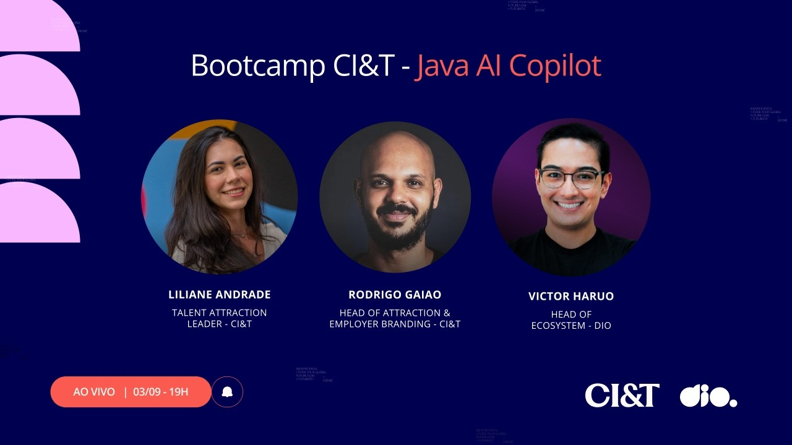

<video width="60%" controls>
  <source src="000-Midia_e_Anexos/Live.de.Lançamento.da.Experiência.CI.and.T.mp4" type="video/mp4">
    Seu navegador não suporta vídeo HTML5.
</video>

link: https://web.dio.me/lives/live-de-lancamento-da-experiencia-cit?back=/track/981247ca-6b8a-44b6-9f45-5d904996306a

# Live de Lançamento da Experiência CI&T

  

A live marca o lançamento oficial do **Bootcamp de Java com AI Copilot**, fruto de uma parceria de longa data entre a **DIO** e a **CI&T**. O evento foi mediado por **Haru** (Head de Ecossistema na DIO) e contou com a participação de **Liliane** (Liderança de Talent Attracting na CI&T) e **Rodrigo Gaião** (Líder do Time de Recrutamento e Employer Branding na CI&T).

---

## 1. O Bootcamp de Java com AI Copilot

O bootcamp está em sua terceira edição e busca capacitar profissionais gratuitamente no desenvolvimento de software focado em Java integrado a ferramentas de Inteligência Artificial. 

* **Estrutura do Programa**: Conta com **53 horas de conteúdo**, incluindo **dois desafios de projeto, dois desafios de código** e uma trilha educacional customizada.
* **Adesão**: No momento da live, as inscrições haviam começado na semana anterior e já contavam com **33% das bolsas preenchidas** (mais de 1.600 pessoas inscritas).
* **Benefícios**: O programa é **100% gratuito** do início ao fim e oferece **certificado de conclusão**.

---

## 2. Sobre a CI&T

A CI&T é uma multinacional brasileira que atua como consultoria tecnológica global há **mais de 30 anos**.
* **Presença Global**: Nascida em **Campinas (SP)**, a empresa conta hoje com **8.000 colaboradores** (os *CI&Ters*) e projetos em **mais de 25 países**, com escritórios em locais como Portugal, Reino Unido, Estados Unidos, México e Colômbia.
* **Abordagem de Negócio**: Focada no conceito de *tech integrated*, a empresa trabalha alinhando a evolução tecnológica ao impacto real nos negócios de seus clientes (que passam de 100 no portfólio). Utiliza a metodologia **Lean** como guia de resiliência e adaptação a mudanças.
* **Inteligência Artificial**: Desenvolve soluções de IA do zero e possui parcerias robustas com gigantes de tecnologia, incluindo a **Anthropic**.

---

## 3. Dicas de Carreira e Recrutamento

Os líderes de contratação da CI&T compartilharam orientações fundamentais para profissionais em início de carreira ou em transição de área.

### Erros Comuns ao Buscar a Primeira Vaga:
1. **Currículo Vazio**: Candidatos que apenas indicam a instituição de ensino, sem apresentar detalhes de projetos, interesses ou tecnologias estudadas.
2. **Candidaturas Indiscriminadas**: Inscrever-se para vagas com perfis totalmente diferentes ao mesmo tempo, sem estudar os requisitos de cada posição ou a cultura da empresa.
3. **Uso de Termos Genéricos no LinkedIn**: Utilizar chamadas como "buscando recolocação" no título do perfil em vez de tags específicas das tecnologias de domínio (ex: *Java Developer* ou *AI Engineer*).

### Melhores Práticas para Currículo e LinkedIn:
* **Método STAR**: Organizar a descrição de suas experiências e projetos de forma estruturada: **S**ituação, **T**arefa, **A**ção e **R**esultado. 
* **Evitar "Sopa de Letrinhas"**: Em vez de apenas listar tecnologias sem contexto, o profissional deve **contar a história** de como utilizou a *tech stack* para resolver problemas práticos, destacando o nível de complexidade, escala e impacto alcançados.
* **Manter Contatos Atualizados**: Garantir que e-mail e outras formas de contato direto estejam visíveis no LinkedIn.

### Projetos Práticos vs. Formação Acadêmica:
A formação acadêmica e o diploma superior são importantes e exigidos em modelos tradicionais de entrada como o estágio. No entanto, **o peso de projetos práticos aplicados (GitHub, bootcamps, desafios e soluções pessoais) pode ser maior do que a própria formação técnica** para fins de avaliação de recrutamento. Os recrutadores buscam avaliar como o candidato processa e aplica os conhecimentos que adquire.

---

## 4. O Impacto e o Uso da Inteligência Artificial

A Inteligência Artificial foi um dos pontos centrais de discussão do evento, tanto no mercado de trabalho em geral quanto no processo de recrutamento.

### No Mercado de Trabalho:
Estima-se a criação de **170 milhões de novas funções até 2030** impulsionadas por IA, com profissionais que dominam essas ferramentas recebendo, em média, **50% a mais**.

### O Uso de IA no Processo Seletivo (Dicas de Liliane):
* **Uso com Responsabilidade**: A IA pode ajudar a otimizar a escrita de currículos e portfólios, mas o candidato **deve revisar tudo e nunca inventar dados falsos**, pois cada detalhe do currículo e do código será minuciosamente questionado nas entrevistas técnicas.
* **IA como Mentora e Recrutadora**: É possível utilizar ferramentas de linguagem para realizar simulações de entrevistas de emprego, analisar vagas de mercado (*como um hunter personalizável*) e sugerir melhorias estruturais no perfil do LinkedIn.
* **Como a CI&T Avalia o Uso de IA**: A empresa não proíbe ou pune o uso de ferramentas como o Copilot. O foco da avaliação técnica está em **compreender o racional da decisão**. Os avaliadores querem saber *como* o candidato direcionou a IA, as perguntas que fez e como chegou àquela solução, testando suas competências analíticas e de comunicação.

---

## 5. Vagas e Modelo de Trabalho na CI&T

* **Vagas Abertas**: A CI&T conta com **mais de 300 vagas abertas** em diversas áreas como Dados, Java, .NET, Python, Cloud e CRM.
* **Foco em Java**: A tecnologia Java (frequentemente combinada com cloud AWS) continua sendo uma das **principais portas de entrada** de talentos na empresa, devido à robustez necessária para atender a carteira de grandes clientes.
* **Modelo de Trabalho**: As oportunidades, incluindo o programa de formação de estágio (Next Gen), são prioritariamente **remotas**, oferecendo também modelo híbrido para quem reside próximo a Campinas (SP). Algumas vagas específicas vinculadas a restrições de determinados clientes podem exigir atuação presencial.

---

## 6. Lidando com o "Não" e Migração de Carreira

Para quem enfrenta negativas em processos seletivos ou está em transição de carreira, Liliane e Rodrigo aconselham:
* **Evitar a "Caça às Bruxas"**: O "não" depende de muitos fatores, como notas de corte gerais e o contexto do pool de candidatos. Não se deve ficar obcecado por pequenas falhas.
* **Autoavaliação**: Fazer a pergunta sincera: *"Eu me contrataria hoje para essa vaga?"*.
* **Foco na História e na Prática**: Profissionais em transição de carreira (como de QA para Dev) devem utilizar seus projetos de estudo e bootcamps como sua real "experiência de trabalho", sabendo contar com detalhes e segurança a história do desenvolvimento dessas aplicações.

---

## 7. Desafio Final dos Palestrantes

No encerramento da transmissão, os convidados desafiaram a comunidade com tarefas práticas para impulsionar sua empregabilidade:

1. **Inscrição**: Garantir a inscrição e participação ativa no bootcamp da DIO com a CI&T.
2. **Projetos no GitHub**: Criar de **dois a três projetos práticos** no repositório pessoal.
3. **Storytelling no LinkedIn**: Publicar e compartilhar o aprendizado desses projetos no LinkedIn, aplicando as dicas de estruturação STAR e contando a história do processo de criação.
4. **Parceria com IA**: Construir esses projetos utilizando o apoio de algum agente de Inteligência Artificial e **escrever sobre como foi essa experiência de colaboração com a IA**.

