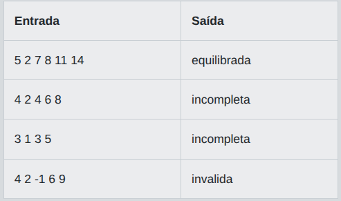
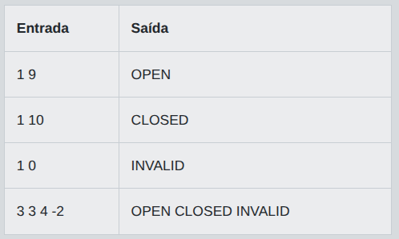

# Desafio 01 - Sequência Equilibrada em Java

Em uma maratona de estudos de Java, a Academia Loop and If criou um painel que avalia sequencias digitadas pelos novatos. Cada participante envia varios numeros inteiros, e o painel precisa decidir rapidamente se a sequencia foi equilibrada. Uma sequencia sera considerada equilibrada quando contiver pelo menos um numero par, pelo menos um numero impar e nenhum valor negativo. Como o painel sera usado em desafios introdutorios, a verificacao deve ser simples, direta e feita com condicionais e laços.

Sua tarefa e ler uma quantidade informada de valores e analisar a lista completa. Se todos os numeros forem maiores ou iguais a zero e houver ao menos um par e ao menos um impar, imprima equilibrada. Se existir qualquer numero negativo, imprima invalida. Caso nao haja negativos, mas todos os numeros sejam apenas pares ou apenas impares, imprima incompleta. O problema deve ser resolvido processando os valores em um unico programa, sem depender de arquivos extras ou bibliotecas externas.

## Entrada

A primeira linha contem um inteiro `N`, indicando quantos numeros serao analisados. A segunda linha contem N inteiros separados por espaco. Considere `1 <= N <= 100`.

## Saída

Imprima exatamente uma das tres palavras: `equilibrada`, `invalida` ou `incompleta`, de acordo com a análise da sequência.

## Exemplos

A tabela abaixo apresenta exemplos de entrada e saída:

<p align="center">
  
</p>

## Código Exemplo

```java
import java.util.Scanner;

public class Main {
    public static void main(String[] args) {
        Scanner scanner = new Scanner(System.in);

        int quantidade = scanner.nextInt();

        boolean temPar = false;
        boolean temImpar = false;
        boolean temNegativo = false;

        for (int i = 0; i < quantidade; i++) {
            int numero = scanner.nextInt();

            if (numero < 0) {
                temNegativo = true;
            }

            // TODO: atualize temPar ou temImpar de acordo com a paridade de numero.
            // Dica: use o resto da divisao por 2 para decidir.
        }

        if (temNegativo) {
            System.out.println("invalida");
        } else if (temPar && temImpar) {
            System.out.println("equilibrada");
        } else {
            System.out.println("incompleta");
        }

        scanner.close();
    }
}
```

## Solução

```java
import java.util.Scanner;

public class Main {
    public static void main(String[] args) {
        Scanner scanner = new Scanner(System.in);

        int quantidade = scanner.nextInt();

        boolean temPar = false;
        boolean temImpar = false;
        boolean temNegativo = false;

        for (int i = 0; i < quantidade; i++) {
            int numero = scanner.nextInt();

            if (numero < 0) {
                temNegativo = true;
            }
            if (numero % 2 == 0) {
                temPar = true;
            } else {
                temImpar = true;
            }
        }

        if (temNegativo) {
            System.out.println("invalida");
        } else if (temPar && temImpar) {
            System.out.println("equilibrada");
        } else {
            System.out.println("incompleta");
        }

        scanner.close();
    }
}
``` 

# Desafio 02 - Portal Divisível Por 3 em Java

Na Academia dos Desafios de Codigo, cada aprendiz precisa atravessar um corredor de portais numerados. Um portal so se abre quando o numero informado segue uma regra simples de treinamento: ele deve ser positivo e divisivel por 3. O mestre quer um verificador automatico para analisar varios portais em sequencia e registrar o resultado de cada tentativa.

Implemente um programa que leia uma quantidade de testes e, para cada numero recebido, decida qual mensagem deve ser exibida. Se o numero for menor ou igual a zero, a tentativa e invalida. Se for positivo e divisivel por 3, o portal abre. Caso contrario, o portal permanece fechado. Esse desafio foi criado para praticar condicionais e lacos, portanto a solucao deve processar todos os casos usando repeticao e decisoes simples. Cada resultado deve ser produzido de forma independente, na mesma ordem em que os numeros forem lidos.


## Entrada

A primeira linha contem um inteiro N, indicando quantas tentativas serao analisadas. Nas N linhas seguintes, ha um inteiro X por linha, representando o numero digitado em um portal.

## Saída

Para cada tentativa, imprima uma linha. Use exatamente `INVALID` se X for menor ou igual a zero, `OPEN` se X for positivo e divisivel por 3, ou `CLOSED` nos demais casos.

## Exemplos

A tabela abaixo apresenta exemplos de entrada e saída:

<p align="center">
  
</p>

## Código Exemplo

```java
import java.util.Scanner;

public class Main {
    public static void main(String[] args) {
        Scanner scanner = new Scanner(System.in);

        int totalTentativas = scanner.nextInt();
        StringBuilder resultado = new StringBuilder();

        for (int i = 0; i < totalTentativas; i++) {
            int numeroPortal = scanner.nextInt();

            if (numeroPortal <= 0) {
                resultado.append("INVALID");
            } else {
                // TODO: se o numero for divisivel por 3, adicione "OPEN";
                // caso contrario, adicione "CLOSED".
            }

            if (i < totalTentativas - 1) {
                resultado.append('\n');
            }
        }

        System.out.print(resultado);
        scanner.close();
    }
}
```

## Solução

```java
import java.util.Scanner;

public class Main {
    public static void main(String[] args) {
        Scanner scanner = new Scanner(System.in);

        int totalTentativas = scanner.nextInt();
        StringBuilder resultado = new StringBuilder();

        for (int i = 0; i < totalTentativas; i++) {
            int numeroPortal = scanner.nextInt();

            if (numeroPortal <= 0) {
                resultado.append("INVALID");
            } else {
                // TODO: se o numero for divisivel por 3, adicione "OPEN";
                // caso contrario, adicione "CLOSED".
                // ---------- INICIO DA SOLUÇÃO DO DESAFIO
                if (numeroPortal % 3 == 0) {    // <-- Se o numero for divisivel por 3 (Modulo de 3 é igual a 0?)
                    resultado.append("OPEN");   // SIM : adicione "OPEN"
                } else {                        // Caso contrário
                    resultado.append("CLOSED"); // NÃO : adicione "CLOSED"
                }
                // ---------- FIM DA SOLUÇÃO DO DESAFIO
            }

            if (i < totalTentativas - 1) {
                resultado.append(' ');          // <-- Aqui deverá ser alterado!
            }
        }

        System.out.print(resultado);
        scanner.close();
    }
}
``` 
