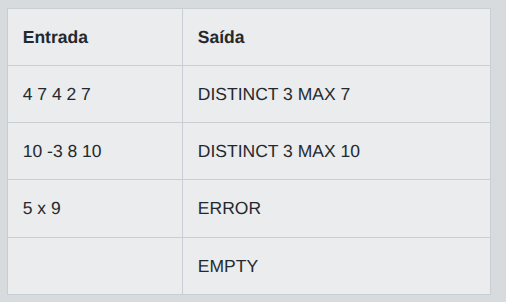
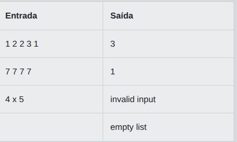

# Desafio 01 - Distinct Integers and Exception Handling in Java

Na Academia dos Coletores de Codigo, cada aprendiz recebe uma linha com codigos de artefatos separados por espaco. O mestre quer testar se voce sabe organizar uma colecao e lidar com falhas de leitura sem interromper a missao. Sua tarefa e analisar os codigos e produzir um pequeno relatorio final.

Implemente um programa que leia uma unica linha. Cada item deve ser interpretado como um numero inteiro. Considere que a colecao valida deve guardar apenas valores distintos, ignorando repeticoes. Se todos os itens forem inteiros validos, informe quantos valores distintos existem e qual e o maior deles. Se algum item nao puder ser convertido para inteiro, trate a situacao como erro de formato. Se a linha estiver vazia ou contiver apenas espacos, trate como colecao vazia. O objetivo do desafio e praticar o uso de collections para armazenar elementos unicos e o tratamento de excecoes durante a conversao de texto para numero. Nao use bibliotecas externas. Uma solucao simples em um unico arquivo e suficiente.

## Entrada

A entrada contem uma unica linha. Ela pode estar vazia, conter apenas espacos ou conter uma sequencia de tokens separados por um ou mais espacos. Cada token representa um possivel numero inteiro com sinal opcional.

## Saída

Se a linha estiver vazia ou tiver apenas espacos, imprima EMPTY. Se existir algum token invalido, imprima ERROR. Caso contrario, imprima DISTINCT X MAX Y, onde X e a quantidade de valores distintos e Y e o maior valor presente.

## Exemplos

A tabela abaixo apresenta exemplos de entrada e saída:

<p align="center">
  
</p>

## Código Exemplo

```java
import java.util.HashSet;
import java.util.Scanner;
import java.util.Set;

public class Main {
    public static void main(String[] args) {
        Scanner scanner = new Scanner(System.in);

        String line = scanner.hasNextLine() ? scanner.nextLine() : "";

        if (line.trim().isEmpty()) {
            System.out.println("EMPTY");
            return;
        }

        String[] tokens = line.trim().split("\\s+");
        Set<Integer> distinctValues = new HashSet<>();
        int maxValue = Integer.MIN_VALUE;

        try {
            for (String token : tokens) {
                // TODO: converta o token para inteiro e armazene em "value".
                int value = 0;

                distinctValues.add(value);

                if (value > maxValue) {
                    maxValue = value;
                }
            }

            System.out.println("DISTINCT " + distinctValues.size() + " MAX " + maxValue);
        } catch (NumberFormatException exception) {
            // Se algum token nao for inteiro valido, a saida deve ser ERROR.
            System.out.println("ERROR");
        }
    }
}
```

## Solução

```java
import java.util.HashSet;
import java.util.Scanner;
import java.util.Set;

public class Main {
    public static void main(String[] args) {
        Scanner scanner = new Scanner(System.in);

        String line = scanner.hasNextLine() ? scanner.nextLine() : "";

        if (line.trim().isEmpty()) {
            System.out.println("EMPTY");
            return;
        }

        String[] tokens = line.trim().split("\\s+");
        Set<Integer> distinctValues = new HashSet<>();
        int maxValue = Integer.MIN_VALUE;

        try {
            for (String token : tokens) {
                // Converte o token para inteiro lançando NumberFormatException se for inválido
                int value = Integer.parseInt(token);

                distinctValues.add(value);

                if (value > maxValue) {
                    maxValue = value;
                }
            }

            System.out.println("DISTINCT " + distinctValues.size() + " MAX " + maxValue);
        } catch (NumberFormatException exception) {
            // Se algum token não for inteiro válido, a saída deve ser ERROR.
            System.out.println("ERROR");
        }
    }
}
``` 

# Desafio 02 - Java Collections: Contando Valores Distintos

Em uma maratona de estudos de Java, a Arena Byte organiza pequenos duelos de codigo. Cada participante envia uma lista de identificadores de artefatos separados por espaco. O sistema da arena precisa montar uma colecao sem repeticoes para registrar quantos artefatos validos apareceram. Porem, alguns envios chegam corrompidos e podem causar falhas de leitura.

Implemente um programa que leia uma unica linha. Cada item deve ser interpretado como um numero inteiro. Use uma colecao para contar apenas valores distintos. Se todos os itens forem inteiros validos, exiba a quantidade de numeros diferentes encontrados. Se existir pelo menos um item que nao possa ser convertido para inteiro, trate a situacao como erro de conversao e exiba `invalid input`. Se a linha estiver vazia ou contiver apenas espacos, exiba `empty list`. O problema foi pensado para praticar Collections e tratamento de excecoes em Java, mas a logica deve funcionar em qualquer linguagem sem bibliotecas externas.

## Entrada

A entrada contem uma unica linha. Nessa linha, ha zero ou mais tokens separados por um ou mais espacos. Cada token representa um valor que deve ser convertido para inteiro.

## Saída

Se a linha estiver vazia ou tiver apenas espacos, imprima `empty list`. Se algum token for invalido para conversao em inteiro, imprima `invalid input`. Caso contrario, imprima um unico inteiro representando a quantidade de valores distintos presentes na linha.

## Exemplos

A tabela abaixo apresenta exemplos de entrada e saída:

<p align="center">
  
</p>

## Código Exemplo

```java
import java.io.BufferedReader;
import java.io.IOException;
import java.io.InputStreamReader;
import java.util.HashSet;
import java.util.Set;

public class Main {
    public static void main(String[] args) throws IOException {
        BufferedReader reader = new BufferedReader(new InputStreamReader(System.in));
        String line = reader.readLine();

        if (line == null || line.trim().isEmpty()) {
            System.out.println("empty list");
            return;
        }

        String[] tokens = line.trim().split("\\s+");
        Set<Integer> distinctNumbers = new HashSet<>();

        try {
            for (String token : tokens) {
                // TODO: converta o token para inteiro e adicione na colecao de valores distintos
            }

            System.out.println(distinctNumbers.size());
        } catch (NumberFormatException exception) {
            // Se algum token nao puder ser convertido, a saida deve indicar entrada invalida.
            System.out.println("invalid input");
        }
    }
}
```

## Solução

```java
import java.io.BufferedReader;
import java.io.IOException;
import java.io.InputStreamReader;
import java.util.HashSet;
import java.util.Set;

public class Main {
    public static void main(String[] args) throws IOException {
        BufferedReader reader = new BufferedReader(new InputStreamReader(System.in));
        String line = reader.readLine();

        if (line == null || line.trim().isEmpty()) {
            System.out.println("empty list");
            return;
        }

        String[] tokens = line.trim().split("\\s+");
        Set<Integer> distinctNumbers = new HashSet<>();

        try {
            for (String token : tokens) {
                // Converte o token para inteiro e adiciona no Set
                distinctNumbers.add(Integer.parseInt(token));
            }

            System.out.println(distinctNumbers.size());
        } catch (NumberFormatException exception) {
            // Se algum token não puder ser convertido, a saída deve indicar entrada inválida.
            System.out.println("invalid input");
        }
    }
}
``` 
