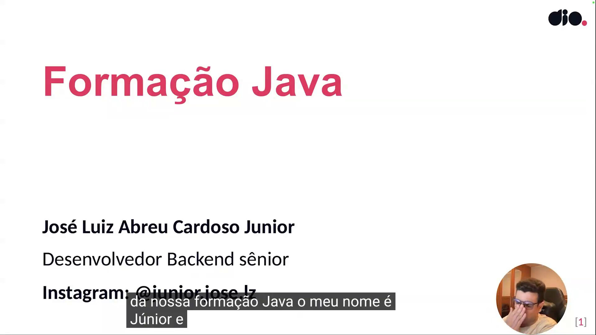
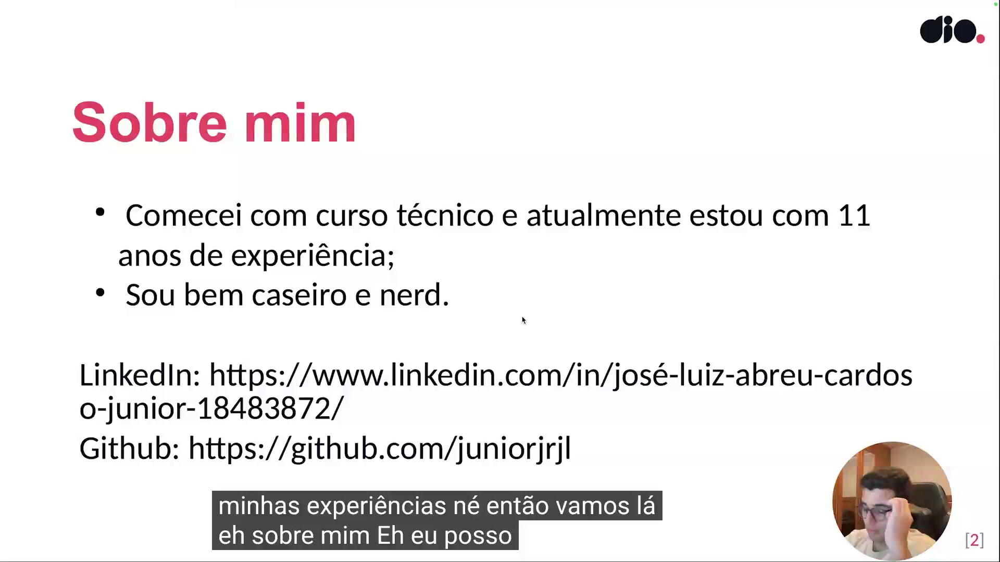
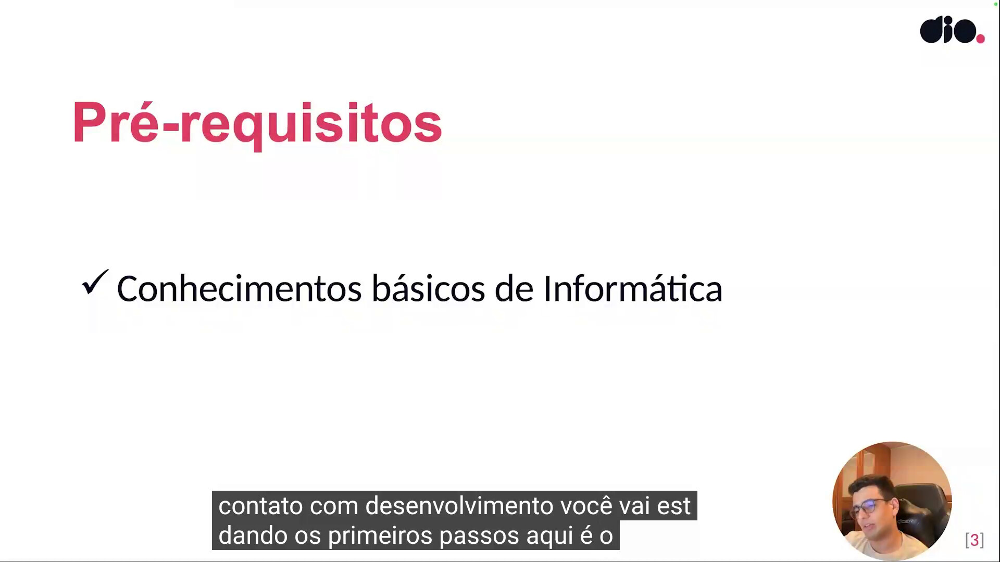
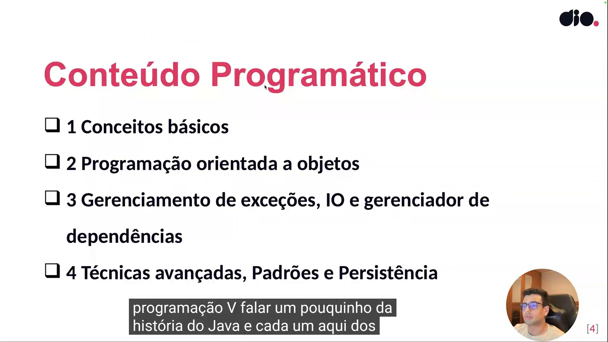

## Instrutor

- José Luiz Abreu Cardoso Junior (Engenheiro de software sênior)
- Contato Linkedin: / [juniorjrjl](https://www.linkedin.com/in/juniorjrjl/)

## Parte 1 - Introdução

### 🟩 Vídeo 01 - Apresentação

<video width="60%" controls>
  <source src="000-Midia_e_Anexos/fundamentos_da_linguagem_de_programacao_java-modulo.01-curso.01-video_01.webm" type="video/webm">
    Seu navegador não suporta vídeo HTML5.
</video>

link do vídeo: https://web.dio.me/track/formacao-java-fundamentals/course/introducao-ao-java-e-seu-ambiente-de-desenvolvimento/learning/39929cc1-4395-40e5-b8dd-64a57631240f?autoplay=1

### Anotações

  

Slide de abertura da aula, intitulado **"Formação Java"**. Apresenta o instrutor José Luiz Abreu Cardoso Junior, identificado como Desenvolvedor Backend sênior, junto com seu usuário do Instagram (@junior.jose.lz) para contato. É o slide de boas-vindas exibido no momento em que o instrutor se apresenta e conta um pouco sobre sua trajetória profissional.

  

Slide **"Sobre mim"**, com dois pontos de destaque: o início da carreira por meio de um curso técnico, somando atualmente 11 anos de experiência na área, e um traço pessoal ("bem caseiro e nerd"). O slide também disponibiliza os links de contato profissional do instrutor no LinkedIn e no GitHub, reforçando o convite feito anteriormente para que os alunos o conheçam melhor e mantenham contato.

  

Slide **"Pré-requisitos"**, indicando que o único requisito para acompanhar a formação são conhecimentos básicos de informática. Esse slide marca a transição da apresentação pessoal do instrutor para a explicação da estrutura do curso, sinalizando aos alunos que não é necessário conhecimento prévio de programação para iniciar.

  

Slide **"Conteúdo Programático"**, que organiza a formação em quatro blocos progressivos:
1. Conceitos básicos
2. Programação orientada a objetos
3. Gerenciamento de exceções, IO e gerenciador de dependências
4. Técnicas avançadas, Padrões e Persistência

Essa estrutura apresenta a trilha de aprendizado que será seguida ao longo do curso, partindo dos fundamentos da linguagem até chegar a tópicos mais avançados, como padrões de projeto e persistência de dados.
   

### 🟩 Vídeo 02 - História e evolução do Java

<video width="60%" controls>
  <source src="000-Midia_e_Anexos/fundamentos_da_linguagem_de_programacao_java-modulo.01-curso.01-video_02.webm" type="video/webm">
    Seu navegador não suporta vídeo HTML5.
</video>

link do vídeo: https://web.dio.me/track/formacao-java-fundamentals/course/introducao-ao-java-e-seu-ambiente-de-desenvolvimento/learning/42f5af14-9b5c-457e-bffa-af2509b520be?autoplay=1

### Anotações

      

## Parte 2 - Configuração do Ambiente Java

### 🟩 Vídeo 03 - Opção 1: Instalando o JDK Oracle pelo instalador no Windows

<video width="60%" controls>
  <source src="000-Midia_e_Anexos/fundamentos_da_linguagem_de_programacao_java-modulo.01-curso.01-video_03.webm" type="video/webm">
    Seu navegador não suporta vídeo HTML5.
</video>

link do vídeo:

### 🟩 Vídeo 04 - Opção 2: Instalando o JDK Amazon Corretto pelo terminal no Linux

<video width="60%" controls>
  <source src="000-Midia_e_Anexos/fundamentos_da_linguagem_de_programacao_java-modulo.01-curso.01-video_04.webm" type="video/webm">
    Seu navegador não suporta vídeo HTML5.
</video>

link do vídeo:

### 🟩 Vídeo 05 - Opção 3: Instalando o JDK pelo gerenciador de versões SDKMAN! no Linux

<video width="60%" controls>
  <source src="000-Midia_e_Anexos/fundamentos_da_linguagem_de_programacao_java-modulo.01-curso.01-video_05.webm" type="video/webm">
    Seu navegador não suporta vídeo HTML5.
</video>

link do vídeo:

## Parte 3 - Gerenciadores de Build

### 🟩 Vídeo 06 - Instalando o Maven

<video width="60%" controls>
  <source src="000-Midia_e_Anexos/fundamentos_da_linguagem_de_programacao_java-modulo.01-curso.01-video_06.webm" type="video/webm">
    Seu navegador não suporta vídeo HTML5.
</video>

link do vídeo:

### 🟩 Vídeo 07 - Instalando o Gradle

<video width="60%" controls>
  <source src="000-Midia_e_Anexos/fundamentos_da_linguagem_de_programacao_java-modulo.01-curso.01-video_07.webm" type="video/webm">
    Seu navegador não suporta vídeo HTML5.
</video>

link do vídeo:

## Parte 4 - Instalação de IDEs e Execução do seu Primeiro Programa Java

### 🟩 Vídeo 08 - Instalando Eclipse

<video width="60%" controls>
  <source src="000-Midia_e_Anexos/fundamentos_da_linguagem_de_programacao_java-modulo.01-curso.01-video_08.webm" type="video/webm">
    Seu navegador não suporta vídeo HTML5.
</video>

link do vídeo:

### 🟩 Vídeo 09 - Instalando VSCode

<video width="60%" controls>
  <source src="000-Midia_e_Anexos/fundamentos_da_linguagem_de_programacao_java-modulo.01-curso.01-video_09.webm" type="video/webm">
    Seu navegador não suporta vídeo HTML5.
</video>

link do vídeo:

### 🟩 Vídeo 10 - Instalando IntelliJ

<video width="60%" controls>
  <source src="000-Midia_e_Anexos/fundamentos_da_linguagem_de_programacao_java-modulo.01-curso.01-video_10.webm" type="video/webm">
    Seu navegador não suporta vídeo HTML5.
</video>

link do vídeo:

### 🟩 Vídeo 11 - Executando primeiro programa no IntelliJ

<video width="60%" controls>
  <source src="000-Midia_e_Anexos/fundamentos_da_linguagem_de_programacao_java-modulo.01-curso.01-video_11.webm" type="video/webm">
    Seu navegador não suporta vídeo HTML5.
</video>

link do vídeo:

### 🟩 Vídeo 12 - Executando primeiro programa no VSCode

<video width="60%" controls>
  <source src="000-Midia_e_Anexos/fundamentos_da_linguagem_de_programacao_java-modulo.01-curso.01-video_12.webm" type="video/webm">
    Seu navegador não suporta vídeo HTML5.
</video>

link do vídeo:

##  Materiais de Apoio

# Certificado: 

- Link na plataforma: 
- Certificado em pdf: