## Instrutor

- José Luiz Abreu Cardoso Junior (Engenheiro de software sênior)
- Contato Linkedin: / [juniorjrjl](https://www.linkedin.com/in/juniorjrjl/)

## Parte 1 - Introdução

### 🟩 Vídeo 01 - Apresentação

<video width="60%" controls>
  <source src="000-Midia_e_Anexos/fundamentos_da_linguagem_de_programacao_java-modulo.01-curso.01-video_01.webm" type="video/webm">
    Seu navegador não suporta vídeo HTML5.
</video>

link do vídeo: https://web.dio.me/track/formacao-java-fundamentals/course/introducao-ao-java-e-seu-ambiente-de-desenvolvimento/learning/39929cc1-4395-40e5-b8dd-64a57631240f?autoplay=1

### Anotações

<p align="center">
  
</p>

Slide de abertura da aula, intitulado **"Formação Java"**. Apresenta o instrutor José Luiz Abreu Cardoso Junior, identificado como Desenvolvedor Backend sênior, junto com seu usuário do Instagram (@junior.jose.lz) para contato. É o slide de boas-vindas exibido no momento em que o instrutor se apresenta e conta um pouco sobre sua trajetória profissional.

<p align="center">
  
</p>

Slide **"Sobre mim"**, com dois pontos de destaque: o início da carreira por meio de um curso técnico, somando atualmente 11 anos de experiência na área, e um traço pessoal ("bem caseiro e nerd"). O slide também disponibiliza os links de contato profissional do instrutor no LinkedIn e no GitHub, reforçando o convite feito anteriormente para que os alunos o conheçam melhor e mantenham contato.

<p align="center">
  
</p>

Slide **"Pré-requisitos"**, indicando que o único requisito para acompanhar a formação são conhecimentos básicos de informática. Esse slide marca a transição da apresentação pessoal do instrutor para a explicação da estrutura do curso, sinalizando aos alunos que não é necessário conhecimento prévio de programação para iniciar.

<p align="center">
  
</p>

Slide **"Conteúdo Programático"**, que organiza a formação em quatro blocos progressivos:
1. Conceitos básicos
2. Programação orientada a objetos
3. Gerenciamento de exceções, IO e gerenciador de dependências
4. Técnicas avançadas, Padrões e Persistência

Essa estrutura apresenta a trilha de aprendizado que será seguida ao longo do curso, partindo dos fundamentos da linguagem até chegar a tópicos mais avançados, como padrões de projeto e persistência de dados.
   

### 🟩 Vídeo 02 - História e evolução do Java

<video width="60%" controls>
  <source src="000-Midia_e_Anexos/fundamentos_da_linguagem_de_programacao_java-modulo.01-curso.01-video_02.webm" type="video/webm">
    Seu navegador não suporta vídeo HTML5.
</video>

link do vídeo: https://web.dio.me/track/formacao-java-fundamentals/course/introducao-ao-java-e-seu-ambiente-de-desenvolvimento/learning/42f5af14-9b5c-457e-bffa-af2509b520be?autoplay=1

### Anotações

#### Abertura: História do Java

<p align="center">
  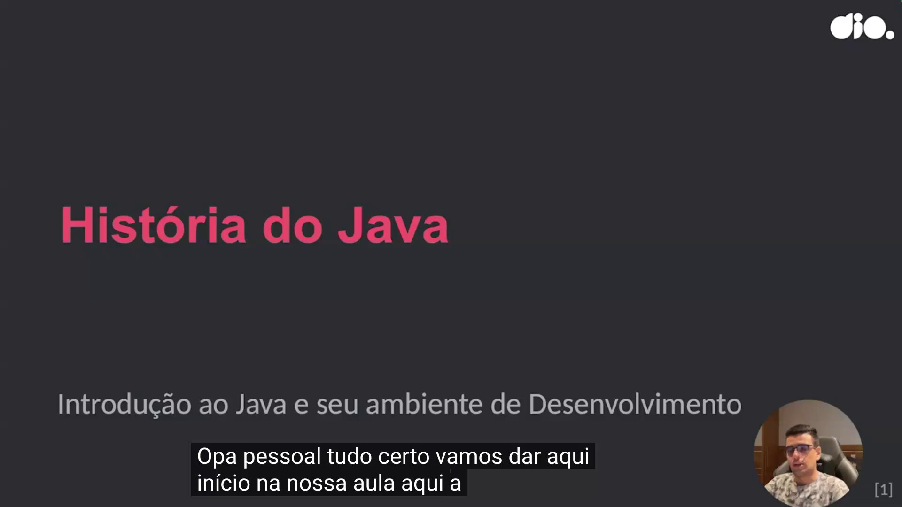
</p>

Slide de abertura da aula, apresentando o tema "História do Java" com o subtítulo "Introdução ao Java e seu ambiente de Desenvolvimento". Este slide marca o início da apresentação, que se propõe a contar a trajetória do surgimento do Java e sua relevância ao longo do tempo.

#### O surgimento do Green Team (1991)

<p align="center">
  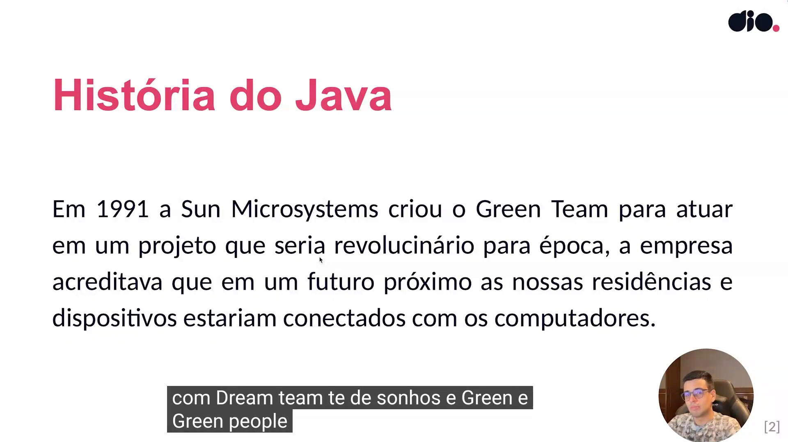
</p>

Em 1991, a Sun Microsystems formou o Green Team para atuar em um projeto considerado revolucionário para a época. O nome do time era um trocadilho com "Dream Team" (time dos sonhos) e "Green People" (as pessoas do projeto Green). A empresa apostava que, em um futuro próximo, residências e dispositivos estariam conectados a computadores — uma visão que hoje se aproxima do conceito de automação residencial e casas inteligentes.

#### O primeiro desafio: uma linguagem independente de sistema operacional

<p align="center">
  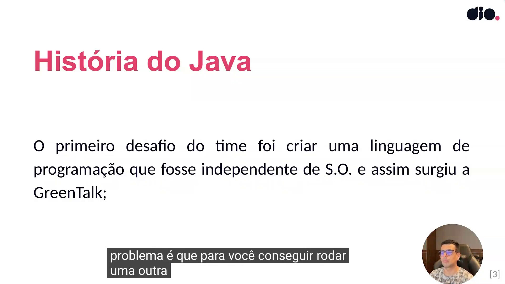
</p>

O primeiro desafio do Green Team foi criar uma linguagem de programação independente de sistema operacional (S.O.). Isso era necessário porque o time precisaria fazer diferentes dispositivos, com sistemas distintos, se comunicarem entre si — algo que soluções da época, como o C++, não resolviam de forma satisfatória, já que exigiam ajustes específicos para cada plataforma. Dessa necessidade surgiu a linguagem **GreenTalk**.

#### O StarSeven (*7): o primeiro produto do projeto

<p align="center">
  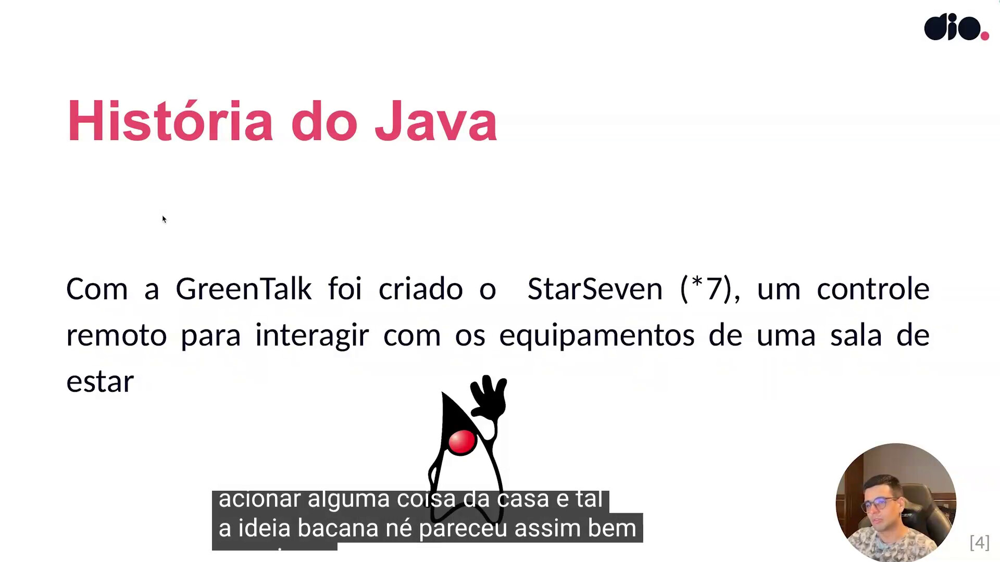
</p>

Com a linguagem GreenTalk pronta, o time desenvolveu o **StarSeven (*7)**, um controle remoto criado para interagir com os equipamentos de uma sala de estar, permitindo acionar dispositivos da casa. É nesse produto que aparece pela primeira vez o mascote **Duke**, que anos depois se tornaria o símbolo oficial do Java. A ideia era promissora para a época, mas o mercado não se entusiasmou com a proposta.

#### 1994: a chegada da internet e o navegador WebRunner

<p align="center">
  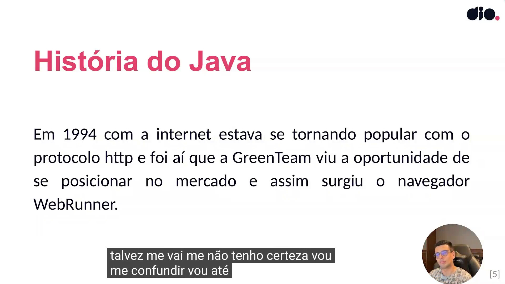
</p>

Em 1994, com a popularização da internet e do protocolo HTTP, o Green Team enxergou uma nova oportunidade de mercado. Foi nesse contexto que surgiu o navegador **WebRunner**, criado para explorar esse momento de crescimento da web.

#### Demonstração prática: HotJava e um Applet interativo

<p align="center">
  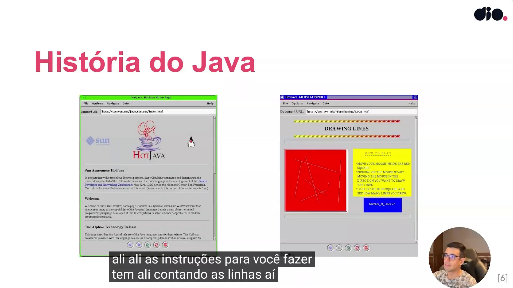
</p>

A imagem mostra duas janelas de navegador lado a lado. À esquerda, a página inicial do navegador **HotJava**; à direita, um exemplo de **Applet** em execução — um pequeno programa interativo que permite desenhar linhas dentro de um quadrado vermelho, contando o número de linhas desenhadas em um painel ao lado. Essa era uma demonstração do que o navegador conseguia oferecer além das páginas HTML estáticas comuns na época: conteúdo interativo rodando diretamente no navegador.

#### 1996: o lançamento do JDK

<p align="center">
  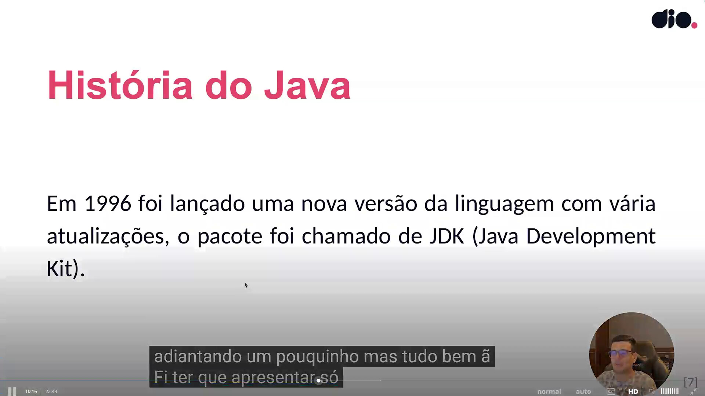
</p>

Em 1996 foi lançada uma nova versão da linguagem com diversas atualizações, reunidas em um pacote chamado **JDK (Java Development Kit)**, o kit de desenvolvimento voltado para a comunidade utilizar a linguagem.

#### Roadmap de versões: dos primeiros lançamentos ao JDK 7

<p align="center">
  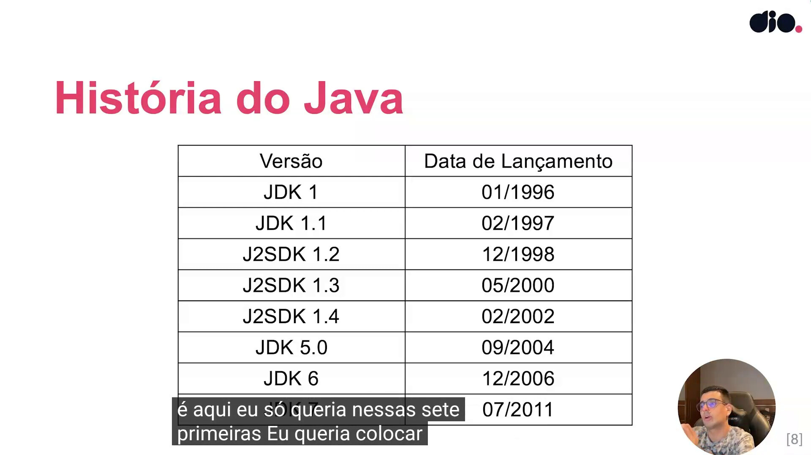
</p>

Tabela com as sete primeiras versões do Java e suas respectivas datas de lançamento:

| Versão | Data de Lançamento |
|---|---|
| JDK 1 | 01/1996 |
| JDK 1.1 | 02/1997 |
| J2SDK 1.2 | 12/1998 |
| J2SDK 1.3 | 05/2000 |
| J2SDK 1.4 | 02/2002 |
| JDK 5.0 | 09/2004 |
| JDK 6 | 12/2006 |
| JDK 7 | 07/2011 |

Nessas primeiras versões, o intervalo entre um lançamento e outro era relativamente curto, mostrando um ritmo acelerado de evolução da linguagem nesse período inicial.

#### Roadmap de versões: o modelo LTS a partir do JDK 8

<p align="center">
  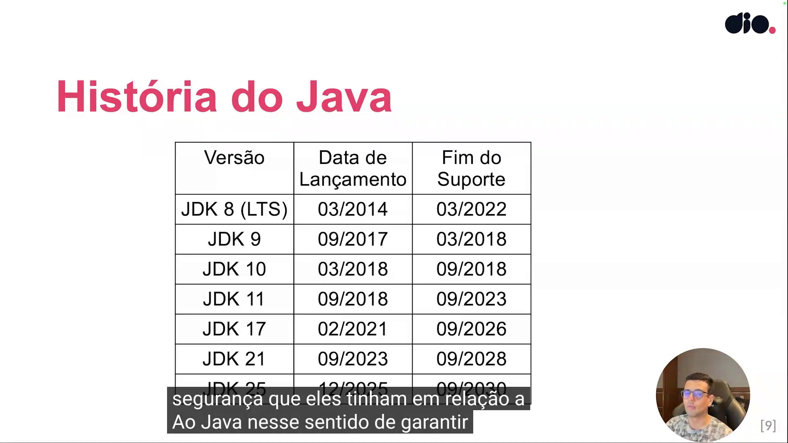
</p>

Tabela com versões mais recentes do Java, incluindo a data de lançamento e o fim do suporte de cada uma:

| Versão | Data de Lançamento | Fim do Suporte |
|---|---|---|
| JDK 8 (LTS) | 03/2014 | 03/2022 |
| JDK 9 | 09/2017 | 03/2018 |
| JDK 10 | 03/2018 | 09/2018 |
| JDK 11 | 09/2018 | 09/2023 |
| JDK 17 | 02/2021 | 09/2026 |
| JDK 21 | 09/2023 | 09/2028 |
| JDK 25 | 12/2025 | 09/2030 |

A partir do JDK 8, o Java passou a garantir maior robustez, estabilidade e segurança em relação à compatibilidade entre versões, refletindo a adoção do modelo de versões **LTS (Long-Term Support)**, com suporte estendido por mais tempo.

#### Empresas que usam Java

<p align="center">
  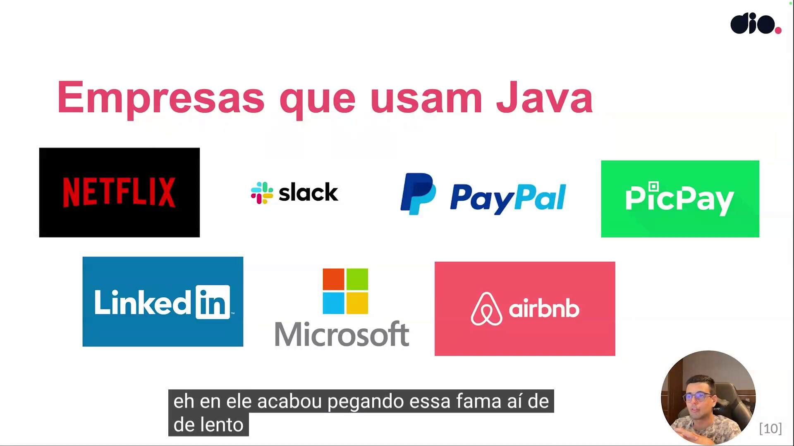
</p>

Slide com os logotipos de grandes empresas que utilizam Java em seus sistemas: **Netflix, Slack, PayPal, PicPay, LinkedIn, Microsoft e Airbnb**. Esse conjunto de exemplos reforça que, apesar da fama de "linguagem lenta" que o Java carregou por conta de problemas pontuais em versões antigas, ele segue sendo amplamente utilizado por empresas de grande porte e alta exigência técnica.

#### Referências da apresentação

<p align="center">
  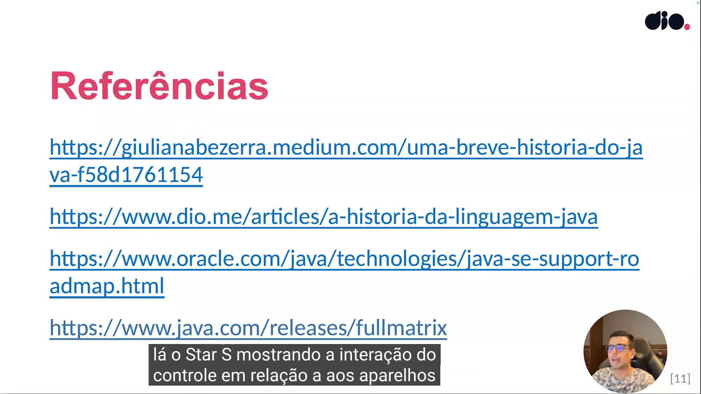
</p>

Slide final com as referências utilizadas na construção da apresentação, incluindo artigos sobre a história do Java, a página oficial da Oracle com o roadmap de suporte das versões, e a matriz de lançamentos do Java. Um dos links do Medium contém um vídeo mostrando o StarSeven em uso, demonstrando a interação do controle remoto com os aparelhos de uma casa.


## Parte 2 - Configuração do Ambiente Java

### 🟩 Vídeo 03 - Opção 1: Instalando o JDK Oracle pelo instalador no Windows

<video width="60%" controls>
  <source src="000-Midia_e_Anexos/fundamentos_da_linguagem_de_programacao_java-modulo.01-curso.01-video_03.webm" type="video/webm">
    Seu navegador não suporta vídeo HTML5.
</video>

link do vídeo: https://web.dio.me/track/formacao-java-fundamentals/course/introducao-ao-java-e-seu-ambiente-de-desenvolvimento/learning/3dd15fa1-dded-4902-8269-289cd47971ca?autoplay=1

### Anotações

<p align="center">
  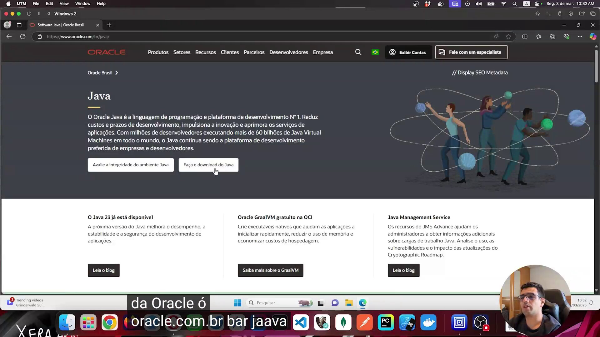
</p>

A imagem mostra a página inicial do Java no site da Oracle (`oracle.com/br/java`), com a apresentação da linguagem e o botão **"Faça o download do Java"** em destaque. É o ponto de partida indicado para obter o instalador oficial, antes de escolher a versão e o sistema operacional desejados.

<p align="center">
  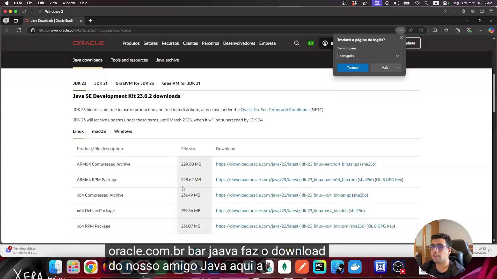
</p>

Aqui já estamos na página de downloads do Java, com as abas **JDK 23**, **JDK 21**, **GraalVM for JDK 23** e **GraalVM for JDK 21**. A tela exibe as opções de sistema operacional (Linux, macOS e Windows), sendo necessário selecionar a versão estável (JDK 21) e o sistema operacional correspondente para prosseguir com o download.

<p align="center">
  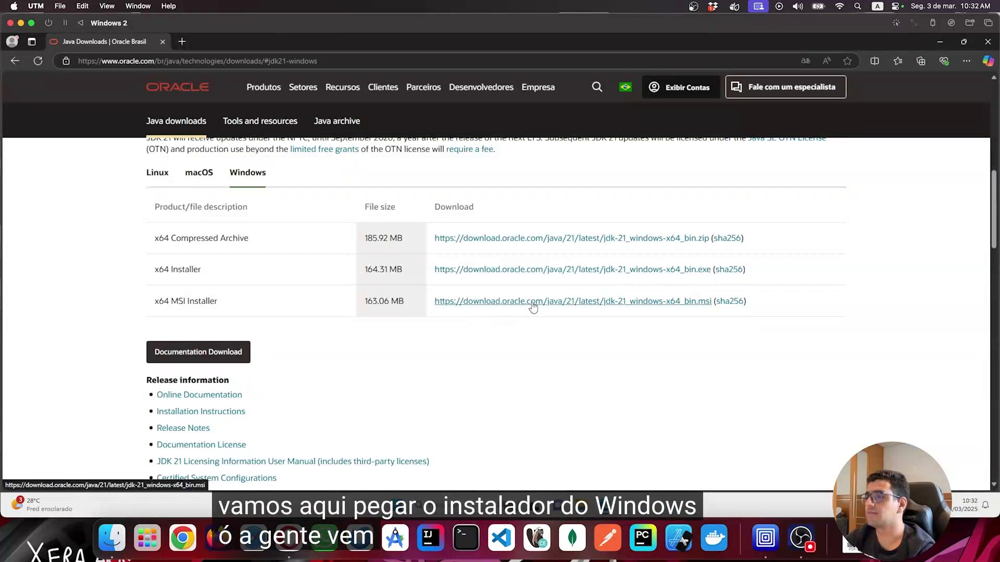
</p>

Com a aba **Windows** selecionada, a tabela apresenta as opções de instalador disponíveis para o JDK 21: **x64 Compressed Archive**, **x64 Installer** e **x64 MSI Installer**, cada uma com seu respectivo tamanho de arquivo e link de download. O instalador (`.exe`) é a opção utilizada para seguir com a instalação guiada no Windows.

<p align="center">
  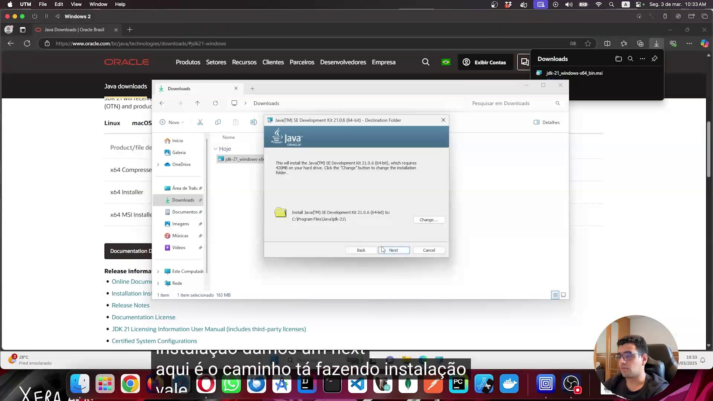
</p>

A tela mostra o assistente de instalação do **Java(TM) SE Development Kit 21.0.6 (64-bit)**, na etapa de definição da pasta de destino. O instalador indica que a instalação ocupará 420 MB e será feita no caminho `C:\Program Files\Java\jdk-21\`, caminho esse que precisa ser lembrado para a configuração posterior das variáveis de ambiente. O próximo passo é clicar em **Next** para dar continuidade ao processo.

<p align="center">
  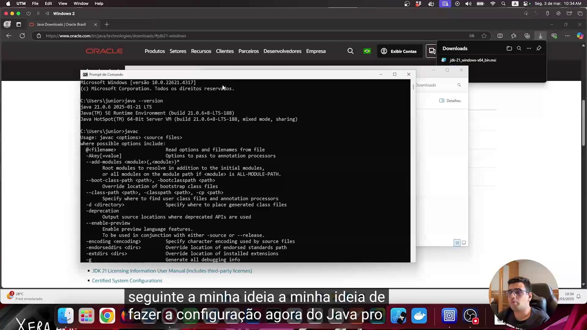
</p>

Após a instalação, o Prompt de Comando confirma que o Java já está reconhecido pelo sistema. O comando `java --version` retorna a versão instalada, e o comando `javac` (compilador Java) também é reconhecido, exibindo suas opções de uso:

```bash
C:\Users\junior>java --version
java 21.0.6 2025-01-21 LTS
Java(TM) SE Runtime Environment (build 21.0.6+8-LTS-188)
Java HotSpot(TM) 64-Bit Server VM (build 21.0.6+8-LTS-188, mixed mode, sharing)

C:\Users\junior>javac
Usage: javac <options> <source files>
where possible options include:
```

<p align="center">
  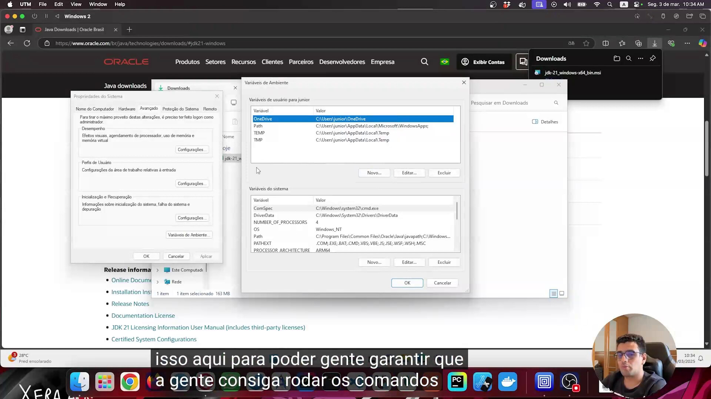
</p>

A imagem mostra a janela **Variáveis de Ambiente** do Windows, acessada através de **Propriedades do Sistema > Avançado > Variáveis de Ambiente**. São exibidas as variáveis de usuário existentes (como `OneDrive`, `Path`, `TEMP` e `TMP`) e as variáveis de sistema (como `ComSpec`, `NUMBER_OF_PROCESSORS` e `OS`). É nessa tela que uma nova variável de usuário será criada para configurar o Java.

<p align="center">
  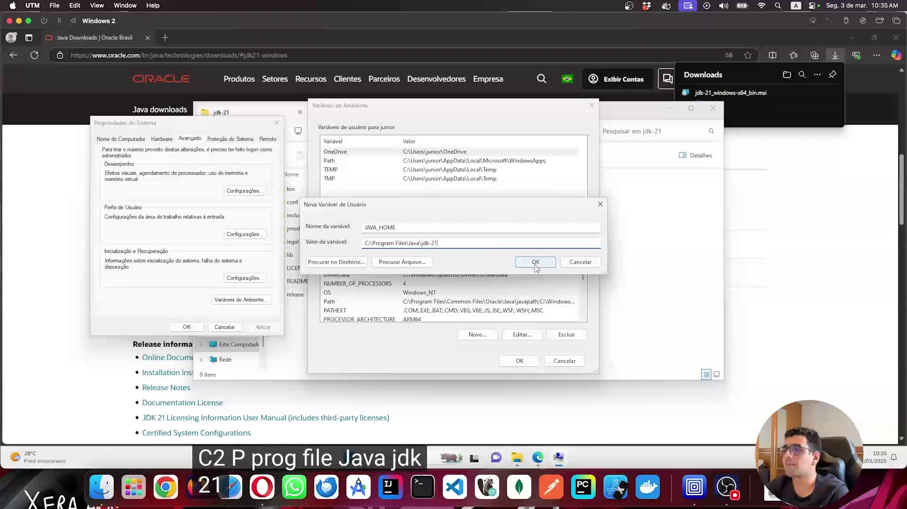
</p>

Na janela **Nova Variável de Usuário**, é criada a variável `JAVA_HOME`, apontando para o caminho onde o JDK foi instalado: `C:\Program Files\Java\jdk-21`. Essa variável servirá de referência para que o sistema localize a instalação do Java, sendo posteriormente também referenciada dentro da variável `Path` (usando `%JAVA_HOME%\bin`) para permitir a execução dos comandos Java a partir de qualquer diretório do terminal.

<p align="center">
  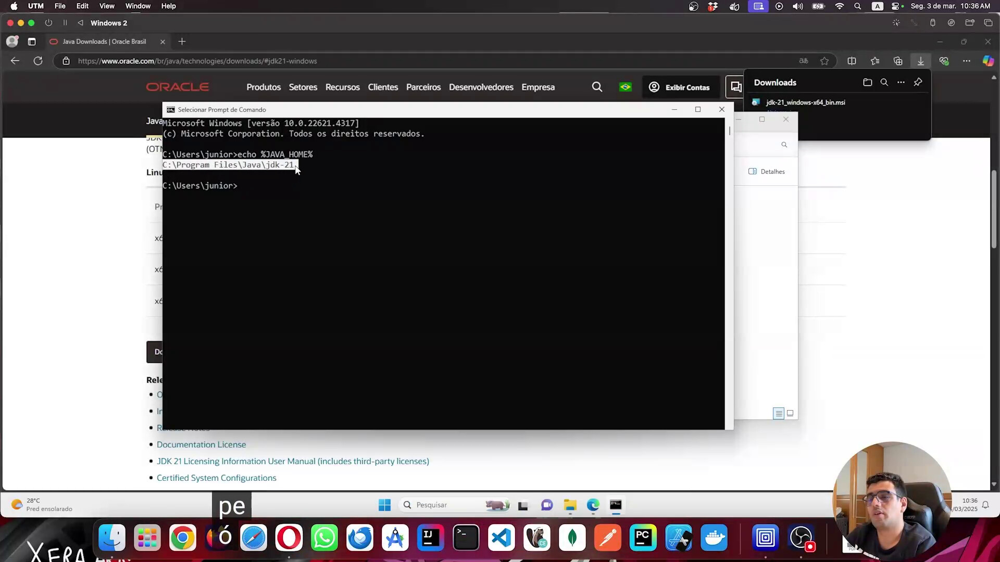
</p>

Por fim, o Prompt de Comando confirma que a variável `JAVA_HOME` foi configurada corretamente, exibindo o caminho da instalação ao ser consultada:

```bash
C:\Users\junior>echo %JAVA_HOME%
C:\Program Files\Java\jdk-21
```

Esse resultado valida que a configuração das variáveis de ambiente foi concluída com sucesso, permitindo o uso dos comandos do Java a partir de qualquer diretório no terminal do Windows.


### 🟩 Vídeo 04 - Opção 2: Instalando o JDK Amazon Corretto pelo terminal no Linux

<video width="60%" controls>
  <source src="000-Midia_e_Anexos/fundamentos_da_linguagem_de_programacao_java-modulo.01-curso.01-video_04.webm" type="video/webm">
    Seu navegador não suporta vídeo HTML5.
</video>

link do vídeo: https://web.dio.me/track/formacao-java-fundamentals/course/introducao-ao-java-e-seu-ambiente-de-desenvolvimento/learning/8d0f4a5b-c7dc-4d65-b25f-176921e55246?autoplay=1

### Anotações

      


### 🟩 Vídeo 05 - Opção 3: Instalando o JDK pelo gerenciador de versões SDKMAN! no Linux

<video width="60%" controls>
  <source src="000-Midia_e_Anexos/fundamentos_da_linguagem_de_programacao_java-modulo.01-curso.01-video_05.webm" type="video/webm">
    Seu navegador não suporta vídeo HTML5.
</video>

link do vídeo:

## Parte 3 - Gerenciadores de Build

### 🟩 Vídeo 06 - Instalando o Maven

<video width="60%" controls>
  <source src="000-Midia_e_Anexos/fundamentos_da_linguagem_de_programacao_java-modulo.01-curso.01-video_06.webm" type="video/webm">
    Seu navegador não suporta vídeo HTML5.
</video>

link do vídeo:

### 🟩 Vídeo 07 - Instalando o Gradle

<video width="60%" controls>
  <source src="000-Midia_e_Anexos/fundamentos_da_linguagem_de_programacao_java-modulo.01-curso.01-video_07.webm" type="video/webm">
    Seu navegador não suporta vídeo HTML5.
</video>

link do vídeo:

## Parte 4 - Instalação de IDEs e Execução do seu Primeiro Programa Java

### 🟩 Vídeo 08 - Instalando Eclipse

<video width="60%" controls>
  <source src="000-Midia_e_Anexos/fundamentos_da_linguagem_de_programacao_java-modulo.01-curso.01-video_08.webm" type="video/webm">
    Seu navegador não suporta vídeo HTML5.
</video>

link do vídeo:

### 🟩 Vídeo 09 - Instalando VSCode

<video width="60%" controls>
  <source src="000-Midia_e_Anexos/fundamentos_da_linguagem_de_programacao_java-modulo.01-curso.01-video_09.webm" type="video/webm">
    Seu navegador não suporta vídeo HTML5.
</video>

link do vídeo:

### 🟩 Vídeo 10 - Instalando IntelliJ

<video width="60%" controls>
  <source src="000-Midia_e_Anexos/fundamentos_da_linguagem_de_programacao_java-modulo.01-curso.01-video_10.webm" type="video/webm">
    Seu navegador não suporta vídeo HTML5.
</video>

link do vídeo:

### 🟩 Vídeo 11 - Executando primeiro programa no IntelliJ

<video width="60%" controls>
  <source src="000-Midia_e_Anexos/fundamentos_da_linguagem_de_programacao_java-modulo.01-curso.01-video_11.webm" type="video/webm">
    Seu navegador não suporta vídeo HTML5.
</video>

link do vídeo:

### 🟩 Vídeo 12 - Executando primeiro programa no VSCode

<video width="60%" controls>
  <source src="000-Midia_e_Anexos/fundamentos_da_linguagem_de_programacao_java-modulo.01-curso.01-video_12.webm" type="video/webm">
    Seu navegador não suporta vídeo HTML5.
</video>

link do vídeo:


##  Materiais de Apoio

# Certificado: 

- Link na plataforma: 
- Certificado em pdf: