## Instrutor

- José Luiz Abreu Cardoso Junior (Engenheiro de software sênior)
- Contato Linkedin: / [juniorjrjl](https://www.linkedin.com/in/juniorjrjl/)

## Parte 1 - Introdução

### 🟩 Vídeo 01 - Apresentação

<video width="60%" controls>
  <source src="000-Midia_e_Anexos/fundamentos_da_linguagem_de_programacao_java-modulo.01-curso.01-video_01.webm" type="video/webm">
    Seu navegador não suporta vídeo HTML5.
</video>

link do vídeo: https://web.dio.me/track/formacao-java-fundamentals/course/introducao-ao-java-e-seu-ambiente-de-desenvolvimento/learning/39929cc1-4395-40e5-b8dd-64a57631240f?autoplay=1

### Anotações

<p align="center">
  
</p>

Slide de abertura da aula, intitulado **"Formação Java"**. Apresenta o instrutor José Luiz Abreu Cardoso Junior, identificado como Desenvolvedor Backend sênior, junto com seu usuário do Instagram (@junior.jose.lz) para contato. É o slide de boas-vindas exibido no momento em que o instrutor se apresenta e conta um pouco sobre sua trajetória profissional.

<p align="center">
  
</p>

Slide **"Sobre mim"**, com dois pontos de destaque: o início da carreira por meio de um curso técnico, somando atualmente 11 anos de experiência na área, e um traço pessoal ("bem caseiro e nerd"). O slide também disponibiliza os links de contato profissional do instrutor no LinkedIn e no GitHub, reforçando o convite feito anteriormente para que os alunos o conheçam melhor e mantenham contato.

<p align="center">
  
</p>

Slide **"Pré-requisitos"**, indicando que o único requisito para acompanhar a formação são conhecimentos básicos de informática. Esse slide marca a transição da apresentação pessoal do instrutor para a explicação da estrutura do curso, sinalizando aos alunos que não é necessário conhecimento prévio de programação para iniciar.

<p align="center">
  
</p>

Slide **"Conteúdo Programático"**, que organiza a formação em quatro blocos progressivos:
1. Conceitos básicos
2. Programação orientada a objetos
3. Gerenciamento de exceções, IO e gerenciador de dependências
4. Técnicas avançadas, Padrões e Persistência

Essa estrutura apresenta a trilha de aprendizado que será seguida ao longo do curso, partindo dos fundamentos da linguagem até chegar a tópicos mais avançados, como padrões de projeto e persistência de dados.
   

### 🟩 Vídeo 02 - História e evolução do Java

<video width="60%" controls>
  <source src="000-Midia_e_Anexos/fundamentos_da_linguagem_de_programacao_java-modulo.01-curso.01-video_02.webm" type="video/webm">
    Seu navegador não suporta vídeo HTML5.
</video>

link do vídeo: https://web.dio.me/track/formacao-java-fundamentals/course/introducao-ao-java-e-seu-ambiente-de-desenvolvimento/learning/42f5af14-9b5c-457e-bffa-af2509b520be?autoplay=1

### Anotações

#### Abertura: História do Java

<p align="center">
  
</p>

Slide de abertura da aula, apresentando o tema "História do Java" com o subtítulo "Introdução ao Java e seu ambiente de Desenvolvimento". Este slide marca o início da apresentação, que se propõe a contar a trajetória do surgimento do Java e sua relevância ao longo do tempo.

#### O surgimento do Green Team (1991)

<p align="center">
  
</p>

Em 1991, a Sun Microsystems formou o Green Team para atuar em um projeto considerado revolucionário para a época. O nome do time era um trocadilho com "Dream Team" (time dos sonhos) e "Green People" (as pessoas do projeto Green). A empresa apostava que, em um futuro próximo, residências e dispositivos estariam conectados a computadores — uma visão que hoje se aproxima do conceito de automação residencial e casas inteligentes.

#### O primeiro desafio: uma linguagem independente de sistema operacional

<p align="center">
  
</p>

O primeiro desafio do Green Team foi criar uma linguagem de programação independente de sistema operacional (S.O.). Isso era necessário porque o time precisaria fazer diferentes dispositivos, com sistemas distintos, se comunicarem entre si — algo que soluções da época, como o C++, não resolviam de forma satisfatória, já que exigiam ajustes específicos para cada plataforma. Dessa necessidade surgiu a linguagem **GreenTalk**.

#### O StarSeven (*7): o primeiro produto do projeto

<p align="center">
  
</p>

Com a linguagem GreenTalk pronta, o time desenvolveu o **StarSeven (*7)**, um controle remoto criado para interagir com os equipamentos de uma sala de estar, permitindo acionar dispositivos da casa. É nesse produto que aparece pela primeira vez o mascote **Duke**, que anos depois se tornaria o símbolo oficial do Java. A ideia era promissora para a época, mas o mercado não se entusiasmou com a proposta.

#### 1994: a chegada da internet e o navegador WebRunner

<p align="center">
  
</p>

Em 1994, com a popularização da internet e do protocolo HTTP, o Green Team enxergou uma nova oportunidade de mercado. Foi nesse contexto que surgiu o navegador **WebRunner**, criado para explorar esse momento de crescimento da web.

#### Demonstração prática: HotJava e um Applet interativo

<p align="center">
  
</p>

A imagem mostra duas janelas de navegador lado a lado. À esquerda, a página inicial do navegador **HotJava**; à direita, um exemplo de **Applet** em execução — um pequeno programa interativo que permite desenhar linhas dentro de um quadrado vermelho, contando o número de linhas desenhadas em um painel ao lado. Essa era uma demonstração do que o navegador conseguia oferecer além das páginas HTML estáticas comuns na época: conteúdo interativo rodando diretamente no navegador.

#### 1996: o lançamento do JDK

<p align="center">
  
</p>

Em 1996 foi lançada uma nova versão da linguagem com diversas atualizações, reunidas em um pacote chamado **JDK (Java Development Kit)**, o kit de desenvolvimento voltado para a comunidade utilizar a linguagem.

#### Roadmap de versões: dos primeiros lançamentos ao JDK 7

<p align="center">
  
</p>

Tabela com as sete primeiras versões do Java e suas respectivas datas de lançamento:

| Versão | Data de Lançamento |
|---|---|
| JDK 1 | 01/1996 |
| JDK 1.1 | 02/1997 |
| J2SDK 1.2 | 12/1998 |
| J2SDK 1.3 | 05/2000 |
| J2SDK 1.4 | 02/2002 |
| JDK 5.0 | 09/2004 |
| JDK 6 | 12/2006 |
| JDK 7 | 07/2011 |

Nessas primeiras versões, o intervalo entre um lançamento e outro era relativamente curto, mostrando um ritmo acelerado de evolução da linguagem nesse período inicial.

#### Roadmap de versões: o modelo LTS a partir do JDK 8

<p align="center">
  
</p>

Tabela com versões mais recentes do Java, incluindo a data de lançamento e o fim do suporte de cada uma:

| Versão | Data de Lançamento | Fim do Suporte |
|---|---|---|
| JDK 8 (LTS) | 03/2014 | 03/2022 |
| JDK 9 | 09/2017 | 03/2018 |
| JDK 10 | 03/2018 | 09/2018 |
| JDK 11 | 09/2018 | 09/2023 |
| JDK 17 | 02/2021 | 09/2026 |
| JDK 21 | 09/2023 | 09/2028 |
| JDK 25 | 12/2025 | 09/2030 |

A partir do JDK 8, o Java passou a garantir maior robustez, estabilidade e segurança em relação à compatibilidade entre versões, refletindo a adoção do modelo de versões **LTS (Long-Term Support)**, com suporte estendido por mais tempo.

#### Empresas que usam Java

<p align="center">
  
</p>

Slide com os logotipos de grandes empresas que utilizam Java em seus sistemas: **Netflix, Slack, PayPal, PicPay, LinkedIn, Microsoft e Airbnb**. Esse conjunto de exemplos reforça que, apesar da fama de "linguagem lenta" que o Java carregou por conta de problemas pontuais em versões antigas, ele segue sendo amplamente utilizado por empresas de grande porte e alta exigência técnica.

#### Referências da apresentação

<p align="center">
  
</p>

Slide final com as referências utilizadas na construção da apresentação, incluindo artigos sobre a história do Java, a página oficial da Oracle com o roadmap de suporte das versões, e a matriz de lançamentos do Java. Um dos links do Medium contém um vídeo mostrando o StarSeven em uso, demonstrando a interação do controle remoto com os aparelhos de uma casa.


## Parte 2 - Configuração do Ambiente Java

### 🟩 Vídeo 03 - Opção 1: Instalando o JDK Oracle pelo instalador no Windows

<video width="60%" controls>
  <source src="000-Midia_e_Anexos/fundamentos_da_linguagem_de_programacao_java-modulo.01-curso.01-video_03.webm" type="video/webm">
    Seu navegador não suporta vídeo HTML5.
</video>

link do vídeo: https://web.dio.me/track/formacao-java-fundamentals/course/introducao-ao-java-e-seu-ambiente-de-desenvolvimento/learning/3dd15fa1-dded-4902-8269-289cd47971ca?autoplay=1

### Anotações

<p align="center">
  
</p>

A imagem mostra a página inicial do Java no site da Oracle (`oracle.com/br/java`), com a apresentação da linguagem e o botão **"Faça o download do Java"** em destaque. É o ponto de partida indicado para obter o instalador oficial, antes de escolher a versão e o sistema operacional desejados.

<p align="center">
  
</p>

Aqui já estamos na página de downloads do Java, com as abas **JDK 23**, **JDK 21**, **GraalVM for JDK 23** e **GraalVM for JDK 21**. A tela exibe as opções de sistema operacional (Linux, macOS e Windows), sendo necessário selecionar a versão estável (JDK 21) e o sistema operacional correspondente para prosseguir com o download.

<p align="center">
  
</p>

Com a aba **Windows** selecionada, a tabela apresenta as opções de instalador disponíveis para o JDK 21: **x64 Compressed Archive**, **x64 Installer** e **x64 MSI Installer**, cada uma com seu respectivo tamanho de arquivo e link de download. O instalador (`.exe`) é a opção utilizada para seguir com a instalação guiada no Windows.

<p align="center">
  
</p>

A tela mostra o assistente de instalação do **Java(TM) SE Development Kit 21.0.6 (64-bit)**, na etapa de definição da pasta de destino. O instalador indica que a instalação ocupará 420 MB e será feita no caminho `C:\Program Files\Java\jdk-21\`, caminho esse que precisa ser lembrado para a configuração posterior das variáveis de ambiente. O próximo passo é clicar em **Next** para dar continuidade ao processo.

<p align="center">
  
</p>

Após a instalação, o Prompt de Comando confirma que o Java já está reconhecido pelo sistema. O comando `java --version` retorna a versão instalada, e o comando `javac` (compilador Java) também é reconhecido, exibindo suas opções de uso:

```bash
C:\Users\junior>java --version
java 21.0.6 2025-01-21 LTS
Java(TM) SE Runtime Environment (build 21.0.6+8-LTS-188)
Java HotSpot(TM) 64-Bit Server VM (build 21.0.6+8-LTS-188, mixed mode, sharing)

C:\Users\junior>javac
Usage: javac <options> <source files>
where possible options include:
```

<p align="center">
  
</p>

A imagem mostra a janela **Variáveis de Ambiente** do Windows, acessada através de **Propriedades do Sistema > Avançado > Variáveis de Ambiente**. São exibidas as variáveis de usuário existentes (como `OneDrive`, `Path`, `TEMP` e `TMP`) e as variáveis de sistema (como `ComSpec`, `NUMBER_OF_PROCESSORS` e `OS`). É nessa tela que uma nova variável de usuário será criada para configurar o Java.

<p align="center">
  
</p>

Na janela **Nova Variável de Usuário**, é criada a variável `JAVA_HOME`, apontando para o caminho onde o JDK foi instalado: `C:\Program Files\Java\jdk-21`. Essa variável servirá de referência para que o sistema localize a instalação do Java, sendo posteriormente também referenciada dentro da variável `Path` (usando `%JAVA_HOME%\bin`) para permitir a execução dos comandos Java a partir de qualquer diretório do terminal.

<p align="center">
  
</p>

Por fim, o Prompt de Comando confirma que a variável `JAVA_HOME` foi configurada corretamente, exibindo o caminho da instalação ao ser consultada:

```bash
C:\Users\junior>echo %JAVA_HOME%
C:\Program Files\Java\jdk-21
```

Esse resultado valida que a configuração das variáveis de ambiente foi concluída com sucesso, permitindo o uso dos comandos do Java a partir de qualquer diretório no terminal do Windows.


### 🟩 Vídeo 04 - Opção 2: Instalando o JDK Amazon Corretto pelo terminal no Linux

<video width="60%" controls>
  <source src="000-Midia_e_Anexos/fundamentos_da_linguagem_de_programacao_java-modulo.01-curso.01-video_04.webm" type="video/webm">
    Seu navegador não suporta vídeo HTML5.
</video>

link do vídeo: https://web.dio.me/track/formacao-java-fundamentals/course/introducao-ao-java-e-seu-ambiente-de-desenvolvimento/learning/8d0f4a5b-c7dc-4d65-b25f-176921e55246?autoplay=1

### Anotações

<p align="center">
  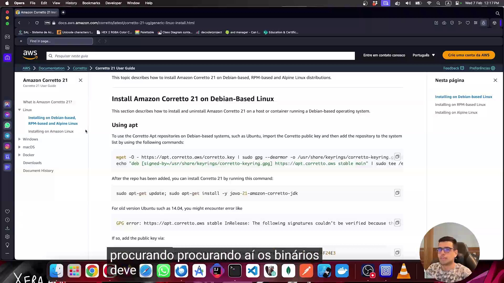
</p>

A imagem mostra a documentação oficial da AWS (Amazon Corretto 21 User Guide), na seção **"Install Amazon Corretto 21 on Debian-Based Linux"**, usada como referência para a instalação do JDK em sistemas baseados em Debian, como o Ubuntu utilizado na máquina virtual da aula. A página apresenta os comandos necessários para adicionar o repositório do Corretto via `apt` e, em seguida, instalar o pacote correspondente.

```bash
wget -O - https://apt.corretto.aws/corretto.key | sudo gpg --dearmor -o /usr/share/keyrings/corretto-keyring.gpg
echo "deb [signed-by=/usr/share/keyrings/corretto-keyring.gpg] https://apt.corretto.aws stable main" | sudo tee /etc/apt/sources.list.d/corretto.list

sudo apt-get update; sudo apt-get install -y java-21-amazon-corretto-jdk
```

O primeiro comando baixa a chave pública do repositório da Amazon e a registra no keyring do sistema; o segundo adiciona o repositório do Corretto à lista de fontes do `apt`. Por fim, o `apt-get update` atualiza a lista de pacotes e o `apt-get install` instala o JDK 21 da Amazon Corretto.

<p align="center">
  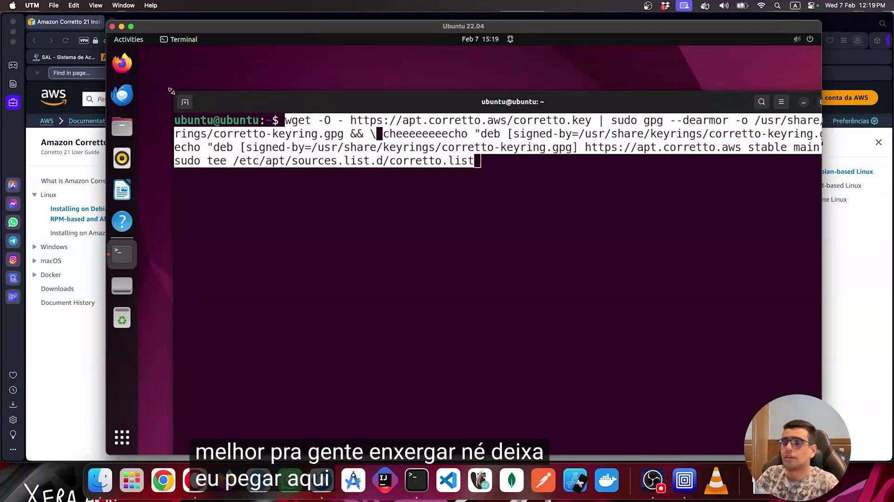
</p>

A imagem mostra o terminal da máquina virtual Ubuntu, já com a fonte aumentada para melhor visualização, com o comando de instalação copiado da documentação da AWS colado e pronto para ser executado:

```bash
wget -O - https://apt.corretto.aws/corretto.key | sudo gpg --dearmor -o /usr/share/keyrings/corretto-keyring.gpg && \
echo "deb [signed-by=/usr/share/keyrings/corretto-keyring.gpg] https://apt.corretto.aws stable main" | sudo tee /etc/apt/sources.list.d/corretto.list
```

Esse comando faz o download da chave de assinatura do repositório da Amazon Corretto e a converte para o formato usado pelo `apt` (`gpg --dearmor`), salvando-a em `/usr/share/keyrings/corretto-keyring.gpg`. Em seguida, adiciona a linha do repositório ao arquivo `/etc/apt/sources.list.d/corretto.list`, para que o sistema passe a reconhecer essa fonte de pacotes.

<p align="center">
  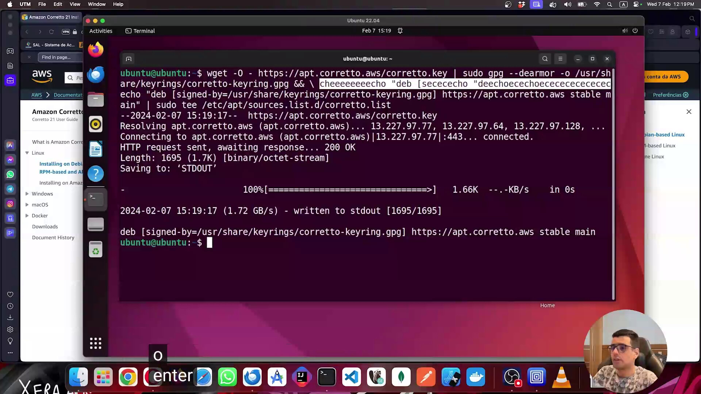
</p>

Após pressionar Enter, o terminal exibe o resultado da execução do comando anterior: o `wget` resolve o endereço `apt.corretto.aws`, conecta-se via HTTPS e baixa a chave do repositório, que é então processada pelo `gpg` e registrada no keyring do sistema. Na última linha, o `echo` confirma que a entrada do repositório foi corretamente escrita.

```bash
--2024-02-07 15:19:17--  https://apt.corretto.aws/corretto.key
Resolving apt.corretto.aws (apt.corretto.aws)... 13.227.97.77, 13.227.97.64, 13.227.97.128, ...
Connecting to apt.corretto.aws (apt.corretto.aws)|13.227.97.77|:443... connected.
HTTP request sent, awaiting response... 200 OK
Length: 1695 (1.7K) [binary/octet-stream]
Saving to: 'STDOUT'

100%[===================================>] 1.66K  --.-KB/s   in 0s

2024-02-07 15:19:17 (1.72 GB/s) - written to stdout [1695/1695]

deb [signed-by=/usr/share/keyrings/corretto-keyring.gpg] https://apt.corretto.aws stable main
```

Com o repositório devidamente adicionado, o ambiente já está pronto para a atualização dos pacotes e a instalação do JDK.

<p align="center">
  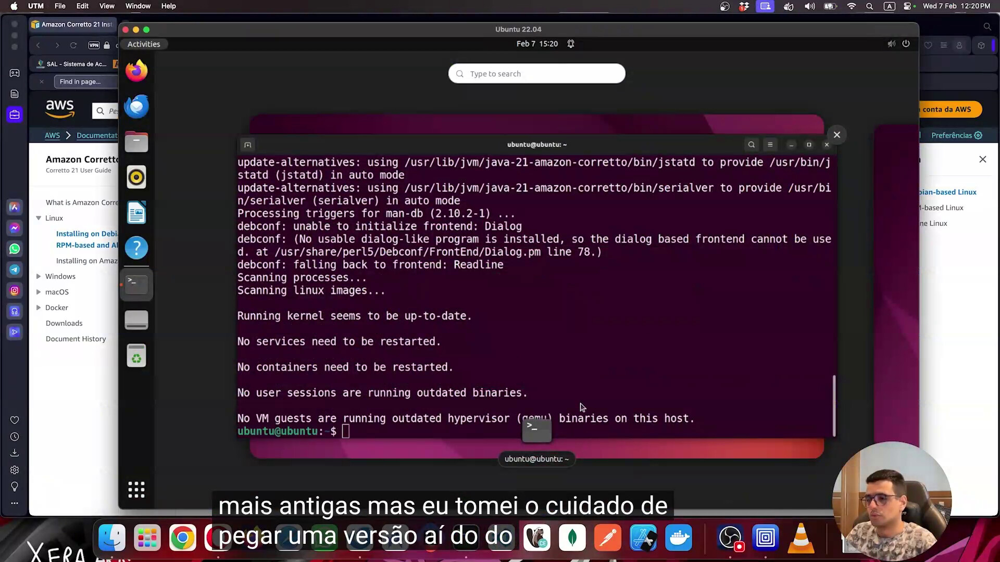
</p>

A imagem mostra a saída final do comando `apt-get install -y java-21-amazon-corretto-jdk`, já rodado após a atualização dos pacotes com `apt-get update`. O sistema configura os *alternatives* do Java (como `jstatd` e `serialver`), processa os triggers de documentação (`man-db`) e informa que nenhum serviço, container ou processo precisa ser reiniciado — sinal de que a instalação foi concluída sem intercorrências.

```bash
update-alternatives: using /usr/lib/jvm/java-21-amazon-corretto/bin/jstatd to provide /usr/bin/jstatd (jstatd) in auto mode
update-alternatives: using /usr/lib/jvm/java-21-amazon-corretto/bin/serialver to provide /usr/bin/serialver (serialver) in auto mode
Processing triggers for man-db (2.10.2-1) ...
debconf: unable to initialize frontend: Dialog
debconf: (No usable dialog-like program is installed, so the dialog based frontend cannot be used. at /usr/share/perl5/Debconf/FrontEnd/Dialog.pm line 78.)
debconf: falling back to frontend: Readline
Scanning processes...
Scanning linux images...

Running kernel seems to be up-to-date.

No services need to be restarted.

No containers need to be restarted.

No user sessions are running outdated binaries.

No VM guests are running outdated hypervisor (qemu) binaries on this host.
```

<p align="center">
  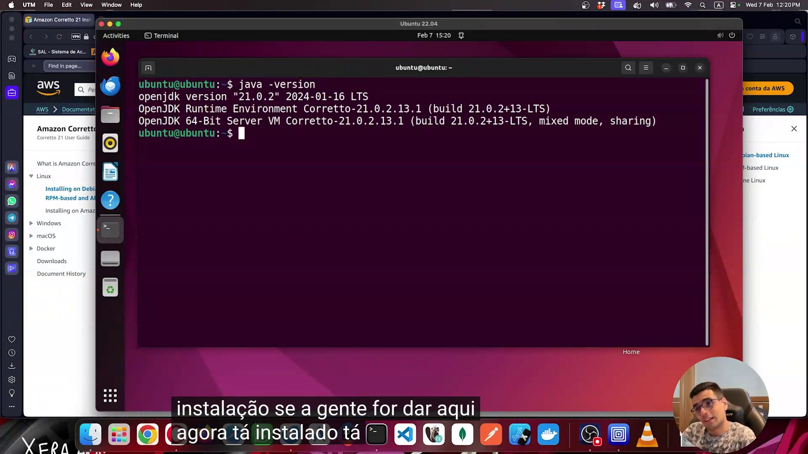
</p>

Com a instalação concluída, o comando `java -version` é executado para confirmar que o JDK foi instalado corretamente. A saída confirma a versão 21 do OpenJDK, na distribuição Amazon Corretto, validando que o ambiente está pronto para o desenvolvimento em Java no curso.

```bash
$ java -version
openjdk version "21.0.2" 2024-01-16 LTS
OpenJDK Runtime Environment Corretto-21.0.2.13.1 (build 21.0.2+13-LTS)
OpenJDK 64-Bit Server VM Corretto-21.0.2.13.1 (build 21.0.2+13-LTS, mixed mode, sharing)
```

     
### 🟩 Vídeo 05 - Opção 3: Instalando o JDK pelo gerenciador de versões SDKMAN! no Linux

<video width="60%" controls>
  <source src="000-Midia_e_Anexos/fundamentos_da_linguagem_de_programacao_java-modulo.01-curso.01-video_05.webm" type="video/webm">
    Seu navegador não suporta vídeo HTML5.
</video>

link do vídeo: https://web.dio.me/track/formacao-java-fundamentals/course/introducao-ao-java-e-seu-ambiente-de-desenvolvimento/learning/8d0f4a5b-c7dc-4d65-b25f-176921e55246?autoplay=1

### Anotações

<p align="center">
  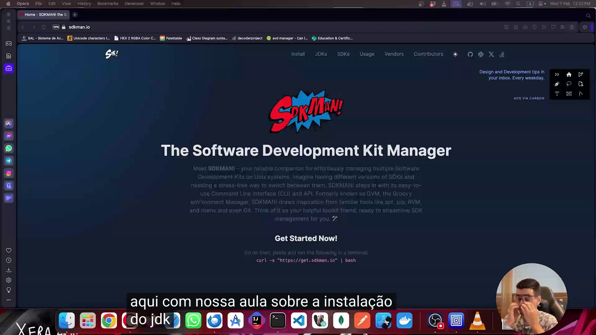
</p>

A imagem mostra a página inicial do site oficial do **SDKMAN** (sdkman.io), apresentando a ferramenta como "The Software Development Kit Manager". A página descreve o SDKMAN como um gerenciador que facilita o controle de múltiplas versões de SDKs em sistemas Unix, através de uma interface de linha de comando (CLI) simples, inspirada em ferramentas como apt, pip, RVM e Git. Logo abaixo, o site já disponibiliza o comando de instalação a ser copiado e colado no terminal:

```bash
curl -s "https://get.sdkman.io" | bash
```

<p align="center">
  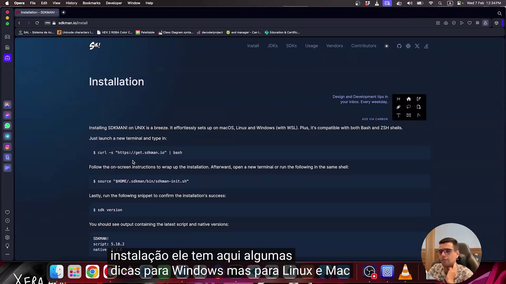
</p>

Nesta imagem, o navegador está na página de **Installation** do site do SDKMAN, exibindo o passo a passo completo do processo de instalação. A página confirma que a instalação funciona em macOS, Linux e Windows (via WSL), sendo compatível com os shells Bash e ZSH. São apresentados os três comandos essenciais do processo:

```bash
$ curl -s "https://get.sdkman.io" | bash

$ source "$HOME/.sdkman/bin/sdkman-init.sh"

$ sdk version
```

O primeiro comando realiza o download e a instalação do SDKMAN. O segundo carrega o script de inicialização no terminal atual, apontando para a pasta home do usuário. O terceiro serve para confirmar se a instalação foi concluída com sucesso, exibindo a versão do script e a versão nativa instaladas.
     

## Parte 3 - Gerenciadores de Build

### 🟩 Vídeo 06 - Instalando o Maven

<video width="60%" controls>
  <source src="000-Midia_e_Anexos/fundamentos_da_linguagem_de_programacao_java-modulo.01-curso.01-video_06.webm" type="video/webm">
    Seu navegador não suporta vídeo HTML5.
</video>

link do vídeo: https://web.dio.me/track/formacao-java-fundamentals/course/introducao-ao-java-e-seu-ambiente-de-desenvolvimento/learning/4c8ea204-00b4-44ad-ade9-296971010a62?autoplay=1

### Anotações

 <p align="center">
  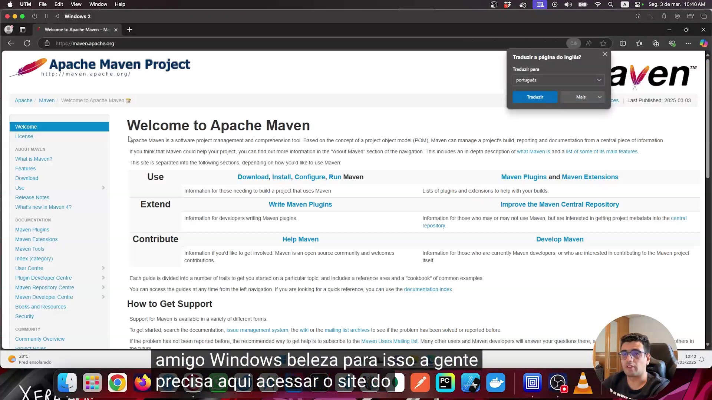
</p>

A imagem mostra o navegador aberto na página oficial **"Welcome to Apache Maven"** (`https://maven.apache.org`), ponto de partida indicado para realizar a instalação manual do Maven no Windows. A página apresenta as seções de uso, extensão e contribuição do projeto, sendo o link **Download** o próximo passo a ser seguido para obter os arquivos de instalação.

Não há código nesta imagem, apenas a navegação inicial até o site oficial do Maven.

<p align="center">
  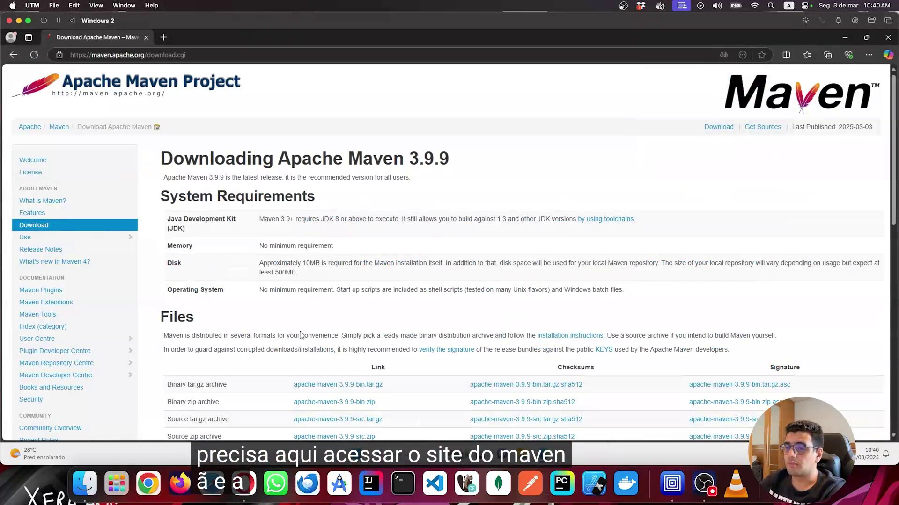
</p>

Aqui já estamos na página **"Downloading Apache Maven 3.9.9"**, onde ficam listados os requisitos do sistema (JDK 8 ou superior, sem exigência mínima de memória e cerca de 10 MB de disco para a instalação) e a tabela de arquivos disponíveis para download, incluindo as opções **Binary tar.gz archive** e **Binary zip archive**. É a partir dessa tabela que o arquivo `.zip` do Maven é baixado para ser extraído posteriormente na máquina.

Não há código nesta imagem, apenas a página de download com as opções de arquivos.

<p align="center">
  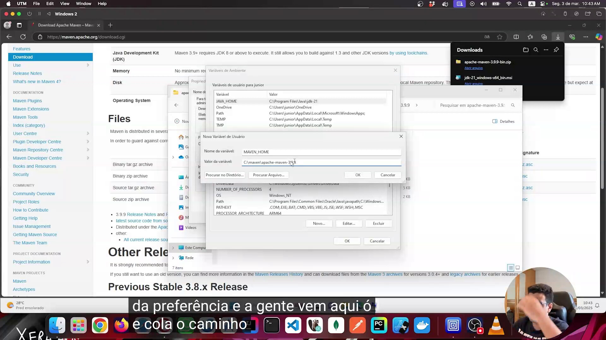
</p>

Nesta etapa é aberta a janela de **Variáveis de Ambiente** do Windows, e o instrutor cria uma nova variável de usuário chamada `MAVEN_HOME`, apontando para o diretório onde os arquivos do Maven foram extraídos:

```
Nome da variável: MAVEN_HOME
Valor da variável: C:\maven\apache-maven-3.9.9
```

Essa variável será utilizada logo em seguida para compor o caminho executável do Maven na variável `Path`.

<p align="center">
  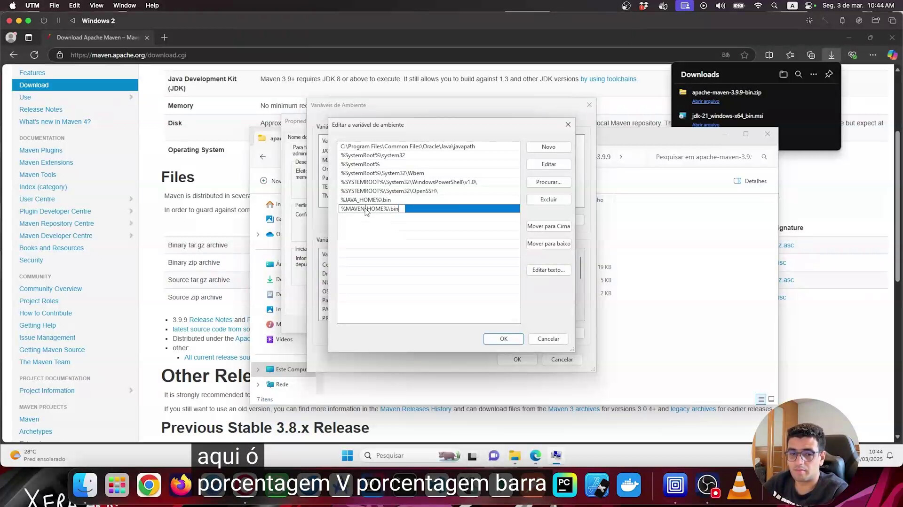
</p>

A imagem mostra a edição da variável **Path**, onde uma nova entrada é adicionada logo abaixo da já existente `%JAVA_HOME%\bin`, seguindo o mesmo padrão usado na configuração do Java:

```
%JAVA_HOME%\bin
%MAVEN_HOME%\bin
```

Com essa entrada adicionada, o sistema operacional passa a reconhecer o comando `mvn` a partir de qualquer diretório do terminal, desde que a variável `MAVEN_HOME` esteja corretamente configurada.

<p align="center">
  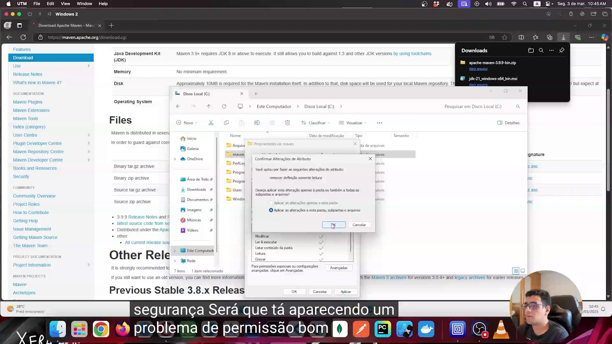
</p>

Após configurar as variáveis de ambiente, o comando `mvn -version` ainda não era reconhecido corretamente, indicando um problema de permissão na pasta do Maven. Nesta imagem, o instrutor acessa as **Propriedades** da pasta `maven` e confirma a remoção do atributo **somente leitura**, aplicando a alteração à pasta, subpastas e arquivos, na tentativa de resolver a restrição de acesso do Windows.

Não há código nesta imagem, apenas a janela de confirmação de alteração de atributos do sistema.

<p align="center">
  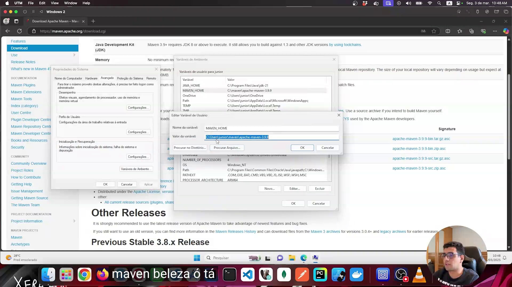
</p>

Como alternativa ao problema de permissão persistente na raiz do `C:\`, o instrutor move a pasta do Maven para dentro do diretório do próprio usuário, evitando restrições de segurança do Windows nesse local. A variável `MAVEN_HOME` é então editada com o novo caminho:

```
Nome da variável: MAVEN_HOME
Valor da variável: C:\Users\junior\maven\apache-maven-3.9.9
```

Essa mudança de local é sugerida como uma forma de contornar o problema de permissão sem precisar sempre executar o terminal como administrador.

<p align="center">
  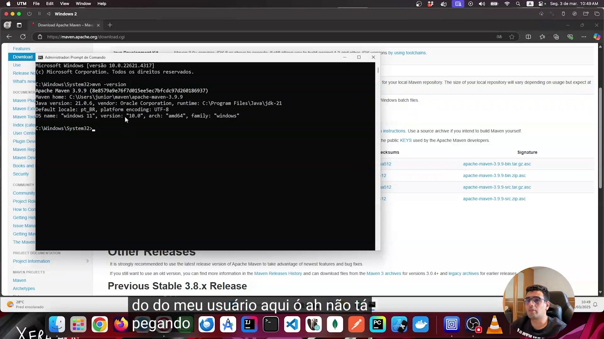
</p>

Com o Maven agora instalado na pasta do usuário e executando o Prompt de Comando como Administrador, o comando `mvn -version` finalmente é reconhecido com sucesso, confirmando a instalação:

```bash
C:\Windows\System32>mvn -version
Apache Maven 3.9.9 (8e8579a9e76f7d015ee5ec7bfcdc97d260186937)
Maven home: C:\Users\junior\maven\apache-maven-3.9.9
Java version: 21.0.6, vendor: Oracle Corporation, runtime: C:\Program Files\Java\jdk-21
Default locale: pt_BR, platform encoding: UTF-8
OS name: "windows 11", version: "10.0", arch: "amd64", family: "windows"
```

Esse retorno confirma que o Maven 3.9.9 está corretamente instalado e integrado ao Java 21 configurado anteriormente, encerrando a demonstração da aula.
     
 
### 🟩 Vídeo 07 - Instalando o Gradle

<video width="60%" controls>
  <source src="000-Midia_e_Anexos/fundamentos_da_linguagem_de_programacao_java-modulo.01-curso.01-video_07.webm" type="video/webm">
    Seu navegador não suporta vídeo HTML5.
</video>

link do vídeo: https://web.dio.me/track/formacao-java-fundamentals/course/introducao-ao-java-e-seu-ambiente-de-desenvolvimento/learning/aaa8d1d0-338f-4c5c-8130-6e7e91fd6c1f?autoplay=1

### Anotações

<p align="center">
  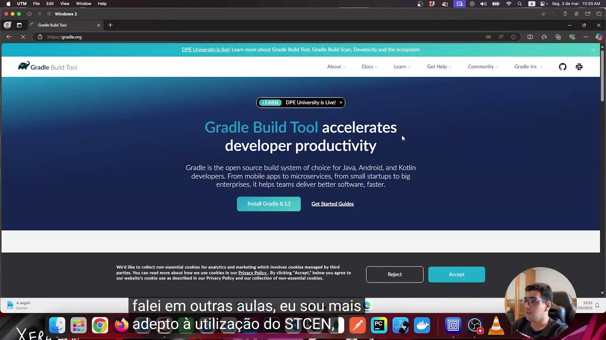
</p>

A página inicial do site oficial do Gradle (gradle.org) é exibida no navegador. É a partir dela que a instalação manual da ferramenta começa, já que o site disponibiliza tanto o link de download direto ("Install Gradle 8.13") quanto os guias de início rápido ("Get Started Guides").

<p align="center">
  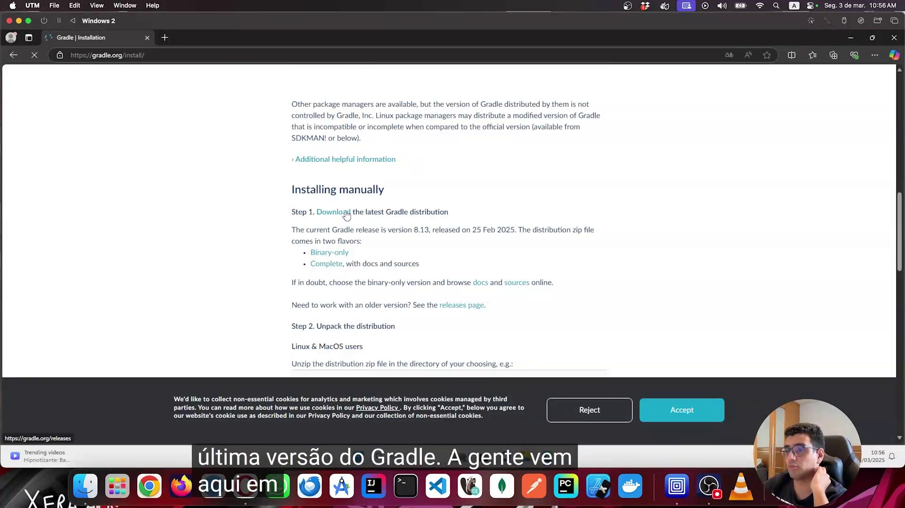
</p>

Na página de instalação (gradle.org/install), a seção "Installing manually" mostra o **Step 1 – Download the latest Gradle distribution**, indicando que a versão atual é a 8.13 e que o arquivo está disponível em dois formatos: **binary-only** (apenas os binários) e **complete** (com documentação e código-fonte). Para acompanhar todo o conteúdo da distribuição, a versão completa é a escolhida.

<p align="center">
  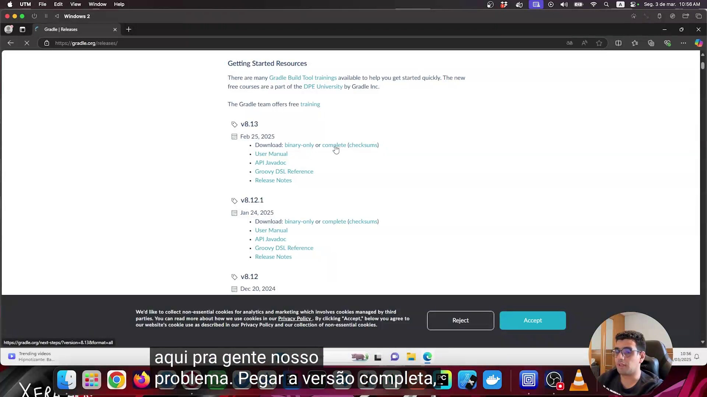
</p>

A página de releases do Gradle (gradle.org/releases) lista as versões disponíveis para download. A versão **v8.13** (25 de fevereiro de 2025) aparece no topo, com as opções de download **binary-only** ou **complete**, além de links para User Manual, API Javadoc, Groovy DSL Reference e Release Notes. É a partir dessa listagem que a versão completa do Gradle 8.13 é baixada.

<p align="center">
  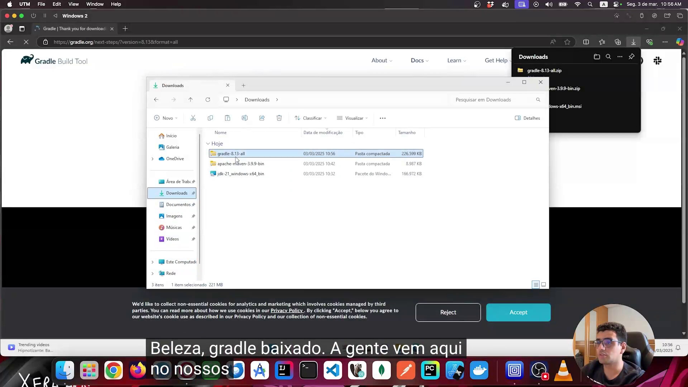
</p>

O Windows Explorer mostra a pasta de Downloads já com o arquivo **gradle-8.13-all** (226.599 KB) baixado, ao lado das pastas de instalação anteriores do **Maven** (apache-maven-3.9.9-bin) e do instalador do **JDK 21**. Esse é o ponto de partida para extrair o conteúdo do Gradle e organizá-lo em uma pasta própria, do mesmo modo como já havia sido feito com o Maven.

<p align="center">
  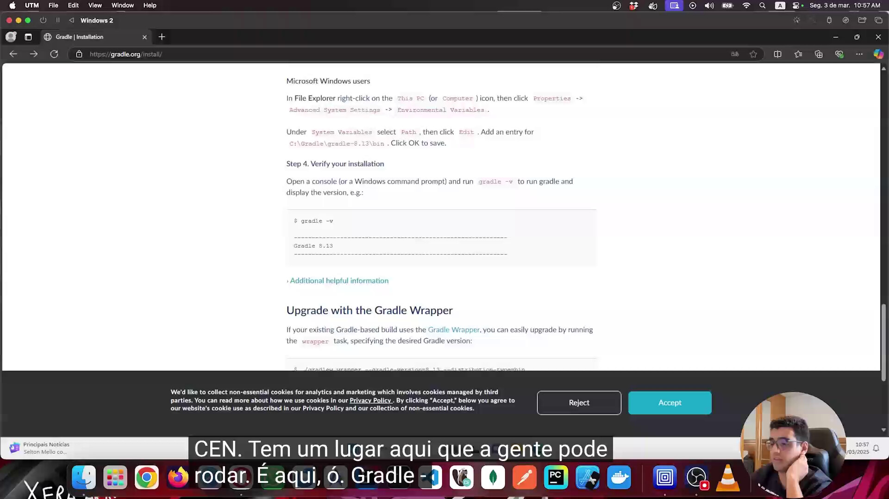
</p>

Ainda na documentação oficial, a seção "Microsoft Windows users" explica como configurar a variável **Path** apontando para `C:\Gradle\gradle-8.13\bin`, através de **File Explorer > This PC > Properties > Advanced System Settings > Environmental Variables**. Logo abaixo, o **Step 4 – Verify your installation** apresenta o comando `gradle -v`, usado para confirmar que a instalação foi concluída corretamente e exibir a versão instalada (Gradle 8.13):

```bash
$ gradle -v
------------------------------------------------------------
Gradle 8.13
------------------------------------------------------------
```

<p align="center">
  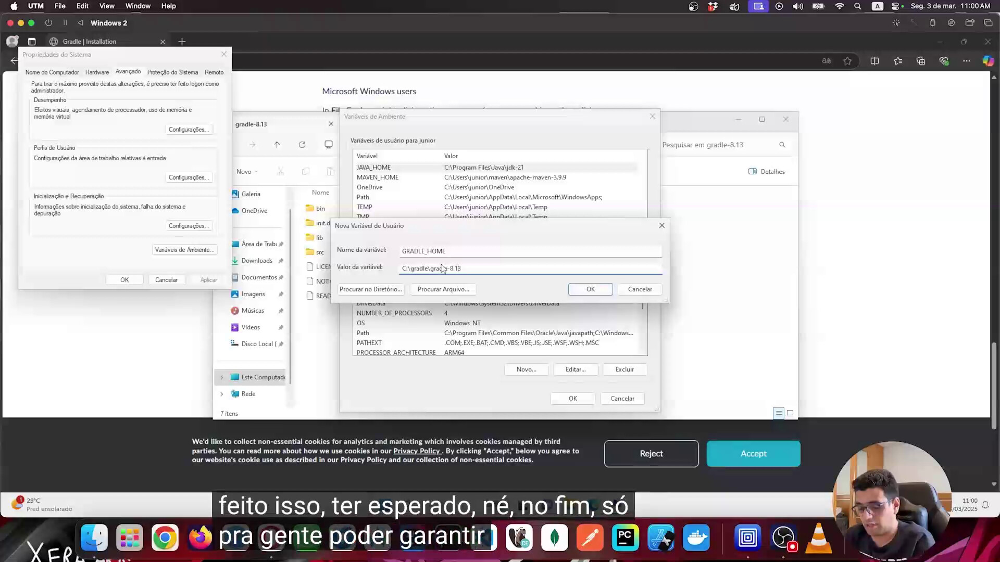
</p>

Na janela de **Variáveis de Ambiente** do Windows, uma nova variável de usuário está sendo criada: **GRADLE_HOME**, com o valor `C:\gradle\gradle-8.13`, apontando para a pasta onde a distribuição do Gradle foi extraída. É possível notar, ao fundo, as demais variáveis já configuradas anteriormente, como `JAVA_HOME` e `MAVEN_HOME`, seguindo o mesmo padrão de organização.

<p align="center">
  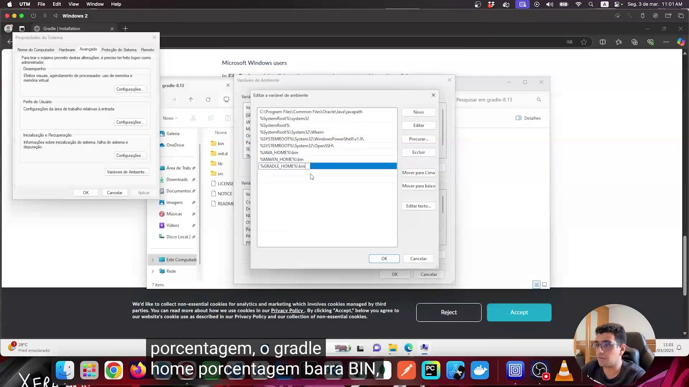
</p>

Agora na tela de edição da variável **Path**, uma nova entrada é adicionada: `%GRADLE_HOME%\bin`, seguindo o mesmo padrão já utilizado para `%JAVA_HOME%\bin` e `%MAVEN_HOME%\bin`, visíveis na mesma lista. Essa etapa é o que permite que o comando `gradle` seja reconhecido em qualquer diretório do terminal.

<p align="center">
  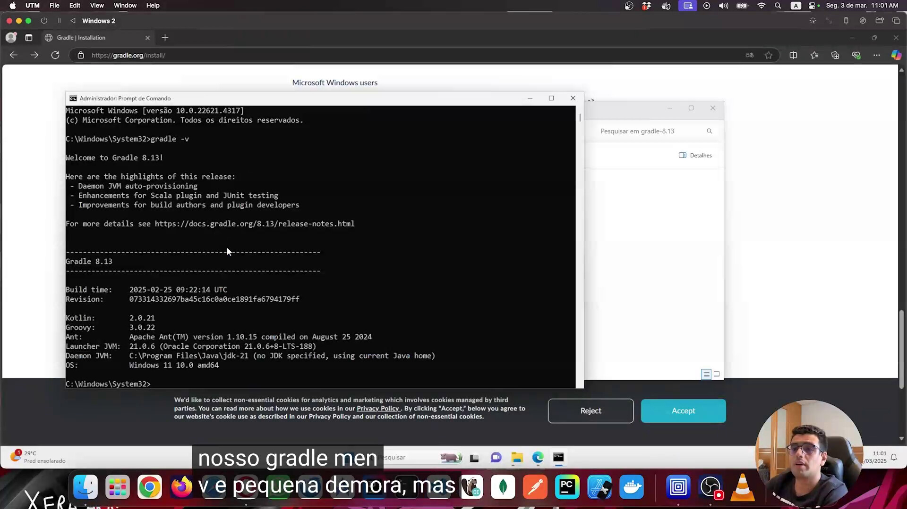
</p>

No Prompt de Comando executado como administrador, o comando `gradle -v` é executado com sucesso, confirmando que a instalação e a configuração das variáveis de ambiente funcionaram corretamente:

```bash
C:\Windows\System32>gradle -v

Welcome to Gradle 8.13!

Here are the highlights of this release:
 - Daemon JVM auto-provisioning
 - Enhancements for Scala plugin and JUnit testing
 - Improvements for build authors and plugin developers

For more details see https://docs.gradle.org/8.13/release-notes.html

------------------------------------------------------------
Gradle 8.13
------------------------------------------------------------

Build time:   2025-02-25 09:22:14 UTC
Revision:     073314332697ba45c16c0a0ce1891fa6794179ff

Kotlin:       2.0.21
Groovy:       3.0.22
Ant:          Apache Ant(TM) version 1.10.15 compiled on August 25 2024
Launcher JVM: 21.0.6 (Oracle Corporation 21.0.6+8-LTS-188)
Daemon JVM:   C:\Program Files\Java\jdk-21 (no JDK specified, using current Java home)
OS:           Windows 11 10.0 amd64
```

A saída do comando confirma a versão instalada (**Gradle 8.13**), além de informações complementares como as versões de **Kotlin** e **Groovy** utilizadas internamente pelo Gradle, a versão do **Apache Ant**, a JVM utilizada e o sistema operacional. Com isso, a instalação manual do Gradle é concluída com sucesso.


## Parte 4 - Instalação de IDEs e Execução do seu Primeiro Programa Java

### 🟩 Vídeo 08 - Instalando Eclipse

<video width="60%" controls>
  <source src="000-Midia_e_Anexos/fundamentos_da_linguagem_de_programacao_java-modulo.01-curso.01-video_08.webm" type="video/webm">
    Seu navegador não suporta vídeo HTML5.
</video>

link do vídeo: https://web.dio.me/track/formacao-java-fundamentals/course/introducao-ao-java-e-seu-ambiente-de-desenvolvimento/learning/7168f4b3-d421-4d58-b898-0b07cdcfc920?autoplay=1

### Anotações

<p align="center">
  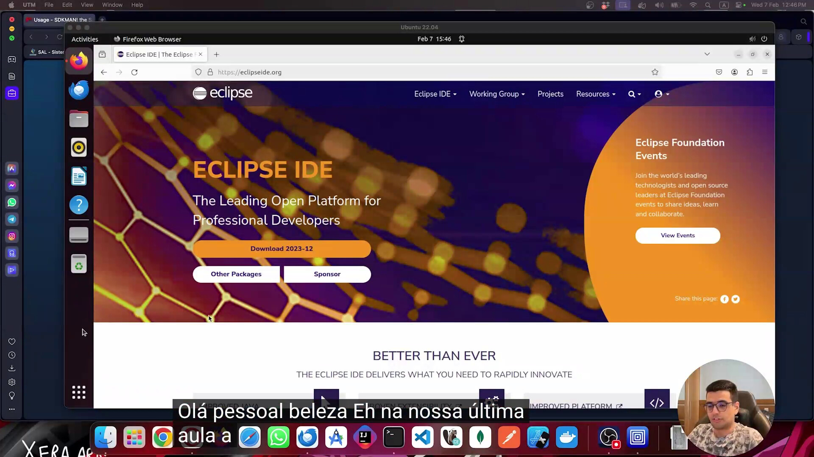
</p>

A imagem mostra o navegador Firefox aberto no site oficial **eclipseide.org**, página inicial do Eclipse IDE. É a partir dela que o processo de instalação da IDE é iniciado, com destaque para o botão de download da versão mais recente disponível no momento.

<p align="center">
  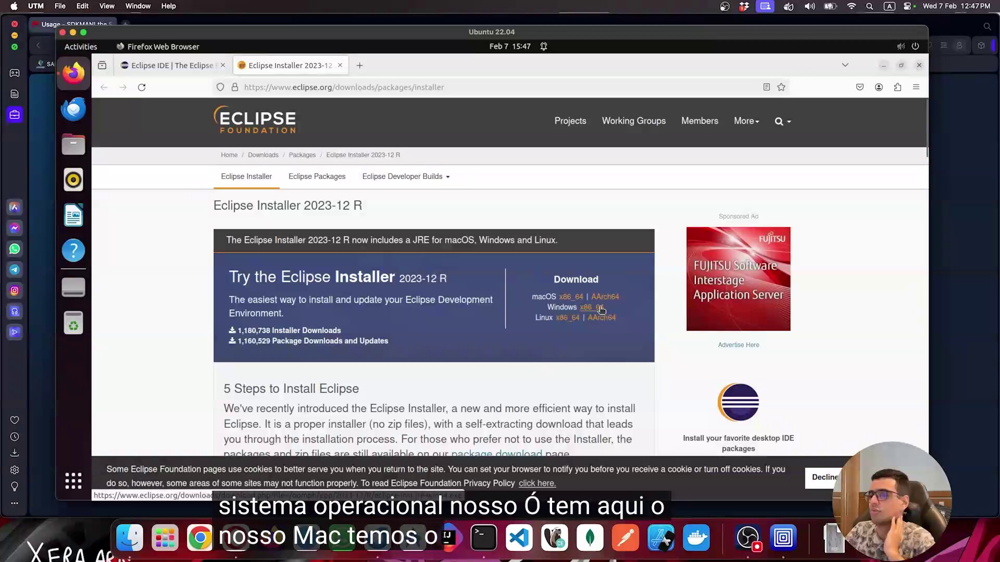
</p>

Nesta tela, já na página de downloads do Eclipse Installer, são exibidas as opções de sistema operacional disponíveis: macOS, Windows e Linux, cada uma com suas respectivas arquiteturas (x86_64 e AArch64). É nesse ponto que se escolhe a versão correspondente ao sistema operacional utilizado na máquina.

<p align="center">
  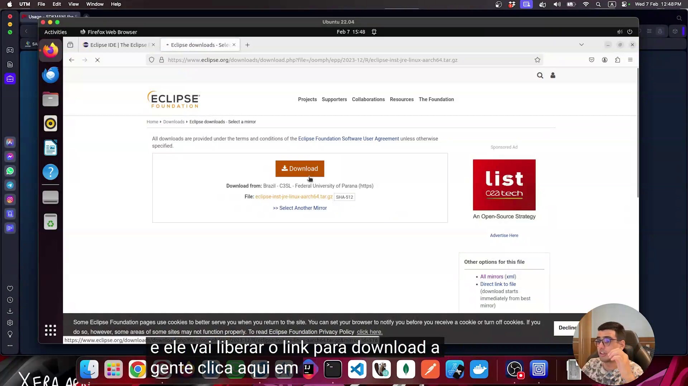
</p>

Aqui aparece a página de seleção de mirror (espelho de download), com o botão **Download** em destaque e a indicação do servidor de origem do arquivo (mirror do Brasil). É o clique nesse botão que efetivamente inicia o download do instalador do Eclipse.

<p align="center">
  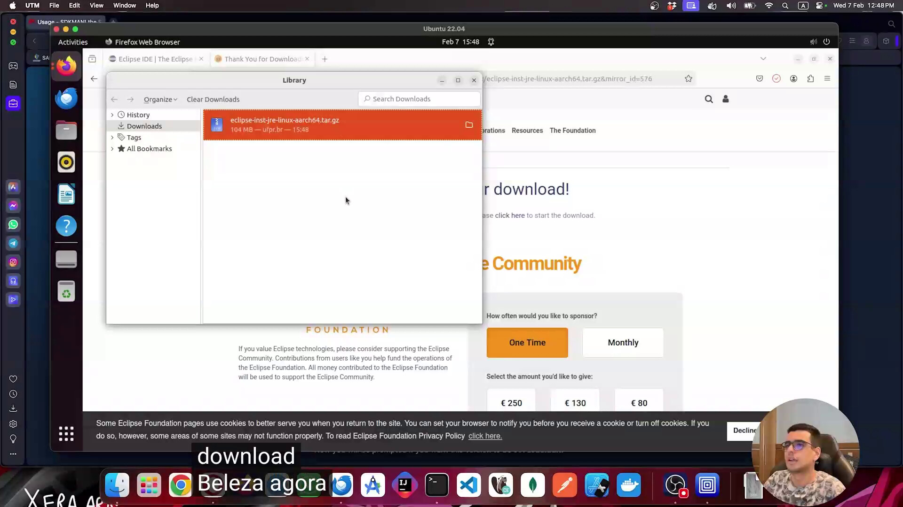
</p>

A janela de downloads do Firefox mostra o arquivo **eclipse-inst-jre-linux-aarch64.tar.gz**, com aproximadamente 104 MB, já concluído. Esse é o pacote compactado do instalador do Eclipse, que precisa ser extraído antes de ser executado.

<p align="center">
  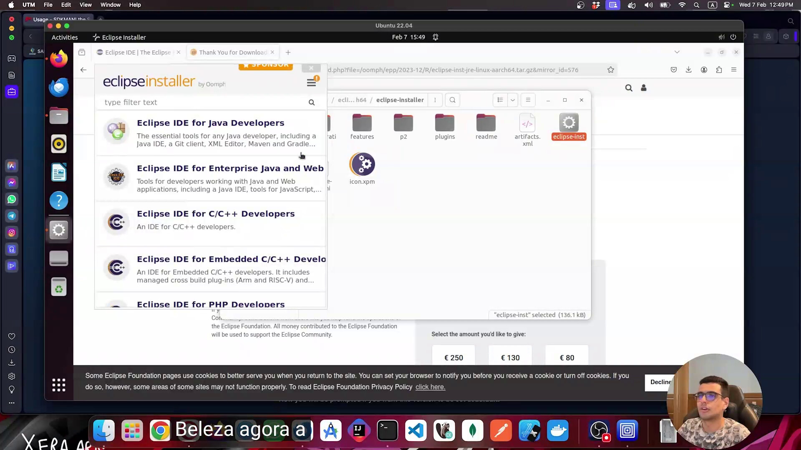
</p>

Após extrair o arquivo `.tar.gz`, é possível ver a pasta gerada com os arquivos do Eclipse Installer (features, p2, plugins, readme, artifacts.xml e o executável do instalador). Ao executá-lo, abre-se a janela do **Eclipse Installer**, que lista as diferentes distribuições disponíveis, como "Eclipse IDE for Java Developers", "Eclipse IDE for Enterprise Java and Web", "Eclipse IDE for C/C++ Developers", entre outras. A opção voltada para desenvolvimento Java é a selecionada para este ambiente.

<p align="center">
  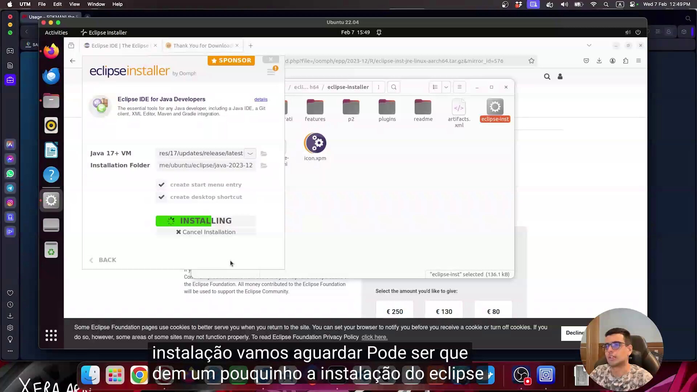
</p>

Com a opção **Eclipse IDE for Java Developers** já selecionada, o instalador exibe as configurações principais: a versão da JVM a ser utilizada (Java 17+ VM) e a pasta de instalação. Também aparecem marcadas as opções para criar um atalho no menu de aplicativos e na área de trabalho. O botão **INSTALLING** confirma que o processo de instalação está em andamento.

<p align="center">
  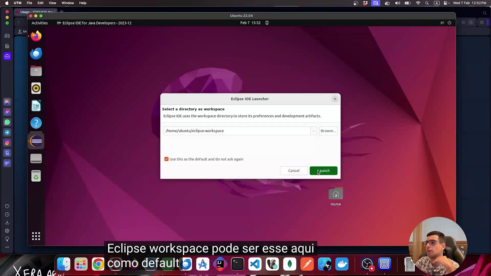
</p>

Concluída a instalação, ao abrir a IDE pela primeira vez surge a janela **Eclipse IDE Launcher**, solicitando a definição do diretório de *workspace* — o local onde o Eclipse armazenará as preferências e os projetos criados. O caminho sugerido por padrão é `/home/ubuntu/eclipse-workspace`, que pode ser mantido e confirmado pelo botão **Launch**.

<p align="center">
  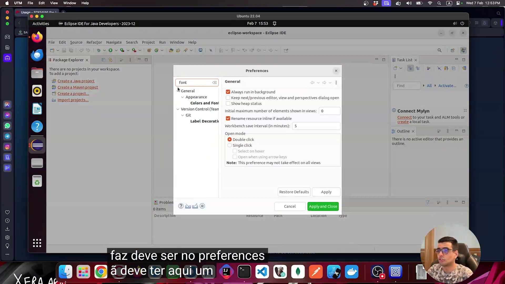
</p>

Com a IDE já aberta, exibindo o **Package Explorer** com as opções para criar um novo projeto Java, é aberta a janela de **Preferences**, com o campo de busca preenchido com o termo "font". A árvore de categorias mostra o caminho **General > Appearance > Colors and Fonts**, utilizado para localizar as configurações de fonte do editor.

<p align="center">
  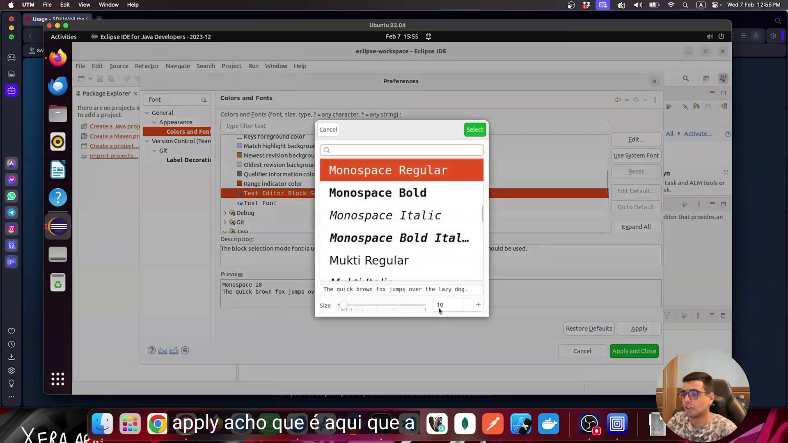
</p>

Dentro de **Colors and Fonts**, com o item "Text Editor Block Selection Font" (referente ao texto do editor Java) selecionado, abre-se a janela de escolha de fonte, listando opções como Monospace Regular, Bold, Italic e Bold Italic, além do campo de tamanho. É nessa tela que a fonte do editor é ajustada para um tamanho maior, facilitando a leitura do código durante a aula.

<p align="center">
  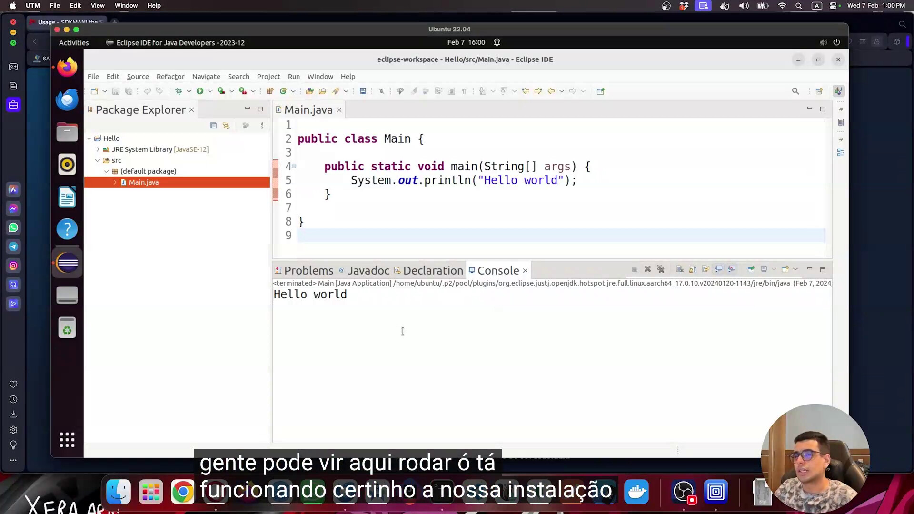
</p>

Por fim, a imagem mostra a IDE já configurada e em uso, com o **Package Explorer** exibindo o projeto "Hello" e a classe `Main.java` aberta no editor. No painel **Console**, na parte inferior, aparece a saída da execução do programa, confirmando que a instalação e a configuração do Eclipse foram concluídas com sucesso.

```java
public class Main {

    public static void main(String[] args) {
        System.out.println("Hello world");
    }
}
```

Saída exibida no console após a execução:

```
Hello world
```
 

### 🟩 Vídeo 09 - Instalando VSCode

<video width="60%" controls>
  <source src="000-Midia_e_Anexos/fundamentos_da_linguagem_de_programacao_java-modulo.01-curso.01-video_09.webm" type="video/webm">
    Seu navegador não suporta vídeo HTML5.
</video>

link do vídeo: https://web.dio.me/track/formacao-java-fundamentals/course/introducao-ao-java-e-seu-ambiente-de-desenvolvimento/learning/7168f4b3-d421-4d58-b898-0b07cdcfc920?autoplay=1

### Anotações


<p align="center">
  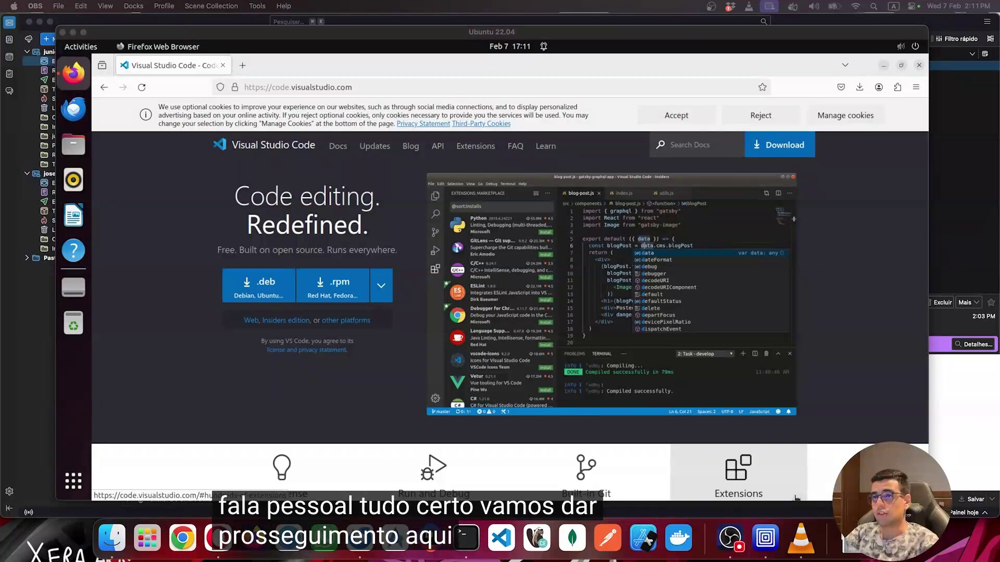
</p>

A imagem mostra o navegador Firefox aberto na página oficial do VS Code (code.visualstudio.com). A tela exibe o banner de boas-vindas "Code editing. Redefined." e, logo abaixo, os botões de download para os formatos **.deb** (Debian/Ubuntu) e **.rpm** (Red Hat/Fedora), além de um link para outras plataformas (Web, Insiders, macOS, Windows). Essa é a etapa inicial de acesso ao site para iniciar o processo de instalação do editor.

<p align="center">
  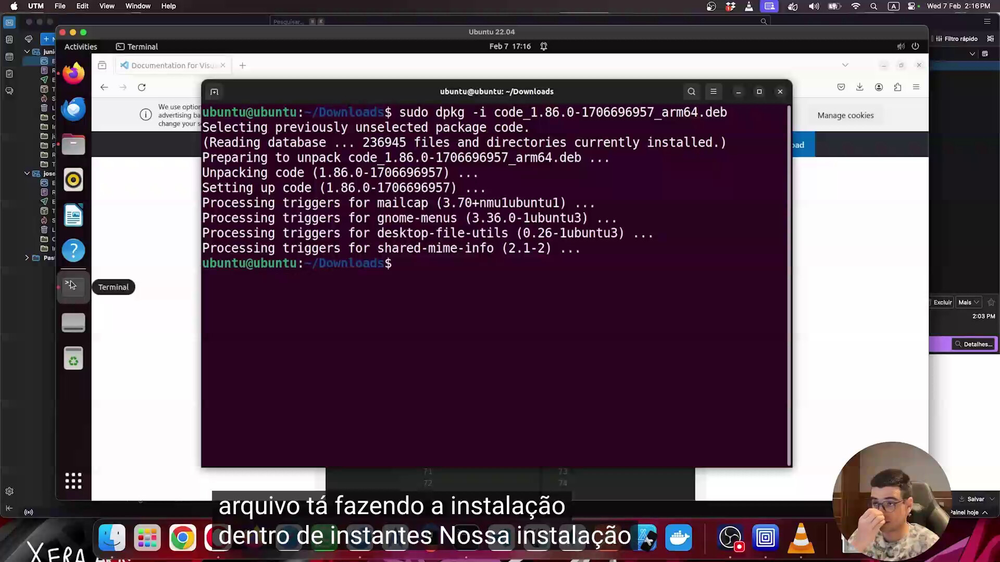
</p>

O terminal exibe o comando de instalação do pacote `.deb` do VS Code já baixado, sendo executado com sucesso via `dpkg`, mostrando as etapas de desempacotamento e configuração do pacote.

```bash
sudo dpkg -i code_1.86.0-1706696957_arm64.deb
```

A saída confirma que o pacote foi selecionado, desempacotado e configurado corretamente, finalizando com o processamento dos triggers do sistema (mailcap, gnome-menus, desktop-file-utils, shared-mime-info).

<p align="center">
  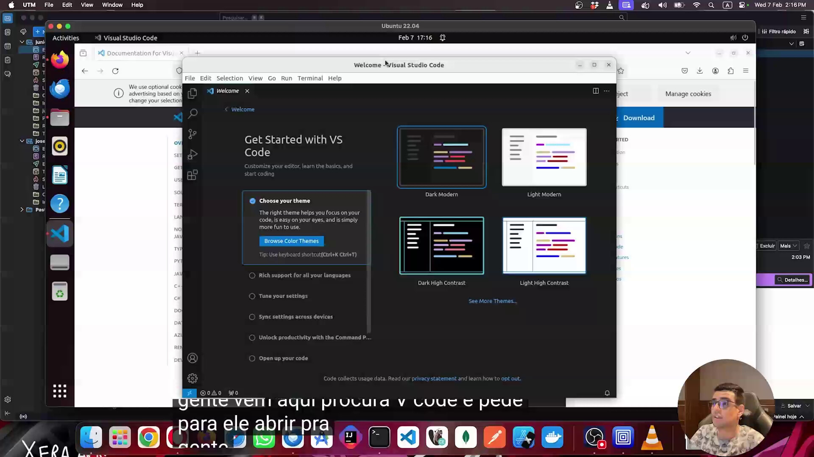
</p>

Com a instalação concluída, o VS Code é aberto pela primeira vez, exibindo a tela de boas-vindas "Get Started with VS Code". Nessa etapa é apresentada a opção de escolha de tema, com destaque para as variações Dark Modern, Light Modern, Dark High Contrast e Light High Contrast — o tema escuro (Dark Modern) aparece selecionado por padrão.

<p align="center">
  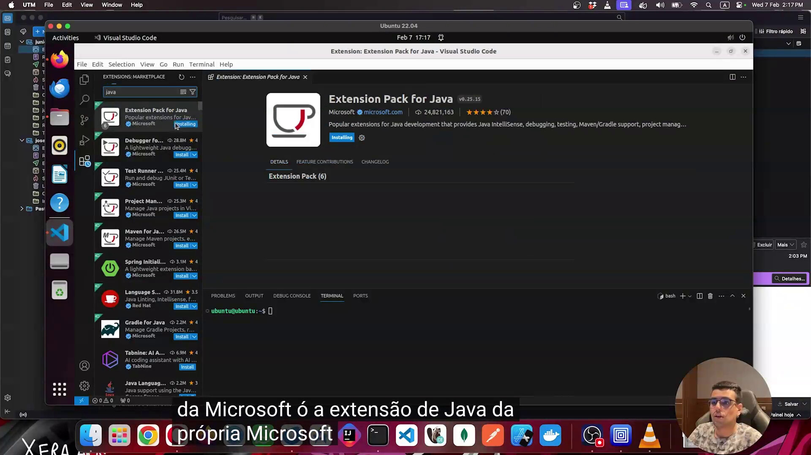
</p>

A aba de extensões (Extensions Marketplace) está aberta com o termo "java" pesquisado na barra de busca. É possível ver a extensão **Extension Pack for Java**, da Microsoft, em processo de instalação ("Installing"), junto com outras extensões relacionadas listadas abaixo (Debugger for Java, Test Runner for Java, Project Manager for Java, Maven for Java, Spring Initializr, entre outras).

<p align="center">
  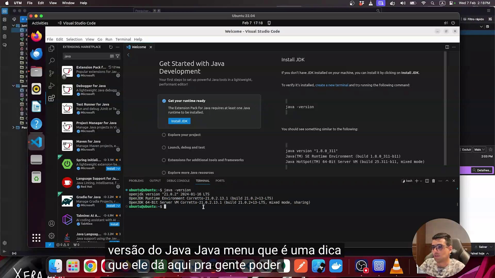
</p>

A aba "Get Started with Java Development" está sendo exibida, orientando sobre a instalação do JDK. No terminal integrado do VS Code, o comando abaixo foi executado para verificar se o Java já está disponível no ambiente:

```bash
java -version
```

A saída confirma a presença do OpenJDK 21.0.2 (Corretto), indicando que o runtime já está corretamente instalado e pronto para uso.

<p align="center">
  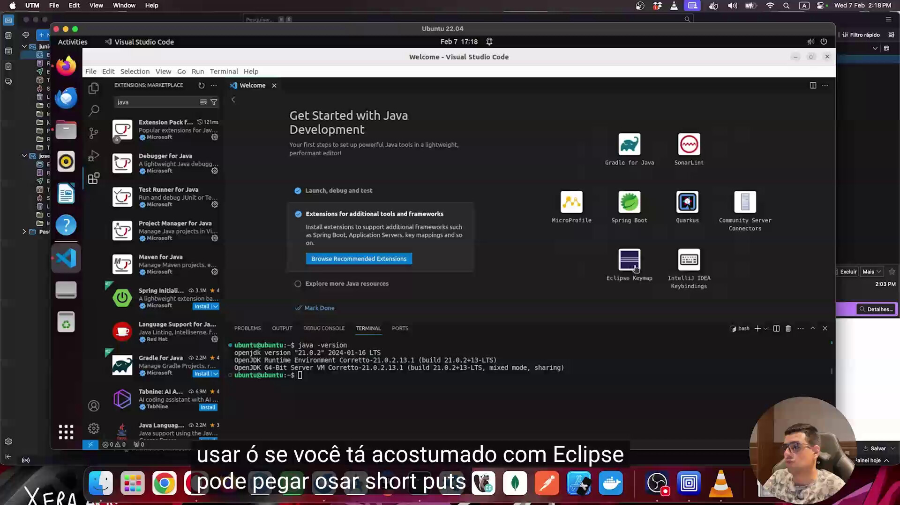
</p>

Ainda na tela "Get Started with Java Development", agora é exibida a seção de extensões adicionais para frameworks e ferramentas, com ícones para Gradle for Java, SonarLint, MicroProfile, Spring Boot, Quarkus, Community Server Connectors, além de opções de atalhos de teclado para quem vem do Eclipse (Eclipse Keymap) ou do IntelliJ IDEA (IntelliJ Idea Keybindings).

<p align="center">
  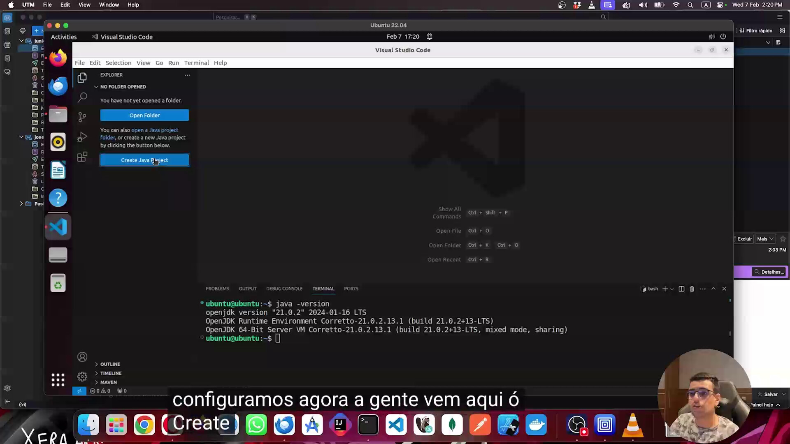
</p>

O painel do Explorer aparece com a mensagem "No folder opened", exibindo as opções "Open Folder" e "Create Java Project". Essa é a etapa em que se decide como o projeto Java será iniciado, sem ainda ter selecionado nenhuma pasta de trabalho.

<p align="center">
  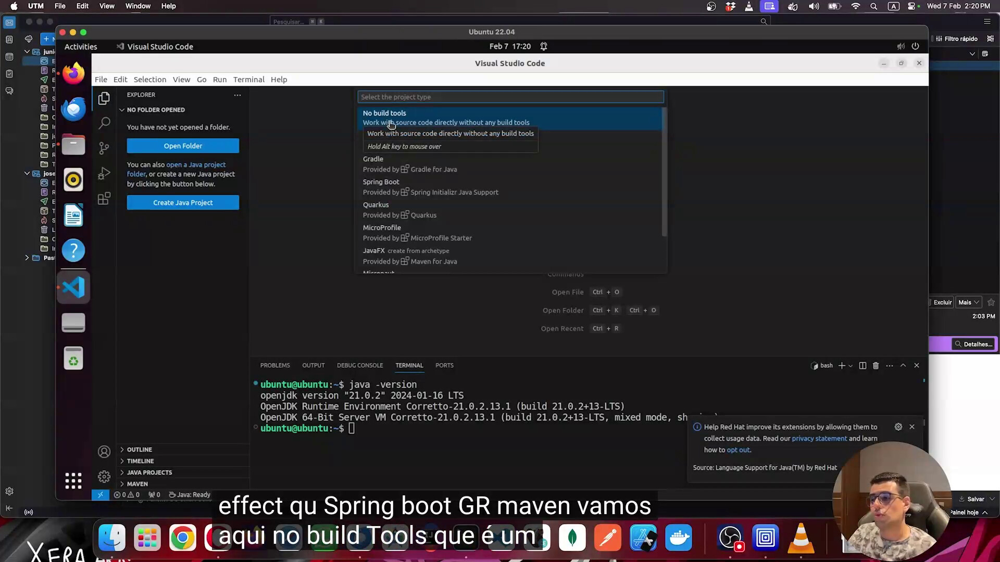
</p>

Após clicar em "Create Java Project", é exibido um menu com as opções de ferramenta de build para o novo projeto: **No build tools**, Gradle, Spring Boot, Quarkus, MicroProfile e JavaFX. A opção "No build tools" está destacada, indicando a escolha de um projeto Java simples, sem gerenciador de dependências.

<p align="center">
  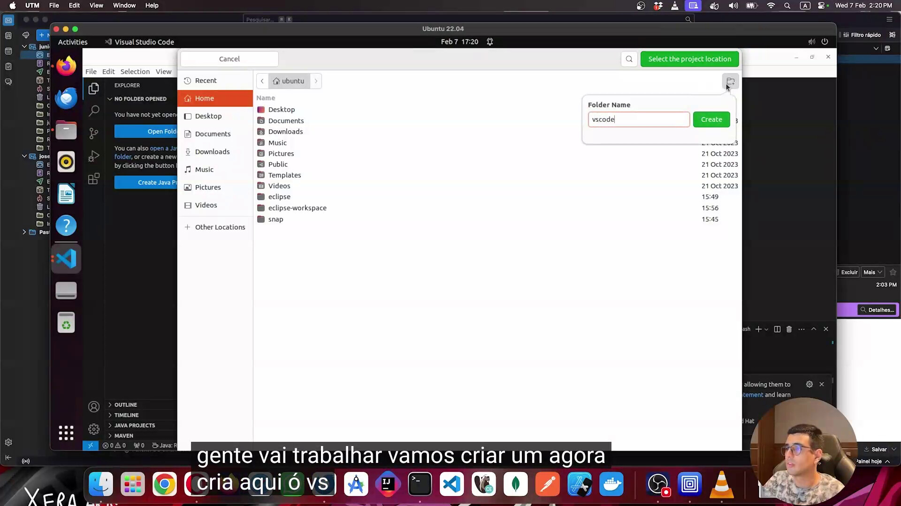
</p>

A janela de seleção de diretório está aberta, com o campo "Folder Name" preenchido com o nome **vscode**, indicando a criação de uma nova pasta para armazenar o projeto que será criado.

<p align="center">
  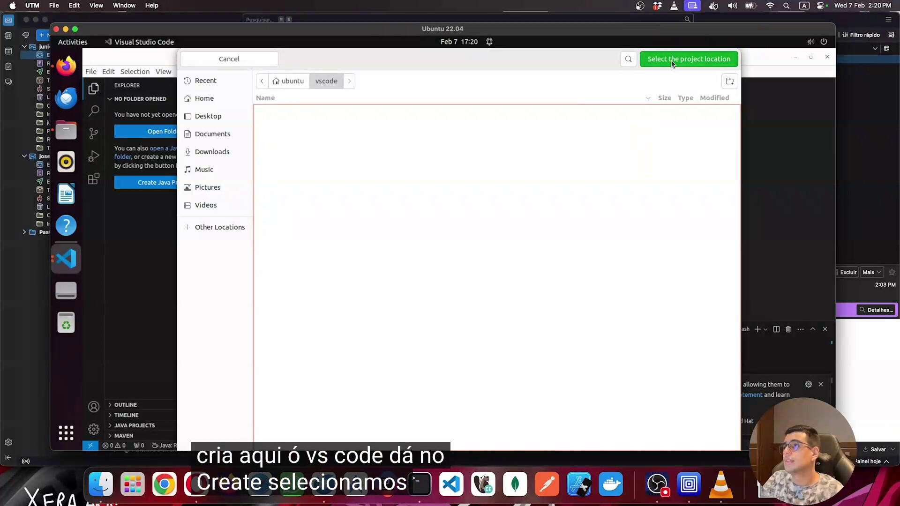
</p>

A pasta "vscode" já criada é exibida vazia no seletor de diretórios, com o botão "Select the project location" disponível para confirmar essa pasta como o local onde o projeto Java será gerado.

<p align="center">
  
</p>

Após confirmar a localização do projeto, o VS Code solicita o nome do novo projeto Java através de uma caixa de input, exibindo o texto **"Hello"** já digitado, com a instrução "Input a Java project name (Press 'Enter' to confirm or 'Escape' to cancel)".

<p align="center">
  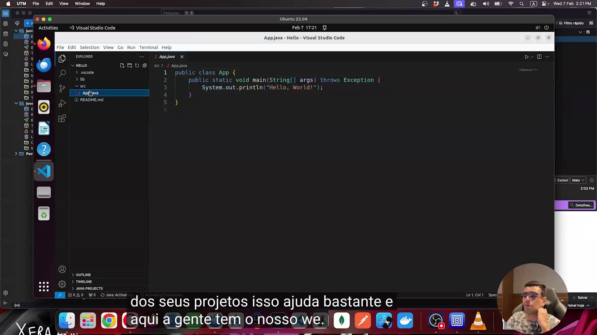
</p>

O projeto "Hello" foi criado e o arquivo `App.java` está aberto no editor, junto com um arquivo `README.md` gerado automaticamente na raiz do projeto. O código já vem pronto com um exemplo clássico de "Hello World":

```java
public class App {
    public static void main(String[] args) throws Exception {
        System.out.println("Hello, World!");
    }
}
```

<p align="center">
  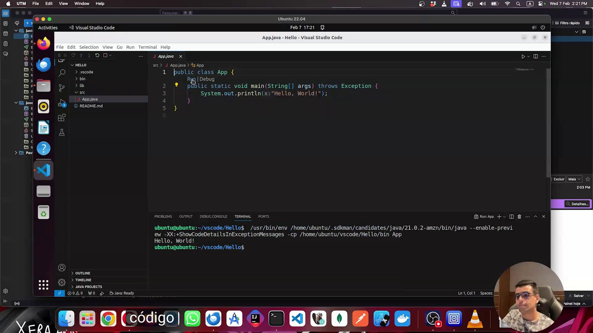
</p>

O código do `App.java` é executado através do botão "Run" acima do método `main`, e o terminal integrado exibe o comando gerado automaticamente pela extensão de Java, seguido da saída do programa:

```bash
/usr/bin/env /home/ubuntu/.sdkman/candidates/java/21.0.2-amzn/bin/java --enable-preview -XX:+ShowCodeDetailsInExceptionMessages -cp /home/ubuntu/vscode/Hello/bin App
Hello, World!
```

A saída "Hello, World!" confirma que o ambiente Java está configurado corretamente e o projeto foi executado com sucesso.
      

### 🟩 Vídeo 10 - Instalando IntelliJ

<video width="60%" controls>
  <source src="000-Midia_e_Anexos/fundamentos_da_linguagem_de_programacao_java-modulo.01-curso.01-video_10.webm" type="video/webm">
    Seu navegador não suporta vídeo HTML5.
</video>

link do vídeo: https://web.dio.me/track/formacao-java-fundamentals/course/introducao-ao-java-e-seu-ambiente-de-desenvolvimento/learning/4e9ce159-21a3-4030-a209-076a4cd7e743?autoplay=1

### Anotações

<p align="center">
  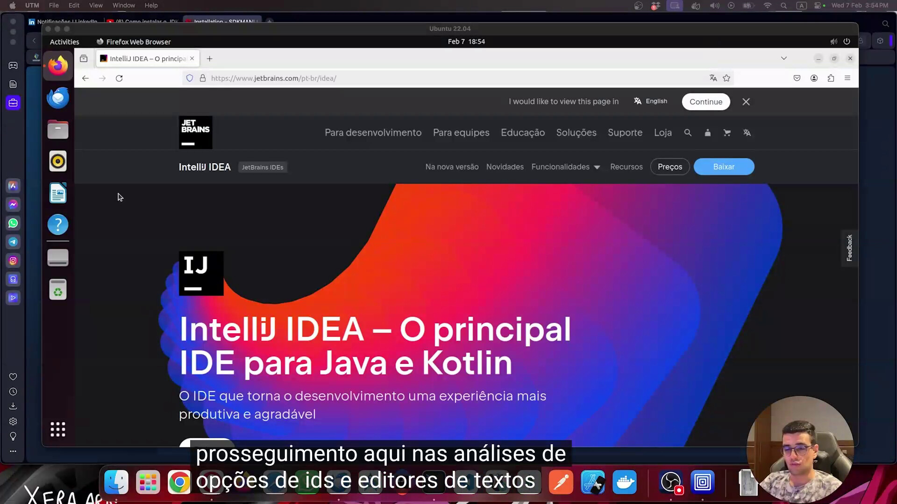
</p>

Esta é a página oficial do IntelliJ IDEA no site da JetBrains (jetbrains.com/pt-br/idea), o ponto de partida para obter a IDE. A página de apresentação destaca o IntelliJ IDEA como a principal IDE para Java e Kotlin, com foco em produtividade. É a partir dela que o processo de download é iniciado, clicando na opção "Baixar" no menu superior.

<p align="center">
  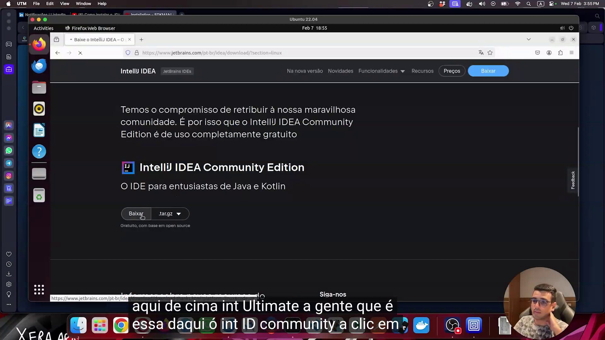
</p>

Aqui já estamos na página específica de download, onde a JetBrains apresenta duas opções: a versão paga **IntelliJ IDEA Ultimate** e, logo abaixo, a versão gratuita **IntelliJ IDEA Community Edition**, indicada para quem está começando com Java. É essa versão Community que deve ser baixada, selecionando o formato `.tar.gz` (adequado para instalação manual no Linux) e clicando no botão "Baixar".

<p align="center">
  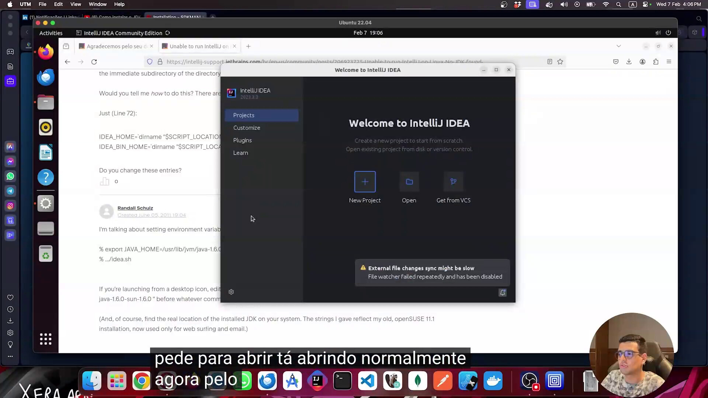
</p>

Esta tela mostra a janela de boas-vindas do IntelliJ IDEA ("Welcome to IntelliJ IDEA") sendo aberta com sucesso pelo atalho criado durante a instalação. Esse momento representa a resolução do problema de variável de ambiente `JAVA_HOME`, contornado ao apontar o script de inicialização do IntelliJ para o diretório `current` do SDKMAN, que sempre referencia a versão de Java em uso. A partir dessa tela é possível criar um novo projeto, abrir um projeto existente ou obtê-lo via controle de versão (VCS).

<p align="center">
  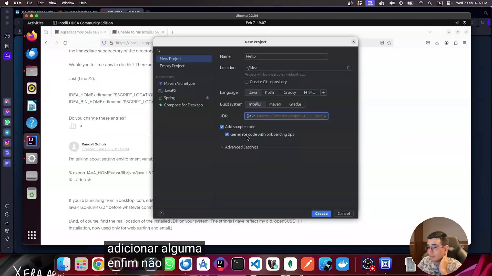
</p>

Nesta tela é exibida a janela de criação de um novo projeto ("New Project"), com o nome definido como **Hello** e localização em `~/idea`. A linguagem selecionada é **Java**, o sistema de build escolhido é o próprio **IntelliJ** (sem uso de Maven ou Gradle), e o JDK já aparece detectado automaticamente pela IDE. As opções "Add sample code" e "Generate code with onboarding tips" também estão disponíveis, mas o código de exemplo não é utilizado, optando-se por configurar a classe manualmente em seguida.

<p align="center">
  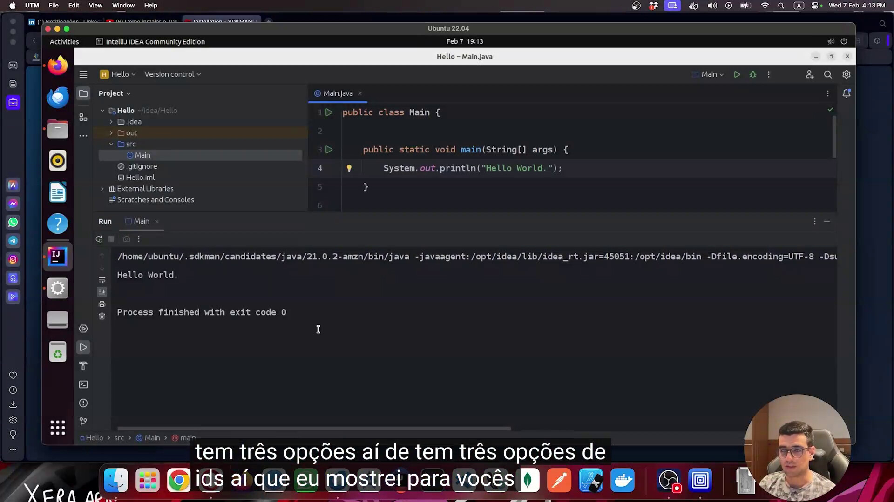
</p>

Esta imagem mostra o projeto **Hello** já criado e a classe **Main** configurada dentro do diretório `src`, contendo o método `main` (criado com o atalho `psvm`) e uma instrução de impressão. O painel inferior exibe a execução do programa, com a saída "Hello World." e a mensagem `Process finished with exit code 0`, confirmando que a configuração do IntelliJ foi concluída com sucesso.

```java
public class Main {

    public static void main(String[] args) {
        System.out.println("Hello World.");
    }

}
```
      

### 🟩 Vídeo 11 - Executando primeiro programa no IntelliJ

<video width="60%" controls>
  <source src="000-Midia_e_Anexos/fundamentos_da_linguagem_de_programacao_java-modulo.01-curso.01-video_11.webm" type="video/webm">
    Seu navegador não suporta vídeo HTML5.
</video>

link do vídeo: https://web.dio.me/track/formacao-java-fundamentals/course/introducao-ao-java-e-seu-ambiente-de-desenvolvimento/learning/d99dd277-d48c-4ff4-907b-719626a26cc3?autoplay=1

### Anotações

#### IDEs online: uma alternativa para testar código

<p align="center">
  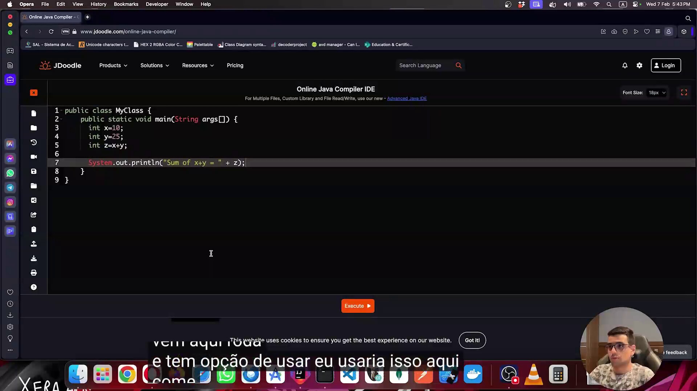
</p>

A imagem mostra o JDoodle, um compilador Java online, com um código de exemplo já carregado que declara duas variáveis inteiras, soma seus valores e imprime o resultado no console. É uma opção útil para testar pequenos trechos de código rapidamente, sem precisar configurar um ambiente local, mas não substitui uma IDE completa para desenvolver projetos, já que recursos como autocomplete tendem a ser mais limitados nessas ferramentas online.

```java
public class MyClass {
    public static void main(String args[]) {
        int x=10;
        int y=25;
        int z=x+y;

        System.out.println("Sum of x+y = " + z);
    }
}
```

#### Compilando o código com javac

<p align="center">
  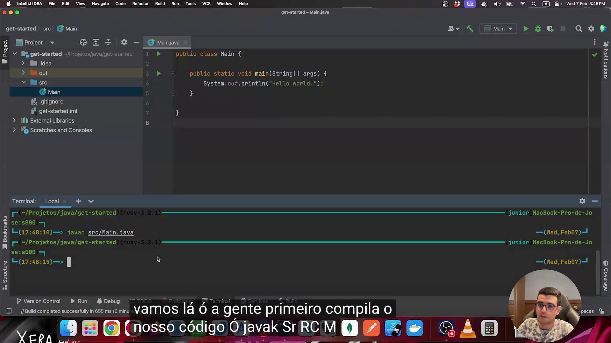
</p>

Aqui a IDE IntelliJ está sendo usada para compilar manualmente o arquivo `Main.java` pelo terminal, com o comando `javac`. Esse comando gera o arquivo `.class` correspondente, que é o resultado da compilação da classe e o que efetivamente será executado pela JVM.

```bash
javac src/Main.java
```

#### Executando o programa pelo terminal

<p align="center">
  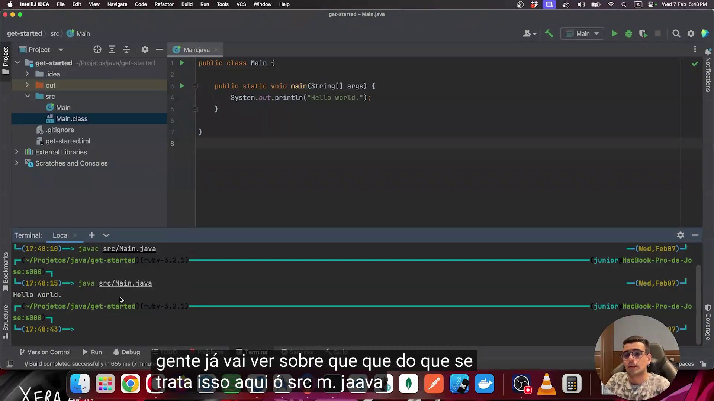
</p>

Depois de compilado, o programa é executado pelo terminal com o comando `java`, apontando para o arquivo compilado. O console exibe o resultado do `System.out.println`, imprimindo a mensagem "Hello world." definida no código.

```bash
java src/Main.java
```

#### Executando pela IDE (botão Run)

<p align="center">
  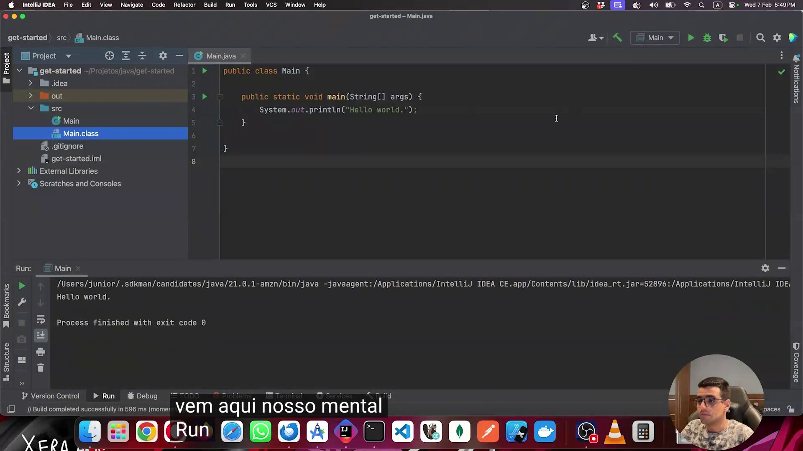
</p>

Aqui o mesmo programa é executado agora pelo botão Run da própria IDE, em vez de pelo terminal. O painel de execução mostra a saída "Hello world." e a informação "Process finished with exit code 0", indicando que o programa terminou sem erros. Ao rodar dessa forma, o IntelliJ organiza os arquivos compilados em uma estrutura própria (pasta de output), em vez de deixá-los soltos junto ao código-fonte.

#### Trabalhando com argumentos de linha de comando (args)

<p align="center">
  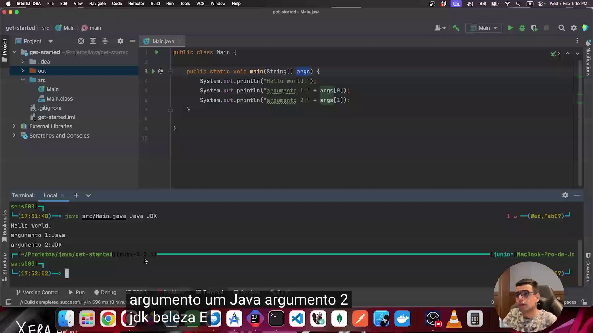
</p>

O código foi alterado para imprimir os valores recebidos em `args[0]` e `args[1]`, o parâmetro `String[] args` do método `main` que armazena os argumentos passados na linha de comando. No terminal, ao compilar e executar passando "Java" e "JDK" como argumentos separados por espaço, o console exibe "Hello world.", "argumento 1:Java" e "argumento 2:JDK", confirmando que cada valor foi corretamente acessado pela posição correspondente no array.

```java
public static void main(String[] args) {
    System.out.println("Hello world.");
    System.out.println("argumento 1:" + args[0]);
    System.out.println("argumento 2:" + args[1]);
}
```

#### Configurando argumentos de programa na IDE

<p align="center">
  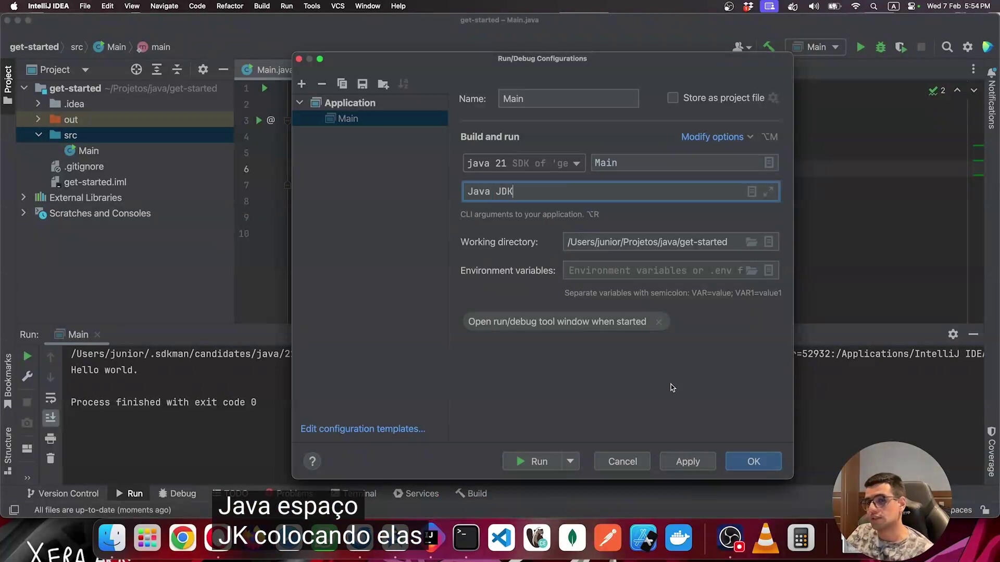
</p>

Esta é a janela de Run/Debug Configurations do IntelliJ, aberta em Run > Edit Configurations. Nela é possível definir qual JDK usar, a classe principal, o working directory, variáveis de ambiente e, principalmente, o campo "Program arguments" — preenchido aqui com "Java JDK" — que permite passar argumentos para o programa diretamente pela IDE, sem precisar digitá-los no terminal.


#### Debug: parando em um breakpoint

<p align="center">
  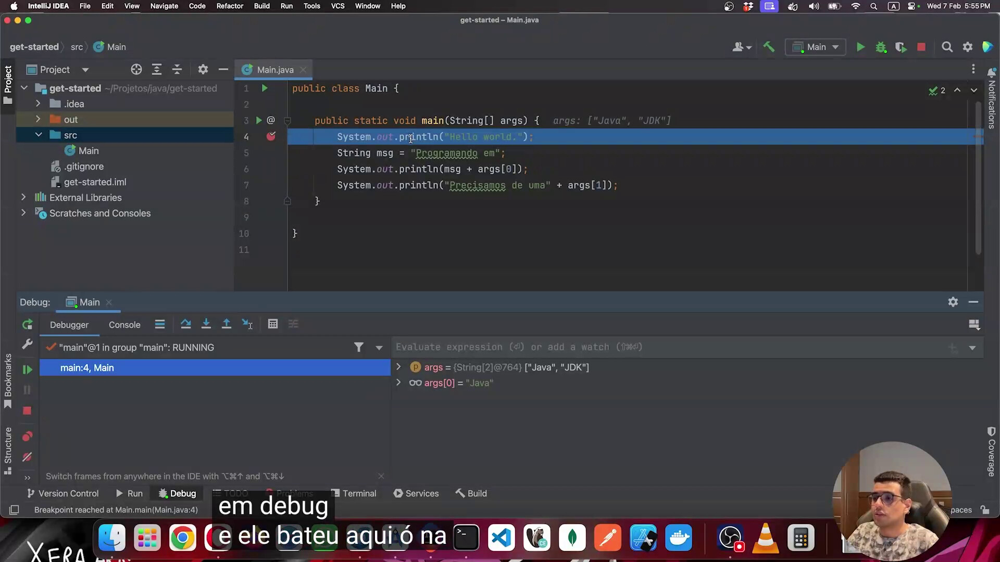
</p>

Com um breakpoint definido na primeira linha do método `main`, a execução em modo Debug para exatamente naquele ponto, sem executar a linha marcada. O painel de Debug exibe as variáveis disponíveis no contexto atual, incluindo o array `args` com os valores "Java" e "JDK", permitindo inspecionar o estado do programa antes de prosseguir.

```java
public static void main(String[] args) {
    System.out.println("Hello world.");
    String msg = "Programando em";
    System.out.println(msg + args[0]);
    System.out.println("Precisamos de uma" + args[1]);
}
```

#### Finalizando a execução em modo Debug

<p align="center">
  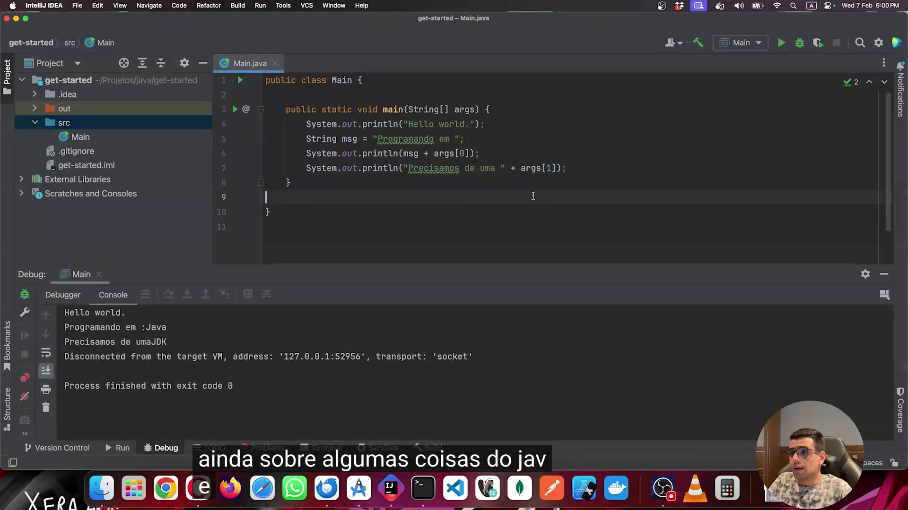
</p>

Após liberar a execução do restante do código no debugger (Step Out), o console mostra a saída completa do programa: "Hello world.", "Programando em :Java" e "Precisamos de uma JDK", seguidas da mensagem de desconexão da VM de destino e "Process finished with exit code 0", indicando que a sessão de debug terminou normalmente após percorrer todas as linhas do método `main`.
 

### 🟩 Vídeo 12 - Executando primeiro programa no VSCode

<video width="60%" controls>
  <source src="000-Midia_e_Anexos/fundamentos_da_linguagem_de_programacao_java-modulo.01-curso.01-video_12.webm" type="video/webm">
    Seu navegador não suporta vídeo HTML5.
</video>

link do vídeo: https://web.dio.me/track/formacao-java-fundamentals/course/introducao-ao-java-e-seu-ambiente-de-desenvolvimento/learning/0f4307c6-c4f6-4a37-a0aa-ef94b723afc2?autoplay=1

### Anotações

<p align="center">
  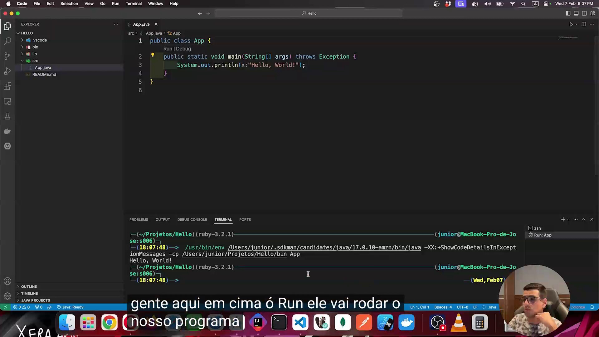
</p>

Nesta primeira imagem, o VS Code está com o projeto **Hello** aberto, exibindo o arquivo `App.java` com o código mais simples possível:

```java
public class App {
    public static void main(String[] args) throws Exception {
        System.out.println("Hello, World!");
    }
}
```

No terminal, na parte inferior, é possível ver que o programa acabou de ser executado através do botão **Run** (que aparece logo acima da declaração do método `main`). A saída confirma a execução bem-sucedida com o texto `Hello, World!` impresso no console, junto com o comando completo que o VS Code montou por trás dos panos, chamando o `java` a partir do JDK configurado e apontando para a pasta `bin` do projeto.

<p align="center">
  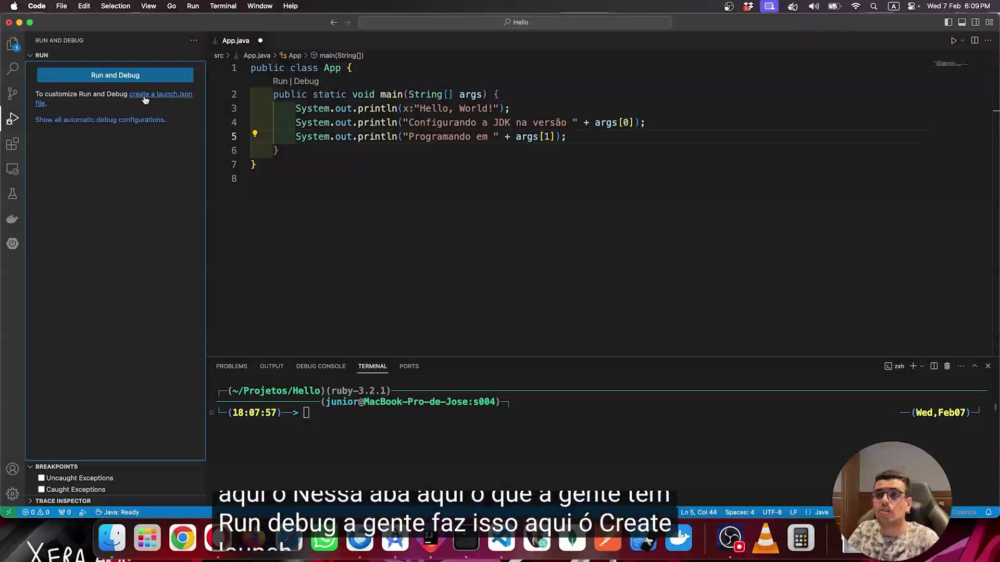
</p>

O código do `App.java` foi expandido com duas novas linhas que utilizam o array `args` recebido pelo método `main`:

```java
public class App {
    public static void main(String[] args) {
        System.out.println("Hello, World!");
        System.out.println("Configurando a JDK na versão " + args[0]);
        System.out.println("Programando em " + args[1]);
    }
}
```

Essas linhas leem, respectivamente, a posição `0` e a posição `1` do array de argumentos. No painel lateral esquerdo, a aba **Run and Debug** está aberta, mostrando o botão **Run and Debug** e o link **create a launch.json file**, que é justamente o recurso usado para configurar como o programa deve ser executado — inclusive para poder passar argumentos de linha de comando para ele, já que apenas rodar com o botão padrão não permite fornecer esses valores.

<p align="center">
  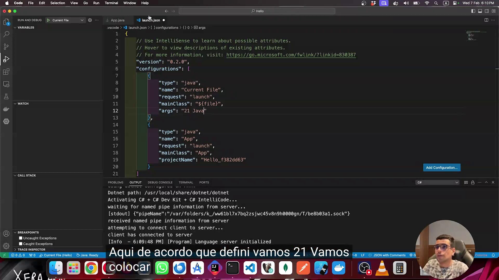
</p>

Aqui já foi gerado o arquivo `launch.json`, dentro da pasta `.vscode`, responsável por definir as configurações de execução e depuração do projeto Java no VS Code:

```json
{
    "version": "0.2.0",
    "configurations": [
        {
            "type": "java",
            "name": "Current File",
            "request": "launch",
            "mainClass": "${file}",
            "args": "21 Java"
        },
        {
            "type": "java",
            "name": "App",
            "request": "launch",
            "mainClass": "App",
            "projectName": "Hello_f382dd63"
        }
    ]
}
```

O ponto de destaque é a chave `"args"`, adicionada manualmente à primeira configuração (`"Current File"`). É nela que ficam os valores que serão recebidos pelo array `args` do método `main`: a string `"21"` cai na posição `args[0]` e `"Java"` cai na posição `args[1]`, exatamente as posições lidas no código mostrado na imagem anterior.

<p align="center">
  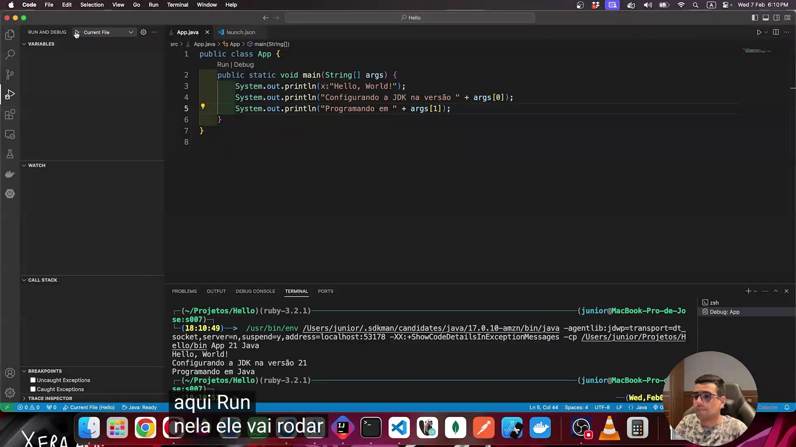
</p>

Com o `launch.json` configurado, o seletor de configuração no topo do painel **Run and Debug** agora exibe **Current File** como opção ativa. Ao executar essa configuração, o terminal mostra a saída completa do programa:

```
Hello, World!
Configurando a JDK na versão 21
Programando em Java
```

Isso confirma que os argumentos definidos no `launch.json` (`21` e `Java`) foram corretamente recebidos pelo array `args` dentro do `App.java`, preenchendo as mensagens que dependiam de `args[0]` e `args[1]`.

<p align="center">
  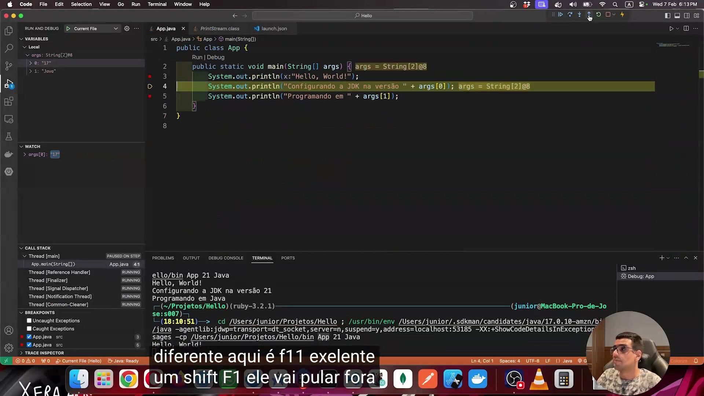
</p>

O programa agora está em modo de **depuração (debug)**, pausado em um breakpoint (marcado pelo ponto vermelho ao lado do número da linha). No painel **Variables**, à esquerda, é possível inspecionar o conteúdo do array `args` em tempo real:

```
args: String[2]@8
  0: "17"
  1: "Java"
```

O painel **Watch** também está sendo usado para acompanhar especificamente o valor de `args[0]`. Na parte inferior, o **Call Stack** mostra a thread `main` pausada na execução (`PAUSED ON STEP`), enquanto na barra de ferramentas superior ficam disponíveis os botões de navegação da depuração — como o **Step Into** (atalho `F11`), usado para entrar dentro de uma chamada de método, e o **Step Out** (atalho `Shift+F11`), usado para sair de um método e retornar ao ponto de chamada.

<p align="center">
  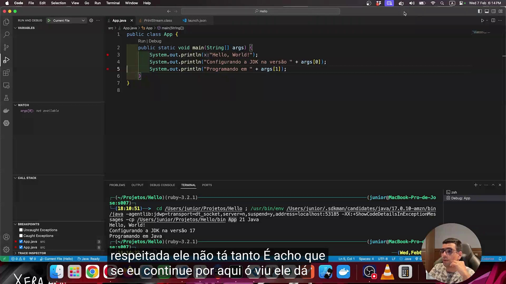
</p>

Nesta última imagem, dois breakpoints estão marcados nas linhas 3 e 5 do `App.java` (pontos vermelhos), mas a execução não está mais pausada em nenhum deles — o painel **Watch** exibe `args[0]: not available`, indicando que o processo de debug já foi finalizado ou está fora de um ponto de parada ativo. No terminal, o histórico mostra duas execuções: uma com a JDK configurada como versão **17** e a saída `Programando em Java`. Esse comportamento é consistente com o uso de **breakpoints condicionais**, em que o programa só interrompe a execução quando uma expressão booleana definida pelo desenvolvedor é satisfeita — caso contrário, a execução simplesmente continua sem parar naquele ponto.
   

# Certificado: Introdução ao Java e seu Ambiente de Desenvolvimento

- Link na plataforma: https://hermes.dio.me/certificates/YUJLSOAA.pdf
- Certificado em pdf: [Certificado-Introdução ao Java e seu Ambiente de Desenvolvimento.pdf](./000-Midia_e_Anexos/Certificado-Introdução.ao.Java.e.seu.Ambiente.de.Desenvolvimento.pdf)