## Instrutor

- José Luiz Abreu Cardoso Junior (Engenheiro de software sênior)
- Contato Linkedin: / [juniorjrjl](https://www.linkedin.com/in/juniorjrjl/)

## Parte 1 - Fundamentos da Linguagem de Programação Java

### 🟩 Vídeo 01 - Padrões de desenvolvimento e conceitos

<video width="60%" controls>
  <source src="000-Midia_e_Anexos/fundamentos_da_linguagem_de_programacao_java-modulo.02-curso.01-video_01.webm" type="video/webm">
    Seu navegador não suporta vídeo HTML5.
</video>

link do vídeo: https://web.dio.me/track/formacao-java-fundamentals/course/fundamentos-da-linguagem-de-programacao-java/learning/19451f79-b808-4284-bdc1-90ab09e7926d?autoplay=1

### Anotações

#### Declarando o Scanner (variável ainda não inicializada)

<p align="center">
  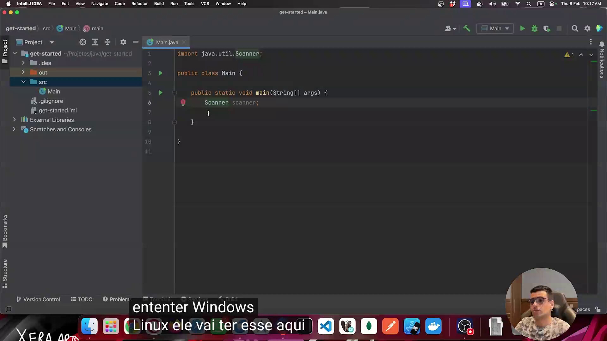
</p>

Nesta tela do IntelliJ IDEA, a classe `Main` já possui o `import java.util.Scanner;` no topo do arquivo e, dentro do método `main`, a linha `Scanner scanner;` foi declarada. O ícone de alerta vermelho ao lado da linha indica que a IDE está reclamando: a variável foi apenas declarada, reservando espaço de memória, mas ainda não foi inicializada com um objeto. Como `Scanner` é uma classe (e não um tipo primitivo), essa variável precisa receber uma instância antes de ser usada, caso contrário o código lançaria erro ao tentar utilizá-la.

```java
import java.util.Scanner;

public class Main {

    public static void main(String[] args) {
        Scanner scanner;

    }

}
```

#### Explorando a classe Scanner do JDK

<p align="center">
  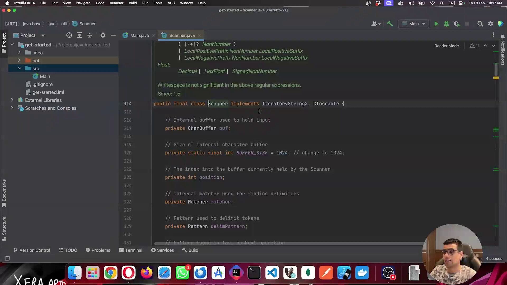
</p>

Aqui a IDE abriu o arquivo-fonte `Scanner.java`, que faz parte do próprio JDK. É possível ver a assinatura da classe (`public final class Scanner implements Iterator<String>, Closeable`) e alguns de seus atributos internos, como o buffer de caracteres, o tamanho do buffer e o `Matcher`/`Pattern` usados para localizar delimitadores. Essa navegação até o código-fonte serve para mostrar que `Scanner` é, de fato, uma classe pronta do Java, localizada dentro do pacote `java.util`, e não algo criado pelo próprio desenvolvedor.

```java
public final class Scanner implements Iterator<String>, Closeable {

    // Internal buffer used to hold input
    private CharBuffer buf;

    // Size of internal character buffer
    private static final int BUFFER_SIZE = 1024; // change to 1024;

    // The index into the buffer currently held by the Scanner
    private int position;

    // Internal matcher used for finding delimiters
    private Matcher matcher;

    // Pattern used to delimit tokens
    private Pattern delimPattern;
```

#### Configurando o limite de imports com asterisco no IntelliJ

<p align="center">
  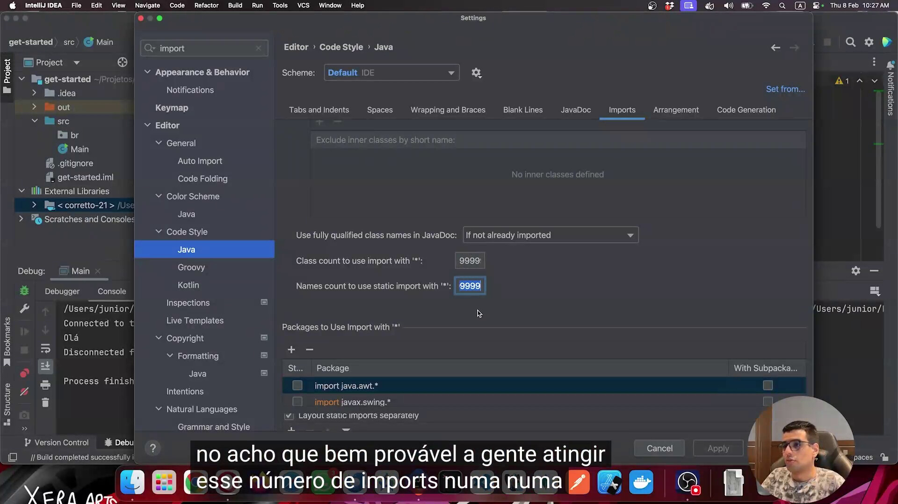
</p>

Esta imagem mostra a tela de configurações do IntelliJ IDEA, especificamente em **Editor > Code Style > Java > Imports**. Os campos "Class count to use import with '*'" e "Names count to use static import with '*'" estão ajustados para 9999. Esse ajuste é usado para evitar que a IDE substitua automaticamente vários imports individuais por um único import com asterisco (`import java.util.*;`) quando a quantidade de classes importadas de um mesmo pacote ultrapassa um determinado número — aumentando esse número para um valor bem alto, praticamente se garante que isso nunca vai acontecer automaticamente.

*Conteúdo não identificado com segurança a partir do material disponível além do que já foi descrito na tela de configurações.*

#### Capturando nome e idade com Scanner e exibindo com printf

<p align="center">
  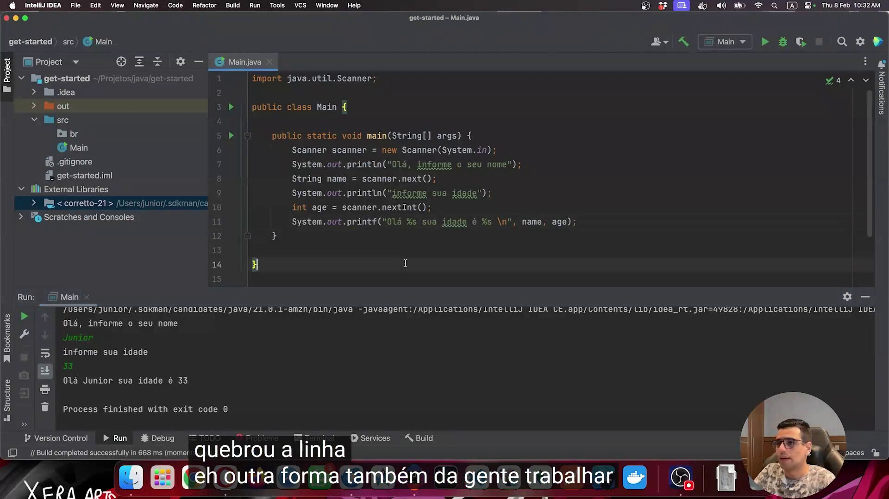
</p>

Agora o `Scanner` já está devidamente inicializado com `new Scanner(System.in)`. O programa imprime uma mensagem pedindo o nome, captura o texto digitado com `scanner.next()` em uma variável `String name`, depois pede a idade e captura um número inteiro com `scanner.nextInt()` em uma variável `int age`. Por fim, os valores são exibidos com `System.out.printf`, usando `%s` como marcador de posição para substituir pelos valores de `name` e `age`. No painel de execução, abaixo do código, é possível ver o resultado do programa rodando: ele pergunta o nome, recebe "Junior", pergunta a idade, recebe "33", e imprime "Olá Junior sua idade é 33".

```java
import java.util.Scanner;

public class Main {

    public static void main(String[] args) {
        Scanner scanner = new Scanner(System.in);
        System.out.println("Olá, informe o seu nome");
        String name = scanner.next();
        System.out.println("informe sua idade");
        int age = scanner.nextInt();
        System.out.printf("Olá %s sua idade é %s \n", name, age);
    }

}
```

#### Usando a palavra-chave var para inferência de tipo

<p align="center">
  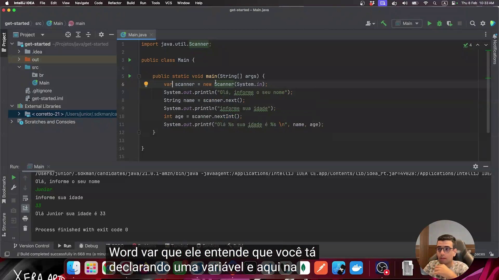
</p>

Nesta imagem, a declaração `Scanner scanner = new Scanner(System.in);` foi reescrita usando `var scanner = new Scanner(System.in);`. A palavra-chave `var` informa ao compilador que uma variável está sendo declarada, mas quem define o tipo é o valor atribuído do lado direito — nesse caso, a própria instância de `Scanner`. O restante do código (captura do nome, da idade e impressão com `printf`) permanece igual ao exemplo anterior.

```java
import java.util.Scanner;

public class Main {

    public static void main(String[] args) {
        var scanner = new Scanner(System.in);
        System.out.println("Olá, informe o seu nome");
        String name = scanner.next();
        System.out.println("informe sua idade");
        int age = scanner.nextInt();
        System.out.printf("Olá %s sua idade é %s \n", name, age);
    }

}
```

#### Declarando constantes com WELCOME_MESSAGE

<p align="center">
  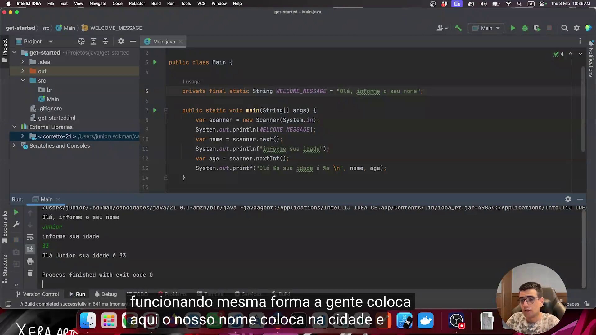
</p>

Aqui foi criada uma constante de escopo global da classe: `private final static String WELCOME_MESSAGE = "Olá, informe o seu nome";`. O uso de `final` indica que o valor não pode ser alterado depois de atribuído, `static` faz a constante pertencer à classe (e não a uma instância específica), e o nome está todo em maiúsculas com underline separando as palavras — o padrão convencional para constantes em Java. No corpo do método `main`, as demais variáveis (`scanner`, `name`, `age`) continuam declaradas com `var`, e a mensagem de boas-vindas agora é referenciada pela constante `WELCOME_MESSAGE` em vez do texto literal.

```java
import java.util.Scanner;

public class Main {

    private final static String WELCOME_MESSAGE = "Olá, informe o seu nome";

    public static void main(String[] args) {
        var scanner = new Scanner(System.in);
        System.out.println(WELCOME_MESSAGE);
        var name = scanner.next();
        System.out.println("informe sua idade");
        var age = scanner.nextInt();
        System.out.printf("Olá %s sua idade é %s \n", name, age);
    }

}
```


### 🟩 Vídeo 02 - Keywords e tipos primitivos

<video width="60%" controls>
  <source src="000-Midia_e_Anexos/fundamentos_da_linguagem_de_programacao_java-modulo.02-curso.01-video_02.webm" type="video/webm">
    Seu navegador não suporta vídeo HTML5.
</video>

link do vídeo: https://web.dio.me/track/formacao-java-fundamentals/course/fundamentos-da-linguagem-de-programacao-java/learning/ee66a618-86b7-4ee6-9b7b-8567960ad746?autoplay=1

### Anotações

<p align="center">
  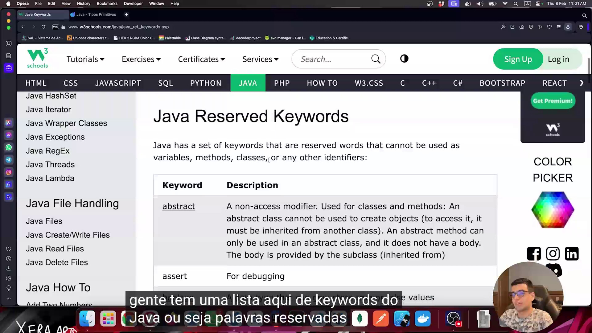
</p>

A imagem mostra a página **"Java Reserved Keywords"** do site W3Schools, aberta no navegador Opera. A tabela lista as palavras reservadas (keywords) da linguagem Java — como `abstract` e `assert`, visíveis no topo da tabela — junto de uma breve descrição de cada uma. Essas palavras não podem ser usadas como nome de variáveis, métodos, classes ou qualquer outro identificador no código.

<p align="center">
  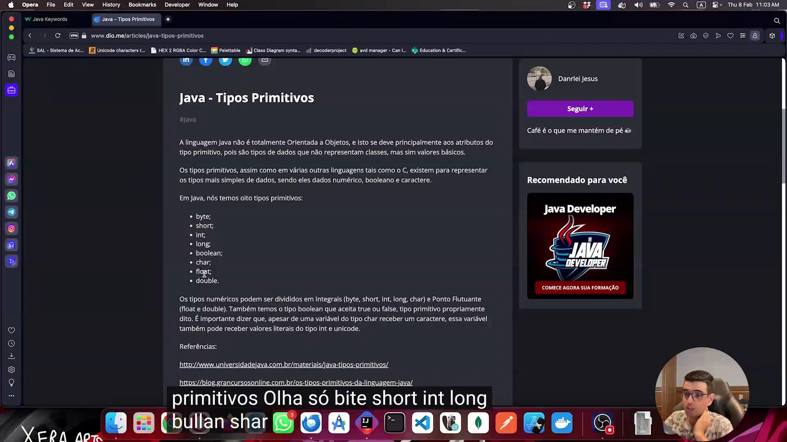
</p>

Aqui a página aberta é o artigo **"Java - Tipos Primitivos"** do site da DIO (dio.me/articles/java-tipos-primitivos). O texto explica que a linguagem Java não é totalmente orientada a objetos justamente por causa dos tipos primitivos, que representam valores básicos e não classes. Em seguida, o artigo lista os oito tipos primitivos existentes em Java:

- byte
- short
- int
- long
- boolean
- char
- float
- double

O texto complementa dizendo que os tipos numéricos se dividem entre **integrais** (byte, short, int, long, char) e de **ponto flutuante** (float e double), além do tipo **boolean**, que aceita apenas `true` ou `false`.

<p align="center">
  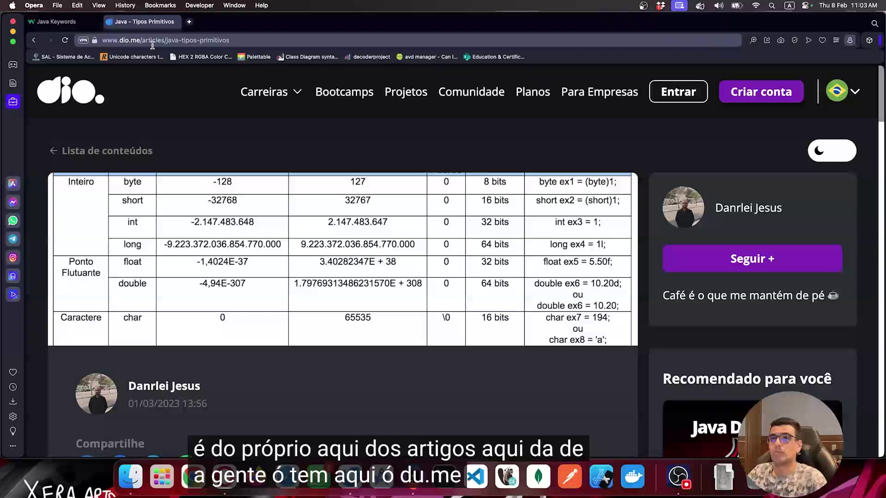
</p>

Ainda no mesmo artigo da DIO, agora é exibida a tabela com os detalhes técnicos de cada tipo primitivo: valor mínimo, valor máximo, valor padrão, tamanho em bits e um exemplo de declaração. Entre os dados apresentados:

| Categoria | Tipo | Mínimo | Máximo | Tamanho | Exemplo |
|---|---|---|---|---|---|
| Inteiro | byte | -128 | 127 | 8 bits | `byte ex1 = (byte)1;` |
| Inteiro | short | -32768 | 32767 | 16 bits | `short ex2 = (short)1;` |
| Inteiro | int | -2.147.483.648 | 2.147.483.647 | 32 bits | `int ex3 = 1;` |
| Inteiro | long | -9.223.372.036.854.770.000 | 9.223.372.036.854.770.000 | 64 bits | `long ex4 = 1l;` |
| Ponto Flutuante | float | -1,4024E-37 | 3.40282347E+38 | 32 bits | `float ex5 = 5.50f;` |
| Ponto Flutuante | double | -4,94E-307 | 1.79769313486231570E+308 | 64 bits | `double ex6 = 10.20d;` ou `double ex6 = 10.20;` |
| Caractere | char | 0 | 65535 | 16 bits | `char ex7 = 194;` ou `char ex8 = 'a';` |

Essa tabela reforça a diferença entre os sufixos usados na declaração (como `L` para long, `f` para float e `d` para double) e o intervalo de valores que cada tipo é capaz de armazenar.

<p align="center">
  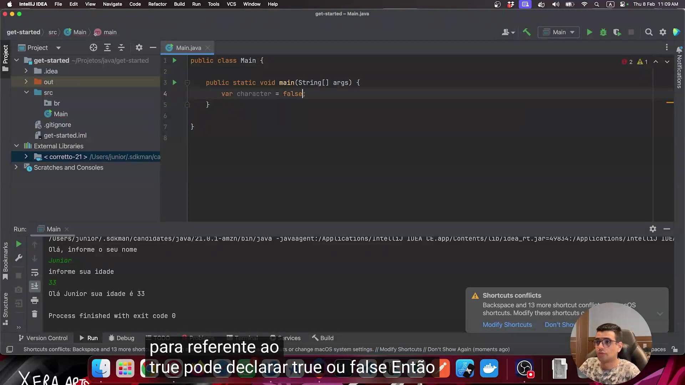
</p>

Agora a tela mostra o IntelliJ IDEA com uma variável declarada usando `var`, recebendo o valor `false`:

```java
public class Main {

    public static void main(String[] args) {
        var character = false;
    }

}
```

Como o valor atribuído é `false`, o compilador infere automaticamente que o tipo da variável é `boolean`, mesmo sem essa palavra aparecer explicitamente na declaração.

<p align="center">
  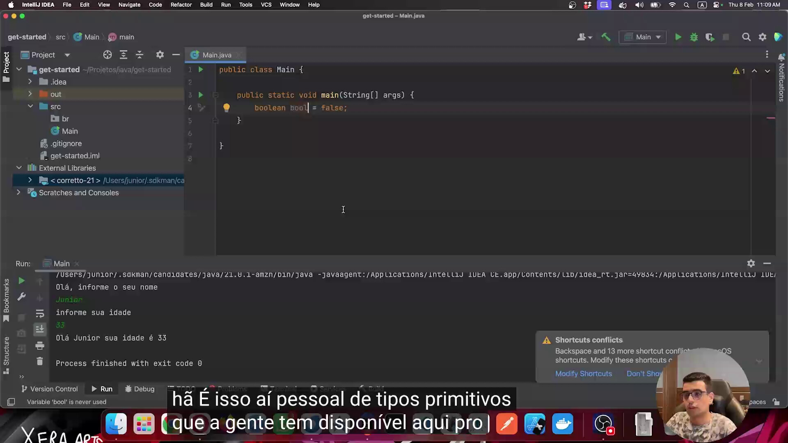
</p>

Por fim, a mesma variável aparece agora com o tipo explícito no lugar de `var`:

```java
public class Main {

    public static void main(String[] args) {
        boolean bool = false;
    }

}
```

O IDE sinaliza um aviso ("Variable 'bool' is never used") apenas porque a variável foi declarada mas não é utilizada em nenhum outro ponto do código — isso não impede a compilação, é apenas um alerta de boas práticas do IntelliJ.


### 🟩 Vídeo 03 - Trabalhando com Operadores de Atribuição e Lógicos

<video width="60%" controls>
  <source src="000-Midia_e_Anexos/fundamentos_da_linguagem_de_programacao_java-modulo.02-curso.01-video_03.webm" type="video/webm">
    Seu navegador não suporta vídeo HTML5.
</video>

link do vídeo: https://web.dio.me/track/formacao-java-fundamentals/course/fundamentos-da-linguagem-de-programacao-java/learning/fe92dd91-7304-415f-a35c-1d75e53cb22b?autoplay=1

### 🟩 Vídeo 04 - Trabalhando com Operadores Aritméticos

<video width="60%" controls>
  <source src="000-Midia_e_Anexos/fundamentos_da_linguagem_de_programacao_java-modulo.02-curso.01-video_04.webm" type="video/webm">
    Seu navegador não suporta vídeo HTML5.
</video>

link do vídeo: https://web.dio.me/track/formacao-java-fundamentals/course/fundamentos-da-linguagem-de-programacao-java/learning/4d4d8e8e-fb65-4074-a941-d7cdfb71efc5?autoplay=1

### 🟩 Vídeo 05 - Trabalhando com Operadores Bitwise (Bit-a-Bit)

<video width="60%" controls>
  <source src="000-Midia_e_Anexos/fundamentos_da_linguagem_de_programacao_java-modulo.02-curso.01-video_05.webm" type="video/webm">
    Seu navegador não suporta vídeo HTML5.
</video>

link do vídeo: https://web.dio.me/track/formacao-java-fundamentals/course/fundamentos-da-linguagem-de-programacao-java/learning/063222d1-e3ba-41cd-8eec-658cf9ec1c95?autoplay=1

### 🟩 Vídeo 06 - Exercícios

<video width="60%" controls>
  <source src="000-Midia_e_Anexos/fundamentos_da_linguagem_de_programacao_java-modulo.02-curso.01-video_06.webm" type="video/webm">
    Seu navegador não suporta vídeo HTML5.
</video>

link do vídeo: https://web.dio.me/track/formacao-java-fundamentals/course/fundamentos-da-linguagem-de-programacao-java/learning/87146644-a0b3-4835-8d52-a6dd986cbcf0?autoplay=1

##  Materiais de Apoio

# Certificado: 

- Link na plataforma: 
- Certificado em pdf: