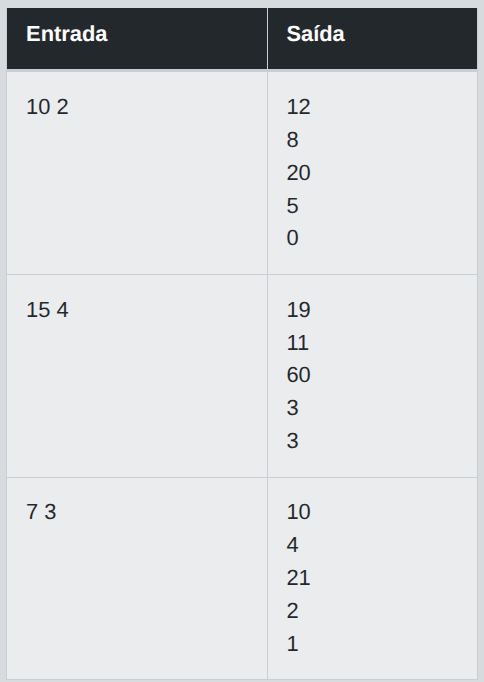
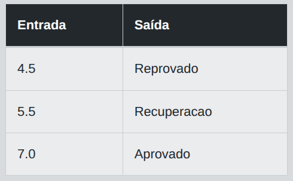

# Desafio 01 - Keywords e Tipos Primitivos

Crie um programa que receba a idade de uma pessoa e determine se ela é menor de idade, maior de idade ou idosa. Considere como referência:  

- Menor de idade: menos de 18 anos  
- Maior de idade: de 18 a 64 anos
- Idoso: 65 anos ou mais

## Entrada

A entrada deve receber um único número inteiro representando a idade da pessoa.

## Saída

Deverá retornar uma mensagem indicando a classificação da pessoa, como "Menor de idade", "Maior de idade" ou "Idoso".

## Exemplos

A tabela abaixo apresenta exemplos com alguns dados de entrada e suas respectivas saídas esperadas. Certifique-se de testar seu programa com esses exemplos e com outros casos possíveis.

<p align="center">
  
</p>

## Código Exemplo

```java
import java.util.Scanner;

public class Main {
    
    public static void main(String[] args) {

        Scanner scanner = new Scanner(System.in);

        int idade = scanner.nextInt();
        
        //TODO: Implemente a estrutura condicional para verificar a classificação da idade:
        

        scanner.close();
    }
}
```

## Solução

```java
package com.loiane.cursojava.testes.formacao_java_dio.desafios;
import java.util.Scanner;

public class Desafio_01 {

    public static void main(String[] args) {

        Scanner scanner = new Scanner(System.in);

        int idade = scanner.nextInt();
        if (idade < 18) System.out.println("Menor de idade");
        else if ((idade >= 18) && (idade < 65)) System.out.println("Maior de idade");
        else System.out.println("Idoso");

        scanner.close();
    }
}
```

### Explicação detalhada

---

O objetivo deste desafio é classificar a idade de uma pessoa em três categorias, utilizando **estruturas condicionais** (`if`, `else if`, `else`) e o **tipo primitivo `int`** para armazenar a idade.

#### 1. Leitura da entrada

```java
Scanner scanner = new Scanner(System.in);
int idade = scanner.nextInt();
```

- `Scanner` é a classe utilizada para ler dados digitados pelo usuário no console.
- `scanner.nextInt()` lê um número inteiro digitado e o armazena na variável `idade`.
- `idade` é declarada como `int` (tipo primitivo), pois representa um número inteiro sem casas decimais — apropriado para representar anos de vida.

#### 2. Estrutura condicional

```java
if (idade < 18) {
    System.out.println("Menor de idade");
} else if ((idade >= 18) && (idade < 65)) {
    System.out.println("Maior de idade");
} else {
    System.out.println("Idoso");
}
```

A lógica é avaliada **em sequência, de cima para baixo**, e a primeira condição verdadeira é a que define a saída:

1. **`if (idade < 18)`**
   Verifica se a idade é menor que 18. Se for verdadeiro, imprime `"Menor de idade"` e o restante do bloco é ignorado.

2. **`else if ((idade >= 18) && (idade < 65))`**
   Só é avaliado se a primeira condição for falsa (ou seja, `idade >= 18`). Aqui verificamos se a idade está no intervalo de 18 (inclusive) até 64 (pois `idade < 65`). O operador lógico `&&` (E lógico) exige que **ambas** as condições sejam verdadeiras simultaneamente.

3. **`else`**
   Se nenhuma das condições anteriores foi satisfeita, significa que `idade >= 65`, então o programa imprime `"Idoso"`.

> 💡 Observação: como a condição do `else if` só é avaliada quando `idade >= 18` (a primeira já falhou), tecnicamente a verificação `idade >= 18` dentro do `else if` é redundante — mas deixá-la explícita torna o código mais legível e menos propenso a erros caso a ordem das condições mude no futuro.

#### 3. Encerramento do Scanner

```java
scanner.close();
```

Fecha o `Scanner` para liberar o recurso de entrada (boa prática, evita *warnings* e vazamento de recursos).

#### 4. Testando com os exemplos

| Entrada | Condição avaliada | Saída |
|---|---|---|
| `10` | `10 < 18` → verdadeiro | `Menor de idade` |
| `18` | `18 < 18` → falso; `18 >= 18 && 18 < 65` → verdadeiro | `Maior de idade` |
| `64` | `64 < 18` → falso; `64 >= 18 && 64 < 65` → verdadeiro | `Maior de idade` |
| `65` | `65 < 18` → falso; `65 >= 18 && 65 < 65` → falso | `Idoso` |
| `90` | ambas falsas | `Idoso` |

#### 5. Conceitos de Java aplicados

- **Tipos primitivos**: `int` para armazenar valores inteiros de forma eficiente em memória.
- **Estruturas condicionais (`if`/`else if`/`else`)**: permitem que o programa tome decisões diferentes conforme o valor da variável.
- **Operadores relacionais**: `<`, `>=` para comparar valores numéricos.
- **Operador lógico `&&`**: combina duas condições, exigindo que ambas sejam verdadeiras.
- **Entrada de dados via `Scanner`**: forma padrão de capturar dados do usuário em aplicações console no Java.  

---

# Desafio 02 - Trabalhando com Operadores

Escreva um programa que receba dois números inteiros e exiba a soma, subtração, multiplicação, divisão inteira e o resto da divisão entre eles.

## Entrada

A entrada deve receber dois números inteiros separados por espaço

## Saída

Deverá retornar os resultados das operações aritméticas solicitadas em linhas separadas, na seguinte ordem: soma, subtração, multiplicação, divisão inteira, e resto da divisão.

## Exemplos

A tabela abaixo apresenta exemplos com alguns dados de entrada e suas respectivas saídas esperadas. Certifique-se de testar seu programa com esses exemplos e com outros casos possíveis.

<p align="center">
  
</p>

## Código Exemplo

```java
import java.util.Scanner;

public class Main {

    public static void main(String[] args) {

        Scanner scanner = new Scanner(System.in);

        int a = scanner.nextInt();
        int b = scanner.nextInt();
        
        //TODO: Implemente as operações solicitadas na descrição  e exibir o resultado

        scanner.close();
    }
}
```

## Solução

```java
package com.loiane.cursojava.testes.formacao_java_dio.desafios;

import java.util.Scanner;

public class Desafio_02 {
    public static void main(String[] args) {

        Scanner scanner = new Scanner(System.in);

        int a = scanner.nextInt();
        int b = scanner.nextInt();

        System.out.println(a+b);
        System.out.println(a-b);
        System.out.println(a*b);
        System.out.println(a/b);
        System.out.println(a%b);

        scanner.close();
    }
}
```
## Explicação Detalhada

O programa precisa ler dois números inteiros e calcular cinco operações aritméticas básicas entre eles, exibindo cada resultado em uma linha separada, na ordem: soma, subtração, multiplicação, divisão inteira e resto da divisão (módulo).

### 1. Leitura da entrada

```java
Scanner scanner = new Scanner(System.in);

int a = scanner.nextInt();
int b = scanner.nextInt();
```

- `Scanner` é a classe usada para ler dados digitados pelo usuário (ou vindos da entrada padrão).
- `scanner.nextInt()` lê um valor inteiro por vez. Como a entrada tem dois números separados por espaço, o `Scanner` sabe separar os tokens automaticamente — não é necessário fazer `split()` manual como faríamos com uma `String`.
- `a` recebe o primeiro número lido e `b` o segundo.

### 2. As cinco operações

```java
System.out.println(a+b);
System.out.println(a-b);
System.out.println(a*b);
System.out.println(a/b);
System.out.println(a%b);
```

| Operação | Operador | Explicação |
|---|---|---|
| Soma | `a + b` | Soma normal entre os dois inteiros. |
| Subtração | `a - b` | Subtrai `b` de `a`. |
| Multiplicação | `a * b` | Multiplica os dois valores. |
| Divisão inteira | `a / b` | Como `a` e `b` são `int`, a divisão em Java descarta a parte decimal automaticamente (trunca em direção a zero). Ex: `7 / 2 = 3`, não `3.5`. |
| Resto da divisão | `a % b` | O operador `%` (módulo) retorna o que sobra da divisão inteira. Ex: `7 % 2 = 1`. |

**Ponto-chave sobre divisão inteira:** em Java, quando ambos os operandos de `/` são do tipo `int`, o resultado também é `int`, e qualquer parte fracionária é descartada — não há arredondamento. Se você quisesse o resultado com casas decimais, precisaria converter (`(double) a / b`).

### 3. Encerramento do Scanner

```java
scanner.close();
```

Fecha o recurso `Scanner` para liberar a entrada padrão. É uma boa prática, embora em muitos exercícios simples não cause diferença perceptível se for esquecido.

### Exemplo prático

Para a entrada:
```
10 3
```

O programa calcula:
- Soma: `10 + 3 = 13`
- Subtração: `10 - 3 = 7`
- Multiplicação: `10 * 3 = 30`
- Divisão inteira: `10 / 3 = 3` (o `.333...` é descartado)
- Resto: `10 % 3 = 1`

Saída:
```
13
7
30
3
1
```

### Cuidado com casos extremos

- **Divisão por zero:** se `b` for `0`, a linha `a/b` (e `a%b`) lançará uma exceção `ArithmeticException: / by zero`, pois divisão inteira por zero não é definida e o Java interrompe a execução. O desafio não pede tratamento desse caso, mas é bom ter em mente para cenários reais.
- **Números negativos:** o operador `%` em Java segue o sinal do dividendo (`a`). Ex: `-7 % 2 = -1`, diferente da definição matemática de módulo usada em outras linguagens.

### Resumo

A solução é direta porque Java já oferece operadores aritméticos nativos que fazem exatamente o que o desafio pede. O aprendizado principal aqui está em entender **como o Java trata tipos `int`** na divisão (truncamento, sem casas decimais) e como funciona o operador `%` para obter o resto.   

---

# Desafio 03 - Estrutura Condicional If-Else

Implemente um programa que receba a nota de um estudante (de 0 a 10) e informe se ele foi "Reprovado" (nota < 5), está em "Recuperação" (nota entre 5 e 6.9), ou foi "Aprovado" (nota ≥ 7).

## Entrada

A entrada deve receber um número decimal representando a nota do estudante.

## Saída

Deverá retornar uma mensagem indicando o status do estudante: "Reprovado", "Recuperacao" ou "Aprovado"

## Exemplos

A tabela abaixo apresenta exemplos com alguns dados de entrada e suas respectivas saídas esperadas. Certifique-se de testar seu programa com esses exemplos e com outros casos possíveis.

<p align="center">
  
</p>

## Código Exemplo

```java
import java.util.Scanner;

public class Main {
    
    public static void main(String[] args) {

        Scanner scanner = new Scanner(System.in);

        double nota = scanner.nextDouble();
        //TODO: Implemente a estrutura condicional para verificar a classificação da nota:

        scanner.close();
    }
}
```

## Solução

```java
package com.loiane.cursojava.testes.formacao_java_dio.desafios;
import java.util.Locale;
import java.util.Scanner;

public class Desafio_03 {
    public static void main(String[] args) {
        Scanner scanner = new Scanner(System.in).useLocale(Locale.US);
        double nota = scanner.nextDouble();

        if (nota <= 5) System.out.println("Reprovado");
        else if ((nota > 5) && (nota<=6.9)) System.out.println("Recuperacao");
        else System.out.println("Aprovado");

        scanner.close();
    }
}
```

### Explicação detalhada   

#### Objetivo

Classificar a nota de um estudante (0 a 10) em três categorias:
- **Reprovado**: nota < 5
- **Recuperação**: 5 ≤ nota < 7 (no enunciado: "entre 5 e 6.9")
- **Aprovado**: nota ≥ 7

#### 1. Leitura da entrada com `Locale`

```java
Scanner scanner = new Scanner(System.in).useLocale(Locale.US);
double nota = scanner.nextDouble();
```

O método `useLocale(Locale.US)` é importante porque o `Scanner` interpreta números decimais de acordo com o *locale* configurado. Em locales como o português do Brasil, o separador decimal esperado é a **vírgula** (`7,5`), enquanto no `Locale.US` é o **ponto** (`7.5`). Isso evita o erro `InputMismatchException` quando o usuário digita a nota usando ponto como separador decimal.

#### 2. Estrutura condicional

```java
if (nota <= 5) System.out.println("Reprovado");
else if ((nota > 5) && (nota <= 6.9)) System.out.println("Recuperacao");
else System.out.println("Aprovado");
```

- **`if (nota <= 5)`**: se a nota for menor ou igual a 5, imprime `"Reprovado"`.
- **`else if ((nota > 5) && (nota <= 6.9))`**: caso contrário, se a nota estiver estritamente acima de 5 e até 6.9, imprime `"Recuperacao"`.
- **`else`**: qualquer valor restante (ou seja, nota > 6.9) imprime `"Aprovado"`.

Como as três condições são mutuamente exclusivas e cobrem toda a reta numérica (nota ≤ 5, 5 < nota ≤ 6.9, nota > 6.9), o `if/else if/else` garante que **exatamente uma** mensagem seja impressa para qualquer valor de entrada.

#### ⚠️ Ponto de atenção (possível divergência com o enunciado)

O enunciado define:
- Reprovado: **nota < 5**
- Recuperação: **nota entre 5 e 6.9** (ou seja, 5 ≤ nota ≤ 6.9)

Mas o código usa `nota <= 5` na primeira condição. Isso faz com que **nota == 5** caia em "Reprovado", quando pelo enunciado deveria cair em "Recuperacao". 

Se quiser alinhar exatamente com a especificação, a correção seria:

```java
if (nota < 5) System.out.println("Reprovado");
else if (nota <= 6.9) System.out.println("Recuperacao"); // ou nota < 7
else System.out.println("Aprovado");
```

Repare que, dentro do `else if`, não é necessário testar `nota > 5` novamente — se o código chegou até ali, é porque a condição do `if` anterior (`nota < 5`) já foi falsa, então `nota` já é automaticamente ≥ 5. Isso simplifica a lógica e evita testes redundantes.

#### Resumo do fluxo

| Nota digitada | Condição avaliada | Saída |
|---|---|---|
| 3.5 | `nota < 5` → verdadeiro | Reprovado |
| 5.0 | `nota < 5` → falso; `nota <= 6.9` → verdadeiro | Recuperacao |
| 6.9 | `nota < 5` → falso; `nota <= 6.9` → verdadeiro | Recuperacao |
| 7.0 | ambas falsas | Aprovado |
| 9.8 | ambas falsas | Aprovado |

#### Conceitos praticados

- Estrutura condicional `if / else if / else`
- Operadores relacionais (`<`, `<=`, `>`, `>=`)
- Operador lógico `&&` (E lógico)
- Leitura de tipos primitivos (`double`) com `Scanner`
- Configuração de `Locale` para tratamento correto de separadores decimais
