## Instrutor

- José Luiz Abreu Cardoso Junior (Engenheiro de software sênior)
- Contato Linkedin: / [juniorjrjl](https://www.linkedin.com/in/juniorjrjl/)


### 🟩 Vídeo 01 - Projeto de Jogo do Sudoku

<video width="60%" controls>
  <source src="000-Midia_e_Anexos/bootcamp_ntt_data_java_spring_ai-modulo.02-curso.05-video_01.webm" type="video/webm">
    Seu navegador não suporta vídeo HTML5.
</video>

link do vídeo: https://web.dio.me/project/criando-um-jogo-do-sudoku/learning/2bb0ec4c-a3a7-4358-a6b2-9bf47ab13eda?back=/track/formacao-java-fundamentals&tab=undefined&moduleId=undefined

### Visão Geral do Projeto

O vídeo apresenta um projeto desafio para desenvolver um jogo de Sudoku em Java. O objetivo é aplicar os conhecimentos adquiridos no curso para criar uma aplicação funcional e interativa, seguindo um conjunto de requisitos obrigatórios e alguns opcionais para quem busca um desafio extra.

### 1. Conceitos Fundamentais do Sudoku

*   **Estrutura do Tabuleiro:**
    *   O Sudoku é jogado em uma grade 9x9.
    *   Esta grade é dividida em nove subgrades 3x3, frequentemente chamadas de "blocos" ou "setores".
*   **Objetivo do Jogo:**
    *   Preencher todas as células vazias com números de 1 a 9.
    *   O jogo começa com algumas células já preenchidas (números fixos).
*   **Regras Essenciais:**
    *   **Linhas:** Cada linha deve conter todos os números de 1 a 9, sem repetições.
    *   **Colunas:** Cada coluna deve conter todos os números de 1 a 9, sem repetições.
    *   **Blocos 3x3:** Cada um dos nove blocos 3x3 deve conter todos os números de 1 a 9, sem repetições.
*   **Condição de Vitória:** O jogo termina quando todas as células estão preenchidas corretamente, respeitando todas as regras.

### 2. Requisitos Obrigatórios do Projeto

#### 2.1. Menu Interativo
*   **Detalhe:** O programa deve apresentar um menu interativo que permita ao jogador escolher entre as seguintes opções: iniciar um novo jogo, colocar um número, remover um número, verificar o jogo, verificar o status, limpar o jogo e finalizar o jogo.
*   **Insight:** Um menu bem estruturado é crucial para a usabilidade. Considere um loop principal que exibe o menu e processa a entrada do usuário até que uma opção de saída seja selecionada.

#### 2.2. Exibir Jogo Inicial
*   **Detalhe:** Ao iniciar, o jogo deve exibir o tabuleiro com os números iniciais preenchidos.
*   **Entrada de Dados:** Os números iniciais e suas posições devem ser fornecidos como argumentos de linha de comando (ex: `numero,linha,coluna`).
*   **Indexação:** O vídeo sugere que o usuário pode pensar em índices de 1 a 9, mas lembra que a implementação interna (arrays/listas) provavelmente usará indexação de 0 a 8.
*   **Insight:** Utilizar argumentos de linha de comando torna o jogo flexível, permitindo carregar diferentes quebra-cabeças sem alterar o código-fonte. A clareza na exibição do tabuleiro é fundamental para a experiência do jogador.

#### 2.3. Colocar Novo Número
*   **Detalhe:** O sistema deve solicitar ao jogador o número a ser colocado, o índice horizontal (coluna) e o índice vertical (linha).
*   **Validação:**
    *   Não é permitido colocar um número em uma posição que já esteja preenchida (seja por um número fixo inicial ou por um número colocado anteriormente pelo jogador).
    *   Para alterar um número já colocado pelo jogador, ele deve ser removido primeiro e depois inserido novamente.
*   **Insight:** A validação rigorosa da entrada do usuário é essencial para manter a integridade das regras do Sudoku. A regra de "remover antes de inserir" simplifica a lógica de atualização de células.

#### 2.4. Remover Número
*   **Detalhe:** O sistema deve solicitar os índices vertical e horizontal do número que o jogador deseja remover.
*   **Validação:**
    *   Apenas números colocados pelo jogador podem ser removidos.
    *   Números fixos (iniciais do jogo) não podem ser removidos. Se o jogador tentar remover um número fixo, uma mensagem de erro deve ser exibida.
*   **Insight:** Diferenciar entre números fixos e números do jogador é um conceito chave. Isso pode ser implementado com uma propriedade booleana em cada célula (ex: `isFixed`).

#### 2.5. Verificar Jogo (Visualizar)
*   **Detalhe:** Esta opção deve exibir a situação atual do tabuleiro do jogo, mostrando todos os números preenchidos (fixos e do jogador) e os espaços vazios.
*   **Propósito:** Permite ao jogador visualizar o progresso e identificar onde ainda precisa preencher.
*   **Insight:** Uma representação clara e formatada do tabuleiro no console é vital para a jogabilidade, mesmo sem uma interface gráfica.

#### 2.6. Verificar Status do Jogo
*   **Detalhe:** O sistema deve informar o status atual do jogo, que pode ser:
    *   **Não Iniciado:** O tabuleiro contém apenas os números iniciais fornecidos. Este status é **sempre sem erros**.
    *   **Incompleto:** O jogo foi iniciado, alguns números foram colocados pelo jogador, mas nem todas as células estão preenchidas.
    *   **Completo:** Todas as células do tabuleiro estão preenchidas.
*   **Verificação de Erros:** Para os status "Incompleto" e "Completo", o sistema também deve indicar se o jogo **contém erros** (ou seja, viola as regras do Sudoku) ou está **sem erros**.
    *   **Lógica de Erro:** Para verificar erros, o programa deve percorrer todas as células e checar se há números repetidos em qualquer linha, coluna ou bloco 3x3.
*   **Insight:** Este é um dos requisitos mais complexos e importantes. A implementação de um sistema de status com verificação de erros fornece feedback crucial ao jogador. Considere usar um `enum` para os estados do jogo (ex: `NAO_INICIADO`, `INCOMPLETO`, `COMPLETO`) e uma função separada para a validação das regras do Sudoku.

#### 2.7. Limpar Jogo
*   **Detalhe:** Esta opção deve remover todos os números que foram colocados pelo jogador, mantendo apenas os números fixos iniciais do jogo.
*   **Propósito:** Permite ao jogador "resetar" sua tentativa atual e começar a preencher o tabuleiro novamente a partir do estado inicial, sem iniciar um novo jogo do zero.
*   **Insight:** Uma funcionalidade de "limpar" é um recurso de usabilidade valioso, oferecendo uma maneira rápida de desfazer todas as ações do jogador.

#### 2.8. Finalizar Jogo
*   **Detalhe:** Se o jogo estiver no status "Completo" e "sem erros", o programa deve exibir uma mensagem de parabéns e encerrar.
*   **Validação:** Se o jogo não estiver "Completo" ou se "contiver erros", o sistema deve informar ao usuário que o jogo não pode ser finalizado e que ele precisa preencher todos os espaços corretamente.
*   **Insight:** Este requisito define o ponto final do jogo, validando a vitória do jogador e fornecendo uma conclusão clara.

### 3. Dicas de Implementação (Insights)

*   **Programação Orientada a Objetos (POO):**
    *   **Recomendação:** O vídeo enfatiza fortemente o uso de POO para organizar o código.
    *   **Modelagem:**
        *   **Célula (Square/Cell):** Defina uma classe `Cell` (ou `Square`) para representar cada quadradinho do Sudoku. Esta classe pode ter atributos como `value` (o número), `isFixed` (booleano indicando se é um número inicial), `isFilled` (booleano indicando se foi preenchido pelo jogador).
        *   **Herança (Opcional):** Você pode até considerar herança, com `EditableCell` e `NonEditableCell` herdando de uma classe base `Cell`.
        *   **Setor/Bloco (Sector/Block):** Crie uma classe para representar os blocos 3x3, que pode conter uma coleção de objetos `Cell`.
        *   **Tabuleiro (Board):** A classe principal `Board` pode gerenciar todas as `Cell`s e `Sector`s, e conter a lógica de validação e manipulação do jogo.
    *   **Benefício:** POO ajuda a criar um código mais modular, legível, fácil de manter e expandir.
*   **Estruturas de Dados:** Escolha as estruturas de dados adequadas (ex: arrays bidimensionais, listas de listas) para representar o tabuleiro e suas células de forma eficiente.
*   **Enums:** Para os diferentes estados do jogo (Não Iniciado, Incompleto, Completo), o uso de `enum`s pode tornar o código mais claro e menos propenso a erros do que strings ou números mágicos.

### 4. Requisitos Extras (Opcionais - Desafios Adicionais)

Estes requisitos são para quem deseja se aprofundar e aprimorar seus conhecimentos, não sendo obrigatórios para a conclusão do projeto.

#### 4.1. Ambiente Gráfico (GUI)
*   **Detalhe:** Em vez de usar o terminal, implemente a interface do usuário do jogo usando uma biblioteca gráfica em Java, como AWT ou Swing.
*   **Benefício:** Uma GUI proporciona uma experiência de usuário muito mais rica, visualmente atraente e interativa.
*   **Justificativa para Opcional:** O curso não abordou o desenvolvimento de interfaces gráficas, o que adiciona uma camada de complexidade que pode ser nova para alguns alunos.

#### 4.2. Números de Rascunho (Scratch Numbers)
*   **Detalhe:** Permita que o jogador coloque múltiplos números pequenos dentro de uma célula como "rascunhos" ou "anotações" de possíveis valores.
*   **Comportamento:** Esses números de rascunho não devem interferir na lógica de validação do jogo (ou seja, não são considerados números "reais" para as regras do Sudoku).
*   **Benefício:** É uma funcionalidade comum em jogos de Sudoku que auxilia o jogador na estratégia de eliminação e na visualização de possibilidades.
*   **Justificativa para Opcional:** Exibir múltiplos números pequenos dentro de uma única célula no terminal seria desafiador de implementar de forma clara e legível.

### 5. Conclusão e Suporte

*   Os requisitos obrigatórios são considerados totalmente alcançáveis com o conhecimento fornecido no curso.
*   Os requisitos extras são uma excelente oportunidade para se desafiar e aprender mais sobre tópicos avançados como GUI e design de UX.
*   Em caso de dúvidas, o instrutor está disponível para ajudar, e a pesquisa em fóruns e documentações é sempre encorajada.
*   Boa sorte no desafio!

### 🟩 Vídeo 02 - Esboçando a Solução

<video width="60%" controls>
  <source src="000-Midia_e_Anexos/bootcamp_ntt_data_java_spring_ai-modulo.02-curso.05-video_02.webm" type="video/webm">
    Seu navegador não suporta vídeo HTML5.
</video>

link do vídeo: https://web.dio.me/lab/criando-um-jogo-do-sudoku/learning/7655c3f1-dc23-4628-a217-4b4e5721aae7

### Anotações

#### O desafio: o tabuleiro de Sudoku

<p align="center">
  
</p>

A imagem mostra o enunciado visual do exercício: um tabuleiro de Sudoku 9x9, com algumas células já preenchidas (as dicas fixas do jogo) e outras em branco, que deverão ser completadas pelo jogador. As linhas mais grossas delimitam visualmente os nove blocos de 3x3 células, cada um devendo conter os números de 1 a 9 sem repetição — assim como cada linha e cada coluna do tabuleiro completo. É esse tabuleiro que serve de ponto de partida para pensar em como representar o jogo em código: quantas "posições" existem, quais delas já vêm preenchidas e quais precisam ser validadas.

#### Rascunho inicial das classes Board e Space

<p align="center">
  
</p>

Aqui aparece o primeiro esboço, feito no draw.io, das duas entidades identificadas a partir do enunciado: a classe **Board** (o tabuleiro) e a classe **Space** (cada espaço individual do tabuleiro). Nesse momento os atributos ainda são apenas placeholders genéricos ("field: type"), já que o objetivo é somente mapear quais entidades existem antes de decidir os tipos e nomes definitivos de cada propriedade. É um exercício de esboço, não a versão final do modelo.

#### Propriedades definidas: Space e a lista bidimensional do Board

<p align="center">
  
</p>

O diagrama evolui e agora mostra as propriedades já definidas para cada classe. A classe **Space** ganhou três atributos: `fixed: boolean`, que indica se aquele espaço já vem preenchido de fábrica e não pode ser alterado pelo jogador; `actual: Integer`, o valor atualmente preenchido naquele espaço (usado como objeto para poder aceitar nulo, já que a posição pode estar vazia); e `expected: int`, o valor correto esperado para aquele espaço, usado como tipo primitivo por sempre ter um valor definido. Já a classe **Board** foi simplificada para uma única propriedade, `spaces: List<List<Space>>` — uma lista de listas de Space, escolhida justamente para representar as nove linhas e nove colunas do tabuleiro em uma estrutura bidimensional.

Essa escolha por `List` não foi arbitrária: antes de chegar a ela, outras estruturas de dados foram avaliadas e descartadas. Um `Map` foi considerado, mas rejeitado porque exigiria montar chaves artificiais (como uma string combinando os índices de linha e coluna) para localizar cada espaço, o que tornaria o acesso mais complicado do que o necessário. Um `Set` também foi cogitado, mas descartado porque não oferece acesso por índice — e o enunciado do jogo exige justamente informar o índice horizontal e o índice vertical ao posicionar um número, além de ser necessário manter a ordem dos elementos para representar linhas e colunas de forma consistente. A `List`, por sua vez, garante tanto a ordenação quanto o acesso direto por índice, o que se encaixa perfeitamente na necessidade de localizar qualquer espaço do tabuleiro a partir de suas coordenadas.

> **Nota complementar (fora da transcrição original):** o vídeo não discute a alternativa de usar um `Array` (`Space[][]`), mas vale registrar por que a `List` costuma ser preferida nesse tipo de cenário: um array tem tamanho fixo desde a criação, enquanto uma `List` pode crescer ou encolher, o que dá mais flexibilidade caso o tabuleiro precise suportar tamanhos diferentes de 9x9 (o próprio professor comenta a existência de sudokus com 12 espaços). Além disso, `List` oferece uma API mais rica (`add`, `remove`, `contains`, `stream()`, entre outros), enquanto um array bruto exigiria código manual para operações equivalentes. Há também questões técnicas de Java: arrays multidimensionais combinados com generics têm limitações e podem gerar avisos de "unchecked", e a covariância de arrays pode causar `ArrayStoreException` em tempo de execução — problemas que `List<List<Space>>` evita.

#### Exemplo genérico de lista de listas em Java

<p align="center">
  
</p>

Antes de aplicar o conceito diretamente ao Board e ao Space, a imagem traz um exemplo didático à parte, montado no mesmo diagrama, para ilustrar o que é uma "lista de listas" em Java. São mostradas duas listas internas de `String`: a de índice 0 contendo os nomes Lucas, Juca e Mario, e a de índice 1 contendo Maria, Luiza e Luana — todas dentro de uma lista externa do tipo `List<List<String>>`. Abaixo do diagrama aparece a declaração em código dessa estrutura:

```java
var names = new ArrayList<List<String>>();
```

A ideia é mostrar que, para acessar um valor dentro dessa estrutura, primeiro se acessa a lista externa por índice (por exemplo, `names.get(0)`) para obter uma das listas internas, e depois se acessa um elemento dentro dela por outro índice (por exemplo, `.get(1)`). Esse mesmo padrão de acesso em duas etapas é o que será usado depois para navegar pela lista bidimensional de `Space` dentro do `Board`.

Na prática, para popular essa estrutura seguindo o exemplo do diagrama (linha 0 = nomes masculinos, linha 1 = nomes femininos), o código ficaria assim:

```java
var names = new ArrayList<List<String>>();

names.add(new ArrayList<>()); // cria a linha 0
names.add(new ArrayList<>()); // cria a linha 1

// linha 0 (índice de "linha"): nomes masculinos
names.get(0).add("Lucas");   // linha 0, coluna 0
names.get(0).add("Juca");    // linha 0, coluna 1
names.get(0).add("Mario");   // linha 0, coluna 2

// linha 1 (índice de "linha"): nomes femininos
names.get(1).add("Maria");   // linha 1, coluna 0
names.get(1).add("Luiza");   // linha 1, coluna 1
names.get(1).add("Luana");   // linha 1, coluna 2

// para ler um valor específico, basta combinar linha e coluna:
String valor = names.get(1).get(2); // "Luana" (linha 1, coluna 2)
```

Note que `names.get(linha)` devolve a lista interna correspondente àquela linha, e um segundo `.get(coluna)` nessa lista devolve o valor específico. É exatamente esse raciocínio de "linha primeiro, coluna depois" que será reaproveitado mais adiante para acessar e definir um `Space` dentro do `Board`, só que usando índices numéricos de 0 a 8 em vez de nomes.

Aplicando essa mesma lógica ao tabuleiro real de 9x9, popular o `Board` significa criar 9 linhas, e em cada linha criar 9 objetos `Space`:

```java
List<List<Space>> spaces = new ArrayList<>();

for (int linha = 0; linha < 9; linha++) {
    List<Space> colunas = new ArrayList<>();
    for (int coluna = 0; coluna < 9; coluna++) {
        Space space = new Space();
        // aqui entrariam as regras para definir fixed, actual e expected
        colunas.add(space);
    }
    spaces.add(colunas); // adiciona a linha completa (9 colunas) ao tabuleiro
}

// para acessar ou alterar um espaço específico, combina-se linha e coluna:
Space espaco = spaces.get(3).get(5); // linha 3, coluna 5
espaco.setActual(7); // usuário preenche o número 7 nessa posição
```

O laço externo percorre as 9 linhas e o laço interno percorre as 9 colunas de cada linha, criando um `Space` para cada uma das 81 posições do tabuleiro. Assim como no exemplo dos nomes, `spaces.get(linha)` retorna a lista de `Space` daquela linha, e `.get(coluna)` dentro dela retorna o espaço exato — permitindo tanto ler quanto atualizar o valor de qualquer posição do Sudoku a partir dos seus índices horizontal e vertical.

**Entendendo o código passo a passo:**

A variável `spaces` representa o **tabuleiro inteiro** — é a mesma coisa que a propriedade `spaces: List<List<Space>>` da classe `Board` no diagrama. `spaces` é uma lista de listas: cada elemento dela (`spaces.get(0)`, `spaces.get(1)`, ..., `spaces.get(8)`) é **uma linha** do tabuleiro, e cada linha é, por sua vez, uma `List<Space>` com 9 objetos `Space` dentro (as colunas daquela linha) — totalizando 9 × 9 = 81 espaços.

- `List<List<Space>> spaces = new ArrayList<>();` cria a lista externa (o tabuleiro), ainda vazia.
- O `for` externo (`linha`) repete 9 vezes, uma para cada linha do tabuleiro (0 a 8).
- `List<Space> colunas = new ArrayList<>();` cria, a cada volta do laço externo, uma nova lista vazia que vai representar aquela linha específica.
- O `for` interno (`coluna`) repete 9 vezes dentro de cada linha, criando um novo `Space` e adicionando-o à lista `colunas`.
- `spaces.add(colunas);` adiciona a linha já completa (com seus 9 `Space`) à lista externa `spaces`, tornando-se `spaces.get(0)` na primeira volta, `spaces.get(1)` na segunda, e assim por diante.
- `spaces.get(3).get(5)` acessa a linha 3 e, dentro dela, a coluna 5 — obtendo o `Space` que ocupa exatamente essa posição do tabuleiro.
- `espaco.setActual(7);` altera o valor atual desse espaço específico para 7, simulando o jogador preenchendo aquela célula.

Ou seja, `spaces` é o tabuleiro completo como estrutura de dados; cada `Space` dentro dele é uma célula individual, e a combinação `spaces.get(linha).get(coluna)` é como se "aponta" para uma célula específica do Sudoku a partir de suas coordenadas.


### 🟩 Vídeo 03 - Preparando o Ambiente do Projeto

<video width="60%" controls>
  <source src="000-Midia_e_Anexos/bootcamp_ntt_data_java_spring_ai-modulo.02-curso.05-video_03.webm" type="video/webm">
    Seu navegador não suporta vídeo HTML5.
</video>

link do vídeo: https://web.dio.me/lab/criando-um-jogo-do-sudoku/learning/971cd2c4-cd35-4425-9e77-2662b180184d

### Anotações

#### BoardTemplate — constantes de índice para visualização do tabuleiro

<p align="center">
  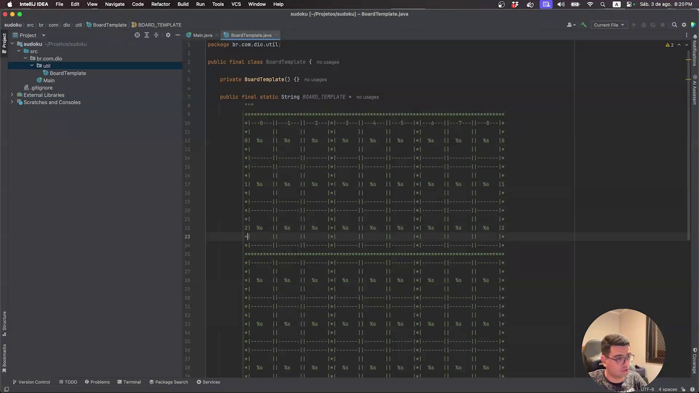
</p>


A imagem mostra a classe `BoardTemplate`, criada dentro do pacote `br.com.dio.util`. A classe é declarada como `final` para impedir herança, e possui um construtor privado, já que ela não deve ser instanciada — serve apenas como utilitário para armazenar o template de exibição do tabuleiro.

O campo `BOARD_TEMPLATE` é uma `String` estática e final, contendo um template em formato de texto com placeholders `%s` (para os valores das posições) e números de `0` a `8` posicionados nas laterais, representando os índices de cada linha e coluna. Isso facilita a leitura do tabuleiro quando o jogo for executado pelo terminal.

```java
package br.com.dio.util;

public final class BoardTemplate {

    private BoardTemplate() {}

    public final static String BOARD_TEMPLATE = """
***********************************************************************
*---0---||---1---||---2---|*---3---||---4---||---5---|*---6---||---7---||---8---|*
*|       ||       ||       |*       ||       ||       |*       ||       ||       |*
0|  %s   ||  %s   ||  %s   |*  %s   ||  %s   ||  %s   |*  %s   ||  %s   ||  %s   |0
*|       ||       ||       |*       ||       ||       |*       ||       ||       |*
*|-------||-------||-------|*-------||-------||-------|*-------||-------||-------|*
*|       ||       ||       |*       ||       ||       |*       ||       ||       |*
1|  %s   ||  %s   ||  %s   |*  %s   ||  %s   ||  %s   |*  %s   ||  %s   ||  %s   |1
*|       ||       ||       |*       ||       ||       |*       ||       ||       |*
*|-------||-------||-------|*-------||-------||-------|*-------||-------||-------|*
*|       ||       ||       |*       ||       ||       |*       ||       ||       |*
2|  %s   ||  %s   ||  %s   |*  %s   ||  %s   ||  %s   |*  %s   ||  %s   ||  %s   |2
*|       ||       ||       |*       ||       ||       |*       ||       ||       |*
*|-------||-------||-------|*-------||-------||-------|*-------||-------||-------|*
***********************************************************************
""";
}
```


#### Space — regra de posição fixa e limpeza do valor

<p align="center">
  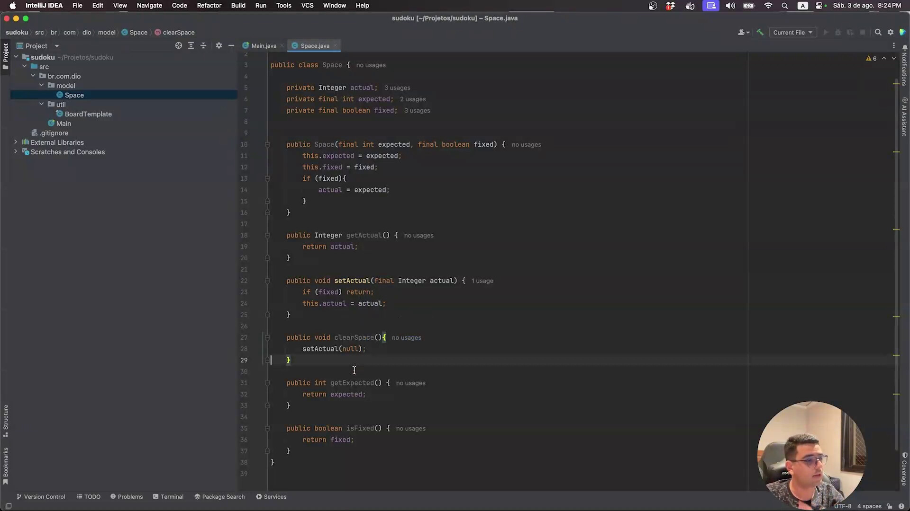
</p>


Aqui está a classe `Space`, criada no pacote `br.com.dio.model`, que representa uma posição individual do tabuleiro. Ela possui três campos: `actual` (o valor inserido pelo usuário), `expected` (o valor correto esperado para aquela posição, definido como `final`) e `fixed` (um booleano que indica se a posição pode ou não ser alterada).

No construtor, se a posição for `fixed`, o campo `actual` já recebe o valor de `expected` imediatamente. O método `setActual` respeita essa regra: se a posição for fixa, ele simplesmente retorna sem alterar nada. Também é apresentado o método `clearSpace()`, que limpa o valor atual chamando `setActual(null)` — como essa chamada passa pela verificação de `fixed`, uma posição fixa nunca é apagada por engano.

```java
package br.com.dio.model;

public class Space {

    private Integer actual;
    private final int expected;
    private final boolean fixed;

    public Space(final int expected, final boolean fixed) {
        this.expected = expected;
        this.fixed = fixed;
        if (fixed) {
            actual = expected;
        }
    }

    public Integer getActual() {
        return actual;
    }

    public void setActual(final Integer actual) {
        if (fixed) return;
        this.actual = actual;
    }

    public void clearSpace() {
        setActual(null);
    }

    public int getExpected() {
        return expected;
    }

    public boolean isFixed() {
        return fixed;
    }
}
```


#### Board — estrutura de dados como lista de listas de Space

<p align="center">
  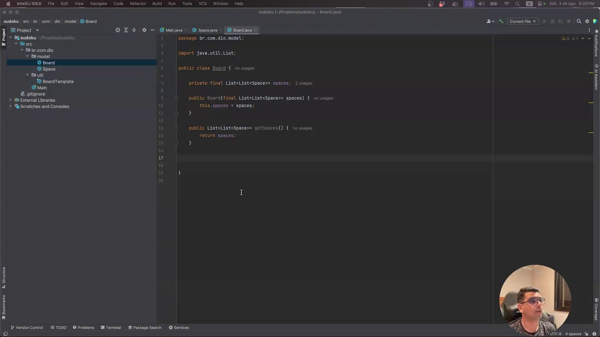
</p>


A imagem mostra o início da classe `Board`, também no pacote `br.com.dio.model`. O tabuleiro é representado por uma `List<List<Space>>`, ou seja, uma lista externa contendo listas internas de objetos `Space`. Essa estrutura foi escolhida para representar colunas (lista externa) e linhas (lista interna) do Sudoku.

O construtor recebe essa lista de listas já pronta e o método `getSpaces()` expõe apenas a leitura dela — a edição dos valores será feita por métodos específicos da própria classe `Board`, e não pelo acesso direto à lista.

```java
package br.com.dio.model;

import java.util.List;

public class Board {

    private final List<List<Space>> spaces;

    public Board(final List<List<Space>> spaces) {
        this.spaces = spaces;
    }

    public List<List<Space>> getSpaces() {
        return spaces;
    }

}
```


#### GameStatusEnum — os três estados possíveis do jogo

<p align="center">
  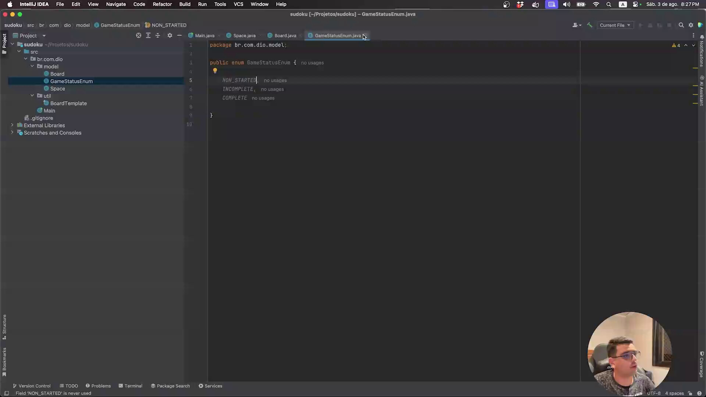
</p>


Esta imagem mostra o `enum GameStatusEnum`, criado para representar o status atual do jogo. Ele possui três valores: `NON_STARTED` (não iniciado), `INCOMPLETE` (incompleto) e `COMPLETE` (completo). Esse status é independente de o jogo conter erros ou não — um jogo incompleto ou completo pode ou não ter erros, enquanto um jogo não iniciado nunca tem erros.

```java
package br.com.dio.model;

public enum GameStatusEnum {

    NON_STARTED,
    INCOMPLETE,
    COMPLETE

}
```


#### Board — método getStatus(), determinando o status do jogo

<p align="center">
  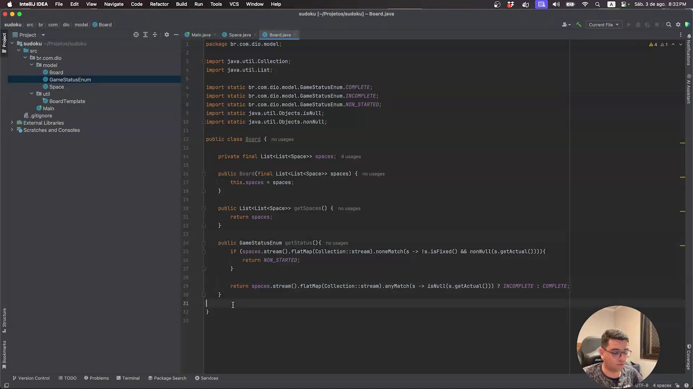
</p>


Aqui a classe `Board` já conta com o método `getStatus()`, que retorna um `GameStatusEnum`. A lógica funciona em duas etapas, usando `spaces.stream().flatMap(Collection::stream)` para percorrer todos os `Space` da estrutura (transformando a lista de listas em uma única stream):

Primeiro, verifica-se com `noneMatch` se não existe nenhuma posição não fixa (`!s.isFixed()`) que já tenha um valor preenchido (`nonNull(s.getActual())`). Se essa condição for verdadeira, significa que nenhuma posição editável foi preenchida ainda, então o status retornado é `NON_STARTED`.

Caso contrário, uma segunda verificação usa `anyMatch` para checar se existe pelo menos uma posição com `actual` nulo (`isNull(s.getActual())`). Se existir, o jogo está `INCOMPLETE`; caso todas as posições estejam preenchidas, o status é `COMPLETE`.

```java
package br.com.dio.model;

import java.util.Collection;
import java.util.List;

import static br.com.dio.model.GameStatusEnum.COMPLETE;
import static br.com.dio.model.GameStatusEnum.INCOMPLETE;
import static br.com.dio.model.GameStatusEnum.NON_STARTED;
import static java.util.Objects.isNull;
import static java.util.Objects.nonNull;

public class Board {

    private final List<List<Space>> spaces;

    public Board(final List<List<Space>> spaces) {
        this.spaces = spaces;
    }

    public List<List<Space>> getSpaces() {
        return spaces;
    }

    public GameStatusEnum getStatus() {
        if (spaces.stream().flatMap(Collection::stream).noneMatch(s -> !s.isFixed() && nonNull(s.getActual()))) {
            return NON_STARTED;
        }

        return spaces.stream().flatMap(Collection::stream).anyMatch(s -> isNull(s.getActual())) ? INCOMPLETE : COMPLETE;
    }

}
```


#### Board — hasErrors(), changeValue() e clearValue()

<p align="center">
  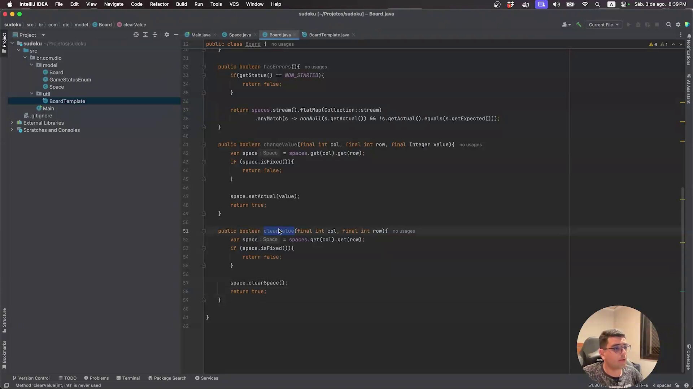
</p>


Nesta imagem, a classe `Board` ganha três novos métodos. O `hasErrors()` primeiro retorna `false` caso o status seja `NON_STARTED` (já que um jogo não iniciado nunca tem erros); caso contrário, ele percorre todos os espaços com `flatMap` e usa `anyMatch` para verificar se existe alguma posição com valor preenchido (`nonNull(s.getActual())`) cujo valor seja diferente do esperado (`!s.getActual().equals(s.getExpected())`). Basta uma ocorrência para o jogo ser considerado com erro.

O método `changeValue(col, row, value)` acessa a posição pela coluna e linha (`spaces.get(col).get(row)`), verifica se ela é fixa — se for, retorna `false` e bloqueia a edição — e, caso contrário, atualiza o valor com `setActual(value)` e retorna `true`.

Já o `clearValue(col, row)` segue a mesma lógica de acesso e verificação de posição fixa, mas em vez de definir um novo valor, chama `space.clearSpace()` para apagar o valor daquela posição.

```java
public boolean hasErrors() {
    if (getStatus() == NON_STARTED) {
        return false;
    }

    return spaces.stream().flatMap(Collection::stream)
            .anyMatch(s -> nonNull(s.getActual()) && !s.getActual().equals(s.getExpected()));
}

public boolean changeValue(final int col, final int row, final Integer value) {
    var space = spaces.get(col).get(row);
    if (space.isFixed()) {
        return false;
    }

    space.setActual(value);
    return true;
}

public boolean clearValue(final int col, final int row) {
    var space = spaces.get(col).get(row);
    if (space.isFixed()) {
        return false;
    }

    space.clearSpace();
    return true;
}
```


#### Board — reset() e gameIsFinished()

<p align="center">
  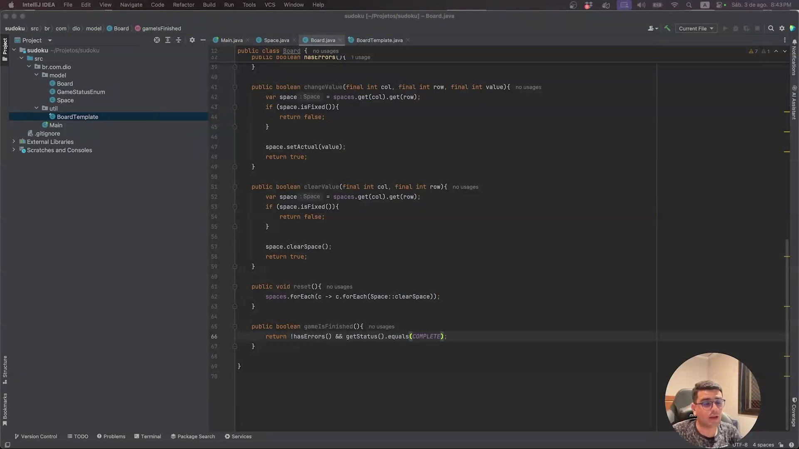
</p>


Para fechar a classe `Board`, a imagem mostra os métodos `reset()` e `gameIsFinished()`. O `reset()` percorre a lista externa com `forEach` e, para cada lista interna de colunas, chama `forEach(Space::clearSpace)` usando referência de método. Como a limpeza é feita por meio de `clearSpace()`, que internamente respeita a regra de posição fixa, o reset não altera as posições fixas do tabuleiro.

O `gameIsFinished()` retorna `true` somente se o jogo não tiver erros (`!hasErrors()`) e o status for igual a `COMPLETE` (comparado aqui com `.equals()`, embora `==` também funcionasse por se tratar de um enum). Esse método é o que permite verificar, de forma consolidada, se o Sudoku foi resolvido corretamente.

```java
public void reset() {
    spaces.forEach(c -> c.forEach(Space::clearSpace));
}

public boolean gameIsFinished() {
    return !hasErrors() && getStatus().equals(COMPLETE);
}
```


### 🟩 Vídeo 04 - Consumindo o Projeto

<video width="60%" controls>
  <source src="000-Midia_e_Anexos/bootcamp_ntt_data_java_spring_ai-modulo.02-curso.05-video_04.webm" type="video/webm">
    Seu navegador não suporta vídeo HTML5.
</video>

link do vídeo: https://web.dio.me/lab/criando-um-jogo-do-sudoku/learning/613bf590-3358-4c26-b728-a3f29e01f53e

### Anotações

#### Declarações iniciais e leitura dos argumentos do programa

<p align="center">
  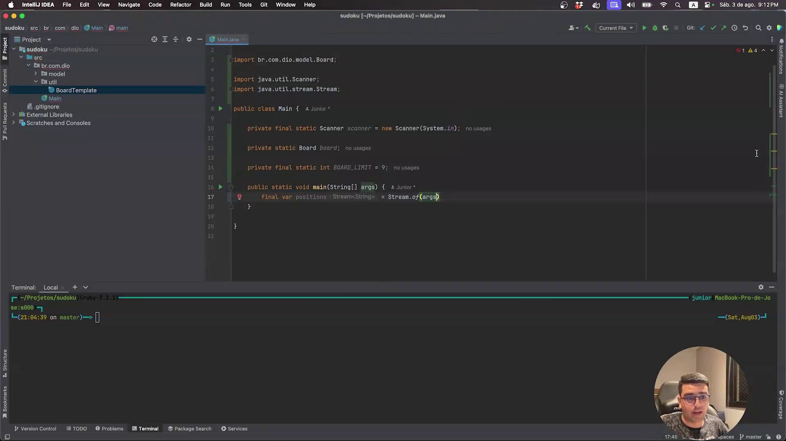
</p>

A classe `Main` recebe suas primeiras variáveis de apoio: um `Scanner` estático para capturar a entrada do usuário, uma referência estática para o `Board` (que ainda será instanciado) e uma constante `BOARD_LIMIT` fixada em 9, usada para deixar o tamanho do tabuleiro configurável. No método `main`, o primeiro passo é transformar o array `args` recebido pela linha de comando em um `Stream<String>`, ponto de partida para montar as configurações iniciais do jogo.

```java
import br.com.dio.model.Board;

import java.util.Scanner;
import java.util.stream.Stream;

public class Main {

    private final static Scanner scanner = new Scanner(System.in);

    private static Board board;

    private final static int BOARD_LIMIT = 9;

    public static void main(String[] args) {
        final var positions: Stream<String> = Stream.of(args);
    }

}
```

#### Estrutura pensada para representar cada posição do tabuleiro

<p align="center">
  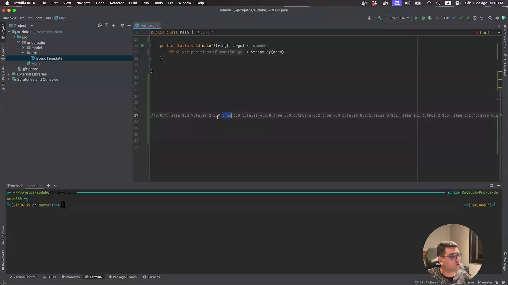
</p>

Antes de codificar a leitura dos argumentos, é deixado um comentário no próprio arquivo `Main.java` mostrando o formato que cada posição do Sudoku deve seguir ao ser passada via argumentos do programa. Cada posição é descrita como `coluna,linha;valor,fixo`, e as posições são separadas entre si por espaço.

```java
//0,0;4,false 1,0;7,false 2,0;9,true 3,0;5,false 4,0;8,true 5,0;6,true 6,0;2,true 7,0;3,false 8,0;1,false 0,1;1,false 1,1;3,true 2,1;5,false 3,1;4,false 4,1;7
```

#### Configurando os argumentos de execução na IDE

<p align="center">
  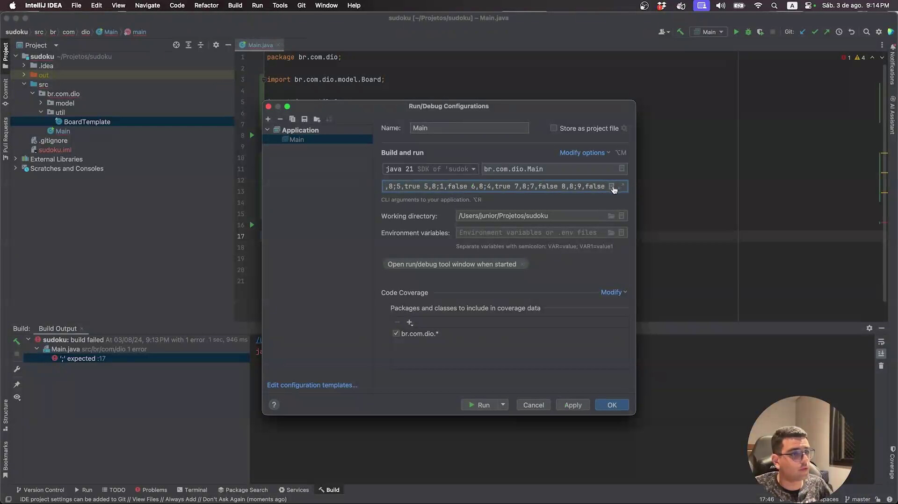
</p>

Para não precisar digitar manualmente os argumentos toda vez que o programa rodar, é aberta a tela **Run/Debug Configurations** do IntelliJ, no campo destinado aos argumentos de linha de comando (`Program arguments`). Ali é colado o conjunto de posições já no formato definido anteriormente. Nesse momento o painel de build ainda mostra um erro de compilação (`';' expected`, na linha 17), já esperado, pois o código do `main` ainda está incompleto.

```text
...,8;5,true 5,8;1,false 6,8;4,true 7,8;7,false 8,8;9,false
```

#### Visualizando a lista completa de argumentos

<p align="center">
  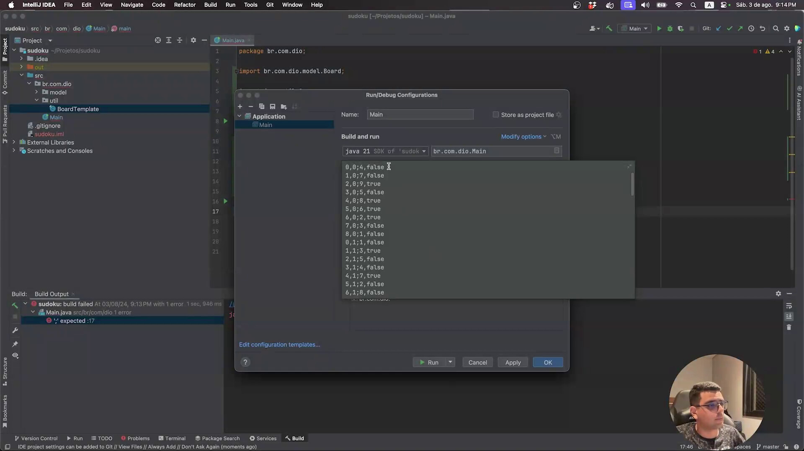
</p>

Com o campo de argumentos expandido, é possível visualizar cada posição do tabuleiro em uma linha separada, o que deixa evidente a estrutura `coluna,linha;valor,fixo` para cada uma das células já configuradas nas primeiras linhas do tabuleiro.

```text
0,0;4,false
1,0;7,false
2,0;9,true
3,0;5,false
4,0;8,true
5,0;6,true
6,0;2,true
7,0;3,false
8,0;1,false
0,1;1,false
1,1;3,true
2,1;5,false
3,1;4,false
4,1;7,true
5,1;2,false
6,1;8,false
```

#### Transformando os argumentos em um mapa de configurações

<p align="center">
  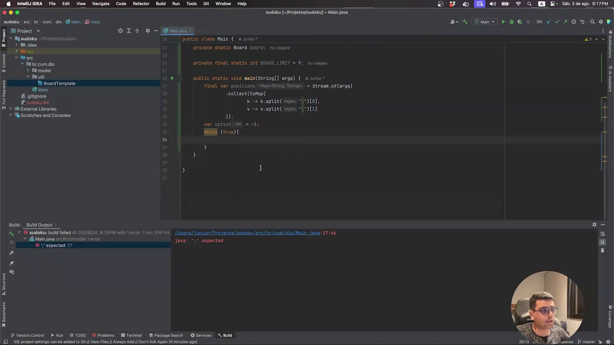
</p>

Agora o `Stream` criado a partir de `args` é convertido em um `Map<String, String>` através de `collect(toMap(...))`. A chave do mapa é obtida separando cada item pelo `;` e pegando a posição 0 (a dupla coluna/linha), enquanto o valor é a posição 1 (o valor esperado e a informação de fixo). Logo abaixo, começa a ser criada a variável `option`, inicializada em `-1`, e um laço `while (true)` que dará origem ao menu do jogo. O erro de compilação ainda aparece porque o corpo do `while` está vazio.

```java
public class Main {

    public static void main(String[] args) {
        final var positions: Map<String, String> = Stream.of(args)
                .collect(toMap(
                        k -> k.split(regex: ";")[0],
                        v -> v.split(regex: ";")[1]
                ));
        var option: int = -1;
        while (true) {

        }
    }

}
```

#### Montando as opções do menu

<p align="center">
  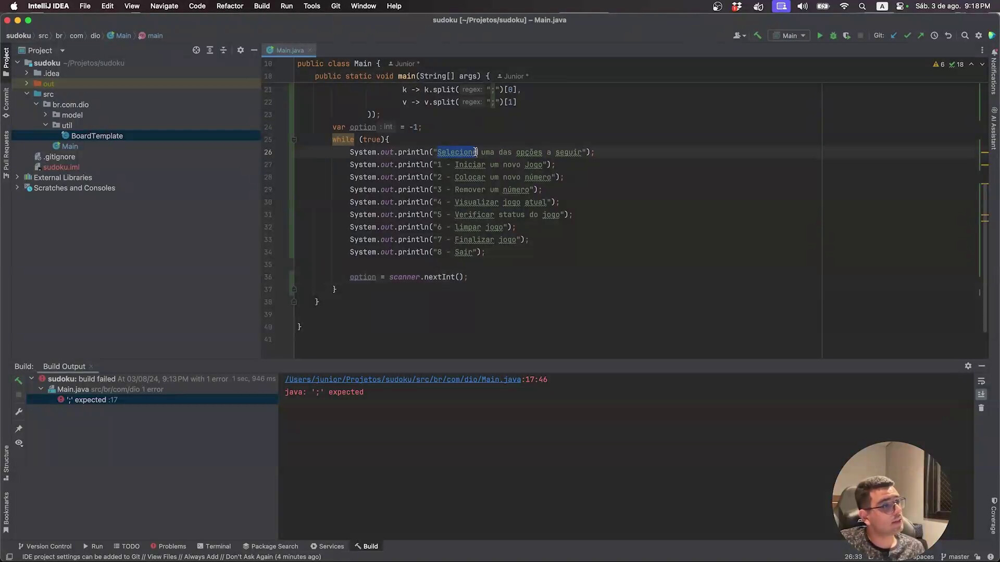
</p>

Dentro do `while (true)`, é impresso o menu textual que será exibido ao usuário a cada iteração, com as oito opções disponíveis no jogo (iniciar, colocar número, remover número, visualizar jogo, verificar status, limpar, finalizar e sair). Em seguida, a opção escolhida pelo usuário é capturada com `scanner.nextInt()` e armazenada na variável `option`.

```java
while (true) {
    System.out.println("Selecione uma das opções a seguir");
    System.out.println("1 - Iniciar um novo Jogo");
    System.out.println("2 - Colocar um novo número");
    System.out.println("3 - Remover um número");
    System.out.println("4 - Visualizar jogo atual");
    System.out.println("5 - Verificar status do jogo");
    System.out.println("6 - limpar jogo");
    System.out.println("7 - Finalizar jogo");
    System.out.println("8 - Sair");

    option = scanner.nextInt();
}
```

#### Direcionando cada opção com um switch

<p align="center">
  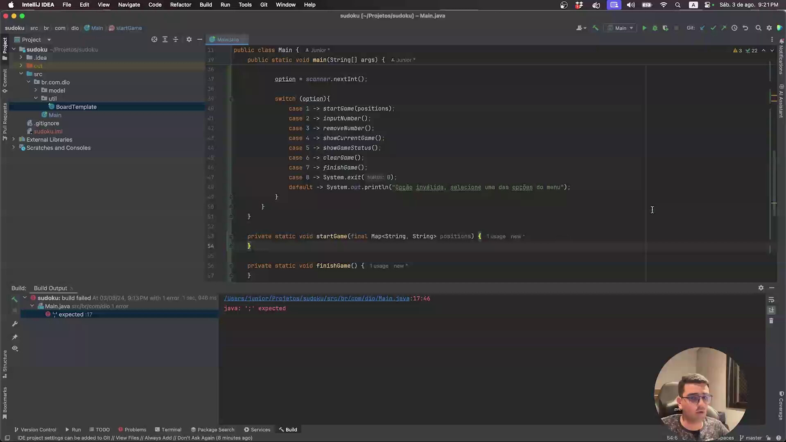
</p>

Com o valor de `option` já capturado, é montado um `switch` que direciona a execução para o método correspondente a cada opção do menu: iniciar o jogo, inserir número, remover número, mostrar o jogo atual, mostrar o status, limpar o jogo ou finalizar (encerrando a aplicação com `System.exit`). Qualquer valor fora desse intervalo cai no `default`, que avisa que a opção é inválida. Dois desses métodos, `startGame` e `finishGame`, já aparecem criados como esqueletos vazios, prontos para serem implementados.

```java
switch (option) {
    case 1 -> startGame(positions);
    case 2 -> inputNumber();
    case 3 -> removeNumber();
    case 4 -> showCurrentGame();
    case 5 -> showGameStatus();
    case 6 -> clearGame();
    case 7 -> finishGame();
    case 8 -> System.exit(0);
    default -> System.out.println("Opção inválida, selecione uma das opções do menu");
}

private static void startGame(final Map<String, String> positions) {

}

private static void finishGame() {

}
```

#### Iniciando a implementação do startGame

<p align="center">
  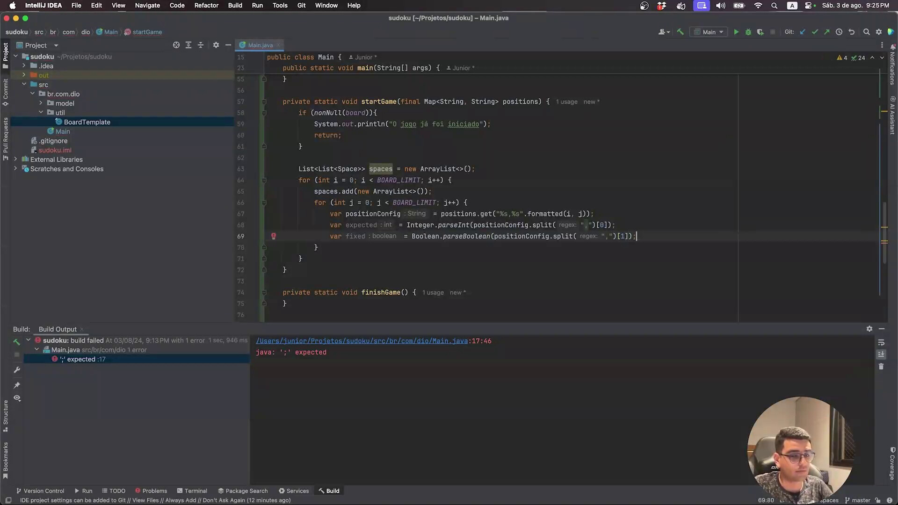
</p>

Dentro de `startGame`, a primeira validação garante que o jogo só pode ser iniciado uma vez: se `board` já não for nulo, é exibida uma mensagem avisando que o jogo já foi iniciado e o método retorna. Caso contrário, é criada uma lista de listas de `Space` (`spaces`), percorrida por dois laços `for` aninhados (linhas e colunas, ambos limitados por `BOARD_LIMIT`). Para cada posição, o valor correspondente é buscado no mapa `positions` usando uma chave formatada como `"%s,%s"`, e então esse valor é dividido pela vírgula para extrair o número esperado (`expected`) e a informação de fixo (`fixed`).

```java
private static void startGame(final Map<String, String> positions) {
    if (nonNull(board)) {
        System.out.println("O jogo já foi iniciado");
        return;
    }

    List<List<Space>> spaces = new ArrayList<>();
    for (int i = 0; i < BOARD_LIMIT; i++) {
        spaces.add(new ArrayList<>());
        for (int j = 0; j < BOARD_LIMIT; j++) {
            var positionConfig: String = positions.get("%s,%s".formatted(i, j));
            var expected: int = Integer.parseInt(positionConfig.split(regex: ",")[0]);
            var fixed: boolean = Boolean.parseBoolean(positionConfig.split(regex: ",")[1]);
        }
    }
}
```

#### Concluindo a montagem do tabuleiro

<p align="center">
  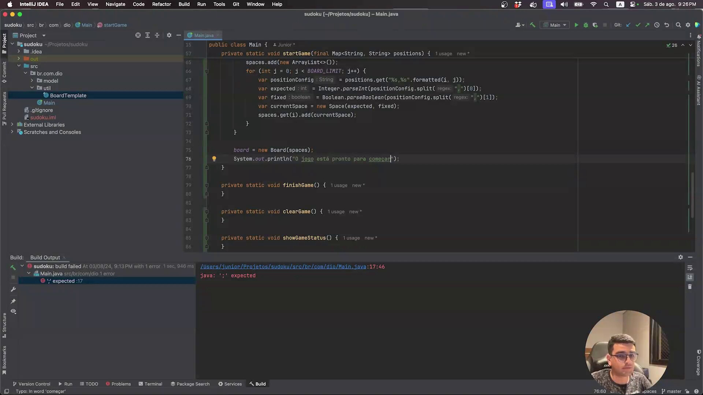
</p>

Com o valor esperado e a informação de fixo já extraídos, é instanciado um `Space` para cada posição e adicionado à respectiva linha da lista `spaces`. Depois que os dois laços terminam de percorrer todo o tabuleiro, o objeto `board` é finalmente criado a partir da lista de espaços montada, e uma mensagem informa ao usuário que o jogo está pronto para começar.

```java
private static void startGame(final Map<String, String> positions) {
    // ... validação e montagem dos espaços ...
    for (int i = 0; i < BOARD_LIMIT; i++) {
        spaces.add(new ArrayList<>());
        for (int j = 0; j < BOARD_LIMIT; j++) {
            var positionConfig: String = positions.get("%s,%s".formatted(i, j));
            var expected: int = Integer.parseInt(positionConfig.split(regex: ",")[0]);
            var fixed: boolean = Boolean.parseBoolean(positionConfig.split(regex: ",")[1]);
            var currentSpace = new Space(expected, fixed);
            spaces.get(i).add(currentSpace);
        }
    }

    board = new Board(spaces);
    System.out.println("O jogo está pronto para começar");
}
```

#### Começando o método inputNumber

<p align="center">
  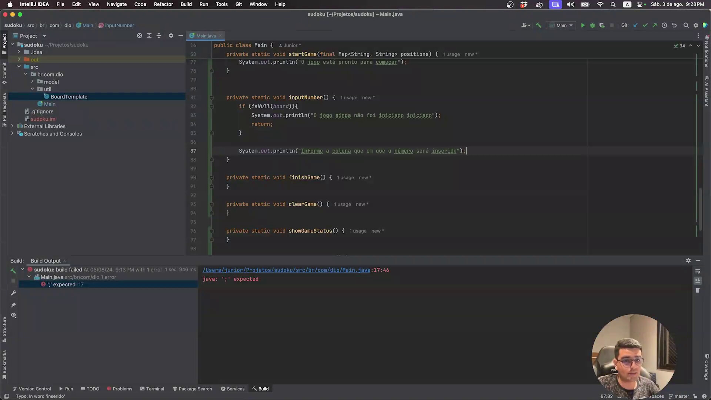
</p>

O método `inputNumber` começa com a validação inversa da usada em `startGame`: aqui é verificado se `board` **é** nulo, o que indicaria que o jogo ainda não foi iniciado. Se for esse o caso, é exibida a mensagem correspondente e o método retorna, evitando um `NullPointerException`. Em seguida, começa a coleta das informações necessárias para inserir um número no tabuleiro, começando pela pergunta sobre em qual coluna o número será inserido.

```java
private static void inputNumber() {
    if (isNull(board)) {
        System.out.println("O jogo ainda não foi iniciado");
        return;
    }

    System.out.println("Informe a coluna que em que o número será inserido");
}
```

#### Um método utilitário para validar a entrada do usuário

<p align="center">
  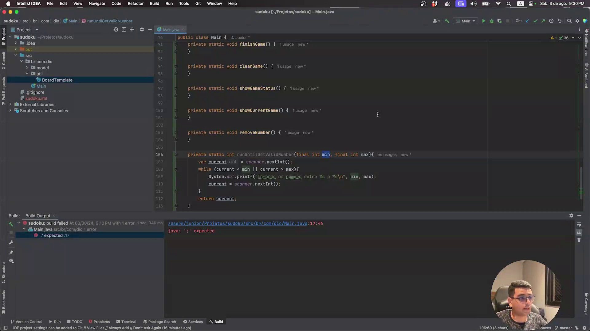
</p>

Para evitar repetir a mesma lógica de validação em vários pontos do código, é criado o método `runUntilGetValidNumber`, que recebe um valor mínimo e um valor máximo aceitáveis. Ele lê um número do `scanner` e, enquanto esse número estiver fora do intervalo `[min, max]`, exibe uma mensagem pedindo um valor válido e lê novamente, só retornando quando o usuário informar um número dentro do intervalo permitido.

```java
private static int runUntilGetValidNumber(final int min, final int max) {
    var current: int = scanner.nextInt();
    while (current < min || current > max) {
        System.out.printf("Informe um número entre %s e %s\n", min, max);
        current = scanner.nextInt();
    }
    return current;
}
```

#### Finalizando a coleta de dados para inserir um número

<p align="center">
  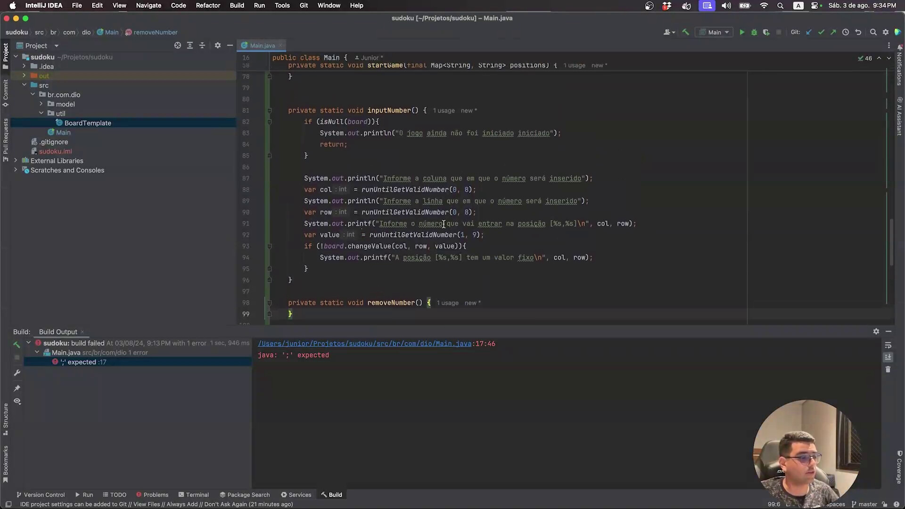
</p>

Com o método utilitário pronto, `inputNumber` é completado: a coluna e a linha são coletadas usando `runUntilGetValidNumber(0, 8)` (já que os índices válidos vão de 0 a 8), e o valor a ser inserido é coletado com `runUntilGetValidNumber(1, 9)` (intervalo válido de um Sudoku). Por fim, o valor é aplicado ao tabuleiro por meio de `board.changeValue(col, row, value)`; caso esse método retorne `false`, é porque a posição informada é fixa, e uma mensagem avisa o usuário sobre isso. Logo abaixo, o método `removeNumber` já aparece criado, ainda vazio, como próximo passo a ser implementado.

```java
private static void inputNumber() {
    if (isNull(board)) {
        System.out.println("O jogo ainda não foi iniciado");
        return;
    }

    System.out.println("Informe a coluna que em que o número será inserido");
    var col: int = runUntilGetValidNumber(0, 8);
    System.out.println("Informe a linha que em que o número será inserido");
    var row: int = runUntilGetValidNumber(0, 8);
    System.out.printf("Informe o número que vai entrar na posição [%s,%s]\n", col, row);
    var value: int = runUntilGetValidNumber(1, 9);
    if (!board.changeValue(col, row, value)) {
        System.out.printf("A posição [%s,%s] tem um valor fixo\n", col, row);
    }
}

private static void removeNumber() {

}
```


### 🟩 Vídeo 05 - Construindo o CurrentGame

<video width="60%" controls>
  <source src="000-Midia_e_Anexos/bootcamp_ntt_data_java_spring_ai-modulo.02-curso.05-video_05.webm" type="video/webm">
    Seu navegador não suporta vídeo HTML5.
</video>

link do vídeo: https://web.dio.me/lab/criando-um-jogo-do-sudoku/learning/6bea0b7b-93ce-4c68-b504-f9c17d22b1d2?back=/track/formacao-java-fundamentals

### 🟩 Vídeo 06 - Adicionando Requisitos Adicionais e Explorando a Interface Gráfica

<video width="60%" controls>
  <source src="000-Midia_e_Anexos/bootcamp_ntt_data_java_spring_ai-modulo.02-curso.05-video_06.webm" type="video/webm">
    Seu navegador não suporta vídeo HTML5.
</video>

link do vídeo: https://web.dio.me/lab/criando-um-jogo-do-sudoku/learning/7b136afd-94fa-4f95-9a43-40e0214a17e0

### 🟩 Vídeo 07 - Construindo os Componentes do Projeto

<video width="60%" controls>
  <source src="000-Midia_e_Anexos/bootcamp_ntt_data_java_spring_ai-modulo.02-curso.05-video_07.webm" type="video/webm">
    Seu navegador não suporta vídeo HTML5.
</video>

link do vídeo: https://web.dio.me/lab/criando-um-jogo-do-sudoku/learning/3f11da5b-b61a-402b-9c46-42e59304a684

### 🟩 Vídeo 08 - Ajustando Detalhes Finais e Concluindo o Projeto

<video width="60%" controls>
  <source src="000-Midia_e_Anexos/bootcamp_ntt_data_java_spring_ai-modulo.02-curso.05-video_08.webm" type="video/webm">
    Seu navegador não suporta vídeo HTML5.
</video>

link do vídeo: https://web.dio.me/lab/criando-um-jogo-do-sudoku/learning/cd1bd689-76ab-4ef4-8c77-48112bb950fd

# Entendendo o Desafio

**Agora é a sua hora de brilhar e construir um perfil de destaque na DIO! Explore todos os conceitos explorados até aqui e replique (ou melhor, porque não?) este projeto prático. Para isso, crie seu próprio repositório e aumente ainda mais seu portfólio de projetos no GitHub, o qual pode fazer toda diferença em suas entrevistas técnicas 😎**

**Neste repositório, insira todos os links e arquivos necessários para seu projeto, seja um arquivo de banco de dados ou um link para o template no Figma.**

*Dica: Se o expert forneceu um repositório Github, você pode dar um "fork" no repositório dele para organizar suas alterações e evoluções mantendo uma referência direta ao código-fonte original.*

## Repositório Git

O Git é um conceito essencial no mercado de trabalho atualmente, por isso sempre reforçamos sua importância em nossa metodologia educacional. Por isso, todo código-fonte desenvolvido durante este conteúdo foi versionado no seguinte endereço para que você possa consultá-lo a qualquer momento:

**Brach main com jogo no terminal:** https://github.com/digitalinnovationone/sudoku  
**Branch com interface gráfica:** https://github.com/digitalinnovationone/sudoku/tree/ui  

## Links Importantes

**Draw.io:** https://app.diagrams.net

**Argumentos para passar no running do projeto:**

0,0;4,false 1,0;7,false 2,0;9,true 3,0;5,false 4,0;8,true 5,0;6,true 6,0;2,true 7,0;3,false 8,0;1,false 0,1;1,false 1,1;3,true 2,1;5,false 3,1;4,false 4,1;7,true 5,1;2,false 6,1;8,false 7,1;9,true 8,1;6,true 0,2;2,false 1,2;6,true 2,2;8,false 3,2;9,false 4,2;1,true 5,2;3,false 6,2;7,false 7,2;4,false 8,2;5,true 0,3;5,true 1,3;1,false 2,3;3,true 3,3;7,false 4,3;6,false 5,3;4,false 6,3;9,false 7,3;8,true 8,3;2,false 0,4;8,false 1,4;9,true 2,4;7,false 3,4;1,true 4,4;2,true 5,4;5,true 6,4;3,false 7,4;6,true 8,4;4,false 0,5;6,false 1,5;4,true 2,5;2,false 3,5;3,false 4,5;9,false 5,5;8,false 6,5;1,true 7,5;5,false 8,5;7,true 0,6;7,true 1,6;5,false 2,6;4,false 3,6;2,false 4,6;3,true 5,6;9,false 6,6;6,false 7,6;1,true 8,6;8,false 0,7;9,true 1,7;8,true 2,7;1,false 3,7;6,false 4,7;4,true 5,7;7,false 6,7;5,false 7,7;2,true 8,7;3,false 0,8;3,false 1,8;2,false 2,8;6,true 3,8;8,true 4,8;5,true 5,8;1,false 6,8;4,true 7,8;7,false 8,8;9,false

Bons estudos 😉

---
