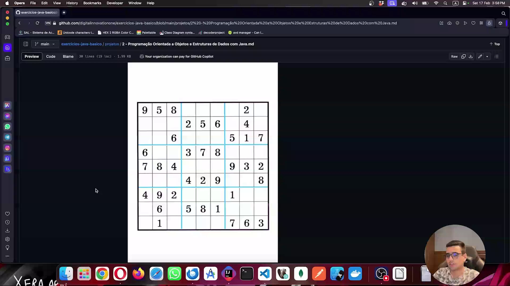
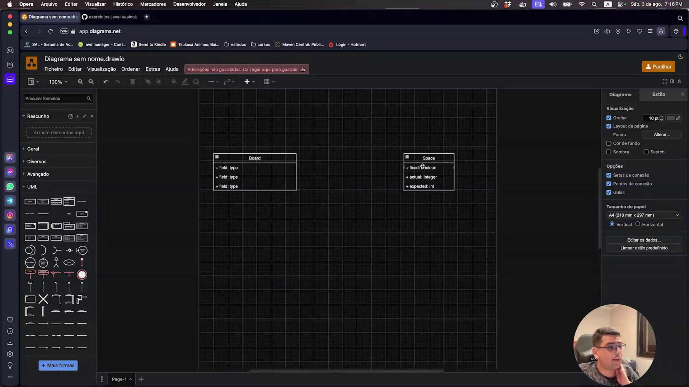
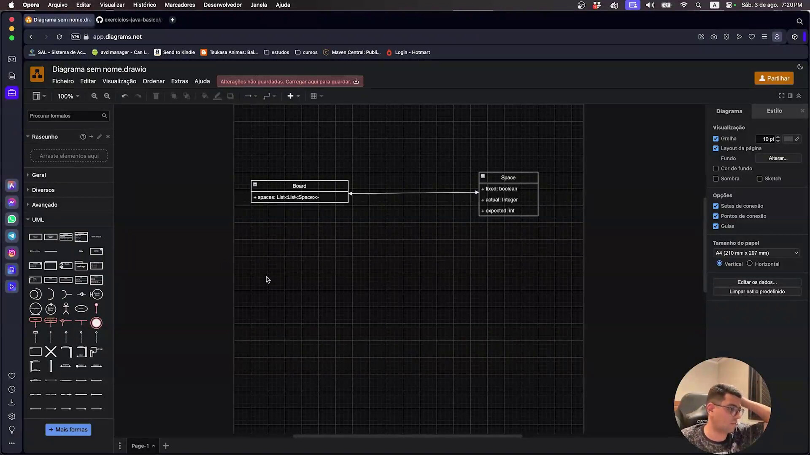
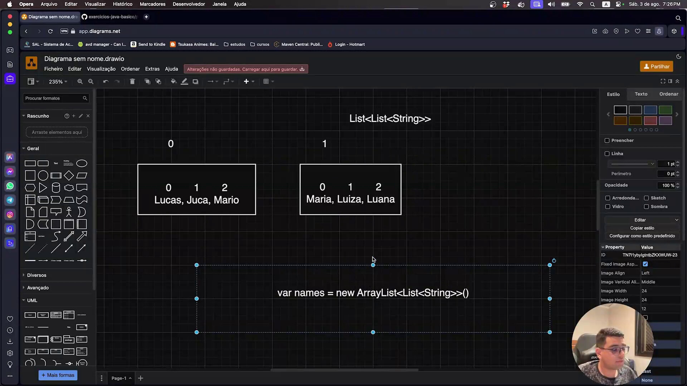

## Instrutor

- José Luiz Abreu Cardoso Junior (Engenheiro de software sênior)
- Contato Linkedin: / [juniorjrjl](https://www.linkedin.com/in/juniorjrjl/)


### 🟩 Vídeo 01 - Projeto de Jogo do Sudoku

<video width="60%" controls>
  <source src="000-Midia_e_Anexos/bootcamp_ntt_data_java_spring_ai-modulo.02-curso.05-video_01.webm" type="video/webm">
    Seu navegador não suporta vídeo HTML5.
</video>

link do vídeo: https://web.dio.me/project/criando-um-jogo-do-sudoku/learning/2bb0ec4c-a3a7-4358-a6b2-9bf47ab13eda?back=/track/formacao-java-fundamentals&tab=undefined&moduleId=undefined

### Visão Geral do Projeto

O vídeo apresenta um projeto desafio para desenvolver um jogo de Sudoku em Java. O objetivo é aplicar os conhecimentos adquiridos no curso para criar uma aplicação funcional e interativa, seguindo um conjunto de requisitos obrigatórios e alguns opcionais para quem busca um desafio extra.

### 1. Conceitos Fundamentais do Sudoku

*   **Estrutura do Tabuleiro:**
    *   O Sudoku é jogado em uma grade 9x9.
    *   Esta grade é dividida em nove subgrades 3x3, frequentemente chamadas de "blocos" ou "setores".
*   **Objetivo do Jogo:**
    *   Preencher todas as células vazias com números de 1 a 9.
    *   O jogo começa com algumas células já preenchidas (números fixos).
*   **Regras Essenciais:**
    *   **Linhas:** Cada linha deve conter todos os números de 1 a 9, sem repetições.
    *   **Colunas:** Cada coluna deve conter todos os números de 1 a 9, sem repetições.
    *   **Blocos 3x3:** Cada um dos nove blocos 3x3 deve conter todos os números de 1 a 9, sem repetições.
*   **Condição de Vitória:** O jogo termina quando todas as células estão preenchidas corretamente, respeitando todas as regras.

### 2. Requisitos Obrigatórios do Projeto

#### 2.1. Menu Interativo
*   **Detalhe:** O programa deve apresentar um menu interativo que permita ao jogador escolher entre as seguintes opções: iniciar um novo jogo, colocar um número, remover um número, verificar o jogo, verificar o status, limpar o jogo e finalizar o jogo.
*   **Insight:** Um menu bem estruturado é crucial para a usabilidade. Considere um loop principal que exibe o menu e processa a entrada do usuário até que uma opção de saída seja selecionada.

#### 2.2. Exibir Jogo Inicial
*   **Detalhe:** Ao iniciar, o jogo deve exibir o tabuleiro com os números iniciais preenchidos.
*   **Entrada de Dados:** Os números iniciais e suas posições devem ser fornecidos como argumentos de linha de comando (ex: `numero,linha,coluna`).
*   **Indexação:** O vídeo sugere que o usuário pode pensar em índices de 1 a 9, mas lembra que a implementação interna (arrays/listas) provavelmente usará indexação de 0 a 8.
*   **Insight:** Utilizar argumentos de linha de comando torna o jogo flexível, permitindo carregar diferentes quebra-cabeças sem alterar o código-fonte. A clareza na exibição do tabuleiro é fundamental para a experiência do jogador.

#### 2.3. Colocar Novo Número
*   **Detalhe:** O sistema deve solicitar ao jogador o número a ser colocado, o índice horizontal (coluna) e o índice vertical (linha).
*   **Validação:**
    *   Não é permitido colocar um número em uma posição que já esteja preenchida (seja por um número fixo inicial ou por um número colocado anteriormente pelo jogador).
    *   Para alterar um número já colocado pelo jogador, ele deve ser removido primeiro e depois inserido novamente.
*   **Insight:** A validação rigorosa da entrada do usuário é essencial para manter a integridade das regras do Sudoku. A regra de "remover antes de inserir" simplifica a lógica de atualização de células.

#### 2.4. Remover Número
*   **Detalhe:** O sistema deve solicitar os índices vertical e horizontal do número que o jogador deseja remover.
*   **Validação:**
    *   Apenas números colocados pelo jogador podem ser removidos.
    *   Números fixos (iniciais do jogo) não podem ser removidos. Se o jogador tentar remover um número fixo, uma mensagem de erro deve ser exibida.
*   **Insight:** Diferenciar entre números fixos e números do jogador é um conceito chave. Isso pode ser implementado com uma propriedade booleana em cada célula (ex: `isFixed`).

#### 2.5. Verificar Jogo (Visualizar)
*   **Detalhe:** Esta opção deve exibir a situação atual do tabuleiro do jogo, mostrando todos os números preenchidos (fixos e do jogador) e os espaços vazios.
*   **Propósito:** Permite ao jogador visualizar o progresso e identificar onde ainda precisa preencher.
*   **Insight:** Uma representação clara e formatada do tabuleiro no console é vital para a jogabilidade, mesmo sem uma interface gráfica.

#### 2.6. Verificar Status do Jogo
*   **Detalhe:** O sistema deve informar o status atual do jogo, que pode ser:
    *   **Não Iniciado:** O tabuleiro contém apenas os números iniciais fornecidos. Este status é **sempre sem erros**.
    *   **Incompleto:** O jogo foi iniciado, alguns números foram colocados pelo jogador, mas nem todas as células estão preenchidas.
    *   **Completo:** Todas as células do tabuleiro estão preenchidas.
*   **Verificação de Erros:** Para os status "Incompleto" e "Completo", o sistema também deve indicar se o jogo **contém erros** (ou seja, viola as regras do Sudoku) ou está **sem erros**.
    *   **Lógica de Erro:** Para verificar erros, o programa deve percorrer todas as células e checar se há números repetidos em qualquer linha, coluna ou bloco 3x3.
*   **Insight:** Este é um dos requisitos mais complexos e importantes. A implementação de um sistema de status com verificação de erros fornece feedback crucial ao jogador. Considere usar um `enum` para os estados do jogo (ex: `NAO_INICIADO`, `INCOMPLETO`, `COMPLETO`) e uma função separada para a validação das regras do Sudoku.

#### 2.7. Limpar Jogo
*   **Detalhe:** Esta opção deve remover todos os números que foram colocados pelo jogador, mantendo apenas os números fixos iniciais do jogo.
*   **Propósito:** Permite ao jogador "resetar" sua tentativa atual e começar a preencher o tabuleiro novamente a partir do estado inicial, sem iniciar um novo jogo do zero.
*   **Insight:** Uma funcionalidade de "limpar" é um recurso de usabilidade valioso, oferecendo uma maneira rápida de desfazer todas as ações do jogador.

#### 2.8. Finalizar Jogo
*   **Detalhe:** Se o jogo estiver no status "Completo" e "sem erros", o programa deve exibir uma mensagem de parabéns e encerrar.
*   **Validação:** Se o jogo não estiver "Completo" ou se "contiver erros", o sistema deve informar ao usuário que o jogo não pode ser finalizado e que ele precisa preencher todos os espaços corretamente.
*   **Insight:** Este requisito define o ponto final do jogo, validando a vitória do jogador e fornecendo uma conclusão clara.

### 3. Dicas de Implementação (Insights)

*   **Programação Orientada a Objetos (POO):**
    *   **Recomendação:** O vídeo enfatiza fortemente o uso de POO para organizar o código.
    *   **Modelagem:**
        *   **Célula (Square/Cell):** Defina uma classe `Cell` (ou `Square`) para representar cada quadradinho do Sudoku. Esta classe pode ter atributos como `value` (o número), `isFixed` (booleano indicando se é um número inicial), `isFilled` (booleano indicando se foi preenchido pelo jogador).
        *   **Herança (Opcional):** Você pode até considerar herança, com `EditableCell` e `NonEditableCell` herdando de uma classe base `Cell`.
        *   **Setor/Bloco (Sector/Block):** Crie uma classe para representar os blocos 3x3, que pode conter uma coleção de objetos `Cell`.
        *   **Tabuleiro (Board):** A classe principal `Board` pode gerenciar todas as `Cell`s e `Sector`s, e conter a lógica de validação e manipulação do jogo.
    *   **Benefício:** POO ajuda a criar um código mais modular, legível, fácil de manter e expandir.
*   **Estruturas de Dados:** Escolha as estruturas de dados adequadas (ex: arrays bidimensionais, listas de listas) para representar o tabuleiro e suas células de forma eficiente.
*   **Enums:** Para os diferentes estados do jogo (Não Iniciado, Incompleto, Completo), o uso de `enum`s pode tornar o código mais claro e menos propenso a erros do que strings ou números mágicos.

### 4. Requisitos Extras (Opcionais - Desafios Adicionais)

Estes requisitos são para quem deseja se aprofundar e aprimorar seus conhecimentos, não sendo obrigatórios para a conclusão do projeto.

#### 4.1. Ambiente Gráfico (GUI)
*   **Detalhe:** Em vez de usar o terminal, implemente a interface do usuário do jogo usando uma biblioteca gráfica em Java, como AWT ou Swing.
*   **Benefício:** Uma GUI proporciona uma experiência de usuário muito mais rica, visualmente atraente e interativa.
*   **Justificativa para Opcional:** O curso não abordou o desenvolvimento de interfaces gráficas, o que adiciona uma camada de complexidade que pode ser nova para alguns alunos.

#### 4.2. Números de Rascunho (Scratch Numbers)
*   **Detalhe:** Permita que o jogador coloque múltiplos números pequenos dentro de uma célula como "rascunhos" ou "anotações" de possíveis valores.
*   **Comportamento:** Esses números de rascunho não devem interferir na lógica de validação do jogo (ou seja, não são considerados números "reais" para as regras do Sudoku).
*   **Benefício:** É uma funcionalidade comum em jogos de Sudoku que auxilia o jogador na estratégia de eliminação e na visualização de possibilidades.
*   **Justificativa para Opcional:** Exibir múltiplos números pequenos dentro de uma única célula no terminal seria desafiador de implementar de forma clara e legível.

### 5. Conclusão e Suporte

*   Os requisitos obrigatórios são considerados totalmente alcançáveis com o conhecimento fornecido no curso.
*   Os requisitos extras são uma excelente oportunidade para se desafiar e aprender mais sobre tópicos avançados como GUI e design de UX.
*   Em caso de dúvidas, o instrutor está disponível para ajudar, e a pesquisa em fóruns e documentações é sempre encorajada.
*   Boa sorte no desafio!

### 🟩 Vídeo 02 - Esboçando a Solução

<video width="60%" controls>
  <source src="000-Midia_e_Anexos/bootcamp_ntt_data_java_spring_ai-modulo.02-curso.05-video_02.webm" type="video/webm">
    Seu navegador não suporta vídeo HTML5.
</video>

link do vídeo: https://web.dio.me/lab/criando-um-jogo-do-sudoku/learning/7655c3f1-dc23-4628-a217-4b4e5721aae7

### Anotações

#### O desafio: o tabuleiro de Sudoku

<p align="center">
  
</p>

A imagem mostra o enunciado visual do exercício: um tabuleiro de Sudoku 9x9, com algumas células já preenchidas (as dicas fixas do jogo) e outras em branco, que deverão ser completadas pelo jogador. As linhas mais grossas delimitam visualmente os nove blocos de 3x3 células, cada um devendo conter os números de 1 a 9 sem repetição — assim como cada linha e cada coluna do tabuleiro completo. É esse tabuleiro que serve de ponto de partida para pensar em como representar o jogo em código: quantas "posições" existem, quais delas já vêm preenchidas e quais precisam ser validadas.

Não há código nesta imagem — trata-se apenas da representação do problema a ser resolvido.

#### Rascunho inicial das classes Board e Space

<p align="center">
  
</p>

Aqui aparece o primeiro esboço, feito no draw.io, das duas entidades identificadas a partir do enunciado: a classe **Board** (o tabuleiro) e a classe **Space** (cada espaço individual do tabuleiro). Nesse momento os atributos ainda são apenas placeholders genéricos ("field: type"), já que o objetivo é somente mapear quais entidades existem antes de decidir os tipos e nomes definitivos de cada propriedade. É um exercício de esboço, não a versão final do modelo.

Não há código Java propriamente dito nesta imagem — é um diagrama de classes simplificado.

#### Propriedades definidas: Space e a lista bidimensional do Board

<p align="center">
  
</p>

O diagrama evolui e agora mostra as propriedades já definidas para cada classe. A classe **Space** ganhou três atributos: `fixed: boolean`, que indica se aquele espaço já vem preenchido de fábrica e não pode ser alterado pelo jogador; `actual: Integer`, o valor atualmente preenchido naquele espaço (usado como objeto para poder aceitar nulo, já que a posição pode estar vazia); e `expected: int`, o valor correto esperado para aquele espaço, usado como tipo primitivo por sempre ter um valor definido. Já a classe **Board** foi simplificada para uma única propriedade, `spaces: List<List<Space>>` — uma lista de listas de Space, escolhida justamente para representar as nove linhas e nove colunas do tabuleiro em uma estrutura bidimensional.

Não há trecho de código-fonte nesta imagem — é a continuação do mesmo diagrama de classes.

#### Exemplo genérico de lista de listas em Java

<p align="center">
  
</p>

Antes de aplicar o conceito diretamente ao Board e ao Space, a imagem traz um exemplo didático à parte, montado no mesmo diagrama, para ilustrar o que é uma "lista de listas" em Java. São mostradas duas listas internas de `String`: a de índice 0 contendo os nomes Lucas, Juca e Mario, e a de índice 1 contendo Maria, Luiza e Luana — todas dentro de uma lista externa do tipo `List<List<String>>`. Abaixo do diagrama aparece a declaração em código dessa estrutura:

```java
var names = new ArrayList<List<String>>();
```

A ideia é mostrar que, para acessar um valor dentro dessa estrutura, primeiro se acessa a lista externa por índice (por exemplo, `names.get(0)`) para obter uma das listas internas, e depois se acessa um elemento dentro dela por outro índice (por exemplo, `.get(1)`). Esse mesmo padrão de acesso em duas etapas é o que será usado depois para navegar pela lista bidimensional de `Space` dentro do `Board`.


### 🟩 Vídeo 03 - Preparando o Ambiente do Projeto

<video width="60%" controls>
  <source src="000-Midia_e_Anexos/bootcamp_ntt_data_java_spring_ai-modulo.02-curso.05-video_03.webm" type="video/webm">
    Seu navegador não suporta vídeo HTML5.
</video>

link do vídeo: https://web.dio.me/lab/criando-um-jogo-do-sudoku/learning/971cd2c4-cd35-4425-9e77-2662b180184d

### 🟩 Vídeo 04 - Consumindo o Projeto

<video width="60%" controls>
  <source src="000-Midia_e_Anexos/bootcamp_ntt_data_java_spring_ai-modulo.02-curso.05-video_04.webm" type="video/webm">
    Seu navegador não suporta vídeo HTML5.
</video>

link do vídeo: https://web.dio.me/lab/criando-um-jogo-do-sudoku/learning/613bf590-3358-4c26-b728-a3f29e01f53e

### 🟩 Vídeo 05 - Construindo o CurrentGame

<video width="60%" controls>
  <source src="000-Midia_e_Anexos/bootcamp_ntt_data_java_spring_ai-modulo.02-curso.05-video_05.webm" type="video/webm">
    Seu navegador não suporta vídeo HTML5.
</video>

link do vídeo: https://web.dio.me/lab/criando-um-jogo-do-sudoku/learning/6bea0b7b-93ce-4c68-b504-f9c17d22b1d2?back=/track/formacao-java-fundamentals

### 🟩 Vídeo 06 - Adicionando Requisitos Adicionais e Explorando a Interface Gráfica

<video width="60%" controls>
  <source src="000-Midia_e_Anexos/bootcamp_ntt_data_java_spring_ai-modulo.02-curso.05-video_06.webm" type="video/webm">
    Seu navegador não suporta vídeo HTML5.
</video>

link do vídeo: https://web.dio.me/lab/criando-um-jogo-do-sudoku/learning/7b136afd-94fa-4f95-9a43-40e0214a17e0

### 🟩 Vídeo 07 - Construindo os Componentes do Projeto

<video width="60%" controls>
  <source src="000-Midia_e_Anexos/bootcamp_ntt_data_java_spring_ai-modulo.02-curso.05-video_07.webm" type="video/webm">
    Seu navegador não suporta vídeo HTML5.
</video>

link do vídeo: https://web.dio.me/lab/criando-um-jogo-do-sudoku/learning/3f11da5b-b61a-402b-9c46-42e59304a684

### 🟩 Vídeo 08 - Ajustando Detalhes Finais e Concluindo o Projeto

<video width="60%" controls>
  <source src="000-Midia_e_Anexos/bootcamp_ntt_data_java_spring_ai-modulo.02-curso.05-video_08.webm" type="video/webm">
    Seu navegador não suporta vídeo HTML5.
</video>

link do vídeo: https://web.dio.me/lab/criando-um-jogo-do-sudoku/learning/cd1bd689-76ab-4ef4-8c77-48112bb950fd

# Entendendo o Desafio

**Agora é a sua hora de brilhar e construir um perfil de destaque na DIO! Explore todos os conceitos explorados até aqui e replique (ou melhor, porque não?) este projeto prático. Para isso, crie seu próprio repositório e aumente ainda mais seu portfólio de projetos no GitHub, o qual pode fazer toda diferença em suas entrevistas técnicas 😎**

**Neste repositório, insira todos os links e arquivos necessários para seu projeto, seja um arquivo de banco de dados ou um link para o template no Figma.**

*Dica: Se o expert forneceu um repositório Github, você pode dar um "fork" no repositório dele para organizar suas alterações e evoluções mantendo uma referência direta ao código-fonte original.*

## Repositório Git

O Git é um conceito essencial no mercado de trabalho atualmente, por isso sempre reforçamos sua importância em nossa metodologia educacional. Por isso, todo código-fonte desenvolvido durante este conteúdo foi versionado no seguinte endereço para que você possa consultá-lo a qualquer momento:

**Brach main com jogo no terminal:** https://github.com/digitalinnovationone/sudoku  
**Branch com interface gráfica:** https://github.com/digitalinnovationone/sudoku/tree/ui  

## Links Importantes

**Draw.io:** https://app.diagrams.net

**Argumentos para passar no running do projeto:**

0,0;4,false 1,0;7,false 2,0;9,true 3,0;5,false 4,0;8,true 5,0;6,true 6,0;2,true 7,0;3,false 8,0;1,false 0,1;1,false 1,1;3,true 2,1;5,false 3,1;4,false 4,1;7,true 5,1;2,false 6,1;8,false 7,1;9,true 8,1;6,true 0,2;2,false 1,2;6,true 2,2;8,false 3,2;9,false 4,2;1,true 5,2;3,false 6,2;7,false 7,2;4,false 8,2;5,true 0,3;5,true 1,3;1,false 2,3;3,true 3,3;7,false 4,3;6,false 5,3;4,false 6,3;9,false 7,3;8,true 8,3;2,false 0,4;8,false 1,4;9,true 2,4;7,false 3,4;1,true 4,4;2,true 5,4;5,true 6,4;3,false 7,4;6,true 8,4;4,false 0,5;6,false 1,5;4,true 2,5;2,false 3,5;3,false 4,5;9,false 5,5;8,false 6,5;1,true 7,5;5,false 8,5;7,true 0,6;7,true 1,6;5,false 2,6;4,false 3,6;2,false 4,6;3,true 5,6;9,false 6,6;6,false 7,6;1,true 8,6;8,false 0,7;9,true 1,7;8,true 2,7;1,false 3,7;6,false 4,7;4,true 5,7;7,false 6,7;5,false 7,7;2,true 8,7;3,false 0,8;3,false 1,8;2,false 2,8;6,true 3,8;8,true 4,8;5,true 5,8;1,false 6,8;4,true 7,8;7,false 8,8;9,false

Bons estudos 😉

---
