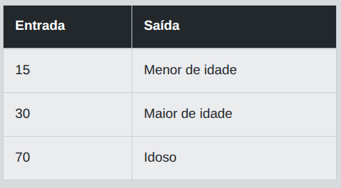

# Desafio 01 - Keywords e Tipos Primitivos

Crie um programa que receba a idade de uma pessoa e determine se ela é menor de idade, maior de idade ou idosa. Considere como referência:  

- Menor de idade: menos de 18 anos  
- Maior de idade: de 18 a 64 anos
- Idoso: 65 anos ou mais

## Entrada

A entrada deve receber um único número inteiro representando a idade da pessoa.

## Saída

Deverá retornar uma mensagem indicando a classificação da pessoa, como "Menor de idade", "Maior de idade" ou "Idoso".

## Exemplos

A tabela abaixo apresenta exemplos com alguns dados de entrada e suas respectivas saídas esperadas. Certifique-se de testar seu programa com esses exemplos e com outros casos possíveis.

<p align="center">
  
</p>

## Código Exemplo

```java
import java.util.Scanner;

public class Main {
    
    public static void main(String[] args) {

        Scanner scanner = new Scanner(System.in);

        int idade = scanner.nextInt();
        
        //TODO: Implemente a estrutura condicional para verificar a classificação da idade:
        

        scanner.close();
    }
}
```

## Solução

### Explicação detalhada   

---

# Desafio 02 - Trabalhando com Operadores

## Entrada

## Saída

## Código Exemplo

## Solução

### Explicação detalhada   

---

# Desafio 03 - Estrutura Condicional If-Else

## Entrada

## Saída

## Código Exemplo

## Solução

### Explicação detalhada   


