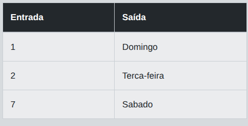
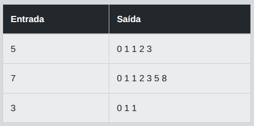
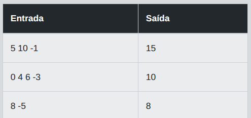

# Desafio 01 - Estrutura Condicional Switch Case

Escreva um programa que receba o número correspondente a um dia da semana (1 para domingo, 2 para segunda-feira, etc.) e exiba o nome do dia. Caso o número não corresponda a um dia válido, exiba "Dia invalido".

## Entrada

A entrada deve receber um número inteiro de 1 a 7.

## Saída

Deverá retornar o nome do dia da semana correspondente ou "Dia invalido" se o número não for válido.

## Exemplos

A tabela abaixo apresenta exemplos com alguns dados de entrada e suas respectivas saídas esperadas. Certifique-se de testar seu programa com esses exemplos e com outros casos possíveis.

<p align="center">
  
</p>

## Código Exemplo

```java
import java.util.Scanner;

public class Main {
    public static void main(String[] args) {

        Scanner scanner = new Scanner(System.in);

        int dia = scanner.nextInt();
        
        //TODO: Implemente uma estrutura de decisão usando switch para verificar o dia da semana:
        

        scanner.close();
    }
}
```

## Solução

```java
import java.util.Scanner;

public class Main {
    public static void main(String[] args) {

        Scanner scanner = new Scanner(System.in);

        int dia = scanner.nextInt();
        
        // Estrutura de decisão usando switch para verificar o dia da semana
        switch (dia) {
            case 1:
                System.out.println("Domingo");
                break;
            case 2:
                System.out.println("Segunda-feira");
                break;
            case 3:
                System.out.println("Terca-feira");
                break;
            case 4:
                System.out.println("Quarta-feira");
                break;
            case 5:
                System.out.println("Quinta-feira");
                break;
            case 6:
                System.out.println("Sexta-feira");
                break;
            case 7:
                System.out.println("Sabado");
                break;
            default:
                System.out.println("Dia invalido");
                break;
        }

        scanner.close();
    }
}
``` 

# Desafio 02 - Estruturas de Repetição - For

Crie um programa que receba um número inteiro positivo n e exiba os n primeiros números da sequência de Fibonacci.

## Entrada

A entrada deve receber um número inteiro positivo

## Saída

Deverá retornar os nnn primeiros números da sequência de Fibonacci separados por espaço.

## Exemplos

A tabela abaixo apresenta exemplos com alguns dados de entrada e suas respectivas saídas esperadas. Certifique-se de testar seu programa com esses exemplos e com outros casos possíveis.

<p align="center">
  
</p>

## Código Exemplo

```java
import java.util.Scanner;

public class Main {
    public static void main(String[] args) {
        Scanner scanner = new Scanner(System.in);

        int n = scanner.nextInt();

        int a = 0, b = 1;

        for (int i = 0; i < n; i++) {
            System.out.print(a + (i < n - 1 ? " " : ""));
            int proximo = a + b;
            a = b;
            b = proximo;
        }

        scanner.close();
    }
}
```

## Solução

```java
import java.util.Scanner;

public class Main {
    public static void main(String[] args) {
        Scanner scanner = new Scanner(System.in);

        int n = scanner.nextInt();

        int a = 0, b = 1;

        for (int i = 0; i < n; i++) {
            System.out.print(a + (i < n - 1 ? " " : ""));
            int proximo = a + b;
            a = b;
            b = proximo;
        }

        scanner.close();
    }
}
``` 

# Desafio 03 - While e Do While

Desenvolva um programa que solicite números inteiros do usuário até que ele digite um número negativo. Ao final, exiba a soma de todos os números positivos digitados.

## Entrada

A entrada consiste em números inteiros fornecidos pelo usuário repetidamente.

## Saída

Deverá retornar a soma de todos os números positivos digitados antes de o usuário inserir um número negativo.

## Exemplos

A tabela abaixo apresenta exemplos com alguns dados de entrada e suas respectivas saídas esperadas. Certifique-se de testar seu programa com esses exemplos e com outros casos possíveis.

<p align="center">
  
</p>

## Código Exemplo

```java
import java.util.Scanner;

public class Main {
    
    public static void main(String[] args) {
        
        Scanner scanner = new Scanner(System.in);

        int soma = 0;
        //TODO: Implemente um loop while para receber números até o usuário digitar um número negativo:
        
            //TODO: Leia um número inteiro inserido pelo usuário:
            
            //TODO: Verifique se o número é negativo para encerrar o loop:
                
            //TODO: Some o número positivo à variável soma:
            
        }
        
        //TODO: Exiba o valor total acumulado em soma:

        scanner.close();
    }
}
```

## Solução

```java
xxxxxxxxxxxxxxxxxxxxxxxxxxxxxxx
``` 

