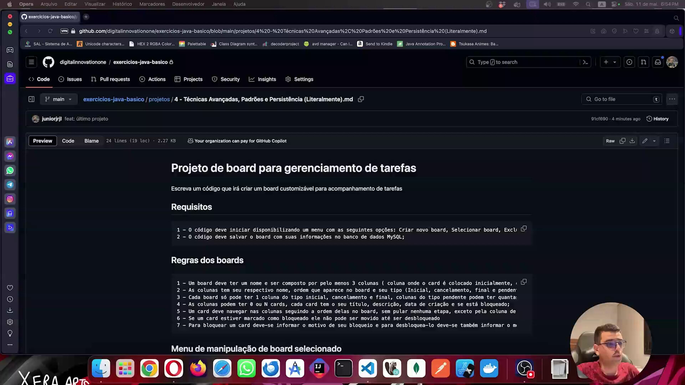
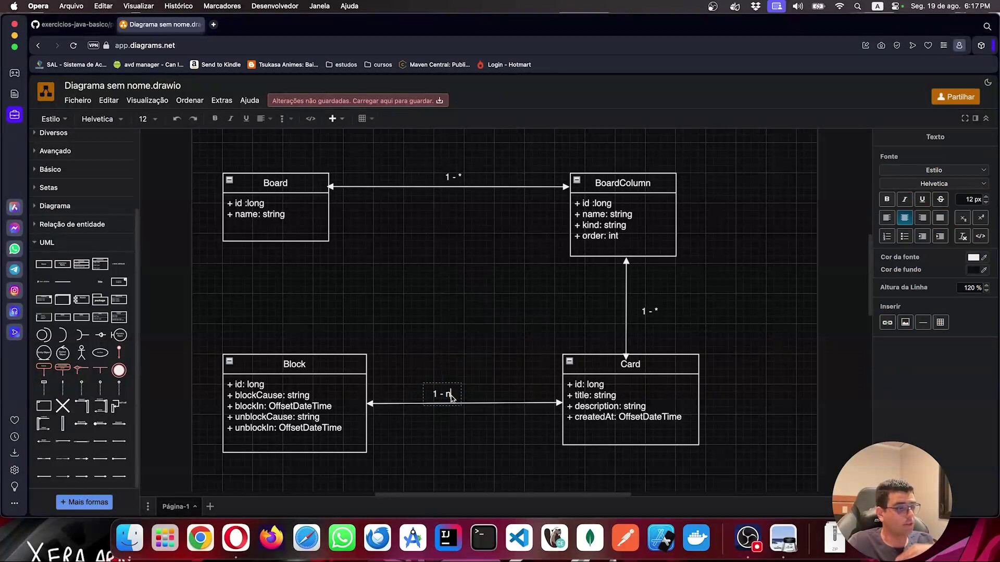

## Instrutor

- José Luiz Abreu Cardoso Junior (Engenheiro de software sênior)
- Contato Linkedin: / [juniorjrjl](https://www.linkedin.com/in/juniorjrjl/)

## Parte 1 - Conteúdo do Módulo

### 🟩 Vídeo 01 - O que Vamos Construir

<video width="60%" controls>
  <source src="000-Midia_e_Anexos/bootcamp_ntt_data_java_spring_ai-modulo.03-curso.04-video_01.webm" type="video/webm">
    Seu navegador não suporta vídeo HTML5.
</video>

link do vídeo: https://web.dio.me/project/proejto-board-de-tarefas/learning/20a6039c-3f63-43c8-9812-ef7aa35bc2f3?back=/track/formacao-java-fundamentals&tab=undefined&moduleId=undefined

### Anotações

  

A imagem mostra o enunciado do último projeto do curso, um **board customizável para gerenciamento de tarefas**, exibido no GitHub (repositório `exercicios-java-basico`, arquivo *4 - Técnicas Avançadas, Padrões e Persistência*). O texto de abertura do projeto pede a escrita de um código que crie um board customizável para acompanhamento de tarefas.

#### Especificações do Projeto

Projeto de board para gerenciamento de tarefas

Escreva um código que irá criar um board customizável para acompanhamento de tarefas

  ##### Requisitos
    1 - O código deve iniciar disponibilizando um menu com as seguintes opções: Criar novo board, Selecionar board, Excluir boards, Sair;
    2 - O código deve salvar o board com suas informações no banco de dados MySQL;

  ##### Regras dos boards
    1 - Um board deve ter um nome e ser composto por pelo menos 3 colunas ( coluna onde o card é colocado inicialmente, coluna para cards com tarefas concluídas e coluna para cards cancelados, a nomenclatura das colunas é de escolha livre);
    2 - As colunas tem seu respectivo nome, ordem que aparece no board e seu tipo (Inicial, cancelamento, final e pendente);
    3 - Cada board só pode ter 1 coluna do tipo inicial, cancelamento e final, colunas do tipo pendente podem ter quantas forem necessárias, obrigatoriamente a coluna inicial deve ser a primeira coluna do board, a final deve ser a penúltima e a de cancelamento deve ser a última
    4 - As colunas podem ter 0 ou N cards, cada card tem o seu título, descrição, data de criação e se está bloqueado;
    5 - Um card deve navegar nas colunas seguindo a ordem delas no board, sem pular nenhuma etapa, exceto pela coluna de cards cancelados que pode receber cards diretamente de qualquer coluna que não for a coluna final;
    6 - Se um card estiver marcado como bloqueado ele não pode ser movido até ser desbloqueado
    7 - Para bloquear um card deve-se informar o motivo de seu bloqueio e para desbloquea-lo deve-se também informar o motivo

  ##### Menu de manipulação de board selecionado
    1 - O menu deve permitir mover o card para próxima coluna, cancelar um card, criar um card, bloquea-lo, desbloquea-lo e fechar board;

  ##### Requisitos opcionais
    1 - Um card deve armazenar a data e hora em que foi colocado em uma coluna e a data e hora que foi movido pra a próxima coluna;
    2 - O código deve gerar um relatório do board selecionado com o tempo que cada tarefa demorou para ser concluída com informações do tempo que levou em cada coluna
    3 - O código dever gerar um relatório do board selecionado com o os bloqueios dos cards, com o tempo que ficaram bloqueados e com a justificativa dos bloqueios e desbloqueios.

### 🟩 Vídeo 02 - Criando o Diagrama da Solução

<video width="60%" controls>
  <source src="000-Midia_e_Anexos/bootcamp_ntt_data_java_spring_ai-modulo.03-curso.04-video_02.webm" type="video/webm">
    Seu navegador não suporta vídeo HTML5.
</video>

link do vídeo: https://web.dio.me/lab/proejto-board-de-tarefas/learning/1ce64722-b139-44e1-a47f-bab07ae017ed

### Anotações

#### Diagrama de classes do Board: entidades e relacionamentos

  

A imagem mostra o esboço da estrutura de dados do projeto **Board**, montado no Draw.io (app.diagrams.net) com as formas de UML. Ele reúne quatro classes e os relacionamentos entre elas. Cada classe também é pensada como uma futura entidade do banco de dados MySQL. O diagrama não segue a notação UML à risca: a intenção é apenas ter uma visão geral da estrutura antes de começar a codificar.

**As quatro classes**

| Classe | Atributos | Papel |
|---|---|---|
| `Board` | `id: long`, `name: string` | O quadro em si: um identificador e um nome. |
| `BoardColumn` | `id: long`, `name: string`, `kind: string`, `order: int` | Uma coluna do quadro. `kind` indica o tipo da coluna (inicial, pendente, final ou cancelamento) e `order` indica sua posição no board. |
| `Card` | `id: long`, `title: string`, `description: string`, `createdAt: OffsetDateTime` | A tarefa que percorre as colunas: título, descrição e data de criação. |
| `Block` | `id: long`, `blockCause: string`, `blockIn: OffsetDateTime`, `unblockCause: string`, `unblockIn: OffsetDateTime` | O registro de um bloqueio de card: motivo e data do bloqueio, motivo e data do desbloqueio. |

O nome `BoardColumn` foi escolhido no lugar de `Column` para evitar conflito com a palavra reservada `column`, comum em bancos de dados.

**Relacionamentos (as multiplicidades aparecem sobre as linhas)**

- **Board → BoardColumn (1 - \*)**: um board possui várias colunas, e cada coluna pertence a um único board.
- **BoardColumn → Card (1 - \*)**: uma coluna pode conter zero ou vários cards, e um card está em uma única coluna por vez.
- **Card → Block (1 - n)**: um card pode ter vários bloqueios ao longo do tempo, e cada bloqueio pertence a um único card. Na imagem, o rótulo dessa ligação ainda está sendo editado (o cursor está sobre ele).

**Decisões de modelagem que o diagrama já reflete**

- O `Card` não tem um atributo booleano do tipo "está bloqueado". Como cada bloqueio exige seus próprios dados (motivo e data de bloqueio, motivo e data de desbloqueio), ele ganhou uma classe própria, `Block`. Assim, ao desbloquear, o registro não é apagado: os campos de desbloqueio são preenchidos, e o histórico de bloqueios do card se mantém.
- Os campos `blockIn` e `unblockIn` são datas, o que permite verificar o estado de um bloqueio com mais segurança do que olhando apenas para textos.
- Em `BoardColumn`, o atributo `kind` aparece como `string`. Como os tipos possíveis são fixos (inicial, pendente, final e cancelamento), um `enum` é uma alternativa natural na hora de implementar. O atributo `order` é um `int`.
- Ao implementar `BoardColumn`, será preciso validar que cada board tenha uma única coluna inicial, uma final e uma de cancelamento, e quantas pendentes forem necessárias. A inicial deve ser a primeira, a final a penúltima e a de cancelamento a última. O diagrama guarda apenas os atributos; essas restrições ficam para o código.

### 🟩 Vídeo 03 - Setup Inicial de Projeto

<video width="60%" controls>
  <source src="000-Midia_e_Anexos/bootcamp_ntt_data_java_spring_ai-modulo.03-curso.04-video_03.webm" type="video/webm">
    Seu navegador não suporta vídeo HTML5.
</video>

link do vídeo: https://web.dio.me/lab/proejto-board-de-tarefas/learning/6d233a05-be1e-4f44-99d8-045d2941390d

### 🟩 Vídeo 04 - Criando Migrations

<video width="60%" controls>
  <source src="000-Midia_e_Anexos/bootcamp_ntt_data_java_spring_ai-modulo.03-curso.04-video_04.webm" type="video/webm">
    Seu navegador não suporta vídeo HTML5.
</video>

link do vídeo: https://web.dio.me/lab/proejto-board-de-tarefas/learning/29f9bfa7-e012-4687-9954-033c3281c47f

### 🟩 Vídeo 05 - Entidades e Acessos a Dados

<video width="60%" controls>
  <source src="000-Midia_e_Anexos/bootcamp_ntt_data_java_spring_ai-modulo.03-curso.04-video_05.webm" type="video/webm">
    Seu navegador não suporta vídeo HTML5.
</video>

link do vídeo: https://web.dio.me/lab/proejto-board-de-tarefas/learning/0c5685c3-a629-4f2d-895a-a5ffa3f78d5b

### 🟩 Vídeo 06 - Camada de Acesso a Dados

<video width="60%" controls>
  <source src="000-Midia_e_Anexos/bootcamp_ntt_data_java_spring_ai-modulo.03-curso.04-video_06.webm" type="video/webm">
    Seu navegador não suporta vídeo HTML5.
</video>

link do vídeo: https://web.dio.me/lab/proejto-board-de-tarefas/learning/97cac612-a550-40e6-a219-f5f21241da86

### 🟩 Vídeo 07 - Trabalhando na Camada de UI

<video width="60%" controls>
  <source src="000-Midia_e_Anexos/bootcamp_ntt_data_java_spring_ai-modulo.03-curso.04-video_07.webm" type="video/webm">
    Seu navegador não suporta vídeo HTML5.
</video>

link do vídeo: https://web.dio.me/lab/proejto-board-de-tarefas/learning/2d649f25-8ec8-471c-9f6f-2fbe13ab9885

### 🟩 Vídeo 08 - Integrando sua UI com Acesso aos Dados

<video width="60%" controls>
  <source src="000-Midia_e_Anexos/bootcamp_ntt_data_java_spring_ai-modulo.03-curso.04-video_08.webm" type="video/webm">
    Seu navegador não suporta vídeo HTML5.
</video>

link do vídeo: https://web.dio.me/lab/proejto-board-de-tarefas/learning/1f266226-d48c-4fde-9aa8-e3222105e715

### 🟩 Vídeo 09 - Integrando Camada Services e Camada de Dados

<video width="60%" controls>
  <source src="000-Midia_e_Anexos/bootcamp_ntt_data_java_spring_ai-modulo.03-curso.04-video_09.webm" type="video/webm">
    Seu navegador não suporta vídeo HTML5.
</video>

link do vídeo: https://web.dio.me/lab/proejto-board-de-tarefas/learning/7b3429e4-adee-495e-b7d1-b7691c783ed0

### 🟩 Vídeo 10 - Refinado a camada de DAO

<video width="60%" controls>
  <source src="000-Midia_e_Anexos/bootcamp_ntt_data_java_spring_ai-modulo.03-curso.04-video_10.webm" type="video/webm">
    Seu navegador não suporta vídeo HTML5.
</video>

link do vídeo: https://web.dio.me/lab/proejto-board-de-tarefas/learning/b3b47d4f-c100-4430-8e37-0df77383f697

### 🟩 Vídeo 11 - Refinando Consultas

<video width="60%" controls>
  <source src="000-Midia_e_Anexos/bootcamp_ntt_data_java_spring_ai-modulo.03-curso.04-video_11.webm" type="video/webm">
    Seu navegador não suporta vídeo HTML5.
</video>

link do vídeo: https://web.dio.me/lab/proejto-board-de-tarefas/learning/e7a1d08f-224d-4025-b03d-88b213bcaead

### 🟩 Vídeo 12 - Trazendo resultado de consultas na camada de UI

<video width="60%" controls>
  <source src="000-Midia_e_Anexos/bootcamp_ntt_data_java_spring_ai-modulo.03-curso.04-video_12.webm" type="video/webm">
    Seu navegador não suporta vídeo HTML5.
</video>

link do vídeo: https://web.dio.me/lab/proejto-board-de-tarefas/learning/0e2fdedc-7857-4c65-af28-a36d08649f4d

### 🟩 Vídeo 13 - Fazendo Tratamentos de Erros

<video width="60%" controls>
  <source src="000-Midia_e_Anexos/bootcamp_ntt_data_java_spring_ai-modulo.03-curso.04-video_13.webm" type="video/webm">
    Seu navegador não suporta vídeo HTML5.
</video>

link do vídeo: https://web.dio.me/lab/proejto-board-de-tarefas/learning/0e2fdedc-7857-4c65-af28-a36d08649f4d?back=/track/formacao-java-fundamentals

### 🟩 Vídeo 14 - Camada de DTO

<video width="60%" controls>
  <source src="000-Midia_e_Anexos/bootcamp_ntt_data_java_spring_ai-modulo.03-curso.04-video_14.webm" type="video/webm">
    Seu navegador não suporta vídeo HTML5.
</video>

link do vídeo: https://web.dio.me/lab/proejto-board-de-tarefas/learning/bc96302e-96d3-4185-b52b-5fe49268d2bd

### 🟩 Vídeo 15 - Boas Práticas na camada de Persistência

<video width="60%" controls>
  <source src="000-Midia_e_Anexos/bootcamp_ntt_data_java_spring_ai-modulo.03-curso.04-video_15.webm" type="video/webm">
    Seu navegador não suporta vídeo HTML5.
</video>

link do vídeo: https://web.dio.me/lab/proejto-board-de-tarefas/learning/006f9160-c28c-420b-8704-99bf5563ce94?back=/track/formacao-java-fundamentals

### 🟩 Vídeo 16 - Criando Blocos de Update

<video width="60%" controls>
  <source src="000-Midia_e_Anexos/bootcamp_ntt_data_java_spring_ai-modulo.03-curso.04-video_16.webm" type="video/webm">
    Seu navegador não suporta vídeo HTML5.
</video>

link do vídeo: https://web.dio.me/lab/proejto-board-de-tarefas/learning/36a0bcbb-e6d2-42d3-9109-1c4c3ce34df0?back=/track/formacao-java-fundamentals

## Entendendo o Desafio

Agora é a sua hora de brilhar e construir um perfil de destaque na DIO! Explore todos os conceitos explorados até aqui e replique (ou melhore, porque não?) este projeto prático. Para isso, crie seu próprio repositório e aumente ainda mais seu portfólio de projetos no GitHub, o qual pode fazer toda diferença em suas entrevistas técnicas 😎

**Repositório Git**

O Git é um conceito essencial no mercado de trabalho atualmente, por isso sempre reforçamos sua importância em nossa metodologia educacional. Por isso, todo código-fonte desenvolvido durante este conteúdo foi versionado no seguinte endereço para que você possa consultá-lo a qualquer momento:

* **Repositório no GitHub:** https://github.com/digitalinnovationone/board

Bons estudos 😉