## Instrutor

- José Luiz Abreu Cardoso Junior (Engenheiro de software sênior)
- Contato Linkedin: / [juniorjrjl](https://www.linkedin.com/in/juniorjrjl/)

## Parte 1 - Conteúdo do Módulo

### 🟩 Vídeo 01 - O que Vamos Construir

<video width="60%" controls>
  <source src="000-Midia_e_Anexos/bootcamp_ntt_data_java_spring_ai-modulo.03-curso.04-video_01.webm" type="video/webm">
    Seu navegador não suporta vídeo HTML5.
</video>

link do vídeo: https://web.dio.me/project/proejto-board-de-tarefas/learning/20a6039c-3f63-43c8-9812-ef7aa35bc2f3?back=/track/formacao-java-fundamentals&tab=undefined&moduleId=undefined

### Anotações

<p align="center">
  
</p>

A imagem mostra o enunciado do último projeto do curso, um **board customizável para gerenciamento de tarefas**, exibido no GitHub (repositório `exercicios-java-basico`, arquivo *4 - Técnicas Avançadas, Padrões e Persistência*). O texto de abertura do projeto pede a escrita de um código que crie um board customizável para acompanhamento de tarefas.

#### Especificações do Projeto

Projeto de board para gerenciamento de tarefas

Escreva um código que irá criar um board customizável para acompanhamento de tarefas

  ##### Requisitos
    1 - O código deve iniciar disponibilizando um menu com as seguintes opções: Criar novo board, Selecionar board, Excluir boards, Sair;
    2 - O código deve salvar o board com suas informações no banco de dados MySQL;

  ##### Regras dos boards
    1 - Um board deve ter um nome e ser composto por pelo menos 3 colunas ( coluna onde o card é colocado inicialmente, coluna para cards com tarefas concluídas e coluna para cards cancelados, a nomenclatura das colunas é de escolha livre);
    2 - As colunas tem seu respectivo nome, ordem que aparece no board e seu tipo (Inicial, cancelamento, final e pendente);
    3 - Cada board só pode ter 1 coluna do tipo inicial, cancelamento e final, colunas do tipo pendente podem ter quantas forem necessárias, obrigatoriamente a coluna inicial deve ser a primeira coluna do board, a final deve ser a penúltima e a de cancelamento deve ser a última
    4 - As colunas podem ter 0 ou N cards, cada card tem o seu título, descrição, data de criação e se está bloqueado;
    5 - Um card deve navegar nas colunas seguindo a ordem delas no board, sem pular nenhuma etapa, exceto pela coluna de cards cancelados que pode receber cards diretamente de qualquer coluna que não for a coluna final;
    6 - Se um card estiver marcado como bloqueado ele não pode ser movido até ser desbloqueado
    7 - Para bloquear um card deve-se informar o motivo de seu bloqueio e para desbloquea-lo deve-se também informar o motivo

  ##### Menu de manipulação de board selecionado
    1 - O menu deve permitir mover o card para próxima coluna, cancelar um card, criar um card, bloquea-lo, desbloquea-lo e fechar board;

  ##### Requisitos opcionais
    1 - Um card deve armazenar a data e hora em que foi colocado em uma coluna e a data e hora que foi movido pra a próxima coluna;
    2 - O código deve gerar um relatório do board selecionado com o tempo que cada tarefa demorou para ser concluída com informações do tempo que levou em cada coluna
    3 - O código dever gerar um relatório do board selecionado com o os bloqueios dos cards, com o tempo que ficaram bloqueados e com a justificativa dos bloqueios e desbloqueios.


### 🟩 Vídeo 02 - Criando o Diagrama da Solução

<video width="60%" controls>
  <source src="000-Midia_e_Anexos/bootcamp_ntt_data_java_spring_ai-modulo.03-curso.04-video_02.webm" type="video/webm">
    Seu navegador não suporta vídeo HTML5.
</video>

link do vídeo: https://web.dio.me/lab/proejto-board-de-tarefas/learning/1ce64722-b139-44e1-a47f-bab07ae017ed

### Anotações

#### Diagrama de classes do Board: entidades e relacionamentos

<p align="center">
  
</p>

A imagem mostra o esboço da estrutura de dados do projeto **Board**, montado no Draw.io (app.diagrams.net) com as formas de UML. Ele reúne quatro classes e os relacionamentos entre elas. Cada classe também é pensada como uma futura entidade do banco de dados MySQL. O diagrama não segue a notação UML à risca: a intenção é apenas ter uma visão geral da estrutura antes de começar a codificar.

**As quatro classes**

| Classe | Atributos | Papel |
|---|---|---|
| `Board` | `id: long`, `name: string` | O quadro em si: um identificador e um nome. |
| `BoardColumn` | `id: long`, `name: string`, `kind: string`, `order: int` | Uma coluna do quadro. `kind` indica o tipo da coluna (inicial, pendente, final ou cancelamento) e `order` indica sua posição no board. |
| `Card` | `id: long`, `title: string`, `description: string`, `createdAt: OffsetDateTime` | A tarefa que percorre as colunas: título, descrição e data de criação. |
| `Block` | `id: long`, `blockCause: string`, `blockIn: OffsetDateTime`, `unblockCause: string`, `unblockIn: OffsetDateTime` | O registro de um bloqueio de card: motivo e data do bloqueio, motivo e data do desbloqueio. |

O nome `BoardColumn` foi escolhido no lugar de `Column` para evitar conflito com a palavra reservada `column`, comum em bancos de dados.

**Relacionamentos (as multiplicidades aparecem sobre as linhas)**

- **Board → BoardColumn (1 - \*)**: um board possui várias colunas, e cada coluna pertence a um único board.
- **BoardColumn → Card (1 - \*)**: uma coluna pode conter zero ou vários cards, e um card está em uma única coluna por vez.
- **Card → Block (1 - n)**: um card pode ter vários bloqueios ao longo do tempo, e cada bloqueio pertence a um único card. Na imagem, o rótulo dessa ligação ainda está sendo editado (o cursor está sobre ele).

**Decisões de modelagem que o diagrama já reflete**

- O `Card` não tem um atributo booleano do tipo "está bloqueado". Como cada bloqueio exige seus próprios dados (motivo e data de bloqueio, motivo e data de desbloqueio), ele ganhou uma classe própria, `Block`. Assim, ao desbloquear, o registro não é apagado: os campos de desbloqueio são preenchidos, e o histórico de bloqueios do card se mantém.
- Os campos `blockIn` e `unblockIn` são datas, o que permite verificar o estado de um bloqueio com mais segurança do que olhando apenas para textos.
- Em `BoardColumn`, o atributo `kind` aparece como `string`. Como os tipos possíveis são fixos (inicial, pendente, final e cancelamento), um `enum` é uma alternativa natural na hora de implementar. O atributo `order` é um `int`.
- Ao implementar `BoardColumn`, será preciso validar que cada board tenha uma única coluna inicial, uma final e uma de cancelamento, e quantas pendentes forem necessárias. A inicial deve ser a primeira, a final a penúltima e a de cancelamento a última. O diagrama guarda apenas os atributos; essas restrições ficam para o código.


### 🟩 Vídeo 03 - Setup Inicial de Projeto

<video width="60%" controls>
  <source src="000-Midia_e_Anexos/bootcamp_ntt_data_java_spring_ai-modulo.03-curso.04-video_03.webm" type="video/webm">
    Seu navegador não suporta vídeo HTML5.
</video>

link do vídeo: https://web.dio.me/lab/proejto-board-de-tarefas/learning/6d233a05-be1e-4f44-99d8-045d2941390d

### Anotações

#### Dependências do projeto no `build.gradle.kts`

<p align="center">
  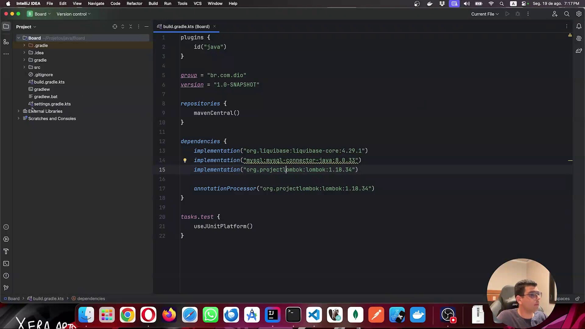
</p>

A captura mostra o arquivo `build.gradle.kts` do projeto **Board**, criado com Gradle (o Maven também serve, conforme a preferência de cada um). As dependências de teste que vinham por padrão foram removidas, e o bloco `dependencies` passou a ter três dependências `implementation` e um `annotationProcessor`.

```kotlin
plugins {
    id("java")
}

group = "br.com.dio"
version = "1.0-SNAPSHOT"

repositories {
    mavenCentral()
}

dependencies {
    implementation("org.liquibase:liquibase-core:4.29.1")
    implementation("mysql:mysql-connector-java:8.0.33")
    implementation("org.projectlombok:lombok:1.18.34")

    annotationProcessor("org.projectlombok:lombok:1.18.34")
}

tasks.test {
    useJUnitPlatform()
}
```

- **`liquibase-core:4.29.1`**: biblioteca de migração (versionamento) da base de dados. O Flyway não será usado neste projeto; o Liquibase entra como uma alternativa para que o aluno conheça e compare as opções.
- **`mysql-connector-java:8.0.33`**: driver JDBC que permite à aplicação Java se comunicar com o MySQL.
- **`lombok:1.18.34`**: reduz código repetitivo, como a escrita manual de construtores. Como o Lombok gera código durante a compilação, ele também precisa ser declarado como `annotationProcessor`, com a mesma coordenada.


#### Criando a estrutura de pacotes pelo terminal

<p align="center">
  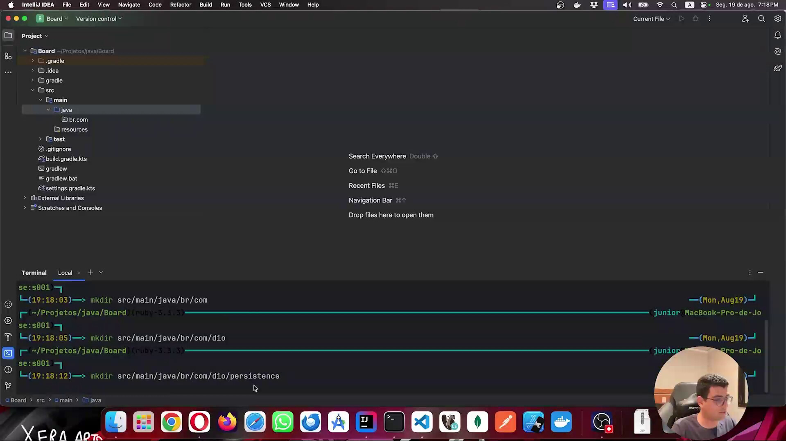
</p>

Com as dependências definidas, o próximo passo é organizar a estrutura de pacotes. Em vez de criá-los pela interface do IntelliJ, o terminal integrado da IDE é usado para executar `mkdir` a partir da raiz do projeto `Board`.

```bash
mkdir src/main/java/br/com
mkdir src/main/java/br/com/dio
mkdir src/main/java/br/com/dio/persistence
```

Os dois primeiros comandos criam os diretórios `br/com` e `br/com/dio` dentro de `src/main/java`. O terceiro, que aparece na linha atual do terminal, cria o diretório `persistence`. A árvore do projeto ainda exibe apenas `br.com` sob `java`: o IntelliJ agrupa diretórios encadeados em um único nó.


#### Pacotes `persistence` e `ui`

<p align="center">
  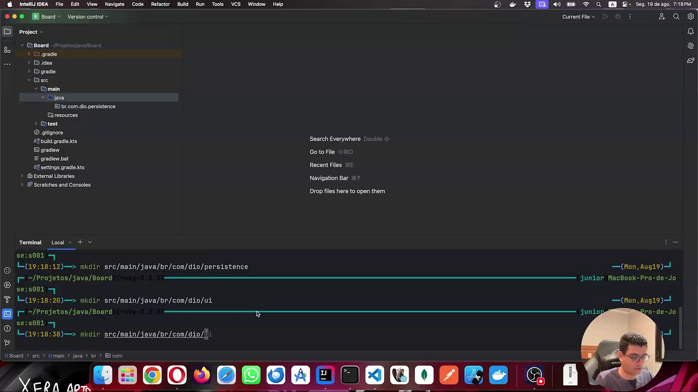
</p>

O comando que cria `persistence` já foi executado e, na sequência, é criado o diretório `ui`.

```bash
mkdir src/main/java/br/com/dio/persistence
mkdir src/main/java/br/com/dio/ui
```

O pacote `ui` será a camada de **interface de comunicação com o usuário**, e por isso ganha um pacote exclusivo. A árvore do projeto já mostra `br.com.dio.persistence`, e uma nova linha começa a ser digitada no terminal com o mesmo prefixo `src/main/java/br/com/dio/`.


#### Subpacotes `config` e `dao` em `persistence`

<p align="center">
  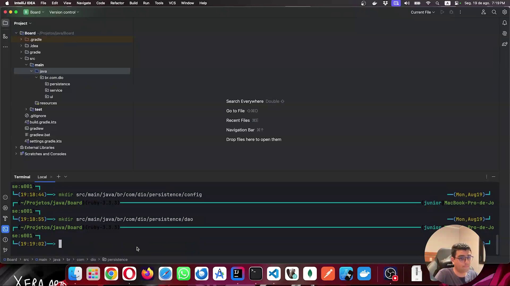
</p>

Agora a árvore mostra, dentro de `br.com.dio`, três pacotes no mesmo nível: `persistence`, `service` e `ui`. O `service` foi criado apenas para já deixar a estrutura organizada.

Os dois comandos visíveis no terminal criam subpacotes dentro de `persistence`:

```bash
mkdir src/main/java/br/com/dio/persistence/config
mkdir src/main/java/br/com/dio/persistence/dao
```

- **`config`**: reunirá as configurações da camada de persistência.
- **`dao`**: destinado às classes de acesso a dados (*Data Access Object*).

Por enquanto só se criam as pastas necessárias; outras surgirão conforme houver demanda.


#### Subpacotes `entity` e `migration`

<p align="center">
  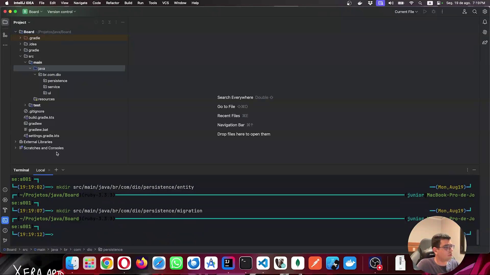
</p>

Mais dois subpacotes são criados dentro de `persistence`:

```bash
mkdir src/main/java/br/com/dio/persistence/entity
mkdir src/main/java/br/com/dio/persistence/migration
```

- **`entity`**: espaço para as entidades da aplicação.
- **`migration`**: pacote dedicado apenas à lógica de migração do banco de dados.

A árvore do projeto ainda está com `persistence` recolhido, por isso os novos subpacotes não aparecem nela.


#### Estrutura de pacotes concluída

<p align="center">
  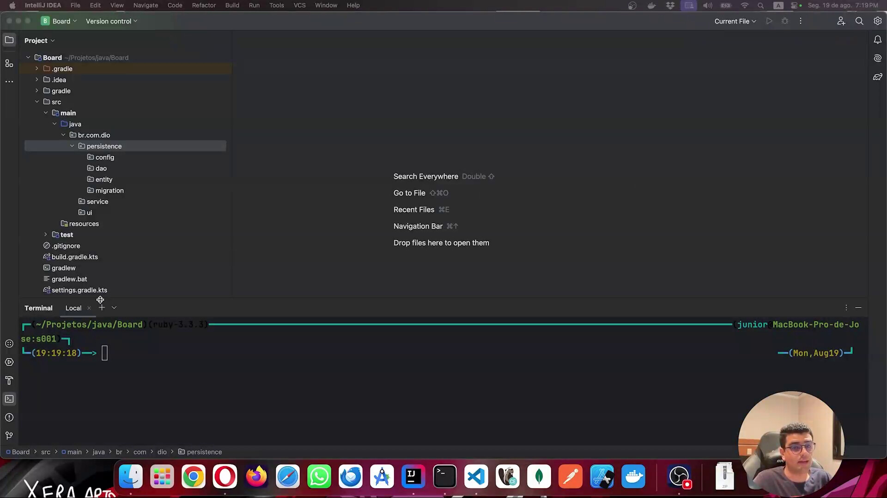
</p>

Com o terminal limpo e a árvore do projeto expandida, é possível ver a estrutura final de pacotes dentro de `src/main/java`, sob `br.com.dio`:

- `persistence`
  - `config`
  - `dao`
  - `entity`
  - `migration`
- `service`
- `ui`

Ao lado de `java`, aparecem também `resources` e a pasta `test`. Essa organização separa as responsabilidades da aplicação: interface com o usuário (`ui`), regras de serviço (`service`) e acesso a dados (`persistence`, com seus subpacotes). Novos pacotes serão adicionados conforme a necessidade.


#### Classe `ConnectionConfig`

<p align="center">
  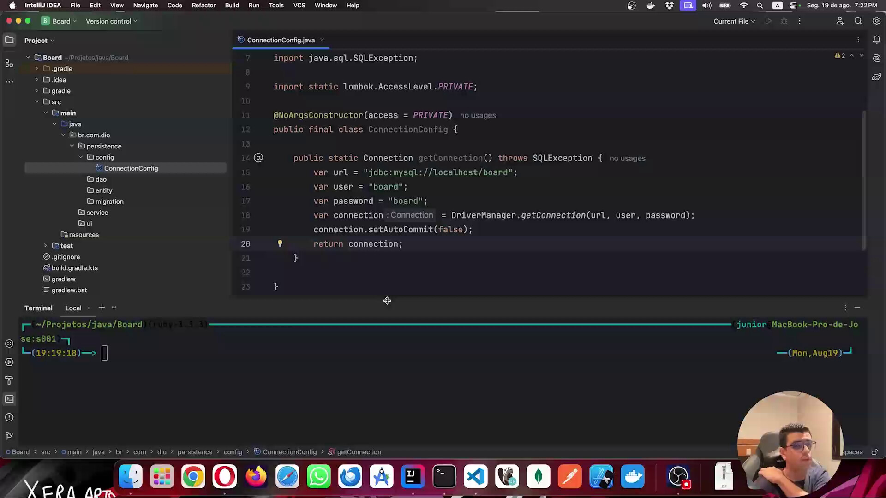
</p>

A captura mostra a classe `ConnectionConfig`, no pacote `br.com.dio.persistence.config`. Ela centraliza a conexão com o banco de dados MySQL. As primeiras linhas do arquivo (declaração de `package` e alguns imports) não aparecem na imagem.

```java
import java.sql.SQLException;

import static lombok.AccessLevel.PRIVATE;

@NoArgsConstructor(access = PRIVATE)
public final class ConnectionConfig {

    public static Connection getConnection() throws SQLException {
        var url = "jdbc:mysql://localhost/board";
        var user = "board";
        var password = "board";
        var connection = DriverManager.getConnection(url, user, password);
        connection.setAutoCommit(false);
        return connection;
    }

}
```

- `@NoArgsConstructor(access = PRIVATE)` (Lombok) gera um construtor privado, impedindo que a classe seja instanciada. O `import static` de `PRIVATE` deixa a anotação mais enxuta.
- `final` na classe impede herança. Ela existe apenas para fornecer um método estático.
- `getConnection()` monta a URL JDBC (`jdbc:mysql://localhost/board`), omitindo a porta `3306` por ser a padrão, e usa `board` como banco, usuário e senha.
- `throws SQLException` repassa à camada seguinte a responsabilidade de tratar a exceção.
- `setAutoCommit(false)` desliga o commit automático, porque as transações serão gerenciadas pela própria aplicação.


#### Classe `MigrationStrategy` (esqueleto)

<p align="center">
  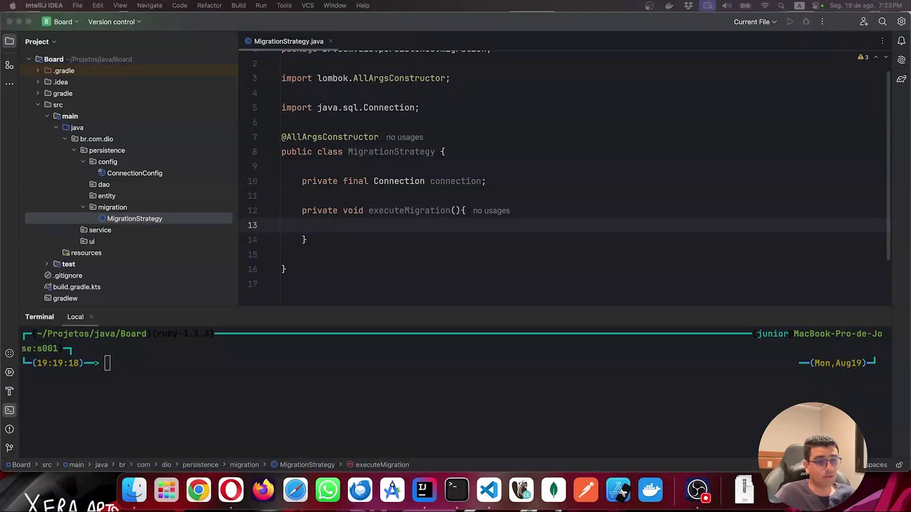
</p>

Agora começa a configuração do Liquibase, com a criação da classe `MigrationStrategy` no pacote `migration`. Por enquanto ela é apenas um esqueleto:

```java
package br.com.dio.persistence.migration;

import lombok.AllArgsConstructor;

import java.sql.Connection;

@AllArgsConstructor
public class MigrationStrategy {

    private final Connection connection;

    private void executeMigration(){

    }

}
```

- `@AllArgsConstructor` (Lombok) gera o construtor com todos os atributos. `@RequiredArgsConstructor` funcionaria da mesma forma nesse caso, e a escolha fica a critério de cada um.
- O atributo `private final Connection connection` recebe a conexão. Basta declará-lo, e o Lombok cria o construtor.
- `executeMigration()` é o método que vai executar a migração. Seu corpo ainda está vazio.


#### Arquivo `liquibase.properties`

<p align="center">
  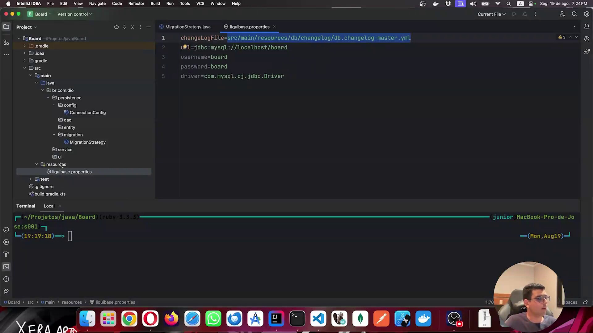
</p>

Para que o Liquibase se conecte ao banco, é criado em `src/main/resources` o arquivo `liquibase.properties`, com as configurações de conexão:

```properties
changeLogFile=src/main/resources/db/changelog/db.changelog-master.yml
url=jdbc:mysql://localhost/board
username=board
password=board
driver=com.mysql.cj.jdbc.Driver
```

- **`changeLogFile`**: caminho do arquivo *changelog*, onde ficam registradas as migrações do banco. Esse é o caminho padrão usado com o Liquibase, e por isso foi mantido. Na árvore do projeto, esse caminho ainda não existe.
- **`url`, `username` e `password`**: dados de conexão com o banco `board`.
- **`driver`**: classe do driver JDBC. Aqui é a do MySQL; para PostgreSQL ou SQL Server, seria outro driver.


#### Arquivo `db.changelog-master.yml`

<p align="center">
  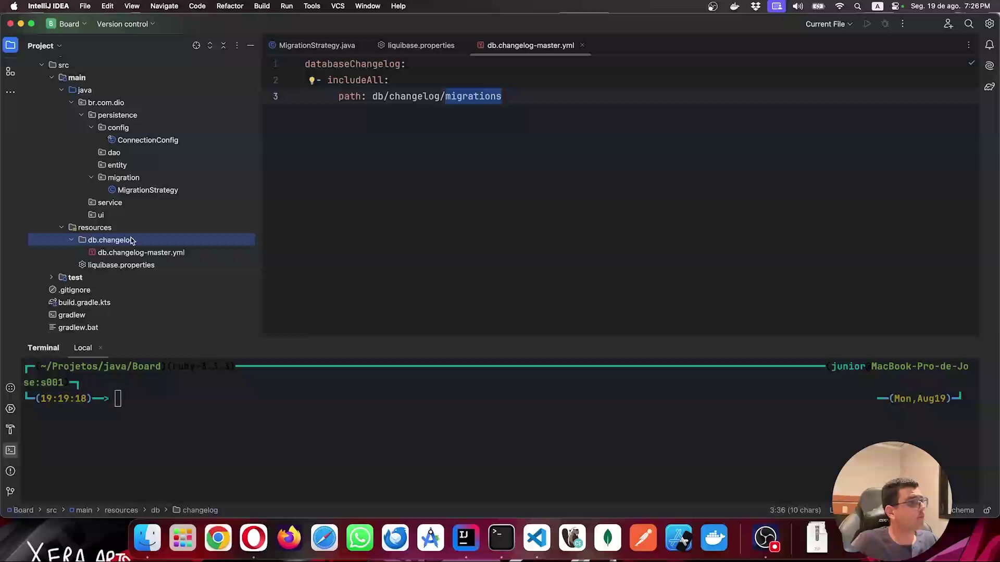
</p>

Dentro de `resources`, agora existe o diretório `db/changelog` (exibido pelo IntelliJ como `db.changelog`) com o arquivo `db.changelog-master.yml`. O Liquibase aceita vários formatos de changelog (XML, YAML, entre outros), e aqui o YAML foi o escolhido.

```yaml
databaseChangelog:
  - includeAll:
      path: db/changelog/migrations
```

Esse arquivo master não define as migrações diretamente. Em vez disso, `includeAll` manda o Liquibase incluir todos os arquivos encontrados no caminho `db/changelog/migrations`. É nessa pasta `migrations` que as migrações de fato serão criadas.


#### Guardando as saídas originais e abrindo o arquivo de log

<p align="center">
  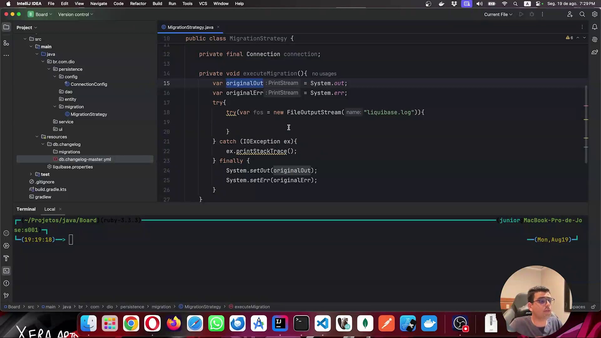
</p>

De volta ao método `executeMigration()`, é preciso tratar um detalhe do Liquibase. Ao rodar, ele emite logs de forma assíncrona. Como a aplicação do curso funciona no terminal, esses logs acabavam sendo capturados pelo `Scanner` que lê as entradas do usuário, o que atrapalhava. É uma particularidade de aplicativos de console: em projetos com interface gráfica ou web, essa configuração normalmente não é necessária. A solução é desviar os logs para um arquivo.

```java
    private final Connection connection;

    private void executeMigration(){
        var originalOut = System.out;
        var originalErr = System.err;
        try{
            try(var fos = new FileOutputStream("liquibase.log")){

            }
        } catch (IOException ex){
            ex.printStackTrace();
        } finally {
            System.setOut(originalOut);
            System.setErr(originalErr);
        }
    }
```

Até aqui o código faz três coisas:

- guarda em variáveis a saída padrão (`System.out`) e a saída de erro (`System.err`) originais;
- abre um `FileOutputStream` para o arquivo `liquibase.log`, dentro de um `try-with-resources`;
- no `finally`, restaura as saídas originais, aconteça erro ou não.

O bloco interno do `try` ainda está vazio.


#### Redirecionando as saídas e abrindo a conexão

<p align="center">
  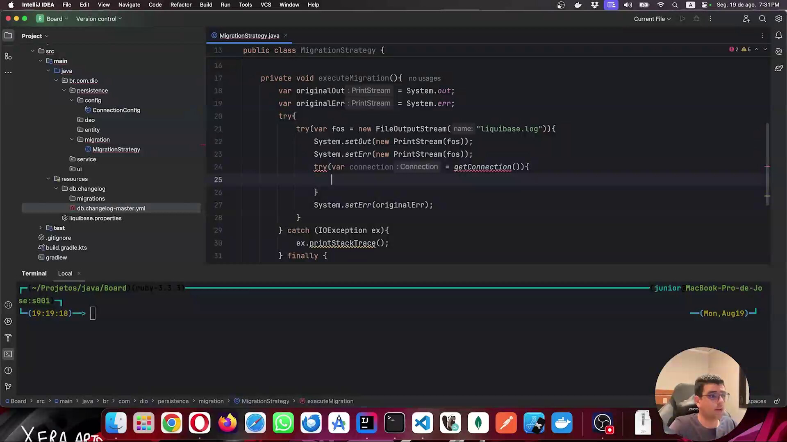
</p>

Dentro do `try` do arquivo, as saídas são redirecionadas. `System.setOut(...)` e `System.setErr(...)` passam a apontar para um `PrintStream` sobre o `FileOutputStream`, então tudo o que seria impresso no console vai para `liquibase.log`. Em seguida, um novo `try-with-resources` obtém a conexão com `getConnection()`.

```java
    private void executeMigration(){
        var originalOut = System.out;
        var originalErr = System.err;
        try{
            try(var fos = new FileOutputStream("liquibase.log")){
                System.setOut(new PrintStream(fos));
                System.setErr(new PrintStream(fos));
                try(var connection = getConnection()){

                }
                System.setErr(originalErr);
            }
        } catch (IOException ex){
            ex.printStackTrace();
        } finally {
```

O `getConnection()` aparece sublinhado porque o método estático de `ConnectionConfig` ainda não foi importado, e a IDE oferece o import. O bloco do `try` da conexão ainda está vazio, e o trecho visível termina no `finally`.


#### Criando o `JdbcConnection` e iniciando o Liquibase

<p align="center">
  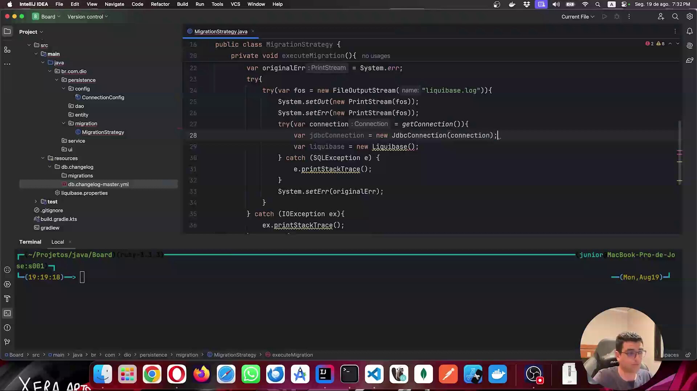
</p>

Dentro do `try` da conexão, o código passa a declarar as variáveis do Liquibase. O construtor do `Liquibase` espera uma conexão no formato próprio da biblioteca, por isso é criado antes um `JdbcConnection` que encapsula a `Connection`.

```java
        var originalErr = System.err;
        try{
            try(var fos = new FileOutputStream("liquibase.log")){
                System.setOut(new PrintStream(fos));
                System.setErr(new PrintStream(fos));
                try(var connection = getConnection()){
                    var jdbcConnection = new JdbcConnection(connection);
                    var liquibase = new Liquibase();
                } catch (SQLException e) {
                    e.printStackTrace();
                }
                System.setErr(originalErr);
            }
        } catch (IOException ex){
            ex.printStackTrace();
```

Também foi adicionado um `catch (SQLException e)` que apenas imprime o stack trace. O `new Liquibase()` aparece sublinhado porque o construtor exige argumentos, que ainda não foram informados.


#### Recursos declarados no `try-with-resources`

<p align="center">
  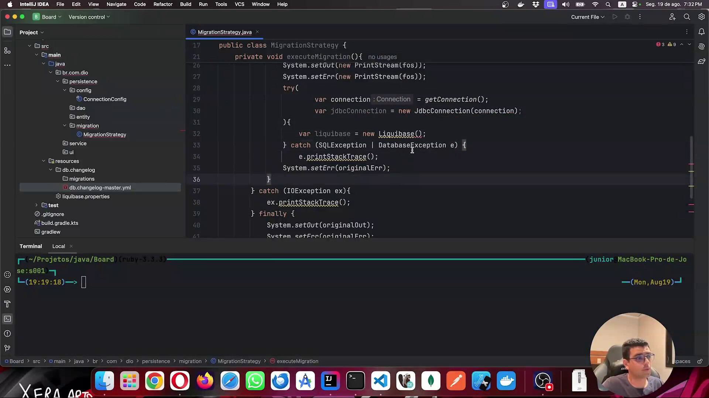
</p>

Como o `JdbcConnection` também é `AutoCloseable`, ele foi movido para dentro dos parênteses do `try`, junto com a `Connection`. Assim, os dois recursos são fechados automaticamente. O `catch` passou a tratar duas exceções, com `|`: `SQLException` e `DatabaseException`.

```java
                System.setOut(new PrintStream(fos));
                System.setErr(new PrintStream(fos));
                try(
                        var connection = getConnection();
                        var jdbcConnection = new JdbcConnection(connection);
                ){
                    var liquibase = new Liquibase();
                } catch (SQLException | DatabaseException e) {
                    e.printStackTrace();
                }
                System.setErr(originalErr);
            }
        } catch (IOException ex){
            ex.printStackTrace();
        } finally {
            System.setOut(originalOut);
            System.setErr(originalErr);
```

Não há como se recuperar de um erro nesse ponto, então o tratamento continua sendo só imprimir o stack trace. O `new Liquibase()` segue incompleto.


#### Instanciando o Liquibase com o changelog

<p align="center">
  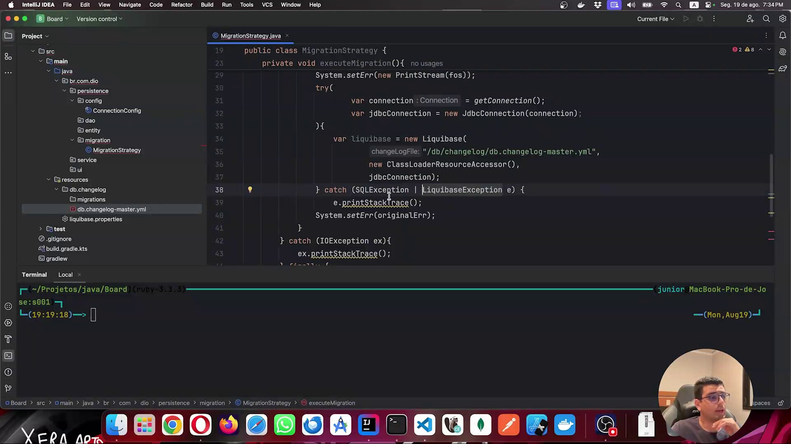
</p>

Agora o construtor do `Liquibase` recebe seus argumentos:

```java
                System.setErr(new PrintStream(fos));
                try(
                        var connection = getConnection();
                        var jdbcConnection = new JdbcConnection(connection);
                ){
                    var liquibase = new Liquibase(
                            "/db/changelog/db.changelog-master.yml",
                            new ClassLoaderResourceAccessor(),
                            jdbcConnection);
                } catch (SQLException | LiquibaseException e) {
                    e.printStackTrace();
                    System.setErr(originalErr);
                }
            } catch (IOException ex){
                ex.printStackTrace();
```

- O primeiro argumento é o caminho do arquivo master (`/db/changelog/db.changelog-master.yml`), a partir da raiz do classpath, ou seja, de `src/main/resources`.
- `new ClassLoaderResourceAccessor()` diz ao Liquibase como localizar esse recurso.
- `jdbcConnection` é a conexão criada anteriormente.

A exceção `DatabaseException` foi trocada por `LiquibaseException`, que cobre o que a IDE passou a reclamar (as duas estão na mesma cadeia de herança).


#### Método `executeMigration()` completo

<p align="center">
  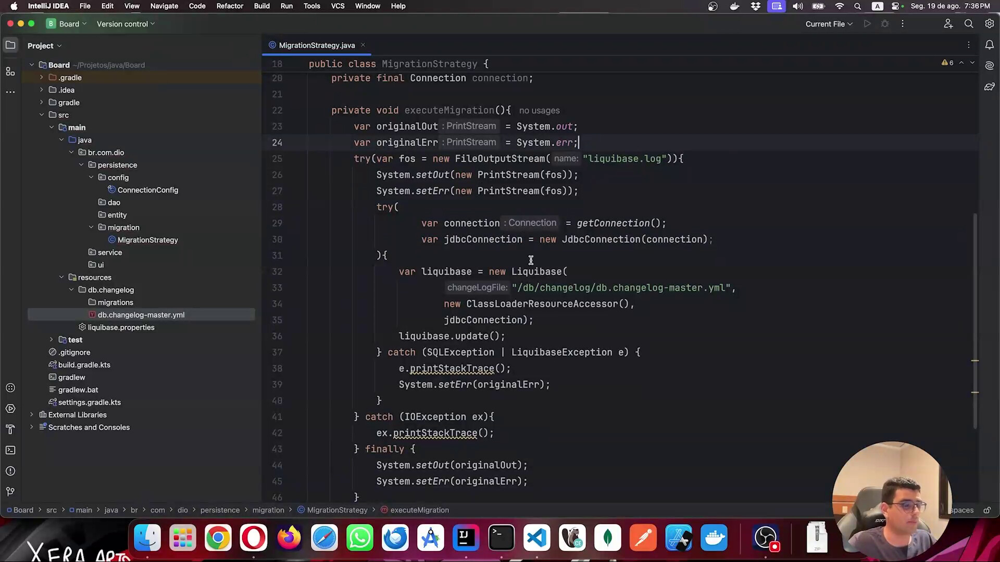
</p>

Com o `try` mais externo removido (foi arrancado para deixar o código menor, e a indentação foi ajustada), o método fica assim:

```java
public class MigrationStrategy {

    private final Connection connection;

    private void executeMigration(){
        var originalOut = System.out;
        var originalErr = System.err;
        try(var fos = new FileOutputStream("liquibase.log")){
            System.setOut(new PrintStream(fos));
            System.setErr(new PrintStream(fos));
            try(
                    var connection = getConnection();
                    var jdbcConnection = new JdbcConnection(connection);
            ){
                var liquibase = new Liquibase(
                        "/db/changelog/db.changelog-master.yml",
                        new ClassLoaderResourceAccessor(),
                        jdbcConnection);
                liquibase.update();
            } catch (SQLException | LiquibaseException e) {
                e.printStackTrace();
                System.setErr(originalErr);
            }
        } catch (IOException ex){
            ex.printStackTrace();
        } finally {
            System.setOut(originalOut);
            System.setErr(originalErr);
        }
```

A novidade é `liquibase.update()`, que executa as migrações pendentes definidas no changelog sobre o banco. Todo o restante do método serve para o desvio dos logs para `liquibase.log`, uma necessidade específica deste aplicativo de console. É provável que em um projeto profissional não seja preciso fazer esse desvio.


#### Classe `Main` para testar a migração

<p align="center">
  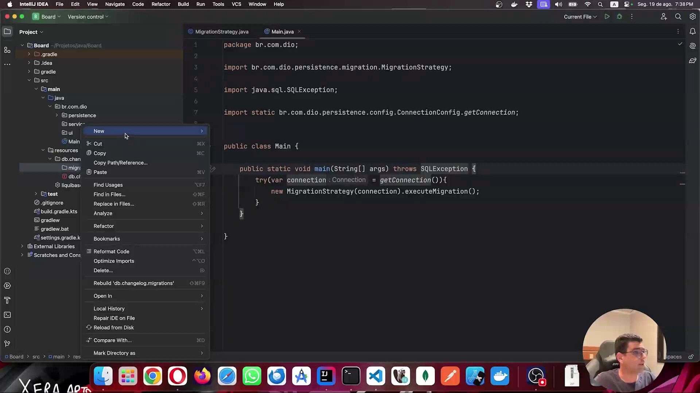
</p>

Para ver algo funcionando, é criada uma classe `Main` no pacote `br.com.dio`.

```java
package br.com.dio;

import br.com.dio.persistence.migration.MigrationStrategy;

import java.sql.SQLException;

import static br.com.dio.persistence.config.ConnectionConfig.getConnection;

public class Main {

    public static void main(String[] args) throws SQLException {
        try(var connection = getConnection()){
            new MigrationStrategy(connection).executeMigration();
        }
    }

}
```

- O `getConnection()` vem de `ConnectionConfig` por importação estática.
- `new MigrationStrategy(connection)` usa o construtor gerado pelo Lombok, que espera a conexão como argumento.
- Para que `executeMigration()` possa ser chamado de fora da classe, ele precisa ser `public`, e não `private` como estava.
- O `main` declara `throws SQLException`, sem tratar a exceção.

O menu de contexto aberto na tela, com a opção **New** sobre a pasta `migrations`, é o ponto de partida para criar um novo arquivo dentro dela.


#### Primeira migration em SQL

<p align="center">
  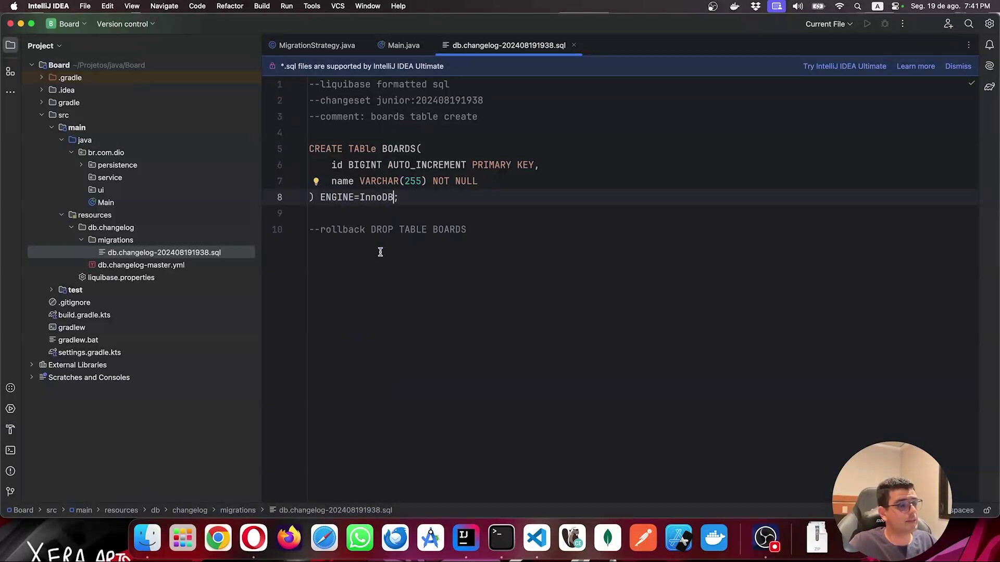
</p>

Dentro de `resources/db/changelog/migrations`, foi criado o arquivo `db.changelog-202408191938.sql`. O nome segue o padrão `db.changelog-` seguido de um timestamp (aqui, data e hora no formato `AAAAMMDDHHmm`). O Liquibase aceita vários formatos, mas o SQL foi preferido para as migrações, porque o conteúdo já é SQL. O YAML fica só para a configuração do arquivo master.

```sql
--liquibase formatted sql
--changeset junior:202408191938
--comment: boards table create

CREATE TABLE BOARDS(
    id BIGINT AUTO_INCREMENT PRIMARY KEY,
    name VARCHAR(255) NOT NULL
) ENGINE=InnoDB;

--rollback DROP TABLE BOARDS
```

As linhas iniciadas por `--` são comentários SQL, mas o Liquibase as lê como instruções para armazenar informações da migração:

- `--liquibase formatted sql` indica que o arquivo segue o formato SQL do Liquibase.
- `--changeset junior:202408191938` identifica o conjunto de mudanças pelo autor (`junior`) e por um id, aqui o mesmo timestamp do nome do arquivo.
- `--comment: boards table create` descreve a migração.
- `--rollback DROP TABLE BOARDS` define como desfazê-la.

O script cria a tabela `BOARDS` com `id` (`BIGINT`, autoincremento e chave primária) e `name` (`VARCHAR(255)`, obrigatório). A engine `InnoDB` é a mais usada em tabelas MySQL.


#### Banco `board` ainda sem tabelas no DBeaver

<p align="center">
  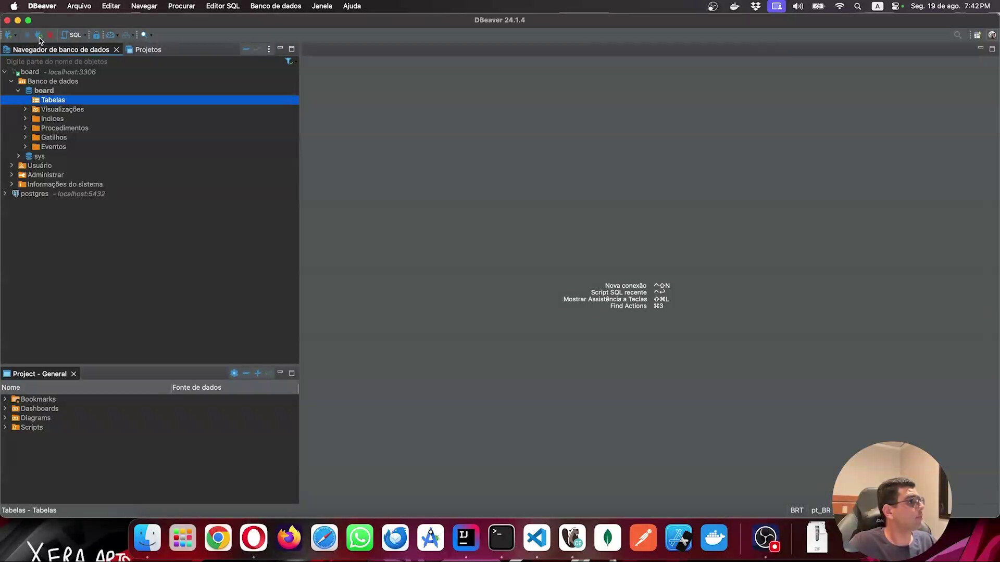
</p>

O DBeaver é aberto para acompanhar o banco. Na conexão `board` (`localhost:3306`), o container do MySQL está de pé, o banco `board` existe, e o nó **Tabelas** não tem nenhum item. É o ponto de partida antes de rodar a migration.


#### Execução da migration

<p align="center">
  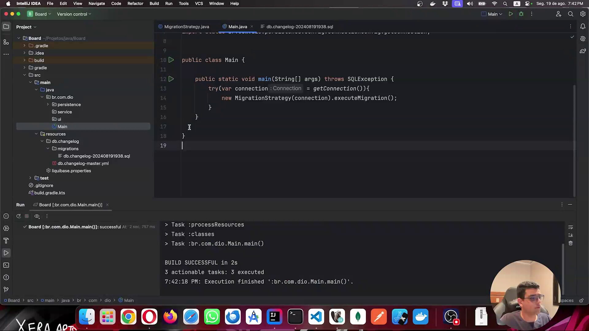
</p>

Voltando ao IntelliJ, a classe `Main` foi executada. O painel **Run** indica `successful`, e o console mostra apenas as tasks do Gradle (`:processResources`, `:classes` e `:br.com.dio.Main.main()`), seguidas de `BUILD SUCCESSFUL in 2s`. Como os logs do Liquibase foram desviados, os detalhes da execução ficam no arquivo `liquibase.log`, e não no console.

```java
public class Main {

    public static void main(String[] args) throws SQLException {
        try(var connection = getConnection()){
            new MigrationStrategy(connection).executeMigration();
        }
    }

}
```

Esta execução ocorreu depois de uma correção. Na primeira tentativa, o Liquibase acusou um erro dizendo que não encontrava o nó do changelog. A causa era um erro de digitação no arquivo master, com a chave raiz escrita com `l` minúsculo. O nome correto é `databaseChangeLog`, com `C` e `L` maiúsculos. Ajustado o arquivo, a classe foi executada de novo e o log registrou as migrações como executadas com sucesso.


#### Tabelas criadas pelo Liquibase

<p align="center">
  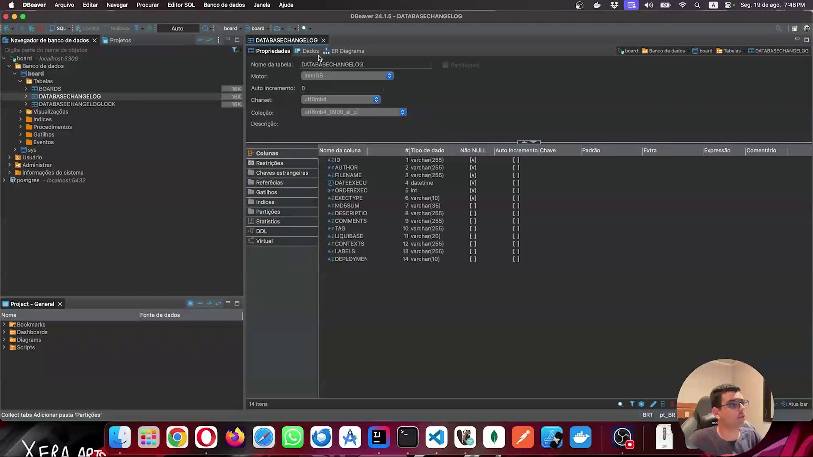
</p>

Após a execução, o navegador do DBeaver lista três tabelas no banco `board`: `BOARDS`, `DATABASECHANGELOG` e `DATABASECHANGELOGLOCK`. A `BOARDS` vem da migration criada. As outras duas são tabelas de controle do próprio Liquibase.

A captura abre a aba **Propriedades** da `DATABASECHANGELOG`, uma tabela `InnoDB` com 14 colunas: `ID`, `AUTHOR`, `FILENAME`, `DATEEXECUTED`, `ORDEREXECUTED`, `EXECTYPE`, `MD5SUM`, `DESCRIPTION`, `COMMENTS`, `TAG`, `LIQUIBASE`, `CONTEXTS`, `LABELS` e `DEPLOYMENT_ID`, algumas com o nome truncado na interface. Elas guardam informações sobre a migration, o arquivo, a execução e a versão do Liquibase. `ID` e `AUTHOR` correspondem ao que foi declarado na linha `--changeset`.

A `DATABASECHANGELOGLOCK` provavelmente é usada para controlar o bloqueio durante a migração, evitando conflitos como leituras simultâneas enquanto ela roda.


#### Registro da migration na `DATABASECHANGELOG`

<p align="center">
  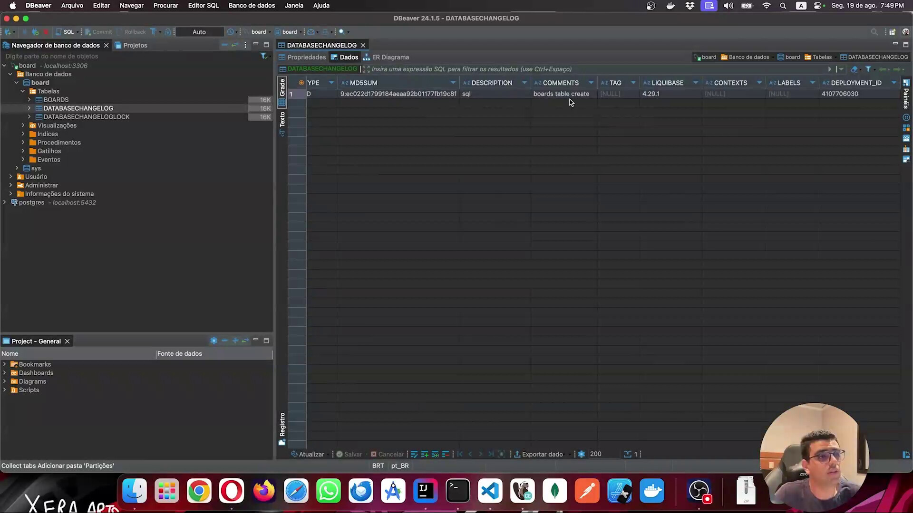
</p>

Na aba **Dados** da `DATABASECHANGELOG`, há um único registro, correspondente à migration executada:

- **`DESCRIPTION`**: `sql`, o tipo do changeset.
- **`COMMENTS`**: `boards table create`, o texto informado na linha `--comment`.
- **`LIQUIBASE`**: `4.29.1`, a versão do Liquibase usada, a mesma declarada no `build.gradle.kts`.
- **`MD5SUM`**: hash (checksum) que identifica o conteúdo da migration.
- **`TAG`, `CONTEXTS` e `LABELS`**: `NULL`, pois não foram definidos.
- **`DEPLOYMENT_ID`**: identificador da execução, preenchido pelo Liquibase.

É esse histórico que permite ao Liquibase saber quais migrações já foram aplicadas.


### 🟩 Vídeo 04 - Criando Migrations

<video width="60%" controls>
  <source src="000-Midia_e_Anexos/bootcamp_ntt_data_java_spring_ai-modulo.03-curso.04-video_04.webm" type="video/webm">
    Seu navegador não suporta vídeo HTML5.
</video>

link do vídeo: https://web.dio.me/lab/proejto-board-de-tarefas/learning/29f9bfa7-e012-4687-9954-033c3281c47f

### 🟩 Vídeo 05 - Entidades e Acessos a Dados

<video width="60%" controls>
  <source src="000-Midia_e_Anexos/bootcamp_ntt_data_java_spring_ai-modulo.03-curso.04-video_05.webm" type="video/webm">
    Seu navegador não suporta vídeo HTML5.
</video>

link do vídeo: https://web.dio.me/lab/proejto-board-de-tarefas/learning/0c5685c3-a629-4f2d-895a-a5ffa3f78d5b

### 🟩 Vídeo 06 - Camada de Acesso a Dados

<video width="60%" controls>
  <source src="000-Midia_e_Anexos/bootcamp_ntt_data_java_spring_ai-modulo.03-curso.04-video_06.webm" type="video/webm">
    Seu navegador não suporta vídeo HTML5.
</video>

link do vídeo: https://web.dio.me/lab/proejto-board-de-tarefas/learning/97cac612-a550-40e6-a219-f5f21241da86

### 🟩 Vídeo 07 - Trabalhando na Camada de UI

<video width="60%" controls>
  <source src="000-Midia_e_Anexos/bootcamp_ntt_data_java_spring_ai-modulo.03-curso.04-video_07.webm" type="video/webm">
    Seu navegador não suporta vídeo HTML5.
</video>

link do vídeo: https://web.dio.me/lab/proejto-board-de-tarefas/learning/2d649f25-8ec8-471c-9f6f-2fbe13ab9885

### 🟩 Vídeo 08 - Integrando sua UI com Acesso aos Dados

<video width="60%" controls>
  <source src="000-Midia_e_Anexos/bootcamp_ntt_data_java_spring_ai-modulo.03-curso.04-video_08.webm" type="video/webm">
    Seu navegador não suporta vídeo HTML5.
</video>

link do vídeo: https://web.dio.me/lab/proejto-board-de-tarefas/learning/1f266226-d48c-4fde-9aa8-e3222105e715

### 🟩 Vídeo 09 - Integrando Camada Services e Camada de Dados

<video width="60%" controls>
  <source src="000-Midia_e_Anexos/bootcamp_ntt_data_java_spring_ai-modulo.03-curso.04-video_09.webm" type="video/webm">
    Seu navegador não suporta vídeo HTML5.
</video>

link do vídeo: https://web.dio.me/lab/proejto-board-de-tarefas/learning/7b3429e4-adee-495e-b7d1-b7691c783ed0

### 🟩 Vídeo 10 - Refinado a camada de DAO

<video width="60%" controls>
  <source src="000-Midia_e_Anexos/bootcamp_ntt_data_java_spring_ai-modulo.03-curso.04-video_10.webm" type="video/webm">
    Seu navegador não suporta vídeo HTML5.
</video>

link do vídeo: https://web.dio.me/lab/proejto-board-de-tarefas/learning/b3b47d4f-c100-4430-8e37-0df77383f697

### 🟩 Vídeo 11 - Refinando Consultas

<video width="60%" controls>
  <source src="000-Midia_e_Anexos/bootcamp_ntt_data_java_spring_ai-modulo.03-curso.04-video_11.webm" type="video/webm">
    Seu navegador não suporta vídeo HTML5.
</video>

link do vídeo: https://web.dio.me/lab/proejto-board-de-tarefas/learning/e7a1d08f-224d-4025-b03d-88b213bcaead

### 🟩 Vídeo 12 - Trazendo resultado de consultas na camada de UI

<video width="60%" controls>
  <source src="000-Midia_e_Anexos/bootcamp_ntt_data_java_spring_ai-modulo.03-curso.04-video_12.webm" type="video/webm">
    Seu navegador não suporta vídeo HTML5.
</video>

link do vídeo: https://web.dio.me/lab/proejto-board-de-tarefas/learning/0e2fdedc-7857-4c65-af28-a36d08649f4d

### 🟩 Vídeo 13 - Fazendo Tratamentos de Erros

<video width="60%" controls>
  <source src="000-Midia_e_Anexos/bootcamp_ntt_data_java_spring_ai-modulo.03-curso.04-video_13.webm" type="video/webm">
    Seu navegador não suporta vídeo HTML5.
</video>

link do vídeo: https://web.dio.me/lab/proejto-board-de-tarefas/learning/0e2fdedc-7857-4c65-af28-a36d08649f4d?back=/track/formacao-java-fundamentals

### 🟩 Vídeo 14 - Camada de DTO

<video width="60%" controls>
  <source src="000-Midia_e_Anexos/bootcamp_ntt_data_java_spring_ai-modulo.03-curso.04-video_14.webm" type="video/webm">
    Seu navegador não suporta vídeo HTML5.
</video>

link do vídeo: https://web.dio.me/lab/proejto-board-de-tarefas/learning/bc96302e-96d3-4185-b52b-5fe49268d2bd

### 🟩 Vídeo 15 - Boas Práticas na camada de Persistência

<video width="60%" controls>
  <source src="000-Midia_e_Anexos/bootcamp_ntt_data_java_spring_ai-modulo.03-curso.04-video_15.webm" type="video/webm">
    Seu navegador não suporta vídeo HTML5.
</video>

link do vídeo: https://web.dio.me/lab/proejto-board-de-tarefas/learning/006f9160-c28c-420b-8704-99bf5563ce94?back=/track/formacao-java-fundamentals

### 🟩 Vídeo 16 - Criando Blocos de Update

<video width="60%" controls>
  <source src="000-Midia_e_Anexos/bootcamp_ntt_data_java_spring_ai-modulo.03-curso.04-video_16.webm" type="video/webm">
    Seu navegador não suporta vídeo HTML5.
</video>

link do vídeo: https://web.dio.me/lab/proejto-board-de-tarefas/learning/36a0bcbb-e6d2-42d3-9109-1c4c3ce34df0?back=/track/formacao-java-fundamentals

## Entendendo o Desafio

Agora é a sua hora de brilhar e construir um perfil de destaque na DIO! Explore todos os conceitos explorados até aqui e replique (ou melhore, porque não?) este projeto prático. Para isso, crie seu próprio repositório e aumente ainda mais seu portfólio de projetos no GitHub, o qual pode fazer toda diferença em suas entrevistas técnicas 😎

**Repositório Git**

O Git é um conceito essencial no mercado de trabalho atualmente, por isso sempre reforçamos sua importância em nossa metodologia educacional. Por isso, todo código-fonte desenvolvido durante este conteúdo foi versionado no seguinte endereço para que você possa consultá-lo a qualquer momento:

* **Repositório no GitHub:** https://github.com/digitalinnovationone/board

Bons estudos 😉