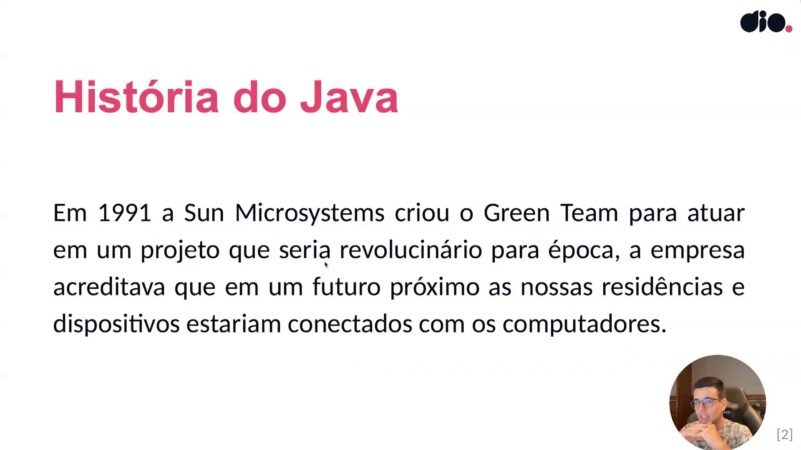
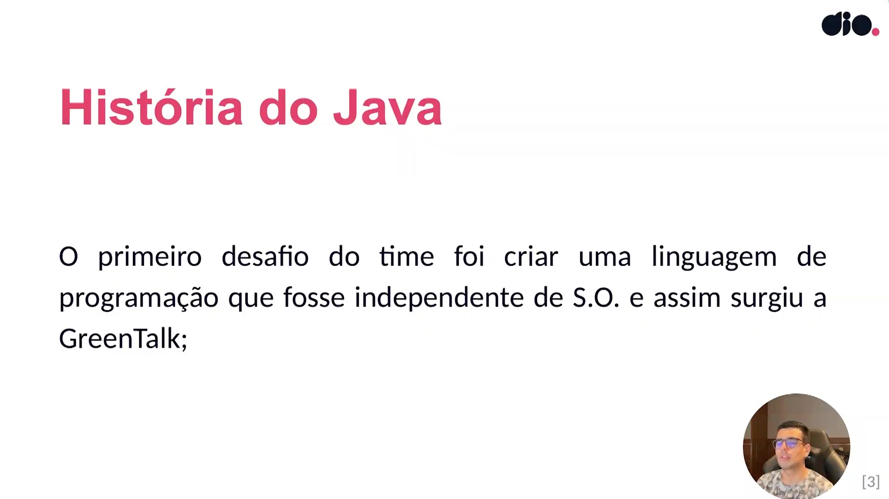
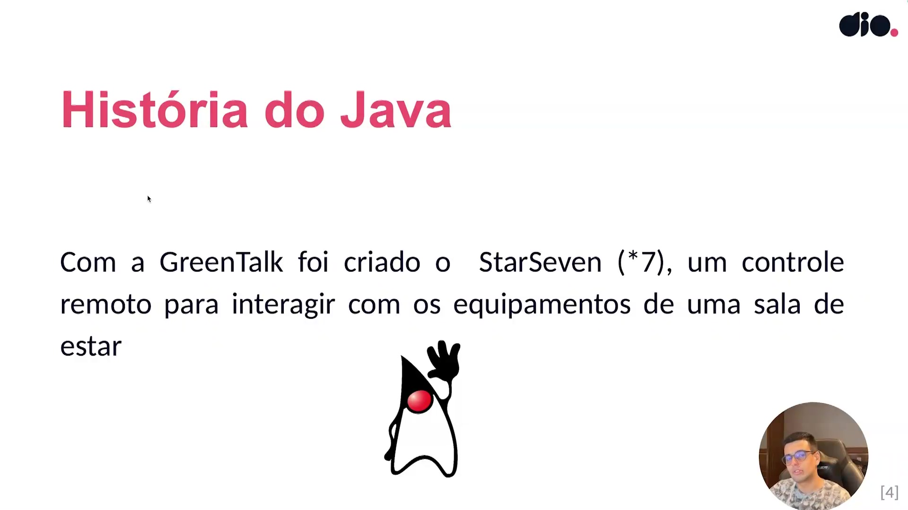
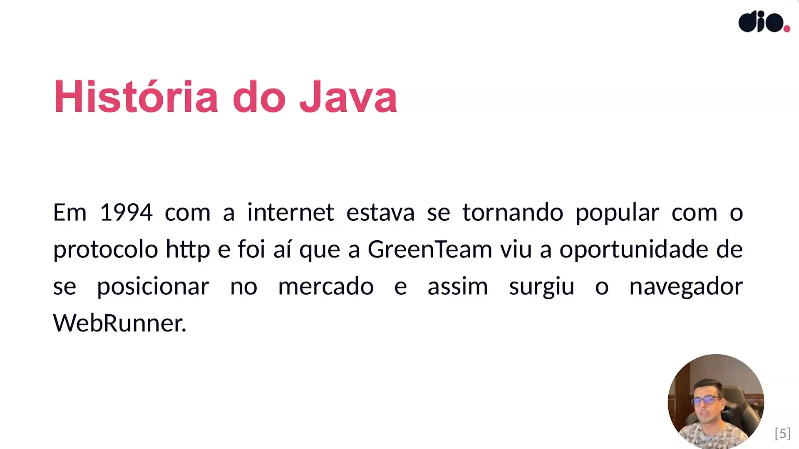
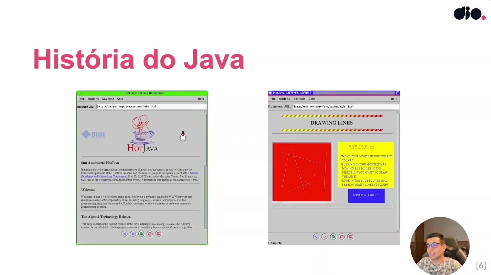
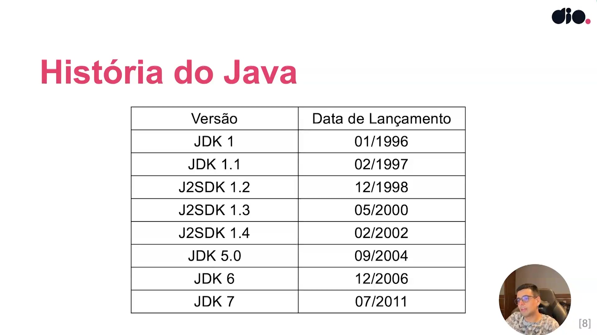
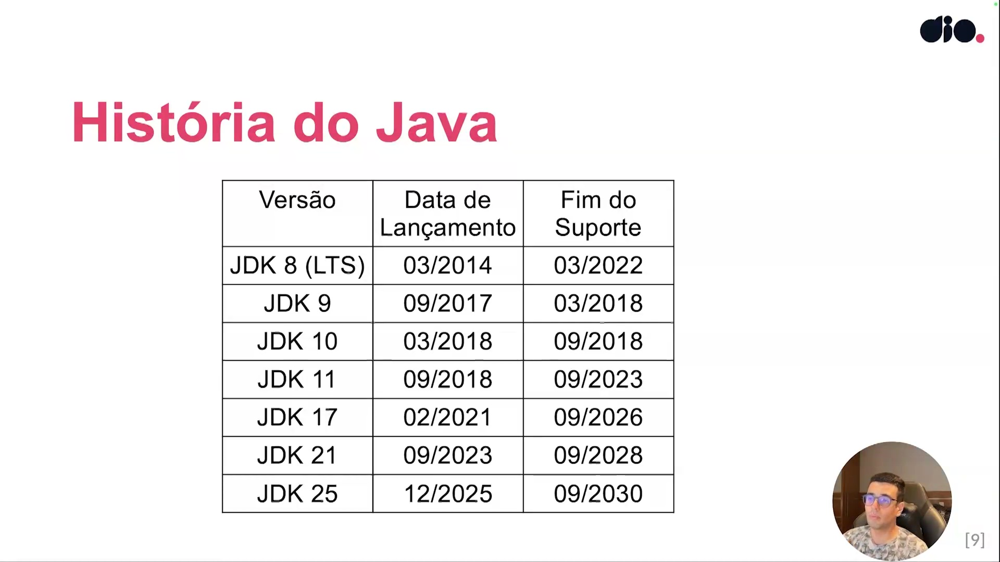
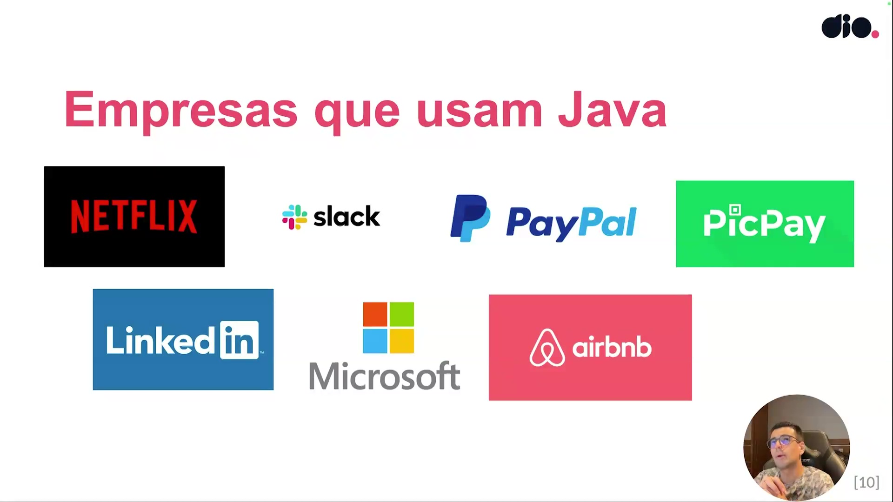
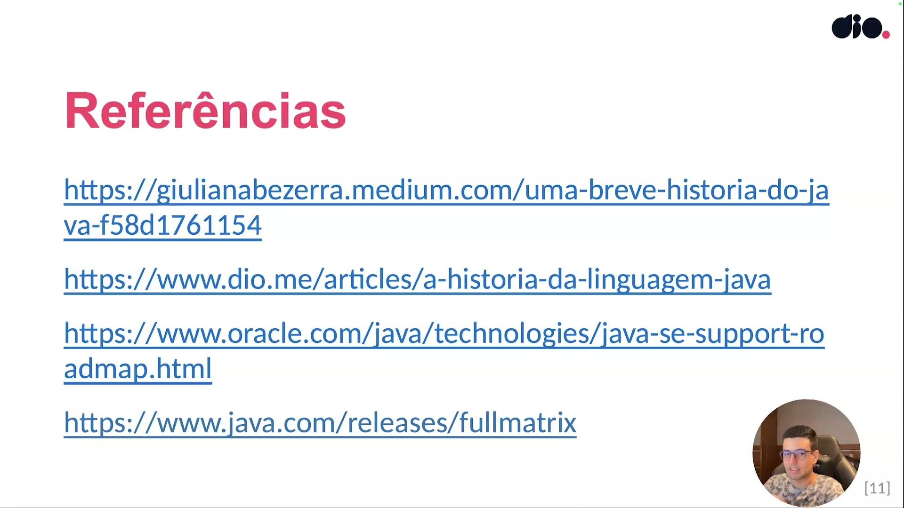

## Instrutor

- José Luiz Abreu Cardoso Junior (Engenheiro de software sênior)
- Contato Linkedin: / [juniorjrjl](https://www.linkedin.com/in/juniorjrjl/)

## Parte 1 - Introdução

### 🟩 Vídeo 01 - Apresentação

<video width="60%" controls>
  <source src="000-Midia_e_Anexos/bootcamp_globant_java_springboot_ai-modulo.01-curso.02-video_01.webm" type="video/webm">
    Seu navegador não suporta vídeo HTML5.
</video>

link do vídeo: https://web.dio.me/track/globant-java-spring-boot-ai-developer/course/introducao-ao-java-e-seu-ambiente-de-desenvolvimento/learning/39929cc1-4395-40e5-b8dd-64a57631240f?autoplay=1

O vídeo apresenta uma visão geral da formação em Java ministrada por Júnior (Jose Luiz Abreu Cardoso Júnior), desenvolvedor backend sênior. O curso é desenhado para levar o aluno desde os fundamentos básicos até conceitos avançados e boas práticas de mercado.

### Anotações

  

Slide de abertura da formação Java da DIO. O instrutor se apresenta como José Luiz Abreu Cardoso Junior, desenvolvedor backend sênior. Ele comenta sua experiência profissional na área de desenvolvimento, destacando sua atuação principalmente no ecossistema Java e em tecnologias relacionadas ao backend.

  

O slide resume informações pessoais e profissionais do instrutor. Ele destaca que iniciou sua trajetória por meio de curso técnico, possui cerca de 11 anos de experiência na área de desenvolvimento.

  

A imagem mostra a estrutura geral do conteúdo programático da formação Java. O curso foi dividido em quatro grandes módulos:

1. Conceitos básicos
2. Programação orientada a objetos
3. Gerenciamento de exceções, IO e gerenciador de dependências
4. Técnicas avançadas, padrões e persistência

O instrutor explica que a formação começa pelos fundamentos da linguagem Java e evolui progressivamente para conceitos mais avançados. Entre os assuntos mencionados estão estruturas de controle, orientação a objetos, collections, tratamento de exceções, leitura de arquivos, uso de bibliotecas externas, persistência com banco de dados e técnicas avançadas envolvendo anotações e geração de código.

### 🟩 Vídeo 02 - História e evolução do Java

<video width="60%" controls>
  <source src="000-Midia_e_Anexos/bootcamp_globant_java_springboot_ai-modulo.01-curso.02-video_02.webm" type="video/webm">
    Seu navegador não suporta vídeo HTML5.
</video>

link do vídeo: https://web.dio.me/track/globant-java-spring-boot-ai-developer/course/introducao-ao-java-e-seu-ambiente-de-desenvolvimento/learning/42f5af14-9b5c-457e-bffa-af2509b520be?autoplay=1

O vídeo apresenta uma visão panorâmica da trajetória do Java, desde sua concepção como um projeto para casas inteligentes até se tornar um pilar do desenvolvimento corporativo moderno.

### Anotações

  

Em 1991, a **Sun Microsystems** formou um grupo especial chamado **Green Team** — um trocadilho entre *Dream Team* (time dos sonhos) e *Green People* (alienígenas, em inglês). A missão desse time era visionária para a época: desenvolver uma tecnologia que permitisse que residências e dispositivos domésticos se comunicassem com computadores. O conceito é muito próximo do que hoje chamamos de **automação residencial** ou **casas inteligentes**, com dispositivos como assistentes virtuais e lâmpadas conectadas. James Gosling foi o principal nome desse time e é reconhecido como o criador do Java.

  

Para viabilizar a comunicação entre dispositivos de diferentes fabricantes e sistemas operacionais, o Green Team identificou um problema central: as linguagens da época eram dependentes do sistema operacional em que rodavam. A solução foi criar uma linguagem completamente nova, independente de S.O., que pudesse ser executada em qualquer plataforma. Essa linguagem recebeu o nome de **GreenTalk**.

  

Com a GreenTalk em mãos, o time construiu um protótipo concreto de produto: o **StarSeven (\*7)**, um controle remoto interativo capaz de acionar equipamentos de uma sala de estar. A imagem presente no slide é o **Duke**, o mascote oficial do Java — um personagem estilizado que acompanha a linguagem desde seus primórdios e que foi originalmente criado justamente para o StarSeven.

  

Em **1994**, a internet começava a se popularizar impulsionada pelo protocolo **HTTP**. O Green Team enxergou nesse movimento uma oportunidade estratégica: reposicionar a tecnologia que havia desenvolvido para o ambiente web. Foi então que o time criou o **WebRunner**, um navegador experimental capaz de executar conteúdo dinâmico — o que era algo completamente inédito para a época e abriu as portas para o Java se projetar além do nicho de automação residencial.

  

O slide exibe capturas de tela do **HotJava**, o navegador que sucedeu o WebRunner e que se tornou a primeira demonstração pública das capacidades do Java na web. À esquerda, vê-se a página inicial do HotJava hospedada nos servidores da Sun (`http://tachyon.eng/java.sun.com/index.html`), com o logo da linguagem e o mascote Duke. À direita, um exemplo de aplicação interativa rodando dentro do navegador — um canvas de desenho de linhas, demonstrando que o Java permitia executar programas dinâmicos diretamente no browser, algo revolucionário para meados dos anos 1990.

  

O slide apresenta a **linha do tempo das primeiras versões do Java**, desde o seu lançamento oficial até o início dos anos 2010:

| Versão     | Data de Lançamento |
|------------|--------------------|
| JDK 1      | 01/1996            |
| JDK 1.1    | 02/1997            |
| J2SDK 1.2  | 12/1998            |
| J2SDK 1.3  | 05/2000            |
| J2SDK 1.4  | 02/2002            |
| JDK 5.0    | 09/2004            |
| JDK 6      | 12/2006            |
| JDK 7      | 07/2011            |

O Java foi lançado oficialmente em janeiro de 1996 com o **JDK 1** e, ao longo dessa primeira fase, passou por evoluções contínuas — incluindo uma mudança de nomenclatura para J2SDK nas versões 1.2, 1.3 e 1.4. A partir do JDK 5.0, a numeração voltou ao padrão JDK, marcando também uma das atualizações mais significativas da linguagem até aquele momento.

  

Este slide complementa a linha do tempo com as **versões mais recentes do Java**, agora incluindo a coluna de **Fim do Suporte** — informação essencial para quem precisa escolher uma versão para projetos profissionais:

| Versão        | Data de Lançamento | Fim do Suporte |
|---------------|--------------------|----------------|
| JDK 8 (LTS)   | 03/2014            | 03/2022        |
| JDK 9         | 09/2017            | 03/2018        |
| JDK 10        | 03/2018            | 09/2018        |
| JDK 11        | 09/2018            | 09/2023        |
| JDK 17        | 02/2021            | 09/2026        |
| JDK 21        | 09/2023            | 09/2028        |
| JDK 25        | 12/2025            | 09/2030        |

As versões marcadas como **LTS (Long-Term Support)** recebem suporte estendido e são as mais indicadas para uso em produção. O JDK 8 foi um marco histórico e amplamente adotado. Atualmente, o **JDK 21** é a LTS mais recente consolidada, enquanto o **JDK 25** representa o lançamento mais atual previsto no roadmap.

  

O slide reforça a **relevância do Java no mercado atual** ao apresentar grandes empresas que utilizam a linguagem em seus sistemas. Entre elas estão **Netflix**, **Slack**, **PayPal**, **PicPay**, **LinkedIn**, **Microsoft** e **Airbnb** — organizações de escala global e de diferentes segmentos, como streaming, comunicação corporativa, pagamentos digitais e hospedagem. Essa diversidade demonstra que o Java não é restrito a um nicho específico, sendo aplicado em back-end de alta performance, sistemas financeiros, aplicações mobile (via Android) e muito mais.

  

O slide encerra a aula com as **referências bibliográficas** utilizadas como base para o conteúdo apresentado:

- [Uma breve história do Java — Giuliana Bezerra (Medium)](https://giulianabezerra.medium.com/uma-breve-historia-do-java-f58d1761154)
- [A história da linguagem Java — DIO](https://www.dio.me/articles/a-historia-da-linguagem-java)
- [Java SE Support Roadmap — Oracle](https://www.oracle.com/java/technologies/java-se-support-roadmap.html)
- [Java Releases Full Matrix](https://www.java.com/releases/fullmatrix)

Essas fontes permitem aprofundar o estudo sobre a evolução histórica do Java e acompanhar o ciclo de vida oficial das versões da linguagem diretamente nas páginas da Oracle e da comunidade.

## Parte 2 - Configuração do Ambiente Java

### 🟩 Vídeo 03 - Entendendo a Configuração do Ambiente Java

<video width="60%" controls>
  <source src="000-Midia_e_Anexos/bootcamp_globant_java_springboot_ai-modulo.01-curso.02-video_03.webm" type="video/webm">
    Seu navegador não suporta vídeo HTML5.
</video>

link do vídeo:

### 🟩 Vídeo 04 - Opção 1: Instalando o JDK Oracle pelo instalador no Windows

<video width="60%" controls>
  <source src="000-Midia_e_Anexos/bootcamp_globant_java_springboot_ai-modulo.01-curso.02-video_04.webm" type="video/webm">
    Seu navegador não suporta vídeo HTML5.
</video>

link do vídeo:

### 🟩 Vídeo 05 - Opção 2: Instalando o JDK Amazon Corretto pelo terminal no Linux

<video width="60%" controls>
  <source src="000-Midia_e_Anexos/bootcamp_globant_java_springboot_ai-modulo.01-curso.02-video_05.webm" type="video/webm">
    Seu navegador não suporta vídeo HTML5.
</video>

link do vídeo:

### 🟩 Vídeo 06 - Opção 3: Instalando o JDK pelo gerenciador de versões SDKMAN! no Linux

<video width="60%" controls>
  <source src="000-Midia_e_Anexos/bootcamp_globant_java_springboot_ai-modulo.01-curso.02-video_06.webm" type="video/webm">
    Seu navegador não suporta vídeo HTML5.
</video>

link do vídeo:

## Parte 3 - Gerenciadores de Build

### 🟩 Vídeo 07 - Entendendo o que são Gerenciadores de Build

<video width="60%" controls>
  <source src="000-Midia_e_Anexos/bootcamp_globant_java_springboot_ai-modulo.01-curso.02-video_07.webm" type="video/webm">
    Seu navegador não suporta vídeo HTML5.
</video>

link do vídeo:

### 🟩 Vídeo 08 - Instalando o Maven

<video width="60%" controls>
  <source src="000-Midia_e_Anexos/bootcamp_globant_java_springboot_ai-modulo.01-curso.02-video_08.webm" type="video/webm">
    Seu navegador não suporta vídeo HTML5.
</video>

link do vídeo:

### 🟩 Vídeo 09 - Instalando o Gradle

<video width="60%" controls>
  <source src="000-Midia_e_Anexos/bootcamp_globant_java_springboot_ai-modulo.01-curso.02-video_09.webm" type="video/webm">
    Seu navegador não suporta vídeo HTML5.
</video>

link do vídeo:

## Parte 4 - Instalação de IDEs e Execução do seu Primeiro Programa Java

### 🟩 Vídeo 10 - Instalando Eclipse

<video width="60%" controls>
  <source src="000-Midia_e_Anexos/bootcamp_globant_java_springboot_ai-modulo.01-curso.02-video_10.webm" type="video/webm">
    Seu navegador não suporta vídeo HTML5.
</video>

link do vídeo:

### 🟩 Vídeo 11 - Instalando VSCode

<video width="60%" controls>
  <source src="000-Midia_e_Anexos/bootcamp_globant_java_springboot_ai-modulo.01-curso.02-video_11.webm" type="video/webm">
    Seu navegador não suporta vídeo HTML5.
</video>

link do vídeo:

### 🟩 Vídeo 12 - Instalando IntelliJ

<video width="60%" controls>
  <source src="000-Midia_e_Anexos/bootcamp_globant_java_springboot_ai-modulo.01-curso.02-video_12.webm" type="video/webm">
    Seu navegador não suporta vídeo HTML5.
</video>

link do vídeo:

### 🟩 Vídeo 13 - Executando primeiro programa no IntelliJ

<video width="60%" controls>
  <source src="000-Midia_e_Anexos/bootcamp_globant_java_springboot_ai-modulo.01-curso.02-video_13.webm" type="video/webm">
    Seu navegador não suporta vídeo HTML5.
</video>

link do vídeo:

### 🟩 Vídeo 14 - Executando primeiro programa no VSCode

<video width="60%" controls>
  <source src="000-Midia_e_Anexos/bootcamp_globant_java_springboot_ai-modulo.01-curso.02-video_14.webm" type="video/webm">
    Seu navegador não suporta vídeo HTML5.
</video>

link do vídeo:

##  Materiais de Apoio

# Certificado: 

- Link na plataforma: 
- Certificado em pdf: