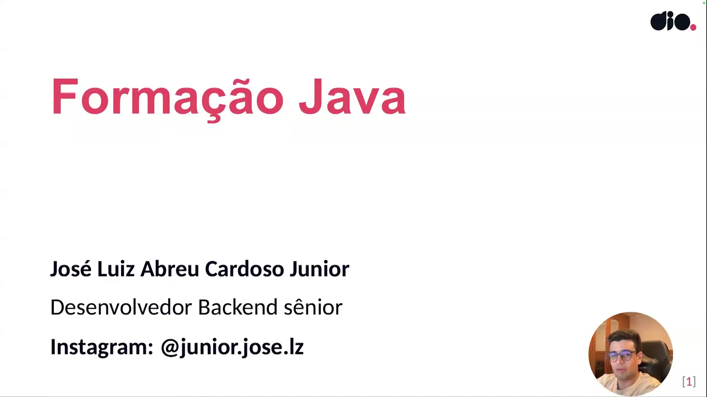
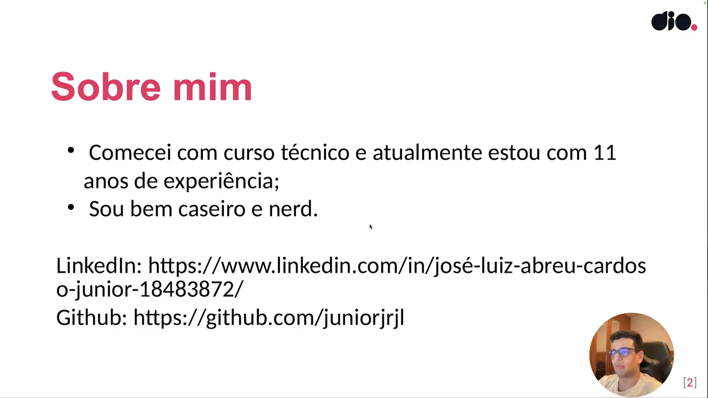
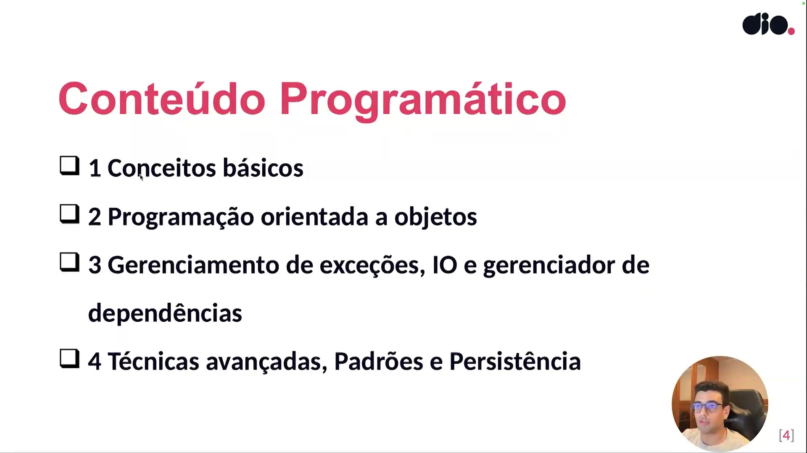

## Instrutor

- xxxxxxxxxxxxxxxxx (xxxxxxxxxxxxxxxxxxxxxx)
- Contato Linkedin: / [xxxxxxxx](https://www.linkedin.com/in/xxxxxxxxxxxxxx/)

## Parte 1 - Introdução

### 🟩 Vídeo 01 - Apresentação

<video width="60%" controls>
  <source src="000-Midia_e_Anexos/bootcamp_globant_java_springboot_ai-modulo.01-curso.02-video_01.webm" type="video/webm">
    Seu navegador não suporta vídeo HTML5.
</video>

link do vídeo: https://web.dio.me/track/globant-java-spring-boot-ai-developer/course/introducao-ao-java-e-seu-ambiente-de-desenvolvimento/learning/39929cc1-4395-40e5-b8dd-64a57631240f?autoplay=1

O vídeo apresenta uma visão geral da formação em Java ministrada por Júnior (Jose Luiz Abreu Cardoso Júnior), desenvolvedor backend sênior. O curso é desenhado para levar o aluno desde os fundamentos básicos até conceitos avançados e boas práticas de mercado.

### Anotações

  

Slide de abertura da formação Java da DIO. O instrutor se apresenta como José Luiz Abreu Cardoso Junior, desenvolvedor backend sênior. Ele comenta sua experiência profissional na área de desenvolvimento, destacando sua atuação principalmente no ecossistema Java e em tecnologias relacionadas ao backend.

  

O slide resume informações pessoais e profissionais do instrutor. Ele destaca que iniciou sua trajetória por meio de curso técnico, possui cerca de 11 anos de experiência na área de desenvolvimento.

  

A imagem mostra a estrutura geral do conteúdo programático da formação Java. O curso foi dividido em quatro grandes módulos:

1. Conceitos básicos
2. Programação orientada a objetos
3. Gerenciamento de exceções, IO e gerenciador de dependências
4. Técnicas avançadas, padrões e persistência

O instrutor explica que a formação começa pelos fundamentos da linguagem Java e evolui progressivamente para conceitos mais avançados. Entre os assuntos mencionados estão estruturas de controle, orientação a objetos, collections, tratamento de exceções, leitura de arquivos, uso de bibliotecas externas, persistência com banco de dados e técnicas avançadas envolvendo anotações e geração de código.

### 🟩 Vídeo 02 - História e evolução do Java

<video width="60%" controls>
  <source src="000-Midia_e_Anexos/bootcamp_globant_java_springboot_ai-modulo.01-curso.02-video_02.webm" type="video/webm">
    Seu navegador não suporta vídeo HTML5.
</video>

link do vídeo: https://web.dio.me/track/globant-java-spring-boot-ai-developer/course/introducao-ao-java-e-seu-ambiente-de-desenvolvimento/learning/42f5af14-9b5c-457e-bffa-af2509b520be?autoplay=1

## Parte 2 - Configuração do Ambiente Java

### 🟩 Vídeo 03 - Entendendo a Configuração do Ambiente Java

<video width="60%" controls>
  <source src="000-Midia_e_Anexos/bootcamp_globant_java_springboot_ai-modulo.01-curso.02-video_03.webm" type="video/webm">
    Seu navegador não suporta vídeo HTML5.
</video>

link do vídeo:

### 🟩 Vídeo 04 - Opção 1: Instalando o JDK Oracle pelo instalador no Windows

<video width="60%" controls>
  <source src="000-Midia_e_Anexos/bootcamp_globant_java_springboot_ai-modulo.01-curso.02-video_04.webm" type="video/webm">
    Seu navegador não suporta vídeo HTML5.
</video>

link do vídeo:

### 🟩 Vídeo 05 - Opção 2: Instalando o JDK Amazon Corretto pelo terminal no Linux

<video width="60%" controls>
  <source src="000-Midia_e_Anexos/bootcamp_globant_java_springboot_ai-modulo.01-curso.02-video_05.webm" type="video/webm">
    Seu navegador não suporta vídeo HTML5.
</video>

link do vídeo:

### 🟩 Vídeo 06 - Opção 3: Instalando o JDK pelo gerenciador de versões SDKMAN! no Linux

<video width="60%" controls>
  <source src="000-Midia_e_Anexos/bootcamp_globant_java_springboot_ai-modulo.01-curso.02-video_06.webm" type="video/webm">
    Seu navegador não suporta vídeo HTML5.
</video>

link do vídeo:

## Parte 3 - Gerenciadores de Build

### 🟩 Vídeo 07 - Entendendo o que são Gerenciadores de Build

<video width="60%" controls>
  <source src="000-Midia_e_Anexos/bootcamp_globant_java_springboot_ai-modulo.01-curso.02-video_07.webm" type="video/webm">
    Seu navegador não suporta vídeo HTML5.
</video>

link do vídeo:

### 🟩 Vídeo 08 - Instalando o Maven

<video width="60%" controls>
  <source src="000-Midia_e_Anexos/bootcamp_globant_java_springboot_ai-modulo.01-curso.02-video_08.webm" type="video/webm">
    Seu navegador não suporta vídeo HTML5.
</video>

link do vídeo:

### 🟩 Vídeo 09 - Instalando o Gradle

<video width="60%" controls>
  <source src="000-Midia_e_Anexos/bootcamp_globant_java_springboot_ai-modulo.01-curso.02-video_09.webm" type="video/webm">
    Seu navegador não suporta vídeo HTML5.
</video>

link do vídeo:

## Parte 4 - Instalação de IDEs e Execução do seu Primeiro Programa Java

### 🟩 Vídeo 10 - Instalando Eclipse

<video width="60%" controls>
  <source src="000-Midia_e_Anexos/bootcamp_globant_java_springboot_ai-modulo.01-curso.02-video_10.webm" type="video/webm">
    Seu navegador não suporta vídeo HTML5.
</video>

link do vídeo:

### 🟩 Vídeo 11 - Instalando VSCode

<video width="60%" controls>
  <source src="000-Midia_e_Anexos/bootcamp_globant_java_springboot_ai-modulo.01-curso.02-video_11.webm" type="video/webm">
    Seu navegador não suporta vídeo HTML5.
</video>

link do vídeo:

### 🟩 Vídeo 12 - Instalando IntelliJ

<video width="60%" controls>
  <source src="000-Midia_e_Anexos/bootcamp_globant_java_springboot_ai-modulo.01-curso.02-video_12.webm" type="video/webm">
    Seu navegador não suporta vídeo HTML5.
</video>

link do vídeo:

### 🟩 Vídeo 13 - Executando primeiro programa no IntelliJ

<video width="60%" controls>
  <source src="000-Midia_e_Anexos/bootcamp_globant_java_springboot_ai-modulo.01-curso.02-video_13.webm" type="video/webm">
    Seu navegador não suporta vídeo HTML5.
</video>

link do vídeo:

### 🟩 Vídeo 14 - Executando primeiro programa no VSCode

<video width="60%" controls>
  <source src="000-Midia_e_Anexos/bootcamp_globant_java_springboot_ai-modulo.01-curso.02-video_14.webm" type="video/webm">
    Seu navegador não suporta vídeo HTML5.
</video>

link do vídeo:

##  Materiais de Apoio

# Certificado: 

- Link na plataforma: 
- Certificado em pdf: