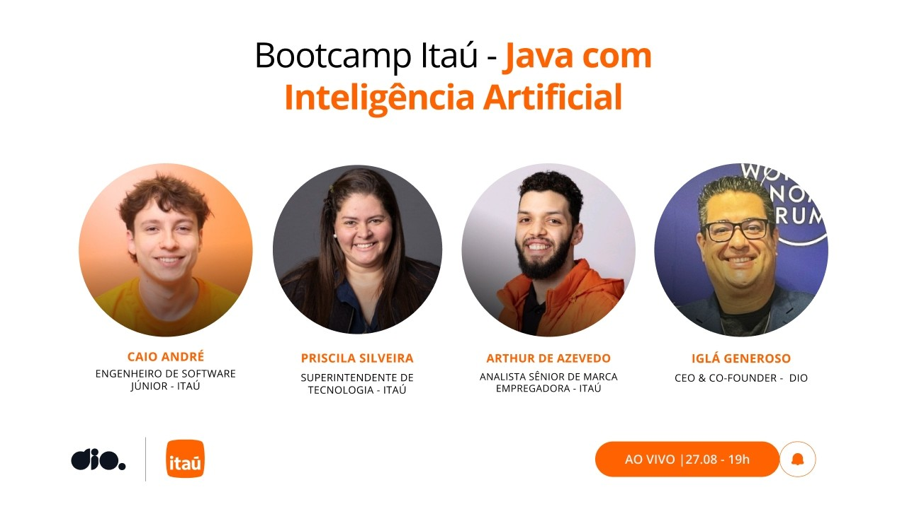

# Live de Abertura da Experiência Itaú

<video width="60%" controls>
  <source src="000-Midia_e_Anexos/screen-capture.mp4" type="video/webm">
  Seu navegador não suporta vídeo HTML5.
</video>

link para o vídeo: https://web.dio.me/lives/live-de-abertura-da-experiencia-itau?back=/track/0d6c76e7-ab8d-4959-b015-248abde232dc

## Anotações

  

## Resumo

**Parceria:** Banco Itaú & DIO  
**Participantes:**
* **Iglá** (Fundador da DIO)
* **Priscila** (Superintendente de Tecnologia - Banco Itaú)
* **Artur** (Atração de Talentos & Marca Empregadora - Banco Itaú)
* **Caio** (Especialista em Tech - Banco Itaú)

### 1. Visão Geral do Bootcamp & Parceria

A live oficializou o lançamento do **Bootcamp Itaú - Java com Inteligência Artificial**, uma iniciativa conjunta entre o **Banco Itaú** e a **DIO** com o objetivo de formar e capacitar talentos na principal linguagem utilizada nos sistemas críticos do banco, integrada às tecnologias de Computação em Nuvem e Inteligência Artificial.

#### Destaques da Oportunidade:
* **15.000 Bolsas Gratuitas:** Oportunidade 100% gratuita aberta a profissionais e estudantes do Brasil e do exterior.
* **Acesso Direto ao Mercado:** Graduados têm prioridade de visibilidade no *Talent Match* da DIO, conectando-se diretamente ao Itaú e a mais de 130 empresas parceiras.
* **Programa de Entrada & Aceleração:** Estruturado tanto para iniciantes (com conceitos básicos de Java e lógica) quanto para quem busca transição de carreira ou aceleração profissional.

### 2. Estrutura do Conteúdo Técnico (45 Horas)

O programa abrange uma jornada completa de aprendizado *hands-on* e prático, preparando os participantes para os desafios reais do mercado:

| Módulo / Pilar | Tópicos e Tecnologias Cobertas |
| :--- | :--- |
| **Inteligência Artificial** | Engenharia de Prompt, fundamentos de LLMs, uso prático de IA para acelerar o desenvolvimento e criação de agentes de apoio aos estudos. |
| **Fundamentos de Java** | Sintaxe, lógica de programação, orientação a objetos e boas práticas. |
| **Ecossistema Spring** | Spring Boot, Spring Data, Spring Security e Spring Cloud para construção de APIs robustas e escaláveis. |
| **Cloud Computing** | Conceitos fundamentais e integração com serviços da **AWS (Amazon Web Services)**. |

### 3. O Papel da Tecnologia e da IA no Banco Itaú

A liderança do Itaú destacou como a tecnologia deixou de ser apenas uma área de suporte e tornou-se o centro estratégico dos negócios da instituição:

* **Evolução Histórica:** O Itaú utiliza Inteligência Artificial há mais de 10 anos (como em modelos de análise de crédito). A migração contínua para a nuvem (AWS) iniciada há uma década permitiu a flexibilidade e a escalabilidade atuais.
* **A Tríade/Quarteto de Produto:** As decisões de desenvolvimento são tomadas de forma integrada por equipes compostas por Negócios, Tecnologia, Design, Dados e Produto.
* **IA como Extensão da Inteligência Humana:** A IA não substitui o desenvolvedor; ela atua como um acelerador. A capacidade crítica, os fundamentos da engenharia de software e a validação do código continuam sendo responsabilidade do profissional humano.
* **Resolução de Problemas Reais:** A tecnologia não é adotada por "moda". A pergunta central no banco é sempre: *"Qual problema real do cliente ou do negócio estamos resolvendo?"*

### 4. Dicas de Carreira e Processo Seletivo no Itaú

Os executivos e especialistas compartilharam direcionamentos essenciais para quem deseja se destacar nos processos seletivos:

#### 🎯 Para os Processos Seletivos:
* **Estudo de Caso e Profundidade:** Antes de entrevistas, pesquise o momento atual do banco, leia relatórios anuais e entenda os desafios estratégicos da instituição.
* **Leitura Atenta dos Descritivos de Vagas:** As vagas nascem de dores reais das áreas de negócio. Entenda o que está sendo pedido além dos requisitos básicos e alinhe seu perfil a essa solução.
* **Mantenha Perfis Atualizados:** Mantenha LinkedIn e Gupy sempre completos e atualizados. Compreender como os recrutadores buscam perfis na plataforma Gupy é vital.
* **Diploma Universitário NÃO é Requisito Eliminatório (para vagas CLT):** Para vagas efetivas, o diploma de faculdade não é obrigatório. O foco principal está nas competências e na capacidade técnica/comportamental (requisitos acadêmicos aplicam-se a programas específicos, como Estágio e Trainee).

#### 💡 Soft Skills & Atitude Protagonista:
* **Protagonismo e Curiosidade:** Não terceirize a gestão da sua carreira. Busque conhecimento ativamente, seja curioso e resolva problemas de forma autônoma.
* **Habilidades Transferíveis (Transição & +40):** Profissionais em transição de carreira ou com mais de 40 anos devem valorizar suas bagagens anteriores. Soft skills (comunicação, maturidade, resolução de problemas complexos) são diferenciais valiosos e transferíveis.
* **Constância nos Estudos:** A tecnologia muda constantemente; focar em fundamentos sólidos permite aprender novas ferramentas rapidamente. Evite tentar aprender tudo ao mesmo tempo — estabeleça um foco claro.
* **Presença em Comunidades:** Participe ativamente de comunidades técnicas (ex.: Sisterstech, comunidades de Java, Cloud, etc.). O networking e o compartilhamento de aprendizados geram indicações e oportunidades reais.

### 5. Conclusão e Próximos Passos

1. Realize sua inscrição no bootcamp na plataforma da DIO.
2. Inicie as aulas e pratique com os projetos mão na massa.
3. Compartilhe sua jornada de aprendizado no LinkedIn para fortalecer sua marca pessoal frente aos recrutadores do mercado.

