## Instrutor

- José Luiz Abreu Cardoso Junior (Engenheiro de software sênior)
- Contato Linkedin: / [juniorjrjl](https://www.linkedin.com/in/juniorjrjl/)

## Parte 1 - Estruturas de Controle em Java

### 🟩 Vídeo 01 - Estrutura Condicional If else e else if

<video width="60%" controls>
  <source src="000-Midia_e_Anexos/itau_java_com_inteligencia_artificial-modulo.02-curso.03-video_01.webm" type="video/webm">
    Seu navegador não suporta vídeo HTML5.
</video>

link do vídeo: https://web.dio.me/track/itau-java-com-inteligencia-artificial/course/estruturas-de-controle-em-java/learning/b209a1e1-980b-4307-98be-8bfa7aede465?autoplay=1

### Anotações

#### Estrutura básica do `if`/`else`

<p align="center">
  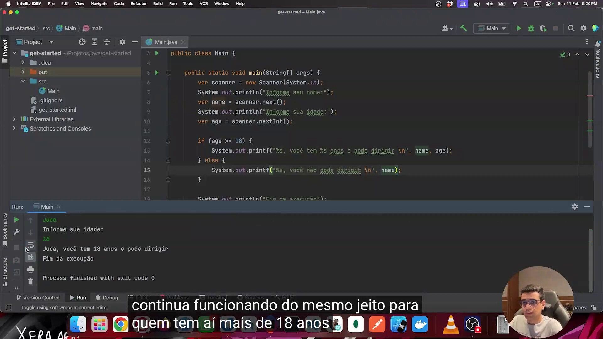
</p>

```java
public class Main {

    public static void main(String[] args) {
        var scanner = new Scanner(System.in);
        System.out.println("Informe seu nome:");
        var name = scanner.next();
        System.out.println("Informe sua idade:");
        var age = scanner.nextInt();

        if (age >= 18) {
            System.out.printf("%s, você tem %s anos e pode dirigir \n", name, age);
        } else {
            System.out.printf("%s, você não pode dirigit \n", name);
        }

        System.out.println("Fim da execução");
    }
}
```

O código lê o nome e a idade digitados pelo usuário com `Scanner` e usa esses valores dentro de uma estrutura `if`. A expressão `age >= 18` é avaliada como um valor booleano: se for `true`, o bloco do `if` é executado com `System.out.printf`, formatando a mensagem com os placeholders `%s` para nome e idade. No teste exibido no console, o usuário "Juca" informa 18 anos e a mensagem "Juca, você tem 18 anos e pode dirigir" é impressa, confirmando que a condição foi satisfeita.

#### Testando o caminho do `else`

<p align="center">
  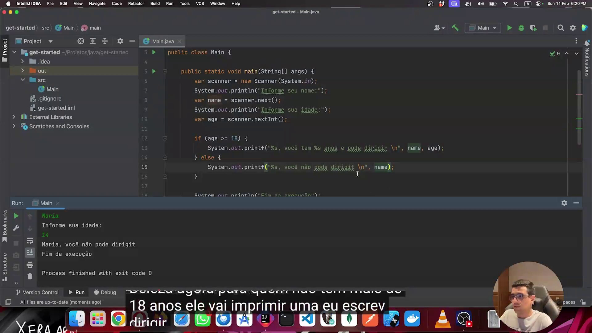
</p>

O mesmo código é executado novamente, agora com a entrada "Maria" e idade 14. Como 14 não satisfaz a condição `age >= 18`, o fluxo pula o bloco do `if` e executa o bloco do `else`, imprimindo "Maria, você não pode dirigit". Esse teste demonstra que apenas um dos dois caminhos (`if` ou `else`) é executado por vez, nunca os dois.

#### Adicionando a verificação de emancipação (`else if`)

<p align="center">
  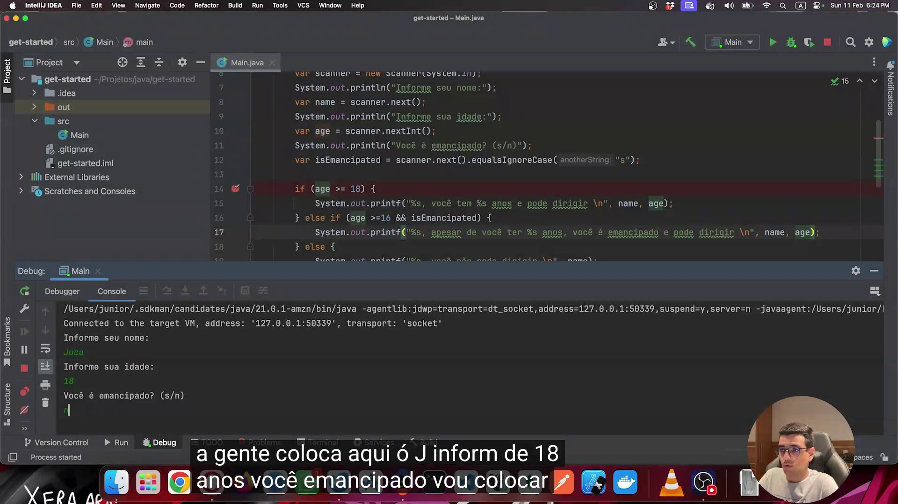
</p>

```java
var scanner = new Scanner(System.in);
System.out.println("Informe seu nome:");
var name = scanner.next();
System.out.println("Informe sua idade:");
var age = scanner.nextInt();
System.out.println("Você é emancipado? (s/n)");
var isEmancipated = scanner.next().equalsIgnoreCase("s");

if (age >= 18) {
    System.out.printf("%s, você tem %s anos e pode dirigir \n", name, age);
} else if (age >= 16 && isEmancipated) {
    System.out.printf("%s, apesar de você ter %s anos, você é emancipado e pode dirigir \n", name, age);
} else {
    System.out.printf("%s, você não pode dirigir \n", name);
}
```

Uma nova pergunta é adicionada ao programa: "Você é emancipado? (s/n)". A resposta é capturada com `scanner.next()` e comparada usando `equalsIgnoreCase("s")`, que retorna `true` independentemente de o usuário digitar "s" maiúsculo ou minúsculo, armazenando o resultado na variável `isEmancipated`. Uma nova condição `else if (age >= 16 && isEmancipated)` é encadeada após o `if` original, permitindo verificar um segundo cenário caso o primeiro seja falso. Na imagem, um breakpoint foi posicionado na linha do `if` e a execução em modo debug está parada aguardando a resposta sobre a emancipação, após o usuário informar nome "Juca" e idade 18.

#### Inspecionando as variáveis no debugger

<p align="center">
  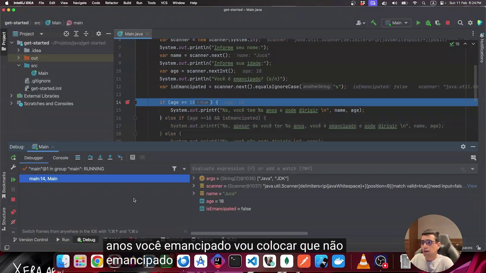
</p>

Com a execução pausada no breakpoint, o painel do debugger exibe o estado atual das variáveis: `name = "Juca"`, `age = 18` e `isEmancipated = false`. O próprio editor mostra inline o resultado da expressão avaliada naquele ponto, `age >= 18 = true`, evidenciando que a condição do primeiro `if` já é verdadeira nesse momento da execução, antes mesmo de o fluxo continuar.

#### Executando até o fim (F8)

<p align="center">
  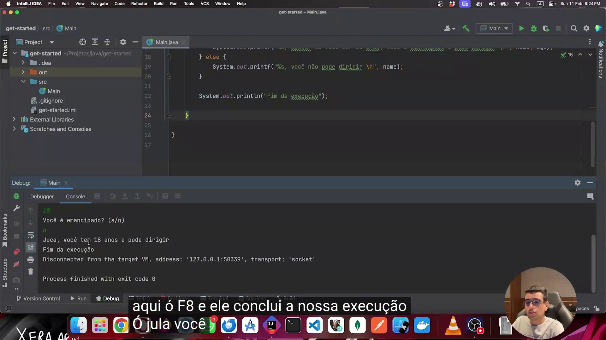
</p>

Ao avançar a execução até o final, o console mostra a sequência completa: idade 18, resposta "n" para a pergunta sobre emancipação, e a mensagem final "Juca, você tem 18 anos e pode dirigir". Isso confirma que, como a idade já satisfaz `age >= 18`, o programa entra no primeiro bloco `if` independentemente da resposta dada à pergunta sobre emancipação — o `else if` sequer chega a ser avaliado.

#### Novo cenário: Maria, 16 anos, emancipada

<p align="center">
  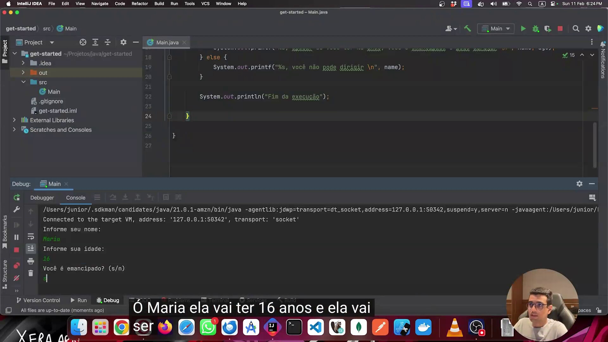
</p>

Uma nova execução em modo debug é iniciada com um cenário diferente: nome "Maria", idade 16. O programa aguarda a resposta da pergunta "Você é emancipado? (s/n)", que está sendo respondida com "s", configurando um caso em que a idade não atinge 18, mas pode satisfazer a condição alternativa do `else if`.

#### Avaliando a condição composta (`&&`)

<p align="center">
  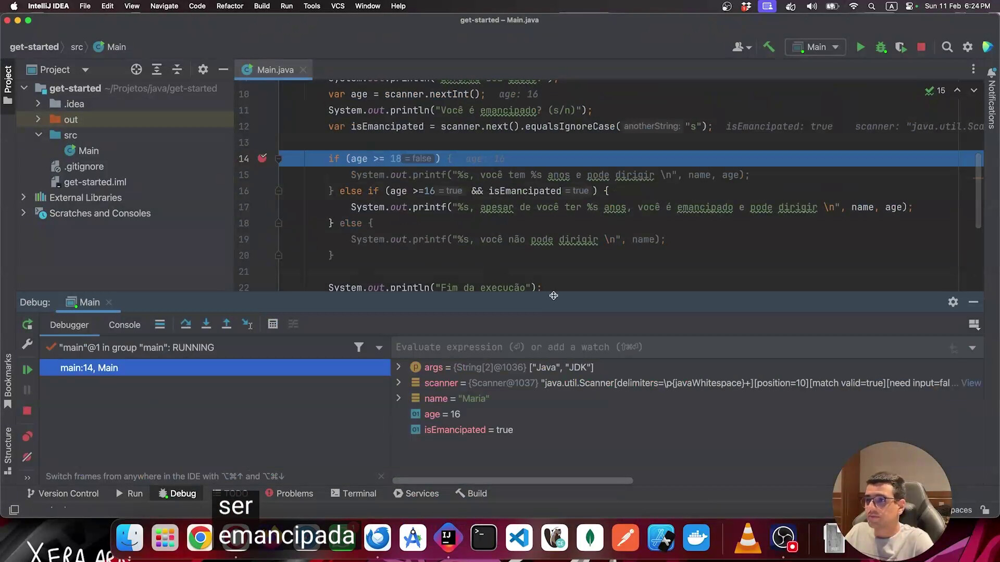
</p>

O painel de variáveis confirma `name = "Maria"`, `age = 16` e `isEmancipated = true`. O editor mostra que a primeira condição `age >= 18` foi avaliada como `false`, então o fluxo passa para o `else if (age >= 16 && isEmancipated)`, onde ambas as subexpressões são `true`. Como o operador `&&` (E lógico) exige que as duas condições sejam verdadeiras simultaneamente para que o resultado seja `true`, esse bloco é o que será executado.

#### Resultado do cenário da Maria

<p align="center">
  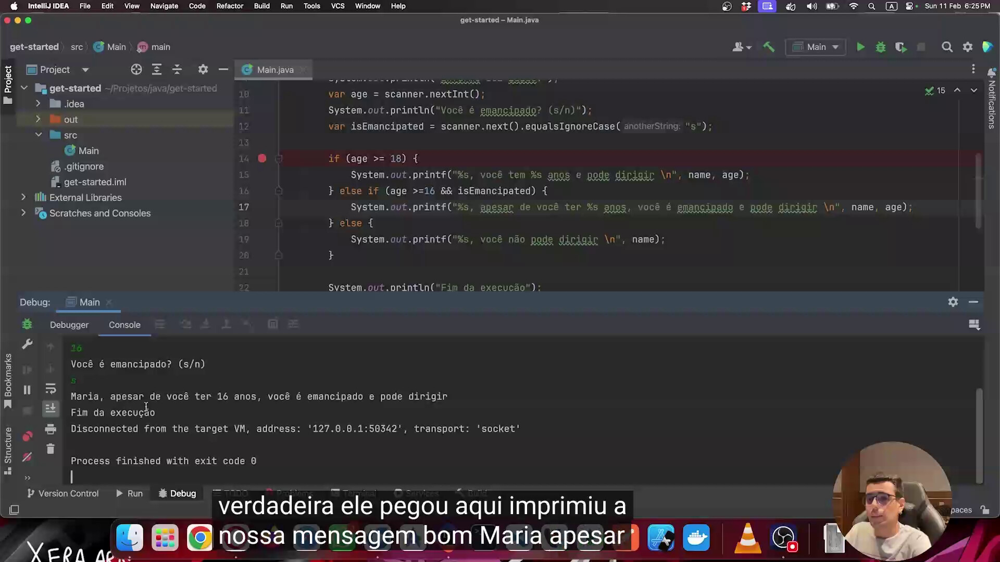
</p>

O console exibe o resultado da execução: "Maria, apesar de você ter 16 anos, você é emancipado e pode dirigir". Essa é a mensagem definida no bloco `else if`, confirmando que o segundo caminho da estrutura condicional foi corretamente acionado quando a primeira condição falha, mas a segunda é satisfeita.

#### Cenário do Leo: 14 anos, não emancipado

<p align="center">
  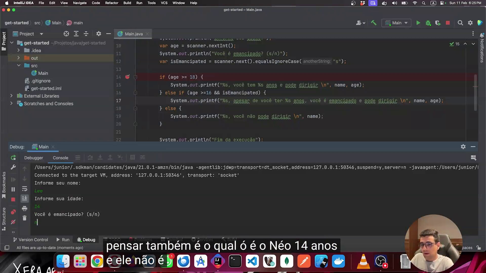
</p>

Uma terceira execução em modo debug é iniciada, agora com nome "Leo" e idade 14. O programa aguarda a resposta à pergunta sobre emancipação, que está sendo respondida com "n", configurando um cenário em que nenhuma das condições anteriores (idade ≥ 18, ou idade ≥ 16 e emancipado) deve ser satisfeita.

#### Nenhuma condição satisfeita → cai no `else`

<p align="center">
  
</p>

O painel de variáveis mostra `name = "Leo"`, `age = 14` e `isEmancipated = false`. O editor evidencia que tanto `age >= 18` quanto `age >= 16` são avaliadas como `false`. Como nenhuma das condições do `if` e do `else if` foi atendida, a execução segue para o bloco `else`, que é sempre o caminho final quando todas as verificações anteriores falham.

#### Removendo o `else if`: simplificando a estrutura

<p align="center">
  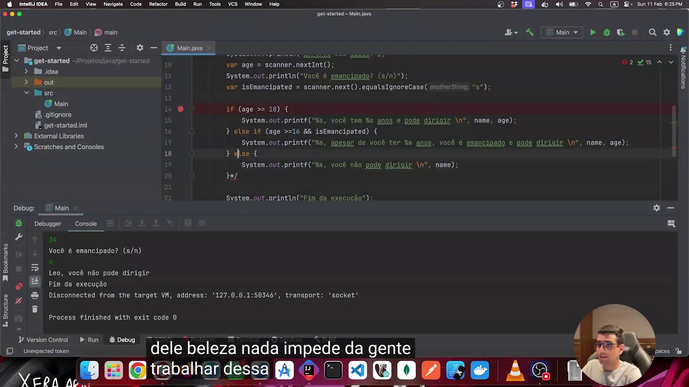
</p>

O console confirma o resultado do cenário anterior: "Leo, você não pode dirigir". Em seguida, o código começa a ser editado diretamente no editor para simplificar a estrutura condicional, removendo o bloco `else if` e deixando apenas `if` e `else` com uma mensagem comum para os casos em que a pessoa pode dirigir — independentemente de ter atingido a maioridade ou de ser emancipada. Por estar em meio à edição, o editor mostra temporariamente um token inesperado, típico de um código ainda incompleto durante a refatoração.

#### Unindo as condições em uma variável booleana (`canDrive`)

<p align="center">
  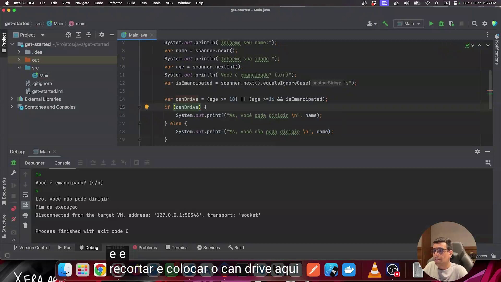
</p>

```java
var canDrive = (age >= 18) || (age >= 16 && isEmancipated);
if (canDrive) {
    System.out.printf("%s, você pode dirigir \n", name);
} else {
    System.out.printf("%s, você não pode dirigir \n", name);
}
```

Após a simplificação, as duas regras de elegibilidade — ser maior de idade ou ter 16 anos ou mais e ser emancipado — são combinadas em uma única expressão booleana, atribuída à variável `canDrive`. O operador `||` (OU lógico) é usado para unir as duas possibilidades: basta que uma delas seja verdadeira para que `canDrive` seja `true`. A estrutura `if`/`else` passa então a verificar apenas essa variável, tornando o código mais direto e a idade deixa de ser necessária na mensagem impressa.

#### Execução final com a variável `canDrive`

<p align="center">
  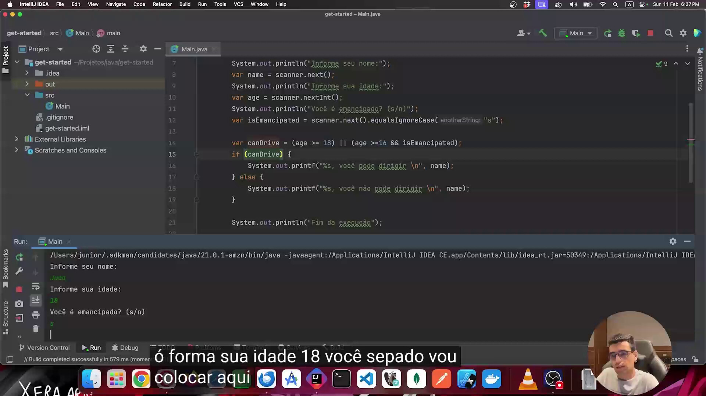
</p>

O programa é executado novamente com nome "Juca", idade 18 e resposta "s" para a pergunta sobre emancipação. O console exibe "Juca, você pode dirigir", confirmando que a versão refatorada com a variável `canDrive` produz o mesmo resultado da versão anterior com `if`/`else if`/`else`, porém com uma estrutura condicional mais enxuta.


### 🟩 Vídeo 02 - Estrutura Condicional switch case

<video width="60%" controls>
  <source src="000-Midia_e_Anexos/itau_java_com_inteligencia_artificial-modulo.02-curso.03-video_02.webm" type="video/webm">
    Seu navegador não suporta vídeo HTML5.
</video>

link do vídeo: https://web.dio.me/track/itau-java-com-inteligencia-artificial/course/estruturas-de-controle-em-java/learning/1de01157-7e03-4b2b-968f-7effb2c0333b?autoplay=1

### Anotações

#### Switch sem `break`: o problema do fall-through

<p align="center">
  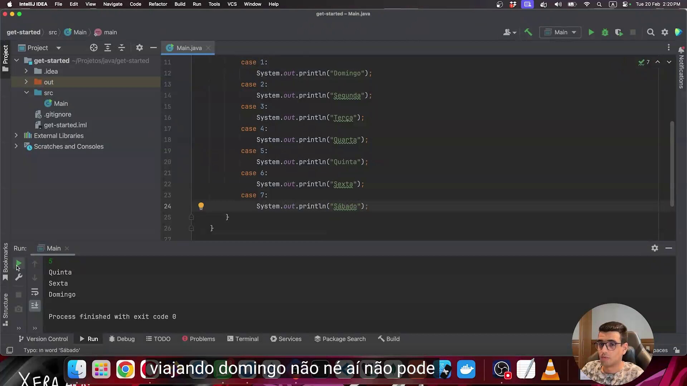
</p>

O código exibido implementa um `switch (option)` com sete `case` (1 a 7), cada um imprimindo o nome de um dia da semana, mas **sem nenhuma instrução `break`** ao final dos blocos. Ao rodar o programa com a entrada `5`, o console mostra a saída:

```
5
Quinta
Sexta
Domingo
```

Isso demonstra o comportamento de **fall-through**: como não há `break`, a execução não para no `case 5`, ela "cai" para os `case` seguintes (6 e 7) e os executa também. Depois do `case 7`, como não há mais nenhum `case` abaixo, a execução simplesmente termina — por isso "Domingo" aparece por último, mesmo sem fazer sentido lógico (é o `case 1`, que está fora de sequência na saída porque o fluxo já tinha "vazado" para o final do bloco `switch`).

<p align="center">
  
</p>

Mesmo código do bloco anterior, rodado novamente. Desta vez, a saída para a entrada `5` é:

```
5
Quinta
Sexta
Sábado
```

Aqui fica mais evidente o efeito do fall-through: a partir do `case 5` (Quinta), a execução continua sequencialmente por `case 6` (Sexta) e `case 7` (Sábado), e só para porque `case 7` é o último bloco do `switch`. Isso reforça que, sem `break`, o `switch` executa **todos os casos a partir do ponto de entrada até o fim da estrutura**, e não apenas o caso correspondente ao valor testado.

<p align="center">
  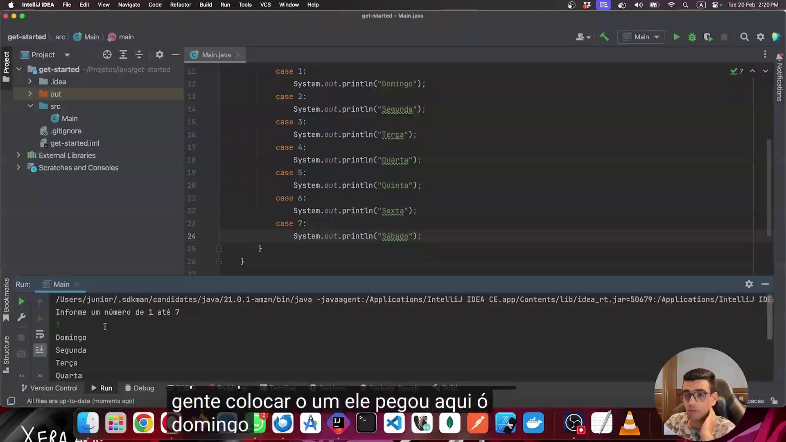
</p>

Novo teste do mesmo código, agora com a entrada `1`. A saída no console é:

```
1
Domingo
Segunda
Terça
Quarta
```

Confirma-se o mesmo padrão: a partir do `case 1` (Domingo), a execução continua em cascata por `case 2`, `case 3` e `case 4`, imprimindo todos os dias até onde a captura de tela permite visualizar. Isso evidencia que o problema do fall-through se manifesta a partir de **qualquer** ponto de entrada do `switch`, não apenas nos últimos casos.

#### Código-fonte completo da versão inicial (sem `break`)

<p align="center">
  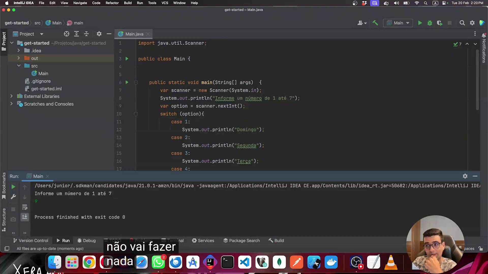
</p>

Esta imagem mostra o arquivo `Main.java` completo até este ponto:

```java
import java.util.Scanner;

public class Main {

    public static void main(String[] args) {
        var scanner = new Scanner(System.in);
        System.out.println("Informe um número de 1 até 7");
        var option = scanner.nextInt();
        switch (option){
            case 1:
                System.out.println("Domingo");
            case 2:
                System.out.println("Segunda");
            case 3:
                System.out.println("Terça");
            case 4:
                // continuação do switch não visível nesta captura
        }
    }
}
```

Aqui se vê claramente a estrutura completa que gerou o comportamento de fall-through das imagens anteriores: um `Scanner` captura um número inteiro (`nextInt()`), que é testado em um `switch` cujos blocos `case` não possuem `break`.

#### Adicionando `break` para interromper o fall-through

<p align="center">
  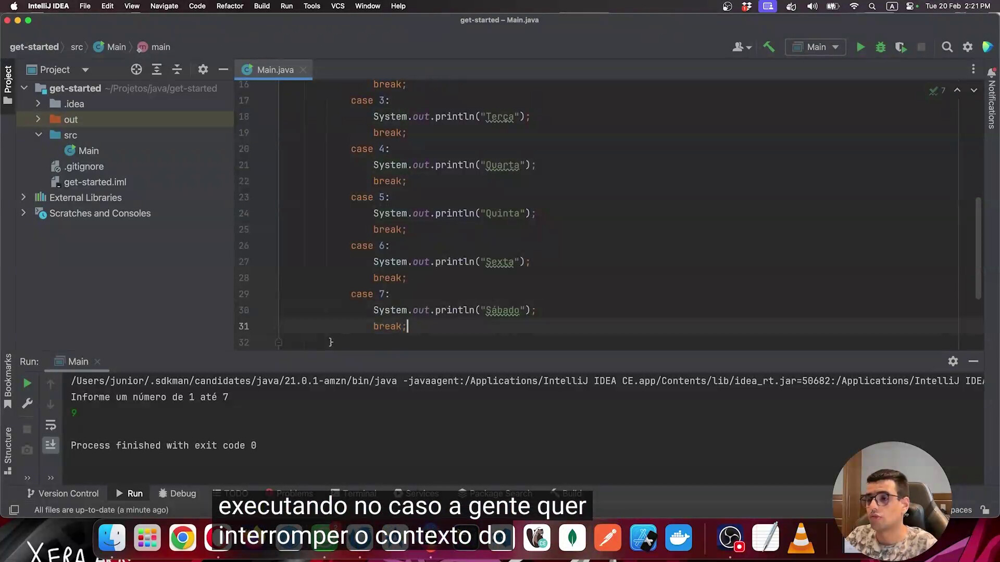
</p>

O código foi alterado: agora cada bloco `case` termina com a instrução `break;`, visível a partir do `case 3` (Terça) até o `case 7` (Sábado):

```java
case 3:
    System.out.println("Terça");
    break;
case 4:
    System.out.println("Quarta");
    break;
case 5:
    System.out.println("Quinta");
    break;
case 6:
    System.out.println("Sexta");
    break;
case 7:
    System.out.println("Sábado");
    break;
```

O `break` interrompe a execução do `switch` assim que o bloco correspondente termina, evitando que o fluxo "vaze" para os casos seguintes — corrigindo o problema demonstrado nas três primeiras imagens.

<p align="center">
  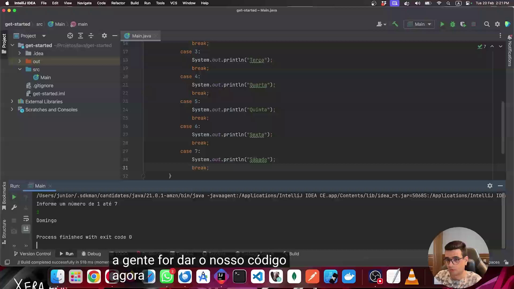
</p>

Com o `break` já presente em todos os casos, o programa é executado novamente com a entrada `1`. Desta vez a saída é:

```
1
Domingo
```

Apenas o dia correspondente ao `case 1` é impresso, comprovando que o `break` resolveu o problema de fall-through: a execução agora para exatamente no `case` correspondente ao valor informado.

#### Tratando entradas inválidas com `default`

<p align="center">
  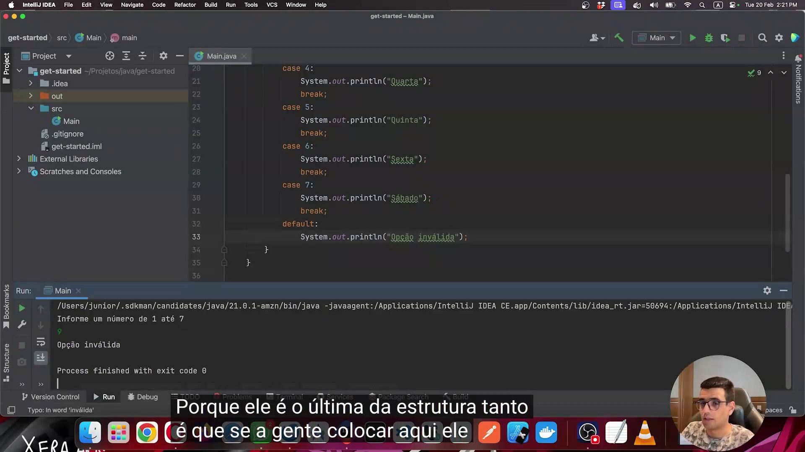
</p>

Um novo bloco foi adicionado ao final do `switch`, após o `case 7`:

```java
case 7:
    System.out.println("Sábado");
    break;
default:
    System.out.println("Opção inválida");
```

O console mostra a execução com uma entrada que não corresponde a nenhum `case` (1 a 7), resultando na saída `Opção inválida`. Isso demonstra o papel do `default`: ele funciona como uma cláusula de captura para qualquer valor que não bata com nenhum dos `case` declarados, garantindo que o programa sempre produza uma resposta, mesmo diante de entradas fora do intervalo esperado.

#### Comparando `String` no switch e agrupando casos

<p align="center">
  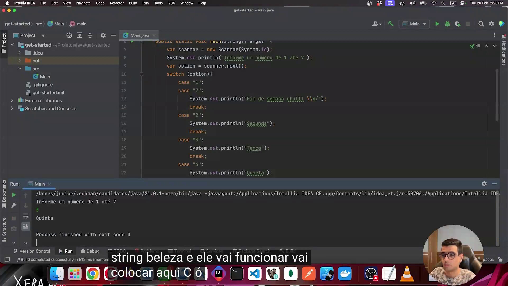
</p>

O tipo da variável testada no `switch` mudou: em vez de comparar números inteiros, os `case` agora comparam valores do tipo `String` (`case "1":`, `case "2":` etc). Além disso, o `case "1":` e o `case "7":` foram agrupados sem `break` entre eles, compartilhando o mesmo bloco de execução:

```java
switch (option){
    case "1":
    case "7":
        System.out.println("Fim de semana uhuu \\o/");
        break;
    case "2":
        System.out.println("Segunda");
        break;
    case "3":
        System.out.println("Terça");
        break;
    case "4":
        System.out.println("Quarta");
        // continuação não visível nesta captura
}
```

O console mostra a execução com a entrada `5`, retornando `Quinta`. O agrupamento de `case "1":` e `case "7":` (sem `break` entre os dois rótulos) é uma aplicação **intencional** do fall-through: como ambos os dias são fim de semana, eles compartilham a mesma mensagem de saída.

#### Verificando o Language Level do projeto (nível 6)

<p align="center">
  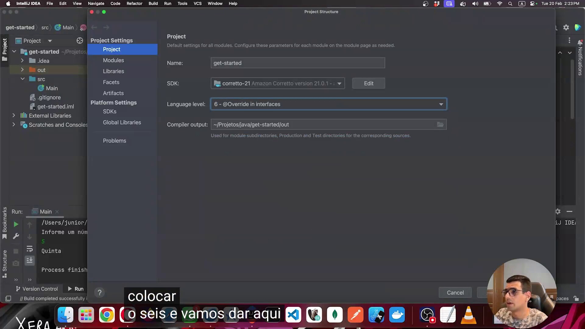
</p>

A tela mostra a janela **Project Structure** do IntelliJ IDEA, na aba **Project**, com o SDK configurado como `corretto-21` (Amazon Corretto 21.0.1), mas o **Language level** definido como `6 - @Override in interfaces`. Essa configuração limita quais recursos mais recentes da linguagem Java podem ser usados no projeto, independentemente da versão do SDK instalada.

#### Erro de tipo incompatível ao usar `String` no switch

<p align="center">
  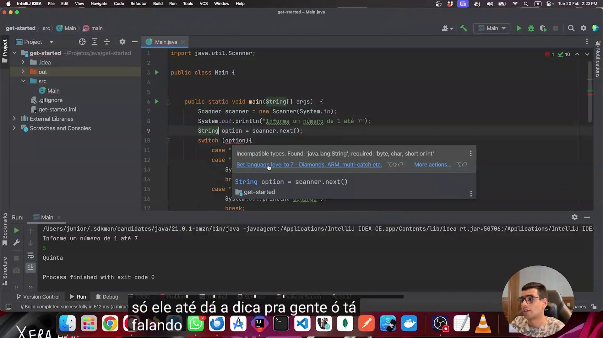
</p>

Ao declarar a variável como `String option = scanner.next();` e utilizá-la no `switch (option)`, o IntelliJ IDEA aponta o erro:

```
Incompatible types. Found: 'java.lang.String', required: 'byte, char, short or int'
```

O editor sugere a correção **"Set language level to 7 – Diamonds, ARM, multi-catch etc."**. Isso mostra que o `switch` com `String` só é suportado a partir de determinadas versões da linguagem Java, e o **Language level 6**, configurado na imagem anterior, é insuficiente para esse recurso.

#### Atualizando o Language Level para 21

<p align="center">
  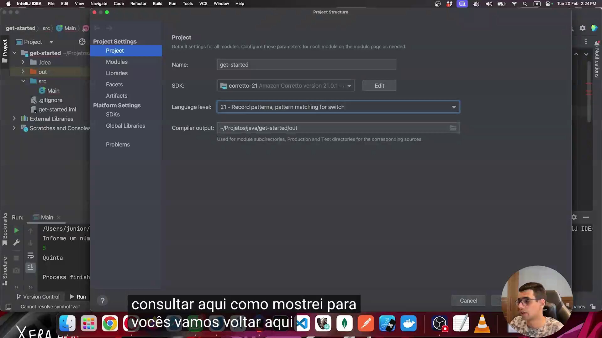
</p>

Na mesma janela **Project Structure**, o **Language level** foi alterado para `21 - Record patterns, pattern matching for switch`. Essa mudança habilita, no projeto, os recursos mais modernos do Java 21, incluindo os novos formatos de `switch` (como expressão e com padrões), que serão usados nas próximas etapas do código.

#### A nova sintaxe de seta (`->`) no switch

<p align="center">
  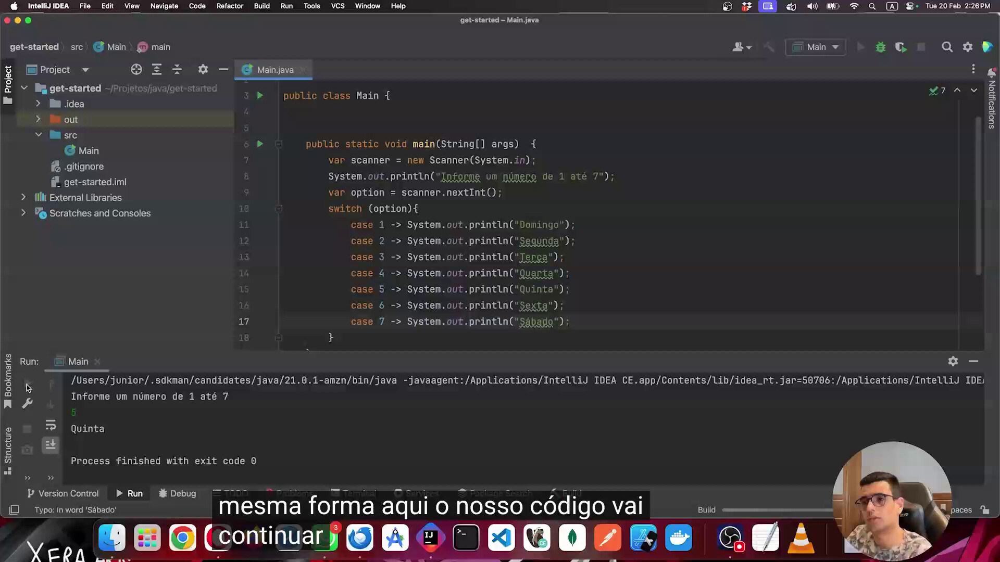
</p>

O `switch` foi reescrito utilizando a sintaxe de seta (`->`), sem `break`:

```java
switch (option){
    case 1 -> System.out.println("Domingo");
    case 2 -> System.out.println("Segunda");
    case 3 -> System.out.println("Terça");
    case 4 -> System.out.println("Quarta");
    case 5 -> System.out.println("Quinta");
    case 6 -> System.out.println("Sexta");
    case 7 -> System.out.println("Sábado");
}
```

O console mostra a execução com entrada `5`, retornando `Quinta`. Nessa sintaxe, cada `case` executa apenas a instrução associada à sua seta, sem necessidade de `break` — o fall-through automático deixa de existir por padrão.

#### 

<p align="center">
  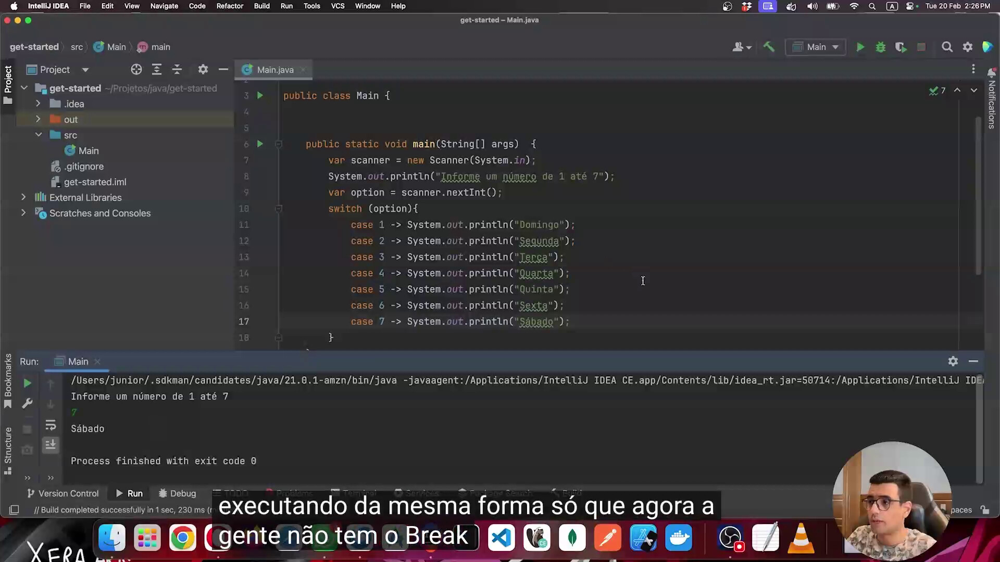
</p>

Mesmo código com sintaxe de seta, agora executado com a entrada `7`. A saída é `Sábado`, confirmando que cada `case` na sintaxe `->` é isolado e executa exatamente o bloco correspondente ao valor testado, sem interferência dos demais casos.

#### Adicionando `default` à sintaxe de seta

<p align="center">
  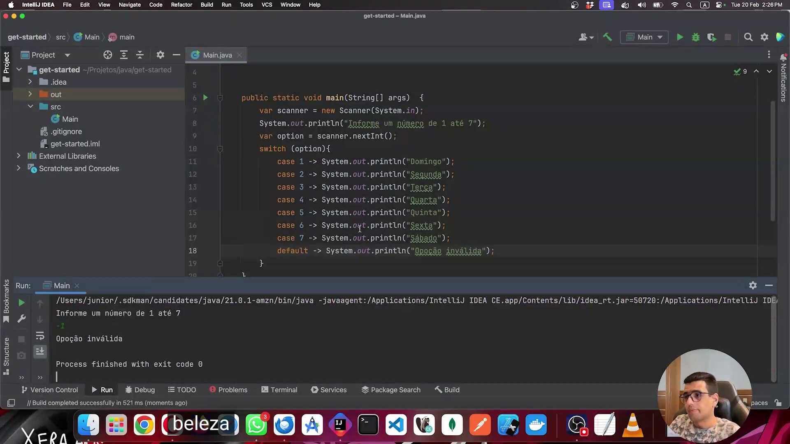
</p>

Um `default` foi acrescentado ao `switch` com sintaxe de seta:

```java
default -> System.out.println("Opção inválida");
```

O console mostra a execução com a entrada `-1`, um valor fora do intervalo de 1 a 7, resultando na saída `Opção inválida`. Isso confirma que o `default` continua funcionando da mesma forma na sintaxe de seta: captura qualquer valor não coberto pelos `case` explícitos.

#### Agrupando múltiplos valores em um único `case`

<p align="center">
  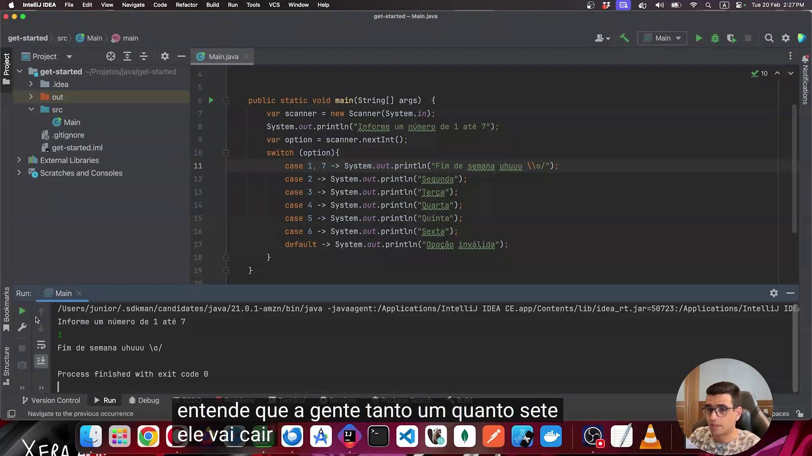
</p>

O primeiro `case` agora agrupa dois valores na mesma linha, separados por vírgula:

```java
case 1, 7 -> System.out.println("Fim de semana uhuuu \\o/");
```

O console mostra a execução com entrada `1`, retornando `Fim de semana uhuuu \o/`. Diferente do agrupamento por fall-through visto anteriormente (sem `break` entre `case "1":` e `case "7":`), a sintaxe de seta permite combinar múltiplos valores em um único rótulo `case`, de forma mais direta e sem risco de fall-through acidental para os demais casos.

#### Switch como expressão: atribuindo o resultado a uma variável

<p align="center">
  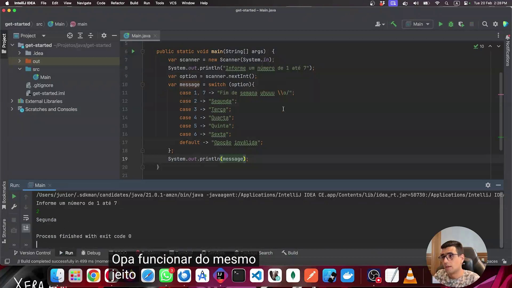
</p>

O `switch` deixou de ser apenas um comando e passou a ser usado como **expressão**, atribuindo seu resultado diretamente a uma variável:

```java
var message = switch (option){
    case 1, 7 -> "Fim de semana uhuuu \\o/";
    case 2 -> "Segunda";
    case 3 -> "Terça";
    case 4 -> "Quarta";
    case 5 -> "Quinta";
    case 6 -> "Sexta";
    default -> "Opção inválida";
};
System.out.println(message);
```

Nesse formato, cada ramo do `switch` retorna diretamente um valor (uma `String`), em vez de executar uma instrução `System.out.println`. O console mostra a execução com entrada `2`, retornando `Segunda`, confirmando que o valor retornado pelo `switch` foi corretamente atribuído à variável `message` e depois impresso.

#### Usando `yield` para blocos de código dentro do switch-expressão

<p align="center">
  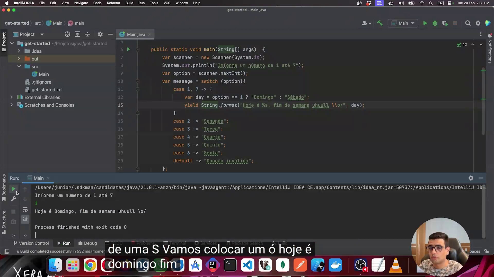
</p>

O `case 1, 7` foi expandido para um bloco de código entre chaves, contendo lógica adicional antes de retornar o valor, usando a palavra-chave `yield`:

```java
case 1, 7 -> {
    var day = option == 1 ? "Domingo" : "Sábado";
    yield String.format("Hoje é %s, fim de semana uhuuu \\o/", day);
}
```

Aqui, quando `option` é `1` ou `7`, o bloco calcula qual é o dia específico (usando o operador ternário `? :`) e usa `yield` para devolver esse valor formatado como resultado do `switch`-expressão — diferente do `->` direto, que só permite uma única expressão. O console mostra a execução com entrada `1`, retornando `Hoje é Domingo, fim de semana uhuuu \o/`, confirmando que o bloco com `yield` funciona corretamente dentro da expressão `switch`.


### 🟩 Vídeo 03 - Estrutura de Repetição for

<video width="60%" controls>
  <source src="000-Midia_e_Anexos/itau_java_com_inteligencia_artificial-modulo.02-curso.03-video_03.webm" type="video/webm">
    Seu navegador não suporta vídeo HTML5.
</video>

link do vídeo: https://web.dio.me/track/itau-java-com-inteligencia-artificial/course/estruturas-de-controle-em-java/learning/94aa45c1-ee65-40a8-9284-2008a5f36b3c?autoplay=1

### Anotações

<p align="center">
  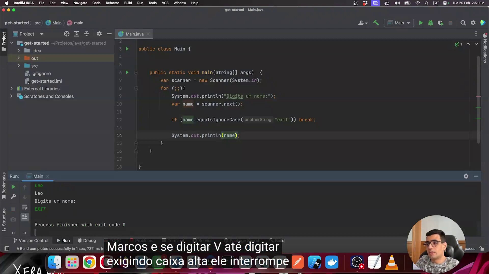
</p>

Nesta imagem, o editor mostra a estrutura `for (;;) { ... }`, ou seja, um `for` sem as três cláusulas preenchidas (inicialização, condição e incremento), o que faz o laço rodar indefinidamente. Dentro do laço, um `Scanner` é usado para ler um nome digitado pelo usuário (`scanner.next()`), e a condição `if (name.equalsIgnoreCase("exit")) break;` é responsável por interromper esse loop infinito quando o usuário digitar "exit", independentemente de estar em maiúsculas ou minúsculas — por isso o uso do `equalsIgnoreCase` em vez de `equals` ou do operador `==`, que não deve ser usado para comparar strings em Java. No console de execução, é possível ver o teste funcionando: o programa imprime os nomes digitados ("Leo", "Leo") e, ao receber "EXIT", encerra a execução.

```java
var scanner = new Scanner(System.in);
for (;;) {
    System.out.println("Digite um nome:");
    var name = scanner.next();

    if (name.equalsIgnoreCase("exit")) break;

    System.out.println(name);
}
```

<p align="center">
  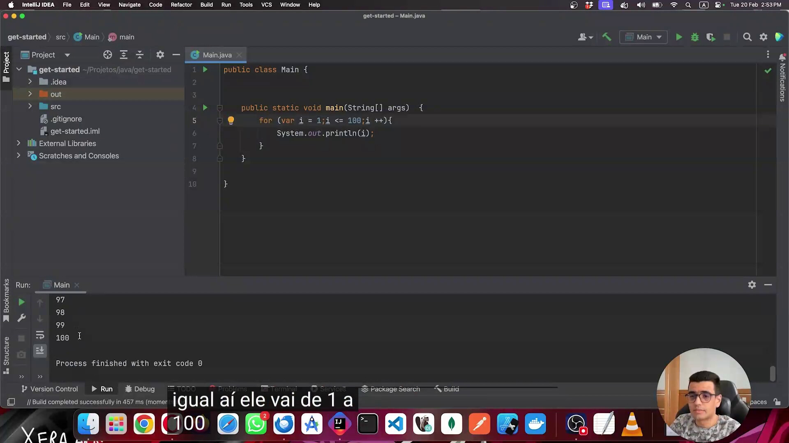
</p>

Aqui o código foi reescrito na forma mais comum de se utilizar o `for`, com uma variável de controle exclusiva do laço: `var i = 1` na inicialização, `i <= 100` como condição de parada e `i++` como incremento a cada volta. O corpo do laço apenas imprime o valor de `i` a cada iteração. No console, o resultado mostra os últimos números impressos (97, 98, 99, 100), confirmando que o laço percorreu de 1 até 100, já que a condição usada foi "menor ou igual".

```java
for (var i = 1; i <= 100; i++) {
    System.out.println(i);
}
```

<p align="center">
  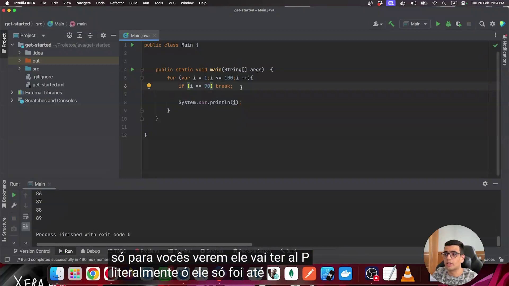
</p>

Nesta imagem foi adicionada uma condição extra dentro do `for`: `if (i == 90) break;`. Isso demonstra o uso da palavra-chave `break` para interromper o fluxo do laço antes que ele chegue à sua condição de parada natural. No console, o resultado mostra que a contagem foi impressa apenas até o número 89, confirmando que, ao atingir `i == 90`, o `break` foi executado e o laço foi encerrado imediatamente, sem imprimir o valor 90.

```java
for (var i = 1; i <= 100; i++) {
    if (i == 90) break;

    System.out.println(i);
}
```

<p align="center">
  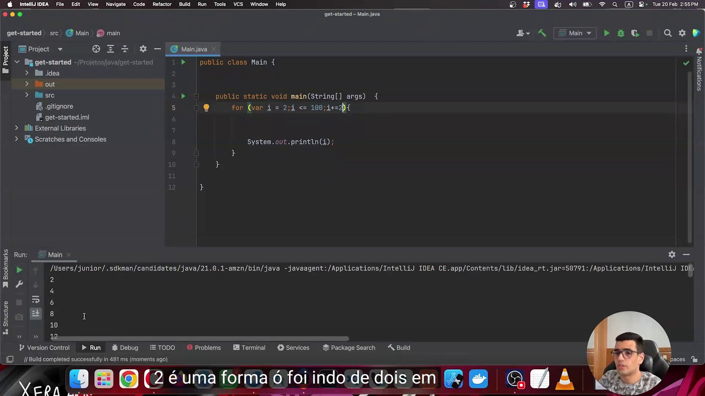
</p>

Aqui a variável de controle passa a iniciar em `2` e o incremento é alterado para `i += 2`, ou seja, o laço avança de dois em dois. Essa é uma forma de imprimir apenas os números pares até 100, sem precisar de uma condição adicional para filtrar os valores. No console, o resultado confirma isso: a saída mostra a sequência 2, 4, 6, 8, 10, 12..., todos números pares.

```java
for (var i = 2; i <= 100; i += 2) {
    System.out.println(i);
}
```

<p align="center">
  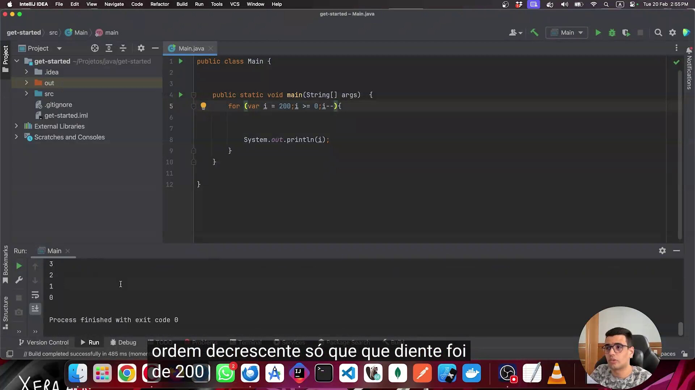
</p>

Nesta imagem o `for` foi reconfigurado para contar em ordem decrescente: a variável inicia em `200`, a condição de parada é `i >= 0` e o incremento foi trocado por `i--`, decrementando o valor a cada iteração. No console, o final da execução mostra a sequência descendo até 3, 2, 1 e 0, confirmando que o laço percorre os valores de 200 até 0 em ordem decrescente.

```java
for (var i = 200; i >= 0; i--) {
    System.out.println(i);
}
```

<p align="center">
  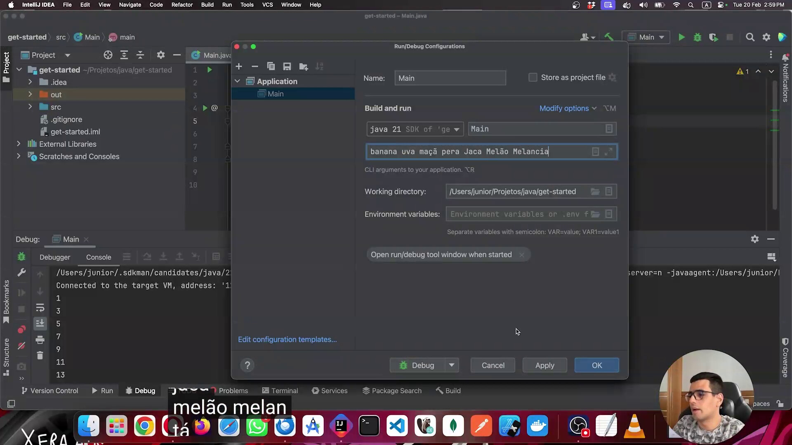
</p>

Esta imagem não mostra código-fonte, e sim a janela de configuração de execução do IntelliJ IDEA ("Run/Debug Configurations"). Nela, o campo de argumentos de linha de comando (CLI arguments) foi preenchido com os valores "banana uva maçã pera Jaca Melão Melancia". Essa configuração é o que permite que esses valores sejam recebidos pelo parâmetro `args` do método `main`, para serem posteriormente percorridos por uma estrutura de repetição.

<p align="center">
  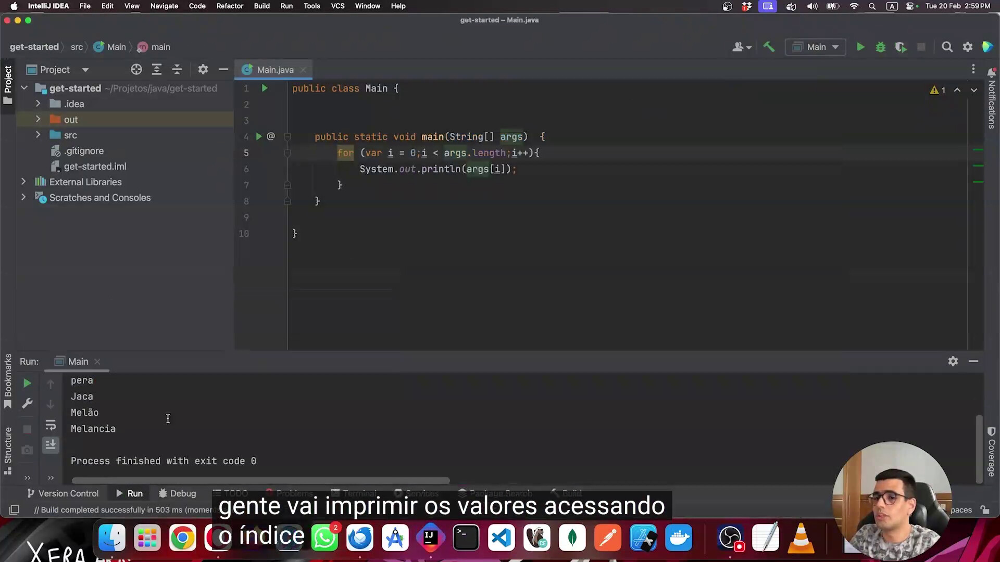
</p>

Com os argumentos já configurados, o código foi alterado para percorrer o array `args` usando `args.length` como condição de parada do `for`, em vez de um valor fixo como 100. A cada iteração, o valor de `args[i]` é impresso. No console é possível ver parte da saída, com os valores "pera", "Jaca", "Melão" e "Melancia" sendo exibidos, resultado da leitura dos argumentos passados na configuração de execução.

```java
for (var i = 0; i < args.length; i++) {
    System.out.println(args[i]);
}
```

<p align="center">
  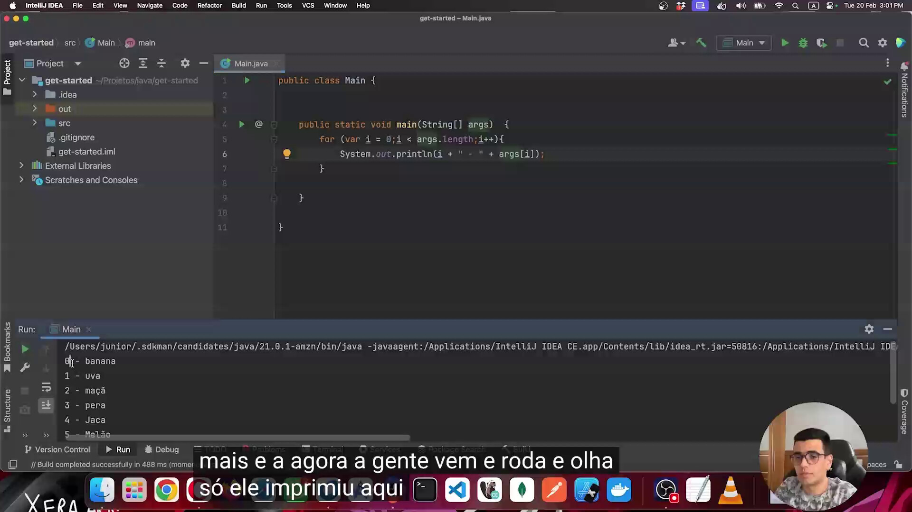
</p>

Nesta última imagem, a linha de impressão foi ajustada para `System.out.println(i + " - " + args[i]);`, concatenando o índice atual junto com o valor correspondente do array. Isso evidencia uma vantagem do `for` tradicional em relação a formas mais enxutas de iteração: por manter o controle explícito do índice `i`, é possível exibir tanto a posição quanto o valor de cada elemento. No console, o resultado mostra exatamente esse formato: "0 - banana", "1 - uva", "2 - maçã", "3 - pera", "4 - Jaca", "5 - Melão", entre outros.

```java
for (var i = 0; i < args.length; i++) {
    System.out.println(i + " - " + args[i]);
}
```


### 🟩 Vídeo 04 - Estruturas de repetição while e do while

<video width="60%" controls>
  <source src="000-Midia_e_Anexos/itau_java_com_inteligencia_artificial-modulo.02-curso.03-video_04.webm" type="video/webm">
    Seu navegador não suporta vídeo HTML5.
</video>

link do vídeo: https://web.dio.me/track/itau-java-com-inteligencia-artificial/course/estruturas-de-controle-em-java/learning/9b547d62-9926-4e00-bce1-74e820892a16?autoplay=1

### Anotações

<p align="center">
  
</p>

Nesta primeira construção, a estrutura `while` é utilizada para repetir a leitura de um nome até que o usuário digite "exit". A condição do laço é avaliada **antes** de cada execução do bloco: enquanto `name` for diferente de `"exit"`, o programa continua pedindo um novo nome.

```java
public class Main {

    public static void main(String[] args) {
        var scanner = new Scanner(System.in);
        var name = "";
        while (!name.equals("exit")){
            System.out.println("Informe um nome");
            name = scanner.next();
            System.out.println(name);
        }
    }
}
```

No console de execução, é possível observar o comportamento: a cada nome informado ele é impresso na sequência, e ao digitar "exit" a condição do `while` deixa de ser verdadeira e o laço é encerrado, finalizando o processo.

<p align="center">
  
</p>

Aqui o código foi reescrito utilizando `while (true)`, fazendo com que o laço rode indefinidamente. Para controlar a saída, foi adicionada uma verificação interna com `if`, usando `equalsIgnoreCase` para comparar o nome digitado com "exit" sem diferenciar maiúsculas de minúsculas. Quando essa condição é atendida, o comando `break` interrompe a execução do laço.

```java
public class Main {

    public static void main(String[] args) {
        var scanner = new Scanner(System.in);
        var name = "";
        while (true){
            System.out.println("Informe um nome");
            name = scanner.next();
            System.out.println(name);

            if (name.equalsIgnoreCase("exit")) break;
        }
    }
}
```

Essa abordagem permite reunir todas as condições de parada dentro do próprio bloco, sendo útil quando existem múltiplas verificações que podem encerrar o laço.

<p align="center">
  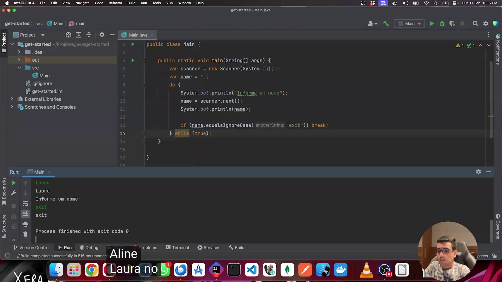
</p>

Nesta variação, a estrutura foi convertida para `do { } while (true);`. A diferença fundamental do `do while` em relação ao `while` é que o bloco de código é executado **primeiro**, e só depois a condição é verificada — garantindo que o conteúdo do laço rode ao menos uma vez, independentemente de qualquer condição. Assim como no exemplo anterior, o `break` dentro do `if` continua sendo responsável por encerrar a repetição quando o nome informado for "exit".

```java
public class Main {

    public static void main(String[] args) {
        var scanner = new Scanner(System.in);
        var name = "";
        do {
            System.out.println("Informe um nome");
            name = scanner.next();
            System.out.println(name);

            if (name.equalsIgnoreCase("exit")) break;
        } while (true);
    }
}
```

<p align="center">
  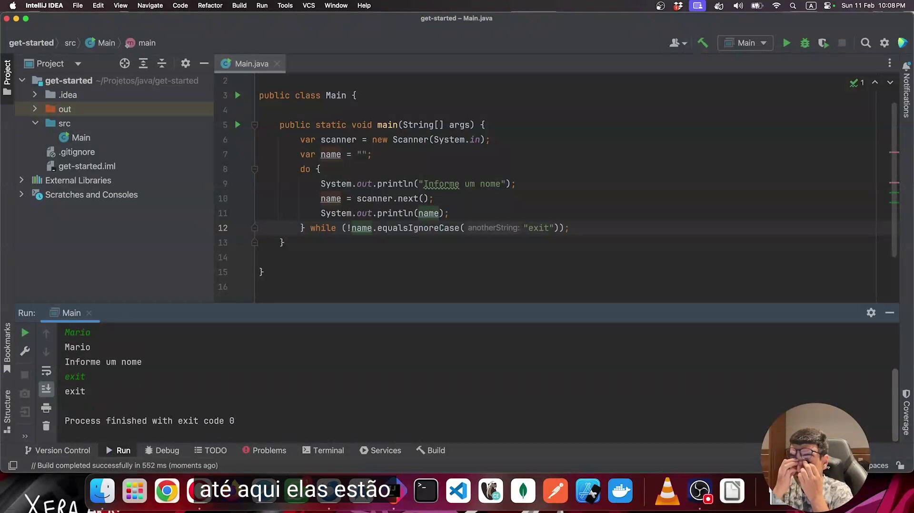
</p>

Por fim, o código é ajustado para a forma mais comum do `do while`: em vez de usar `while (true)` com um `break` interno, a condição de parada é movida diretamente para a cláusula final do laço, negando a comparação com `equalsIgnoreCase`. O bloco continua sendo executado pelo menos uma vez antes de a condição `!name.equalsIgnoreCase("exit")` ser avaliada, mantendo a característica principal do `do while`.

```java
public class Main {

    public static void main(String[] args) {
        var scanner = new Scanner(System.in);
        var name = "";
        do {
            System.out.println("Informe um nome");
            name = scanner.next();
            System.out.println(name);
        } while (!name.equalsIgnoreCase("exit"));
    }
}
```


### 🟩 Vídeo 05 - Exercícios

<video width="60%" controls>
  <source src="000-Midia_e_Anexos/itau_java_com_inteligencia_artificial-modulo.02-curso.03-video_05.webm" type="video/webm">
    Seu navegador não suporta vídeo HTML5.
</video>

link do vídeo: https://web.dio.me/track/itau-java-com-inteligencia-artificial/course/estruturas-de-controle-em-java/learning/ea315c43-9a84-4e2c-9e64-2c7ad2950abf?autoplay=1

### Anotações

<p align="center">
  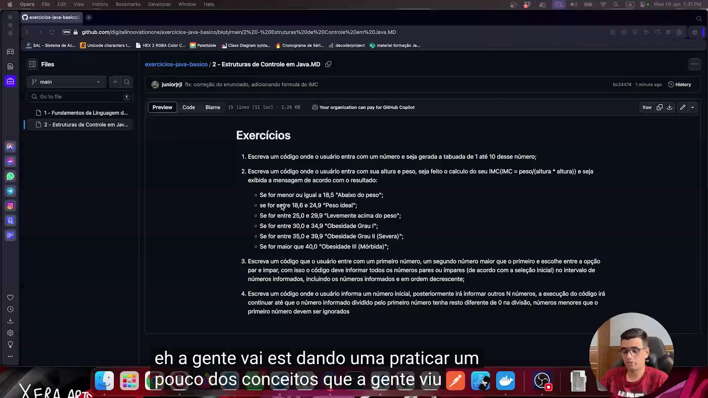
</p>

A imagem mostra a listagem completa dos exercícios propostos para a prática dos conceitos de estruturas de controle em Java, exibida no repositório do GitHub (`exercicios-java-basico`). São quatro exercícios no total:

1. Gerar a tabuada de 1 a 10 de um número informado pelo usuário.
2. Calcular o IMC (Índice de Massa Corporal) a partir do peso e da altura informados, exibindo uma mensagem de acordo com a faixa de resultado.
3. Trabalhar com um intervalo de números par/ímpar, decrescente, a partir de dois números informados pelo usuário.
4. Ler um número inicial e, em seguida, outros números, interrompendo a execução quando um número dividido pelo primeiro tiver resto diferente de zero, ignorando números menores que o primeiro.

Essa visão geral serve como ponto de partida para a resolução guiada, que se concentrará com mais detalhe no quarto exercício.


<p align="center">
  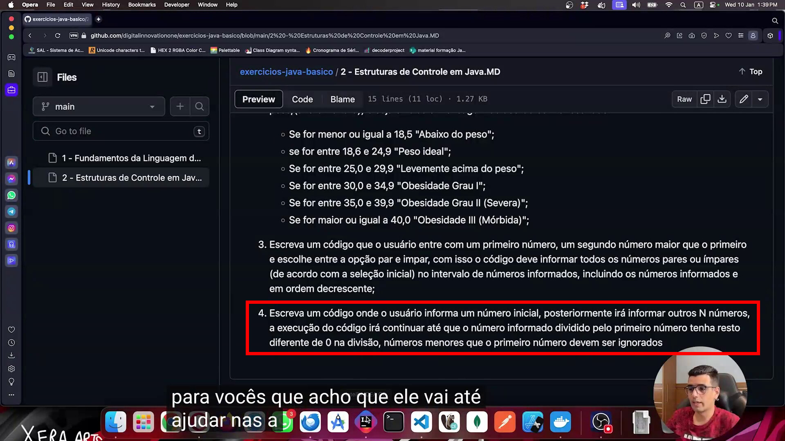
</p>

Aqui o quarto exercício é destacado (em vermelho) na página do GitHub, já com o enunciado corrigido: o usuário informa um número inicial e, posteriormente, informa outros N números; a execução do código deve continuar até que o número informado, dividido pelo primeiro número, tenha resto diferente de zero na divisão. Números menores que o primeiro número devem ser ignorados. Esse é o exercício escolhido para ser resolvido em conjunto, servindo de base para a implementação apresentada nas imagens seguintes.


<p align="center">
  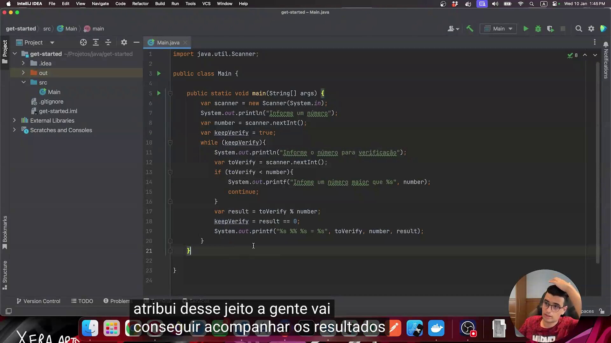
</p>

Nesta imagem, a IDE (IntelliJ) mostra a implementação em **Java** da solução para o quarto exercício. O código utiliza um `Scanner` para capturar o número inicial e, dentro de um laço `while`, captura repetidamente novos números para verificação. Se o número digitado for menor que o número inicial, uma mensagem pede um número maior e o laço avança para a próxima iteração com `continue`. Caso contrário, é calculado o resto da divisão (`toVerify % number`), e o resultado desse cálculo define se o laço deve continuar (`keepVerify = result == 0`).

```java
import java.util.Scanner;

public class Main {

    public static void main(String[] args) {
        var scanner = new Scanner(System.in);
        System.out.println("Informe um número");
        var number = scanner.nextInt();
        var keepVerify = true;
        while (keepVerify){
            System.out.println("Informe o número para verificação");
            var toVerify = scanner.nextInt();
            if (toVerify < number){
                System.out.printf("Infome um número maior que %s", number);
                continue;
            }
            var result = toVerify % number;
            keepVerify = result == 0;
            System.out.printf("%s %% %s = %s", toVerify, number, result);
        }
    }
}
```


<p align="center">
  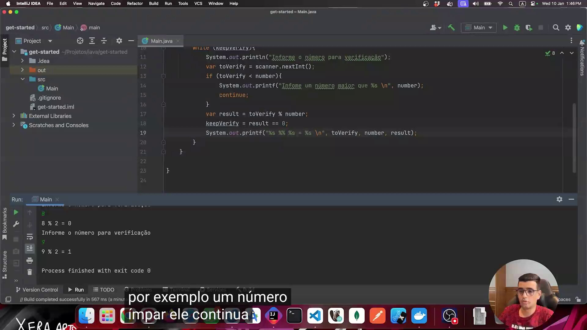
</p>

Nesta imagem o código é executado para validar o comportamento esperado. As mensagens de saída (`printf`) foram ajustadas com quebras de linha (`\n`) para melhorar a legibilidade do console. No teste exibido, o número inicial informado é `2`; ao informar `8`, o resto da divisão é `0` (`8 % 2 = 0`) e o laço continua pedindo novos números; ao informar `9`, o resto é `1` (`9 % 2 = 1`), condição que faz `keepVerify` receber `false` e encerra a execução do laço, exatamente como pedia o enunciado do exercício.

```java
import java.util.Scanner;

public class Main {

    public static void main(String[] args) {
        var scanner = new Scanner(System.in);
        System.out.println("Informe um número");
        var number = scanner.nextInt();
        var keepVerify = true;
        while (keepVerify){
            System.out.println("Informe o número para verificação");
            var toVerify = scanner.nextInt();
            if (toVerify < number){
                System.out.printf("Infome um número maior que %s \n", number);
                continue;
            }
            var result = toVerify % number;
            keepVerify = result == 0;
            System.out.printf("%s %% %s = %s \n", toVerify, number, result);
        }
    }
}
```

Saída do console:

```
Informe um número
2
Informe o número para verificação
8
8 % 2 = 0
Informe o número para verificação
9
9 % 2 = 1

Process finished with exit code 0
```
     

### 🟩 Vídeo 06 - Bônus: Configurando Git e GitHub

<video width="60%" controls>
  <source src="000-Midia_e_Anexos/itau_java_com_inteligencia_artificial-modulo.02-curso.03-video_06.webm" type="video/webm">
    Seu navegador não suporta vídeo HTML5.
</video>

link do vídeo: https://web.dio.me/track/itau-java-com-inteligencia-artificial/course/estruturas-de-controle-em-java/learning/55c4ebb0-e605-4bce-99f2-1d0972aaf32b?autoplay=1

### Anotações      

<p align="center">
  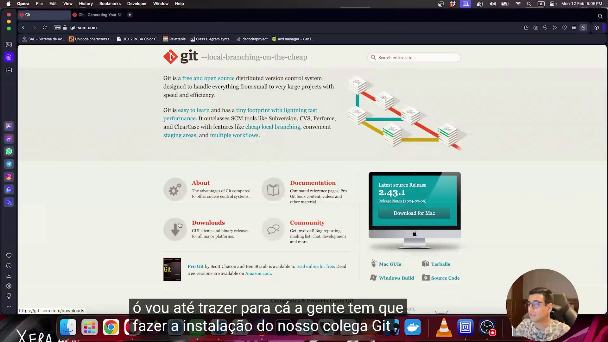
</p>

Nesta aula prática o instrutor detalha o processo de configuração do Git em ambiente Linux para integração com o GitHub. O instrutor demonstra desde a instalação do software via terminal até a criação de chaves SSH para garantir uma comunicação segura entre a máquina local e o servidor remoto. Além disso, o tutorial ensina a criar um repositório online, realizar os primeiros comandos de versionamento, como commit e push, e organizar o histórico de alterações. Por fim, destaca-se a importância de manter um portfólio atualizado e bem documentado através de arquivos README atrativos para valorizar o trabalho do desenvolvedor no mercado.

# Certificado: Estruturas de Controle em Java

- Link na plataforma: 
- Certificado em pdf: