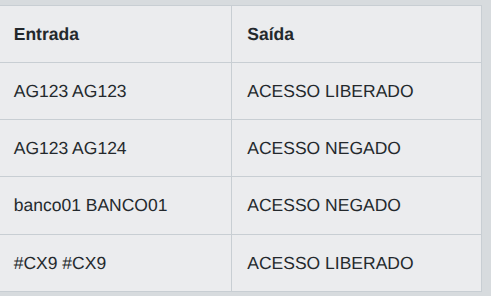

# Desafio 01 - Validação de Operação Bancária em Java

No setor bancário, pequenas automações ajudam a evitar erros em tarefas repetitivas. Em uma agencia, a equipe de atendimento recebe codigos de operacao digitados por diferentes sistemas internos. Antes de seguir com o processamento, um programa simples deve verificar se o codigo informado representa uma operacao valida para o caixa digital. Como este e um treinamento para novos desenvolvedores, a validacao foi reduzida a uma regra unica e objetiva.

Voce deve criar um programa que leia uma unica palavra e verifique se ela e exatamente igual a `DEPOSITO`, `SAQUE` ou `TRANSFERENCIA`. Se for igual a uma dessas opcoes, a operacao deve ser considerada valida. Caso contrario, ela deve ser considerada invalida. A comparacao deve respeitar exatamente os caracteres informados, incluindo letras maiusculas e minusculas. Assim, deposito e DEPOSITO devem ser tratados como valores diferentes. O problema foi pensado para praticar fundamentos de Java, como leitura de entrada, uso de strings, comparacao de texto e estruturas condicionais, mas a solucao pode ser implementada em qualquer linguagem usando apenas recursos padrao.

## Entrada

A entrada contem uma unica linha com uma string representando o codigo da operacao bancaria informado pelo sistema interno.

## Saída

Imprima `VALID` se a string for exatamente `DEPOSITO`, `SAQUE` ou `TRANSFERENCIA`. Caso contrario, imprima `INVALID`.

## Exemplos

A tabela abaixo apresenta exemplos de entrada e saída:

<p align="center">
  
</p>

## Código Exemplo

```java
import java.util.Scanner;

public class Main {
    public static void main(String[] args) {
        Scanner scanner = new Scanner(System.in);

        String operacao = scanner.nextLine();

        // A validacao deve ser exata, respeitando maiusculas e minusculas.
        // Compare a entrada com os tres codigos permitidos.
        boolean operacaoValida = false;

        // TODO: atualize a variavel operacaoValida para true se a operacao for DEPOSITO, SAQUE ou TRANSFERENCIA.

        System.out.println(operacaoValida ? "VALID" : "INVALID");

        scanner.close();
    }
}
```

## Solução

```java
import java.util.Scanner;

public class Main {
    public static void main(String[] args) {
        Scanner scanner = new Scanner(System.in);

        String operacao = scanner.nextLine();

        // A validacao deve ser exata, respeitando maiusculas e minusculas.
        // Compare a entrada com os tres codigos permitidos.
        boolean operacaoValida = false;

        if (operacao.matches("DEPOSITO|SAQUE|TRANSFERENCIA")) {operacaoValida =true; }
        else operacaoValida = false;

        System.out.println(operacaoValida ? "VALID" : "INVALID");

        scanner.close();
    }
}
```


# Desafio 02 - Validacao de Código Bancario em Java

Em um banco digital, a equipe de atendimento esta treinando novos desenvolvedores para automatizar verificacoes simples antes de liberar operacoes no sistema interno. Uma das primeiras tarefas e validar se um codigo de agencia foi digitado corretamente pelos operadores. Como o treinamento e voltado para fundamentos de Java, o objetivo e praticar leitura de entrada, comparacao de strings e decisoes condicionais.

Voce deve criar um programa que leia dois textos: o codigo informado pelo operador e o codigo esperado pelo sistema. Se os dois textos forem exatamente iguais, o programa deve indicar que a validacao foi aprovada. Caso contrario, deve informar que houve erro de digitacao. A comparacao deve considerar todos os caracteres exatamente como foram recebidos, incluindo letras maiusculas, minusculas, numeros e simbolos. Nao ha necessidade de tratar espacos extras fora do que for lido como entrada. O problema possui um unico objetivo: decidir se os dois codigos sao identicos ou nao.

## Entrada

A entrada contem duas linhas. A primeira linha possui o codigo informado pelo operador. A segunda linha possui o codigo esperado pelo sistema. Cada linha deve ser tratada como uma string completa.

## Saída

Exiba uma unica linha. Se os codigos forem exatamente iguais, imprima `ACESSO LIBERADO`. Caso contrario, imprima `ACESSO NEGADO`.

## Exemplos

A tabela abaixo apresenta exemplos de entrada e saída:

<p align="center">
  
</p>

## Código Exemplo

```java
import java.util.Scanner;

public class Main {
    public static void main(String[] args) {
        Scanner scanner = new Scanner(System.in);

        String codigoInformado = scanner.nextLine();
        String codigoEsperado = scanner.nextLine();

        // Compare os dois textos exatamente como foram lidos.
        // Se forem identicos, exiba "ACESSO LIBERADO"; caso contrario, "ACESSO NEGADO".
        // TODO: imprima o resultado da validacao em uma unica linha.

        scanner.close();
    }
}
```


## Solução

```java
import java.util.Scanner;

public class Main {
    public static void main(String[] args) {
        Scanner scanner = new Scanner(System.in);

        String codigoInformado = scanner.nextLine();
        String codigoEsperado = scanner.nextLine();

        if (codigoInformado.equals(codigoEsperado)) { System.out.println("ACESSO LIBERADO"); } 
        else { System.out.println("ACESSO NEGADO"); }

        scanner.close();
    }
}
```
