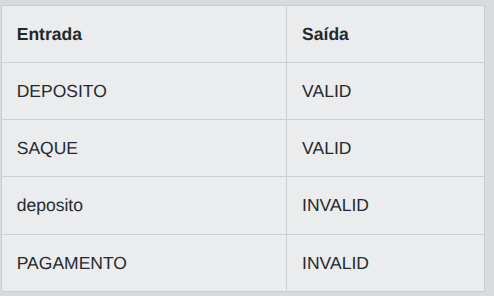

# Desafio 01 - Validação de Operação Bancária em Java

No setor bancário, pequenas automações ajudam a evitar erros em tarefas repetitivas. Em uma agencia, a equipe de atendimento recebe codigos de operacao digitados por diferentes sistemas internos. Antes de seguir com o processamento, um programa simples deve verificar se o codigo informado representa uma operacao valida para o caixa digital. Como este e um treinamento para novos desenvolvedores, a validacao foi reduzida a uma regra unica e objetiva.

Voce deve criar um programa que leia uma unica palavra e verifique se ela e exatamente igual a `DEPOSITO`, `SAQUE` ou `TRANSFERENCIA`. Se for igual a uma dessas opcoes, a operacao deve ser considerada valida. Caso contrario, ela deve ser considerada invalida. A comparacao deve respeitar exatamente os caracteres informados, incluindo letras maiusculas e minusculas. Assim, deposito e DEPOSITO devem ser tratados como valores diferentes. O problema foi pensado para praticar fundamentos de Java, como leitura de entrada, uso de strings, comparacao de texto e estruturas condicionais, mas a solucao pode ser implementada em qualquer linguagem usando apenas recursos padrao.

## Entrada

A entrada contem uma unica linha com uma string representando o codigo da operacao bancaria informado pelo sistema interno.

## Saída

Imprima `VALID` se a string for exatamente `DEPOSITO`, `SAQUE` ou `TRANSFERENCIA`. Caso contrario, imprima `INVALID`.

## Exemplos

A tabela abaixo apresenta exemplos de entrada e saída:

<p align="center">
  
</p>

## Código Exemplo

```java
import java.util.Scanner;

public class Main {
    public static void main(String[] args) {
        Scanner scanner = new Scanner(System.in);

        String operacao = scanner.nextLine();

        // A validacao deve ser exata, respeitando maiusculas e minusculas.
        // Compare a entrada com os tres codigos permitidos.
        boolean operacaoValida = false;

        // TODO: atualize a variavel operacaoValida para true se a operacao for DEPOSITO, SAQUE ou TRANSFERENCIA.

        System.out.println(operacaoValida ? "VALID" : "INVALID");

        scanner.close();
    }
}
```


## Solução


# Desafio 02 - Trabalhando com Operadores

## Entrada


## Saída

## Exemplos


## Código Exemplo


## Solução
