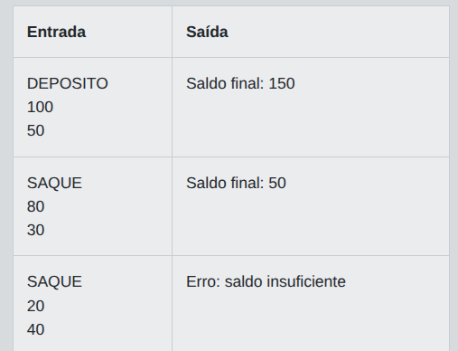
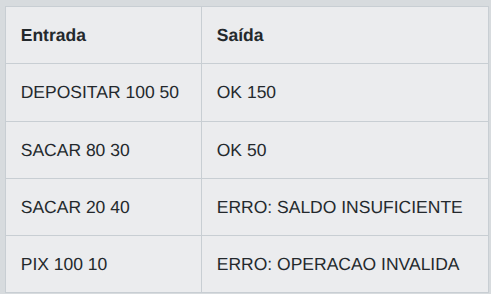

# Desafio 01 - ByteBank Java: Operacoes Bancarias com POO e Excecoes

No banco ByteBank, uma nova etapa do treinamento de desenvolvedores simula o processamento de operacoes em contas digitais. A equipe quer avaliar se os candidatos entendem como modelar comportamentos simples de objetos e como tratar situacoes invalidas, como se fossem excecoes de negocio. Para isso, cada teste descreve uma conta com saldo inicial e uma tentativa de operacao.

Implemente um programa que leia uma unica operacao bancaria e informe o resultado final. Existem dois tipos de operacao: **`DEPOSITO`** e **`SAQUE`**. Se a operacao for **`DEPOSITO`**, o valor deve ser somado ao saldo. Se for **`SAQUE`**, o valor deve ser subtraido apenas se houver saldo suficiente. Considere como erro qualquer valor menor ou igual a zero. Também é erro informar um tipo de operacao diferente dos dois permitidos. Nesses casos, em vez de atualizar a conta, o programa deve retornar uma mensagem de falha. O objetivo é representar a ideia de uma classe `Conta` com métodos de depósito e saque, alem de validações equivalentes ao lançamento de exceções, embora a solução final deva apenas imprimir a resposta pedida.

## Entrada

A entrada contém três linhas. A primeira linha possui uma string com o tipo da operação: **`DEPOSITO`** ou **`SAQUE`**. A segunda linha contém uma string representando um número inteiro com o saldo inicial da conta. A terceira linha contem uma string representando um número inteiro com o valor da operação.

## Saída

Se a operacao for válida, imprima Saldo final: X, em que X e o saldo apos o processamento. Se o tipo for inválido, imprima Erro: operacao invalida. Se o valor for menor ou igual a zero, imprima Erro: valor invalido. Se um saque exceder o saldo, imprima Erro: saldo insuficiente.

## Exemplos

A tabela abaixo apresenta exemplos de entrada e saída:

<p align="center">
  
</p>

## Código Exemplo

```java
import java.util.Scanner;

public class Main {

    static class Conta {
        private int saldo;

        public Conta(int saldoInicial) {
            this.saldo = saldoInicial;
        }

        public void depositar(int valor) {
            validarValor(valor);
            saldo += valor;
        }

        public void sacar(int valor) {
            validarValor(valor);

            if (valor > saldo) {
                throw new IllegalArgumentException("Erro: saldo insuficiente");
            }

            saldo -= valor;
        }

        public int getSaldo() {
            return saldo;
        }

        private void validarValor(int valor) {
            if (valor <= 0) {
                throw new IllegalArgumentException("Erro: valor invalido");
            }
        }
    }

    public static void main(String[] args) {
        Scanner scanner = new Scanner(System.in);

        String operacao = scanner.nextLine().trim();
        int saldoInicial = Integer.parseInt(scanner.nextLine().trim());
        int valorOperacao = Integer.parseInt(scanner.nextLine().trim());

        Conta conta = new Conta(saldoInicial);

        try {
            if ("DEPOSITO".equals(operacao)) {
                conta.depositar(valorOperacao);
                System.out.println("Saldo final: " + conta.getSaldo());
            } else if ("SAQUE".equals(operacao)) {
                // TODO: processe o saque e imprima o saldo final no mesmo formato do deposito.
            } else {
                System.out.println("Erro: operacao invalida");
            }
        } catch (IllegalArgumentException e) {
            System.out.println(e.getMessage());
        }

        scanner.close();
    }
}
```

## Solução

```java
import java.util.Scanner;

public class Main {
    static class Conta {
        private int saldo;

        public Conta(int saldoInicial) {
            this.saldo = saldoInicial;
        }
        public void depositar(int valor) {
            validarValor(valor);
            saldo += valor;
        }
        public void sacar(int valor) {
            validarValor(valor);
            if (valor > saldo) {
                throw new IllegalArgumentException("Erro: saldo insuficiente");
            }
            saldo -= valor;
        }
        public int getSaldo() {
            return saldo;
        }
        private void validarValor(int valor) {
            if (valor <= 0) {
                throw new IllegalArgumentException("Erro: valor invalido");
            }
        }
    }

    public static void main(String[] args) {
        Scanner scanner = new Scanner(System.in);

        // --------------------------------------------------------
        // Este trecho corrige a falha do enunciado usando tag HTML <br> ao inves de quebra de linha com \n : DEPOSITO<br>100<br>50
        String entrada = scanner.nextLine();    
        String[] partes = entrada.split("<br>");
        
        String operacao = partes[0].trim();
        int saldoInicial = Integer.parseInt(partes[1].trim());
        int valorOperacao = Integer.parseInt(partes[2].trim());
        // Fim da alteração para suprir o erro
        // Mérito da correção: Clodoaldo Souza
        // --------------------------------------------------------

        Conta conta = new Conta(saldoInicial);

        try {
            if ("DEPOSITO".equals(operacao)) {
                conta.depositar(valorOperacao);
                System.out.println("Saldo final: " + conta.getSaldo());
            } else if ("SAQUE".equals(operacao)) {
                // TODO: processe o saque e imprima o saldo final no mesmo formato do deposito.
                conta.sacar(valorOperacao);
                System.out.println("Saldo final: " + conta.getSaldo());            
            } else {
                System.out.println("Erro: operacao invalida");
            }
        } catch (IllegalArgumentException e) {
            System.out.println(e.getMessage());
        }

        scanner.close();
    }
}
```

# Desafio 02 - ByteBank Java: Operacoes Bancarias com POO e Excecoes

No banco ByteBank, uma nova etapa do treinamento de desenvolvedores simula o processamento de operacoes em contas digitais. A equipe quer avaliar se os candidatos entendem como modelar comportamentos simples de objetos e como tratar situacoes invalidas, como se fossem exceções de negócio. Para isso, cada teste descreve uma conta com saldo inicial e uma tentativa de operação.

Implemente um programa que leia uma única operacao bancária e informe o resultado final. Existem dois tipos de operação: **`DEPOSITAR`** e **`SACAR`**. Se a operacao for **`DEPOSITAR`**, o valor deve ser somado ao saldo. Se for **`SACAR`**, o valor deve ser subtraído apenas se houver saldo suficiente. Considere erro também quando o valor informado for menor ou igual a zero, ou quando o tipo de operação for diferente dos dois permitidos. Em qualquer erro, o saldo não deve ser alterado. A ideia representa, de forma simplificada, um método de classe `Conta` e validações equivalentes a exceções. Ao final, imprima exatamente uma mensagem indicando sucesso ou erro.

## Entrada

A entrada contém uma única linha com três partes separadas por espaço: o tipo da operação, o saldo inicial e o valor da operação. O tipo será uma string. Os dois valores numéricos serão inteiros não negativos. Exemplos de tipo válido: **`DEPOSITAR`** e **`SACAR`**.

## Saída

Se a operação for válida, imprima **OK** seguido de um espaço e do saldo final. Se o tipo for inválido, imprima **ERRO: OPERACAO INVALIDA**. Se o valor for menor ou igual a zero, imprima **ERRO: VALOR INVALIDO**. Se for um saque sem saldo suficiente, imprima **ERRO: SALDO INSUFICIENTE**.

## Exemplos

A tabela abaixo apresenta exemplos de entrada e saída:

<p align="center">
  
</p>

## Código Exemplo

```java
import java.util.Scanner;

public class Main {

    static class Conta {
        private int saldo;

        public Conta(int saldoInicial) {
            this.saldo = saldoInicial;
        }

        public String processarOperacao(String tipoOperacao, int valor) {
            if (!tipoOperacao.equals("DEPOSITAR") && !tipoOperacao.equals("SACAR")) {
                return "ERRO: OPERACAO INVALIDA";
            }

            // TODO: valide se o valor da operacao eh menor ou igual a zero.
            // Nesse caso, retorne a mensagem de erro correspondente.
            if (false) {
                return "";
            }

            if (tipoOperacao.equals("DEPOSITAR")) {
                saldo += valor;
                return "OK " + saldo;
            }

            if (valor > saldo) {
                return "ERRO: SALDO INSUFICIENTE";
            }

            saldo -= valor;
            return "OK " + saldo;
        }
    }

    public static void main(String[] args) {
        Scanner scanner = new Scanner(System.in);

        String tipoOperacao = scanner.next();
        int saldoInicial = scanner.nextInt();
        int valorOperacao = scanner.nextInt();

        Conta conta = new Conta(saldoInicial);
        String resultado = conta.processarOperacao(tipoOperacao, valorOperacao);

        System.out.println(resultado);
        scanner.close();
    }
}
```

## Solução

```java
import java.util.Scanner;

public class Main {

    static class Conta {
        private int saldo;

        public Conta(int saldoInicial) {
            this.saldo = saldoInicial;
        }

        public String processarOperacao(String tipoOperacao, int valor) {
            if (!tipoOperacao.equals("DEPOSITAR") && !tipoOperacao.equals("SACAR")) {
                return "ERRO: OPERACAO INVALIDA";
            }

            if (valor <= 0) {
                return "ERRO: VALOR INVALIDO";
            }

            if (tipoOperacao.equals("DEPOSITAR")) {
                saldo += valor;
                return "OK " + saldo;
            }

            if (valor > saldo) {
                return "ERRO: SALDO INSUFICIENTE";
            }

            saldo -= valor;
            return "OK " + saldo;
        }
    }

    public static void main(String[] args) {
        Scanner scanner = new Scanner(System.in);

        String tipoOperacao = scanner.next();
        int saldoInicial = scanner.nextInt();
        int valorOperacao = scanner.nextInt();

        Conta conta = new Conta(saldoInicial);
        String resultado = conta.processarOperacao(tipoOperacao, valorOperacao);

        System.out.println(resultado);
        scanner.close();
    }
}
``` 
