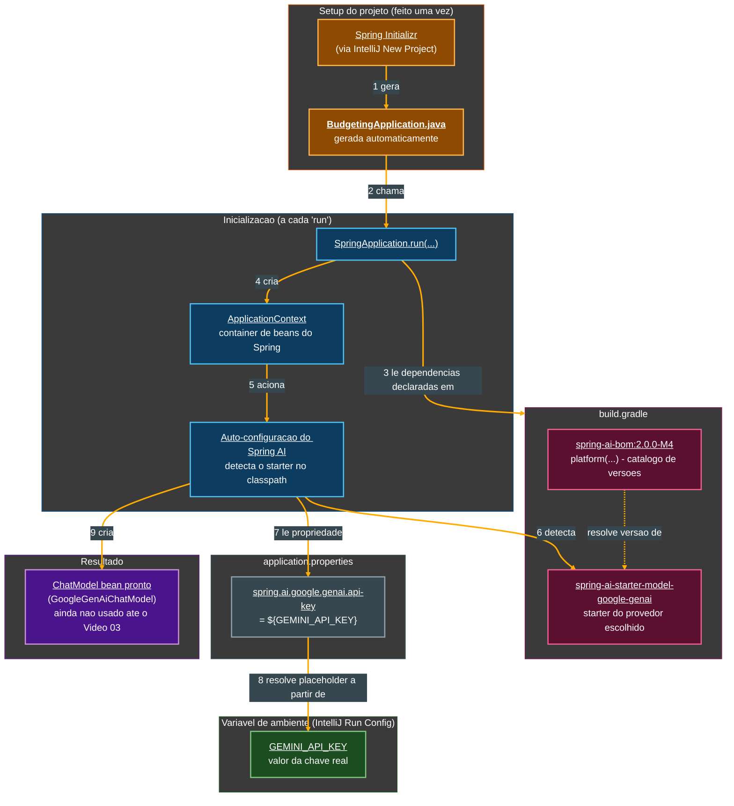
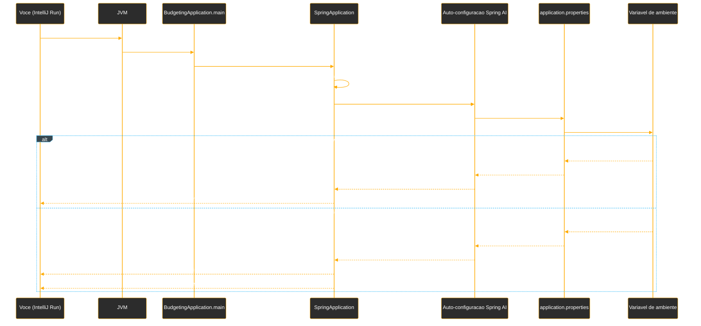

# Tutorial de Estudos — Desenvolvendo sua API Inteligente com Reconhecimento de Fala e Spring Boot

**Do zero ao primeiro Spring Boot conversando com uma LLM — Vídeos 01 e 02**

- Curso: NTT Data — Jornada Tech (DIO) · Módulo 4 — Curso 5: "Desenvolvendo sua API Inteligente com Reconhecimento de Fala e Spring Boot"
- Instrutor: Thiago Poiani (Principal Engineer at Skip)
- Projeto: `budgeting`
- Documento de referência pessoal — nível iniciante em Java

---

## Sobre este documento

Este tutorial foi criado a partir das anotações de aula (README) e do estado real do projeto `budgeting`, na etapa correspondente ao Vídeo 02. O objetivo é explicar, com riqueza de detalhes e em nível iniciante, cada conceito apresentado e cada configuração feita até agora — o que ela faz, por que foi feita daquela forma, e qual conceito de Java, Spring ou de arquitetura de software ela representa.

Este documento deve ser usado como um mapa: sempre que houver dúvida sobre "por que essa configuração está aqui", deve-se voltar a ele. A ideia é que, relendo este material, consiga-se reconstruir o raciocínio da aula sem precisar assistir ao vídeo novamente.

> **Como este documento está organizado**
> A Parte 1 resume o Vídeo 01, que é inteiramente teórico (introdução ao projeto e ao vocabulário de IA). A Parte 2 é o núcleo do tutorial: a configuração do projeto é apresentada em pequenos blocos, na ordem em que foi feita na aula, seguida de explicação linha a linha. Ao final, há um glossário, um checkpoint fiel do código real do seu projeto (conferido diretamente no `.zip` enviado), uma seção específica sobre pontos em que seu projeto diverge do que o professor mostrou em aula, os próximos passos do curso e diagramas de como tudo se encaixa.

---

## Parte 1 — Fundamentos e vocabulário de IA (Vídeo 01)

O primeiro vídeo do curso é inteiramente teórico: antes de escrever qualquer configuração, a aula situa o que será construído ao longo do curso e apresenta o vocabulário mínimo de IA que qualquer desenvolvedor Java precisa conhecer para trabalhar com Spring AI. Como isso já está detalhadamente documentado no seu README (com as imagens dos slides), aqui vai um resumo objetivo, na ordem em que os conceitos apareceram.

### 1.1. A proposta do curso: de API tradicional para API por voz

A aula abre contrastando duas formas de construir uma API:

- **Padrão atual (REST tradicional)** — o cliente envia um JSON estruturado, seguindo um contrato fixo (por exemplo, um `POST /companies` com um corpo específico), e a API só funciona se esse contrato for respeitado à risca.
- **Nova era (voz + IA)** — a API passa a "ouvir" um áudio, entender a intenção por trás da fala em linguagem natural, e só então acionar a lógica de negócio — sem exigir que o usuário formate nada como JSON.

Essa mudança de paradigma é resumida no diagrama **"A Nova Anatomia da API"**, que descreve quatro etapas sequenciais:

1. **Áudio → STT (Speech-to-Text)** — a onda sonora é convertida em texto processável.
2. **MCP / Tool Calling (Spring AI)** — o modelo de IA interpreta o texto e decide qual "ferramenta" (função Java) precisa ser acionada.
3. **Java Use Case** — a lógica de negócio real da aplicação Spring Boot é executada.
4. **TTS (Text-to-Speech) → Áudio** — a resposta da aplicação é convertida de volta em voz sintetizada.

> **Por que isso importa para o código?**
> Essas quatro etapas são exatamente o roteiro dos próximos vídeos do curso: primeiro o Spring AI é configurado (Vídeo 02, este tutorial), depois vêm o `ChatModel`/`ChatClient` (Vídeos 03 e 04), o Tool Calling (Vídeo 05), a Transcription API — o "STT" (Vídeo 06) — e a Speech API — o "TTS" (Vídeo 07). Cada peça do diagrama vira, literalmente, um vídeo do curso.

### 1.2. O fluxo de ponta a ponta

O diagrama **"O Novo Fluxo de Interação"** detalha o mesmo caminho de forma mais granular: **Usuário (Microfone) → Transcrição de Áudio → Interpretação de Intenção → Lógica de Domínio (Java) → Geração de Resposta → Usuário**. É o mapa geral para os componentes que serão implementados, um a um, ao longo do curso.

### 1.3. Glossário de IA para desenvolvedores Java

Este é o núcleo conceitual do Vídeo 01 — os termos abaixo aparecem o tempo todo daqui em diante:

- **Linguagem Natural** — texto livre, sem formato fixo, que precisa ser interpretado por um parser/modelo para que sua *intenção* seja extraída. O slide ilustra essa ideia com um método conceitual `decodeIntent(String naturalLanguage)`, que devolve a intenção reconhecida a partir de um texto.
- **Speech-to-Text (STT)** — primeira etapa do pipeline de voz: transforma uma onda sonora não estruturada (ex.: alguém falando "Gastei 50 reais...") em texto processável pela aplicação.
- **Tool Calling** — "a ponte para o domínio": a capacidade de uma IA, a partir de uma intenção interpretada, "chamar" um método Java específico (um *Use Case*) para de fato realizar uma tarefa no mundo real, como salvar um dado no banco.
- **Text-to-Speech (TTS)** — última etapa do pipeline: transforma a resposta da lógica de negócio (por exemplo, um JSON como `{"status": "ok", "response": {"message": "Sua conta foi criada com sucesso."}}`) de volta em uma "Acoustic Waveform" — uma onda de voz sintetizada, devolvida ao usuário.

### 1.4. O estudo de caso: o assistente de *budgeting*

A aula apresenta o projeto que será construído ao longo do curso — batizado, não por acaso, de `budgeting` — descrito no infográfico **"O Assistente de Budgeting: Transformando Voz em Dados Financeiros"**: um sistema onde o usuário simplesmente fala um gasto (ex.: *"Gastei 50 reais no Starbucks agora"*), e a IA se encarrega de todo o resto:

- **Extração de Entidades** — a partir da frase, o sistema identifica automaticamente *Valor* (50 reais), *Local* (Starbucks) e *Data/Hora* (agora).
- **Categorização Automática** — o sistema infere sozinho que "Starbucks" corresponde à categoria "Alimentação/Café", sem que o usuário precise escolher uma categoria manualmente.

O resultado final é um dado estruturado, pronto para ser persistido: `Valor = 50.00`, `Local = Starbucks`, `Data/Hora = Agora (Hoje)`.

> **E o que você vai construir no Vídeo 02?**
> Nada do fluxo de voz ainda. O Vídeo 02 é o primeiro passo puramente técnico: criar o projeto Spring Boot vazio e conectá-lo a um provedor de LLM (modelo de linguagem), usando o Spring AI. É a fundação sobre a qual STT, Tool Calling e TTS serão construídos nos vídeos seguintes.

---

## Parte 2 — Criando o projeto e conectando ao Spring AI (Vídeo 02)

Este é o primeiro vídeo em que alguma configuração de fato é feita. O objetivo do vídeo é sair do zero absoluto e chegar a um projeto Spring Boot que: (1) tem as dependências do Spring AI corretamente resolvidas, (2) sabe qual provedor de LLM (modelo de linguagem) vai usar, e (3) sobe sem erros, comprovando que a chave de API foi lida corretamente — tudo isso **sem ainda existir nenhuma chamada real ao modelo** (isso fica para o Vídeo 03, quando o `ChatModel` é explorado).

### 2.1. O ecossistema Spring AI

Antes de criar o projeto, a aula contextualiza o que é o **Spring AI**: um ecossistema dentro do Spring dedicado a incorporar inteligência artificial em aplicações Java, por meio de um conjunto de APIs e interfaces que facilitam a integração com diferentes *Large Language Models* (LLMs) — entre eles, Anthropic, OpenAI, Microsoft, Amazon, Google e Ollama.

O Spring AI disponibiliza interfaces prontas para vários tipos de modelo — **chat**, **embedding**, **texto para imagem**, **audio transcription** (áudio para texto), **text to speech** (texto para áudio) e **moderação** — além de recursos adicionais como observabilidade, um `ChatClient` (interface que facilita a comunicação com os modelos), integração com bancos de dados de vetor e **tool calling**.

> **Por que isso importa?**
> A ideia central do Spring AI é a **abstração por interface comum**: se um projeto quiser trocar o Gemini pelo OpenAI, por exemplo, não é necessário alterar nenhuma linha do código de negócio — basta trocar a dependência do modelo e o valor de uma propriedade. Essa promessa é justamente o que torna a divergência documentada na seção "Pontos de atenção" (troca de OpenAI por Gemini no seu projeto) tecnicamente simples de resolver, ainda que ela exija atenção.

### 2.2. Revisando três conceitos-chave: prompt, embedding e token

Antes de tocar em código, a aula reforça três termos que aparecem constantemente ao se trabalhar com IA:

- **Prompt** — a entrada que se envia a um modelo, descrevendo o que se deseja que ele faça. É, em essência, "a forma de se comunicar com o modelo".
- **Embedding** — está relacionado a como os dados são salvos/representados numericamente para o modelo (não é o foco deste vídeo).
- **Token** — a unidade de processamento usada pelos modelos para interpretar um texto; de forma geral, quanto maior o texto de entrada (ou de saída), mais tokens ele consome, e isso está diretamente relacionado ao **custo** de uso do modelo.

Também é mencionado o conceito de **respostas estruturadas** — a capacidade do Spring AI de transformar a resposta em texto de um modelo diretamente em um objeto Java — e o de **tool calling**, aprofundado a seguir.

### 2.3. Tool calling, em mais detalhes

Tool calling é a forma de dizer a uma LLM que ela pode ter acesso a dados externos — por exemplo, dados da própria aplicação — através de **ferramentas** (*tools*). Na prática, isso significa: definir uma maneira da LLM consultar informações de usuários, consultar relatórios ou persistir uma informação no banco; informar à LLM quais ferramentas estão disponíveis; e deixar que ela, a partir da intenção interpretada, decida invocar o método Java correto, com os parâmetros corretos.

> **Por que isso é o coração do projeto `budgeting`?**
> É exatamente esse mecanismo que vai permitir que a frase "Gastei 50 reais no Starbucks agora" (Parte 1) resulte em uma chamada real a um método Java que salva essa transação no banco de dados — sem que nenhum JSON estruturado precise ser enviado manualmente pelo usuário.

### 2.4. Criando o projeto Spring Boot no IntelliJ

Com o vocabulário revisado, o instrutor cria o projeto pela tela **New Project** do IntelliJ, usando o gerador integrado do **Spring Initializr** (`start.spring.io`):

- **Name:** `budgeting`
- **Language:** Java
- **JDK:** Eclipse Temurin 25.0.2 (gerenciado localmente pelo **SDKMAN**, uma ferramenta de linha de comando para instalar e alternar entre várias versões do SDK do Java)
- **Packaging:** Jar
- **Configuration:** Properties (ou seja, o arquivo de configuração gerado é `application.properties`, e não `application.yml`)
- **Spring Boot version:** 3.2.5, sem nenhuma dependência inicial marcada — as dependências seriam adicionadas manualmente, conforme necessário

> **O que é o Spring Initializr, afinal?**
> É um gerador de projetos Spring Boot: em vez de montar manualmente toda a estrutura de pastas, o arquivo de build (`build.gradle` ou `pom.xml`) e a classe principal, o Initializr gera tudo isso a partir de um formulário — nome do projeto, linguagem, versão do Java, versão do Spring Boot e dependências desejadas. O IntelliJ tem esse gerador embutido na própria tela de criação de projeto, sem precisar abrir o navegador.

### 2.5. A classe gerada automaticamente: `BudgetingApplication`

Ao concluir o assistente, o Initializr já entrega uma classe principal pronta, criada automaticamente — nenhuma linha dela foi digitada manualmente na aula:

```java
package dio.budgeting;

import org.springframework.boot.SpringApplication;
import org.springframework.boot.autoconfigure.SpringBootApplication;

@SpringBootApplication
public class BudgetingApplication {

    public static void main(String[] args) {
        SpringApplication.run(BudgetingApplication.class, args);
    }

}
```

Como esta é a primeira classe Java deste tutorial, vale explicar cada instrução com calma:

- **`package dio.budgeting;`** — declara em qual "pasta lógica" essa classe vive. Em Java, um pacote organiza classes relacionadas em grupos e evita conflito de nomes entre classes de bibliotecas diferentes. Aqui, `dio` provavelmente representa a organização/curso (DIO), e `budgeting` é o nome do projeto.
- **`import org.springframework.boot.SpringApplication;`** e **`import org.springframework.boot.autoconfigure.SpringBootApplication;`** — a palavra-chave `import` traz uma classe (ou anotação) de outro pacote para ser usada neste arquivo sem precisar escrever o caminho completo toda vez. Aqui, são importadas duas peças do próprio framework Spring Boot.
- **`@SpringBootApplication`** — uma **anotação** (metadado que se anexa a uma classe, método ou campo, entre `@` e um nome) que marca `BudgetingApplication` como o ponto de entrada de uma aplicação Spring Boot. Na prática, essa única anotação combina três comportamentos: (1) liga a **auto-configuração** do Spring Boot, que tenta configurar automaticamente tudo o que estiver no *classpath* (por exemplo, ao detectar a dependência do Spring AI, ele tentará configurar sozinho os beans relacionados a IA); (2) liga o **component scan**, que procura, a partir deste pacote e de todos os seus subpacotes, quaisquer classes que devam virar *beans* gerenciados pelo Spring; (3) permite configurações adicionais específicas da própria classe.
- **`public class BudgetingApplication`** — declara a classe principal da aplicação. `public` significa que ela pode ser acessada de qualquer lugar do projeto (é necessário que seja pública para que a JVM consiga executá-la como ponto de entrada).
- **`public static void main(String[] args)`** — este é o método especial que a JVM (*Java Virtual Machine*) procura para saber por onde começar a executar o programa. Cada palavra tem um papel: `public` (acessível de fora da classe, exigido pela JVM), `static` (pertence à classe em si, e não a um objeto específico — por isso pode ser chamado sem que ninguém precise criar um `new BudgetingApplication()` antes), `void` (não devolve nenhum valor de volta) e `String[] args` (um vetor de textos, usado para receber argumentos passados pela linha de comando ao iniciar a aplicação — por exemplo, `java -jar app.jar --server.port=8081`).
- **`SpringApplication.run(BudgetingApplication.class, args);`** — a linha que efetivamente "liga" a aplicação: inicializa todo o contexto do Spring (o container que gerencia os *beans*), aplica as auto-configurações relevantes, sobe um possível servidor web embutido (não é o caso ainda, já que a dependência web não foi adicionada) e mantém a aplicação rodando. `BudgetingApplication.class` informa qual classe deve ser usada como referência de configuração raiz, e `args` repassa os argumentos de linha de comando recebidos pelo `main`.

> **Por que essa classe já vem pronta, sem eu escrever nada?**
> Diferente do código de domínio que você vai escrever nos próximos vídeos (entidades, repositórios, *use cases*), a classe principal de uma aplicação Spring Boot segue sempre o mesmo formato básico — por isso o Initializr já a gera pronta. O trabalho de configuração começa de verdade no `build.gradle` (próxima seção) e no `application.properties`.

### 2.6. Adicionando o BOM do Spring AI

A primeira dependência adicionada ao `build.gradle` não é uma dependência "normal", mas sim um **BOM** (*Bill of Materials*):

```groovy
dependencies {
    implementation 'org.springframework.boot:spring-boot-starter'
    testImplementation 'org.springframework.boot:spring-boot-starter-test'
    testRuntimeOnly 'org.junit.platform:junit-platform-launcher'

    implementation platform("org.springframework.ai:spring-ai-bom:2.0.0-M4")
}
```

- **`implementation platform("org.springframework.ai:spring-ai-bom:2.0.0-M4")`** — um **BOM** é, na prática, um catálogo (um "dicionário") de várias dependências relacionadas e suas versões corretas, testadas para funcionar em conjunto. A palavra-chave `platform(...)` avisa ao Gradle que essa coordenada não deve ser tratada como uma biblioteca normal a ser baixada e usada diretamente, mas sim como uma **fonte de versões** para as próximas dependências do Spring AI que forem declaradas. É justamente por causa desse BOM que, na próxima seção, a dependência do modelo de IA pode ser declarada **sem informar nenhuma versão** — quem resolve automaticamente qual versão baixar é o BOM.
- **`2.0.0-M4`** — o sufixo `-M4` indica que essa não é uma versão estável (*release*), mas sim a quarta **Milestone** (versão de marco/prévia) rumo à versão `2.0.0`. Na aula, o instrutor explica esse detalhe de versionamento com cuidado: a versão oficialmente estável do Spring AI, no momento da gravação, é a `1.0.0`, que só suporta Spring Boot `3.4` e `3.5`. Já a série `2.0.0` (ainda em milestones, como esta `M4`) é a que passa a suportar o Spring Boot 4 — e é essa a linha usada no projeto, mesmo sem ainda estar 100% estável (o instrutor chega a comentar que, no momento da gravação, havia até um alerta de segurança conhecido nessa versão prévia).

> **Por que usar uma versão ainda instável (`M4`) em vez da estável (`1.0.0`)?**
> Porque o projeto do curso é construído sobre o Spring Boot 4 (mais detalhes na seção "Pontos de atenção" adiante), e a série estável `1.0.0` do Spring AI simplesmente não é compatível com o Spring Boot 4 — apenas com as versões 3.4 e 3.5. Usar a milestone `2.0.0-M4` é a única forma de ter as duas peças (Spring Boot 4 + Spring AI) funcionando juntas antes do lançamento oficial da versão `2.0.0` estável do Spring AI.

### 2.7. Adicionando a dependência do modelo de IA

Com o BOM configurado, a próxima linha adiciona a dependência específica do provedor de modelo que será usado. Na aula, essa dependência é a do **OpenAI**:

```groovy
dependencies {
    implementation 'org.springframework.boot:spring-boot-starter'
    testImplementation 'org.springframework.boot:spring-boot-starter-test'
    testRuntimeOnly 'org.junit.platform:junit-platform-launcher'

    implementation platform("org.springframework.ai:spring-ai-bom:2.0.0-M4")
    implementation 'org.springframework.ai:spring-ai-starter-model-openai'
}
```

- **`implementation 'org.springframework.ai:spring-ai-starter-model-openai'`** — declara a dependência do *starter* (pacote pronto de configuração automática) específico para o modelo da OpenAI. Repare que, diferente de outras dependências Java que você vai ver ao longo do curso, esta linha **não tem número de versão** — quem resolve essa versão é justamente o BOM adicionado na seção anterior. O Spring AI documenta *starters* equivalentes para outros provedores (Google, Microsoft, Ollama, etc.); trocar de provedor, na maior parte dos casos, é trocar apenas esta linha.

> **Por que isso importa?**
> Cada `implementation` no Gradle declara uma dependência de compilação/execução — uma biblioteca externa que o projeto precisa para funcionar. O `spring-ai-starter-model-openai`, especificamente, traz consigo tudo que é necessário para o Spring Boot conseguir, na inicialização, criar automaticamente um *bean* de `ChatModel` conectado à OpenAI — desde que uma chave de API válida seja informada (próxima seção).

### 2.8. Configurando a chave de API no `application.properties`

Com a dependência do modelo adicionada, a aplicação passa a exigir uma credencial para se conectar ao provedor de IA. Na aula, essa credencial é configurada assim:

```properties
spring.application.name=budgeting
spring.ai.openai.api-key=${OPENAI_API_KEY}
```

- **`spring.application.name=budgeting`** — uma propriedade padrão do Spring Boot, que dá um nome legível à aplicação (usado, por exemplo, nos logs de inicialização e em ferramentas de observabilidade).
- **`spring.ai.openai.api-key=${OPENAI_API_KEY}`** — a propriedade específica que o `spring-ai-starter-model-openai` espera para autenticar as chamadas à API da OpenAI. Repare na sintaxe `${OPENAI_API_KEY}`: em vez de colocar o valor da chave diretamente no arquivo, o Spring Boot é instruído a **ler o valor de uma variável de ambiente** chamada `OPENAI_API_KEY` no momento em que a aplicação sobe. Esse mecanismo se chama *placeholder* de propriedade.

> **Por que não colocar a chave direto no arquivo?**
> Segurança. O `application.properties` normalmente é versionado no Git (faz parte do código-fonte do projeto). Se a chave estivesse escrita diretamente ali, qualquer `git push` para um repositório — mesmo privado — correria o risco de vazar a credencial (por exemplo, se o repositório se tornasse público mais tarde, ou fosse compartilhado sem cuidado). Usando `${OPENAI_API_KEY}`, o valor real da chave nunca entra no controle de versão: ele fica apenas na máquina de quem está rodando a aplicação, configurado como variável de ambiente.

Antes dessa propriedade existir, a aplicação falhava ao subir com o seguinte erro, mostrado no README:

```
Caused by: java.lang.IllegalArgumentException: OpenAI API key must be set. Use the connection property: spring.ai.openai.api-key
```

Esse erro é o próprio *starter* do Spring AI validando, na inicialização, que uma chave foi de fato configurada — antes mesmo de tentar fazer qualquer chamada real à OpenAI.

### 2.9. Criando a chave na OpenAI Platform

A aula mostra rapidamente o passo de obter a chave em `platform.openai.com`: criar uma conta (possivelmente com algum crédito gratuito de testes), acessar a seção **API keys**, criar uma nova *secret key* e copiar o valor gerado (ele só é exibido uma vez). No caso do instrutor, foi necessário vincular um cartão de crédito por já não haver mais acesso a créditos gratuitos — um detalhe de contexto que pode ou não se aplicar a cada aluno, dependendo da conta usada.

### 2.10. Definindo a variável de ambiente no IntelliJ

Com a chave em mãos, falta apenas disponibilizá-la como variável de ambiente para a aplicação. A aula mostra duas formas possíveis — definir a variável no sistema operacional, ou definir apenas para a execução daquele projeto específico dentro da IDE — e opta pela segunda:

1. Abrir as **Run/Debug Configurations** da configuração `BudgetingApplication` no IntelliJ.
2. No menu **Add Run Options**, selecionar **Environment variables**.
3. Na janela **Environment Variables**, cadastrar manualmente a variável `OPENAI_API_KEY` com o valor da chave copiada, mantendo marcada a opção **Include system environment variables** (para que, além dessa variável específica, todas as variáveis de ambiente já existentes no sistema operacional continuem disponíveis também).

> **Por que configurar a variável só na IDE, e não no sistema operacional inteiro?**
> Isso evita que a variável fique disponível globalmente em qualquer programa do computador — ela passa a existir apenas no contexto de execução daquele projeto específico, dentro do IntelliJ. É uma forma prática de isolar credenciais por projeto, especialmente útil quando se trabalha em várias aplicações diferentes na mesma máquina.

### 2.11. Subindo a aplicação com sucesso

Com a variável de ambiente configurada, a aplicação é executada novamente através da classe `BudgetingApplication`. O README registra o log de sucesso:

```
:: Spring Boot ::                (v4.0.5)

INFO 1871 --- [budgeting] [           main] dio.budgeting.BudgetingApplication       : Starting BudgetingApplication
INFO 1871 --- [budgeting] [           main] dio.budgeting.BudgetingApplication       : No active profile set, fa...
INFO 1871 --- [budgeting] [           main] dio.budgeting.BudgetingApplication       : Started BudgetingApplicat...

Process finished with exit code 0
```

- **Nenhum erro de `IllegalArgumentException`** — diferente da tentativa anterior (seção 2.8), a chave foi lida corretamente da variável de ambiente, e o *bean* de `ChatModel` da OpenAI foi criado sem reclamar.
- **`Process finished with exit code 0`** — como ainda não existe nenhuma dependência web (`spring-boot-starter-web`) no projeto, a aplicação sobe, inicializa o contexto do Spring, e **encerra sozinha** logo em seguida (não há um servidor esperando requisições, então não há motivo para o processo continuar rodando indefinidamente). Isso é esperado nesta etapa.

Esse resultado comprova que a conexão com o provedor de IA está pronta para ser explorada de fato nos próximos vídeos, quando o Chat API, o Tool Calling, a Transcription API e a Speech API do Spring AI entram em cena.

---

## Pontos de atenção: divergências entre a aula e o seu projeto

Comparando, linha a linha, o que está no seu `.zip` com o que a aula e o README descrevem, foram encontradas divergências relevantes — a mais importante delas muda, inclusive, qual provedor de IA sua aplicação está usando de fato:

1. **Provedor de modelo: OpenAI (aula) × Google Gemini (seu projeto) — divergência mais importante.** No seu `build.gradle` real, a dependência do OpenAI está **comentada**, e no lugar dela existe uma dependência ativa para o Gemini:

   ```groovy
   //  implementation 'org.springframework.ai:spring-ai-starter-model-openai'
   implementation 'org.springframework.ai:spring-ai-starter-model-google-genai'
   ```

   Da mesma forma, no seu `application.properties`, a propriedade da OpenAI também está comentada, e a propriedade ativa é a do Gemini, apontando para uma variável de ambiente **diferente** da usada em aula:

   ```properties
   #spring.ai.openai.api-key=${OPENAI_API_KEY}
   spring.ai.google.genai.api-key=${GEMINI_API_KEY}
   ```

   **Impacto prático:** nenhum erro de compilação ou de inicialização — o Spring AI foi desenhado justamente para permitir essa troca de provedor "só mudando a dependência e a propriedade", como a própria aula explica na Parte 2.1 deste tutorial. Mas isso significa que, se você seguir os próximos vídeos do curso *literalmente* (que provavelmente vão continuar usando exemplos com `OpenAiChatModel`/`spring.ai.openai...`), vai precisar adaptar cada trecho para as classes e propriedades equivalentes do Google GenAI (`GoogleGenAiChatModel` e `spring.ai.google.genai...`). Além disso, sua variável de ambiente precisa se chamar `GEMINI_API_KEY` (e não `OPENAI_API_KEY`) na configuração de execução do IntelliJ — se você seguiu a seção 2.10 deste tutorial usando o nome do vídeo, a aplicação vai voltar a falhar com um erro equivalente ao mostrado na seção 2.8, só que reclamando da chave do Gemini em vez da OpenAI.

   > **Recomendação:** não é necessário desfazer essa troca — usar o Gemini é uma escolha legítima e o próprio Spring AI foi construído para suportar isso. Mas vale deixar **documentado para você mesmo**, já nesta etapa, que seu projeto usa Gemini, para não se confundir quando os próximos vídeos mostrarem exemplos de código com `spring.ai.openai...` na tela. Sempre que um vídeo futuro citar uma propriedade ou classe com `openai` no nome, o equivalente no seu projeto provavelmente terá `google.genai` no lugar.

2. **Versão do Java: 25 (aula) × 21 (seu projeto).** O README e a fala do instrutor mencionam explicitamente o Java 25 (JDK "Eclipse Temurin 25.0.2", gerenciado via SDKMAN), e o `build.gradle` mostrado na tela confirma `languageVersion = JavaLanguageVersion.of(25)`. No seu `build.gradle` real, porém, o `toolchain` está configurado para a versão 21:

   ```groovy
   java {
       toolchain {
           languageVersion = JavaLanguageVersion.of(21)
       }
   }
   ```

   **Impacto prático:** nenhum, para o código escrito até aqui — nada no Vídeo 02 usa qualquer recurso exclusivo do Java 25. O Java 21 é uma versão **LTS** (*Long-Term Support*, com suporte estendido por mais tempo), o que é, inclusive, uma escolha comum e prudente para projetos reais, já que o Java 25 é uma versão mais recente e com um ciclo de suporte mais curto.

   > **Recomendação:** mantenha o Java 21 se a intenção for priorizar estabilidade. Fique apenas atento(a) a vídeos futuros do curso que eventualmente demonstrem alguma sintaxe exclusiva de versões mais novas do Java (o que é pouco provável neste curso, focado em Spring AI, mas vale o alerta).

3. **Versão do Spring Boot no banner do log: `v4.0.5` (README) × `4.1.0` (seu `build.gradle`).** O trecho de log reproduzido no README mostra o banner `:: Spring Boot ::  (v4.0.5)`, enquanto o plugin declarado no seu `build.gradle` é a versão `4.1.0`:

   ```groovy
   id 'org.springframework.boot' version '4.1.0'
   ```

   **Impacto prático:** nenhum problema funcional — ambas são versões da série 4.x do Spring Boot, e essa pequena diferença de versão de *patch* (4.0.5 → 4.1.0) é natural entre o momento em que a aula foi gravada e o momento em que você criou seu projeto, já que novas versões de manutenção são lançadas com frequência. Vale apenas registrar que o número exato que vai aparecer no seu console, ao rodar a aplicação, será `4.1.0`, e não `4.0.5` como no README.

4. **Fala inicial do instrutor sobre "Spring Boot 3.2.5" × todo o restante da aula (Spring Boot 4).** No início do vídeo (ao criar o projeto), o instrutor menciona "vamos seguir com a 3.2.5" como a versão do Spring Boot escolhida no assistente do IntelliJ; minutos depois, ao comentar sobre a versão do Spring AI, ele afirma claramente que está "desenvolvendo a ferramenta utilizando Spring Boot 4". O `build.gradle` mostrado na tela (e o seu, no `.zip`) confirmam a versão 4.x sendo efetivamente usada.

   **Impacto prático:** nenhum no seu projeto — é apenas uma inconsistência dentro da própria fala do instrutor (provavelmente um lapso ao mencionar uma versão "padrão" do assistente antes de trocá-la manualmente). Fica o registro para você não se confundir ao rever a aula: o que vale é o que está escrito no `build.gradle`, não a primeira versão falada.

---

## Glossário de conceitos Java, Spring e IA usados até aqui

Uma referência rápida, por bloco temático, de todos os conceitos técnicos que apareceram nos Vídeos 01 e 02. Use como consulta sempre que esquecer o que um termo significa.

### Estrutura da linguagem Java

| Termo | Significado |
|---|---|
| `package` | Declara em qual "pasta lógica" uma classe vive; organiza o código em grupos relacionados e evita conflito de nomes entre classes. |
| `import` | Traz uma classe (ou anotação) de outro pacote para ser usada no arquivo atual sem escrever o caminho completo. |
| `class` | Um molde que descreve os dados (atributos) e comportamentos (métodos) de um tipo de objeto. |
| anotação (`@Algo`) | Um metadado que se anexa a uma classe, método ou campo, mudando seu comportamento ou fornecendo informação extra para frameworks como o Spring, sem alterar diretamente a lógica escrita. |
| `public` | Modificador de acesso: torna uma classe, método ou campo acessível de qualquer lugar do projeto (e, no caso de uma classe, exigido pela JVM para pontos de entrada como o `main`). |
| `static` | Indica que um método ou campo pertence à classe em si, e não a um objeto específico — pode ser chamado sem que ninguém precise criar uma instância (`new`) antes. |
| `void` | Indica que um método não devolve nenhum valor de volta para quem o chamou. |
| `main(String[] args)` | Método especial que a JVM procura para saber por onde começar a executar um programa Java; `args` é um vetor com os argumentos passados pela linha de comando. |
| comentário (`//`) | Texto ignorado pelo compilador/interpretador, usado para anotações do desenvolvedor no meio do código (aparece tanto em Java quanto na sintaxe Groovy do `build.gradle`). |

### Anotações, bibliotecas e o Spring

| Termo | Significado |
|---|---|
| `@SpringBootApplication` | Anotação que marca a classe principal de uma aplicação Spring Boot; liga a auto-configuração, o *component scan* e permite configurações adicionais, tudo de uma vez. |
| `SpringApplication.run(...)` | Método que efetivamente inicializa o contexto do Spring (o container de *beans*), aplica as auto-configurações e sobe a aplicação. |
| Bean | Um objeto cuja criação e ciclo de vida são gerenciados pelo próprio Spring (em vez de ser criado manualmente com `new` pelo desenvolvedor). |
| ApplicationContext | O "container" central do Spring, responsável por criar, configurar e gerenciar todos os *beans* de uma aplicação. |
| Auto-configuração (*auto-configuration*) | Mecanismo do Spring Boot que tenta configurar automaticamente componentes (como um `ChatModel`) com base apenas nas dependências presentes no *classpath*, dispensando configuração manual explícita na maioria dos casos. |
| *Starter* | Um tipo de dependência do Spring Boot que agrupa, em um único artefato, tudo o que é necessário para habilitar uma funcionalidade específica (ex.: `spring-ai-starter-model-openai` traz tudo que é preciso para conversar com a OpenAI). |
| Placeholder de propriedade (`${VARIAVEL}`) | Sintaxe usada em arquivos `.properties`/`.yml` do Spring para que um valor seja resolvido em tempo de execução a partir de outra fonte — normalmente, uma variável de ambiente. |
| Variável de ambiente | Um valor definido fora do código-fonte (no sistema operacional ou na configuração de execução de uma IDE), lido pela aplicação em tempo de execução — usado aqui para não expor a chave de API dentro do repositório de código. |

### Conceitos de Spring AI e de IA em geral

| Termo | Significado |
|---|---|
| Spring AI | Ecossistema do Spring dedicado a incorporar inteligência artificial a aplicações Java, com interfaces comuns para se comunicar com diferentes LLMs (OpenAI, Google, Anthropic, Amazon, Microsoft, Ollama, etc.). |
| LLM (*Large Language Model*) | Um modelo de linguagem treinado em grandes volumes de texto, capaz de interpretar e gerar linguagem natural. |
| `ChatModel` | A abstração do Spring AI responsável por representar a comunicação de "chat" com um modelo de linguagem específico (ex.: `OpenAiChatModel`, `GoogleGenAiChatModel`). |
| `ChatClient` | Uma interface de mais alto nível do Spring AI, construída sobre o `ChatModel`, pensada para facilitar (com uma API fluente) a comunicação com os modelos. |
| Prompt | A entrada em linguagem natural enviada a um modelo de IA, descrevendo o que se deseja que ele faça. |
| Token | A unidade básica de processamento de um modelo de IA; textos são convertidos em tokens na entrada e reconvertidos em texto na saída, e o custo de uso é normalmente cobrado com base na quantidade de tokens processados. |
| Embedding | Uma representação numérica (vetorial) de um dado, usada por modelos de IA para armazenamento e busca por similaridade — mencionado como conceito, mas ainda não usado no projeto. |
| Tool Calling | Mecanismo que permite a uma LLM "chamar" funções específicas da aplicação (ferramentas), dando a ela acesso a dados externos ou a ações que ela não conseguiria realizar sozinha, isolada do seu treinamento. |
| Respostas estruturadas | Recurso do Spring AI que converte automaticamente a resposta em texto de um modelo em um objeto Java (POJO), em vez de deixar o desenvolvedor fazer esse *parsing* manualmente. |
| Speech-to-Text (STT) | Etapa de conversão de áudio (voz) em texto processável pela aplicação. |
| Text-to-Speech (TTS) | Etapa de conversão de uma resposta textual/estruturada em áudio sintetizado (voz), devolvido ao usuário. |

### Ferramentas e infraestrutura de projeto

| Termo | Significado |
|---|---|
| BOM (*Bill of Materials*) | Um artefato Maven/Gradle especial que funciona como catálogo de versões: define, de forma centralizada, quais versões de um conjunto de dependências relacionadas são compatíveis entre si, dispensando declarar a versão de cada dependência individualmente. |
| `platform(...)` (Gradle) | Função usada no Gradle para declarar que uma coordenada de dependência deve ser tratada como um BOM (fonte de versões), e não como uma biblioteca comum a ser incluída diretamente. |
| Milestone (`-M4`, `-M1`, etc.) | Sufixo de versão que indica uma versão de prévia/marco rumo a uma versão estável, ainda sujeita a mudanças e, eventualmente, a instabilidades conhecidas. |
| `implementation` (Gradle) | Configuração de dependência do Gradle que inclui uma biblioteca tanto na compilação quanto na execução do projeto principal. |
| `testImplementation` / `testRuntimeOnly` (Gradle) | Variações da configuração de dependência restritas ao código de testes — não vão parar no artefato final da aplicação em produção. |
| Toolchain (Gradle) | Mecanismo do Gradle que permite fixar qual versão do JDK deve ser usada para compilar e rodar o projeto, independentemente da versão instalada por padrão na máquina. |
| SDKMAN | Ferramenta de linha de comando para instalar, gerenciar e alternar entre múltiplas versões de SDKs (como o JDK) na mesma máquina. |
| Spring Initializr | Gerador de projetos Spring Boot (via `start.spring.io` ou embutido em IDEs como o IntelliJ), que monta a estrutura inicial do projeto a partir de um formulário de configuração. |
| IntelliJ IDEA | IDE (*Integrated Development Environment*) para desenvolvimento Java usada pelo instrutor ao longo do curso. |
| Run/Debug Configuration (IntelliJ) | Conjunto de parâmetros de execução de um projeto dentro do IntelliJ — incluindo variáveis de ambiente, argumentos de linha de comando, e a classe principal usada para iniciar a aplicação. |

---

## Estado atual do projeto (checkpoint do Vídeo 02)

Este é o retrato fiel do estado do projeto na etapa atual, conferido diretamente nos arquivos do seu `.zip`. Use esta seção como "cola" caso precise conferir rapidamente como um arquivo deveria estar — e note que, como já explicado na seção "Pontos de atenção", ele reflete o uso do **Google Gemini**, e não da OpenAI mostrada em aula.

### Estrutura de pastas

```
budgeting/
├── build.gradle
├── settings.gradle
├── gradlew
├── gradlew.bat
├── gradle/
│   └── wrapper/
│       ├── gradle-wrapper.jar
│       └── gradle-wrapper.properties
└── src/
    ├── main/
    │   ├── java/dio/budgeting/
    │   │   └── BudgetingApplication.java
    │   └── resources/
    │       └── application.properties
    └── test/
        └── java/dio/budgeting/
            └── BudgetingApplicationTests.java
```

Nesta etapa, o projeto ainda não tem nenhum pacote de domínio, aplicação ou infraestrutura próprios — apenas o esqueleto padrão gerado pelo Spring Initializr, mais as duas dependências e a propriedade de configuração adicionadas manualmente na aula.

### `build.gradle`

```groovy
plugins {
    id 'java'
    id 'org.springframework.boot' version '4.1.0'
    id 'io.spring.dependency-management' version '1.1.7'
}

group = 'dio'
version = '0.0.1-SNAPSHOT'
description = 'budgeting'

java {
    toolchain {
        languageVersion = JavaLanguageVersion.of(21)
    }
}

repositories {
    mavenCentral()
}

dependencies {
    implementation 'org.springframework.boot:spring-boot-starter'
    testImplementation 'org.springframework.boot:spring-boot-starter-test'
    testRuntimeOnly 'org.junit.platform:junit-platform-launcher'

    implementation platform("org.springframework.ai:spring-ai-bom:2.0.0-M4")

//  implementation 'org.springframework.ai:spring-ai-starter-model-openai'
    implementation 'org.springframework.ai:spring-ai-starter-model-google-genai'

}

tasks.named('test') {
    useJUnitPlatform()
}
```

### `settings.gradle`

```groovy
rootProject.name = 'budgeting'
```

- **`rootProject.name = 'budgeting'`** — define o nome do projeto raiz para o Gradle; é esse nome que aparece, por exemplo, no log de inicialização entre colchetes (`[budgeting]`, visto na seção 2.11).

### `src/main/java/dio/budgeting/BudgetingApplication.java`

```java
package dio.budgeting;

import org.springframework.boot.SpringApplication;
import org.springframework.boot.autoconfigure.SpringBootApplication;

@SpringBootApplication
public class BudgetingApplication {

    public static void main(String[] args) {
        SpringApplication.run(BudgetingApplication.class, args);
    }

}
```

Idêntica à gerada pelo Spring Initializr e já explicada linha a linha na seção 2.5 — nenhuma alteração manual foi feita nela até este ponto do curso.

### `src/main/resources/application.properties`

```properties
spring.application.name=budgeting
#spring.ai.openai.api-key=${OPENAI_API_KEY}
spring.ai.google.genai.api-key=${GEMINI_API_KEY}
```

Como detalhado na seção "Pontos de atenção", a propriedade da OpenAI está presente no arquivo, mas **comentada** (inativa) — o que está de fato em uso é a propriedade do Gemini, apontando para a variável de ambiente `GEMINI_API_KEY`.

### `src/test/java/dio/budgeting/BudgetingApplicationTests.java`

```java
package dio.budgeting;

import org.junit.jupiter.api.Test;
import org.springframework.boot.test.context.SpringBootTest;

@SpringBootTest
class BudgetingApplicationTests {

    @Test
    void contextLoads() {
    }

}
```

- **`@SpringBootTest`** — anotação que instrui o JUnit a subir todo o contexto do Spring (o mesmo `ApplicationContext` usado em produção) antes de rodar os testes desta classe.
- **`@Test`** — anotação do JUnit 5 que marca o método `contextLoads()` como um teste executável.
- **`void contextLoads() { }`** — um teste propositalmente vazio: seu único objetivo é verificar que o contexto do Spring sobe **sem lançar nenhuma exceção**. Se, por exemplo, a chave de API não estivesse configurada corretamente, esse teste falharia (o mesmo erro visto na seção 2.8 apareceria aqui, mas dentro da execução de teste). Esse é o teste padrão gerado pelo Spring Initializr, ainda não alterado nesta etapa.

> **Nota:** o `.zip` também contém as pastas `.gradle/` e `build/` (artefatos gerados automaticamente pelo Gradle ao compilar/rodar o projeto, como o `.class` compilado de `BudgetingApplication`) e as pastas `.idea/` (configurações específicas do IntelliJ). Nenhuma delas é editada manualmente e, por isso, não fazem parte deste checkpoint — normalmente, aliás, `.gradle/`, `build/` e boa parte de `.idea/` ficam de fora do controle de versão (Git), listadas no `.gitignore` do projeto.

---

## Próximos passos: o que vem a partir do Vídeo 03

Segundo o roteiro do curso (conferido no seu README), a sequência dos próximos vídeos é:

- **Vídeo 03 — Explorando o ChatModel e Modelos de Linguagem:** deve aprofundar o `ChatModel` criado automaticamente pela auto-configuração do Spring AI (seção 2.11), mostrando como enviar o primeiro *prompt* de verdade e receber uma resposta do modelo — provavelmente o primeiro momento em que a diferença entre usar OpenAI e Gemini (apontada na seção "Pontos de atenção") vai aparecer na prática, através de nomes de classe como `OpenAiChatModel` × `GoogleGenAiChatModel`.
- **Vídeo 04 — ChatClient: Fluência e Contexto no Spring AI:** deve introduzir o `ChatClient`, a interface de mais alto nível mencionada na seção 2.1, provavelmente cobrindo também como manter contexto entre mensagens (memória de conversa).
- **Vídeo 05 — Tool Calling: Executando Funções Reais com IA:** deve colocar em prática o conceito já apresentado na seção 2.3 — conectar a LLM a métodos Java reais da aplicação `budgeting`.
- **Vídeo 06 — Transcription API: Transformando Áudio em Texto:** deve implementar a etapa de **STT** (Speech-to-Text) do diagrama "A Nova Anatomia da API" (seção 1.1), permitindo que a aplicação receba um áudio e o transcreva para texto.
- **Vídeo 07 — Speech API: Sintetizando Voz com Text-to-Speech:** deve implementar a etapa de **TTS**, fechando o pipeline de voz completo (áudio → texto → lógica → texto → áudio).
- **Vídeo 08 — Integração do Assistente: Orquestrando o Fluxo de Budget:** deve juntar STT, Tool Calling e TTS em um fluxo único, aplicado ao estudo de caso do assistente de *budgeting* (seção 1.4).
- **Vídeo 09 — Persistência e Infraestrutura: Configurando o Banco com Docker:** deve introduzir a camada de persistência real do projeto (provavelmente via Docker Compose, de forma parecida ao que costuma aparecer em outros cursos da trilha), necessária para de fato guardar as transações extraídas por voz.
- **Vídeo 10 — Exposição REST: Implementando o TransactionController:** deve criar o primeiro `@RestController` do projeto, expondo endpoints HTTP para o domínio de transações financeiras.
- **Vídeo 11 — Endpoint de Transcrição: Integrando Áudio ao Controller:** deve conectar a Transcription API (Vídeo 06) a um endpoint HTTP real, permitindo enviar um arquivo de áudio via requisição.
- **Vídeo 12 — Roadmap e Auditoria: Evoluindo a API Inteligente:** deve fechar o desenvolvimento com sugestões de evolução do projeto e, possivelmente, mecanismos de auditoria/observabilidade.
- **Vídeo 13 — Entendendo o Desafio:** provavelmente o desafio prático de encerramento do curso.

> **Sugestão de uso deste documento**
> Depois de assistir a cada novo vídeo, crie um novo tutorial seguindo o mesmo formato deste (`003-Tutorial_Budgeting_Spring_AI_Videos01a03.md`, e assim por diante): resumo teórico → bloco de configuração/código → explicação linha a linha → um quadro de destaque com o "porquê" da decisão de design → atualização da seção de divergências e do checkpoint. Isso mantém o material sempre alinhado ao seu ritmo de estudo, e cria, ao final do curso, um guia de referência completo, fiel ao seu próprio código, e escrito nas suas próprias palavras.

---

## Diagrama: como o projeto se conecta ao provedor de IA na inicialização

Esta seção fecha o tutorial com uma visão *de cima*, em diagramas, de tudo o que foi configurado no Vídeo 02. Como ainda não existe nenhuma classe de domínio própria nesta etapa, os diagramas focam no que de fato já existe e funciona: o processo de inicialização da aplicação até a conexão com o provedor de IA ficar pronta para uso.

### 1. Diagrama de blocos — do assistente do IntelliJ até o `ChatModel` pronto



**Como ler este diagrama:**

- As setas numeradas de 1 a 9 mostram, na ordem, o que acontece desde a criação do projeto (feita uma única vez) até o momento em que existe um *bean* de `ChatModel` pronto para uso, cada vez que a aplicação é executada. Repare que os passos 1 e 2 (gerar o projeto e ter a classe principal) só acontecem **uma vez**; a partir do passo 3, todo o fluxo se repete a cada `run`.
- O bloco `BUILD` (o `build.gradle`) não participa da execução em tempo real da aplicação — ele é lido pelo **Gradle** antes mesmo de a JVM iniciar, para montar o *classpath* (a lista de bibliotecas disponíveis). É por isso que a seta 3 está tracejada em conceito, mas aqui representada de forma direta para indicar que as dependências resolvidas nesse arquivo são o que a auto-configuração (passo 6) vai encontrar disponível.
- O bloco `RESULT` está marcado como "ainda não usado até o Vídeo 03" de propósito: nesta etapa do curso, o `ChatModel` já existe como *bean* gerenciado pelo Spring, mas nenhum código da aplicação o injeta ou o chama ainda — é exatamente esse próximo passo que o Vídeo 03 deve cobrir.

### 2. Diagrama de sequência — o que acontece ao rodar `BudgetingApplication`

Este segundo diagrama detalha, passo a passo, a mesma jornada do diagrama acima, mas na forma de uma linha do tempo de chamadas — a "operação-chave" desta etapa do curso não é uma requisição HTTP (ainda não existe nenhuma), mas sim o próprio processo de inicialização até a validação da chave de API.



**Como ler este diagrama:**

- O bloco `alt` (de *alternative*) representa os dois caminhos possíveis observados na própria aula: o **caminho de erro**, visto na seção 2.8 deste tutorial (quando a variável de ambiente ainda não existia), e o **caminho de sucesso**, visto na seção 2.11 (depois de configurada). É o mesmo código de inicialização — o que muda é apenas a presença ou ausência da variável de ambiente no momento em que a auto-configuração tenta ler a propriedade.
- Repare que a "resposta" final do lado de sucesso não é uma chamada real à API do Google Gemini — é apenas a criação do *bean* `ChatModel`, guardado dentro do `ApplicationContext`, pronto para ser injetado em algum outro componente. Nenhuma requisição de rede para o provedor de IA acontece ainda nesta etapa; isso só vai acontecer quando, no Vídeo 03, algum código passar a efetivamente enviar um *prompt* através desse `ChatModel`.
- O encerramento automático do processo (`exit code 0`, última linha do caminho de sucesso) acontece porque, até aqui, o projeto não depende de `spring-boot-starter-web` — não há servidor HTTP embutido esperando por requisições, então, uma vez que o contexto termina de subir, não há mais nenhum motivo para o processo continuar rodando.

---

*Este é o primeiro tutorial da série do curso "Desenvolvendo sua API Inteligente com Reconhecimento de Fala e Spring Boot". Os próximos tutoriais devem continuar a numeração (`003-...`, `004-...`), cada um cobrindo um novo vídeo (ou uma nova etapa de código), sempre dando continuidade a este documento e ao estado do projeto então existente.*
