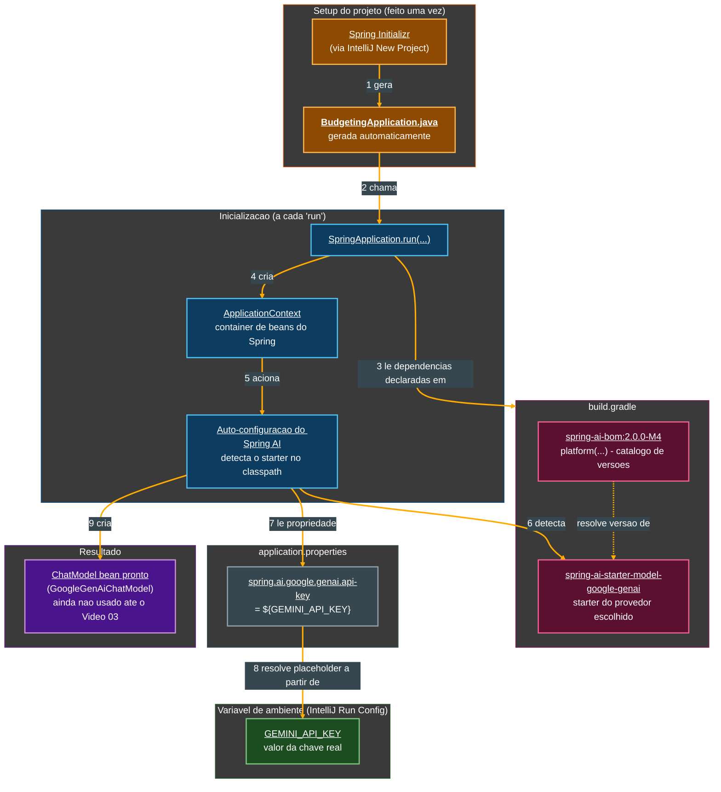
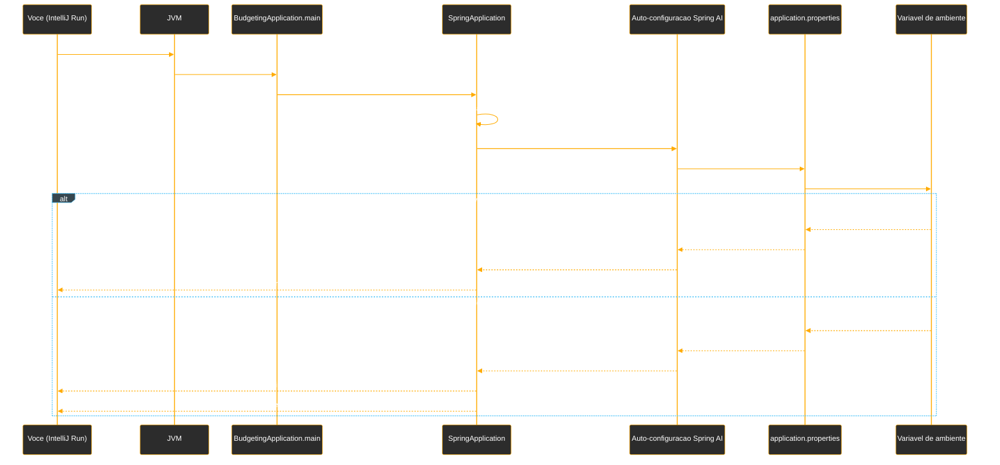

# Tutorial de Estudos — Desenvolvendo sua API Inteligente com Reconhecimento de Fala e Spring Boot

**Do zero à primeira chamada real a uma LLM, com endpoint HTTP funcionando — Vídeos 01 a 03**

- Curso: NTT Data — Jornada Tech (DIO) · Módulo 4 — Curso 5: "Desenvolvendo sua API Inteligente com Reconhecimento de Fala e Spring Boot"
- Instrutor: Thiago Poiani (Principal Engineer at Skip)
- Projeto: `budgeting`
- Documento de referência pessoal — nível iniciante em Java

---

## Sobre este documento

Este tutorial foi criado a partir das anotações de aula (README) e do estado real do projeto `budgeting`, na etapa correspondente ao Vídeo 03. O objetivo é explicar, com riqueza de detalhes e em nível iniciante, cada conceito apresentado e cada configuração feita até agora — o que ela faz, por que foi feita daquela forma, e qual conceito de Java, Spring ou de arquitetura de software ela representa.

Este documento deve ser usado como um mapa: sempre que houver dúvida sobre "por que essa configuração está aqui", deve-se voltar a ele. A ideia é que, relendo este material, consiga-se reconstruir o raciocínio da aula sem precisar assistir ao vídeo novamente.

> **Como este documento está organizado**
> A Parte 1 resume o Vídeo 01, que é inteiramente teórico (introdução ao projeto e ao vocabulário de IA). A Parte 2 cobre o Vídeo 02 — a criação do projeto e a primeira conexão (ainda sem chamadas reais) com um provedor de LLM. A Parte 3, nova nesta versão, cobre o Vídeo 03 — a primeira chamada de verdade ao modelo de linguagem, feita em um teste de integração, e a exposição desse modelo através de um endpoint HTTP. Ao final, há um glossário, um checkpoint fiel do código real do seu projeto (conferido diretamente no `.zip` enviado), uma seção específica sobre pontos em que seu projeto diverge do que o professor mostrou em aula, os próximos passos do curso e diagramas de como tudo se encaixa.
>
> **Nota sobre esta atualização (Vídeo 03):** assim como identificado na Parte 2, seu projeto usa **Google Gemini** em vez de **OpenAI**. Essa divergência se torna visível pela primeira vez *no código*, e não apenas no `build.gradle`/`application.properties`: as classes usadas nos testes e no controller agora são `GoogleGenAiChatModel` e `GoogleGenAiChatOptions`, e não `OpenAiChatModel`/`OpenAiChatOptions` como narrado em aula e registrado no README. A Parte 3 explica o conceito da forma como a aula apresentou (usando os nomes de classe da OpenAI, que é o que aparece na documentação oficial e no raciocínio pedagógico), e a seção de checkpoint mostra fielmente o equivalente real, em Gemini, que está no seu `.zip`.

---

## Parte 1 — Fundamentos e vocabulário de IA (Vídeo 01)

O primeiro vídeo do curso é inteiramente teórico: antes de escrever qualquer configuração, a aula situa o que será construído ao longo do curso e apresenta o vocabulário mínimo de IA que qualquer desenvolvedor Java precisa conhecer para trabalhar com Spring AI. Como isso já está detalhadamente documentado no seu README (com as imagens dos slides), aqui vai um resumo objetivo, na ordem em que os conceitos apareceram.

### 1.1. A proposta do curso: de API tradicional para API por voz

A aula abre contrastando duas formas de construir uma API:

- **Padrão atual (REST tradicional)** — o cliente envia um JSON estruturado, seguindo um contrato fixo (por exemplo, um `POST /companies` com um corpo específico), e a API só funciona se esse contrato for respeitado à risca.
- **Nova era (voz + IA)** — a API passa a "ouvir" um áudio, entender a intenção por trás da fala em linguagem natural, e só então acionar a lógica de negócio — sem exigir que o usuário formate nada como JSON.

Essa mudança de paradigma é resumida no diagrama **"A Nova Anatomia da API"**, que descreve quatro etapas sequenciais:

1. **Áudio → STT (Speech-to-Text)** — a onda sonora é convertida em texto processável.
2. **MCP / Tool Calling (Spring AI)** — o modelo de IA interpreta o texto e decide qual "ferramenta" (função Java) precisa ser acionada.
3. **Java Use Case** — a lógica de negócio real da aplicação Spring Boot é executada.
4. **TTS (Text-to-Speech) → Áudio** — a resposta da aplicação é convertida de volta em voz sintetizada.

> **Por que isso importa para o código?**
> Essas quatro etapas são exatamente o roteiro dos próximos vídeos do curso: primeiro o Spring AI é configurado (Vídeo 02, este tutorial), depois vêm o `ChatModel`/`ChatClient` (Vídeos 03 e 04), o Tool Calling (Vídeo 05), a Transcription API — o "STT" (Vídeo 06) — e a Speech API — o "TTS" (Vídeo 07). Cada peça do diagrama vira, literalmente, um vídeo do curso.

### 1.2. O fluxo de ponta a ponta

O diagrama **"O Novo Fluxo de Interação"** detalha o mesmo caminho de forma mais granular: **Usuário (Microfone) → Transcrição de Áudio → Interpretação de Intenção → Lógica de Domínio (Java) → Geração de Resposta → Usuário**. É o mapa geral para os componentes que serão implementados, um a um, ao longo do curso.

### 1.3. Glossário de IA para desenvolvedores Java

Este é o núcleo conceitual do Vídeo 01 — os termos abaixo aparecem o tempo todo daqui em diante:

- **Linguagem Natural** — texto livre, sem formato fixo, que precisa ser interpretado por um parser/modelo para que sua *intenção* seja extraída. O slide ilustra essa ideia com um método conceitual `decodeIntent(String naturalLanguage)`, que devolve a intenção reconhecida a partir de um texto.
- **Speech-to-Text (STT)** — primeira etapa do pipeline de voz: transforma uma onda sonora não estruturada (ex.: alguém falando "Gastei 50 reais...") em texto processável pela aplicação.
- **Tool Calling** — "a ponte para o domínio": a capacidade de uma IA, a partir de uma intenção interpretada, "chamar" um método Java específico (um *Use Case*) para de fato realizar uma tarefa no mundo real, como salvar um dado no banco.
- **Text-to-Speech (TTS)** — última etapa do pipeline: transforma a resposta da lógica de negócio (por exemplo, um JSON como `{"status": "ok", "response": {"message": "Sua conta foi criada com sucesso."}}`) de volta em uma "Acoustic Waveform" — uma onda de voz sintetizada, devolvida ao usuário.

### 1.4. O estudo de caso: o assistente de *budgeting*

A aula apresenta o projeto que será construído ao longo do curso — batizado, não por acaso, de `budgeting` — descrito no infográfico **"O Assistente de Budgeting: Transformando Voz em Dados Financeiros"**: um sistema onde o usuário simplesmente fala um gasto (ex.: *"Gastei 50 reais no Starbucks agora"*), e a IA se encarrega de todo o resto:

- **Extração de Entidades** — a partir da frase, o sistema identifica automaticamente *Valor* (50 reais), *Local* (Starbucks) e *Data/Hora* (agora).
- **Categorização Automática** — o sistema infere sozinho que "Starbucks" corresponde à categoria "Alimentação/Café", sem que o usuário precise escolher uma categoria manualmente.

O resultado final é um dado estruturado, pronto para ser persistido: `Valor = 50.00`, `Local = Starbucks`, `Data/Hora = Agora (Hoje)`.

> **E o que você vai construir no Vídeo 02?**
> Nada do fluxo de voz ainda. O Vídeo 02 é o primeiro passo puramente técnico: criar o projeto Spring Boot vazio e conectá-lo a um provedor de LLM (modelo de linguagem), usando o Spring AI. É a fundação sobre a qual STT, Tool Calling e TTS serão construídos nos vídeos seguintes.

---

## Parte 2 — Criando o projeto e conectando ao Spring AI (Vídeo 02)

Este é o primeiro vídeo em que alguma configuração de fato é feita. O objetivo do vídeo é sair do zero absoluto e chegar a um projeto Spring Boot que: (1) tem as dependências do Spring AI corretamente resolvidas, (2) sabe qual provedor de LLM (modelo de linguagem) vai usar, e (3) sobe sem erros, comprovando que a chave de API foi lida corretamente — tudo isso **sem ainda existir nenhuma chamada real ao modelo** (isso fica para o Vídeo 03, quando o `ChatModel` é explorado).

### 2.1. O ecossistema Spring AI

Antes de criar o projeto, a aula contextualiza o que é o **Spring AI**: um ecossistema dentro do Spring dedicado a incorporar inteligência artificial em aplicações Java, por meio de um conjunto de APIs e interfaces que facilitam a integração com diferentes *Large Language Models* (LLMs) — entre eles, Anthropic, OpenAI, Microsoft, Amazon, Google e Ollama.

O Spring AI disponibiliza interfaces prontas para vários tipos de modelo — **chat**, **embedding**, **texto para imagem**, **audio transcription** (áudio para texto), **text to speech** (texto para áudio) e **moderação** — além de recursos adicionais como observabilidade, um `ChatClient` (interface que facilita a comunicação com os modelos), integração com bancos de dados de vetor e **tool calling**.

> **Por que isso importa?**
> A ideia central do Spring AI é a **abstração por interface comum**: se um projeto quiser trocar o Gemini pelo OpenAI, por exemplo, não é necessário alterar nenhuma linha do código de negócio — basta trocar a dependência do modelo e o valor de uma propriedade. Essa promessa é justamente o que torna a divergência documentada na seção "Pontos de atenção" (troca de OpenAI por Gemini no seu projeto) tecnicamente simples de resolver, ainda que ela exija atenção.

### 2.2. Revisando três conceitos-chave: prompt, embedding e token

Antes de tocar em código, a aula reforça três termos que aparecem constantemente ao se trabalhar com IA:

- **Prompt** — a entrada que se envia a um modelo, descrevendo o que se deseja que ele faça. É, em essência, "a forma de se comunicar com o modelo".
- **Embedding** — está relacionado a como os dados são salvos/representados numericamente para o modelo (não é o foco deste vídeo).
- **Token** — a unidade de processamento usada pelos modelos para interpretar um texto; de forma geral, quanto maior o texto de entrada (ou de saída), mais tokens ele consome, e isso está diretamente relacionado ao **custo** de uso do modelo.

Também é mencionado o conceito de **respostas estruturadas** — a capacidade do Spring AI de transformar a resposta em texto de um modelo diretamente em um objeto Java — e o de **tool calling**, aprofundado a seguir.

### 2.3. Tool calling, em mais detalhes

Tool calling é a forma de dizer a uma LLM que ela pode ter acesso a dados externos — por exemplo, dados da própria aplicação — através de **ferramentas** (*tools*). Na prática, isso significa: definir uma maneira da LLM consultar informações de usuários, consultar relatórios ou persistir uma informação no banco; informar à LLM quais ferramentas estão disponíveis; e deixar que ela, a partir da intenção interpretada, decida invocar o método Java correto, com os parâmetros corretos.

> **Por que isso é o coração do projeto `budgeting`?**
> É exatamente esse mecanismo que vai permitir que a frase "Gastei 50 reais no Starbucks agora" (Parte 1) resulte em uma chamada real a um método Java que salva essa transação no banco de dados — sem que nenhum JSON estruturado precise ser enviado manualmente pelo usuário.

### 2.4. Criando o projeto Spring Boot no IntelliJ

Com o vocabulário revisado, o instrutor cria o projeto pela tela **New Project** do IntelliJ, usando o gerador integrado do **Spring Initializr** (`start.spring.io`):

- **Name:** `budgeting`
- **Language:** Java
- **JDK:** Eclipse Temurin 25.0.2 (gerenciado localmente pelo **SDKMAN**, uma ferramenta de linha de comando para instalar e alternar entre várias versões do SDK do Java)
- **Packaging:** Jar
- **Configuration:** Properties (ou seja, o arquivo de configuração gerado é `application.properties`, e não `application.yml`)
- **Spring Boot version:** 3.2.5, sem nenhuma dependência inicial marcada — as dependências seriam adicionadas manualmente, conforme necessário

> **O que é o Spring Initializr, afinal?**
> É um gerador de projetos Spring Boot: em vez de montar manualmente toda a estrutura de pastas, o arquivo de build (`build.gradle` ou `pom.xml`) e a classe principal, o Initializr gera tudo isso a partir de um formulário — nome do projeto, linguagem, versão do Java, versão do Spring Boot e dependências desejadas. O IntelliJ tem esse gerador embutido na própria tela de criação de projeto, sem precisar abrir o navegador.

### 2.5. A classe gerada automaticamente: `BudgetingApplication`

Ao concluir o assistente, o Initializr já entrega uma classe principal pronta, criada automaticamente — nenhuma linha dela foi digitada manualmente na aula:

```java
package dio.budgeting;

import org.springframework.boot.SpringApplication;
import org.springframework.boot.autoconfigure.SpringBootApplication;

@SpringBootApplication
public class BudgetingApplication {

    public static void main(String[] args) {
        SpringApplication.run(BudgetingApplication.class, args);
    }

}
```

Como esta é a primeira classe Java deste tutorial, vale explicar cada instrução com calma:

- **`package dio.budgeting;`** — declara em qual "pasta lógica" essa classe vive. Em Java, um pacote organiza classes relacionadas em grupos e evita conflito de nomes entre classes de bibliotecas diferentes. Aqui, `dio` provavelmente representa a organização/curso (DIO), e `budgeting` é o nome do projeto.
- **`import org.springframework.boot.SpringApplication;`** e **`import org.springframework.boot.autoconfigure.SpringBootApplication;`** — a palavra-chave `import` traz uma classe (ou anotação) de outro pacote para ser usada neste arquivo sem precisar escrever o caminho completo toda vez. Aqui, são importadas duas peças do próprio framework Spring Boot.
- **`@SpringBootApplication`** — uma **anotação** (metadado que se anexa a uma classe, método ou campo, entre `@` e um nome) que marca `BudgetingApplication` como o ponto de entrada de uma aplicação Spring Boot. Na prática, essa única anotação combina três comportamentos: (1) liga a **auto-configuração** do Spring Boot, que tenta configurar automaticamente tudo o que estiver no *classpath* (por exemplo, ao detectar a dependência do Spring AI, ele tentará configurar sozinho os beans relacionados a IA); (2) liga o **component scan**, que procura, a partir deste pacote e de todos os seus subpacotes, quaisquer classes que devam virar *beans* gerenciados pelo Spring; (3) permite configurações adicionais específicas da própria classe.
- **`public class BudgetingApplication`** — declara a classe principal da aplicação. `public` significa que ela pode ser acessada de qualquer lugar do projeto (é necessário que seja pública para que a JVM consiga executá-la como ponto de entrada).
- **`public static void main(String[] args)`** — este é o método especial que a JVM (*Java Virtual Machine*) procura para saber por onde começar a executar o programa. Cada palavra tem um papel: `public` (acessível de fora da classe, exigido pela JVM), `static` (pertence à classe em si, e não a um objeto específico — por isso pode ser chamado sem que ninguém precise criar um `new BudgetingApplication()` antes), `void` (não devolve nenhum valor de volta) e `String[] args` (um vetor de textos, usado para receber argumentos passados pela linha de comando ao iniciar a aplicação — por exemplo, `java -jar app.jar --server.port=8081`).
- **`SpringApplication.run(BudgetingApplication.class, args);`** — a linha que efetivamente "liga" a aplicação: inicializa todo o contexto do Spring (o container que gerencia os *beans*), aplica as auto-configurações relevantes, sobe um possível servidor web embutido (não é o caso ainda, já que a dependência web não foi adicionada) e mantém a aplicação rodando. `BudgetingApplication.class` informa qual classe deve ser usada como referência de configuração raiz, e `args` repassa os argumentos de linha de comando recebidos pelo `main`.

> **Por que essa classe já vem pronta, sem eu escrever nada?**
> Diferente do código de domínio que você vai escrever nos próximos vídeos (entidades, repositórios, *use cases*), a classe principal de uma aplicação Spring Boot segue sempre o mesmo formato básico — por isso o Initializr já a gera pronta. O trabalho de configuração começa de verdade no `build.gradle` (próxima seção) e no `application.properties`.

### 2.6. Adicionando o BOM do Spring AI

A primeira dependência adicionada ao `build.gradle` não é uma dependência "normal", mas sim um **BOM** (*Bill of Materials*):

```groovy
dependencies {
    implementation 'org.springframework.boot:spring-boot-starter'
    testImplementation 'org.springframework.boot:spring-boot-starter-test'
    testRuntimeOnly 'org.junit.platform:junit-platform-launcher'

    implementation platform("org.springframework.ai:spring-ai-bom:2.0.0-M4")
}
```

- **`implementation platform("org.springframework.ai:spring-ai-bom:2.0.0-M4")`** — um **BOM** é, na prática, um catálogo (um "dicionário") de várias dependências relacionadas e suas versões corretas, testadas para funcionar em conjunto. A palavra-chave `platform(...)` avisa ao Gradle que essa coordenada não deve ser tratada como uma biblioteca normal a ser baixada e usada diretamente, mas sim como uma **fonte de versões** para as próximas dependências do Spring AI que forem declaradas. É justamente por causa desse BOM que, na próxima seção, a dependência do modelo de IA pode ser declarada **sem informar nenhuma versão** — quem resolve automaticamente qual versão baixar é o BOM.
- **`2.0.0-M4`** — o sufixo `-M4` indica que essa não é uma versão estável (*release*), mas sim a quarta **Milestone** (versão de marco/prévia) rumo à versão `2.0.0`. Na aula, o instrutor explica esse detalhe de versionamento com cuidado: a versão oficialmente estável do Spring AI, no momento da gravação, é a `1.0.0`, que só suporta Spring Boot `3.4` e `3.5`. Já a série `2.0.0` (ainda em milestones, como esta `M4`) é a que passa a suportar o Spring Boot 4 — e é essa a linha usada no projeto, mesmo sem ainda estar 100% estável (o instrutor chega a comentar que, no momento da gravação, havia até um alerta de segurança conhecido nessa versão prévia).

> **Por que usar uma versão ainda instável (`M4`) em vez da estável (`1.0.0`)?**
> Porque o projeto do curso é construído sobre o Spring Boot 4 (mais detalhes na seção "Pontos de atenção" adiante), e a série estável `1.0.0` do Spring AI simplesmente não é compatível com o Spring Boot 4 — apenas com as versões 3.4 e 3.5. Usar a milestone `2.0.0-M4` é a única forma de ter as duas peças (Spring Boot 4 + Spring AI) funcionando juntas antes do lançamento oficial da versão `2.0.0` estável do Spring AI.

### 2.7. Adicionando a dependência do modelo de IA

Com o BOM configurado, a próxima linha adiciona a dependência específica do provedor de modelo que será usado. Na aula, essa dependência é a do **OpenAI**:

```groovy
dependencies {
    implementation 'org.springframework.boot:spring-boot-starter'
    testImplementation 'org.springframework.boot:spring-boot-starter-test'
    testRuntimeOnly 'org.junit.platform:junit-platform-launcher'

    implementation platform("org.springframework.ai:spring-ai-bom:2.0.0-M4")
    implementation 'org.springframework.ai:spring-ai-starter-model-openai'
}
```

- **`implementation 'org.springframework.ai:spring-ai-starter-model-openai'`** — declara a dependência do *starter* (pacote pronto de configuração automática) específico para o modelo da OpenAI. Repare que, diferente de outras dependências Java que você vai ver ao longo do curso, esta linha **não tem número de versão** — quem resolve essa versão é justamente o BOM adicionado na seção anterior. O Spring AI documenta *starters* equivalentes para outros provedores (Google, Microsoft, Ollama, etc.); trocar de provedor, na maior parte dos casos, é trocar apenas esta linha.

> **Por que isso importa?**
> Cada `implementation` no Gradle declara uma dependência de compilação/execução — uma biblioteca externa que o projeto precisa para funcionar. O `spring-ai-starter-model-openai`, especificamente, traz consigo tudo que é necessário para o Spring Boot conseguir, na inicialização, criar automaticamente um *bean* de `ChatModel` conectado à OpenAI — desde que uma chave de API válida seja informada (próxima seção).

### 2.8. Configurando a chave de API no `application.properties`

Com a dependência do modelo adicionada, a aplicação passa a exigir uma credencial para se conectar ao provedor de IA. Na aula, essa credencial é configurada assim:

```properties
spring.application.name=budgeting
spring.ai.openai.api-key=${OPENAI_API_KEY}
```

- **`spring.application.name=budgeting`** — uma propriedade padrão do Spring Boot, que dá um nome legível à aplicação (usado, por exemplo, nos logs de inicialização e em ferramentas de observabilidade).
- **`spring.ai.openai.api-key=${OPENAI_API_KEY}`** — a propriedade específica que o `spring-ai-starter-model-openai` espera para autenticar as chamadas à API da OpenAI. Repare na sintaxe `${OPENAI_API_KEY}`: em vez de colocar o valor da chave diretamente no arquivo, o Spring Boot é instruído a **ler o valor de uma variável de ambiente** chamada `OPENAI_API_KEY` no momento em que a aplicação sobe. Esse mecanismo se chama *placeholder* de propriedade.

> **Por que não colocar a chave direto no arquivo?**
> Segurança. O `application.properties` normalmente é versionado no Git (faz parte do código-fonte do projeto). Se a chave estivesse escrita diretamente ali, qualquer `git push` para um repositório — mesmo privado — correria o risco de vazar a credencial (por exemplo, se o repositório se tornasse público mais tarde, ou fosse compartilhado sem cuidado). Usando `${OPENAI_API_KEY}`, o valor real da chave nunca entra no controle de versão: ele fica apenas na máquina de quem está rodando a aplicação, configurado como variável de ambiente.

Antes dessa propriedade existir, a aplicação falhava ao subir com o seguinte erro, mostrado no README:

```
Caused by: java.lang.IllegalArgumentException: OpenAI API key must be set. Use the connection property: spring.ai.openai.api-key
```

Esse erro é o próprio *starter* do Spring AI validando, na inicialização, que uma chave foi de fato configurada — antes mesmo de tentar fazer qualquer chamada real à OpenAI.

### 2.9. Criando a chave na OpenAI Platform

A aula mostra rapidamente o passo de obter a chave em `platform.openai.com`: criar uma conta (possivelmente com algum crédito gratuito de testes), acessar a seção **API keys**, criar uma nova *secret key* e copiar o valor gerado (ele só é exibido uma vez). No caso do instrutor, foi necessário vincular um cartão de crédito por já não haver mais acesso a créditos gratuitos — um detalhe de contexto que pode ou não se aplicar a cada aluno, dependendo da conta usada.

### 2.10. Definindo a variável de ambiente no IntelliJ

Com a chave em mãos, falta apenas disponibilizá-la como variável de ambiente para a aplicação. A aula mostra duas formas possíveis — definir a variável no sistema operacional, ou definir apenas para a execução daquele projeto específico dentro da IDE — e opta pela segunda:

1. Abrir as **Run/Debug Configurations** da configuração `BudgetingApplication` no IntelliJ.
2. No menu **Add Run Options**, selecionar **Environment variables**.
3. Na janela **Environment Variables**, cadastrar manualmente a variável `OPENAI_API_KEY` com o valor da chave copiada, mantendo marcada a opção **Include system environment variables** (para que, além dessa variável específica, todas as variáveis de ambiente já existentes no sistema operacional continuem disponíveis também).

> **Por que configurar a variável só na IDE, e não no sistema operacional inteiro?**
> Isso evita que a variável fique disponível globalmente em qualquer programa do computador — ela passa a existir apenas no contexto de execução daquele projeto específico, dentro do IntelliJ. É uma forma prática de isolar credenciais por projeto, especialmente útil quando se trabalha em várias aplicações diferentes na mesma máquina.

### 2.11. Subindo a aplicação com sucesso

Com a variável de ambiente configurada, a aplicação é executada novamente através da classe `BudgetingApplication`. O README registra o log de sucesso:

```
:: Spring Boot ::                (v4.0.5)

INFO 1871 --- [budgeting] [           main] dio.budgeting.BudgetingApplication       : Starting BudgetingApplication
INFO 1871 --- [budgeting] [           main] dio.budgeting.BudgetingApplication       : No active profile set, fa...
INFO 1871 --- [budgeting] [           main] dio.budgeting.BudgetingApplication       : Started BudgetingApplicat...

Process finished with exit code 0
```

- **Nenhum erro de `IllegalArgumentException`** — diferente da tentativa anterior (seção 2.8), a chave foi lida corretamente da variável de ambiente, e o *bean* de `ChatModel` da OpenAI foi criado sem reclamar.
- **`Process finished with exit code 0`** — como ainda não existe nenhuma dependência web (`spring-boot-starter-web`) no projeto, a aplicação sobe, inicializa o contexto do Spring, e **encerra sozinha** logo em seguida (não há um servidor esperando requisições, então não há motivo para o processo continuar rodando indefinidamente). Isso é esperado nesta etapa.

Esse resultado comprova que a conexão com o provedor de IA está pronta para ser explorada de fato nos próximos vídeos, quando o Chat API, o Tool Calling, a Transcription API e a Speech API do Spring AI entram em cena.

---

## Parte 3 — Explorando o ChatModel e Modelos de Linguagem (Vídeo 03)

Até o fim do Vídeo 02, o projeto sabia *como* se conectar a um provedor de LLM (a chave de API era lida e um *bean* de `ChatModel` era criado durante a inicialização), mas nenhum código chamava esse modelo de fato — a aplicação apenas subia e encerrava sozinha (seção 2.11). O Vídeo 03 é o primeiro em que uma requisição real é enviada a um modelo de linguagem e uma resposta gerada por IA aparece na tela.

O vídeo tem duas metades bem distintas: a primeira é um mergulho na documentação oficial do Spring AI, explorando as interfaces e classes por trás do `ChatModel`; a segunda é a parte prática, em que um teste de integração e, depois, um endpoint HTTP são criados para efetivamente conversar com o modelo.

### 3.1. A interface `ChatModel`

A documentação do Spring AI (seção *Reference → Models → Chat Models*) define o `ChatModel` como a peça central de integração com uma LLM específica — é através dela que a aplicação "conversa" com o modelo:

```java
public interface ChatModel extends Model<Prompt, ChatResponse>, StreamingChatModel {

    default String call(String message) {...}

    @Override
    ChatResponse call(Prompt prompt);
}
```

- **`public interface ChatModel`** — uma **interface** em Java é um "contrato": ela declara *quais* métodos uma classe deve ter, sem necessariamente dizer *como* eles funcionam por dentro. Qualquer classe que implemente essa interface (como `OpenAiChatModel` ou, no seu caso, `GoogleGenAiChatModel`) é obrigada a fornecer esses métodos, mas cada uma pode implementá-los de um jeito diferente por trás dos panos — é exatamente essa troca de implementação, mantendo o mesmo contrato, que permite trocar de provedor de IA sem reescrever o código de negócio (o ponto já destacado na seção 2.1).
- **`extends Model<Prompt, ChatResponse>, StreamingChatModel`** — em Java, uma interface pode **estender** (herdar de) outra(s) interface(s) com a palavra-chave `extends`. Aqui, `ChatModel` herda de duas interfaces ao mesmo tempo: `Model<Prompt, ChatResponse>` (o contrato mais genérico de "modelo de IA que recebe um `Prompt` e devolve um `ChatResponse`") e `StreamingChatModel` (explicada na próxima seção). Isso significa que qualquer `ChatModel` também é, por definição, um `StreamingChatModel`.
- **`Model<Prompt, ChatResponse>`** — os símbolos `< >` indicam **generics** (tipos genéricos): em vez de a interface `Model` ser escrita para um tipo fixo de entrada/saída, ela recebe esses tipos como "parâmetros", tornando-a reutilizável para outros tipos de modelo (por exemplo, um `EmbeddingModel` usaria tipos diferentes de entrada/saída). Aqui, ela é "especializada" para receber um `Prompt` e devolver um `ChatResponse`.
- **`default String call(String message) {...}`** — um **método `default`** em uma interface é um método que já vem com uma implementação pronta (por isso o `{...}`, omitido aqui apenas por ser detalhe interno da biblioteca), permitindo que classes que implementam a interface o usem sem precisar reescrevê-lo. Esse é o método mais simples de todos: recebe uma `String` (o *prompt*, em texto puro) e devolve outra `String` (a resposta do modelo, também em texto puro) — é a forma mais direta de "conversar" com o modelo, ideal para testes rápidos.
- **`@Override ChatResponse call(Prompt prompt);`** — esta é uma segunda versão do método `call`, agora recebendo um objeto `Prompt` (explicado na seção 3.3) em vez de uma `String` simples, e devolvendo um `ChatResponse` (um objeto mais rico, que carrega não só o texto de resposta, mas também metadados sobre a geração). Ter dois métodos com o mesmo nome (`call`), mas parâmetros diferentes, é um recurso do Java chamado **sobrecarga de método** (*method overloading*) — o compilador decide qual dos dois usar de acordo com o tipo do argumento passado na chamada. A anotação `@Override` aqui indica que esse método está sobrescrevendo uma declaração vinda da interface `Model`, da qual `ChatModel` herda.

> **Por que existem duas formas de chamar o mesmo modelo?**
> O método que recebe/devolve `String` é conveniente para prototipagem e testes simples (é o que será usado primeiro, na seção 3.9). Já o método que recebe um `Prompt` e devolve um `ChatResponse` é o que se usa em aplicações reais, porque permite configurar opções específicas da chamada (modelo, temperatura, formato de resposta — seção 3.3) e acessar metadados da resposta, e não apenas o texto puro.

### 3.2. A interface `StreamingChatModel`

Como `ChatModel` também herda de `StreamingChatModel`, a documentação mostra essa segunda interface logo em seguida:

```java
public interface StreamingChatModel extends StreamingModel<Prompt, ChatResponse> {

    default Flux<String> stream(String message) {...}

    @Override
    Flux<ChatResponse> stream(Prompt prompt);
}
```

- **O que é *streaming*, neste contexto?** Em vez de esperar o modelo terminar de gerar a resposta inteira para só então devolvê-la de uma vez (como faz o `call`), o *streaming* mantém a conexão aberta e vai entregando pedaços da resposta assim que ficam prontos — é o comportamento que se vê, por exemplo, em interfaces de chat onde o texto "vai aparecendo" palavra por palavra, em vez de surgir tudo de uma vez.
- **`Flux<String>`** — `Flux` é um tipo do **Project Reactor** (uma biblioteca de *programação reativa*, usada internamente pelo Spring), que representa um **fluxo assíncrono de zero ou mais valores** ao longo do tempo — neste caso, um fluxo de pedaços de texto (`String`) que vão chegando aos poucos. É diferente de uma `String` comum, que representa um valor único, já pronto, disponível de imediato.
- Assim como em `ChatModel`, existem duas versões sobrecarregadas de `stream`: uma simplificada (recebendo `String`, devolvendo `Flux<String>`) e uma mais completa (recebendo `Prompt`, devolvendo `Flux<ChatResponse>`).

> **Este projeto usa streaming?**
> Ainda não. Até este ponto do curso, tanto o teste de integração quanto o *endpoint* HTTP usam apenas o método `call` (resposta única, de uma vez). A interface `StreamingChatModel` foi apresentada apenas como parte da documentação — o próprio `ChatModel` já a "traz de brinde" por herança —, mas nenhum código do projeto a utiliza nesta etapa.

### 3.3. A classe `Prompt`

A documentação detalha, em seguida, a classe que representa "tudo o que é enviado ao modelo" em uma chamada:

```java
public class Prompt implements ModelRequest<List<Message>> {

    private final List<Message> messages;

    private ChatOptions modelOptions;

    @Override
    public ChatOptions getOptions() {...}

    @Override
    public List<Message> getInstructions() {...}

    // constructors and utility methods omitted
}
```

- **`public class Prompt implements ModelRequest<List<Message>>`** — diferente de uma `interface`, uma `class` já traz implementação concreta. A palavra-chave `implements` indica que `Prompt` cumpre o contrato definido pela interface `ModelRequest<List<Message>>` (ou seja, `Prompt` *é um tipo de* requisição de modelo, cujas instruções são uma lista de `Message`).
- **`private final List<Message> messages;`** — um **campo** (atributo) da classe, do tipo `List<Message>` (uma lista de objetos `Message`, explicados na seção 3.4). `private` significa que esse campo só pode ser acessado de dentro da própria classe `Prompt` (encapsulamento); `final` significa que, uma vez atribuído (normalmente no construtor), esse valor não pode ser trocado por outro depois.
- **`private ChatOptions modelOptions;`** — outro campo, desta vez do tipo `ChatOptions`, que guarda as **opções de configuração** da chamada (qual modelo usar, temperatura, formato de resposta etc. — vistas em detalhe na seção 3.9). Note que este campo não é `final`: ele pode ser definido posteriormente à criação do objeto.
- **`getOptions()`** e **`getInstructions()`** — métodos *getter* (que apenas devolvem o valor de um campo privado, sem alterá-lo), exigidos pela interface `ModelRequest` que `Prompt` implementa. É assim que o restante do Spring AI consegue "perguntar" a um `Prompt` quais são suas mensagens e opções, sem precisar acessar os campos `private` diretamente.

Em resumo: um `Prompt` é o envelope completo enviado ao modelo — dentro dele vai a lista de mensagens da conversa (a próxima seção detalha os tipos possíveis de mensagem) e, opcionalmente, as opções específicas dessa chamada.

### 3.4. O diagrama da *Spring AI Message API*

A documentação também mostra como as mensagens de uma conversa são estruturadas internamente:

- **`Content`** — a classe-base que concentra o conteúdo textual principal e metadados de qualquer pedaço de conteúdo trocado com o modelo.
- **`Message`** e **`MediaContent`** — derivam de `Content`. `Message` representa uma mensagem de texto; `MediaContent` permite anexar mídia (como imagens) a uma mensagem.
- **`AbstractMessage`** — uma classe intermediária, da qual derivam os quatro tipos concretos de mensagem realmente usados em uma conversa:
  - **`SystemMessage`** — instruções de "sistema", que orientam o comportamento geral do modelo (ex.: "responda sempre em português, de forma objetiva").
  - **`UserMessage`** — a mensagem enviada pelo usuário (o *prompt* propriamente dito).
  - **`AssistantMessage`** — a resposta gerada pelo modelo (o "assistente").
  - **`ToolResponseMessage`** — o resultado da execução de uma *tool* (ferramenta), usado no contexto de Tool Calling (seção 2.3), quando o modelo aciona uma função Java e precisa receber o resultado de volta na conversa.
- Cada um desses quatro tipos está associado a um valor do enum `MessageType` (`SYSTEM`, `USER`, `ASSISTANT`, `TOOL`), usado internamente para identificar de que tipo é cada mensagem dentro de uma lista.

> **Por que isso importa, mesmo sem usar essas classes ainda?**
> Nesta etapa do curso, tanto o teste de integração quanto o *endpoint* HTTP enviam apenas uma `String` simples (usando o método `call(String message)`, visto na seção 3.1) — nenhuma dessas classes de mensagem é manipulada diretamente ainda. Só que, por trás dos panos, é exatamente esse mecanismo que o Spring AI usa: quando se chama `call("Oi")`, o próprio framework converte essa `String` em um `UserMessage`, envolve em um `Prompt`, e só então envia ao modelo. Entender essa estrutura desde já facilita muito quando, em vídeos futuros (como o de Tool Calling), for necessário compor mensagens de sistema e lidar com `ToolResponseMessage` manualmente.

### 3.5. Cada provedor tem sua própria página de documentação: o exemplo do DeepSeek

Para reforçar que o `ChatModel` é uma interface comum, mas que cada provedor tem particularidades próprias de configuração, a aula abre a página de referência do **DeepSeek Chat** como exemplo (antes de voltar à OpenAI, o provedor efetivamente usado na aula).

**Chave de API via Spring Expression Language (SpEL):**

```yaml
# In application.yml
spring:
  ai:
    deepseek:
      api-key: ${DEEPSEEK_API_KEY}
```

Essa é exatamente a mesma técnica já usada no seu `application.properties` desde o Vídeo 02 (seção 2.8): a propriedade `api-key` não recebe o valor da chave diretamente no arquivo, mas sim um **placeholder** (`${...}`) que o Spring resolve em tempo de execução, buscando o valor em uma variável de ambiente — apenas escrito aqui em formato `.yml` em vez de `.properties`, como alternativa equivalente.

**Auto-configuração e dependência:**

```groovy
dependencies {
    implementation 'org.springframework.ai:spring-ai-starter-model-deepseek'
}
```

Confirma o padrão de *starter* já visto na seção 2.7: basta adicionar a dependência do provedor desejado (aqui, DeepSeek) para que o Spring Boot auto-configure os *beans* necessários — sem escrever nenhuma linha de código de configuração manual.

**Propriedades de retentativa (*retry*):**

A tabela de propriedades sob o prefixo `spring.ai.retry` mostra como controlar o comportamento da aplicação quando uma chamada ao provedor de IA falha temporariamente: número máximo de tentativas, duração inicial do intervalo entre tentativas (*backoff*), um multiplicador que aumenta esse intervalo a cada nova tentativa (para não sobrecarregar a API do provedor tentando sempre no mesmo ritmo), uma duração máxima para esse intervalo, e se erros de cliente (código HTTP 4xx, como "chave inválida") devem ou não disparar uma nova tentativa (normalmente não, já que tentar de novo com a mesma chave inválida não vai resolver o problema).

**Configuração manual de opções em uma chamada específica:**

```java
ChatResponse response = chatModel.call(
    new Prompt(
        "Generate the names of 5 famous pirates. Please provide the JSON response without any code ...",
        DeepSeekChatOptions.builder()
            .withModel(DeepSeekApi.ChatModel.DEEPSEEK_CHAT.getValue())
            .withTemperature(0.8f)
            .build()
    ));
```

Este exemplo já antecipa o padrão **builder** que será usado na prática, na seção 3.9 — a explicação detalhada desse padrão fica para lá, já aplicada ao código real do projeto.

### 3.6. Voltando à OpenAI: a página de referência efetivamente usada em aula

Depois do exemplo do DeepSeek, a navegação volta para a página de referência do **OpenAI Chat** — o provedor usado na aula (e, no seu projeto, substituído por Gemini, como já registrado na seção "Pontos de atenção").

- **Chave de API:** `spring.ai.openai.api-key`, seguindo exatamente o mesmo padrão de placeholder já visto (`${OPENAI_API_KEY}`).
- **Auto-configuração:** basta a dependência `spring-ai-starter-model-openai` no `build.gradle` (já adicionada desde o Vídeo 02, seção 2.7 — no seu projeto, comentada em favor da dependência do Gemini).
- **Retry:** a mesma estrutura de propriedades `spring.ai.retry.*` vista para o DeepSeek, reforçando que esse é um padrão comum a todos os provedores do Spring AI, e não algo específico de um único modelo.
- **Propriedades específicas do modelo de chat:** `spring.ai.openai.chat.options.model` (aceitando valores como `gpt-4o`, `gpt-4o-mini`, `gpt-4-turbo`, `gpt-3.5-turbo`, com `gpt-4o-mini` como padrão) e `spring.ai.openai.chat.options.temperature` (controlando o quanto a resposta pode "variar"/"criar" em relação ao *prompt* enviado — quanto mais alta a temperatura, mais criativa e menos previsível tende a ser a resposta).

> **O equivalente no seu projeto (Gemini)**
> As propriedades equivalentes usadas de fato no seu `application.properties` são `spring.ai.google.genai.api-key` e `spring.ai.google.genai.chat.options.model` — a estrutura do nome da propriedade segue o mesmo padrão (`spring.ai.<provedor>.chat.options.<opção>`), só trocando o nome do provedor. Isso é justamente a "abstração por interface comum" mencionada na seção 2.1 se manifestando também nas propriedades de configuração, e não apenas nas classes Java.

### 3.7. A visão geral da *AI Model API* e o panorama de implementações

Voltando à página geral da documentação do Spring AI, um diagrama recapitula a hierarquia inteira: as classes-base `Model` e `StreamingModel` dão origem a `ChatModel`, `EmbeddingModel`, `ImageModel`, `StreamingChatModel` e `StreamingSpeechModel` — ou seja, o mesmo `ChatModel` estudado nesta parte é apenas *um* dos vários tipos de modelo que o Spring AI sabe integrar (os outros — embedding, imagem, áudio — aparecerão em vídeos futuros, como o de Transcription API e Speech API).

Em seguida, um diagrama expandido mostra a árvore completa de implementações concretas de `ChatModel` suportadas: OpenAI, Anthropic, Google, Hugging Face, Ollama, Bedrock, Groq, entre muitos outros — todos acessíveis de forma unificada através do `ChatClient` (a interface de mais alto nível mencionada na seção 2.1, que será o tema do Vídeo 04).

> **Fechando a parte conceitual**
> Até aqui, nenhuma linha de código do projeto foi tocada — foi só documentação. A partir da próxima seção, a aula (e este tutorial) migra para a implementação prática: configurar o ambiente de testes do IntelliJ e escrever o primeiro código que efetivamente chama uma LLM.

### 3.8. Preparando o ambiente de testes no IntelliJ

Antes de escrever qualquer teste, é preciso resolver um detalhe prático: a variável de ambiente com a chave de API (configurada na seção 2.10, mas apenas para a *aplicação*) não é herdada automaticamente pelos *testes* — cada execução de teste, no IntelliJ, roda em uma configuração separada.

O caminho seguido em aula, no menu **Run/Debug Configurations** do IntelliJ:

1. **New Configuration → Gradle** — como cada teste executado pelo IntelliJ cria automaticamente uma configuração do tipo *Gradle* (e não *JUnit* diretamente, quando o projeto usa Gradle como ferramenta de build), esse é o tipo de configuração relevante para os testes.
2. **Edit configuration templates...** — em vez de configurar a variável de ambiente em *cada* execução de teste individual (o que seria repetitivo, já que uma nova configuração de Gradle é criada a cada novo teste rodado), a aula edita o **template** de configuração Gradle. Um *template*, no IntelliJ, é o "molde padrão" usado sempre que uma nova configuração daquele tipo é criada automaticamente.
3. **Adicionar a variável de ambiente no template**, mantendo marcada a opção "Include system environment variables" (que garante que as demais variáveis do sistema operacional continuem disponíveis, além da nova variável adicionada manualmente).

> **Por que fazer isso no template, e não em cada configuração individual?**
> Porque, a partir desse ponto, **todo novo teste** criado no projeto (e o curso vai criar vários, ao longo dos próximos vídeos) já nasce com a variável de ambiente da chave de API disponível automaticamente, sem esforço manual repetido. É uma configuração feita uma única vez que economiza trabalho durante todo o restante do curso.
>
> **No seu projeto:** a variável relevante é `GEMINI_API_KEY` (e não `OPENAI_API_KEY`, como mostrado em aula) — lembrando da divergência de provedor já documentada. Se o template do IntelliJ tiver sido configurado com o nome usado em aula, os testes do seu projeto vão falhar por não encontrar `GEMINI_API_KEY` definida.

### 3.9. Criando o primeiro teste de integração com o Chat Model

Com o ambiente pronto, a aula cria a primeira classe de teste, evoluindo-a em etapas. Como o teste depende de uma chamada real à internet (para o provedor de IA) e do consumo de créditos/cota da API, a aula usa uma convenção de nomenclatura e uma anotação para controlar quando ele deve rodar.

**Passo 1 — nome da classe e anotações de controle:**

```java
import org.junit.jupiter.api.Test;
import org.junit.jupiter.api.condition.EnabledIfEnvironmentVariable;
import org.springframework.boot.test.context.SpringBootTest;

@SpringBootTest
@EnabledIfEnvironmentVariable(named = "OPENAI_API_KEY", matches = ".+")
public class OpenAiChatModelIT {

    @Test
    void should_receiveResponse_when_chatModelIsCalled() {

    }
}
```

- **Sufixo `IT` no nome da classe (`OpenAiChatModelIT`)** — "IT" é a abreviação de *Integration Test* (teste de integração). Diferente de um teste unitário comum (que testa uma única unidade de código isolada, sem depender de sistemas externos), um **teste de integração** verifica se partes diferentes do sistema — neste caso, a aplicação e a API real de um provedor de IA — funcionam corretamente *juntas*. Usar esse sufixo por convenção permite, em ferramentas de build mais avançadas, configurar o processo de build para rodar testes de integração separadamente dos testes unitários (por exemplo, pulando os testes de integração — mais lentos e dependentes de rede — em builds rápidos de verificação).
- **`@SpringBootTest`** — já vista na seção 2.11 do checkpoint anterior: sobe o contexto completo do Spring antes de rodar o teste.
- **`@EnabledIfEnvironmentVariable(named = "OPENAI_API_KEY", matches = ".+")`** — uma anotação do **JUnit 5** que condiciona a *execução* do teste inteiro à existência de uma variável de ambiente. `named` indica o nome da variável a verificar; `matches = ".+"` é uma **expressão regular** que significa "um ou mais caracteres quaisquer" — ou seja, "a variável precisa existir e não pode estar vazia". Se a variável não estiver definida (ou estiver vazia), o teste é simplesmente **pulado** (não roda, e não conta como falha) em vez de dar erro. Essa é uma prática comum para testes que dependem de credenciais sensíveis: eles só rodam em máquinas/ambientes onde a credencial de fato existe, evitando que o build quebre para quem não tem acesso à chave.
- **`@Test`** e o método `should_receiveResponse_when_chatModelIsCalled()`** — o nome do método segue um padrão comum de nomenclatura de testes (`should_<resultado esperado>_when_<condição>`), que torna o próprio nome do teste uma descrição legível do que está sendo verificado.

**Passo 2 — injetando o `OpenAiApi` e construindo o `ChatModel` manualmente com o padrão *builder*:**

```java
@Autowired
OpenAiApi openAiApi;

@Test
void should_receiveResponse_when_chatModelIsCalled() {
    var chatModel = OpenAiChatModel.builder()
            .openAiApi(openAiApi)
            .build();
}
```

- **`@Autowired`** — a anotação do Spring que pede para o *container* (o `ApplicationContext`, visto na seção 2.5) **injetar** automaticamente uma instância pronta de um *bean*, em vez de o próprio código precisar criá-la manualmente com `new`. Aqui, é pedido um `OpenAiApi` — uma classe de baixo nível do Spring AI, responsável pelos detalhes de comunicação HTTP com a API da OpenAI (URL base, cabeçalhos, endpoint de *completions* etc.). Graças à **auto-configuração** (conceito já visto na seção 2.5), o Spring Boot já sabe montar essa classe sozinho, usando as propriedades do `application.properties` — nada disso precisa ser escrito manualmente.
- **`var chatModel = ...`** — a palavra-chave `var` (introduzida no Java 10) permite declarar uma variável **sem escrever explicitamente seu tipo**, deixando o compilador inferir esse tipo a partir do valor atribuído. É diferente de uma linguagem sem tipagem: o tipo continua existindo e sendo verificado em tempo de compilação, apenas não precisa ser digitado — aqui, o compilador sabe que `chatModel` é do tipo que o `.build()` do builder devolve.
- **`OpenAiChatModel.builder()`** — o **padrão *builder*** (*builder pattern*) é um padrão de projeto de software usado para construir objetos complexos passo a passo, de forma legível, em vez de um construtor único com muitos parâmetros posicionais (o que seria confuso e sujeito a erro, especialmente com parâmetros opcionais). Um builder normalmente funciona assim: chama-se um método estático (`builder()`) que devolve um objeto "montador"; cada método desse objeto (como `.openAiApi(...)`) configura *uma* propriedade e devolve o próprio montador de volta (permitindo encadear várias chamadas, uma após a outra); por fim, um método `.build()` monta e devolve o objeto final já pronto e configurado.
- **`.openAiApi(openAiApi)`** — um dos métodos do builder, que recebe a instância de `OpenAiApi` (injetada pelo Spring, acima) e a "encaixa" na construção do `ChatModel`.
- **`.build()`** — finaliza a construção e devolve a instância pronta de `OpenAiChatModel`.

**Passo 3 — configurando as opções do chat (modelo, temperatura, formato de resposta) com um segundo builder:**

```java
var options = OpenAiChatOptions.builder()
        .model("gpt-4o-mini")
        .temperature(0.8)
        .responseFormat(ResponseFormat.builder().type(ResponseFormat.Type.TEXT).build())
        .build();

var chatModel = OpenAiChatModel.builder()
        .openAiApi(openAiApi)
        .defaultOptions(options)
        .build();
```

- **`OpenAiChatOptions.builder()`** — o mesmo padrão builder, agora usado para montar um objeto `ChatOptions` (mencionado na seção 3.3, como parte de um `Prompt`) específico da OpenAI, com três configurações:
  - **`.model("gpt-4o-mini")`** — qual variante do modelo de linguagem usar. Modelos diferentes têm custo, velocidade e capacidade diferentes; `gpt-4o-mini` é uma versão mais enxuta e barata, adequada para prototipagem.
  - **`.temperature(0.8)`** — um número (geralmente entre `0` e `2`, dependendo do provedor) que controla a aleatoriedade/criatividade da resposta. Valores mais baixos tendem a gerar respostas mais previsíveis e repetitivas; valores mais altos, respostas mais variadas e "criativas" — mas também mais imprevisíveis.
  - **`.responseFormat(ResponseFormat.builder().type(ResponseFormat.Type.TEXT).build())`** — repare que aqui existe um **builder dentro de outro builder**: primeiro se constrói um `ResponseFormat` (definindo `Type.TEXT`, ou seja, "quero a resposta como texto simples, sem formatação especial"), e o resultado já pronto é passado como argumento para `.responseFormat(...)` do builder de `OpenAiChatOptions`.
- **`.defaultOptions(options)`** — no builder do `OpenAiChatModel`, esse método recebe o objeto `options` recém-construído e o define como as opções **padrão**, usadas sempre que uma chamada não especificar opções próprias diferentes.

**Passo 4 — a alternativa via `application.properties` (sem necessidade de construir nada manualmente):**

```properties
spring.application.name=budgeting
spring.ai.openai.api-key=${OPENAI_API_KEY}
spring.ai.openai.chat.options.model=gpt-4o-mini
spring.ai.openai.chat.options.temperature=0.8
spring.ai.openai.chat.options.response-format.type=TEXT
```

A aula demonstra que tudo o que foi feito manualmente no Passo 3 poderia, em vez disso, ser declarado como propriedades no `application.properties` — e, nesse caso, o próprio Spring Boot já entregaria um `OpenAiChatModel` **totalmente configurado e pronto para injeção**, sem precisar de nenhum builder manual no código do teste:

```java
@Autowired
OpenAiApi openAiApi;

@Autowired
OpenAiChatModel chatModel;
```

> **Quando vale a pena construir manualmente, então?**
> A aula explica que a construção manual (Passos 2 e 3) é mais útil quando se precisa de **múltiplas instâncias diferentes** de chat model na mesma aplicação — por exemplo, dois `ChatModel`s do mesmo provedor com opções distintas, ou até modelos de provedores diferentes (OpenAI e Gemini, coexistindo). Quando existe apenas **uma** configuração de chat na aplicação inteira, a auto-configuração via `application.properties` (Passo 4) é mais simples e direta.

**Passo 5 — a chamada real ao modelo e a validação da resposta:**

```java
var response = chatModel.call("Gere um registro de budgeting, com descrição de gasto, valor em reais e local");

assertThat(response).isNotEmpty();
System.out.println(response);
```

- **`chatModel.call("...")`** — finalmente, a chamada de fato ao modelo de linguagem, usando o método mais simples visto na seção 3.1 (`call(String message)`): envia o texto do *prompt* e recebe de volta a resposta gerada pela LLM, já como `String`.
- **`assertThat(response).isNotEmpty();`** — uma **asserção** (verificação que faz o teste falhar se a condição não for atendida) usando a biblioteca **AssertJ**, que oferece uma API fluente e mais legível do que as asserções tradicionais do JUnit (como `assertTrue(...)`). `assertThat(response)` "envolve" o valor a ser verificado, e `.isNotEmpty()` verifica que a `String` não está vazia — ou seja, que o modelo de fato devolveu algum texto como resposta.
- **`System.out.println(response);`** — imprime a resposta completa no console, apenas para inspeção visual durante o desenvolvimento (não faz parte da verificação automatizada do teste).

Ao rodar o teste com a variável de ambiente corretamente configurada, a resposta gerada pela LLM aparece no console — no exemplo da aula, um registro de gastos fictício (almoço com amigos, supermercado, combustível, cinema, roupas, conta de luz e internet), cada um com descrição, valor e local, exatamente como pedido no *prompt*.

### 3.10. Expondo o Chat Model através de um endpoint HTTP

Com a integração validada em teste, a segunda metade prática do vídeo expõe esse mesmo `ChatModel` através de uma API REST simples.

**Passo 1 — adicionando a dependência web:**

```groovy
dependencies {
    implementation 'org.springframework.boot:spring-boot-starter'
    testImplementation 'org.springframework.boot:spring-boot-starter-test'
    testRuntimeOnly 'org.junit.platform:junit-platform-launcher'

    implementation platform("org.springframework.ai:spring-ai-bom:2.0.0-M4")
    implementation 'org.springframework.ai:spring-ai-starter-model-openai'

    implementation 'org.springframework.boot:spring-boot-starter-web'
}
```

- **`spring-boot-starter-web`** — este *starter* traz tudo o que é necessário para transformar a aplicação em um servidor HTTP: um servidor **Tomcat embutido** (ou seja, não é preciso instalar/configurar um servidor de aplicação separado — ele já roda dentro do próprio processo Java), o **Spring MVC** (o framework de controllers REST do Spring) e as bibliotecas de serialização JSON necessárias. É essa dependência que faz a diferença entre a aplicação encerrar sozinha após subir (como visto na seção 2.11, sem `starter-web`) e a aplicação ficar rodando, esperando requisições HTTP.

**Passo 2 — o `ChatModelController`:**

```java
@RestController
@RequestMapping("/api")
public class ChatModelController {

    private final OpenAiChatModel openAiChatModel;

    public ChatModelController(OpenAiChatModel openAiChatModel) {
        this.openAiChatModel = openAiChatModel;
    }

    @GetMapping("/chat-model")
    String chat(String prompt) {
        return this.openAiChatModel.call(prompt);
    }
}
```

- **`@RestController`** — uma anotação do Spring MVC que marca a classe como um **controller REST**: uma classe cujos métodos respondem a requisições HTTP e devolvem os dados diretamente no corpo da resposta (normalmente serializados como JSON ou, como neste caso simples, como texto puro), em vez de renderizar uma página HTML. Por trás dos panos, `@RestController` combina duas outras anotações: `@Controller` (registra a classe como um componente gerenciado pelo Spring, capaz de lidar com requisições web) e `@ResponseBody` (aplicado automaticamente a todos os métodos, dizendo ao Spring para devolver o valor de retorno diretamente no corpo da resposta HTTP).
- **`@RequestMapping("/api")`** — define um **prefixo de caminho (URL)** comum a todos os endpoints declarados dentro dessa classe. Qualquer `@GetMapping`, `@PostMapping` etc. definido nesta classe terá `/api` automaticamente na frente do seu próprio caminho.
- **`private final OpenAiChatModel openAiChatModel;`** — um campo que guarda a referência ao chat model que será usado por este controller. `final` garante que, uma vez atribuído no construtor, essa referência não pode ser trocada depois.
- **`public ChatModelController(OpenAiChatModel openAiChatModel) { this.openAiChatModel = openAiChatModel; }`** — este é o **construtor** da classe, e o Spring o usa para fazer **injeção de dependência via construtor**: como só existe um construtor nesta classe, o Spring automaticamente resolve o parâmetro `openAiChatModel` procurando um *bean* compatível no `ApplicationContext` (o mesmo `OpenAiChatModel` já auto-configurado, visto na seção 3.9) e o passa aqui, sem necessidade da anotação explícita `@Autowired` (que só é obrigatória quando existe mais de um construtor, ou em campos/métodos fora de um construtor). É o mesmo princípio de injeção de dependência usado no teste (seção 3.9), agora aplicado à camada web.
- **`@GetMapping("/chat-model")`** — mapeia este método para responder a requisições HTTP do tipo **GET** no caminho `/api/chat-model` (o prefixo `/api` vem da classe, somado a `/chat-model` deste método).
- **`String chat(String prompt)`** — o parâmetro `prompt`, por convenção do Spring MVC, é automaticamente preenchido a partir de um **parâmetro de *query string*** da URL com o mesmo nome (por exemplo, `?prompt=Oi`) — não é necessário nenhuma anotação adicional para isso funcionar em casos simples como este.
- **`return this.openAiChatModel.call(prompt);`** — repassa o texto recebido diretamente para o chat model (o mesmo método `call(String)` já visto no teste) e devolve a resposta da LLM como o corpo da resposta HTTP.

**Passo 3 — testando o endpoint:**

Com a aplicação em execução, uma requisição é enviada usando a ferramenta **HTTP Client** do IntelliJ (que detecta automaticamente o endpoint criado no controller):

```http
GET http://localhost:8080/api/chat-model?prompt=Oi
```

O servidor responde com código HTTP `200` (sucesso) e o corpo da resposta contém o texto gerado pela LLM — no exemplo da aula, algo como "Oi! Como posso ajudar você hoje?".

> **O fluxo completo, de ponta a ponta**
> A requisição HTTP chega ao `ChatModelController`; o Spring extrai o parâmetro `prompt` da URL; o controller repassa esse texto ao `ChatModel`, já injetado e configurado pela auto-configuração (a partir das propriedades do `application.properties`); o `ChatModel` faz a chamada de rede real ao provedor de IA; a resposta em texto retorna pela mesma cadeia até o cliente HTTP. Esse é o primeiro ciclo completo do projeto: requisição → lógica → IA → resposta.
>
> Na aula, esse fluxo hesitou uma vez: ao mover a `temperature` para `spring.ai.openai.chat.options.temperature=0.8` no `application.properties` (Passo 4 da seção 3.9) e reiniciar a aplicação, o endpoint retornou um erro informando que o valor `0.8` de temperatura não era suportado para o modelo em uso — o que levou o instrutor a remover essa propriedade e manter o valor padrão do provedor. É um lembrete prático de que, embora o Spring AI padronize *como* configurar as opções, os valores aceitos em cada uma (como a faixa válida de temperatura) ainda dependem das regras específicas de cada modelo/provedor.

---

## Pontos de atenção: divergências entre a aula e o seu projeto

Comparando, linha a linha, o que está no seu `.zip` com o que a aula e o README descrevem, foram encontradas divergências relevantes — a mais importante delas muda, inclusive, qual provedor de IA sua aplicação está usando de fato:

1. **Provedor de modelo: OpenAI (aula) × Google Gemini (seu projeto) — divergência mais importante.** No seu `build.gradle` real, a dependência do OpenAI está **comentada**, e no lugar dela existe uma dependência ativa para o Gemini:

   ```groovy
   //  implementation 'org.springframework.ai:spring-ai-starter-model-openai'
   implementation 'org.springframework.ai:spring-ai-starter-model-google-genai'
   ```

   Da mesma forma, no seu `application.properties`, a propriedade da OpenAI também está comentada, e a propriedade ativa é a do Gemini, apontando para uma variável de ambiente **diferente** da usada em aula:

   ```properties
   #spring.ai.openai.api-key=${OPENAI_API_KEY}
   spring.ai.google.genai.api-key=${GEMINI_API_KEY}
   ```

   **Impacto prático:** nenhum erro de compilação ou de inicialização — o Spring AI foi desenhado justamente para permitir essa troca de provedor "só mudando a dependência e a propriedade", como a própria aula explica na Parte 2.1 deste tutorial. Mas isso significa que, se você seguir os próximos vídeos do curso *literalmente* (que provavelmente vão continuar usando exemplos com `OpenAiChatModel`/`spring.ai.openai...`), vai precisar adaptar cada trecho para as classes e propriedades equivalentes do Google GenAI (`GoogleGenAiChatModel` e `spring.ai.google.genai...`). Além disso, sua variável de ambiente precisa se chamar `GEMINI_API_KEY` (e não `OPENAI_API_KEY`) na configuração de execução do IntelliJ — se você seguiu a seção 2.10 deste tutorial usando o nome do vídeo, a aplicação vai voltar a falhar com um erro equivalente ao mostrado na seção 2.8, só que reclamando da chave do Gemini em vez da OpenAI.

   > **Recomendação:** não é necessário desfazer essa troca — usar o Gemini é uma escolha legítima e o próprio Spring AI foi construído para suportar isso. Mas vale deixar **documentado para você mesmo**, já nesta etapa, que seu projeto usa Gemini, para não se confundir quando os próximos vídeos mostrarem exemplos de código com `spring.ai.openai...` na tela. Sempre que um vídeo futuro citar uma propriedade ou classe com `openai` no nome, o equivalente no seu projeto provavelmente terá `google.genai` no lugar.

2. **Versão do Java: 25 (aula) × 21 (seu projeto).** O README e a fala do instrutor mencionam explicitamente o Java 25 (JDK "Eclipse Temurin 25.0.2", gerenciado via SDKMAN), e o `build.gradle` mostrado na tela confirma `languageVersion = JavaLanguageVersion.of(25)`. No seu `build.gradle` real, porém, o `toolchain` está configurado para a versão 21:

   ```groovy
   java {
       toolchain {
           languageVersion = JavaLanguageVersion.of(21)
       }
   }
   ```

   **Impacto prático:** nenhum, para o código escrito até aqui — nada no Vídeo 02 usa qualquer recurso exclusivo do Java 25. O Java 21 é uma versão **LTS** (*Long-Term Support*, com suporte estendido por mais tempo), o que é, inclusive, uma escolha comum e prudente para projetos reais, já que o Java 25 é uma versão mais recente e com um ciclo de suporte mais curto.

   > **Recomendação:** mantenha o Java 21 se a intenção for priorizar estabilidade. Fique apenas atento(a) a vídeos futuros do curso que eventualmente demonstrem alguma sintaxe exclusiva de versões mais novas do Java (o que é pouco provável neste curso, focado em Spring AI, mas vale o alerta).

3. **Versão do Spring Boot no banner do log: `v4.0.5` (README) × `4.1.0` (seu `build.gradle`).** O trecho de log reproduzido no README mostra o banner `:: Spring Boot ::  (v4.0.5)`, enquanto o plugin declarado no seu `build.gradle` é a versão `4.1.0`:

   ```groovy
   id 'org.springframework.boot' version '4.1.0'
   ```

   **Impacto prático:** nenhum problema funcional — ambas são versões da série 4.x do Spring Boot, e essa pequena diferença de versão de *patch* (4.0.5 → 4.1.0) é natural entre o momento em que a aula foi gravada e o momento em que você criou seu projeto, já que novas versões de manutenção são lançadas com frequência. Vale apenas registrar que o número exato que vai aparecer no seu console, ao rodar a aplicação, será `4.1.0`, e não `4.0.5` como no README.

4. **Fala inicial do instrutor sobre "Spring Boot 3.2.5" × todo o restante da aula (Spring Boot 4).** No início do vídeo (ao criar o projeto), o instrutor menciona "vamos seguir com a 3.2.5" como a versão do Spring Boot escolhida no assistente do IntelliJ; minutos depois, ao comentar sobre a versão do Spring AI, ele afirma claramente que está "desenvolvendo a ferramenta utilizando Spring Boot 4". O `build.gradle` mostrado na tela (e o seu, no `.zip`) confirmam a versão 4.x sendo efetivamente usada.

   **Impacto prático:** nenhum no seu projeto — é apenas uma inconsistência dentro da própria fala do instrutor (provavelmente um lapso ao mencionar uma versão "padrão" do assistente antes de trocá-la manualmente). Fica o registro para você não se confundir ao rever a aula: o que vale é o que está escrito no `build.gradle`, não a primeira versão falada.

5. **Classes e propriedades: `OpenAiChatModel`/`spring.ai.openai...` (aula) × `GoogleGenAiChatModel`/`spring.ai.google.genai...` (seu projeto) — o item 1 se confirma na prática.** Como já previsto na versão anterior deste tutorial, a divergência de provedor identificada no Vídeo 02 aparece agora, de fato, no código escrito no Vídeo 03. No seu `.zip`, os testes de integração e o controller usam:

   ```java
   import org.springframework.ai.google.genai.GoogleGenAiChatModel;
   import org.springframework.ai.google.genai.GoogleGenAiChatOptions;
   ```

   em vez de `org.springframework.ai.openai.OpenAiChatModel` / `OpenAiChatOptions`, mostrados na aula e registrados no README. O método usado para chamar o modelo (`.call(...)`) e o padrão builder (`GoogleGenAiChatOptions.builder()...build()`) são idênticos em estrutura — o que muda é só o nome das classes e do pacote (`org.springframework.ai.google.genai` em vez de `org.springframework.ai.openai`).

   **Impacto prático:** nenhum, desde que a substituição de nomes seja feita de forma consistente — é exatamente por isso que a Parte 3 deste tutorial explica os conceitos com os nomes de classe da OpenAI (como aparecem na aula e na documentação oficial), enquanto a seção de checkpoint, adiante, mostra o código real do seu projeto, já em Gemini.

6. **Nome e organização dos arquivos de teste: uma classe evolutiva, comentada por etapas (aula) × dois arquivos de teste separados (seu projeto).** Na aula, o instrutor evolui uma **única** classe (`OpenAiChatModelIT`), comentando trechos de código à medida que troca a abordagem manual pela configuração via `application.properties` (seção 3.9, Passo 4). No seu `.zip`, em vez disso, existem **dois arquivos de teste independentes**, sem nenhum trecho comentado:

   - `GeminiChatModelITVer1.java` — a versão mais simples, que apenas injeta o `GoogleGenAiChatModel` já pronto via `@Autowired` e chama `.call("Olá, como você está?")` diretamente, sem configurar nenhuma opção manualmente. Corresponde ao resultado final da abordagem "Passo 4" da seção 3.9 (tudo via `application.properties` + injeção direta).
   - `GeminiChatModelIT.java` — a versão mais completa, que constrói manualmente um `GoogleGenAiChatOptions` (definindo `model`, `temperature` e `responseMimeType`) e o passa dentro de um `new Prompt(texto, options)` para `chatModel.call(...)`, que aqui devolve um `ChatResponse` (e não uma `String` direta) — a resposta de texto é extraída com `.getResult().getOutput().getText()`. Corresponde à abordagem manual do "Passo 3" da seção 3.9.

   **Impacto prático:** nenhum funcional — as duas formas testam, cada uma à sua maneira, a mesma integração com o Gemini. É apenas uma escolha de organização diferente da usada em aula (dois arquivos permanentes em vez de um arquivo com histórico comentado), o que, inclusive, é uma prática comum e válida: manter os dois exemplos como referências completas e executáveis, em vez de código morto comentado.

7. **Asserção: `assertTrue(...)` (JUnit, mencionado na aula) × `assertThat(...).isNotEmpty()` (AssertJ, seu projeto).** A explicação falada da aula (e a transcrição) menciona um `assertTrue` simples; tanto o README quanto o seu código real usam a sintaxe fluente do **AssertJ** (`assertThat(...)`), uma biblioteca de asserções mais expressiva, já trazida por padrão pelo `spring-boot-starter-test`.

   **Impacto prático:** nenhum — são apenas duas bibliotecas de asserção diferentes verificando essencialmente a mesma coisa (que a resposta não está vazia). AssertJ tende a produzir mensagens de erro mais legíveis quando um teste falha, e é a opção já usada no seu projeto.

8. **Propriedade `temperature` no `application.properties`: presente na narrativa da aula × ausente no seu `application.properties` real.** Na aula, a propriedade `spring.ai.openai.chat.options.temperature=0.8` chega a ser adicionada ao arquivo de propriedades (seção 3.9, Passo 4) e, em seguida, causa um erro ao subir a aplicação ("temperatura não suportada para esse modelo" — nota da seção 3.10), levando o instrutor a removê-la. No seu `application.properties` real, **apenas** a propriedade de modelo foi mantida:

   ```properties
   spring.ai.google.genai.chat.options.model=gemini-3-flash-preview
   ```

   Não há nenhuma propriedade de `temperature` ou de formato de resposta (`response-format`/`response-mime-type`) no arquivo — essas opções, no seu projeto, só aparecem configuradas manualmente dentro do teste `GeminiChatModelIT.java` (via builder, seção 3.9/6 acima), e não como propriedade global da aplicação.

   **Impacto prático:** nenhum — é coerente com o próprio desfecho da aula, que também abandonou a configuração de `temperature` via propriedades por causa do erro de compatibilidade. Vale só o registro para não estranhar, ao comparar com o README, a ausência dessas linhas no seu arquivo real.

---

## Glossário de conceitos Java, Spring e IA usados até aqui

Uma referência rápida, por bloco temático, de todos os conceitos técnicos que apareceram nos Vídeos 01 e 02. Use como consulta sempre que esquecer o que um termo significa.

### Estrutura da linguagem Java

| Termo | Significado |
|---|---|
| `package` | Declara em qual "pasta lógica" uma classe vive; organiza o código em grupos relacionados e evita conflito de nomes entre classes. |
| `import` | Traz uma classe (ou anotação) de outro pacote para ser usada no arquivo atual sem escrever o caminho completo. |
| `class` | Um molde que descreve os dados (atributos) e comportamentos (métodos) de um tipo de objeto. |
| anotação (`@Algo`) | Um metadado que se anexa a uma classe, método ou campo, mudando seu comportamento ou fornecendo informação extra para frameworks como o Spring, sem alterar diretamente a lógica escrita. |
| `public` | Modificador de acesso: torna uma classe, método ou campo acessível de qualquer lugar do projeto (e, no caso de uma classe, exigido pela JVM para pontos de entrada como o `main`). |
| `static` | Indica que um método ou campo pertence à classe em si, e não a um objeto específico — pode ser chamado sem que ninguém precise criar uma instância (`new`) antes. |
| `void` | Indica que um método não devolve nenhum valor de volta para quem o chamou. |
| `main(String[] args)` | Método especial que a JVM procura para saber por onde começar a executar um programa Java; `args` é um vetor com os argumentos passados pela linha de comando. |
| comentário (`//`) | Texto ignorado pelo compilador/interpretador, usado para anotações do desenvolvedor no meio do código (aparece tanto em Java quanto na sintaxe Groovy do `build.gradle`). |
| `interface` | Um "contrato" que declara quais métodos uma classe deve fornecer, sem obrigatoriamente dizer como eles funcionam por dentro; permite trocar a implementação concreta sem alterar quem depende do contrato. |
| `extends` (em interfaces) | Palavra-chave usada para uma interface herdar de outra(s), incorporando seus métodos ao próprio contrato. |
| `implements` | Palavra-chave usada por uma classe para declarar que ela cumpre o contrato de uma interface, fornecendo implementações concretas para os métodos declarados nela. |
| Generics (`<T>`, `<Prompt, ChatResponse>` etc.) | Recurso do Java que permite escrever classes/interfaces reutilizáveis para diferentes tipos, definidos como "parâmetros" entre `< >`, em vez de fixar um único tipo de entrada/saída. |
| Método `default` (em interface) | Um método declarado dentro de uma interface que já vem com uma implementação pronta, podendo ser usado diretamente por qualquer classe que implemente essa interface, sem precisar reescrevê-lo. |
| Sobrecarga de método (*overloading*) | Ter dois ou mais métodos com o mesmo nome na mesma classe/interface, diferenciados pelos tipos (ou quantidade) de parâmetros; o compilador escolhe qual usar de acordo com o que é passado na chamada. |
| `var` | Palavra-chave (desde o Java 10) que permite declarar uma variável sem escrever seu tipo explicitamente, deixando o compilador inferi-lo a partir do valor atribuído; o tipo continua existindo e sendo verificado em tempo de compilação. |
| Construtor | Um método especial de uma classe, com o mesmo nome dela, usado para inicializar um novo objeto — no Spring, quando uma classe tem um único construtor, ele também é usado automaticamente para injeção de dependência. |
| Padrão builder (*builder pattern*) | Padrão de projeto de software para construir objetos complexos passo a passo, de forma legível: um método `builder()` devolve um "montador", cada método desse montador configura uma propriedade e devolve o próprio montador (permitindo encadear chamadas), e um `.build()` final monta e devolve o objeto pronto. |

### Anotações, bibliotecas e o Spring

| Termo | Significado |
|---|---|
| `@SpringBootApplication` | Anotação que marca a classe principal de uma aplicação Spring Boot; liga a auto-configuração, o *component scan* e permite configurações adicionais, tudo de uma vez. |
| `SpringApplication.run(...)` | Método que efetivamente inicializa o contexto do Spring (o container de *beans*), aplica as auto-configurações e sobe a aplicação. |
| Bean | Um objeto cuja criação e ciclo de vida são gerenciados pelo próprio Spring (em vez de ser criado manualmente com `new` pelo desenvolvedor). |
| ApplicationContext | O "container" central do Spring, responsável por criar, configurar e gerenciar todos os *beans* de uma aplicação. |
| Auto-configuração (*auto-configuration*) | Mecanismo do Spring Boot que tenta configurar automaticamente componentes (como um `ChatModel`) com base apenas nas dependências presentes no *classpath*, dispensando configuração manual explícita na maioria dos casos. |
| *Starter* | Um tipo de dependência do Spring Boot que agrupa, em um único artefato, tudo o que é necessário para habilitar uma funcionalidade específica (ex.: `spring-ai-starter-model-openai` traz tudo que é preciso para conversar com a OpenAI). |
| Placeholder de propriedade (`${VARIAVEL}`) | Sintaxe usada em arquivos `.properties`/`.yml` do Spring para que um valor seja resolvido em tempo de execução a partir de outra fonte — normalmente, uma variável de ambiente. |
| Variável de ambiente | Um valor definido fora do código-fonte (no sistema operacional ou na configuração de execução de uma IDE), lido pela aplicação em tempo de execução — usado aqui para não expor a chave de API dentro do repositório de código. |
| `@Autowired` | Anotação do Spring que pede ao *container* (`ApplicationContext`) para injetar automaticamente uma instância pronta de um *bean* em um campo, construtor ou método, em vez de o código precisar criá-la manualmente com `new`. |
| Injeção de dependência via construtor | Forma de injeção de dependência em que os *beans* necessários são recebidos como parâmetros do construtor da classe; quando existe apenas um construtor, o Spring resolve os parâmetros automaticamente, sem precisar da anotação `@Autowired` explícita. |
| `@RestController` | Anotação do Spring MVC que marca uma classe como um controller REST, cujos métodos devolvem os dados diretamente no corpo da resposta HTTP (em vez de renderizar uma página). |
| `@RequestMapping` | Anotação que define um caminho (URL) base, comum a todos os endpoints declarados dentro de uma classe controller. |
| `@GetMapping` | Anotação que mapeia um método de um controller para responder a requisições HTTP do tipo GET em um caminho específico. |
| Parâmetro de *query string* | Valor enviado na própria URL de uma requisição HTTP (ex.: `?prompt=Oi`), que o Spring MVC consegue vincular automaticamente a um parâmetro de método com o mesmo nome. |
| `spring-boot-starter-web` | *Starter* do Spring Boot que adiciona um servidor HTTP embutido (Tomcat), o Spring MVC e as bibliotecas de serialização JSON, permitindo que a aplicação responda a requisições web. |
| HTTP Client (IntelliJ) | Ferramenta embutida no IntelliJ IDEA para escrever e enviar requisições HTTP manualmente (a partir de arquivos `.http` ou detectadas automaticamente a partir de um controller), útil para testar endpoints sem precisar de um cliente externo (como Postman). |
| Run/Debug Configuration Template (IntelliJ) | O "molde padrão" usado pelo IntelliJ sempre que uma nova configuração de execução de um determinado tipo (ex.: Gradle) é criada automaticamente; editar o template evita repetir a mesma configuração (como variáveis de ambiente) em cada execução individual. |
| Teste de integração (*Integration Test*, sufixo `IT`) | Um teste que verifica se partes diferentes do sistema funcionam corretamente em conjunto (por exemplo, a aplicação e uma API externa real), em contraste com um teste unitário, que isola uma única unidade de código. O sufixo `IT` no nome da classe é uma convenção que permite diferenciar esse tipo de teste dos testes unitários comuns durante o processo de build. |
| `@EnabledIfEnvironmentVariable` | Anotação do JUnit 5 que condiciona a execução de um teste à existência (e, opcionalmente, ao formato) de uma variável de ambiente; se a condição não for atendida, o teste é pulado, e não contado como falha. |
| Expressão regular (*regex*) | Uma sequência de caracteres que descreve um padrão de texto a ser verificado ou buscado (ex.: `.+` significa "um ou mais caracteres quaisquer"). |
| AssertJ (`assertThat(...)`) | Biblioteca de asserções para testes Java, com uma API fluente e encadeável (`assertThat(valor).isNotEmpty()`, `.isEqualTo(...)`, etc.), incluída por padrão no `spring-boot-starter-test` e usada como alternativa mais legível às asserções tradicionais do JUnit (`assertTrue`, `assertEquals`). |

### Conceitos de Spring AI e de IA em geral

| Termo | Significado |
|---|---|
| Spring AI | Ecossistema do Spring dedicado a incorporar inteligência artificial a aplicações Java, com interfaces comuns para se comunicar com diferentes LLMs (OpenAI, Google, Anthropic, Amazon, Microsoft, Ollama, etc.). |
| LLM (*Large Language Model*) | Um modelo de linguagem treinado em grandes volumes de texto, capaz de interpretar e gerar linguagem natural. |
| `ChatModel` | A abstração do Spring AI responsável por representar a comunicação de "chat" com um modelo de linguagem específico (ex.: `OpenAiChatModel`, `GoogleGenAiChatModel`). |
| `ChatClient` | Uma interface de mais alto nível do Spring AI, construída sobre o `ChatModel`, pensada para facilitar (com uma API fluente) a comunicação com os modelos. |
| Prompt | A entrada em linguagem natural enviada a um modelo de IA, descrevendo o que se deseja que ele faça. |
| Token | A unidade básica de processamento de um modelo de IA; textos são convertidos em tokens na entrada e reconvertidos em texto na saída, e o custo de uso é normalmente cobrado com base na quantidade de tokens processados. |
| Embedding | Uma representação numérica (vetorial) de um dado, usada por modelos de IA para armazenamento e busca por similaridade — mencionado como conceito, mas ainda não usado no projeto. |
| Tool Calling | Mecanismo que permite a uma LLM "chamar" funções específicas da aplicação (ferramentas), dando a ela acesso a dados externos ou a ações que ela não conseguiria realizar sozinha, isolada do seu treinamento. |
| Respostas estruturadas | Recurso do Spring AI que converte automaticamente a resposta em texto de um modelo em um objeto Java (POJO), em vez de deixar o desenvolvedor fazer esse *parsing* manualmente. |
| Speech-to-Text (STT) | Etapa de conversão de áudio (voz) em texto processável pela aplicação. |
| Text-to-Speech (TTS) | Etapa de conversão de uma resposta textual/estruturada em áudio sintetizado (voz), devolvido ao usuário. |
| `StreamingChatModel` | Interface do Spring AI, herdada por `ChatModel`, usada para receber a resposta de um modelo aos poucos (em pedaços), mantendo a conexão aberta, em vez de esperar a resposta completa de uma vez. |
| `Flux` (Project Reactor) | Tipo usado pela programação reativa (biblioteca Project Reactor, usada internamente pelo Spring) que representa um fluxo assíncrono de zero ou mais valores ao longo do tempo — usado pelo `StreamingChatModel` para representar os pedaços de resposta que vão chegando. |
| `Prompt` | Classe do Spring AI que representa a requisição completa enviada a um modelo: uma lista de `Message` (o conteúdo da conversa) mais, opcionalmente, um `ChatOptions` (as opções específicas daquela chamada). |
| `ChatResponse` | Classe do Spring AI que representa a resposta completa devolvida por um modelo, incluindo o texto gerado e metadados adicionais sobre a geração (acessível, por exemplo, via `.getResult().getOutput().getText()`). |
| `ChatOptions` | Classe (com implementações específicas por provedor, como `OpenAiChatOptions` ou `GoogleGenAiChatOptions`) que agrupa as opções configuráveis de uma chamada a um modelo de chat: qual modelo usar, temperatura, formato de resposta, entre outras. |
| `Message` / Spring AI Message API | Hierarquia de classes do Spring AI que representa cada mensagem de uma conversa com um modelo: `SystemMessage` (instruções gerais), `UserMessage` (mensagem do usuário), `AssistantMessage` (resposta do modelo) e `ToolResponseMessage` (resultado de uma *tool* chamada pelo modelo), cada uma associada a um `MessageType`. |
| Temperatura (*temperature*) | Parâmetro de configuração de um modelo de linguagem que controla o quanto a resposta pode variar/"criar" em relação ao *prompt* enviado — valores mais baixos tendem a respostas mais previsíveis; valores mais altos, a respostas mais variadas. |
| Retry / *backoff* | Mecanismo de nova tentativa automática quando uma chamada a uma API externa falha temporariamente; o *backoff* é o intervalo de espera entre tentativas, normalmente crescente, para não sobrecarregar a API do provedor. |

### Ferramentas e infraestrutura de projeto

| Termo | Significado |
|---|---|
| BOM (*Bill of Materials*) | Um artefato Maven/Gradle especial que funciona como catálogo de versões: define, de forma centralizada, quais versões de um conjunto de dependências relacionadas são compatíveis entre si, dispensando declarar a versão de cada dependência individualmente. |
| `platform(...)` (Gradle) | Função usada no Gradle para declarar que uma coordenada de dependência deve ser tratada como um BOM (fonte de versões), e não como uma biblioteca comum a ser incluída diretamente. |
| Milestone (`-M4`, `-M1`, etc.) | Sufixo de versão que indica uma versão de prévia/marco rumo a uma versão estável, ainda sujeita a mudanças e, eventualmente, a instabilidades conhecidas. |
| `implementation` (Gradle) | Configuração de dependência do Gradle que inclui uma biblioteca tanto na compilação quanto na execução do projeto principal. |
| `testImplementation` / `testRuntimeOnly` (Gradle) | Variações da configuração de dependência restritas ao código de testes — não vão parar no artefato final da aplicação em produção. |
| Toolchain (Gradle) | Mecanismo do Gradle que permite fixar qual versão do JDK deve ser usada para compilar e rodar o projeto, independentemente da versão instalada por padrão na máquina. |
| SDKMAN | Ferramenta de linha de comando para instalar, gerenciar e alternar entre múltiplas versões de SDKs (como o JDK) na mesma máquina. |
| Spring Initializr | Gerador de projetos Spring Boot (via `start.spring.io` ou embutido em IDEs como o IntelliJ), que monta a estrutura inicial do projeto a partir de um formulário de configuração. |
| IntelliJ IDEA | IDE (*Integrated Development Environment*) para desenvolvimento Java usada pelo instrutor ao longo do curso. |
| Run/Debug Configuration (IntelliJ) | Conjunto de parâmetros de execução de um projeto dentro do IntelliJ — incluindo variáveis de ambiente, argumentos de linha de comando, e a classe principal usada para iniciar a aplicação. |

---

## Estado atual do projeto (checkpoint do Vídeo 03)

Este é o retrato fiel do estado do projeto na etapa atual, conferido diretamente nos arquivos do seu `.zip` (`budgeting_ate_o_video03.zip`) — e não apenas na narrativa do README. Use esta seção como "cola" caso precise conferir rapidamente como um arquivo deveria estar. Como já explicado nas seções "Pontos de atenção" (itens 1 e 5), ele reflete o uso do **Google Gemini**, e não da OpenAI mostrada em aula.

### Estrutura de pastas

```
budgeting/
├── build.gradle
├── settings.gradle
├── gradlew
├── gradlew.bat
├── gradle/
│   └── wrapper/
│       ├── gradle-wrapper.jar
│       └── gradle-wrapper.properties
└── src/
    ├── main/
    │   ├── java/dio/budgeting/
    │   │   ├── BudgetingApplication.java
    │   │   └── ChatModelController.java        ← novo neste vídeo
    │   └── resources/
    │       └── application.properties
    └── test/
        └── java/dio/budgeting/
            ├── BudgetingApplicationTests.java
            ├── GeminiChatModelIT.java           ← novo neste vídeo
            └── GeminiChatModelITVer1.java        ← novo neste vídeo
```

Duas novidades em relação ao checkpoint do Vídeo 02: o pacote de testes ganhou dois testes de integração, e o pacote principal ganhou o primeiro controller REST do projeto.

### `build.gradle`

```groovy
plugins {
    id 'java'
    id 'org.springframework.boot' version '4.1.0'
    id 'io.spring.dependency-management' version '1.1.7'
}

group = 'dio'
version = '0.0.1-SNAPSHOT'
description = 'budgeting'

java {
    toolchain {
        languageVersion = JavaLanguageVersion.of(21)
    }
}

repositories {
    mavenCentral()
}

dependencies {
    implementation 'org.springframework.boot:spring-boot-starter'
    testImplementation 'org.springframework.boot:spring-boot-starter-test'
    testRuntimeOnly 'org.junit.platform:junit-platform-launcher'

    implementation platform("org.springframework.ai:spring-ai-bom:2.0.0-M4")

//  implementation 'org.springframework.ai:spring-ai-starter-model-openai'
    implementation 'org.springframework.ai:spring-ai-starter-model-google-genai'

    implementation 'org.springframework.boot:spring-boot-starter-web'

}

tasks.named('test') {
    useJUnitPlatform()
}
```

A única mudança em relação ao Vídeo 02 é a linha `implementation 'org.springframework.boot:spring-boot-starter-web'`, adicionada ao final do bloco `dependencies` (seção 3.10, Passo 1) — a dependência que habilita o servidor HTTP embutido e o Spring MVC.

### `settings.gradle`

```groovy
rootProject.name = 'budgeting'
```

Inalterado desde o Vídeo 02.

### `src/main/java/dio/budgeting/BudgetingApplication.java`

```java
package dio.budgeting;

import org.springframework.boot.SpringApplication;
import org.springframework.boot.autoconfigure.SpringBootApplication;

@SpringBootApplication
public class BudgetingApplication {

    public static void main(String[] args) {
        SpringApplication.run(BudgetingApplication.class, args);
    }

}
```

Inalterada desde o Vídeo 02 (explicada linha a linha na seção 2.5).

### `src/main/resources/application.properties`

```properties
spring.application.name=budgeting
#spring.ai.openai.api-key=${OPENAI_API_KEY}
spring.ai.google.genai.api-key=${GEMINI_API_KEY}
spring.ai.google.genai.chat.options.model=gemini-3-flash-preview
```

Uma linha nova em relação ao Vídeo 02: `spring.ai.google.genai.chat.options.model=gemini-3-flash-preview`, equivalente à propriedade `spring.ai.openai.chat.options.model` vista na aula (seção 3.6), agora definindo explicitamente qual variante do Gemini usar. Como registrado no item 8 de "Pontos de atenção", não há propriedade de `temperature` neste arquivo — diferente da narrativa da aula, que chegou a adicioná-la e depois removê-la por incompatibilidade com o modelo.

### `src/main/java/dio/budgeting/ChatModelController.java` (novo)

```java
package dio.budgeting;

import org.springframework.ai.google.genai.GoogleGenAiChatModel;
import org.springframework.web.bind.annotation.GetMapping;
import org.springframework.web.bind.annotation.RequestMapping;
import org.springframework.web.bind.annotation.RestController;

@RestController
@RequestMapping("/api")
public class ChatModelController {
    private final GoogleGenAiChatModel chatModel;

    public ChatModelController(GoogleGenAiChatModel chatModel) {
        this.chatModel = chatModel;
    }

    @GetMapping("/chat-model")
    String chat(String prompt) {
        return this.chatModel.call(prompt);
    }

}
```

Estruturalmente idêntico ao `ChatModelController` explicado na seção 3.10 — mesmas anotações (`@RestController`, `@RequestMapping("/api")`, `@GetMapping("/chat-model")`), mesmo padrão de injeção via construtor e mesma lógica (repassar o `prompt` recebido diretamente para o `call` do chat model). A única diferença é o tipo do campo/parâmetro: `GoogleGenAiChatModel` no lugar de `OpenAiChatModel`, consistente com a dependência e as propriedades do Gemini configuradas no `application.properties`.

### `src/test/java/dio/budgeting/GeminiChatModelITVer1.java` (novo)

```java
package dio.budgeting;

import org.junit.jupiter.api.Test;
import org.junit.jupiter.api.condition.EnabledIfEnvironmentVariable;
import org.springframework.ai.google.genai.GoogleGenAiChatModel;
import org.springframework.beans.factory.annotation.Autowired;
import org.springframework.boot.test.context.SpringBootTest;

import static org.assertj.core.api.Assertions.assertThat;

@SpringBootTest
@EnabledIfEnvironmentVariable(named = "GEMINI_API_KEY", matches = ".+")
public class GeminiChatModelITVer1 {

    @Autowired
    GoogleGenAiChatModel chatModel;

    @Test
    void should_receiveResponse_when_chatModelIsCalled() {
        var response = chatModel.call("Olá, como você está?");

        System.out.println("Gemini response: " + response);

        assertThat(response).isNotEmpty();
    }

}
```

Esta é a versão "final e simples", equivalente ao Passo 4 da seção 3.9: o `GoogleGenAiChatModel` já chega pronto por `@Autowired`, configurado inteiramente pela auto-configuração a partir do `application.properties` — nenhuma opção é construída manualmente no código deste teste. `EnabledIfEnvironmentVariable` usa `GEMINI_API_KEY`, e não `OPENAI_API_KEY` como na aula, consistente com o item 1 de "Pontos de atenção".

### `src/test/java/dio/budgeting/GeminiChatModelIT.java` (novo)

```java
package dio.budgeting;

import org.junit.jupiter.api.Test;
import org.junit.jupiter.api.condition.EnabledIfEnvironmentVariable;
import org.springframework.ai.chat.model.ChatResponse;
import org.springframework.ai.chat.prompt.Prompt;
import org.springframework.ai.google.genai.GoogleGenAiChatModel;
import org.springframework.ai.google.genai.GoogleGenAiChatOptions;
import org.springframework.beans.factory.annotation.Autowired;
import org.springframework.boot.test.context.SpringBootTest;

import static org.assertj.core.api.Assertions.assertThat;

@SpringBootTest
@EnabledIfEnvironmentVariable(named = "GEMINI_API_KEY", matches = ".+")
public class GeminiChatModelIT {

    @Autowired
    GoogleGenAiChatModel chatModel;

    @Test
    void should_receiveResponse_when_chatModelIsCalled() {
        var options = GoogleGenAiChatOptions.builder()
                .model("gemini-3-flash-preview")
                .temperature(1.0)
                .responseMimeType("text/plain")
                .build();

        ChatResponse response = chatModel.call(new Prompt("Gere um registro de budgeting, com descricao de gasto, valor em reais e local", options));
        System.out.println("Gemini response: " + response.getResult().getOutput().getText());

        assertThat(response.getResult().getOutput().getText()).isNotEmpty();
    }

}
```

Esta é a versão "manual e completa", equivalente ao Passo 3 da seção 3.9, com três diferenças pontuais em relação ao exemplo da aula (além da troca óbvia de provedor):

- `GoogleGenAiChatOptions` não tem um método `.responseFormat(ResponseFormat.builder()...)` como `OpenAiChatOptions`; o equivalente do Gemini é `.responseMimeType("text/plain")` — mesma ideia (pedir resposta em texto simples), API específica do provedor.
- A `temperature` usada é `1.0`, e não `0.8` como na aula — um ajuste específico deste teste, dentro da faixa aceita pelo Gemini.
- O `chatModel` já vem injetado via `@Autowired` (assim como no `GeminiChatModelITVer1`) — não há injeção separada de uma classe de baixo nível equivalente ao `OpenAiApi` (o `GoogleGenAiChatOptions` é construído e usado diretamente dentro do método de teste, sem um builder intermediário do próprio `GoogleGenAiChatModel`).
- Diferente do teste anterior, aqui `chatModel.call(...)` recebe um `Prompt` completo (texto + opções) e devolve um `ChatResponse` — por isso o texto da resposta precisa ser extraído explicitamente com `.getResult().getOutput().getText()`, em vez de vir pronto como `String` (compare com a seção 3.1, que explica as duas formas sobrecarregadas do método `call`).

### `src/test/java/dio/budgeting/BudgetingApplicationTests.java`

```java
package dio.budgeting;

import org.junit.jupiter.api.Test;
import org.springframework.boot.test.context.SpringBootTest;

@SpringBootTest
class BudgetingApplicationTests {

    @Test
    void contextLoads() {
    }

}
```

Inalterado desde o Vídeo 02 (explicado linha a linha no checkpoint anterior).

> **Nota:** o `.zip` também contém as pastas `.gradle/` e `build/` (artefatos gerados automaticamente pelo Gradle ao compilar/rodar o projeto) e a pasta `.idea/` (configurações específicas do IntelliJ, incluindo o `budgeting.iml`). Nenhuma delas é editada manualmente e, por isso, não fazem parte deste checkpoint — normalmente ficam de fora do controle de versão (Git), listadas no `.gitignore` do projeto.

---

## Próximos passos: o que vem a partir do Vídeo 04

Segundo o roteiro do curso (conferido no seu README), a sequência dos próximos vídeos é:

- **Vídeo 04 — ChatClient: Fluência e Contexto no Spring AI:** deve introduzir o `ChatClient`, a interface de mais alto nível mencionada na seção 2.1 e apontada como o ponto de unificação de todas as implementações de `ChatModel` (seção 3.7) — provavelmente cobrindo também como manter contexto entre mensagens (memória de conversa), o que exigirá manipular diretamente a Message API vista na seção 3.4 (`SystemMessage`, `UserMessage`, `AssistantMessage`).
- **Vídeo 05 — Tool Calling: Executando Funções Reais com IA:** deve colocar em prática o conceito já apresentado na seção 2.3 — conectar a LLM a métodos Java reais da aplicação `budgeting` — o que deve introduzir o uso prático de `ToolResponseMessage` (seção 3.4).
- **Vídeo 06 — Transcription API: Transformando Áudio em Texto:** deve implementar a etapa de **STT** (Speech-to-Text) do diagrama "A Nova Anatomia da API" (seção 1.1), usando o `EmbeddingModel`/modelo de áudio equivalente ao `ChatModel`, mas para transcrição (mencionado na hierarquia da seção 3.7).
- **Vídeo 07 — Speech API: Sintetizando Voz com Text-to-Speech:** deve implementar a etapa de **TTS**, usando o `StreamingSpeechModel` (também citado na seção 3.7), fechando o pipeline de voz completo (áudio → texto → lógica → texto → áudio).
- **Vídeo 08 — Integração do Assistente: Orquestrando o Fluxo de Budget:** deve juntar STT, Tool Calling e TTS em um fluxo único, aplicado ao estudo de caso do assistente de *budgeting* (seção 1.4).
- **Vídeo 09 — Persistência e Infraestrutura: Configurando o Banco com Docker:** deve introduzir a camada de persistência real do projeto (provavelmente via Docker Compose, de forma parecida ao que costuma aparecer em outros cursos da trilha), necessária para de fato guardar as transações extraídas por voz.
- **Vídeo 10 — Exposição REST: Implementando o TransactionController:** deve criar um novo `@RestController` no mesmo estilo do `ChatModelController` já construído nesta etapa (seção 3.10), agora expondo endpoints HTTP para o domínio de transações financeiras.
- **Vídeo 11 — Endpoint de Transcrição: Integrando Áudio ao Controller:** deve conectar a Transcription API (Vídeo 06) a um endpoint HTTP real, permitindo enviar um arquivo de áudio via requisição.
- **Vídeo 12 — Roadmap e Auditoria: Evoluindo a API Inteligente:** deve fechar o desenvolvimento com sugestões de evolução do projeto e, possivelmente, mecanismos de auditoria/observabilidade.
- **Vídeo 13 — Entendendo o Desafio:** provavelmente o desafio prático de encerramento do curso.

> **Sobre a divergência OpenAI × Gemini nos próximos vídeos**
> Como confirmado na prática nesta etapa (item 5 de "Pontos de atenção"), é muito provável que o Vídeo 04 continue usando `ChatClient` combinado a exemplos com nomenclatura da OpenAI. A tradução para o seu projeto deve seguir o mesmo padrão já estabelecido: qualquer classe com `OpenAi` no nome tem, em geral, uma equivalente com `GoogleGenAi`; qualquer propriedade `spring.ai.openai.*` tem uma equivalente `spring.ai.google.genai.*`.

> **Sugestão de uso deste documento**
> Depois de assistir a cada novo vídeo, crie um novo tutorial seguindo o mesmo formato deste (`004-Tutorial_Budgeting_Spring_AI_Videos01a04.md`, e assim por diante): resumo teórico → bloco de configuração/código → explicação linha a linha → um quadro de destaque com o "porquê" da decisão de design → atualização da seção de divergências e do checkpoint. Isso mantém o material sempre alinhado ao seu ritmo de estudo, e cria, ao final do curso, um guia de referência completo, fiel ao seu próprio código, e escrito nas suas próprias palavras.

---

## Diagramas: como o projeto evoluiu do Vídeo 02 ao Vídeo 03

Esta seção fecha o tutorial com uma visão *de cima*, em diagramas, de tudo o que foi configurado até aqui. Os dois primeiros diagramas (herdados da versão anterior deste tutorial) mostram o estado ao final do Vídeo 02 — quando o `ChatModel` já existia como *bean*, mas nenhum código o chamava de fato. Os dois diagramas seguintes, novos nesta versão, mostram exatamente o que mudou no Vídeo 03: a primeira chamada real ao modelo (dentro de um teste) e o primeiro ciclo HTTP completo (através do `ChatModelController`).

### 1. Diagrama de blocos — do assistente do IntelliJ até o `ChatModel` pronto



**Como ler este diagrama:**

- As setas numeradas de 1 a 9 mostram, na ordem, o que acontece desde a criação do projeto (feita uma única vez) até o momento em que existe um *bean* de `ChatModel` pronto para uso, cada vez que a aplicação é executada. Repare que os passos 1 e 2 (gerar o projeto e ter a classe principal) só acontecem **uma vez**; a partir do passo 3, todo o fluxo se repete a cada `run`.
- O bloco `BUILD` (o `build.gradle`) não participa da execução em tempo real da aplicação — ele é lido pelo **Gradle** antes mesmo de a JVM iniciar, para montar o *classpath* (a lista de bibliotecas disponíveis). É por isso que a seta 3 está tracejada em conceito, mas aqui representada de forma direta para indicar que as dependências resolvidas nesse arquivo são o que a auto-configuração (passo 6) vai encontrar disponível.
- O bloco `RESULT` estava marcado, na versão anterior deste tutorial, como "ainda não usado até o Vídeo 03" — e é exatamente isso que os dois diagramas novos, ao final desta seção, retratam: o momento em que esse *bean* de `ChatModel`, já pronto desde o Vídeo 02, finalmente passa a ser injetado e chamado de verdade.

### 2. Diagrama de sequência — o que acontece ao rodar `BudgetingApplication`

Este segundo diagrama detalha, passo a passo, a mesma jornada do diagrama acima, mas na forma de uma linha do tempo de chamadas — a "operação-chave" desta etapa do curso não é uma requisição HTTP (ainda não existe nenhuma), mas sim o próprio processo de inicialização até a validação da chave de API.



**Como ler este diagrama:**

- O bloco `alt` (de *alternative*) representa os dois caminhos possíveis observados na própria aula: o **caminho de erro**, visto na seção 2.8 deste tutorial (quando a variável de ambiente ainda não existia), e o **caminho de sucesso**, visto na seção 2.11 (depois de configurada). É o mesmo código de inicialização — o que muda é apenas a presença ou ausência da variável de ambiente no momento em que a auto-configuração tenta ler a propriedade.
- Repare que a "resposta" final do lado de sucesso não é uma chamada real à API do Google Gemini — é apenas a criação do *bean* `ChatModel`, guardado dentro do `ApplicationContext`, pronto para ser injetado em algum outro componente. Nenhuma requisição de rede para o provedor de IA acontece ainda nesta etapa; isso só passa a acontecer no Vídeo 03, retratado nos dois diagramas a seguir.
- O encerramento automático do processo (`exit code 0`, última linha do caminho de sucesso) acontece porque, até aqui, o projeto não depende de `spring-boot-starter-web` — não há servidor HTTP embutido esperando por requisições, então, uma vez que o contexto termina de subir, não há mais nenhum motivo para o processo continuar rodando.

### 3. Diagrama de sequência — o teste de integração chamando o Gemini de verdade

Este diagrama mostra o que acontece quando `GeminiChatModelITVer1` (ou, de forma equivalente, `GeminiChatModelIT`) é executado — a primeira vez, em todo o projeto, que uma requisição de rede real chega até o provedor de IA.

```mermaid
%%{init: {'theme': 'base', 'themeVariables': {
    'actorBkg': '#2c2c2c',
    'actorBorder': '#ffab00',
    'actorTextColor': '#ffffff',
    'actorLineColor': '#ffab00',
    'signalColor': '#ffab00',
    'signalTextColor': '#ffffff',
    'labelBoxBkgColor': '#37474f',
    'labelBoxBorderColor': '#4fc3f7',
    'labelTextColor': '#ffffff',
    'loopTextColor': '#ffffff',
    'noteBkgColor': '#5c1030',
    'noteBorderColor': '#f06292',
    'noteTextColor': '#ffffff',
    'activationBkgColor': '#455a64',
    'activationBorderColor': '#cfd8dc'
}}}%%
sequenceDiagram
    participant Dev as Voce (IntelliJ Run Test)
    participant JUnit as JUnit 5
    participant Cond as EnabledIfEnvironmentVariable
    participant Ctx as ApplicationContext (Spring)
    participant Test as GeminiChatModelITVer1
    participant Model as GoogleGenAiChatModel
    participant API as API do Google Gemini (rede)

    Dev->>JUnit: Run "should_receiveResponse_when_chatModelIsCalled"
    JUnit->>Cond: verifica GEMINI_API_KEY

    alt variavel ausente
        Cond-->>JUnit: condicao nao atendida
        JUnit-->>Dev: teste marcado como "skipped"
    else variavel presente
        Cond-->>JUnit: condicao atendida
        JUnit->>Ctx: sobe o ApplicationContext (@SpringBootTest)
        Ctx->>Test: injeta GoogleGenAiChatModel via @Autowired
        JUnit->>Test: executa o metodo de teste
        Test->>Model: chatModel.call("Ola, como voce esta?")
        Model->>API: requisicao HTTPS com o prompt
        API-->>Model: resposta gerada pela LLM (texto)
        Model-->>Test: devolve a resposta como String
        Test->>Test: System.out.println(response)
        Test->>Test: assertThat(response).isNotEmpty()
        Test-->>JUnit: teste passa (assercao verdadeira)
        JUnit-->>Dev: "Tests passed"
    end

    classDef setupNode fill:#8d4a00,stroke:#ffb74d,stroke-width:2px,color:#ffffff
    classDef bootNode fill:#0d3c61,stroke:#4fc3f7,stroke-width:2px,color:#ffffff
    classDef testNode fill:#5c1030,stroke:#f06292,stroke-width:2px,color:#ffffff
    classDef apiNode fill:#1b4d20,stroke:#81c784,stroke-width:2px,color:#ffffff
```

**Como ler este diagrama:**

- O bloco `alt` reproduz o mesmo mecanismo já visto no diagrama de sequência do Vídeo 02, mas agora aplicado a um **teste**, e não à aplicação inteira: se `GEMINI_API_KEY` não estiver definida no ambiente de execução do teste (lembrando da configuração de template feita na seção 3.8), o JUnit simplesmente pula o teste, sem falhar o build.
- A única chamada de rede real de todo este diagrama é a seta `Model->>API`. Tudo o que vem antes (subir o contexto, injetar o `GoogleGenAiChatModel`) é reaproveitamento do mesmo mecanismo de auto-configuração já detalhado nos diagramas do Vídeo 02 — a novidade real do Vídeo 03 é justamente essa única seta.
- O diagrama representa `GeminiChatModelITVer1` (a versão simples, com `call(String)`). O fluxo de `GeminiChatModelIT` (a versão manual, seção "checkpoint") é equivalente, mudando apenas os dois passos centrais: em vez de `chatModel.call("...")` devolver uma `String` direto, ele recebe um `Prompt` com `GoogleGenAiChatOptions` embutidas e devolve um `ChatResponse`, do qual o texto é extraído com `.getResult().getOutput().getText()`.

### 4. Diagrama de sequência — o primeiro ciclo HTTP completo (`GET /api/chat-model`)

Este último diagrama mostra o fluxo do endpoint criado na seção 3.10 — a "operação-chave" que o próprio README registra como teste final do vídeo (`GET http://localhost:8080/api/chat-model?prompt=Oi`).

```mermaid
%%{init: {'theme': 'base', 'themeVariables': {
    'actorBkg': '#2c2c2c',
    'actorBorder': '#ffab00',
    'actorTextColor': '#ffffff',
    'actorLineColor': '#ffab00',
    'signalColor': '#ffab00',
    'signalTextColor': '#ffffff',
    'labelBoxBkgColor': '#37474f',
    'labelBoxBorderColor': '#4fc3f7',
    'labelTextColor': '#ffffff',
    'loopTextColor': '#ffffff',
    'noteBkgColor': '#5c1030',
    'noteBorderColor': '#f06292',
    'noteTextColor': '#ffffff',
    'activationBkgColor': '#455a64',
    'activationBorderColor': '#cfd8dc'
}}}%%
sequenceDiagram
    participant Dev as Voce (IntelliJ HTTP Client)
    participant Tomcat as Tomcat embutido
    participant DispatcherServlet as Spring MVC
    participant Controller as ChatModelController
    participant Model as GoogleGenAiChatModel
    participant API as API do Google Gemini

    Dev->>Tomcat: GET /api/chat-model?prompt=Oi
    Tomcat->>DispatcherServlet: encaminha a requisicao HTTP
    DispatcherServlet->>Controller: resolve a rota @GetMapping("/chat-model")
    DispatcherServlet->>Controller: vincula query param "prompt" ao parametro do metodo
    Controller->>Model: chatModel.call(prompt)
    Model->>API: requisicao HTTPS com o prompt "Oi"
    API-->>Model: resposta gerada pela LLM
    Model-->>Controller: devolve a resposta como String
    Controller-->>DispatcherServlet: return da String (corpo da resposta)
    DispatcherServlet-->>Tomcat: monta resposta HTTP 200
    Tomcat-->>Dev: "Oi! Como posso ajudar voce hoje?"

    classDef webNode fill:#0d3c61,stroke:#4fc3f7,stroke-width:2px,color:#ffffff
    classDef appNode fill:#5c1030,stroke:#f06292,stroke-width:2px,color:#ffffff
    classDef apiNode fill:#1b4d20,stroke:#81c784,stroke-width:2px,color:#ffffff
```

**Como ler este diagrama:**

- Este é o primeiro diagrama da série em que a aplicação **continua rodando** depois de processar algo — diferente dos diagramas do Vídeo 02, em que o processo encerrava sozinho (`exit code 0`) por não existir `spring-boot-starter-web`. Agora, o Tomcat embutido mantém a aplicação de pé, esperando novas requisições, e cada `GET /api/chat-model` dispara um novo ciclo igual a este.
- Repare a simetria com o diagrama anterior (o do teste de integração): em ambos os casos, o "coração" da operação é a mesma dupla de setas — `chatModel.call(prompt)` seguida de uma requisição HTTPS real ao provedor de IA. A diferença é só *quem* chama esse `ChatModel`: no diagrama 3, é um método de teste do JUnit; aqui, é um método de um `@RestController` disparado por uma requisição HTTP externa. É a prova concreta de que o `ChatModel`, como interface comum (seção 3.1), pode ser reaproveitado por qualquer camada da aplicação que precise dele.
- Este diagrama fecha, pela primeira vez no projeto, o ciclo completo imaginado desde o Vídeo 01 (seção 1.2): uma entrada chega de fora (aqui, ainda como texto em uma URL — o áudio real só chega no Vídeo 06), passa pela lógica da aplicação, aciona a IA, e uma resposta volta para quem perguntou.

---

*Este é o segundo tutorial da série do curso "Desenvolvendo sua API Inteligente com Reconhecimento de Fala e Spring Boot", agora cobrindo os Vídeos 01 a 03. Os próximos tutoriais devem continuar a numeração (`004-...`, `005-...`), cada um cobrindo um novo vídeo (ou uma nova etapa de código), sempre dando continuidade a este documento e ao estado do projeto então existente.*
