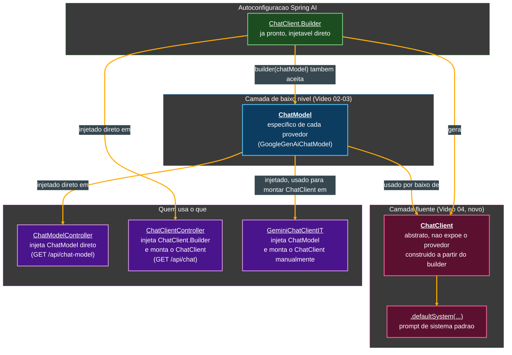
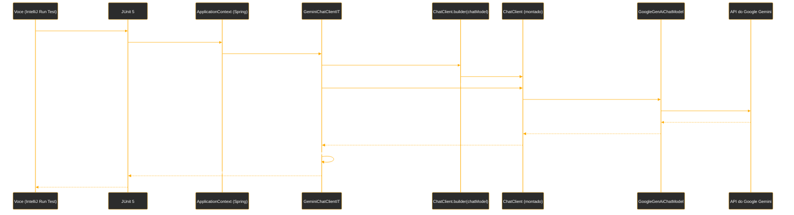
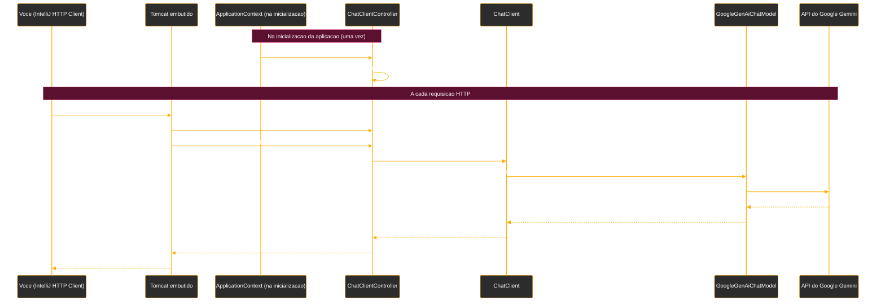

# Tutorial de Estudos — Desenvolvendo sua API Inteligente com Reconhecimento de Fala e Spring Boot

**Continuação — Vídeo 04 (ChatClient: Fluência e Contexto no Spring AI)**

- Curso: NTT Data — Jornada Tech (DIO) · Módulo 4 — Curso 5: "Desenvolvendo sua API Inteligente com Reconhecimento de Fala e Spring Boot"
- Instrutor: Thiago Poiani (Principal Engineer at Skip)
- Projeto: `budgeting`
- Documento de referência pessoal — nível iniciante em Java

---

## Sobre esta atualização

Este arquivo dá continuidade ao tutorial já existente (`001-...md`, Vídeos 01 e 02, e `002-...md`, Vídeo 03), cobrindo agora o **Vídeo 04**. Ele foi escrito a partir de três fontes conferidas de verdade, e não de suposição: a seção "Vídeo 04" do README atualizado, a transcrição bruta da aula (`transcricao.md`) e o estado real do projeto no `.zip` (`budgeting_ate_o_video04.zip`).

**Como usar este arquivo:** ele foi pensado para ser **concatenado** ao final do documento anterior (`002-Tutorial_Budgeting_Spring_AI_Video03.md`), substituindo as seções finais dele (Glossário, Checkpoint, Próximos passos e Diagramas) pelas versões atualizadas presentes aqui. A seção "Parte 4" abaixo deve ser inserida **depois** da "Parte 3 — Explorando o ChatModel e Modelos de Linguagem" e **antes** da seção "Pontos de atenção" do documento anterior. As seções "Pontos de atenção (continuação)", "Glossário (novos termos)", "Checkpoint do Vídeo 04" e "Próximos passos (atualizado)" abaixo devem **substituir** as seções equivalentes do documento anterior.

> **Nota importante sobre a divergência OpenAI × Gemini, confirmada mais uma vez neste vídeo:** como já vinha acontecendo desde o Vídeo 02, o README e a aula usam classes e nomes da **OpenAI** (`OpenAiChatModel`, `OpenAiChatClientIT`), enquanto o projeto real continua usando o **Google Gemini** (`GoogleGenAiChatModel`, `GeminiChatClientIT`). A Parte 4 explica os conceitos na ordem em que a aula os apresentou (por isso alguns trechos de código citam nomes da OpenAI, para ficar fiel ao raciocínio pedagógico), e a seção de checkpoint, mais adiante, mostra o equivalente real e fiel ao seu `.zip`, em Gemini.

---

## Parte 4 — ChatClient: Fluência e Contexto no Spring AI (Vídeo 04)

Até o Vídeo 03, o projeto conversava com a IA usando diretamente o `ChatModel` (visto na seção 3.1) — uma interface de baixo nível, específica de cada provedor (`GoogleGenAiChatModel`, `OpenAiChatModel` etc.), com um método `call(...)` simples. O Vídeo 04 introduz o `ChatClient`: uma segunda interface do Spring AI, construída **por cima** do `ChatModel`, e que a aula já havia citado en passant na seção 2.1 e na seção 3.7 deste tutorial.

### 4.1. O que é o `ChatClient`, segundo a documentação oficial

A aula abre consultando a documentação oficial do Spring AI (`docs.spring.io`), na página da **Chat Client API**. Dali, três pontos são destacados:

- O `ChatClient` oferece uma **API fluente** (*fluent API* — um estilo de API em que os métodos são encadeados uns após os outros, cada um devolvendo um objeto que permite continuar a cadeia, tornando o código mais legível como uma "frase") para se comunicar com um modelo de IA.
- Ele tem suporte tanto ao modelo **síncrono** (a chamada bloqueia até a resposta completa chegar — é o que o projeto usa até aqui) quanto ao modelo **reativo** (*streaming*, usando o `Flux` já mencionado na seção 3.2 deste tutorial, sobre o `StreamingChatModel`).
- O modelo de IA processa dois tipos principais de mensagem: **mensagens de usuário** (entradas diretas de quem está conversando) e **mensagens de sistema** (geradas para orientar o comportamento da conversa). Essa separação — que já existia na Message API (seção 3.4, com `SystemMessage` e `UserMessage`) — é o que torna o `ChatClient` uma API mais completa do que o `ChatModel` puro: ele formaliza essa distinção como parte do próprio fluxo de construção da chamada.

> **Prompt de sistema × prompt de usuário, explicado do zero**
> Tudo que a pessoa que está usando a aplicação digita ou fala é um **prompt de usuário**. Um **prompt de sistema**, por outro lado, é uma definição feita pelo *desenvolvedor* para o modelo, dando contexto sobre quem ele deve "ser", o que se espera que ele faça, e quais processos ele deve resolver — por exemplo, "você é um assistente financeiro" ou, como será visto adiante, "você é um matemático". Na prática, é uma forma de configurar o comportamento do modelo antes mesmo de qualquer mensagem do usuário chegar.

A documentação também mostra a seção "Creating a ChatClient": o `ChatClient` é criado a partir de um `ChatClient.Builder`, que pode ser obtido de forma **autoconfigurada** pelo Spring Boot (assim como o `ChatModel` já era, desde o Vídeo 02) ou construído programaticamente. Isso confirma dois pontos centrais desta etapa: o `ChatClient` disponibiliza um *builder* próprio (o mesmo **padrão builder** já visto na seção 3.9), e ele reaproveita toda a autoconfiguração de `ChatModel` que o projeto já tinha.

### 4.2. Criando a classe de teste

Seguindo a mesma convenção já usada no Vídeo 03 (seção 3.9), a aula cria uma nova classe de teste de integração, com as mesmas anotações de controle:

```java
@SpringBootTest
@EnabledIfEnvironmentVariable(named = "OPENAI_API_KEY", matches = ".+")
public class OpenAiChatClientIT {

    @Autowired
    OpenAiChatModel openAiChatModel;

    @Test
    void should_executeSum_when_prompted() {
    }
}
```

Nenhuma anotação aqui é nova — `@SpringBootTest` e `@EnabledIfEnvironmentVariable` já foram explicadas em detalhe na seção 3.9 deste tutorial. O que muda é a **estratégia**: em vez de injetar o `ChatModel` e usá-lo diretamente (como nos testes do Vídeo 03), ele será apenas o ponto de partida para *construir* um `ChatClient` — por isso o campo continua se chamando `openAiChatModel`, e não `chatClient`.

### 4.3. Construindo o `ChatClient` com o builder e o `defaultSystem`

```java
var chatClient = ChatClient.builder(openAiChatModel)
        .defaultSystem("Você é um matemático")
        .build();
```

- **`ChatClient.builder(openAiChatModel)`** — assim como `OpenAiChatModel.builder()` (visto na seção 3.9) recebia um `OpenAiApi` para montar um `ChatModel`, aqui o método estático `builder(...)` da classe `ChatClient` recebe um `ChatModel` já pronto (`openAiChatModel`) como base, e devolve um objeto "montador" (o mesmo **padrão builder** de sempre) para configurar o `ChatClient` que será construído sobre ele.
- **`.defaultSystem("Você é um matemático")`** — um dos métodos desse builder, que define a mensagem de sistema **padrão**: o texto passado aqui será enviado como prompt de sistema em **toda** chamada feita a partir deste `ChatClient`, sem que seja necessário repeti-lo em cada `.prompt(...)`. É o recurso que materializa, em código, a separação entre prompt de sistema e prompt de usuário explicada na seção 4.1.
- **`.build()`** — finaliza a construção e devolve a instância pronta de `ChatClient`, do mesmo jeito que o `.build()` de qualquer outro builder já visto neste tutorial.

> **Por que usar o builder em vez do método `ChatClient.create(chatModel)`?**
> A própria aula menciona que o `ChatClient` tem um método `create` que espera apenas um `ChatModel`, como atalho para os casos mais simples. O builder foi escolhido no lugar dele porque permite adicionar **configurações específicas** — como o `defaultSystem` — no momento da construção, algo que o `create` sozinho não permitiria.

### 4.4. O prompt de usuário e a chamada fluente

Com o `ChatClient` pronto, a aula envia o prompt de usuário e obtém a resposta:

```java
var response = chatClient.prompt("Some 10 mais 20. Depois subtraia 30 do resultado anterior. " +
                "Exiba apenas o resultado final sem explicações.")
        .call()
        .content();
```

- **`chatClient.prompt("...")`** — o método `prompt`, segundo a aula, no fundo aciona o método `call` do `ChatModel` que está por baixo do `ChatClient` — ou seja, é apenas uma camada mais amigável em cima do mesmo mecanismo já usado no Vídeo 03. Passar uma `String` diretamente para `prompt(...)` é o atalho para "isto é uma mensagem de usuário". A aula também comenta que existe uma variante do método `user(...)`, chamada depois de `.prompt()` sem argumentos, que garante explicitamente que o texto seja tratado como prompt de usuário (usada mais adiante, na seção 4.6, dentro do controller).
- **Objeto intermediário (`ChatClientRequestSpec`)** — o retorno de `.prompt(...)` não é a resposta final, mas um objeto de especificação da requisição (mencionado na aula como "spec"), que permite continuar encadeando mais configurações antes de efetivamente disparar a chamada. É esse encadeamento que caracteriza a API como "fluente" (seção 4.1).
- **`.call()`** — dispara, de fato, a chamada ao `ChatModel` configurado por baixo do `ChatClient` (aqui, o `openAiChatModel`/`chatModel` injetado). Devolve outro objeto intermediário, a partir do qual é possível pedir a resposta em diferentes formatos.
- **`.content()`** — extrai apenas o **texto** da resposta, como uma `String` pronta para uso — o equivalente, em conveniência, ao `.getResult().getOutput().getText()` que era necessário para extrair o texto de um `ChatResponse` no Vídeo 03 (seção 3.9). A aula comenta que, alternativamente, seria possível pedir aqui o `ChatResponse` completo (com metadados), assim como no `ChatModel` — a diferença é que o `ChatClient` também oferece, direto na cadeia fluente, esse atalho para o conteúdo puro.

### 4.5. A asserção com `contains`

```java
assertThat(response).contains("0");
System.out.println(response);
```

A conta pedida no prompt (`10 + 20 − 30`) resulta em `0`. A aula explica a escolha de `contains` no lugar de `equals`: mesmo pedindo explicitamente "sem explicações", o modelo pode devolver um pouco mais de texto além do número puro (no caso da aula, a resposta foi *"O resultado final é 0"*) — um `equals("0")` falharia nesse cenário, enquanto `contains("0")` continua validando que o resultado correto está presente na resposta, sem exigir uma correspondência exata de formato. É a mesma lógica de "asserção mais tolerante ao texto livre de uma LLM" já vista na seção 3.9 com `isNotEmpty()`.

### 4.6. Duplicando o controller: `ChatModelController` → `ChatClientController`

Com o `ChatClient` validado em teste, a segunda parte prática do vídeo o expõe via HTTP — reaproveitando a estrutura já existente. Em vez de escrever um controller novo do zero, a aula usa a funcionalidade **Copy Class** do IntelliJ (menu de contexto sobre o arquivo `ChatModelController.java`), que duplica a classe inteira — nome, pacote e conteúdo — para servir de ponto de partida.

> **O que é o "Copy Class" do IntelliJ?**
> É um atalho da IDE para duplicar uma classe Java já existente, criando uma cópia com um novo nome escolhido no momento da ação. Evita reescrever manualmente toda a estrutura (pacote, imports, anotações) de uma classe muito parecida com outra que já existe — aqui, o ponto de partida da cópia é exatamente a estrutura de controller REST já validada no `ChatModelController` (seção 3.10).

O novo arquivo é renomeado para `ChatClientController`, mantendo o pacote `dio.budgeting`. A diferença central em relação ao original: em vez de injetar um `ChatModel` (que é sempre específico de um provedor — a aula reforça que existiria um `ChatModel` "por provedor": OpenAI, Gemini, Anthropic etc.), o novo controller passa a injetar um `ChatClient`, que é **mais abstrato** e não carrega essa informação de qual provedor está por trás. Segundo a aula, essa é justamente a vantagem prática do `ChatClient`: seria possível ter várias instâncias dele, uma para cada modelo, e ainda assim manter a mesma interface `ChatClient` do lado de quem a usa.

### 4.7. O erro de bean e as duas formas de resolver

Ao tentar simplesmente trocar o tipo injetado de `ChatModel` para `ChatClient` no construtor do novo controller (do mesmo jeito direto que já funcionava para `ChatModel`), a aplicação falha ao subir, reclamando que **não existe um bean** do tipo `ChatClient` disponível para injeção.

> **Por que isso acontece, se o `ChatModel` era injetado direto sem problema?**
> A autoconfiguração do Spring AI cria automaticamente um bean de `ChatModel` (é o que já vinha acontecendo desde o Vídeo 02), mas **não** cria automaticamente um bean de `ChatClient` pronto — porque um `ChatClient` normalmente precisa de configurações adicionais (como o `defaultSystem` visto na seção 4.3) antes de ser considerado "pronto para uso", então o Spring prefere não decidir isso sozinho. O que a autoconfiguração entrega pronto, nesse caso, é o **builder** (`ChatClient.Builder`) — cabe ao código da aplicação decidir como montar o `ChatClient` final a partir dele.

A aula demonstra a solução criando uma classe de configuração separada, com um método anotado com `@Bean`:

```java
@Configuration
public class ChatClientConfig {

    @Bean
    public ChatClient chatClient(ChatClient.Builder chatClientBuilder) {
        return chatClientBuilder.build();
    }
}
```

- **`@Configuration`** — anotação que marca uma classe como fonte de definições de *beans* para o Spring, um lugar centralizado onde componentes podem ser construídos manualmente (em vez de depender só da autoconfiguração ou do *component scan* automático de classes anotadas com `@Component`, `@RestController` etc.).
- **`@Bean`** — anotação aplicada a um *método* (não a uma classe) dentro de uma classe `@Configuration`, indicando ao Spring que o valor devolvido por esse método deve ser registrado como um *bean* gerenciado, disponível para ser injetado em qualquer outro lugar da aplicação que peça um objeto daquele tipo.
- **O parâmetro `ChatClient.Builder chatClientBuilder`** — como o `ChatClient.Builder` já é fornecido pronto pela autoconfiguração do Spring AI (mesmo mecanismo citado na seção 4.1), o Spring o injeta automaticamente aqui, e o método simplesmente chama `.build()` sobre ele para produzir o `ChatClient` que faltava como bean.

A aula então comenta, explicitamente, que essa não é a **única** forma de resolver o problema: o mesmo `ChatClient.Builder` poderia ter sido recebido **diretamente no construtor do próprio controller**, dispensando uma classe de configuração separada — a diferença seria apenas *onde*, na aplicação, essa construção acontece. É exatamente essa segunda alternativa que aparece no código final do controller, e é a que está de fato presente no projeto real (ver seção "Pontos de atenção" e o checkpoint, adiante).

### 4.8. O `ChatClientController` final e o teste do endpoint

```java
@RestController
@RequestMapping("/api")
public class ChatClientController {

    private final ChatClient chatClient;

    public ChatClientController(ChatClient.Builder builder) {
        this.chatClient = builder.build();
    }

    @GetMapping("/chat")
    String chat(String prompt) {
        return this.chatClient.prompt().user(prompt).call().content();
    }
}
```

- **`@RestController` e `@RequestMapping("/api")`** — já conhecidas desde a seção 3.10: marcam a classe como um controller REST e definem `/api` como prefixo comum de todos os seus endpoints.
- **`private final ChatClient chatClient;`** e **`public ChatClientController(ChatClient.Builder builder) { this.chatClient = builder.build(); }`** — aqui está a alternativa citada ao final da seção 4.7: em vez de injetar um `ChatClient` já pronto (o que exigiria o bean explícito da seção anterior), o construtor recebe o **builder** — que a autoconfiguração já entrega pronto, sem esforço extra — e monta o `ChatClient` ali mesmo, uma única vez, no momento em que o controller é criado pelo Spring. É o mesmo princípio de **injeção de dependência via construtor** já visto na seção 3.10, aplicado a um objeto que precisa de um passo extra de construção antes de virar campo da classe.
- **`@GetMapping("/chat")`** — mapeia o endpoint para requisições `GET` em `/api/chat` (prefixo da classe + caminho do método), exatamente como o `@GetMapping("/chat-model")` da seção 3.10, só que em um caminho diferente.
- **`this.chatClient.prompt().user(prompt).call().content();`** — aqui aparece a variante do método `prompt()` mencionada na seção 4.4: chamado **sem argumento**, ele devolve o mesmo objeto de especificação da requisição, e o método `.user(prompt)` é usado logo em seguida para declarar explicitamente que o texto recebido do parâmetro `prompt` deve ser tratado como uma **mensagem de usuário**. O restante da cadeia (`.call().content()`) é idêntico ao já explicado na seção 4.4.

Com a aplicação no ar, a aula testa o endpoint pelo painel de Endpoints da IDE, enviando `bom dia` como prompt para `GET /api/chat`. A resposta devolvida pelo modelo foi *"Bom dia! Como posso ajudar você hoje?"*, confirmando que o controller está funcionando corretamente — o mesmo tipo de verificação manual já feito no Vídeo 03 (seção 3.10) para o endpoint `/api/chat-model`.

> **Resumo do vídeo, na fala do próprio instrutor**
> O `ChatClient` é uma interface de mais alto nível sobre o `ChatModel`, que permite ter diferentes modelos configurados por trás de uma única interface mais abstrata. No dia a dia, ele é preferível ao uso direto do `ChatModel` — e é justamente essa recomendação que fecha o vídeo, antes de o curso seguir, no Vídeo 05, para Tool Calling.

---

## Pontos de atenção (continuação — divergências do Vídeo 04)

Dando sequência à lista de divergências já registrada no tutorial do Vídeo 03 (itens 1 a 8), a comparação linha a linha entre a aula/README e o `.zip` real revela mais cinco pontos nesta etapa:

9. **Nome da classe de teste e do campo injetado: `OpenAiChatClientIT`/`openAiChatModel` (aula) × `GeminiChatClientIT`/`chatModel` (seu projeto).** Consistente com a divergência de provedor já registrada nos itens 1 e 5 do tutorial anterior, o teste real do seu projeto é:

   ```java
   @SpringBootTest
   @EnabledIfEnvironmentVariable(named = "GEMINI_API_KEY", matches = ".+")
   public class GeminiChatClientIT {

       @Autowired
       GoogleGenAiChatModel chatModel;

       @Test
       void should_executeSum_when_prompted() {
           var chatClient = ChatClient.builder(chatModel).defaultSystem("Voce é um matematico").build();

           var response = chatClient.prompt("Some 10 mais 20. Depois subtraia 30 do resultado anterior." +
                   "Exiba o resultado final sem explicações")
                   .call().content();

           assertThat(response).contains("0");
           System.out.println(response);
       }
   }
   ```

   **Impacto prático:** nenhum — a chamada `ChatClient.builder(chatModel)` funciona de forma idêntica, independentemente de o `ChatModel` por trás ser da OpenAI ou do Gemini, já que `ChatClient.builder(...)` aceita qualquer implementação da interface `ChatModel` (o mesmo princípio de abstração por interface comum discutido na seção 2.1 do tutorial anterior).

10. **Ortografia do prompt de sistema: `"Você é um matemático"` (README, com acentuação completa) × `"Voce é um matematico"` (código real, sem acento em "Você" e "matemático").** Uma diferença puramente ortográfica — provavelmente um esquecimento de acentuação ao digitar o texto durante o desenvolvimento.

    **Impacto prático:** nenhum — modelos de linguagem modernos interpretam corretamente frases em português mesmo sem acentuação, e o teste continua passando normalmente.

11. **Import da asserção AssertJ: `org.assertj.core.api.Assertions.assertThat` (padrão usado no Vídeo 03) × `org.assertj.core.api.AssertionsForClassTypes.assertThat` (usado em `GeminiChatClientIT`).** No seu `.zip`, o `import static` deste teste específico aponta para uma classe diferente da usada nos testes do Vídeo 03 (`GeminiChatModelIT`/`GeminiChatModelITVer1`, que usam `org.assertj.core.api.Assertions`):

    ```java
    import static org.assertj.core.api.AssertionsForClassTypes.assertThat;
    ```

    **Impacto prático:** nenhum — `AssertionsForClassTypes` é uma classe interna do próprio AssertJ, focada em asserções para tipos "simples" (como `String`), e `Assertions` (usada nos outros testes) estende `AssertionsForClassTypes` por baixo dos panos, entre outras classes. Na prática, ambos os `assertThat(String)` chegam ao mesmo método equivalente; a diferença é apenas de qual "porta de entrada" o import escolheu usar — possivelmente uma sugestão automática de import diferente, escolhida pela IDE em momentos distintos.

12. **Resolução do erro de bean: classe de configuração separada com `@Bean` (demonstrado na aula, seção 4.7) × builder recebido diretamente no construtor do controller (seu projeto real, sem nenhuma classe `@Configuration`).** No seu `.zip`, não existe nenhum arquivo de configuração adicional (como um `ChatClientConfig.java`) — apenas três classes em `src/main/java/dio/budgeting/`: `BudgetingApplication`, `ChatModelController` e `ChatClientController`. A resolução usada é exatamente a alternativa que o próprio instrutor citou como equivalente ao final da seção 4.7 (e que o README também registra como resultado final): o `ChatClient.Builder` é recebido diretamente no construtor de `ChatClientController`, e o `ChatClient` é montado ali mesmo:

    ```java
    public ChatClientController(ChatClient.Builder chatClientBuilder) {
        this.chatClient = chatClientBuilder.build();
    }
    ```

    **Impacto prático:** nenhum — como o próprio instrutor explica na aula, as duas formas são funcionalmente idênticas; a diferença é apenas *onde*, na aplicação, a construção do `ChatClient` acontece (em uma classe de configuração central e reaproveitável por vários componentes, ou localmente, dentro do único controller que precisa dele). Para um projeto com um único `ChatClient`, como é o caso até aqui, a construção local no controller é perfeitamente razoável.

13. **Assinatura do método do endpoint `/chat`: `String chat(String prompt)` sem anotação explícita no parâmetro (README) × `public String chat(@RequestParam(value = "prompt", defaultValue = "Olá!") String prompt)` (seu projeto real).** O código real do seu `ChatClientController` é mais explícito do que o mostrado no README:

    ```java
    @GetMapping("/chat")
    public String chat(@RequestParam(value = "prompt", defaultValue = "Olá!") String prompt) {
        return this.chatClient.prompt()
                .user(prompt)
                .call()
                .content();
    }
    ```

    Duas diferenças pontuais: o método é declarado com o modificador `public` de forma explícita (no README, o modificador é omitido — o que também é válido em uma interface implícita de controller, mas menos explícito), e o parâmetro `prompt` ganha a anotação `@RequestParam`, com dois atributos: `value = "prompt"` (o nome do parâmetro de *query string* esperado — igual ao nome do parâmetro do método, então poderia até ser omitido, mas foi declarado de forma explícita) e `defaultValue = "Olá!"` (um valor usado automaticamente caso a requisição não informe o parâmetro `prompt` na URL).

    **Impacto prático:** pequeno, mas real — diferente do endpoint `/api/chat-model` (seção 3.10), que exigiria um valor de `prompt` sempre presente na URL (ou devolveria erro/`null`), o endpoint `/api/chat` do seu projeto pode ser chamado sem nenhum parâmetro (`GET /api/chat`) e ainda assim funcionar, enviando "Olá!" como prompt padrão para o modelo.

---

## Glossário — novos termos (Vídeo 04)

Estes termos se somam ao glossário já existente no tutorial do Vídeo 03 (que cobre Java, Spring, IA e ferramentas até o Vídeo 03) — apenas os termos que ainda não haviam aparecido.

| Termo | Significado |
|---|---|
| API fluente (*fluent API*) | Estilo de API em que os métodos são encadeados um após o outro (`objeto.metodoA().metodoB().metodoC()`), cada um geralmente devolvendo um objeto que permite continuar a cadeia, tornando o código mais legível, como uma sequência de instruções em "linguagem quase natural". |
| `ChatClient.Builder` | Interface de builder específica para montar instâncias de `ChatClient`; diferente do `ChatClient` em si, ela **é** fornecida pronta pela autoconfiguração do Spring AI, cabendo ao código da aplicação decidir como e onde transformá-la em um `ChatClient` de fato (seja em uma classe `@Configuration`, seja localmente em um construtor). |
| `.defaultSystem(String)` | Método do builder do `ChatClient` que define uma mensagem de sistema padrão, aplicada automaticamente a todas as chamadas feitas a partir daquele `ChatClient`, sem precisar ser repetida em cada prompt. |
| Prompt de sistema | Mensagem definida pelo desenvolvedor (não pelo usuário final) para dar contexto ao modelo sobre seu papel, comportamento esperado e limites — por exemplo, "você é um matemático". |
| Prompt de usuário | A entrada real de quem está conversando com a aplicação — o equivalente, na Message API (seção 3.4), a uma `UserMessage`. |
| `chatClient.prompt(...)` / `chatClient.prompt()` | Ponto de entrada da API fluente do `ChatClient`. Chamado com uma `String`, define diretamente o prompt de usuário; chamado sem argumento, devolve um objeto de especificação que pode ser configurado em seguida (por exemplo, com `.user(...)` ou `.system(...)`) antes de finalmente ser executado com `.call()`. |
| Objeto de especificação da requisição (*Request Spec*) | Objeto intermediário devolvido por `chatClient.prompt(...)`, que permite continuar encadeando configurações (como mensagens adicionais ou metadados) antes de disparar a chamada de fato com `.call()`. |
| `.call().content()` (no `ChatClient`) | Encerramento típico da cadeia fluente do `ChatClient`: `.call()` dispara a chamada ao `ChatModel` subjacente, e `.content()` extrai apenas o texto puro da resposta, como uma `String` — um atalho equivalente ao `.getResult().getOutput().getText()` necessário ao trabalhar diretamente com um `ChatResponse` do `ChatModel`. |
| `@Configuration` | Anotação do Spring que marca uma classe como fonte centralizada de definições de *beans*, complementando (ou substituindo, quando necessário) a autoconfiguração automática e o *component scan*. |
| `@Bean` | Anotação aplicada a um método dentro de uma classe `@Configuration`, indicando que o valor devolvido por esse método deve ser registrado como um *bean* gerenciado pelo Spring, disponível para injeção em qualquer outro componente que precise de um objeto daquele tipo. |
| `@RequestParam` | Anotação do Spring MVC usada para vincular explicitamente um parâmetro de *query string* da URL a um parâmetro de método de um controller, permitindo customizações como um nome diferente (`value`) ou um valor padrão (`defaultValue`), usado automaticamente quando o parâmetro não é enviado na requisição. |
| Copy Class (IntelliJ) | Funcionalidade da IDE para duplicar uma classe Java já existente (nome, pacote e conteúdo), servindo como ponto de partida rápido para criar uma nova classe parecida, sem reescrever tudo manualmente do zero. |

---

## Checkpoint do Vídeo 04

Estado do projeto conferido diretamente nos arquivos do `.zip` (`budgeting_ate_o_video04.zip`) — e não apenas na narrativa do README ou da transcrição. Como já explicado na seção "Pontos de atenção" (itens 9 a 13), ele reflete o uso do **Google Gemini**, e o método de resolução do bean do `ChatClient` **diretamente no construtor do controller**, sem classe de configuração separada.

### Estrutura de pastas

```
budgeting/
├── build.gradle                                 ← inalterado desde o Vídeo 03
├── settings.gradle                              ← inalterado
├── gradlew / gradlew.bat
├── gradle/wrapper/
└── src/
    ├── main/
    │   ├── java/dio/budgeting/
    │   │   ├── BudgetingApplication.java        ← inalterado
    │   │   ├── ChatModelController.java         ← inalterado desde o Vídeo 03
    │   │   └── ChatClientController.java        ← novo neste vídeo
    │   └── resources/
    │       └── application.properties           ← inalterado desde o Vídeo 03
    └── test/
        └── java/dio/budgeting/
            ├── BudgetingApplicationTests.java   ← inalterado
            ├── GeminiChatModelIT.java           ← inalterado desde o Vídeo 03
            ├── GeminiChatModelITVer1.java       ← inalterado desde o Vídeo 03
            └── GeminiChatClientIT.java          ← novo neste vídeo
```

A única novidade estrutural em relação ao checkpoint do Vídeo 03 é a chegada de dois arquivos: um novo controller (`ChatClientController`) e um novo teste de integração (`GeminiChatClientIT`). Nenhum arquivo de configuração adicional foi criado — confirmando o item 12 de "Pontos de atenção".

### `build.gradle`, `settings.gradle` e `application.properties`

Confirmados, byte a byte, como **idênticos** ao checkpoint do Vídeo 03 (seção 3, tutorial anterior) — nenhuma dependência ou propriedade nova foi necessária para o `ChatClient`, já que ele reaproveita inteiramente a autoconfiguração do `ChatModel` já existente desde o Vídeo 02 (como a própria documentação oficial confirma, seção 4.1).

### `src/main/java/dio/budgeting/ChatModelController.java`

```java
package dio.budgeting;

import org.springframework.ai.google.genai.GoogleGenAiChatModel;
import org.springframework.web.bind.annotation.GetMapping;
import org.springframework.web.bind.annotation.RequestMapping;
import org.springframework.web.bind.annotation.RestController;

@RestController
@RequestMapping("/api")
public class ChatModelController {
    private final GoogleGenAiChatModel chatModel;

    public ChatModelController(GoogleGenAiChatModel chatModel) {
        this.chatModel = chatModel;
    }

    @GetMapping("/chat-model")
    String chat(String prompt) {
        return this.chatModel.call(prompt);
    }

}
```

Inalterado desde o Vídeo 03 (explicado linha a linha na seção 3.10). Continua expondo `GET /api/chat-model`, agora convivendo lado a lado com o novo `GET /api/chat` do `ChatClientController`.

### `src/main/java/dio/budgeting/ChatClientController.java` (novo)

```java
package dio.budgeting;

import org.springframework.ai.chat.client.ChatClient;
import org.springframework.web.bind.annotation.GetMapping;
import org.springframework.web.bind.annotation.RequestMapping;
import org.springframework.web.bind.annotation.RequestParam;
import org.springframework.web.bind.annotation.RestController;

@RestController
@RequestMapping("/api")
public class ChatClientController {

    private final ChatClient chatClient;

    // Recebe o Builder injetado automaticamente pelo Spring AI
    public ChatClientController(ChatClient.Builder chatClientBuilder) {
        this.chatClient = chatClientBuilder.build();
    }

    @GetMapping("/chat")
    public String chat(@RequestParam(value = "prompt", defaultValue = "Olá!") String prompt) {
        return this.chatClient.prompt()
                .user(prompt)
                .call()
                .content();
    }
}
```

Estruturalmente equivalente ao explicado na seção 4.8, com as duas diferenças pontuais já registradas no item 13 de "Pontos de atenção": o `@RequestParam` explícito (com `defaultValue = "Olá!"`) e o modificador `public` explícito no método `chat`. Note também o comentário `// Recebe o Builder injetado automaticamente pelo Spring AI`, deixado no código real como lembrete de por que o construtor recebe um `ChatClient.Builder`, e não um `ChatClient` já pronto — reforçando o próprio raciocínio explicado na seção 4.7.

### `src/test/java/dio/budgeting/GeminiChatClientIT.java` (novo)

```java
package dio.budgeting;

import org.junit.jupiter.api.Test;
import org.junit.jupiter.api.condition.EnabledIfEnvironmentVariable;
import org.springframework.ai.chat.client.ChatClient;
import org.springframework.ai.google.genai.GoogleGenAiChatModel;
import org.springframework.beans.factory.annotation.Autowired;
import org.springframework.boot.test.context.SpringBootTest;

import static org.assertj.core.api.AssertionsForClassTypes.assertThat;

@SpringBootTest
@EnabledIfEnvironmentVariable(named = "GEMINI_API_KEY", matches = ".+")
public class GeminiChatClientIT {
    @Autowired
    GoogleGenAiChatModel chatModel;

    @Test
    void should_executeSum_when_prompted() {
        var chatClient = ChatClient.builder(chatModel).defaultSystem("Voce é um matematico").build();

        var response = chatClient.prompt("Some 10 mais 20. Depois subtraia 30 do resultado anterior." +
                "Exiba o resultado final sem explicações")
                .call().content();

        assertThat(response).contains("0");
        System.out.println(response);
    }
}
```

Explicado em detalhe nas seções 4.2 a 4.5, com as divergências de nomenclatura, ortografia e import de asserção já registradas nos itens 9, 10 e 11 de "Pontos de atenção".

### Demais arquivos

`BudgetingApplication.java`, `BudgetingApplicationTests.java`, `GeminiChatModelIT.java` e `GeminiChatModelITVer1.java` seguem **inalterados** desde o checkpoint do Vídeo 03 (já documentados em detalhe no tutorial anterior).

> **Nota:** assim como no checkpoint anterior, o `.zip` também contém as pastas `.gradle/`, `build/` e `.idea/` (incluindo `budgeting.iml`), todas geradas/gerenciadas automaticamente pela ferramenta de build e pela IDE — não fazem parte deste checkpoint por não serem editadas manualmente.

---

## Próximos passos (atualizado): o que vem a partir do Vídeo 05

Com o Vídeo 04 já coberto neste documento, a sequência restante do curso (conferida no README) é:

- **Vídeo 05 — Tool Calling: Executando Funções Reais com IA:** deve colocar em prática o conceito já apresentado desde o Vídeo 02 (seção 2.3 do tutorial anterior) — conectar a LLM a métodos Java reais da aplicação `budgeting` —, muito provavelmente construído **sobre o `ChatClient`** (e não sobre o `ChatModel` puro), já que o `ChatClient` é a interface que a própria aula recomendou como preferencial no dia a dia (seção 4.8, resumo final). Deve introduzir também o uso prático de `ToolResponseMessage`, já mencionado na Message API (seção 3.4 do tutorial anterior).
- **Vídeo 06 — Transcription API: Transformando Áudio em Texto:** deve implementar a etapa de **STT** (Speech-to-Text) do diagrama "A Nova Anatomia da API" (seção 1.1), usando o modelo de áudio equivalente ao `ChatModel`/`ChatClient`, mas para transcrição.
- **Vídeo 07 — Speech API: Sintetizando Voz com Text-to-Speech:** deve implementar a etapa de **TTS**, fechando o pipeline de voz completo (áudio → texto → lógica → texto → áudio).
- **Vídeo 08 — Integração do Assistente: Orquestrando o Fluxo de Budget:** deve juntar STT, Tool Calling e TTS em um fluxo único, aplicado ao estudo de caso do assistente de *budgeting* (seção 1.4 do tutorial anterior).
- **Vídeo 09 — Persistência e Infraestrutura: Configurando o Banco com Docker:** deve introduzir a camada de persistência real do projeto (provavelmente via Docker Compose), necessária para de fato guardar as transações extraídas por voz.
- **Vídeo 10 — Exposição REST: Implementando o TransactionController:** deve criar um novo `@RestController`, no mesmo estilo do `ChatModelController`/`ChatClientController` já construídos (seções 3.10 e 4.8), agora expondo endpoints HTTP para o domínio de transações financeiras.
- **Vídeo 11 — Endpoint de Transcrição: Integrando Áudio ao Controller:** deve conectar a Transcription API (Vídeo 06) a um endpoint HTTP real, permitindo enviar um arquivo de áudio via requisição.
- **Vídeo 12 — Roadmap e Auditoria: Evoluindo a API Inteligente:** deve fechar o desenvolvimento com sugestões de evolução do projeto e, possivelmente, mecanismos de auditoria/observabilidade.
- **Vídeo 13 — Entendendo o Desafio:** provavelmente o desafio prático de encerramento do curso.

> **Sobre a divergência OpenAI × Gemini nos próximos vídeos**
> O padrão de tradução já estabelecido continua valendo: qualquer classe com `OpenAi` no nome (por exemplo, um futuro `OpenAiChatClientTools` ou similar) tem, em geral, uma equivalente com `GoogleGenAi`; qualquer propriedade `spring.ai.openai.*` tem uma equivalente `spring.ai.google.genai.*`. Vale ficar atento(a), no Vídeo 05, a eventuais métodos ou anotações de *tool calling* que sejam específicos de um provedor — nesse caso, a tradução pode não ser tão direta quanto trocar apenas o nome da classe do `ChatModel`.

---

## Diagramas: o que o Vídeo 04 acrescentou

### 1. Diagrama de blocos — `ChatModel` × `ChatClient`, a camada de abstração



**Como ler este diagrama:**

- Ele mostra a coexistência das duas camadas dentro do mesmo projeto, algo que só passou a existir a partir do Vídeo 04: `ChatModel` continua existindo e sendo usado diretamente (pelo `ChatModelController`, herdado do Vídeo 03), enquanto o `ChatClient` — construído por cima dele — passa a ser usado por dois novos consumidores (`ChatClientController` e o teste `GeminiChatClientIT`).
- Repare que existem **duas formas diferentes** de se chegar a um `ChatClient` pronto no projeto: o `ChatClientController` recebe o `ChatClient.Builder` já autoconfigurado; o teste `GeminiChatClientIT`, por sua vez, monta o `ChatClient` a partir do `ChatModel` injetado, usando `ChatClient.builder(chatModel)` (seção 4.3) — o mesmo builder, mas obtido de um jeito diferente. As duas formas coexistem no projeto real, cada uma no contexto onde faz mais sentido (produção × teste).

### 2. Diagrama de sequência — o teste `GeminiChatClientIT` (system prompt + user prompt)



**Como ler este diagrama:**

- A principal novidade em relação ao diagrama equivalente do Vídeo 03 (seção 3, diagrama 3 do tutorial anterior) é a mensagem enviada ao modelo: agora são **duas** mensagens (`SystemMessage` + `UserMessage`), e não apenas uma `String` solta — é o `defaultSystem` (seção 4.3) que introduz essa `SystemMessage` automaticamente, em toda chamada feita a partir desse `ChatClient`.
- O passo `Client->>Model` é uma simplificação didática: por baixo dos panos, o `ChatClient` monta um objeto `Prompt` (a mesma classe já vista na seção 3.3 do tutorial anterior) contendo a lista de mensagens, e é esse `Prompt` que efetivamente chega ao `ChatModel` — o mesmo mecanismo interno que já era usado manualmente em `GeminiChatModelIT` (seção 3, checkpoint do Vídeo 03), agora acontecendo de forma automática por trás da API fluente.

### 3. Diagrama de sequência — o endpoint `GET /api/chat`



**Como ler este diagrama:**

- Este diagrama separa deliberadamente duas fases: a construção do `ChatClient` (que acontece **uma única vez**, na inicialização da aplicação, quando o Spring cria o bean `ChatClientController`) e o processamento de cada requisição HTTP (que acontece **a cada chamada**, reaproveitando o mesmo `ChatClient` já montado). É uma diferença importante em relação ao teste da seção anterior, onde o `ChatClient` era construído dentro do próprio método de teste, a cada execução.
- Repare a nota "sem `SystemMessage`": diferente do `ChatClient` montado no teste `GeminiChatClientIT` (que usa `.defaultSystem(...)`), o `ChatClient` deste controller não define nenhum prompt de sistema — por isso, o comportamento do modelo, ao responder por esse endpoint, é o comportamento "padrão" dele, sem nenhuma persona ou instrução extra definida pela aplicação.
- Assim como no diagrama do endpoint `/api/chat-model` (Vídeo 03), a aplicação continua rodando entre uma requisição e outra, graças ao `spring-boot-starter-web` e ao Tomcat embutido — este é apenas mais um endpoint convivendo no mesmo servidor.

---

*Este é o terceiro tutorial da série do curso "Desenvolvendo sua API Inteligente com Reconhecimento de Fala e Spring Boot", cobrindo o Vídeo 04 e projetado para ser concatenado ao documento que cobre os Vídeos 01 a 03. Os próximos tutoriais devem continuar a numeração (`004-...`, e assim por diante), cada um cobrindo um novo vídeo (ou uma nova etapa de código), sempre dando continuidade a este documento e ao estado do projeto então existente.*
