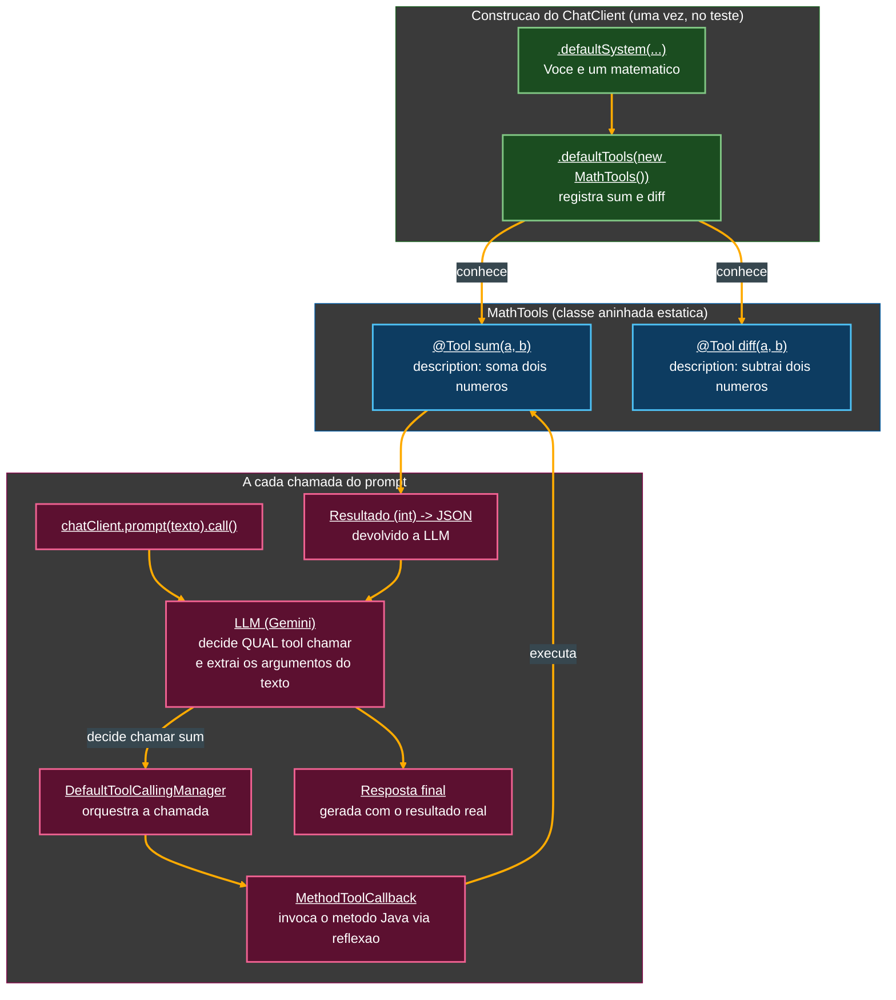
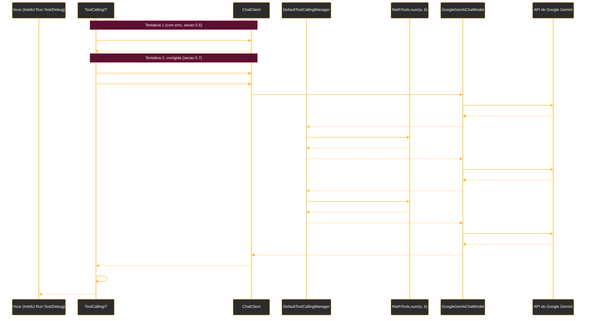

# Tutorial de Estudos — Desenvolvendo sua API Inteligente com Reconhecimento de Fala e Spring Boot

**Continuação — Vídeo 05 (Tool Calling: Executando Funções Reais com IA)**

- Curso: NTT Data — Jornada Tech (DIO) · Módulo 4 — Curso 5: "Desenvolvendo sua API Inteligente com Reconhecimento de Fala e Spring Boot"
- Instrutor: Thiago Poiani (Principal Engineer at Skip)
- Projeto: `budgeting`
- Documento de referência pessoal — nível iniciante em Java

---

## Sobre esta atualização

Este arquivo dá continuidade ao tutorial já existente (`001-...md`, Vídeos 01 e 02; `002-...md`, Vídeo 03; `003-...md`, Vídeo 04), cobrindo agora o **Vídeo 05**. Ele foi escrito a partir de duas fontes conferidas de verdade, e não de suposição: a seção "Vídeo 05" do README atualizado e o estado real do projeto no `.zip` (`budgeting_ate_o_video05.zip`) — que foi de fato descompactado e lido arquivo por arquivo antes de qualquer linha deste documento ser escrita.

**Como usar este arquivo:** ele foi pensado para ser **concatenado** ao final do documento anterior (`003-Tutorial_Budgeting_Spring_AI_Video04.md`). A seção "Parte 5" abaixo deve ser inserida **depois** da "Parte 4 — ChatClient: Fluência e Contexto no Spring AI" e **antes** da seção "Pontos de atenção (continuação)" do documento anterior. As seções "Pontos de atenção (continuação)", "Glossário — novos termos", "Checkpoint do Vídeo 05", "Próximos passos (atualizado)" e "Diagramas" abaixo devem **substituir** as seções equivalentes do documento anterior.

> **Nota importante sobre a divergência OpenAI × Gemini, confirmada mais uma vez neste vídeo:** como já vinha acontecendo desde o Vídeo 02, o README e a aula usam classes e nomes da **OpenAI** (`OpenAiChatModel`, `OPENAI_API_KEY`), enquanto o projeto real continua usando o **Google Gemini** (`GoogleGenAiChatModel`, `GEMINI_API_KEY`). A Parte 5 explica os conceitos na ordem em que a aula os apresentou (por isso os trechos de código citados a partir da documentação e do README mantêm nomes da OpenAI, para ficar fiel ao raciocínio pedagógico), e a seção de checkpoint, mais adiante, mostra o equivalente real e fiel ao seu `.zip`, em Gemini. A boa notícia deste vídeo é que o **mecanismo de Tool Calling em si** — a anotação `@Tool`, os métodos `.tools()`/`.defaultTools()` do `ChatClient` — não é específico de provedor: é parte do Spring AI, e funciona de forma idêntica sobre `GoogleGenAiChatModel` ou `OpenAiChatModel`, já que ambos implementam a mesma interface `ChatModel` (a mesma abstração por interface comum discutida desde a seção 2.1 do primeiro tutorial).

---

## Parte 5 — Tool Calling: Executando Funções Reais com IA (Vídeo 05)

Até o Vídeo 04, toda resposta da aplicação vinha exclusivamente do "conhecimento" interno da LLM: o modelo lia um prompt e gerava uma resposta baseada apenas no que já sabia (ou "achava" saber). O Vídeo 05 muda esse cenário: a partir de agora, o modelo passa a poder **executar código Java real** da aplicação para responder com mais precisão — é o conceito de **Tool Calling**, já citado en passant desde o Vídeo 02 (seção 2.3 do primeiro tutorial, dentro do panorama de conceitos de IA) e mencionado na Message API (seção 3.4, com a classe `ToolResponseMessage`).

### 5.1. O que é Tool Calling, segundo a documentação oficial

A aula abre, mais uma vez, consultando a documentação oficial do Spring AI, agora na página dedicada a **Tool Calling**. Dali, os pontos centrais:

- Tool Calling (também chamado de **Function Calling**) é descrito como um **padrão comum** em aplicações de IA: ele permite que um modelo interaja com um conjunto de APIs ou ferramentas externas, ampliando o que ele consegue fazer sozinho.
- A documentação separa dois usos principais para uma *tool*:
  - **Information Retrieval** — buscar informações em fontes externas (um banco de dados, um serviço web, um motor de busca) para complementar o que o modelo já sabe. É o caso do exemplo `DateTimeTools` visto a seguir: a LLM não tem acesso ao relógio do sistema, então ela "pergunta" a hora atual a uma ferramenta.
  - **Taking Action** — executar uma ação real em algum sistema (enviar um e-mail, criar um registro em um banco, disparar um fluxo de trabalho). É o caso, mais adiante no curso, de registrar uma transação financeira a partir de um comando de voz — o próprio caso de uso central do projeto `budgeting` (seção 1.4 do primeiro tutorial).

> **Por que isso importa para o projeto `budgeting`?**
> Sem Tool Calling, a aplicação dependeria inteiramente da LLM "adivinhar" cálculos e fatos — o que, como o próprio Vídeo 04 já mostrou (seção 4.5, sobre por que usar `contains` em vez de `equals`), é impreciso mesmo em tarefas simples como uma soma. Com Tool Calling, a lógica de negócio determinística (somar, subtrair, gravar uma transação no banco) continua sendo executada por **código Java comum**, e a LLM entra apenas para interpretar a intenção do usuário e decidir *qual* função chamar e com *quais* argumentos.

### 5.2. O exemplo oficial: `DateTimeTools` e a anotação `@Tool`

A documentação mostra um primeiro exemplo, simples, de como declarar uma ferramenta:

```java
class DateTimeTools {

    @Tool(description = "Get the current date and time in the user's timezone")
    String getCurrentDateTime() {
        return LocalDateTime.now().atZone(LocaleContextHolder.getTimeZone().toZoneId()).toString();
    }

}
```

- **`class DateTimeTools`** — uma classe Java **comum**, sem nenhuma anotação especial de Spring (não é `@Component`, não é `@Service`). Isso é proposital: uma classe de *tools* não precisa ser gerenciada pelo Spring como um bean para funcionar com o `ChatClient` — ela só precisa ser instanciada (com `new`, como será visto na seção 5.4) e entregue ao `ChatClient` no momento certo.
- **`@Tool(description = "...")`** — a anotação central deste vídeo, vinda do pacote `org.springframework.ai.tool.annotation`. Aplicada sobre um **método**, ela marca esse método como uma ferramenta que a LLM pode decidir chamar. O atributo `description` é um texto em linguagem natural que **não é lido por um humano**, e sim enviado ao modelo de IA como parte do contexto da conversa — é a partir dele que a LLM entende *o que aquele método faz* e decide, sozinha, se e quando deve chamá-lo. Quanto mais clara a descrição, melhor a LLM consegue escolher a ferramenta certa entre várias disponíveis.
- **`String getCurrentDateTime()`** — o método em si é Java comum: sem parâmetros, devolvendo uma `String`. `LocalDateTime.now()` é uma classe padrão do Java (pacote `java.time`) que representa a data e hora atuais; `.atZone(...)` converte esse valor para um fuso horário específico (aqui, obtido de `LocaleContextHolder.getTimeZone()`, uma classe do Spring Framework que resolve o fuso horário associado à requisição atual); `.toString()` converte o resultado final para texto, formato exigido para ser devolvido à LLM como resposta da ferramenta.

> **`@Tool` não é a única forma de declarar uma tool no Spring AI**
> A aula não entra nesse detalhe, mas vale registrar: além de anotar métodos com `@Tool`, o Spring AI também permite declarar ferramentas via interfaces `ToolCallback`/`ToolCallbackProvider` — daí o nome dessas classes aparecer, mais adiante (seção 5.6), na mensagem de erro exibida durante o desenvolvimento. `@Tool` é a forma mais simples e direta, e é a única usada neste vídeo.

### 5.3. Disponibilizando a tool ao `ChatClient`: o método `.tools()`

Com a classe de ferramenta pronta, a documentação mostra como conectá-la a uma chamada do `ChatClient` (a mesma interface fluente apresentada no Vídeo 04, seção 4.1):

```java
ChatModel chatModel = ...

String response = ChatClient.create(chatModel)
        .prompt("What day is tomorrow?")
        .tools(new DateTimeTools())
        .call()
        .content();

System.out.println(response);
```

- **`ChatClient.create(chatModel)`** — método estático alternativo ao `ChatClient.builder(chatModel)...build()` já usado desde o Vídeo 04 (seção 4.3): um atalho para os casos em que nenhuma configuração adicional (como um `defaultSystem`) é necessária, criando o `ChatClient` diretamente a partir de um `ChatModel`.
- **`.prompt("What day is tomorrow?")`** — já conhecido da seção 4.4: define o prompt de usuário diretamente como uma `String`.
- **`.tools(new DateTimeTools())`** — o método novo deste vídeo. Ele recebe uma ou mais instâncias de classes que contenham métodos anotados com `@Tool`, e as disponibiliza **apenas para esta chamada específica** do `.prompt(...)`. Ao processar o prompt "What day is tomorrow?" (que exige saber a data de *hoje* para calcular a de amanhã), o modelo identifica que precisa da ferramenta `getCurrentDateTime`, "solicita" essa chamada (o Spring AI executa o método Java de verdade, por baixo dos panos, sem intervenção manual), recebe o resultado, e só então gera a resposta final ao prompt original, já usando essa informação.
- **`.call().content()`** — o mesmo encerramento da cadeia fluente já explicado na seção 4.4.

Este é o exemplo "de documentação", ainda fora do projeto — a partir daqui, a aula parte para o código real do `budgeting`.

### 5.4. Criando o teste `ToolCallingIT`

Seguindo a mesma convenção de "Copy Class" já usada no Vídeo 04 (seção 4.6) para criar o `ChatClientController` a partir do `ChatModelController`, a aula duplica agora a classe de teste do Vídeo 04 (`OpenAiChatClientIT`/`GeminiChatClientIT`, conforme a seção 4.2), criando uma nova classe chamada `ToolCallingIT`, no mesmo pacote `dio.budgeting`:

```java
@SpringBootTest
@EnabledIfEnvironmentVariable(named = "OPENAI_API_KEY", matches = ".+")
public class ToolCallingIT {

    @Autowired
    OpenAiChatModel openAiChatModel;

    @Test
    void should_executeSum_when_prompted() {
        var chatClient = ChatClient.builder(openAiChatModel).defaultSystem("Você é um matemático").build();

        var response = chatClient.prompt("Some 10 mais 20. Depois subtraia 30 do resultado...")
                .call().content();

        assertThat(response).contains("0");
        System.out.println(response);
    }
}
```

Nada aqui é novo: `@SpringBootTest`, `@EnabledIfEnvironmentVariable`, o `ChatClient.builder(...).defaultSystem(...).build()` e o encerramento `.call().content()` já foram explicados em detalhe nas seções 3.9, 4.2 e 4.3. Este é literalmente o ponto de partida — o mesmo teste do Vídeo 04, copiado como base, ainda **sem** nenhuma tool conectada e ainda dependendo apenas da capacidade "de cabeça" da LLM para fazer a conta (o mesmo cenário frágil discutido na seção 5.1).

### 5.5. `MathTools`: uma classe aninhada estática com duas *tools*

Dentro da própria classe de teste, é declarada uma nova classe, `MathTools`, seguindo o mesmo padrão do exemplo oficial `DateTimeTools` (seção 5.2), mas agora com duas ferramentas:

```java
static class MathTools {
    @Tool(description = "soma dois números inteiros, a e b")
    public int sum(int a, int b) {
        return a + b;
    }

    @Tool(description = "subtrai dois números inteiros, a e b")
    public int diff(int a, int b) {
        return a - b;
    }
}
```

- **`static class MathTools`** — uma **classe aninhada estática** (*static nested class*): uma classe declarada *dentro* de outra classe (aqui, dentro de `ToolCallingIT`), mas marcada com `static`. Isso significa que `MathTools` não precisa de uma instância de `ToolCallingIT` "por trás" para existir — ela pode ser criada diretamente com `new MathTools()`, de qualquer lugar que tenha acesso a ela, exatamente como uma classe comum. É usada aqui apenas por conveniência de organização: como `MathTools` só faz sentido dentro do contexto deste teste específico, não há necessidade de criar um arquivo `.java` separado para ela.
- **`@Tool(description = "soma dois números inteiros, a e b")`** e **`public int sum(int a, int b)`** — o método `sum` recebe dois números inteiros (`int a`, `int b`) e devolve a soma deles. A `description` é o texto que a LLM vai ler para decidir se este é o método certo para "resolver uma soma".
- **`@Tool(description = "subtrai dois números inteiros, a e b")`** e **`public int diff(int a, int b)`** — mesma lógica, agora para subtração (`a - b`). Repare que ambos os métodos são `public`: diferente de campos e métodos internos comuns, métodos anotados com `@Tool` precisam ser acessíveis (o Spring AI, por baixo dos panos, usa reflexão — um mecanismo do Java que permite inspecionar e invocar métodos e campos de uma classe em tempo de execução, mesmo sem conhecê-los em tempo de compilação — para descobrir e chamar esses métodos).

Com `MathTools` pronta, o prompt de teste passa a ser resolvido, ao menos em teoria, por essas duas ferramentas, e não mais pela LLM "de cabeça".

### 5.6. O primeiro erro: ferramenta declarada no lugar errado

A primeira tentativa da aula é reaproveitar o método `.tools(...)` já visto no exemplo oficial (seção 5.3), passando-o durante a execução do prompt:

```java
var response = chatClient.prompt("Some 10 mais 20...")
        .tools(new MathTools())
        .call().content();
```

Ao rodar o teste em modo debug, a execução falha com um erro:

```
MathTools. Did you mean to pass a ToolCallback or ToolCallbackProvider? No annotated methods found in class...
```

> **Entendendo o erro**
> A mensagem afirma que **nenhum método anotado** foi encontrado na classe informada, e sugere que talvez o desenvolvedor quisesse passar um `ToolCallback` ou `ToolCallbackProvider` (as interfaces alternativas de declaração de tools mencionadas na seção 5.2) em vez de uma instância direta como `new MathTools()`. Na prática, o problema não é a classe `MathTools` em si (que está corretamente anotada) — é o **momento** em que ela foi conectada ao `ChatClient`: `.tools(...)`, chamado dentro de `.prompt(...)`, é pensado para o uso pontual mostrado na documentação (seção 5.3), e nesse ponto específico da API fluente do Spring AI usado na aula, ele não reconheceu corretamente os métodos anotados da classe passada dessa forma.

A correção, segundo a aula, é declarar a ferramenta já na **construção** do `ChatClient` — ou seja, no builder, junto com o `defaultSystem` (seção 4.3) — e não durante a chamada do prompt.

### 5.7. A correção: `.defaultTools(new MathTools())` no builder

```java
var chatClient = ChatClient.builder(openAiChatModel)
        .defaultSystem("Você é um matemático")
        .defaultTools(new MathTools())
        .build();

var response = chatClient.prompt("Some 10 mais 20. Depois subtraia 30 do resultado anterior. Exiba apenas o resu...")
        .call().content();

assertThat(response).contains("0");
```

- **`.defaultTools(new MathTools())`** — assim como `.defaultSystem(...)` (seção 4.3) define uma mensagem de sistema aplicada a **todas** as chamadas feitas a partir daquele `ChatClient`, `.defaultTools(...)` disponibiliza um conjunto de ferramentas que fica disponível **em toda chamada**, sem precisar ser repassado a cada `.prompt(...)`. É essa diferença — configuração feita uma vez no builder, e não a cada chamada — que resolve o erro da seção 5.6: o `ChatClient` já "nasce" sabendo quais ferramentas tem à disposição.
- O restante da cadeia (`.prompt(...)`, `.call()`, `.content()`) é idêntico ao já usado antes; a única mudança real é *onde* a tool foi registrada.

> **`.tools()` × `.defaultTools()`, resumindo a diferença**
> `.tools(...)`, chamado dentro do `.prompt(...)` (como no exemplo oficial da seção 5.3), é pensado para ferramentas **específicas daquela chamada** em particular. `.defaultTools(...)`, chamado no `.builder(...)` (como corrigido aqui), registra ferramentas que valem para **qualquer** chamada feita a partir daquele `ChatClient` — o mesmo princípio do `.defaultSystem(...)`. Ainda que a documentação oficial mostre `.tools()` funcionando no exemplo mais simples com `ChatClient.create(...)`, na prática desta aula, com o builder e um `ChatClient` que será reutilizado, `.defaultTools(...)` foi a forma que efetivamente funcionou.

### 5.8. Depurando (*debug*) a chamada da *tool* `sum`

Com a correção aplicada, a aula executa o teste novamente em modo debug, agora com um **breakpoint** (um ponto de interrupção manualmente marcado na IDE, numa linha de código, que pausa a execução do programa exatamente ali, permitindo inspecionar valores de variáveis naquele instante) dentro do método `sum` de `MathTools`.

A execução para nesse ponto, e o painel de variáveis da IDE confirma: `a = 10` e `b = 20` — exatamente os dois primeiros números do prompt "Some 10 mais 20". Isso comprova, na prática, o que a seção 5.1 já explicava em teoria: a LLM não fez a conta sozinha — ela **interpretou** o prompt em português, identificou que a operação pedida era uma soma, escolheu corretamente o método `sum` entre as ferramentas disponíveis (com base na `description`), e **extraiu** os dois números do texto livre do prompt para usá-los como argumentos (`int a`, `int b`) da chamada real ao método Java.

### 5.9. O teste passa: Tool Calling em ação

Removido o breakpoint, o teste completo é executado e o painel de resultados mostra "1 test passed" — a asserção `assertThat(response).contains("0")` (já explicada na seção 4.5) foi satisfeita. A diferença central em relação à execução do Vídeo 04 (sem tools): agora, o resultado `0` presente na resposta veio de fato de uma soma (`10 + 20 = 30`) seguida de uma subtração (`30 - 30 = 0`) **calculadas pelos métodos Java `sum` e `diff`**, e não apenas "adivinhadas" pela LLM.

### 5.10. Aumentando o nível de log para enxergar o Tool Calling por dentro

Para tornar esse processo interno mais visível, a aula edita o `application.properties`, adicionando uma linha de configuração de logging:

```properties
logging.level.org.springframework.ai=DEBUG
```

> **O que é "nível de log" (*logging level*), explicado do zero**
> *Logging* é a prática de uma aplicação registrar mensagens de texto (logs) durante sua execução, geralmente exibidas no console ou gravadas em arquivo, descrevendo o que está acontecendo internamente — útil tanto para depuração quanto para acompanhamento em produção. Cada mensagem de log é registrada em um **nível de severidade**: do mais silencioso ao mais detalhado, os níveis comuns no ecossistema Java/Spring são `ERROR`, `WARN`, `INFO`, `DEBUG` e `TRACE`. Por padrão, o Spring Boot só exibe logs a partir de `INFO` (ocultando `DEBUG` e `TRACE`, que são mais verbosos e voltados a diagnóstico técnico). A propriedade `logging.level.<pacote>=<nível>` permite ajustar esse limite para um pacote específico — aqui, `org.springframework.ai` (o pacote onde vive todo o código do Spring AI) passa a exibir também suas mensagens de nível `DEBUG`, que incluem detalhes internos como as chamadas de *tools* que normalmente ficariam ocultas.

### 5.11. Reexecutando com log `DEBUG`: `DefaultToolCallingManager` e `MethodToolCallback`

Com o novo nível de log ativo, o teste é executado mais uma vez. O resultado do teste continua o mesmo ("1 test passed"), mas agora o console exibe um log bem mais detalhado do que acontece por trás da chamada `.call()`, incluindo referências a duas classes internas do Spring AI:

- **`DefaultToolCallingManager`** — a classe interna do Spring AI responsável por **orquestrar** o ciclo de Tool Calling: ela recebe a decisão da LLM de que uma ferramenta precisa ser chamada, localiza o método Java correspondente entre as ferramentas registradas (via `.defaultTools(...)`, seção 5.7), aciona essa chamada e devolve o resultado de volta para a LLM continuar o processamento.
- **`MethodToolCallback`** — a classe interna que representa, especificamente, **um método anotado com `@Tool`** já "empacotado" como uma ferramenta chamável (um `ToolCallback`, a mesma interface mencionada na mensagem de erro da seção 5.6) — é essa classe que efetivamente invoca, via reflexão, o método Java real (`sum` ou `diff`) com os argumentos extraídos do prompt.

O log confirma que ambos os métodos (`sum` e depois `diff`, para a subtração) foram de fato chamados, e que o resultado de cada chamada foi **convertido para JSON** (o formato de dados usado para o resultado da ferramenta trafegar de volta até a LLM, como parte da conversa) antes de ser devolvido ao modelo, que então usa essa informação para compor a resposta final.

> **Resumo do vídeo, na fala do próprio instrutor**
> Tool Calling é o mecanismo que permite a uma aplicação Spring AI ir além do que a LLM "sabe de cabeça", conectando-a a código Java real por meio de métodos anotados com `@Tool`. O vídeo fecha reforçando que esse é um dos recursos mais poderosos do Spring AI, e que ele será a base para os próximos passos do projeto `budgeting` — em especial, para transformar comandos de voz em registros reais de transações financeiras, o caso de uso central do curso (seção 1.4 do primeiro tutorial).

---

## Pontos de atenção (continuação — divergências do Vídeo 05)

14. **Provedor de modelo, mais uma vez: OpenAI (aula/README) × Google Gemini (seu projeto).** No seu `.zip`, o `ToolCallingIT.java` real usa `GoogleGenAiChatModel` (e não `OpenAiChatModel`), a variável de ambiente exigida é `GEMINI_API_KEY` (e não `OPENAI_API_KEY`), e o campo injetado se chama `chatModel` (e não `openAiChatModel`, como no README) — o mesmo nome de campo já usado no `GeminiChatClientIT` do Vídeo 04 (seção 4.2 do tutorial anterior), do qual esta classe foi de fato copiada:

    ```java
    @SpringBootTest
    @EnabledIfEnvironmentVariable(named = "GEMINI_API_KEY", matches = ".+")
    public class ToolCallingIT {
        @Autowired
        GoogleGenAiChatModel chatModel;
        // ...
    }
    ```

    **Impacto prático:** nenhum — como já explicado na nota de abertura deste documento, o mecanismo de Tool Calling (`@Tool`, `.defaultTools(...)`) é parte do Spring AI em si, e não do provedor por trás do `ChatModel`; ele funciona de forma idêntica com Gemini ou OpenAI por baixo, já que ambos implementam a mesma interface `ChatModel`.

15. **`application.properties`: linha ativa `spring.ai.openai.api-key=${OPENAI_API_KEY}` (README) × linha comentada `#spring.ai.openai.api-key=${OPENAI_API_KEY}` (seu projeto real), somada à ausência da propriedade `response-format.type` (divergência já registrada desde o Vídeo 03).** O arquivo real, neste ponto do projeto, é:

    ```properties
    spring.application.name=budgeting
    #spring.ai.openai.api-key=${OPENAI_API_KEY}
    spring.ai.google.genai.api-key=${GEMINI_API_KEY}
    spring.ai.google.genai.chat.options.model=gemini-3-flash-preview

    logging.level.org.springframework.ai=DEBUG
    ```

    A linha `#spring.ai.openai.api-key=${OPENAI_API_KEY}` é nova neste checkpoint (não existia no `application.properties` do Vídeo 04) e aparece **comentada** (o caractere `#` no início de uma linha de um arquivo `.properties` faz com que o Spring Boot a ignore por completo, tratando-a como anotação/lembrete, e não como configuração ativa) — um provável resquício de tentar seguir o README literalmente (que usa a propriedade da OpenAI) antes de comentá-la e manter apenas a configuração do Gemini, já em uso desde o Vídeo 02.

    **Impacto prático:** nenhum na execução — uma propriedade comentada não tem efeito algum sobre a aplicação. A única linha realmente nova e **ativa** neste arquivo, em relação ao checkpoint do Vídeo 04, é `logging.level.org.springframework.ai=DEBUG` (seção 5.10), que nesse ponto está, de fato, **idêntica** entre README e projeto real — a primeira propriedade de todo o arquivo, ao longo dos cinco vídeos, sem nenhuma divergência de nome ou valor.

16. **`DateTimeTools`, mostrada na documentação oficial (seção 5.2), não existe como arquivo no projeto real.** Ela é usada apenas como exemplo ilustrativo, direto da documentação do Spring AI, para introduzir a anotação `@Tool` — em nenhum momento a aula chega a criar essa classe dentro do projeto `budgeting`. No `.zip`, a única classe de ferramentas de fato implementada é `MathTools`, declarada como classe aninhada estática dentro de `ToolCallingIT.java` (seção 5.5).

    **Impacto prático:** nenhum — é apenas uma diferença entre "exemplo de documentação, para fins didáticos" e "código efetivamente escrito no projeto", já esperada e sem consequência para o estado real do `.zip`.

---

## Glossário — novos termos (Vídeo 05)

Estes termos se somam ao glossário já existente nos tutoriais anteriores (que cobrem Java, Spring, IA e ferramentas até o Vídeo 04) — apenas os termos que ainda não haviam aparecido.

| Termo | Significado |
|---|---|
| Tool Calling / Function Calling | Padrão de projeto de aplicações de IA em que o modelo de linguagem pode solicitar a execução de funções/métodos reais do sistema (as *tools*), em vez de responder apenas com base no que já "sabe", ampliando suas capacidades. |
| Information Retrieval (uso de tool) | Um dos dois usos típicos de uma *tool*: buscar informação em uma fonte externa (banco de dados, API, motor de busca) para complementar o conhecimento do modelo. |
| Taking Action (uso de tool) | O outro uso típico de uma *tool*: executar uma ação real em algum sistema (enviar um e-mail, gravar um registro, disparar um processo), e não apenas consultar informação. |
| `@Tool` | Anotação do Spring AI (`org.springframework.ai.tool.annotation.Tool`), aplicada a um método, que o marca como uma ferramenta que o modelo de IA pode decidir chamar. O atributo `description` é o texto, em linguagem natural, que o modelo lê para entender o que aquele método faz. |
| `ToolCallback` / `ToolCallbackProvider` | Interfaces alternativas do Spring AI para declarar ferramentas de forma mais explícita/programática, em vez de simplesmente anotar métodos com `@Tool`. Mencionadas na mensagem de erro deste vídeo (seção 5.6), mas não usadas diretamente no projeto. |
| `MethodToolCallback` | Classe interna do Spring AI que representa um método anotado com `@Tool` já "empacotado" como uma ferramenta chamável, responsável por invocar (via reflexão) o método Java real com os argumentos extraídos do prompt pela LLM. |
| `DefaultToolCallingManager` | Classe interna do Spring AI que orquestra o ciclo completo de Tool Calling: identifica qual ferramenta a LLM decidiu chamar, aciona a chamada real e devolve o resultado de volta ao modelo. |
| `.tools(...)` (no `.prompt(...)`) | Método do objeto de especificação da requisição do `ChatClient` (a *Request Spec*, seção 4.4) que disponibiliza ferramentas apenas para **aquela chamada específica** do prompt. |
| `.defaultTools(...)` (no builder) | Método do `ChatClient.Builder` que disponibiliza ferramentas para **todas** as chamadas feitas a partir daquele `ChatClient`, sem precisar repeti-las a cada prompt — o mesmo princípio do `.defaultSystem(...)` (seção 4.3), aplicado a ferramentas. |
| Classe aninhada estática (*static nested class*) | Uma classe Java declarada dentro de outra classe e marcada com `static`, o que permite instanciá-la diretamente (`new NomeDaClasse()`), sem depender de uma instância da classe externa. Usada para organizar código auxiliar (como `MathTools`) que só faz sentido no contexto de onde foi declarado. |
| Reflexão (*reflection*) | Mecanismo do Java que permite a um programa inspecionar e invocar, em tempo de execução, métodos e campos de uma classe mesmo sem conhecê-los em tempo de compilação. É o que o Spring AI usa, por baixo dos panos, para localizar e chamar métodos anotados com `@Tool`. |
| Breakpoint / modo debug | Um ponto de interrupção marcado manualmente em uma linha de código, na IDE, que pausa a execução do programa exatamente ali, permitindo inspecionar o valor das variáveis naquele instante — recurso usado para confirmar que os argumentos extraídos do prompt (`a = 10`, `b = 20`) chegaram corretamente ao método `sum`. |
| Nível de log (*logging level*) | Grau de severidade/detalhe atribuído a uma mensagem de log (`ERROR`, `WARN`, `INFO`, `DEBUG`, `TRACE`, do mais silencioso ao mais detalhado). A propriedade `logging.level.<pacote>=<nível>` ajusta, por pacote, a partir de qual nível as mensagens passam a ser exibidas. |
| JSON (no contexto de Tool Calling) | Formato de dados usado para o resultado de uma ferramenta trafegar de volta até a LLM como parte da conversa, depois de o método Java real ter sido executado. |

---

## Checkpoint do Vídeo 05

Estado do projeto conferido diretamente nos arquivos do `.zip` (`budgeting_ate_o_video05.zip`) — e não apenas na narrativa do README. Como já explicado na seção "Pontos de atenção" (itens 14 a 16), ele reflete o uso do **Google Gemini**, e a ferramenta `MathTools` declarada como classe aninhada estática dentro do próprio teste, sem nenhum arquivo `DateTimeTools.java` no projeto.

### Estrutura de pastas

```
budgeting/
├── build.gradle                                 ← inalterado desde o Vídeo 03
├── settings.gradle                              ← inalterado
├── gradlew / gradlew.bat
├── gradle/wrapper/
└── src/
    ├── main/
    │   ├── java/dio/budgeting/
    │   │   ├── BudgetingApplication.java        ← inalterado
    │   │   ├── ChatModelController.java         ← inalterado desde o Vídeo 03
    │   │   └── ChatClientController.java        ← inalterado desde o Vídeo 04
    │   └── resources/
    │       └── application.properties           ← alterado neste vídeo (nova linha de logging)
    └── test/
        └── java/dio/budgeting/
            ├── BudgetingApplicationTests.java   ← inalterado
            ├── GeminiChatModelIT.java           ← inalterado desde o Vídeo 03
            ├── GeminiChatModelITVer1.java       ← inalterado desde o Vídeo 03
            ├── GeminiChatClientIT.java          ← inalterado desde o Vídeo 04
            └── ToolCallingIT.java               ← novo neste vídeo
```

A novidade estrutural em relação ao checkpoint do Vídeo 04 é a chegada de **um único arquivo novo** (`ToolCallingIT.java`) e a alteração de **um arquivo já existente** (`application.properties`). Nenhum controller, nenhuma classe de configuração e nenhum arquivo de ferramenta (`MathTools`/`DateTimeTools`) foi criado como classe separada — confirmando os itens 15 e 16 de "Pontos de atenção".

### `build.gradle` e `settings.gradle`

Confirmados, byte a byte, como **idênticos** ao checkpoint do Vídeo 03 — nenhuma dependência nova foi necessária para o Tool Calling, já que ele faz parte do mesmo `spring-ai-starter-model-google-genai` usado desde o Vídeo 02:

```groovy
dependencies {
    implementation 'org.springframework.boot:spring-boot-starter'
    testImplementation 'org.springframework.boot:spring-boot-starter-test'
    testRuntimeOnly 'org.junit.platform:junit-platform-launcher'

    implementation platform("org.springframework.ai:spring-ai-bom:2.0.0-M4")

//  implementation 'org.springframework.ai:spring-ai-starter-model-openai'
    implementation 'org.springframework.ai:spring-ai-starter-model-google-genai'

    implementation 'org.springframework.boot:spring-boot-starter-web'
}
```

### `src/main/resources/application.properties` (alterado)

```properties
spring.application.name=budgeting
#spring.ai.openai.api-key=${OPENAI_API_KEY}
spring.ai.google.genai.api-key=${GEMINI_API_KEY}
spring.ai.google.genai.chat.options.model=gemini-3-flash-preview

logging.level.org.springframework.ai=DEBUG
```

Como registrado no item 15 de "Pontos de atenção", duas mudanças em relação ao checkpoint do Vídeo 04: a linha `logging.level.org.springframework.ai=DEBUG` (nova e **ativa**, explicada na seção 5.10) e a linha `#spring.ai.openai.api-key=${OPENAI_API_KEY}` (nova, porém **comentada**, sem nenhum efeito).

### `src/main/java/dio/budgeting/ChatModelController.java` e `ChatClientController.java`

Confirmados como **idênticos** aos checkpoints dos Vídeos 03 e 04, respectivamente (já reproduzidos na íntegra no tutorial anterior) — nenhum dos dois controllers foi tocado neste vídeo.

### `src/test/java/dio/budgeting/ToolCallingIT.java` (novo)

```java
package dio.budgeting;

import org.junit.jupiter.api.Test;
import org.junit.jupiter.api.condition.EnabledIfEnvironmentVariable;
import org.springframework.ai.chat.client.ChatClient;
import org.springframework.ai.google.genai.GoogleGenAiChatModel;
import org.springframework.ai.tool.annotation.Tool;
import org.springframework.beans.factory.annotation.Autowired;
import org.springframework.boot.test.context.SpringBootTest;

import static org.assertj.core.api.AssertionsForClassTypes.assertThat;

@SpringBootTest
@EnabledIfEnvironmentVariable(named = "GEMINI_API_KEY", matches = ".+")
public class ToolCallingIT {
    @Autowired
    GoogleGenAiChatModel chatModel;

    static class MathTools {

        @Tool(description = "soma dois números inteiros, a e b")
        public int sum(int a, int b) {
            return a + b;
        }

        @Tool(description = "subtrai dois números inteiros, a e b")
        public int diff(int a, int b) {
            return a - b;
        }
    }

    @Test
    void should_executeSum_when_prompted() {
        var chatClient = ChatClient.builder(chatModel)
                .defaultSystem("Voce é um matematico")
                .defaultTools(new MathTools())
                .build();

        var response = chatClient.prompt("Some 10 mais 20. Depois subtraia 30 do resultado anterior." +
                "Exiba o resultado final sem explicações")
                .call().content();

        assertThat(response).contains("0");
        System.out.println(response);
    }
}
```

Estruturalmente equivalente ao explicado nas seções 5.4 a 5.7, com as divergências de nomenclatura já registradas no item 14 de "Pontos de atenção" (`GoogleGenAiChatModel chatModel` no lugar de `OpenAiChatModel openAiChatModel`, e `GEMINI_API_KEY` no lugar de `OPENAI_API_KEY`). O import `org.springframework.ai.tool.annotation.Tool` confirma o pacote de origem da anotação `@Tool`, explicada na seção 5.2. O import estático de asserção continua sendo `AssertionsForClassTypes.assertThat` (o mesmo padrão já usado em `GeminiChatClientIT`, item 11 de "Pontos de atenção" do tutorial anterior), e não `Assertions.assertThat`, usado nos dois testes de `ChatModel` (`GeminiChatModelIT`/`GeminiChatModelITVer1`).

### Demais arquivos

`BudgetingApplication.java`, `BudgetingApplicationTests.java`, `GeminiChatModelIT.java`, `GeminiChatModelITVer1.java` e `GeminiChatClientIT.java` seguem **inalterados** desde os checkpoints anteriores (já documentados em detalhe nos tutoriais dos Vídeos 03 e 04).

> **Nota:** assim como nos checkpoints anteriores, o `.zip` também contém as pastas `.gradle/`, `build/` e `.idea/` (incluindo `budgeting.iml`), todas geradas/gerenciadas automaticamente pela ferramenta de build e pela IDE — não fazem parte deste checkpoint por não serem editadas manualmente.

---

## Próximos passos (atualizado): o que vem a partir do Vídeo 06

Com o Vídeo 05 já coberto neste documento, a sequência restante do curso (conferida no README) é:

- **Vídeo 06 — Transcription API: Transformando Áudio em Texto:** deve implementar a etapa de **STT** (Speech-to-Text) do diagrama "A Nova Anatomia da API" (seção 1.1 do primeiro tutorial), usando o modelo de áudio equivalente ao `ChatModel`/`ChatClient`, mas voltado a transcrição.
- **Vídeo 07 — Speech API: Sintetizando Voz com Text-to-Speech:** deve implementar a etapa de **TTS**, fechando o pipeline de voz completo (áudio → texto → lógica → texto → áudio).
- **Vídeo 08 — Integração do Assistente: Orquestrando o Fluxo de Budget:** deve juntar STT, Tool Calling (já coberto neste documento) e TTS em um fluxo único, aplicado ao estudo de caso do assistente de *budgeting* (seção 1.4 do primeiro tutorial) — muito provavelmente reaproveitando o padrão `.defaultTools(...)` já validado neste Vídeo 05, agora com uma *tool* real de gravação de transação, no lugar de `MathTools`.
- **Vídeo 09 — Persistência e Infraestrutura: Configurando o Banco com Docker:** deve introduzir a camada de persistência real do projeto (provavelmente via Docker Compose), necessária para de fato guardar as transações extraídas por voz — a *tool* de "Taking Action" citada na seção 5.1 provavelmente vai gravar dados usando essa infraestrutura.
- **Vídeo 10 — Exposição REST: Implementando o TransactionController:** deve criar um novo `@RestController`, no mesmo estilo do `ChatModelController`/`ChatClientController` já construídos (seções 3.10 e 4.8 do tutorial anterior), agora expondo endpoints HTTP para o domínio de transações financeiras.
- **Vídeo 11 — Endpoint de Transcrição: Integrando Áudio ao Controller:** deve conectar a Transcription API (Vídeo 06) a um endpoint HTTP real, permitindo enviar um arquivo de áudio via requisição.
- **Vídeo 12 — Roadmap e Auditoria: Evoluindo a API Inteligente:** deve fechar o desenvolvimento com sugestões de evolução do projeto e, possivelmente, mecanismos de auditoria/observabilidade.
- **Vídeo 13 — Entendendo o Desafio:** provavelmente o desafio prático de encerramento do curso.

> **Sobre a divergência OpenAI × Gemini nos próximos vídeos**
> O padrão de tradução já estabelecido continua valendo: qualquer classe com `OpenAi` no nome tem, em geral, uma equivalente com `GoogleGenAi`; qualquer propriedade `spring.ai.openai.*` tem uma equivalente `spring.ai.google.genai.*`. Como confirmado neste Vídeo 05 (item 14 de "Pontos de atenção"), o próprio mecanismo de Tool Calling é agnóstico de provedor — mas vale ficar atento(a), a partir do Vídeo 06, a possíveis diferenças específicas de provedor nas **APIs de áudio** (Transcription/Speech), que ainda não foram exploradas neste projeto e podem não ter uma tradução tão direta quanto a do `ChatModel`/`ChatClient`.

---

## Diagramas: o que o Vídeo 05 acrescentou

### 1. Diagrama de blocos — o caminho de uma *tool*, do prompt ao resultado



**Como ler este diagrama:**

- Ele separa deliberadamente **duas fases**, assim como o diagrama de sequência do endpoint `/api/chat` do Vídeo 04 (tutorial anterior, diagrama 3): a construção do `ChatClient` com `.defaultSystem(...)` e `.defaultTools(...)` acontece **uma única vez**, no início do teste; a decisão de qual ferramenta chamar, e a chamada em si, acontecem **a cada execução** do prompt.
- O bloco `RUNTIME` mostra o caminho completo: a LLM não executa `sum` diretamente — ela apenas **decide** que `sum` deve ser chamado e **extrai** os argumentos do texto; quem efetivamente invoca o método Java é o par `DefaultToolCallingManager` + `MethodToolCallback` (seção 5.11), usando reflexão (glossário). O resultado (um `int`) é convertido para JSON antes de retornar à LLM, que só então formula a resposta final ao usuário.

### 2. Diagrama de sequência — o teste `ToolCallingIT` completo (com o erro e a correção)



**Como ler este diagrama:**

- A "Tentativa 1" reproduz fielmente o erro descrito na seção 5.6: o `.tools(...)` chamado dentro do `.prompt(...)` não reconheceu os métodos anotados de `MathTools`, interrompendo a execução antes mesmo de qualquer chamada à API do Gemini.
- A "Tentativa 2" é uma simplificação didática do fluxo real: na prática, cada vez que a LLM decide chamar uma ferramenta, é necessária uma **nova ida e volta** até a API do Gemini — o diagrama mostra isso explicitamente para `sum` e depois para `diff`, encadeados (já que a segunda operação depende do resultado da primeira, conforme o próprio prompt pede: "some 10 mais 20, **depois** subtraia 30 do resultado anterior"). Esse "depois" no prompt em português é justamente o que força a LLM a aguardar o resultado da primeira ferramenta antes de decidir chamar a segunda.
- Assim como no diagrama equivalente do Vídeo 04, o passo `Client->>Model` esconde a montagem interna de um objeto `Prompt` (mensagens + ferramentas disponíveis) — aqui, esse `Prompt` passa a incluir também a lista de *tools* registradas via `.defaultTools(...)`, e não apenas as mensagens de sistema e usuário.

---

*Este é o quarto tutorial da série do curso "Desenvolvendo sua API Inteligente com Reconhecimento de Fala e Spring Boot", cobrindo o Vídeo 05 e projetado para ser concatenado ao documento que cobre os Vídeos 01 a 04. Os próximos tutoriais devem continuar a numeração (`005-...`, e assim por diante), cada um cobrindo um novo vídeo (ou uma nova etapa de código), sempre dando continuidade a este documento e ao estado do projeto então existente.*
