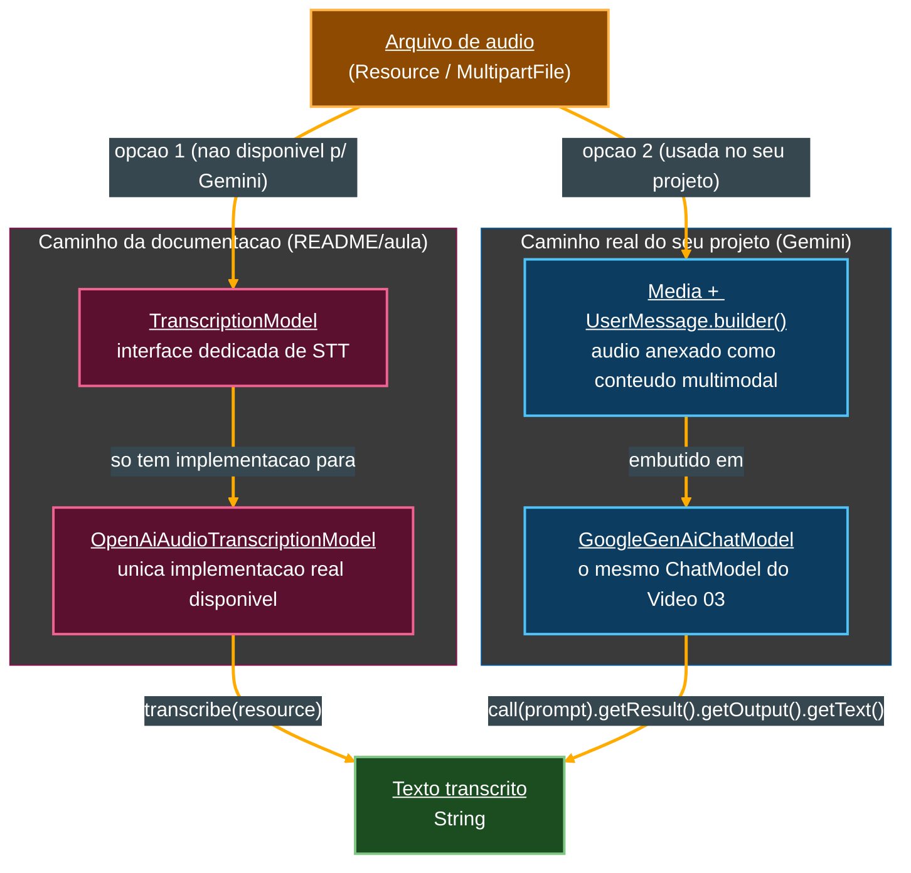

# Tutorial de Estudos — Desenvolvendo sua API Inteligente com Reconhecimento de Fala e Spring Boot

**Continuação — Vídeo 06 (Transcription API: Transformando Áudio em Texto)**

- Curso: NTT Data — Jornada Tech (DIO) · Módulo 4 — Curso 5: "Desenvolvendo sua API Inteligente com Reconhecimento de Fala e Spring Boot"
- Instrutor: Thiago Poiani (Principal Engineer at Skip)
- Projeto: `budgeting`
- Documento de referência pessoal — nível iniciante em Java

---

## Sobre esta atualização

Este arquivo dá continuidade ao tutorial já existente (`001-...md`, Vídeos 01 e 02; `002-...md`, Vídeo 03; `003-...md`, Vídeo 04; `004-...md`, Vídeo 05), cobrindo agora o **Vídeo 06**. Ele foi escrito a partir de três fontes conferidas de verdade, e não de suposição: a seção "Vídeo 06" do README atualizado, a transcrição bruta da aula (`transcricao.md`) e o estado real do projeto no `.zip` (`budgeting_ate_o_video06.zip`) — descompactado e lido arquivo por arquivo antes de qualquer linha deste documento ser escrita.

**Como usar este arquivo:** ele foi pensado para ser **concatenado** ao final do documento anterior (`004-Tutorial_Budgeting_Spring_AI_Video05.md`). A seção "Parte 6" abaixo deve ser inserida **depois** da "Parte 5 — Tool Calling: Executando Funções Reais com IA" e **antes** da seção "Pontos de atenção (continuação)" do documento anterior. As seções "Pontos de atenção (continuação)", "Glossário — novos termos", "Checkpoint do Vídeo 06", "Próximos passos (atualizado)" e "Diagramas" abaixo devem **substituir** as seções equivalentes do documento anterior.

> **⚠️ Nota importante e inédita até aqui: neste vídeo, a divergência entre a aula/README e o seu projeto real deixa de ser "só o nome das classes" e passa a ser "o mecanismo inteiro".** Em todos os vídeos anteriores (02 a 05), a troca de OpenAI por Google Gemini era uma simples substituição de nomes: `OpenAiChatModel` virava `GoogleGenAiChatModel`, `spring.ai.openai...` virava `spring.ai.google.genai...`, mas a **lógica** por trás continuava idêntica. Neste vídeo, isso **não é mais verdade**. O README e a aula usam a **Transcription API** dedicada do Spring AI (`TranscriptionModel`, `OpenAiAudioTranscriptionModel`, propriedades `spring.ai.openai.audio.transcription.*`) — mas essa API **não tem uma implementação para o Google Gemini** dentro do Spring AI. Por isso, o seu projeto real resolve o problema de um jeito estruturalmente diferente: em vez de usar um `TranscriptionModel`, ele reaproveita o próprio `GoogleGenAiChatModel` (o mesmo `ChatModel` usado desde o Vídeo 03) e envia o áudio como **conteúdo multimodal** dentro de uma mensagem de chat — um mecanismo totalmente diferente do explicado na documentação oficial. A Parte 6 explica primeiro o conceito **como a aula e o README apresentam** (a Transcription API "de livro", com nomes da OpenAI), e a seção **6.10, "O que o seu projeto realmente fez"**, detalha, linha a linha, o caminho alternativo efetivamente implementado no seu `.zip`. A seção de checkpoint, mais adiante, reflete exclusivamente esse caminho real.

---

## Parte 6 — Transcription API: Transformando Áudio em Texto (Vídeo 06)

Até o Vídeo 05, o projeto só sabia lidar com **texto**: um prompt em `String` entrava, uma resposta em `String` saía — seja via `ChatModel` (Vídeo 03), `ChatClient` (Vídeo 04) ou Tool Calling (Vídeo 05). O Vídeo 06 é o primeiro a lidar com **áudio** como entrada, implementando a etapa de **STT** (*Speech-to-Text*) do diagrama "A Nova Anatomia da API", apresentado logo no Vídeo 01 (seção 1.1 do primeiro tutorial) e citado como "próximo passo" desde então.

### 6.1. A `TranscriptionModel`, segundo a documentação oficial

A aula abre, mais uma vez, na documentação do Spring AI — agora na seção **Models → Audio Models → Transcription API**. Ali, dois pontos de partida:

- A `TranscriptionModel` é a interface que **unifica** o acesso a serviços de conversão de fala em texto (*speech-to-text*), seguindo exatamente o mesmo princípio de **abstração por interface comum** já visto para `ChatModel` (seção 3.1 do segundo tutorial): o código de negócio depende da interface, não da implementação de um provedor específico.
- A seção **Supported Providers** da documentação lista, atualmente, apenas dois provedores com implementação pronta: **OpenAI's Whisper API** e **Azure OpenAI Whisper API**. **O Google Gemini não está nessa lista** — um detalhe que, como já adiantado na nota de abertura, é o que muda tudo neste vídeo.

```java
public interface TranscriptionModel extends Model<AudioTranscriptionPrompt, AudioTranscriptionResponse> {

    /**
     * Transcribes the audio from the given prompt.
     */
    AudioTranscriptionResponse call(AudioTranscriptionPrompt transcriptionPrompt);

    /**
     * A convenience method for transcribing an audio resource.
     */
    default String transcribe(Resource resource) {
        AudioTranscriptionPrompt prompt = new AudioTranscriptionPrompt(resource);
        return this.call(prompt).getResult().getOutput();
    }
}
```

- **`public interface TranscriptionModel extends Model<AudioTranscriptionPrompt, AudioTranscriptionResponse>`** — a mesma estrutura de `ChatModel` (seção 3.1 do segundo tutorial): a interface `Model<I, O>` genérica é "especializada" com os tipos de entrada (`AudioTranscriptionPrompt`) e saída (`AudioTranscriptionResponse`) próprios deste domínio.
- **`AudioTranscriptionResponse call(AudioTranscriptionPrompt transcriptionPrompt);`** — o método "completo", que recebe um envelope de requisição e devolve um envelope de resposta rico (com metadados) — o mesmo padrão do `ChatResponse` visto no Vídeo 03.
- **`default String transcribe(Resource resource) {...}`** — assim como `ChatModel` tinha um `call(String message)` de conveniência (seção 3.1), a `TranscriptionModel` tem um método `default` (conceito já explicado na seção 3.1 do segundo tutorial) chamado `transcribe`, que recebe diretamente um `Resource` (o áudio) e já devolve o texto transcrito pronto, como `String` — internamente, ele apenas monta um `AudioTranscriptionPrompt` e delega para o `call` completo, extraindo o texto do resultado.
- **`Resource`** — uma interface do próprio Spring Framework (não é exclusiva de IA) que representa, de forma abstrata, "um recurso de dados que pode ser lido" — pode vir de um caminho de arquivo no disco, do *classpath* da aplicação, de uma URL, de um array de bytes, entre outras origens. É o mesmo tipo de abstração já vista, sem nome, quando o `MultipartFile` de um upload precisa virar algo que o Spring AI entenda (seção 6.9 adiante).

### 6.2. `AudioTranscriptionPrompt` e `AudioTranscriptionResponse`

```java
Resource audioFile = new FileSystemResource("/path/to/audio.mp3");
AudioTranscriptionPrompt prompt = new AudioTranscriptionPrompt(
    audioFile,
    options
);
```

```java
AudioTranscriptionResponse response = model.call(prompt);
String transcribedText = response.getResult().getOutput();
AudioTranscriptionResponseMetadata metadata = response.getMetadata();
```

- **`AudioTranscriptionPrompt`** — o equivalente, para áudio, do `Prompt` já estudado no Vídeo 03 (seção 3.3 do segundo tutorial): um "envelope" que empacota o dado de entrada (aqui, o `Resource` do áudio) junto com as opções (`options`) daquela chamada específica.
- **`AudioTranscriptionResponse`** — o equivalente ao `ChatResponse`: `.getResult().getOutput()` devolve o texto transcrito (aqui já como `String` pura, diferente do `ChatResponse`, que exigia `.getText()` no final — seção 3.9 do segundo tutorial), e `.getMetadata()` dá acesso a informações adicionais sobre a transcrição.

### 6.3. Exemplo de serviço *provider-agnostic*: `TranscriptionService`

A documentação reforça a proposta de abstração com um exemplo de serviço Spring completo:

```java
@Service
public class TranscriptionService {

    private final TranscriptionModel transcriptionModel;

    public TranscriptionService(TranscriptionModel transcriptionModel) {
        this.transcriptionModel = transcriptionModel;
    }

    public String transcribeAudio(Resource audioFile) {
        return transcriptionModel.transcribe(audioFile);
    }

    public String transcribeWithOptions(Resource audioFile, AudioTranscriptionOptions options) {
        AudioTranscriptionPrompt prompt = new AudioTranscriptionPrompt(audioFile, options);
        AudioTranscriptionResponse response = transcriptionModel.call(prompt);
        return response.getResult().getOutput();
    }
}
```

- **`@Service`** — uma anotação do Spring (uma especialização de `@Component`, já mencionada indiretamente desde o Vídeo 02) que marca a classe como um componente de **camada de serviço**, gerenciado como *bean* pelo Spring — o mesmo princípio de injeção de dependência via construtor já usado em todos os controllers do projeto (seções 3.10, 4.8 e no `TranscriptionController` real, seção 6.10 adiante), aqui aplicado a uma classe que não é um controller REST.
- A classe injeta `TranscriptionModel` (a **interface**, não uma implementação concreta como `OpenAiAudioTranscriptionModel`) — o mesmo padrão de "programar contra a interface" já usado, por exemplo, no `TranscriptionController` real do seu projeto (seção 6.10).

> **Este `TranscriptionService` chegou a ser criado no projeto?**
> Não. Esta classe é apenas um exemplo ilustrativo da documentação oficial do Spring AI, citado na aula para reforçar a ideia de abstração por interface — nenhum arquivo `TranscriptionService.java` existe no seu `.zip`. A funcionalidade real de transcrição do projeto foi implementada direto no controller (seção 6.10).

### 6.4. Propriedades específicas do provedor OpenAI

A documentação passa então para a página de referência do provedor **OpenAI** (`openai-transcriptions.html`), detalhando as propriedades disponíveis sob o prefixo `spring.ai.openai.audio.transcription.options`:

- **`model`** — qual variante do Whisper usar (a aula usa `whisper-1`).
- **`response-format`** — o formato do texto devolvido: `json`, `text`, ou formatos de legenda como `srt` e `vtt` (que incluem minutagem, úteis para gerar legendas sincronizadas de vídeo).
- **`language`** — o idioma do áudio, no formato **ISO-639-1** (seção 6.5 a seguir), usado para melhorar a precisão e a velocidade da transcrição. Para português, o código é `pt`, sem distinção entre a variante europeia e a brasileira.
- **`prompt`** — um texto opcional que dá **contexto** ao modelo sobre o conteúdo esperado do áudio, ajudando-o a acertar termos específicos do domínio (explorado em detalhe na seção 6.6).
- **`temperature`** — o mesmo conceito já visto para chat (seção 3.9 do segundo tutorial): controla o quanto o modelo pode "variar" a saída. Para transcrição, o valor `0` é recomendado, já que o objetivo é reproduzir fielmente o que foi dito, e não gerar texto criativo.

### 6.5. ISO-639-1, explicado do zero

Como parte da aula, uma pesquisa rápida confirma o significado do termo: **ISO-639-1** é um padrão internacional que define códigos de **duas letras** para representar idiomas de forma padronizada em sistemas computacionais — por exemplo, `en` para inglês, `fr` para francês, `pt` para português, `zh` para chinês. É o mesmo tipo de padronização usada, por exemplo, em atributos `lang` de páginas HTML.

### 6.6. Preparando os áudios de teste

Para testar a transcrição na prática, a aula usa áudios sintéticos: o **Gemini** (o próprio modelo de IA generativa, aqui usado apenas para *gerar* fala, e não para transcrevê-la) lê em voz alta seis frases curtas sobre gastos financeiros do dia a dia — por exemplo, "gastando R$ 40 na padaria" ou "cinema com pipoca por R$ 90". Esses seis arquivos de áudio (`recording-1` a `recording-6`) são organizados em uma pasta `resources/audio` dentro do módulo de **testes** do projeto (e não em `src/main/resources`, já que servem apenas para os testes de integração, não para a aplicação em produção).

> **Por que colocar os áudios em `src/test/resources`, e não em `src/main/resources`?**
> Porque, estando dentro da estrutura padrão de *resources* dos **testes**, o Spring consegue carregá-los automaticamente do *classpath* de teste através de um `ClassPathResource` (seção 6.8) — o mesmo mecanismo, já do próprio Spring Framework, usado para localizar qualquer arquivo estático que "viaja junto" com o código compilado, sem precisar de um caminho absoluto de disco.

### 6.7. O teste de integração: da classe vazia à versão parametrizada

A aula evolui a classe de teste em etapas, seguindo a mesma convenção de nomenclatura já usada desde o Vídeo 03 (sufixo `IT`, de *Integration Test*, seção 3.9 do segundo tutorial). Primeiro, uma classe vazia (`OpenAiTranscriptionModelIT`); depois, as opções de transcrição no `application.properties`:

```properties
spring.ai.openai.audio.transcription.options.model=whisper-1
spring.ai.openai.audio.transcription.options.language=pt
spring.ai.openai.audio.transcription.options.temperature=0
spring.ai.openai.audio.transcription.options.response-format=text
spring.ai.openai.audio.transcription.options.prompt=Áudio em português brasileiro. \
  Áudio contém descrição de gastos financeiros. \
  As frases geralmente contêm: \
  - um valor em reais (número + "reais"); \
  - uma ação (gastei, paguei, comprei); \
  - um local ou estabelecimento (mercado, farmácia, restaurante, loja, etc.).
```

- O **prompt de contexto** (seção 6.4) é o destaque aqui: ele não pergunta nada ao modelo, apenas descreve, em linguagem natural, o **padrão esperado** das frases do áudio (valor + ação + local). Essa técnica — dar contexto de domínio a um modelo de IA antes de pedir uma tarefa — é a mesma ideia de fundo do prompt de sistema já estudado no Vídeo 04 (seção 4.1 do terceiro tutorial), só que aplicada a uma opção de transcrição, e não a uma conversa de chat.
- **A barra invertida (`\`) no final de cada linha** — em um arquivo `.properties`, esse caractere indica que o valor da propriedade **continua na linha seguinte**. É um recurso de formatação para deixar um texto longo mais legível no arquivo, sem que ele conte como quebra de linha real dentro do valor da propriedade.

E, finalmente, o teste parametrizado completo:

```java
@SpringBootTest
@EnabledIfEnvironmentVariable(named = "OPENAI_API_KEY", matches = ".+")
public class OpenAiTranscriptionModelIT {

    @Autowired
    OpenAiAudioTranscriptionModel openAiTranscriptionModel;

    @ParameterizedTest
    @CsvSource({
            "recording-1.m4a, 80 reais",
            "recording-2.m4a, 40 reais",
            "recording-3.m4a, 120 reais",
            "recording-4.m4a, 90 reais",
            "recording-5.m4a, 200 reais",
            "recording-6.m4a, 60 reais",
    })
    public void should_containExpectedKeywords_when_audioFilesAreProcessed(String fileName, String expectedKeyword) {
        var recording = new ClassPathResource("audio/" + fileName);

        var response = openAiTranscriptionModel.call(recording);

        assertThat(response).contains(expectedKeyword);
        System.out.println(response);
    }
}
```

### 6.8. Conceitos novos deste teste, explicados do zero

- **`OpenAiAudioTranscriptionModel`** — a implementação concreta de `TranscriptionModel` específica da OpenAI, criada automaticamente pela **auto-configuração** (o mesmo mecanismo já visto desde o Vídeo 02) a partir das propriedades `spring.ai.openai.audio.transcription.*` do `application.properties`.
- **`@ParameterizedTest`** — uma anotação do **JUnit 5** que substitui `@Test` quando se quer executar o **mesmo** método de teste várias vezes, cada vez com um conjunto diferente de valores de entrada, em vez de copiar e colar o mesmo teste seis vezes (um para cada áudio). É um recurso próprio para evitar repetição de código de teste.
- **`@CsvSource({...})`** — uma das formas de **fornecer** os dados para um `@ParameterizedTest`: cada linha da lista é uma string no formato CSV (*Comma-Separated Values*, valores separados por vírgula), onde cada coluna vira um parâmetro do método de teste, na ordem declarada. Aqui, cada linha tem duas colunas: o nome do arquivo de áudio e a palavra-chave esperada na transcrição.
- **`public void should_containExpectedKeywords_when_audioFilesAreProcessed(String fileName, String expectedKeyword)`** — repare que os parâmetros do método (`fileName`, `expectedKeyword`) correspondem, na ordem, às colunas de cada linha do `@CsvSource` — o JUnit invoca este método uma vez **para cada linha**, passando os valores correspondentes.
- **`new ClassPathResource("audio/" + fileName)`** — `ClassPathResource` é uma implementação concreta da interface `Resource` (seção 6.1), que localiza um arquivo dentro do **classpath** (a pasta `resources`, tanto de produção quanto de teste) da aplicação — exatamente o mecanismo antecipado na nota da seção 6.6.
- **`openAiTranscriptionModel.call(recording)`** — repare que aqui é usada uma sobrecarga de `call` que aceita um `Resource` **diretamente** (sem precisar montar um `AudioTranscriptionPrompt` manualmente) e já devolve a `String` transcrita — um atalho de conveniência equivalente, na prática, ao método `default transcribe(Resource)` visto na seção 6.1, mas exposto aqui como uma variante do próprio `call`.
- **`assertThat(response).contains(expectedKeyword)`** — a mesma lógica de asserção "tolerante" já explicada no Vídeo 04 (seção 4.5 do terceiro tutorial): em vez de exigir uma transcrição **idêntica** à frase original (`equals`), basta que o texto transcrito **contenha** a palavra-chave esperada (por exemplo, "80 reais").

### 6.9. Resultado do teste e a limitação encontrada

Ao rodar o teste parametrizado, o painel de resultados mostra **4 testes passando e 2 falhando**, de um total de 6. Um exemplo de sucesso: o áudio 4 foi transcrito como *"Fui no cinema com o combo de pipoca e gastei 90 reais sozinho."* — contendo corretamente "90 reais". Já um dos casos de falha mostra o motivo: o áudio *"Sai para jantar ontem e a conta ficou em duzentos reais por pessoa."* foi transcrito com o valor **por extenso** ("duzentos reais") em vez de numérico ("200 reais"), fazendo a asserção `contains("200 reais")` falhar — mesmo a transcrição estando, em essência, **correta**.

> **Por que isso importa para o projeto `budgeting`?**
> Esse comportamento é um lembrete prático de que um modelo de *speech-to-text* nem sempre normaliza números da forma esperada pelo código que consome o resultado. Para um assistente financeiro real (o caso de uso central do projeto, seção 1.4 do primeiro tutorial), isso significa que a extração de valores a partir do texto transcrito provavelmente vai precisar de alguma lógica adicional (ou de outro prompt/tool) capaz de lidar tanto com "200 reais" quanto com "duzentos reais" — um problema que os próximos vídeos, ao integrar Tool Calling com a transcrição, talvez precisem enfrentar.

### 6.10. O que o seu projeto realmente fez: transcrição via multimodalidade, com Gemini

Como adiantado na nota de abertura, o Google Gemini **não tem** uma implementação de `TranscriptionModel` no Spring AI — só OpenAI e Azure OpenAI (seção 6.1). Diante disso, o seu projeto seguiu um caminho **estruturalmente diferente**, aproveitando um recurso do próprio `GoogleGenAiChatModel` (o mesmo `ChatModel` de chat, usado desde o Vídeo 03): a capacidade de receber **áudio como parte do conteúdo de uma mensagem**, e não apenas texto. Isso se chama **multimodalidade** — a habilidade de um modelo de IA processar, na mesma chamada, mais de um tipo de mídia (texto, áudio, imagem, etc.).

Veja o teste real do seu `.zip`, `GeminiTranscriptionModelIT.java`:

```java
package dio.budgeting;

import org.junit.jupiter.api.condition.EnabledIfEnvironmentVariable;
import org.junit.jupiter.params.ParameterizedTest;
import org.junit.jupiter.params.provider.CsvSource;
import org.springframework.ai.chat.messages.UserMessage;
import org.springframework.ai.chat.prompt.Prompt;
import org.springframework.ai.content.Media;
import org.springframework.ai.google.genai.GoogleGenAiChatModel;
import org.springframework.beans.factory.annotation.Autowired;
import org.springframework.boot.test.context.SpringBootTest;
import org.springframework.core.io.ClassPathResource;
import org.springframework.util.MimeTypeUtils;

import java.io.IOException;
import java.util.List;

import static org.assertj.core.api.Assertions.assertThat;

@SpringBootTest
@EnabledIfEnvironmentVariable(named = "GEMINI_API_KEY", matches = ".+")
public class GeminiTranscriptionModelIT {

    @Autowired
    private GoogleGenAiChatModel chatModel;

    @ParameterizedTest
    @CsvSource({
            "recording-1.mp3, 80 reais",
            "recording-2.mp3, 40 reais",
            "recording-3.mp3, 120 reais",
            "recording-4.mp3, 90 reais",
            "recording-5.mp3, 200 reais",
            "recording-6.mp3, 60 reais"
    })
    public void should_containExpectedKeywords_when_audioFilesAreProcessed(String fileName, String expectedKeyword) throws IOException {
        var recording = new ClassPathResource("audio/" + fileName);
        assertThat(recording.exists()).isTrue();

        var audioMedia = new Media(MimeTypeUtils.parseMimeType("audio/mpeg"), recording);

        String promptTexto = """
            Transcreva o áudio a seguir com fidelidade em português brasileiro.
            Contexto do áudio: contém descrição de gastos financeiros.
            Retorne APENAS a transcrição do áudio.
            """;

        var userMessage = UserMessage.builder()
                .text(promptTexto)
                .media(List.of(audioMedia))
                .build();

        var prompt = Prompt.builder()
                .messages(List.of(userMessage))
                .build();

        var result = chatModel.call(prompt).getResult();
        assertThat(result).isNotNull();

        var output = result.getOutput();
        assertThat(output).isNotNull();

        var response = output.getText();
        assertThat(response).isNotNull().isNotEmpty();

        assertThat(response).containsIgnoringCase(expectedKeyword);
        System.out.println("Arquivo: " + fileName + " -> Transcrição: " + response);
    }
}
```

Explicando cada peça nova, na ordem em que aparece:

- **`@ParameterizedTest` / `@CsvSource`** — o mesmo mecanismo já explicado na seção 6.8, reaproveitado aqui. A única diferença de conteúdo é a extensão dos arquivos: `.mp3`, e não `.m4a` como no README (ver item 18 de "Pontos de atenção").
- **`@Autowired private GoogleGenAiChatModel chatModel;`** — repare que o campo injetado **não** é um `TranscriptionModel` nem qualquer tipo relacionado a áudio: é o mesmo `ChatModel` de sempre, usado para chat de texto desde o Vídeo 03. Toda a "mágica" deste teste está em **como** ele é chamado, não em qual tipo é injetado.
- **`new ClassPathResource("audio/" + fileName)`** — igual à seção 6.8: localiza o áudio dentro do classpath de teste.
- **`assertThat(recording.exists()).isTrue();`** — uma verificação extra, ausente do exemplo do README: confirma, **antes** de qualquer chamada à IA, que o arquivo de áudio realmente existe no classpath — uma checagem defensiva que evita gastar uma chamada de API (e tempo) só para descobrir, depois, que o problema era um arquivo ausente.
- **`new Media(MimeTypeUtils.parseMimeType("audio/mpeg"), recording)`** — aqui está o coração da abordagem multimodal:
  - **`Media`** — uma classe do Spring AI (pacote `org.springframework.ai.content`) que representa um pedaço de conteúdo **não textual** (áudio, imagem, etc.) que pode ser anexado a uma mensagem enviada ao modelo. É o mesmo tipo já citado, de forma teórica, na seção 3.4 do segundo tutorial (`MediaContent`, uma das classes-base da *Message API* do Spring AI) — aqui, finalmente, usado na prática.
  - **`MimeTypeUtils`** — uma classe utilitária do próprio Spring Framework (não é específica de IA) para trabalhar com **tipos MIME**: uma convenção padronizada (`tipo/subtipo`, como `audio/mpeg`, `image/png`, `text/plain`) usada para identificar o formato de um arquivo, tanto na web quanto em APIs de IA. `.parseMimeType("audio/mpeg")` converte o texto `"audio/mpeg"` em um objeto `MimeType` que o Spring AI entende — `audio/mpeg` é, especificamente, o tipo MIME associado a arquivos `.mp3`.
  - Juntando as duas peças: `new Media(mimeType, resource)` embrulha o áudio (`recording`, um `Resource`) junto com a informação de **qual formato** ele tem, pronto para ser anexado a uma mensagem.
- **O texto do prompt (`promptTexto`), usando *text block* (`"""..."""`)** — a sintaxe de três aspas duplas é um recurso do Java (desde o Java 15) chamado **text block**: permite escrever um texto de várias linhas de forma legível, sem precisar concatenar `String`s com `+` ou escrever `\n` manualmente a cada quebra de linha. O conteúdo, em espírito, é equivalente ao `prompt` de contexto configurado via propriedade no exemplo da OpenAI (seção 6.7) — só que, aqui, passado diretamente como texto da mensagem, e não como uma *option* de transcrição (porque, tecnicamente, não existe uma "opção de transcrição" quando se está apenas conversando com um `ChatModel` comum).
- **`UserMessage.builder().text(promptTexto).media(List.of(audioMedia)).build()`** — a classe `UserMessage`, já apresentada na *Message API* (seção 3.4 do segundo tutorial) como "a mensagem enviada pelo usuário", ganha aqui, pela primeira vez no projeto, um uso concreto através do seu próprio **padrão builder** (o mesmo padrão já visto repetidas vezes, por exemplo na seção 3.9): `.text(...)` define a parte textual da mensagem (o prompt de contexto), e `.media(List.of(audioMedia))` anexa uma **lista** de conteúdos de mídia (aqui, com um único item: o áudio) à mesma mensagem. É essa combinação — texto **mais** áudio, na mesma mensagem — que caracteriza a chamada como multimodal.
- **`Prompt.builder().messages(List.of(userMessage)).build()`** — a classe `Prompt` (seção 3.3 do segundo tutorial) também ganha, aqui, seu próprio builder: em vez do construtor simples `new Prompt(texto, options)` usado no Vídeo 03, o builder recebe uma **lista de mensagens** (aqui, só a `userMessage` recém-criada) e monta o envelope completo da requisição.
- **`chatModel.call(prompt).getResult()`** — a chamada final ao modelo é feita com o **mesmo método `call(Prompt)`** já usado desde o Vídeo 03 (seção 3.9 do segundo tutorial) para conversas de texto puro — reforçando que, do ponto de vista do `ChatModel`, não existe uma chamada "especial" para áudio: o que muda é só o **conteúdo** da mensagem enviada dentro do `Prompt`.
- **`.getResult().getOutput().getText()`** — a mesma cadeia de extração de texto de um `ChatResponse` já vista no Vídeo 03 (seção 3.9 do segundo tutorial): `getResult()` pega o resultado principal, `getOutput()` pega a mensagem de resposta do assistente, `.getText()` extrai o texto puro dela.
- **`assertThat(response).containsIgnoringCase(expectedKeyword)`** — uma variação do `.contains(...)` já visto na seção 6.8/no Vídeo 04 (seção 4.5 do terceiro tutorial): `containsIgnoringCase` verifica que o texto contém a palavra-chave esperada **sem diferenciar maiúsculas de minúsculas** — uma tolerância a mais do que o README/aula original, útil já que o Gemini pode, por exemplo, escrever "Reais" com inicial maiúscula em algum contexto.

E, correspondendo à seção 6.10 acima do controller REST do README, a classe real `TranscriptionController.java`:

```java
package dio.budgeting;

import org.springframework.ai.chat.messages.UserMessage;
import org.springframework.ai.chat.prompt.Prompt;
import org.springframework.ai.content.Media;
import org.springframework.ai.google.genai.GoogleGenAiChatModel;
import org.springframework.http.MediaType;
import org.springframework.util.MimeTypeUtils;
import org.springframework.web.bind.annotation.PostMapping;
import org.springframework.web.bind.annotation.RequestMapping;
import org.springframework.web.bind.annotation.RequestParam;
import org.springframework.web.bind.annotation.RestController;
import org.springframework.web.multipart.MultipartFile;

import java.util.List;

@RestController
@RequestMapping("/api")
public class TranscriptionController {

    private static final String TRANSCRIPTION_PROMPT = """
            Transcreva o áudio a seguir com fidelidade em português brasileiro.
            Contexto do áudio: contém descrição de gastos financeiros.
            Retorne APENAS a transcrição do áudio.
            """;

    private final GoogleGenAiChatModel chatModel;

    // O Gemini (Google GenAI) não expõe um TranscriptionModel dedicado (isso é
    // exclusivo do starter da OpenAI/Whisper). Em vez disso, o áudio é enviado
    // como mídia multimodal para o GoogleGenAiChatModel, no mesmo caminho já
    // validado em GeminiTranscriptionModelIT.
    public TranscriptionController(GoogleGenAiChatModel chatModel) {
        this.chatModel = chatModel;
    }

    @PostMapping(value = "/transcribe", consumes = MediaType.MULTIPART_FORM_DATA_VALUE)
    String transcribe(@RequestParam("file") MultipartFile file) {
        var audioMedia = new Media(MimeTypeUtils.parseMimeType("audio/mpeg"), file.getResource());

        var userMessage = UserMessage.builder()
                .text(TRANSCRIPTION_PROMPT)
                .media(List.of(audioMedia))
                .build();

        var prompt = Prompt.builder()
                .messages(List.of(userMessage))
                .build();

        return chatModel.call(prompt).getResult().getOutput().getText();
    }
}
```

- **`private static final String TRANSCRIPTION_PROMPT = """...""";`** — o mesmo texto de prompt usado no teste (seção acima), mas extraído para uma **constante de classe** (`static final`, conceitos já vistos na seção 2.5 do primeiro tutorial — `static` pertence à classe, `final` não pode ser reatribuído): já que o texto é sempre o mesmo em toda chamada do endpoint, não faz sentido recriá-lo a cada requisição.
- **O comentário acima do construtor** — um comentário `//` de várias linhas (conceito já visto na seção 2.1 do primeiro tutorial) explicando, no próprio código, **por que** essa abordagem multimodal foi escolhida no lugar da `TranscriptionModel` da documentação — uma boa prática de deixar registrada, para quem ler o código depois, a razão de uma decisão de design que diverge do "caminho óbvio" da documentação.
- **`@PostMapping(value = "/transcribe", consumes = MediaType.MULTIPART_FORM_DATA_VALUE)`** — igual em espírito ao endpoint descrito no README (`POST /api/transcribe`, consumindo `multipart/form-data`): `@PostMapping` mapeia requisições HTTP **POST** (diferente do `@GetMapping` usado até aqui, já que enviar um arquivo binário como parte de uma URL, como no `GET`, não é uma prática adequada); `consumes = MediaType.MULTIPART_FORM_DATA_VALUE` declara que este endpoint espera um corpo de requisição do tipo **multipart/form-data** — o formato padrão para enviar arquivos via HTTP.
- **`MultipartFile file`, via `@RequestParam("file")`** — `MultipartFile` é uma interface do Spring que representa um arquivo recebido em uma requisição `multipart/form-data`; `@RequestParam("file")` vincula esse parâmetro ao campo chamado `"file"` dentro do corpo multipart da requisição (o mesmo nome usado, por exemplo, no cliente HTTP de teste da seção 6.11).
- **`file.getResource()`** — converte o `MultipartFile` recebido em um `Resource` (a mesma interface genérica da seção 6.1), a "ponte" comum entre "arquivo vindo de upload HTTP" e "arquivo que o Spring AI sabe processar" — usada tanto aqui quanto, de forma equivalente, no exemplo do README (que também usava `file.getResource()`, ainda que passando o resultado direto para `transcriptionModel.transcribe(resource)`).
- **O restante do método (`Media`, `UserMessage.builder()`, `Prompt.builder()`, `chatModel.call(...)`)** — exatamente a mesma sequência já explicada em detalhe no teste `GeminiTranscriptionModelIT` acima, agora aplicada dentro de um controller REST, com o áudio vindo de um upload HTTP em vez de um `ClassPathResource` de teste.

### 6.11. Testando o endpoint na prática

Com a aplicação em execução, uma requisição `POST` é enviada para `http://localhost:8080/api/transcribe`, com corpo `multipart/form-data` contendo um arquivo de áudio (por exemplo, `recording-1.m4a`, no exemplo do README). A resposta retorna `HTTP 200`, com o texto transcrito no corpo — no exemplo do README, algo como *"Passei na farmácia rapidinho e deixei R$ 80 em três itens"*. O mesmo teste, no seu projeto real, funcionaria de forma equivalente, apontando para um dos arquivos `.mp3` de `src/test/resources/audio` (seção "Pontos de atenção", item 18).

---

## Pontos de atenção (continuação — divergências do Vídeo 06)

Dando sequência à lista já registrada nos tutoriais anteriores (itens 1 a 16), a comparação linha a linha entre a aula/README e o `.zip` real revela mais cinco pontos nesta etapa — o primeiro deles é, de longe, o mais estrutural de todo o curso até aqui:

17. **Mecanismo inteiro de transcrição: `TranscriptionModel`/`OpenAiAudioTranscriptionModel` (aula/README) × `GoogleGenAiChatModel` com mensagem multimodal (`Media`) (seu projeto) — divergência estrutural, não apenas de nomenclatura.** Diferente de todas as divergências anteriores (só trocar `OpenAi*` por `GoogleGenAi*`), aqui **não existe** uma classe `GoogleGenAiAudioTranscriptionModel` equivalente para se trocar — porque o Spring AI, na versão usada pelo curso, só implementa a Transcription API para OpenAI e Azure OpenAI (seção 6.1). No seu `.zip`:

    - Não existe nenhuma classe `OpenAiTranscriptionModelIT` nem `GoogleGenAiAudioTranscriptionModel` — o teste real chama-se `GeminiTranscriptionModelIT` e injeta um `GoogleGenAiChatModel` comum (o mesmo já usado desde o Vídeo 03).
    - Não existe nenhuma propriedade `spring.ai.openai.audio.transcription.*` nem `spring.ai.model.audio.transcription=openai` no `application.properties` real.
    - O áudio é transcrito enviando-o como um objeto `Media` dentro de uma `UserMessage`, processada pelo `ChatModel` de chat comum — a técnica de **multimodalidade**, explicada em detalhe na seção 6.10.

    **Impacto prático:** funcional, nenhum — os testes (seção 6.10) confirmam que a transcrição funciona corretamente com essa abordagem alternativa. O impacto é **conceitual**: se você seguir literalmente os próximos vídeos do curso (que provavelmente vão continuar assumindo a existência de um `TranscriptionModel`/`transcriptionModel.transcribe(...)`), vai precisar adaptar cada trecho para o padrão `ChatModel` + `Media` + `UserMessage.builder()` já validado aqui — e não para uma classe `GoogleGenAiAudioTranscriptionModel` que não existe. Vale registrar, também, que essa é uma limitação real e documentada do próprio Spring AI (a ausência de um `TranscriptionModel` para Gemini), não um erro ou atalho tomado no projeto.

    > **Recomendação:** o comentário deixado no próprio `TranscriptionController.java` (reproduzido na seção 6.10) já documenta essa decisão de forma clara — um bom exemplo de como registrar, no código, o "porquê" de uma divergência da documentação "oficial" de um framework.

18. **Extensão dos arquivos de áudio: `.m4a` (README/aula) × `.mp3` (seu projeto real).** O README e a transcrição da aula citam `recording-1.m4a` a `recording-6.m4a`; no seu `.zip`, os seis arquivos em `src/test/resources/audio/` são, de fato, `recording-1.mp3` a `recording-6.mp3` — consistente com o tipo MIME `audio/mpeg` usado explicitamente no código (seção 6.10), que corresponde a arquivos `.mp3`, e não `.m4a`.

    **Impacto prático:** nenhum — apenas um formato de áudio diferente, ambos amplamente suportados. Vale o registro para não estranhar, ao seguir os próximos vídeos, caso eles continuem citando a extensão `.m4a` do README.

19. **`GeminiChatModelITVer1.java`, presente no checkpoint do Vídeo 05, não existe mais no `.zip` deste vídeo.** Comparando a lista de arquivos de `src/test/java/dio/budgeting/` entre os dois checkpoints, o arquivo `GeminiChatModelITVer1.java` (a versão "simples", registrada no checkpoint do Vídeo 05 — ver seção do Vídeo 03 no tutorial anterior) foi removido. Os demais arquivos de teste dos vídeos anteriores (`BudgetingApplicationTests`, `GeminiChatModelIT`, `GeminiChatClientIT`, `ToolCallingIT`) continuam presentes e inalterados.

    **Impacto prático:** nenhum — `GeminiChatModelIT` (a versão "completa", que também está presente) já cobre uma integração equivalente com o `ChatModel`. É apenas uma limpeza de código de teste redundante, não relacionada ao conteúdo do Vídeo 06 em si.

20. **Nova propriedade em `application.properties`: `spring.ai.google.genai.chat.options.temperature=0.0`, ausente até o checkpoint do Vídeo 05.** O arquivo real ganhou duas linhas novas em relação ao Vídeo 05 (uma delas um comentário explicativo):

    ```properties
    # Configurações globais do modelo (equivalente ao temperature=0)
    spring.ai.google.genai.chat.options.temperature=0.0
    ```

    Isso é coerente com a recomendação da própria documentação da OpenAI (seção 6.4): usar `temperature=0` para tornar a saída mais determinística, já que o objetivo é **transcrever fielmente**, e não gerar texto criativo — só que, no seu projeto, essa configuração foi aplicada de forma **global**, a todas as chamadas do `GoogleGenAiChatModel` (incluindo, por exemplo, o `ChatClientController` e o `ToolCallingIT` dos vídeos anteriores), e não apenas às chamadas de transcrição — uma diferença natural de quando não existe uma seção de propriedades exclusiva de transcrição (como `spring.ai.openai.audio.transcription.options.temperature`) para usar no lugar.

    **Impacto prático:** baixo, mas vale atenção — como essa é uma propriedade **global** de chat, ela também passa a afetar as respostas do `ChatClientController` (Vídeo 04) e do `ToolCallingIT` (Vídeo 05), tornando-as mais determinísticas/menos "criativas" do que estavam antes deste vídeo, ainda que nenhum teste anterior tenha sido registrado como quebrado por causa disso.

21. **Asserção: `assertThat(response).contains(expectedKeyword)` (README) × `assertThat(response).containsIgnoringCase(expectedKeyword)` (seu projeto real).** Já detalhado na seção 6.10: o teste real usa uma variante do AssertJ (biblioteca já apresentada na seção 3.9 do segundo tutorial) que ignora diferença entre maiúsculas e minúsculas.

    **Impacto prático:** nenhum — é uma asserção **mais tolerante** do que a do README, reduzindo a chance de falso-negativo por causa só de capitalização.

---

## Glossário — novos termos (Vídeo 06)

Estes termos se somam ao glossário já existente nos tutoriais anteriores (que cobrem Java, Spring, IA e ferramentas até o Vídeo 05) — apenas os termos que ainda não haviam aparecido.

| Termo | Significado |
|---|---|
| `TranscriptionModel` | Interface do Spring AI (`org.springframework.ai.audio.transcription`) que unifica o acesso a serviços de conversão de fala em texto (*speech-to-text*), com implementações prontas apenas para OpenAI/Whisper e Azure OpenAI no Spring AI usado neste curso. |
| `AudioTranscriptionPrompt` / `AudioTranscriptionResponse` | Classes de requisição e resposta da `TranscriptionModel`, equivalentes a `Prompt`/`ChatResponse` no mundo do chat: empacotam o áudio de entrada (e opções) e devolvem o texto transcrito (e metadados). |
| `Resource` (Spring Framework) | Interface do próprio Spring (não exclusiva de IA) que representa, de forma abstrata, um recurso de dados legível — pode vir de um arquivo em disco, do classpath, de uma URL, de um upload HTTP, entre outras origens. |
| `ClassPathResource` | Implementação concreta de `Resource` que localiza um arquivo dentro do *classpath* da aplicação (pasta `resources`, de produção ou de teste). |
| ISO-639-1 | Padrão internacional de códigos de duas letras para representar idiomas (ex.: `pt`, `en`, `fr`), usado para configurar o idioma esperado de um áudio a ser transcrito. |
| `@ParameterizedTest` | Anotação do JUnit 5 que substitui `@Test` para executar o mesmo método de teste várias vezes, cada vez com um conjunto diferente de valores de entrada, evitando duplicar código de teste. |
| `@CsvSource` | Fonte de dados para um `@ParameterizedTest`: cada linha é uma string no formato CSV, cujas colunas viram, na ordem, os parâmetros do método de teste. |
| Multimodalidade (LLM multimodal) | Capacidade de um modelo de IA processar, na mesma chamada, mais de um tipo de conteúdo (texto, áudio, imagem, etc.) — usada no projeto para "transcrever" áudio enviando-o como parte de uma mensagem de chat comum, no lugar de uma API de transcrição dedicada. |
| `Media` | Classe do Spring AI (`org.springframework.ai.content`) que representa um pedaço de conteúdo não textual (áudio, imagem etc.) que pode ser anexado a uma mensagem (`UserMessage`) enviada a um modelo multimodal. |
| Tipo MIME (*MIME type*) | Convenção padronizada (`tipo/subtipo`, ex.: `audio/mpeg`, `image/png`, `text/plain`) usada para identificar o formato de um arquivo/conteúdo, tanto na web quanto em APIs de IA. |
| `MimeTypeUtils` | Classe utilitária do Spring Framework para criar e manipular objetos de tipo MIME a partir de texto (ex.: `MimeTypeUtils.parseMimeType("audio/mpeg")`). |
| `UserMessage.builder()` / `Prompt.builder()` | Variante, via padrão builder, de construir uma `UserMessage` (texto + mídia anexada) e um `Prompt` (lista de mensagens), como alternativa mais flexível aos construtores diretos (`new Prompt(texto, options)`) usados nos vídeos anteriores. |
| Text block (`"""..."""`) | Recurso do Java (desde o Java 15) para escrever textos de várias linhas de forma legível, sem concatenação manual com `+` ou `\n` explícito. |
| `MultipartFile` | Interface do Spring que representa um arquivo recebido em uma requisição HTTP do tipo `multipart/form-data` (upload de arquivo). |
| `multipart/form-data` | Formato de corpo de requisição HTTP usado para enviar arquivos (binários) junto com outros campos de formulário, em contraste com corpos JSON de texto puro. |
| `@PostMapping` (com `consumes`) | Variante de mapeamento de rota (como `@GetMapping`) para requisições HTTP `POST`; o atributo `consumes` declara qual tipo de conteúdo o endpoint aceita no corpo da requisição (ex.: `MediaType.MULTIPART_FORM_DATA_VALUE`). |
| `containsIgnoringCase` (AssertJ) | Variante do `.contains(...)` do AssertJ que verifica a presença de um trecho de texto ignorando diferenças entre maiúsculas e minúsculas. |

---

## Checkpoint do Vídeo 06

Estado do projeto conferido diretamente nos arquivos do `.zip` (`budgeting_ate_o_video06.zip`) — e não apenas na narrativa do README. Como já explicado na seção "Pontos de atenção" (item 17), ele reflete o uso do **Google Gemini via multimodalidade**, e não da Transcription API dedicada da OpenAI mostrada em aula.

### Estrutura de pastas

```
budgeting/
├── build.gradle                                 ← inalterado desde o Vídeo 03
├── settings.gradle                              ← inalterado
├── gradlew / gradlew.bat
├── gradle/wrapper/
└── src/
    ├── main/
    │   ├── java/dio/budgeting/
    │   │   ├── BudgetingApplication.java        ← inalterado
    │   │   ├── ChatModelController.java         ← inalterado desde o Vídeo 03
    │   │   ├── ChatClientController.java        ← inalterado desde o Vídeo 04
    │   │   └── TranscriptionController.java     ← novo neste vídeo
    │   └── resources/
    │       └── application.properties           ← alterado neste vídeo (temperature global)
    └── test/
        ├── java/dio/budgeting/
        │   ├── BudgetingApplicationTests.java   ← inalterado
        │   ├── GeminiChatModelIT.java           ← inalterado desde o Vídeo 03
        │   ├── GeminiChatClientIT.java          ← inalterado desde o Vídeo 04
        │   ├── ToolCallingIT.java               ← inalterado desde o Vídeo 05
        │   └── GeminiTranscriptionModelIT.java  ← novo neste vídeo
        └── resources/
            └── audio/                           ← novo neste vídeo
                ├── recording-1.mp3
                ├── recording-2.mp3
                ├── recording-3.mp3
                ├── recording-4.mp3
                ├── recording-5.mp3
                └── recording-6.mp3
```

A novidade estrutural em relação ao checkpoint do Vídeo 05 é a chegada de **um controller novo** (`TranscriptionController.java`), **um teste novo** (`GeminiTranscriptionModelIT.java`), **uma pasta de recursos de teste inteiramente nova** (`src/test/resources/audio`, com seis arquivos `.mp3`) e a alteração do `application.properties`. Como registrado no item 19 de "Pontos de atenção", o arquivo `GeminiChatModelITVer1.java` (presente até o checkpoint do Vídeo 05) foi removido.

### `build.gradle` e `settings.gradle`

Confirmados, byte a byte, como **idênticos** ao checkpoint do Vídeo 03 — nenhuma dependência nova foi necessária para a transcrição via multimodalidade, já que a classe `Media` e o suporte a mensagens multimodais fazem parte do mesmo `spring-ai-starter-model-google-genai` usado desde o Vídeo 02:

```groovy
dependencies {
    implementation 'org.springframework.boot:spring-boot-starter'
    testImplementation 'org.springframework.boot:spring-boot-starter-test'
    testRuntimeOnly 'org.junit.platform:junit-platform-launcher'

    implementation platform("org.springframework.ai:spring-ai-bom:2.0.0-M4")

//  implementation 'org.springframework.ai:spring-ai-starter-model-openai'
    implementation 'org.springframework.ai:spring-ai-starter-model-google-genai'

    implementation 'org.springframework.boot:spring-boot-starter-web'
}
```

### `src/main/resources/application.properties` (alterado)

```properties
spring.application.name=budgeting
#spring.ai.openai.api-key=${OPENAI_API_KEY}
spring.ai.google.genai.api-key=${GEMINI_API_KEY}
spring.ai.google.genai.chat.options.model=gemini-3-flash-preview

# Configurações globais do modelo (equivalente ao temperature=0)
spring.ai.google.genai.chat.options.temperature=0.0

logging.level.org.springframework.ai=DEBUG
```

Como registrado no item 20 de "Pontos de atenção", duas linhas novas em relação ao checkpoint do Vídeo 05: o comentário explicativo e a propriedade `spring.ai.google.genai.chat.options.temperature=0.0` — nenhuma propriedade de transcrição dedicada (`spring.ai.openai.audio.transcription.*` ou equivalente) existe neste arquivo, consistente com o item 17.

### `src/main/java/dio/budgeting/TranscriptionController.java` (novo)

```java
package dio.budgeting;

import org.springframework.ai.chat.messages.UserMessage;
import org.springframework.ai.chat.prompt.Prompt;
import org.springframework.ai.content.Media;
import org.springframework.ai.google.genai.GoogleGenAiChatModel;
import org.springframework.http.MediaType;
import org.springframework.util.MimeTypeUtils;
import org.springframework.web.bind.annotation.PostMapping;
import org.springframework.web.bind.annotation.RequestMapping;
import org.springframework.web.bind.annotation.RequestParam;
import org.springframework.web.bind.annotation.RestController;
import org.springframework.web.multipart.MultipartFile;

import java.util.List;

@RestController
@RequestMapping("/api")
public class TranscriptionController {

    private static final String TRANSCRIPTION_PROMPT = """
            Transcreva o áudio a seguir com fidelidade em português brasileiro.
            Contexto do áudio: contém descrição de gastos financeiros.
            Retorne APENAS a transcrição do áudio.
            """;

    private final GoogleGenAiChatModel chatModel;

    public TranscriptionController(GoogleGenAiChatModel chatModel) {
        this.chatModel = chatModel;
    }

    @PostMapping(value = "/transcribe", consumes = MediaType.MULTIPART_FORM_DATA_VALUE)
    String transcribe(@RequestParam("file") MultipartFile file) {
        var audioMedia = new Media(MimeTypeUtils.parseMimeType("audio/mpeg"), file.getResource());

        var userMessage = UserMessage.builder()
                .text(TRANSCRIPTION_PROMPT)
                .media(List.of(audioMedia))
                .build();

        var prompt = Prompt.builder()
                .messages(List.of(userMessage))
                .build();

        return chatModel.call(prompt).getResult().getOutput().getText();
    }
}
```

Explicado linha a linha na seção 6.10. O endpoint resultante é `POST /api/transcribe`, consumindo `multipart/form-data` com um campo `file`.

### `src/test/java/dio/budgeting/GeminiTranscriptionModelIT.java` (novo)

Reproduzido na íntegra e explicado linha a linha na seção 6.10 — usa `@ParameterizedTest`/`@CsvSource` com os seis arquivos `.mp3`, injeta `GoogleGenAiChatModel` (e não uma `TranscriptionModel`), e monta a chamada via `Media` + `UserMessage.builder()` + `Prompt.builder()`.

### `src/main/java/dio/budgeting/ChatModelController.java`, `ChatClientController.java` e `src/test/java/dio/budgeting/ToolCallingIT.java`

Confirmados como **idênticos**, byte a byte, aos checkpoints dos Vídeos 03, 04 e 05, respectivamente — nenhum desses arquivos foi tocado neste vídeo.

### Demais arquivos

`BudgetingApplication.java`, `BudgetingApplicationTests.java` e `GeminiChatModelIT.java`/`GeminiChatClientIT.java` seguem **inalterados** desde os checkpoints anteriores (já documentados em detalhe nos tutoriais dos Vídeos 02 a 05). Como registrado no item 19 de "Pontos de atenção", `GeminiChatModelITVer1.java` — presente no checkpoint do Vídeo 05 — não existe mais neste `.zip`.

> **Nota:** assim como nos checkpoints anteriores, o `.zip` também contém as pastas `.gradle/`, `build/` e `.idea/` (incluindo `budgeting.iml`), todas geradas/gerenciadas automaticamente pela ferramenta de build e pela IDE — não fazem parte deste checkpoint por não serem editadas manualmente.

---

## Próximos passos (atualizado): o que vem a partir do Vídeo 07

Com o Vídeo 06 já coberto neste documento, a sequência restante do curso (conferida no README) é:

- **Vídeo 07 — Speech API: Sintetizando Voz com Text-to-Speech:** deve implementar a etapa de **TTS**, fechando o pipeline de voz completo (áudio → texto → lógica → texto → áudio). Dada a limitação já encontrada neste vídeo (item 17 — Gemini sem `TranscriptionModel` dedicado), é bem possível que o mesmo tipo de divergência estrutural se repita: o Spring AI também só documenta a Speech API para OpenAI, então o projeto pode precisar, mais uma vez, de uma solução alternativa específica do Gemini para gerar áudio a partir de texto.
- **Vídeo 08 — Integração do Assistente: Orquestrando o Fluxo de Budget:** deve juntar STT (já coberto neste documento, ainda que por um caminho alternativo), Tool Calling (Vídeo 05) e TTS (Vídeo 07) em um fluxo único, aplicado ao estudo de caso do assistente de *budgeting* (seção 1.4 do primeiro tutorial) — muito provavelmente combinando o padrão multimodal (`Media` + `UserMessage`, validado aqui) com `.defaultTools(...)` (validado no Vídeo 05).
- **Vídeo 09 — Persistência e Infraestrutura: Configurando o Banco com Docker:** deve introduzir a camada de persistência real do projeto (provavelmente via Docker Compose), necessária para de fato guardar as transações extraídas por voz.
- **Vídeo 10 — Exposição REST: Implementando o TransactionController:** deve criar um novo `@RestController`, no mesmo estilo do `ChatModelController`/`ChatClientController`/`TranscriptionController` já construídos, agora expondo endpoints HTTP para o domínio de transações financeiras.
- **Vídeo 11 — Endpoint de Transcrição: Integrando Áudio ao Controller:** já parcialmente antecipado neste próprio Vídeo 06 (o `TranscriptionController` já existe e já funciona via multimodalidade) — deve aprofundar essa integração, possivelmente conectando-a diretamente ao fluxo de Tool Calling para de fato registrar uma transação a partir do áudio transcrito.
- **Vídeo 12 — Roadmap e Auditoria: Evoluindo a API Inteligente:** deve fechar o desenvolvimento com sugestões de evolução do projeto e, possivelmente, mecanismos de auditoria/observabilidade.
- **Vídeo 13 — Entendendo o Desafio:** provavelmente o desafio prático de encerramento do curso.

> **Sobre a divergência OpenAI × Gemini nos próximos vídeos, à luz do que foi aprendido aqui**
> Até o Vídeo 05, bastava aplicar uma "regra de tradução" simples: `OpenAi*` → `GoogleGenAi*`, `spring.ai.openai.*` → `spring.ai.google.genai.*`. O Vídeo 06 mostrou que essa regra **nem sempre existe** — quando a API específica (como a Transcription API) não tem implementação para o Gemini, é preciso buscar um caminho alternativo, e não apenas trocar nomes. Vale manter esse alerta para o Vídeo 07 (Speech API), que corre o mesmo risco: verifique, ao chegar lá, se existe de fato uma classe `GoogleGenAi*` equivalente à usada em aula antes de presumir que a mesma tradução simples vai funcionar.

---

## Diagramas: o que o Vídeo 06 acrescentou

### 1. Diagrama de blocos — dois caminhos possíveis para "transcrever um áudio" no Spring AI



**Como ler este diagrama:**

- Os dois "caminhos" (`DOC` e `REAL`) não são etapas sequenciais de um mesmo fluxo — são **duas formas alternativas** de resolver o mesmo problema ("transcrever um áudio"), e o diagrama existe justamente para deixar visualmente clara a divergência estrutural registrada no item 17 de "Pontos de atenção".
- O caminho `DOC` termina em uma implementação (`OpenAiAudioTranscriptionModel`) que **não está presente** no seu projeto — por isso a seta que sai de `AUDIO` para `TMODEL` é rotulada como "não disponível p/ Gemini": a interface `TranscriptionModel` existe no Spring AI, mas, sem uma implementação para o Gemini, ela não pode ser usada como está no seu `.zip`.
- O caminho `REAL` é o que efetivamente roda no seu projeto: em vez de uma API de transcrição dedicada, o mesmo `ChatModel` de chat (já em uso desde o Vídeo 03) é reaproveitado, com o áudio "disfarçado" de conteúdo multimodal dentro de uma mensagem comum.

### 2. Diagrama de sequência — o endpoint `POST /api/transcribe`, de ponta a ponta

```mermaid
%%{init: {'theme': 'base', 'themeVariables': {
    'actorBkg': '#2c2c2c',
    'actorBorder': '#ffab00',
    'actorTextColor': '#ffffff',
    'actorLineColor': '#ffab00',
    'signalColor': '#ffab00',
    'signalTextColor': '#ffffff',
    'labelBoxBkgColor': '#37474f',
    'labelBoxBorderColor': '#4fc3f7',
    'labelTextColor': '#ffffff',
    'loopTextColor': '#ffffff',
    'noteBkgColor': '#5c1030',
    'noteBorderColor': '#f06292',
    'noteTextColor': '#ffffff',
    'activationBkgColor': '#455a64',
    'activationBorderColor': '#cfd8dc'
}}}%%
sequenceDiagram
    participant Dev as Voce (IntelliJ HTTP Client)
    participant Tomcat as Tomcat embutido
    participant DispatcherServlet as Spring MVC
    participant Controller as TranscriptionController
    participant Model as GoogleGenAiChatModel
    participant API as API do Google Gemini

    Dev->>Tomcat: POST /api/transcribe (multipart/form-data, campo "file")
    Tomcat->>DispatcherServlet: encaminha a requisicao HTTP
    DispatcherServlet->>Controller: resolve @PostMapping("/transcribe")
    DispatcherServlet->>Controller: vincula MultipartFile ao parametro "file"

    Controller->>Controller: file.getResource()
    Controller->>Controller: new Media(audio/mpeg, resource)
    Controller->>Controller: UserMessage.builder().text(prompt).media(audioMedia).build()
    Controller->>Controller: Prompt.builder().messages(userMessage).build()

    Controller->>Model: chatModel.call(prompt)
    Model->>API: requisicao HTTPS com texto + audio anexado (multimodal)
    API-->>Model: resposta da LLM (transcricao em texto)
    Model-->>Controller: ChatResponse

    Controller->>Controller: getResult().getOutput().getText()
    Controller-->>DispatcherServlet: return da String (corpo da resposta)
    DispatcherServlet-->>Tomcat: monta resposta HTTP 200
    Tomcat-->>Dev: texto transcrito (ex.: "Gastei na farmacia... 80 reais...")

    classDef webNode fill:#0d3c61,stroke:#4fc3f7,stroke-width:2px,color:#ffffff
    classDef appNode fill:#5c1030,stroke:#f06292,stroke-width:2px,color:#ffffff
    classDef apiNode fill:#1b4d20,stroke:#81c784,stroke-width:2px,color:#ffffff
```

**Como ler este diagrama:**

- A estrutura geral é a mesma já vista nos diagramas de ciclo HTTP dos vídeos anteriores (`ChatModelController` no Vídeo 03, `ChatClientController` no Vídeo 04): requisição → Tomcat → Spring MVC → controller → `ChatModel` → API do provedor → resposta de volta. A diferença central deste diagrama está no **corpo da requisição** (`multipart/form-data` com um arquivo, em vez de um parâmetro de *query string* simples) e no **conteúdo enviado ao modelo** (texto + áudio anexado, em vez de só texto).
- Os quatro passos internos ao `Controller`, antes da chamada ao `Model` (`file.getResource()`, `new Media(...)`, `UserMessage.builder()...`, `Prompt.builder()...`), representam a montagem do envelope multimodal explicada em detalhe na seção 6.10 — nenhum deles envolve rede; é só a preparação, em memória, do objeto `Prompt` que será, só então, efetivamente enviado à API do Gemini na seta `Model->>API`.
- Repare que a seta `Model->>API` é rotulada explicitamente como "texto + áudio anexado (multimodal)" — a mesma seta, nos diagramas de `ChatModelController`/`ChatClientController` dos vídeos anteriores, carregava **apenas** texto. É essa única diferença, na prática, que faz o Gemini "se comportar como" um serviço de transcrição, sem que exista, tecnicamente, nenhuma API de transcrição dedicada por trás.

---

*Este é o quinto tutorial da série do curso "Desenvolvendo sua API Inteligente com Reconhecimento de Fala e Spring Boot", cobrindo o Vídeo 06 e projetado para ser concatenado ao documento que cobre os Vídeos 01 a 05. Os próximos tutoriais devem continuar a numeração (`006-...`, e assim por diante), cada um cobrindo um novo vídeo (ou uma nova etapa de código), sempre dando continuidade a este documento e ao estado do projeto então existente.*
