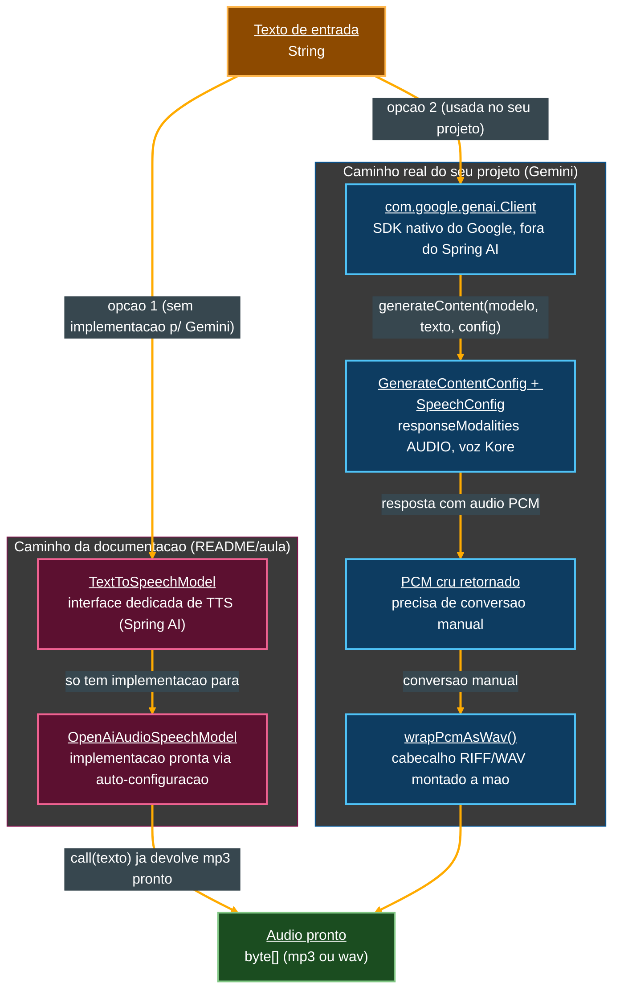

# Tutorial de Estudos — Desenvolvendo sua API Inteligente com Reconhecimento de Fala e Spring Boot

**Continuação — Vídeo 07 (Speech API: Sintetizando Voz com Text-to-Speech)**

- Curso: NTT Data — Jornada Tech (DIO) · Módulo 4 — Curso 5: "Desenvolvendo sua API Inteligente com Reconhecimento de Fala e Spring Boot"
- Instrutor: Thiago Poiani (Principal Engineer at Skip)
- Projeto: `budgeting`
- Documento de referência pessoal — nível iniciante em Java

---

## Sobre esta atualização

Este arquivo dá continuidade ao tutorial já existente (`001-...md`, Vídeos 01 e 02; `002-...md`, Vídeo 03; `003-...md`, Vídeo 04; `004-...md`, Vídeo 05; `005-...md`, Vídeo 06), cobrindo agora o **Vídeo 07**. Ele foi escrito a partir de três fontes conferidas de verdade, e não de suposição: a seção "Vídeo 07" do README atualizado, a transcrição bruta da aula (`transcricao.md`) e o estado real do projeto no `.zip` (`budgeting_ate_o_video07.zip`) — descompactado e lido arquivo por arquivo antes de qualquer linha deste documento ser escrita.

**Como usar este arquivo:** ele foi pensado para ser **concatenado** ao final do documento anterior (`005-Tutorial_Budgeting_Spring_AI_Video06.md`). A seção "Parte 7" abaixo deve ser inserida **depois** da "Parte 6 — Transcription API" e **antes** da seção "Pontos de atenção (continuação)" do documento anterior. As seções "Pontos de atenção (continuação)", "Glossário — novos termos", "Checkpoint", "Próximos passos (atualizado)" e "Diagramas" abaixo devem **substituir** as seções equivalentes do documento anterior.

> **⚠️ Nota importante: a divergência estrutural do Vídeo 06 se repete aqui — e fica ainda mais profunda.** Como já era esperado desde o aviso deixado no fechamento do tutorial do Vídeo 06 ("Sobre a divergência OpenAI × Gemini nos próximos vídeos"), o Spring AI **não tem** nenhuma implementação de `TextToSpeechModel` para o Google Gemini — só para OpenAI e ElevenLabs. No Vídeo 06, a solução foi reaproveitar o `GoogleGenAiChatModel` (ainda uma classe do **Spring AI**) de um jeito criativo (multimodalidade). Aqui, a solução vai um passo além: o projeto real **abandona o Spring AI por completo** nesta funcionalidade e passa a chamar diretamente o **SDK Java nativo do Google** (pacote `com.google.genai`, biblioteca `google-genai`), que é uma biblioteca completamente diferente do `spring-ai-starter-model-google-genai` usado até aqui. A Parte 7 explica primeiro o conceito **como a aula e o README apresentam** (a Speech API "de livro", com nomes da OpenAI e classes do Spring AI), e a seção **7.10, "O que o seu projeto realmente fez"**, detalha, linha a linha, o caminho alternativo efetivamente implementado no seu `.zip`. A seção de checkpoint, mais adiante, reflete exclusivamente esse caminho real.

---

## Parte 7 — Speech API: Sintetizando Voz com Text-to-Speech (Vídeo 07)

Com o Vídeo 06 (STT — *Speech-to-Text*) já coberto, o Vídeo 07 fecha o outro lado do pipeline de voz do diagrama "A Nova Anatomia da API" (seção 1.1 do primeiro tutorial): a etapa de **TTS** (*Text-to-Speech*), que transforma uma resposta em texto (por exemplo, a confirmação de um lançamento financeiro) de volta em áudio, para ser reproduzida ao usuário.

### 7.1. A `TextToSpeechModel`, segundo a documentação oficial

A aula abre, mais uma vez, na documentação do Spring AI — agora na seção **Reference → Models → Audio Models → Text-To-Speech (TTS) API**. Os provedores com implementação pronta hoje são apenas dois: a **Speech API da OpenAI** e a **API da ElevenLabs**. Repare que, assim como na Transcription API (Vídeo 06, seção 6.1), o **Google Gemini novamente não está nessa lista**.

```java
public interface TextToSpeechModel extends Model<TextToSpeechPrompt, TextToSpeechResponse>, StreamingTextToSpeechModel {

    /**
     * Converts text to speech with default options.
     */
    default byte[] call(String text) {
        // Default implementation
    }

    /**
     * Converts text to speech with custom options.
     */
    TextToSpeechResponse call(TextToSpeechPrompt prompt);

    /**
     * Returns the default options for this model.
     */
    default TextToSpeechOptions getDefaultOptions() {
        ...
    }
}
```

- **`public interface TextToSpeechModel extends Model<TextToSpeechPrompt, TextToSpeechResponse>`** — a mesma estrutura de abstração já vista em `ChatModel` (seção 3.1 do segundo tutorial) e em `TranscriptionModel` (seção 6.1): a interface genérica `Model<I, O>` é especializada com o par de tipos de entrada/saída próprio deste domínio (texto → áudio, em vez de áudio → texto).
- **`, StreamingTextToSpeechModel`** — uma segunda interface implementada ao mesmo tempo (um recurso do Java chamado **múltipla implementação de interfaces**, diferente de herança de classes, em que uma classe só pode estender uma única superclasse). Ela adiciona a capacidade de **streaming**: receber o áudio gerado em pedaços, à medida que fica pronto, em vez de esperar o arquivo inteiro — um recurso que este projeto não chegou a usar, mas que existe na interface completa.
- **`default byte[] call(String text)`** — assim como `TranscriptionModel` tinha o método de conveniência `transcribe(Resource)` (seção 6.1), aqui o atalho é o inverso: entra uma `String` (o texto a ser falado) e sai diretamente um **array de bytes** (`byte[]`) com o áudio gerado — sem precisar montar manualmente um `TextToSpeechPrompt`.
- **`TextToSpeechResponse call(TextToSpeechPrompt prompt);`** — o método "completo", que aceita opções customizadas (voz, velocidade, formato) através de um `TextToSpeechPrompt`, no mesmo espírito do `AudioTranscriptionPrompt` (seção 6.2).
- **`default TextToSpeechOptions getDefaultOptions()`** — devolve as opções padrão configuradas para o modelo (por exemplo, via `application.properties`), permitindo consultá-las programaticamente sem precisar informá-las de novo a cada chamada.

### 7.2. `TextToSpeechPrompt` e `TextToSpeechResponse`

```java
TextToSpeechPrompt prompt = new TextToSpeechPrompt(
    "Hello, this is a text-to-speech example.",
    options
);

TextToSpeechResponse response = model.call(prompt);
byte[] audioBytes = response.getResult().getOutput();
TextToSpeechResponseMetadata metadata = response.getMetadata();
```

- **`TextToSpeechPrompt`** — o "envelope" de requisição desta API, equivalente ao `Prompt` (Vídeo 03) e ao `AudioTranscriptionPrompt` (Vídeo 06): empacota o texto de entrada junto das opções da chamada.
- **`TextToSpeechResponse`** — o "envelope" de resposta: `.getResult().getOutput()` devolve o áudio já como `byte[]` (diferente do `ChatResponse`, que devolvia texto, e do `AudioTranscriptionResponse`, que também devolvia texto — aqui a saída é binária), e `.getMetadata()` dá acesso a informações adicionais sobre a síntese.

### 7.3. Escrevendo código independente de provedor: `NarrationService`

```java
@Service
public class NarrationService {

    private final TextToSpeechModel textToSpeechModel;

    public NarrationService(TextToSpeechModel textToSpeechModel) {
        this.textToSpeechModel = textToSpeechModel;
    }

    public byte[] narrate(String text) {
        // Works with any TTS provider
        return textToSpeechModel.call(text);
    }

    public byte[] narrateWithOptions(String text, TextToSpeechOptions options) {
        TextToSpeechPrompt prompt = new TextToSpeechPrompt(text, options);
        TextToSpeechResponse response = textToSpeechModel.call(prompt);
        ...
    }
}
```

O exemplo reforça, mais uma vez, o princípio de **abstração por interface comum** (já visto para `ChatModel`, seção 3.1, e para `TranscriptionModel`, seção 6.3): o serviço depende apenas de `TextToSpeechModel`, e não de `OpenAiAudioSpeechModel`. Trocar o provedor de TTS configurado no `application.properties` não exigiria alterar uma linha sequer deste código, já que a injeção de dependência resolve, em tempo de execução, qual implementação concreta usar.

### 7.4. Construindo o teste de integração (aula/README), passo a passo

Seguindo a mesma convenção de nomenclatura já usada desde o Vídeo 03 (sufixo `IT`, seção 3.9 do segundo tutorial), a aula parte da classe `OpenAiTranscriptionModelIT` (Vídeo 06) copiada via *Copy Class* da IDE e renomeada para `OpenAiSpeechModelIT`, no mesmo pacote `dio.budgeting`. É uma técnica de produtividade: reaproveitar a estrutura de um teste parecido (anotações, injeção de dependência) em vez de escrever tudo do zero.

Primeiro, o provedor de TTS é habilitado no `application.properties`, junto das configurações de chat e transcrição já existentes:

```properties
spring.ai.model.audio.speech=openai
spring.ai.openai.audio.speech.options.model=gpt-4o-mini-tts
```

- **`spring.ai.model.audio.speech=openai`** — propriedade "roteadora", no mesmo padrão de `spring.ai.model.audio.transcription=openai` (Vídeo 06, seção 6.4): informa ao Spring Boot qual provedor deve ser usado como implementação padrão de `TextToSpeechModel`.
- **`spring.ai.openai.audio.speech.options.model=gpt-4o-mini-tts`** — o modelo de TTS específico da OpenAI. A documentação lista também `gpt-4o-tts`, `tts-1` e `tts-1-hd` (os dois últimos marcados como legados).

Consultando a tabela de propriedades da OpenAI para TTS, mais três opções são adicionadas:

```properties
spring.ai.model.audio.speech=openai
spring.ai.openai.audio.speech.options.model=gpt-4o-mini-tts
spring.ai.openai.audio.speech.options.voice=nova
spring.ai.openai.audio.speech.options.speed=1.2
spring.ai.openai.audio.speech.options.response-format=mp3
```

- **`options.voice=nova`** — a voz escolhida para a síntese. A OpenAI disponibiliza um catálogo fixo de vozes pré-definidas (`alloy`, `echo`, `fable`, `onyx`, `nova`, `shimmer`); `nova` foi a escolhida na aula.
- **`options.speed=1.2`** — a velocidade de fala, em uma escala onde `1.0` é a velocidade normal; `1.2` deixa a fala ligeiramente mais rápida. A faixa permitida pela OpenAI vai de `0.25` a `4.0`.
- **`options.response-format=mp3`** — o formato do áudio de saída (outras opções incluem `opus`, `aac`, `flac`, `wav`).

Com as opções resolvidas por **auto-configuração** (o mesmo mecanismo já visto desde o Vídeo 02), basta injetar a implementação concreta já pronta para uso:

```java
@Autowired
OpenAiAudioSpeechModel openAiSpeechModel;
```

- **`OpenAiAudioSpeechModel`** — a implementação concreta de `TextToSpeechModel` específica da OpenAI, criada automaticamente pela auto-configuração a partir de todas as propriedades `spring.ai.openai.audio.speech.*` acima — o mesmo padrão de `OpenAiAudioTranscriptionModel` (Vídeo 06, seção 6.8).

O corpo do teste é escrito em etapas: primeiro, a chamada simples ao modelo:

```java
var response = openAiSpeechModel.call("O valor total do serviço ficou em 80 reais. Posso confirmar o pagamento?");
```

Repare que aqui é usada a sobrecarga `call(String text)` — o método `default` visto na seção 7.1 — que já devolve diretamente um `byte[]`, sem precisar montar um `TextToSpeechPrompt` manualmente (equivalente, em espírito, ao atalho `transcribe(Resource)` do Vídeo 06).

Em seguida, a validação e a gravação em disco:

```java
@Test
public void should_produceAudio_when_textIsProvided() throws IOException {
    var response = openAiSpeechModel.call("O valor total do serviço ficou em 80 reais. Posso confirmar o pagamento?");

    assertThat(response).hasSizeGreaterThan(1024);

    var tempFile = Files.createTempFile("AUDIO_", ".mp3");
    Files.write(tempFile, response);
    System.out.println(tempFile.toAbsolutePath());
}
```

- **`assertThat(response).hasSizeGreaterThan(1024)`** — uma asserção do AssertJ (biblioteca já apresentada na seção 3.9 do segundo tutorial) específica para arrays/coleções: verifica que o **tamanho** de `response` (aqui, a quantidade de bytes do áudio) é maior que `1024` (1 kilobyte). É uma forma indireta, mas prática, de confirmar "este áudio não veio vazio/corrompido", já que comparar um array de bytes de áudio byte a byte com um valor esperado não faria sentido.
- **`Files.createTempFile("AUDIO_", ".mp3")`** — `Files` é uma classe utilitária do próprio Java (pacote `java.nio.file`, parte do *NIO.2*, a API de arquivos introduzida no Java 7) para operações com arquivos e diretórios. `createTempFile(prefixo, sufixo)` cria um **arquivo temporário vazio** na pasta temporária do sistema operacional (por exemplo, `/tmp` no Linux), com um nome gerado automaticamente que começa com o prefixo informado (`"AUDIO_"`) e termina com o sufixo/extensão informado (`".mp3"`). O retorno é um objeto `Path` — outra classe do NIO.2 que representa, de forma abstrata, um caminho no sistema de arquivos.
- **`Files.write(tempFile, response)`** — escreve o conteúdo do array de bytes `response` dentro do arquivo recém-criado, sobrescrevendo o (vazio) conteúdo anterior.
- **`tempFile.toAbsolutePath()`** — converte o `Path` (que pode ser relativo) em seu caminho **absoluto** completo no sistema de arquivos, permitindo localizar o arquivo manualmente depois (por exemplo, para tocar o áudio em um player).

O teste completo, com os imports organizados:

```java
import org.junit.jupiter.api.Test;
import org.junit.jupiter.api.condition.EnabledIfEnvironmentVariable;
import org.springframework.ai.openai.OpenAiAudioSpeechModel;
import org.springframework.beans.factory.annotation.Autowired;
import org.springframework.boot.test.context.SpringBootTest;

import java.io.IOException;
import java.nio.file.Files;

import static org.assertj.core.api.Assertions.assertThat;

@SpringBootTest
@EnabledIfEnvironmentVariable(named = "OPENAI_API_KEY", matches = ".+")
public class OpenAiSpeechModelIT {

    @Autowired
    OpenAiAudioSpeechModel openAiSpeechModel;

    @Test
    public void should_produceAudio_when_textIsProvided() throws IOException {
        var response = openAiSpeechModel.call("O valor total do serviço ficou em 80 reais. Posso confirmar o pagamento?");

        assertThat(response).hasSizeGreaterThan(1024);

        var tempFile = Files.createTempFile("AUDIO_", ".mp3");
        Files.write(tempFile, response);
        System.out.println(tempFile.toAbsolutePath());
    }
}
```

Ao executar, o teste passa e o console imprime o caminho absoluto do arquivo gerado (por exemplo, `/tmp/AUDIO_5417886207159368663.mp3`). Abrindo esse arquivo em um player de mídia, a fala sintetizada corresponde ao texto enviado — confirmando, de ponta a ponta, que a integração com a Speech API da OpenAI funciona.

### 7.5. Criando o `TextToSpeechController` (aula/README), passo a passo

Com o modelo validado no teste de integração, a aula cria uma classe `TextToSpeechController`, evoluída em etapas até a versão final:

```java
@RestController
@RequestMapping("/api")
public class TextToSpeechController {

    private final TextToSpeechModel textToSpeechModel;

    public TextToSpeechController(TextToSpeechModel textToSpeechModel) {
        this.textToSpeechModel = textToSpeechModel;
    }

    @PostMapping(value = "/sinthesize", produces = "audio/mp3")
    public ResponseEntity<Resource> sinthesize(@RequestBody SynthesizeRequest request) {
        byte[] audio = textToSpeechModel.call(request.text());
        var resource = new ByteArrayResource(audio);

        return ResponseEntity.ok()
                .header(HttpHeaders.CONTENT_DISPOSITION,
                        ContentDisposition.attachment()
                                .filename("audio.mp3")
                                .build()
                                .toString())
                .body(resource);
    }

    public record SynthesizeRequest(String text) {
    }
}
```

- **`private final TextToSpeechModel textToSpeechModel;`** — assim como no `NarrationService` da seção 7.3, o controller depende da **interface**, não da implementação `OpenAiAudioSpeechModel` — mantendo o código desacoplado do provedor.
- **`@PostMapping(value = "/sinthesize", produces = "audio/mp3")`** — `@PostMapping` mapeia requisições HTTP `POST` (o mesmo padrão do `TranscriptionController`, seção 6.10, já que enviar um texto que gera um arquivo binário de resposta não é um caso de uso adequado para `GET`); `produces = "audio/mp3"` declara, no cabeçalho `Content-Type` da resposta, que o corpo devolvido é um arquivo de áudio MP3.
- **`@RequestBody SynthesizeRequest request`** — o texto a ser sintetizado chega no **corpo** da requisição (diferente do `TranscriptionController`, que recebia um arquivo via `multipart/form-data`), como um objeto JSON desserializado automaticamente para o `record SynthesizeRequest`.
- **`public record SynthesizeRequest(String text) {}`** — um **record** (recurso do Java desde a versão 16) é uma forma compacta de declarar uma classe imutável cujo único propósito é carregar dados: o Java gera automaticamente o construtor, os métodos de acesso (aqui, `text()`, em vez do tradicional `getText()`), `equals()`, `hashCode()` e `toString()`, evitando a escrita manual de todo esse código repetitivo (o chamado *boilerplate*). Aqui, `SynthesizeRequest` só precisa carregar um campo (`text`), então um `record` de uma linha é suficiente — e substitui o corpo do JSON `{"text": "..."}` recebido na requisição.
- **`textToSpeechModel.call(request.text())`** — chama a sobrecarga simples do `call` (seção 7.1), passando o texto extraído do `record`, e recebe de volta o `byte[]` com o áudio.
- **`new ByteArrayResource(audio)`** — `ByteArrayResource` é uma implementação concreta da interface `Resource` (já apresentada na seção 6.1), específica para quando o conteúdo já está disponível em memória como um array de bytes (diferente de `ClassPathResource`, que lê de um arquivo do classpath — seção 6.8 — ou de `FileSystemResource`, que lê de um caminho em disco). Ela "embrulha" o `byte[]` em um objeto que o Spring sabe devolver como corpo de uma resposta HTTP.
- **`ResponseEntity<Resource>`** — `ResponseEntity<T>` é a classe do Spring MVC usada para ter controle total sobre a resposta HTTP: status code, cabeçalhos e corpo, todos explícitos — diferente dos controllers anteriores (`ChatModelController`, `TranscriptionController`), que apenas devolviam uma `String` direto e deixavam o Spring montar uma resposta `200 OK` implícita.
- **`ResponseEntity.ok()`** — método estático de conveniência que já inicia a construção de uma resposta com status `200 OK` (equivalente a `ResponseEntity.status(HttpStatus.OK)`).
- **`.header(HttpHeaders.CONTENT_DISPOSITION, ...)`** — adiciona um **cabeçalho HTTP** à resposta. `HttpHeaders` é uma classe do Spring com constantes para os nomes padronizados de cabeçalhos HTTP (evitando digitar `"Content-Disposition"` como texto solto e arriscar um erro de digitação).
- **`ContentDisposition.attachment().filename("audio.mp3").build()`** — `ContentDisposition` é uma classe do Spring que monta, através de um **padrão builder** (o mesmo padrão já visto, por exemplo, em `UserMessage.builder()`, seção 6.10), o valor do cabeçalho `Content-Disposition`. O valor `attachment` instrui o cliente HTTP (por exemplo, um navegador) a tratar a resposta como um **arquivo para download/salvar**, em vez de tentar exibi-la diretamente na página; `.filename("audio.mp3")` sugere o nome do arquivo ao salvar.
- **`.body(resource)`** — define o `ByteArrayResource` construído como corpo da resposta HTTP, finalizando a montagem do `ResponseEntity`.

Testando o endpoint via HTTP Client da IDE, com um corpo JSON simples:

```json
POST http://localhost:8080/api/sinthesize
Content-Type: application/json

{
  "text": "O que me diz sobre o dia?"
}
```

A resposta chega com status `200`, cabeçalho `Content-Disposition: attachment; filename="audio.mp3"` e `Content-Type: audio/mp3`. O arquivo é aberto automaticamente no navegador e a fala sintetizada corresponde exatamente ao texto enviado — fechando, na aula, o ciclo `texto → endpoint → áudio`.

### 7.6. O que o seu projeto realmente fez: TTS com o SDK nativo do Google GenAI

Como adiantado na nota de abertura, o Spring AI **não tem** nenhuma implementação de `TextToSpeechModel` para o Google Gemini. Diferente do Vídeo 06 — onde a solução ainda usava uma classe do **Spring AI** (`GoogleGenAiChatModel`, só que de um jeito não convencional) —, aqui o seu projeto adota um caminho ainda mais direto: chamar o **SDK Java oficial do Google GenAI** (pacote `com.google.genai`, biblioteca publicada pelo próprio Google, e não pelo time do Spring), **sem passar pelo Spring AI em nenhum momento** dessa funcionalidade.

Veja o teste real do seu `.zip`, `GeminiSpeechModelIT.java`:

```java
package dio.budgeting;

import com.google.genai.Client;
import com.google.genai.types.Blob;
import com.google.genai.types.Candidate;
import com.google.genai.types.Content;
import com.google.genai.types.GenerateContentConfig;
import com.google.genai.types.GenerateContentResponse;
import com.google.genai.types.Part;
import com.google.genai.types.PrebuiltVoiceConfig;
import com.google.genai.types.SpeechConfig;
import com.google.genai.types.VoiceConfig;
import org.junit.jupiter.api.Test;
import org.junit.jupiter.api.condition.EnabledIfEnvironmentVariable;
import org.springframework.boot.test.context.SpringBootTest;

import java.io.ByteArrayOutputStream;
import java.io.IOException;
import java.nio.ByteBuffer;
import java.nio.ByteOrder;
import java.nio.file.Files;
import java.nio.file.Path;
import java.util.ArrayList;
import java.util.List;
import java.util.Optional;

import static org.assertj.core.api.Assertions.assertThat;

@SpringBootTest
@EnabledIfEnvironmentVariable(named = "GEMINI_API_KEY", matches = ".+")
public class GeminiSpeechModelIT {

    @Test
    public void should_produceAudio_when_textIsProvided() throws IOException {
        // GoogleGenAiChatOptions (Spring AI) ainda não expõe responseModalities/speechConfig,
        // então usamos o SDK Java do Google GenAI diretamente — o mesmo client que o
        // GoogleGenAiChatModel usa por baixo dos panos.
        Client client = Client.builder()
                .apiKey(System.getenv("GEMINI_API_KEY"))
                .build();

        GenerateContentConfig config = GenerateContentConfig.builder()
                .responseModalities("AUDIO")
                .speechConfig(SpeechConfig.builder()
                        .voiceConfig(VoiceConfig.builder()
                                .prebuiltVoiceConfig(PrebuiltVoiceConfig.builder()
                                        .voiceName("Kore")
                                        .build())
                                .build())
                        .build())
                .build();

        GenerateContentResponse response = client.models.generateContent(
                "gemini-2.5-flash-preview-tts",
                "O valor total do serviço ficou em 80 reais. Posso confirmar o pagamento?",
                config);

        List<Part> parts = response.candidates()
                .flatMap(candidates -> candidates.stream().findFirst())
                .flatMap(Candidate::content)
                .flatMap(Content::parts)
                .orElse(new ArrayList<>());

        byte[] pcmAudio = parts.stream()
                .map(part -> part.inlineData().flatMap(Blob::data))
                .filter(Optional::isPresent)
                .map(Optional::get)
                .findFirst()
                .orElseThrow(() -> new AssertionError("Nenhum áudio retornado pelo Gemini"));

        assertThat(pcmAudio).hasSizeGreaterThan(1024);

        // O Gemini TTS retorna PCM cru (24kHz, mono, 16 bits) — precisa de cabeçalho WAV
        // para virar um arquivo de áudio de verdade e reproduzível.
        byte[] wavAudio = wrapPcmAsWav(pcmAudio, 24000, 1, 16);

        Path tempFile = Files.createTempFile("AUDIO_", ".wav");
        Files.write(tempFile, wavAudio);
        System.out.println(tempFile.toAbsolutePath());
    }

    private static byte[] wrapPcmAsWav(byte[] pcmData, int sampleRate, int channels, int bitsPerSample)
            throws IOException {
        int byteRate = sampleRate * channels * bitsPerSample / 8;
        int blockAlign = channels * bitsPerSample / 8;
        int dataSize = pcmData.length;

        ByteBuffer header = ByteBuffer.allocate(44).order(ByteOrder.LITTLE_ENDIAN);
        header.put("RIFF".getBytes());
        header.putInt(36 + dataSize);
        header.put("WAVE".getBytes());
        header.put("fmt ".getBytes());
        header.putInt(16); // tamanho do subchunk fmt (PCM)
        header.putShort((short) 1); // formato = PCM
        header.putShort((short) channels);
        header.putInt(sampleRate);
        header.putInt(byteRate);
        header.putShort((short) blockAlign);
        header.putShort((short) bitsPerSample);
        header.put("data".getBytes());
        header.putInt(dataSize);

        ByteArrayOutputStream out = new ByteArrayOutputStream();
        out.write(header.array());
        out.write(pcmData);
        return out.toByteArray();
    }
}
```

Explicando cada peça nova, na ordem em que aparece:

- **O comentário de abertura do teste** — deixa registrado, no próprio código, **por que** o SDK nativo foi escolhido: a classe de opções do Spring AI para o Gemini (`GoogleGenAiChatOptions`) ainda não expõe, nesta versão do framework, os campos necessários para configurar áudio de saída (`responseModalities`, `speechConfig`) — então a única forma de acessar esse recurso da API do Gemini é "descer um nível" e falar diretamente com o cliente Java que o próprio `GoogleGenAiChatModel` usa por baixo dos panos.
- **`Client client = Client.builder().apiKey(System.getenv("GEMINI_API_KEY")).build();`** —
  - **`Client`** (pacote `com.google.genai`) — a classe de entrada do **SDK Java oficial do Google GenAI**, publicada e mantida pelo próprio Google, e **não** pelo Spring AI. É uma biblioteca à parte, com sua própria API — não deve ser confundida com `GoogleGenAiChatModel` (a classe do Spring AI usada desde o Vídeo 03).
  - **`Client.builder()...build()`** — mais um exemplo do **padrão builder** (já visto em `UserMessage.builder()`, `Prompt.builder()`, seção 6.10): em vez de um construtor tradicional (`new Client(apiKey)`), a configuração é montada passo a passo, cada `.metodo(...)` devolvendo o próprio builder, até `.build()` finalmente criar o objeto.
  - **`System.getenv("GEMINI_API_KEY")`** — método estático da classe `System` (núcleo do Java) que lê o valor de uma **variável de ambiente** do sistema operacional diretamente, em tempo de execução — diferente de `@Value("${...}")` (usado no controller, seção 7.7), que lê uma **propriedade do Spring** (que, por sua vez, pode referenciar uma variável de ambiente via `${}` no `application.properties`). Aqui, como o teste roda fora do "mundo" do Spring Boot para essa chamada específica (o `Client` não é um bean gerenciado), a leitura é feita direto do sistema operacional.
- **`GenerateContentConfig config = GenerateContentConfig.builder()...build();`** — `GenerateContentConfig` é a classe do SDK do Google que representa as **opções** de uma chamada de geração de conteúdo — o equivalente, no SDK nativo, ao `TextToSpeechOptions`/`ChatOptions` do Spring AI.
  - **`.responseModalities("AUDIO")`** — instrui a API do Gemini a devolver a resposta no formato de **áudio**, e não de texto (o comportamento padrão de um modelo de chat). "Modalidade" aqui se refere ao tipo de mídia de saída — o mesmo conceito de multimodalidade já visto no Vídeo 06 (seção 6.10), só que aplicado à **saída**, em vez de à entrada.
  - **`.speechConfig(SpeechConfig.builder()...build())`** — dentro da configuração geral, um bloco específico de opções de fala.
  - **`VoiceConfig.builder().prebuiltVoiceConfig(PrebuiltVoiceConfig.builder().voiceName("Kore").build()).build()`** — três builders aninhados (`SpeechConfig` → `VoiceConfig` → `PrebuiltVoiceConfig`) para, no final, escolher a voz `"Kore"` — uma das vozes pré-definidas ("*prebuilt*") do catálogo do Gemini TTS, um catálogo **totalmente diferente** do catálogo da OpenAI (`alloy`, `echo`, `fable`, `onyx`, `nova`, `shimmer`, seção 7.4).
- **`client.models.generateContent("gemini-2.5-flash-preview-tts", texto, config)`** — o método que efetivamente dispara a chamada HTTPS para a API do Gemini, recebendo três argumentos: o **nome do modelo** (aqui, um modelo específico de TTS, diferente do `gemini-3-flash-preview` usado para chat no `application.properties`), o **texto** a ser convertido em fala, e o objeto `config` montado acima. O retorno é um `GenerateContentResponse` — a classe de resposta do SDK nativo, equivalente, em espírito, ao `ChatResponse` do Spring AI (Vídeo 03), mas com uma estrutura interna própria.
- **A cadeia `response.candidates().flatMap(...).flatMap(...).flatMap(...).orElse(...)`** — esta é a parte mais densa do teste, então vale destrinchar com calma:
  - **`java.util.Optional<T>`** — uma classe do Java (desde o Java 8) que representa "um valor que **pode ou não** estar presente", evitando o uso de `null` espalhado pelo código e os riscos de `NullPointerException`. Um `Optional` é como uma "caixa" que ou contém um valor, ou está vazia — e o código é obrigado a lidar explicitamente com os dois casos.
  - **`response.candidates()`** — devolve um `Optional<List<Candidate>>`: a API do Gemini pode gerar várias respostas alternativas ("candidatos") para a mesma requisição, mas também pode, em teoria, não devolver nenhuma — daí o `Optional` envolvendo a lista.
  - **`.flatMap(candidates -> candidates.stream().findFirst())`** — `flatMap` é um método de `Optional` que **transforma** o valor de dentro da "caixa" em **outro** `Optional`, "achatando" o resultado (evitando um `Optional<Optional<T>>`). Aqui, se `candidates` (a lista) estiver presente, ela é convertida em um `Stream` (conceito de processamento funcional de coleções do Java 8) e `.findFirst()` pega o **primeiro** candidato, também como um `Optional` (vazio se a lista estiver vazia).
  - **`.flatMap(Candidate::content)`** — `Candidate::content` é uma **referência a método** (*method reference*, uma forma abreviada de escrever uma função lambda que só chama um método existente, aqui equivalente a `candidate -> candidate.content()`). O método `content()` de `Candidate` também devolve um `Optional<Content>` (o candidato pode, em tese, não ter conteúdo).
  - **`.flatMap(Content::parts)`** — mesmo raciocínio: `Content::parts` extrai a lista de `Part` (os "pedaços" do conteúdo — aqui, o áudio gerado), novamente como um `Optional<List<Part>>`.
  - **`.orElse(new ArrayList<>())`** — método de `Optional` que devolve o valor de dentro da "caixa", **ou**, caso ela esteja vazia, um valor alternativo informado — aqui, uma lista vazia (`new ArrayList<>()`), garantindo que o código seguinte sempre tenha uma `List<Part>` para trabalhar, mesmo que vazia.
  - Em resumo: essa cadeia navega, com segurança, por uma estrutura de resposta profundamente aninhada (`response` → lista de `candidates` → `content` → lista de `parts`), tratando, a cada passo, a possibilidade de aquele nível estar ausente — sem nenhum `if (x != null)` explícito.
- **A segunda cadeia, sobre `parts.stream()...`** —
  - **`parts.stream().map(part -> part.inlineData().flatMap(Blob::data))`** — para cada `Part` da lista, `.inlineData()` devolve um `Optional<Blob>` (o "pedaço" pode ou não conter dados binários embutidos — *inline*), e `Blob::data` (outra *method reference*) extrai, de dentro do `Blob`, o `Optional<byte[]>` com os bytes crus do áudio. O resultado desse `.map(...)` é, portanto, um `Stream<Optional<byte[]>>`.
  - **`.filter(Optional::isPresent)`** — `filter` é uma operação de `Stream` que **descarta** os elementos que não atendem a uma condição; aqui, mantém apenas os `Optional`s que de fato têm um valor presente (`isPresent()`, outro método de `Optional`), descartando `Part`s sem áudio (por exemplo, partes de metadados).
  - **`.map(Optional::get)`** — para os `Optional`s restantes (já garantidamente presentes, graças ao filtro anterior), `.get()` extrai o valor de dentro — convertendo o `Stream<Optional<byte[]>>` em um `Stream<byte[]>`.
  - **`.findFirst()`** — pega o primeiro `byte[]` de áudio encontrado, como um `Optional<byte[]>`.
  - **`.orElseThrow(() -> new AssertionError("Nenhum áudio retornado pelo Gemini"))`** — outro método de `Optional`: se o valor estiver presente, devolve-o; se **não** estiver, **lança uma exceção** — aqui, construída pela função lambda informada (`() -> new AssertionError(...)`), em vez de devolver um valor padrão como no `.orElse(...)` usado antes. É a forma de dizer "se eu não conseguir nenhum áudio depois de toda essa navegação, é um erro grave o suficiente para interromper o teste imediatamente".
- **`assertThat(pcmAudio).hasSizeGreaterThan(1024);`** — a mesma asserção de tamanho mínimo já vista na seção 7.4.
- **O comentário sobre PCM e o cabeçalho WAV** — aqui está a diferença técnica mais importante em relação ao caminho da OpenAI: o Gemini TTS devolve o áudio em **PCM cru** (*Pulse-Code Modulation* — a representação digital mais "crua" possível de uma onda sonora, sem nenhuma compactação nem cabeçalho de arquivo), enquanto a Speech API da OpenAI (seção 7.4) já devolve o áudio **pronto**, em um formato de arquivo reconhecível como `.mp3` (bastando escrevê-lo em disco). Um arquivo PCM cru **não é**, por si só, um arquivo de áudio "tocável" por um player comum — falta a ele um cabeçalho que descreva formato, taxa de amostragem, canais, etc.
- **`wrapPcmAsWav(pcmAudio, 24000, 1, 16)`** — um método auxiliar (`private static`, escrito à mão pelo projeto, e não parte de nenhuma biblioteca) que "embrulha" os bytes PCM crus em um arquivo **WAV** válido, recebendo a taxa de amostragem (`24000` Hz, ou 24 mil amostras por segundo — o padrão do Gemini TTS), o número de canais (`1` = mono) e os bits por amostra (`16` bits).
- **Dentro de `wrapPcmAsWav`, construindo o cabeçalho manualmente:**
  - **`ByteBuffer.allocate(44).order(ByteOrder.LITTLE_ENDIAN)`** — `ByteBuffer` é uma classe do Java (pacote `java.nio`, o mesmo pacote de `Files`/`Path`) que representa um **buffer de bytes** de tamanho fixo — aqui, `44` bytes, exatamente o tamanho padrão do cabeçalho de um arquivo `.wav`. `.order(ByteOrder.LITTLE_ENDIAN)` define a **ordem dos bytes** usada ao escrever números com mais de um byte (como `int` e `short`) dentro do buffer: *little-endian* significa que o byte **menos significativo** é escrito **primeiro** — a ordem exigida pela especificação do formato WAV (baseada no formato RIFF, criado pela Microsoft/IBM para Windows, que usa essa convenção).
  - **`header.put("RIFF".getBytes())`** — `RIFF` (*Resource Interchange File Format*) é a assinatura de 4 caracteres que identifica o **início** de um arquivo nesse formato de contêiner — o mesmo formato-base usado tanto por `.wav` quanto por `.avi`. `.getBytes()` converte a `String` "RIFF" em seu array de bytes (usando a codificação de caracteres padrão da plataforma).
  - **`header.putInt(36 + dataSize)`** — `putInt` escreve um valor `int` (4 bytes) diretamente no buffer, na ordem definida acima. Este é o **tamanho total do arquivo menos 8 bytes** (uma regra fixa da especificação RIFF): `36` é o tamanho fixo do restante do cabeçalho, mais `dataSize` (o tamanho do áudio em si).
  - **`header.put("WAVE".getBytes())`**, **`header.put("fmt ".getBytes())`** — mais duas assinaturas fixas da especificação: `WAVE` identifica que este RIFF especificamente contém áudio no formato WAVE; `fmt ` (com um espaço no final, para completar 4 caracteres) abre o **subchunk de formato**, que descreve como os dados de áudio estão codificados.
  - **`header.putInt(16)`** — o tamanho, em bytes, do restante do subchunk `fmt`, que é sempre `16` para áudio PCM simples (uma constante da especificação).
  - **`header.putShort((short) 1)`** — `putShort` escreve um valor de 2 bytes; o código `1` identifica que o formato de áudio é **PCM não comprimido** (outros códigos existem para formatos comprimidos, não usados aqui).
  - **`header.putShort((short) channels)`**, **`header.putInt(sampleRate)`**, **`header.putInt(byteRate)`**, **`header.putShort((short) blockAlign)`**, **`header.putShort((short) bitsPerSample)`** — os demais campos técnicos do cabeçalho: número de canais, taxa de amostragem, taxa de bytes por segundo (`byteRate`, calculada logo no início do método como `sampleRate * channels * bitsPerSample / 8`), alinhamento de bloco (`blockAlign`, quantos bytes ocupa uma "amostra completa", calculado como `channels * bitsPerSample / 8`) e bits por amostra.
  - **`header.put("data".getBytes())`**, **`header.putInt(dataSize)`** — a assinatura `data` marca o início do subchunk que efetivamente contém o **áudio**, seguida do seu tamanho em bytes — depois deste ponto, no arquivo final, vêm os bytes de áudio propriamente ditos.
  - **`ByteArrayOutputStream out = new ByteArrayOutputStream(); out.write(header.array()); out.write(pcmData); return out.toByteArray();`** — `ByteArrayOutputStream` é uma classe do Java (pacote `java.io`) que funciona como um "fluxo de saída" que, em vez de escrever em um arquivo ou na rede, acumula os bytes escritos **em memória**. `header.array()` extrai o conteúdo do `ByteBuffer` como um `byte[]` simples; os dois `.write(...)` concatenam, nessa ordem, primeiro o cabeçalho de 44 bytes e depois os dados PCM crus; `.toByteArray()` devolve o resultado final como um único array de bytes — agora, sim, um arquivo `.wav` válido e reproduzível.
- **`Path tempFile = Files.createTempFile("AUDIO_", ".wav"); Files.write(tempFile, wavAudio);`** — o mesmo padrão já visto na seção 7.4, só que salvando com a extensão `.wav` (e não `.mp3`, consistente com o formato realmente produzido por este caminho).

### 7.7. `TextToSpeechController.java`: a mesma lógica, exposta como endpoint REST

O controller real do projeto segue exatamente a mesma lógica do teste (seção 7.6), agora organizada como um bean gerenciado pelo Spring e exposta via HTTP:

```java
package dio.budgeting;

import com.google.genai.Client;
import com.google.genai.types.Blob;
import com.google.genai.types.Candidate;
import com.google.genai.types.Content;
import com.google.genai.types.GenerateContentConfig;
import com.google.genai.types.GenerateContentResponse;
import com.google.genai.types.Part;
import com.google.genai.types.PrebuiltVoiceConfig;
import com.google.genai.types.SpeechConfig;
import com.google.genai.types.VoiceConfig;

import jakarta.annotation.PreDestroy;
import org.springframework.beans.factory.annotation.Value;
import org.springframework.core.io.ByteArrayResource;
import org.springframework.core.io.Resource;
import org.springframework.http.ContentDisposition;
import org.springframework.http.HttpHeaders;
import org.springframework.http.HttpStatus;
import org.springframework.http.ResponseEntity;
import org.springframework.util.StringUtils;
import org.springframework.web.bind.annotation.PostMapping;
import org.springframework.web.bind.annotation.RequestBody;
import org.springframework.web.bind.annotation.RequestMapping;
import org.springframework.web.bind.annotation.RestController;
import org.springframework.web.server.ResponseStatusException;

import java.io.ByteArrayOutputStream;
import java.io.IOException;
import java.nio.ByteBuffer;
import java.nio.ByteOrder;
import java.util.ArrayList;
import java.util.List;
import java.util.Optional;

@RestController
@RequestMapping("/api")
public class TextToSpeechController {

    private final Client geminiClient;

    // Ajuste 1: reaproveita a mesma property já usada pelo GoogleGenAiChatModel
    // (spring.ai.google.genai.api-key), em vez de ler a chave por um caminho paralelo.
    // Isso evita ter duas "fontes de verdade" para a mesma credencial no projeto.
    public TextToSpeechController(@Value("${spring.ai.google.genai.api-key}") String apiKey) {
        if (!StringUtils.hasText(apiKey)) {
            throw new IllegalArgumentException(
                    "A propriedade spring.ai.google.genai.api-key não foi resolvida. " +
                            "Verifique se a variável de ambiente GEMINI_API_KEY está definida.");
        }
        this.geminiClient = Client.builder()
                .apiKey(apiKey)
                .build();
    }

    // Ajuste 2: com.google.genai.Client implementa AutoCloseable. Como aqui ele vive
    // como bean singleton (criado uma vez, reaproveitado em todas as requisições),
    // fechamos explicitamente no shutdown do contexto Spring em vez de deixar para o
    // encerramento "solto" da JVM.
    @PreDestroy
    public void close() {
        geminiClient.close();
    }

    @PostMapping(value = "/synthesize", produces = "audio/wav")
    public ResponseEntity<Resource> synthesize(@RequestBody SynthesizeRequest request) throws IOException {

        if (request == null || !StringUtils.hasText(request.text())) {
            throw new ResponseStatusException(HttpStatus.BAD_REQUEST, "O campo 'text' não pode ser vazio.");
        }

        GenerateContentConfig config = GenerateContentConfig.builder()
                .responseModalities("AUDIO")
                .speechConfig(SpeechConfig.builder()
                        .voiceConfig(VoiceConfig.builder()
                                .prebuiltVoiceConfig(PrebuiltVoiceConfig.builder()
                                        .voiceName("Kore")
                                        .build())
                                .build())
                        .build())
                .build();

        GenerateContentResponse response = geminiClient.models.generateContent(
                "gemini-2.5-flash-preview-tts",
                request.text(),
                config
        );

        List<Part> parts = response.candidates()
                .flatMap(candidates -> candidates.stream().findFirst())
                .flatMap(Candidate::content)
                .flatMap(Content::parts)
                .orElse(new ArrayList<>());

        byte[] pcmAudio = parts.stream()
                .map(part -> part.inlineData().flatMap(Blob::data))
                .filter(Optional::isPresent)
                .map(Optional::get)
                .findFirst()
                .orElseThrow(() -> new ResponseStatusException(HttpStatus.INTERNAL_SERVER_ERROR, "Nenhum áudio retornado pelo Gemini"));

        byte[] wavAudio = wrapPcmAsWav(pcmAudio, 24000, 1, 16);
        var resource = new ByteArrayResource(wavAudio);

        return ResponseEntity.ok()
                .header(HttpHeaders.CONTENT_DISPOSITION,
                        ContentDisposition.attachment()
                                .filename("audio.wav")
                                .build()
                                .toString())
                .body(resource);
    }

    private static byte[] wrapPcmAsWav(byte[] pcmData, int sampleRate, int channels, int bitsPerSample)
            throws IOException {
        // ... (idêntico ao método auxiliar da seção 7.6)
    }

    public record SynthesizeRequest(String text) {
    }
}
```

Peças novas em relação ao teste da seção 7.6:

- **`@Value("${spring.ai.google.genai.api-key}") String apiKey`, no construtor** — `@Value` é uma anotação do Spring que injeta, diretamente em um parâmetro (ou campo), o valor resolvido de uma propriedade — aqui, usando a sintaxe `${...}` do **Spring Expression Language** (já usada, sem esse nome, desde o Vídeo 02 no `application.properties`, como em `${GEMINI_API_KEY}`) para ler a **mesma** propriedade `spring.ai.google.genai.api-key` já usada pelo `GoogleGenAiChatModel` desde o Vídeo 03. O comentário "Ajuste 1" no próprio código explica a decisão: em vez de o controller ler a variável de ambiente `GEMINI_API_KEY` por um caminho paralelo (como o teste da seção 7.6 fez, com `System.getenv(...)`), ele reaproveita a propriedade do Spring já resolvida — evitando duas "fontes de verdade" diferentes para a mesma credencial.
- **`if (!StringUtils.hasText(apiKey)) { throw new IllegalArgumentException(...); }`** — `StringUtils` é uma classe utilitária do Spring Framework (não a do Java puro) com métodos auxiliares para `String`; `.hasText(...)` verifica se uma string não é `null`, não é vazia e contém pelo menos um caractere que não seja espaço em branco. Se a chave não estiver configurada corretamente, o construtor falha **imediatamente**, na inicialização da aplicação, com uma mensagem clara — em vez de deixar o erro estourar de forma confusa só na primeira requisição.
- **`this.geminiClient = Client.builder().apiKey(apiKey).build();`** — diferente do teste (que criava um `Client` novo dentro do próprio método de teste), aqui o `Client` é criado **uma única vez**, no construtor do controller, e guardado em um campo `private final`. Como o `TextToSpeechController` é, por padrão, um **bean singleton** do Spring (uma única instância reaproveitada para todas as requisições — o mesmo comportamento padrão já implícito em todos os `@RestController` construídos desde o Vídeo 03), o `Client` também acaba sendo reaproveitado entre requisições, em vez de recriado a cada chamada.
- **`@PreDestroy public void close() { geminiClient.close(); }`** —
  - **`AutoCloseable`** — uma interface do Java que marca uma classe como "tendo recursos que precisam ser liberados explicitamente" (por exemplo, conexões de rede abertas) — o comentário "Ajuste 2" registra que `com.google.genai.Client` implementa essa interface.
  - **`@PreDestroy`** — uma anotação (do pacote `jakarta.annotation`, parte da especificação Jakarta EE/Spring) que marca um método para ser executado automaticamente pelo Spring **pouco antes** de destruir o bean — por exemplo, quando a aplicação está sendo desligada. É o "gancho" (*hook*) de encerramento equivalente, em espírito, a um destrutor de outras linguagens, mas explícito e opcional no Java. Aqui, ele garante que a conexão/recursos internos do `Client` sejam liberados de forma organizada pelo próprio ciclo de vida do Spring, em vez de depender do encerramento "solto" da JVM (quando o processo simplesmente termina, sem chance de limpeza).
- **`@PostMapping(value = "/synthesize", produces = "audio/wav")`** — repare que a rota é `/synthesize` (grafia correta em inglês), e não `/sinthesize` como no README/aula (um erro de digitação do material original) — e que o `Content-Type` produzido é `audio/wav`, coerente com o fato de o áudio real ser entregue como um arquivo WAV, e não MP3 (seção 7.6).
- **A validação `if (request == null || !StringUtils.hasText(request.text()))`** — uma checagem defensiva ausente do exemplo do README: garante que o corpo da requisição não é nulo e que o campo `text` não está vazio, **antes** de gastar uma chamada de API com um texto inválido.
- **`throw new ResponseStatusException(HttpStatus.BAD_REQUEST, "...")`** — `ResponseStatusException` é uma classe do Spring MVC que permite, em qualquer ponto do código do controller, **interromper** o processamento e devolver diretamente uma resposta HTTP com um status de erro específico (aqui, `400 Bad Request`) e uma mensagem — sem precisar montar manualmente um `ResponseEntity` de erro. É usada duas vezes no método: para validar a entrada e para tratar o caso em que o Gemini não devolve nenhum áudio (`500 Internal Server Error`), substituindo o `AssertionError` genérico usado no teste (seção 7.6) por algo apropriado para um contexto de API HTTP.
- **O restante do método (`GenerateContentConfig`, a navegação por `Optional`s, `wrapPcmAsWav`)** — exatamente a mesma sequência já explicada em detalhe na seção 7.6, agora dentro de um método de controller, usando o texto vindo do `request.text()` em vez de uma string fixa.

### 7.8. Testando o endpoint real na prática

Com a aplicação em execução, uma requisição `POST` para `http://localhost:8080/api/synthesize`, com o corpo:

```json
{
  "text": "O que me diz sobre o dia?"
}
```

devolve `HTTP 200`, com cabeçalho `Content-Disposition: attachment; filename="audio.wav"` e `Content-Type: audio/wav`. Abrindo o arquivo `.wav` retornado, a fala sintetizada pela voz `Kore` do Gemini corresponde ao texto enviado — fechando, no caminho real do projeto, o mesmo ciclo `texto → endpoint → áudio` que a aula demonstrou com a OpenAI.

---

## Pontos de atenção (continuação — divergências do Vídeo 07)

Dando sequência à lista já registrada nos tutoriais anteriores (itens 1 a 21), a comparação linha a linha entre a aula/README e o `.zip` real revela mais oito pontos nesta etapa:

22. **Mecanismo inteiro de síntese de voz: `TextToSpeechModel`/`OpenAiAudioSpeechModel` (aula/README) × SDK nativo `com.google.genai.Client` (seu projeto) — divergência estrutural, e mais profunda que a do Vídeo 06.** No Vídeo 06, a alternativa ainda usava uma classe do **Spring AI** (`GoogleGenAiChatModel`). Aqui, nem isso: como a classe de opções do Spring AI para o Gemini não expõe `responseModalities`/`speechConfig` (comentário no próprio `GeminiSpeechModelIT.java`, seção 7.6), o projeto real **não usa nenhuma classe do Spring AI** nesta funcionalidade — nem `TextToSpeechModel`, nem `GoogleGenAiChatModel`. Em vez disso, chama diretamente o SDK Java oficial do Google GenAI (`com.google.genai.Client`), uma biblioteca separada do Spring AI.

    **Impacto prático:** funcional, nenhum — o teste (seção 7.6) e o endpoint (seção 7.8) confirmam que a síntese funciona corretamente. O impacto é **conceitual e de manutenção**: qualquer mudança de versão do Spring AI que passe a suportar TTS para o Gemini exigiria reescrever esse trecho para usar a API "de livro"; até lá, o projeto depende diretamente da API do SDK nativo do Google, que pode evoluir de forma independente do Spring AI.

23. **Nenhuma propriedade de TTS em `application.properties` (seu projeto real), diferente das quatro propriedades `spring.ai.openai.audio.speech.*`/`spring.ai.model.audio.speech` do README (seção 7.4).** Conferido diretamente no arquivo real: nenhuma linha nova foi adicionada a `application.properties` neste vídeo — o arquivo é **idêntico** ao checkpoint do Vídeo 06. Isso é coerente com o item 22: como não existe auto-configuração do Spring Boot para TTS com Gemini, não há propriedade `spring.ai.*` correspondente para configurar; a voz (`"Kore"`) e o modelo (`"gemini-2.5-flash-preview-tts"`) ficam **fixos diretamente no código Java**, em vez de configuráveis externamente.

    **Impacto prático:** baixo, mas vale registrar — trocar a voz ou o modelo de TTS, neste projeto, exige alterar e recompilar o código Java (em `GeminiSpeechModelIT.java` e em `TextToSpeechController.java`, nos dois lugares), e não apenas editar uma linha do `application.properties` como aconteceria com o caminho da OpenAI.

24. **Formato de áudio: MP3 pronto (README/OpenAI) × PCM cru que precisa de conversão manual para WAV (seu projeto/Gemini).** Detalhado na seção 7.6: a API do Gemini TTS devolve os bytes de áudio já decodificados (PCM), sem cabeçalho de arquivo, exigindo a função auxiliar `wrapPcmAsWav(...)`, escrita à mão, para produzir um arquivo `.wav` reproduzível. A OpenAI, em contraste, já devolve um arquivo `.mp3` pronto para ser salvo em disco sem nenhum processamento adicional.

    **Impacto prático:** nenhum funcionalmente (o áudio final funciona), mas é bem mais trabalho de código — cerca de 20 linhas a mais só para montar manualmente um cabeçalho RIFF/WAV válido, um detalhe de baixo nível que o caminho da OpenAI simplesmente não exige.

25. **Nome do endpoint: `/sinthesize` (README, com erro de digitação) × `/synthesize` (seu projeto, grafia correta).** Conferido no código real: o método e a rota do controller usam a grafia correta em inglês (`synthesize`), diferente do README/aula, que usa consistentemente `sinthesize` (provavelmente um erro de digitação do instrutor, mantido ao longo de toda a seção do Vídeo 07).

    **Impacto prático:** nenhum — apenas um detalhe de nomenclatura a não estranhar ao comparar os dois materiais.

26. **`Content-Type` de resposta: `audio/mp3` (README) × `audio/wav` (seu projeto).** Consequência direta do item 24: como o áudio real é entregue como um arquivo WAV (e não MP3), o `produces` do endpoint e o nome do arquivo no `Content-Disposition` (`audio.wav`, e não `audio.mp3`) foram ajustados de forma coerente.

    **Impacto prático:** nenhum — apenas reflete corretamente o formato de arquivo realmente produzido.

27. **Injeção de dependência via construtor de uma interface do Spring AI (README) × injeção de uma `String` de propriedade (`@Value`) para construir manualmente um `Client` do SDK nativo (seu projeto).** O README injeta `TextToSpeechModel` diretamente (um bean já pronto, criado pela auto-configuração do Spring Boot); o projeto real injeta apenas a `String` da chave de API (via `@Value`) e constrói o `Client` **manualmente**, dentro do próprio construtor do controller — porque, sem auto-configuração disponível para essa combinação (Gemini + TTS), não existe um bean pronto para injetar.

    **Impacto prático:** nenhum funcional, mas é uma diferença de estilo relevante para quem for ler o código: o `TextToSpeechController` "sabe" mais sobre como construir seu próprio cliente HTTP do que um controller normalmente precisaria saber em uma aplicação Spring idiomática — um efeito colateral direto da ausência de auto-configuração.

28. **Gerenciamento de ciclo de vida com `@PreDestroy` (seu projeto) — recurso ausente do exemplo do README.** Como o `Client` do SDK nativo implementa `AutoCloseable` e vive como um campo do bean singleton do controller, o projeto real adiciona um método `close()` anotado com `@PreDestroy` para liberar os recursos do cliente de forma organizada, no desligamento da aplicação — um cuidado que não é necessário (nem mencionado) no exemplo do README, já que `TextToSpeechModel` é um bean cujo ciclo de vida é totalmente gerenciado pelo próprio Spring Boot.

    **Impacto prático:** nenhum negativo — é, na verdade, uma boa prática adicional presente no projeto real e ausente do material de referência.

29. **Voz escolhida: `nova` (README, catálogo da OpenAI) × `Kore` (seu projeto, catálogo do Gemini) — catálogos de vozes totalmente diferentes entre provedores.** Não há correspondência 1:1 entre as vozes disponíveis em cada provedor; `Kore` é uma das vozes pré-definidas ("*prebuilt*") oferecidas pela API de TTS do Gemini, sem relação de nome ou timbre com `nova` da OpenAI.

    **Impacto prático:** nenhum funcional — apenas um lembrete de que, ao trocar de provedor de IA, catálogos de recursos específicos (vozes, modelos, formatos) raramente são intercambiáveis; é preciso consultar a documentação de cada um.

---

## Glossário — novos termos (Vídeo 07)

Estes termos se somam ao glossário já existente nos tutoriais anteriores (que cobrem Java, Spring, IA e ferramentas até o Vídeo 06) — apenas os termos que ainda não haviam aparecido.

| Termo | Significado |
|---|---|
| `TextToSpeechModel` | Interface do Spring AI (`org.springframework.ai.audio.speech`, área *model*) que unifica o acesso a serviços de conversão de texto em fala (*text-to-speech*), com implementações prontas apenas para OpenAI e ElevenLabs no Spring AI usado neste curso. |
| `TextToSpeechPrompt` / `TextToSpeechResponse` | Classes de requisição e resposta da `TextToSpeechModel`, equivalentes a `Prompt`/`ChatResponse`: empacotam o texto de entrada (e opções) e devolvem o áudio gerado, como `byte[]` (e metadados). |
| `record` (Java) | Recurso do Java (desde a versão 16) para declarar, de forma compacta, uma classe imutável focada em carregar dados: o compilador gera automaticamente construtor, métodos de acesso, `equals()`, `hashCode()` e `toString()`, evitando código repetitivo. |
| `com.google.genai.Client` | Classe de entrada do **SDK Java oficial do Google GenAI**, uma biblioteca publicada pelo próprio Google, separada e independente do Spring AI — usada no projeto para acessar recursos (como TTS) ainda não suportados pela integração `spring-ai-starter-model-google-genai`. |
| `GenerateContentConfig` | Classe do SDK nativo do Google GenAI que representa as opções de uma chamada de geração de conteúdo (o equivalente, nesse SDK, a `ChatOptions`/`TextToSpeechOptions` do Spring AI). |
| `SpeechConfig` / `VoiceConfig` / `PrebuiltVoiceConfig` | Classes aninhadas do SDK nativo do Google GenAI usadas para configurar a síntese de voz — respectivamente, as opções gerais de fala, a configuração de voz e a escolha de uma voz pré-definida (*prebuilt*) do catálogo do Gemini. |
| `responseModalities` | Opção de uma chamada ao Gemini que define o tipo de mídia esperado na resposta (por exemplo, `"AUDIO"`, em vez do texto padrão) — o conceito de multimodalidade (Vídeo 06) aplicado à saída do modelo. |
| `GenerateContentResponse` | Classe de resposta do SDK nativo do Google GenAI, equivalente, em espírito, ao `ChatResponse` do Spring AI, mas com estrutura interna própria (`candidates` → `content` → `parts`). |
| `Candidate` / `Content` / `Part` / `Blob` | Classes do SDK nativo do Google GenAI que representam, em camadas sucessivas, uma resposta alternativa gerada pelo modelo (`Candidate`), seu conteúdo (`Content`), os "pedaços" desse conteúdo (`Part`) e os dados binários brutos de um pedaço (`Blob`). |
| `java.util.Optional<T>` | Classe do Java (desde o Java 8) que representa um valor que pode ou não estar presente, evitando o uso de `null` espalhado pelo código. Principais métodos: `.flatMap(...)` (transforma o valor em outro `Optional`, sem aninhar), `.filter(...)` (mantém o valor só se atender a uma condição), `.orElse(...)` (devolve um valor padrão se vazio) e `.orElseThrow(...)` (lança uma exceção se vazio). |
| *Method reference* (`Classe::metodo`) | Sintaxe abreviada do Java para escrever uma função lambda que apenas chama um método já existente — por exemplo, `Candidate::content` equivale a `candidate -> candidate.content()`. |
| PCM (*Pulse-Code Modulation*) | Representação digital "crua" de uma onda sonora (amostras numéricas em sequência), sem compactação nem cabeçalho de arquivo — o formato em que a API de TTS do Gemini devolve o áudio gerado. |
| Formato WAV / RIFF | Formato de arquivo de áudio (`.wav`), baseado no contêiner **RIFF** (*Resource Interchange File Format*), que envolve dados PCM crus em um cabeçalho de 44 bytes descrevendo taxa de amostragem, canais e bits por amostra — necessário para transformar PCM cru em um arquivo de áudio reproduzível. |
| `ByteBuffer` / `ByteOrder` | Classes do Java (pacote `java.nio`) para montar sequências de bytes de tamanho fixo com controle preciso sobre a ordem dos bytes multi-byte (`LITTLE_ENDIAN` ou `BIG_ENDIAN`) — usadas aqui para construir manualmente o cabeçalho binário de um arquivo WAV. |
| `ByteArrayOutputStream` | Classe do Java (pacote `java.io`) que acumula, em memória, os bytes escritos nela através do método `.write(...)`, devolvendo o resultado final como um `byte[]` via `.toByteArray()`. |
| `Files` / `Path` (NIO.2) | `Files` é uma classe utilitária do Java para operações com arquivos (criar, escrever, ler); `Path` é a classe que representa, de forma abstrata, um caminho no sistema de arquivos — ambas parte da API NIO.2, introduzida no Java 7. |
| `ByteArrayResource` | Implementação concreta da interface `Resource` (Spring Framework) para quando o conteúdo já está disponível em memória como um `byte[]`, em vez de vir de um arquivo em disco ou do classpath. |
| `ResponseEntity<T>` | Classe do Spring MVC usada quando o controller precisa de controle total sobre a resposta HTTP — status code, cabeçalhos e corpo explícitos — em vez de devolver apenas o corpo e deixar o Spring montar a resposta implicitamente. |
| `HttpHeaders` | Classe do Spring com constantes para os nomes padronizados de cabeçalhos HTTP (por exemplo, `CONTENT_DISPOSITION`), evitando erros de digitação ao montar respostas manualmente. |
| `ContentDisposition` | Classe do Spring que monta, via padrão builder, o valor do cabeçalho HTTP `Content-Disposition` — usada para instruir o cliente (ex.: navegador) a tratar a resposta como um arquivo para download (`attachment`), com um nome de arquivo sugerido. |
| `@Value` | Anotação do Spring que injeta, em um campo ou parâmetro, o valor resolvido de uma propriedade (usando a sintaxe `${...}` da Spring Expression Language) — lida do `application.properties` (ou de suas variáveis de ambiente referenciadas). |
| `StringUtils` (Spring Framework) | Classe utilitária do Spring (não a do Java puro) com métodos auxiliares para `String`; `.hasText(...)` verifica se uma string não é nula, não é vazia e contém algum caractere que não seja espaço em branco. |
| `AutoCloseable` | Interface do Java que marca uma classe como possuidora de recursos (conexões, arquivos, etc.) que precisam ser liberados explicitamente através de um método `close()`. |
| `@PreDestroy` | Anotação (pacote `jakarta.annotation`) que marca um método para ser executado automaticamente pelo Spring pouco antes de destruir/descartar o bean — por exemplo, no desligamento da aplicação. |
| `ResponseStatusException` | Classe do Spring MVC que permite interromper o processamento de um controller e devolver diretamente uma resposta HTTP com um status de erro específico e uma mensagem, sem montar manualmente um `ResponseEntity` de erro. |

---

## Checkpoint do Vídeo 07

Estado do projeto conferido diretamente nos arquivos do `.zip` (`budgeting_ate_o_video07.zip`) — e não apenas na narrativa do README. Como já explicado na seção "Pontos de atenção" (item 22), ele reflete o uso do **SDK nativo do Google GenAI** (`com.google.genai`), e não da Speech API dedicada da OpenAI mostrada em aula.

### Estrutura de pastas

```
budgeting/
├── build.gradle                                 ← inalterado desde o Vídeo 03
├── settings.gradle                              ← inalterado
├── gradlew / gradlew.bat
├── gradle/wrapper/
└── src/
    ├── main/
    │   ├── java/dio/budgeting/
    │   │   ├── BudgetingApplication.java        ← inalterado
    │   │   ├── ChatModelController.java         ← inalterado desde o Vídeo 03
    │   │   ├── ChatClientController.java        ← inalterado desde o Vídeo 04
    │   │   ├── TranscriptionController.java     ← inalterado desde o Vídeo 06
    │   │   └── TextToSpeechController.java      ← novo neste vídeo
    │   └── resources/
    │       └── application.properties           ← inalterado desde o Vídeo 06 (item 23)
    └── test/
        ├── java/dio/budgeting/
        │   ├── BudgetingApplicationTests.java   ← inalterado
        │   ├── GeminiChatModelIT.java           ← inalterado desde o Vídeo 03
        │   ├── GeminiChatClientIT.java          ← inalterado desde o Vídeo 04
        │   ├── ToolCallingIT.java               ← inalterado desde o Vídeo 05
        │   ├── GeminiTranscriptionModelIT.java  ← inalterado desde o Vídeo 06
        │   └── GeminiSpeechModelIT.java         ← novo neste vídeo
        └── resources/
            └── audio/                           ← inalterado desde o Vídeo 06
                ├── recording-1.mp3
                ├── recording-2.mp3
                ├── recording-3.mp3
                ├── recording-4.mp3
                ├── recording-5.mp3
                └── recording-6.mp3
```

A novidade estrutural em relação ao checkpoint do Vídeo 06 é, exclusivamente, a chegada de **um controller novo** (`TextToSpeechController.java`) e **um teste novo** (`GeminiSpeechModelIT.java`) — nenhum outro arquivo do projeto foi tocado.

### `build.gradle` e `settings.gradle`

Confirmados, byte a byte, como **idênticos** ao checkpoint do Vídeo 06:

```groovy
dependencies {
    implementation 'org.springframework.boot:spring-boot-starter'
    testImplementation 'org.springframework.boot:spring-boot-starter-test'
    testRuntimeOnly 'org.junit.platform:junit-platform-launcher'

    implementation platform("org.springframework.ai:spring-ai-bom:2.0.0-M4")

//  implementation 'org.springframework.ai:spring-ai-starter-model-openai'
    implementation 'org.springframework.ai:spring-ai-starter-model-google-genai'

    implementation 'org.springframework.boot:spring-boot-starter-web'
}
```

Nenhuma dependência nova aparece no `build.gradle` — nem mesmo uma referente ao SDK nativo `com.google.genai` usado em `GeminiSpeechModelIT.java` e `TextToSpeechController.java`. Isso é coerente com o fato de esse SDK já vir **transitivamente** como dependência do próprio `spring-ai-starter-model-google-genai` (é o cliente Java que o `GoogleGenAiChatModel` usa por baixo dos panos, conforme o comentário no teste, seção 7.6) — não sendo necessário declará-lo de forma explícita e separada.

### `src/main/resources/application.properties` (inalterado)

```properties
spring.application.name=budgeting
#spring.ai.openai.api-key=${OPENAI_API_KEY}
spring.ai.google.genai.api-key=${GEMINI_API_KEY}
spring.ai.google.genai.chat.options.model=gemini-3-flash-preview

# Configurações globais do modelo (equivalente ao temperature=0)
spring.ai.google.genai.chat.options.temperature=0.0

logging.level.org.springframework.ai=DEBUG
```

Confirmado como **idêntico**, linha a linha, ao checkpoint do Vídeo 06 — nenhuma propriedade nova foi adicionada, conforme já registrado no item 23 de "Pontos de atenção".

### `src/main/java/dio/budgeting/TextToSpeechController.java` (novo)

Reproduzido na íntegra e explicado linha a linha na seção 7.7 — injeta apenas a `String` da chave de API via `@Value`, constrói manualmente um `com.google.genai.Client`, expõe `POST /api/synthesize` (`produces = "audio/wav"`) e libera o cliente no `@PreDestroy`.

### `src/test/java/dio/budgeting/GeminiSpeechModelIT.java` (novo)

Reproduzido na íntegra e explicado linha a linha na seção 7.6 — chama `com.google.genai.Client` diretamente (fora do contexto de beans do Spring), navega pela resposta com `Optional`/`flatMap`, e converte o PCM cru devolvido pelo Gemini em um arquivo `.wav` através do método auxiliar `wrapPcmAsWav`.

### Demais arquivos

`BudgetingApplication.java`, `BudgetingApplicationTests.java`, `ChatModelController.java`, `ChatClientController.java`, `TranscriptionController.java`, `GeminiChatModelIT.java`, `GeminiChatClientIT.java`, `ToolCallingIT.java` e `GeminiTranscriptionModelIT.java` seguem **inalterados** desde os checkpoints anteriores (já documentados em detalhe nos tutoriais dos Vídeos 02 a 06) — confirmado comparando o conteúdo desses arquivos entre os dois `.zip`s.

> **Nota:** assim como nos checkpoints anteriores, o `.zip` também contém as pastas `.gradle/`, `build/` e `.idea/` (incluindo `budgeting.iml`), todas geradas/gerenciadas automaticamente pela ferramenta de build e pela IDE — não fazem parte deste checkpoint por não serem editadas manualmente.

---

## Próximos passos (atualizado): o que vem a partir do Vídeo 08

Com os Vídeos 06 e 07 já cobertos neste e no documento anterior, o pipeline de voz completo (áudio → texto → lógica → texto → áudio) está, tecnicamente, implementado em dois controllers separados (`TranscriptionController` e `TextToSpeechController`). A sequência restante do curso (conferida no README) é:

- **Vídeo 08 — Integração do Assistente: Orquestrando o Fluxo de Budget:** deve juntar STT (Vídeo 06, via multimodalidade com `GoogleGenAiChatModel`), Tool Calling (Vídeo 05, via `.defaultTools(...)`) e TTS (Vídeo 07, via `com.google.genai.Client`) em um fluxo único, aplicado ao estudo de caso do assistente de *budgeting* (seção 1.4 do primeiro tutorial). Dado que STT e TTS agora usam **dois mecanismos diferentes** entre si (multimodalidade via Spring AI de um lado, SDK nativo do Google do outro), vale prestar atenção a como o projeto real vai conciliar os dois caminhos em um único endpoint — é possível que apareça mais uma divergência estrutural em relação ao README.
- **Vídeo 09 — Persistência e Infraestrutura: Configurando o Banco com Docker:** deve introduzir a camada de persistência real do projeto (provavelmente via Docker Compose), necessária para de fato guardar as transações extraídas por voz.
- **Vídeo 10 — Exposição REST: Implementando o TransactionController:** deve criar um novo `@RestController`, no mesmo estilo do `ChatModelController`/`ChatClientController`/`TranscriptionController`/`TextToSpeechController` já construídos, agora expondo endpoints HTTP para o domínio de transações financeiras.
- **Vídeo 11 — Endpoint de Transcrição: Integrando Áudio ao Controller:** deve aprofundar a integração do `TranscriptionController` (já existente desde o Vídeo 06), possivelmente conectando-a diretamente ao fluxo de Tool Calling para de fato registrar uma transação a partir do áudio transcrito.
- **Vídeo 12 — Roadmap e Auditoria: Evoluindo a API Inteligente:** deve fechar o desenvolvimento com sugestões de evolução do projeto e, possivelmente, mecanismos de auditoria/observabilidade.
- **Vídeo 13 — Entendendo o Desafio:** provavelmente o desafio prático de encerramento do curso.

> **Sobre a divergência OpenAI × Gemini nos próximos vídeos, à luz do que foi aprendido aqui**
> O Vídeo 06 mostrou que a "regra de tradução simples" (`OpenAi*` → `GoogleGenAi*`) nem sempre existe quando falta implementação para o Gemini no Spring AI. O Vídeo 07 foi além: mostrou que, quando **nem uma solução alternativa dentro do Spring AI** está disponível, o projeto real pode recorrer a um SDK nativo do provedor, completamente fora do "mundo" Spring AI. Vale manter esse alerta redobrado para o Vídeo 08: como ele deve **combinar** os três recursos (STT, Tool Calling, TTS) em um fluxo único, é o momento mais provável para reconciliar — ou não — esses diferentes mecanismos (`ChatModel` multimodal, `ChatClient` com `.defaultTools()`, `com.google.genai.Client` nativo) em uma arquitetura coesa.

---

## Diagramas: o que o Vídeo 07 acrescentou

### 1. Diagrama de blocos — dois caminhos possíveis para "sintetizar um áudio" no Spring AI



**Como ler este diagrama:**

- Assim como no diagrama equivalente do Vídeo 06, os dois caminhos (`DOC` e `REAL`) não são etapas sequenciais — são **alternativas** para o mesmo problema ("transformar texto em áudio"), refletindo a divergência estrutural do item 22 de "Pontos de atenção".
- O caminho `REAL` tem uma etapa a mais que o `DOC`: enquanto `OpenAiAudioSpeechModel` já devolve um `mp3` pronto de uma vez, o caminho do Gemini passa por um estágio intermediário de **PCM cru**, que só vira um arquivo de áudio de verdade depois da conversão manual feita por `wrapPcmAsWav()` — o "preço" técnico de não ter uma API de TTS dedicada e de mais alto nível disponível para esse provedor.
- Repare que o caminho `REAL` sai inteiramente de fora do retângulo que representaria o "Spring AI" (não desenhado aqui por já não haver nenhum componente do framework nesse caminho) — diferente do Vídeo 06, em que ao menos o `GoogleGenAiChatModel` (uma classe do Spring AI) ainda participava da solução alternativa.

### 2. Diagrama de sequência — o endpoint `POST /api/synthesize`, de ponta a ponta

```mermaid
%%{init: {'theme': 'base', 'themeVariables': {
    'actorBkg': '#2c2c2c',
    'actorBorder': '#ffab00',
    'actorTextColor': '#ffffff',
    'actorLineColor': '#ffab00',
    'signalColor': '#ffab00',
    'signalTextColor': '#ffffff',
    'labelBoxBkgColor': '#37474f',
    'labelBoxBorderColor': '#4fc3f7',
    'labelTextColor': '#ffffff',
    'loopTextColor': '#ffffff',
    'noteBkgColor': '#5c1030',
    'noteBorderColor': '#f06292',
    'noteTextColor': '#ffffff',
    'activationBkgColor': '#455a64',
    'activationBorderColor': '#cfd8dc'
}}}%%
sequenceDiagram
    participant Dev as Voce (IntelliJ HTTP Client)
    participant Tomcat as Tomcat embutido
    participant DispatcherServlet as Spring MVC
    participant Controller as TextToSpeechController
    participant SDK as com.google.genai.Client
    participant API as API do Google Gemini (TTS)

    Dev->>Tomcat: POST /api/synthesize (JSON, campo "text")
    Tomcat->>DispatcherServlet: encaminha a requisicao HTTP
    DispatcherServlet->>Controller: resolve @PostMapping("/synthesize")
    DispatcherServlet->>Controller: desserializa corpo JSON em SynthesizeRequest

    Controller->>Controller: valida request.text() (StringUtils.hasText)
    Controller->>Controller: monta GenerateContentConfig (AUDIO, voz Kore)

    Controller->>SDK: geminiClient.models.generateContent(modelo, texto, config)
    SDK->>API: requisicao HTTPS pedindo audio (responseModalities AUDIO)
    API-->>SDK: resposta com PCM cru embutido (candidates/content/parts)
    SDK-->>Controller: GenerateContentResponse

    Controller->>Controller: navega Optional (candidates -> content -> parts)
    Controller->>Controller: extrai pcmAudio via Blob::data
    Controller->>Controller: wrapPcmAsWav(pcmAudio, 24000, 1, 16)
    Controller->>Controller: new ByteArrayResource(wavAudio)

    Controller-->>DispatcherServlet: ResponseEntity 200 (Content-Disposition attachment)
    DispatcherServlet-->>Tomcat: monta resposta HTTP com corpo binario
    Tomcat-->>Dev: audio.wav (audio/wav)

    classDef webNode fill:#0d3c61,stroke:#4fc3f7,stroke-width:2px,color:#ffffff
    classDef appNode fill:#5c1030,stroke:#f06292,stroke-width:2px,color:#ffffff
    classDef apiNode fill:#1b4d20,stroke:#81c784,stroke-width:2px,color:#ffffff
```

**Como ler este diagrama:**

- A estrutura geral de "requisição → Tomcat → Spring MVC → controller → resposta" é a mesma dos diagramas anteriores (Vídeos 03, 04 e 06). A diferença central aqui é que, entre o `Controller` e a `API`, existe um **participante a mais** (`SDK`, representando `com.google.genai.Client`) — porque, ao contrário dos diagramas anteriores, o controller não chama a API do provedor através de uma classe do Spring AI, e sim através do SDK nativo do Google.
- Os passos internos ao `Controller` **antes** da chamada ao `SDK` (validação, montagem do `GenerateContentConfig`) e **depois** dela (navegação pelos `Optional`s, extração do PCM, conversão para WAV) não envolvem rede — são só processamento em memória, montando primeiro a requisição e depois interpretando a resposta.
- Repare que a seta `API-->>SDK` já traz o áudio em **PCM cru** — é só depois dessa resposta chegar que o `Controller` faz o trabalho extra de conversão (`wrapPcmAsWav`), ausente em qualquer diagrama equivalente do caminho da OpenAI (onde a resposta já viria pronta como MP3).

---

*Este é o sexto tutorial da série do curso "Desenvolvendo sua API Inteligente com Reconhecimento de Fala e Spring Boot", cobrindo o Vídeo 07 e projetado para ser concatenado ao documento que cobre os Vídeos 01 a 06. Os próximos tutoriais devem continuar a numeração (`007-...`, e assim por diante), cada um cobrindo um novo vídeo (ou uma nova etapa de código), sempre dando continuidade a este documento e ao estado do projeto então existente.*
