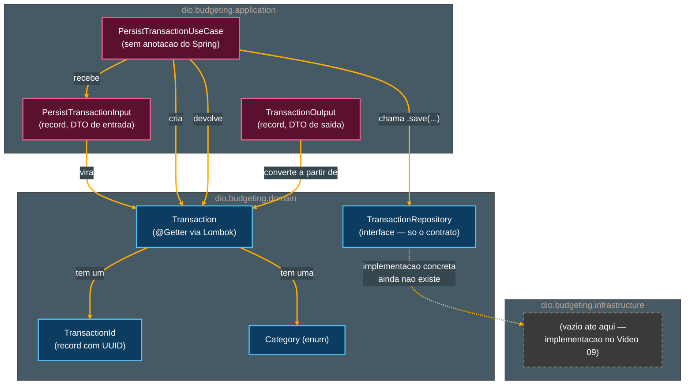

# Tutorial de Estudos — Desenvolvendo sua API Inteligente com Reconhecimento de Fala e Spring Boot

**Continuação — Vídeo 08 (Integração do Assistente: Orquestrando o Fluxo de Budget)**

- Curso: NTT Data — Jornada Tech (DIO) · Módulo 4 — Curso 5: "Desenvolvendo sua API Inteligente com Reconhecimento de Fala e Spring Boot"
- Instrutor: Thiago Poiani (Principal Engineer at Skip)
- Projeto: `budgeting`
- Documento de referência pessoal — nível iniciante em Java

---

## Sobre esta atualização

Este arquivo dá continuidade ao tutorial já existente (`001-...md`, Vídeos 01 e 02; `002-...md`, Vídeo 03; `003-...md`, Vídeo 04; `004-...md`, Vídeo 05; `005-...md`, Vídeo 06; `006-...md`, Vídeo 07), cobrindo agora o **Vídeo 08**. Ele foi escrito a partir de três fontes conferidas de verdade, e não de suposição: a seção "Vídeo 08" do README atualizado, a transcrição bruta da aula (`transcricao.md`) e o estado real do projeto no `.zip` (`budgeting_ate_o_video08.zip`) — descompactado e lido arquivo por arquivo antes de qualquer linha deste documento ser escrita.

**Como usar este arquivo:** ele foi pensado para ser **concatenado** ao final do documento anterior (`006-Tutorial_Budgeting_Spring_AI_Video07.md`). A seção "Parte 8" abaixo deve ser inserida **depois** da "Parte 7 — Speech API" e **antes** da seção "Pontos de atenção (continuação)" do documento anterior. As seções "Pontos de atenção (continuação)", "Glossário — novos termos", "Checkpoint", "Próximos passos (atualizado)" e "Diagramas" abaixo devem **substituir** as seções equivalentes do documento anterior.

> **⚠️ Nota importante sobre o que o Vídeo 08 realmente entrega.** O título do vídeo no README ("Integração do Assistente: Orquestrando o Fluxo de Budget") e a fala inicial da transcrição sugerem que STT (Vídeo 06), Tool Calling (Vídeo 05) e TTS (Vídeo 07) seriam finalmente conectados em um único fluxo de ponta a ponta. **Isso ainda não aconteceu neste checkpoint.** Conferido diretamente no `.zip`: os quatro controllers já existentes (`ChatModelController`, `ChatClientController`, `TranscriptionController`, `TextToSpeechController`) continuam **exatamente** como estavam no Vídeo 07, sem nenhuma alteração. O que o Vídeo 08 realmente construiu foi a **base de domínio e aplicação** (no sentido de Domain-Driven Design/Clean Architecture) que vai sustentar essa orquestração mais adiante: a entidade `Transaction`, o contrato `TransactionRepository` e o primeiro caso de uso, `PersistTransactionUseCase`. É um vídeo de **fundação de arquitetura**, não de integração de fato — a integração citada no título provavelmente é o objetivo dos próximos vídeos (09 a 11), quando a persistência (Vídeo 09) e os controllers REST (Vídeos 10 e 11) entrarem em cena.

---

## Parte 8 — Integração do Assistente: Orquestrando o Fluxo de Budget (Vídeo 08)

Depois de fechar o pipeline de voz (Vídeos 06 e 07) e já ter Tool Calling funcionando (Vídeo 05), o Vídeo 08 muda de foco: em vez de mexer nos modelos de IA, a aula volta para o **coração do domínio do negócio** — como representar e persistir um gasto financeiro dentro da aplicação, seguindo boas práticas de arquitetura de software.

### 8.1. Visão geral do assistente de *budgeting*

A transcrição retoma o escopo do projeto (já apresentado na seção 1.4 do primeiro tutorial): o usuário fala algo como *"gastei R$ 50 no Starbucks agora"*; esse áudio é transcrito pelo `TranscriptionModel`/multimodalidade do Spring AI (Vídeo 06); o texto resultante é passado para o `ChatClient`, que tem acesso a *tools* (Vídeo 05) capazes de persistir a informação e gerar relatórios; a resposta do modelo, por fim, é sintetizada de volta em áudio pelo `TextToSpeechModel`/SDK nativo (Vídeo 07). O README reforça esse mesmo fluxo com um diagrama, descrevendo como a IA extrai entidades (valor, local, data/hora) do texto transcrito e categoriza automaticamente o gasto — por exemplo, associando "Starbucks" a uma categoria de alimentação — sem qualquer intervenção manual.

Antes de construir essa orquestração, porém, a aula decide começar "de dentro para fora": criar primeiro a **representação do dado** (o que é uma transação de gasto?) e a forma de **persisti-la**, para só then conectar os modelos de IA a esse domínio já pronto.

### 8.2. Organizando o projeto em camadas: `domain`, `application` e `infrastructure`

A transcrição explica o raciocínio diretamente: *"na nossa camada de domínio, eu vou apenas trazer a interface para falar quais métodos eu vou expor, enquanto a implementação estará na camada de infraestrutura, para seguir os padrões de Domain-Driven Design"*. Três pacotes novos são criados dentro de `dio.budgeting`:

- **`dio.budgeting.domain`** — vai concentrar as regras e entidades centrais do negócio (a transação financeira em si, suas categorias, e o *contrato* de como ela é persistida).
- **`dio.budgeting.application`** — vai orquestrar os *casos de uso* da aplicação, ou seja, as ações que o sistema sabe realizar (por exemplo, "persistir uma transação").
- **`dio.budgeting.infrastructure`** — vai concentrar, futuramente, as implementações técnicas concretas (como o acesso real a um banco de dados). Neste checkpoint, o pacote existe mas está **vazio**: confirmado no `.zip`, nenhum arquivo `.java` foi criado dentro dele ainda — a implementação de `TransactionRepository` fica para o Vídeo 09.

Essa separação em três pacotes é a aplicação prática de dois conceitos de arquitetura de software citados na transcrição:

- **Domain-Driven Design (DDD)** — uma abordagem de projeto de software em que o código é organizado em torno do **domínio do negócio** (as regras e conceitos reais do problema que está sendo resolvido — aqui, "transações financeiras"), separando claramente essas regras de detalhes técnicos como banco de dados ou frameworks.
- **Clean Architecture** — um estilo de arquitetura (popularizado por Robert C. Martin) que organiza o código em camadas concêntricas, em que as camadas mais internas (domínio) não dependem das mais externas (infraestrutura), e sim o contrário — por isso o domínio expõe apenas uma *interface* (o "o quê"), e é a infraestrutura que fornece a implementação concreta (o "como").

### 8.3. A classe `Transaction` e o record `TransactionId`

A classe `Transaction` é criada dentro de `dio.budgeting.domain`, representando um gasto financeiro. O primeiro campo a existir é o identificador, e a transcrição já adianta a decisão de projeto por trás dele: *"eu tenho preferência por criar ids que são fortemente tipados, então vou criar um record TransactionId que recebe como parâmetro do seu construtor um UUID"*.

```java
package dio.budgeting.domain;

import java.util.UUID;

public record TransactionId(UUID uuid) {
}
```

- **`public record TransactionId(UUID uuid)`** — mesmo recurso de linguagem já visto em outros DTOs do projeto (Vídeos 04 e 07): um `record` é uma forma compacta do Java (desde a versão 16) de declarar uma classe imutável focada em carregar dados. Ao declarar `record TransactionId(UUID uuid)`, o compilador gera automaticamente: um construtor que recebe um `UUID`; um método de acesso `uuid()` (sem prefixo `get`, diferente de uma classe comum); e implementações de `equals()`, `hashCode()` e `toString()` — tudo isso sem que o programador precise escrever esse código repetitivo à mão.
- **`UUID`** — classe do pacote `java.util` que representa um **Identificador Único Universal** (*Universally Unique Identifier*), um valor de 128 bits praticamente impossível de colidir com outro gerado em qualquer lugar do mundo. É o tipo escolhido para o "miolo" do identificador de uma transação.
- **Por que um `record` em vez de usar `String` ou `UUID` diretamente?** É o conceito de **identificador fortemente tipado** (*strongly-typed ID*), citado explicitamente na transcrição: ao criar um tipo próprio (`TransactionId`) em vez de passar uma `String` "solta" pelos métodos, o compilador passa a impedir, por exemplo, que o id de uma transação seja confundido com o id de um usuário ou de um produto — ambos poderiam ser `String`s, mas nunca seriam `TransactionId`s um do outro. Além disso, esse tipo pode ser reaproveitado em qualquer outro módulo da aplicação que precise referenciar uma transação.

Com o tipo do identificador definido, a classe `Transaction` recebe seu primeiro campo:

```java
package dio.budgeting.domain;

public class Transaction {
    public TransactionId id;
}
```

Neste primeiro momento (conforme a transcrição descreve o passo a passo), o campo `id` ainda é `public` — um estado transitório, corrigido logo em seguida.

### 8.4. Campos privados e o enum `Category`

A transcrição é direta sobre o próximo passo: *"vamos ter uma transaction marcada como privada para manter a nossa classe um pouco mais restrita"*. Todos os campos passam a ser `private`, e mais dois são adicionados: `description` (o texto do gasto) e `amount` (o valor, guardado como centavos, em vez de um número com casas decimais):

```java
package dio.budgeting.domain;

public class Transaction {
    private TransactionId id;
    private String description;
    private long amount;
    private Category category;
}
```

- **`private`** — modificador de acesso do Java que restringe a visibilidade de um campo (ou método) apenas à própria classe onde ele foi declarado. É a base do princípio de **encapsulamento** da orientação a objetos: os dados internos de um objeto ficam protegidos de alterações diretas vindas de fora, sendo acessados apenas através de métodos controlados pela própria classe (os *getters*, que aparecem mais adiante, na seção 8.9).
- **`long amount`** — o valor do gasto é guardado como um número inteiro de 64 bits (`long`), representando **centavos**, e não como um número decimal (`double` ou `float`). É uma prática comum ao lidar com dinheiro em software: valores decimais de ponto flutuante podem sofrer pequenos erros de arredondamento em operações matemáticas, o que é inaceitável ao lidar com valores monetários; guardar tudo como um número inteiro de centavos evita esse problema. A conversão para um valor "legível" (com casas decimais) só acontece na borda do sistema, na saída — como será visto na seção 8.10.
- **`Category category`** — o quarto e último campo, ainda a ser definido.

O tipo `Category` é criado como um `enum`, com três valores fixos para este estágio do desenvolvimento:

```java
package dio.budgeting.domain;

public enum Category {
    GROCERIES,
    PHARMA,
    AUTO,
}
```

- **`enum`** (*enumeration*) — um tipo especial do Java usado para representar um conjunto **fixo e conhecido** de valores possíveis. Em vez de usar uma `String` livre (que aceitaria qualquer texto, incluindo erros de digitação como `"Groceriess"`), um `enum` garante, em tempo de compilação, que só um desses três valores exatos pode ser usado onde uma `Category` é esperada.
- **`GROCERIES`, `PHARMA`, `AUTO`** — os três valores possíveis desta primeira versão: compras de mercado, farmácia e gastos automotivos. A transcrição deixa claro que essa lista deve crescer conforme o projeto evolui — por ora, o suficiente para validar o desenvolvimento.

### 8.5. Construtores: `Transaction` e o auxiliar de `TransactionId`

A transcrição menciona a criação de "um primeiro construtor para instanciar a classe sem o ID" — ou seja, um construtor que recebe apenas os dados que vêm de fora (`description`, `amount`, `category`) e gera o identificador internamente, já que não faz sentido pedir para quem cria uma transação nova também inventar um UUID para ela.

```java
public Transaction(String description, long amount, Category category) {
    this.id = new TransactionId();
}
```

Esse primeiro passo, no entanto, expõe um problema: o record `TransactionId`, como definido na seção 8.3, só tem um construtor que **exige** um `UUID` já pronto (`TransactionId(UUID uuid)`) — não existe um `new TransactionId()` sem argumentos. A solução é adicionar um **construtor auxiliar** ao próprio record:

```java
public record TransactionId(UUID uuid) {
    public TransactionId() {
        this(UUID.randomUUID());
    }
}
```

- **Construtor auxiliar (*constructor overloading*)** — o Java permite que uma classe (ou um `record`) tenha **múltiplos construtores**, desde que cada um tenha uma lista de parâmetros diferente. Aqui, o record `TransactionId` passa a ter dois: o construtor "canônico" gerado automaticamente (`TransactionId(UUID uuid)`) e este novo, sem parâmetros.
- **`this(UUID.randomUUID())`** — dentro de um construtor, a palavra-chave `this(...)` (quando usada como uma chamada, e não como referência ao próprio objeto) invoca **outro construtor da mesma classe**. Aqui, o construtor sem parâmetros simplesmente delega para o construtor principal, passando um novo UUID gerado aleatoriamente.
- **`UUID.randomUUID()`** — método estático da classe `UUID` que gera um identificador novo e aleatório a cada chamada, sem precisar de nenhum valor de entrada.

Com o construtor auxiliar disponível, o construtor de `Transaction` é finalmente completado, atribuindo todos os quatro campos:

```java
package dio.budgeting.domain;

public class Transaction {
    private TransactionId id;
    private String description;
    private long amount;
    private Category category;

    public Transaction(String description, long amount, Category category) {
        this.id = new TransactionId();
        this.description = description;
        this.amount = amount;
        this.category = category;
    }
}
```

- **`this.id = new TransactionId();`** — como o construtor de `Transaction` não recebe um `id` de fora, ele instancia um `TransactionId` novo usando o construtor sem argumentos criado na seção anterior. Isso garante que **toda transação nasce automaticamente com um identificador único**, sem depender de quem a está criando para fornecer um.
- **`this.description = description;` / `this.amount = amount;` / `this.category = category;`** — atribuições diretas dos parâmetros recebidos aos campos privados correspondentes, o padrão usual de um construtor em Java. O uso de `this.campo` (em vez de apenas `campo`) é necessário aqui porque o parâmetro do construtor tem exatamente o mesmo nome do campo da classe; `this.` desambigua, indicando "o campo deste objeto", e não o parâmetro local.

### 8.6. `TransactionRepository`: o contrato de persistência no domínio

Ainda dentro do pacote `domain`, é criada uma interface para expor **o que** pode ser feito com transações em termos de persistência, sem se comprometer com **como** isso será feito (esse "como" fica para a camada de infraestrutura, seguindo o mesmo raciocínio de DDD explicado na seção 8.2):

```java
package dio.budgeting.domain;

import java.util.List;

public interface TransactionRepository {
    Transaction save(Transaction transaction);
    List<Transaction> findAllByCategory(Category category);
}
```

- **`interface`** — um tipo do Java que declara **apenas a assinatura** de métodos (nome, parâmetros e tipo de retorno), sem implementá-los. Qualquer classe que decida "implementar" essa interface é obrigada a fornecer o corpo desses métodos. É o mecanismo da linguagem usado aqui para separar o **contrato** (visível a quem usa o repositório) da **implementação concreta** (que só vai existir na camada de infraestrutura, no Vídeo 09).
- **`Transaction save(Transaction transaction);`** — método para persistir uma transação, recebendo o objeto a ser salvo e devolvendo-o de volta (uma convenção comum em repositórios, útil quando a implementação real precisa retornar a versão "final" do dado, por exemplo depois que o banco de dados atribui campos adicionais).
- **`List<Transaction> findAllByCategory(Category category);`** — método de busca, que devolve todas as transações associadas a uma determinada categoria. `List<Transaction>` é a interface genérica do Java (pacote `java.util`) usada para representar uma coleção ordenada de elementos — aqui, especializada para guardar objetos do tipo `Transaction`.

### 8.7. `PersistTransactionUseCase`: um caso de uso com responsabilidade única

No pacote `application`, a transcrição justifica a escolha de projeto para essa nova classe: *"em vez de criar um transaction service genérico com todos os métodos, eu gosto de criar use cases, um padrão que vem do Clean Architecture"*. Em vez de uma única classe `TransactionService` com vários métodos (salvar, buscar, gerar relatório, etc.), cada ação vira sua própria classe, dedicada a fazer **uma coisa só**.

```java
package dio.budgeting.application;

import dio.budgeting.domain.Category;
import dio.budgeting.domain.Transaction;
import dio.budgeting.domain.TransactionRepository;

public class PersistTransactionUseCase {
    private final TransactionRepository transactionRepository;

    public PersistTransactionUseCase(TransactionRepository transactionRepository) {
        this.transactionRepository = transactionRepository;
    }

    public void execute(String description, long amount, Category category) {
        var transaction = new Transaction(description, amount, category);
    }
}
```

- **Use case (*caso de uso*)** — um padrão de projeto vindo da Clean Architecture, em que cada ação relevante do sistema (uma "coisa que o usuário ou o sistema pode fazer") ganha sua própria classe, com uma única responsabilidade — aqui, exclusivamente "persistir uma transação". É uma aplicação direta do **Princípio da Responsabilidade Única** (*Single Responsibility Principle*, o "S" do conjunto de princípios SOLID), também citado na transcrição.
- **`private final TransactionRepository transactionRepository;`** e o construtor que o recebe — o caso de uso depende da **interface** `TransactionRepository` (seção 8.6), não de uma implementação concreta. Essa dependência é fornecida de fora, através do construtor — o padrão de **injeção de dependência via construtor**, já visto em praticamente todos os controllers do projeto (Vídeos 03 a 07). A diferença aqui é que essa classe não é um bean gerenciado pelo Spring (não tem `@Service` nem qualquer outra anotação do framework) — é um objeto Java comum (*Plain Old Java Object*, ou POJO), que poderia, em tese, funcionar com ou sem o Spring por trás.
- **`public void execute(...)`** — por convenção de projeto (mencionada na transcrição), um caso de uso expõe **um único método público**, sempre chamado `execute`. É esse método que concentra toda a regra de negócio daquela ação específica.
- **`var transaction = new Transaction(description, amount, category);`** — dentro do método, uma nova `Transaction` é montada a partir dos parâmetros recebidos. `var` é o recurso do Java (desde a versão 10) de **inferência de tipo local**: o compilador deduz sozinho que `transaction` é do tipo `Transaction`, a partir do que está do lado direito do `=`, evitando repetir o nome do tipo duas vezes na mesma linha.

Nesta primeira versão (ainda incompleta, como o próprio fluxo da aula reconstrói passo a passo), o método `execute` recebe os três dados soltos como parâmetros, monta a `Transaction`, mas ainda não chama o repositório nem devolve nada.

### 8.8. `PersistTransactionInput`: agrupando os parâmetros em um DTO

Em vez de manter `execute(String description, long amount, Category category)` com três parâmetros soltos, a aula opta por agrupá-los em uma única classe de entrada, dentro de um novo pacote `dio.budgeting.application.input`:

```java
package dio.budgeting.application.input;

import dio.budgeting.domain.Category;

public record PersistTransactionInput(String description, long amount, Category category) {
}
```

- **DTO (*Data Transfer Object*)** — um objeto cuja única responsabilidade é **carregar dados** de um ponto a outro do sistema (aqui, entre a futura orquestração de IA e o caso de uso), sem conter lógica de negócio. `PersistTransactionInput` é exatamente isso: um agrupamento de `description`, `amount` e `category` em um único parâmetro.
- **Por que usar um DTO em vez de vários parâmetros soltos?** É uma preferência de projeto explicada diretamente na transcrição: um único objeto de entrada facilita a assinatura do método (`execute(PersistTransactionInput input)` em vez de três parâmetros), deixa mais fácil adicionar novos campos no futuro sem quebrar quem já chama o método, e evita erros comuns como inverter a ordem de parâmetros do mesmo tipo por engano.
- Novamente um `record` (seção 8.3) é o tipo escolhido, já que `PersistTransactionInput` é, por natureza, um objeto imutável focado só em carregar dados — o caso de uso perfeito para esse recurso da linguagem.

Com o DTO pronto, o método `execute` do caso de uso é reescrito para recebê-lo, e passa também a efetivamente chamar o repositório e devolver o resultado:

```java
package dio.budgeting.application;

import dio.budgeting.application.input.PersistTransactionInput;
import dio.budgeting.domain.Transaction;
import dio.budgeting.domain.TransactionRepository;

public class PersistTransactionUseCase {
    private final TransactionRepository transactionRepository;

    public PersistTransactionUseCase(TransactionRepository transactionRepository) {
        this.transactionRepository = transactionRepository;
    }

    public Transaction execute(PersistTransactionInput input) {
        var transaction = new Transaction(input.description(), input.amount(), input.category());
        return transactionRepository.save(transaction);
    }
}
```

- **`input.description()`, `input.amount()`, `input.category()`** — como `PersistTransactionInput` é um `record`, seus métodos de acesso não têm o prefixo `get` (diferente de uma classe Java comum): o próprio nome do campo, seguido de `()`, já devolve o valor — recurso gerado automaticamente pelo compilador, como explicado na seção 8.3.
- **`return transactionRepository.save(transaction);`** — a transação recém-criada é enviada ao repositório (a interface do domínio, seção 8.6) para ser persistida, e o retorno desse método (`Transaction`) é repassado diretamente como retorno de `execute`. É importante notar que, aqui, o caso de uso está chamando `transactionRepository.save(...)` **sem saber qual implementação concreta** vai efetivamente rodar por trás dessa chamada — só o pacote de infraestrutura (ainda vazio neste checkpoint) vai definir isso, no Vídeo 09.
- **`public Transaction execute(...)`** — o tipo de retorno do método muda de `void` (nenhum retorno) para `Transaction`, permitindo que quem chamar o caso de uso receba de volta a transação já persistida (por exemplo, para então montar uma resposta a devolver ao usuário).

### 8.9. `TransactionOutput` e o Project Lombok

Simetricamente ao DTO de entrada, a aula cria um DTO de saída, no novo pacote `dio.budgeting.application.output`. A primeira versão de `TransactionOutput` é simples, com um método estático `from` para converter uma `Transaction` do domínio nesse objeto de saída:

```java
package dio.budgeting.application.output;

import dio.budgeting.domain.Transaction;

public record TransactionOutput(String description, String category, double value) {
    public static TransactionOutput from(Transaction transaction) {
        return new TransactionOutput(transaction);
    }
}
```

- **Método estático `from`** — um padrão comum para métodos "de fábrica" (*factory methods*): em vez de expor o construtor do record diretamente, oferece-se um método nomeado (`from`) que deixa claro, no ponto de uso, a intenção de "converter algo em um `TransactionOutput`". Este é apenas um rascunho inicial — repare que o corpo (`new TransactionOutput(transaction)`) ainda nem compila, já que o construtor do record espera três parâmetros (`description`, `category`, `value`), e não uma `Transaction` inteira; a versão final aparece mais adiante, na seção 8.10.

Para montar essa conversão de verdade, o método `from` vai precisar ler os campos privados de `Transaction` (`description`, `amount`, `category`) — mas, como vimos na seção 8.4, esses campos são `private`, e a classe não tem nenhum *getter* público. A transcrição resolve isso adotando o **Project Lombok**: *"poderíamos gerá-los pela IDE, mas eu prefiro utilizar a biblioteca Lombok, que gera várias coisas automaticamente através de anotações"*.

- **Project Lombok** — uma biblioteca Java que usa **anotações** processadas em tempo de compilação para gerar automaticamente código repetitivo (getters, setters, construtores, etc.), sem que esse código precise ser escrito (nem visto) manualmente pelo programador. O resultado final compilado é equivalente ao que seria escrito à mão, mas o código-fonte fica mais enxuto.

A documentação oficial do Lombok recomenda, para projetos Gradle, o uso de um plugin dedicado em vez de configurar as dependências manualmente. O plugin `io.freefair.lombok`, na versão `9.2.0`, é então adicionado ao bloco `plugins` do `build.gradle`, junto dos plugins já existentes:

```gradle
plugins {
    id 'java'
    id 'org.springframework.boot' version '4.1.0'
    id 'io.spring.dependency-management' version '1.1.7'
    id("io.freefair.lombok") version "9.2.0"
}
```

- **`id("io.freefair.lombok") version "9.2.0"`** — sintaxe do bloco `plugins` do Gradle para aplicar um plugin publicado no Gradle Plugin Portal, identificado pelo seu id (`io.freefair.lombok`) e pela versão desejada. Esse plugin, mantido pela comunidade (não pelo próprio time do Lombok), cuida de adicionar automaticamente a dependência do Lombok ao projeto e de configurar o processamento de anotações necessário para que ele funcione durante a compilação.

Com o plugin configurado, a anotação `@Getter` do Lombok é adicionada diretamente à classe `Transaction`:

```java
package dio.budgeting.domain;

import lombok.Getter;

@Getter
public class Transaction {
    private TransactionId id;
    private String description;
    private long amount;
    private Category category;

    public Transaction(String description, long amount, Category category) {
        this.id = new TransactionId();
        this.description = description;
        this.amount = amount;
        this.category = category;
    }
}
```

- **`@Getter`** — anotação do Lombok que, ao ser colocada no topo de uma classe, instrui o processador de anotações a gerar automaticamente um método *getter* público para **cada campo privado** da classe, seguindo a convenção do Java (`get` + nome do campo com a primeira letra maiúscula). Neste caso, o Lombok gera, "por baixo dos panos" (sem que esse código apareça no arquivo-fonte), os métodos `getId()`, `getDescription()`, `getAmount()` e `getCategory()` — prontos para serem usados por qualquer outra classe, como o `TransactionOutput`.
- **`import lombok.Getter;`** — a anotação `@Getter` vem do pacote `lombok`, disponibilizado no *classpath* do projeto graças ao plugin `io.freefair.lombok` configurado no `build.gradle`.

### 8.10. A conversão final: `TransactionOutput.from(...)` com `BigDecimal`

Com os *getters* disponíveis, o `record TransactionOutput` é completado. Primeiro, o campo `id` (do tipo `String`) é adicionado à lista de propriedades — já que o identificador precisa ser exposto como texto simples na resposta, e não como o tipo fortemente tipado `TransactionId` usado internamente no domínio (seção 8.3). Depois, o método `from` é finalizado, incluindo a conversão do valor monetário:

```java
package dio.budgeting.application.output;

import dio.budgeting.domain.Transaction;

import java.math.BigDecimal;
import java.math.RoundingMode;

public record TransactionOutput(String id, String description, String category, double value) {
    public static TransactionOutput from(Transaction transaction) {
        return new TransactionOutput(
                transaction.getId().uuid().toString(),
                transaction.getDescription(),
                transaction.getCategory().name(),
                BigDecimal.valueOf(transaction.getAmount()).setScale(2, RoundingMode.HALF_UP).doubleValue());
    }
}
```

- **`transaction.getId().uuid().toString()`** — uma cadeia de três chamadas: `getId()` (gerado pelo Lombok) devolve o `TransactionId`; `.uuid()` (gerado automaticamente pelo record `TransactionId`, seção 8.3) devolve o `UUID` "cru" dentro dele; `.toString()` converte esse `UUID` para sua representação padrão em texto (por exemplo, `"550e8400-e29b-41d4-a716-446655440000"`).
- **`transaction.getCategory().name()`** — `getCategory()` devolve o valor do `enum` `Category` associado à transação; `.name()` é um método presente em **todo** `enum` do Java, que devolve o nome exato da constante como uma `String` (por exemplo, `Category.GROCERIES.name()` devolve `"GROCERIES"`).
- **`BigDecimal.valueOf(transaction.getAmount())`** — o valor em centavos (`long`) precisa virar um número decimal legível (por exemplo, `5000` centavos → `50.00`). Em vez de fazer essa conta manualmente (o que reintroduziria o risco de erros de arredondamento discutido na seção 8.4), a aula usa a classe `BigDecimal`, do pacote `java.math`, projetada especificamente para representar números decimais com precisão exata, sem os erros de arredondamento típicos de `double`/`float` em cálculos intermediários.
- **`.setScale(2, RoundingMode.HALF_UP)`** — método do `BigDecimal` que define explicitamente **quantas casas decimais** o número deve ter (aqui, `2`) e **qual regra de arredondamento** usar caso seja necessário ajustar o valor para caber nessa precisão. `RoundingMode.HALF_UP` é uma constante do `enum` `RoundingMode` (também em `java.math`) que representa a regra de arredondamento "tradicional": a partir de 0,5, arredonda para cima.
- **`.doubleValue()`** — por fim, o `BigDecimal` já ajustado para duas casas decimais é convertido para um `double` simples, que é o tipo declarado no `record TransactionOutput` (campo `value`). O cuidado de passar primeiro pelo `BigDecimal` (em vez de simplesmente dividir `amount / 100.0`) garante que o arredondamento para duas casas decimais seja feito de forma explícita e controlada, e não como um efeito colateral acidental da aritmética de ponto flutuante.

Com isso, a classe `Transaction`, o `enum` `Category`, o record `TransactionId`, a interface `TransactionRepository`, o caso de uso `PersistTransactionUseCase` e os DTOs `PersistTransactionInput`/`TransactionOutput` estão todos devidamente criados — a base de domínio e aplicação para o assistente de *budgeting*, pronta para ser conectada à implementação real de persistência (Vídeo 09) e, então, aos modelos de IA já construídos (Vídeos 05 a 07).

---

## Pontos de atenção (continuação — divergências do Vídeo 08)

Dando sequência à lista já registrada nos tutoriais anteriores (itens 1 a 29), a comparação linha a linha entre a aula/README e o `.zip` real revela mais seis pontos nesta etapa:

30. **Versão do Spring Boot no `build.gradle`: `4.0.5` (trecho do README para o Vídeo 08) × `4.1.0` (arquivo real, e consistente com todos os checkpoints anteriores, desde o Vídeo 02).** Conferido diretamente no `build.gradle` do `.zip`: a linha é `id 'org.springframework.boot' version '4.1.0'`, igual à de todos os checkpoints anteriores. O trecho `'4.0.5'` que aparece no README, ao introduzir o plugin do Lombok, parece ser um erro de digitação do material da aula (provavelmente copiado de uma versão diferente do arquivo em algum momento da gravação), e não uma mudança real de versão.

    **Impacto prático:** nenhum — apenas não estranhar, ao comparar com o README, que a versão do Spring Boot "não mudou de verdade" neste vídeo.

31. **`TransactionOutput.java` (arquivo real) está sem a linha `package dio.budgeting.application.output;` no topo do arquivo — diferente do README, que sempre mostra essa linha nos trechos de código.** Conferido byte a byte no `.zip`: o arquivo `src/main/java/dio/budgeting/application/output/TransactionOutput.java` começa diretamente por `import dio.budgeting.domain.Transaction;`, sem nenhuma declaração de pacote antes.

    **Impacto prático: real, e vale corrigir.** Em Java, um arquivo sem declaração de `package` é tratado como pertencente ao **pacote padrão** (*default package*, sem nome), independentemente da pasta em que ele fisicamente está salvo. Isso não impede o projeto de compilar **hoje**, porque, neste checkpoint, nenhuma outra classe do projeto ainda importa `TransactionOutput` (ele não é usado em nenhum controller). Mas, assim que alguma outra classe tentar `import dio.budgeting.application.output.TransactionOutput;` — o que deve acontecer nos próximos vídeos, ao conectar esse DTO a um controller —, a compilação vai falhar, porque a classe não está de fato naquele pacote. A correção é simples: adicionar `package dio.budgeting.application.output;` como a primeira linha do arquivo, antes do `import`.

32. **Nenhuma implementação de `TransactionRepository` no pacote `infrastructure` (seu projeto real) — apenas a interface, no pacote `domain`.** Confirmado na estrutura de pastas do `.zip`: o pacote `dio.budgeting.infrastructure` foi criado (aparece na listagem do `.zip`), mas está **vazio**, sem nenhum arquivo `.java` dentro dele. Isso é coerente com o próprio raciocínio de DDD explicado na aula (seção 8.2): a interface já está pronta no domínio, mas sua implementação concreta (provavelmente conectada a um banco de dados, dado o título do Vídeo 09 — "Configurando o Banco com Docker") ainda não foi escrita.

    **Impacto prático:** nenhum ainda — o projeto compila normalmente, já que nada tenta instanciar `TransactionRepository` neste checkpoint. É esperado que o Vídeo 09 preencha essa lacuna.

33. **`PersistTransactionUseCase` não é um bean gerenciado pelo Spring (sem `@Service`, `@Component` ou qualquer outra anotação do framework) — diferente de todos os controllers do projeto até aqui, que sempre usam `@RestController`.** Conferido no código real: a classe é um POJO comum, sem nenhuma anotação do Spring, e não é injetada em nenhum outro lugar do projeto neste checkpoint (nenhum controller ou classe de configuração a referencia ainda).

    **Impacto prático:** nenhum negativo — é, na verdade, coerente com o espírito do padrão *use case* da Clean Architecture, que valoriza manter a camada de aplicação o mais **independente de framework** possível. Mas isso também significa que, hoje, `PersistTransactionUseCase` ainda não está de fato conectado a nada em tempo de execução — vale prestar atenção a como (e se) ele ganha uma anotação `@Service`, ou é instanciado manualmente em uma classe de configuração, quando for efetivamente ligado a um controller nos próximos vídeos.

34. **O título do Vídeo 08 no README ("Integração do Assistente: Orquestrando o Fluxo de Budget") sugere uma integração ponta a ponta entre STT, Tool Calling e TTS — mas o `.zip` real não contém nenhuma alteração nos quatro controllers já existentes.** Já detalhado na nota de abertura deste documento: `ChatModelController.java`, `ChatClientController.java`, `TranscriptionController.java` e `TextToSpeechController.java` foram conferidos byte a byte contra o checkpoint do Vídeo 07, e estão **idênticos**.

    **Impacto prático:** nenhum negativo, apenas uma expectativa a recalibrar — o "fluxo orquestrado" citado no título parece ser o objetivo de médio prazo do curso (possivelmente concluído só nos Vídeos 10/11, quando um `TransactionController` e a integração da transcrição ao Tool Calling estiverem prontos), e não algo entregue integralmente neste vídeo específico.

35. **`Category` é um `enum` fixo, com apenas três valores (`GROCERIES`, `PHARMA`, `AUTO`) — sem nenhuma anotação de persistência (como as que apareceriam, por exemplo, em uma entidade JPA).** Isso é esperado neste estágio: como o pacote `infrastructure` ainda está vazio (item 32), não haveria mesmo por que `Category` (uma classe de domínio "pura") já carregar detalhes técnicos de um banco de dados específico — esse tipo de anotação, se vier a existir, deve aparecer em uma classe própria da camada de infraestrutura, não aqui.

    **Impacto prático:** nenhum — apenas reforça, mais uma vez, a separação DDD entre domínio e infraestrutura discutida na seção 8.2.

---

## Glossário — novos termos (Vídeo 08)

Estes termos se somam ao glossário já existente nos tutoriais anteriores (que cobrem Java, Spring, IA e ferramentas até o Vídeo 07) — apenas os termos que ainda não haviam aparecido.

| Termo | Significado |
|---|---|
| Domain-Driven Design (DDD) | Abordagem de projeto de software que organiza o código em torno do domínio do negócio (as regras e conceitos reais do problema), separando essas regras de detalhes técnicos como banco de dados ou frameworks — aqui, materializada na separação entre os pacotes `domain`, `application` e `infrastructure`. |
| Clean Architecture | Estilo de arquitetura que organiza o código em camadas concêntricas, em que as camadas internas (domínio) não dependem das externas (infraestrutura) — a camada interna define apenas *contratos* (interfaces), e a externa fornece as implementações concretas. |
| Use case (*caso de uso*) | Padrão de projeto da Clean Architecture em que cada ação relevante do sistema ganha sua própria classe dedicada, com um único método público (por convenção, `execute`) e responsabilidade única. |
| Princípio da Responsabilidade Única (*Single Responsibility Principle*) | Um dos princípios SOLID de projeto orientado a objetos: cada classe deve ter um, e somente um, motivo para mudar — aqui, aplicado ao restringir `PersistTransactionUseCase` a fazer exclusivamente a persistência de uma transação. |
| DTO (*Data Transfer Object*) | Objeto cuja única responsabilidade é carregar dados de um ponto a outro do sistema, sem conter lógica de negócio — usado aqui tanto para a entrada (`PersistTransactionInput`) quanto para a saída (`TransactionOutput`) do caso de uso. |
| Identificador fortemente tipado (*strongly-typed ID*) | Prática de criar um tipo dedicado (como o record `TransactionId`) para representar o identificador de uma entidade, em vez de usar um tipo genérico como `String` ou `UUID` diretamente — reduz erros acidentais e deixa a assinatura dos métodos mais expressiva. |
| `UUID` | Classe do pacote `java.util` que representa um Identificador Único Universal — um valor de 128 bits praticamente impossível de colidir com outro gerado em qualquer lugar. `UUID.randomUUID()` gera um novo valor aleatório. |
| *Constructor overloading* | Recurso do Java que permite a uma mesma classe (ou record) ter múltiplos construtores, desde que cada um tenha uma lista de parâmetros diferente — usado em `TransactionId` para oferecer tanto um construtor que recebe um `UUID` quanto um sem parâmetros, que gera um automaticamente. |
| `this(...)` (chamada de construtor) | Dentro de um construtor, a chamada `this(argumentos)` invoca outro construtor da mesma classe, permitindo que um construtor delegue parte (ou todo) o seu trabalho para outro. |
| `enum` | Tipo especial do Java usado para representar um conjunto fixo e conhecido de valores possíveis (aqui, as categorias de gasto) — mais seguro que uma `String` livre, pois o compilador impede valores fora da lista definida. Todo `enum` tem, entre outros, o método `.name()`, que devolve o nome da constante como texto. |
| `var` (inferência de tipo local) | Recurso do Java (desde a versão 10) que permite ao compilador deduzir automaticamente o tipo de uma variável local a partir do valor atribuído a ela, evitando repetir o nome do tipo duas vezes na mesma linha. |
| Project Lombok | Biblioteca Java que usa anotações processadas em tempo de compilação para gerar automaticamente código repetitivo (getters, setters, construtores, etc.), reduzindo a quantidade de código escrito manualmente. |
| `@Getter` (Lombok) | Anotação de classe que instrui o Lombok a gerar automaticamente um método *getter* público para cada campo privado da classe anotada. |
| Plugin `io.freefair.lombok` | Plugin do Gradle (mantido pela comunidade, não pelo time do Lombok) que adiciona a dependência do Lombok e configura o processamento de anotações necessário para seu funcionamento em um projeto Gradle. |
| `BigDecimal` | Classe do pacote `java.math` para representar números decimais com precisão exata, evitando os erros de arredondamento típicos de `double`/`float` em cálculos — usada aqui para converter centavos (`long`) em um valor decimal correto. |
| `RoundingMode` | `enum` do pacote `java.math` com as diferentes regras de arredondamento possíveis ao ajustar a escala de um `BigDecimal`; `HALF_UP` é a regra "tradicional" (a partir de 0,5, arredonda para cima). |
| `.setScale(escala, modo)` (`BigDecimal`) | Método que define explicitamente quantas casas decimais um `BigDecimal` deve ter e qual regra de arredondamento aplicar, caso seja necessário ajustar o valor. |

---

## Checkpoint do Vídeo 08

Estado do projeto conferido diretamente nos arquivos do `.zip` (`budgeting_ate_o_video08.zip`) — e não apenas na narrativa do README. Como registrado em "Pontos de atenção" (itens 30 a 35), este checkpoint reflete exclusivamente a **fundação de domínio e aplicação** criada neste vídeo; os controllers e a integração de IA seguem inalterados desde o Vídeo 07.

### Estrutura de pastas

```
budgeting/
├── build.gradle                                          ← alterado (plugin io.freefair.lombok, item 30)
├── settings.gradle                                       ← inalterado
├── gradlew / gradlew.bat
├── gradle/wrapper/
└── src/
    ├── main/
    │   ├── java/dio/budgeting/
    │   │   ├── BudgetingApplication.java                 ← inalterado
    │   │   ├── ChatModelController.java                  ← inalterado desde o Vídeo 03
    │   │   ├── ChatClientController.java                 ← inalterado desde o Vídeo 04
    │   │   ├── TranscriptionController.java               ← inalterado desde o Vídeo 06
    │   │   ├── TextToSpeechController.java                ← inalterado desde o Vídeo 07
    │   │   ├── domain/                                    ← novo pacote neste vídeo
    │   │   │   ├── Transaction.java                       ← novo
    │   │   │   ├── TransactionId.java                     ← novo
    │   │   │   ├── Category.java                          ← novo
    │   │   │   └── TransactionRepository.java             ← novo (só a interface, item 32)
    │   │   ├── application/                               ← novo pacote neste vídeo
    │   │   │   ├── PersistTransactionUseCase.java         ← novo (item 33)
    │   │   │   ├── input/
    │   │   │   │   └── PersistTransactionInput.java       ← novo
    │   │   │   └── output/
    │   │   │       └── TransactionOutput.java             ← novo (sem `package`, item 31)
    │   │   └── infrastructure/                            ← novo pacote, ainda vazio (item 32)
    │   └── resources/
    │       └── application.properties                     ← inalterado desde o Vídeo 06
    └── test/
        ├── java/dio/budgeting/
        │   ├── BudgetingApplicationTests.java             ← inalterado
        │   ├── GeminiChatModelIT.java                     ← inalterado desde o Vídeo 03
        │   ├── GeminiChatClientIT.java                    ← inalterado desde o Vídeo 04
        │   ├── ToolCallingIT.java                         ← inalterado desde o Vídeo 05
        │   ├── GeminiTranscriptionModelIT.java             ← inalterado desde o Vídeo 06
        │   └── GeminiSpeechModelIT.java                    ← inalterado desde o Vídeo 07
        └── resources/
            └── audio/                                      ← inalterado desde o Vídeo 06
```

A novidade estrutural em relação ao checkpoint do Vídeo 07 é a chegada de **três pacotes novos** (`domain`, `application` — com os subpacotes `input` e `output` — e `infrastructure`, este último ainda vazio) e de **sete arquivos novos**. Nenhum controller, teste ou arquivo de configuração já existente foi alterado, à exceção do `build.gradle` (novo plugin do Lombok).

### `build.gradle` (alterado — novo plugin)

```gradle
plugins {
    id 'java'
    id 'org.springframework.boot' version '4.1.0'
    id 'io.spring.dependency-management' version '1.1.7'
    id("io.freefair.lombok") version "9.2.0"
}

group = 'dio'
version = '0.0.1-SNAPSHOT'
description = 'budgeting'

java {
    toolchain {
        languageVersion = JavaLanguageVersion.of(21)
    }
}

repositories {
    mavenCentral()
}

dependencies {
    implementation 'org.springframework.boot:spring-boot-starter'
    testImplementation 'org.springframework.boot:spring-boot-starter-test'
    testRuntimeOnly 'org.junit.platform:junit-platform-launcher'

    implementation platform("org.springframework.ai:spring-ai-bom:2.0.0-M4")

//  implementation 'org.springframework.ai:spring-ai-starter-model-openai'
    implementation 'org.springframework.ai:spring-ai-starter-model-google-genai'

    implementation 'org.springframework.boot:spring-boot-starter-web'
}

tasks.named('test') {
    useJUnitPlatform()
}
```

A única mudança em relação ao checkpoint do Vídeo 07 é a linha `id("io.freefair.lombok") version "9.2.0"`, acrescentada ao bloco `plugins` — nenhuma dependência do bloco `dependencies` foi alterada (item 30 confirma que a versão do Spring Boot, `4.1.0`, continua a mesma de sempre).

### `src/main/resources/application.properties` (inalterado)

```properties
spring.application.name=budgeting
#spring.ai.openai.api-key=${OPENAI_API_KEY}
spring.ai.google.genai.api-key=${GEMINI_API_KEY}
spring.ai.google.genai.chat.options.model=gemini-3-flash-preview

# Configurações globais do modelo (equivalente ao temperature=0)
spring.ai.google.genai.chat.options.temperature=0.0

logging.level.org.springframework.ai=DEBUG
```

Confirmado como **idêntico**, linha a linha, ao checkpoint do Vídeo 06 — nenhuma propriedade nova de persistência foi adicionada ainda (esperado apenas no Vídeo 09).

### `src/main/java/dio/budgeting/domain/` (novo pacote)

Reproduzido na íntegra e explicado linha a linha nas seções 8.3, 8.4, 8.5 e 8.6 — contém `Transaction.java` (com `@Getter` do Lombok), `TransactionId.java` (record com construtor auxiliar), `Category.java` (enum) e `TransactionRepository.java` (interface, sem implementação ainda — item 32).

### `src/main/java/dio/budgeting/application/` (novo pacote)

Reproduzido na íntegra e explicado linha a linha nas seções 8.7 a 8.10 — contém `PersistTransactionUseCase.java` (o caso de uso, sem anotações do Spring — item 33), `input/PersistTransactionInput.java` (DTO de entrada) e `output/TransactionOutput.java` (DTO de saída, com a ressalva do `package` ausente — item 31).

### `src/main/java/dio/budgeting/infrastructure/` (novo pacote, vazio)

Pacote criado, mas sem nenhum arquivo `.java` dentro dele neste checkpoint — confirmado na listagem do `.zip` (item 32). A implementação concreta de `TransactionRepository` é esperada apenas no Vídeo 09.

### Demais arquivos

`BudgetingApplication.java`, `BudgetingApplicationTests.java`, `ChatModelController.java`, `ChatClientController.java`, `TranscriptionController.java`, `TextToSpeechController.java`, `GeminiChatModelIT.java`, `GeminiChatClientIT.java`, `ToolCallingIT.java`, `GeminiTranscriptionModelIT.java` e `GeminiSpeechModelIT.java` seguem **inalterados** desde os checkpoints anteriores (já documentados em detalhe nos tutoriais dos Vídeos 02 a 07) — confirmado comparando o conteúdo desses arquivos entre os dois `.zip`s.

> **Nota:** assim como nos checkpoints anteriores, o `.zip` também contém as pastas `.gradle/`, `build/` e `.idea/` (incluindo `budgeting.iml`), todas geradas/gerenciadas automaticamente pela ferramenta de build e pela IDE — não fazem parte deste checkpoint por não serem editadas manualmente.

---

## Próximos passos (atualizado): o que vem a partir do Vídeo 09

Com a fundação de domínio e aplicação (`Transaction`, `TransactionRepository`, `PersistTransactionUseCase`) pronta, mas ainda desconectada de qualquer implementação real ou dos controllers de IA, a sequência restante do curso (conferida no README) é:

- **Vídeo 09 — Persistência e Infraestrutura: Configurando o Banco com Docker:** deve preencher o pacote `infrastructure`, ainda vazio (item 32), com uma implementação concreta de `TransactionRepository`, provavelmente conectada a um banco de dados real subindo via Docker Compose — o passo que finalmente torna `save`/`findAllByCategory` funcionais de ponta a ponta.
- **Vídeo 10 — Exposição REST: Implementando o TransactionController:** deve criar um novo `@RestController`, no mesmo estilo do `ChatModelController`/`ChatClientController`/`TranscriptionController`/`TextToSpeechController` já construídos, agora expondo endpoints HTTP para o domínio de transações financeiras — o primeiro lugar em que `PersistTransactionUseCase` deve, enfim, ser efetivamente chamado (item 33).
- **Vídeo 11 — Endpoint de Transcrição: Integrando Áudio ao Controller:** deve aprofundar a integração do `TranscriptionController` (já existente desde o Vídeo 06), possivelmente conectando-a diretamente ao fluxo de Tool Calling (Vídeo 05) para de fato registrar uma transação a partir do áudio transcrito — o momento mais provável para a "orquestração" prometida no título do Vídeo 08 (item 34) finalmente se concretizar.
- **Vídeo 12 — Roadmap e Auditoria: Evoluindo a API Inteligente:** deve fechar o desenvolvimento com sugestões de evolução do projeto e, possivelmente, mecanismos de auditoria/observabilidade.
- **Vídeo 13 — Entendendo o Desafio:** provavelmente o desafio prático de encerramento do curso.

> **Sobre a divergência entre o título do Vídeo 08 e o que foi entregue, à luz do que vem a seguir**
> Vale manter em mente, ao acompanhar o Vídeo 09, o pequeno bug real encontrado no item 31 (`TransactionOutput.java` sem a linha `package`) — é bem provável que ele precise ser corrigido assim que esse DTO passar a ser importado por um controller, o que deve acontecer já no Vídeo 10. Da mesma forma, o item 33 (uso case sem anotação do Spring) é um bom ponto de observação: repare, no próximo vídeo, se `PersistTransactionUseCase` ganha uma anotação como `@Service`, ou se continua sendo instanciado manualmente em algum lugar — as duas abordagens são válidas em Clean Architecture, mas com implicações diferentes para o restante do projeto.

---

## Diagramas: o que o Vídeo 08 acrescentou

### 1. Diagrama de blocos — as três camadas criadas e como elas se relacionam



**Como ler este diagrama:**

- As três caixas maiores (`APP`, `DOM`, `INFRA`) representam os três pacotes criados neste vídeo (seção 8.2). A seta pontilhada de `REPO` para `EMPTY` deixa explícito o que ainda **não existe**: a interface `TransactionRepository` já está pronta no domínio, mas nenhuma classe da camada de infraestrutura a implementa ainda — esse é exatamente o item 32 de "Pontos de atenção".
- Repare que o caso de uso (`UC`) é o único ponto de contato entre a camada de aplicação e o domínio: é ele quem recebe o DTO de entrada, monta a `Transaction`, chama o repositório e devolve o resultado — nenhuma outra classe da aplicação (como `TransactionOutput`) conversa diretamente com `TransactionRepository`.
- Este diagrama, propositalmente, **não inclui** nenhum dos quatro controllers já existentes (`ChatModelController`, `ChatClientController`, `TranscriptionController`, `TextToSpeechController`), porque nenhum deles se conecta a essas novas classes neste checkpoint (item 34) — essa conexão é o assunto esperado dos próximos vídeos.

### 2. Diagrama de sequência — o que aconteceria ao chamar `PersistTransactionUseCase.execute(...)` hoje

```mermaid
%%{init: {'theme': 'base', 'themeVariables': {
    'actorBkg': '#2c2c2c',
    'actorBorder': '#ffab00',
    'actorTextColor': '#ffffff',
    'actorLineColor': '#ffab00',
    'signalColor': '#ffab00',
    'signalTextColor': '#ffffff',
    'labelBoxBkgColor': '#37474f',
    'labelBoxBorderColor': '#4fc3f7',
    'labelTextColor': '#ffffff',
    'loopTextColor': '#ffffff',
    'noteBkgColor': '#5c1030',
    'noteBorderColor': '#f06292',
    'noteTextColor': '#ffffff',
    'activationBkgColor': '#455a64',
    'activationBorderColor': '#cfd8dc'
}}}%%
sequenceDiagram
    participant Caller as (Ainda nao existe —\nnenhum controller chama isso hoje)
    participant UC as PersistTransactionUseCase
    participant TX as new Transaction(...)
    participant ID as new TransactionId()
    participant Repo as TransactionRepository (interface)
    participant Out as TransactionOutput.from(...)

    Caller->>UC: execute(new PersistTransactionInput(descricao, centavos, categoria))
    UC->>TX: new Transaction(description, amount, category)
    TX->>ID: this.id = new TransactionId()
    ID-->>TX: TransactionId(UUID.randomUUID())
    TX-->>UC: transaction (com id, description, amount, category)
    UC->>Repo: transactionRepository.save(transaction)
    Note over Repo: implementacao concreta ainda nao existe (Video 09) —\nesta chamada falharia hoje por falta de um bean

    Repo-->>UC: transaction (persistida)
    UC-->>Caller: transaction

    opt Se o chamador quiser expor a transacao como resposta
        Caller->>Out: TransactionOutput.from(transaction)
        Out-->>Caller: TransactionOutput(id, description, category, value)
    end

    classDef missingNode fill:#3a3a3a,stroke:#757575,stroke-width:2px,color:#ffffff
    class Caller,Repo missingNode
```

**Como ler este diagrama:**

- Diferente dos diagramas de sequência dos vídeos anteriores (03, 04, 06 e 07), este não representa um fluxo HTTP real e testado — ele é **hipotético**, mostrando o que aconteceria se algum código chamasse `PersistTransactionUseCase.execute(...)` hoje. Por isso, os participantes `Caller` e `Repo` aparecem destacados em cinza: nenhum dos dois existe de fato ainda neste checkpoint (nem um chamador real, nem uma implementação de `TransactionRepository`).
- A parte que **de fato** já funciona e pode ser testada isoladamente hoje (por exemplo, em um teste unitário simples, sem depender do Spring) é a construção de `Transaction` a partir de `PersistTransactionInput`, incluindo a geração automática do `TransactionId` — o trecho entre `UC` e `TX`/`ID` no diagrama.
- O bloco `opt` (opcional) no final mostra que `TransactionOutput.from(...)` já está pronto para converter uma `Transaction` qualquer, independentemente de ela ter vindo de um repositório real ou não — mas, como não há nenhum lugar do projeto chamando esse método ainda, ele também permanece "esperando" para ser conectado a algo (item 34).

---

*Este é o sétimo tutorial da série do curso "Desenvolvendo sua API Inteligente com Reconhecimento de Fala e Spring Boot", cobrindo o Vídeo 08 e projetado para ser concatenado ao documento que cobre os Vídeos 01 a 07. Os próximos tutoriais devem continuar a numeração (`008-...`, e assim por diante), cada um cobrindo um novo vídeo (ou uma nova etapa de código), sempre dando continuidade a este documento e ao estado do projeto então existente.*
