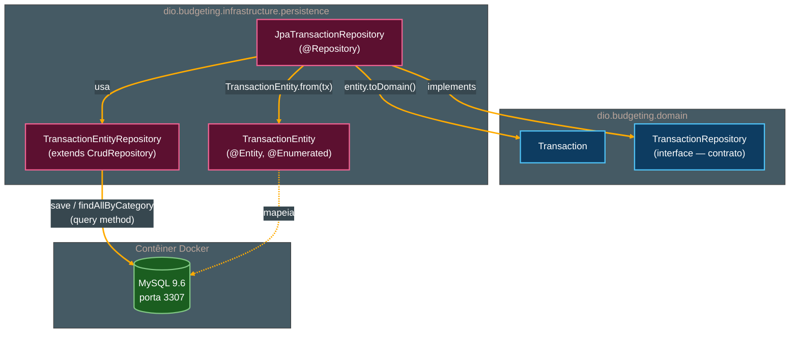

# Tutorial de Estudos — Desenvolvendo sua API Inteligente com Reconhecimento de Fala e Spring Boot

**Continuação — Vídeo 09 (Persistência e Infraestrutura: Configurando o Banco com Docker)**

- Curso: NTT Data — Jornada Tech (DIO) · Módulo 4 — Curso 5: "Desenvolvendo sua API Inteligente com Reconhecimento de Fala e Spring Boot"
- Instrutor: Thiago Poiani (Principal Engineer at Skip)
- Projeto: `budgeting`
- Documento de referência pessoal — nível iniciante em Java

---

## Sobre esta atualização

Este arquivo dá continuidade ao tutorial já existente (`001-...md`, Vídeos 01 e 02; `002-...md`, Vídeo 03; `003-...md`, Vídeo 04; `004-...md`, Vídeo 05; `005-...md`, Vídeo 06; `006-...md`, Vídeo 07; `007-...md`, Vídeo 08), cobrindo agora o **Vídeo 09**. Ele foi escrito a partir de três fontes conferidas de verdade, e não de suposição: a seção "Vídeo 09" do README atualizado, a transcrição bruta da aula (`transcricao.md`) e o estado real do projeto no `.zip` (`budgeting_ate_o_video09.zip`) — descompactado e lido arquivo por arquivo antes de qualquer linha deste documento ser escrita.

**Como usar este arquivo:** ele foi pensado para ser **concatenado** ao final do documento anterior (`007-Tutorial_Budgeting_Spring_AI_Video08.md`). A seção "Parte 9" abaixo deve ser inserida **depois** da "Parte 8 — Integração do Assistente" e **antes** da seção "Pontos de atenção (continuação)" do documento anterior. As seções "Pontos de atenção (continuação)", "Glossário — novos termos", "Checkpoint", "Próximos passos (atualizado)" e "Diagramas" abaixo devem **substituir** as seções equivalentes do documento anterior.

> **Nota sobre o que o Vídeo 09 realmente entrega.** Diferente do Vídeo 08 (cujo título prometia uma "integração" que na prática não aconteceu), o Vídeo 09 cumpre exatamente o que o título promete: preenche o pacote `infrastructure`, até aqui vazio (item 32 do tutorial anterior), com uma implementação real de `TransactionRepository`, apoiada em um banco de dados MySQL de fato, orquestrado via Docker Compose. Conferido no `.zip`: o `save` e o `findAllByCategory` já funcionam de ponta a ponta contra um banco real. O que **ainda não acontece** neste checkpoint é a conexão dessa persistência com algum controller HTTP — `PersistTransactionUseCase` continua sem ser chamado por ninguém, exatamente como no Vídeo 08 (item 33). A própria transcrição fecha o vídeo confirmando isso: *"nos próximos passos, a gente vai fazer persistência e consulta através de um controller"* — ou seja, o Vídeo 10 é quem deve, finalmente, ligar os fios.

---

## Parte 9 — Persistência e Infraestrutura: Configurando o Banco com Docker (Vídeo 09)

Com o domínio (`Transaction`, `TransactionId`, `Category`, a interface `TransactionRepository`) e o primeiro caso de uso (`PersistTransactionUseCase`) já prontos desde o Vídeo 08, mas sem nenhuma forma real de gravar ou consultar dados, o Vídeo 09 vira o foco para a camada de **infraestrutura**: como subir um banco de dados de desenvolvimento de forma automatizada e como implementar, de fato, a interface que o domínio já declarava.

### 9.1. O arquivo `compose.yml` e o Docker Compose

A aula começa criando, na **raiz do projeto** (fora da pasta `src`), um novo arquivo chamado `compose.yml`.

```yaml
services:
  database:
    image: mysql:9.6
    environment:
      MYSQL_DATABASE: transaction
      MYSQL_ROOT_PASSWORD: root
      MYSQL_USER: app
      MYSQL_PASSWORD: app
    ports:
      - "3307:3306"
    volumes:
      - transaction_data:/var/lib/mysql
    healthcheck:
      test: [ "CMD", "mysqladmin", "ping", "-h", "localhost", "-uapp", "-papp" ]
      interval: 5s
      timeout: 5s
      retries: 5

volumes:
  transaction_data:
```

Antes de explicar o conteúdo, vale entender **o que é** esse arquivo:

- **Docker** — uma ferramenta que permite empacotar um programa (por exemplo, um banco de dados MySQL inteiro, já instalado e configurado) dentro de um pacote isolado chamado **contêiner** (*container*), que roda de forma consistente em qualquer máquina, sem exigir que você instale o MySQL "de verdade" no seu computador.
- **Imagem** (*image*) — o "molde" a partir do qual um contêiner é criado; contém tudo que o programa precisa para rodar (sistema de arquivos, binários, configurações padrão). `mysql:9.6` é a imagem oficial do MySQL, na versão `9.6`, publicada em um repositório público de imagens.
- **Docker Compose** — uma ferramenta (e um formato de arquivo, `compose.yml` ou `docker-compose.yml`) que permite descrever, em um único arquivo YAML, um ou mais contêineres que devem subir juntos, com toda a configuração necessária (variáveis de ambiente, portas, volumes) — em vez de digitar comandos `docker run` longos manualmente toda vez.
- **YAML** — um formato de arquivo de texto usado para representar dados estruturados (parecido com JSON, mas usando indentação em vez de chaves `{}`), muito comum em arquivos de configuração — é a linguagem em que o `compose.yml` é escrito.

Linha a linha do arquivo criado:

- **`services:`** — bloco raiz que lista todos os "serviços" (na prática, contêineres) que esse Compose gerencia. Aqui existe apenas um: `database`.
- **`database:`** — o nome escolhido para esse serviço (arbitrário; poderia ser qualquer outro nome). É esse nome que aparece, por exemplo, na aba **Services** do IntelliJ.
- **`image: mysql:9.6`** — declara qual imagem Docker deve ser baixada e usada para criar o contêiner desse serviço: a imagem oficial do MySQL, versão `9.6`.
- **`environment:`** — bloco de variáveis de ambiente passadas para dentro do contêiner na hora em que ele sobe. A imagem oficial do MySQL sabe interpretar variáveis com esses nomes específicos para se autoconfigurar já na primeira inicialização:
  - **`MYSQL_DATABASE: transaction`** — pede para o MySQL já criar, automaticamente, um banco de dados chamado `transaction` assim que o contêiner subir pela primeira vez.
  - **`MYSQL_ROOT_PASSWORD: root`** — define a senha do usuário administrador padrão do MySQL, `root`.
  - **`MYSQL_USER: app`** e **`MYSQL_PASSWORD: app`** — criam um segundo usuário, `app`, com senha `app`, para ser o usuário "de aplicação" (em vez de a aplicação se conectar como `root`, o que não é uma boa prática mesmo em desenvolvimento).
- **`ports:`** com **`"3307:3306"`** — mapeia portas entre a máquina host (a sua, fora do contêiner) e o contêiner, no formato `"porta_do_host:porta_do_contêiner"`. O MySQL, por padrão, escuta na porta `3306` dentro do contêiner; ela é exposta na porta `3307` do seu computador. Escolher uma porta diferente da padrão (`3307` em vez de `3306`) evita conflito caso você já tenha alguma instância "real" de MySQL rodando localmente na porta `3306`.
- **`volumes:`** (dentro de `database`) com **`transaction_data:/var/lib/mysql`** — associa um **volume Docker** nomeado (`transaction_data`, declarado no bloco raiz `volumes:` no fim do arquivo) à pasta `/var/lib/mysql` dentro do contêiner, que é onde o MySQL guarda seus arquivos de dados. Um **volume** é um mecanismo do Docker para persistir dados **fora** do ciclo de vida do contêiner: mesmo que o contêiner seja destruído e recriado, os dados salvos no volume continuam existindo — sem ele, todo o banco seria perdido cada vez que o contêiner fosse removido.
- **`healthcheck:`** — um bloco que define como o Docker deve verificar, periodicamente, se o serviço já está de fato pronto para uso (e não apenas "ligado", já que o MySQL leva alguns segundos para inicializar completamente depois de iniciar o processo).
  - **`test: [ "CMD", "mysqladmin", "ping", "-h", "localhost", "-uapp", "-papp" ]`** — o comando efetivamente executado dentro do contêiner a cada verificação: `mysqladmin ping`, uma ferramenta de linha de comando do próprio MySQL que responde se o servidor está aceitando conexões, aqui autenticando com o usuário `app`.
  - **`interval: 5s`**, **`timeout: 5s`**, **`retries: 5`** — a cada `5` segundos o teste é repetido; cada tentativa tem até `5` segundos para responder; depois de `5` falhas seguidas, o contêiner é marcado como **unhealthy** (não saudável).
- **`volumes:`** (bloco raiz, no fim do arquivo) com **`transaction_data:`** — declara formalmente o volume nomeado `transaction_data` referenciado acima, para que o Docker o crie e gerencie.

### 9.2. Integrando o Spring Boot ao Docker Compose

Só ter o `compose.yml` não é suficiente para que a aplicação suba o contêiner sozinha — é preciso uma dependência específica que ensine o Spring Boot a "enxergar" esse arquivo. No `build.gradle`, é adicionada:

```groovy
developmentOnly 'org.springframework.boot:spring-boot-docker-compose'
```

- **`spring-boot-docker-compose`** — módulo oficial do Spring Boot que, ao ser detectado no *classpath*, faz o próprio framework gerenciar o **ciclo de vida** dos serviços declarados em um arquivo `compose.yml` (ou `docker-compose.yml`) encontrado na raiz do projeto: ao iniciar a aplicação, ele sobe os contêineres necessários automaticamente (se ainda não estiverem rodando); ao encerrar a aplicação, ele os derruba. Além disso, essa integração expõe automaticamente as informações de conexão do contêiner (host, porta, usuário, senha, banco) para outras partes do Spring que precisem delas — como o JPA, explicado a seguir — sem que seja necessário digitar manualmente uma `spring.datasource.url` no `application.properties`.
- **`developmentOnly`** — uma **configuração de dependência** (*dependency configuration*) do Gradle, específica do Spring Boot, que declara que essa biblioteca só deve estar disponível durante o **desenvolvimento** local (quando você roda a aplicação pela IDE ou via `bootRun`), e é **automaticamente excluída** de um artefato final empacotado para produção (como um `.jar` executável gerado por `bootJar`). Faz sentido: em um ambiente de produção real, você normalmente não quer que a própria aplicação seja responsável por subir e derrubar o banco de dados via Docker — o banco já existe, gerenciado separadamente.

Com essa dependência adicionada, ao rodar a aplicação, o console passa a mostrar o Spring Boot orquestrando o Docker diretamente: criação de rede, volume e contêiner a partir do `compose.yml`, sem nenhum comando `docker compose up` manual. A aba **Services** do IntelliJ também passa a exibir esse contêiner (`budgeting-database-1`) com um indicador de status — **healthy**, assim que o `healthcheck` configurado na seção 9.1 confirma que o banco está pronto.

Um detalhe prático confirmado na aula: como essa integração cuida do ciclo de vida completo, **encerrar a aplicação também derruba o contêiner do banco** — o Spring Boot sobe e desce o Docker Compose junto com a própria aplicação.

### 9.3. Adicionando o Spring Data JPA

Ainda no `build.gradle`, duas novas dependências são adicionadas:

```groovy
implementation 'org.springframework.boot:spring-boot-starter-data-jpa'
runtimeOnly 'com.mysql:mysql-connector-j'
```

- **`spring-boot-starter-data-jpa`** — o *starter* (pacote pronto de configuração automática, o mesmo conceito já visto com `spring-ai-starter-model-google-genai` no Vídeo 02) que traz o **Spring Data JPA**: um conjunto de bibliotecas, anotações e classes que facilitam trabalhar com **JPA** e **Hibernate** dentro do Spring.
  - **JPA** (*Jakarta Persistence API*, antiga *Java Persistence API*) — uma especificação padrão do Java que define como classes Java comuns podem ser mapeadas para tabelas de um banco de dados relacional, sem que o programador precise escrever SQL manualmente para operações básicas.
  - **Hibernate** — a implementação concreta de JPA mais usada no ecossistema Java (e a que o Spring Boot usa por padrão); é ele quem, nos bastidores, traduz as anotações JPA em comandos SQL reais executados contra o banco.
  - **ORM** (*Object-Relational Mapping*, Mapeamento Objeto-Relacional) — o nome genérico dado a essa técnica de "traduzir" objetos Java (com atributos, listas, referências entre si) para linhas de tabelas relacionais (com colunas e chaves estrangeiras), e vice-versa. JPA/Hibernate é uma ferramenta de ORM.
- **`com.mysql:mysql-connector-j`** — o **driver JDBC** oficial do MySQL: uma biblioteca de baixo nível que sabe, de fato, como abrir uma conexão de rede com um servidor MySQL e trocar comandos SQL com ele. O Hibernate depende de um driver JDBC específico para cada tipo de banco (MySQL, PostgreSQL, etc.) para conseguir se comunicar com ele.
- **`runtimeOnly`** — outra configuração de dependência do Gradle: a biblioteca só é necessária em **tempo de execução** (quando a aplicação de fato roda e precisa se conectar ao banco), não em tempo de **compilação** — nenhuma classe do projeto importa diretamente algo de `com.mysql.cj...`, então o compilador não precisa dela no *classpath* de compilação, só o JVM em tempo de execução.

Graças à integração já configurada na seção 9.2, ao subir a aplicação com essas duas dependências novas, o Spring Data JPA já se conecta automaticamente ao contêiner MySQL que o `spring-boot-docker-compose` sobe — sem que seja necessário declarar manualmente `spring.datasource.url`, `spring.datasource.username` ou `spring.datasource.password` no `application.properties`. O console confirma isso mostrando o **HikariCP** (o *pool de conexões* padrão do Spring Boot — um mecanismo que mantém um conjunto de conexões já abertas com o banco, reaproveitando-as entre requisições, em vez de abrir e fechar uma conexão nova a cada operação) se conectando com sucesso ao MySQL do contêiner.

### 9.4. Organizando o pacote `persistence`

Dentro do pacote `dio.budgeting.infrastructure` (criado, mas vazio, desde o Vídeo 08), é criado um novo subpacote:

- **`dio.budgeting.infrastructure.persistence`** — vai concentrar tudo o que é especificamente sobre **como** a aplicação manipula o banco de dados. Dentro dele, dois subpacotes:
  - **`entity`** (`dio.budgeting.infrastructure.persistence.entity`) — onde ficam as classes anotadas com JPA que representam, uma a uma, as tabelas do banco.
  - **`repository`** (`dio.budgeting.infrastructure.persistence.repository`) — onde ficam as interfaces e implementações responsáveis pelo acesso propriamente dito aos dados.

Essa organização é uma continuação direta da separação em camadas já explicada na seção 8.2: tudo que está em `persistence` é **detalhe técnico de infraestrutura** — o domínio (`dio.budgeting.domain`) não sabe, e não precisa saber, que existe um `TransactionEntity` ou um banco MySQL por trás da interface `TransactionRepository` que ele declara.

### 9.5. Criando a entidade `TransactionEntity`

Dentro do pacote `entity`, é criada a primeira **entidade JPA** do projeto:

```java
package dio.budgeting.infrastructure.persistence.entity;

import dio.budgeting.domain.Category;
import jakarta.persistence.Entity;
import jakarta.persistence.EnumType;
import jakarta.persistence.Enumerated;
import jakarta.persistence.Id;
import lombok.AllArgsConstructor;
import lombok.Data;
import lombok.NoArgsConstructor;

import java.util.UUID;

@Entity
@Data
@AllArgsConstructor
@NoArgsConstructor
public class TransactionEntity {
    @Id
    private UUID id;
    private String description;
    private long amount;

    @Enumerated(EnumType.STRING)
    private Category category;
}
```

Cada anotação e cada campo, em detalhe:

- **`@Entity`** (de `jakarta.persistence`) — anotação de classe que instrui o JPA/Hibernate a tratar essa classe como o mapeamento de uma tabela do banco de dados. Por padrão, o Hibernate usa o nome da própria classe (aqui, `transaction_entity`, convertendo o `CamelCase` para `snake_case`) como nome da tabela, a menos que outro nome seja explicitado.
- **`@Id`** (de `jakarta.persistence`) — anotação de campo que marca `id` como a **chave primária** dessa entidade — o valor que identifica, de forma única, cada linha da tabela. Repare que, diferente de exemplos comuns de JPA, **não há** aqui uma anotação `@GeneratedValue`: isso é intencional, porque o próprio domínio (`TransactionId`, com `UUID.randomUUID()` — Vídeo 08) já é responsável por gerar o identificador **antes** de a entidade sequer existir; o banco só armazena o valor que já veio pronto, em vez de gerá-lo por conta própria.
- **`private UUID id;`** — o campo mapeado para a chave primária, do mesmo tipo `UUID` já usado no `record TransactionId` do domínio.
- **`private String description;`** e **`private long amount;`** — campos simples, mapeados diretamente para colunas de mesmo nome (por convenção do Hibernate). `amount` continua sendo `long`, representando centavos, exatamente como no `Transaction` do domínio (Vídeo 08).
- **`@Enumerated(EnumType.STRING)`** (de `jakarta.persistence`) — anotação de campo específica para mapear um `enum` Java (como `Category`) para uma coluna do banco. Sem essa anotação, o Hibernate usa o comportamento padrão, `EnumType.ORDINAL`, que grava apenas a **posição numérica** da constante dentro do `enum` (`0` para `GROCERIES`, `1` para `PHARMA`, `2` para `AUTO`) — um formato frágil, porque reordenar ou inserir um novo valor no meio do `enum` no futuro mudaria silenciosamente o significado de números já gravados no banco. Com `EnumType.STRING`, o Hibernate grava o **nome** da constante como texto (`"GROCERIES"`, `"PHARMA"`, `"AUTO"`) — menos compacto, porém muito mais seguro e legível diretamente no banco.
- **`@Data`** (Lombok, já visto na seção 8.9 do Vídeo 08) — gera automaticamente getters, setters, `equals`, `hashCode` e `toString` para todos os campos.
- **`@NoArgsConstructor`** (Lombok) — gera um construtor sem argumentos. É uma exigência prática do JPA: o Hibernate precisa conseguir instanciar a entidade "vazia" (via reflexão) para depois preencher seus campos com os dados vindos do banco.
- **`@AllArgsConstructor`** (Lombok) — gera um construtor recebendo **todos** os campos da classe, na ordem em que foram declarados (`id`, `description`, `amount`, `category`). É esse construtor que os métodos de mapeamento explicados a seguir utilizam para montar uma `TransactionEntity` completa de uma vez.

#### O mapper `from(Transaction)`: de domínio para entidade

Ainda em `TransactionEntity`, um método estático converte um objeto de domínio `Transaction` (Vídeo 08) para uma `TransactionEntity`:

```java
public static TransactionEntity from(Transaction transaction) {
    return new TransactionEntity(transaction.getId().uuid(),
            transaction.getDescription(),
            transaction.getAmount(),
            transaction.getCategory());
}
```

- **`public static ... from(Transaction transaction)`** — um método **estático** (não precisa de uma instância de `TransactionEntity` já existente para ser chamado; é invocado diretamente como `TransactionEntity.from(...)`) que recebe um objeto de domínio e devolve a entidade correspondente. Esse padrão — um método que converte um tipo de objeto em outro tipo relacionado — é chamado de **mapper**.
- **`transaction.getId().uuid()`** — `getId()` é o getter gerado pelo `@Getter` do Lombok em `Transaction` (Vídeo 08), que devolve um `TransactionId`; `.uuid()` é o acessor gerado automaticamente pelo `record TransactionId(UUID uuid)` (Vídeo 08), que devolve o `UUID` "cru" de dentro dele. Juntas, as duas chamadas "descascam" o identificador fortemente tipado do domínio até chegar no `UUID` que a entidade espera.
- **`transaction.getDescription()`**, **`transaction.getAmount()`**, **`transaction.getCategory()`** — os demais getters gerados pelo `@Getter` de `Transaction`, repassados diretamente para o construtor `@AllArgsConstructor` da entidade.

#### O mapper `toDomain()`: de entidade para domínio

O caminho inverso — converter uma `TransactionEntity` (vinda do banco) de volta para um `Transaction` de domínio — é implementado como um método de instância na própria entidade:

```java
public Transaction toDomain() {
    return new Transaction(
            new TransactionId(this.id),
            this.description,
            this.amount,
            this.category
    );
}
```

- **`public Transaction toDomain()`** — método de **instância** (chamado sobre um objeto `TransactionEntity` específico, como `entity.toDomain()`), que devolve o `Transaction` de domínio equivalente.
- **`new TransactionId(this.id)`** — reconstrói o identificador fortemente tipado a partir do `UUID` puro (`this.id`) armazenado na entidade, usando o construtor `TransactionId(UUID uuid)` gerado automaticamente pelo `record` (Vídeo 08).
- **`this.description`, `this.amount`, `this.category`** — os demais campos são repassados diretamente.
- **`new Transaction(...)`** — para esse construtor funcionar recebendo os quatro argumentos (`id`, `description`, `amount`, `category`) na ordem dos campos da classe, `Transaction` (em `dio.budgeting.domain`) precisou ganhar a anotação `@AllArgsConstructor` do Lombok, complementando o construtor manual de três argumentos já existente desde o Vídeo 08 (o que gera um `TransactionId()` novo automaticamente, usado ao criar uma transação nova, sem id vindo de lugar nenhum):

```java
@Getter
@AllArgsConstructor
public class Transaction {
    private TransactionId id;
    private String description;
    private long amount;
    private Category category;

    public Transaction(String description, long amount, Category category) {
        this.id = new TransactionId();
        this.description = description;
        this.amount = amount;
        this.category = category;
    }
}
```

Esse é um exemplo prático de **sobrecarga de construtor** (*constructor overloading*, já visto em `TransactionId` no Vídeo 08): a classe `Transaction` agora tem **dois** construtores — um "sem id" (usado ao criar uma transação nova a partir da entrada do usuário) e um "com id" (usado ao reconstruir uma transação já existente, vinda do banco) —, e o Java escolhe automaticamente qual usar de acordo com os argumentos passados em cada chamada.

### 9.6. Criando o `TransactionEntityRepository`

No pacote `repository`, é criada uma interface:

```java
package dio.budgeting.infrastructure.persistence.repository;

import dio.budgeting.domain.Category;
import dio.budgeting.infrastructure.persistence.entity.TransactionEntity;
import org.springframework.data.repository.CrudRepository;

import java.util.List;
import java.util.UUID;

public interface TransactionEntityRepository extends CrudRepository<TransactionEntity, UUID> {
    List<TransactionEntity> findAllByCategory(Category category);
}
```

- **`CrudRepository<TransactionEntity, UUID>`** — uma interface do Spring Data que, sozinha, já disponibiliza um conjunto pronto de operações básicas de **CRUD** (*Create, Read, Update, Delete* — criar, ler, atualizar e excluir) para uma entidade, **sem que uma única linha de implementação precise ser escrita**. Os dois parâmetros genéricos definem: o **tipo da entidade** manipulada (`TransactionEntity`) e o **tipo da chave primária** dessa entidade (`UUID`, o mesmo tipo do campo anotado com `@Id`). Ao estender essa interface, `TransactionEntityRepository` já ganha métodos como `save(entity)`, `findById(id)`, `findAll()`, `deleteById(id)`, `deleteAll()`, entre outros — todos implementados automaticamente pelo Spring Data em tempo de execução, sem que o programador escreva a classe concreta.
- **`List<TransactionEntity> findAllByCategory(Category category);`** — como buscar transações filtrando por categoria **não** é uma operação genérica de CRUD, ela precisa ser declarada explicitamente. Mas repare: também não há corpo de método, nem qualquer implementação — é apenas a **assinatura**. Isso funciona graças aos **query methods** do Spring Data: o Hibernate consegue **interpretar o próprio nome do método** (`findAllByCategory`) e, a partir dele, montar automaticamente a consulta SQL equivalente (`SELECT * FROM transaction_entity WHERE category = ?`), desde que o nome siga a convenção esperada (`findBy` + nome do campo, `findAllBy` + nome do campo para retornar uma lista, e assim por diante). É por isso que o Hibernate consegue "implementar esse método pra gente por debaixo dos panos", como a transcrição descreve.

### 9.7. Implementando o `JpaTransactionRepository`

Por fim, é criada a classe que efetivamente conecta o domínio à infraestrutura — a implementação concreta da interface `TransactionRepository` (declarada em `dio.budgeting.domain` desde o Vídeo 08):

```java
package dio.budgeting.infrastructure.persistence.repository;

import dio.budgeting.domain.Category;
import dio.budgeting.domain.Transaction;
import dio.budgeting.domain.TransactionRepository;
import dio.budgeting.infrastructure.persistence.entity.TransactionEntity;
import org.springframework.stereotype.Repository;

import java.util.List;

@Repository
public class JpaTransactionRepository implements TransactionRepository {
    private final TransactionEntityRepository transactionEntityRepository;

    public JpaTransactionRepository(TransactionEntityRepository transactionEntityRepository) {
        this.transactionEntityRepository = transactionEntityRepository;
    }

    @Override
    public Transaction save(Transaction transaction) {
        var entity = TransactionEntity.from(transaction);
        return transactionEntityRepository.save(entity).toDomain();
    }

    @Override
    public List<Transaction> findAllByCategory(Category category) {
        return transactionEntityRepository.findAllByCategory(category)
                .stream()
                .map(TransactionEntity::toDomain)
                .toList();
    }

}
```

- **`public class JpaTransactionRepository implements TransactionRepository`** — a classe declara explicitamente que **implementa** a interface do domínio, comprometendo-se a fornecer um corpo real para todos os métodos que `TransactionRepository` declara (`save` e `findAllByCategory`). É essa palavra-chave `implements` que materializa, em código, a regra de Clean Architecture explicada na seção 8.2: o domínio define **o quê** (a interface), a infraestrutura define **como** (esta classe).
- **`private final TransactionEntityRepository transactionEntityRepository;`** — um campo que guarda uma referência ao repositório JPA criado na seção 9.6. É `final` porque, uma vez atribuído no construtor, esse valor não deve mais mudar durante a vida do objeto.
- **Construtor recebendo `TransactionEntityRepository`** — o mesmo padrão de **injeção de dependência via construtor** já usado em outros pontos do projeto (por exemplo, no `ChatClientController`, Vídeo 04): o Spring, ao criar um `JpaTransactionRepository`, identifica automaticamente que ele precisa de um `TransactionEntityRepository` e injeta a implementação que o próprio Spring Data JPA gera em tempo de execução para essa interface (seção 9.6) — sem que o programador precise instanciar nada manualmente com `new`.
- **`@Override public Transaction save(Transaction transaction)`** — a anotação `@Override` (do Java puro, não do Spring/Lombok) apenas documenta, para o compilador, que esse método está sobrescrevendo um método declarado na interface `TransactionRepository`; se a assinatura não bater exatamente com a da interface, o compilador aponta um erro imediatamente, evitando erros de digitação silenciosos.
  - **`var entity = TransactionEntity.from(transaction);`** — usa o mapper da seção 9.5 para converter o objeto de domínio recebido em uma entidade JPA.
  - **`transactionEntityRepository.save(entity)`** — chama o método `save`, herdado de `CrudRepository` (seção 9.6), que efetivamente executa o `INSERT` (ou `UPDATE`, se já existir uma linha com aquele id) no banco MySQL, e devolve a entidade persistida.
  - **`.toDomain()`** — logo em seguida, usa o mapper reverso da seção 9.5 para converter a entidade de volta em um `Transaction` de domínio, que é o tipo de retorno esperado pela interface. Assim, quem chama `save` de fora (por exemplo, o `PersistTransactionUseCase`, Vídeo 08) nunca precisa saber que uma `TransactionEntity` sequer existe.
- **`@Override public List<Transaction> findAllByCategory(Category category)`** —
  - **`transactionEntityRepository.findAllByCategory(category)`** — chama o *query method* da seção 9.6, que devolve uma `List<TransactionEntity>` já filtrada pela categoria informada.
  - **`.stream()`** — converte a lista em uma **Stream**, um recurso do Java (desde a versão 8) que permite encadear operações de transformação e filtragem sobre uma coleção de forma declarativa, em vez de escrever um laço `for` manual.
  - **`.map(TransactionEntity::toDomain)`** — para **cada** item da Stream, aplica o método `toDomain()` (mapper reverso), convertendo cada `TransactionEntity` no `Transaction` de domínio correspondente. `TransactionEntity::toDomain` é uma **method reference** (referência a método) — uma forma abreviada de escrever `entity -> entity.toDomain()`.
  - **`.toList()`** — coleta o resultado da Stream de volta em uma `List<Transaction>` comum, encerrando a cadeia de operações.
- **`@Repository`** (de `org.springframework.stereotype`) — anotação de classe que marca `JpaTransactionRepository` como um **componente gerenciado pelo Spring** (um *bean*), especificamente da camada de acesso a dados. É essa anotação que permite ao Spring, mais adiante, injetar essa implementação automaticamente em qualquer lugar do projeto que dependa da interface `TransactionRepository` — como o `PersistTransactionUseCase` (Vídeo 08), assim que ele também passar a ser um bean gerenciado (ainda pendente — item 33 do tutorial anterior, que segue em aberto). `@Repository` é uma entre várias anotações de estereótipo do Spring (junto de `@Service`, `@Component`, `@RestController`, já vistas em vídeos anteriores) que, na prática, têm o mesmo efeito básico (registrar a classe como bean), mas comunicam a **intenção** semântica de cada camada — aqui, "isso é acesso a dados".

### 9.8. Configurando a criação automática do schema

Por fim, no `application.properties`, duas propriedades novas são adicionadas:

```properties
spring.jpa.hibernate.ddl-auto=create
spring.jpa.show-sql=true
```

- **`spring.jpa.hibernate.ddl-auto`** — propriedade que controla o que o Hibernate faz com a **estrutura** do banco (as tabelas, colunas, tipos) toda vez que a aplicação inicia. **DDL** significa *Data Definition Language* — os comandos SQL (`CREATE TABLE`, `ALTER TABLE`, etc.) usados para definir a estrutura do banco, em contraste com **DML** (*Data Manipulation Language*, os comandos que manipulam os dados em si, como `INSERT`/`UPDATE`/`SELECT`). O valor `create` instrui o Hibernate a **apagar e recriar** todas as tabelas mapeadas pelas entidades a cada inicialização da aplicação — útil para testar rapidamente que o mapeamento das entidades está correto, mas **destrutivo**: qualquer dado já salvo é perdido.
- **`spring.jpa.show-sql=true`** — faz o Hibernate imprimir, no console, cada comando SQL que ele executa de fato contra o banco — útil para depuração e para entender, na prática, o que cada chamada ao repositório está gerando.

Depois de confirmar, no console (via `show-sql`) e no painel de banco de dados do IntelliJ, que a tabela `transaction_entity` foi criada corretamente (com as colunas `id`, `description`, `amount` e `category`, esta mapeada como texto graças ao `@Enumerated(EnumType.STRING)` da seção 9.5), a propriedade é ajustada para um valor mais seguro:

```properties
spring.jpa.hibernate.ddl-auto=update
spring.jpa.show-sql=true
```

- **`update`** — em vez de recriar tudo do zero, o Hibernate passa a comparar as entidades mapeadas com a estrutura já existente no banco e aplica **apenas** as alterações necessárias (como adicionar uma coluna nova), **preservando os dados já persistidos** entre uma execução e outra da aplicação.

A própria aula é explícita sobre os limites dessa abordagem: tanto `create` quanto `update` são adequados **apenas para desenvolvimento**. Em um ambiente de produção, o recomendado é usar uma ferramenta de **migrations** (como Flyway ou Liquibase) para controlar, de forma versionada e auditável, cada alteração feita na estrutura do banco ao longo do tempo — algo que o `ddl-auto` do Hibernate não foi desenhado para substituir com segurança.

---

## Pontos de atenção (continuação — divergências do Vídeo 09)

Dando sequência à lista já registrada nos tutoriais anteriores (itens 1 a 35), a comparação linha a linha entre a aula/README e o `.zip` real revela mais quatro pontos nesta etapa:

36. **O README, na seção "Simplificando o construtor com @AllArgsConstructor" do Vídeo 09, mostra a versão final de `TransactionEntity` sem a anotação `@Enumerated(EnumType.STRING)` no campo `category` — mas o `.zip` real já traz essa anotação.** Conferido diretamente no arquivo `src/main/java/dio/budgeting/infrastructure/persistence/entity/TransactionEntity.java`: o campo `category` está anotado com `@Enumerated(EnumType.STRING)`, com os imports correspondentes (`jakarta.persistence.EnumType` e `jakarta.persistence.Enumerated`). A própria transcrição confirma que essa anotação foi adicionada mais tarde no vídeo (*"na entidade eu não havia mapeado o @enumerated, então ele esperava um inteiro"*), mas o README nunca chegou a atualizar o bloco de código mostrado anteriormente para refletir essa correção.

    **Impacto prático:** nenhum negativo — o código real está correto e é o mais seguro dos dois (`EnumType.STRING` em vez do padrão `EnumType.ORDINAL`, seção 9.5). Vale apenas usar o trecho reproduzido neste tutorial (que já inclui o `@Enumerated`), e não o último bloco de código do README, como referência do estado final da entidade.

37. **`TransactionOutput.java` segue sem a linha `package dio.budgeting.application.output;` no topo do arquivo — o bug identificado no item 31 (Vídeo 08) continua presente, sem correção, neste checkpoint.** Conferido byte a byte novamente no `.zip` do Vídeo 09: o arquivo começa diretamente por `import dio.budgeting.domain.Transaction;`.

    **Impacto prático:** ainda nenhum **hoje** — nenhuma classe nova criada no Vídeo 09 (`TransactionEntity`, `TransactionEntityRepository`, `JpaTransactionRepository`) importa `TransactionOutput`. Mas a correção continua pendente, e deve se tornar obrigatória assim que um controller (esperado no Vídeo 10) precisar importar essa classe pelo pacote correto.

38. **`PersistTransactionUseCase` continua sem qualquer anotação do Spring (`@Service`, `@Component`, etc.) e ainda não é chamado por nenhuma outra classe do projeto — o ponto observado no item 33 (Vídeo 08) segue idêntico.** Conferido no `.zip`: nenhum dos arquivos `.java` do projeto (controllers, testes, ou as novas classes de persistência) referencia `PersistTransactionUseCase`. Mesmo com `JpaTransactionRepository` já implementado e anotado com `@Repository` (seção 9.7) — ou seja, mesmo que o Spring já tenha, em tempo de execução, um *bean* pronto para satisfazer a dependência `TransactionRepository` que o use case espera no construtor — o próprio use case ainda não é, ele mesmo, um *bean* gerenciado, então o Spring nunca chega a instanciá-lo automaticamente.

    **Impacto prático:** nenhum negativo — reforça a leitura já registrada no item 33: é bem possível que essa continue sendo uma escolha deliberada da Clean Architecture (manter a camada de aplicação livre de anotações de framework), a ser resolvida com uma classe de configuração `@Configuration`/`@Bean` explícita, ou simplesmente com a adição de `@Service` no próximo vídeo, quando um controller precisar efetivamente usar essa classe.

39. **A ordem das propriedades dentro do `application.properties` real difere da apresentada no README.** No arquivo real, as duas propriedades novas do Vídeo 09 (`spring.jpa.hibernate.ddl-auto` e `spring.jpa.show-sql`) aparecem nas **duas primeiras linhas** do arquivo, **antes** de `spring.application.name` e das propriedades do Spring AI — enquanto o README, ao introduzir cada propriedade separadamente ao longo da seção, sempre mostra `spring.application.name` no topo. Isso não é um bug (a ordem das linhas em um `.properties` não afeta o comportamento da aplicação), mas vale registrar para quem for comparar visualmente o próprio arquivo com os trechos do README.

    **Impacto prático:** nenhum — puramente cosmético. O arquivo completo e real está reproduzido na seção "Checkpoint" abaixo.

---

## Glossário — novos termos (Vídeo 09)

Estes termos se somam ao glossário já existente nos tutoriais anteriores (que cobrem Java, Spring, IA e ferramentas até o Vídeo 08) — apenas os termos que ainda não haviam aparecido.

| Termo | Significado |
|---|---|
| Docker | Ferramenta que empacota um programa (como um banco de dados) dentro de um contêiner isolado e portátil, que roda de forma consistente em qualquer máquina sem exigir instalação manual do programa "de verdade" no host. |
| Contêiner (*container*) | Uma instância isolada e em execução de uma imagem Docker — o "programa rodando de fato", isolado do resto do sistema operacional host. |
| Imagem Docker (*image*) | O "molde" a partir do qual um contêiner é criado; contém tudo que o programa precisa para rodar. `mysql:9.6`, por exemplo, é a imagem oficial do MySQL na versão 9.6. |
| Docker Compose / `compose.yml` | Ferramenta e formato de arquivo YAML que descreve, de forma declarativa, um ou mais contêineres que devem subir juntos, com toda a configuração necessária (variáveis de ambiente, portas, volumes), sem exigir comandos `docker run` manuais. |
| Volume Docker | Mecanismo do Docker para persistir dados fora do ciclo de vida de um contêiner — mesmo que o contêiner seja destruído e recriado, os dados salvos em um volume nomeado continuam existindo. |
| Healthcheck (Docker) | Verificação periódica configurada em um serviço Docker para confirmar que ele está de fato pronto para uso (e não apenas "ligado"); marca o contêiner como *healthy* ou *unhealthy* de acordo com o resultado. |
| `spring-boot-docker-compose` | Módulo do Spring Boot que, ao ser detectado no *classpath*, gerencia automaticamente o ciclo de vida (subir/derrubar) dos serviços declarados em um `compose.yml`, sincronizado com o ciclo de vida da própria aplicação Spring. |
| `developmentOnly` (Gradle) | Configuração de dependência do Spring Boot que disponibiliza uma biblioteca apenas durante o desenvolvimento local, excluindo-a automaticamente de um artefato final empacotado para produção. |
| `runtimeOnly` (Gradle) | Configuração de dependência do Gradle que disponibiliza uma biblioteca apenas em tempo de execução, não em tempo de compilação — usada, por exemplo, para drivers JDBC que nenhuma classe do projeto importa diretamente. |
| Spring Data JPA | Módulo do Spring que facilita o uso de JPA/Hibernate, oferecendo, entre outras coisas, interfaces prontas de repositório (como `CrudRepository`) e a capacidade de gerar consultas automaticamente a partir do nome de métodos. |
| JPA (*Jakarta Persistence API*) | Especificação padrão do Java que define como classes Java comuns podem ser mapeadas para tabelas de um banco de dados relacional, sem exigir SQL manual para operações básicas. |
| Hibernate | Implementação concreta de JPA mais usada no ecossistema Java (e a padrão no Spring Boot); traduz anotações JPA em comandos SQL reais executados contra o banco. |
| ORM (*Object-Relational Mapping*) | Técnica/nome genérico para o processo de "traduzir" objetos de uma linguagem orientada a objetos para linhas de tabelas relacionais, e vice-versa. JPA/Hibernate é uma ferramenta de ORM. |
| Driver JDBC | Biblioteca de baixo nível responsável por abrir uma conexão de rede real com um banco de dados específico e trocar comandos SQL com ele; o Hibernate depende de um driver JDBC apropriado (como `mysql-connector-j`) para cada tipo de banco. |
| HikariCP | *Pool de conexões* padrão do Spring Boot: mantém um conjunto de conexões já abertas com o banco de dados, reaproveitando-as entre operações, em vez de abrir e fechar uma conexão nova a cada vez. |
| `@Entity` | Anotação JPA de classe que marca uma classe Java como o mapeamento de uma tabela de banco de dados. |
| `@Id` | Anotação JPA de campo que marca um atributo como a chave primária da entidade. |
| `@Enumerated` | Anotação JPA de campo usada para mapear um `enum` Java para uma coluna do banco; `EnumType.STRING` grava o nome da constante como texto (mais seguro), enquanto o padrão `EnumType.ORDINAL` grava apenas sua posição numérica no `enum` (mais frágil). |
| `@Data` (Lombok) | Anotação de classe que gera automaticamente, em uma só vez, getters, setters, `equals`, `hashCode` e `toString` para todos os campos da classe. |
| `@NoArgsConstructor` (Lombok) | Anotação de classe que gera um construtor sem argumentos — frequentemente exigido pelo JPA, que precisa instanciar entidades "vazias" via reflexão antes de preenchê-las com dados do banco. |
| `@AllArgsConstructor` (Lombok) | Anotação de classe que gera um construtor recebendo todos os campos da classe, na ordem em que foram declarados. |
| `CrudRepository<T, ID>` | Interface do Spring Data que já disponibiliza, sem nenhuma implementação manual, um conjunto de operações básicas de CRUD (criar, ler, atualizar, excluir) para uma entidade `T` cuja chave primária é do tipo `ID`. |
| CRUD | Sigla para *Create, Read, Update, Delete* — as quatro operações básicas de manipulação de dados persistidos. |
| Query method (Spring Data) | Método declarado em uma interface de repositório do Spring Data cujo **nome** (seguindo uma convenção, como `findAllByCategory`) é interpretado automaticamente pelo framework para gerar a consulta SQL equivalente, sem exigir implementação manual. |
| Mapper | Padrão de projeto em que um método (ou classe) dedicado converte um objeto de um tipo para um objeto de outro tipo relacionado — usado aqui tanto para `Transaction → TransactionEntity` (`from`) quanto para `TransactionEntity → Transaction` (`toDomain`). |
| `Stream` (Java) | Recurso da API de coleções do Java (desde a versão 8) que permite encadear operações de transformação e filtragem sobre uma coleção de forma declarativa, sem escrever um laço `for` manual. |
| `.map(...)` (Stream) | Operação intermediária de uma `Stream` que aplica uma função a cada elemento, produzindo uma nova `Stream` com os elementos transformados. |
| Method reference (`Classe::metodo`) | Sintaxe abreviada do Java para se referir a um método existente como se fosse uma função (por exemplo, `TransactionEntity::toDomain` em vez de `entity -> entity.toDomain()`), frequentemente usada como argumento de métodos como `.map(...)`. |
| `.toList()` (Stream) | Operação terminal de uma `Stream` que coleta seus elementos de volta em uma `List` comum, encerrando a cadeia de operações. |
| `@Repository` (Spring) | Anotação de estereótipo do Spring que marca uma classe como um *bean* gerenciado, especificamente da camada de acesso a dados — permite que o Spring a injete automaticamente onde a interface que ela implementa for necessária. |
| DDL (*Data Definition Language*) | Subconjunto de comandos SQL (`CREATE TABLE`, `ALTER TABLE`, etc.) usado para definir a estrutura de um banco de dados, em contraste com DML (comandos que manipulam os dados em si). |
| `spring.jpa.hibernate.ddl-auto` | Propriedade que controla o que o Hibernate faz com a estrutura do banco a cada inicialização da aplicação — `create` recria tudo do zero (destrutivo); `update` aplica apenas as alterações necessárias, preservando dados existentes. |
| Migrations (banco de dados) | Ferramentas (como Flyway ou Liquibase) que controlam, de forma versionada e auditável, cada alteração feita na estrutura de um banco de dados ao longo do tempo — a alternativa recomendada ao `ddl-auto` do Hibernate em ambientes de produção. |

---

## Checkpoint do Vídeo 09

Estado do projeto conferido diretamente nos arquivos do `.zip` (`budgeting_ate_o_video09.zip`) — e não apenas na narrativa do README. Como registrado em "Pontos de atenção" (itens 36 a 39), este checkpoint reflete uma camada de infraestrutura de persistência já **funcional de ponta a ponta contra um banco real**, mas ainda **desconectada de qualquer controller HTTP**.

### Estrutura de pastas

```
budgeting/
├── build.gradle                                          ← alterado (docker-compose, data-jpa, mysql-connector)
├── compose.yml                                            ← novo (raiz do projeto)
├── settings.gradle                                       ← inalterado
├── gradlew / gradlew.bat
├── gradle/wrapper/
└── src/
    ├── main/
    │   ├── java/dio/budgeting/
    │   │   ├── BudgetingApplication.java                 ← inalterado
    │   │   ├── ChatModelController.java                  ← inalterado desde o Vídeo 03
    │   │   ├── ChatClientController.java                 ← inalterado desde o Vídeo 04
    │   │   ├── TranscriptionController.java               ← inalterado desde o Vídeo 06
    │   │   ├── TextToSpeechController.java                ← inalterado desde o Vídeo 07
    │   │   ├── domain/                                    ← inalterado desde o Vídeo 08, exceto Transaction
    │   │   │   ├── Transaction.java                       ← inalterado (já tinha @AllArgsConstructor no Vídeo 08)
    │   │   │   ├── TransactionId.java                     ← inalterado
    │   │   │   ├── Category.java                          ← inalterado
    │   │   │   └── TransactionRepository.java             ← inalterado (interface, agora com implementação real)
    │   │   ├── application/                               ← inalterado desde o Vídeo 08
    │   │   │   ├── PersistTransactionUseCase.java         ← inalterado (item 38, segue sem uso)
    │   │   │   ├── input/
    │   │   │   │   └── PersistTransactionInput.java       ← inalterado
    │   │   │   └── output/
    │   │   │       └── TransactionOutput.java             ← inalterado (item 37, bug do `package` segue aberto)
    │   │   └── infrastructure/                            ← preenchido neste vídeo
    │   │       └── persistence/                           ← novo pacote
    │   │           ├── entity/                            ← novo subpacote
    │   │           │   └── TransactionEntity.java         ← novo
    │   │           └── repository/                        ← novo subpacote
    │   │               ├── TransactionEntityRepository.java  ← novo
    │   │               └── JpaTransactionRepository.java     ← novo
    │   └── resources/
    │       └── application.properties                     ← alterado (ddl-auto, show-sql)
    └── test/
        ├── java/dio/budgeting/
        │   ├── BudgetingApplicationTests.java             ← inalterado
        │   ├── GeminiChatModelIT.java                     ← inalterado desde o Vídeo 03
        │   ├── GeminiChatClientIT.java                    ← inalterado desde o Vídeo 04
        │   ├── ToolCallingIT.java                         ← inalterado desde o Vídeo 05
        │   ├── GeminiTranscriptionModelIT.java             ← inalterado desde o Vídeo 06
        │   └── GeminiSpeechModelIT.java                    ← inalterado desde o Vídeo 07
        └── resources/
            └── audio/                                      ← inalterado desde o Vídeo 06
```

A novidade estrutural em relação ao checkpoint do Vídeo 08 é a chegada de um arquivo novo na **raiz** do projeto (`compose.yml`), do subpacote `persistence` (com `entity` e `repository`) dentro de `infrastructure` — antes vazio — e de **três arquivos `.java` novos**. Nenhum controller ou arquivo de teste foi alterado.

### `compose.yml` (novo)

```yaml
services:
  database:
    image: mysql:9.6
    environment:
      MYSQL_DATABASE: transaction
      MYSQL_ROOT_PASSWORD: root
      MYSQL_USER: app
      MYSQL_PASSWORD: app
    ports:
      - "3307:3306"
    volumes:
      - transaction_data:/var/lib/mysql
    healthcheck:
      test: [ "CMD", "mysqladmin", "ping", "-h", "localhost", "-uapp", "-papp" ]
      interval: 5s
      timeout: 5s
      retries: 5

volumes:
  transaction_data:
```

### `build.gradle` (alterado)

```gradle
plugins {
    id 'java'
    id 'org.springframework.boot' version '4.1.0'
    id 'io.spring.dependency-management' version '1.1.7'
    id("io.freefair.lombok") version "9.2.0"

}

group = 'dio'
version = '0.0.1-SNAPSHOT'
description = 'budgeting'

java {
    toolchain {
        languageVersion = JavaLanguageVersion.of(21)
    }
}

repositories {
    mavenCentral()
}

dependencies {
    implementation 'org.springframework.boot:spring-boot-starter'
    testImplementation 'org.springframework.boot:spring-boot-starter-test'
    testRuntimeOnly 'org.junit.platform:junit-platform-launcher'

    implementation platform("org.springframework.ai:spring-ai-bom:2.0.0-M4")

//  implementation 'org.springframework.ai:spring-ai-starter-model-openai'
    implementation 'org.springframework.ai:spring-ai-starter-model-google-genai'

    implementation 'org.springframework.boot:spring-boot-starter-web'
    developmentOnly 'org.springframework.boot:spring-boot-docker-compose'

    implementation 'org.springframework.boot:spring-boot-starter-data-jpa'
    runtimeOnly 'com.mysql:mysql-connector-j'
}

tasks.named('test') {
    useJUnitPlatform()
}
```

As linhas novas em relação ao checkpoint do Vídeo 08 são `developmentOnly 'org.springframework.boot:spring-boot-docker-compose'`, `implementation 'org.springframework.boot:spring-boot-starter-data-jpa'` e `runtimeOnly 'com.mysql:mysql-connector-j'`. A divergência OpenAI/Google GenAI (linha comentada) já documentada desde o Vídeo 02 (itens 1 e 5) continua presente, sem relação com este vídeo.

### `src/main/resources/application.properties` (alterado)

```properties
spring.jpa.hibernate.ddl-auto=update
spring.jpa.show-sql=true

spring.application.name=budgeting
#spring.ai.openai.api-key=${OPENAI_API_KEY}
spring.ai.google.genai.api-key=${GEMINI_API_KEY}
spring.ai.google.genai.chat.options.model=gemini-3-flash-preview

# Configurações globais do modelo (equivalente ao temperature=0)
spring.ai.google.genai.chat.options.temperature=0.0

logging.level.org.springframework.ai=DEBUG
```

Como registrado no item 39, a posição das duas linhas novas (`spring.jpa.hibernate.ddl-auto` e `spring.jpa.show-sql`), no topo do arquivo, é a única diferença estrutural em relação ao checkpoint do Vídeo 06 — nenhuma propriedade de IA foi alterada.

### `src/main/java/dio/budgeting/infrastructure/persistence/` (pacote novo, preenchido)

Reproduzido na íntegra e explicado linha a linha nas seções 9.5 a 9.7 — contém `entity/TransactionEntity.java` (com `@Entity`, `@Enumerated`, `@Data`, `@AllArgsConstructor`, `@NoArgsConstructor`, e os mappers `from`/`toDomain`), `repository/TransactionEntityRepository.java` (a interface `CrudRepository`, com o *query method* `findAllByCategory`) e `repository/JpaTransactionRepository.java` (a implementação concreta de `TransactionRepository`, anotada com `@Repository`).

### `src/main/java/dio/budgeting/domain/Transaction.java` (inalterado neste vídeo)

Confirmado idêntico ao checkpoint do Vídeo 08 — já continha `@AllArgsConstructor` desde então (seção 8.6 do tutorial anterior), o que é exatamente o que permitiu ao `toDomain()` da seção 9.5 funcionar sem exigir nenhuma alteração adicional na classe de domínio.

### Demais arquivos

`BudgetingApplication.java`, `BudgetingApplicationTests.java`, `ChatModelController.java`, `ChatClientController.java`, `TranscriptionController.java`, `TextToSpeechController.java`, `TransactionId.java`, `Category.java`, `TransactionRepository.java`, `PersistTransactionUseCase.java`, `PersistTransactionInput.java`, `TransactionOutput.java`, `GeminiChatModelIT.java`, `GeminiChatClientIT.java`, `ToolCallingIT.java`, `GeminiTranscriptionModelIT.java` e `GeminiSpeechModelIT.java` seguem **inalterados** desde os checkpoints anteriores (já documentados em detalhe nos tutoriais dos Vídeos 02 a 08) — confirmado comparando o conteúdo desses arquivos entre os dois `.zip`s.

> **Nota:** assim como nos checkpoints anteriores, o `.zip` também contém as pastas `.gradle/`, `build/` e `.idea/` (incluindo `budgeting.iml`), todas geradas/gerenciadas automaticamente pela ferramenta de build e pela IDE — não fazem parte deste checkpoint por não serem editadas manualmente.

---

## Próximos passos (atualizado): o que vem a partir do Vídeo 10

Com a persistência real já funcionando (`TransactionEntity`, `TransactionEntityRepository`, `JpaTransactionRepository`), mas ainda sem nenhum ponto de entrada HTTP que a acione, a sequência restante do curso (conferida no README) é:

- **Vídeo 10 — Exposição REST: Implementando o TransactionController:** deve criar um novo `@RestController`, no mesmo estilo do `ChatModelController`/`ChatClientController`/`TranscriptionController`/`TextToSpeechController` já construídos, agora expondo endpoints HTTP para o domínio de transações financeiras — o primeiro lugar em que `PersistTransactionUseCase` deve, enfim, ser efetivamente chamado (item 38), muito provavelmente exigindo que ele ganhe uma anotação como `@Service` (ou seja instanciado manualmente em uma classe `@Configuration`) para se tornar injetável. É também o momento mais provável para a correção do `package` ausente em `TransactionOutput` (item 37) se tornar necessária.
- **Vídeo 11 — Endpoint de Transcrição: Integrando Áudio ao Controller:** deve aprofundar a integração do `TranscriptionController` (já existente desde o Vídeo 06), possivelmente conectando-a diretamente ao fluxo de Tool Calling (Vídeo 05) para de fato registrar uma transação a partir do áudio transcrito — o momento mais provável para a "orquestração" prometida (e ainda não entregue) no título do Vídeo 08 (item 34) finalmente se concretizar.
- **Vídeo 12 — Roadmap e Auditoria: Evoluindo a API Inteligente:** deve fechar o desenvolvimento com sugestões de evolução do projeto e, possivelmente, mecanismos de auditoria/observabilidade.
- **Vídeo 13 — Entendendo o Desafio:** provavelmente o desafio prático de encerramento do curso.

---

## Diagramas: o que o Vídeo 09 acrescentou

### 1. Diagrama de blocos — a infraestrutura de persistência e como ela se conecta ao domínio



**Como ler este diagrama:**

- A caixa `INFRA` é inteiramente nova em relação ao diagrama do Vídeo 08 (que a mostrava vazia, com uma seta pontilhada "implementação ainda não existe") — agora `JpaTransactionRepository` de fato `implements TransactionRepository`, fechando o contrato que o domínio só havia declarado até aqui.
- `TransactionEntity` fica "entre" o domínio e o banco: ela nunca é usada diretamente por nada fora do pacote `infrastructure` — é sempre `JpaTransactionRepository` quem converte, nos dois sentidos, entre `Transaction` (domínio) e `TransactionEntity` (infraestrutura), usando os mappers `from`/`toDomain`.
- A caixa `DB` representa o contêiner MySQL subido via `compose.yml` — algo que só existe **fora** do processo Java, orquestrado pelo `spring-boot-docker-compose` (seção 9.2), mas que a aplicação já enxerga como se fosse um banco "normal", sem nenhuma URL de conexão declarada manualmente.
- Assim como no diagrama do Vídeo 08, nenhum dos quatro controllers de IA aparece aqui — eles continuam sem qualquer relação com essa nova camada de persistência neste checkpoint.

### 2. Diagrama de sequência — o que acontece hoje ao chamar `JpaTransactionRepository.save(...)` diretamente

```mermaid
%%{init: {'theme': 'base', 'themeVariables': {
    'actorBkg': '#2c2c2c',
    'actorBorder': '#ffab00',
    'actorTextColor': '#ffffff',
    'actorLineColor': '#ffab00',
    'signalColor': '#ffab00',
    'signalTextColor': '#ffffff',
    'labelBoxBkgColor': '#37474f',
    'labelBoxBorderColor': '#4fc3f7',
    'labelTextColor': '#ffffff',
    'loopTextColor': '#ffffff',
    'noteBkgColor': '#5c1030',
    'noteBorderColor': '#f06292',
    'noteTextColor': '#ffffff',
    'activationBkgColor': '#455a64',
    'activationBorderColor': '#cfd8dc'
}}}%%
sequenceDiagram
    participant Caller as (Ainda nao existe —\nnenhum controller chama isso hoje)
    participant JR as JpaTransactionRepository
    participant Map as TransactionEntity.from(tx)
    participant CR as TransactionEntityRepository\n(CrudRepository)
    participant DB as MySQL (contêiner Docker)

    Caller->>JR: save(transaction)
    JR->>Map: TransactionEntity.from(transaction)
    Map-->>JR: entity (UUID, description, amount, category)
    JR->>CR: transactionEntityRepository.save(entity)
    CR->>DB: INSERT INTO transaction_entity (...)\nvia Hibernate
    DB-->>CR: linha persistida
    CR-->>JR: entity persistida
    JR->>JR: entity.toDomain()
    JR-->>Caller: transaction (convertida de volta)

    Note over Caller: PersistTransactionUseCase ja existe (Video 08),\nmas ainda nao chama este metodo (item 38)

    classDef missingNode fill:#3a3a3a,stroke:#757575,stroke-width:2px,color:#ffffff
    class Caller missingNode
```

**Como ler este diagrama:**

- Diferente do diagrama de sequência hipotético do Vídeo 08 (onde `Repo` também aparecia em cinza, por não existir), aqui apenas o `Caller` permanece cinza: `JpaTransactionRepository`, `TransactionEntityRepository` e o próprio banco MySQL **já existem e já funcionam de verdade** neste checkpoint — o que falta é apenas alguém, de fato, chamar `save(...)` em tempo de execução.
- A nota no final reforça o ponto central deste vídeo: a infraestrutura de persistência está pronta e testável isoladamente (por exemplo, escrevendo um teste de integração simples que injete `TransactionRepository` e chame `save`/`findAllByCategory` diretamente), mas o **fluxo de ponta a ponta** que o próprio README promete (voz → transcrição → IA → persistência) continua dependendo do Vídeo 10 para existir.

---

*Este é o oitavo tutorial da série do curso "Desenvolvendo sua API Inteligente com Reconhecimento de Fala e Spring Boot", cobrindo o Vídeo 09 e projetado para ser concatenado ao documento que cobre os Vídeos 01 a 08. Os próximos tutoriais devem continuar a numeração (`009-...`, e assim por diante), cada um cobrindo um novo vídeo (ou uma nova etapa de código), sempre dando continuidade a este documento e ao estado do projeto então existente.*
