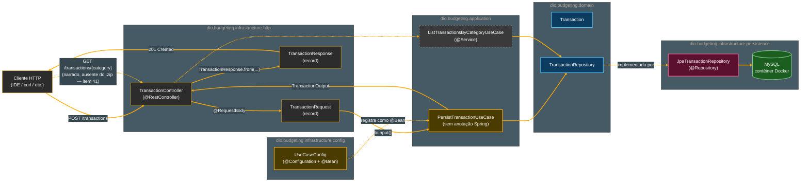
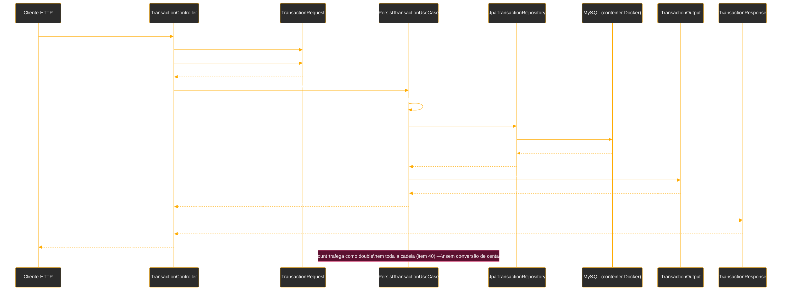

# Tutorial de Estudos — Desenvolvendo sua API Inteligente com Reconhecimento de Fala e Spring Boot

**Continuação — Vídeo 10 (Exposição REST: Implementando o TransactionController)**

- Curso: NTT Data — Jornada Tech (DIO) · Módulo 4 — Curso 5: "Desenvolvendo sua API Inteligente com Reconhecimento de Fala e Spring Boot"
- Instrutor: Thiago Poiani (Principal Engineer at Skip)
- Projeto: `budgeting`
- Documento de referência pessoal — nível iniciante em Java

---

## Sobre esta atualização

Este arquivo dá continuidade ao tutorial já existente (`001-...md`, Vídeos 01 e 02; `002-...md`, Vídeo 03; `003-...md`, Vídeo 04; `004-...md`, Vídeo 05; `005-...md`, Vídeo 06; `006-...md`, Vídeo 07; `007-...md`, Vídeo 08; `008-...md`, Vídeo 09), cobrindo agora o **Vídeo 10**. Ele foi escrito a partir de três fontes conferidas de verdade, e não de suposição: a seção "Vídeo 10" do README atualizado, a transcrição bruta da aula (`transcricao.md`) e o estado real do projeto no `.zip` (`budgeting_ate_o_video10.zip`) — descompactado e lido arquivo por arquivo, campo a campo, antes de qualquer linha deste documento ser escrita.

**Como usar este arquivo:** ele foi pensado para ser **concatenado** ao final do documento anterior (`008-Tutorial_Budgeting_Spring_AI_Video09.md`). A seção "Parte 10" abaixo deve ser inserida **depois** da "Parte 9 — Persistência e Infraestrutura" do documento anterior e **antes** da seção "Pontos de atenção (continuação)" dele. As seções "Pontos de atenção", "Glossário", "Checkpoint", "Próximos passos" e "Diagramas" abaixo devem **substituir** as seções equivalentes do documento anterior.

> **⚠️ Nota importante sobre o que o Vídeo 10 realmente entrega — divergência maior do que nos vídeos anteriores.** O README e a transcrição narram, em detalhe, a criação do `TransactionController` com dois endpoints (`POST /transactions` e `GET /transactions/{category}`), apoiados por um novo caso de uso `ListTransactionsByCategoryUseCase`. Isso de fato acontece, e os testes manuais mostrados na aula (criar uma transação, listar por categoria) funcionam. **Mas a comparação campo a campo com o `.zip` revela duas surpresas que nenhuma das duas fontes narrativas menciona:**
> 1. O tipo do campo `amount`, que desde o Vídeo 08 vinha sendo tratado como `long` (centavos, uma prática deliberada para evitar erros de arredondamento com dinheiro — ver seção 8.3 do tutorial anterior), **virou `double` em toda a cadeia** (`Transaction`, `TransactionEntity`, `PersistTransactionInput`, `TransactionRequest`) neste checkpoint — sem uma única linha de explicação no README ou na transcrição fornecida. Isso é detalhado no item 40 de "Pontos de atenção".
> 2. O arquivo `TransactionController.java` realmente salvo no `.zip` **não contém** o endpoint `GET /transactions/{category}` que tanto o README quanto a transcrição descrevem em detalhe — apenas o `ListTransactionsByCategoryUseCase` foi criado como classe isolada. Isso é detalhado no item 41.
>
> Este tutorial documenta o código **exatamente como ele existe no `.zip`**, explica o endpoint `GET` da forma como a aula o demonstra (porque o raciocínio e o padrão de projeto são válidos e serão necessários para acompanhar o restante do curso), e sinaliza claramente, em todos os pontos relevantes, onde a implementação real diverge do que foi narrado.

---

## Parte 10 — Exposição REST: Implementando o TransactionController (Vídeo 10)

Com o domínio (`Transaction`, `Category`, `TransactionRepository`), o primeiro caso de uso (`PersistTransactionUseCase`, Vídeo 08) e a persistência real contra um banco MySQL (`JpaTransactionRepository`, Vídeo 09) já prontos, mas sem nenhuma forma de um cliente HTTP acionar qualquer coisa, o Vídeo 10 finalmente conecta esses fios: cria o primeiro controller REST do domínio de transações financeiras.

### 10.1. Criando o pacote `http`

Seguindo a mesma separação em camadas já usada para `persistence` (Vídeo 09), dentro de `dio.budgeting.infrastructure` é criado um novo subpacote:

- **`dio.budgeting.infrastructure.http`** — vai concentrar os *controllers* responsáveis por expor endpoints HTTP. Assim como `persistence` cuida de "como os dados são salvos", `http` cuida de "como o mundo externo conversa com a aplicação" — outro tipo de detalhe de infraestrutura que o domínio não precisa conhecer.

### 10.2. Criando e anotando o `TransactionController`

Dentro do pacote `http`, é criada a classe `TransactionController`:

```java
package dio.budgeting.infrastructure.http;

import dio.budgeting.application.PersistTransactionUseCase;
import org.springframework.web.bind.annotation.RequestMapping;
import org.springframework.web.bind.annotation.RestController;

@RestController
@RequestMapping("/transactions")
public class TransactionController {

    private final PersistTransactionUseCase persistTransactionUseCase;

    public TransactionController(PersistTransactionUseCase persistTransactionUseCase) {
        this.persistTransactionUseCase = persistTransactionUseCase;
    }
}
```

- **`@RestController`** — já vista no `ChatModelController` (Vídeo 03): marca a classe como um controller do Spring MVC cujos métodos devolvem os dados diretamente no corpo (*body*) da resposta HTTP (tipicamente convertidos para JSON automaticamente), em vez de renderizar uma página HTML.
- **`@RequestMapping("/transactions")`** — define o caminho (URL) **base**, comum a todos os endpoints declarados dentro desta classe. Qualquer método do controller que declare seu próprio mapeamento (como será visto a seguir) terá esse prefixo `/transactions` automaticamente somado ao caminho específico dele.
- **`private final PersistTransactionUseCase persistTransactionUseCase;`** — o campo que guarda a referência ao caso de uso criado no Vídeo 08. É `final` porque, uma vez atribuído no construtor, não deve mudar.
- **Construtor recebendo `PersistTransactionUseCase`** — o mesmo padrão de **injeção de dependência via construtor** já usado em toda a aplicação (por exemplo, no `JpaTransactionRepository`, Vídeo 09): o Spring, ao criar o `TransactionController`, identifica que ele precisa de um `PersistTransactionUseCase` e tenta injetar automaticamente um *bean* desse tipo.

> **Atenção — esta linha só funciona graças a algo que a aula não narra explicitamente.** Até o final do Vídeo 09, `PersistTransactionUseCase` era uma classe comum, **sem nenhuma anotação do Spring** (nem `@Service`, nem `@Component`) — ou seja, o Spring não sabia que precisava criar uma instância dela. Um construtor pedindo, via injeção de dependência, um tipo que não existe como *bean* faz a aplicação falhar ao subir, com um erro do tipo `NoSuchBeanDefinitionException`. Para este controller sequer compilar/rodar, era necessário resolver essa pendência — o que de fato acontece no `.zip`, através de um arquivo novo detalhado na seção 10.9 a seguir (`UseCaseConfig`), mas que não é mencionado nem no README nem na transcrição desta etapa.

### 10.3. Criando o endpoint POST e o pacote `request`

É criado o método que vai receber a requisição de criação de transação, mapeado com `@PostMapping` na raiz do recurso (ou seja, `POST /transactions`, já que a URL base `/transactions` vem do `@RequestMapping` da classe):

```java
@PostMapping
public void createTransaction(@RequestBody TransactionRequest request) {

}
```

- **`@PostMapping`** — anotação de método que mapeia esse método para responder a requisições HTTP do tipo `POST` (usado, por convenção REST, para **criar** um novo recurso) no caminho herdado da classe. É a contraparte, para `POST`, do `@GetMapping` já visto no `ChatModelController` (Vídeo 03) e do `@PostMapping` com `consumes` já visto no `TranscriptionController` (Vídeo 06) — aqui, sem o atributo `consumes`, porque o corpo esperado é JSON, o padrão do Spring, e não um arquivo binário.
- **`@RequestBody`** — anotação de **parâmetro** que instrui o Spring a pegar o corpo (*body*) da requisição HTTP recebida — tipicamente um texto em formato JSON — e **desserializá-lo** automaticamente (convertê-lo de JSON para um objeto Java) no tipo declarado, aqui `TransactionRequest`. É esse recurso que permite ao método receber, como se fosse um parâmetro Java comum, os dados que o cliente da API enviou no corpo da requisição.
- **`TransactionRequest`** — um tipo que ainda não existe. Para não acoplar o controller diretamente ao objeto de entrada que o caso de uso espera (`PersistTransactionInput`), é criado um novo pacote, `dio.budgeting.infrastructure.http.request`, destinado a abrigar os DTOs de **entrada** específicos da camada HTTP. Essa separação — um DTO próprio para a camada HTTP, diferente do DTO usado pela camada de aplicação — é uma prática de **DDD** (*Domain-Driven Design*) que evita que uma mudança no formato de entrada (por exemplo, o formato que o cliente HTTP envia) obrigue a alterar a regra de negócio dentro do caso de uso, e vice-versa.

### 10.4. Definindo o `TransactionRequest`

Dentro do novo pacote `request`, é criado o DTO de entrada, como um `record` (o mesmo recurso já usado em `PersistTransactionInput` e `TransactionOutput` desde o Vídeo 08 — imutável, compacto, adequado para representar dados sem lógica de negócio):

```java
package dio.budgeting.infrastructure.http.request;

import dio.budgeting.application.input.PersistTransactionInput;
import dio.budgeting.domain.Category;

public record TransactionRequest(String description, Category category, double amount) {
    public PersistTransactionInput toInput() {
        return new PersistTransactionInput(description, amount, category);
    }
}
```

- **`String description`** — a descrição do gasto, texto livre.
- **`Category category`** — o campo já é declarado com o tipo do **enum** `Category` (`GROCERIES`, `PHARMA`, `AUTO`), e não como `String`. Isso significa que o próprio Spring, ao desserializar o JSON recebido, já converte automaticamente o texto enviado pelo cliente (por exemplo, `"GROCERIES"`) para o valor correspondente do enum — sem que o controller precise fazer essa conversão manualmente.
- **`double amount`** — o valor da transação.

> **Divergência importante (ver também o item 40 de "Pontos de atenção").** O README narra este campo como `long amount`, "representado em centavos" — e a transcrição, nesse mesmo trecho, também descreve verbalmente "o amount em centavos". **O código realmente salvo no `.zip`, no entanto, declara `double amount`.** Não é uma diferença cosmética: é o tipo de dado, e ele se propaga por toda a cadeia (seção a seguir). Este documento reproduz o `double` porque é o que está de fato no `.zip` — mas vale registrar que a explicação de "centavos como número inteiro para evitar erro de arredondamento" (dada em detalhe no Vídeo 08) deixou de valer para o código real deste checkpoint.

A aula também comenta que, neste ponto, "valeria a pena" adicionar validações aos campos do `record` — algo que ainda não é feito neste vídeo (nenhuma anotação de validação, como `@NotBlank` ou `@Positive`, aparece no `.zip`).

### 10.5. Chamando o caso de uso a partir do request

De volta ao `TransactionController`, o `request` recebido é convertido para o tipo de entrada que o caso de uso espera:

```java
@PostMapping
public void createTransaction(@RequestBody TransactionRequest request) {
    persistTransactionUseCase.execute(request.toInput());
}
```

- **`request.toInput()`** — chama o método definido na seção 10.4, que constrói um `PersistTransactionInput` a partir dos três campos do `request`. Repare que a ordem dos parâmetros muda: `TransactionRequest` declara `(description, category, amount)`, mas `PersistTransactionInput` espera `(description, amount, category)` — o método `toInput()` é exatamente o lugar responsável por fazer essa "tradução" entre os dois formatos, isolando essa diferença dentro do próprio DTO de entrada.
- **`persistTransactionUseCase.execute(...)`** — executa, finalmente, o caso de uso criado no Vídeo 08, que agora tem, pela primeira vez em todo o projeto, um chamador real em tempo de execução.

### 10.6. Criando o pacote `response` e o `TransactionResponse`

Em vez de o controller devolver o resultado do caso de uso diretamente (`TransactionOutput`, um objeto pensado para a camada de **aplicação**, não para a camada HTTP), é criado, seguindo o mesmo raciocínio da seção 10.3, um novo pacote `dio.budgeting.infrastructure.http.response`, com um DTO de **saída**:

```java
package dio.budgeting.infrastructure.http.response;

import dio.budgeting.application.output.TransactionOutput;

public record TransactionResponse(String id, String category, String description, double amount) {
    public static TransactionResponse from(TransactionOutput output) {
        return new TransactionResponse(output.id(), output.category(), output.description(), output.value());
    }
}
```

- **`id`, `category`, `description`** como `String`, e **`amount`** como `double`** — os quatro campos que serão de fato serializados para JSON e devolvidos ao cliente da API.
- **`public static TransactionResponse from(TransactionOutput output)`** — um **método estático de fábrica** (*static factory method*): em vez de o chamador escrever `new TransactionResponse(...)` manualmente montando cada campo, ele apenas chama `TransactionResponse.from(output)`, e é a própria classe `TransactionResponse` quem sabe como se construir a partir de um `TransactionOutput`. É o mesmo padrão de projeto já usado em `TransactionOutput.from(transaction)` (Vídeo 08) e em `TransactionEntity.from(transaction)` / `.toDomain()` (Vídeo 09) — sempre que uma camada precisa converter o objeto de outra camada para o seu próprio formato, esse mapeamento fica concentrado em um método `from` dentro da própria classe de destino, e não espalhado pelo controller.
- **`output.id()`, `output.category()`, `output.description()`, `output.value()`** — chamadas aos métodos de acesso automáticos que o `record` `TransactionOutput` (Vídeo 08) já gera para cada um de seus campos (`id`, `description`, `category`, `value`).

De volta ao controller, o método passa a retornar o resultado dessa conversão, e recebe também a anotação de status HTTP adequada para uma criação de recurso:

```java
@PostMapping
@ResponseStatus(HttpStatus.CREATED)
public TransactionResponse createTransaction(@RequestBody TransactionRequest request) {
    var transactionOutput = persistTransactionUseCase.execute(request.toInput());
    return TransactionResponse.from(transactionOutput);
}
```

- **`var transactionOutput = ...`** — o retorno da execução do caso de uso (um `TransactionOutput`) é guardado em uma variável local antes de ser convertido, em vez de encadear tudo em uma única linha — deixando o método um pouco mais legível.
- **`@ResponseStatus(HttpStatus.CREATED)`** — anotação de método que define explicitamente o **código de status HTTP** devolvido na resposta, sobrescrevendo o padrão do Spring para métodos com corpo de retorno (que seria `200 OK`). `HttpStatus` é um **enum** do Spring que representa os códigos de status HTTP possíveis (`OK`, `CREATED`, `NOT_FOUND`, `BAD_REQUEST`, etc.), evitando o uso de "números mágicos" (como `201`) espalhados pelo código. `CREATED` corresponde ao código **`201`**, a convenção HTTP para "um novo recurso foi criado com sucesso" — mais preciso, semanticamente, do que o `200 OK` genérico, que normalmente indica apenas "a requisição foi processada com sucesso", sem indicar que algo novo passou a existir.
- **O tipo de retorno do método muda de `void` para `TransactionResponse`** — agora que existe, de fato, algo a devolver ao cliente.

### 10.7. Subindo a aplicação e testando a criação

Com o endpoint implementado, a aplicação Spring Boot é reiniciada. Como nenhuma alteração foi feita no schema do banco, a subida ocorre sem novas migrações — mas, como observado na seção 10.2, essa subida só tem sucesso porque `PersistTransactionUseCase` passou a ser, de alguma forma, um *bean* injetável (ver seção 10.9).

Usando o painel de **Endpoints** da IDE (o mesmo recurso do IntelliJ já usado desde o Vídeo 03, que descobre automaticamente os endpoints mapeados e monta um cliente HTTP de teste pronto para uso), é localizado o novo `POST /transactions`, já com um corpo de requisição de exemplo preenchido com `description`, `category` e `amount`. Preenchendo com uma descrição, a categoria `GROCERIES` e um valor de transação, o request é enviado (*submit*), e a resposta retorna os dados persistidos com status `201`.

A própria transcrição aponta, ao vivo, um comportamento inesperado: o campo `amount` da resposta volta com uma casa decimal a mais do que o esperado (por exemplo, algo como `12533.0`) — sugerindo, à primeira vista, que "a conversão em algum momento está errada". **À luz do que foi confirmado no `.zip` (item 40 de "Pontos de atenção"), essa observação faz sentido: como `amount` é hoje um `double` em toda a cadeia — sem nenhuma etapa que multiplique, divida ou de qualquer forma "converta" centavos em um valor monetário —, o número entra e sai exatamente como foi digitado, apenas com o `.0` que o Java adiciona ao imprimir um `double` que representa um número inteiro.** Não existe, neste checkpoint, nenhuma lógica de conversão pendente — o comportamento observado é simplesmente o valor passando pela aplicação sem qualquer transformação.

A persistência real no banco é confirmada com uma consulta na tabela `transaction_entity`, mostrando o `amount`, o `id` em formato UUID, a `description` e a `category` correspondentes ao que foi enviado.

### 10.8. Criando o `ListTransactionsByCategoryUseCase`

Avançando para a listagem de transações, é criado um novo caso de uso, seguindo exatamente o mesmo padrão de `PersistTransactionUseCase` (Vídeo 08):

```java
package dio.budgeting.application;

import dio.budgeting.application.output.TransactionOutput;
import dio.budgeting.domain.Category;
import dio.budgeting.domain.TransactionRepository;
import org.springframework.stereotype.Service;

import java.util.List;

@Service
public class ListTransactionsByCategoryUseCase {
    private final TransactionRepository transactionRepository;

    public ListTransactionsByCategoryUseCase(TransactionRepository transactionRepository) {
        this.transactionRepository = transactionRepository;
    }

    public List<TransactionOutput> execute(Category category) {
        return transactionRepository.findAllByCategory(category).stream().map(TransactionOutput::from).toList();
    }
}
```

- **`@Service`** — anotação de estereótipo do Spring (da mesma família de `@RestController`, `@Repository` já vistas) que marca a classe como um *bean* gerenciado pela camada de **serviço/aplicação**, tornando-a automaticamente injetável em qualquer outro componente que dependa dela — sem exigir uma classe `@Configuration` separada. É essa anotação, presente aqui mas **ausente** em `PersistTransactionUseCase`, que explica por que este caso de uso já é injetável "de graça", enquanto o outro precisou de uma solução alternativa (seção 10.9).
- **Construtor recebendo `TransactionRepository`** — a mesma injeção de dependência via construtor de sempre: o Spring injeta automaticamente o `JpaTransactionRepository` (Vídeo 09), já que ele é a implementação concreta registrada como `@Repository` para essa interface.
- **`public List<TransactionOutput> execute(Category category)`** — segue o padrão adotado para todos os casos de uso do projeto: um único método público, chamado `execute`, representando a única ação que essa classe sabe fazer.
- **`transactionRepository.findAllByCategory(category)`** — chama o método do repositório de domínio (declarado desde o Vídeo 08, implementado de fato no Vídeo 09) que devolve uma `List<Transaction>` filtrada pela categoria.
- **`.stream().map(TransactionOutput::from).toList()`** — a mesma sequência de **Stream** já vista em `JpaTransactionRepository.findAllByCategory` (Vídeo 09): percorre a lista, converte cada `Transaction` (domínio) em um `TransactionOutput` (saída da camada de aplicação) usando o método de fábrica `from`, e coleta o resultado de volta em uma lista.

### 10.9. A pendência resolvida por trás dos panos: `UseCaseConfig`

Como registrado na seção 10.2, `PersistTransactionUseCase` não tem (e continua sem ter, mesmo neste checkpoint) qualquer anotação de estereótipo do Spring. Ainda assim, o `TransactionController` consegue injetá-lo e a aplicação sobe normalmente. Isso só é possível graças a um arquivo novo, presente no `.zip`, mas **não mencionado nem no README nem na transcrição** desta etapa:

```java
package dio.budgeting.infrastructure.config;

import dio.budgeting.application.PersistTransactionUseCase;
import dio.budgeting.domain.TransactionRepository;
import org.springframework.context.annotation.Bean;
import org.springframework.context.annotation.Configuration;

@Configuration
public class UseCaseConfig {

    @Bean
    public PersistTransactionUseCase persistTransactionUseCase(TransactionRepository transactionRepository) {
        return new PersistTransactionUseCase(transactionRepository);
    }
}
```

- **`@Configuration`** — já vista no `ChatClientController`/configuração do Vídeo 04: marca a classe como uma fonte centralizada de definições de *beans*.
- **`@Bean`** — aplicada ao método `persistTransactionUseCase`, instrui o Spring a registrar o valor devolvido por esse método (um `new PersistTransactionUseCase(transactionRepository)`) como um *bean* gerenciado, disponível para injeção em qualquer lugar do projeto que precise de um `PersistTransactionUseCase` — como o construtor do `TransactionController` (seção 10.2).
- **`public PersistTransactionUseCase persistTransactionUseCase(TransactionRepository transactionRepository)`** — o próprio **parâmetro** do método `@Bean` é, ele mesmo, resolvido pelo Spring via injeção de dependência: o framework identifica que, para construir esse *bean*, precisa primeiro de um `TransactionRepository` — e injeta a implementação já registrada como `@Repository`, o `JpaTransactionRepository` (Vídeo 09) — e então usa esse valor para chamar `new PersistTransactionUseCase(transactionRepository)` manualmente dentro do método.

Este arquivo fecha, exatamente como o tutorial do Vídeo 09 havia antecipado (item 38 daquele documento), a pendência de `PersistTransactionUseCase` nunca ter sido, ele mesmo, um *bean* gerenciado. A abordagem escolhida foi a segunda das duas alternativas cogitadas naquele tutorial: em vez de simplesmente adicionar `@Service` diretamente na classe do caso de uso (como foi feito para `ListTransactionsByCategoryUseCase`, seção 10.8), optou-se por uma classe `@Configuration`/`@Bean` explícita, separada — mantendo `PersistTransactionUseCase`, em si, livre de qualquer anotação de framework, um detalhe coerente com o espírito da Clean Architecture já discutido no Vídeo 08. **Ambos os casos de uso do projeto acabam sendo *beans* gerenciados pelo Spring — só que por dois caminhos diferentes**, uma inconsistência de estilo que vale observar nos próximos vídeos.

### 10.10. Preparando o endpoint de listagem no controller

De volta ao `TransactionController`, a listagem por categoria é conectada. O README e a transcrição narram esse passo em duas etapas, como a IDE normalmente sugere ao digitar `@GetMapping` pela primeira vez: uma assinatura inicial com `@RequestParam`,

```java
@GetMapping
@ResponseStatus(HttpStatus.OK)
public List<TransactionResponse> readTransactions(@RequestParam Integer categoryId) {

}
```

- **`@RequestParam`** — anotação de parâmetro que extrai um valor da **query string** da URL (a parte depois de `?`, como `/transactions?categoryId=1`), diferente de `@RequestBody` (que lê o corpo da requisição). Esse é o ponto de partida sugerido automaticamente pela IDE, logo descartado em favor da abordagem seguinte.
- **`@ResponseStatus(HttpStatus.OK)`** — aqui redundante (é o padrão do Spring para métodos com retorno em requisições bem-sucedidas), mas explicitado.

... e, em seguida, ajustada para receber a categoria diretamente como parte do caminho da URL:

```java
@GetMapping("/{category}")
public List<TransactionResponse> readTransactions(@PathVariable Category category) {
    return listTransactionsByCategoryUseCase.execute(category).stream()
            .map(TransactionResponse::from)
            .toList();
}
```

- **`@GetMapping("/{category}")`** — mapeia o método para `GET /transactions/{category}` (lembrando que `/transactions` já vem do `@RequestMapping` da classe). O trecho `{category}` é um **placeholder de caminho** (*path variable*): qualquer valor digitado ali na URL (por exemplo, `/transactions/GROCERIES`) é capturado como um segmento variável.
- **`@PathVariable Category category`** — anotação de parâmetro que extrai o valor capturado pelo placeholder `{category}` do caminho da URL, e o converte automaticamente para o tipo declarado. Como `Category` é um enum, o Spring já sabe converter o texto da URL (por exemplo, `"GROCERIES"`) para o valor correspondente, exatamente como acontece na desserialização do JSON no `TransactionRequest` (seção 10.4).
  - **`@PathVariable` vs. `@RequestParam`** — a diferença prática entre as duas primeiras versões do endpoint: `@RequestParam` lê um valor da *query string* (`?categoryId=1`), enquanto `@PathVariable` lê um valor que faz parte do próprio caminho da URL (`/transactions/GROCERIES`). Para identificar de forma única **qual** recurso está sendo consultado (aqui, "as transações de uma categoria"), `@PathVariable` é a convenção REST mais comum.
- **`listTransactionsByCategoryUseCase.execute(category)`** — executa o caso de uso criado na seção 10.8, recebendo de volta uma `List<TransactionOutput>`.
- **`.stream().map(TransactionResponse::from).toList()`** — a mesma sequência já vista repetidas vezes no projeto: percorre a lista de `TransactionOutput` (saída da camada de aplicação) e converte cada item para `TransactionResponse` (saída da camada HTTP) usando o método de fábrica da seção 10.6, coletando o resultado em uma nova lista.

O controller também precisa declarar e injetar o novo caso de uso, ao lado do `PersistTransactionUseCase` já existente:

```java
private final PersistTransactionUseCase persistTransactionUseCase;
private final ListTransactionsByCategoryUseCase listTransactionsByCategoryUseCase;

public TransactionController(PersistTransactionUseCase persistTransactionUseCase,
                              ListTransactionsByCategoryUseCase listTransactionsByCategoryUseCase) {
    this.persistTransactionUseCase = persistTransactionUseCase;
    this.listTransactionsByCategoryUseCase = listTransactionsByCategoryUseCase;
}
```

> **⚠️ Divergência confirmada — leia antes de comparar com o seu próprio código.** Tudo o que está descrito nesta seção 10.10 (o método `readTransactions`, o segundo campo `listTransactionsByCategoryUseCase`, o construtor com dois parâmetros) corresponde exatamente ao que o README e a transcrição narram, e é o único caminho coerente para os testes de listagem descritos na seção 10.11 terem realmente funcionado ao vivo. **Porém, o arquivo `TransactionController.java` salvo dentro do `.zip` não contém nada disso** — ele para exatamente no estado da seção 10.7, apenas com o método `createTransaction`. O `ListTransactionsByCategoryUseCase` existe como classe isolada (seção 10.8) e o `UseCaseConfig` também está presente (seção 10.9), mas a "última milha" — voltar ao controller e efetivamente ligar os fios — não chegou a ser salva neste checkpoint específico. Isso é registrado em detalhe no item 41 de "Pontos de atenção", junto com a evidência (datas de modificação dos arquivos) que sustenta essa conclusão. **Na prática:** o código deste tutorial está correto e é exatamente o que fazer para reproduzir a listagem por categoria — mas, se você comparar diretamente com o `.zip` anexado, não estranhe encontrar o controller sem o `@GetMapping`.

### 10.11. Testando a listagem por categoria

Com o endpoint (conforme narrado na aula) pronto, a aplicação é reiniciada. No painel de **Endpoints** da IDE, é localizado o novo `GET /transactions/{category}`. No primeiro teste, com uma categoria sem nenhuma transação salva, a resposta retorna um array vazio — confirmando que o filtro funciona mesmo sem resultados. Em seguida, testando com a categoria `GROCERIES` (a mesma usada no teste de criação da seção 10.7), a API retorna a lista contendo a transação criada anteriormente, confirmando que tanto a criação quanto a listagem por categoria funcionam de ponta a ponta.

A transcrição fecha o vídeo apontando o que vem a seguir: agora que os controllers de persistência e consulta estão prontos, o próximo passo é "mexer com o que é realmente Spring AI" — receber um áudio, configurar os casos de uso como *tools* (o mecanismo de Tool Calling já visto no Vídeo 05) e, por fim, converter o texto de volta em áudio — ou seja, finalmente orquestrar o fluxo de ponta a ponta que os Vídeos 08 a 10 vinham preparando o terreno para construir.

---

## Pontos de atenção (continuação — divergências do Vídeo 10)

Dando sequência à lista já registrada nos tutoriais anteriores (itens 1 a 39), a comparação campo a campo entre a aula/README e o `.zip` real revela mais três pontos nesta etapa — sendo os itens 40 e 41 divergências relevantes o suficiente para afetar a reprodutibilidade do código:

40. **O tipo do campo `amount` mudou de `long` (centavos) para `double` em toda a cadeia de dados, sem qualquer menção no README ou na transcrição desta etapa.** Conferido diretamente nos quatro arquivos envolvidos: `Transaction.java` (domínio), `TransactionEntity.java` (persistência), `PersistTransactionInput.java` (entrada da aplicação) e `TransactionRequest.java` (entrada HTTP) — todos declaram `double amount` no `.zip` do Vídeo 10. Até o checkpoint do Vídeo 09 (conferido no tutorial anterior), todos esses mesmos campos eram `long`, e o próprio Vídeo 08 dedicou uma explicação inteira (seção 8.3 do tutorial anterior) a justificar por que `long`/centavos é preferível a `double` para representar dinheiro, evitando erros de arredondamento de ponto flutuante. O README, na seção do Vídeo 10, continua reproduzindo blocos de código com `long amount` (por exemplo, na definição de `TransactionRequest`), e a transcrição também menciona verbalmente "o amount em centavos" — nenhuma das duas fontes atualiza esse texto para refletir a mudança real.

    **Impacto prático:** este é o ponto que melhor explica o comportamento "estranho" relatado ao vivo na própria aula (seção 10.7): o valor enviado na requisição volta na resposta com um `.0` a mais e sem qualquer conversão — porque, com tudo em `double`, não existe mais nenhuma etapa no código que trate `amount` como centavos e o converta para um valor monetário "legível". O comportamento não é um bug pontual de conversão pendente (como o README interpreta) — é a consequência direta e esperada de essa conversão ter deixado de ter qualquer motivo para existir, já que o valor não é mais armazenado como número inteiro de centavos em nenhum lugar da cadeia.

41. **O `TransactionController.java` salvo no `.zip` não contém o endpoint `GET /transactions/{category}` — apenas o `POST /transactions` da seção 10.7 está presente.** Conferido diretamente no arquivo: ele possui 28 linhas, um único campo (`persistTransactionUseCase`), um construtor de um parâmetro e um único método (`createTransaction`). Nenhum `@GetMapping`, nenhum `listTransactionsByCategoryUseCase`, nenhum `readTransactions`. As datas de última modificação dos arquivos dentro do `.zip` sustentam essa leitura: `TransactionController.java` foi salvo por último às 17:05, enquanto `ListTransactionsByCategoryUseCase.java` — a classe que o controller precisaria injetar para ter o endpoint de listagem — foi salva às 17:44, quase 40 minutos **depois**. Ou seja: o caso de uso de listagem foi criado, mas a etapa seguinte, de voltar ao controller e efetivamente conectá-lo (exatamente como o README e a transcrição narram, e exatamente como está reproduzido na seção 10.10 deste tutorial), não chegou a ser salva no arquivo capturado por este `.zip` específico.

    **Impacto prático:** o projeto, do jeito que está no `.zip`, compila e roda normalmente — apenas não expõe a listagem por categoria via HTTP, mesmo com toda a infraestrutura para isso (`ListTransactionsByCategoryUseCase`, `TransactionResponse`) já pronta e correta. Quem quiser reproduzir exatamente o resultado demonstrado na aula (os testes da seção 10.11) precisa adicionar manualmente, no `TransactionController` real, o segundo campo, o construtor de dois parâmetros e o método `readTransactions`, tal como descritos na seção 10.10.

42. **`UseCaseConfig.java` é um arquivo inteiramente novo, presente no `.zip`, mas não mencionado em nenhum momento no README ou na transcrição fornecida para o Vídeo 10.** Conferido no `.zip`: o arquivo existe em `src/main/java/dio/budgeting/infrastructure/config/UseCaseConfig.java`, anotado com `@Configuration`, com um único método `@Bean` que registra `PersistTransactionUseCase` manualmente. Sem esse arquivo, a injeção de `PersistTransactionUseCase` no construtor do `TransactionController` (seção 10.2) causaria uma falha de inicialização da aplicação — então, mesmo sem ser narrado, ele precisou existir para qualquer um dos testes descritos na aula (seção 10.7) funcionar de fato.

    **Impacto prático:** nenhum negativo — resolve exatamente a pendência que o tutorial do Vídeo 09 (item 38) já havia identificado como necessária "assim que um controller precisar efetivamente usar essa classe". Vale apenas registrar que essa resolução aconteceu "fora de quadro" (não narrada), possivelmente nos primeiros minutos do vídeo, antes do trecho coberto pela transcrição disponível para este tutorial.

---

## Glossário — novos termos (Vídeo 10)

Estes termos se somam ao glossário já existente nos tutoriais anteriores (que cobrem Java, Spring, IA e ferramentas até o Vídeo 09) — apenas os termos que ainda não haviam aparecido.

| Termo | Significado |
|---|---|
| `@RequestBody` | Anotação de parâmetro do Spring MVC que instrui o framework a desserializar o corpo (*body*) de uma requisição HTTP — tipicamente JSON — diretamente para um objeto Java do tipo declarado. |
| `@ResponseStatus` | Anotação de método que define explicitamente o código de status HTTP devolvido em uma resposta, sobrescrevendo o padrão do Spring (`200 OK` para métodos com retorno). |
| `HttpStatus` | Enum do Spring que representa os códigos de status HTTP possíveis (`OK` = 200, `CREATED` = 201, `NOT_FOUND` = 404, etc.), evitando o uso de números "mágicos" espalhados pelo código. |
| `201 Created` | Código de status HTTP que indica que uma requisição resultou na criação bem-sucedida de um novo recurso — mais específico do que o `200 OK` genérico. |
| `@RequestParam` | Anotação de parâmetro do Spring MVC que extrai um valor da *query string* da URL (a parte após `?`, ex.: `?categoria=1`), em contraste com `@PathVariable` (que lê um segmento do próprio caminho) e `@RequestBody` (que lê o corpo da requisição). |
| `@PathVariable` | Anotação de parâmetro do Spring MVC que extrai o valor de um segmento variável do caminho da URL (declarado com `{chave}` no `@GetMapping`/`@RequestMapping`), convertendo-o automaticamente para o tipo do parâmetro Java. |
| Path variable (placeholder de caminho) | Um segmento de uma rota HTTP, declarado entre chaves (ex.: `/{category}`), que aceita qualquer valor digitado naquela posição da URL e o disponibiliza para o método via `@PathVariable`. |
| `@Service` | Anotação de estereótipo do Spring que marca uma classe como um *bean* gerenciado da camada de serviço/aplicação — o mesmo efeito básico de `@Component`, `@Repository` e `@RestController`, mas comunicando a intenção semântica "isso é uma regra de negócio/caso de uso". |
| Método de fábrica estático (*static factory method*) | Um método `static` dentro de uma classe, usado como alternativa a chamar `new` diretamente — encapsula a lógica de construção/conversão dentro da própria classe de destino (ex.: `TransactionResponse.from(output)`). |

---

## Checkpoint do Vídeo 10

Estado do projeto conferido diretamente nos arquivos do `.zip` (`budgeting_ate_o_video10.zip`) — e não apenas na narrativa do README. Como registrado em "Pontos de atenção" (itens 40 a 42), este checkpoint reflete um `POST /transactions` **funcional de ponta a ponta**, um `ListTransactionsByCategoryUseCase` pronto porém **ainda não conectado** a nenhum endpoint HTTP no arquivo salvo, e uma mudança silenciosa de `long` para `double` no campo `amount` em toda a cadeia de dados.

### Estrutura de pastas

```
budgeting/
├── build.gradle                                          ← inalterado desde o Vídeo 09
├── compose.yml                                            ← inalterado
├── settings.gradle / gradlew / gradlew.bat / gradle/wrapper/
└── src/
    ├── main/
    │   ├── java/dio/budgeting/
    │   │   ├── BudgetingApplication.java                 ← inalterado
    │   │   ├── ChatModelController.java                  ← inalterado desde o Vídeo 03
    │   │   ├── ChatClientController.java                 ← inalterado desde o Vídeo 04
    │   │   ├── TranscriptionController.java               ← inalterado desde o Vídeo 06
    │   │   ├── TextToSpeechController.java                ← inalterado desde o Vídeo 07
    │   │   ├── domain/
    │   │   │   ├── Transaction.java                       ← alterado (amount: long → double; item 40)
    │   │   │   ├── TransactionId.java                     ← inalterado
    │   │   │   ├── Category.java                          ← inalterado
    │   │   │   └── TransactionRepository.java             ← inalterado
    │   │   ├── application/
    │   │   │   ├── PersistTransactionUseCase.java         ← inalterado no código; agora injetável via UseCaseConfig (item 42)
    │   │   │   ├── ListTransactionsByCategoryUseCase.java ← novo (seção 10.8)
    │   │   │   ├── input/
    │   │   │   │   └── PersistTransactionInput.java       ← alterado (amount: long → double; item 40)
    │   │   │   └── output/
    │   │   │       └── TransactionOutput.java             ← inalterado desde o Vídeo 08
    │   │   └── infrastructure/
    │   │       ├── config/                                ← novo pacote
    │   │       │   └── UseCaseConfig.java                 ← novo (seção 10.9, item 42)
    │   │       ├── http/                                  ← novo pacote
    │   │       │   ├── TransactionController.java         ← novo (apenas POST; ver item 41)
    │   │       │   ├── request/
    │   │       │   │   └── TransactionRequest.java        ← novo (double amount; item 40)
    │   │       │   └── response/
    │   │       │       └── TransactionResponse.java       ← novo
    │   │       └── persistence/                           ← inalterado desde o Vídeo 09, exceto TransactionEntity
    │   │           ├── entity/
    │   │           │   └── TransactionEntity.java         ← alterado (amount: long → double; item 40)
    │   │           └── repository/
    │   │               ├── TransactionEntityRepository.java  ← inalterado
    │   │               └── JpaTransactionRepository.java     ← inalterado
    │   └── resources/
    │       └── application.properties                     ← inalterado desde o Vídeo 09
    └── test/
        ├── java/dio/budgeting/                             ← todos os arquivos inalterados desde os checkpoints anteriores
        └── resources/audio/                                ← inalterado desde o Vídeo 06
```

A novidade estrutural em relação ao checkpoint do Vídeo 09 é a chegada dos subpacotes `config` e `http` (com `request` e `response`) dentro de `infrastructure` — antes ambos vazios ou inexistentes —, do arquivo `ListTransactionsByCategoryUseCase.java` em `application`, e de uma mudança de tipo (`long` → `double`) que atravessa quatro arquivos que já existiam desde vídeos anteriores.

### `src/main/java/dio/budgeting/infrastructure/http/TransactionController.java` (novo — estado real do `.zip`)

```java
package dio.budgeting.infrastructure.http;

import dio.budgeting.application.PersistTransactionUseCase;
import dio.budgeting.infrastructure.http.request.TransactionRequest;
import dio.budgeting.infrastructure.http.response.TransactionResponse;
import org.springframework.http.HttpStatus;
import org.springframework.web.bind.annotation.PostMapping;
import org.springframework.web.bind.annotation.RequestBody;
import org.springframework.web.bind.annotation.RequestMapping;
import org.springframework.web.bind.annotation.ResponseStatus;
import org.springframework.web.bind.annotation.RestController;

@RestController
@RequestMapping("/transactions")
public class TransactionController {

    private final PersistTransactionUseCase persistTransactionUseCase;

    public TransactionController(PersistTransactionUseCase persistTransactionUseCase) {
        this.persistTransactionUseCase = persistTransactionUseCase;
    }

    @PostMapping
    @ResponseStatus(HttpStatus.CREATED)
    public TransactionResponse createTransaction(@RequestBody TransactionRequest request) {
        var transactionOutput = persistTransactionUseCase.execute(request.toInput());
        return TransactionResponse.from(transactionOutput);
    }
}
```

> Como registrado no item 41, este é o conteúdo **exato** do arquivo no `.zip` — sem o endpoint `GET /transactions/{category}` narrado na seção 10.10. Para reproduzir o comportamento completo demonstrado na aula, some manualmente o código daquela seção a este arquivo.

### `src/main/java/dio/budgeting/infrastructure/http/request/TransactionRequest.java` (novo)

```java
package dio.budgeting.infrastructure.http.request;

import dio.budgeting.application.input.PersistTransactionInput;
import dio.budgeting.domain.Category;

public record TransactionRequest(String description, Category category, double amount) {
    public PersistTransactionInput toInput() {
        return new PersistTransactionInput(description, amount, category);
    }
}
```

### `src/main/java/dio/budgeting/infrastructure/http/response/TransactionResponse.java` (novo)

```java
package dio.budgeting.infrastructure.http.response;

import dio.budgeting.application.output.TransactionOutput;

public record TransactionResponse(String id, String category, String description, double amount) {
    public static TransactionResponse from(TransactionOutput output) {
        return new TransactionResponse(output.id(), output.category(), output.description(), output.value());
    }
}
```

### `src/main/java/dio/budgeting/infrastructure/config/UseCaseConfig.java` (novo)

```java
package dio.budgeting.infrastructure.config;

import dio.budgeting.application.PersistTransactionUseCase;
import dio.budgeting.domain.TransactionRepository;
import org.springframework.context.annotation.Bean;
import org.springframework.context.annotation.Configuration;

@Configuration
public class UseCaseConfig {

    @Bean
    public PersistTransactionUseCase persistTransactionUseCase(TransactionRepository transactionRepository) {
        return new PersistTransactionUseCase(transactionRepository);
    }
}
```

### `src/main/java/dio/budgeting/application/ListTransactionsByCategoryUseCase.java` (novo)

```java
package dio.budgeting.application;

import dio.budgeting.application.output.TransactionOutput;
import dio.budgeting.domain.Category;
import dio.budgeting.domain.TransactionRepository;
import org.springframework.stereotype.Service;

import java.util.List;

@Service
public class ListTransactionsByCategoryUseCase {
    private final TransactionRepository transactionRepository;

    public ListTransactionsByCategoryUseCase(TransactionRepository transactionRepository) {
        this.transactionRepository = transactionRepository;
    }

    public List<TransactionOutput> execute(Category category) {
        return transactionRepository.findAllByCategory(category).stream().map(TransactionOutput::from).toList();
    }
}
```

### Os quatro arquivos afetados pela mudança `long` → `double` (item 40)

```java
// domain/Transaction.java
@Getter
@AllArgsConstructor
public class Transaction {
    private TransactionId id;
    private String description;
    private double amount;
    private Category category;

    public Transaction(String description, double amount, Category category) {
        this.id = new TransactionId();
        this.description = description;
        this.amount = amount;
        this.category = category;
    }
}
```

```java
// application/input/PersistTransactionInput.java
public record PersistTransactionInput(String description, double amount, Category category) {
}
```

```java
// infrastructure/persistence/entity/TransactionEntity.java (campo alterado; restante inalterado desde o Vídeo 09)
@Entity
@Data
@AllArgsConstructor
@NoArgsConstructor
public class TransactionEntity {
    @Id
    private UUID id;
    private String description;
    private double amount;

    @Enumerated(EnumType.STRING)
    private Category category;
    // métodos from(...)/toDomain() inalterados desde o Vídeo 09
}
```

(o quarto arquivo, `TransactionRequest.java`, já foi reproduzido integralmente acima.)

### Demais arquivos

`BudgetingApplication.java`, `ChatModelController.java`, `ChatClientController.java`, `TranscriptionController.java`, `TextToSpeechController.java`, `TransactionId.java`, `Category.java`, `TransactionRepository.java`, `TransactionOutput.java`, `TransactionEntityRepository.java`, `JpaTransactionRepository.java`, `build.gradle`, `application.properties`, `compose.yml` e todos os arquivos em `src/test/` seguem **inalterados** desde os checkpoints anteriores (já documentados em detalhe nos tutoriais dos Vídeos 02 a 09) — confirmado comparando o conteúdo desses arquivos com o `.zip` anterior.

> **Nota:** assim como nos checkpoints anteriores, o `.zip` também contém as pastas `.gradle/`, `build/` e `.idea/` (incluindo `budgeting.iml`), todas geradas/gerenciadas automaticamente pela ferramenta de build e pela IDE — não fazem parte deste checkpoint por não serem editadas manualmente.

---

## Próximos passos (atualizado): o que vem a partir do Vídeo 11

Com os dois casos de uso de transação já existindo e o primeiro deles (criação) já exposto via HTTP e testado de ponta a ponta contra o banco real, a sequência restante do curso (conferida no README) é:

- **Vídeo 11 — Endpoint de Transcrição: Integrando Áudio ao Controller:** deve aprofundar a integração do `TranscriptionController` (já existente desde o Vídeo 06), muito provavelmente conectando-a ao fluxo de Tool Calling (Vídeo 05) para registrar uma transação **a partir do áudio transcrito** — exatamente o que a própria transcrição do Vídeo 10 anuncia em sua fala de encerramento ("vamos receber um áudio e configurar os nossos use cases como tools"). É também um bom momento para observar se o endpoint `GET /transactions/{category}` (item 41, narrado mas ausente do `.zip` do Vídeo 10) aparece finalmente materializado no controller real, e se a mudança de `amount` para `double` (item 40) recebe alguma correção ou explicação.
- **Vídeo 12 — Roadmap e Auditoria: Evoluindo a API Inteligente:** deve fechar o desenvolvimento com sugestões de evolução do projeto e, possivelmente, mecanismos de auditoria/observabilidade.
- **Vídeo 13 — Entendendo o Desafio:** provavelmente o desafio prático de encerramento do curso.

---

## Diagramas: o que o Vídeo 10 acrescentou

### 1. Diagrama de blocos — o primeiro fluxo HTTP completo do domínio de transações



**Como ler este diagrama:**

- A linha sólida representa o fluxo `POST /transactions`, **testado e funcional de ponta a ponta** neste checkpoint: cliente → controller → request → caso de uso → repositório → banco → saída → response → cliente, com `201 Created`.
- A linha tracejada de `UseCaseConfig` até `PersistTransactionUseCase` representa a relação especial documentada na seção 10.9 e no item 42: diferente de `ListTransactionsByCategoryUseCase` (que se autorregistra como *bean* via `@Service`), `PersistTransactionUseCase` só existe como *bean* porque uma classe externa o registra manualmente.
- A caixa de `ListTransactionsByCategoryUseCase` aparece em cinza, e a seta que liga o cliente e o controller ao `GET /transactions/{category}` é tracejada com um rótulo explícito: o caso de uso **existe e está correto**, mas — como registrado no item 41 — o `TransactionController` real, salvo no `.zip`, não chega a injetá-lo nem a expor esse endpoint.

### 2. Diagrama de sequência — o que acontece hoje ao chamar `POST /transactions`



**Como ler este diagrama:** diferente dos diagramas de sequência "hipotéticos" dos Vídeos 08 e 09 (onde o `Caller` aparecia em cinza, por não existir ainda), **todos os participantes deste diagrama já existem e já funcionam de fato** neste checkpoint — este é o primeiro fluxo do projeto, desde o Vídeo 02, a ir de uma requisição HTTP real até um banco de dados real e de volta, sem nenhuma etapa pendente ou simulada.

---

*Este é o nono tutorial da série do curso "Desenvolvendo sua API Inteligente com Reconhecimento de Fala e Spring Boot", cobrindo o Vídeo 10 e projetado para ser concatenado ao documento que cobre os Vídeos 01 a 09. Os próximos tutoriais devem continuar a numeração (`010-...`, e assim por diante), cada um cobrindo um novo vídeo (ou uma nova etapa de código), sempre dando continuidade a este documento e ao estado do projeto então existente.*
