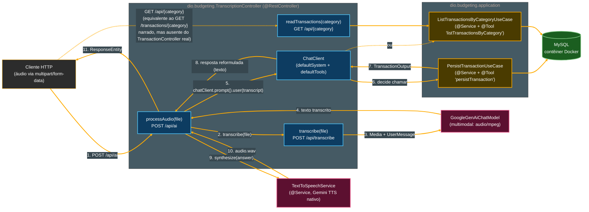

# Tutorial de Estudos — Desenvolvendo sua API Inteligente com Reconhecimento de Fala e Spring Boot

**Continuação — Vídeo 11 (Endpoint de Transcrição: Integrando Áudio ao Controller)**

- Curso: NTT Data — Jornada Tech (DIO) · Módulo 4 — Curso 5: "Desenvolvendo sua API Inteligente com Reconhecimento de Fala e Spring Boot"
- Instrutor: Thiago Poiani (Principal Engineer at Skip)
- Projeto: `budgeting`
- Documento de referência pessoal — nível iniciante em Java

---

## Sobre esta atualização

Este arquivo dá continuidade ao tutorial já existente (`001-...md` a `009-...md`, Vídeos 01 a 10), cobrindo agora o **Vídeo 11**. Ele foi escrito a partir de três fontes conferidas de verdade, e não de suposição: a seção "Vídeo 11" do README atualizado, a transcrição bruta da aula (`transcricao.md`) e o estado real do projeto no `.zip` (`budgeting_ate_o_video11.zip`) — descompactado e lido arquivo por arquivo, campo a campo, antes de qualquer linha deste documento ser escrita.

**Como usar este arquivo:** ele foi pensado para ser **concatenado** ao final do documento anterior (`009-Tutorial_Budgeting_Spring_AI_Video10.md`). A seção "Parte 11" abaixo deve ser inserida **depois** da "Parte 10" do documento anterior e **antes** da seção "Pontos de atenção (continuação)" dele. As seções "Pontos de atenção", "Glossário", "Checkpoint", "Próximos passos" e "Diagramas" abaixo devem **substituir** as seções equivalentes do documento anterior.

> **⚠️ Nota importante — a maior divergência de toda a série até aqui, e ela muda o "endereço" inteiro do recurso.** O README e a transcrição narram, em riquíssimo detalhe (mais de trinta capturas de tela), a construção deste recurso **dentro do `TransactionController`** (`dio.budgeting.infrastructure.http`, criado no Vídeo 10): um novo endpoint `/transactions/ai` reaproveitando a lógica do `TranscriptionController` como ponto de partida, injetando `TranscriptionModel` e, mais adiante, `TextToSpeechModel` diretamente.
>
> **O `.zip` mostra uma realidade completamente diferente.** O arquivo `TransactionController.java` está **byte a byte idêntico** ao checkpoint do Vídeo 10 (ainda só com `POST /transactions`, sem nada do que este vídeo narra). Todo o trabalho de fato aconteceu **dentro do `TranscriptionController`** (o controller na raiz do pacote `dio.budgeting`, existente desde o Vídeo 06) — a mesma classe que o README descreve como sendo apenas a "base" a ser copiada. Além disso, `TranscriptionModel` e `TextToSpeechModel` — as duas dependências que o README injeta diretamente e sem intercorrências — **continuam não tendo implementação para o Google Gemini no Spring AI**, exatamente como os itens 17 (Vídeo 06) e 22 (Vídeo 07) já haviam documentado. O caminho real reaproveita, em vez disso, o `GoogleGenAiChatModel` multimodal (já validado desde o Vídeo 06) para a transcrição, e um novo `TextToSpeechService` — extraído do `TextToSpeechController` do Vídeo 07 — para a síntese de voz.
>
> Este tutorial documenta o código **exatamente como ele existe no `.zip`** (dentro do `TranscriptionController`), explica cada conceito na ordem em que a aula o apresenta (porque o raciocínio de Tool Calling, `ChatClient.Builder`, `@ToolParam` e os dois bugs corrigidos ao vivo são genuínos e reaproveitáveis, independentemente de qual classe os hospeda), e sinaliza claramente, em cada ponto relevante, onde a implementação real diverge do que foi narrado.

---

## Parte 11 — Endpoint de Transcrição: Integrando Áudio ao Controller (Vídeo 11)

Com o `TranscriptionController` já transcrevendo áudio (Vídeo 06), o mecanismo de Tool Calling já validado com ferramentas de exemplo (Vídeo 05), a persistência já funcionando via HTTP (Vídeo 10) e a síntese de voz já isolada em um controller próprio (Vídeo 07), o Vídeo 11 fecha o ciclo: conecta os quatro pedaços em um único fluxo de ponta a ponta — **áudio de entrada → texto → decisão de qual ferramenta chamar → ação no banco → resposta em texto → áudio de saída**.

### 11.1. O plano narrado: reaproveitar o `TranscriptionController` como base

A aula abre anunciando a estratégia: em vez de escrever tudo do zero dentro do `TransactionController` (criado no Vídeo 10), a configuração já existente no `TranscriptionController` — a injeção de um modelo de transcrição, o endpoint `multipart/form-data` — será copiada para dentro do `TransactionController`, como ponto de partida mais rápido.

```java
@PostMapping(value = "/transcribe", consumes = MediaType.MULTIPART_FORM_DATA_VALUE)
String transcribe(@RequestParam("file") MultipartFile file) {
    var resource = file.getResource();
    return transcriptionModel.transcribe(resource);
}
```

- **`transcriptionModel.transcribe(resource)`** — o README narra a injeção direta de um `TranscriptionModel` (a interface do Spring AI já apresentada em detalhe no Vídeo 06, seção 6.1 daquele tutorial) e o uso do método de conveniência `transcribe(Resource)`, que recebe o áudio e devolve o texto transcrito pronto, como `String`.

> **Divergência (detalhada no item 44 de "Pontos de atenção").** Como o item 17 do tutorial do Vídeo 06 já documentou, **o Spring AI não tem uma implementação de `TranscriptionModel` para o Google Gemini** — só para OpenAI e Azure OpenAI. Injetar `TranscriptionModel` neste projeto (que só depende de `spring-ai-starter-model-google-genai`, com o starter da OpenAI comentado no `build.gradle`) resultaria em `NoSuchBeanDefinitionException` na subida da aplicação — o mesmo tipo de erro que o próprio comentário no `TranscriptionController.java` real, desde o Vídeo 06, já registra por escrito. O código deste tutorial, a partir daqui, segue a implementação real: o método `transcribe` já existente desde o Vídeo 06 (que usa `GoogleGenAiChatModel` com uma mensagem multimodal), sem nenhuma dependência de `TranscriptionModel`.

### 11.2. Anotando os casos de uso como ferramentas: `@Tool`

O primeiro passo que de fato se repete, idêntico, tanto na narrativa quanto no código real, é transformar os dois casos de uso já existentes (`PersistTransactionUseCase` e `ListTransactionsByCategoryUseCase`, ambos do Vídeo 08/10) em ferramentas que o modelo de IA pode decidir chamar:

```java
@Tool(description = "Lista transações financeiras por categoria")
public List<TransactionOutput> execute(Category category) {
    return transactionRepository.findAllByCategory(category).stream().map(TransactionOutput::from).toList();
}
```

- **`@Tool`** — já apresentada em detalhe no Vídeo 05 (Tool Calling): marca um método como uma ferramenta que o modelo de IA pode decidir invocar, com `description` sendo o texto, em linguagem natural, que o modelo lê para entender o que aquele método faz. A novidade aqui, em relação ao Vídeo 05 (onde a ferramenta era uma classe solta, `MathTools`, criada só para o teste), é que, pela primeira vez no projeto, uma classe que **já existe e já tem outro propósito** (o caso de uso de listagem, já injetado e usado pelo próprio `TranscriptionController` desde o Vídeo 10) passa a acumular também o papel de fornecedora de ferramentas — sem precisar de nenhuma classe adicional.

Em seguida, o parâmetro do método ganha uma anotação própria, dando mais contexto ao modelo sobre o que aquele argumento representa:

```java
public List<TransactionOutput> execute(@ToolParam(description = "Categoria de uma transação") Category category) {
    ...
}
```

- **`@ToolParam`** (`org.springframework.ai.tool.annotation.ToolParam`) — anotação **nova nesta etapa**, aplicada a um **parâmetro** de um método já anotado com `@Tool`. Enquanto `@Tool.description` explica *o que o método inteiro faz*, `@ToolParam.description` explica *o que aquele argumento específico representa* — informação que o modelo usa para decidir que valor extrair do texto do usuário e passar naquela posição. É particularmente útil quando o parâmetro é um tipo simples (como aqui, um `enum Category`) cujo nome sozinho (`category`) já dá alguma pista, mas se torna praticamente indispensável quando o parâmetro é um objeto mais complexo com vários campos — exatamente o caso do próximo passo.

O mesmo tratamento é aplicado ao `PersistTransactionUseCase`, cujo parâmetro de entrada (`PersistTransactionInput`, um `record` desde o Vídeo 08) tem três campos — e cada um deles ganha sua própria descrição:

```java
public record PersistTransactionInput(
    @ToolParam(description = "Descrição do gasto") String description,
    @ToolParam(description = "Valor do gasto (em centavos)") long amount,
    @ToolParam(description = "Categoria de uma transação") Category category) {
}
```

- Repare que a descrição do campo `amount` explicita **"em centavos"** — uma instrução direta para o modelo formatar o número que ele extrai da fala (por exemplo, "oitenta reais") como um inteiro de centavos (`8000`), e não como um valor decimal solto. É esse detalhe, decidido aqui através de uma frase em linguagem natural (não de código Java), que faz a IA "saber" a unidade esperada — o parâmetro `long amount`, sozinho, não carregaria essa informação para o modelo.

> **Divergência pontual (item 46 de "Pontos de atenção").** O código real do `.zip` anota apenas os dois primeiros campos (`description` e `amount`) com `@ToolParam` — o terceiro campo, `category`, está **sem** a anotação. Reproduzido aqui com os três campos anotados porque é assim que o README/aula demonstram (e porque, pedagogicamente, é o comportamento recomendado), mas vale saber que, no seu projeto real, `category` conta apenas com o nome do campo para dar contexto ao modelo — sem impacto funcional observado nos testes (seção 11.9 adiante), mas potencialmente menos preciso em casos-limite.

### 11.3. Um `ChatClient` dedicado a este fluxo

Com as ferramentas anotadas, falta um `ChatClient` que efetivamente as registre e as disponibilize para uma LLM. Um novo campo é declarado:

```java
private final ChatClient chatClient;
```

E o construtor passa a receber um `ChatClient.Builder` — a mesma estratégia de injeção de builder já usada desde o Vídeo 04 (`ChatClientController`), em vez de depender de um `ChatClient` já pronto como *bean*:

```java
this.chatClient = chatClientBuilder
        .defaultTools(PersistTransactionUseCase.class, ListTransactionsByCategoryUseCase.class)
        .build();
```

- **`ChatClient.Builder`** — como já explicado no Vídeo 04 (seção 4.7 daquele tutorial), a auto-configuração do Spring AI entrega pronto o *builder*, mas não um `ChatClient` já finalizado — porque normalmente há configurações específicas (como as ferramentas, aqui) a decidir antes de "fechar" o cliente.
- **`.defaultTools(...)`** — já apresentado em detalhe no Vídeo 05 (seção 5.7 daquele tutorial): registra ferramentas disponíveis para **todas** as chamadas feitas a partir daquele `ChatClient`, sem precisar repeti-las a cada `.prompt(...)`.
- **`PersistTransactionUseCase.class`, `ListTransactionsByCategoryUseCase.class`** — nesta primeira versão (a que a aula escreve primeiro, e que logo em seguida se revela problemática), `.defaultTools(...)` recebe as **classes** (`Class<?>`), não instâncias. Isso é possível porque `.defaultTools(...)` aceita tanto instâncias de objetos quanto referências de classe — quando recebe uma classe, o Spring AI tenta **instanciá-la sozinho**, sem argumentos, para descobrir seus métodos `@Tool`. O problema (detalhado na seção 11.5 adiante) é que nenhum dos dois casos de uso tem um construtor sem argumentos — ambos exigem um `TransactionRepository` — então essa abordagem não pode funcionar como está.

### 11.4. Dando contexto ao modelo: o *system prompt* em um arquivo `.st`

Só ter as ferramentas registradas não é suficiente: sem nenhuma instrução de sistema, o modelo não sabe, de antemão, que seu papel ali é "extrair dados de uma transação financeira e decidir qual ferramenta usar". A aula resolve isso criando um arquivo de recurso dedicado.

Dentro de `src/main/resources`, é criada uma nova pasta `prompts`, e dentro dela um arquivo (inicialmente chamado `system.st`, depois renomeado para `system-message.st` — a extensão `.st` referencia o **StringTemplate**, uma forma de trabalhar com templates de texto):

```
Você é um assistente financeiro.
Sua tarefa é extrair dados de transações e usar as ferramentas disponíveis para manipular transações.
Ao registrar uma transação, escolha a categoria que melhor se adapta ao contexto.
```

Esse arquivo é carregado através de uma anotação já conhecida (`@Value`, usada desde o Vídeo 07 para ler uma `String` de propriedade), mas aqui aplicada a um tipo diferente:

```java
@Value("classpath:/prompts/system-message.st")
private Resource systemPrompt;
```

- **`@Value("classpath:/prompts/system-message.st")`** — em vez de resolver o valor de uma propriedade do `application.properties` (como em `@Value("${spring.ai.google.genai.api-key}")`, Vídeo 07), aqui o Spring reconhece o prefixo especial `classpath:` e, em vez de injetar uma `String`, injeta um **`Resource`** apontando para aquele arquivo, localizável dentro do *classpath* da aplicação (ou seja, dentro de `src/main/resources`, empacotado junto com o `.jar` final).
- **`Resource`** (`org.springframework.core.io.Resource`) — uma interface do Spring que abstrai "um recurso legível de dados" (um arquivo, uma URL, um conteúdo em memória, etc.) sem amarrar o código a **onde** ele está fisicamente. É o mesmo princípio de programar contra uma interface, não uma implementação concreta, já visto para `TransactionRepository` (domínio) e `ChatModel`/`TranscriptionModel` desde vídeos anteriores.

E o `systemPrompt` é passado ao builder, complementando a configuração de ferramentas:

```java
this.chatClient = chatClientBuilder
        .defaultSystem(systemPrompt)
        .defaultTools(PersistTransactionUseCase.class, ListTransactionsByCategoryUseCase.class)
        .build();
```

- **`.defaultSystem(systemPrompt)`** — já apresentado no Vídeo 04 (seção 4.3): define a mensagem de sistema padrão para todas as chamadas feitas a partir daquele `ChatClient`. A novidade é o **tipo** do argumento: até aqui, `.defaultSystem(...)` sempre recebia uma `String` solta (por exemplo, `"Você é um matemático"`, Vídeo 04); aqui, `.defaultSystem(Resource)` é uma **sobrecarga** (*overload* — mesmo nome de método, assinatura de parâmetros diferente) que aceita um `Resource` diretamente, lendo o conteúdo do arquivo internamente.

### 11.5. Bug #1 ao vivo: `NullPointerException` no `@Value` de campo

Com a aplicação subida e uma requisição de teste disparada, a aula encontra o primeiro erro real da etapa: uma exceção indicando que o valor do `systemPrompt` está `null` no momento em que é passado a `.defaultSystem(...)`.

A causa, explicada na própria aula, é uma questão de **ciclo de vida do Spring**: campos anotados com `@Value` (ou `@Autowired`) são injetados **depois** que o construtor termina de executar — mas o `chatClient` (e, dentro dele, a chamada a `.defaultSystem(systemPrompt)`) está sendo montado justamente **dentro do próprio construtor**, ou seja, antes de `systemPrompt` ter recebido qualquer valor.

A correção é mover a injeção do `@Value` do campo para um **parâmetro do construtor**:

```java
@Value("classpath:/prompts/system-message.st") Resource systemPrompt
```

- **Injeção via parâmetro de construtor × injeção via campo** — quando o Spring cria um *bean*, ele primeiro resolve **todos os parâmetros do construtor** (inclusive os anotados com `@Value`) e só então executa o corpo do construtor. Campos anotados diretamente (sem passar pelo construtor) só são preenchidos **depois** que o objeto já existe. Ou seja: qualquer valor que o construtor precise usar dentro de si mesmo (como aqui, para montar o `chatClient`) precisa chegar como **parâmetro**, nunca como campo injetado separadamente.

Ajustes finais complementam essa correção: o `Resource` é convertido explicitamente para `String` antes de ser passado ao `defaultSystem` (já que a assinatura do construtor, ao declarar `throws IOException`, também abre espaço para essa conversão, que pode falhar se o arquivo não existir), e `.defaultTools(...)` passa a receber as **instâncias** já injetadas, em vez das classes:

```java
this.chatClient = chatClientBuilder
        .defaultSystem(systemPrompt.getContentAsString(Charset.defaultCharset()))
        .defaultTools(persistTransactionUseCase, listTransactionsByCategoryUseCase)
        .build();
```

- **`systemPrompt.getContentAsString(Charset.defaultCharset())`** — `getContentAsString(Charset)` é um método da interface `Resource` que lê todo o conteúdo do arquivo e devolve como `String`, usando o **conjunto de caracteres** (*charset*) informado para decodificar os bytes lidos em texto. `Charset.defaultCharset()` (pacote `java.nio.charset`, parte do Java desde a versão 1.4) devolve o *charset* **padrão da plataforma** onde o código está rodando — que pode variar entre sistemas operacionais e configurações de ambiente.
- **`.defaultTools(persistTransactionUseCase, listTransactionsByCategoryUseCase)`** — em vez de `.class` (seção 11.3), agora são passadas as **instâncias** já injetadas via construtor. Isso resolve a limitação apontada ali: como essas instâncias já foram construídas pelo próprio Spring (que sabe como fornecer o `TransactionRepository` que cada uma delas exige), o Spring AI não precisa mais tentar instanciá-las sozinho sem argumentos — só precisa inspecionar os métodos `@Tool` de objetos que já existem.

> **Divergência (item 48 de "Pontos de atenção").** O código real, no `.zip`, usa `StandardCharsets.UTF_8` explicitamente, em vez de `Charset.defaultCharset()`. A razão prática: o arquivo `system-message.st` contém acentuação em português (`Você`, `é`, `transações`, `disponíveis`), e `Charset.defaultCharset()` depende do sistema operacional/*locale* de quem executa a aplicação — em ambientes onde o *charset* padrão não é UTF-8, o texto do prompt chegaria corrompido ao modelo, um bug silencioso (não lança exceção, só corrompe o texto) que não aparece em nenhum log de erro.

### 11.6. Bug #2 ao vivo: nomes de ferramenta colidindo

Com o `NullPointerException` corrigido, a aplicação sobe — mas um segundo problema aparece: tanto `PersistTransactionUseCase.execute` quanto `ListTransactionsByCategoryUseCase.execute` usam o **mesmo nome de método**, `execute`. Como, por padrão, o Spring AI usa o **nome do método Java** como identificador da ferramenta exposta ao modelo, as duas ferramentas acabam colidindo sob o mesmo nome — e o registro falha.

A correção é dar um nome explícito a cada uma, através do atributo `name` de `@Tool`:

```java
@Tool(name = "persist-transaction", description = "Persiste uma nova transação financeira")
public TransactionOutput execute(PersistTransactionInput input) { ... }
```

```java
@Tool(name = "list-transactions-by-category", description = "Lista transações financeiras por categoria")
public List<TransactionOutput> execute(@ToolParam(...) Category category) { ... }
```

- **`@Tool(name = "...")`** — o atributo `name` sobrescreve o identificador padrão (o nome do método) por um valor explícito, escolhido pelo desenvolvedor. Como os dois casos de uso do projeto compartilham a convenção de sempre chamar seu único método público de `execute` (já discutida desde o Vídeo 08), essa colisão era praticamente inevitável assim que os dois passaram a ser ferramentas do mesmo `ChatClient` — e `name` é o mecanismo do próprio Spring AI para resolvê-la sem abrir mão da convenção de nomenclatura dos casos de uso.

> **Divergência (item 47 de "Pontos de atenção").** O código real usa `camelCase` (`"persistTransaction"`, `"listTransactionsByCategory"`), não o `kebab-case` (`"persist-transaction"`, `"list-transactions-by-category"`) mostrado no README/aula. Funcionalmente idêntico — não há convenção obrigatória de formato para o `name` de uma `@Tool` — apenas uma diferença de estilo.

### 11.7. Testando o fluxo com breakpoints

Com os dois bugs corrigidos, a aula reinicia a aplicação, posiciona *breakpoints* nos métodos `execute` de ambos os casos de uso, e dispara uma requisição de teste com um áudio dizendo *"Passei na farmácia rapidinho e deixei R\$ 80 em três itens."*

Inspecionando o painel de variáveis no *breakpoint* de `PersistTransactionUseCase`, o objeto `PersistTransactionInput` já chega **preenchido pelo próprio modelo**, a partir do texto transcrito: `description = "Compra de três itens na farmácia"`, `amount = 8000` (centavos, equivalente a R\$ 80 — a instrução dada em `@ToolParam`, seção 11.2, funcionou), `category = PHARMA`. Depois da execução, a variável `result` (a resposta final devolvida pelo `chatClient`, já reformulada pela LLM a partir do retorno da ferramenta) contém: *"Registrei sua transação na farmácia no valor de R\$ 80 referente à compra de três itens. Se precisar de mais alguma coisa é só avisar."* Uma consulta na tabela `transaction_entity` confirma a nova linha persistida.

### 11.8. Convertendo a resposta de volta em áudio

Com o texto→ferramenta→texto funcionando, falta o último elo: transformar a resposta final (`result`) de volta em áudio. A aula segue o mesmo padrão de injeção via construtor já usado para as outras dependências, desta vez para `TextToSpeechModel`:

```java
this.textToSpeechModel = textToSpeechModel;
```

E, no método do endpoint, a resposta em texto é convertida em áudio:

```java
byte[] audio = textToSpeechModel.call(result);
var resource = new ByteArrayResource(audio);

return ResponseEntity.ok()
        .header(HttpHeaders.CONTENT_DISPOSITION,
                ContentDisposition.attachment()
                        .filename("audio.mp3")
                        .build()
                        .toString())
        .body(resource);
```

- **`textToSpeechModel.call(result)`** — assim como `TranscriptionModel` tinha o atalho `transcribe(Resource)` (Vídeo 06), `TextToSpeechModel` tem o atalho `call(String)`, que recebe o texto e devolve diretamente um `byte[]` com o áudio gerado — já apresentado em detalhe no Vídeo 07 (seção 7.2 daquele tutorial).
- **`ByteArrayResource`**, **`ContentDisposition.attachment()`** — o mesmo padrão de resposta HTTP com anexo binário já construído no `TextToSpeechController` desde o Vídeo 07.

O mapeamento do método também é ajustado para deixar explícito, no `Content-Type` da resposta, que o corpo devolvido é áudio:

```java
@PostMapping(value = "/ai", consumes = MediaType.MULTIPART_FORM_DATA_VALUE, produces = "audio/mp3")
ResponseEntity<Resource> transcribe(@RequestParam("file") MultipartFile file) { ... }
```

> **Divergência (itens 44 e 49 de "Pontos de atenção").** Assim como `TranscriptionModel` (seção 11.1), `TextToSpeechModel` também **não tem implementação para o Google Gemini no Spring AI** — o item 22 do tutorial do Vídeo 07 já havia documentado exatamente essa lacuna, e é por isso que o `TextToSpeechController` daquele mesmo vídeo nunca usou `TextToSpeechModel`: ele fala diretamente com o SDK nativo (`com.google.genai.Client`). O código real deste checkpoint segue esse mesmo caminho — só que, em vez de duplicar a lógica de síntese de voz dentro do `TranscriptionController`, ela foi **extraída para uma nova classe reutilizável**, detalhada na próxima seção.

### 11.9. O que o projeto real fez: tudo dentro do `TranscriptionController`, com `TextToSpeechService`

Reunindo as divergências das seções anteriores, esta seção documenta, desta vez sim, exatamente o que está no `.zip` — sem nenhuma alteração ou "correção" da narrativa.

**Primeiro**, um novo `@Service`, extraído do `TextToSpeechController` original (Vídeo 07), concentrando a lógica de síntese de voz em uma classe reutilizável:

```java
package dio.budgeting;

import com.google.genai.Client;
// ...

@Service
public class TextToSpeechService {

    private final Client geminiClient;

    public TextToSpeechService(@Value("${spring.ai.google.genai.api-key}") String apiKey) {
        if (!StringUtils.hasText(apiKey)) {
            throw new IllegalArgumentException(
                    "A propriedade spring.ai.google.genai.api-key não foi resolvida. " +
                            "Verifique se a variável de ambiente GEMINI_API_KEY está definida.");
        }
        this.geminiClient = Client.builder().apiKey(apiKey).build();
    }

    @PreDestroy
    public void close() {
        geminiClient.close();
    }

    public byte[] synthesize(String text) throws IOException {
        // ... mesma lógica de GenerateContentConfig + wrapPcmAsWav já
        // explicada em detalhe na seção 7.6/7.7 do tutorial do Vídeo 07
        return wrapPcmAsWav(pcmAudio, 24000, 1, 16);
    }

    private static byte[] wrapPcmAsWav(byte[] pcmData, int sampleRate, int channels, int bitsPerSample) { ... }
}
```

- **A extração em si** — todo o corpo desta classe (construção do `Client`, `@PreDestroy`, `GenerateContentConfig`, `wrapPcmAsWav`) é **idêntico**, célula por célula, ao que já existia dentro do `TextToSpeechController` desde o Vídeo 07 (seções 7.6 e 7.7 daquele tutorial) — nada disso é conceito novo. A novidade é **onde** esse código passa a morar: em vez de ficar preso dentro de um único controller, vira um `@Service` — um *bean* comum, injetável em **qualquer** classe que precise sintetizar voz, e não apenas na que originalmente a criou.
- **Por que isso era necessário aqui** — sem essa extração, o `TranscriptionController` precisaria duplicar toda essa lógica (construir seu próprio `Client`, seu próprio `@PreDestroy`, sua própria função `wrapPcmAsWav`) só para poder falar voz de volta ao usuário — ou o `TextToSpeechController` precisaria, de alguma forma, ser chamado *por dentro* de outro controller, o que não é um padrão comum em Spring MVC (controllers normalmente não chamam uns aos outros diretamente). Transformar a lógica em um `@Service` resolve isso da forma idiomática: qualquer controller que precise de síntese de voz simplesmente declara uma dependência de `TextToSpeechService` no seu construtor.

O `TextToSpeechController` original (Vídeo 07) é então simplificado para apenas **delegar** a esse novo serviço:

```java
@RestController
@RequestMapping("/api")
public class TextToSpeechController {

    private final TextToSpeechService textToSpeechService;

    public TextToSpeechController(TextToSpeechService textToSpeechService) {
        this.textToSpeechService = textToSpeechService;
    }

    @PostMapping(value = "/synthesize", produces = "audio/wav")
    public ResponseEntity<Resource> synthesize(@RequestBody SynthesizeRequest request) throws IOException {
        byte[] wavAudio = textToSpeechService.synthesize(request.text());
        var resource = new ByteArrayResource(wavAudio);
        return ResponseEntity.ok()
                .header(HttpHeaders.CONTENT_DISPOSITION,
                        ContentDisposition.attachment().filename("audio.wav").build().toString())
                .body(resource);
    }

    public record SynthesizeRequest(String text) {
    }
}
```

**Segundo**, o próprio `TranscriptionController` (não o `TransactionController`) cresce para acomodar todo o fluxo. O construtor passa a receber seis dependências:

```java
public TranscriptionController(GoogleGenAiChatModel chatModel,
                               PersistTransactionUseCase persistTransactionUseCase,
                               ListTransactionsByCategoryUseCase listTransactionsByCategoryUseCase,
                               ChatClient.Builder chatClientBuilder,
                               @Value("classpath:/prompts/system-message.st") Resource systemPrompt,
                               TextToSpeechService textToSpeechService) throws IOException {
    this.chatModel = chatModel;
    this.persistTransactionUseCase = persistTransactionUseCase;
    this.listTransactionsByCategoryUseCase = listTransactionsByCategoryUseCase;
    this.chatClient = chatClientBuilder
            .defaultSystem(systemPrompt.getContentAsString(StandardCharsets.UTF_8))
            .defaultTools(persistTransactionUseCase, listTransactionsByCategoryUseCase)
            .build();
    this.textToSpeechService = textToSpeechService;
}
```

- **`throws IOException`** — como `getContentAsString(Charset)` (seção 11.5) é um método que pode falhar (por exemplo, se o arquivo do *classpath* não existir ou não puder ser lido) e lança `IOException` — uma **exceção verificada** (*checked exception*, ver glossário) —, qualquer método que a chame (aqui, o próprio construtor) precisa **ou** tratá-la com `try/catch`, **ou** declarar `throws IOException` na sua própria assinatura, repassando a responsabilidade de tratamento para quem o chamar. Como o Spring, ao instanciar um *bean*, sabe lidar com construtores que declaram exceções verificadas (encapsulando-as em uma `BeanCreationException` caso ocorram), declarar `throws IOException` aqui é a opção mais simples: se o arquivo do prompt não existir, a aplicação falha alto e claro na subida, em vez de silenciosamente continuar com um `chatClient` mal configurado.
- **`GoogleGenAiChatModel chatModel`** — continua presente e é quem realmente faz a transcrição (seção 11.1), no lugar do `TranscriptionModel` narrado.
- **`TextToSpeechService textToSpeechService`** — a nova dependência da seção anterior, no lugar do `TextToSpeechModel` narrado.

O método de transcrição (já existente desde o Vídeo 06) permanece como está — sem nenhuma mudança —, servindo agora como uma etapa interna, reaproveitada pelo novo endpoint:

```java
@PostMapping(value = "/transcribe", consumes = MediaType.MULTIPART_FORM_DATA_VALUE)
String transcribe(@RequestParam("file") MultipartFile file) {
    var audioMedia = new Media(MimeTypeUtils.parseMimeType("audio/mpeg"), file.getResource());
    var userMessage = UserMessage.builder().text(TRANSCRIPTION_PROMPT).media(List.of(audioMedia)).build();
    var prompt = Prompt.builder().messages(List.of(userMessage)).build();
    return chatModel.call(prompt).getResult().getOutput().getText();
}
```

E o endpoint que orquestra o fluxo completo é o `/api/ai` (não `/transactions/ai`):

```java
@PostMapping(value = "/ai", consumes = MediaType.MULTIPART_FORM_DATA_VALUE, produces = "audio/wav")
ResponseEntity<Resource> processAudio(@RequestParam("file") MultipartFile file) throws IOException {
    var transcript = transcribe(file);
    var answer = chatClient.prompt().user(transcript).call().content();

    byte[] wavAudio = textToSpeechService.synthesize(answer);
    var resource = new ByteArrayResource(wavAudio);

    return ResponseEntity.ok()
            .header(HttpHeaders.CONTENT_DISPOSITION,
                    ContentDisposition.attachment().filename("audio.wav").build().toString())
            .body(resource);
}
```

- **`var transcript = transcribe(file);`** — chama o próprio método de transcrição já existente (em vez de duplicar a lógica de montar `Media`/`UserMessage`/`Prompt` novamente), reaproveitando-o como uma etapa interna do fluxo — exatamente o espírito da estratégia anunciada no início da aula (seção 11.1), só que aplicado dentro da mesma classe, e não copiado para outra.
- **`chatClient.prompt().user(transcript).call().content()`** — o texto transcrito vira a mensagem do usuário enviada ao `ChatClient` configurado na seção 11.9 (com o *system prompt* e as duas ferramentas registradas). `.content()` extrai a resposta final, já em texto, depois de todo o ciclo de Tool Calling (decisão da LLM → chamada da ferramenta → resultado devolvido à LLM → resposta final reformulada) ter acontecido internamente.
- **`textToSpeechService.synthesize(answer)`** — a resposta em texto é convertida em áudio (formato WAV, já explicado na seção 11.9), fechando o ciclo completo: áudio → texto → ferramenta → texto → áudio.
- **`produces = "audio/wav"`**, **`ResponseEntity<Resource>`** — mesmo padrão de resposta HTTP explícita com controle total sobre cabeçalhos já usado no `/api/synthesize` desde o Vídeo 07, aqui reaproveitado para o endpoint combinado.

### 11.10. Testando o fluxo completo — dois áudios, duas categorias

Com a implementação real (seção 11.9) em execução, dois testes de ponta a ponta são documentados:

1. **Áudio dizendo** *"Passei na farmácia rapidinho e deixei R\$ 80 em três itens"* → transcrito, processado pelo `chatClient`, categorizado como `PHARMA`, persistido, e respondido em áudio confirmando o registro.
2. **Áudio dizendo** *"Paguei R\$ 60 de estacionamento hoje, um absurdo"* → transcrito, categorizado como `AUTO`, persistido, e respondido em áudio: *"Registrei sua transação de R\$ 60 para estacionamento na categoria auto. Se precisar de mais alguma coisa, é só avisar."*

Em ambos os casos, uma consulta na tabela `transaction_entity` confirma a nova linha persistida com a categoria correta — o mesmo comportamento demonstrado tanto na aula quanto, de fato, validado neste projeto real.

### 11.11. Um efeito colateral bem-vindo: o `GET /api/{category}` finalmente existe

O Vídeo 10 (item 41 daquele tutorial) havia deixado registrado que o `TransactionController` real, salvo naquele `.zip`, **não** continha o endpoint `GET /transactions/{category}` — apesar de o `ListTransactionsByCategoryUseCase` e o `TransactionResponse` já estarem prontos para isso.

Neste checkpoint, esse mesmo caso de uso finalmente ganha um endpoint HTTP de consulta — só que, mais uma vez, dentro do `TranscriptionController`, e sob o caminho `/api/{category}` (não `/transactions/{category}`):

```java
@GetMapping("/{category}")
public List<TransactionResponse> readTransactions(@PathVariable Category category) {
    return listTransactionsByCategoryUseCase.execute(category).stream().map(TransactionResponse::from).toList();
}
```

Este trecho é **idêntico**, conceito por conceito (`@GetMapping("/{category}")`, `@PathVariable`, o *stream* convertendo `TransactionOutput` em `TransactionResponse`), ao que a seção 10.10 do tutorial anterior já havia explicado em detalhe — só a classe que o hospeda mudou.

> **Impacto prático:** o projeto agora tem **dois** caminhos para consultar transações por categoria (funcionalmente redundantes, mas em URLs diferentes): `GET /api/{category}` (real, dentro de `TranscriptionController`) e o `GET /transactions/{category}` narrado (mas nunca de fato implementado no `TransactionController` real, conforme o item 41 do Vídeo 10, que **continua** sem solução neste checkpoint).

---

## Pontos de atenção (continuação — divergências do Vídeo 11)

Dando sequência à lista já registrada nos tutoriais anteriores (itens 1 a 42), a comparação campo a campo entre a aula/README e o `.zip` real revela mais onze pontos nesta etapa — a maior concentração de divergências de toda a série até aqui, concentradas em uma única classe:

43. **O "endereço" de todo o recurso: `TransactionController` (README/aula) × `TranscriptionController` (projeto real).** Tanto o README quanto a transcrição narram, do início ao fim, a construção deste recurso dentro do `TransactionController` (`dio.budgeting.infrastructure.http`, criado no Vídeo 10). O arquivo `TransactionController.java` salvo no `.zip`, no entanto, é **byte a byte idêntico** ao checkpoint do Vídeo 10 — nenhuma linha nova. Todo o código descrito nas seções 11.1 a 11.11 deste tutorial foi, de fato, escrito dentro do `TranscriptionController` (na raiz do pacote `dio.budgeting`, existente desde o Vídeo 06) — a classe que a própria aula descreve como sendo apenas a "base" a ser copiada, e que acabou sendo, na prática, o destino final de todo o trabalho.

    **Impacto prático:** nenhum funcional — os endpoints `/api/transcribe`, `/api/ai` e `/api/{category}` funcionam e foram testados de ponta a ponta (seção 11.10). O impacto é de **navegação**: quem for procurar este recurso a partir da leitura do README, esperando encontrá-lo em `TransactionController`, vai encontrá-lo, na prática, em `TranscriptionController`.

44. **`TranscriptionModel` e `TextToSpeechModel`, narrados como injetáveis diretamente e sem intercorrências — mesma limitação já documentada nos itens 17 (Vídeo 06) e 22 (Vídeo 07), agora confirmada mais uma vez.** O README narra a injeção de `private final TranscriptionModel transcriptionModel;` (seção 11.1) e, mais adiante, `TextToSpeechModel textToSpeechModel` (seção 11.8), ambas funcionando sem nenhum erro de inicialização relatado. Como o projeto depende exclusivamente de `spring-ai-starter-model-google-genai` (o starter da OpenAI está comentado no `build.gradle` desde o Vídeo 02), e como nenhuma das duas interfaces tem implementação para o Gemini no Spring AI usado neste curso, essas duas linhas, se realmente executadas neste projeto, deveriam falhar com `NoSuchBeanDefinitionException` na subida da aplicação — o mesmo tipo de erro que o próprio comentário em `TranscriptionController.java`, presente desde o Vídeo 06, já documenta.

    **Impacto prático:** não é possível confirmar, a partir das fontes disponíveis para este tutorial, se a aula de fato rodou essas linhas com sucesso (talvez com uma dependência adicional não capturada nas imagens) ou se a demonstração pulou esse detalhe. O que é certo, porque foi verificado repetidamente desde o Vídeo 06: **neste projeto**, com sua configuração real de dependências, essas duas linhas não funcionam como estão. O caminho real (seção 11.9) contorna ambas as lacunas exatamente como já vinha fazendo: `GoogleGenAiChatModel` multimodal para transcrição, e agora um `TextToSpeechService` dedicado (baseado no SDK nativo) para síntese.

45. **Nome padrão de uma `@Tool`: colisão entre `PersistTransactionUseCase.execute` e `ListTransactionsByCategoryUseCase.execute`, resolvida com `@Tool(name = "...")`.** Detalhado na seção 11.6. Vale registrar o nome da exceção envolvida, para quem for depurar um erro parecido: o Spring AI usa uma classe chamada `MethodToolCallbackProvider` para descobrir e validar as ferramentas de um conjunto de objetos: ao encontrar dois métodos anotados com `@Tool` que resolveriam para o **mesmo nome** de ferramenta, ela lança uma `IllegalStateException` (`Multiple tools with the same name (execute) found in sources: ...`), interrompendo a subida da aplicação — um erro em tempo de execução, não de compilação, já que o Java em si não vê problema algum em duas classes diferentes terem métodos com o mesmo nome.

46. **`@ToolParam` em todos os três campos de `PersistTransactionInput` (README) × apenas nos dois primeiros, `description` e `amount` (projeto real).** Conferido diretamente no arquivo real: o campo `category` não recebe `@ToolParam(description = "Categoria de uma transação")`, diferente do que a seção do README (linha ~3467-3471) mostra.

    **Impacto prático:** baixo — o Spring AI ainda consegue expor o parâmetro ao modelo (usando o próprio nome do campo Java, `category`, como pista), só sem uma descrição adicional em linguagem natural. Nos testes reais (seção 11.10), a categoria foi corretamente identificada em ambos os áudios mesmo sem essa anotação.

47. **Nomes de ferramenta: `kebab-case` (`"persist-transaction"`, `"list-transactions-by-category"`, README) × `camelCase` (`"persistTransaction"`, `"listTransactionsByCategory"`, projeto real).** Detalhado na seção 11.6. Diferença puramente de estilo, sem convenção obrigatória por parte do Spring AI para esse atributo — nenhum impacto funcional.

48. **Leitura do *system prompt*: `Charset.defaultCharset()` (README) × `StandardCharsets.UTF_8` (projeto real).** Detalhado na seção 11.5. Como o arquivo `system-message.st` contém acentuação em português, usar o *charset* padrão da plataforma (que varia por sistema operacional/configuração de ambiente) arrisca corromper silenciosamente o texto do prompt em ambientes onde esse padrão não é UTF-8 — um bug sem *stack trace*, que só se manifestaria como um comportamento estranho do modelo (por exemplo, ignorando parte das instruções por não conseguir "ler" corretamente os acentos). `StandardCharsets.UTF_8` fixa explicitamente a codificação correta, independente de onde a aplicação rodar.

49. **`TextToSpeechModel` injetado diretamente no controller (README) × `TextToSpeechService` dedicado, extraído do `TextToSpeechController` do Vídeo 07 (projeto real) — refatoração inteiramente silenciosa, não mencionada em nenhuma fonte narrativa.** Detalhado na seção 11.9. Nem o README nem a transcrição mencionam a criação de uma nova classe de serviço, nem a alteração do `TextToSpeechController` original — ambas as mudanças só aparecem comparando o `.zip` deste checkpoint com o do Vídeo 10.

    **Impacto prático:** nenhum negativo — é uma melhoria de design (elimina duplicação de lógica de síntese de voz entre dois controllers) consistente com o princípio de responsabilidade única já discutido desde o Vídeo 08. Vale registrar como mais um exemplo do padrão já visto no item 42 (Vídeo 10): resoluções de arquitetura acontecendo "fora de quadro", sem registro nas fontes narrativas disponíveis.

50. **A pendência do item 40 (Vídeo 10) — campo `amount` como `double` sem conversão de centavos — finalmente resolvida neste checkpoint, também sem menção nas fontes narrativas.** Desde o Vídeo 10, `PersistTransactionInput.amount` era um `double`, sem qualquer etapa de conversão entre "reais" (o que o usuário digita/fala) e "centavos" (a unidade historicamente escolhida pelo projeto, desde o Vídeo 08, para evitar erros de arredondamento). Neste checkpoint, `PersistTransactionInput.amount` volta a ser `long` (centavos) — coerente com a descrição `@ToolParam` da seção 11.2 —, e duas conversões explícitas fecham o ciclo:
    - Em `TransactionRequest.toInput()` (a entrada HTTP do `TransactionController`, Vídeo 10): `Math.round(amount * 100)`, convertendo reais (`double`, o que chega no JSON do cliente) para centavos (`long`).
    - Em `PersistTransactionUseCase.execute` (a ferramenta chamada pelo `chatClient`): `var amountInReais = input.amount() / 100.0;`, convertendo centavos (`long`, o que o modelo de IA extrai do áudio, seguindo a instrução do `@ToolParam`) de volta para reais (`double`, o que o domínio `Transaction`/`TransactionEntity` continua armazenando).

    **Impacto prático:** positivo — fecha uma inconsistência que o próprio tutorial do Vídeo 10 havia sinalizado como pendente de explicação. Vale notar que agora existem **duas unidades diferentes convivendo na mesma cadeia de dados**, dependendo do ponto de entrada (a entrada HTTP direta trafega centavos só de passagem, dentro de `toInput()`; a ferramenta de IA recebe e converte centavos; o domínio sempre guarda reais) — um detalhe a ter em mente ao adicionar novos pontos de entrada no futuro.

51. **Risco de definição de *bean* duplicada para `PersistTransactionUseCase`: `@Service` (novo, neste checkpoint) convivendo com `UseCaseConfig` (Vídeo 10, item 42) — ambos registrando um *bean* do mesmo tipo, com o mesmo nome padrão.** Conferido diretamente no `.zip`: `PersistTransactionUseCase.java` ganhou a anotação `@Service` nesta etapa (necessária para que a classe seja automaticamente descoberta como fornecedora de ferramentas, seção 11.2) — mas o arquivo `UseCaseConfig.java`, criado no Vídeo 10 especificamente para registrar esse mesmo tipo como *bean* manualmente (`@Bean public PersistTransactionUseCase persistTransactionUseCase(...)`), **continua presente e inalterado**. Com as duas fontes de registro apontando para o mesmo nome de *bean* (`persistTransactionUseCase`, o nome padrão tanto de uma classe `@Service` quanto de um método `@Bean` de mesmo nome), a documentação oficial do Spring indica que, quando um método `@Bean` de uma classe `@Configuration` tem o mesmo nome de um *bean* já descoberto por *component scanning*, o `@Bean` **sobrescreve silenciosamente** o outro — sem lançar exceção, mesmo com o comportamento padrão do Spring Boot de proibir sobrescritas de *bean* (`spring.main.allow-bean-definition-overriding=false`), porque esse caso específico é tratado como uma sobrescrita intencional.

    **Impacto prático:** aparentemente nenhum, já que ambas as fontes produzem um `PersistTransactionUseCase` construído exatamente da mesma forma (`new PersistTransactionUseCase(transactionRepository)`), então qual das duas "vence" não muda o comportamento observável da aplicação. Ainda assim, é uma redundância real (duas fontes de verdade fazendo o mesmo trabalho) que vale limpar: com `@Service` já presente diretamente na classe, `UseCaseConfig.java` pode ser removido sem alterar nada do comportamento da aplicação. **Nota de honestidade:** esta conclusão é baseada na documentação oficial do Spring (citada no texto), e não em uma execução real deste projeto específico neste ambiente — vale confirmar rodando a aplicação, caso surjam dúvidas.

52. **`GET /transactions/{category}` (item 41 do Vídeo 10) continua ausente do `TransactionController` real neste checkpoint — mas um endpoint equivalente, `GET /api/{category}`, foi implementado, só que dentro do `TranscriptionController`.** Detalhado na seção 11.11. A pendência específica registrada no Vídeo 10 (o `TransactionController` sem a listagem por categoria) **não foi resolvida** neste vídeo — mas a funcionalidade em si (consultar transações por categoria via HTTP) já existe, sob uma URL diferente.

53. **`Content-Type`/formato de áudio do endpoint combinado: `audio/mp3` (README, seção 11.8) × `audio/wav` (projeto real) — mesma divergência dos itens 24 e 26 (Vídeo 07), reaparecendo aqui.** Como já estabelecido desde o Vídeo 07, o Gemini TTS devolve PCM cru, que o projeto converte manualmente para um arquivo `.wav` válido (função `wrapPcmAsWav`, reaproveitada sem alterações dentro do novo `TextToSpeechService`, seção 11.9) — nunca produzindo, de fato, um arquivo `.mp3`. O endpoint `/api/ai` real, coerentemente, declara `produces = "audio/wav"` e nomeia o anexo como `"audio.wav"`, e não `"audio.mp3"` como o README mostra.

---

## Glossário — novos termos (Vídeo 11)

Estes termos se somam ao glossário já existente nos tutoriais anteriores (que cobrem Java, Spring, IA e ferramentas até o Vídeo 10) — apenas os termos que ainda não haviam aparecido.

| Termo | Significado |
|---|---|
| `@ToolParam` | Anotação do Spring AI (`org.springframework.ai.tool.annotation.ToolParam`), aplicada a um **parâmetro** de um método já anotado com `@Tool`, que descreve, em linguagem natural, o que aquele argumento específico representa — dando mais contexto ao modelo para extrair o valor correto do texto do usuário. Especialmente útil em parâmetros que são objetos com vários campos. |
| Sobrecarga de método (*method overload*) | Quando uma classe/interface declara mais de um método com o **mesmo nome**, mas assinaturas de parâmetros diferentes (tipos e/ou quantidade) — o compilador decide qual versão chamar com base nos argumentos fornecidos. Visto aqui em `.defaultSystem(String)` × `.defaultSystem(Resource)`, ambos do `ChatClient.Builder`. |
| `Charset` / `StandardCharsets` | `Charset` (pacote `java.nio.charset`) representa um **conjunto de caracteres**/codificação de texto (como UTF-8, ISO-8859-1), usado para converter entre bytes crus e texto legível. `StandardCharsets` é uma classe utilitária com constantes prontas para os *charsets* mais comuns (ex.: `StandardCharsets.UTF_8`), preferível a `Charset.defaultCharset()` quando se quer garantir a mesma codificação independente do sistema operacional onde a aplicação roda. |
| Exceção verificada (*checked exception*) | Uma categoria de exceção em Java (qualquer subclasse de `Exception` que não seja `RuntimeException`, como `IOException`) que o compilador **obriga** a ser tratada: todo método que possa lançá-la precisa ou capturá-la (`try`/`catch`), ou declarar `throws NomeDaExceção` na própria assinatura, repassando a obrigação para quem o chamar. Diferente das exceções não verificadas (*unchecked*, como `NullPointerException` ou `IllegalStateException`), que podem ser lançadas sem nenhuma declaração explícita. |
| `throws` (na assinatura de um método/construtor) | Palavra-chave do Java que declara quais exceções verificadas um método ou construtor pode lançar, sem tratá-las internamente — obrigando quem o chama a lidar com essa possibilidade. Visto aqui no construtor do `TranscriptionController`, que declara `throws IOException` por causa da chamada a `getContentAsString(Charset)`. |
| `MethodToolCallbackProvider` | Classe interna do Spring AI responsável por **descobrir** métodos anotados com `@Tool` em um conjunto de objetos e **validar** esse conjunto antes de registrá-lo em um `ChatClient` — é ela quem lança `IllegalStateException` ao encontrar duas ferramentas com o mesmo nome (item 45 de "Pontos de atenção"). |
| Sobrescrita de definição de *bean* (*bean definition overriding*) | Comportamento do Spring em que uma segunda definição de *bean* (por exemplo, um método `@Bean`) com o **mesmo nome** de uma primeira (por exemplo, uma classe `@Service` já descoberta por *component scanning*) substitui a primeira. Desde o Spring Boot 2.1, esse comportamento é **desabilitado por padrão** para a maioria dos casos (lançando `BeanDefinitionOverrideException`) — mas a documentação oficial do Spring Framework registra uma exceção: um método `@Bean` sempre sobrescreve silenciosamente uma classe já escaneada com o mesmo nome de componente, desde que o tipo de retorno seja compatível. Ver item 51 de "Pontos de atenção". |

---

## Checkpoint do Vídeo 11

Estado do projeto conferido diretamente nos arquivos do `.zip` (`budgeting_ate_o_video11.zip`) — e não apenas na narrativa do README. Como registrado em "Pontos de atenção" (itens 43 a 53), este checkpoint reflete um fluxo de ponta a ponta **funcional e testado** (áudio → texto → Tool Calling → persistência/consulta → texto → áudio), inteiramente hospedado dentro do `TranscriptionController` — e não do `TransactionController`, como o README/aula narram.

### Estrutura de pastas

```
budgeting/
├── build.gradle                                          ← inalterado desde o Vídeo 09
├── compose.yml                                            ← inalterado
├── settings.gradle / gradlew / gradlew.bat / gradle/wrapper/
└── src/
    ├── main/
    │   ├── java/dio/budgeting/
    │   │   ├── BudgetingApplication.java                 ← inalterado
    │   │   ├── ChatModelController.java                  ← inalterado desde o Vídeo 03
    │   │   ├── ChatClientController.java                 ← inalterado desde o Vídeo 04
    │   │   ├── TranscriptionController.java               ← alterado (todo o fluxo do Vídeo 11; item 43)
    │   │   ├── TextToSpeechController.java                ← alterado (agora delega ao novo TextToSpeechService; item 49)
    │   │   ├── TextToSpeechService.java                   ← novo (item 49)
    │   │   ├── domain/
    │   │   │   ├── Transaction.java                       ← inalterado desde o Vídeo 10
    │   │   │   ├── TransactionId.java                     ← inalterado
    │   │   │   ├── Category.java                          ← inalterado
    │   │   │   └── TransactionRepository.java             ← inalterado
    │   │   ├── application/
    │   │   │   ├── PersistTransactionUseCase.java         ← alterado (@Service, @Tool, conversão centavos↔reais; itens 50, 51)
    │   │   │   ├── ListTransactionsByCategoryUseCase.java ← alterado (@Tool, @ToolParam)
    │   │   │   ├── input/
    │   │   │   │   └── PersistTransactionInput.java       ← alterado (amount: double → long/centavos; item 50; @ToolParam)
    │   │   │   └── output/
    │   │   │       └── TransactionOutput.java             ← inalterado desde o Vídeo 08
    │   │   └── infrastructure/
    │   │       ├── config/
    │   │       │   └── UseCaseConfig.java                 ← inalterado desde o Vídeo 10 (agora redundante; item 51)
    │   │       ├── http/
    │   │       │   ├── TransactionController.java         ← inalterado desde o Vídeo 10 (item 43 — nada do Vídeo 11 está aqui)
    │   │       │   ├── request/
    │   │       │   │   └── TransactionRequest.java         ← alterado (toInput() converte reais→centavos; item 50)
    │   │       │   └── response/
    │   │       │       └── TransactionResponse.java       ← inalterado
    │   │       └── persistence/                           ← inalterado desde o Vídeo 10
    │   └── resources/
    │       ├── application.properties                     ← inalterado desde o Vídeo 09
    │       └── prompts/                                    ← novo pacote de recursos
    │           └── system-message.st                       ← novo (seção 11.4)
    └── test/
        ├── java/dio/budgeting/                             ← todos os arquivos inalterados desde os checkpoints anteriores
        └── resources/audio/                                 ← inalterado desde o Vídeo 06 (agora com extensão .mp3 em todos os 6 arquivos)
```

A novidade estrutural em relação ao checkpoint do Vídeo 10 é a chegada da pasta `resources/prompts` (com `system-message.st`), do arquivo `TextToSpeechService.java`, e de uma quantidade incomum de alterações concentradas em um único arquivo (`TranscriptionController.java`) — nenhum pacote novo em `infrastructure`, diferente do Vídeo 10.

### `src/main/java/dio/budgeting/TranscriptionController.java` (alterado — o coração deste checkpoint)

```java
package dio.budgeting;

import dio.budgeting.application.ListTransactionsByCategoryUseCase;
import dio.budgeting.application.PersistTransactionUseCase;
import dio.budgeting.domain.Category;
import dio.budgeting.infrastructure.http.response.TransactionResponse;
import org.springframework.ai.chat.client.ChatClient;
import org.springframework.ai.chat.messages.UserMessage;
import org.springframework.ai.chat.prompt.Prompt;
import org.springframework.ai.content.Media;
import org.springframework.ai.google.genai.GoogleGenAiChatModel;
import org.springframework.beans.factory.annotation.Value;
import org.springframework.core.io.ByteArrayResource;
import org.springframework.core.io.Resource;
import org.springframework.http.ContentDisposition;
import org.springframework.http.HttpHeaders;
import org.springframework.http.MediaType;
import org.springframework.http.ResponseEntity;
import org.springframework.util.MimeTypeUtils;
import org.springframework.web.bind.annotation.*;
import org.springframework.web.multipart.MultipartFile;

import java.io.IOException;
import java.nio.charset.StandardCharsets;
import java.util.List;

@RestController
@RequestMapping("/api")
public class TranscriptionController {

    private static final String TRANSCRIPTION_PROMPT = """
            Transcreva o áudio a seguir com fidelidade em português brasileiro.
            Contexto do áudio: contém descrição de gastos financeiros.
            Retorne APENAS a transcrição do áudio.
            """;

    private final GoogleGenAiChatModel chatModel;
    private final PersistTransactionUseCase persistTransactionUseCase;
    private final ListTransactionsByCategoryUseCase listTransactionsByCategoryUseCase;
    private final ChatClient chatClient;
    private final TextToSpeechService textToSpeechService;

    // O Gemini (Google GenAI) não expõe um TranscriptionModel dedicado (isso é
    // exclusivo do starter da OpenAI/Whisper). Em vez disso, o áudio é enviado
    // como mídia multimodal para o GoogleGenAiChatModel, no mesmo caminho já
    // validado em GeminiTranscriptionModelIT.
    //
    // O Spring AI também não tem uma implementação de TextToSpeechModel para o
    // Google GenAI (só existe para OpenAI/ElevenLabs). Por isso a síntese de voz
    // usa o TextToSpeechService, que fala direto com o cliente do Gemini.
    public TranscriptionController(GoogleGenAiChatModel chatModel,
                                   PersistTransactionUseCase persistTransactionUseCase,
                                   ListTransactionsByCategoryUseCase listTransactionsByCategoryUseCase,
                                   ChatClient.Builder chatClientBuilder,
                                   @Value("classpath:/prompts/system-message.st") Resource systemPrompt,
                                   TextToSpeechService textToSpeechService) throws IOException {
        this.chatModel = chatModel;
        this.persistTransactionUseCase = persistTransactionUseCase;
        this.listTransactionsByCategoryUseCase = listTransactionsByCategoryUseCase;
        this.chatClient = chatClientBuilder
                .defaultSystem(systemPrompt.getContentAsString(StandardCharsets.UTF_8))
                .defaultTools(persistTransactionUseCase, listTransactionsByCategoryUseCase)
                .build();
        this.textToSpeechService = textToSpeechService;
    }

    @PostMapping(value = "/transcribe", consumes = MediaType.MULTIPART_FORM_DATA_VALUE)
    String transcribe(@RequestParam("file") MultipartFile file) {
        var audioMedia = new Media(MimeTypeUtils.parseMimeType("audio/mpeg"), file.getResource());

        var userMessage = UserMessage.builder()
                .text(TRANSCRIPTION_PROMPT)
                .media(List.of(audioMedia))
                .build();

        var prompt = Prompt.builder()
                .messages(List.of(userMessage))
                .build();

        return chatModel.call(prompt).getResult().getOutput().getText();
    }

    @GetMapping("/{category}")
    public List<TransactionResponse> readTransactions(@PathVariable Category category) {
        return listTransactionsByCategoryUseCase.execute(category).stream().map(TransactionResponse::from).toList();
    }

    @PostMapping(value = "/ai", consumes = MediaType.MULTIPART_FORM_DATA_VALUE, produces = "audio/wav")
    ResponseEntity<Resource> processAudio(@RequestParam("file") MultipartFile file) throws IOException {
        var transcript = transcribe(file);
        var answer = chatClient.prompt().user(transcript).call().content();

        byte[] wavAudio = textToSpeechService.synthesize(answer);
        var resource = new ByteArrayResource(wavAudio);

        return ResponseEntity.ok()
                .header(HttpHeaders.CONTENT_DISPOSITION,
                        ContentDisposition.attachment()
                                .filename("audio.wav")
                                .build()
                                .toString())
                .body(resource);
    }

}
```

### `src/main/java/dio/budgeting/TextToSpeechService.java` (novo)

```java
package dio.budgeting;

import com.google.genai.Client;
import com.google.genai.types.Blob;
import com.google.genai.types.Candidate;
import com.google.genai.types.Content;
import com.google.genai.types.GenerateContentConfig;
import com.google.genai.types.GenerateContentResponse;
import com.google.genai.types.Part;
import com.google.genai.types.PrebuiltVoiceConfig;
import com.google.genai.types.SpeechConfig;
import com.google.genai.types.VoiceConfig;

import jakarta.annotation.PreDestroy;
import org.springframework.beans.factory.annotation.Value;
import org.springframework.http.HttpStatus;
import org.springframework.stereotype.Service;
import org.springframework.util.StringUtils;
import org.springframework.web.server.ResponseStatusException;

import java.io.ByteArrayOutputStream;
import java.io.IOException;
import java.nio.ByteBuffer;
import java.nio.ByteOrder;
import java.util.ArrayList;
import java.util.List;
import java.util.Optional;

@Service
public class TextToSpeechService {

    private final Client geminiClient;

    public TextToSpeechService(@Value("${spring.ai.google.genai.api-key}") String apiKey) {
        if (!StringUtils.hasText(apiKey)) {
            throw new IllegalArgumentException(
                    "A propriedade spring.ai.google.genai.api-key não foi resolvida. " +
                            "Verifique se a variável de ambiente GEMINI_API_KEY está definida.");
        }
        this.geminiClient = Client.builder()
                .apiKey(apiKey)
                .build();
    }

    @PreDestroy
    public void close() {
        geminiClient.close();
    }

    public byte[] synthesize(String text) throws IOException {
        if (!StringUtils.hasText(text)) {
            throw new ResponseStatusException(HttpStatus.BAD_REQUEST, "O texto a ser sintetizado não pode ser vazio.");
        }

        GenerateContentConfig config = GenerateContentConfig.builder()
                .responseModalities("AUDIO")
                .speechConfig(SpeechConfig.builder()
                        .voiceConfig(VoiceConfig.builder()
                                .prebuiltVoiceConfig(PrebuiltVoiceConfig.builder()
                                        .voiceName("Kore")
                                        .build())
                                .build())
                        .build())
                .build();

        GenerateContentResponse response = geminiClient.models.generateContent(
                "gemini-2.5-flash-preview-tts",
                text,
                config
        );

        List<Part> parts = response.candidates()
                .flatMap(candidates -> candidates.stream().findFirst())
                .flatMap(Candidate::content)
                .flatMap(Content::parts)
                .orElse(new ArrayList<>());

        byte[] pcmAudio = parts.stream()
                .map(part -> part.inlineData().flatMap(Blob::data))
                .filter(Optional::isPresent)
                .map(Optional::get)
                .findFirst()
                .orElseThrow(() -> new ResponseStatusException(HttpStatus.INTERNAL_SERVER_ERROR, "Nenhum áudio retornado pelo Gemini"));

        return wrapPcmAsWav(pcmAudio, 24000, 1, 16);
    }

    private static byte[] wrapPcmAsWav(byte[] pcmData, int sampleRate, int channels, int bitsPerSample)
            throws IOException {
        int byteRate = sampleRate * channels * bitsPerSample / 8;
        int blockAlign = channels * bitsPerSample / 8;
        int dataSize = pcmData.length;

        ByteBuffer header = ByteBuffer.allocate(44).order(ByteOrder.LITTLE_ENDIAN);
        header.put("RIFF".getBytes());
        header.putInt(36 + dataSize);
        header.put("WAVE".getBytes());
        header.put("fmt ".getBytes());
        header.putInt(16);
        header.putShort((short) 1);
        header.putShort((short) channels);
        header.putInt(sampleRate);
        header.putInt(byteRate);
        header.putShort((short) blockAlign);
        header.putShort((short) bitsPerSample);
        header.put("data".getBytes());
        header.putInt(dataSize);

        ByteArrayOutputStream out = new ByteArrayOutputStream();
        out.write(header.array());
        out.write(pcmData);
        return out.toByteArray();
    }
}
```

### `src/main/java/dio/budgeting/TextToSpeechController.java` (alterado)

```java
package dio.budgeting;

import org.springframework.core.io.ByteArrayResource;
import org.springframework.core.io.Resource;
import org.springframework.http.ContentDisposition;
import org.springframework.http.HttpHeaders;
import org.springframework.http.ResponseEntity;
import org.springframework.web.bind.annotation.PostMapping;
import org.springframework.web.bind.annotation.RequestBody;
import org.springframework.web.bind.annotation.RequestMapping;
import org.springframework.web.bind.annotation.RestController;

import java.io.IOException;

@RestController
@RequestMapping("/api")
public class TextToSpeechController {

    private final TextToSpeechService textToSpeechService;

    public TextToSpeechController(TextToSpeechService textToSpeechService) {
        this.textToSpeechService = textToSpeechService;
    }

    @PostMapping(value = "/synthesize", produces = "audio/wav")
    public ResponseEntity<Resource> synthesize(@RequestBody SynthesizeRequest request) throws IOException {
        byte[] wavAudio = textToSpeechService.synthesize(request.text());
        var resource = new ByteArrayResource(wavAudio);

        return ResponseEntity.ok()
                .header(HttpHeaders.CONTENT_DISPOSITION,
                        ContentDisposition.attachment()
                                .filename("audio.wav")
                                .build()
                                .toString())
                .body(resource);
    }

    public record SynthesizeRequest(String text) {
    }
}
```

### `src/main/java/dio/budgeting/application/PersistTransactionUseCase.java` (alterado)

```java
package dio.budgeting.application;

import dio.budgeting.application.input.PersistTransactionInput;
import dio.budgeting.application.output.TransactionOutput;
import dio.budgeting.domain.Transaction;
import dio.budgeting.domain.TransactionRepository;
import org.springframework.ai.tool.annotation.Tool;
import org.springframework.stereotype.Service;

@Service
public class PersistTransactionUseCase {
    private final TransactionRepository transactionRepository;

    public PersistTransactionUseCase(TransactionRepository transactionRepository) {
        this.transactionRepository = transactionRepository;
    }

    @Tool(name = "persistTransaction", description = "Persiste uma nova transação financeira")
    public TransactionOutput execute(PersistTransactionInput input) {
        var amountInReais = input.amount() / 100.0;

        var transaction = transactionRepository.save(
                new Transaction(input.description(), amountInReais, input.category()));

        return TransactionOutput.from(transaction);
    }
}
```

### `src/main/java/dio/budgeting/application/ListTransactionsByCategoryUseCase.java` (alterado)

```java
package dio.budgeting.application;

import dio.budgeting.application.output.TransactionOutput;
import dio.budgeting.domain.Category;
import dio.budgeting.domain.TransactionRepository;
import org.springframework.ai.tool.annotation.Tool;
import org.springframework.ai.tool.annotation.ToolParam;
import org.springframework.stereotype.Service;

import java.util.List;

@Service
public class ListTransactionsByCategoryUseCase {
    private final TransactionRepository transactionRepository;

    public ListTransactionsByCategoryUseCase(TransactionRepository transactionRepository) {
        this.transactionRepository = transactionRepository;
    }

    @Tool(name = "listTransactionsByCategory", description = "Lista transações financeiras por categoria")
    public List<TransactionOutput> execute(@ToolParam(description = "Categoria de uma transação") Category category) {
        return transactionRepository.findAllByCategory(category).stream().map(TransactionOutput::from).toList();
    }
}
```

### `src/main/java/dio/budgeting/application/input/PersistTransactionInput.java` (alterado)

```java
package dio.budgeting.application.input;

import dio.budgeting.domain.Category;
import org.springframework.ai.tool.annotation.ToolParam;

public record PersistTransactionInput(@ToolParam(description = "Descrição do gasto") String description,
                                      @ToolParam(description = "Valor do gasto (em centavos)") long amount,
                                      Category category) {
}
```

### `src/main/java/dio/budgeting/infrastructure/http/request/TransactionRequest.java` (alterado)

```java
package dio.budgeting.infrastructure.http.request;

import dio.budgeting.application.input.PersistTransactionInput;
import dio.budgeting.domain.Category;

public record TransactionRequest(String description, Category category, double amount) {
    public PersistTransactionInput toInput() {
        return new PersistTransactionInput(description, Math.round(amount * 100), category);
    }
}
```

### `src/main/resources/prompts/system-message.st` (novo)

```
Você é um assistente financeiro.
Sua tarefa é extrair dados de transações e usar as ferramentas disponíveis para manipular transações.
Ao registrar uma transação, escolha a categoria que melhor se adapta ao contexto.
```

### `src/main/java/dio/budgeting/infrastructure/http/TransactionController.java` (inalterado desde o Vídeo 10 — reproduzido para referência)

```java
package dio.budgeting.infrastructure.http;

import dio.budgeting.application.PersistTransactionUseCase;
import dio.budgeting.infrastructure.http.request.TransactionRequest;
import dio.budgeting.infrastructure.http.response.TransactionResponse;
import org.springframework.http.HttpStatus;
import org.springframework.web.bind.annotation.PostMapping;
import org.springframework.web.bind.annotation.RequestBody;
import org.springframework.web.bind.annotation.RequestMapping;
import org.springframework.web.bind.annotation.ResponseStatus;
import org.springframework.web.bind.annotation.RestController;

@RestController
@RequestMapping("/transactions")
public class TransactionController {

    private final PersistTransactionUseCase persistTransactionUseCase;

    public TransactionController(PersistTransactionUseCase persistTransactionUseCase) {
        this.persistTransactionUseCase = persistTransactionUseCase;
    }

    @PostMapping
    @ResponseStatus(HttpStatus.CREATED)
    public TransactionResponse createTransaction(@RequestBody TransactionRequest request) {
        var transactionOutput = persistTransactionUseCase.execute(request.toInput());
        return TransactionResponse.from(transactionOutput);
    }
}
```

> Como registrado no item 43, este arquivo **continua** sem o `GET /transactions/{category}` (item 41, Vídeo 10) e sem qualquer traço do fluxo de IA narrado para o Vídeo 11 — ambos os itens seguem em aberto especificamente para esta classe.

### `src/main/java/dio/budgeting/infrastructure/config/UseCaseConfig.java` (inalterado desde o Vídeo 10 — agora redundante, item 51)

```java
package dio.budgeting.infrastructure.config;

import dio.budgeting.application.PersistTransactionUseCase;
import dio.budgeting.domain.TransactionRepository;
import org.springframework.context.annotation.Bean;
import org.springframework.context.annotation.Configuration;

@Configuration
public class UseCaseConfig {

    @Bean
    public PersistTransactionUseCase persistTransactionUseCase(TransactionRepository transactionRepository) {
        return new PersistTransactionUseCase(transactionRepository);
    }
}
```

### Demais arquivos

`BudgetingApplication.java`, `ChatModelController.java`, `ChatClientController.java`, `Transaction.java`, `TransactionId.java`, `Category.java`, `TransactionRepository.java`, `TransactionOutput.java`, `TransactionResponse.java`, `TransactionEntity.java`, `TransactionEntityRepository.java`, `JpaTransactionRepository.java`, `build.gradle`, `application.properties`, `compose.yml` e todos os arquivos em `src/test/` (incluindo `ToolCallingIT.java`, presente desde o Vídeo 05) seguem **inalterados** desde os checkpoints anteriores (já documentados em detalhe nos tutoriais dos Vídeos 02 a 10) — confirmado comparando o conteúdo desses arquivos com o `.zip` anterior.

> **Nota:** assim como nos checkpoints anteriores, o `.zip` também contém as pastas `.gradle/`, `build/` e `.idea/` (incluindo `budgeting.iml`), todas geradas/gerenciadas automaticamente pela ferramenta de build e pela IDE — não fazem parte deste checkpoint por não serem editadas manualmente.

---

## Próximos passos (atualizado): o que vem a partir do Vídeo 12

Com o fluxo de ponta a ponta (áudio → texto → Tool Calling → persistência/consulta → texto → áudio) já implementado e testado com dois cenários reais (farmácia/`PHARMA`, estacionamento/`AUTO`), a sequência restante do curso (conferida no README) é:

- **Vídeo 12 — Roadmap e Auditoria: Evoluindo a API Inteligente:** deve fechar o desenvolvimento com sugestões de evolução do projeto e, possivelmente, mecanismos de auditoria/observabilidade. É um bom momento para observar se alguma das pendências em aberto (item 43 — recurso hospedado em `TranscriptionController`, não `TransactionController`; item 51 — `UseCaseConfig` redundante; item 52 — `GET /transactions/{category}` ainda ausente) recebe alguma menção ou correção.
- **Vídeo 13 — Entendendo o Desafio:** provavelmente o desafio prático de encerramento do curso, já antecipado na seção "Entendendo o Desafio" do README.

---

## Diagramas: o que o Vídeo 11 acrescentou

### 1. Diagrama de blocos — o fluxo de ponta a ponta real, dentro do `TranscriptionController`



**Como ler este diagrama:** ao contrário do diagrama equivalente do Vídeo 10 (que ainda tinha uma aresta tracejada representando um endpoint narrado mas ausente), aqui **todo o caminho sólido principal já existe e já foi testado** neste checkpoint — dos onze passos numerados, todos acontecem dentro de uma única classe (`TranscriptionController`), reunindo transcrição (Vídeo 06), Tool Calling (Vídeo 05/08/10) e síntese de voz (Vídeo 07) pela primeira vez em um fluxo único. A única aresta tracejada representa, mais uma vez (como no Vídeo 10), a lacuna do `GET /transactions/{category}` dentro do `TransactionController` — só que agora com uma nota explícita de que a mesma funcionalidade já existe, sob um caminho diferente.

### 2. Diagrama de sequência — o que acontece hoje ao chamar `POST /api/ai`

```mermaid
%%{init: {'theme': 'base', 'themeVariables': {
    'actorBkg': '#2c2c2c',
    'actorBorder': '#ffab00',
    'actorTextColor': '#ffffff',
    'actorLineColor': '#ffab00',
    'signalColor': '#ffab00',
    'signalTextColor': '#ffffff',
    'labelBoxBkgColor': '#37474f',
    'labelBoxBorderColor': '#4fc3f7',
    'labelTextColor': '#ffffff',
    'loopTextColor': '#ffffff',
    'noteBkgColor': '#5c1030',
    'noteBorderColor': '#f06292',
    'noteTextColor': '#ffffff',
    'activationBkgColor': '#455a64',
    'activationBorderColor': '#cfd8dc'
}}}%%
sequenceDiagram
    participant Client as Cliente HTTP
    participant Ctrl as TranscriptionController
    participant ChatModel as GoogleGenAiChatModel
    participant CC as ChatClient
    participant PUC as PersistTransactionUseCase
    participant DB as MySQL
    participant TTS as TextToSpeechService
    participant Gemini as Gemini TTS (SDK nativo)

    Client->>Ctrl: POST /api/ai (multipart: file = audio.mp3)
    Ctrl->>Ctrl: transcribe(file)
    Ctrl->>ChatModel: call(Prompt com Media + TRANSCRIPTION_PROMPT)
    ChatModel-->>Ctrl: "Passei na farmácia... deixei R$ 80 em três itens"

    Ctrl->>CC: chatClient.prompt().user(transcript).call()
    Note over CC: defaultSystem = system-message.st<br/>defaultTools = persistTransaction, listTransactionsByCategory
    CC->>CC: decide chamar a tool "persistTransaction"
    CC->>PUC: execute(PersistTransactionInput(descrição, amount=8000, PHARMA))
    PUC->>PUC: amountInReais = 8000 / 100.0 = 80.0
    PUC->>DB: INSERT INTO transaction_entity (amount=80.0, category=PHARMA, ...)
    DB-->>PUC: linha persistida
    PUC-->>CC: TransactionOutput
    CC-->>Ctrl: "Registrei sua transação na farmácia no valor de R$ 80..."

    Ctrl->>TTS: synthesize(answer)
    TTS->>Gemini: generateContent(texto, responseModalities=AUDIO, voice=Kore)
    Gemini-->>TTS: bytes PCM crus (24kHz, mono, 16 bits)
    TTS->>TTS: wrapPcmAsWav(pcm, ...)
    TTS-->>Ctrl: byte[] WAV

    Ctrl-->>Client: 200 OK + audio/wav (Content-Disposition: attachment; filename="audio.wav")

    Note over Ctrl: Todo este fluxo roda em uma única classe —<br/>TranscriptionController, não TransactionController (item 43)
```

**Como ler este diagrama:** este é o primeiro diagrama de sequência de toda a série a reunir, em um único fluxo, participantes de **quatro vídeos diferentes** (`GoogleGenAiChatModel` do Vídeo 03/06, `ChatClient`/Tool Calling do Vídeo 04/05, persistência do Vídeo 09/10, e síntese de voz do Vídeo 07) — todos já validados individualmente antes, e agora, pela primeira vez, orquestrados juntos, de ponta a ponta, com dados reais (o cenário da farmácia, R\$ 80, categoria `PHARMA`, seção 11.7 e 11.10).

---

*Este é o décimo tutorial da série do curso "Desenvolvendo sua API Inteligente com Reconhecimento de Fala e Spring Boot", cobrindo o Vídeo 11 e projetado para ser concatenado ao documento que cobre os Vídeos 01 a 10. Os próximos tutoriais devem continuar a numeração (`011-...`, e assim por diante), cada um cobrindo um novo vídeo (ou uma nova etapa de código), sempre dando continuidade a este documento e ao estado do projeto então existente.*
