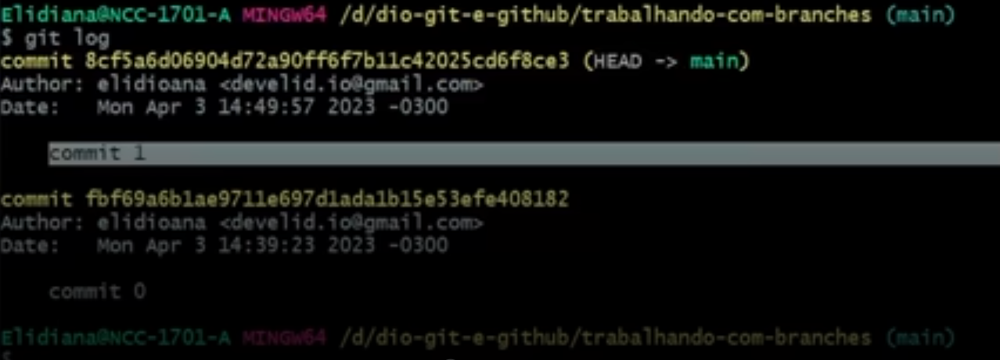
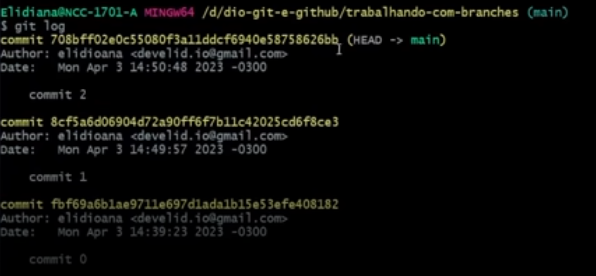
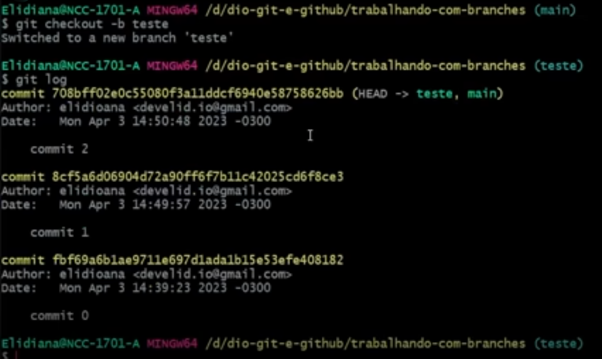
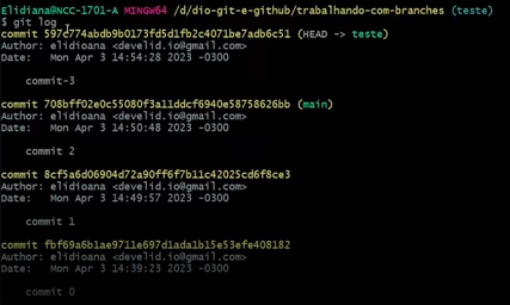
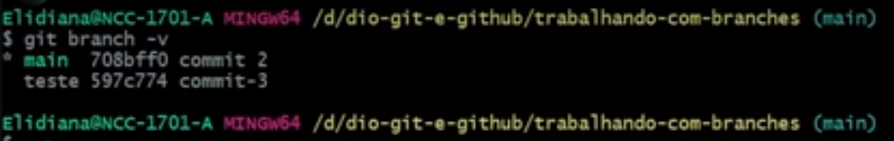

- Instrutor: Elidiana Andrade (Tech Education Analyst at DIO)
- Contato Linkedin: https://www.linkedin.com/in/elidiana/

# Parte 1: Visão Geral do Curso e Ferramentas

## 🟩 Vídeo 01 - Introdução ao Curso

<video width="60%" controls>
  <source src="000-Midia_e_Anexos/bootcamp-ntt-data_modulo_01-Curso_04-Video_01.webm" type="video/webm">
    Seu navegador não suporta vídeo HTML5.
</video>

Link do vídeo: https://web.dio.me/track/engenharia-dados-python/course/versionamento-de-codigo-com-git-e-github/learning/f3cbaa66-efbd-4c25-842e-2069c188c066?autoplay=1

A instrutora, Lidiana (ou Eli),  se apresenta no início de um curso intitulado "Versionamento de Código com Git e GitHub", explicando sua trajetória profissional como desenvolvedora Front-End e sua transição de carreira, que se iniciou na área de arquitetura. Ela compartilha detalhes pessoais, como seus hobbies (jogos, filmes, cosplays) e seu trabalho de compartilhar conhecimento em plataformas e canais, incluindo um com seu namorado, especializado em Back-End. A principal motivação da instrutora é a democratização da educação tecnológica, citando Carl Sagan sobre a dependência da sociedade em ciência e tecnologia. Finalmente, ela descreve o objetivo geral do curso, que é introduzir o versionamento de código com Git e GitHub, e detalha o percurso e os pré-requisitos para os alunos.

## 🟩 Vídeo 02 - O que é Versionamento de Código


<video width="60%" controls>
  <source src="000-Midia_e_Anexos/bootcamp-ntt-data_modulo_01-Curso_04-Video_02.webm" type="video/webm">
    Seu navegador não suporta vídeo HTML5.
</video>

Link do vídeo: https://web.dio.me/track/engenharia-dados-python/course/versionamento-de-codigo-com-git-e-github/learning/68183181-bc0a-4b66-a877-42dd42b5bc9c?autoplay=1

**Visão geral** sobre **controle de versão de código**, introduzindo o conceito e as ferramentas relacionadas. Inicialmente, a narradora utiliza uma **analogia** de dois amigos desenvolvendo um aplicativo para ilustrar as **dificuldades** do versionamento manual, como desorganização e problemas de mesclagem. A explicação evolui para apresentar os **sistemas de controle de versão** como a solução para esses problemas, destacando seus benefícios em **organização, armazenamento eficiente e segurança**. Por fim, diferencia-se entre **sistemas de controle de versão centralizados e distribuídos**, citando o **Git** como um exemplo deste último, que oferece maior flexibilidade e redundância.

### Anotações

- Sistemas de controle de versão:
    - Registrar o histórico de atualizações de um arquivo; 
    - Gerenciar quais foram as alterações, a data, autor, etc.;
    - Organizar, controlar e garantir a segurança.

- Tipos de Sistemas de Controle de Versão:
    - VCS Centralizado (CVCS) - Ex.: CVS, Subversion.
    - VCS Distribuído (DVCS) - Ex: Git, Mercurial.

- VCS Distribuído (DVCS)
    - Clona o repositório completo, o que inclui o histórico de versões.
    - Cada clone é como um backup;
    - Possibilita um fluxo de trabalho flexível;
    - Possibilidade de trabalhar sem conexão à rede.

## 🟩 Vídeo 03 - O que é Git


<video width="60%" controls>
  <source src="000-Midia_e_Anexos/bootcamp-ntt-data_modulo_01-Curso_04-Video_03.webm" type="video/webm">
    Seu navegador não suporta vídeo HTML5.
</video>

Link do vídeo: https://web.dio.me/track/engenharia-dados-python/course/versionamento-de-codigo-com-git-e-github/learning/a7e0b074-3907-4ca8-a74f-8378ffb8f458?autoplay=1

O vídeo fornece uma introdução abrangente ao **Git**, descrevendo-o como um **sistema de controle de versão distribuído** que se destaca por ser gratuito, de código aberto, e possuir ramificações e fusões eficientes. A **história do Git** é brevemente detalhada, mencionando sua criação por Linus Torvalds após conflitos com o sistema proprietário BitKeeper, que era usado no projeto Linux. Além disso, a fonte enfatiza a importância de os desenvolvedores consultarem a **documentação oficial do Git** para aprendizado, que servirá de base para o curso. Finalmente, é apresentado um **fluxo de trabalho básico do Git**, explicando comandos essenciais como `git clone` para copiar repositórios, `git commit` para salvar alterações, `git pull` para atualizar o repositório local a partir do remoto, e `git push` para enviar alterações ao servidor.

### Anotações

- Sistema de Controle de Versão Distribuído
    - Gratuito e Open Source (Código Aberto);
    - Ramificações (branching) e fusões (merging) eficientes;
    - Leve e rápido.

- Referência: https://git-scm.com/ (site oficial do Git)
    - __Principais recursos__:
        - Download do Git para Windows, macOS e Linux
        - Documentação oficial com tutoriais e manuais
        - Livro gratuito "Pro Git" (em português também)
        - Referência de comandos Git com exemplos
        - Comunidade e traduções

- Breve histórico do Git
    - 2002: O projeto do núcleo (kernel) do Linux, que é open source, começa a utilizar o BitKeeper, um DVCS proprietário;
    - 2005: Após conflitos com a comunidade, o BitKeeper rescinde a licença gratuita. O que leva a Linus Torvalds, o criador do Linux, e sua equipe, a desenvolverem sua própria ferramenta, o Git.

- Fluxo Básico no Git:
    - git clone → clona um repositório Git existente para um novo diretório (pasta) local.
    - git commit → grava alterações no repositório.
    - git pull → “puxa” as alterações do repositório remoto para o local (busca e mescla).
    - git push → “empurra” as alterações do repositório local para o remoto.
 
## 🟩 Vídeo 04 - O que é Github

<video width="60%" controls>
  <source src="000-Midia_e_Anexos/bootcamp-ntt-data_modulo_01-Curso_04-Video_04.webm" type="video/webm">
    Seu navegador não suporta vídeo HTML5.
</video>

Link do vídeo: https://web.dio.me/track/engenharia-dados-python/course/versionamento-de-codigo-com-git-e-github/learning/b86569c8-84af-438d-83ae-eb2a728bb291?autoplay=1

O vídeo fornece uma **introdução abrangente ao GitHub**, distinguindo-o do Git ao explicar que o Git é um sistema de controle de versão distribuído, enquanto o GitHub é uma **plataforma de hospedagem e ambiente colaborativo** que utiliza o Git. Ele detalha a **história da plataforma**, mencionando sua criação em 2008 e a compra pela Microsoft em 2018, e descreve o processo passo a passo para **criar uma conta no GitHub** e **configurar um perfil**. Além disso, o material **orienta o usuário sobre como navegar nas configurações** e, crucialmente, como **ativar a autenticação de dois fatores** (2FA), enfatizando sua importância para a segurança da conta.

### Anotações

- Plataforma de hospedagem de código para controle de versão com Git, e colaboração.
    - Comunidade ativa;
    - Utilizado mundialmente;
    - Mascote “Octocat”.
        - É uma criatura híbrida entre um gato e um polvo (cat + octopus).
        - Foi criado por Simon Oxley, um ilustrador japonês, e adotado pelo GitHub como símbolo da marca.
        - Representa o espírito divertido e amigável do GitHub.
        - É usado em material promocional, documentação, eventos, e como ícone da cultura open source.

- Breve Histórico do GitHub:
    - 2008: Desenvolvido por Chris Wanstrath, J. Hyett, Tom Preston-Werner e Scott Chacon.
    - 2018: Vítima de um dos maiores ataques de DDoS (ataque distribuído de negação de serviço); Comprado pela Microsoft Corporation por US $ 7,5 bilhões.

- Git ≠ GitHub (apresentação das diferenças)

- Autenticação de Dois Fatores
    - Acesse sua conta do GitHub e vá em Settings > Password and authentication > Two-factor authentication > Authenticator app
        - Leia o QR Code através do aplicativo autenticador (ex.: Microsoft Authenticator) e insira o código no GitHub;
        - Salve os códigos de recuperação;
        - Autenticação ativada!

- Referência: https://github.com/ (site oficial do Github)
    - Plataforma de hospedagem de código-fonte e controle de versão baseada no sistema Git.
    - __Principais recursos__:
        - Armazenar projetos de software (código-fonte, documentação, scripts etc.); - Controlar versões dos arquivos (ver o histórico de alterações);
        - Colaborar com outras pessoas desenvolvedoras (em equipes ou em projetos open source);
        - Publicar portfólios técnicos;
        - Automatizar processos (como testes e deploys com GitHub Actions).

- Instalação, Configuração e Autenticação
    - Instalando e configurando o Git, e autenticando o GitHub via Token e Chave SSH

# Parte 2: Instalação, Configuração e Autenticação

## 🟩Vídeo 05 - Instalando o Git no Windows

<video width="60%" controls>
  <source src="000-Midia_e_Anexos/bootcamp-ntt-data_modulo_01-Curso_04-Video_05.webm" type="video/webm">
    Seu navegador não suporta vídeo HTML5.
</video>

Link do vídeo: https://web.dio.me/track/engenharia-dados-python/course/versionamento-de-codigo-com-git-e-github/learning/c8d73362-9038-4259-af4c-30dcc5551afe?autoplay=1

O vídeo explica o processo de **instalação e configuração do Git** no sistema operacional Windows. O locutor guia o ouvinte **passo a passo** através do processo de download a partir da página oficial do Git, selecionando a versão apropriada para Windows 64 bits. Durante a instalação, são detalhadas as **opções de configuração**, como a escolha dos componentes a serem instalados, a definição de um editor de texto padrão (preferencialmente Vin) e a nomeação do **branch inicial (main)** para novos repositórios. A ênfase é dada à importância de manter as configurações padrão na maioria das etapas e garantir a integração com o Windows Explorer. Ao final, o sucesso da instalação é confirmado pela **disponibilidade do Git Bash** e das novas opções de menu de contexto.

### Anotações

- Acesse https://git-scm.com/download/win;
- Faça o download do instalador e execute;
- Aceite a licença e clique em “Next”, e siga configurando como desejar¹ e clicando em “Next”;
- Finalize clicando em “Install”, e “Finish”.
    - Em "Select Components“, deixe as opções “Git Bash Here” e “Git GUI Here” marcadas.
 
## 🟩 Vídeo 06 - Instalando o Git no Linux (Ubuntu)

<video width="60%" controls>
  <source src="000-Midia_e_Anexos/bootcamp-ntt-data_modulo_01-Curso_04-Video_06.webm" type="video/webm">
    Seu navegador não suporta vídeo HTML5.
</video>

Link do vídeo: https://web.dio.me/track/engenharia-dados-python/course/versionamento-de-codigo-com-git-e-github/learning/5e5fe1c6-59d6-4003-b4a1-e9799c7755ec?autoplay=1

O vídeo fornece um **tutorial prático** sobre como instalar a ferramenta Git em um sistema operacional Linux, especificamente usando a distribuição Ubuntu. O instrutor detalha uma sequência de **comandos necessários** para a instalação, começando pela adição de um PPA (Personal Package Archive) para garantir a versão mais estável do Git. Em seguida, o processo exige a **atualização dos pacotes** do sistema e, por fim, a **execução do comando de instalação** propriamente dito. O áudio conclui mostrando como **verificar a versão instalada** do Git, confirmando que a **instalação foi bem-sucedida** e concluída na máquina do usuário.

### Anotações

- Confira a doc.: https://git-scm.com/download/linux
- Instale a última versão estável do Git:
    ```
    add-apt-repository ppa:git-core/ppa
    apt update
    apt install git 
    ```
- Referência: https://git-scm.com/downloads/linux
    - Comando: 
        ``` 
        git --version 
        ```
    - Resultado: ``` git version 2.43.0 ```

- Instalando o Git no macOS
    - Confira a doc.: https://git-scm.com/download/mac
    - Instale o Homebrew: https://brew.sh/
    - Instale o Git: 
        ``` 
        brew install git 
        ```
    
## 🟩 Vídeo 07 - Configurando o Git

<video width="60%" controls>
  <source src="000-Midia_e_Anexos/bootcamp-ntt-data_modulo_01-Curso_04-Video_07.webm" type="video/webm">
    Seu navegador não suporta vídeo HTML5.
</video>

Link do vídeo: https://web.dio.me/track/engenharia-dados-python/course/versionamento-de-codigo-com-git-e-github/learning/f9b294d2-f8ca-4364-9031-1e897721b3e2?autoplay=1

O vídeo detalha as **configurações iniciais do Git**, utilizando o terminal Git Bash. O instrutor **guia o ouvinte** através do processo de **abertura e personalização do terminal**, incluindo a **alteração do tema** e a **melhoria da visualização**. O foco principal é a **configuração das variáveis** de **nome de usuário** e **e-mail** de forma **global** (para todos os repositórios), explicando o uso do comando `git config --global user.name` e `git config --global user.email`. O áudio também aborda a **alteração da branch padrão** para "main" e **como listar** as configurações globais, incentivando a **consulta à documentação oficial** para mais opções de customização.

### Anotações

- Comando: 
    ``` 
    git config --list 
    ```
- Resultado:
    ```
    credential.https://github.com.helper=
    credential.https://github.com.helper=!/usr/bin/gh auth git-credential
    credential.https://gist.github.com.helper=
    credential.https://gist.github.com.helper=!/usr/bin/gh auth git-credential
    user.name= ...
    user.email= ...
    ```
- Configurando seu nome de usuário e e-mail (globalmente):
    ```
    git config --global user.name "Nome Sobrenome"
    git config --global user.email seuemail@email.com
    ```
- Configurando o nome da Branch Padrão:
    ```
    git config --global init.defaultBranch main
    ```
- Para gerar um Token, acesse sua conta no GitHub, e no menu superior direito clique em Settings > Developer settings > Tokens (classic) > Generate new token.

- Você pode armazenar suas credenciais para reduzir o número de vezes que você deve digitar seu nome de usuário ou senha:
    - Salvando no cache: 
        ``` 
        git config --global credential.helper cache 
        ```
    - Ou permanentemente: 
        ``` 
        git config --global credential.helper store 
        ```
    - Veja mais na doc.: https://git-scm.com/book/pt-br/v2/Git-Tools-Credential-Storage


## 🟩 Vídeo 08 - Autenticando via Token

<video width="60%" controls>
  <source src="000-Midia_e_Anexos/bootcamp-ntt-data_modulo_01-Curso_04-Video_08.webm" type="video/webm">
    Seu navegador não suporta vídeo HTML5.
</video>

Link do vídeo:  https://web.dio.me/track/engenharia-dados-python/course/versionamento-de-codigo-com-git-e-github/learning/3d13d85f-2508-4396-9657-4643d3302c79?autoplay=1

O vídeo explica detalhadamente o processo de **autenticação de operações Git com o GitHub**, focando na transição do uso de senhas para **tokens de acesso pessoal** por razões de segurança, destacando que o GitHub não aceita mais a autenticação por senha desde 2021. É demonstrado como **gerar um novo token** no GitHub, configurando seu escopo e validade, e como utilizá-lo para clonar um repositório privado no terminal, substituindo a senha. Além disso, a fonte cobre a importância e o método de **armazenamento dessas credenciais** de forma permanente ou temporária localmente, usando o `credential.helper` com as opções `store` ou `cache`, e mostra como **verificar e gerenciar** essas configurações e tokens.

### Anotações

- Para gerar um Token, acesse sua conta no GitHub, e no menu superior direito clique em Settings > Developer settings > Tokens (classic) > Generate new token.

- Você pode armazenar suas credenciais para reduzir o número de vezes que você deve digitar seu nome de usuário ou senha:
    - Salvando no cache: 
        ``` 
        git config --global credential.helper cache 
        ```
    - Ou permanentemente: 
        ``` 
        git config --global credential.helper store 
        ```
    - Veja mais na doc.: https://git-scm.com/book/pt-br/v2/Git-Tools-Credential-Storage
 
## 🟩 Vídeo 09 - Autenticando via Chave SSH

<video width="60%" controls>
  <source src="000-Midia_e_Anexos/bootcamp-ntt-data_modulo_01-Curso_04-Video_09.webm" type="video/webm">
    Seu navegador não suporta vídeo HTML5.
</video>

Link do vídeo: https://web.dio.me/track/engenharia-dados-python/course/versionamento-de-codigo-com-git-e-github/learning/a53b7d6e-d7a2-40de-a8f9-cc30b42fc93d?autoplay=1

O vídeo fornece um guia detalhado sobre como autenticar operações no **GitHub** usando **chaves SSH**, que são fundamentais para uma conexão segura e criptografada entre o computador local e o servidor remoto. Ele explica que o protocolo Secure Shell (SSH) utiliza um **par de chaves**—uma privada, que age como uma senha e fica no computador, e uma pública, que é inserida no GitHub para a autenticação. O passo a passo abrange desde a **verificação da existência de chaves SSH** na máquina, passando pela geração de um novo par de chaves usando o algoritmo ED25519, até a adição da chave privada ao **SSH Agent** para armazenamento seguro. Por fim, o tutorial instrui sobre a adição da **chave pública** à conta do GitHub e demonstra o sucesso da configuração ao clonar um repositório privado via SSH.

### Anotações

- Para adicionar uma Chave SSH, acesse sua conta no GitHub, clique na imagem do usuário, escolha  Settings > SSH and GPG keys > New SSH key.

# Parte 3: Primeiros Passos com Git e GitHub
 
## 🟩Vídeo 10 - Criando e Clonando Repositórios

<video width="60%" controls>
  <source src="000-Midia_e_Anexos/bootcamp-ntt-data_modulo_01-Curso_04-Video_10.webm" type="video/webm">
    Seu navegador não suporta vídeo HTML5.
</video>

Link do vídeo: https://web.dio.me/track/engenharia-dados-python/course/versionamento-de-codigo-com-git-e-github/learning/a377a00b-461c-4ab0-8258-3addd2fef14c?autoplay=1

O vídeo é um guia prático para iniciantes e usuários intermediários do Git e GitHub, focando principalmente na **criação e clonagem de repositórios**. A explicação detalha as duas formas de obter um repositório Git localmente: usando o comando **`git init`** para inicializar um novo diretório e o comando **`git clone`** para copiar um repositório existente. O material também compara as configurações de arquivos **`.git/config`** em repositórios criados localmente versus aqueles clonados de um servidor remoto, destacando a adição do **`remote "origin"`** em repositórios clonados. Finalmente, o guia instrui sobre como **vincular um repositório local a um remoto** usando **`git remote add`** e revisa o processo de **criação de repositórios no GitHub**, incluindo opções de inicialização como `README.md` e `.gitignore`.

### Anotações

- Existem duas formas de obter um repositório Git na sua máquina:
    - Transformando um diretório local que não está sob controle de versão, num repositório Git;
    - Clonando um repositório Git existente.

#### Criando um Repositório Local
    
- Acesse a pasta que deseja transformar em um repositório Git  pelo terminal ou clique no atalho em “Git Bash Here
- Inicialize um repositório Git no diretório escolhido: 
    ``` 
    git init 
    ```
- Conecte o repositório local com o repositório remoto:
    ```
    git remote add origin https://github.com/username/nome-do-repositorio.git
    ```

#### ⭐ <mark>Clonando um Repositório</mark>

- Em “Code”, copie o código HTTPS ou SSH (a depender de como autenticou sua conta) do repositório no GitHub;
- Abra o GitBash, insira o comando git clone e cole o conteúdo copiado para cloná-lo:
    ```
       git clone https://github.com/username/nome-do-repositorio
    ```

#### Criando um Repositório Remoto

- Acesse a sua conta do GitHub, clique no “+” no canto superior direito, e em “New repository”
- Insira um nome (obrigatório), e a descrição (opcional);
- Coloque uma breve descrição sobre o projeto, essa etapa é opcional;
- Defina se o acesso será público ou privado;
- Escolha como deseja inicializar seu repositório (se quiser vazio, deixe as opções desmarcadas)
- Clique em “Create repository”, e pronto!
 
## 🟩Vídeo 11 - Salvando Alterações no Repositório Local

<video width="60%" controls>
  <source src="000-Midia_e_Anexos/bootcamp-ntt-data_modulo_01-Curso_04-Video_11.webm" type="video/webm">
    Seu navegador não suporta vídeo HTML5.
</video>

Link do vídeo: https://web.dio.me/track/engenharia-dados-python/course/versionamento-de-codigo-com-git-e-github/learning/599dd3dd-d189-474f-a55c-22f37b4472da?autoplay=1

O vídeo apresenta uma **aula prática sobre como salvar alterações em um repositório Git local**, concentrando-se nos comandos essenciais e melhores práticas. O instrutor demonstra a **inicialização de um repositório** e a criação de um arquivo `README.md` usando a **sintaxe Markdown**, mostrando exemplos de como estruturar este arquivo no GitHub. A lição então foca no uso do comando `git status` para monitorar o estado dos arquivos, explicando a diferença entre **arquivos rastreados e não rastreados**. Finalmente, o processo de **adicionar arquivos à área de preparação** (`git add`) e **confirmar as mudanças** (`git commit -m`) é detalhado, incluindo a utilização do `git log` para visualizar o histórico de *commits*. A aula também explora casos especiais, como a **ignorância de diretórios vazios** pelo Git e a função do arquivo `.gitignore`.

### Anotações

- Como criar um commit
    - Adicione o conteúdo que deseja inserir no commit:
        ```
        git add
        ```
    - Crie um commit e adicione uma mensagem descritiva:
        ```
        git commit -m "message"
        ```
 
## 🟩 Vídeo 12 - Desfazendo Alterações no Repositório Local

<video width="60%" controls>
  <source src="000-Midia_e_Anexos/bootcamp-ntt-data_modulo_01-Curso_04-Video_12.webm" type="video/webm">
    Seu navegador não suporta vídeo HTML5.
</video>

Link do vídeo: https://web.dio.me/track/engenharia-dados-python/course/versionamento-de-codigo-com-git-e-github/learning/3f9f2336-6fd5-44cb-ba39-d1a4f6448023?autoplay=1

O material apresentado é um **guia prático e detalhado** sobre o uso de comandos Git, com foco em desfazer alterações e gerenciar o histórico de *commits* antes de enviar para um repositório remoto. Ele **instrui o usuário** sobre como restaurar arquivos modificados, alterar a mensagem do último *commit* e utilizar o comando `git reset` nas opções *soft*, *mixed* e *hard* para retroceder o histórico. A segunda parte do conteúdo **demonstra a conexão** de um repositório local com o GitHub, explicando como enviar (*push*) e receber (*pull*) alterações, além de **mostrar métodos de edição** de arquivos diretamente na interface web do GitHub e no *web editor* (VS Code online). O objetivo principal é garantir que as revisões e correções sejam feitas localmente para **evitar conflitos** ao trabalhar em equipe.

### Anotações

- Como alterar a mensagem do último commit:
    ```
    git commit --amend
    ```
- Alterando a mensagem sem abrir o editor:
    ```
    git commit --amend –m"nova mensagem"
    ```
- Como desfazer um commit:
    ```
    git reset
    ```
    ```
    git reset --soft
    ```
    ```
    git reset --mixed
    ```
    ```
    git reset --hard
    ```

## 🟩Vídeo 13 - Enviando e Baixando Alterações com o Repositório Remoto

<video width="60%" controls>
  <source src="000-Midia_e_Anexos/bootcamp-ntt-data_modulo_01-Curso_04-Video_13.webm" type="video/webm">
    Seu navegador não suporta vídeo HTML5.
</video>

Link do vídeo: https://web.dio.me/track/engenharia-dados-python/course/versionamento-de-codigo-com-git-e-github/learning/dd17c56e-2327-493c-942a-358a49a26549?autoplay=1

O vídeo concentra-se em fluxos de trabalho essenciais do Git, demonstrando como **sincronizar um repositório local com um remoto no GitHub**. A explicação começa com o processo de **envio de alterações locais (commits) para o repositório remoto**, utilizando comandos como `git status`, `git add` e `git commit`, e estabelecendo a conexão remota com `git remote add`. Posteriormente, o tutorial abrange as diferentes maneiras de **editar arquivos diretamente no repositório remoto do GitHub**, incluindo a edição via interface web e a utilização do editor web integrado (acessível pela tecla ponto). Finalmente, o instrutor demonstra como **baixar essas alterações remotas para o repositório local** usando o comando `git pull`, garantindo que ambos os ambientes permaneçam atualizados.

### Anotações

- Como enviar as alterações do repositório local para o remoto:
    ```
    git push
    ```
- “Puxar” as alterações do repositório remoto para o local (busca e mescla):
    ```
    git pull
    ```
 
## 🟩Vídeo 14 - Trabalhando com Branches - Criando, Mesclando, Deletando e Tratando Conflitos

<video width="60%" controls>
  <source src="000-Midia_e_Anexos/bootcamp-ntt-data_modulo_01-Curso_04-Video_14.webm" type="video/webm">
    Seu navegador não suporta vídeo HTML5.
</video>

Link do vídeo: https://web.dio.me/track/engenharia-dados-python/course/versionamento-de-codigo-com-git-e-github/learning/2c7fd2b1-e7c4-4947-9b07-ffcbfb4bd689?autoplay=1

O vídeo apresenta um guia detalhado sobre como trabalhar com **branches** no Git, começando com a explicação de que uma branch é uma **ramificação independente** de um projeto que permite o teste de novos recursos sem afetar a **branch principal (main)**. O autor demonstra os comandos **git log**, **git checkout -b**, **git branch -v** e **git merge** para criar, rastrear, alternar entre, e mesclar branches, enfatizando a importância das branches para a **colaboração em equipe** e a manutenção de um ambiente de desenvolvimento estável. A segunda parte do material foca em como resolver **conflitos de merge**, uma situação comum que ocorre quando há **alterações concorrentes** na mesma linha de código em diferentes branches, mostrando como o Git sinaliza o conflito e como o usuário pode escolher quais alterações manter antes de **comitar** e **enviar (push)** as mudanças resolvidas.

### Anotações

- De maneira simplista, uma Branch (em tradução, “Ramo”), é uma ramificação do seu projeto.
- É um ponteiro móvel para um commit no histórico do repositório;
- Quando você cria uma nova Branch a partir de outra existente, a nova se inicia apontando para o mesmo commit da Branch que estava quando foi criada.
 
- Cria-se o primeiro commit chamado de `commit-0`. A partir desse momento a branch passa a apontar pra esse commit.

<p align="center">
  
</p>

- Em seguida nós gera-se um novo commit (`commit-1`) e essa branch passa a apontar pra ele.

<p align="center">
  
</p>

- Cria-se mais um (`commit-2`) e assim sucessivamente (lembrar do comando `git log` com a indicação HEAD do commit mais recente)
- Vamos supor que dentro da branch main decidimos testar um novo recurso. Para isso criamos uma nova branch que decidimos chamar de `teste`.
- Quando criamos uma branch dentro de um commit já existente ela passa a apontar para o mesmo commit que já estava apontando.

<p align="center">
  
</p>

- Como ela trabalha de forma independente a partir do mesmo commit, nós ppodemos criar um novo commit a partir da branch teste. 
- Feito isso, ela deixa de apontar para o `commit-2` e passa a apontar para o `commit-3`.

<p align="center">
  
</p>

- Observe que a branch main continua apontando para o `commit-2`.

#### Operações realizadas no terminal:

##### 1. Gerando-se um novo commit (commit-1):

```
git log
echo "#commit-1-branch-main" > commit-1-branch-main.txt"
git add .
git commit -m "commit-1"
```

<p align="center">
    
</p>

##### 2. Branch apontando para o `commit-1`:

```
git log
```
<p align="center">
  
</p>

##### 3. Criando mais um commit:

```
echo "#commit-2-branch-main" > commit-2-branch-main.txt"
git add .
git commit -m "commit-2"
```

<p align="center">
  
</p>

##### 4. Verificação:

```
git log
```
Veja que o ponteiro agora está apontando para o `commit-2`.

<p align="center">
  
</p>

##### 5. Criando a branch teste:

```
git checkout -b teste
``` 
Este comando irá mover ponteiro de `main` para `teste`. Perceba que a branch `teste` está apontando para o mesmo commit da branch `main` (que é o `commit-2`).

<p align="center">
  
</p>

##### 6. Fazendo um novo commit dentro da branch `teste`.

Repetindo os passos para o `commit-3`. Perceba que a branch `teste` estará apontando para o `commit-3`, enquanto a branch `main` continuará apontando para o `commit-2`.

```
echo "#commit-3-branch-main" > commit-3-branch-main.txt"
git add .
git commit -m "commit-3"
git log
```

<p align="center">
  
</p>

##### 7. Retornando para a branch `main`.

```
git checkout main
```

<p align="center">
  
</p>

##### 8. O comando `git branch -v` irá listar o último commit de cada branch.

```
git branch -v
```

<p align="center">
  
</p>

##### 9. Mesclando (MERGE) as alterações feitas na branch `teste` com a `main`.

```
git merge teste
```

<p align="center">
  
</p>

##### 10. Excluindo a branch `teste`, pois não iremos mais utilizá-la.

```
git branch
git branch -d teste
git branch
```

<p align="center">
  
</p>

## 🟩Vídeo 15 - Trabalhando com Branches - Comandos Úteis no Dia a Dia

<video width="60%" controls>
  <source src="000-Midia_e_Anexos/bootcamp-ntt-data_modulo_01-Curso_04-Video_15.webm" type="video/webm">
    Seu navegador não suporta vídeo HTML5.
</video>

 Link do vídeo: https://web.dio.me/track/engenharia-dados-python/course/versionamento-de-codigo-com-git-e-github/learning/80018fab-daac-4917-8527-a6be2e0c3cf0?autoplay=1

O vídeo demonstra comandos avançados do Git para gerenciamento de código e repositórios. O conteúdo principal foca primeiramente na explicação do comando `git fetch`, contrastando-o com o `git pull` ao mostrar como **baixar alterações de um repositório remoto sem mesclá-las imediatamente** ao repositório local. Em seguida, o instrutor detalha como usar `git clone` com as opções `--branch` e `--single-branch` para **clonar seletivamente apenas uma ramificação específica** de um repositório. Por fim, o tutorial aborda o comando `git stash` como uma ferramenta essencial para **arquivar modificações temporariamente** sem realizar um commit, permitindo a mudança para outra branch antes de aplicar as alterações arquivadas novamente.

### Anotações

- Comandos ```git fetch```e ```git merge```.
- O comando ```git fetch``` baixa o arquivo no repositório remoto para o local sem estar mesclando.
- Usar o comando ```git diff```para verificaar as diferenças.

<p align="center">
  
</p>

- Clonando apenas uma branch específica do repositório. 
- Atentar para o parâmetro ```--single-branch```.

<p align="center">
  
</p>

## 🟩 Vídeo 16 - Dicas e Materiais de Apoio

<video width="60%" controls>
  <source src="000-Midia_e_Anexos/bootcamp-ntt-data_modulo_01-Curso_04-Video_16.webm" type="video/webm">
    Seu navegador não suporta vídeo HTML5.
</video>

Link do vídeo: https://web.dio.me/track/engenharia-dados-python/course/versionamento-de-codigo-com-git-e-github/learning/b2ceffed-9d18-4369-a038-e72be0953455?autoplay=1

O vídeo trata da finalização de curso, onde a instrutora, **Ligiana Andrade**, parabeniza o ouvinte por ter chegado ao fim e expressa a esperança de que ele esteja confiante para criar repositórios no **GitHub**. A principal finalidade é apresentar **materiais de apoio** e dicas para que os alunos possam dar prosseguimento aos estudos. Para isso, ela detalha um **repositório específico** que criou, chamado "curso kit gitub", que contém tópicos vistos e links utilitários, além de referências. O áudio também fornece uma lista extensa de **links adicionais**, abrangendo desde documentação oficial e a palestra de Linus Torvalds sobre o Git até ferramentas como o GitHub Desktop e uma inteligência artificial para comandos Git. Por fim, a instrutora encoraja a **conexão em redes sociais** e a criação de artigos para compartilhar o conhecimento adquirido.

### 📚 Recursos Úteis

#### 🔗 Repositório

- [elidianaandrade/git-github-learning-quest](https://github.com/elidianaandrade/git-github-learning-quest) — Repositório com material de apoio gamificado.

#### 🖥️ Slide

- Versionamento de Código com Git e GitHub.pptx — Apresentação utilizada no curso.

#### 🌐 Links Úteis

- [GitHub Quick Start](https://github.com/githubtraining/hellogitworld) — Repositório com link para aulas de Git e GitHub.
- [GitBook](https://github.com/github/certification): Formação GitHub Certification — Material textual sobre GitHub.
- [Documentação do GitHub](https://docs.github.com/pt) — Guia completo para uso do GitHub.
- [GitHub Markdown](https://guides.github.com/features/mastering-markdown/) — Guia específico para Markdown no GitHub.

#### 💡 Dicas

- Artigos/Fórum: você pode compartilhar conteúdos técnicos através de Artigos (visíveis globalmente na plataforma da DIO). Por outro lado, você também pode compartilhar suas conquistas e dúvidas usando os Fóruns (que são específicos para cada experiência educacional na DIO, como um Bootcamp por exemplo).
- Pesquise na Web: pode parecer óbvio, mas é importante frisar a importância das engines de busca no dia a dia de um profissional de TI. Caso não encontre o que procura dentro da DIO, pesquise sobre o assunto (conceito, dúvida, erro etc) na Internet

# Certificado: Versionamento de Código com Git

- Link do certificado: https://hermes.dio.me/certificates/F10OC6FU.pdf
- Certificado em pdf: [Certificado-Versionamento.de.Codigo.com.Git..pdf](000-Midia_e_Anexos/Certificado-Versionamento.de.Codigo.com.Git..pdf)