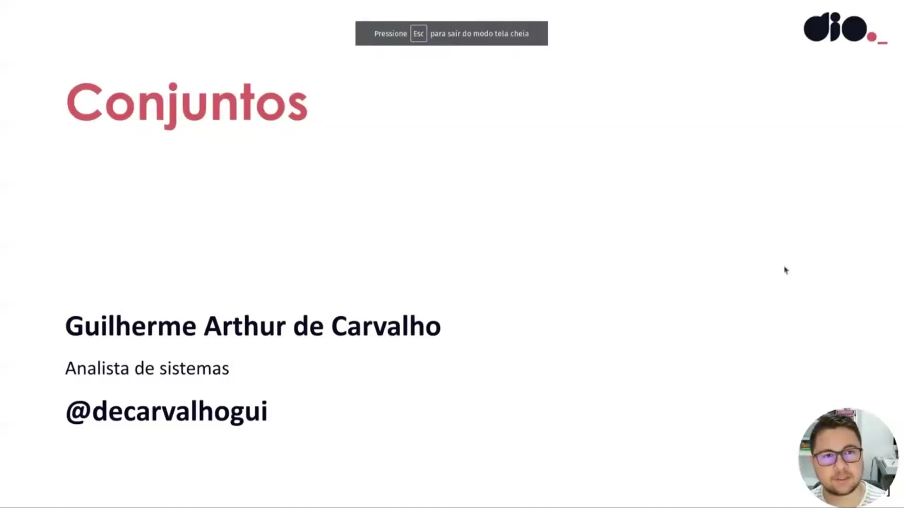
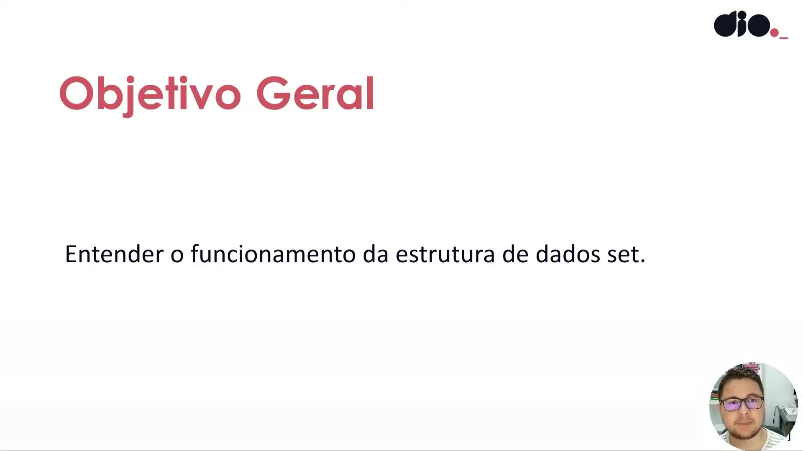
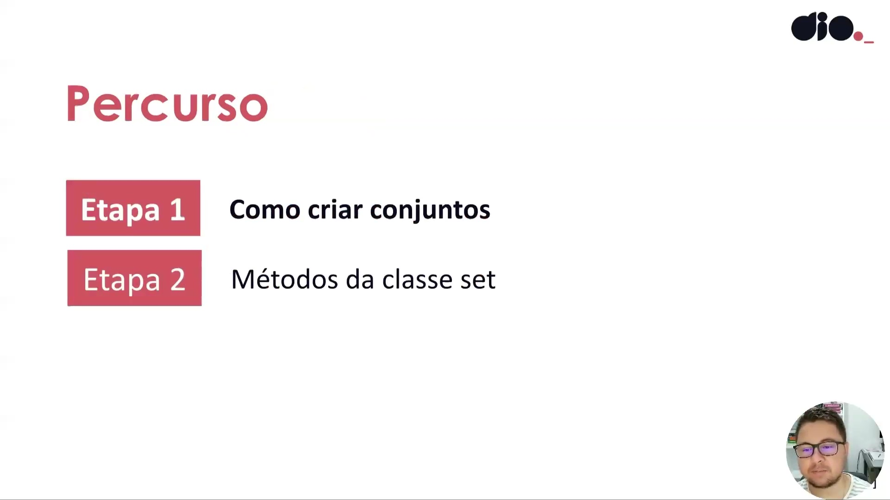
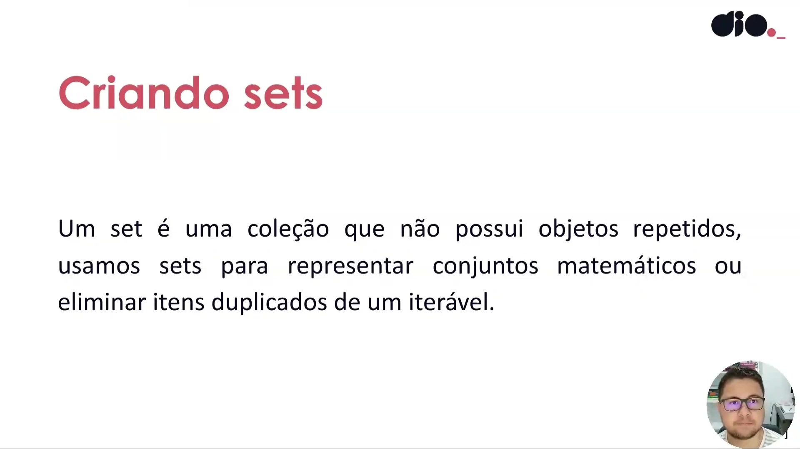
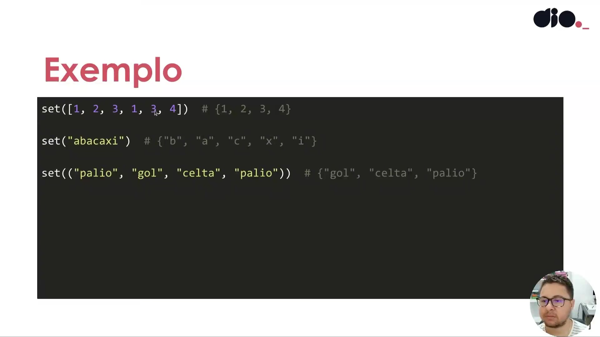
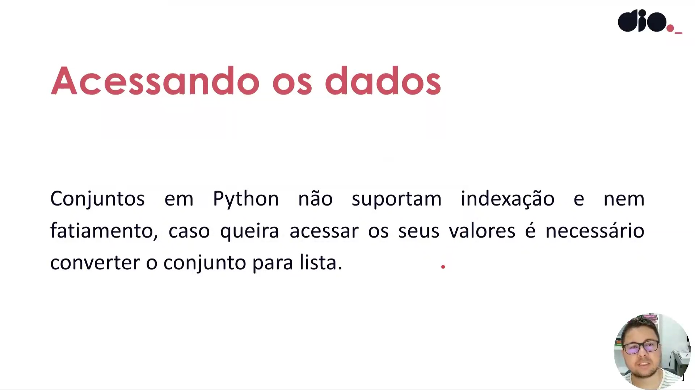
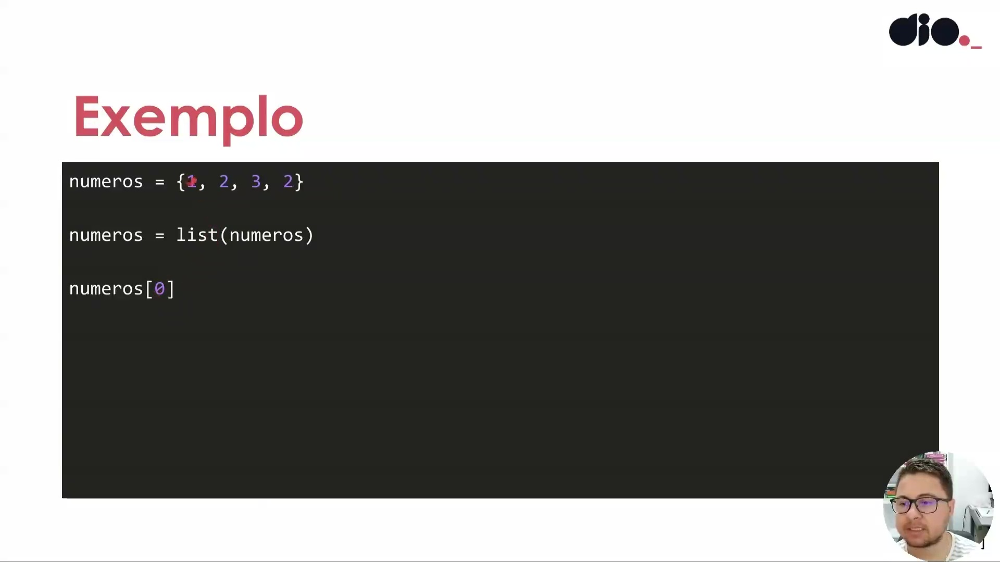
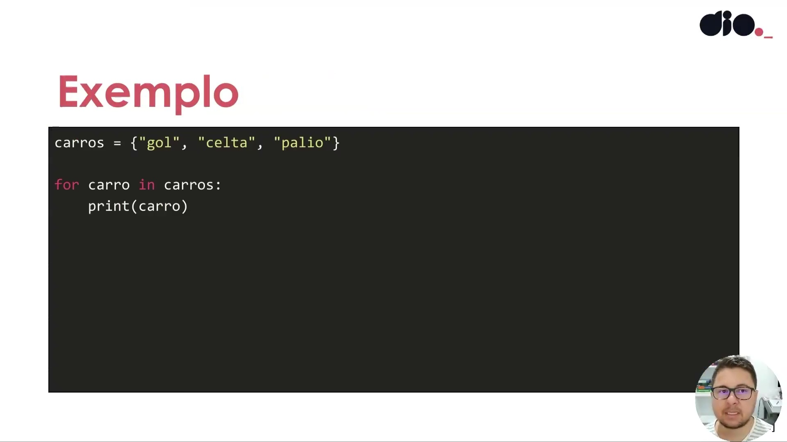
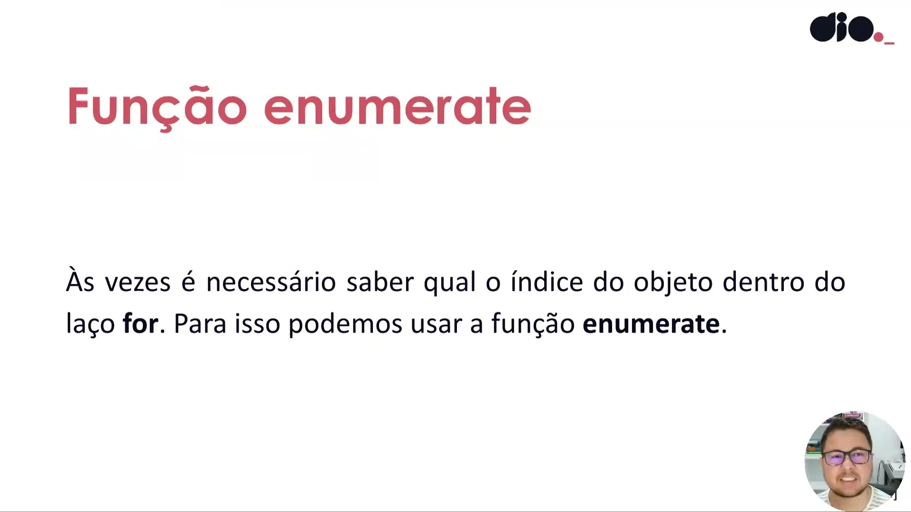

# Instrutor

- Guilherme Arthur de Carvalho (Analista de Sistemas)
- Contato Linkedin: https://www.linkedin.com/in/decarvalhogui/

# Parte 1 - Explorando Conjuntos em Python

## 🟩 Vídeo 01 - Conjuntos

<video width="60%" controls>
  <source src="000-Midia_e_Anexos/bootcamp-ntt-data_modulo_03-Curso_03-Video_01.webm" type="video/webm">
    Seu navegador não suporta vídeo HTML5.
</video>

Link do vídeo: https://web.dio.me/track/engenharia-dados-python/course/explorando-conjuntos-em-python/learning/09c6ccff-aec7-4506-96b7-b90307851402?autoplay=1

O vídeo consiste em uma aula detalhada sobre a estrutura de dados **set** (conjuntos) na linguagem Python, destacando sua principal característica de armazenar apenas **elementos únicos** e não duplicados. O instrutor explica que, embora menos comum que listas, essa ferramenta é extremamente poderosa para otimizar códigos que exigem a **remoção automática de duplicatas** e a realização de operações matemáticas. São exploradas funcionalidades fundamentais como **união, intersecção e diferença**, além de métodos específicos para manipulação de itens, como o **add, discard e pop**. O conteúdo também alerta sobre a **ausência de ordenação** e a impossibilidade de acessar elementos por indexação direta, recomendando a conversão para listas quando necessário. Por fim, a fonte demonstra como o Python facilita o trabalho com **lógica de conjuntos**, tornando tarefas complexas em outras linguagens muito mais simples e eficientes.

### Anotações

<p align="center">

</p>

Esta aula introduz o conceito de **Conjuntos** (sets) em Python, apresentada por Guilherme Arthur de Carvalho. O objetivo é explorar essa estrutura de dados que possui características únicas em relação a listas e tuplas.

<p align="center">

</p>

O foco principal da aula é o entendimento teórico e prático do funcionamento da estrutura de dados `set`.

<p align="center">

</p>

O roteiro de aprendizagem está dividido em duas etapas principais:

1. 
**Como criar conjuntos**: Fundamentos e sintaxe inicial.


2. 
**Métodos da classe set**: Operações e manipulações avançadas disponíveis para essa estrutura.


<p align="center">

</p>

Um `set` é definido como uma coleção que não admite objetos repetidos. Essa estrutura é ideal para representar conjuntos matemáticos ou para remover de forma eficiente elementos duplicados de qualquer iterável.

<p align="center">

</p>

A criação de um set pode ser feita passando diferentes tipos de iteráveis, como listas, strings ou tuplas, para o construtor `set()`. Note que a ordem dos elementos pode não ser preservada e as duplicatas são removidas automaticamente.

```python
set([1, 2, 3, 1, 3, 4])
# {1, 2, 3, 4}

set("abacaxi") 
# {"b", "a", "c", "x", "i"}

set(("palio", "gol", "celta", "palio")) 
# {"gol", "celta", "palio"}

```

<p align="center">

</p>

Diferente das listas, os conjuntos em Python não suportam indexação ou fatiamento. Para acessar um valor específico por índice, é necessário converter o conjunto em uma lista previamente.

<p align="center">

</p>

O exemplo abaixo demonstra a conversão de um conjunto para lista para permitir o acesso via índice, já que tentar acessar `numeros[0]` diretamente em um `set` resultaria em erro.

```python
numeros = {1, 2, 3, 2}

numeros = list(numeros)

print(numeros[0])

```

<p align="center">

</p>

Embora não suportem indexação direta, os conjuntos são iteráveis. É possível percorrer seus elementos utilizando um laço `for`.

```python
carros = {"gol", "celta", "palio"}

for carro in carros:
    print(carro)

```

<p align="center">

</p>

Quando houver necessidade de obter o índice do objeto durante a iteração em um conjunto, deve-se utilizar a função `enumerate`. Isso contorna a limitação de falta de índices nativos na estrutura do set.

# Certificado: Explorando Conjuntos em Python

- Link na plataforma: 
- Certificado em pdf: 
