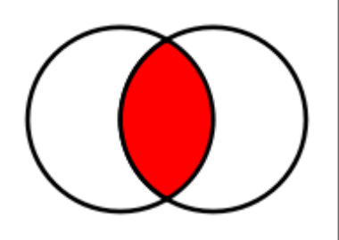

# Parte 1 - Explorando Conjuntos em Python

# 🟩 Vídeo 01 - Conjuntos

<video width="60%" controls>
  <source src="000-Midia_e_Anexos/bootcamp-ntt-data_modulo_03-Curso_03-Video_01.webm" type="video/webm">
    Seu navegador não suporta vídeo HTML5.
</video>


## Objetivo Geral

- Entender o funcionamento da estrutura de dados set.

## Criando sets

- Um set é uma coleção que não possui objetos repetidos, usamos sets para representar conjuntos matemáticos ou eliminar itens duplicados de um iterável.

## Exemplo

```python
set([1, 2, 3, 1, 3, 4])  # {1, 2, 3, 4}

set("abacaxi")  # {"b", "a", "c", "x", "i"}

set(("palio", "gol", "celta", "palio"))  # {"gol", "celta", "palio"}
```

## Acessando os dados

- Conjuntos em Python não suportam indexação e nem fatiamento, caso queira acessar os seus valores é necessário converter o conjunto para ➡️ lista.

## Exemplo

```python
numeros = {1, 2, 3, 2}

numeros = list(numeros)  # Convertendo um conjunto para uma ➡️ lista.

numeros[0]
```

### Iterar conjuntos

- A forma mais comum para percorrer os dados de um conjunto é utilizando o comando for.

### Exemplo

```python
carros = {"gol", "celta", "palio"}

for carro in carros:
    print(carro)
```

### Função enumerate

- Às vezes é necessário saber qual o índice do objeto dentro do laço for. Para isso podemos usar a função enumerate.

### Exemplo

```python
carros = {"gol", "celta", "palio"}

for indice, carro in enumerate(carros):
    print(f"{indice}: {carro}")
```

## Métodos da classe set

### {}.union

```python
conjunto_a = {1, 2}
conjunto_b = {3, 4}

conjunto_a.union(conjunto_b) # {1, 2, 3, 4}
```

<p align="center">
    
</p>

### {}.intersection

```python
conjunto_a = {1, 2, 3}
conjunto_b = {2, 3, 4}

conjunto_a.intersection(conjunto_b) # {2, 3}
```

<p align="center">
    
</p>

### {}.difference

```python
conjunto_a = {1, 2, 3}
conjunto_b = {2, 3, 4}

conjunto_a.difference(conjunto_b) # {1}
conjunto_b.difference(conjunto_a) # {4}
```

<p align="center">
    
</p>

### {}.symmetric_difference

```python
conjunto_a = {1, 2, 3}
conjunto_b = {2, 3, 4}

conjunto_a.symmetric_difference(conjunto_b) # {1, 4}
```

<p align="center">
    
</p>

### {}.issubset

```python
conjunto_a = {1, 2, 3}
conjunto_b = {4, 1, 2, 5, 6, 3}

conjunto_a.issubset(conjunto_b) # True
conjunto_b.issubset(conjunto_a) # False
```

<p align="center">
    
</p>

### {}.issuperset

```python
conjunto_a = {1, 2, 3}
conjunto_b = {4, 1, 2, 5, 6, 3}

conjunto_a.issuperset(conjunto_b)  # False
conjunto_b.issuperset(conjunto_a)  # True
```

<p align="center">
    
</p>

### {}.isdisjoint

```python
conjunto_a = {1, 2, 3, 4, 5}
conjunto_b = {6, 7, 8, 9}
conjunto_c = {1, 0}

conjunto_a.isdisjoint(conjunto_b)  # True
conjunto_a.isdisjoint(conjunto_c)  # False
```

<p align="center">
    
</p>

### {}.add

```python
sorteio = {1, 23}

sorteio.add(25) # {1, 23, 25}
sorteio.add(42) # {1, 23, 25, 42}
sorteio.add(25) # {1, 23, 25, 42}
```

### {}.clear

```python
sorteio = {1, 23}

sorteio # {1,23}
sorteio.clear()
sorteio # {}
```

### {}.copy

```python
sorteio = {1, 23}

sorteio # {1, 23}
sorteio.copy()
sorteio # {1, 23}
```

### {}.discard

```python
numeros = {1, 2, 3, 1, 2, 4, 5, 5, 6, 7, 8, 9, 0}

numeros # {1, 2, 3, 4, 5, 6, 7, 8, 9, 0}
numeros.discard(1)
numeros.discard(45)
numeros # {2, 3, 4, 5, 6, 7, 8, 9, 0}
```

### {}.pop

```python
numeros = {1, 2, 3, 1, 2, 4, 5, 5, 6, 7, 8, 9, 0}

numeros # {0, 1, 2, 3, 4, 5, 6, 7, 8, 9}
numeros.pop() # 0
numeros.pop() # 1
numeros # {2, 3, 4, 5, 6, 7, 8, 9}
```

### {}.remove

```python
numeros = {1, 2, 3, 1, 2, 4, 5, 5, 6, 7, 8, 9, 0}

numeros # {0, 1, 2, 3, 4, 5, 6, 7, 8, 9}
numeros.remove(0) # 0
numeros # {1, 2, 3, 4, 5, 6, 7, 8, 9}
```

### len

```python
numeros = {1, 2, 3, 1, 2, 4, 5, 5, 6, 7, 8, 9, 0}

len(numeros) # 10
```

### in

```python
numeros = {1, 2, 3, 1, 2, 4, 5, 5, 6, 7, 8, 9, 0}

1 in numeros # True
10 in numeros # False
```

# Parte 2 - Materiais de apoio e Questionário

## Materiais de apoio

Disponibilizados os seguinte arquivos em formato MS Powerpoint:
- 03-Dio_Conjuntos.pdf

# Certificado: Explorando Conjuntos em Python

Link do certificado: https://hermes.dio.me/certificates/X8KEVLLA.pdf
Certificado em PDF: [Certificado-Explorando.Conjuntos.em.Python.pdf](000-Midia_e_Anexos/Certificado-Explorando.Conjuntos.em.Python.pdf)