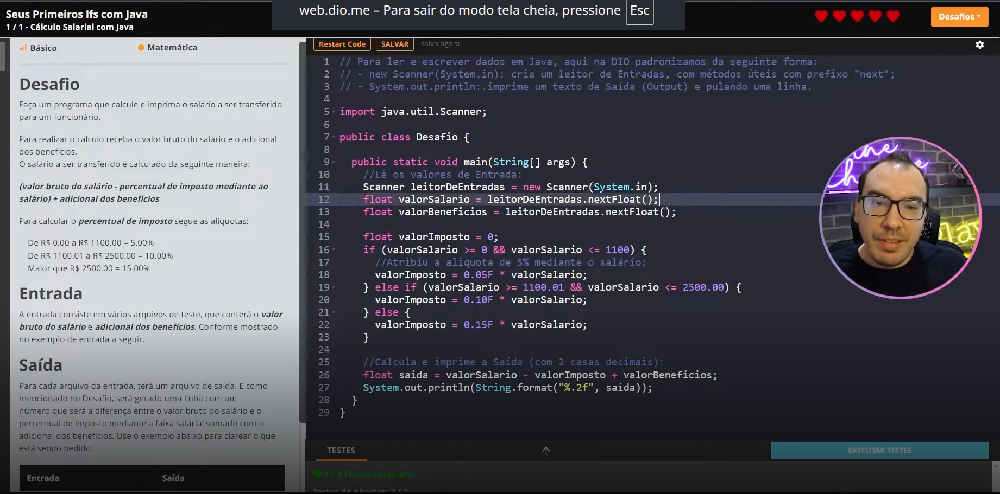
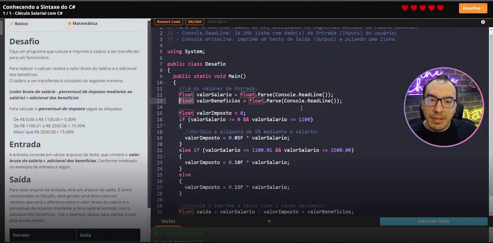
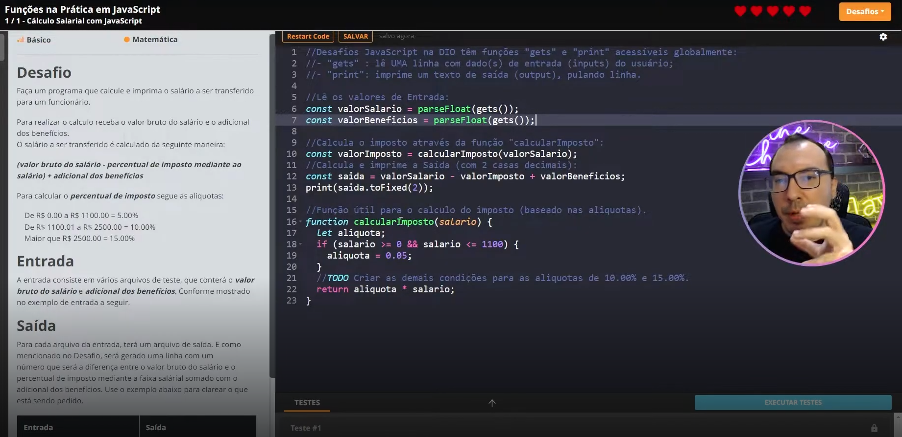
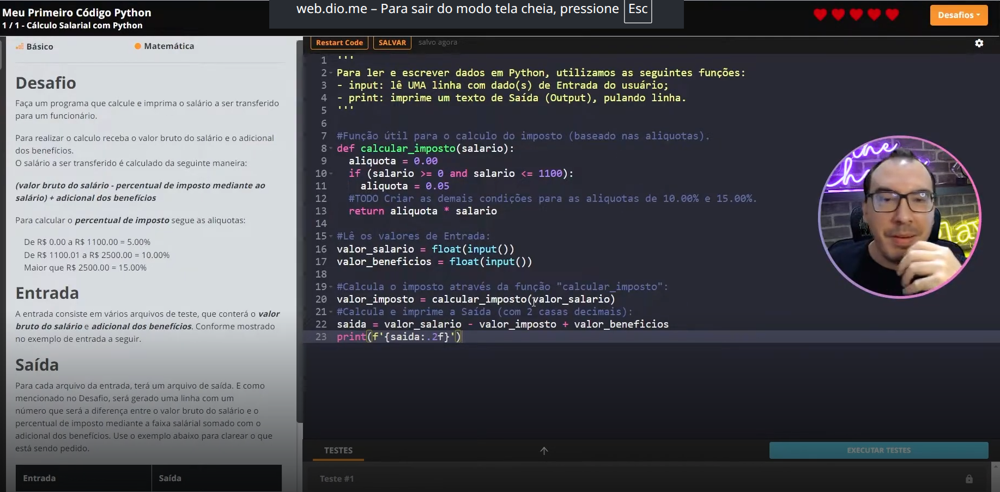
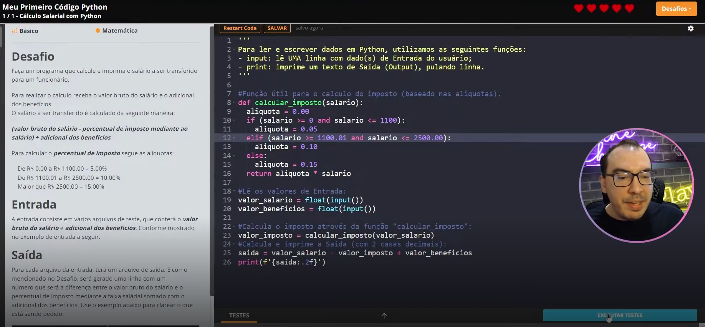

- Instrutor: Venilton Falvo Jr (Doutor em Engenharia de Software, Education Tech Lead na DIO)
- Contato: https://www.linkedin.com/in/falvojr/

# Parte 1 - Desafios de Código - Aperfeiçoe Sua Lógica e Pensamento Computacional

## 🟩 Vídeo 01 - Introdução

<video width="60%" controls>
  <source src="000-Midia_e_Anexos/bootcamp_ntt_data-modulo.03-curso.07-video_01.webm" type="video/webm">
    Seu navegador não suporta vídeo HTML5.
</video>

Link do vídeo: https://web.dio.me/track/engenharia-dados-python/course/desafios-de-codigo-aperfeicoe-sua-logica-e-pensamento-computacional/learning/e294adbf-9f6b-434b-a9ab-3645b166457e?autoplay=1

Venilton, da DIO, apresenta uma jornada de imersão focada em desafios de código, destacando a prática como o caminho fundamental para a perfeição técnica. O conteúdo enfatiza o desenvolvimento da lógica e do pensamento computacional, tratando as linguagens de programação como ferramentas que servem a uma estrutura de raciocínio sólida, preparando o desenvolvedor para superar limites e dominar novas tecnologias.

## 🟩 Vídeo 02 - PBL, Lógica e Pensamento Computacional

<video width="60%" controls>
  <source src="000-Midia_e_Anexos/bootcamp_ntt_data-modulo.03-curso.07-video_02.webm" type="video/webm">
    Seu navegador não suporta vídeo HTML5.
</video>

Link do vídeo: https://web.dio.me/track/engenharia-dados-python/course/desafios-de-codigo-aperfeicoe-sua-logica-e-pensamento-computacional/learning/d41fab09-549b-4e8d-bf65-8ccaa8918c3b?autoplay=1

O vídeo apresenta a metodologia educacional da DIO, focada em "Desafios de Código" e fundamentada na Aprendizagem Baseada em Problemas (PBL). O conteúdo destaca a importância da lógica de programação e do pensamento computacional como competências transversais e essenciais para qualquer profissional de tecnologia, enfatizando que a prática constante e a colaboração em comunidade são os pilares para o domínio técnico e o protagonismo na carreira digital.

### Anotações

    

A **Aprendizagem Baseada em Problemas (PBL - Problem-Based Learning)** é um pilar da metodologia educacional que coloca o estudante no centro do processo. Em vez de uma absorção puramente teórica, você é incentivado a mergulhar na resolução de problemas reais ou simulados enquanto aprende. Na prática, essa ideia é representada pelos **Desafios de Código**, que trazem problemas do mundo real para serem solucionados através de soluções algorítmicas, potencializando o estudo de forma prática e contextualizada.

    

Para atuar com eficiência na tecnologia, é necessário dominar duas competências fundamentais que funcionam como "superpoderes" no mundo digital:

* **Lógica de Programação:** É comparável ao aprendizado de um novo idioma, permitindo transformar problemas em soluções claras e ordenadas através de passos lógicos e algoritmos.
* **Pensamento Computacional:** Funciona como um mapa que ajuda a encontrar caminhos para resolver desafios, projetar sistemas e compreender comportamentos que podem não ser claros à primeira vista.

    

O aprendizado fundamentado na prática e na colaboração justifica-se por três pilares essenciais:

1. **Aprendizagem Ativa:** Defende que a melhor forma de aprender é fazendo. É uma preparação para o mundo real, focando nas demandas e desafios futuros através da prática direta.

2. **Transformação Digital:** A programação tornou-se a linguagem do futuro. Dominar essa competência promove oportunidades incríveis, pois traz uma forma de pensar e resolver problemas que transcende a área de tecnologia.

3. **Comunidade Protagonista:** O aprendizado é potencializado pela interação e colaboração. Ao compartilhar conhecimento, você se torna protagonista na comunidade tech, aprendendo e crescendo junto com outros profissionais.      

## 🟩 Vídeo 03 - A Linguagem é Só Um Detalhe... Como Resolver Desafios de Código

<video width="60%" controls>
  <source src="000-Midia_e_Anexos/bootcamp_ntt_data-modulo.03-curso.07-video_03.webm" type="video/webm">
    Seu navegador não suporta vídeo HTML5.
</video>

Link do vídeo: https://web.dio.me/track/engenharia-dados-python/course/desafios-de-codigo-aperfeicoe-sua-logica-e-pensamento-computacional/learning/0742edea-d41f-4584-a8bb-d5e9866fb019?autoplay=1

- O professor apresenta na tela 5 desafios de código, cada um numa linguagem de programação diferente.

    

### PRIMEIRO Desafio de Código: Java

    

- Detalhamento do desafio e explicação de como funciona a plataforma 

    

#### Solução

    

### SEGUNDO Desafio de Código: C#

- Exatamente igual ao primeiro, mas em C#.

    

#### Solução

    

### TERCEIRO Desafio de Código: JavaScript

- O JavaScript é menos verboso que os anteriores.

    

- Podemos aproveitar as formas de representar as condições do Java e do C#.
- Substituindo `ValorImposto` por `aliquota` e `valorSalario` por `salario`.
- Também não preciso colocar o F do ponto flutuante no valor.

#### Solução

    

### QUARTO Desafio de Código: Python

    

#### Solução

    

### QUINTO Desafio de Código: Kotlin

    

### Solução

    

# Parte 2 - Transcrições

- Foram disponibilizados os seguintes arquivos em formato PDF:

    - Apresentacao.pdf
    - PBL_Lógica_e_Pensamento_Computacional.pdf.pdf
    - A_Linguagem_eh_So_Um_Detalhe-Como_Resolver_Desafios_de_Codigo.pdf

## Certificado: Desafios de Código: Aperfeiçoe Sua Lógica e Pensamento Computacional

Link do certificado: https://hermes.dio.me/certificates/PGDMAIJT.pdf