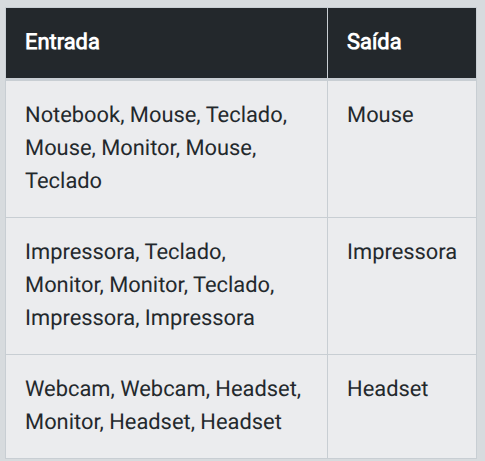

- Instrutor: Venilton Falvo Jr (Doutor em Engenharia de Software, Education Tech Lead na DIO)
- Contato: https://www.linkedin.com/in/falvojr/

# Desafio 1 - Análise de Vendas com Listas

## Descrição

Você está trabalhando em um projeto de Power BI onde precisa analisar dados de vendas mensais de uma empresa. Em Power BI, os dados são frequentemente representados em tabelas, e você precisa calcular alguns indicadores básicos. Sua tarefa é calcular o total de vendas e a média mensal de vendas que serão usados para gerar relatórios e gráficos no Power BI, além de criar uma lista em Python para calcular o total de vendas e a sua média mensal.

## Detalhamento

### Instruções para a função obter_entrada_vendas()

Na função obter_entrada_vendas() você deverá:

1. Utilizar o método split(',') para dividir a string de entrada em elementos separados por vírgula, criando assim uma lista de strings.

2. Aplique a função map(int, ...) para converter cada elemento dessa lista de strings em um inteiro.

3. Usar a função list() para converter o objeto map resultante em uma lista de inteiros.

Essa lista de inteiros representará os valores de vendas que serão utilizados para calcular o total e a média mensal de vendas em outra função.

## Entrada

Uma lista com 12 números inteiros, cada um representando o número de vendas realizadas em um mês do ano.

## Saída

Um único número inteiro representando o total de vendas e um número decimal representando a média mensal de vendas, separados por um espaço

## Exemplos

A tabela abaixo apresenta exemplos com alguns dados de entrada e suas respectivas saídas esperadas. Certifique-se de testar seu programa com esses exemplos e com outros casos possíveis.

<p align="center">
  
</p>

Atenção: É extremamente importante que as entradas e saídas sejam exatamente iguais às descritas na descrição do desafio de código.

## Solução:

### O código precisa:

1. Converter a entrada em uma lista de inteiros usando split(','), map(int, ...) e list().
2. Calcular o total de vendas com sum(vendas).
3. Calcular a média mensal com sum(vendas) / len(vendas).

### Código completo:

```python
def analise_vendas(vendas):
    # A função sum(vendas) → soma todos os elementos da lista 'vendas'
    total_vendas = sum(vendas)
    
    # Calcula a média mensal dividindo o total pelo número de elementos da lista
    media_vendas = total_vendas / len(vendas)
    
    # Retorna o resultado formatado: total de vendas e média com duas casas decimais
    return f"{total_vendas}, {media_vendas:.2f}"

def obter_entrada_vendas():
    # Solicita a entrada do usuário em uma única linha
    entrada = input()
    
    # split(',') → separa a string em substrings
    # map(int, ...) → converte cada substring em inteiro
    # list(...) → transforma o resultado em uma lista
    vendas = list(map(int, entrada.split(',')))
    
    return vendas

vendas = obter_entrada_vendas()
print(analise_vendas(vendas))

```

### Exemplo de uso  

#### Entrada:
120,150,170,130,200,250,180,220,210,160,140,190  

#### Saída:
2120, 176.67

# Desafio 2 - Identificando os Produtos Mais Vendidos

## Descrição

Você está gerando um relatório de vendas em Power BI e deseja identificar quais produtos foram mais vendidos durante um dia específico. Os dados dos produtos vendidos são frequentemente armazenados em listas. Sua tarefa é usar uma lista em Python para contar a frequência de cada produto e determinar o produto mais vendido, que será usado para destacar produtos populares no relatório do Power BI.

## Detalhamento

### 1. Encontre o produto com a maior contagem:

- Itere sobre o dicionário `contagem`, que contém a contagem de cada produto.
- Compare a contagem atual com a contagem máxima armazenada em `max_count`.
- Se a contagem atual for maior que `max_count`, atualize `max_count` e defina `max_produto` como o produto atual.

### 2. Converter a entrada em uma lista de strings, removendo espaços extras:

- Use o método `split(',')` para dividir a string de entrada em uma lista de strings, separando pelo caractere vírgula.
- Utilize uma list comprehension para remover espaços em branco extras ao redor de cada string, usando o método `strip()`.

## Entrada

Uma lista de strings onde cada string representa o nome de um produto vendido.

## Saída

A string com o nome do produto mais vendido. Se houver empate, retorne qualquer um dos produtos mais vendidos.

## Exemplos

A tabela abaixo apresenta exemplos com alguns dados de entrada e suas respectivas saídas esperadas. Certifique-se de testar seu programa com esses exemplos e com outros casos possíveis.

<p align="center">
  
</p>

Atenção: É extremamente importante que as entradas e saídas sejam exatamente iguais às descritas na descrição do desafio de código.

## Solução:

### Código completo

```python
def produto_mais_vendido(produtos):
    contagem = {}
    
    for produto in produtos:
        if produto in contagem:
            contagem[produto] += 1
        else:
            contagem[produto] = 1
    
    max_produto = None
    max_count = 0
    
    for produto, count in contagem.items():
        # Encontre o produto com a maior contagem:
        if count > max_count:
            max_count = count
            max_produto = produto
    
    return max_produto

def obter_entrada_produtos():
    # Solicita a entrada do usuário em uma única linha
    entrada = input()
    # Converta a entrada em uma lista de strings, removendo espaços extras:
    produtos = [item.strip() for item in entrada.split(',')]
    
    return produtos

produtos = obter_entrada_produtos()
print(produto_mais_vendido(produtos))
```
