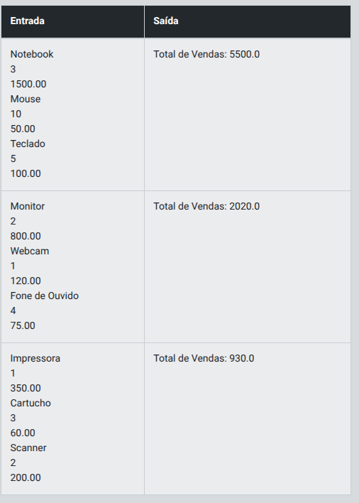

# Desafio 1 - Criando Classes para Dados de Vendas

## Descrição

Você está desenvolvendo um sistema para gerenciar dados de vendas que serão posteriormente importados para o Power BI. Você tem a estrutura de duas classes, **Venda** e **Relatorio**, já definidas. Sua tarefa é implementar partes específicas do código dentro dessas classes.

1. **Classe Venda:**
   - Já está definida e contém as informações sobre uma **venda**, como **produto, quantidade e valor**.

2. **Classe Relatorio:**
   - Você precisa implementar o método **adicionar_venda**, que deve verificar se o objeto passado é uma instância da classe **Venda** antes de adicioná-lo à lista de vendas.
   - Também, no método **calcular_total_vendas**, você deve calcular o total de vendas multiplicando a quantidade pelo valor de cada venda adicionada ao relatório.

3. **Função main:**
   - Você deverá implementar a lógica para exibir o total de vendas utilizando o método **calcular_total_vendas** da classe **Relatorio**.

## Entrada

A entrada consiste em dados de vendas com as seguintes colunas:  

- Produto (string)  
- Quantidade (inteiro)  
- Valor (decimal)

## Saída

A saída é o total de vendas calculado pela classe *Relatorio*.

## Exemplos

A tabela abaixo apresenta exemplos com alguns dados de entrada e suas respectivas saídas esperadas. Certifique-se de testar seu programa com esses exemplos e com outros casos possíveis.

  

> Atenção: É extremamente importante que as entradas e saídas sejam exatamente iguais às descritas na descrição do desafio de código.

## Solução

# Desafio 2 - Agrupamento de Vendas por Categoria

## Descrição

## Entrada

## Saída

## Exemplos

## Solução
