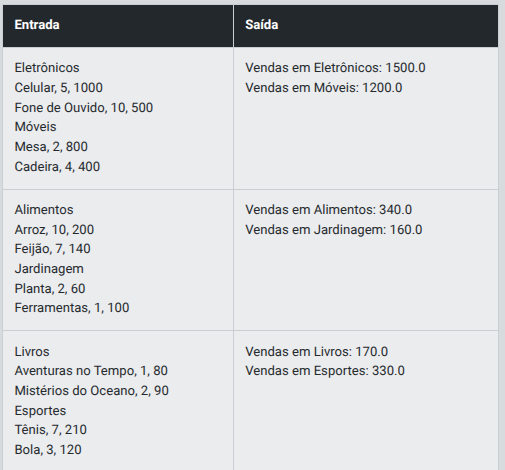

# Desafio 1 - Criando Classes para Dados de Vendas

## Descrição

Você está desenvolvendo um sistema para gerenciar dados de vendas que serão posteriormente importados para o Power BI. Você tem a estrutura de duas classes, **Venda** e **Relatorio**, já definidas. Sua tarefa é implementar partes específicas do código dentro dessas classes.

1. **Classe Venda:**
   - Já está definida e contém as informações sobre uma **venda**, como **produto, quantidade e valor**.

2. **Classe Relatorio:**
   - Você precisa implementar o método **adicionar_venda**, que deve verificar se o objeto passado é uma instância da classe **Venda** antes de adicioná-lo à lista de vendas.
   - Também, no método **calcular_total_vendas**, você deve calcular o total de vendas multiplicando a quantidade pelo valor de cada venda adicionada ao relatório.

3. **Função main:**
   - Você deverá implementar a lógica para exibir o total de vendas utilizando o método **calcular_total_vendas** da classe **Relatorio**.

## Entrada

A entrada consiste em dados de vendas com as seguintes colunas:  

- Produto (string)  
- Quantidade (inteiro)  
- Valor (decimal)

## Saída

A saída é o total de vendas calculado pela classe *Relatorio*.

## Exemplos

A tabela abaixo apresenta exemplos com alguns dados de entrada e suas respectivas saídas esperadas. Certifique-se de testar seu programa com esses exemplos e com outros casos possíveis.

<p align="center">
  
</p>

> Atenção: É extremamente importante que as entradas e saídas sejam exatamente iguais às descritas na descrição do desafio de código.

## Solução

```python
class Venda:
    def __init__(self, produto, quantidade, valor):
        self.produto = produto
        self.quantidade = quantidade
        self.valor = valor

class Relatorio:
    def __init__(self):
        self.vendas = []

    def adicionar_venda(self, venda):
        # TODOS: Verifique se o objeto passado é uma instância da classe Venda.
        # Isso ajuda a garantir que apenas vendas válidas sejam adicionadas ao relatório.
        if isinstance(venda, Venda):
            self.vendas.append(venda)

    def calcular_total_vendas(self):
        total = 0
        for venda in self.vendas:
            # TODOS: Calcule o total de vendas baseado nas vendas adicionadas:
            # O cálculo deve multiplicar a quantidade pelo valor de cada venda e somar ao total.
            total += venda.quantidade * venda.valor
        return total

def main():
    relatorio = Relatorio()

    for i in range(3):
        produto = input()
        quantidade = int(input())
        valor = float(input())
        venda = Venda(produto, quantidade, valor)
        relatorio.adicionar_venda(venda)

    # TODOS: Exiba o total de vendas usando o método calcular_total_vendas.
    # Utilize o método `calcular_total_vendas` da classe `Relatorio` para mostrar o total acumulado das vendas.
    print(f"Total de Vendas: {relatorio.calcular_total_vendas()}")

if __name__ == "__main__":
    main()
```


# Desafio 2 - Agrupamento de Vendas por Categoria


## Descrição

Você está desenvolvendo um sistema para organizar vendas por categorias antes de gerar um relatório.  
O objetivo é criar uma classe **Categoria** que gerencie as vendas associadas a uma determinada categoria e calcule o total de vendas dessa categoria.

## Tarefas

1. **Método adicionar_venda:**  
   Na classe **Categoria**, crie um método chamado **adicionar_venda** que adiciona um objeto **Venda** à lista de vendas da categoria.

2. **Método total_vendas:**  
   Na classe **Categoria**, crie um método chamado **total_vendas** que calcula e retorna o total das vendas (soma do valor de todas as vendas) para essa categoria.

3. **Na função main:**
   - **Entrada de Dados:**  
     Leia o nome das categorias e, para cada categoria, leia as vendas associadas.  
     - **Implementação:** Adicione cada venda à categoria correspondente usando o método **adicionar_venda**.
   - **Exibição dos Resultados:**  
     Exiba o total de vendas para cada categoria.  
     - **Implementação:** Utilize o método **total_vendas** para calcular e exibir o total das vendas.

## Entrada

A entrada consiste em:  
- Nome da Categoria (string)  
- Lista de Vendas (com as colunas Produto, Quantidade, Valor)  

### Atenção
O valor será o TOTAL GERAL de todos os produtos. Dessa forma:  

**Eletrônicos**  
- Celular, 5, 1000 → Produto Celular, temos 5 unidades e o valor total é 1000  
- Fone de Ouvido, 10, 500 → Produto Fone de Ouvido, temos 10 unidades e o valor total é 500  

## Saída

A saída é o total de vendas por categoria.

## Exemplos

A tabela abaixo apresenta exemplos com alguns dados de entrada e suas respectivas saídas esperadas. Certifique-se de testar seu programa com esses exemplos e com outros casos possíveis.

<p align="center">
  
</p>

> Atenção: É extremamente importante que as entradas e saídas sejam exatamente iguais às descritas na descrição do desafio de código.

## Solução

```python
class Venda:
    def __init__(self, produto, quantidade, valor):
        self.produto = produto
        self.quantidade = quantidade
        self.valor = valor

class Categoria:
    def __init__(self, nome):
        self.nome = nome
        self.vendas = []

    # TODOS: Implementar o método adicionar_venda para adicionar uma venda à lista de vendas:
    def adicionar_venda(self, venda):
        self.vendas.append(venda)

    # TODOS: Implementar o método total_vendas para calcular e retornar o total das vendas
    def total_vendas(self):
        total = 0
        for venda in self.vendas:
            total += venda.valor
        return total

def main():
    categorias = []
    for i in range(2):
        nome_categoria = input()
        categoria = Categoria(nome_categoria)
        for j in range(2):
            entrada_venda = input()
            produto, quantidade, valor = entrada_venda.split(',')
            quantidade = int(quantidade.strip())
            valor = float(valor.strip())
            venda = Venda(produto.strip(), quantidade, valor)
            # TODOS: Adicione a venda à categoria usando o método adicionar_venda:
            categoria.adicionar_venda(venda)
        categorias.append(categoria)

    # Exibindo os totais de vendas para cada categoria
    for categoria in categorias:
        # TODOS: Exibir o total de vendas usando o método total_vendas:
        print(f"Vendas em {categoria.nome}: {categoria.total_vendas()}")

if __name__ == "__main__":
    main()
```
