## Instrutor:

- Juliana Mascarenhas (Tech Education Specialist / Sócia (Content Creator) @SimplificandoRedes / Me Modelagem Computacional / Cientista de dados)
- Contato Linkedin: / [juliana-mascarenhas-ds](https://www.linkedin.com/in/juliana-mascarenhas-ds/)

## Parte 1 - Apresentação da Formação

### 🟩 Vídeo 01 - O que você aprenderá na Formação

<video width="60%" controls>
  <source src="000-Midia_e_Anexos/bootcamp_ntt_data-modulo.05-curso.01-video_01.webm" type="video/webm">
    Seu navegador não suporta vídeo HTML5.
</video>

link do vídeo: https://web.dio.me/track/engenharia-dados-python/course/fundamentos-de-business-intelligence-bi/learning/79f64dff-3ad3-45f5-88bc-04d059a5d868?autoplay=1

A formação Power BI Analyst, apresentada por Juliana Mascarenhas, propõe uma jornada de aprendizado com abordagem "top-down", iniciando pela visualização de dados para depois aprofundar-se em coleta, transformação e modelagem. O curso é focado na prática, com diversos projetos e desafios, sendo estrategicamente alinhado aos requisitos da certificação Microsoft PL-300, tornando-o ideal para profissionais que buscam transformar dados em decisões estratégicas através de dashboards interativos.

### Anotações

<p align="center">

</p>

Esta formação é conduzida por **Juliana Mascarenhas**, Mestre em Modelagem Computacional, Cientista de Dados e especialista na DIO. A proposta é apresentar o ecossistema do **Power BI Analyst**, preparando o aluno para lidar com as demandas reais da área de dados através de uma trilha estruturada de aprendizado.

<p align="center">

</p>

A formação utiliza uma **abordagem Top-Down**, permitindo que o aluno visualize o objetivo final logo no início. O fluxo de aprendizado percorre os pilares essenciais de **Visualização, Análise, Coleta e Transformação**. Além disso, o curso integra fundamentos da área de dados e a execução de projetos práticos desde o primeiro módulo para garantir a aplicação imediata dos conceitos.

<p align="center">
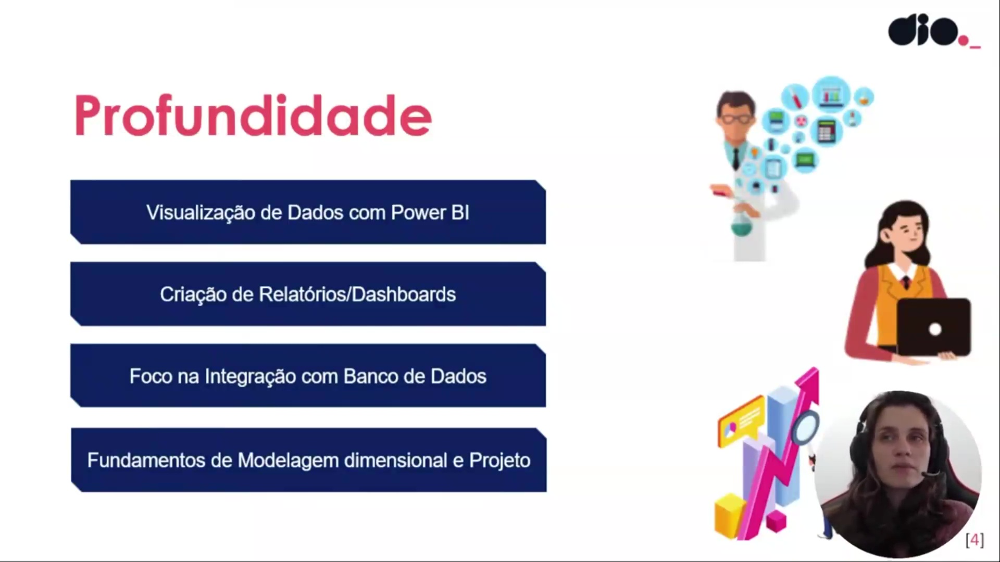
</p>

No que tange à profundidade técnica, o curso foca intensamente na **Visualização de Dados com Power BI**, priorizando a criação de relatórios e dashboards profissionais. Há uma ênfase especial na integração com bancos de dados e na introdução aos fundamentos de **Modelagem Dimensional**, essenciais para estruturar projetos de BI robustos.

<p align="center">
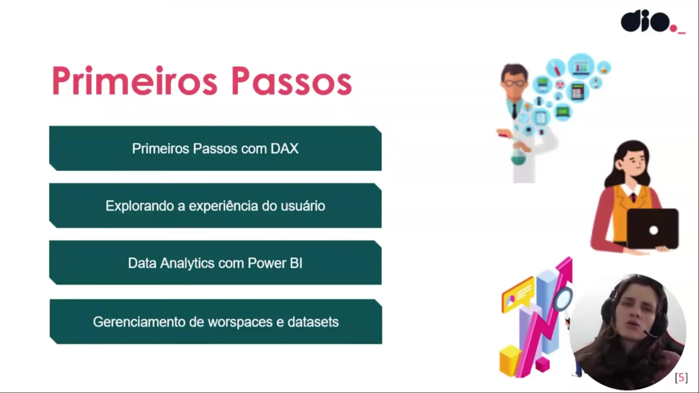
</p>

Os primeiros passos práticos envolvem o domínio da linguagem **DAX**, fundamental para cálculos avançados no Power BI. Complementarmente, a formação explora a **Experiência do Usuário (UX)** no design de interfaces, técnicas de **Data Analytics** e a parte administrativa de gerenciamento de **workspaces e datasets** dentro do serviço do Power BI.

<p align="center">

</p>

Esta formação é destinada a profissionais que precisam comunicar resultados visualmente, como analistas de dados, cientistas de dados e analistas de BI. A estrutura conta com **8 desafios de projeto** e aborda temas fundamentais alinhados ao exame de certificação **PL-300 da Microsoft**, servindo como uma base sólida para quem busca essa titulação oficial.      


### 🟩 Vídeo 02 - Conhecendo a Instrutora Juliana

<video width="60%" controls>
  <source src="000-Midia_e_Anexos/bootcamp_ntt_data-modulo.05-curso.01-video_02.webm" type="video/webm">
    Seu navegador não suporta vídeo HTML5.
</video>

link do vídeo: https://web.dio.me/track/engenharia-dados-python/course/fundamentos-de-business-intelligence-bi/learning/25454c64-07b0-47cd-98e9-d77aaf858dc6?autoplay=1

O vídeo apresenta a trajetória profissional e acadêmica de Juliana Mascarenhas, que atualmente atua como especialista em educação tecnológica na plataforma DIO. A palestrante compartilha sua transição de carreira, que começou no setor de telecomunicações e infraestrutura de redes até evoluir para a área de ciência de dados. Ela destaca sua formação sólida, incluindo um mestrado em modelagem computacional, e sua versatilidade no domínio de linguagens como Python, Java e C. Além de sua experiência técnica com Linux e gerenciamento de projetos, Juliana menciona sua atuação como criadora de conteúdo educacional no YouTube. Por fim, ela introduz os cursos que ministra, estabelecendo sua autoridade para guiar os alunos em formações voltadas para banco de dados e tecnologia.

### Anotações

#### Juliana Mascarenhas

<p align="center">

</p>

A instrutora Juliana Mascarenhas apresenta seu perfil profissional como Tech Education Specialist na DIO e cientista de dados. Com formação acadêmica sólida, ela possui mestrado em modelagem computacional pelo Laboratório Nacional de Computação Científica (LNCC), onde direcionou sua carreira para a ciência de dados através de um foco multidisciplinar. Além de sua atuação educacional, Juliana é desenvolvedora em linguagens como Java e Python, e mantém canais de produção de conteúdo técnico como o "Simplificando Redes" e "Simplificando Programação".

#### Trajetória Acadêmica e Profissional

<p align="center">

</p>

A trajetória de Juliana na tecnologia demonstra uma evolução contínua entre 2009 e 2023, evidenciando que a carreira no setor pode seguir caminhos não lineares:

* **2009 – 2011:** Início como Técnica de Telecomunicações pelo CEFET/RJ.
* **2011 – 2015:** Graduação em Engenharia da Computação pela UCP.
* **2017 – 2019:** Mestrado em Modelagem Computacional pelo LNCC.
* **2023:** Definição do objetivo de ingressar no doutorado.

#### Experiência com Tecnologias e Infraestrutura

<p align="center">
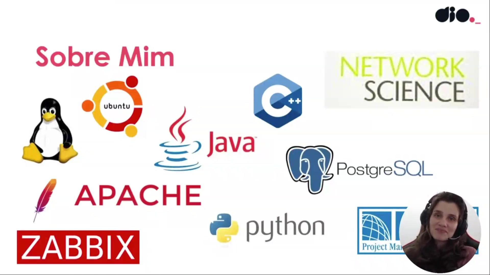
</p>

Ao longo de sua carreira, a instrutora acumulou experiência em um ecossistema diversificado de tecnologias, transitando entre o desenvolvimento e a infraestrutura. Seu histórico inclui o uso de sistemas operacionais Linux (notadamente Ubuntu), linguagens de programação como C++ e Java, além de sistemas de gerenciamento de banco de dados como PostgreSQL. Essa base técnica permitiu sua atuação em frentes variadas, desde a manipulação de código de baixo nível até a gestão de dados.

#### Especialização e Network Science

<p align="center">
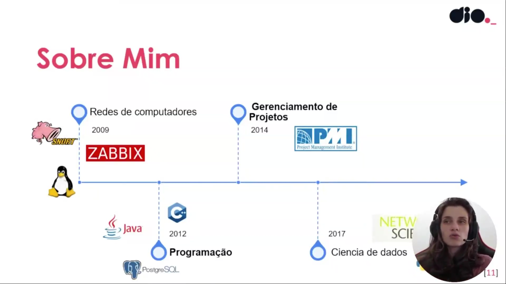
</p>

Além do desenvolvimento, a experiência da instrutora abrange a área de infraestrutura de redes e gestão, utilizando ferramentas como Zabbix e Apache, além de práticas baseadas nas diretrizes do Project Management Institute (PMI) para gerenciamento de projetos. Essa convergência de conhecimentos em redes, programação e dados culminou em sua especialização em **Network Data Science** (ou Network Science), um ramo específico da ciência de dados voltado para a análise de estruturas de rede.

#### Cursos e Formações na Plataforma

<p align="center">

</p>

Como parte do ecossistema de ensino da DIO, Juliana disponibiliza diversos cursos que cobrem desde fundamentos até tópicos avançados:

* **Introdução à Programação e Pensamento Computacional:** Curso base para iniciantes.
* **Protocolos de Comunicação:** Estudo de HTTP e Web Sockets.
* **Desenvolvimento Java:** Criação de APIs REST conectadas ao Amazon RDS e microsserviços de upload de imagens com Amazon S3.
* **Mensageria:** Implementação de Java Spring com RabbitMQ.
* **SQL:** Atuação na formação SQL Database Specialist.


### 🟩 Vídeo 03 - Pré-requisitos para melhor aproveitamento da Formação

<video width="60%" controls>
  <source src="000-Midia_e_Anexos/bootcamp_ntt_data-modulo.05-curso.01-video_03.webm" type="video/webm">
    Seu navegador não suporta vídeo HTML5.
</video>

link do vídeo: https://web.dio.me/track/engenharia-dados-python/course/fundamentos-de-business-intelligence-bi/learning/ce126fcb-dcaf-4a4d-8b40-6c8bc8cb0a80?autoplay=1

O vídeo consiste na **introdução de um treinamento especializado em Power BI**, onde o instrutor estabelece os critérios fundamentais para os alunos. O conteúdo assume que os participantes já possuem **domínio prévio em modelagem de dados relacional e linguagem SQL**, pois esses tópicos não serão ensinados do zero. Além disso, é necessário ter **conhecimento básico de Excel** e possuir uma **conta institucional ou estudantil** para acessar os recursos de publicação na nuvem. O foco central da capacitação será o uso prático da ferramenta de visualização, exigindo **proatividade e disposição para o aprendizado**. Ao definir essas diretrizes, o orador busca garantir que todos aproveitem a jornada técnica de forma eficiente e alinhada às expectativas.

### Anotações

<p align="center">
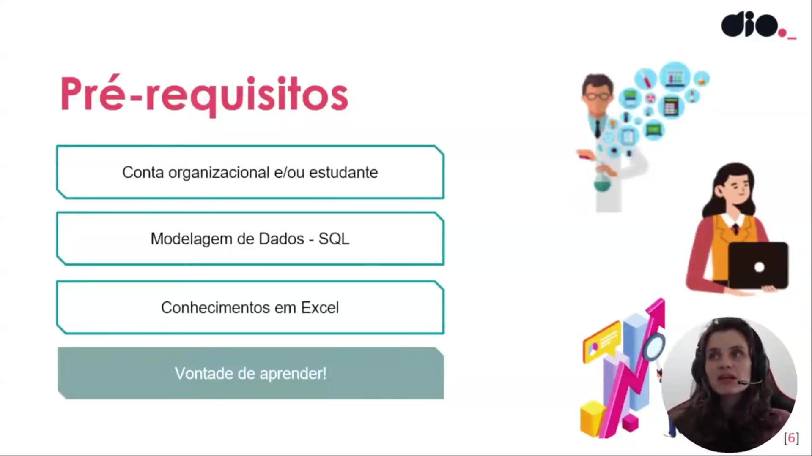
</p>

Nesta etapa da formação, são apresentados os **pré-requisitos** fundamentais para que o aluno consiga acompanhar e aproveitar ao máximo o conteúdo oferecido. Embora o curso seja acessível a qualquer pessoa, assume-se o domínio prévio de pilares técnicos específicos para garantir o fluxo da jornada de aprendizado:

* **Modelagem de Dados e SQL**: É necessário compreender a modelagem relacional tradicional e dominar a linguagem **SQL** para consultas em bancos de dados, uma vez que esses temas não serão explorados detalhadamente.
* **Conhecimentos em Excel**: A ferramenta será utilizada de forma prática durante as aulas, portanto, é esperado que o aluno já possua um conhecimento básico no software.
* **Power BI e Conta de Acesso**: O foco principal é o Power BI Desktop, mas para utilizar o **Power BI Serviço** e realizar a publicação de relatórios, o aluno deve obrigatoriamente possuir uma **conta organizacional ou estudantil**.
* **Atitude**: Além das competências técnicas, a **vontade de aprender** é destacada como o requisito essencial para o sucesso em toda a formação.


## Parte 2 - Fundamentos de Business Intelligence (BI)

### 🟩 Vídeo 04 - Breve descrição do que será abordado no Módulo

<video width="60%" controls>
  <source src="000-Midia_e_Anexos/bootcamp_ntt_data-modulo.05-curso.01-video_04.webm" type="video/webm">
    Seu navegador não suporta vídeo HTML5.
</video>

link do vídeo: https://web.dio.me/track/engenharia-dados-python/course/fundamentos-de-business-intelligence-bi/learning/f9eab4bb-272e-4dc4-bdfc-d10d1fff5931?autoplay=1

O vídeo introduz o módulo inicial da formação **PBI Analyst**, focada em estabelecer os **fundamentos de inteligência de dados**. O instrutor destaca que o curso capacita os alunos a utilizarem o **Power BI** e a linguagem **SQL** para solucionar problemas reais de negócios. Um ponto central da abordagem é o desenvolvimento do **pensamento analítico exploratório**, que permite ao profissional interpretar contextos e formular perguntas precisas antes de aplicar técnicas de extração. O conteúdo abrange temas essenciais como os processos de **ETL e ELT**, além de oferecer um primeiro contato prático com a instalação e uso da ferramenta de visualização da Microsoft. Ao longo das lições, os estudantes aprenderão a transformar **bancos de dados relacionais** em informações estratégicas para a tomada de decisão.

### Anotações
     
<p align="center">
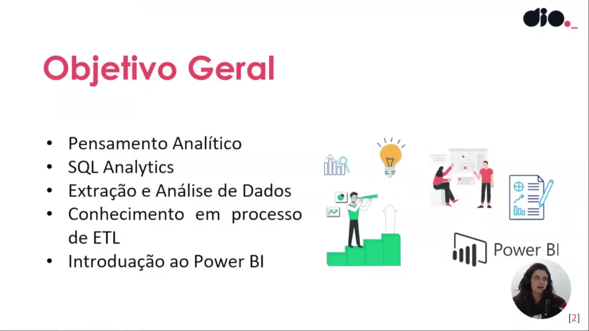
</p>

Nesta introdução à formação **PBI Analyst**, o foco inicial estabelece os **Fundamentos de Business Intelligence (BI)** e inteligência de dados. O objetivo é capacitar o profissional a realizar análises de dados robustas, utilizando o **Power BI** como ferramenta central, mas compreendendo que a base técnica exige o domínio de **bancos de dados relacionais** e a linguagem **SQL**.

O módulo destaca que a carreira em dados exige um **pensamento analítico exploratório** inerente. Diferente de outras áreas de TI, o profissional de dados deve priorizar o entendimento do contexto de negócio para determinar quais perguntas são relevantes antes de aplicar técnicas de extração.

A estrutura de aprendizado abrange os seguintes pilares:

* **SQL Analytics**: Utilização de consultas para inferir informações e responder perguntas de negócio diretamente na base de dados.
* **Processos de ETL e ELT**: Compreensão das diferenças fundamentais entre *Extract, Transform, Load* (ETL) e *Extract, Load, Transform* (ELT), conceitos essenciais para o tratamento de grandes volumes de dados.
* **Introdução ao Power BI**: Primeiro contato prático com o Power BI Desktop, focando na instalação e na afinidade com a ferramenta líder de mercado. 

### 🟩 Vídeo 05 - Contextualizando a área de dados

<video width="60%" controls>
  <source src="000-Midia_e_Anexos/bootcamp_ntt_data-modulo.05-curso.01-video_05.webm" type="video/webm">
    Seu navegador não suporta vídeo HTML5.
</video>

link do vídeo: https://web.dio.me/track/engenharia-dados-python/course/fundamentos-de-business-intelligence-bi/learning/5be21eed-93fb-4a41-8752-b3dde9a7bda2?autoplay=1

O vídeo introduz os conceitos fundamentais do **pensamento analítico** aplicado à área de dados, destacando como o **Business Intelligence (BI)** se diferencia de outras carreiras. O conteúdo explica que a evolução do **hardware** e o surgimento das **redes sociais** transformaram a maneira como informações são geradas e consumidas em diversos setores, como medicina e e-commerce. O autor enfatiza que, enquanto o **cientista de dados** foca em predições futuras, o analista de BI dedica-se principalmente à **análise descritiva** para monitorar a saúde dos negócios. Através de exemplos práticos, o texto demonstra que os dados são ativos valiosos capazes de gerar **insights estratégicos** e personalização de serviços. Por fim, discute-se como o paradigma do **Big Data** diversificou as profissões no setor, criando papéis específicos para engenheiros e analistas.

### Anotações

<p align="center">

</p>

Nesta etapa inicial, o curso introduz o conceito de **Pensamento Analítico voltado para Business Intelligence (BI)**. O objetivo é contextualizar a área de dados, explorando os diferentes perfis profissionais existentes e definindo o papel fundamental do analista de BI. Embora as nomenclaturas de "Analista de Dados" e "Analista de BI" possam parecer subjetivas ou semelhantes à primeira vista, a aula propõe diferenciar esses perfis com base na finalidade de suas análises e nas ferramentas utilizadas em seus respectivos fluxos de trabalho.

<p align="center">

</p>

A discussão avança para a motivação por trás do crescimento da área de dados. Atualmente, a geração de dados é onipresente: desde o uso de GPS e redes sociais até transações em e-commerce e aplicativos bancários. Ao interagir com esses sistemas, o usuário gera informações que podem ser armazenadas localmente ou enviadas para servidores, onde são processadas para oferecer serviços personalizados, como a aprovação de limites de crédito ou recomendações de produtos.

<p align="center">

</p>

Historicamente, entre a década de 90 e o início dos anos 2000, a maioria dos dados disponíveis era predominantemente baseada em texto. Esse cenário mudou drasticamente com o advento das redes sociais, que impulsionou a criação de tipos de dados mais pesados e complexos, como imagens e vídeos, exigindo novas formas de processamento e análise para extrair informações relevantes desse volume crescente de "Big Data".

<p align="center">
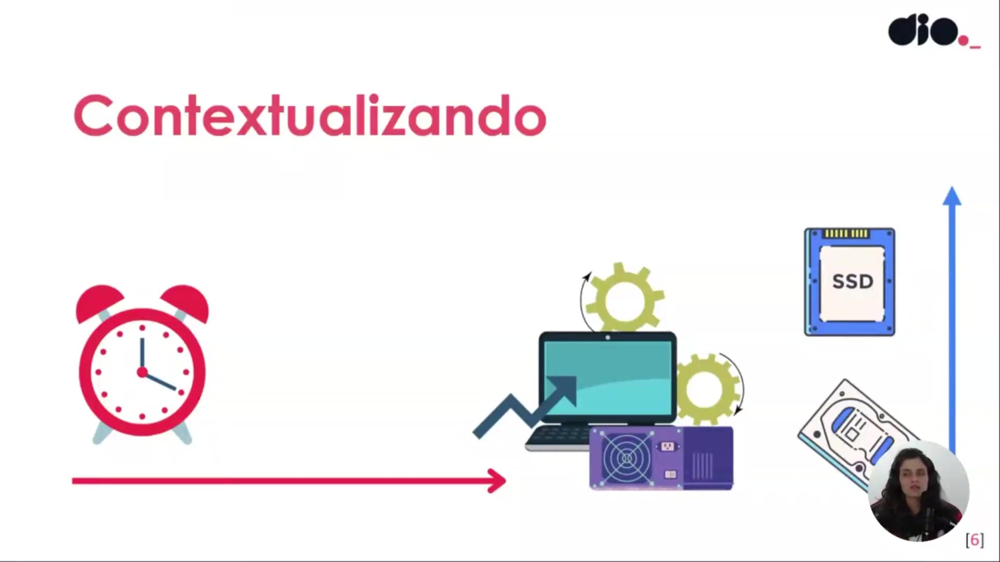
</p>

A evolução da computação é marcada por um ciclo onde o avanço do **hardware** (representado por componentes como SSDs e maior poder de processamento) fomenta a evolução do **software**. Comparando com a década de 90, onde os sites eram construídos em HTML básico, as aplicações modernas são extremamente robustas, utilizando recursos visuais e interativos que demandam maior largura de banda e capacidade computacional para aprimorar a experiência do usuário através de dados multimídia.

<p align="center">
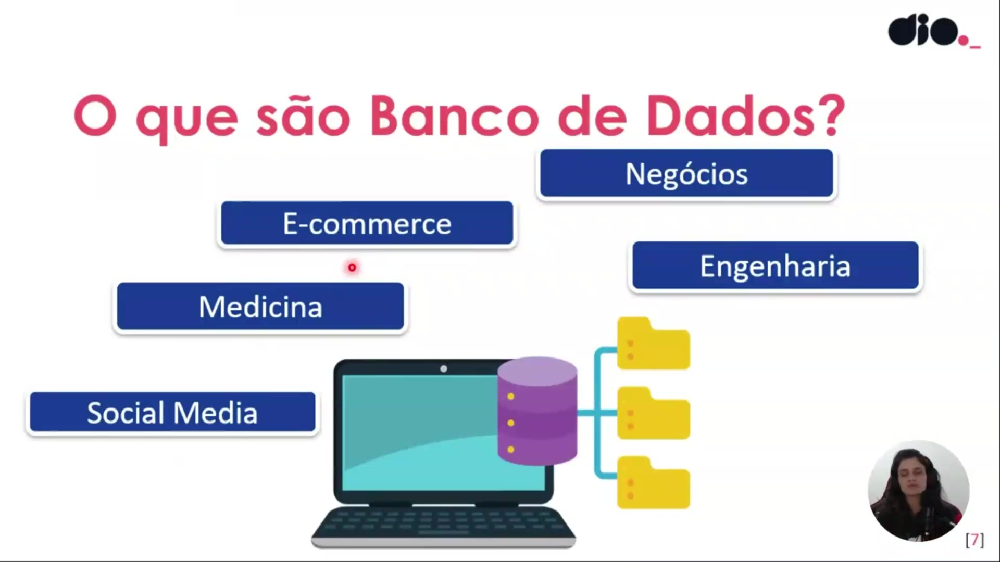
</p>

A aplicação de dados abrange diversos setores do conhecimento:

* **Medicina:** Utilizada para rastrear o histórico de pacientes e realizar predições de doenças baseadas em dados históricos (ramo voltado para a Ciência de Dados).
* **Negócios e E-commerce:** Foco em entender o comportamento do cliente e melhorar as vendas através da análise de padrões.
* **Engenharia e Social Media:** Uso intenso de dados para otimização de sistemas e interações.
Nesse contexto, destaca-se que o **Analista de BI** foca principalmente na **análise descritiva** (saúde atual do negócio), enquanto o Cientista de Dados foca em análises preditivas.

<p align="center">
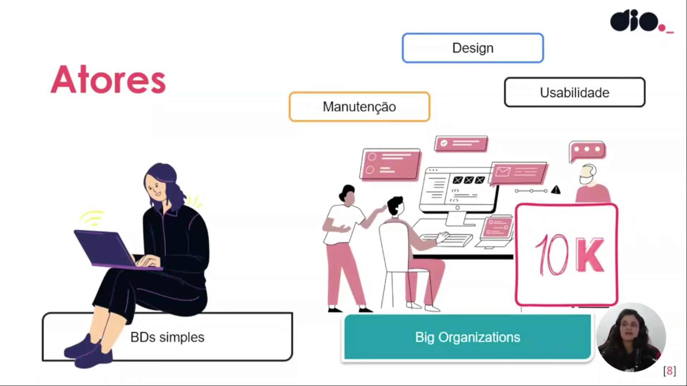
</p>

A organização das equipes de dados também evoluiu. Antigamente, o foco estava em atores lidando com **bancos de dados dedicados** e processos mais simples. Com o crescimento das empresas e o surgimento das grandes organizações, tornou-se necessária uma estrutura que envolve manutenção, design de sistemas e usabilidade para gerenciar o fluxo de informações de maneira estratégica.

<p align="center">
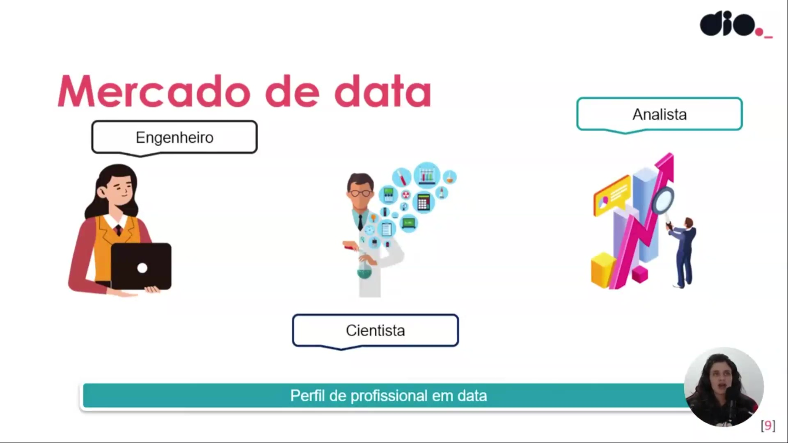
</p>

Com a consolidação do paradigma de **Big Data** e o uso de bancos de dados não-relacionais (NoSQL), o mercado de dados se diversificou em perfis profissionais específicos que atuam como atores chaves:

* **Engenheiro de Dados:** Responsável pela infraestrutura e preparação.
* **Cientista de Dados:** Focado em modelos estatísticos e predições futuras.
* **Analista de Dados/BI:** Focado em extrair insights para a tomada de decisão organizacional, unindo técnica e visão de negócio.      


### 🟩 Vídeo 06 - Principais Perfis na Carreira de Dados e BI

<video width="60%" controls>
  <source src="000-Midia_e_Anexos/bootcamp_ntt_data-modulo.05-curso.01-video_06.webm" type="video/webm">
    Seu navegador não suporta vídeo HTML5.
</video>

link do vídeo: https://web.dio.me/track/engenharia-dados-python/course/fundamentos-de-business-intelligence-bi/learning/0f4f5a54-5879-4323-a9f8-130708b5b9f0?autoplay=1

O material detalha as distinções fundamentais entre as principais **carreiras no ecossistema de dados**, explicando as funções específicas de cada profissional. O **engenheiro de dados** é apresentado como o arquiteto responsável pela infraestrutura e pelo fluxo de coleta e organização das informações brutas. Já o **cientista de dados** utiliza um viés investigativo e estatístico para descobrir padrões e realizar previsões complexas através de modelos de aprendizado de máquina. Por outro lado, o **analista de dados** foca na interpretação do negócio, criando visualizações e diagnósticos para auxiliar na tomada de decisão dos stakeholders. Por fim, o texto menciona brevemente o papel do **engenheiro de machine learning** na manutenção de modelos e introduz o conceito de **Business Intelligence** como o próximo tópico essencial.

### Anotações

#### Engenheiro de Dados

<p align="center">

</p>

O **Engenheiro de Dados** atua na base da pirâmide de dados, sendo o principal responsável pelo **desenho, construção e sustentação das soluções** que permitem o armazenamento e o gerenciamento das informações. Sua função central envolve a **extração de dados de fontes heterogêneas** (diversificadas), transformando esse material bruto para que possa ser efetivamente consumido por outros profissionais, como analistas e cientistas.

No dia a dia, este profissional lida com:

* **Sistemas de armazenamento:** Data Warehouses e bancos de dados relacionais e não relacionais.
* **Coleta e Fluxo:** Utilização de linguagens como Python para *web scrapping* e ferramentas de mensageria como Rabbit MQ e Kafka.
* **Processos de ETL:** Sigla para *Extract, Transform, Load* (Extrair, Transformar e Carregar), que define a ordem de execução para disponibilizar os dados.

#### Cientista de Dados

<p align="center">
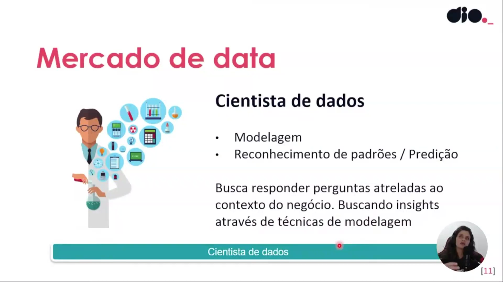
</p>

O **Cientista de Dados** possui um perfil mais voltado para a **pesquisa e modelagem estatística**. Diferente do engenheiro, seu foco está no **reconhecimento de padrões e na predição** de eventos futuros, buscando responder perguntas complexas atreladas ao contexto do negócio.

Este profissional utiliza uma "caixa de ferramentas" (*toolbox*) variada para encontrar *insights*:

* **Machine Learning:** O aprendizado de máquina é uma das principais ferramentas para criar modelos preditivos.
* **Técnicas Avançadas:** Uso de deduções estatísticas e *network data science* (análise de redes complexas).
* **Linguagens:** O foco principal de atuação e desenvolvimento é a linguagem Python.

#### Analista de Dados

<p align="center">
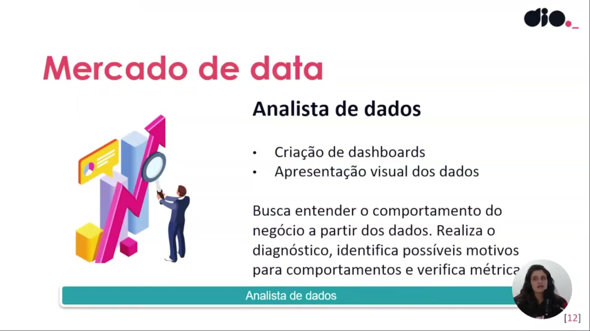
</p>

O **Analista de Dados** desempenha um papel fundamental na interpretação do **comportamento do negócio** através da observação histórica dos dados. Sua atuação é muito próxima ao conceito de BI (*Business Intelligence*), focando em transformar dados brutos em informações visuais compreensíveis para os tomadores de decisão (*stakeholders*).

Suas principais responsabilidades incluem:

* **Criação de Dashboards:** Desenvolvimento de painéis para apresentação visual e monitoramento de métricas.
* **Diagnóstico:** Identificação de possíveis motivos para determinados comportamentos do mercado ou do produto.
* **Métricas:** Verificação constante de indicadores de desempenho, como satisfação de usuários e saúde do negócio.

#### Perfil de Profissional em Data

<p align="center">
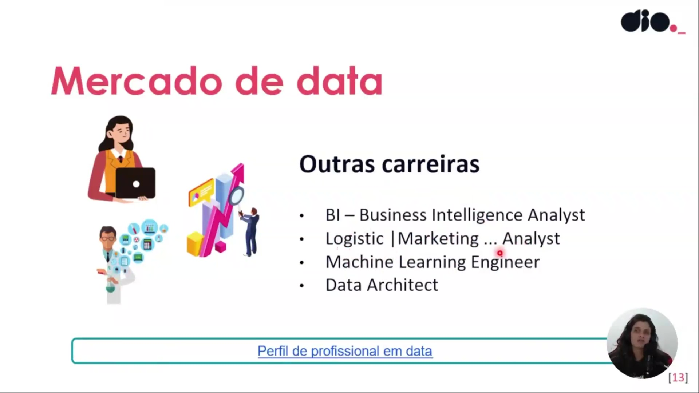
</p>

Além dos três pilares principais (Engenharia, Ciência e Análise), o mercado de dados oferece **outras carreiras especializadas** que se adaptam a diferentes necessidades organizacionais:

* **BI Analyst:** Focado estritamente em inteligência de negócio e relatórios estratégicos.
* **Analistas Setoriais:** Profissionais de áreas como Logística e Marketing que utilizam técnicas de análise de dados aplicadas aos seus nichos específicos.
* **Machine Learning Engineer:** Diferente do cientista, este engenheiro é focado em colocar os modelos em produção, garantindo que o sistema funcione em escala, realize manutenções e otimizações constantes.
* **Data Architect:** Profissional responsável pela estrutura de alto nível dos dados, muitas vezes mesclando competências da engenharia de dados.  


### 🟩 Vídeo 07 - BI e sua matéria prima: Dados

<video width="60%" controls>
  <source src="000-Midia_e_Anexos/bootcamp_ntt_data-modulo.05-curso.01-video_07.webm" type="video/webm">
    Seu navegador não suporta vídeo HTML5.
</video>

link do vídeo: https://web.dio.me/track/engenharia-dados-python/course/fundamentos-de-business-intelligence-bi/learning/57ad3abf-f1c7-4226-ab03-3c843c7b0bdd?autoplay=1

O vídeo diferencia os conceitos de **dados**, **informações** e **conhecimento** dentro de uma perspectiva analítica e profissional. O autor explica que **dados brutos** são desorganizados e carecem de valor imediato, exigindo um intenso processo de **limpeza e tratamento** por parte de especialistas. Uma vez refinados, esses dados transformam-se em **informações**, que fornecem contexto e permitem a compreensão de cenários específicos. A partir dessas informações, gera-se o **conhecimento**, etapa fundamental para que empresas abandonem meros palpites e adotem uma postura **orientada a dados**. Esse fluxo lógico possibilita a tomada de **decisões assertivas** e estratégicas em diversos setores do mercado.

### Anotações

<p align="center">
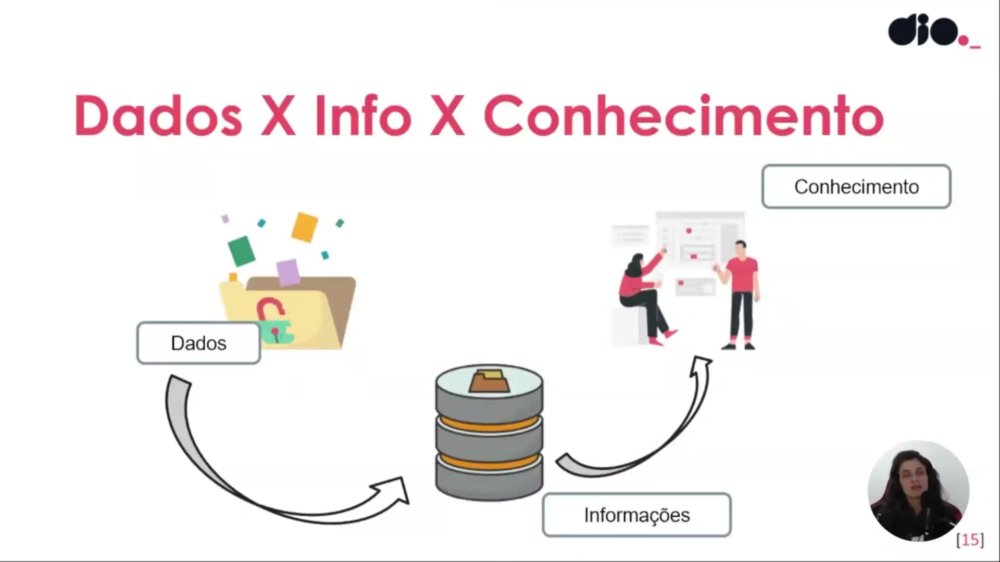
</p>

Esta imagem ilustra o fluxo de transformação de **Dados** brutos em **Informações**. À esquerda, os dados são representados como elementos desorganizados e dispersos, simbolizando estruturas que possuem um nível de organização em arquivos ou repositórios, mas que carecem de coerência ou relação entre si à primeira vista.

No centro, o ícone de um banco de dados representa a etapa de armazenamento e tratamento. Para que esses dados se tornem úteis, é necessário um processo de limpeza e lapidação, eliminando redundâncias ou lacunas. À direita, o resultado desse processo é a **Informação**, representada por figuras humanas interagindo com painéis organizados, indicando que os dados tratados agora possuem contexto e podem ser utilizados para formular perguntas e respostas.

<p align="center">
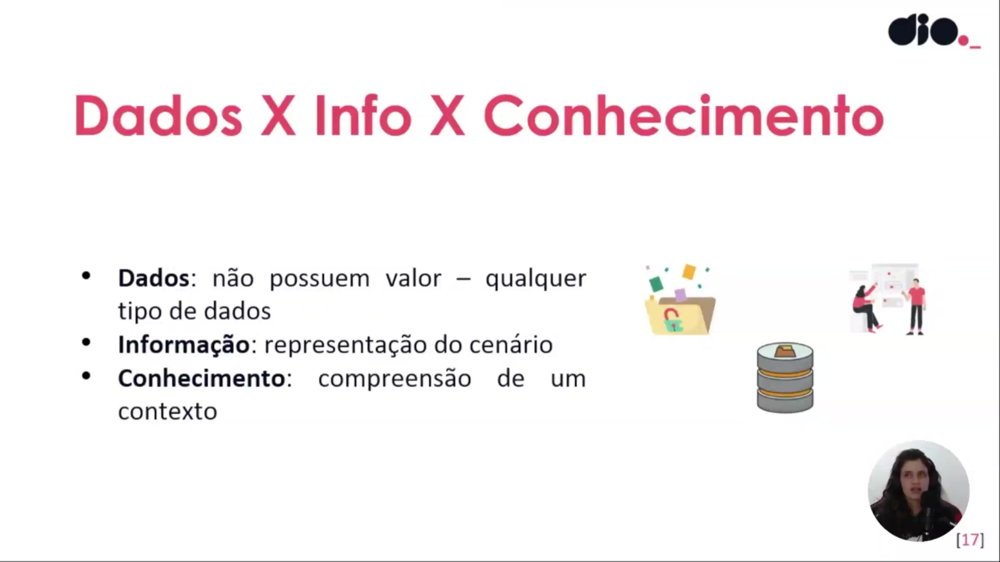
</p>

Nesta etapa, aprofundamos a distinção entre os três pilares da análise: **Dados**, **Informação** e **Conhecimento**.

* **Dados**: São descritos como elementos que não possuem valor por si sós, podendo ser qualquer tipo de dado bruto.
* **Informação**: É definida como a representação de um cenário, possuindo o poder de informar e permitir a compreensão da situação atual.
* **Conhecimento**: É a compreensão de um contexto, alcançada por meio da razão ou da experiência. O conhecimento permite a tomada de decisões assertivas e fundamentadas, fundamentando o cenário de decisões orientadas a dados (*data-driven*). É a capacidade humana de aprender e buscar a compreensão de algo novo.      


### 🟩 Vídeo 08 - Dados, Informação e Conhecimento

<video width="60%" controls>
  <source src="000-Midia_e_Anexos/bootcamp_ntt_data-modulo.05-curso.01-video_08.webm" type="video/webm">
    Seu navegador não suporta vídeo HTML5.
</video>

link do vídeo: https://web.dio.me/track/engenharia-dados-python/course/fundamentos-de-business-intelligence-bi/learning/2e2419d7-ec6a-49ff-962b-5b86d14c9060?autoplay=1

O vídeo aborda a **evolução humana** no registro e processamento de informações, destacando como o **storytelling** é uma ferramenta biológica poderosa para facilitar a **retenção de dados** e a tomada de decisões. O autor explica que a comunicação narrativa ativa áreas sensoriais do cérebro, transformando números abstratos em **conhecimento prático** e experiências memoráveis. Além disso, a fonte estabelece uma distinção clara entre **dados, informação e inteligência**, definindo esta última como a capacidade superior de **resolver problemas** inéditos através da abstração. Ao conectar sabedoria ancestral com a análise moderna, o conteúdo demonstra que o valor real dos dados surge quando eles são convertidos em **ações estratégicas** e aprendizado. Por fim, a narrativa enfatiza que a **inteligência** depende da integração mútua entre o conhecimento acumulado e as ferramentas disponíveis para gerar resultados efetivos.

### Anotações

<p align="center">

</p>

A evolução da humanidade está intrinsecamente ligada à forma como lidamos com os dados e o conhecimento ao longo do tempo. Historicamente, passamos por diversas formas de registro, desde a **escrita cuneiforme** em cerâmica até o uso de **papiros, mapas e o pagamento de impostos**, que já geravam volumes consideráveis de dados para a época.

Essa trajetória culminou na era digital, onde utilizamos **computadores** para processar uma quantidade massiva de informações. Um ponto crucial nessa evolução é o **storytelling**; nosso cérebro é biologicamente inclinado a absorver melhor informações quando estas são transmitidas através de narrativas, pois as histórias ativam sentidos e auxiliam na compreensão de contextos complexos, facilitando a memorização através de conexões semânticas e palavras-chave.

<p align="center">

</p>

Além da tríade de dados, informação e conhecimento, surge o conceito fundamental de **Inteligência**. Enquanto o conhecimento é o que extraímos da informação (como o fazendeiro que identifica uma praga ao observar o comportamento de uma folha), a inteligência é a **capacidade de resolução de problemas** e a **tomada de decisão** baseada nesse conhecimento.

A inteligência permite:

* **Abstração:** Identificar o "core" de um problema para aplicar soluções similares em cenários diferentes.
* **Adaptação:** Utilizar ferramentas, analogias e indução para resolver problemas desconhecidos.
* **Geração de Valor:** Através da união entre conhecimento e inteligência, torna-se possível tomar decisões estratégicas que alteram trajetórias e resolvem desafios de forma eficiente.      


### 🟩 Vídeo 09 - Fluxo de dados em BI

<video width="60%" controls>
  <source src="000-Midia_e_Anexos/bootcamp_ntt_data-modulo.05-curso.01-video_09.webm" type="video/webm">
    Seu navegador não suporta vídeo HTML5.
</video>

link do vídeo: https://web.dio.me/track/engenharia-dados-python/course/fundamentos-de-business-intelligence-bi/learning/c5c6aab6-e53e-460b-8e1d-e001df1a1d3f?autoplay=1

O vídeo apresenta o conceito fundamental de **Business Intelligence (BI)**, definindo-o como um conjunto de estratégias e ferramentas para converter **dados brutos em decisões inteligentes**. O autor descreve o fluxo essencial de transformação da informação e destaca que o objetivo central dessa área é gerar **insights estratégicos** para resolver problemas empresariais. Além disso, o conteúdo diferencia as funções de **analista de BI**, **cientista de dados** e **analista de dados**, baseando-se nas ferramentas utilizadas e no nível de proximidade com o setor de negócios. Enquanto o analista de dados foca em linguagens técnicas como **Python e R**, o profissional de BI atua como um mediador que equilibra o conhecimento técnico com a **visão de mercado**. Por fim, a fonte esclarece que o foco da formação mencionada é o domínio de ferramentas práticas, sem esgotar todas as complexas **regras de negócio**.

### Anotações

<p align="center">
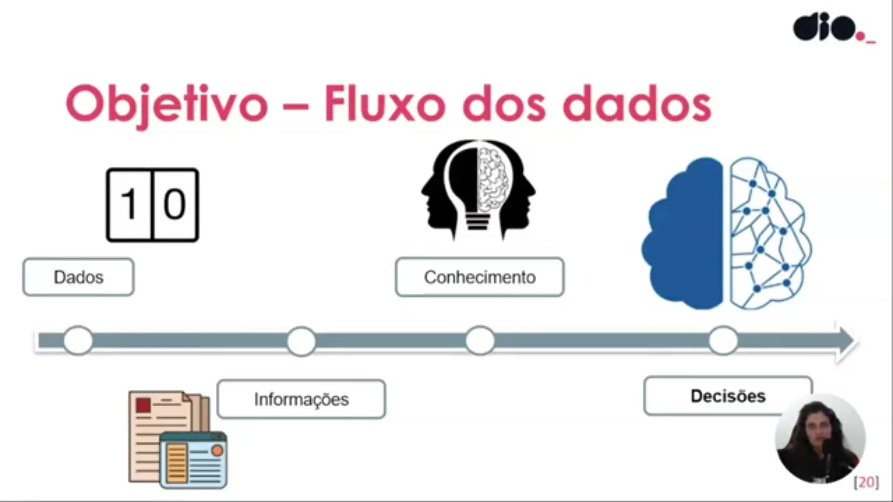
</p>

O objetivo central do trabalho com dados é transformar elementos brutos em ações concretas por meio de um fluxo estruturado. Esse processo, essencial para o analista de BI, percorre as seguintes etapas:

* **Dados:** Representam o insumo bruto (como sequências binárias ou valores isolados) que, sozinhos, não possuem valor prático. 
* **Informações:** Resultam do tratamento e organização dos dados, permitindo extrair os primeiros insights úteis. 
* **Conhecimento:** Surge quando as informações são contextualizadas dentro de uma situação específica, gerando compreensão sobre um cenário. 
* **Decisões:** É o estágio final onde se utiliza a inteligência para resolver problemas e definir estratégias baseadas em todo o fluxo anterior. 

<p align="center">
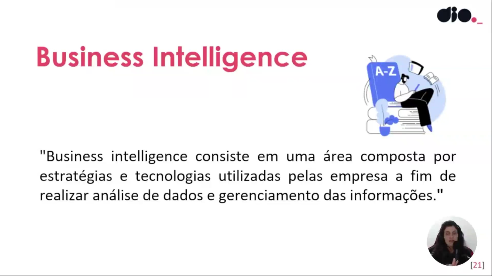
</p>

O **Business Intelligence (BI)** é definido como uma área estratégica que une tecnologia e processos para otimizar a gestão empresarial. Suas principais características incluem:

* **Composição:** É formada por um conjunto de estratégias e tecnologias específicas. 
* **Finalidade:** O foco principal é a realização de análise de dados rigorosa e o gerenciamento eficiente das informações da organização. 
* **Posicionamento:** O profissional de BI atua como um mediador, posicionando-se entre o analista de negócios e o analista de dados, possuindo um viés muito forte voltado para estratégias de mercado. 

Conforme descrito no conceito fundamental:

> "Business intelligence consiste em uma área composta por estratégias e tecnologias utilizadas pelas empresa a fim de realizar análise de dados e gerenciamento das informações." 
> 
> 


### 🟩 Vídeo 10 - O que é Business Intelligence?

<video width="60%" controls>
  <source src="000-Midia_e_Anexos/bootcamp_ntt_data-modulo.05-curso.01-video_10.webm" type="video/webm">
    Seu navegador não suporta vídeo HTML5.
</video>

link do vídeo: https://web.dio.me/track/engenharia-dados-python/course/fundamentos-de-business-intelligence-bi/learning/3be6f289-999b-40ea-bd6a-63b5be59d9ac?autoplay=1

O vídeo apresenta o conceito de **Business Intelligence (BI)**, definindo-o como o processo de transformar dados brutos em **conhecimento estratégico** para otimizar operações e aumentar a competitividade empresarial. A autora explica que a área evoluiu de simples **relatórios estáticos** para análises interativas e preditivas que utilizam **Machine Learning** para entender o comportamento do cliente. Um ponto central da discussão é a capacidade de **interligar métricas distintas** para gerar insights valiosos que fundamentam a tomada de decisão. O conteúdo também aborda a convergência entre o BI tradicional e o paradigma do **Big Data**, destacando a importância de lidar com grandes volumes e variedades de informações. Por fim, são mencionadas ferramentas essenciais do mercado, como o **Power BI e Tableau**, que facilitam a integração e visualização desses dados complexos.

### Anotações

<p align="center">
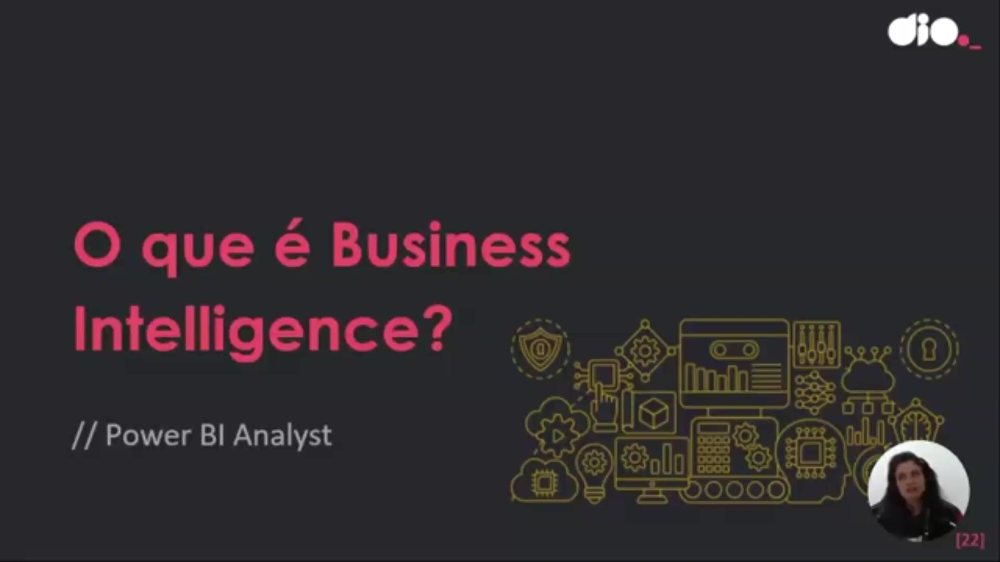
</p>

O **Business Intelligence (BI)** fundamenta-se em um fluxo contínuo de valor que transforma dados brutos em inteligência para o negócio. Esse processo percorre as etapas de **Dados, Informação, Conhecimento e Inteligência**, com o objetivo final de subsidiar a **tomada de decisões** assertivas. O foco central do BI é a melhoria das operações cotidianas e a saúde geral da empresa, utilizando fatores conhecidos e explorando variáveis desconhecidas para otimizar os resultados.

<p align="center">
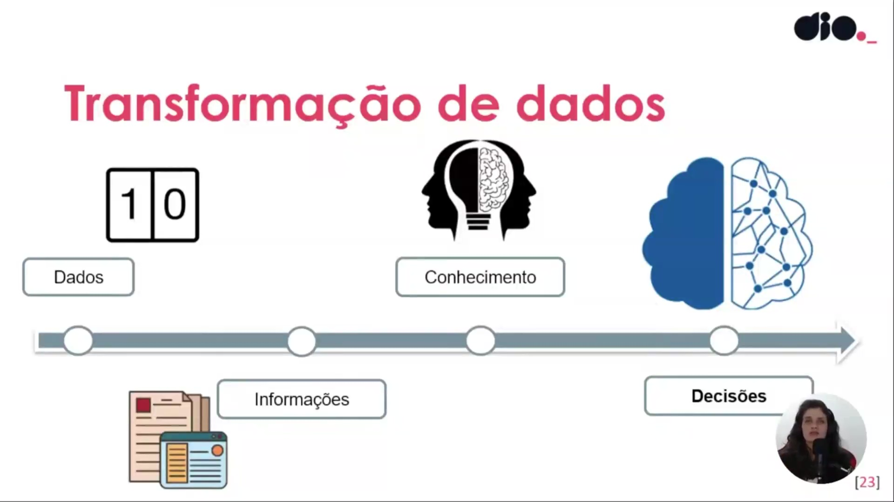
</p>

No âmbito estratégico, o BI visa o fortalecimento da organização através da **melhoria operacional**. Ao aplicar suas técnicas, a empresa busca **aumentar os lucros** e consolidar uma **vantagem competitiva** sustentável perante os concorrentes do mesmo setor.

<p align="center">
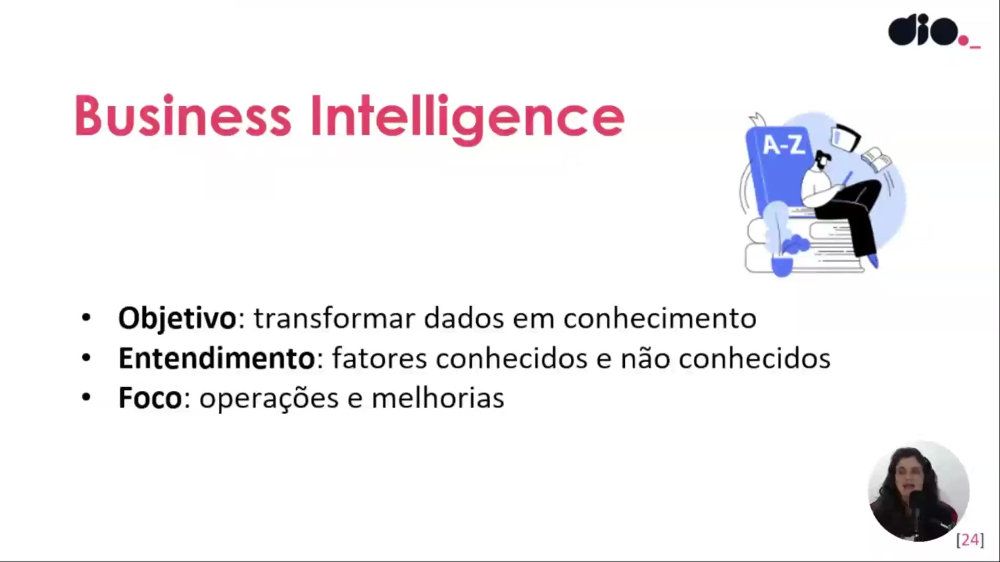
</p>

Historicamente, o BI passou por uma evolução significativa. Em seus estágios iniciais, a área limitava-se a gerar **relatórios simples** e diretos — conhecidos como *snapshots* — que ofereciam apenas uma visão generalista e estática do panorama da empresa naquele exato momento.

<p align="center">
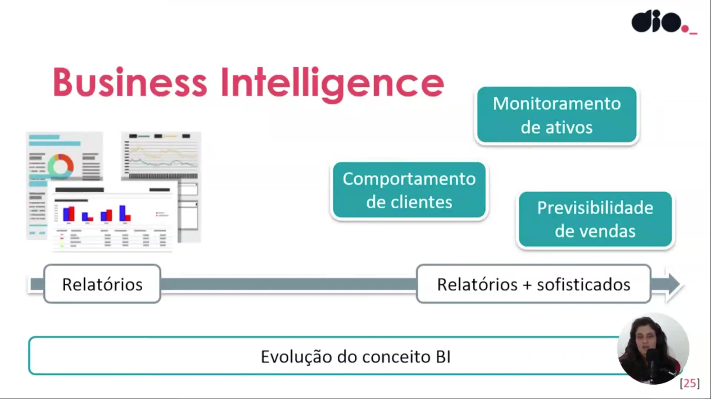
</p>

Com o avanço tecnológico, o BI tornou-se mais sofisticado, incorporando **análises interativas** e ativas. Atualmente, é possível monitorar o **comportamento de clientes**, realizar o acompanhamento de ativos e utilizar **Machine Learning** para a **previsibilidade de vendas**, indo muito além da mera visualização de dados passados.

<p align="center">
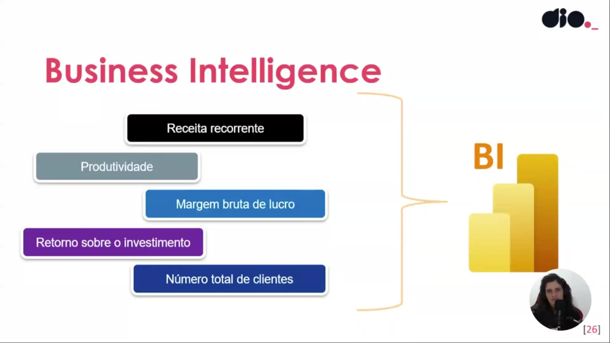
</p>

O diferencial estratégico do Business Intelligence reside na **combinação de métricas independentes**. Embora dados como receita recorrente, margem bruta, ROI e satisfação do cliente possam ser extraídos individualmente de forma tradicional, o BI os interliga de maneira coerente. Essa conexão entre métricas aparentemente distintas revela informações úteis e gera conhecimento crítico para o negócio.

<p align="center">
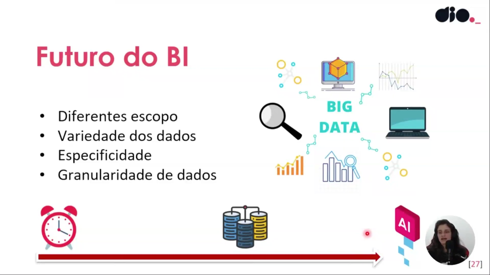
</p>

Para gerenciar esse volume de informações, utilizam-se ferramentas de orquestração e integração que permitem lidar com diferentes níveis de detalhamento dos dados (**granularidade**). Sistemas de gerenciamento como o **DBeaver** facilitam a conexão com ecossistemas de dados robustos.

```sql
-- Exemplo de interface de gerenciamento de dados mencionada (DBeaver)
-- Permite a integração com diferentes fontes e tecnologias de Big Data
SELECT * FROM vendas_previsibilidade;

```

<p align="center">
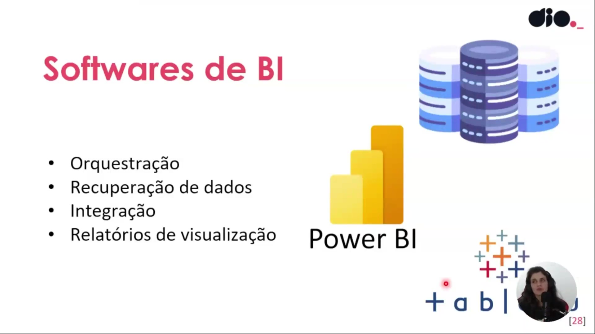
</p>

O novo paradigma da área associa o **BI ao Big Data**. Embora a exposição final para o usuário mude pouco, a infraestrutura de coleta e processamento é transformada pela integração com tecnologias como **R, Spark e Hadoop**, permitindo análises descritivas e preditivas muito mais potentes. No mercado atual, ferramentas como **Power BI** e **Tableau** lideram essa integração.

<p align="center">
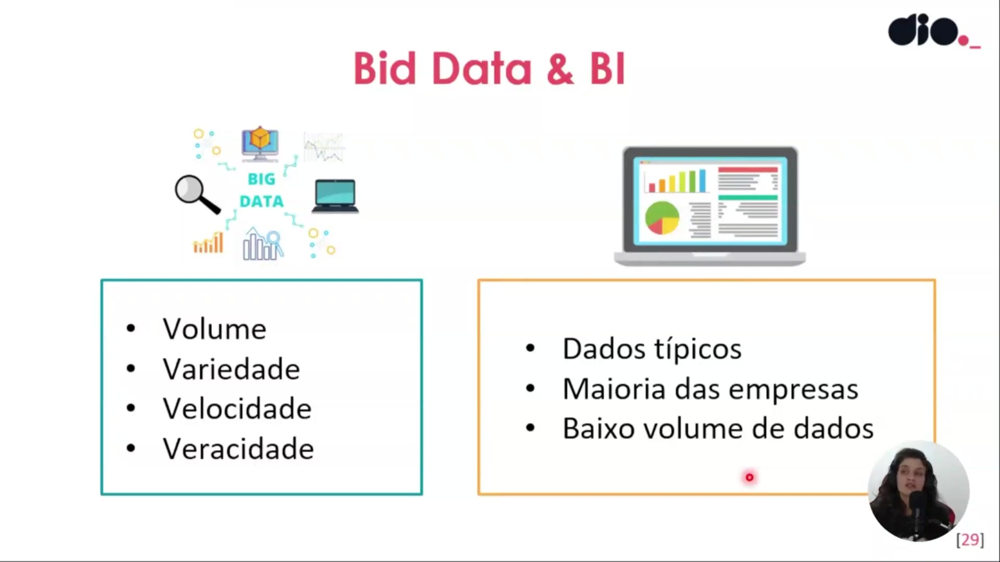
</p>

A transição do BI tradicional para o contexto de Big Data é definida pelos pilares conhecidos como os "Vs": **Volume, Variedade, Velocidade e Veracidade**. A convergência desses elementos resulta na geração de **Valor** real para a empresa, permitindo que o BI moderno lide com grandes massas de dados de forma eficiente e estratégica.      


### 🟩 Vídeo 11 - Tipos de Análises em BI

<video width="60%" controls>
  <source src="000-Midia_e_Anexos/bootcamp_ntt_data-modulo.05-curso.01-video_11.webm" type="video/webm">
    Seu navegador não suporta vídeo HTML5.
</video>

link do vídeo: https://web.dio.me/track/engenharia-dados-python/course/fundamentos-de-business-intelligence-bi/learning/cc3e830a-9ada-4614-9832-ae5f9f0a7f39?autoplay=1

O vídeo apresenta os quatro pilares fundamentais da **análise de dados**, diferenciando as abordagens de **Business Intelligence (BI)** e **Ciência de Dados**. A **análise descritiva** foca em relatar o que aconteceu no passado, enquanto a **análise diagnóstica** busca identificar as causas desses eventos através de relações de probabilidade. Já voltadas para o futuro, a **análise preditiva** utiliza tendências para projetar o que deve ocorrer e a **análise prescritiva** sugere estratégias práticas para otimizar resultados ou solucionar problemas. A fonte reforça que o sucesso dessas técnicas depende de **identificar claramente o problema de negócio** e entender o contexto antes de aplicar métricas. Por fim, o autor destaca que, embora o processamento de dados tenha evoluído, a necessidade de **gerar perguntas coerentes** para extrair informações valiosas permanece essencial.

### Anotações

<p align="center">
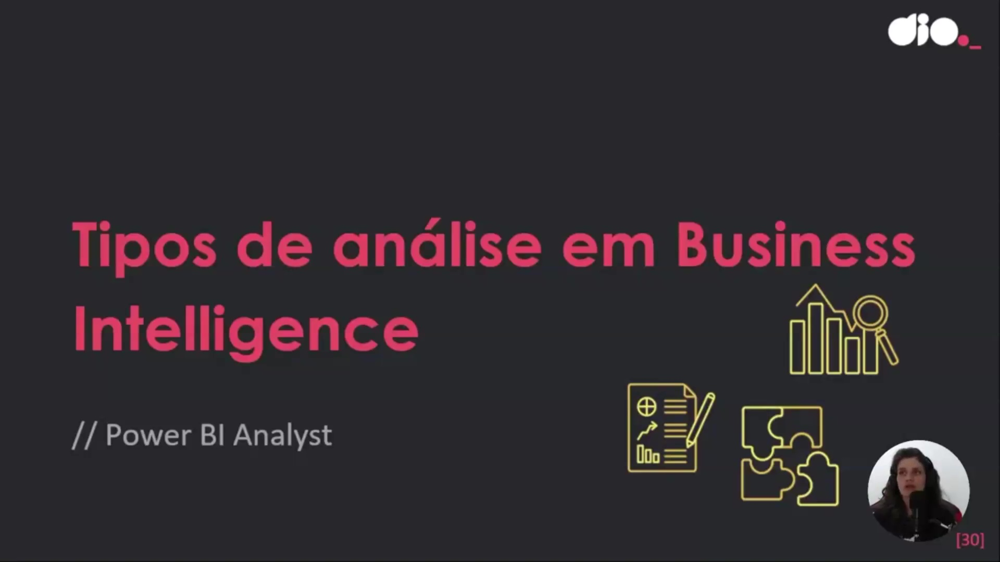
</p>

No campo da análise de dados e Business Intelligence (BI), existem quatro pilares fundamentais que orientam o tratamento das informações. A jornada se inicia com a **Análise Descritiva**, que é o estágio inicial e essencial para qualquer projeto.

A análise descritiva tem como objetivo:

* **Descrever e caracterizar** um contexto específico.
* Entender o **comportamento dos dados** através da sumarização.
* Fornecer uma visão clara do que está acontecendo no momento ou o que já aconteceu no conjunto de dados.

<p align="center">
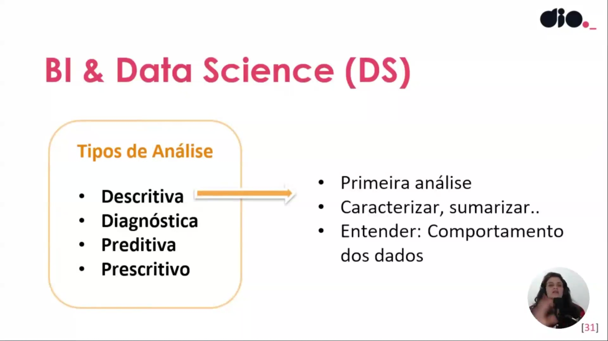
</p>

Avançando na complexidade, encontramos a **Análise Diagnóstica**. Para compreender sua função, pode-se utilizar a analogia de uma consulta médica: após uma análise descritiva inicial (exames preliminares), o foco passa a ser o diagnóstico detalhado da situação atual baseando-se no histórico disponível. Esta etapa não foca ainda no tratamento, mas sim na compreensão profunda do estado presente dos dados.

<p align="center">
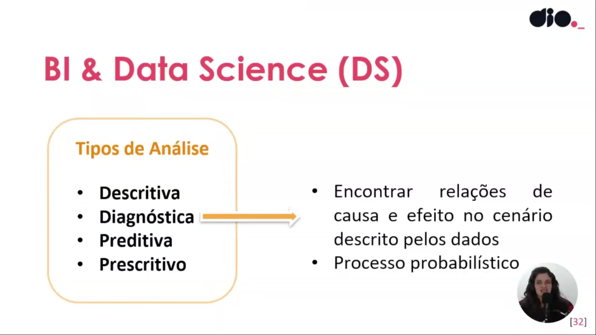
</p>

O objetivo central da análise diagnóstica é estabelecer **relações de causa e efeito**. Trata-se de um processo probabilístico onde se busca identificar qual causa gerou um efeito específico no cenário analisado. Diferente da simples descrição, aqui o analista busca os porquês por trás dos padrões encontrados nos dados passados.

<p align="center">
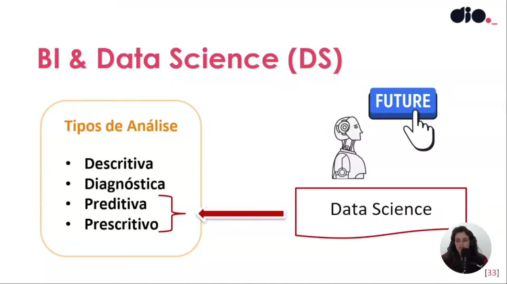
</p>

Enquanto as análises descritiva e diagnóstica são consideradas abordagens tradicionais de BI (utilizadas há décadas), a evolução da computação, do **Big Data** e do processamento paralelo permitiu o surgimento de novas frentes: as análises **Preditiva** e **Prescritiva**. A grande diferença reside no horizonte temporal: enquanto as tradicionais olham para o passado, as novas abordagens focam em entender e influenciar o futuro.

<p align="center">
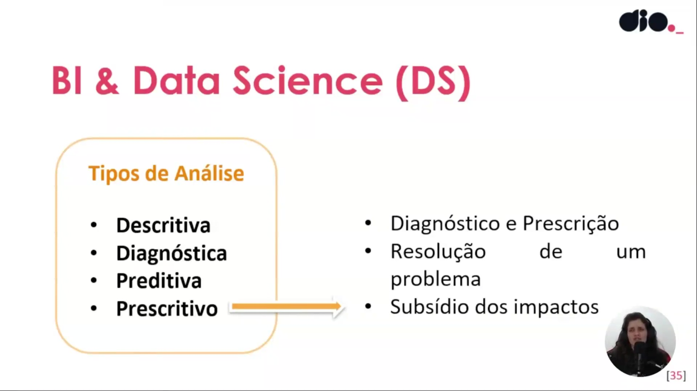
</p>

A **Análise Preditiva** é uma característica marcante da ciência de dados. Seu foco está em tentar prever cenários futuros e identificar **tendências**. Através dela, busca-se responder perguntas como: "Quanto venderemos no próximo mês?", utilizando a probabilidade para estimar a chance de determinados eventos ocorrerem com base no que já se conhece.

<p align="center">
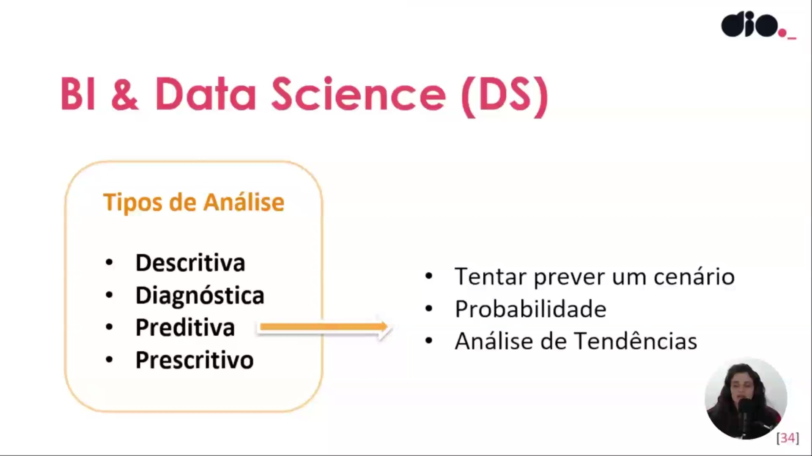
</p>

A **Análise Prescritiva** surge como a evolução final do processo. Partindo do diagnóstico de um problema, ela prescreve a solução. Seu foco é a **resolução de problemas** e a geração de impactos positivos na saúde da empresa. Ela permite identificar as ações necessárias para reverter cenários desfavoráveis ou alavancar vendas, criando roteiros de atuação e otimizando fluxos de trabalho.

<p align="center">
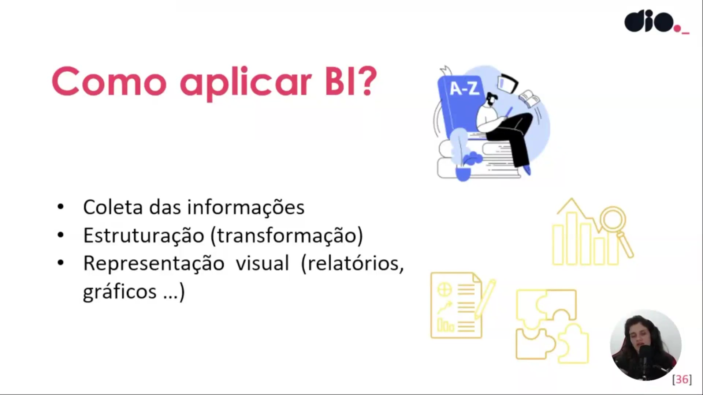
</p>

A aplicação prática do Business Intelligence envolve um fluxo técnico estruturado conhecido como **ETL (Extração, Transformação e Carga)**. Este processo consiste em:

1. **Extração**: Coletar os dados de diversas fontes.
2. **Transformação**: Estruturar e limpar as informações coletadas.
3. **Carga (Load)**: Carregar os dados prontos para serem representados visualmente para análise.

<p align="center">
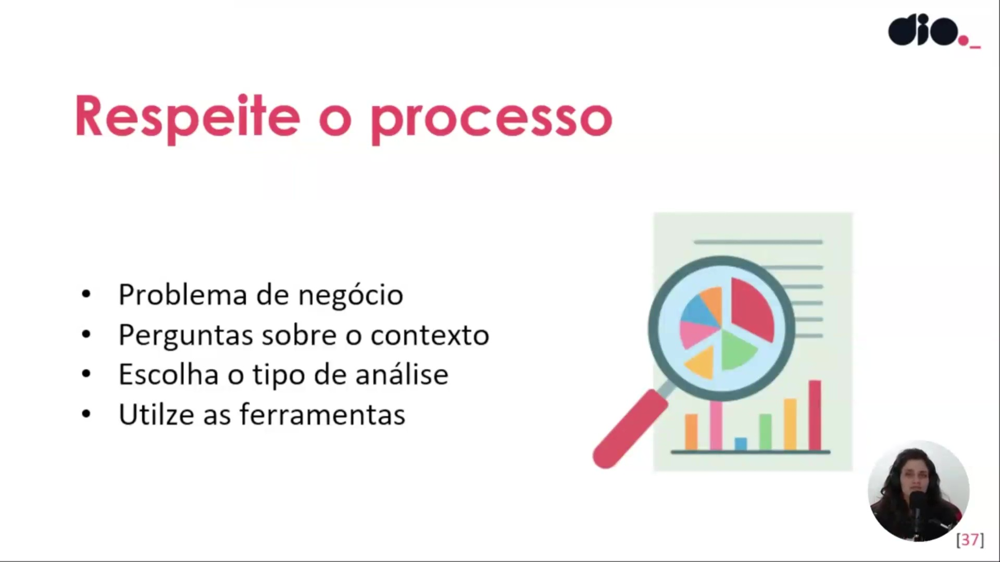
</p>

Para o sucesso de uma estratégia de BI, é fundamental seguir um processo metodológico antes de aplicar qualquer modelo:

* **Identificar o problema de negócio** de forma clara.
* **Entender o contexto** e a natureza dos dados disponíveis.
* **Elaborar perguntas coerentes** primeiro, para só então buscar as respostas nos dados. Extrair dados sem um propósito ou sem perguntas prévias compromete a eficiência da análise.

<p align="center">

</p>

Em resumo, as diferenças fundamentais entre os tipos de análise podem ser sintetizadas da seguinte forma:

| Tipo de Análise | Foco da Pergunta |
| --- | --- |
| **Descritiva** | O que aconteceu? |
| **Diagnóstica** | Por que aconteceu? |
| **Preditiva** | O que vai acontecer? |
| **Prescritiva** | O que eu vou fazer? |      


### 🟩 Vídeo 12 - Análise de Dados e Big Data

<video width="60%" controls>
  <source src="000-Midia_e_Anexos/bootcamp_ntt_data-modulo.05-curso.01-video_12.webm" type="video/webm">
    Seu navegador não suporta vídeo HTML5.
</video>

link do vídeo: https://web.dio.me/track/engenharia-dados-python/course/fundamentos-de-business-intelligence-bi/learning/58c1f5ef-0e13-4182-bc4e-1012ecc91ee8?autoplay=1

O vídeo aborda a transição do paradigma de dados tradicionais para o conceito de **Big Data**, destacando como a evolução do **hardware** permitiu o surgimento de softwares capazes de processar grandes volumes de informações. O autor detalha os **cinco Vs** (volume, velocidade, variedade, veracidade e valor), explicando que, enquanto dados estruturados seguem modelos rígidos, os **dados não estruturados** demandam novas tecnologias de armazenamento, como os **Data Lakes**. Ferramentas modernas, como **Power BI**, Spark e Hadoop, são apresentadas como soluções essenciais para integrar essas fontes heterogêneas e converter dados complexos em análises úteis. O foco principal reside na distinção entre os processos de **coleta e tratamento (ETL)**, embora as técnicas de visualização final permaneçam semelhantes para ambos os tipos de dados. Por fim, a fonte reforça que o objetivo da análise de dados, independentemente da escala, é sempre gerar **insights estratégicos** que resolvam problemas específicos do negócio.

### Anotações

<p align="center">
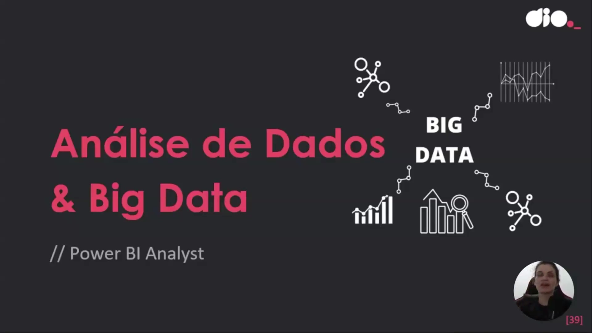
</p>

O curso introduz a relação entre a análise de dados e o paradigma de Big Data, focando em como o poder computacional moderno e a evolução do hardware permitiram o surgimento de softwares mais potentes. Esta etapa inicial estabelece a base para o papel do Analista de Power BI em um cenário onde grandes volumes de informações são gerados constantemente por redes sociais e serviços digitais.

<p align="center">

</p>

A contextualização histórica demonstra que a evolução do hardware, exemplificada pela transição para tecnologias como o SSD, foi o motor para o desenvolvimento de softwares capazes de lidar com diversos tipos de dados (texto, vídeo, imagem). Esse avanço possibilitou o processamento de grandes quantidades de informação em alta velocidade, característica central do Big Data.

<p align="center">
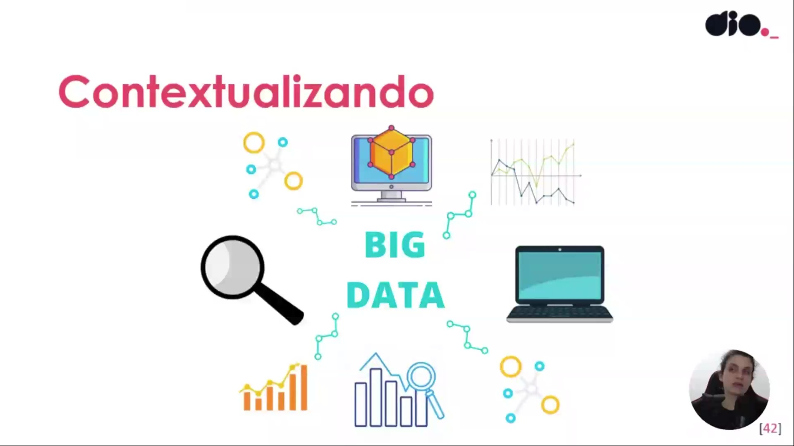
</p>

O conceito de Big Data é definido pelos seus pilares fundamentais, conhecidos como os Vs do Big Data: Volume, Velocidade e Variedade. Adicionalmente, destacam-se a Veracidade dos dados e o Valor gerado a partir deles, que compõem o paradigma necessário para transformar dados brutos em insights estratégicos para os clientes.

<p align="center">
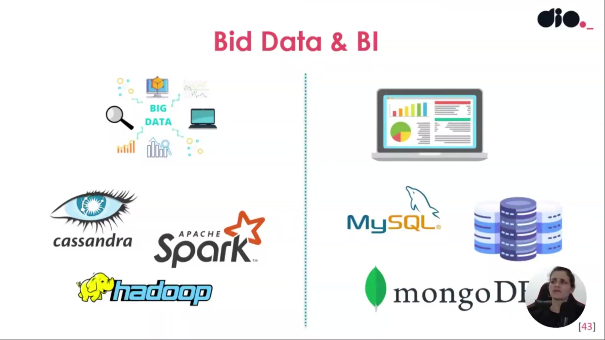
</p>

A integração entre Big Data e Business Intelligence (BI) envolve um ecossistema de ferramentas variadas. Enquanto bancos de dados tradicionais utilizam sistemas relacionais como o MySQL, o ambiente de Big Data exige tecnologias especializadas para processamento em larga escala e armazenamento flexível, como Apache Spark, Hadoop, Cassandra e MongoDB.

<p align="center">
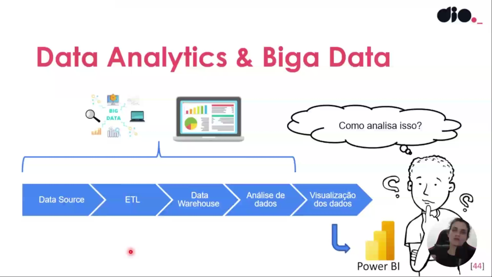
</p>

O fluxo de análise de dados moderno percorre diversas etapas fundamentais. O processo inicia na fonte dos dados (Data Source), passa pelo ETL (Extração, Transformação e Carga) e pelo armazenamento em um Data Warehouse. A partir daí, os dados são submetidos à análise para, finalmente, serem apresentados visualmente através de ferramentas de visualização como o Power BI.

<p align="center">

</p>

Dados não estruturados representam o grande desafio e oportunidade do Big Data. Diferente dos bancos de dados tradicionais que possuem estruturas rígidas e restrições (constraints) bem definidas, os dados não estruturados vêm de fontes heterogêneas, como logs de sistemas, sensores de IoT e redes sociais, exigindo o uso de Data Lakes para preencher a lacuna de armazenamento de formatos variados.

<p align="center">
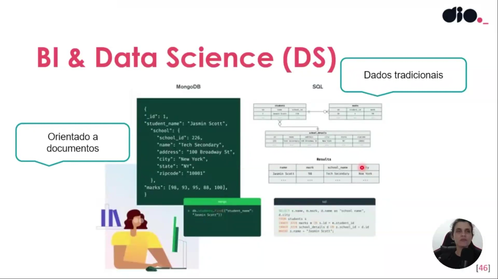
</p>

Para ilustrar a diferença entre os modelos, apresenta-se o formato orientado a documentos, comumente utilizado em bancos de dados NoSQL como o MongoDB. Este modelo utiliza a estrutura JSON, que permite uma organização flexível e aninhada de informações, em contraste com a estrutura de tabelas fixas do SQL tradicional.

```json
{
  "id": 16,
  "student name": "Jasmin Scott",
  "school": {
    "school id": 226,
    "name": "Tech Secondary",
    "address": "100 Broadway St",
    "city": "New York",
    "state": "NY",
    "zipcode": "10001"
  },
  "marks": [98, 93, 95, 85, 100]
}

```

<p align="center">
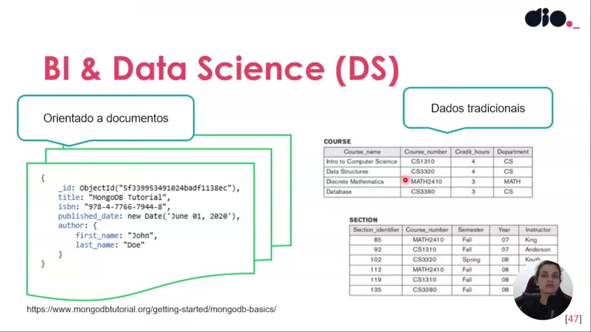
</p>

Os dados podem estar armazenados em diversas extensões de arquivos, como CSV, JSON e Parquet. Abaixo, exemplos de como a mesma informação pode ser representada em um formato orientado a documentos (JSON) e em um formato tabular tradicional (CSV).

```json
{
  "_id": ObjectId("5f339953491024badf1138ec"),
  "title": "MongoDB Tutorial",
  "isbn": "978-4-7766-7944-8",
  "published_date": new Date('June 01, 2020'),
  "author": {
    "first_name": "John",
    "last_name": "Doe"
  }
}

```

```csv
"Course name","Course number","Credit hours","Department"
"Intro to Computer Science","CS1310","4","CS"
"Data Structures","CS3320","4","CS"
"Discrete Mathematics","MATH2410","3","MATH"
"Database","CS3380","3","CS"

```

<p align="center">
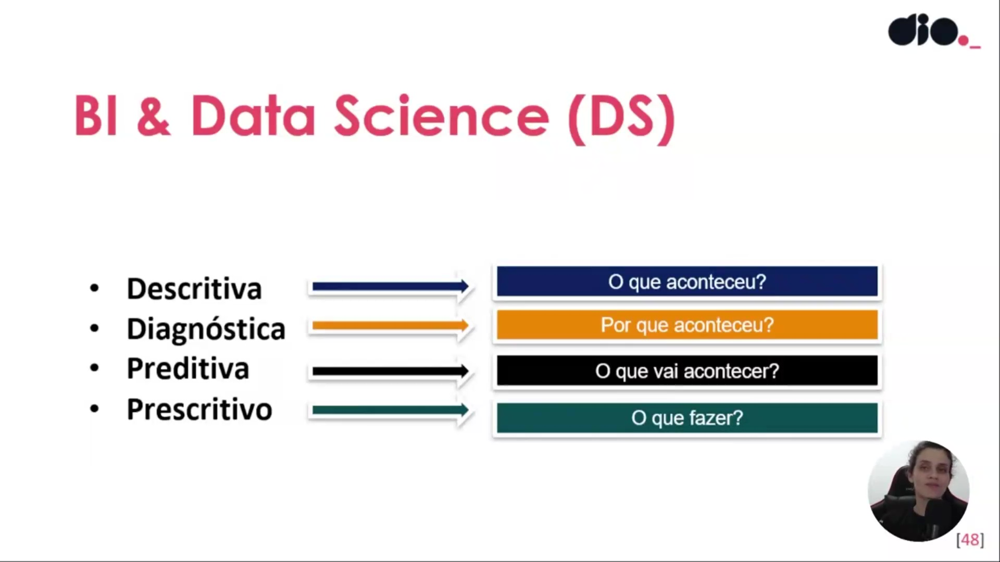
</p>

Independentemente da tecnologia (Big Data ou tradicional), os tipos de análise de dados seguem quatro níveis fundamentais que guiam o processo de decisão:

* **Descritiva:** Focada em entender o que aconteceu.
* **Diagnóstica:** Busca explicar por que determinado evento ocorreu.
* **Preditiva:** Utiliza os dados para prever o que pode acontecer no futuro.
* **Prescritiva:** Determina as ações que devem ser tomadas com base nas análises anteriores.      

# Certificado: Fundamentos de Business Intelligence (BI)

- Link na plataforma: 
- Certificado em pdf: 
