## Instrutor:

- Juliana Mascarenhas (Tech Education Specialist / Sócia (Content Creator) @SimplificandoRedes / Me Modelagem Computacional / Cientista de dados)
- Contato Linkedin: / [juliana-mascarenhas-ds](https://www.linkedin.com/in/juliana-mascarenhas-ds/)

## Parte 1 - Introdução a Análise de Dados com SQL

### 🟩 Vídeo 01 - Considerações sobre SQL – Ferramenta de todo BI Analyst

<video width="60%" controls>
  <source src="000-Midia_e_Anexos/bootcamp_ntt_data-modulo.05-curso.02-video_01.webm" type="video/webm">
    Seu navegador não suporta vídeo HTML5.
</video>

link do vídeo: https://web.dio.me/track/engenharia-dados-python/course/introducao-a-analise-de-dados-com-sql/learning/a9ab1473-a2f1-4e7c-a832-6f758ce1ee21?autoplay=1

Este conteúdo encerra um módulo sobre MySQL, destacando a importância da cláusula `WHERE` para a precisão em consultas, atualizações e exclusões de dados. O instrutor reforça a utilização de IDs únicos como boa prática para evitar ambiguidades e revisa conceitos de junção de tabelas (`JOINs`) e união de resultados (`UNION`), enfatizando que a prática constante e a correção de erros são fundamentais para o desenvolvimento profissional na área de banco de dados.

### Anotações

<p align="center">
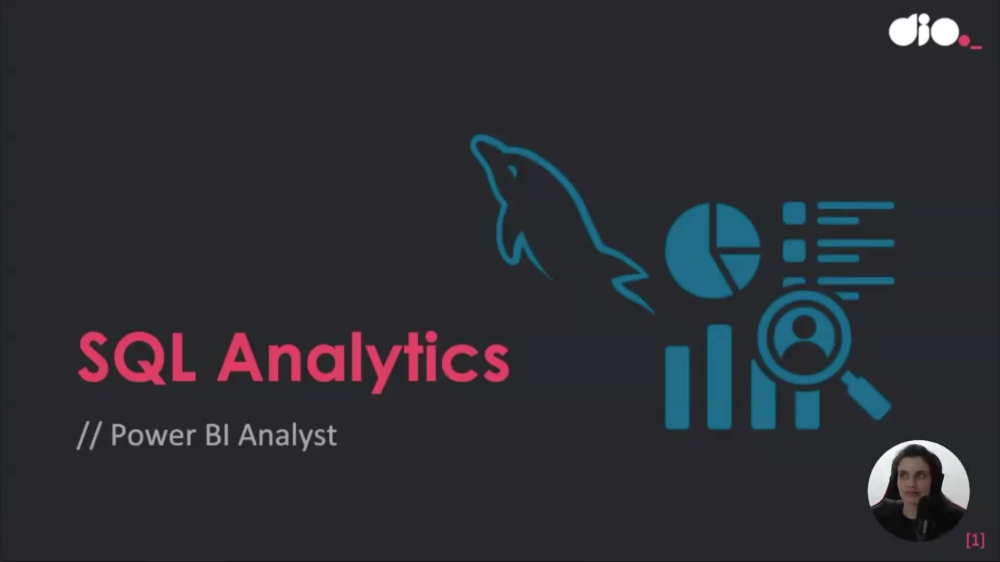
</p>

Este slide introduz o curso de **SQL Analytics**, direcionado especificamente para o perfil de **Power BI Analyst**. A proposta inicial é explorar como o SQL serve de base para a análise de dados, aproveitando a organização e as restrições de integridade dos bancos de dados relacionais para garantir consultas precisas no contexto de Business Intelligence.

<p align="center">
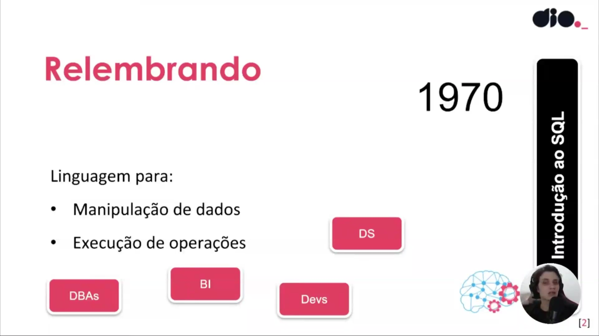
</p>

O SQL, com origem na década de 1970, é apresentado como a linguagem padrão para a manipulação de dados e execução de operações. É uma ferramenta transversal e essencial para diversos profissionais do ecossistema de dados, incluindo **DBAs**, especialistas em **BI**, desenvolvedores (**Devs**) e cientistas de dados (**DS**).

<p align="center">
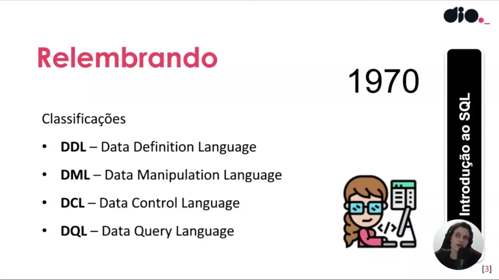
</p>

As instruções SQL são classificadas em quatro categorias principais baseadas em suas funções:

* **DDL (Data Definition Language):** Comandos de definição, como a criação de estruturas.
* **DML (Data Manipulation Language):** Comandos para manipular os registros (inserção, edição).
* **DCL (Data Control Language):** Comandos de controle de acesso e segurança.
* **DQL (Data Query Language):** Comandos de consulta, fundamentais para a análise de dados e a geração de perguntas ao banco.

<p align="center">
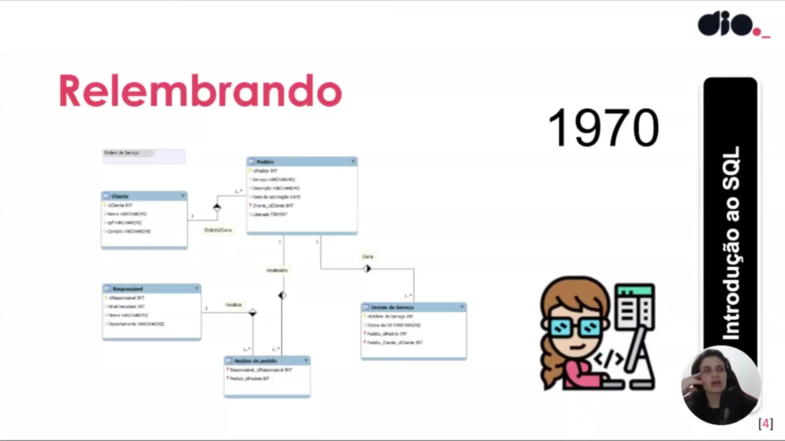
</p>

O diagrama reforça a ideia do SQL como uma interface de "Ordem de Serviço" que traduz necessidades humanas para o sistema de gerenciamento de banco de dados. Ele destaca a evolução histórica e a importância de entender a estrutura de armazenamento para que as perguntas feitas aos dados façam sentido lógico.

<p align="center">
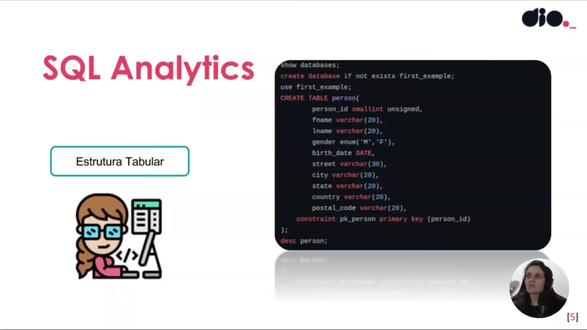
</p>

Abaixo, a exemplificação prática de comandos **DDL** para a criação de uma estrutura tabular. O código demonstra a criação de um banco de dados e de uma tabela chamada `person` com seus respectivos tipos e restrições:

```sql
-- Visualizar bancos existentes
show databases;

-- Criar o banco de dados de exemplo
create database if not exists first_example;

-- Selecionar o banco de dados
use first_example;

-- Criar tabela com tipos de dados e chave primária
CREATE TABLE person(
    person_id smallint unsigned,
    fname varchar(20),
    lname varchar(20),
    gender enum('M', 'F'),
    birth_date DATE,
    street varchar(30),
    city varchar(20),
    state varchar(20),
    country varchar(28),
    postal_code varchar(28),
    constraint pk_person primary key (person_id)
);

-- Exibir a estrutura da tabela
desc person;

```

<p align="center">
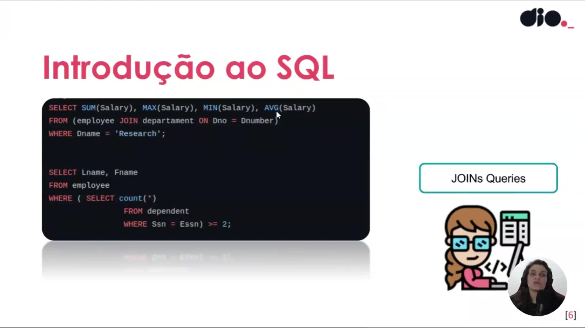
</p>

Neste exemplo, são apresentadas operações de **DQL** avançado para análise, utilizando funções de agregação e subconsultas para responder perguntas complexas de negócio:

```sql
-- Agregação de salários por departamento usando JOIN
SELECT SUM(Salary), MAX(Salary), MIN(Salary), AVG(Salary)
 FROM (employee JOIN departament ON Dno = Dnumber)
 WHERE Dname = 'Research';

-- Subconsulta para localizar funcionários com 2 ou mais dependentes
SELECT Lname, Fname
FROM employee
WHERE (SELECT count(*)
       FROM dependent
       WHERE Ssn = Essn) >= 2;

```

<p align="center">
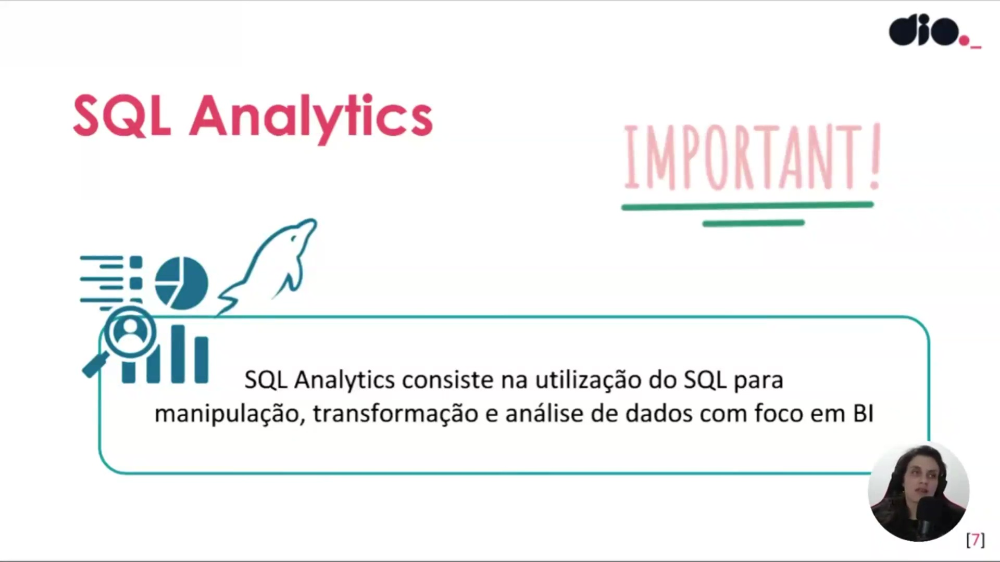
</p>

O conceito de **SQL Analytics** é definido como o uso estratégico da linguagem para transformar e analisar dados brutos em informações úteis para o Business Intelligence, focando na extração de padrões e métricas relevantes para a tomada de decisão.

<p align="center">
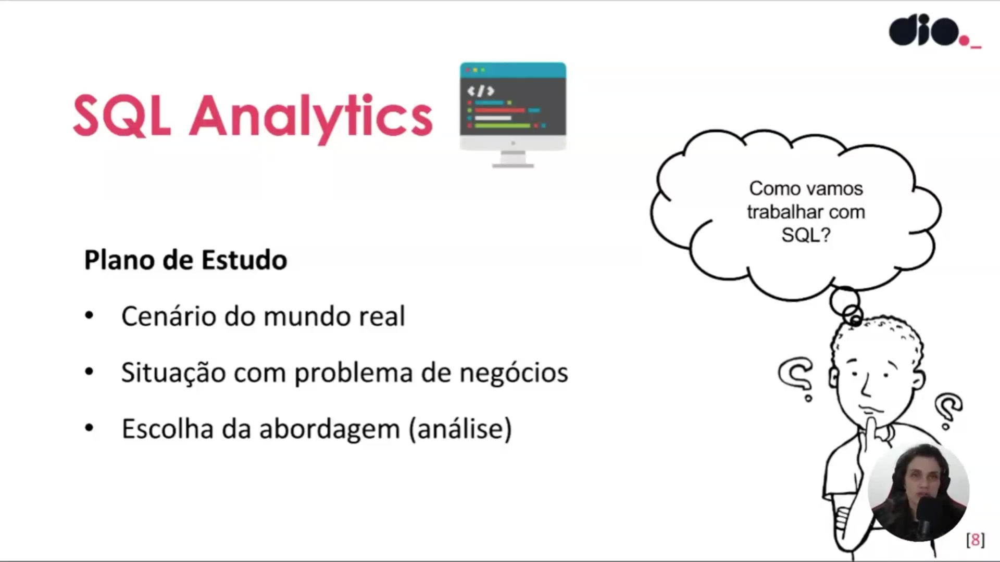
</p>

O plano de estudo para a formação foca em um workflow orientado a problemas reais. O processo envolve a definição de um cenário de negócio, a identificação do problema e a aplicação de diferentes tipos de análise: **Descritiva** (o que aconteceu), **Diagnóstica** (por que aconteceu) e, eventualmente, evoluindo para visões **Preditivas** ou **Prescritivas**.


### 🟩 Vídeo 02 - Workbench e DBeaver : Explorando Ferramentas de Acesso à Banco de dados

<video width="60%" controls>
  <source src="000-Midia_e_Anexos/bootcamp_ntt_data-modulo.05-curso.02-video_02.webm" type="video/webm">
    Seu navegador não suporta vídeo HTML5.
</video>

link do vídeo: https://web.dio.me/track/engenharia-dados-python/course/introducao-a-analise-de-dados-com-sql/learning/77165df8-4339-4368-85ea-66ca3fb9f5c4?autoplay=1

O conteúdo apresenta uma comparação técnica entre ferramentas de manipulação de bancos de dados, com foco principal no MySQL Workbench e no DBeaver. A discussão enfatiza que, embora as ferramentas ofereçam funcionalidades distintas como suporte multi-plataforma, visualização de diagramas e facilidade de exportação, a competência central reside no domínio da linguagem SQL, que permanece constante independentemente da interface utilizada.

### Anotações

<p align="center">
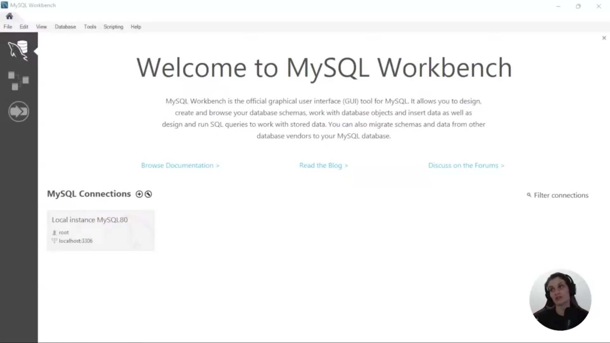
</p>

A interface inicial apresentada é o **MySQL Workbench**, a ferramenta gráfica oficial para gerenciamento e desenvolvimento com MySQL. Através desta tela, é possível gerenciar conexões, desenhar modelos lógicos e físicos de bancos de dados, além de executar consultas SQL diretamente no servidor local ou remoto.

<p align="center">
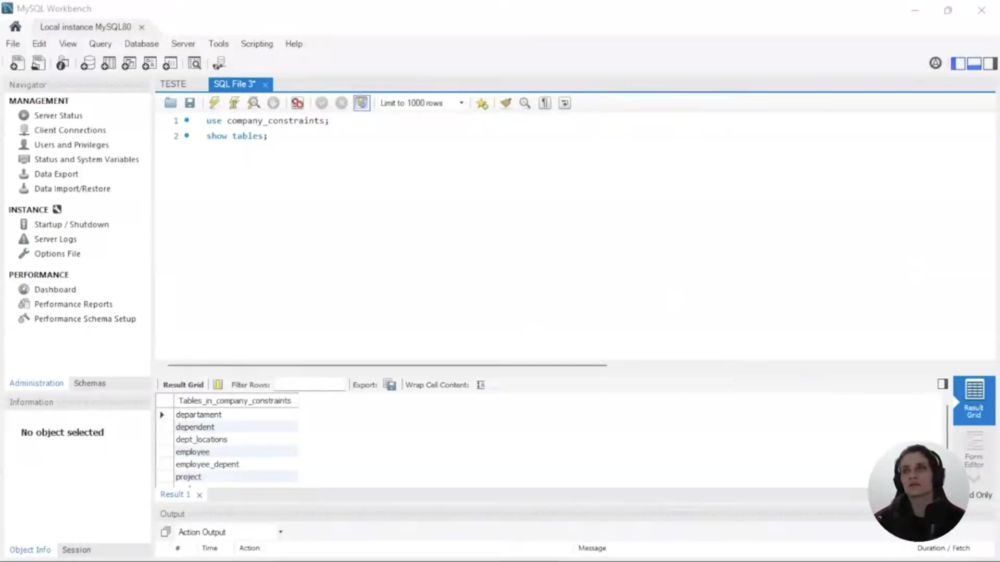
</p>

No editor de queries do Workbench, é demonstrada a seleção do esquema de trabalho e a listagem das tabelas existentes. A vantagem de utilizar esta interface em relação ao terminal é a persistência do script, permitindo correções rápidas sem a perda do comando digitado anteriormente.

```sql
use company_constraints;
show tables;

```

<p align="center">
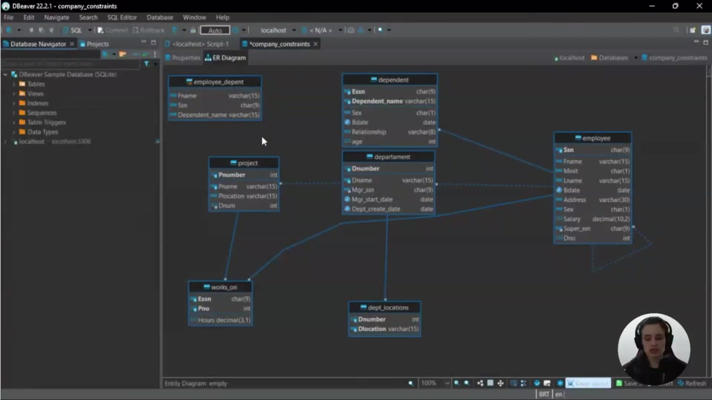
</p>

O **DBeaver** surge como uma alternativa versátil ao Workbench. Diferente da ferramenta oficial do MySQL, o DBeaver é multi-plataforma e suporta diversos sistemas de gerenciamento de banco de dados (SGBD). Na imagem, observa-se a visualização das propriedades da tabela `dependent`, exibindo as colunas, tipos de dados (como `char` e `varchar`) e as restrições associadas.

<p align="center">
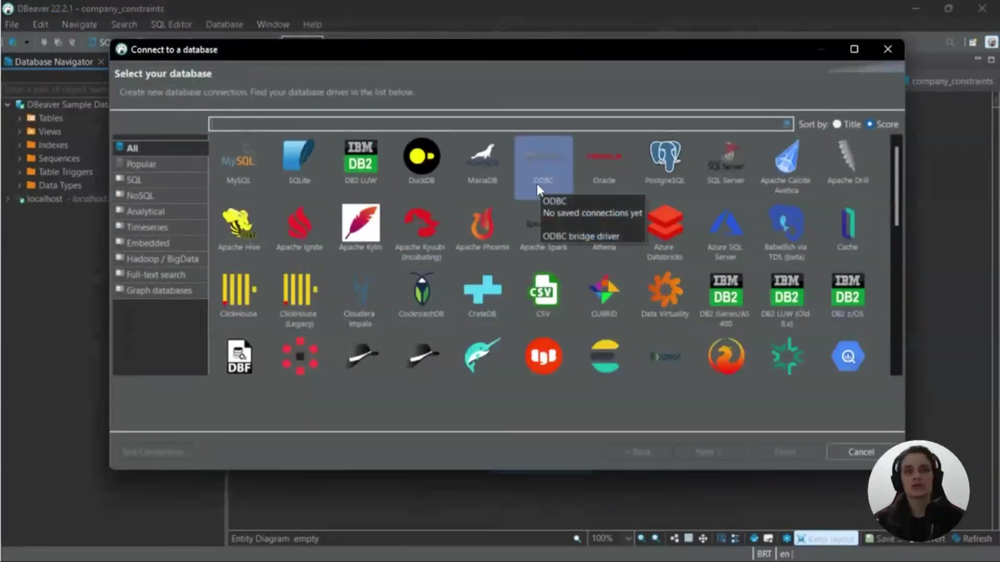
</p>

Uma das grandes potências do DBeaver é a sua ampla gama de conexões. Ele permite a integração não apenas com bancos relacionais tradicionais (como MySQL, SQL Server, SQLite e Oracle), mas também com tecnologias de Big Data e NoSQL, incluindo Apache Hive, Spark, Hadoop e bancos de grafos como o Neo4j.

<p align="center">
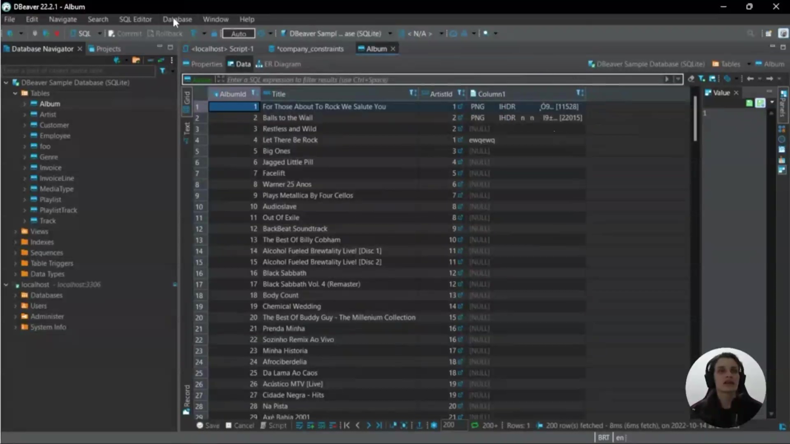
</p>

O DBeaver oferece uma visualização clara dos metadados e dos dados persistidos. Ao abrir uma tabela específica, como o exemplo do banco de dados de amostra `Album` (SQLite), o usuário tem acesso a uma grade de resultados intuitiva que facilita a inspeção e a manipulação direta das informações armazenadas.

<p align="center">
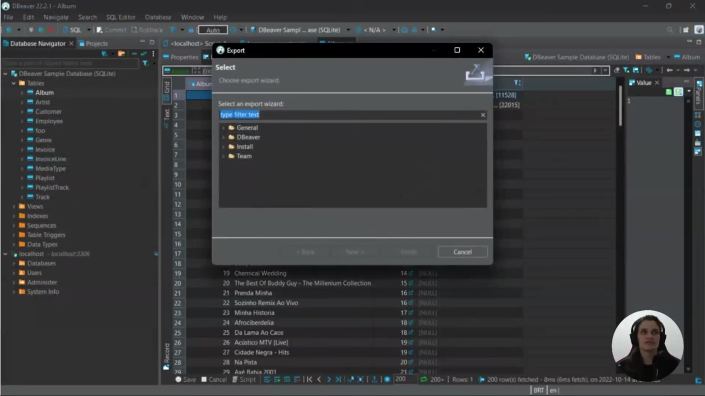
</p>

A ferramenta simplifica tarefas cotidianas, como a exportação de dados. Através de assistentes (wizards), é possível extrair o conteúdo de consultas ou tabelas inteiras para formatos externos, como CSV, facilitando a integração com outras ferramentas de análise, como o Power BI.

<p align="center">
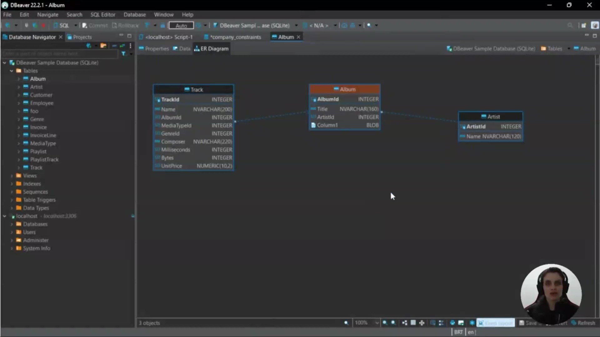
</p>

Além da manipulação de dados, o DBeaver gera automaticamente **Diagramas de Entidade-Relacionamento (ER)**. Esse recurso visual é fundamental para compreender como as tabelas se conectam através de chaves primárias e estrangeiras, permitindo uma visão macro da arquitetura do banco de dados sem a necessidade de ferramentas externas de modelagem.      


### 🟩 Vídeo 03 - Analisando a Sample do DBeaver persistida no SQLite

<video width="60%" controls>
  <source src="000-Midia_e_Anexos/bootcamp_ntt_data-modulo.05-curso.02-video_03.webm" type="video/webm">
    Seu navegador não suporta vídeo HTML5.
</video>

link do vídeo: https://web.dio.me/track/engenharia-dados-python/course/introducao-a-analise-de-dados-com-sql/learning/77165df8-4339-4368-85ea-66ca3fb9f5c4?autoplay=1

O vídeo apresenta um tutorial prático de análise descritiva utilizando SQL no software DBeaver. A demonstração foca na exploração de um banco de dados de música, abordando desde a contagem básica de registros até a realização de junções entre tabelas (Joins) e agrupamentos complexos para identificar padrões e inconsistências nos dados, como a ausência de capas de álbuns.

### Anotações

<p align="center">
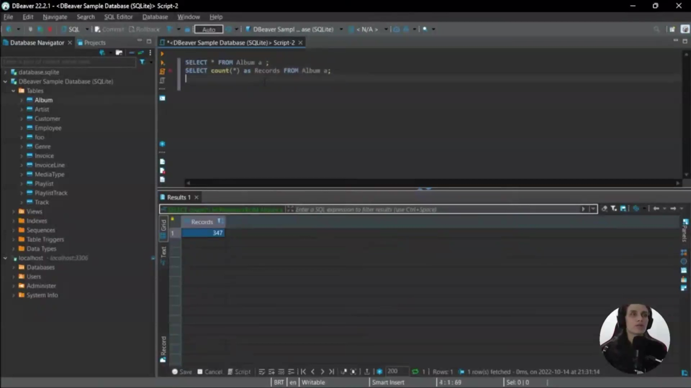
</p>

Nesta etapa inicial, é realizada uma consulta simples para verificar o volume total de dados presentes na tabela `Album` do banco de dados SQLite. O objetivo é estabelecer uma base quantitativa para as análises subsequentes. 

```sql
SELECT count(*) as Records FROM Album

```

O resultado da execução indica que a tabela possui um total de **347** registros. 

<p align="center">
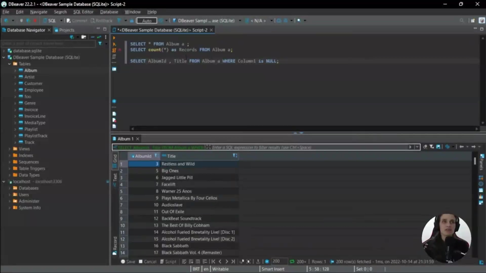
</p>

Neste ponto, a análise foca na identificação de registros específicos através de filtros. É utilizada uma cláusula `WHERE` para localizar álbuns onde uma determinada coluna (neste caso, referida como `Column1`) possui valores nulos. 

```sql
SELECT AlbumId, Title FROM Album WHERE Column1 is NULL;

```

A interface do DBeaver exibe os resultados na grade de dados, listando títulos como "Restless and Wild", "Big Ones" e "Jagged Little Pill", permitindo visualizar quais álbuns atendem ao critério de ausência de dados na coluna filtrada. 

<p align="center">
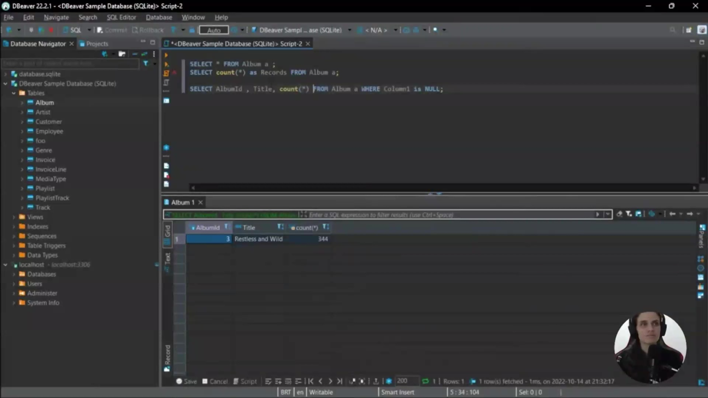
</p>

A consulta é refinada para realizar uma contagem baseada na condição de nulidade. O comando SQL busca quantificar quantos registros na tabela `Album` possuem valores nulos na coluna especificada. 

```sql
SELECT count(*) FROM Album WHERE Column1 is NULL;

```

O painel de resultados confirma que existem **344** registros que satisfazem essa condição, indicando que a grande maioria dos dados nessa coluna específica não foi preenchida. 

<p align="center">
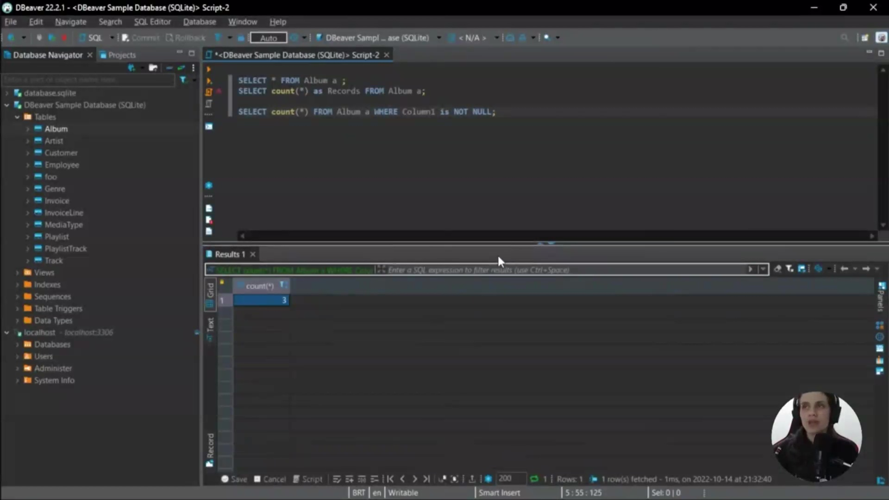
</p>

Inversamente à análise anterior, executa-se agora uma verificação para identificar registros que possuem conteúdo válido (não nulo) na coluna em questão. 

```sql
SELECT count(*) FROM Album WHERE Column1 is NOT NULL;

```

A execução revela que apenas **1** registro na tabela `Album` possui dados preenchidos nesta coluna, contrastando com o volume massivo de nulos identificado anteriormente. 

<p align="center">
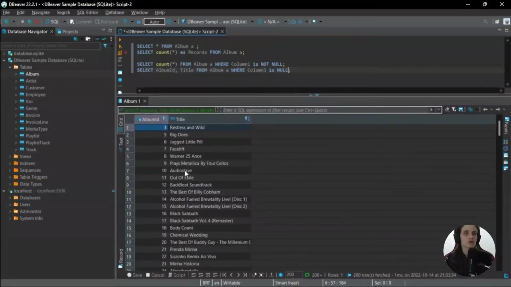
</p>

Retornando à visualização de dados brutos, a consulta seleciona novamente os campos `AlbumId` e `Title` para uma inspeção visual detalhada da lista de álbuns disponíveis na base de dados. 

```sql
SELECT AlbumId, Title FROM Album;

```

A grade de resultados apresenta uma sequência de álbuns, incluindo "Facelift", "Warner 25 Anos" e "Audioslave", demonstrando a diversidade de títulos catalogados antes de prosseguir para correlações com outras tabelas. 

<p align="center">
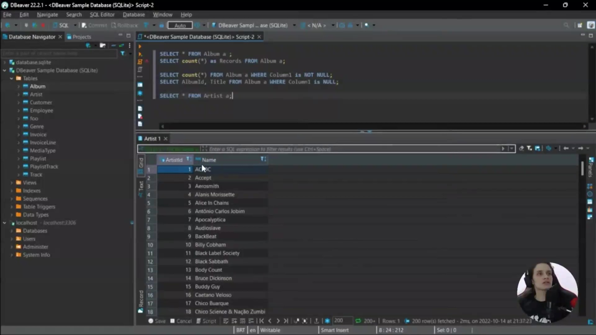
</p>

Para expandir a análise, a exploração muda o foco para a tabela `Artist`. Esta ação visa entender a estrutura e os dados dos artistas cadastrados no sistema de forma independente. 

```sql
SELECT * FROM Artist a

```

Os resultados exibem os nomes dos artistas e seus respectivos identificadores (`ArtistId`), como AC/DC, Accept e Aerosmith, preparando o terreno para operações de junção entre álbuns e artistas. 

<p align="center">
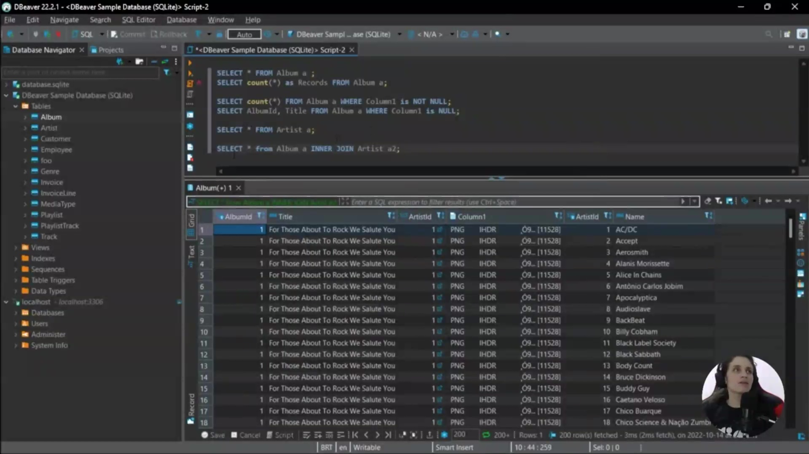
</p>

Inicia-se o processo de enriquecimento dos dados através do comando `INNER JOIN`. O objetivo é cruzar as informações da tabela de álbuns com a tabela de artistas, agrupando os resultados para entender a distribuição de registros por cada artista. 

```sql
SELECT a.AlbumId, a2.Name, count(*) 
FROM Album a 
INNER JOIN Artist a2 ON a.ArtistId = a2.ArtistId 
GROUP BY 2;

```

Esta estrutura de agrupamento (`GROUP BY 2`, referenciando o nome do artista) permite consolidar a quantidade de álbuns ou registros associados a cada entidade artística presente na base. 

<p align="center">
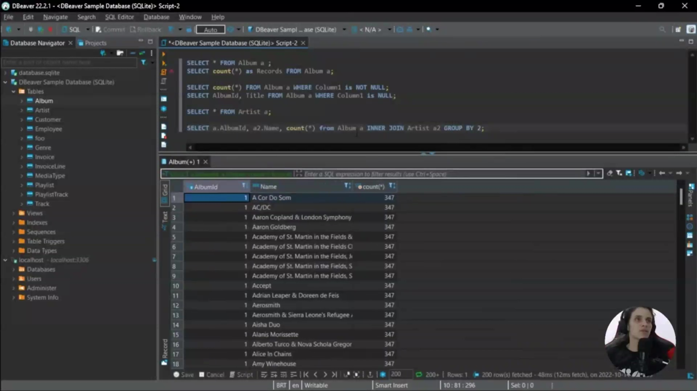
</p>

A consulta anterior é aprimorada com a inclusão de um alias (`Records`) para a coluna de contagem, tornando a leitura do relatório mais intuitiva. 

```sql
SELECT a.AlbumId, a2.Name, count(*) as Records 
FROM Album a 
INNER JOIN Artist a2 ON a.ArtistId = a2.ArtistId 
GROUP BY 2;

```

Ao observar os dados retornados, nota-se uma característica peculiar desta base de dados: diversos artistas, como AC/DC e Aaron Goldberg, aparecem com exatamente **347** registros cada, indicando uma distribuição uniforme (e possivelmente artificial) de dados na amostra. 

<p align="center">
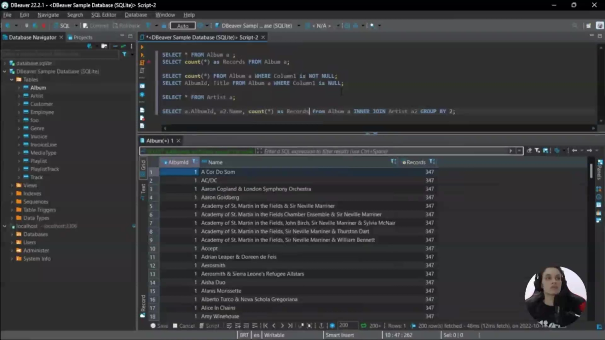
</p>

A visualização na grade de resultados é expandida para mostrar nomes completos de artistas e orquestras, mantendo a contagem de registros constante. 

```sql
SELECT a.AlbumId, a2.Name, count(*) as Records 
FROM Album a 
INNER JOIN Artist a2 ON a.ArtistId = a2.ArtistId 
GROUP BY 2;

```

A imagem destaca a consistência dos **347** registros para entidades como a "Academy of St. Martin in the Fields", reforçando a observação sobre a padronização dos dados nesta versão do banco de dados de exemplo. 

<p align="center">

</p>

Para finalizar a análise de caracterização, a consulta é ajustada para ordenar os resultados. Utiliza-se a cláusula `ORDER BY` de forma descendente (`DESC`) para verificar se algum artista foge ao padrão de 347 registros identificado. 

```sql
SELECT a2.ArtistId, a2.Name, count(*) as Records 
FROM Album a 
INNER JOIN Artist a2 ON a.ArtistId = a2.ArtistId 
GROUP BY 1 
ORDER BY Records DESC;

```

A ordenação confirma que a base é homogênea, com os principais artistas listados no topo possuindo a mesma quantidade de registros, o que caracteriza a estrutura atual desta base de dados específica.      


### 🟩 Vídeo 04 - O que fazer em um primeiro contato com base de dados?

<video width="60%" controls>
  <source src="000-Midia_e_Anexos/bootcamp_ntt_data-modulo.05-curso.02-video_04.webm" type="video/webm">
    Seu navegador não suporta vídeo HTML5.
</video>

link do vídeo: https://web.dio.me/track/engenharia-dados-python/course/introducao-a-analise-de-dados-com-sql/learning/168882bb-7cbe-42a0-ba6f-c0f3ce8f956b?autoplay=1

O vídeo enfatiza a importância de compreender o **esquema e os relacionamentos** entre tabelas, como álbuns e artistas, para extrair informações valiosas em vez de apenas recuperar dados brutos. O autor diferencia a modelagem conceitual da **análise exploratória**, destacando que o objetivo é entender o contexto e a história por trás dos registros. São discutidos conceitos de **padronização, limpeza e transformação** de dados para tornar os resultados mais amigáveis e assertivos para o negócio. Por fim, o conteúdo demonstra como identificar chaves primárias e estrangeiras para interpretar o comportamento de entidades como clientes e funcionários dentro do sistema.

### Anotações

<p align="center">
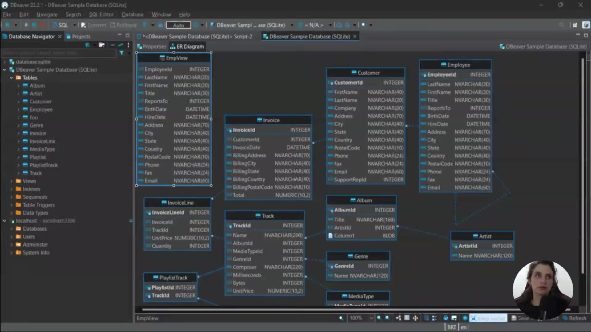
</p>

Nesta etapa, utilizamos o **DBeaver** para realizar o primeiro contato com a base de dados, explorando a visualização do **Diagrama Entidade-Relacionamento (ER)**. Esta funcionalidade é essencial para entender o contexto e a estrutura do conjunto de dados, permitindo visualizar como as tabelas representam entidades do mundo real e como se conectam entre si.

Através do diagrama, identificamos as seguintes relações e estruturas principais:

* **Núcleo Artístico**: A tabela `Artist` conecta-se a `Album`, que por sua vez se relaciona com `Track`. Isso demonstra que um álbum só faz sentido dentro do contexto de um artista, e as faixas (`tracks`) estão vinculadas a esses álbuns.
* **Detalhes da Faixa (Track)**: A entidade `Track` centraliza informações como nome, compositor, milissegundos, bytes e preço unitário (`UnitPrice`), indicando que se trata de um item comercializável.
* **Classificações e Formatos**: As tabelas `Genre` (Gênero) e `MediaType` (Tipo de Mídia, como MPEG ou AAC) associam-se a `Track`, permitindo categorizar cada música.
* **Estrutura de Vendas**: O relacionamento se estende para a parte comercial com as tabelas `Invoice` (Fatura) e `InvoiceLine` (Itens da Fatura), que conectam as vendas aos clientes (`Customer`).
* **Gestão e Playlists**: Observamos a tabela `PlaylistTrack`, que possui uma **chave primária composta** pelas chaves estrangeiras (`PlaylistId` e `TrackId`), permitindo que uma música pertença a várias listas de reprodução e vice-versa. Além disso, a tabela `Employee` apresenta uma relação de auto-hierarquia (`ReportsTo`) e se conecta aos clientes que os funcionários atendem.

Essa análise visual é o passo inicial para a **Análise Exploratória de Dados (EDA)**, facilitando a compreensão de intervalos de valores e a identificação de necessidades de padronização antes de iniciarmos as consultas SQL para extração de informações.


### 🟩 Vídeo 05 - Análise Descritiva: Caracterizando os Registros dos Artistas

<video width="60%" controls>
  <source src="000-Midia_e_Anexos/bootcamp_ntt_data-modulo.05-curso.02-video_05.webm" type="video/webm">
    Seu navegador não suporta vídeo HTML5.
</video>

link do vídeo: https://web.dio.me/track/engenharia-dados-python/course/introducao-a-analise-de-dados-com-sql/learning/9fc42f5f-735d-44fc-be20-39b4f5086e1f?autoplay=1

A instrutora demonstra como **explorar tabelas de clientes**, destacando a importância de identificar **dados ausentes**, como estados e empresas, para orientar decisões de **logística e marketing**. Através de comandos de **filtragem, contagem e agrupamento**, o material ensina a transformar registros brutos em **informações estratégicas** para o negócio. Além disso, a fonte enfatiza o método de **construir consultas baseadas em perguntas de negócio**, facilitando a interpretação dos resultados. O conteúdo conclui preparando o terreno para a **comparação entre diferentes tabelas**, como a de clientes e funcionários, visando uma compreensão mais profunda da estrutura de dados.

### Anotações

<p align="center">
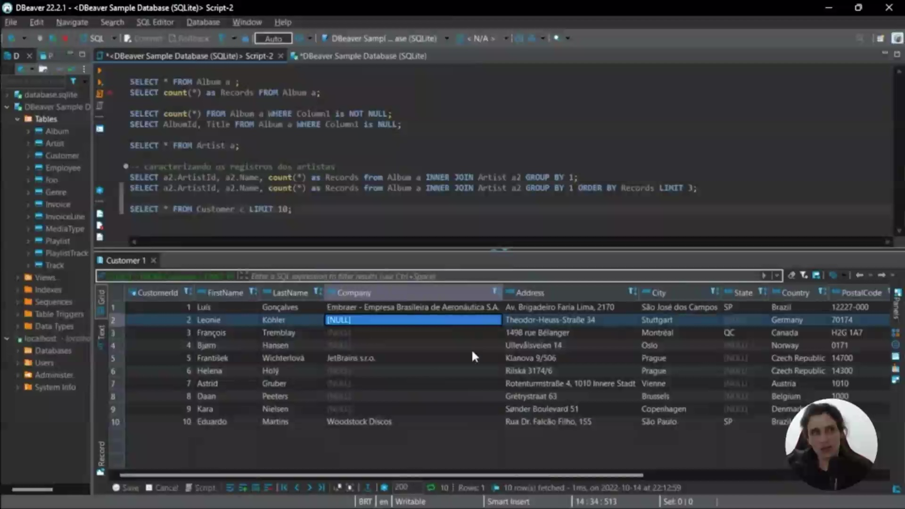
</p>

Nesta etapa inicial da análise exploratória, o objetivo é compreender a estrutura da tabela `Customer`. Para evitar o processamento de um volume desnecessário de dados e focar apenas no entendimento das colunas e do tipo de informação armazenada (como IDs, nomes e empresas associadas), utiliza-se o comando `LIMIT`.

```sql
SELECT * FROM Customer LIMIT 10;

```

A visualização dos primeiros registros revela a presença de valores nulos na coluna `Company`, sugerindo que nem todos os clientes estão vinculados a uma organização formal, o que pode indicar diferentes perfis de consumidores na base de dados.

<p align="center">
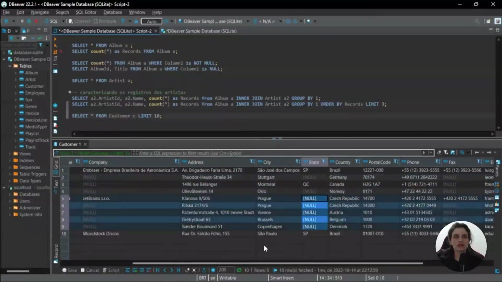
</p>

Ao detalhar os registros da tabela `Customer`, observa-se que, além de informações básicas como nome e endereço, existem campos importantes para a análise geográfica, como cidade, estado (`State`) e país. Um ponto de atenção identificado é a consistência dos dados: muitos registros apresentam a informação de estado como nula, o que representa um desafio comum na coleta de dados e impacta futuras análises de caracterização regional.

<p align="center">
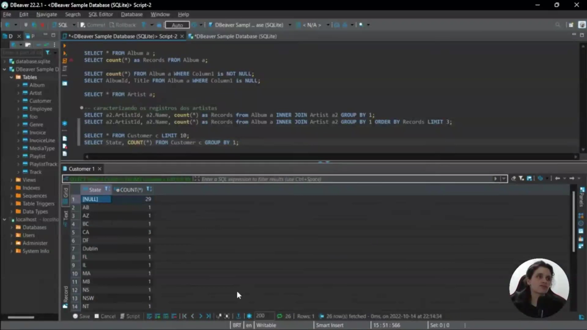
</p>

Para quantificar a distribuição dos clientes por localização, aplica-se um agrupamento baseado na coluna de estado. Esta consulta permite verificar quantos registros existem para cada localidade, evidenciando imediatamente a grande quantidade de valores nulos (identificados como `[NULL]`), que neste caso somam 29 registros.

```sql
SELECT State, COUNT(*) FROM Customer GROUP BY 1;

```

<p align="center">
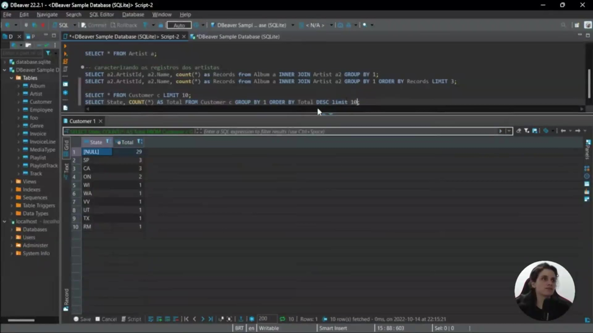
</p>

Para tornar a análise mais útil para a tomada de decisão — como o direcionamento de esforços logísticos para estados com maior demanda — a query é refinada com a inclusão de um pseudônimo (`alias`), ordenação decrescente e um limite de resultados para destacar os principais mercados.

```sql
SELECT State, COUNT(*) AS Total 
FROM Customer 
GROUP BY 1 
ORDER BY Total DESC 
LIMIT 10;

```

<p align="center">
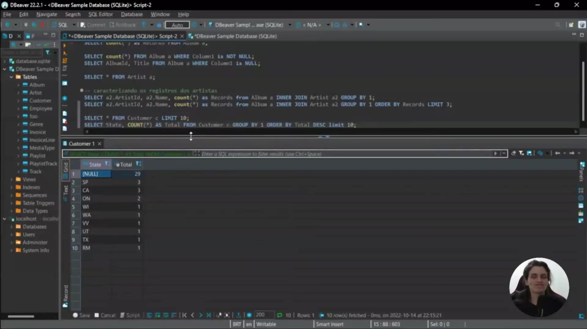
</p>

A execução da query ordenada confirma que o maior grupo de registros (29 clientes) não possui estado definido, seguido por estados como São Paulo (SP) e Califórnia (CA), ambos com 3 clientes. Essa visão consolidada é fundamental para entender a representatividade da base de dados antes de realizar cruzamentos com outras tabelas.

<p align="center">
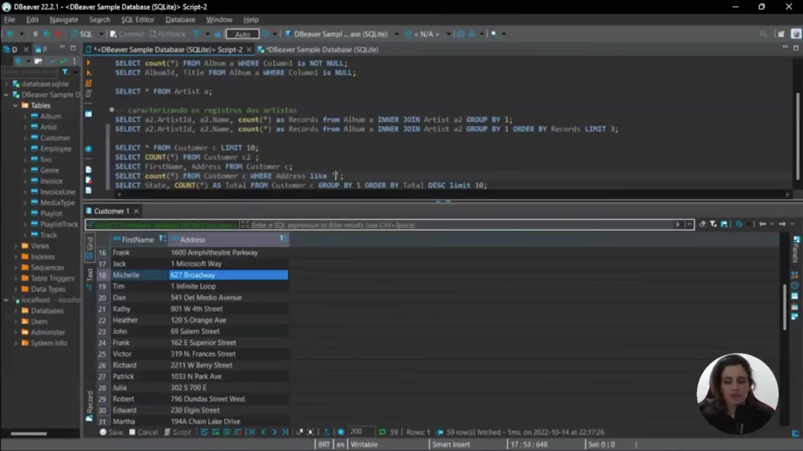
</p>

A exploração prossegue para buscas específicas utilizando o operador `LIKE`. O objetivo aqui é filtrar clientes por endereços que contenham termos específicos, como no exemplo de uma busca por moradores da "Broadway". Essa técnica é útil para planejar ações localizadas, como eventos de divulgação de álbuns em regiões específicas.

```sql
SELECT FirstName, Address 
FROM Customer 
WHERE Address LIKE '%Broadway%';

```      


### 🟩 Vídeo 06 - Análise Descritiva: Caracterizando os Registros de Customers

<video width="60%" controls>
  <source src="000-Midia_e_Anexos/bootcamp_ntt_data-modulo.05-curso.02-video_06.webm" type="video/webm">
    Seu navegador não suporta vídeo HTML5.
</video>

link do vídeo: https://web.dio.me/track/engenharia-dados-python/course/introducao-a-analise-de-dados-com-sql/learning/bcf4c31d-c280-4883-bad0-027783a78b85?autoplay=1

O material consiste em uma aula técnica que demonstra como identificar registros duplicados entre as tabelas de **clientes e funcionários** utilizando linguagem **SQL**. A instrutora apresenta dois caminhos distintos para realizar essa verificação: o uso de **subqueries** com o operador "IN" e a aplicação de **junções de tabelas**, como o Inner Join e o Natural Join. Durante a explicação, destaca-se que o uso de **joins** é geralmente mais eficiente em termos de **performance**, especialmente quando se lida com grandes volumes de dados. Além de comparar a sintaxe de cada método, a aula aborda problemas comuns de **ambiguidade de colunas** e a importância de filtrar atributos para obter resultados precisos. O conteúdo foca na lógica de programação para banco de dados, preparando o terreno para análises futuras envolvendo faturamento e valores totais.

### Anotações

<p align="center">
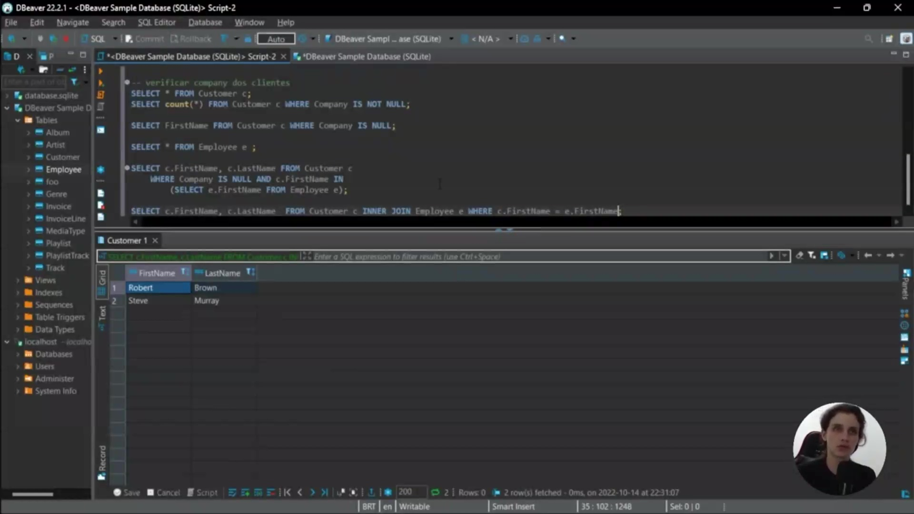
</p>

Nesta etapa, o objetivo é identificar quais colaboradores (tabela `Employee`) também estão registrados como clientes (tabela `Customer`) no banco de dados SQLite utilizando o **DBeaver**. A interface mostra a estrutura das tabelas e o editor SQL onde as consultas são construídas para comparar os nomes presentes em ambas as entidades.

Para realizar essa verificação, são exploradas duas abordagens principais: o uso de **Subqueries** (subconsultas) e o uso de **Joins**. A escolha entre elas impacta diretamente a legibilidade do código e a performance da consulta, especialmente em bases de dados volumosas. Atributos numéricos são preferíveis para buscas, mas, na ausência deles, a comparação é feita através do campo `FirstName`.

Abaixo, os dois métodos aplicados para solucionar o problema:

**1. Abordagem com Subquery**
Neste formato, utiliza-se a cláusula `IN` para verificar se o nome do cliente existe no conjunto de resultados retornado pela consulta na tabela de funcionários.

```sql
SELECT c.FirstName, c.LastName 
FROM Customer c 
WHERE Company IS NULL 
AND c.FirstName IN (SELECT e.FirstName FROM Employee e);

```

**2. Abordagem com Inner Join**
O `JOIN` é apresentado como uma alternativa mais intuitiva e performática, pois realiza a combinação exata entre as tabelas. No exemplo, utiliza-se um filtro para garantir que os nomes correspondam em ambos os lados.

```sql
SELECT c.FirstName, c.LastName 
FROM Customer c 
INNER JOIN Employee e 
ON c.FirstName = e.FirstName;

```

O resultado da execução no DBeaver retorna os registros que satisfazem a condição, como os nomes **Robert Brown** e **Steve Murray**, confirmando que estes indivíduos constam simultaneamente nos dois cadastros.


### 🟩 Vídeo 07 - Análise Descritiva: Caracterizando os Registros de Invoice

<video width="60%" controls>
  <source src="000-Midia_e_Anexos/bootcamp_ntt_data-modulo.05-curso.02-video_07.webm" type="video/webm">
    Seu navegador não suporta vídeo HTML5.
</video>

link do vídeo: https://web.dio.me/track/engenharia-dados-python/course/introducao-a-analise-de-dados-com-sql/learning/9fe2aa75-b179-4a0e-bbec-f6a1eb64944a?autoplay=1

O vídeo apresenta uma **análise exploratória de dados** utilizando **SQL** para investigar a estrutura de tabelas de faturamento e clientes. A instrutora demonstra como realizar **junções (JOINS)** entre as tabelas `invoice`, `invoice_line` e `customer` para identificar padrões de consumo e volumes de registros. Durante a prática, enfatiza-se a importância de aplicar o comando **LIMIT** para preservar a performance do banco de dados e evitar travamentos. O conteúdo foca em validar a **integridade dos dados**, ensinando a distinguir entre resultados reais e possíveis redundâncias causadas por modelagens inadequadas. Através de agrupamentos e contagens, o tutorial orienta como extrair **insights descritivos** fundamentais para entender o comportamento da base. Por fim, o material prepara o terreno para etapas futuras de **limpeza e padronização** dentro de processos de ETL.

### Anotações

<p align="center">
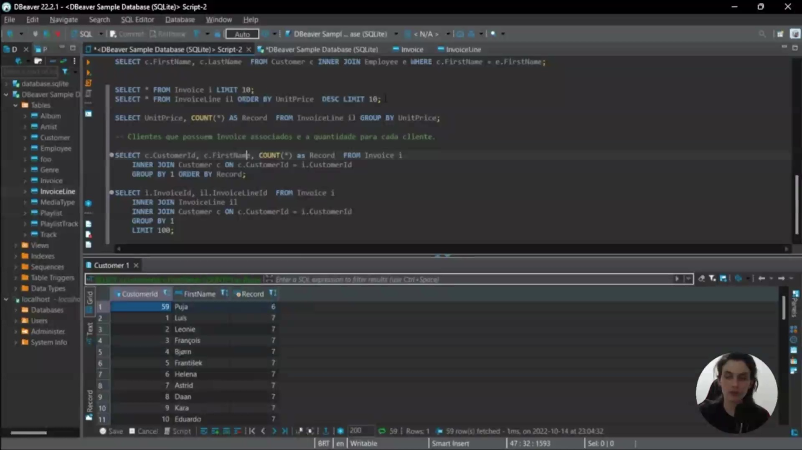
</p>

Esta etapa da análise foca na caracterização e exploração dos dados através de junções complexas para extrair insights sobre o comportamento dos clientes. O objetivo é identificar quais clientes possuem faturas (invoices) associadas e quantificar esses registros, utilizando o ambiente DBeaver para executar queries SQL em um banco de dados SQLite.

A interface demonstra a construção de um `INNER JOIN` entre as tabelas `Customer` e `Invoice`, permitindo cruzar informações de identificação do cliente (como nome e ID) com os dados de transação. A ordenação é aplicada para destacar os clientes com maior volume de registros, facilitando a visualização de padrões de consumo na base de dados.

```sql
SELECT 
    c.CustomerId, 
    c.FirstName, 
    COUNT(*) as Record 
FROM Invoice i
INNER JOIN Customer c ON c.CustomerId = i.CustomerId
GROUP BY 1 
ORDER BY Record DESC;

```

O resultado exibido no painel de dados mostra uma lista de clientes (como Puja, Leonie e François) acompanhada da contagem de registros (`Record`), validando a estrutura da query e a integridade das relações entre as tabelas.

### 🟩 Vídeo 08 - Utilizando Junções para Caracterizar os Dados

<video width="60%" controls>
  <source src="000-Midia_e_Anexos/bootcamp_ntt_data-modulo.05-curso.02-video_08.webm" type="video/webm">
    Seu navegador não suporta vídeo HTML5.
</video>

link do vídeo: https://web.dio.me/track/engenharia-dados-python/course/introducao-a-analise-de-dados-com-sql/learning/b7bee4b6-b9fe-48b4-bd78-c80572fa17e8?autoplay=1

O material consiste em uma aula prática voltada para a **análise e manipulação de dados** utilizando **SQL**, com foco especial em extrair informações estatísticas de um banco de dados. O instrutor demonstra como utilizar técnicas de **agrupamento e contagem** para identificar a **frequência de ocorrências**, permitindo a criação de **histogramas** e a caracterização da base de dados. Durante a explicação, são ensinados procedimentos para **conectar ao servidor MySQL**, configurar permissões de acesso e realizar **junções de tabelas** através do comando `INNER JOIN`. O conteúdo foca em exemplos práticos, como a contagem de **colaboradores e projetos por departamento**, visando transformar registros numéricos em informações visuais significativas. Além disso, o vídeo introduz conceitos de **limpeza de dados**, padronização e o uso de **cláusulas condicionais** para rotular variáveis de forma mais intuitiva para o usuário final.

### Anotações

<p align="center">
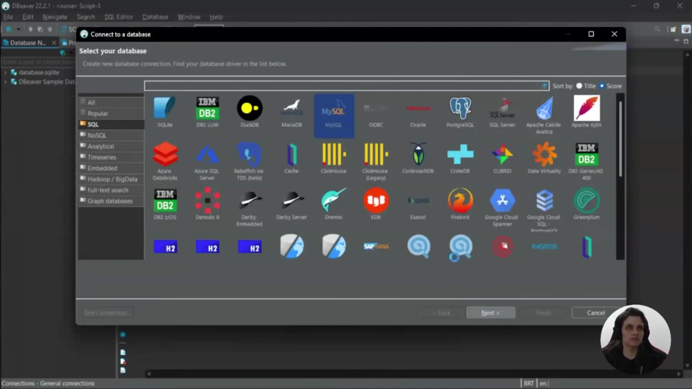
</p>

Para iniciar a análise de frequências e manipulação de dados, é necessário estabelecer uma conexão com o gerenciador de banco de dados. No exemplo, utiliza-se o **DBeaver** para criar uma nova conexão. Ao selecionar a opção "New Database Connection", o usuário deve escolher o driver correspondente ao banco de dados utilizado, que neste caso é o **MySQL**.

<p align="center">
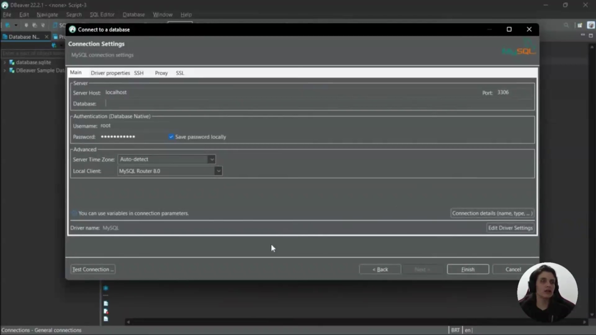
</p>

Após selecionar o driver, configuram-se os parâmetros de conexão em "Connection Settings". Os campos principais incluem:

* **Server Host:** Definido como `localhost` para conexões locais.
* **Port:** A porta padrão `3306`.
* **Authentication:** Inserção de `Username` (geralmente root) e `Password`.
* **Configurações de SSL:** Em casos de erro de conexão, pode ser necessário ajustar a aba SSL para permitir a recuperação de chave pública ("Allow public key retrieval") e desabilitar verificações estritas de certificado se o ambiente for de teste.

<p align="center">
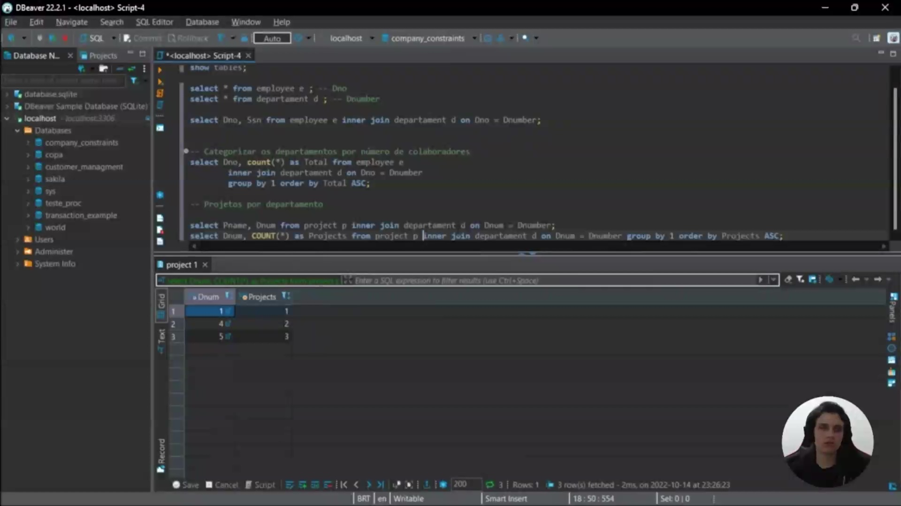
</p>

Com a conexão estabelecida, é possível realizar análises de frequência e categorização utilizando o banco `company_constraints`. Através de junções (`INNER JOIN`) e agrupamentos (`GROUP BY`), conseguimos extrair informações estratégicas como o volume de colaboradores e projetos por departamento.

Abaixo, os códigos utilizados para gerar essas métricas:

**Categorização de departamentos por número de colaboradores:**

```sql
SELECT Dno, COUNT(*) AS Total 
FROM employee 
INNER JOIN department ON Dno = Dnumber 
GROUP BY Dno 
ORDER BY Total DESC;

```

**Verificação da quantidade de projetos por departamento:**

```sql
SELECT Dnum, COUNT(*) AS Projects 
FROM project 
INNER JOIN department ON Dnum = Dnumber 
GROUP BY Dnum 
ORDER BY Projects ASC;

```

O resultado dessas consultas permite observar padrões na base de dados, como a correlação entre o aumento do número de projetos e o aumento proporcional da equipe alocada no departamento.


### 🟩 Vídeo 09 - Analisando Frequência dos Dados com Funções de Agregação

<video width="60%" controls>
  <source src="000-Midia_e_Anexos/bootcamp_ntt_data-modulo.05-curso.02-video_09.webm" type="video/webm">
    Seu navegador não suporta vídeo HTML5.
</video>

link do vídeo: https://web.dio.me/track/engenharia-dados-python/course/introducao-a-analise-de-dados-com-sql/learning/ed4c6813-9be0-4753-8ed3-911b5a1febfe?autoplay=1

A instrutora demonstra como extrair informações de um **banco de dados próprio** para realizar **análises visuais** preliminares. O processo envolve a **exportação de dados** no formato CSV para o Excel, onde são gerados **gráficos de colunas** que comparam a quantidade de funcionários e projetos por departamento. Durante a explicação, destaca-se a importância de **refinar as consultas SQL**, substituindo códigos numéricos por nomes reais para tornar a interpretação mais clara. Embora utilize ferramentas tradicionais, o narrador enfatiza que essa abordagem é apenas uma **introdução simplista**. O objetivo final é preparar o terreno para o uso do **Power BI**, que permitirá a criação de cenários e relatórios muito mais **complexos e profissionais**.

### Anotações

<p align="center">
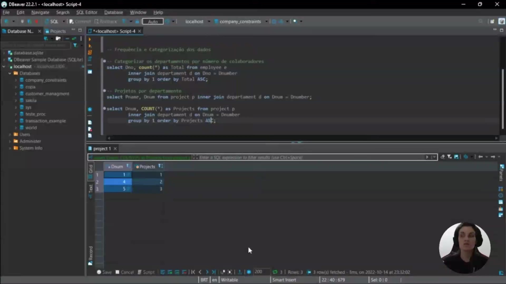
</p>

A interface do **DBeaver** mostra a execução de queries SQL para análise de dados diretamente no banco de dados. O objetivo é categorizar os departamentos baseando-se no número de colaboradores, utilizando funções de agregação e agrupamento para consolidar as informações que serão posteriormente exportadas.

```sql
-- Categorizar os departamentos por número de colaboradores
select Dno, count(*) as Total from employee e
inner join department d on Dno = Dnumber
group by 1 order by Total ASC;

-- Projetos por departamento
select Pname, Dnum from project p inner join department d on Dnum = Dnumber;

select Dnum, COUNT(*) as Projects from project p
inner join department d on Dnum = Dnumber
group by 1 order by Projects DESC;

```

<p align="center">
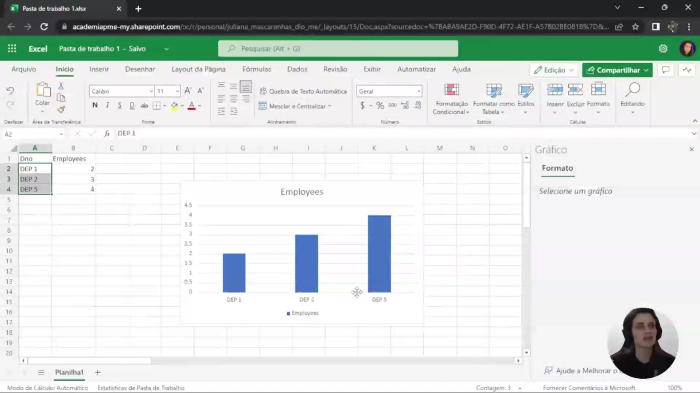
</p>

Após a extração dos dados do banco via CSV, as informações são importadas para o **Excel** para uma análise visual rápida. Nesta etapa inicial, os departamentos ainda estão identificados apenas por seus códigos numéricos (DEP 1, DEP 2, DEP 5), permitindo a criação de um gráfico de colunas que quantifica o total de colaboradores por unidade.

<p align="center">
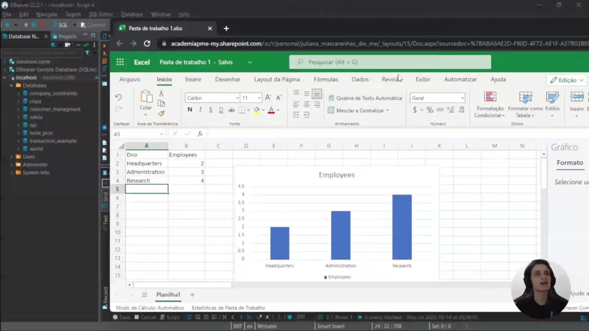
</p>

Para tornar a análise mais intuitiva e "interessante", os códigos numéricos dos departamentos são substituídos por seus nomes reais diretamente na planilha. À medida que os dados textuais são inseridos (Headquarters, Administration, Research), o gráfico vinculado é atualizado automaticamente, facilitando a identificação visual de que o departamento de **Research** (Pesquisa) possui o maior contingente de pessoal.

<p align="center">
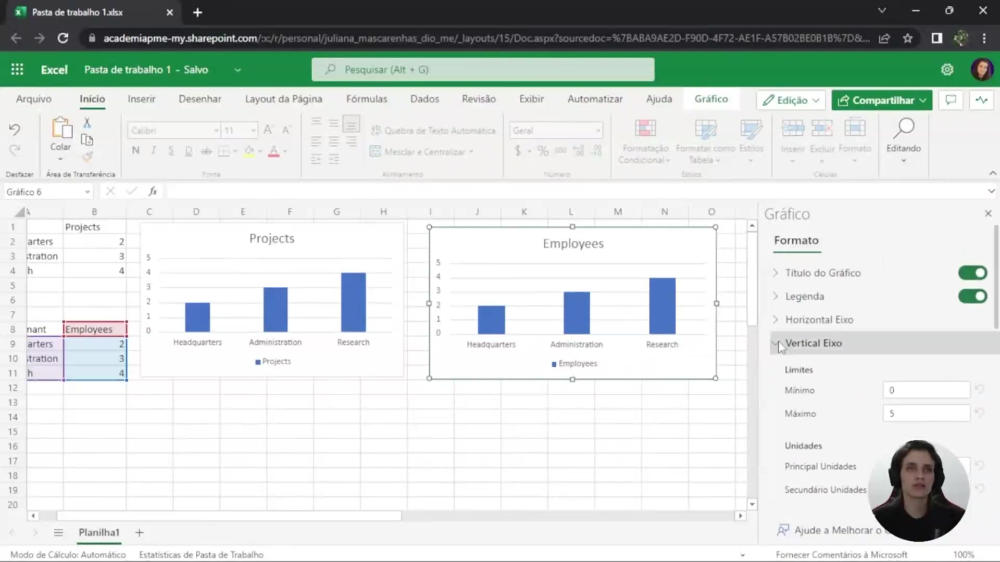
</p>

A etapa final demonstra a consolidação de diferentes métricas na mesma visualização. Além do número de funcionários por departamento, é possível organizar os dados para comparar o volume de projetos. Esta abordagem visual serve como uma introdução aos conceitos de análise de dados que serão aprofundados em ferramentas mais robustas, como o **Power BI**, permitindo entender melhor o contexto e a distribuição das informações no banco de dados.


### 🟩 Vídeo 10 - Discretização com CASE Statement

<video width="60%" controls>
  <source src="000-Midia_e_Anexos/bootcamp_ntt_data-modulo.05-curso.02-video_10.webm" type="video/webm">
    Seu navegador não suporta vídeo HTML5.
</video>

link do vídeo: https://web.dio.me/track/engenharia-dados-python/course/introducao-a-analise-de-dados-com-sql/learning/29db496e-9766-4a37-95fe-feeab2e6d124?autoplay=1

### 🟩 Vídeo 11 - Aplicando Padronização na Recuperação dos Dados com CASE Statement

<video width="60%" controls>
  <source src="000-Midia_e_Anexos/bootcamp_ntt_data-modulo.05-curso.02-video_11.webm" type="video/webm">
    Seu navegador não suporta vídeo HTML5.
</video>

link do vídeo:


##  Materiais de Apoio

# Certificado: 

- Link na plataforma: 
- Certificado em pdf: 
