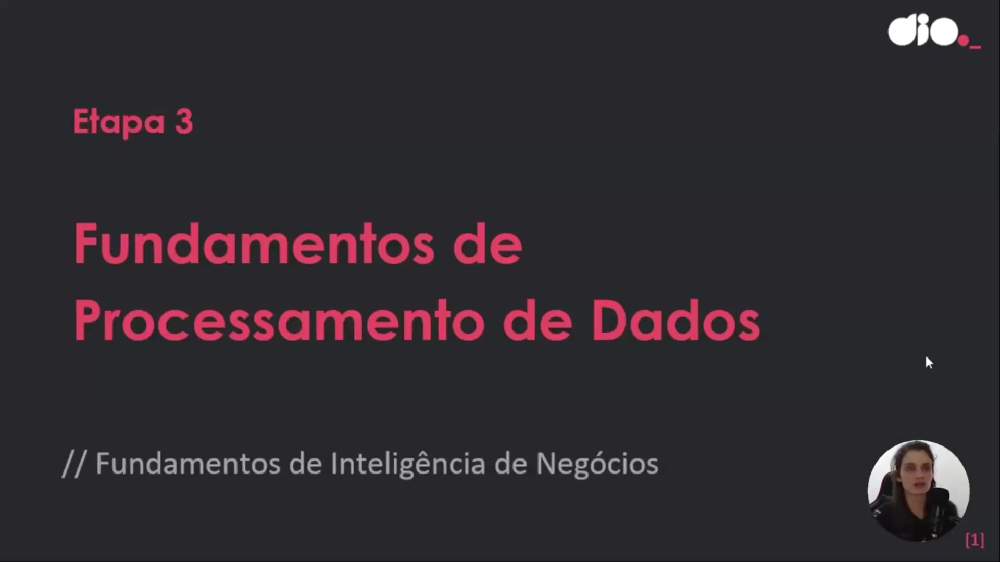
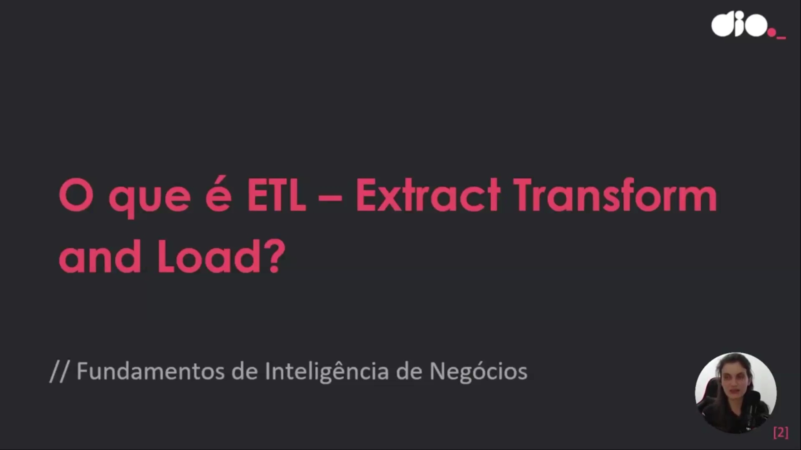
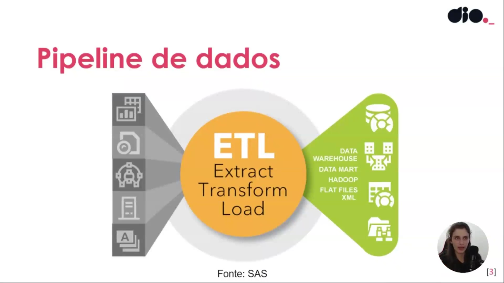

## Instrutor:

- Juliana Mascarenhas (Tech Education Specialist / Sócia (Content Creator) @SimplificandoRedes / Me Modelagem Computacional / Cientista de dados)
- Contato Linkedin: / [juliana-mascarenhas-ds](https://www.linkedin.com/in/juliana-mascarenhas-ds/)

## Parte 1 - Fundamentos de ETL

### 🟩 Vídeo 01 - Breve descrição do curso

<video width="60%" controls>
  <source src="000-Midia_e_Anexos/bootcamp_ntt_data-modulo.05-curso.03-video_01.webm" type="video/webm">
    Seu navegador não suporta vídeo HTML5.
</video>

link do vídeo: https://web.dio.me/track/engenharia-dados-python/course/fundamentos-teoricos-sobre-etl/learning/e4ad0ebd-d019-4332-9e79-f83a8dee11c2?autoplay=1

O vídeo introduz o terceiro curso de uma série voltada aos fundamentos do processamento de dados. O objetivo principal é fornecer uma base teórica rápida e objetiva sobre os processos de ETL (Extração, Transformação e Carga) e ELT (Extração, Carga e Transformação), preparando o aluno para entender as dinâmicas de manipulação de dados em ambientes tecnológicos.

### 🟩 Vídeo 02 - O que é ETL – Extract, Transform and Load

<video width="60%" controls>
  <source src="000-Midia_e_Anexos/bootcamp_ntt_data-modulo.05-curso.03-video_02.webm" type="video/webm">
    Seu navegador não suporta vídeo HTML5.
</video>

link do vídeo: https://web.dio.me/track/engenharia-dados-python/course/fundamentos-teoricos-sobre-etl/learning/93ddbe11-8fd7-4b9f-83c2-de7c3350596a?autoplay=1

O vídeo detalha os conceitos fundamentais dos processos de **ETL (Extração, Transformação e Carga)** e suas variações no campo da **Engenharia de Dados**. O material explica como informações originadas de **fontes heterogêneas**, como bancos de dados, arquivos e sistemas de nuvem, são coletadas e padronizadas para garantir utilidade em análises posteriores. O autor destaca que a **transformação** é essencial para converter estruturas brutas em formatos compatíveis com repositórios finais, como **Data Warehouses** ou **Data Lakes**. Além disso, o texto introduz brevemente o conceito de **ELT**, mencionando que a inversão da ordem das etapas impacta diretamente a modelagem e o custo de armazenamento da solução. O foco principal é fornecer uma base teórica sólida que permita ao profissional aplicar esses princípios independentemente da **ferramenta tecnológica** escolhida, seja ela Python ou Power BI. Por fim, a fonte reforça a importância da **limpeza de dados** para que analistas e cientistas possam extrair insights precisos para a tomada de decisão empresarial.

### Anotações

Nesta introdução aos processos voltados para dados, o foco inicial estabelece a importância de compreender os fundamentos do processamento de dados e da inteligência de negócios. O objetivo é capacitar o profissional a entender a lógica por trás da movimentação de informações, permitindo a aplicação desses conceitos em diversas ferramentas, como Power BI, Python ou sistemas complexos de engenharia de dados, independentemente da modernidade da tecnologia utilizada.

O conceito central apresentado é o **ETL**, sigla para *Extract, Transform and Load* (Extração, Transformação e Carga). Este processo é fundamental para a manipulação de dados, consistindo em três etapas essenciais:

1. **Extrair**: Coletar as informações de suas fontes originais.
2. **Transformar**: Converter os dados brutos em um formato útil e padronizado.
3. **Carregar**: Inserir os dados tratados em um repositório final para que fiquem disponíveis para análise por cientistas e analistas de dados.

O *pipeline* de dados tradicional demonstra como o ETL funciona como uma ponte entre diversas origens e destinos. Os dados podem ser extraídos de fontes variadas, como sistemas **Hadoop**, arquivos de texto (**Flat Files**) e documentos **XML**. Após o processamento, essas informações são consolidadas em estruturas de armazenamento robustas, como o **Data Warehouse** (repositório central de dados da organização) ou o **Data Mart** (recorte específico de dados para uma área de negócio).

O fluxo de dados lida com fontes heterogêneas que possuem diferentes estruturas e níveis de organização. O diagrama detalha as origens comuns e as etapas de tratamento:

* **Fontes de Dados**: As informações podem vir de sistemas de **CRM**, serviços em **Nuvem (Cloud)**, **Filas** de mensagens (sistemas orientados a eventos), bancos de dados (**SGBD**), sistemas **Legados** ou arquivos diversos (**Files**).
* **Processamento (Clean & Analyze)**: Devido à falta de padronização ou presença de redundâncias nas fontes originais, os dados passam por uma etapa de limpeza (**Clean**) para garantir a integridade.
* **ETL**: Todo esse trajeto de extração e transformação prepara os dados para o carregamento final, permitindo que as análises subsequentes reflitam a realidade do negócio de forma precisa.

### 🟩 Vídeo 03 - O que é ELT – Extract, Load and Transform

<video width="60%" controls>
  <source src="000-Midia_e_Anexos/bootcamp_ntt_data-modulo.05-curso.03-video_03.webm" type="video/webm">
    Seu navegador não suporta vídeo HTML5.
</video>

link do vídeo: https://web.dio.me/track/engenharia-dados-python/course/fundamentos-teoricos-sobre-etl/learning/9d2d3d38-bdf6-454c-b8e0-4b90bd7ae19b?autoplay=1

### 🟩 Vídeo 04 - Processo de Extração de Dados - ELT

<video width="60%" controls>
  <source src="000-Midia_e_Anexos/bootcamp_ntt_data-modulo.05-curso.03-video_04.webm" type="video/webm">
    Seu navegador não suporta vídeo HTML5.
</video>

link do vídeo:

### 🟩 Vídeo 05 - Load, Transform e Vantagens do ELT

<video width="60%" controls>
  <source src="000-Midia_e_Anexos/bootcamp_ntt_data-modulo.05-curso.03-video_05.webm" type="video/webm">
    Seu navegador não suporta vídeo HTML5.
</video>

link do vídeo:

### 🟩 Vídeo 06 - Diferenças entre ETL e ELT

<video width="60%" controls>
  <source src="000-Midia_e_Anexos/bootcamp_ntt_data-modulo.05-curso.03-video_06.webm" type="video/webm">
    Seu navegador não suporta vídeo HTML5.
</video>

link do vídeo:

### 🟩 Vídeo 07 - Quando usar ETL ou ELT?

<video width="60%" controls>
  <source src="000-Midia_e_Anexos/bootcamp_ntt_data-modulo.05-curso.03-video_07.webm" type="video/webm">
    Seu navegador não suporta vídeo HTML5.
</video>

link do vídeo:

##  Materiais de Apoio

# Certificado: 

- Link na plataforma: 
- Certificado em pdf: 
