## Instrutor:

- Juliana Mascarenhas (Tech Education Specialist / Sócia (Content Creator) @SimplificandoRedes / Me Modelagem Computacional / Cientista de dados)
- Contato Linkedin: / [juliana-mascarenhas-ds](https://www.linkedin.com/in/juliana-mascarenhas-ds/)

## Parte 1 - Fundamentos de ETL

### 🟩 Vídeo 01 - Breve descrição do curso

<video width="60%" controls>
  <source src="000-Midia_e_Anexos/bootcamp_ntt_data-modulo.05-curso.03-video_01.webm" type="video/webm">
    Seu navegador não suporta vídeo HTML5.
</video>

link do vídeo: https://web.dio.me/track/engenharia-dados-python/course/fundamentos-teoricos-sobre-etl/learning/e4ad0ebd-d019-4332-9e79-f83a8dee11c2?autoplay=1

O vídeo introduz o terceiro curso de uma série voltada aos fundamentos do processamento de dados. O objetivo principal é fornecer uma base teórica rápida e objetiva sobre os processos de ETL (Extração, Transformação e Carga) e ELT (Extração, Carga e Transformação), preparando o aluno para entender as dinâmicas de manipulação de dados em ambientes tecnológicos.


### 🟩 Vídeo 02 - O que é ETL – Extract, Transform and Load

<video width="60%" controls>
  <source src="000-Midia_e_Anexos/bootcamp_ntt_data-modulo.05-curso.03-video_02.webm" type="video/webm">
    Seu navegador não suporta vídeo HTML5.
</video>

link do vídeo: https://web.dio.me/track/engenharia-dados-python/course/fundamentos-teoricos-sobre-etl/learning/93ddbe11-8fd7-4b9f-83c2-de7c3350596a?autoplay=1

O vídeo detalha os conceitos fundamentais dos processos de **ETL (Extração, Transformação e Carga)** e suas variações no campo da **Engenharia de Dados**. O material explica como informações originadas de **fontes heterogêneas**, como bancos de dados, arquivos e sistemas de nuvem, são coletadas e padronizadas para garantir utilidade em análises posteriores. O autor destaca que a **transformação** é essencial para converter estruturas brutas em formatos compatíveis com repositórios finais, como **Data Warehouses** ou **Data Lakes**. Além disso, o texto introduz brevemente o conceito de **ELT**, mencionando que a inversão da ordem das etapas impacta diretamente a modelagem e o custo de armazenamento da solução. O foco principal é fornecer uma base teórica sólida que permita ao profissional aplicar esses princípios independentemente da **ferramenta tecnológica** escolhida, seja ela Python ou Power BI. Por fim, a fonte reforça a importância da **limpeza de dados** para que analistas e cientistas possam extrair insights precisos para a tomada de decisão empresarial.

### Anotações

<p align="center">

</p>

Nesta introdução aos processos voltados para dados, o foco inicial estabelece a importância de compreender os fundamentos do processamento de dados e da inteligência de negócios. O objetivo é capacitar o profissional a entender a lógica por trás da movimentação de informações, permitindo a aplicação desses conceitos em diversas ferramentas, como Power BI, Python ou sistemas complexos de engenharia de dados, independentemente da modernidade da tecnologia utilizada.

<p align="center">

</p>

O conceito central apresentado é o **ETL**, sigla para *Extract, Transform and Load* (Extração, Transformação e Carga). Este processo é fundamental para a manipulação de dados, consistindo em três etapas essenciais:

1. **Extrair**: Coletar as informações de suas fontes originais.
2. **Transformar**: Converter os dados brutos em um formato útil e padronizado.
3. **Carregar**: Inserir os dados tratados em um repositório final para que fiquem disponíveis para análise por cientistas e analistas de dados.

<p align="center">

</p>

O *pipeline* de dados tradicional demonstra como o ETL funciona como uma ponte entre diversas origens e destinos. Os dados podem ser extraídos de fontes variadas, como sistemas **Hadoop**, arquivos de texto (**Flat Files**) e documentos **XML**. Após o processamento, essas informações são consolidadas em estruturas de armazenamento robustas, como o **Data Warehouse** (repositório central de dados da organização) ou o **Data Mart** (recorte específico de dados para uma área de negócio).

<p align="center">

</p>

O fluxo de dados lida com fontes heterogêneas que possuem diferentes estruturas e níveis de organização. O diagrama detalha as origens comuns e as etapas de tratamento:

* **Fontes de Dados**: As informações podem vir de sistemas de **CRM**, serviços em **Nuvem (Cloud)**, **Filas** de mensagens (sistemas orientados a eventos), bancos de dados (**SGBD**), sistemas **Legados** ou arquivos diversos (**Files**).
* **Processamento (Clean & Analyze)**: Devido à falta de padronização ou presença de redundâncias nas fontes originais, os dados passam por uma etapa de limpeza (**Clean**) para garantir a integridade.
* **ETL**: Todo esse trajeto de extração e transformação prepara os dados para o carregamento final, permitindo que as análises subsequentes reflitam a realidade do negócio de forma precisa.


### 🟩 Vídeo 03 - O que é ELT – Extract, Load and Transform

<video width="60%" controls>
  <source src="000-Midia_e_Anexos/bootcamp_ntt_data-modulo.05-curso.03-video_03.webm" type="video/webm">
    Seu navegador não suporta vídeo HTML5.
</video>

link do vídeo: https://web.dio.me/track/engenharia-dados-python/course/fundamentos-teoricos-sobre-etl/learning/9d2d3d38-bdf6-454c-b8e0-4b90bd7ae19b?autoplay=1

O vídeo aborda a transição do modelo tradicional de **ETL** para a abordagem de **ELT**, destacando como a **inversão das etapas** de carga e transformação impacta o fluxo de dados. Ao carregar as informações em um repositório central antes de tratá-las, as empresas ganham **maior agilidade** e preservam a integridade dos **dados brutos** para diferentes análises futuras. Essa mudança permite que a perspectiva sobre o conteúdo mude conforme a necessidade, sem a perda de dados que ocorreria em uma limpeza prévia. Além disso, o processo transfere parte da responsabilidade da transformação do **engenheiro de dados** para os **analistas**, otimizando o tempo de desenvolvimento. Portanto, o **ELT** surge como uma solução moderna para lidar com o grande volume de dados da **computação em nuvem**, oferecendo um ciclo de vida mais flexível e eficiente.

### Anotações

<p align="center">

</p>

O conceito de **ELT** (**Extract, Load, Transform**) baseia-se em uma inversão fundamental em relação ao modelo tradicional. Em vez de transformar os dados antes do carregamento, o processo consiste em extrair as informações e realizar o carregamento diretamente em um repositório central para, somente então, realizar a transformação. Embora pareça uma mudança simples, essa inversão não é trivial e altera a dinâmica de como os dados são manipulados dentro de um ecossistema tecnológico.

<p align="center">

</p>

No pipeline de dados do ELT, a origem das informações pode abranger diversos sistemas, como **CRM**, ferramentas em **Cloud**, **Filas**, **SGBDs**, sistemas **Legados** e arquivos diversos (**Files**). A característica marcante aqui é o envio desses dados brutos diretamente para o estágio de **Load**. Esse modelo ganhou força com a evolução da computação em nuvem e dos **Data Warehouses** modernos, que permitem centralizar e processar grandes volumes de dados de forma otimizada, atendendo às demandas de Big Data de maneira mais eficiente do que o ETL tradicional.

<p align="center">

</p>

A mudança na ordem entre o carregamento e a transformação traz impactos diretos na governança e na análise dos dados. Ao carregar os dados primeiro, preserva-se o estado bruto da informação, o que oferece maior controle e flexibilidade. Isso permite que a perspectiva sobre os dados mude ao longo do tempo sem a necessidade de reprocessar toda a extração. Além disso, essa abordagem transfere parte da responsabilidade da transformação para os analistas e cientistas de dados, permitindo que a estrutura organizacional da informação seja moldada conforme a necessidade específica de cada análise.

<p align="center">

</p>

O principal ganho do processo de ELT em comparação ao fluxo tradicional é a **agilidade**. Como a etapa de limpeza e organização profunda (transformação) é postergada, o esforço inicial de engenharia para disponibilizar os dados no repositório é drasticamente reduzido. Ao focar primeiro na extração e na carga imediata, o fluxo de trabalho torna-se mais veloz, permitindo que os dados cheguem ao ambiente de destino de forma muito mais rápida, poupando trabalho manual exaustivo nas fases iniciais do pipeline.      


### 🟩 Vídeo 04 - Processo de Extração de Dados - ELT

<video width="60%" controls>
  <source src="000-Midia_e_Anexos/bootcamp_ntt_data-modulo.05-curso.03-video_04.webm" type="video/webm">
    Seu navegador não suporta vídeo HTML5.
</video>

link do vídeo: https://web.dio.me/track/engenharia-dados-python/course/fundamentos-teoricos-sobre-etl/learning/9a4c6d2c-549d-4cfa-a557-e46b1952bf7b?autoplay=1

O vídeo aborda as diferenças fundamentais entre **dados estruturados, não estruturados e semiestruturados** no contexto dos processos de integração de dados. A explicação destaca que **bancos de dados relacionais** exigem estruturas rígidas e regras pré-definidas, enquanto dados brutos, como vídeos e e-mails, demandam maior flexibilidade. O conteúdo diferencia os fluxos **ETL e ELT**, enfatizando que carregar informações brutas antes da transformação acelera a coleta inicial. Essa abordagem permite maior agilidade, pois elimina a necessidade de verificações imediatas de esquemas ou restrições complexas. Por fim, o material reforça a importância de organizar esses conjuntos diversos para viabilizar **análises de dados** eficientes em repositórios centrais.

### Anotações

<p align="center">

</p>

No processo de **ELT**, a etapa inicial de **Extração** foca na **coleta de dados brutos** provenientes de fontes heterogêneas. Esses dados, que muitas vezes não possuem estruturação ou organização prévia, são extraídos de diversas origens tecnológicas para uma integração posterior, incluindo:

* **CRM e SGBD:** Sistemas de relacionamento com o cliente e bancos de dados relacionais tradicionais.
* **Cloud e Files:** Armazenamento em nuvem e arquivos avulsos (como CSVs).
* **Filas e Sistemas Legados:** Mensageria em tempo real e sistemas antigos da organização.

Diferente do modelo tradicional, aqui os dados são capturados em seu estado original, independentemente de possuírem redundâncias ou lacunas, para que a carga ocorra de forma ágil.

<p align="center">

</p>

A segunda etapa do processo é o **Load (Carga)**, que consiste na transferência e no carregamento dos **dados brutos** extraídos anteriormente. Nesta fase, as informações são enviadas diretamente para um **Data Warehouse** ou um repositório central.

A principal característica desta etapa no modelo ELT é a velocidade. Como não há uma transformação prévia, o sistema não precisa verificar **constraints** (restrições), chaves primárias ou tipos de dados específicos antes da inserção. Essa ausência de uma estrutura rígida de checagem imediata permite que grandes volumes de dados, sejam eles estruturados, não estruturados ou semiestruturados, sejam armazenados rapidamente para processamento futuro.      


### 🟩 Vídeo 05 - Load, Transform e Vantagens do ELT

<video width="60%" controls>
  <source src="000-Midia_e_Anexos/bootcamp_ntt_data-modulo.05-curso.03-video_05.webm" type="video/webm">
    Seu navegador não suporta vídeo HTML5.
</video>

link do vídeo: https://web.dio.me/track/engenharia-dados-python/course/fundamentos-teoricos-sobre-etl/learning/013c99fd-3c64-47af-bb8d-280579bd8656?autoplay=1

O vídeo aborda a transição do modelo tradicional de processamento para o **ELT (Extract, Load, Transform)**, destacando como essa abordagem otimiza o fluxo de trabalho em **Data Warehouses**. Diferente do método convencional, os **dados brutos** são carregados no repositório central antes da transformação, permitindo que a modelagem ocorra de acordo com as necessidades específicas do negócio. Essa mudança promove a **independência de TI**, transferindo a responsabilidade da estruturação dos dados para o **analista de dados**, que possui maior visão estratégica sobre as métricas da empresa. O autor ressalta que essa metodologia exige que os analistas dominem competências de **modelagem dimensional e relacional** para gerar análises mais precisas. Em suma, o conteúdo explora as **vantagens operacionais** e a eficiência técnica de manipular informações diretamente no destino final.

### Anotações

<p align="center">
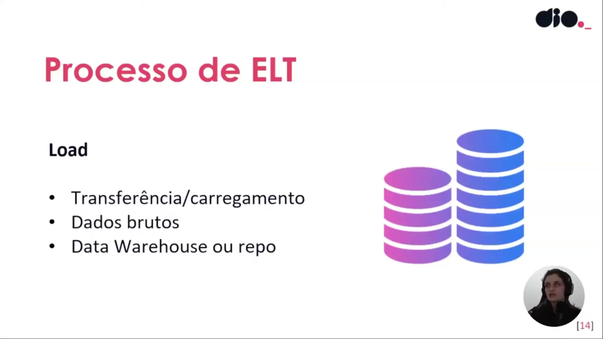
</p>

No contexto do processo de **ELT**, o carregamento (**Load**) representa a fase em que os dados brutos são transferidos diretamente para um repositório central, como um **Data Warehouse** ou um **Data Lake**. Diferente do modelo tradicional, aqui as informações são armazenadas em seu estado original antes de qualquer modificação. O Data Warehouse atua como esse centro unificado, consistindo em um conjunto de bancos de dados que podem estar organizados em modelos relacionais para análises posteriores.

<p align="center">
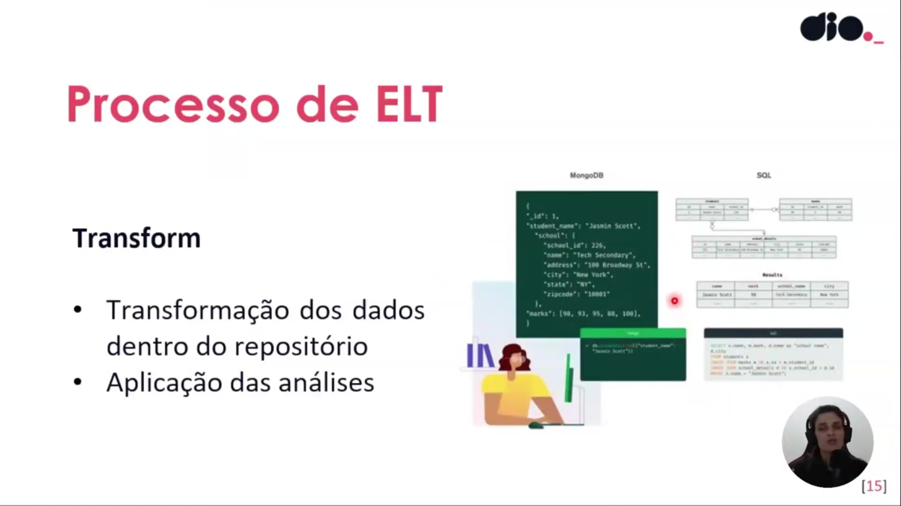
</p>

A etapa de **Transformação** ocorre após os dados já estarem dentro do repositório central. Esta abordagem permite que o mesmo conjunto de dados brutos seja estruturado de maneiras distintas conforme a necessidade, como em documentos (MongoDB) ou em tabelas relacionais (SQL). Ter os dados brutos disponíveis localmente oferece a flexibilidade de aplicar regras de negócio e manipulações específicas sem a necessidade de solicitar novas extrações ao setor de TI sempre que um novo formato for requisitado.

```json
{
  "_id": 1,
  "student_name": "Jasmin Scott",
  "school": {
    "school_id": 226,
    "name": "Tech Secondary",
    "address": "100 Broadway St",
    "city": "New York",
    "state": "NY",
    "zipcode": "10001"
  },
  "marks": [98, 93, 95, 88, 100]
}

```

```sql
SELECT s.name, sc.name AS "school_name"
FROM student s
JOIN school_details sd ON s.id = sd.student_id
JOIN school sc ON sd.school_id = sc.school_id
WHERE s.name = 'Jasmin Scott';

```

<p align="center">
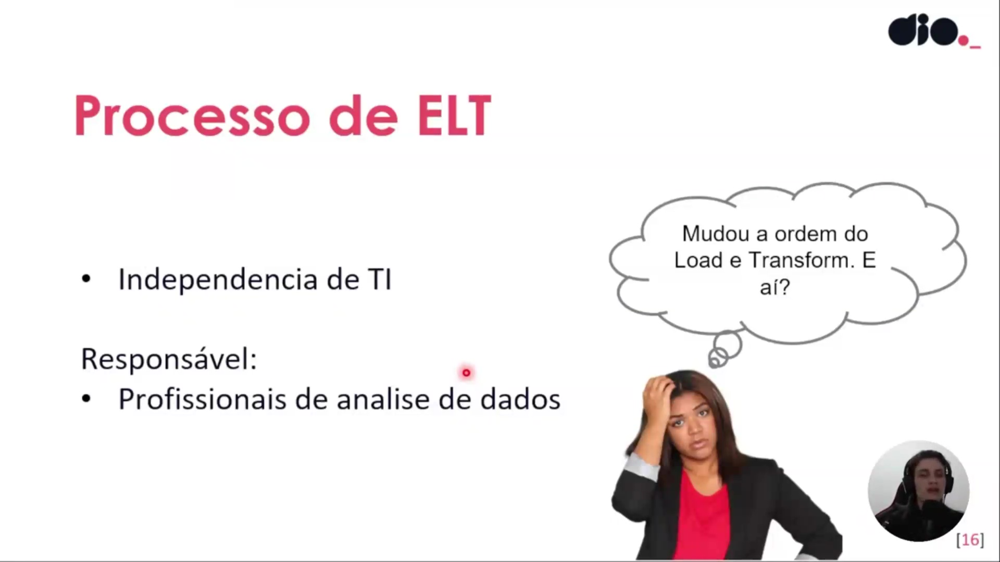
</p>

A inversão da ordem entre o carregamento e a transformação gera uma mudança fundamental de responsabilidades: a **independência de TI**. No fluxo ELT, o engenheiro de dados foca na coleta e extração, enquanto o **analista de dados** assume o papel principal na transformação. Por estar mais próximo do negócio e entender as métricas, KPIs e dores da empresa, o analista tem autonomia para modelar os dados conforme o contexto necessário para a análise.

<p align="center">
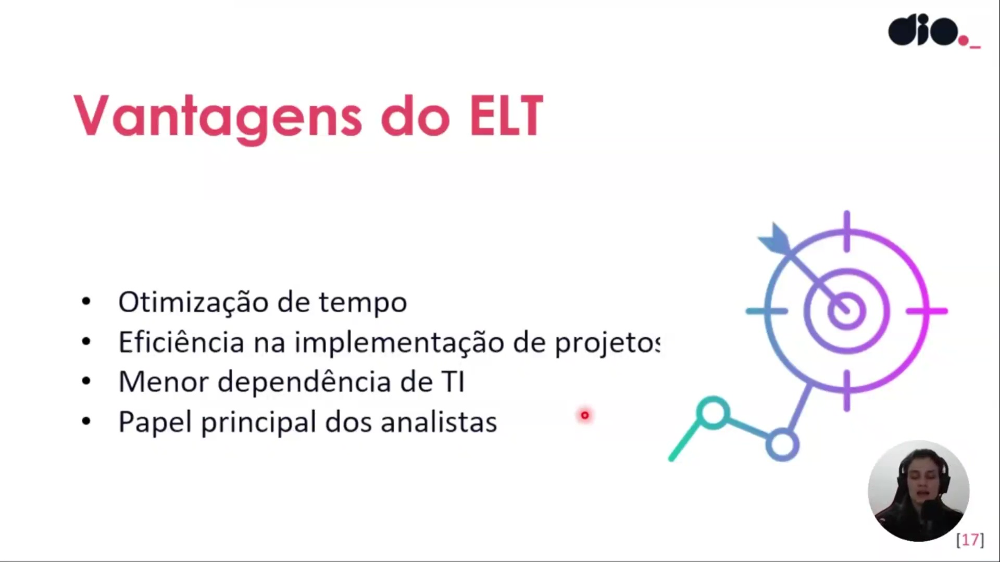
</p>

As principais vantagens da adoção do ELT incluem:

* **Otimização de tempo**: Agilidade no processamento e disponibilidade dos dados.
* **Eficiência na implementação de projetos**: Ciclos de desenvolvimento mais rápidos.
* **Menor dependência de TI**: Autonomia para que os analistas realizem modelagens relacionais e dimensionais.

Essa mudança exige que o analista de BI ou de dados domine técnicas de modelagem para garantir que a transformação reflita corretamente as regras de negócio.


### 🟩 Vídeo 06 - Diferenças entre ETL e ELT

<video width="60%" controls>
  <source src="000-Midia_e_Anexos/bootcamp_ntt_data-modulo.05-curso.03-video_06.webm" type="video/webm">
    Seu navegador não suporta vídeo HTML5.
</video>

link do vídeo: https://web.dio.me/track/engenharia-dados-python/course/fundamentos-teoricos-sobre-etl/learning/9111866a-aada-4e3c-b5be-5e8be3eab09b?autoplay=1

O vídeo apresenta uma comparação técnica detalhada entre os processos de integração de dados **ETL** e **ELT**, destacando como cada um impacta a rotina e a eficiência das empresas. A autora analisa critérios fundamentais como **tempo de carregamento**, **manutenção**, **complexidade** e a disponibilidade de **profissionais qualificados** no mercado de tecnologia. Enquanto o **ETL** é descrito como um método mais rígido e dependente de especialistas de TI para transformar dados antes do armazenamento, o **ELT** surge como uma abordagem moderna e ágil. No modelo **ELT**, a transformação ocorre após o carregamento, o que favorece o uso de **Big Data** e dá maior autonomia aos **analistas de dados**. O conteúdo ressalta que a escolha entre as metodologias depende do **volume de informações**, da infraestrutura em **nuvem** disponível e das necessidades estratégicas de cada negócio. Por fim, explica-se que o **ELT** oferece maior escalabilidade e flexibilidade, embora exija uma arquitetura de dados mais robusta para lidar com registros brutos.

### Anotações

<p align="center">
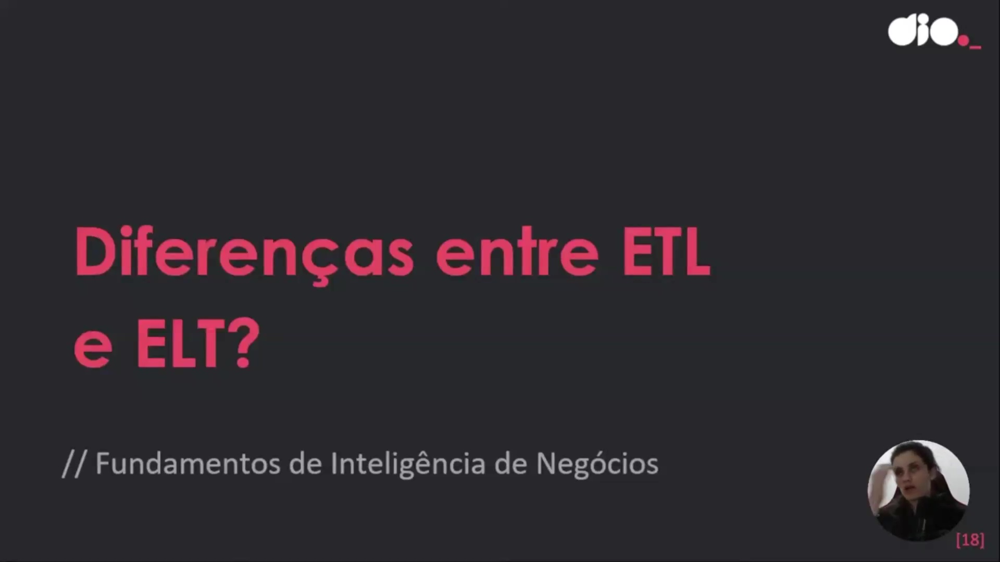
</p>

Esta imagem introduz o tema central da discussão: as diferenças entre os processos de **ETL** (Extract, Transform, Load) e **ELT** (Extract, Load, Transform). O objetivo é analisar o impacto real dessas escolhas no cotidiano de uma empresa, avaliando ganhos de eficiência e os motivos que levam à escolha de um modelo em detrimento do outro.

<p align="center">
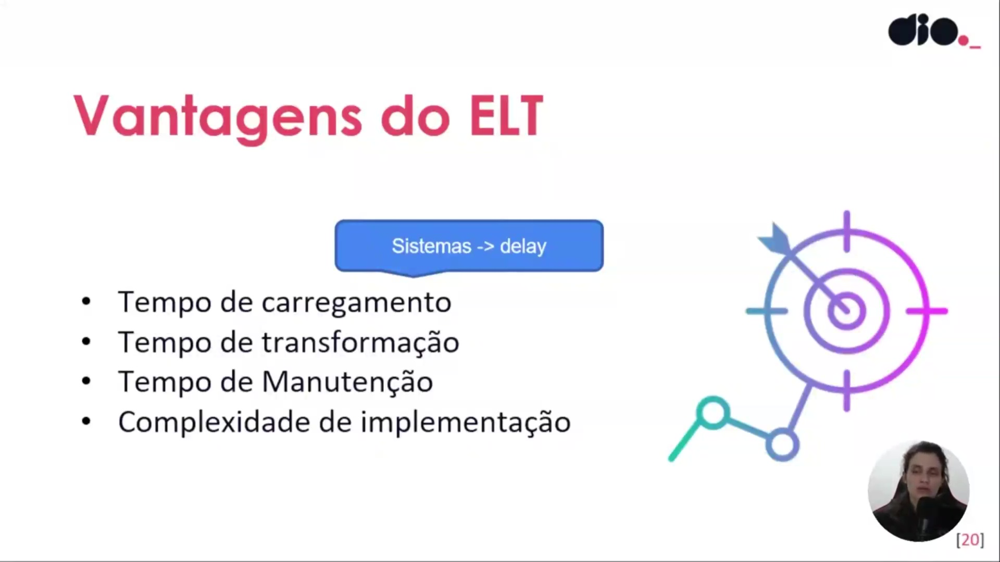
</p>

O slide apresenta os critérios fundamentais para avaliar as vantagens do ELT, destacando o impacto do uso de diversos sistemas distintos no **tempo de carregamento**. No modelo ETL tradicional, a integração de múltiplos sistemas pode causar um *delay* (atraso) considerável, tornando o processo mais lento. Em contrapartida, o ELT tende a ser mais ágil, pois os dados brutos são carregados diretamente para um repositório central sem a necessidade de transformação prévia, reduzindo o tempo de ingestão inicial.

<p align="center">
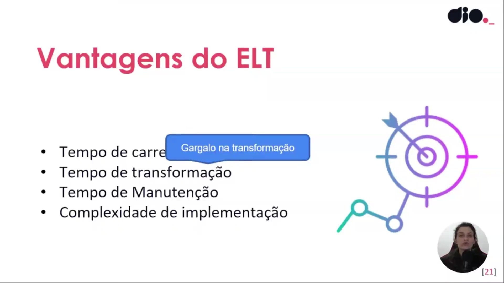
</p>

Aqui o foco recai sobre o **tempo de transformação**. É destacado que a transformação pode se tornar um gargalo, especialmente quando se lida com grandes volumes de dados (Big Data). No ELT, embora o carregamento seja rápido, a fase de transformação posterior exige uma capacidade de processamento significativa para evitar demoras consideráveis na disponibilização da informação final.

<p align="center">
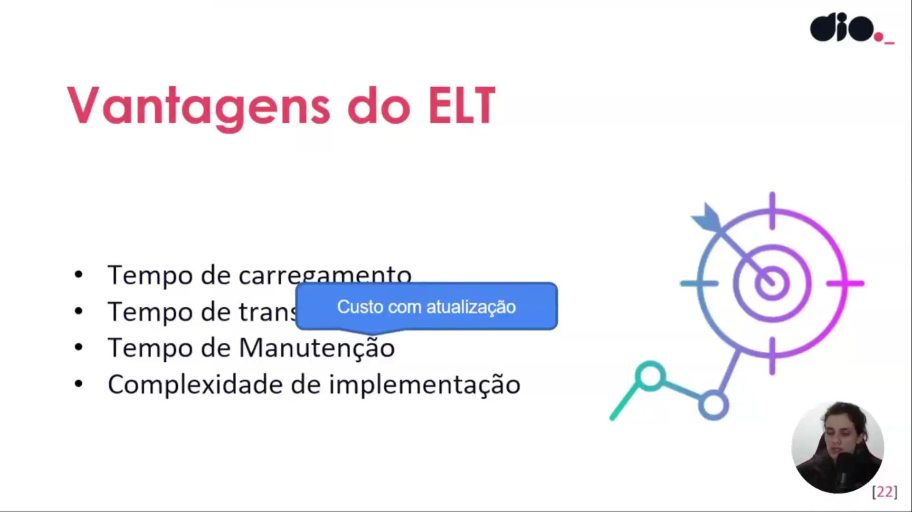
</p>

Este slide aborda o **tempo de manutenção** e o **custo com atualização**. No processo de ETL, a manutenção é vista como uma tarefa mais árdua e cara, pois qualquer alteração ou atualização nos dados exige que todo o fluxo de transformação seja revisitado. Já no ELT, por trabalhar com dados brutos carregados antecipadamente, a manutenção tende a ser mais flexível, permitindo atualizações com menor impacto na infraestrutura de extração.

<p align="center">
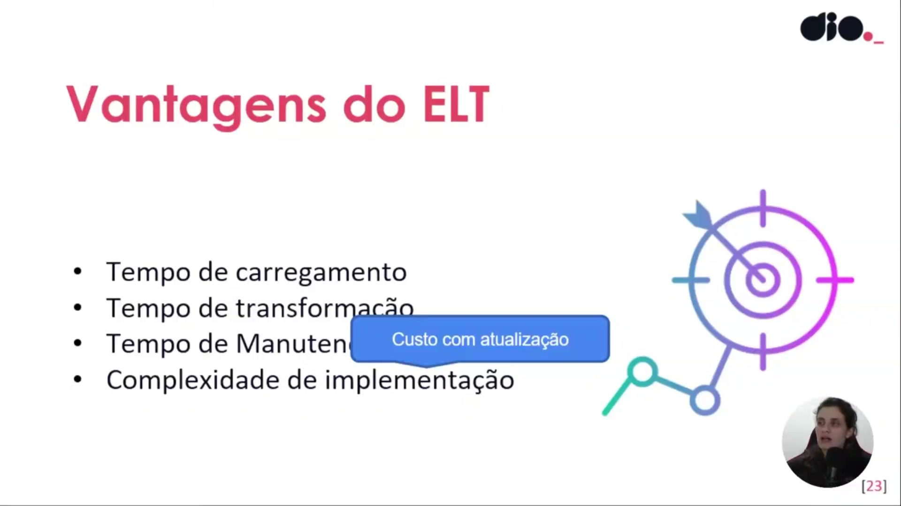
</p>

A imagem enfatiza a **complexidade de implementação**. O ETL é descrito como um processo que exige uma implementação muito bem definida e rígida desde o início, envolvendo altos custos e profissionais altamente qualificados (como engenheiros de dados). O ELT, por sua vez, permite uma abordagem inicial mais simples na extração, embora desloque a complexidade para a fase de transformação dentro do repositório de dados, exigindo uma infraestrutura de processamento robusta.

<p align="center">
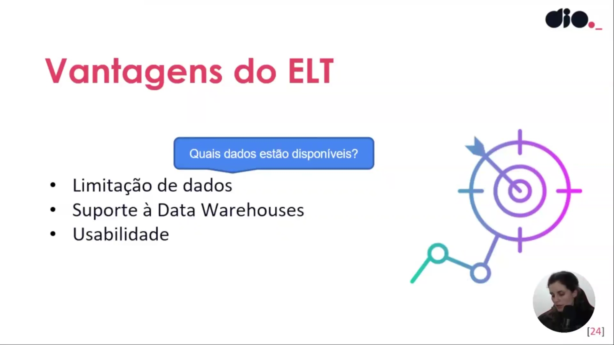
</p>

Este slide levanta a questão fundamental: **"Quais dados estão disponíveis?"**. Ele inicia a discussão sobre a **limitação de dados**, sugerindo que a escolha entre ETL e ELT afeta diretamente a amplitude das informações acessíveis para análise. No ETL, há uma limitação maior, pois se um dado não foi mapeado e transformado no início, ele não estará disponível no destino final.

<p align="center">
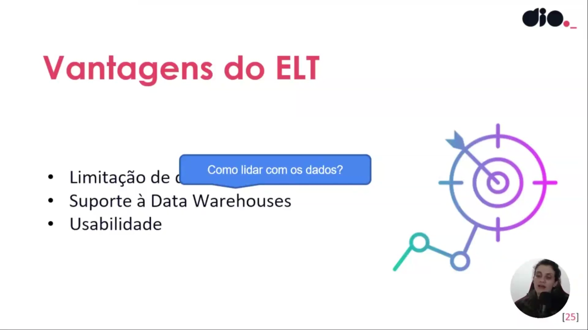
</p>

O foco aqui é reforçar como o ELT lida com a disponibilidade de dados. Diferente do ETL, no ELT não há essa limitação rígida inicial, pois os dados brutos são carregados integralmente. Isso permite que, se um novo dado for necessário futuramente, ele já esteja presente no repositório, bastando apenas realizar a sua transformação.

<p align="center">
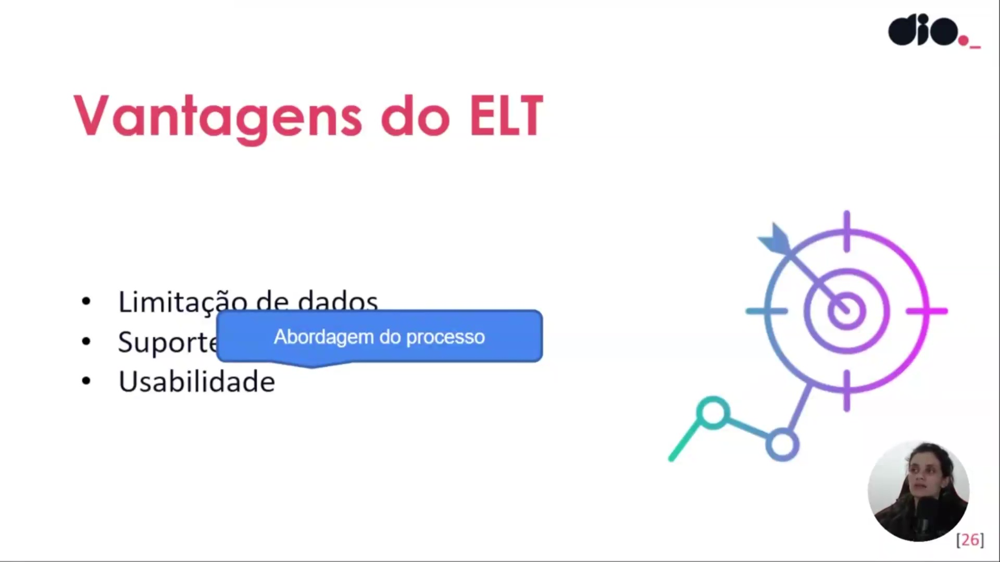
</p>

A imagem destaca a **abordagem do processo** e a **usabilidade**. É apresentada a ideia de que o ETL segue uma estrutura mais rígida e governada pela TI, enquanto o ELT permite uma abordagem mais *ad-hoc* (flexível e conforme a necessidade), escalável e fluida. Isso aumenta a usabilidade para analistas de dados, que ganham autonomia para criar diferentes perspectivas a partir dos dados brutos.

<p align="center">
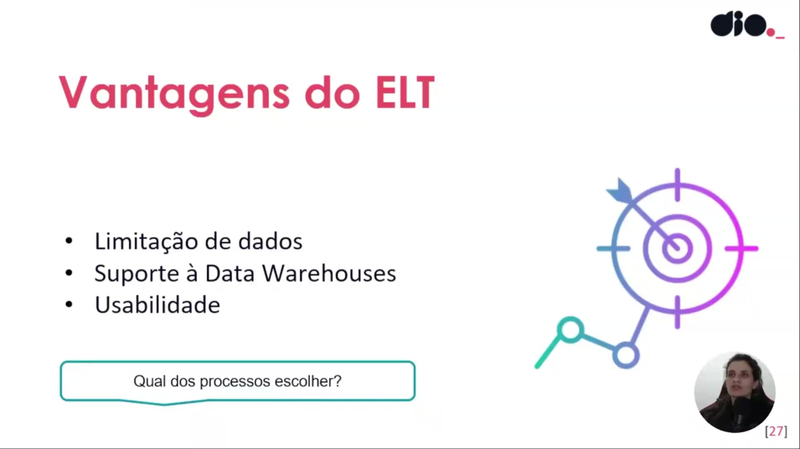
</p>

A imagem final traz a pergunta decisiva: **"Qual dos processos escolher?"**. A conclusão aponta que não há uma resposta única; a escolha depende do volume de dados (Big Data favorece o ELT), da disponibilidade de verba e da velocidade de geração dos dados. Para dados tradicionais com visões muito específicas e menor volume, o ETL ainda pode ser a solução mais adequada.      


### 🟩 Vídeo 07 - Quando usar ETL ou ELT?

<video width="60%" controls>
  <source src="000-Midia_e_Anexos/bootcamp_ntt_data-modulo.05-curso.03-video_07.webm" type="video/webm">
    Seu navegador não suporta vídeo HTML5.
</video>

link do vídeo: https://web.dio.me/track/engenharia-dados-python/course/fundamentos-teoricos-sobre-etl/learning/09313bc4-84ba-460b-80e4-3be4316e1439?autoplay=1

O vídeo discute as diferenças fundamentais entre os processos de integração de dados **ETL** e **ELT**, destacando que a escolha entre eles depende do cenário tecnológico e financeiro de cada empresa. O método **ETL** é apresentado como uma abordagem tradicional e estruturada, ideal para quando o **armazenamento é caro** e os dados precisam ser limpos e reduzidos antes de serem salvos. Já o **ELT** é descrito como uma solução moderna voltada para **Big Data**, aproveitando a queda nos custos de **nuvem** para carregar dados brutos rapidamente e realizar transformações posteriores. O autor enfatiza que, embora o **ELT** ofereça maior **agilidade e flexibilidade** para analistas, ele exige uma infraestrutura mais robusta e gera maior complexidade técnica. Em última análise, o conteúdo defende que não existe uma ferramenta superior, mas sim aquela que melhor resolve o problema de negócio específico.

### Anotações

<p align="center">

</p>

Nesta introdução, abordamos o dilema fundamental na engenharia de dados moderna: a escolha entre as abordagens **ETL (Extract, Transform and Load)** e **ELT (Extract, Load and Transform)**. A decisão entre converter os dados antes de enviá-los ao destino ou carregá-los primeiro para transformá-los depois é uma questão estratégica que depende diretamente do cenário tecnológico e das necessidades de negócio da organização.

<p align="center">
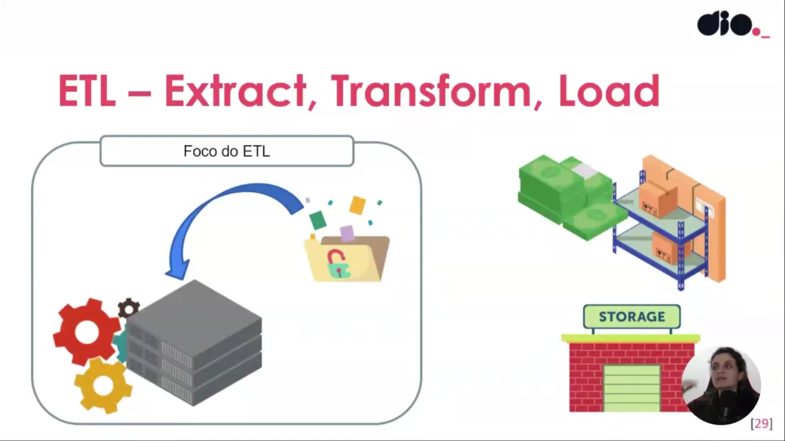
</p>

O foco do **ETL** está centralizado na fase de **Transformação**. Historicamente, esta abordagem foi consolidada em uma época em que o custo de armazenamento (*storage*) era extremamente elevado e o processamento era lento. Por esse motivo, o fluxo prioriza a limpeza, o preenchimento de lacunas e a retirada de redundâncias logo após a extração, garantindo que apenas dados "enxutos", estruturados e já validados ocupem o caro espaço do repositório central. É o modelo indicado para cenários com estruturas bem definidas e onde o destino não possui capacidade robusta para processar grandes volumes de dados brutos.

<p align="center">
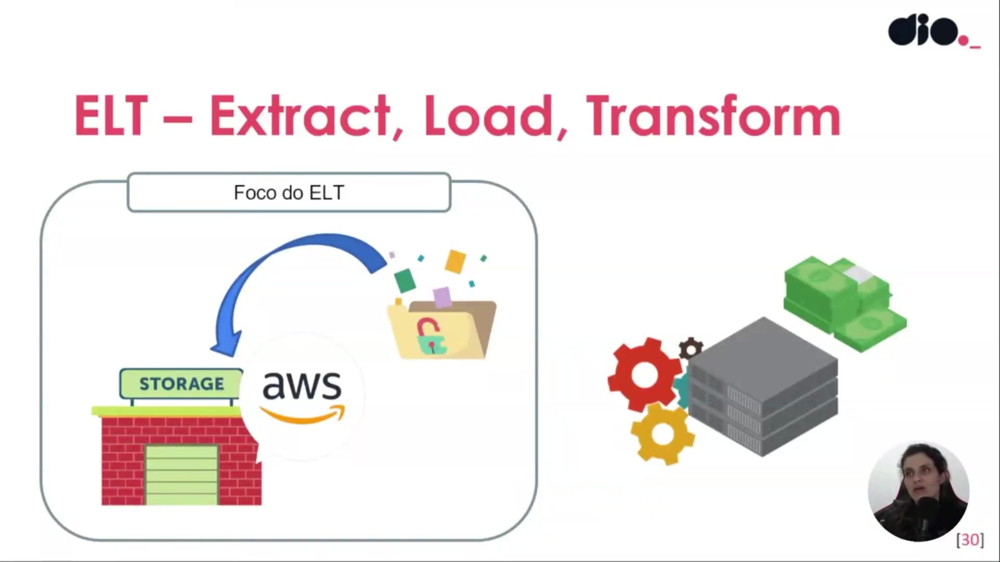
</p>

O foco do **ELT** reflete a mudança de paradigma trazida pela computação em nuvem, como os serviços da **AWS, Azure e GCP**. Atualmente, o armazenamento de dados brutos tornou-se rápido e acessível, tornando o custo de *storage* um problema menor se comparado ao tempo de espera pela disponibilidade do dado. Nesta abordagem, os dados são carregados diretamente no repositório final logo após a extração, permitindo que a transformação ocorra por demanda (*ad hoc*). Isso confere maior agilidade e flexibilidade ao processo, permitindo que analistas e engenheiros adaptem as transformações conforme as regras de negócio evoluem, embora exija uma infraestrutura de destino mais robusta.

# Certificado: Fundamentos Teóricos Sobre ETL

- Link na plataforma: https://hermes.dio.me/certificates/AWMKK1HD.pdf
- Certificado em pdf: [Cerificado-Fundamentos_Teoricos_Sobre_ETL.pdf](000-Midia_e_Anexos/Cerificado-Fundamentos_Teoricos_Sobre_ETL.pdf)
