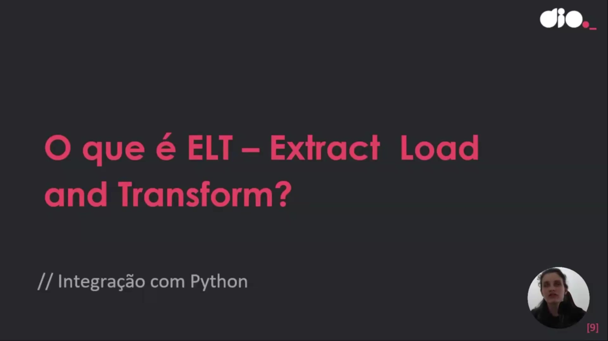
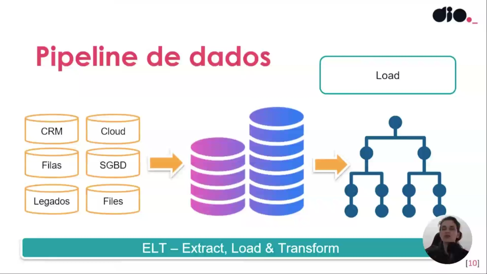
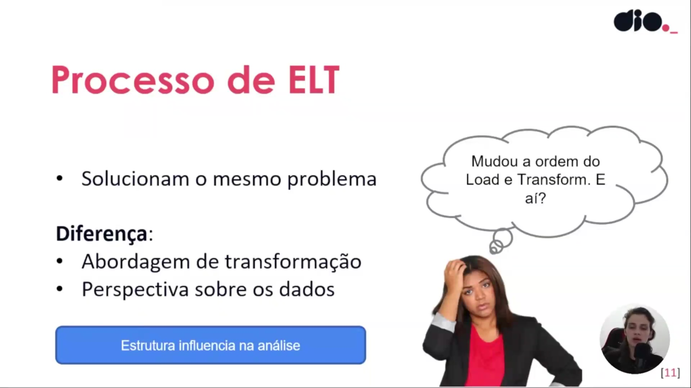
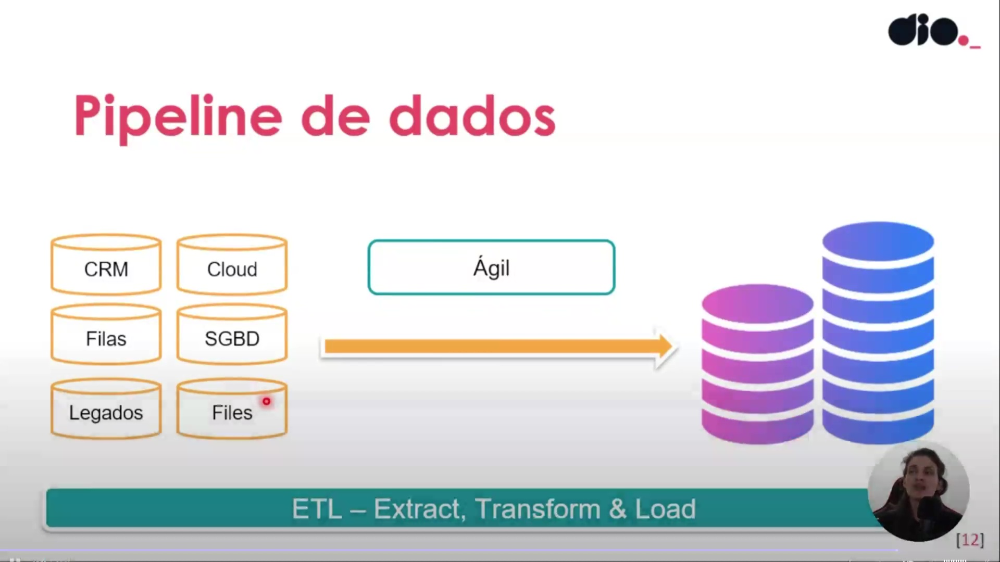
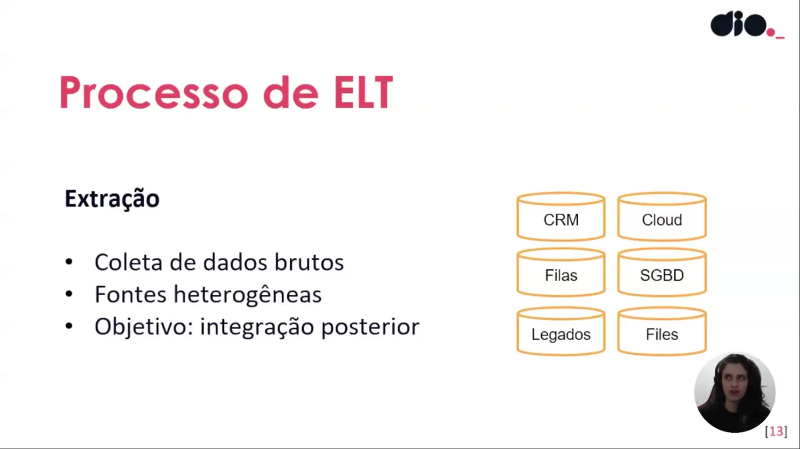
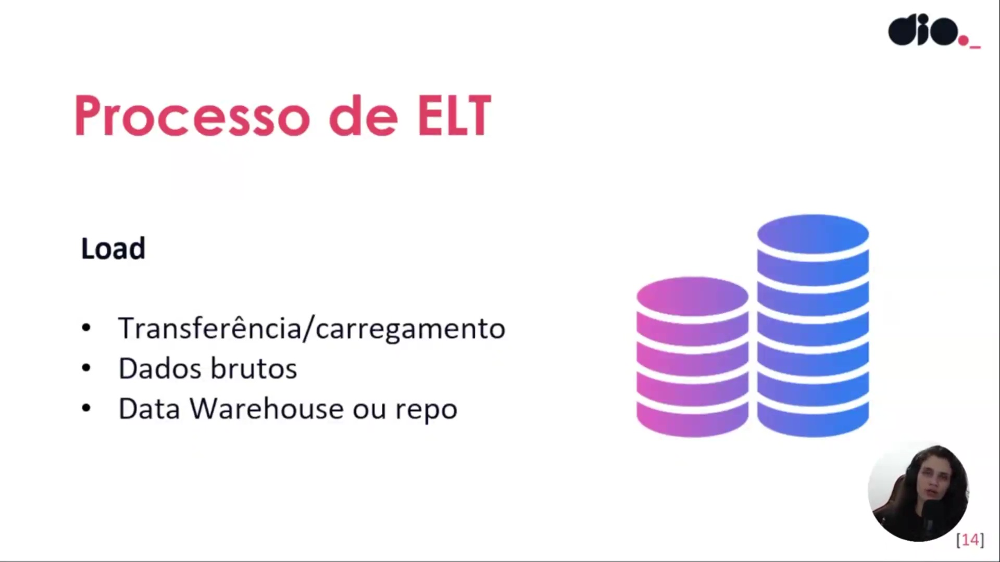

## Instrutor:

- Juliana Mascarenhas (Tech Education Specialist / Sócia (Content Creator) @SimplificandoRedes / Me Modelagem Computacional / Cientista de dados)
- Contato Linkedin: / [juliana-mascarenhas-ds](https://www.linkedin.com/in/juliana-mascarenhas-ds/)

## Parte 1 - Fundamentos de ETL

### 🟩 Vídeo 01 - Breve descrição do curso

<video width="60%" controls>
  <source src="000-Midia_e_Anexos/bootcamp_ntt_data-modulo.05-curso.03-video_01.webm" type="video/webm">
    Seu navegador não suporta vídeo HTML5.
</video>

link do vídeo: https://web.dio.me/track/engenharia-dados-python/course/fundamentos-teoricos-sobre-etl/learning/e4ad0ebd-d019-4332-9e79-f83a8dee11c2?autoplay=1

O vídeo introduz o terceiro curso de uma série voltada aos fundamentos do processamento de dados. O objetivo principal é fornecer uma base teórica rápida e objetiva sobre os processos de ETL (Extração, Transformação e Carga) e ELT (Extração, Carga e Transformação), preparando o aluno para entender as dinâmicas de manipulação de dados em ambientes tecnológicos.

### 🟩 Vídeo 02 - O que é ETL – Extract, Transform and Load

<video width="60%" controls>
  <source src="000-Midia_e_Anexos/bootcamp_ntt_data-modulo.05-curso.03-video_02.webm" type="video/webm">
    Seu navegador não suporta vídeo HTML5.
</video>

link do vídeo: https://web.dio.me/track/engenharia-dados-python/course/fundamentos-teoricos-sobre-etl/learning/93ddbe11-8fd7-4b9f-83c2-de7c3350596a?autoplay=1

O vídeo detalha os conceitos fundamentais dos processos de **ETL (Extração, Transformação e Carga)** e suas variações no campo da **Engenharia de Dados**. O material explica como informações originadas de **fontes heterogêneas**, como bancos de dados, arquivos e sistemas de nuvem, são coletadas e padronizadas para garantir utilidade em análises posteriores. O autor destaca que a **transformação** é essencial para converter estruturas brutas em formatos compatíveis com repositórios finais, como **Data Warehouses** ou **Data Lakes**. Além disso, o texto introduz brevemente o conceito de **ELT**, mencionando que a inversão da ordem das etapas impacta diretamente a modelagem e o custo de armazenamento da solução. O foco principal é fornecer uma base teórica sólida que permita ao profissional aplicar esses princípios independentemente da **ferramenta tecnológica** escolhida, seja ela Python ou Power BI. Por fim, a fonte reforça a importância da **limpeza de dados** para que analistas e cientistas possam extrair insights precisos para a tomada de decisão empresarial.

### Anotações

Nesta introdução aos processos voltados para dados, o foco inicial estabelece a importância de compreender os fundamentos do processamento de dados e da inteligência de negócios. O objetivo é capacitar o profissional a entender a lógica por trás da movimentação de informações, permitindo a aplicação desses conceitos em diversas ferramentas, como Power BI, Python ou sistemas complexos de engenharia de dados, independentemente da modernidade da tecnologia utilizada.

O conceito central apresentado é o **ETL**, sigla para *Extract, Transform and Load* (Extração, Transformação e Carga). Este processo é fundamental para a manipulação de dados, consistindo em três etapas essenciais:

1. **Extrair**: Coletar as informações de suas fontes originais.
2. **Transformar**: Converter os dados brutos em um formato útil e padronizado.
3. **Carregar**: Inserir os dados tratados em um repositório final para que fiquem disponíveis para análise por cientistas e analistas de dados.

O *pipeline* de dados tradicional demonstra como o ETL funciona como uma ponte entre diversas origens e destinos. Os dados podem ser extraídos de fontes variadas, como sistemas **Hadoop**, arquivos de texto (**Flat Files**) e documentos **XML**. Após o processamento, essas informações são consolidadas em estruturas de armazenamento robustas, como o **Data Warehouse** (repositório central de dados da organização) ou o **Data Mart** (recorte específico de dados para uma área de negócio).

O fluxo de dados lida com fontes heterogêneas que possuem diferentes estruturas e níveis de organização. O diagrama detalha as origens comuns e as etapas de tratamento:

* **Fontes de Dados**: As informações podem vir de sistemas de **CRM**, serviços em **Nuvem (Cloud)**, **Filas** de mensagens (sistemas orientados a eventos), bancos de dados (**SGBD**), sistemas **Legados** ou arquivos diversos (**Files**).
* **Processamento (Clean & Analyze)**: Devido à falta de padronização ou presença de redundâncias nas fontes originais, os dados passam por uma etapa de limpeza (**Clean**) para garantir a integridade.
* **ETL**: Todo esse trajeto de extração e transformação prepara os dados para o carregamento final, permitindo que as análises subsequentes reflitam a realidade do negócio de forma precisa.

### 🟩 Vídeo 03 - O que é ELT – Extract, Load and Transform

<video width="60%" controls>
  <source src="000-Midia_e_Anexos/bootcamp_ntt_data-modulo.05-curso.03-video_03.webm" type="video/webm">
    Seu navegador não suporta vídeo HTML5.
</video>

link do vídeo: https://web.dio.me/track/engenharia-dados-python/course/fundamentos-teoricos-sobre-etl/learning/9d2d3d38-bdf6-454c-b8e0-4b90bd7ae19b?autoplay=1

O vídeo aborda a transição do modelo tradicional de **ETL** para a abordagem de **ELT**, destacando como a **inversão das etapas** de carga e transformação impacta o fluxo de dados. Ao carregar as informações em um repositório central antes de tratá-las, as empresas ganham **maior agilidade** e preservam a integridade dos **dados brutos** para diferentes análises futuras. Essa mudança permite que a perspectiva sobre o conteúdo mude conforme a necessidade, sem a perda de dados que ocorreria em uma limpeza prévia. Além disso, o processo transfere parte da responsabilidade da transformação do **engenheiro de dados** para os **analistas**, otimizando o tempo de desenvolvimento. Portanto, o **ELT** surge como uma solução moderna para lidar com o grande volume de dados da **computação em nuvem**, oferecendo um ciclo de vida mais flexível e eficiente.

### Anotações

O conceito de **ELT** (**Extract, Load, Transform**) baseia-se em uma inversão fundamental em relação ao modelo tradicional. Em vez de transformar os dados antes do carregamento, o processo consiste em extrair as informações e realizar o carregamento diretamente em um repositório central para, somente então, realizar a transformação. Embora pareça uma mudança simples, essa inversão não é trivial e altera a dinâmica de como os dados são manipulados dentro de um ecossistema tecnológico.

No pipeline de dados do ELT, a origem das informações pode abranger diversos sistemas, como **CRM**, ferramentas em **Cloud**, **Filas**, **SGBDs**, sistemas **Legados** e arquivos diversos (**Files**). A característica marcante aqui é o envio desses dados brutos diretamente para o estágio de **Load**. Esse modelo ganhou força com a evolução da computação em nuvem e dos **Data Warehouses** modernos, que permitem centralizar e processar grandes volumes de dados de forma otimizada, atendendo às demandas de Big Data de maneira mais eficiente do que o ETL tradicional.

A mudança na ordem entre o carregamento e a transformação traz impactos diretos na governança e na análise dos dados. Ao carregar os dados primeiro, preserva-se o estado bruto da informação, o que oferece maior controle e flexibilidade. Isso permite que a perspectiva sobre os dados mude ao longo do tempo sem a necessidade de reprocessar toda a extração. Além disso, essa abordagem transfere parte da responsabilidade da transformação para os analistas e cientistas de dados, permitindo que a estrutura organizacional da informação seja moldada conforme a necessidade específica de cada análise.

O principal ganho do processo de ELT em comparação ao fluxo tradicional é a **agilidade**. Como a etapa de limpeza e organização profunda (transformação) é postergada, o esforço inicial de engenharia para disponibilizar os dados no repositório é drasticamente reduzido. Ao focar primeiro na extração e na carga imediata, o fluxo de trabalho torna-se mais veloz, permitindo que os dados cheguem ao ambiente de destino de forma muito mais rápida, poupando trabalho manual exaustivo nas fases iniciais do pipeline.      

### 🟩 Vídeo 04 - Processo de Extração de Dados - ELT

<video width="60%" controls>
  <source src="000-Midia_e_Anexos/bootcamp_ntt_data-modulo.05-curso.03-video_04.webm" type="video/webm">
    Seu navegador não suporta vídeo HTML5.
</video>

link do vídeo: https://web.dio.me/track/engenharia-dados-python/course/fundamentos-teoricos-sobre-etl/learning/9a4c6d2c-549d-4cfa-a557-e46b1952bf7b?autoplay=1

O vídeo aborda as diferenças fundamentais entre **dados estruturados, não estruturados e semiestruturados** no contexto dos processos de integração de dados. A explicação destaca que **bancos de dados relacionais** exigem estruturas rígidas e regras pré-definidas, enquanto dados brutos, como vídeos e e-mails, demandam maior flexibilidade. O conteúdo diferencia os fluxos **ETL e ELT**, enfatizando que carregar informações brutas antes da transformação acelera a coleta inicial. Essa abordagem permite maior agilidade, pois elimina a necessidade de verificações imediatas de esquemas ou restrições complexas. Por fim, o material reforça a importância de organizar esses conjuntos diversos para viabilizar **análises de dados** eficientes em repositórios centrais.

### Anotações

No processo de **ELT**, a etapa inicial de **Extração** foca na **coleta de dados brutos** provenientes de fontes heterogêneas. Esses dados, que muitas vezes não possuem estruturação ou organização prévia, são extraídos de diversas origens tecnológicas para uma integração posterior, incluindo:

* **CRM e SGBD:** Sistemas de relacionamento com o cliente e bancos de dados relacionais tradicionais.
* **Cloud e Files:** Armazenamento em nuvem e arquivos avulsos (como CSVs).
* **Filas e Sistemas Legados:** Mensageria em tempo real e sistemas antigos da organização.

Diferente do modelo tradicional, aqui os dados são capturados em seu estado original, independentemente de possuírem redundâncias ou lacunas, para que a carga ocorra de forma ágil.

A segunda etapa do processo é o **Load (Carga)**, que consiste na transferência e no carregamento dos **dados brutos** extraídos anteriormente. Nesta fase, as informações são enviadas diretamente para um **Data Warehouse** ou um repositório central.

A principal característica desta etapa no modelo ELT é a velocidade. Como não há uma transformação prévia, o sistema não precisa verificar **constraints** (restrições), chaves primárias ou tipos de dados específicos antes da inserção. Essa ausência de uma estrutura rígida de checagem imediata permite que grandes volumes de dados, sejam eles estruturados, não estruturados ou semiestruturados, sejam armazenados rapidamente para processamento futuro.      

### 🟩 Vídeo 05 - Load, Transform e Vantagens do ELT

<video width="60%" controls>
  <source src="000-Midia_e_Anexos/bootcamp_ntt_data-modulo.05-curso.03-video_05.webm" type="video/webm">
    Seu navegador não suporta vídeo HTML5.
</video>

link do vídeo: https://web.dio.me/track/engenharia-dados-python/course/fundamentos-teoricos-sobre-etl/learning/013c99fd-3c64-47af-bb8d-280579bd8656?autoplay=1

### 🟩 Vídeo 06 - Diferenças entre ETL e ELT

<video width="60%" controls>
  <source src="000-Midia_e_Anexos/bootcamp_ntt_data-modulo.05-curso.03-video_06.webm" type="video/webm">
    Seu navegador não suporta vídeo HTML5.
</video>

link do vídeo:

### 🟩 Vídeo 07 - Quando usar ETL ou ELT?

<video width="60%" controls>
  <source src="000-Midia_e_Anexos/bootcamp_ntt_data-modulo.05-curso.03-video_07.webm" type="video/webm">
    Seu navegador não suporta vídeo HTML5.
</video>

link do vídeo:

##  Materiais de Apoio

# Certificado: 

- Link na plataforma: 
- Certificado em pdf: 
