## Instrutor:

- Juliana Mascarenhas (Tech Education Specialist / Sócia (Content Creator) @SimplificandoRedes / Me Modelagem Computacional / Cientista de dados)
- Contato Linkedin: / [juliana-mascarenhas-ds](https://www.linkedin.com/in/juliana-mascarenhas-ds/)

## Parte 1 - Primeiros Passos com Power BI

### 🟩 Vídeo 01 - O que é o Power BI?

<video width="60%" controls>
  <source src="000-Midia_e_Anexos/bootcamp_ntt_data-modulo.05-curso.04-video_01.webm" type="video/webm">
    Seu navegador não suporta vídeo HTML5.
</video>

link do vídeo: https://web.dio.me/track/engenharia-dados-python/course/primeiros-passos-com-power-bi/learning/adbc7cbe-940c-4e33-a662-c8e5bd6adf34?autoplay=1

<p align="center">

</p>

Esta etapa inicial introduz os fundamentos de análise de dados dentro do ecossistema Power BI. O objetivo é compreender o conceito de *self-service BI*, uma abordagem que visa descentralizar a análise de dados, permitindo que analistas de negócios e profissionais sem formação técnica em TI ganhem independência. Dessa forma, é possível realizar diagnósticos e gerar insights sem a necessidade de domínio profundo em lógica de programação complexa.

<p align="center">

</p>

A análise de dados é categorizada em quatro pilares principais, dependendo do objetivo do negócio:

* **Descritiva:** Focada em responder "O que aconteceu?", caracterizando a base de dados atual.
* **Diagnóstica:** Busca entender "Por que aconteceu?", identificando causas e padrões.
* **Preditiva:** Utiliza modelos para projetar "O que vai acontecer?".
* **Prescritiva:** Indica "O que fazer?", sugerindo ações baseadas nas previsões.

No contexto do Power BI, o foco inicial recai sobre as análises descritiva e diagnóstica. Para análises preditivas avançadas, o uso de linguagens como Python ou Java (esta última muito comum em engenharia de dados) torna-se necessário.

<p align="center">

</p>

O Power BI define-se como uma ferramenta que "preenche a lacuna entre os dados e a tomada de decisão". Sua interface é projetada para ser amigável e baseada no conceito de "arrastar e soltar", facilitando a criação de relatórios e dashboards. Enquanto os relatórios oferecem visualizações detalhadas e segmentadas, os dashboards permitem uma visão consolidada para o monitoramento estratégico dos indicadores de negócio.

<p align="center">
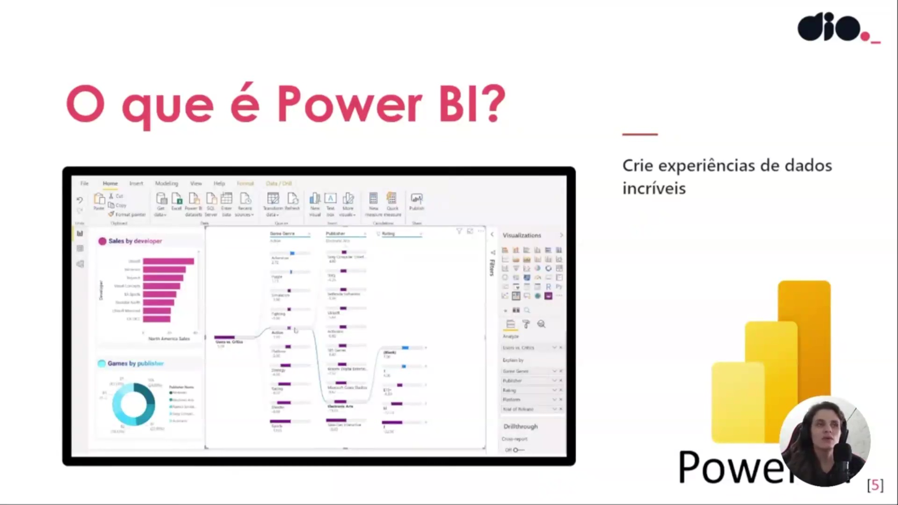
</p>

A plataforma permite a criação de experiências de dados ricas através de diversos recursos visuais, como árvores hierárquicas, gráficos de barras (ex: *Sales by developer*) e gráficos de rosca (ex: *Games by publisher*). Além da facilidade de uso, o Power BI oferece extensibilidade para usuários avançados, permitindo a execução de scripts em R e Python diretamente na ferramenta para análises estatísticas e científicas mais profundas.

<p align="center">

</p>

Uma das grandes forças do Power BI é sua capacidade de integração com uma vasta gama de fontes de dados. Através do menu "Get Data", é possível conectar-se a:

* **Arquivos e Bancos de Dados Locais:** Excel, CSV, SQL Server, MySQL, PostgreSQL e SAP.
* **Soluções em Nuvem:** Azure, Amazon Redshift, Google BigQuery e Snowflake.
* **Plataformas de Negócio:** Power Platform (Power Apps e Power Automate) e serviços online.

Essa versatilidade permite que a ferramenta lide tanto com pequenos conjuntos de dados quanto com Big Data, integrando-se a ecossistemas como o Hadoop para processamento de grandes volumes.


### 🟩 Vídeo 02 - Por que Power BI?

<video width="60%" controls>
  <source src="000-Midia_e_Anexos/bootcamp_ntt_data-modulo.05-curso.04-video_02.webm" type="video/webm">
    Seu navegador não suporta vídeo HTML5.
</video>

link do vídeo: https://web.dio.me/track/engenharia-dados-python/course/primeiros-passos-com-power-bi/learning/58535aa8-ece3-4962-a5e9-0f04ae4c9168?autoplay=1

O vídeo aborda a relevância do Power BI no cenário atual de análise de dados, destacando que decisões assertivas dependem de informações de alta qualidade e não apenas de intuição. O autor enfatiza que a maior parte do trabalho de um especialista consiste na coleta e limpeza de dados, visto que bases perfeitas são raras na prática. A ferramenta é apresentada como líder de mercado, oferecendo independência aos profissionais de negócios e reduzindo a sobrecarga das equipes de TI. Além disso, a fonte menciona a integração com o ecossistema Microsoft e a facilidade de compartilhamento de relatórios como grandes diferenciais competitivos. Por fim, o material introduz a parte prática de uma formação, orientando sobre a instalação do software e a exploração de suas funcionalidades.

### Anotações

<p align="center">

</p>

A análise de dados eficiente permite **tomar decisões com confiança**, distanciando o processo de escolhas baseadas apenas no "feeling" ou intuição. Para que esse embasamento seja real, é fundamental que a **base de dados seja de alta qualidade**. Não basta utilizar ferramentas avançadas como o Power BI para criar dashboards visualmente impactantes se os dados de origem forem incoerentes ou infundados, pois isso resultaria em conhecimentos equivocados. No cenário real, os dados raramente estão prontos; o profissional deve identificar lacunas e investir a maior parte de seu tempo nos processos de **coleta e limpeza de dados**.

<p align="center">

</p>

O ecossistema da Microsoft oferece uma série de ferramentas integradas que potencializam o uso do Power BI:

* **Power BI**: Utilizado para a criação e compartilhamento de dashboards, permitindo a publicação e o envio de relatórios (recursos que podem envolver custos de licenciamento acessíveis para empresas e profissionais).
* **Power Automate**: Focado na automação de processos e tomadas de decisão.
* **Power Apps**: Permite a criação de aplicativos através do conceito de *Low Code* (arrasta e larga), facilitando a persistência de informações integradas aos dados.
* **Power Gateway**: Software essencial para realizar a comunicação e publicação de dados quando se trabalha com dashboards online.

<p align="center">

</p>

O Power BI promove uma **cultura controlada por dados para todos** através do conceito de *self-service software*. Isso significa que profissionais de diferentes áreas, não apenas do setor de TI, ganham independência para analisar suas próprias informações. Essa descentralização é benéfica para a organização, pois libera a equipe técnica de TI para demandas mais complexas, enquanto os analistas de negócio conseguem obter *insights* de última hora de forma ágil e autônoma.

<p align="center">
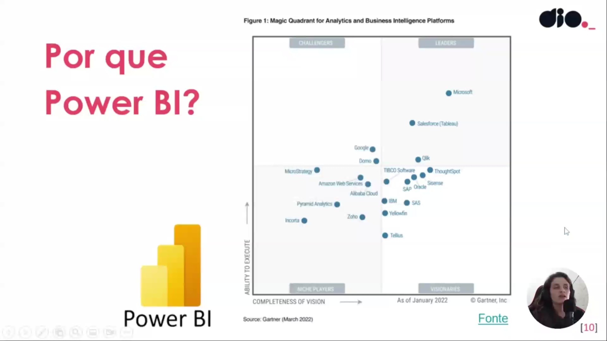
</p>

O posicionamento de mercado do Power BI é validado pelo **Quadrante Mágico da Gartner (março de 2022)** para plataformas de Analytics e Business Intelligence. No gráfico, a **Microsoft aparece como líder isolada**, posicionada no quadrante superior direito (Leaders), seguida por Tableau e Qlik. Estar no topo deste quadrante reflete tanto a "Habilidade de Execução" quanto a "Plenitude de Visão" da ferramenta, justificando o foco no aprendizado desta plataforma para fundamentação em análise de dados.


### 🟩 Vídeo 03 - Explorando Power BI Service (Browser) - Parte 1

<video width="60%" controls>
  <source src="000-Midia_e_Anexos/bootcamp_ntt_data-modulo.05-curso.04-video_03.webm" type="video/webm">
    Seu navegador não suporta vídeo HTML5.
</video>

link do vídeo: https://web.dio.me/track/engenharia-dados-python/course/primeiros-passos-com-power-bi/learning/c9ff68f8-125b-406b-8603-489c843c8817?autoplay=1

O vídeo apresenta uma introdução prática ao ecossistema do Power BI, destacando as diferenças entre as versões Desktop e Web (browser). O foco principal recai sobre a navegação na interface online, a utilização de conjuntos de dados de exemplo (samples) e a funcionalidade de Scorecards para o monitoramento estratégico de metas e KPIs. O conteúdo enfatiza a importância de plataformas externas como Kaggle e GitHub para o desenvolvimento de portfólios e o treinamento de cientistas de dados.

### Anotações

<p align="center">

</p>

O ponto de partida para utilizar a ferramenta é o site oficial do Microsoft Power BI. Nele, o usuário encontra as opções principais para começar a explorar a plataforma, com destaque para o botão de início gratuito. Embora o foco da aplicação de alto desempenho seja o desenvolvimento local, a Microsoft oferece caminhos para que o usuário experimente as funcionalidades de análise de dados diretamente pelo navegador.

Link: https://powerbi.microsoft.com/pt-br/

<p align="center">

</p>

Ao avançar para a área de introdução, a plataforma detalha as possibilidades de uso, como a obtenção de insights significativos e a criação de relatórios de análise visual. Nesta etapa, o usuário é incentivado a escolher entre descobrir relatórios relevantes, extrair insights ou compartilhar essas informações com a equipe, consolidando o caráter colaborativo do ecossistema Power BI.

<p align="center">
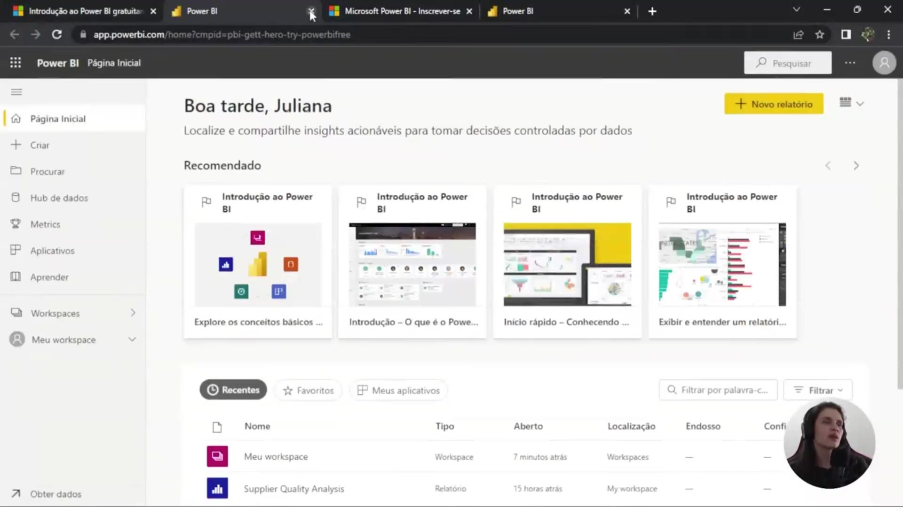
</p>

A interface do Power BI no browser (Serviço do Power BI) apresenta uma organização baseada em uma barra lateral de navegação. Na página inicial, o usuário tem acesso rápido a tutoriais de introdução, como "Explore os conceitos básicos" e "Início rápido", além de visualizar os itens recentes e os espaços de trabalho disponíveis, como o "Meu workspace".

<p align="center">

</p>

Dentro do ambiente web, o menu lateral permite alternar entre diferentes visões:

* **Página Inicial:** Visão geral e recomendações.
* **Criar:** Início de novos relatórios.
* **Procurar:** Localização de relatórios e dashboards existentes.
* **Hub de dados:** Centralização de conjuntos de dados disponíveis.
* **Metrics:** Acompanhamento de indicadores e scorecards.
* **Workspaces:** Áreas de trabalho específicas para diferentes projetos ou contextos.

<p align="center">

</p>

Na aba **Criar**, o sistema oferece opções para adicionar dados e iniciar um relatório. É possível colar dados manualmente, escolher um conjunto de dados já publicado ou até optar pela criação automática de um relatório predefinido. Caso a fonte de dados desejada não esteja disponível na web, a plataforma sugere o uso do Power BI Desktop para maior flexibilidade.

<p align="center">

</p>

O **Hub de dados** funciona como um local central para gerenciar e descobrir dados em toda a organização. Um exemplo prático disponível é o "Supplier Quality Analysis Sample", um conjunto de dados de exemplo (sample) fornecido pela Microsoft para que o usuário possa explorar a estrutura de dados e as possibilidades de visualização sem precisar importar arquivos externos inicialmente.

<p align="center">

</p>

A seção de **Métricas (Metrics)** é voltada para o acompanhamento colaborativo de metas de negócio. Através de **scorecards**, gestores e equipes podem monitorar o desempenho de indicadores cruciais. A plataforma oferece diversos modelos prontos (samples), como scorecards para educação, vendas, marketing e recursos humanos, que unificam dados e objetivos em uma única interface.

<p align="center">

</p>

Ao abrir um exemplo como o **Education Sample**, o scorecard exibe métricas detalhadas divididas por status: "No prazo", "Em risco" ou "Concluído". Cada item mostra o valor atual em relação à meta (ex: 34/45), quem é o proprietário daquela métrica e o progresso histórico, permitindo uma análise rápida se os objetivos estratégicos da organização estão sendo atingidos.

<p align="center">

</p>

Para cada métrica individual no scorecard, é possível abrir um painel de detalhes que apresenta o histórico e o período de tempo em formato gráfico. Isso fornece uma visão granular da evolução dos dados, facilitando a identificação de tendências ou problemas em metas específicas, como o engajamento de estudantes ou a satisfação em pesquisas trimestrais.


### 🟩 Vídeo 04 - Explorando Power BI Service (Browser) - Parte 2

<video width="60%" controls>
  <source src="000-Midia_e_Anexos/bootcamp_ntt_data-modulo.05-curso.04-video_04.webm" type="video/webm">
    Seu navegador não suporta vídeo HTML5.
</video>

link do vídeo: https://web.dio.me/track/engenharia-dados-python/course/primeiros-passos-com-power-bi/learning/3e2109f5-b2e4-4dbb-a08e-8b00737d8689?autoplay=1

Este conteúdo apresenta uma exploração técnica da interface web do Power BI, focando na navegação de métricas, utilização de aplicativos integrados e análise de amostras de dados (samples). O instrutor detalha as funcionalidades de visualização interativa, como mapas e gráficos dinâmicos, e estabelece distinções fundamentais entre relatórios, dashboards e workspaces, preparando o usuário para a transição ao Power BI Desktop.

### Anotações

<p align="center">
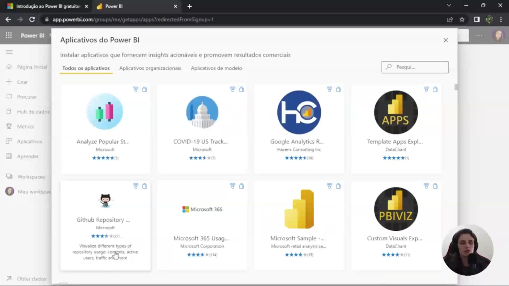
</p>

Nesta etapa, exploramos a seção de **Aplicativos** no Power BI Service. A interface apresenta opções para obter novos aplicativos ("Get apps"), destacando a integração com serviços externos e modelos prontos.

* **Integrações:** É possível conectar-se a serviços como GitHub, LinkedIn e outros produtos Microsoft.
* **Samples (Amostras):** Existem diversos templates disponíveis para estudo e customização.
* **Objetivo:** Facilitar a criação de ambientes analíticos sem começar do zero, utilizando estruturas pré-definidas para diferentes contextos organizacionais.

<p align="center">
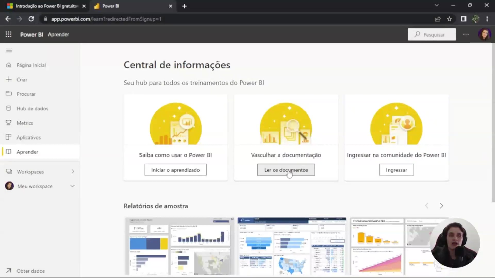
</p>

A tela exibe o **Centro de Aprendizagem** e a área de obtenção de dados. Aqui, o Power BI oferece recursos fundamentais para quem está iniciando ou busca aprofundamento:

1. **Documentação:** Acesso direto à documentação oficial, essencial para entender funcionalidades complexas.
2. **Comunidade:** Links para ingressar na comunidade Power BI e trocar experiências.
3. **Amostras de Dados:** Listagem de conjuntos de dados fictícios para prática, como "Análise de Oportunidade", "Vendas Regionais" e "Gastos de TI".

<p align="center">
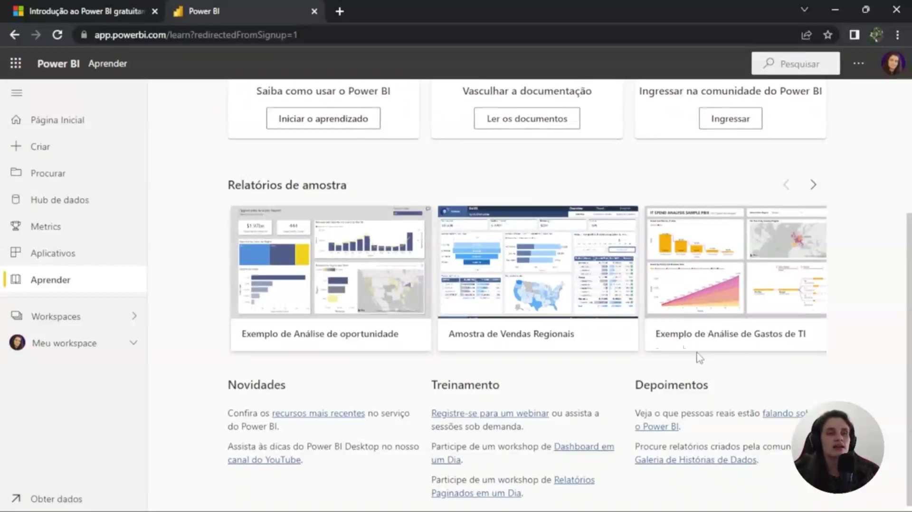
</p>

O instrutor seleciona especificamente a amostra **"Exemplo de Análise com Gastos de TI"** (IT Spend Analysis). Ao clicar nesta opção, o Power BI inicia o processo de provisionamento de um ambiente de demonstração que inclui dados, relatórios e painéis pré-configurados, permitindo ao usuário explorar as capacidades da ferramenta em um cenário de negócios simulado.

<p align="center">

</p>

Durante o carregamento da amostra, é comum enfrentar um tempo de espera. Este atraso no processamento pode ser influenciado por diversos fatores técnicos:

* Qualidade da conexão com a internet.
* Tamanho da base de dados sendo importada.
* Carga de processamento nos servidores do Power BI ou na máquina local.

Essa tela de "carregando" ilustra o comportamento real da plataforma ao lidar com a importação de novos datasets e a criação automática de dashboards.

<p align="center">
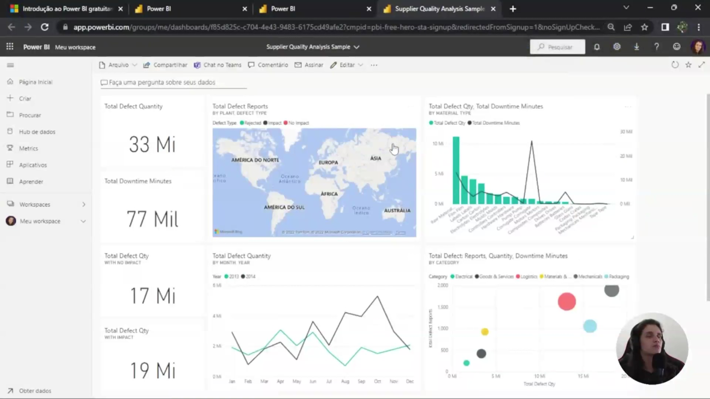
</p>

Diante da demora no carregamento, o instrutor navega para a seção de **Workspaces** (Áreas de Trabalho). O Workspace funciona como um contêiner organizacional onde residem os artefatos do Power BI:

* Painéis (Dashboards)
* Relatórios
* Conjuntos de dados (Datasets)

A imagem mostra a tentativa de acessar o "Meu Workspace" para verificar se o conteúdo foi criado ou para acessar conteúdos existentes.

<p align="center">
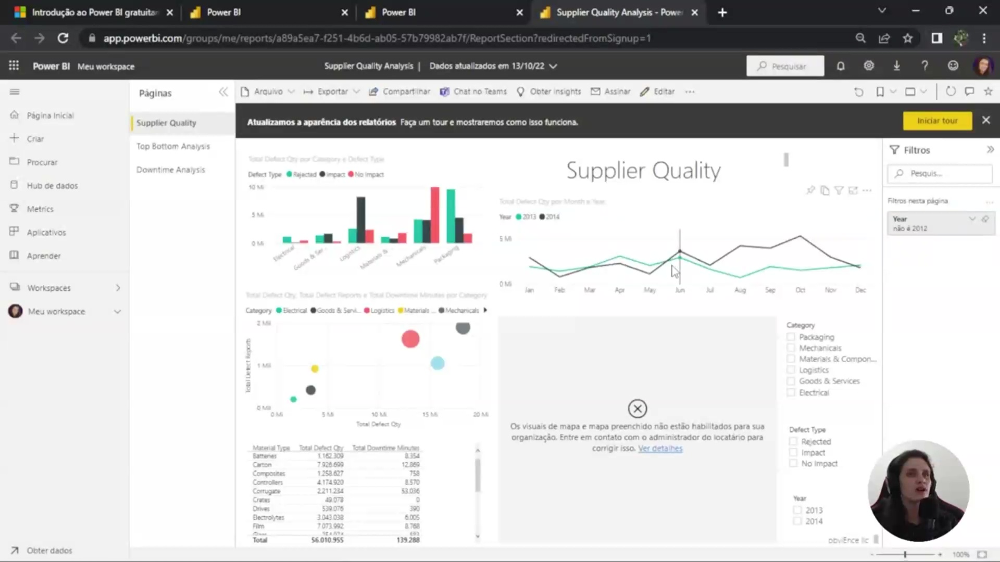
</p>

Dentro do Workspace, a lista de conteúdos é atualizada. É possível identificar a criação bem-sucedida do **"Supply Quality Sample"** (Amostra de Qualidade de Fornecedor). A interface lista os diferentes tipos de arquivos disponíveis na área de trabalho, permitindo distinguir entre Painéis (ícone de velocímetro) e Relatórios/Datasets, consolidando a visão de gerenciamento de ativos dentro do Power BI Service.

<p align="center">
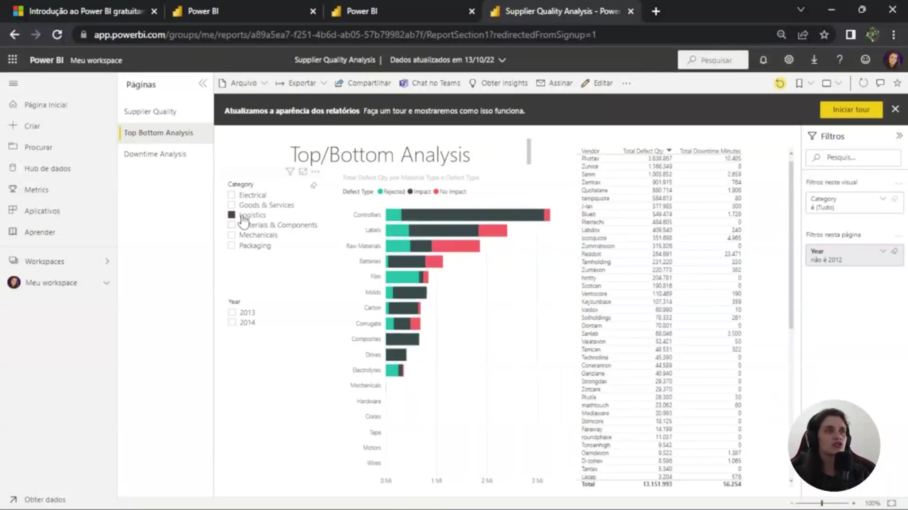
</p>

Esta visualização apresenta um **Painel (Dashboard)** completo. Diferente de um relatório paginado, o painel agrega as informações mais críticas em uma única tela ("at a glance"). Os elementos visuais incluem:

* **Cartões (Cards):** Para exibir números grandes e indicadores nominais importantes.
* **Mapas:** Para análise de distribuição geográfica.
* **Gráficos de Linha e Dispersão:** Para análise de tendências e correlações.
* **Gráficos Combinados:** Barras com linhas para comparar métricas distintas simultaneamente.

<p align="center">
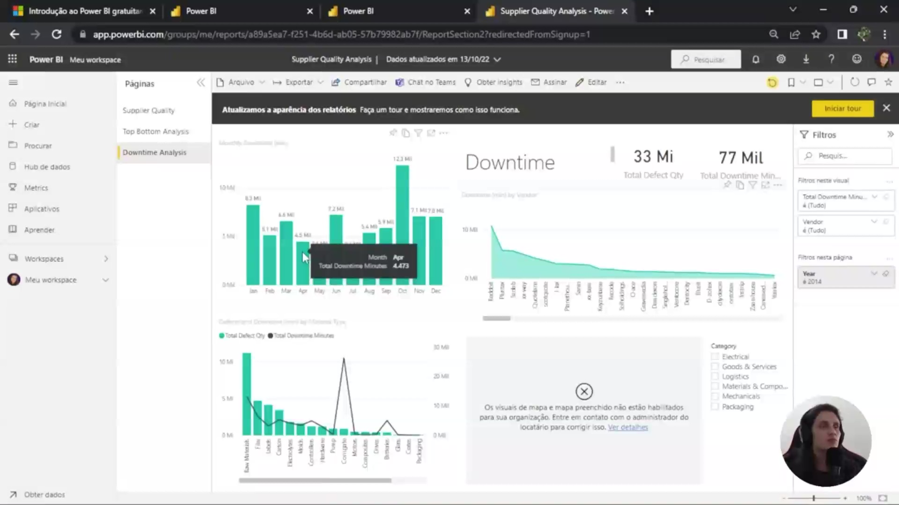
</p>

Aqui acessamos o **Relatório** "Supplier Quality Analysis". Diferentemente do painel, o relatório permite uma análise mais granular e detalhada.

* **Tabelas:** Utilizadas quando é necessário visualizar os dados brutos ou detalhes específicos que gráficos não mostram com precisão.
* **Filtros Interativos:** A funcionalidade de *Top-bottom analysis* permite segmentar a visão por categorias (como Elétrica, Logística, Serviços), alterando dinamicamente os dados apresentados na tabela e nos gráficos adjacentes.

<p align="center">
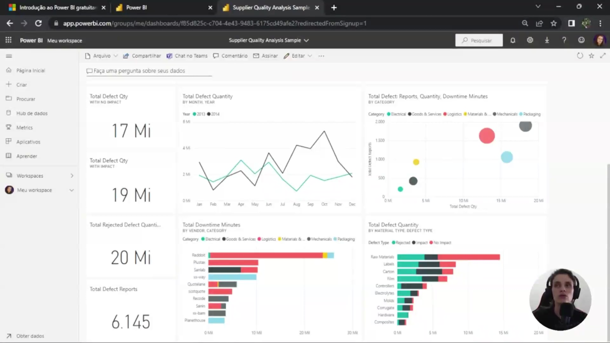
</p>

A imagem foca na aba de **Downtime Analysis** (Análise de Tempo de Inatividade) e demonstra o recurso de **Dica de Ferramenta (Tooltip)**.

* **Interatividade:** Ao passar o cursor (mouse over) sobre uma barra ou ponto do gráfico, uma janela flutuante aparece.
* **Contexto:** Essa janela exibe informações detalhadas específicas daquele ponto de dados, permitindo aprofundar a análise sem poluir a visualização principal com excesso de rótulos.      


### 🟩 Vídeo 05 - Instalando o Power BI Desktop

<video width="60%" controls>
  <source src="000-Midia_e_Anexos/bootcamp_ntt_data-modulo.05-curso.04-video_05.webm" type="video/webm">
    Seu navegador não suporta vídeo HTML5.
</video>

link do vídeo: https://web.dio.me/track/engenharia-dados-python/course/primeiros-passos-com-power-bi/learning/186a7ed0-1077-4367-aab5-5d9ca49ef4e0?autoplay=1

O vídeo consiste em um tutorial prático que ensina como **instalar o Microsoft Power BI Desktop** em sistemas operacionais Windows. A pessoa narradora explica que o software é **exclusivo para Windows**, detalhando o processo de download pelo site oficial em vez da loja de aplicativos padrão. Durante a demonstração, são fornecidas orientações sobre a **configuração de idioma**, a aceitação de termos e as etapas finais da instalação. Após concluir o processo, a fonte apresenta a **interface inicial da ferramenta**, destacando recursos como tutoriais, fóruns e a função de importação de dados. O objetivo final é preparar o usuário para as próximas fases de **análise de dados e criação de gráficos** dentro da plataforma.

### Anotações

<p align="center">

</p>

Ao acessar o portal da Microsoft para adquirir a ferramenta, é comum encontrar sugestões para utilizar a Microsoft Store. No entanto, para garantir um processo de instalação mais controlado e padrão, a recomendação é buscar pelo instalador executável direto. A imagem ilustra a página de **Visualização de Dados** do Power BI, onde o usuário deve navegar para encontrar as opções de download ("Saiba mais" ou "Download"), evitando o redirecionamento automático para a loja de aplicativos do Windows, optando assim pelo instalador manual.

<p align="center">
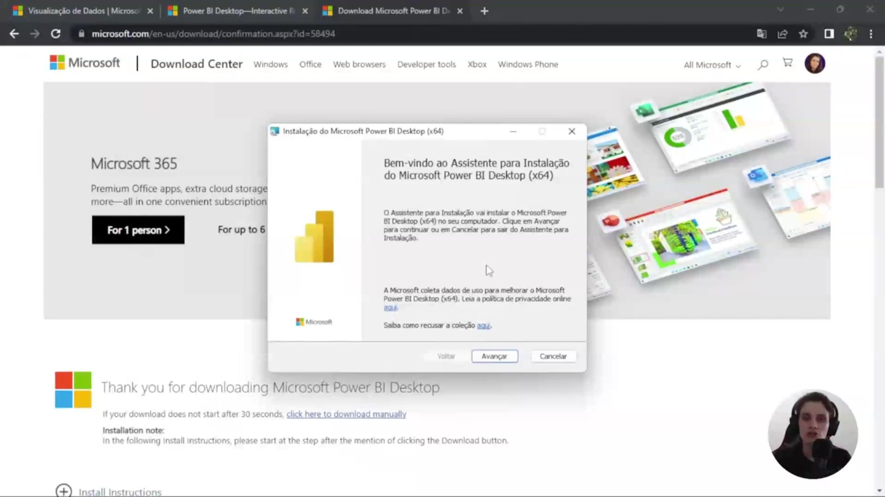
</p>

Após a confirmação do download, visualiza-se a página de agradecimento da Microsoft ("Thank you for downloading..."). Neste etapa, é crucial selecionar a arquitetura correta para o sistema operacional, geralmente a versão **64 bits**. Vale ressaltar uma limitação importante de compatibilidade: o **Microsoft Power BI Desktop** é exclusivo para o ambiente Windows. Usuários de outros sistemas, como macOS ou Linux (Ubuntu), não possuem uma versão nativa e precisam migrar para o Windows para utilizar a ferramenta de desenvolvimento desktop.

<p align="center">
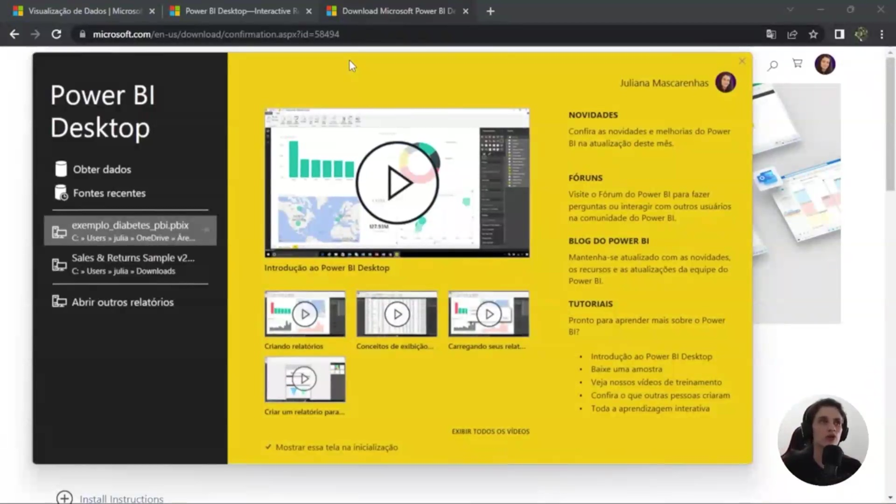
</p>

Ao executar o programa pela primeira vez, o usuário é recebido por uma **tela de boas-vindas** sobreposta (frequentemente chamada de *splash screen* interativa). Esta janela funciona como um hub central que oferece:

* **Acesso a Dados:** Atalhos para "Obter dados" de diversas fontes e abrir projetos recentes.
* **Recursos Educativos:** Uma coluna lateral dedicada a novidades, fóruns da comunidade, blog oficial do Power BI e tutoriais em vídeo para aprendizado.
* **Identificação:** Opções para login na conta corporativa ou escolar, embora o uso local possa ser iniciado sem login imediato.

<p align="center">
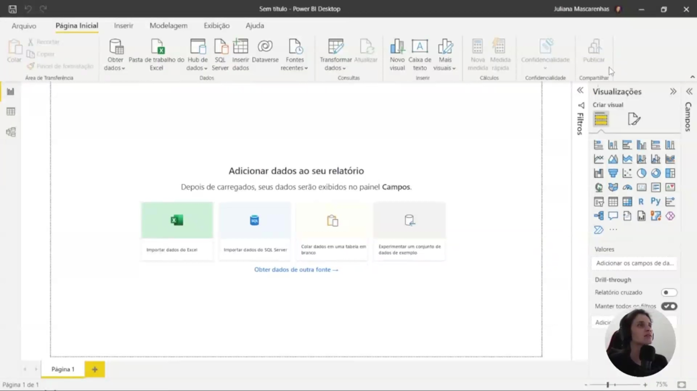
</p>

Ao fechar a tela inicial, revela-se a **interface principal do Power BI Desktop**. O ambiente é composto por áreas distintas para a construção de relatórios:

* **Faixa de Opções (Topo):** Menus como Página Inicial, Inserir, Modelagem e Exibição, similares aos do Office.
* **Canvas (Centro):** A área em branco onde os visuais e gráficos serão dispostos.
* **Painéis Laterais (Direita):**
* **Visualizações:** Onde se escolhe o tipo de gráfico (barras, pizza, mapas, etc.) e se configuram seus eixos.
* **Campos:** Local onde aparecerão as tabelas e colunas dos dados importados para serem arrastados para o relatório.      


### 🟩 Vídeo 06 - Conhecendo o Power BI Desktop

<video width="60%" controls>
  <source src="000-Midia_e_Anexos/bootcamp_ntt_data-modulo.05-curso.04-video_06.webm" type="video/webm">
    Seu navegador não suporta vídeo HTML5.
</video>

link do vídeo: https://web.dio.me/track/engenharia-dados-python/course/primeiros-passos-com-power-bi/learning/8d1ea71b-ce50-4ffb-82bc-4b202121e208?autoplay=1

O vídeo consiste em uma introdução técnica ao **Power BI**, destacando sua interface intuitiva que se assemelha ao **Excel** para facilitar o aprendizado. O instrutor detalha as diversas formas de **importação de dados**, abrangendo desde arquivos locais e **GitHub** até bancos de dados complexos como **SQL Server** e **MySQL**. A explicação enfatiza a importância do **relacionamento entre tabelas**, comparando a estrutura da ferramenta à modelagem de dados convencional. Além disso, são exploradas as integrações com o ecossistema **Microsoft**, incluindo **Azure** e **SharePoint**, para a criação de relatórios na nuvem. O conteúdo foca em preparar o usuário para a **prática direta**, ensinando como coletar, estruturar e visualizar informações através de gráficos. Por fim, o guia reforça que a análise correta dos dados é essencial para gerar **insights valiosos** para gestores e empresas.

### Anotações

<p align="center">

</p>

A interface principal do Power BI Desktop apresenta três visualizações fundamentais no menu vertical à esquerda: **Relatório** (onde os gráficos são construídos), **Dados** (para visualização das tabelas) e **Modelo** (para gestão de relacionamentos). No centro da tela, o software oferece atalhos rápidos para a importação inicial de dados, permitindo ao usuário escolher entre importar do Excel, do SQL Server ou até colar dados em uma tabela em branco. À direita, localizam-se os painéis de **Filtros** e **Visualizações**, que contêm o catálogo de gráficos disponíveis para compor o relatório.

<p align="center">
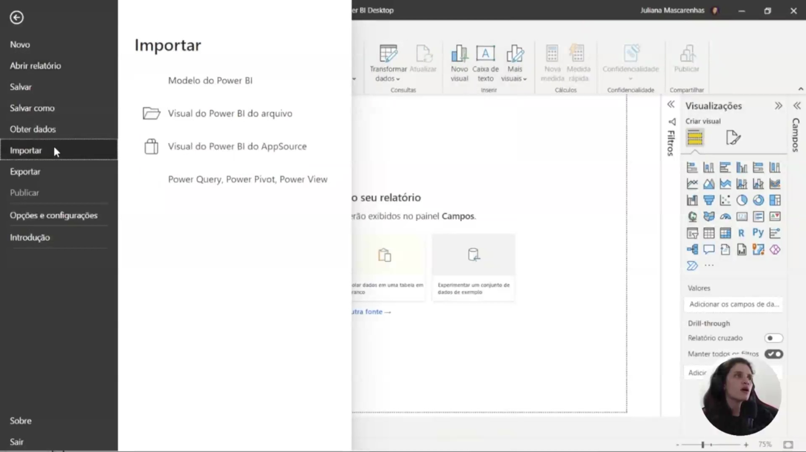
</p>

O menu **Arquivo** do Power BI Desktop centraliza as operações de gerenciamento de projeto. Além das funções tradicionais como "Salvar" e "Salvar como", este menu permite **Importar** modelos do Power BI ou elementos do Visual Studio, e **Exportar** o trabalho em formato PDF ou como um modelo de arquivo (.pbit). Também é por aqui que se acessam as "Opções e configurações" e a tela de "Introdução", que remete à página inicial de instalação do sistema.

<p align="center">
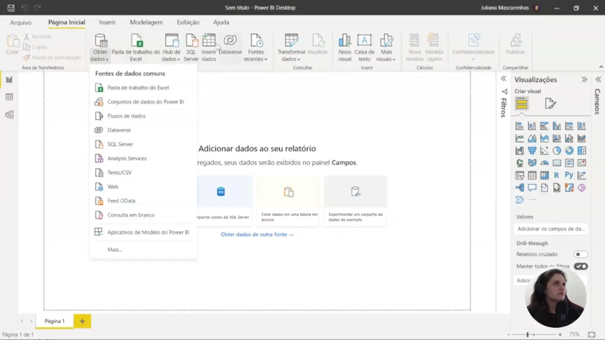
</p>

Através do botão **Obter dados** na Página Inicial, o usuário tem acesso às "Fontes de dados comuns". Este menu rápido facilita a conexão com origens frequentes, como:

* Pasta de trabalho do Excel
* Conjuntos de dados do Power BI
* Fluxos de dados
* Dataverse
* SQL Server
* Texto/CSV e Web

<p align="center">
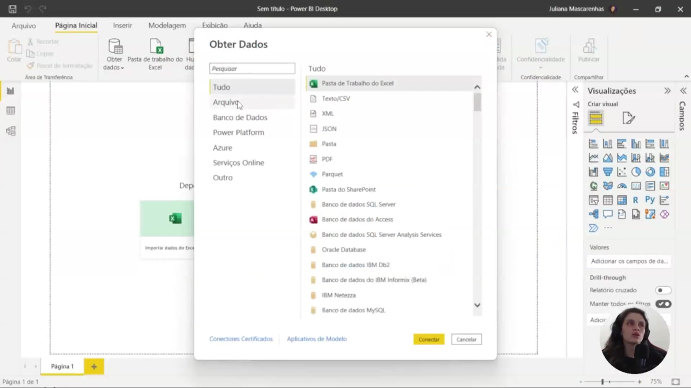
</p>

Ao selecionar a opção "Mais..." no menu de dados, abre-se a janela completa de conectores. Na categoria **Arquivo**, o Power BI demonstra sua versatilidade ao suportar diversos formatos estruturados e semiestruturados, permitindo a extração de informações de documentos **JSON, XML, PDF**, pastas completas ou arquivos no formato **Parquet**, além da integração direta com pastas do **SharePoint**.

<p align="center">
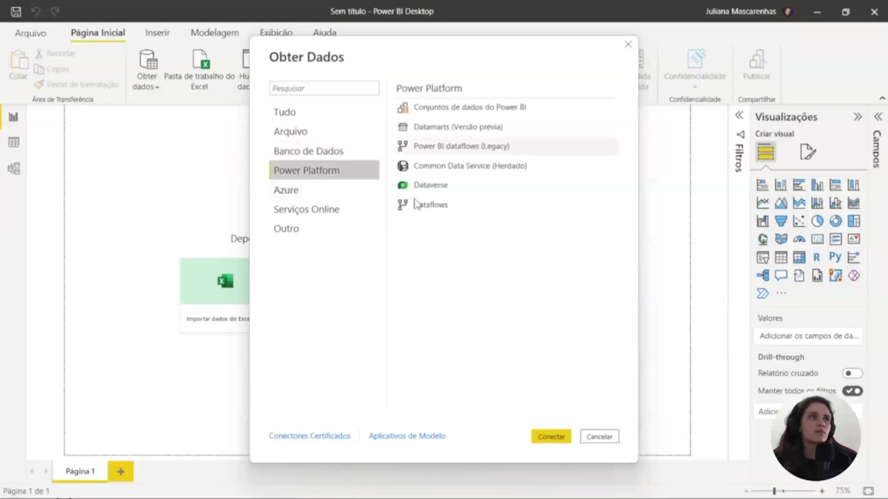
</p>

Na seção **Power Platform**, o foco é a integração com o ecossistema de dados da Microsoft. É possível conectar-se a **Dataverses**, fluxos de dados (Dataflows) e **Datamarts**, facilitando o consumo de dados que já foram tratados ou padronizados dentro da organização através de outras ferramentas da plataforma.

<p align="center">
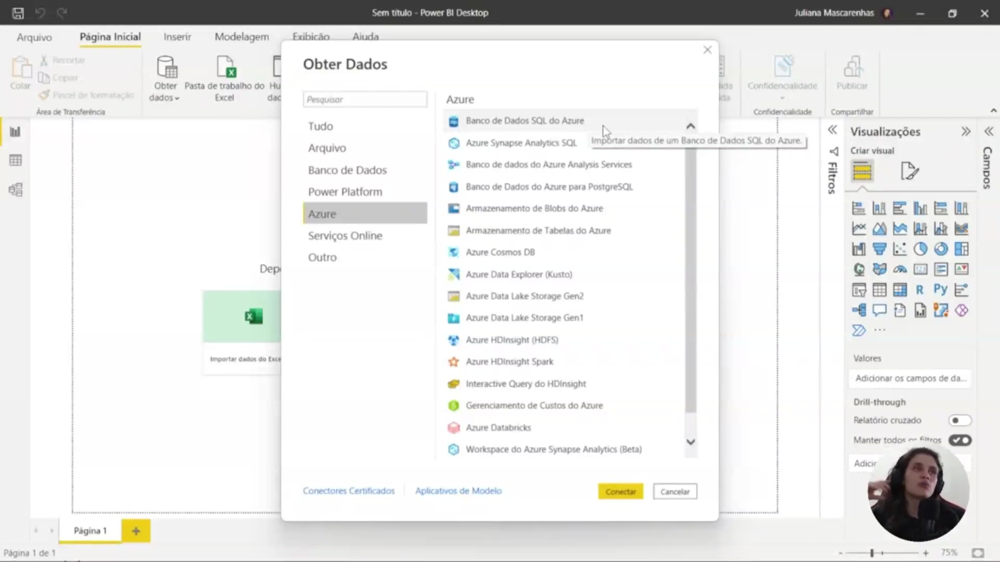
</p>

A categoria **Azure** revela as possibilidades de conexão com a nuvem, permitindo importar dados de instâncias de **Banco de Dados SQL do Azure**, **Azure Synapse Analytics**, **Azure Databricks** e armazenamentos de grande escala como o **Azure Data Lake Storage**. Essa integração é ideal para ambientes corporativos que desejam disponibilizar relatórios atualizados para executivos e equipes a partir de dados hospedados em nuvem.

<p align="center">
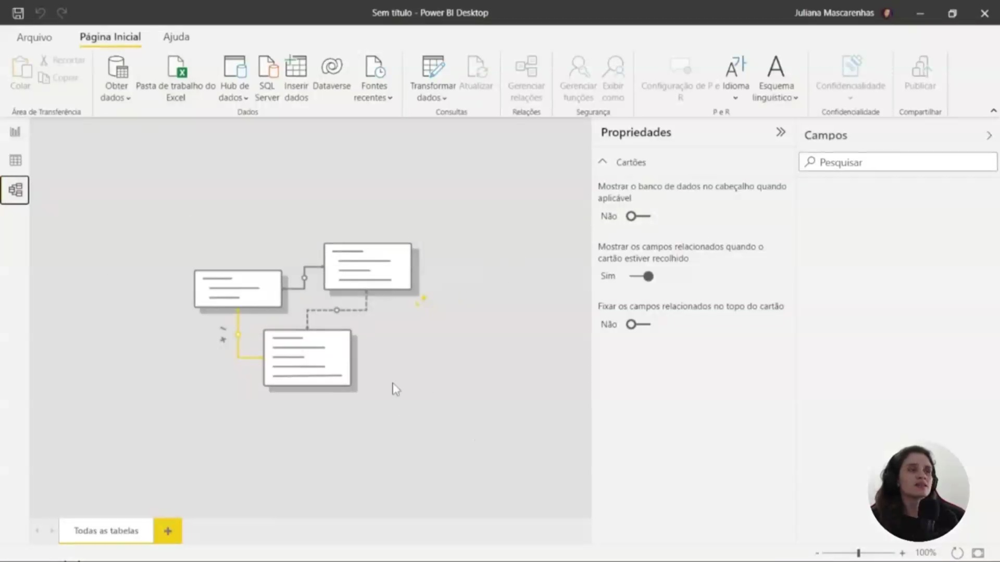
</p>

A visualização de **Modelagem** (ou Modelo) é onde se define a estrutura lógica do relatório. Quando os dados possuem uma base relacional, como os provenientes de bancos SQL, o Power BI exibe as tabelas e suas conexões de forma similar a um **Diagrama de Entidade e Relacionamento (DER)**. Neste painel, é possível configurar as propriedades de cada campo e gerenciar como as tabelas interagem entre si através de chaves comuns.


### 🟩 Vídeo 07 - Não tenho dataset e agora? - Kaggle

<video width="60%" controls>
  <source src="000-Midia_e_Anexos/bootcamp_ntt_data-modulo.05-curso.04-video_07.webm" type="video/webm">
    Seu navegador não suporta vídeo HTML5.
</video>

link do vídeo: https://web.dio.me/track/engenharia-dados-python/course/primeiros-passos-com-power-bi/learning/5d555db8-cfab-4981-a058-37bdc88de135?autoplay=1

O vídeo apresenta um guia prático sobre a obtenção e exploração de conjuntos de dados (datasets) para análise, destacando o Kaggle como uma plataforma essencial para cientistas de dados. A instrutora demonstra como navegar no site, selecionar dados por categorias e detalha um estudo de caso específico sobre diabetes em mulheres, explicando a importância de compreender cada variável antes de iniciar a visualização e análise no Power BI.

### Anotações

<p align="center">

</p>

A interface inicial do Kaggle apresenta diversas opções para quem deseja iniciar na ciência de dados, como cursos rápidos e competições. No menu lateral, observamos o acesso a datasets e códigos, além de uma lista de itens visualizados recentemente, onde já consta o "Diabetes Dataset", indicando o ponto de partida para o estudo de caso que será desenvolvido.

<p align="center">

</p>

Ao navegar pela seção de datasets, é possível filtrar bases de dados por categorias como educação, classificação e visão computacional. O sistema destaca bases em tendência, permitindo explorar e analisar diferentes tipos de dados antes de selecionar o arquivo específico para o projeto.

<p align="center">
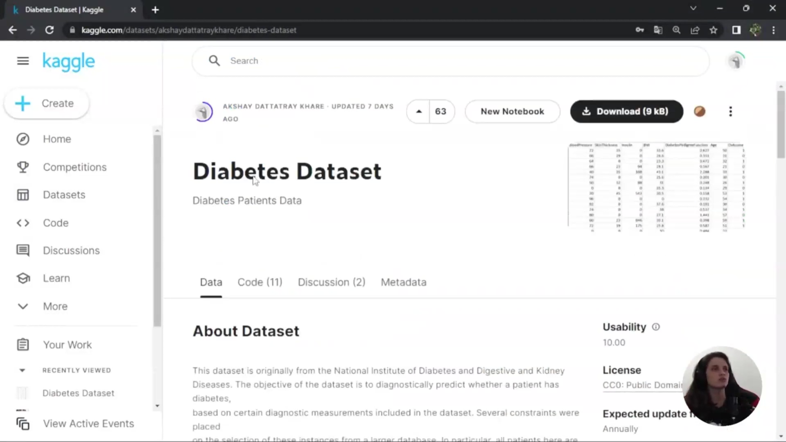
</p>

A página do "Diabetes Dataset" revela que os dados são originários do *National Institute of Diabetes and Digestive and Kidney Diseases*. O objetivo central desta base de dados é prever diagnosticamente se uma paciente possui diabetes, utilizando medições diagnósticas específicas incluídas no conjunto.

<p align="center">

</p>

O detalhamento do dataset impõe restrições importantes sobre a amostra: todos os registros referem-se a mulheres com pelo menos 21 anos de idade e de herança indígena Pima. A estrutura do arquivo CSV conta com diversas variáveis médicas independentes (preditores) e uma única variável dependente de alvo, denominada "Outcome".

<p align="center">
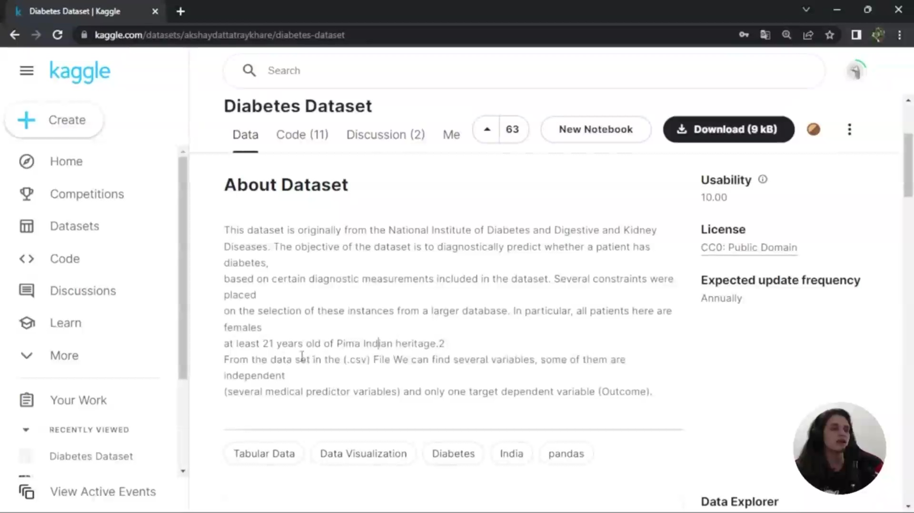
</p>

Na seção "About Dataset", reforça-se que este é um problema de classificação binária fundamentado em variáveis médicas. O arquivo é leve (cerca de 9 kB) e possui uma licença de domínio público (CC0), sendo atualizado anualmente para garantir a relevância das informações para estudos de visualização e análise de dados.

<p align="center">
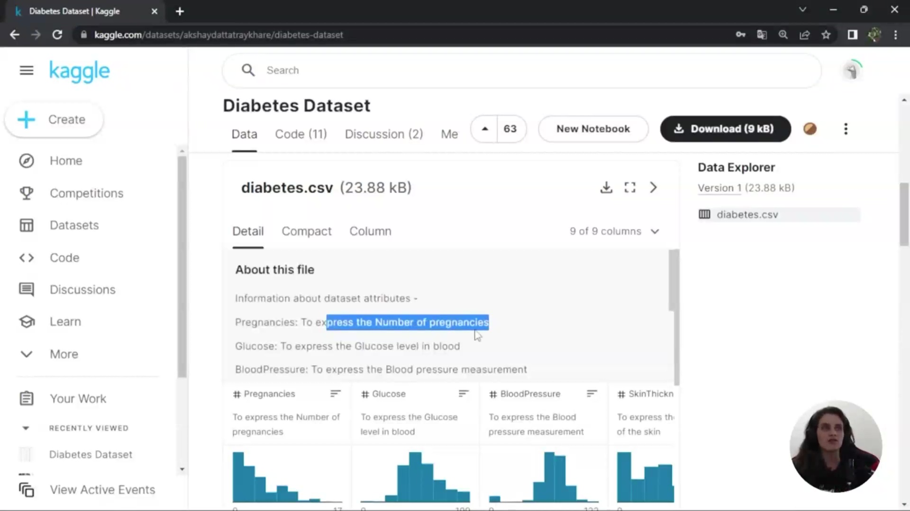
</p>

O "Data Explorer" detalha os atributos presentes nas 9 colunas do arquivo `diabetes.csv`. As variáveis incluem o número de gestações (*Pregnancies*), o nível de glicose no sangue (*Glucose*), a pressão arterial (*Blood Pressure*) e a espessura da dobra cutânea (*Skin Thickness*). A variável final, "Outcome", utiliza os valores 1 para presença de diabetes e 0 para ausência.      


### 🟩 Vídeo 08 - Não tenho dataset e agora? - Power BI Samples

<video width="60%" controls>
  <source src="000-Midia_e_Anexos/bootcamp_ntt_data-modulo.05-curso.04-video_08.webm" type="video/webm">
    Seu navegador não suporta vídeo HTML5.
</video>

link do vídeo: https://web.dio.me/track/engenharia-dados-python/course/primeiros-passos-com-power-bi/learning/e82a74f8-3653-4555-a790-6cf34adc0fac?autoplay=1

Este conteúdo consiste em um guia prático sobre como iniciar a manipulação de dados no **Power BI** utilizando bases de exemplos nativas da plataforma. O instrutor demonstra o processo de **extração de informações**, focando especificamente em um conjunto de dados do setor **financeiro** para facilitar o aprendizado de quem não possui arquivos próprios. A explicação detalha as etapas iniciais do **fluxo ETL**, mencionando que, após o carregamento, os dados passarão por uma fase de **normalização e transformação**. Ao explorar a tabela, são destacados campos essenciais como **segmentos de mercado**, volumes de vendas e lucros, que servirão de base para a criação de painéis visuais. O objetivo final é preparar o usuário para realizar **análises métricas** e construir visualizações de dados eficientes em vídeos subsequentes.

### Anotações

<p align="center">
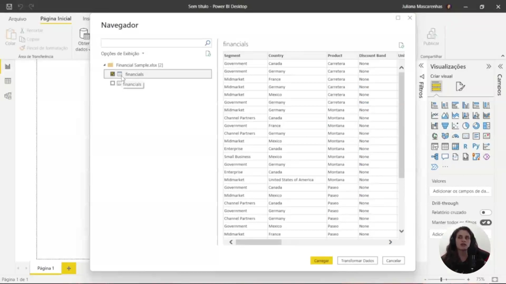
</p>

Nesta etapa, o Power BI Desktop é inicializado para a recuperação de informações. Para fins de treinamento, a ferramenta disponibiliza um conjunto de dados de exemplo (sample) focado na área financeira, permitindo que usuários construam modelos e dashboards mesmo sem acesso a bases externas. Ao conectar-se a esse recurso, o sistema identifica o arquivo "Financial Sample.xlsx", exibindo a tabela **financials** disponível para importação. O usuário pode optar por carregar os dados diretamente ou transformá-los, iniciando o processo de **ETL (Extract, Transform and Load)**, onde a extração ocorre no carregamento e a normalização das informações é preparada para as fases seguintes.

<p align="center">
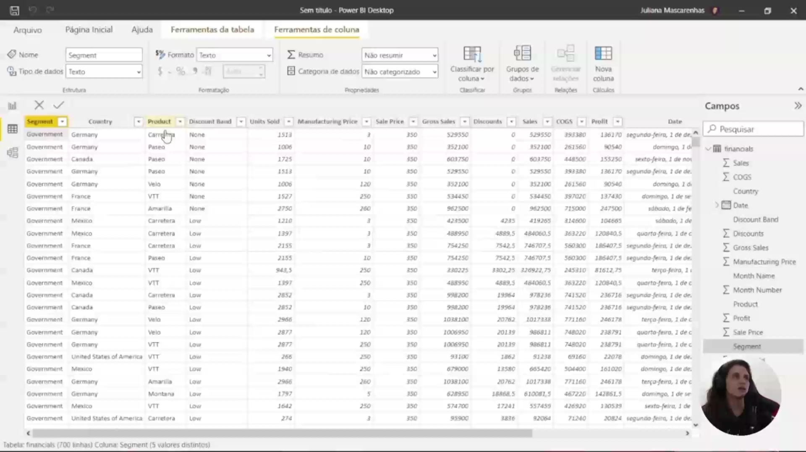
</p>

Após o carregamento dos dados, a interface do Power BI exibe a visualização de tabela com as colunas estruturadas da base financeira. É possível observar campos como **Segment** (Segmento), **Country** (País), **Product** (Produto), **Units Sold** (Unidades Vendidas), além de métricas de valores como **Gross Sales**, **Discounts** e **Sales**. No painel lateral de campos, o software identifica e organiza os dados, criando automaticamente somatórias para campos numéricos (indicados pelo símbolo ) e permitindo a criação de novas métricas. Essa estrutura serve de base para a construção das visualizações e análise dos dados no relatório.


### 🟩 Vídeo 09 - Quais relatórios iremos fazer neste curso?

<video width="60%" controls>
  <source src="000-Midia_e_Anexos/bootcamp_ntt_data-modulo.05-curso.04-video_09.webm" type="video/webm">
    Seu navegador não suporta vídeo HTML5.
</video>

link do vídeo: https://web.dio.me/track/engenharia-dados-python/course/primeiros-passos-com-power-bi/learning/ed4d1c3a-85f5-4797-9890-fbcddb8b0a12?autoplay=1

Os materiais apresentam uma introdução prática ao uso do **Power BI** para a análise de diferentes tipos de informações. O instrutor demonstra inicialmente como processar dados médicos sobre **diabetes**, examinando variáveis como **pressão arterial**, **índice de massa corporal** e níveis de **insulina**. Na sequência, o foco muda para um relatório de **vendas globais**, detalhando o desempenho financeiro por **países** e **segmentos**. O objetivo central é ensinar a criação de **gráficos interativos** e a aplicação de **métricas estatísticas** dentro da plataforma. Por fim, o conteúdo serve como um guia motivacional para quem deseja dar os **primeiros passos** na visualização de dados profissional.

### Anotações

<p align="center">

</p>

Nesta visualização inicial do Power BI Desktop, observamos um painel de análise sobre diabetes. O relatório apresenta múltiplos gráficos que cruzam dados médicos e demográficos: na parte superior, um gráfico de barras analisa a "Soma de Diabetes Pedigree Function" por idade ("Age"); abaixo, dois gráficos combinados (linhas e colunas) detalham médias de pressão arterial ("BloodPressure"), glicose, insulina e BMI, além da soma de desfechos ("Outcome") por número de gestações ("Pregnancies") e idade. O ambiente exibe a interface de edição com as abas de "Página Inicial", "Visualizações" e o painel de "Campos" à direita.

<p align="center">
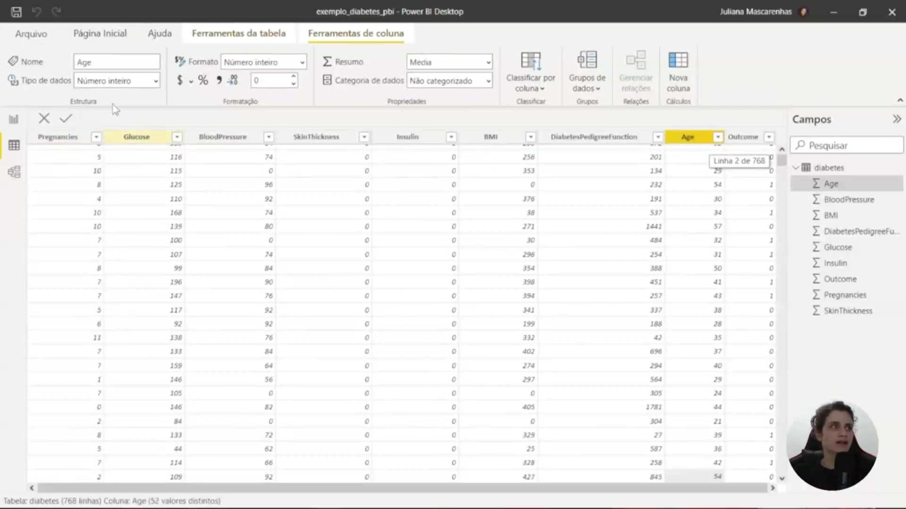
</p>

A interface muda para a "Exibição de Dados", onde é possível visualizar a tabela bruta que alimenta o relatório. As colunas exibidas incluem dados biométricos como "Pregnancies", "Glucose", "Blood Pressure", "Skin Thickness", "Insulin", "BMI", "Diabetes Pedigree Function", "Age" e o "Outcome" (resultado). Esta tabela contém 768 linhas e permite verificar como os dados estão estruturados, como os valores binários do desfecho (0 ou 1) e as medidas numéricas de cada paciente.

<p align="center">
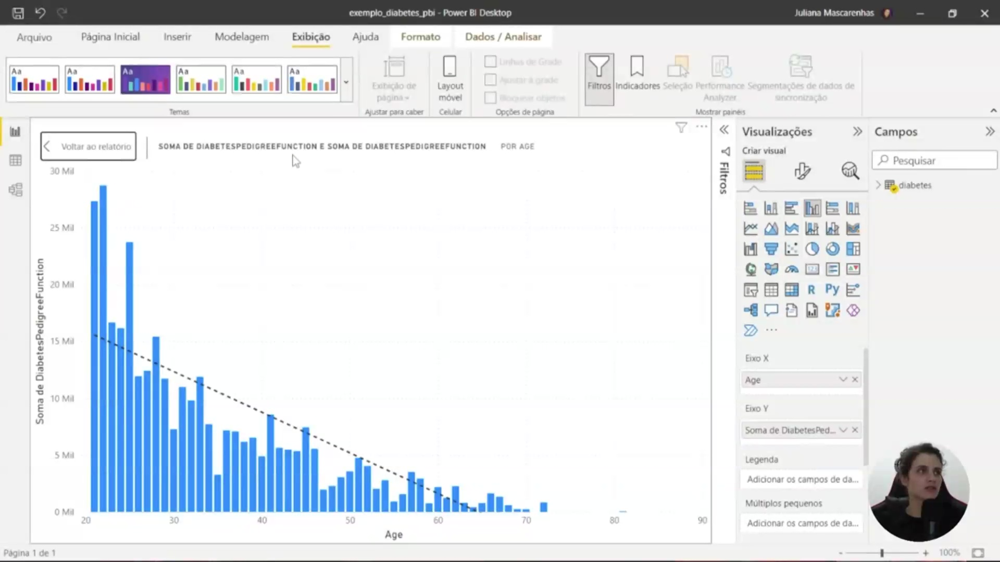
</p>

Neste momento, o foco é o gráfico de barras que correlaciona a "Soma de Diabetes Pedigree Function" com a idade ("Age"). O gráfico mostra picos de valores em idades específicas (em torno dos 20 a 50 anos), indicando o acúmulo da função de pedigree genético na amostra. No painel de configuração à direita, vemos que o campo "Age" está definido no Eixo X e a "Soma de Diabetes Pedigree Function" no Eixo Y.

<p align="center">
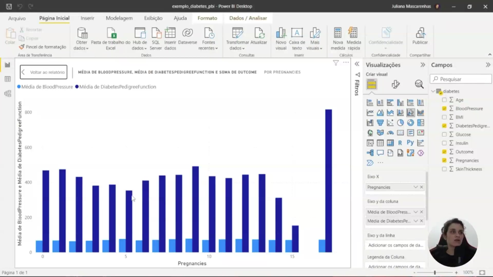
</p>

Esta tela destaca o gráfico "Média de BloodPressure, Média de Diabetes Pedigree Function e Soma de Outcome por Pregnancies". É um gráfico de colunas agrupadas com linha, onde as colunas representam as médias de pressão e pedigree, enquanto a linha (ou uma coluna secundária) rastreia a soma do "Outcome". Este dado de soma é crucial pois, como o valor original é binário (0 ou 1), uma soma de 38 indica que exatamente 38 mulheres naquela categoria tiveram o resultado positivo para o estudo de diabetes.

<p align="center">
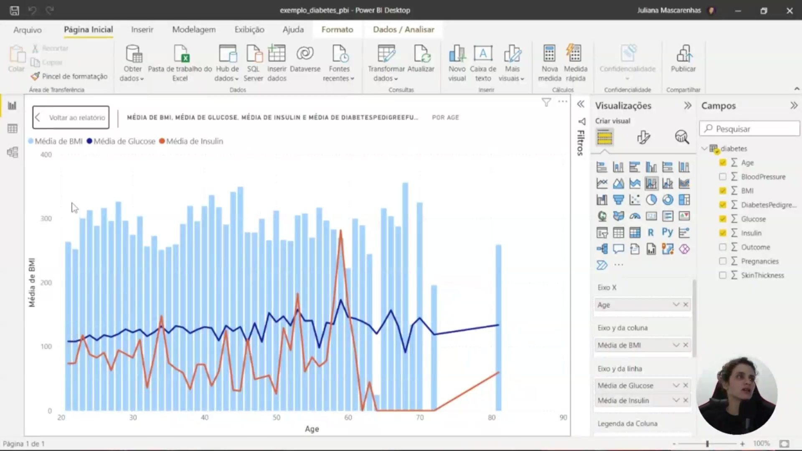
</p>

Aqui visualizamos a análise detalhada das médias de BMI, Glicose e Insulina por idade. O gráfico permite observar a variação dos níveis de açúcar no organismo (glicose) e de insulina em relação ao índice de massa corporal ao longo dos anos. A configuração no painel de "Visualizações" mostra que múltiplos valores foram adicionados ao Eixo Y para permitir este comparativo direto entre diferentes métricas médicas em um único visual.

<p align="center">
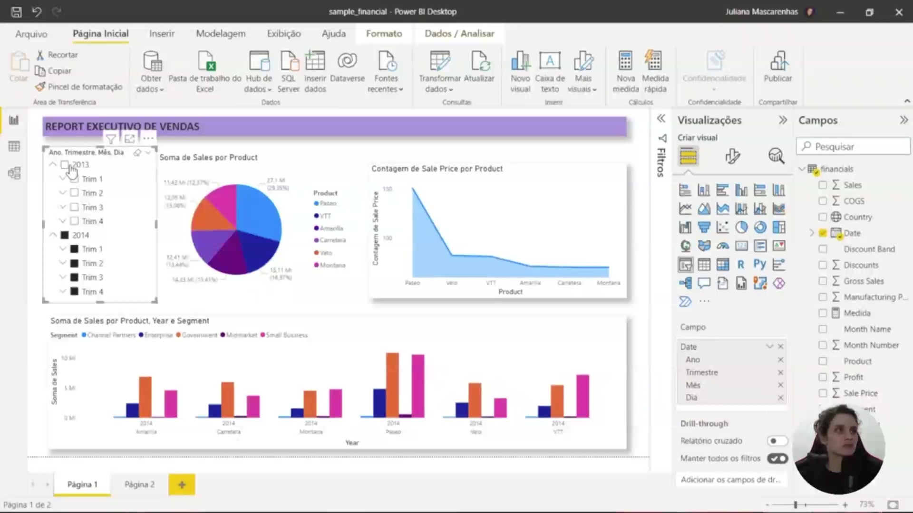
</p>

A apresentação transiciona para um novo exemplo: o "Report Executivo de Vendas". Este painel demonstra capacidades de filtragem temporal e análise de produtos. Vemos segmentadores de dados para Ano (2013 e 2014) e Trimestre, além de gráficos de barras horizontais que mostram a "Soma de Sales por Product" e um gráfico de pizza para a "Contagem de Sale Price por Product", permitindo analisar o desempenho comercial de forma dinâmica.

<p align="center">
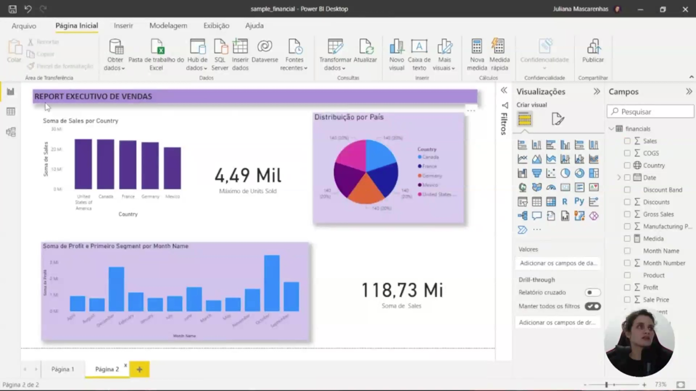
</p>

Na segunda página do relatório de vendas, o foco é o equilíbrio global. O visual apresenta a "Soma de Sales por Country", destacando a distribuição geográfica das vendas em países como Canadá, França, Alemanha, México e Estados Unidos. O painel inclui também cartões com métricas isoladas, como o "Máximo de Units Sold" (4,49 mil), e análises de lucro ("Profit") por segmento e mês, servindo de exemplo para as construções fundamentais de programação e visualização em Power BI.      


### 🟩 Vídeo 10 - Coletando, modificando os dados do Kaggle e criando o primeiro gráfico

<video width="60%" controls>
  <source src="000-Midia_e_Anexos/bootcamp_ntt_data-modulo.05-curso.04-video_10.webm" type="video/webm">
    Seu navegador não suporta vídeo HTML5.
</video>

link do vídeo: https://web.dio.me/track/engenharia-dados-python/course/primeiros-passos-com-power-bi/learning/aa7cf0c2-bfa8-4844-8b66-466c147f7fb3?autoplay=1

O material consiste em um tutorial prático sobre **análise de dados** utilizando o **Power BI**, focado no processamento de um conjunto de dados sobre **diabetes**. O instrutor demonstra inicialmente como solucionar problemas de **formatação de arquivos CSV**, ajustando pontos e vírgulas para que o software reconheça corretamente os valores decimais. Durante a fase de **Transformação de Dados**, ele explica a importância de limpar registros inconsistentes, como níveis de **pressão arterial ou insulina** marcados como zero. A lição avança para a criação de **visualizações gráficas**, onde são comparadas métricas como **glicose e idade** para identificar padrões de saúde. Por fim, o conteúdo ressalta que o entendimento do **contexto médico** é fundamental para decidir entre utilizar médias ou medianas na construção de modelos precisos.

### Anotações

<p align="center">
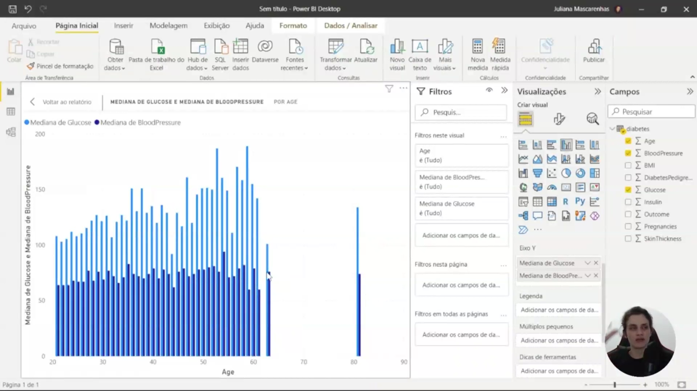
</p>

### Visualização de Dados Médicos no Power BI

Nesta etapa, é apresentado o processo de criação de um visual para análise de um conjunto de dados sobre diabetes. Após o tratamento inicial dos dados no **Power Query** — onde foi necessário corrigir a interpretação de pontos e vírgulas para garantir a consistência dos resultados — os dados são carregados para a interface de relatório do Power BI.

A imagem demonstra a configuração de um **gráfico de colunas agrupadas**, utilizando a **Idade (Age)** no Eixo X para observar tendências ao longo do tempo de vida das pacientes estudadas.

#### Configuração do Gráfico e Métricas

Para evitar distorções causadas por valores extremos ou falta de informações em determinados registros (como os valores "zero" encontrados nos campos de insulina e pressão arterial), optou-se pela utilização da **Mediana** em vez da Média ou Soma.

* **Eixo X:** Age (Idade).
* **Eixo Y:** Mediana de Glucose e Mediana de Blood Pressure (Pressão Arterial).
* **Objetivo:** Identificar como os níveis de glicose e a pressão arterial se comportam conforme a idade avança.

A escolha da mediana é justificada pela necessidade de representar o valor central que mais frequentemente aparece no conjunto, minimizando o impacto de ruídos nos dados médicos. Através dessa visualização, é possível notar, por exemplo, como os níveis de glicose tendem a apresentar variações significativas em idades mais avançadas, o que pode estar relacionado à resistência à insulina comum no processo de envelhecimento.


### 🟩 Vídeo 11 - Caracterizando o dataset diabetes com gráfico de barras com linhas

<video width="60%" controls>
  <source src="000-Midia_e_Anexos/bootcamp_ntt_data-modulo.05-curso.04-video_11.webm" type="video/webm">
    Seu navegador não suporta vídeo HTML5.
</video>

link do vídeo: https://web.dio.me/track/engenharia-dados-python/course/primeiros-passos-com-power-bi/learning/60f7fe3b-9dc2-4b94-8089-30daa50b6048?autoplay=1

O vídeo apresenta um tutorial prático sobre a **criação e ajuste de gráficos** em uma ferramenta de análise de dados, focando em indicadores de **saúde feminina**. O instrutor demonstra como corrigir inconsistências nos dados e escolher as melhores **métricas estatísticas**, como média e mediana, para representar informações de **insulina e pressão arterial**. Durante a explicação, há uma ênfase na **personalização visual**, alterando cores e layouts para tornar a leitura dos relatórios mais clara e profissional. Além disso, o conteúdo explora a correlação entre o **índice de massa corpórea** e a probabilidade de desenvolver **diabetes gestacional**. O vídeo termina destacando as **tendências de dados** que mostram como o avanço da idade influencia os níveis de glicose dos pacientes.

### Anotações

<p align="center">
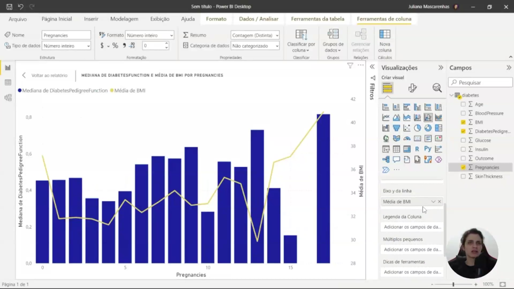
</p>

Nesta etapa, é iniciada a construção de um gráfico de colunas combinadas com linha para analisar a relação entre o número de gestações e indicadores de saúde. O objetivo é observar a **Mediana de Diabetes Pedigree Function** (representada pelas colunas azuis) e a **Média de BMI** (índice de massa corpórea, representada pela linha) em função da quantidade de **Pregnancies** (gestações) no eixo X.

A configuração busca identificar padrões de probabilidade genética de diabetes e variações de massa corpórea conforme o histórico de gravidez. No painel de visualizações, os campos são organizados da seguinte forma:

* **Eixo X**: Pregnancies.
* **Eixo Y da coluna**: Mediana de Diabetes Pedigree Function.
* **Eixo Y da linha**: Média de BMI.

<p align="center">
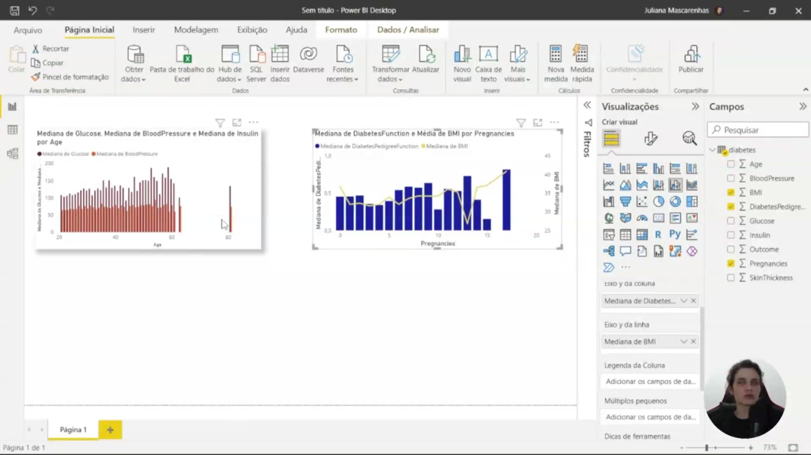
</p>

Nesta visualização, o gráfico é refinado para melhorar a legibilidade e a comparação visual entre as métricas. A cor da linha que representa o **BMI** foi alterada para um tom de amarelo, facilitando o contraste com as colunas azuis que indicam a mediana da função de pedigree de diabetes.

A análise foca no comportamento dos dados: observa-se que tanto a probabilidade relacionada ao diabetes quanto o índice de massa corpórea tendem a apresentar variações significativas conforme o número de gestações aumenta. Através do painel de campos, confirma-se a utilização de medidas estatísticas específicas para evitar distorções por valores extremos:

* **Coluna**: Utiliza a **Mediana** de *Diabetes Pedigree Function*.
* **Linha**: Utiliza a **Mediana** (ou média, dependendo do ajuste de escala) de *BMI* para observar se o comportamento permanece similar e condizente com a realidade dos dados.      


### 🟩 Vídeo 12 - Finalizando relatório preliminar – dataset diabetes kaggle

<video width="60%" controls>
  <source src="000-Midia_e_Anexos/bootcamp_ntt_data-modulo.05-curso.04-video_12.webm" type="video/webm">
    Seu navegador não suporta vídeo HTML5.
</video>

link do vídeo: https://web.dio.me/track/engenharia-dados-python/course/primeiros-passos-com-power-bi/learning/90486f04-eb81-4a83-9b06-d824bc0ebe50?autoplay=1

O material consiste em um tutorial prático sobre a criação de um relatório de **análise descritiva de dados** utilizando o **Power BI**. O instrutor demonstra como construir um **gráfico de áreas** para monitorar a incidência de diabetes por idade, enfatizando a importância do **tratamento prévio de dados**, como o ajuste de vírgulas. Além de configurar a estética visual com sombras e títulos, o conteúdo ensina como **exportar o relatório** para formatos estáticos, como o PDF. A aula também detalha a integração dinâmica com o **PowerPoint**, permitindo que os dados sejam manipulados diretamente durante apresentações. Por fim, o autor prepara o terreno para módulos mais avançados, mencionando o uso de **Inteligência Artificial** e bases de dados financeiras complexas.

### Anotações

<p align="center">
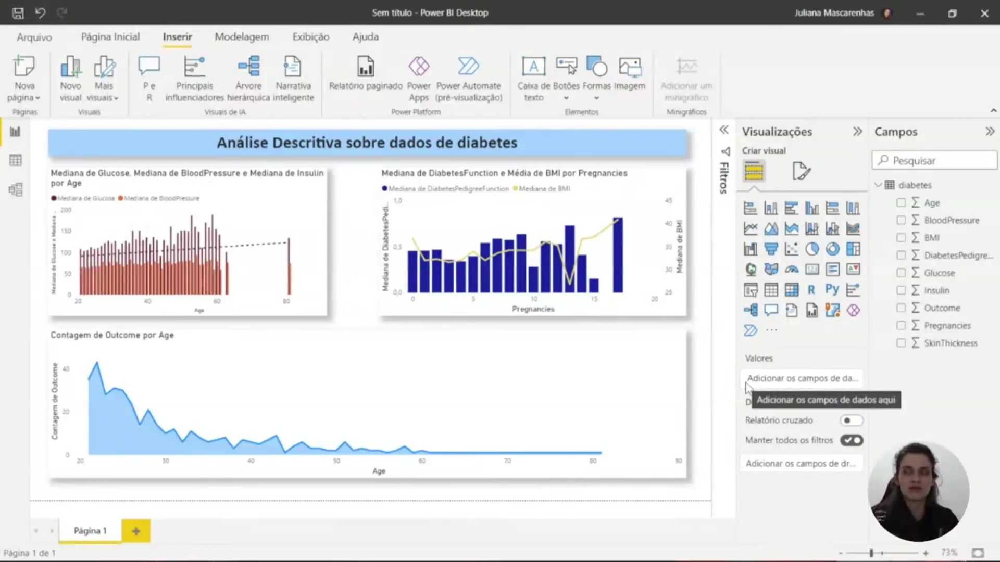
</p>

A interface do Power BI Desktop apresenta um relatório de análise descritiva sobre dados de diabetes, composto por três visualizações principais: um gráfico de linhas comparando medianas de Glucose, Blood Pressure e Insulin por idade; um gráfico de colunas e linhas relacionando a função de diabetes e o IMC com o número de gestações; e um gráfico de barras que detalha a contagem de resultados (Outcome) por faixa etária. No painel lateral "Campos", observamos a estrutura da tabela carregada, contendo variáveis como `Age`, `BMI`, `Glucose` e `Outcome`.

<p align="center">
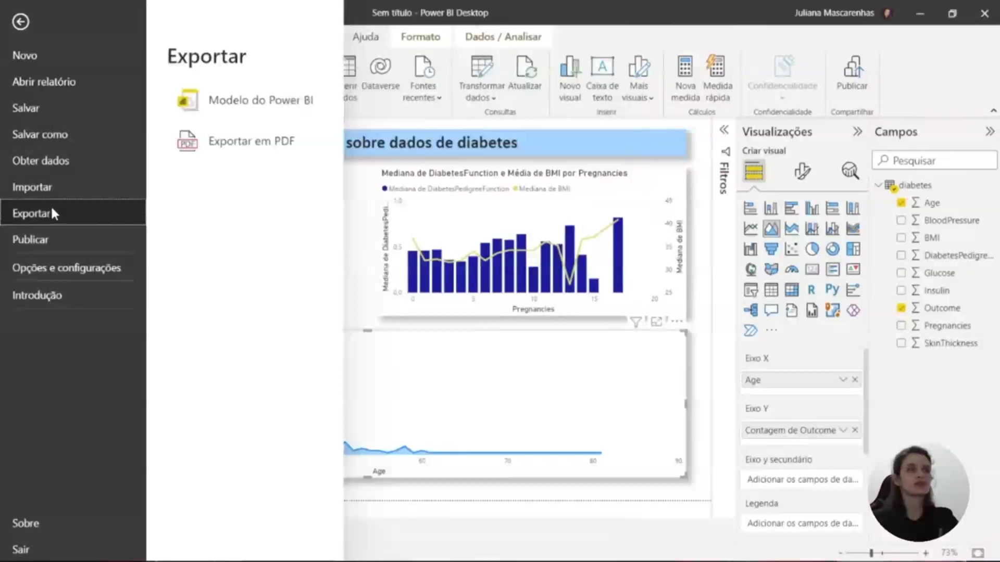
</p>

Ao acessar o menu "Arquivo" no Power BI Desktop, visualizamos as opções de gerenciamento do projeto. Entre as funcionalidades disponíveis, destacam-se a capacidade de salvar o relatório, obter novos dados e as opções de importação e exportação. O menu está posicionado para demonstrar como iniciar o processo de compartilhamento ou conversão do arquivo para outros formatos.

<p align="center">

</p>

Dentro das opções de exportação, o Power BI oferece a funcionalidade "Exportar em PDF". Ao selecionar este comando, o sistema inicia o processamento para converter as páginas do relatório em um documento estático, exibindo uma caixa de diálogo com a mensagem "Gerando um PDF do relatório...". Este recurso é fundamental para comunicações rápidas onde a interatividade dos dados não é o foco principal.

<p align="center">
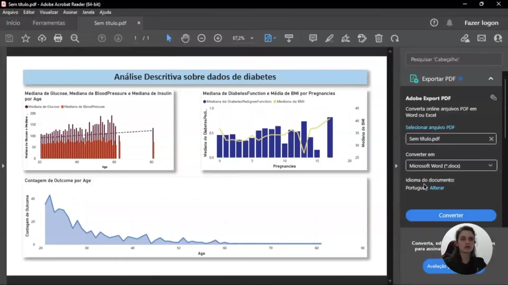
</p>

O resultado da exportação é visualizado em um leitor de PDF, como o Adobe Acrobat Reader. O documento preserva o layout visual do relatório original, incluindo todos os gráficos e títulos da "Análise Descritiva sobre dados de diabetes", permitindo a visualização offline e o compartilhamento simplificado das informações coletadas.

<p align="center">
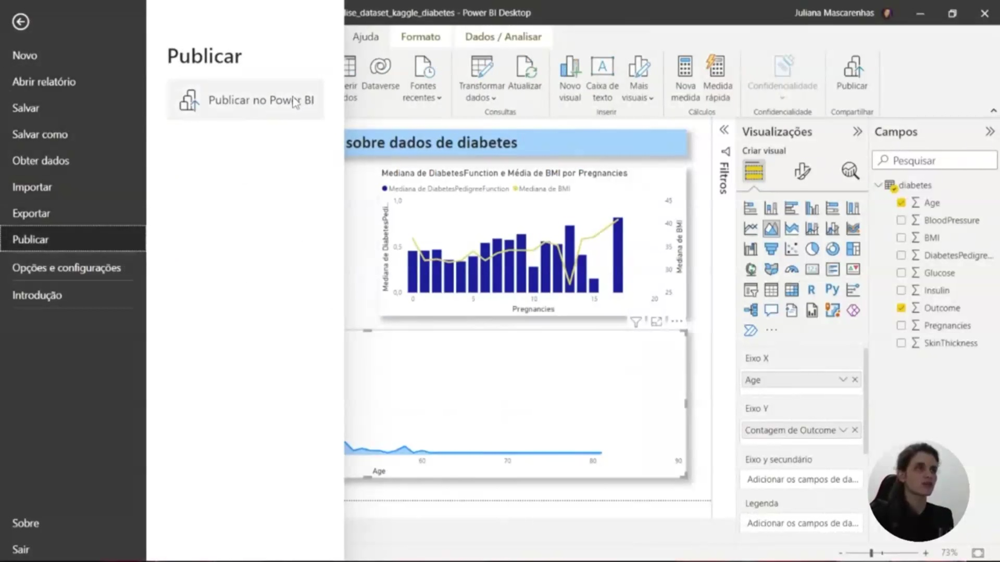
</p>

Além da exportação estática, é possível realizar a publicação do relatório para o ecossistema online através do botão "Publicar", localizado na página inicial. Esta ação prepara o envio do arquivo `.pbix` do ambiente local (Desktop) para o Power BI Serviço na nuvem.

<p align="center">
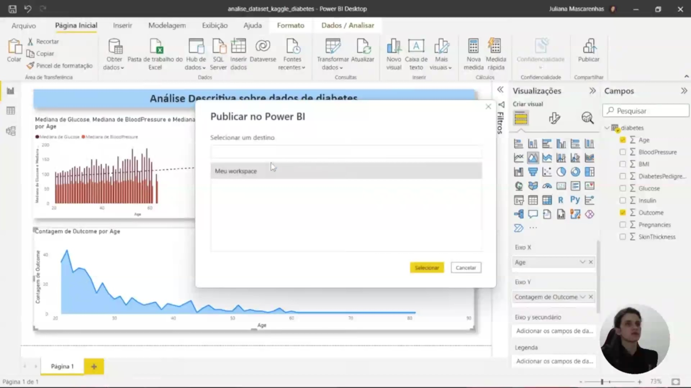
</p>

Ao clicar em publicar, o Power BI solicita a seleção de um destino. O usuário deve escolher um workspace, como o "Meu workspace", para hospedar o relatório na nuvem. Este passo é essencial para habilitar recursos avançados de colaboração e integração com outras ferramentas da Microsoft.

<p align="center">
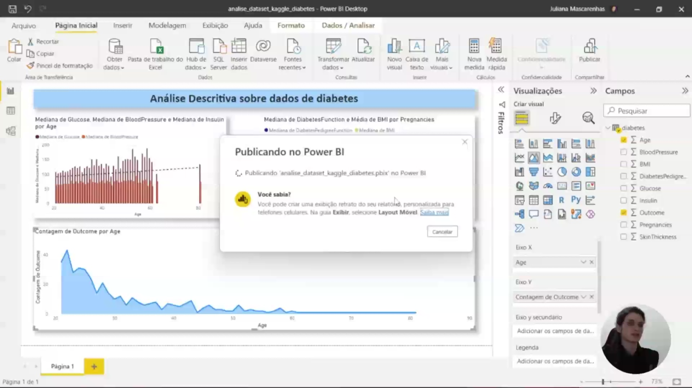
</p>

Uma janela de status confirma o andamento da operação com a mensagem "Publicando no Power BI". Durante esse processo, o sistema também oferece dicas úteis ao usuário, como a possibilidade de criar exibições personalizadas para telefones celulares através do Layout Móvel.

<p align="center">

</p>

O relatório agora está acessível via navegador no Power BI Serviço (`app.powerbi.com`). Nesta interface web, as mesmas visualizações do Desktop estão disponíveis, mas com opções adicionais no menu superior, como "Exportar", que permite integrar o relatório com o PowerPoint de forma dinâmica.

<p align="center">
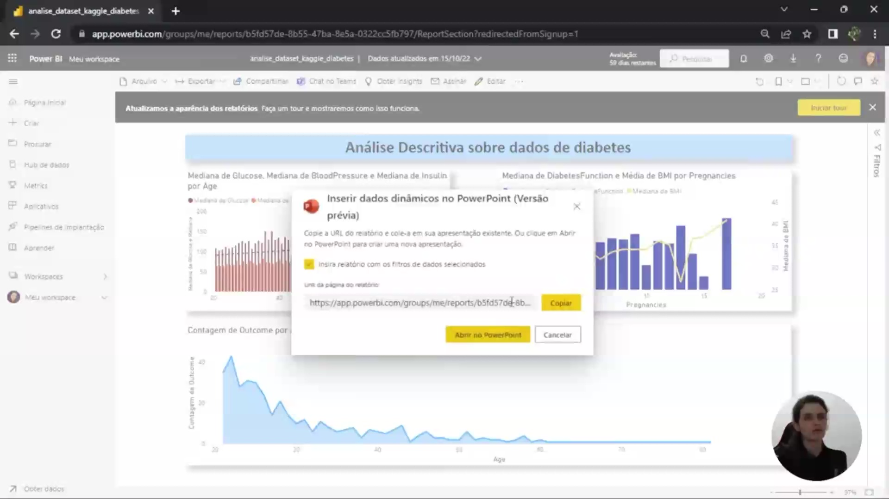
</p>

Ao escolher a integração com o PowerPoint, o Power BI Serviço gera uma URL específica para "dados dinâmicos". O usuário pode copiar essa URL para colá-la em uma apresentação existente ou clicar em "Abrir no PowerPoint" para criar automaticamente um novo slide que manterá a interatividade dos dados.

<p align="center">

</p>

No Microsoft PowerPoint, o relatório é inserido como um elemento interativo dentro do slide. Através do suplemento do Power BI, o apresentador pode filtrar dados e navegar pelas informações em tempo real durante a apresentação, eliminando a necessidade de capturas de tela estáticas e garantindo que os dados visualizados estejam sempre atualizados conforme a fonte no Power BI Serviço.      


### 🟩 Vídeo 13 - Obtendo dados com Simples Transformação dos dados Sample Financials do Power BI

<video width="60%" controls>
  <source src="000-Midia_e_Anexos/bootcamp_ntt_data-modulo.05-curso.04-video_13.webm" type="video/webm">
    Seu navegador não suporta vídeo HTML5.
</video>

link do vídeo: https://web.dio.me/track/engenharia-dados-python/course/primeiros-passos-com-power-bi/learning/15033822-e550-4c45-8ef8-bd6f13493876?autoplay=1

Este material consiste em uma **transcrição de aula prática** sobre o uso inicial do **Power BI**, focando especificamente na manipulação de conjuntos de dados de exemplo. O instrutor demonstra o processo de **transformação de dados**, ilustrando como realizar ajustes técnicos como o **arredondamento de valores** numéricos e a formatação de textos para **letras maiúsculas**. A explicação aborda a importância de tratar informações para que façam sentido lógico, exemplificando como **remover ou desfazer alterações** indesejadas na interface do software. O conteúdo reforça o conceito de **ETL**, destacando que as modificações apresentadas ocorrem em dados já minimamente estruturados. Por fim, o tutorial prepara o aluno para a etapa seguinte de **criação de relatórios** visuais e gráficos dinâmicos.

### Anotações

<p align="center">
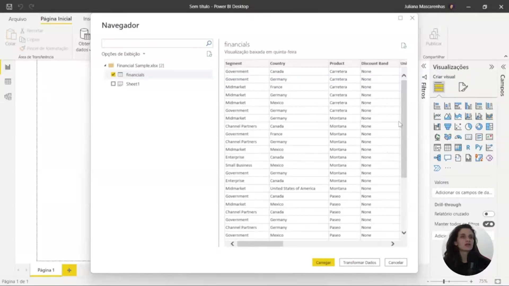
</p>

Esta imagem apresenta a interface inicial do **Power BI Desktop**, destacando o painel de **Visualizações** e a área de carregamento de dados. No centro, observa-se a opção para carregar dados de exemplo, especificamente o conjunto de dados **Financial Sample.xlsx**, que servirá de base para o tutorial. O painel lateral exibe os diversos ícones de gráficos disponíveis (colunas, linhas, mapas, etc.) que serão utilizados para construir o relatório após a etapa de preparação dos dados.

<p align="center">
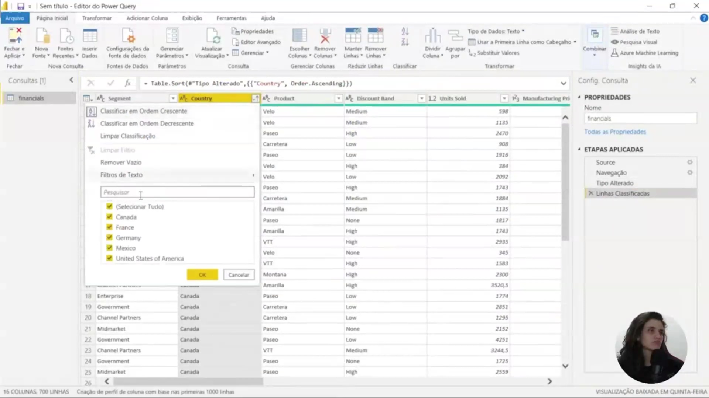
</p>

A imagem detalha o **Editor do Power Query**, onde ocorre o processo de **transformação de dados (ETL)**. É possível visualizar a tabela de dados estruturada e o painel lateral de **Etapas Aplicadas**, que registra cada modificação feita, como a alteração de tipos de dados e a ordenação de colunas.

Durante esta etapa, podem ser realizadas operações de limpeza e ajuste, como:

* **Remover vazios**: Filtragem de linhas sem informações.
* **Arredondamento**: Ajuste de colunas numéricas (ex: "Unidades Vendidas") para números inteiros.
* **Formatação de Texto**: Transformação de nomes de meses ou países para maiúsculas para manter a padronização.
* **Gerenciamento de Etapas**: Caso uma transformação não seja satisfatória, ela pode ser excluída individualmente no painel de configurações da consulta para retornar ao estado anterior.

Na parte superior, a barra de fórmulas exibe o código em **Linguagem M** correspondente à última ação realizada:

```powerquery
Table.Sort("Tipo Alterado", {{"Country", Order.Ascending}})

```

Ao finalizar essas transformações, utiliza-se a opção **Fechar e Aplicar** para carregar os dados tratados no modelo do relatório.


### 🟩 Vídeo 14 - Criando Primeira Página do Relatório Financials – Sample Power BI

<video width="60%" controls>
  <source src="000-Midia_e_Anexos/bootcamp_ntt_data-modulo.05-curso.04-video_14.webm" type="video/webm">
    Seu navegador não suporta vídeo HTML5.
</video>

link do vídeo: https://web.dio.me/track/engenharia-dados-python/course/primeiros-passos-com-power-bi/learning/d3a47918-800a-4bac-9cca-5d4580b39d4b?autoplay=1

### Anotações

<p align="center">
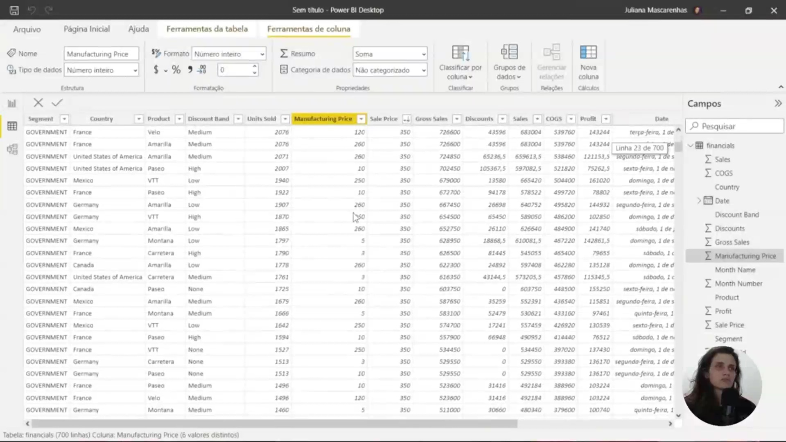
</p>

Para garantir a integridade das análises visuais, é essencial validar a estrutura dos dados na **Exibição de Dados** do Power BI. Nesta interface, podemos observar a tabela `financials`, que contém colunas fundamentais como **Segment**, **Country**, **Product**, **Manufacturing Price** e **Sale Price**.

A análise direta da tabela permite identificar comportamentos que podem parecer anômalos nos gráficos, como o **Manufacturing Price** (Preço de Manufatura) apresentar valores superiores ao **Sale Price** (Preço de Venda) em determinadas linhas. Ao examinar os dados brutos, percebe-se que isso ocorre devido à aplicação de faixas de desconto (**Discount Band**) elevadas, o que impacta diretamente a margem de lucro e o comportamento das médias exibidas no relatório.

<p align="center">
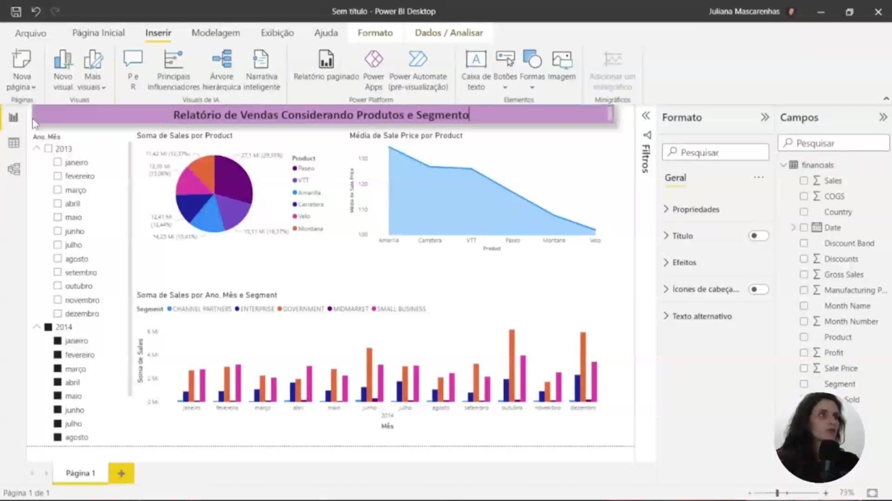
</p>

O dashboard finalizado, intitulado **"Relatório de Vendas Considerando Produtos e Segmento"**, consolida diferentes perspectivas das métricas financeiras de forma interativa. A interface é composta por quatro elementos principais:

* **Soma de Sales por Product:** Um gráfico de pizza que demonstra a participação de cada produto no volume total de vendas, destacando o produto **Paseo** como o de maior saída.
* **Média de Sale Price por Product:** Um gráfico de área que revela a hierarquia de preços médios, permitindo identificar que o produto mais vendido não é necessariamente o mais caro ou o mais barato.
* **Soma de Sales por Ano, Mês e Segmento:** Um gráfico de colunas clusterizado que detalha o desempenho das vendas ao longo do tempo (2013-2014), segmentado por categorias como **Government**, **Small Business** e **Enterprise**.
* **Segmentação de Dados (Filtro):** Um controle lateral que permite filtrar todo o relatório por períodos específicos, facilitando a análise de intervalos temporais customizados.

A disposição visual busca o alinhamento dos componentes para facilitar a leitura e a comparação rápida entre o volume de vendas e o perfil dos segmentos atendidos.

### 🟩 Vídeo 15 - Criando Segunda Página do Relatório Financials – Sample Power BI

<video width="60%" controls>
  <source src="000-Midia_e_Anexos/bootcamp_ntt_data-modulo.05-curso.04-video_15.webm" type="video/webm">
    Seu navegador não suporta vídeo HTML5.
</video>

link do vídeo: https://web.dio.me/track/engenharia-dados-python/course/primeiros-passos-com-power-bi/learning/999df371-5082-4993-b1bc-4ca72473dd38?autoplay=1


### 🟩 Vídeo 16 - Explorando Relatório Financials e Ajustando Recursos Visuais

<video width="60%" controls>
  <source src="000-Midia_e_Anexos/bootcamp_ntt_data-modulo.05-curso.04-video_16.webm" type="video/webm">
    Seu navegador não suporta vídeo HTML5.
</video>

link do vídeo: https://web.dio.me/track/engenharia-dados-python/course/primeiros-passos-com-power-bi/learning/16ebbfc7-4b0e-438f-affe-49b8aa6f4e9e?autoplay=1

O vídeo é uma aula prática sobre a **personalização de relatórios no Power BI**, focando na experiência do usuário. O instrutor demonstra como utilizar ferramentas de **ajuste de visualização**, como o bloqueio de objetos e a configuração de indicadores para capturar estados específicos dos dados. Um ponto central da explicação é a criação de um **layout móvel**, que permite organizar gráficos de forma independente da versão para desktop sem alterar o projeto original. Além de ensinar a redimensionar elementos para dispositivos móveis, o conteúdo aborda a **inserção de linguagens de programação** como Python e R para análises avançadas. Por fim, o tutorial encerra apresentando recursos de **inteligência artificial e modelagem**, incentivando a continuidade dos estudos em níveis mais complexos da plataforma.

### Anotações

<p align="center">
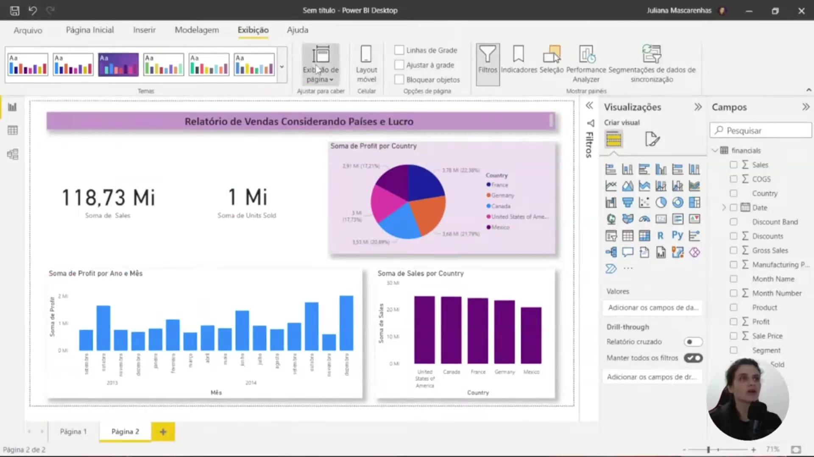
</p>

Na guia de **Exibição** do Power BI Desktop, encontram-se ferramentas essenciais para a organização visual e precisão do layout do relatório. É possível ajustar a visualização da página para "Ajustar à página", "Ajustar à largura" ou ver o "Tamanho real", o que facilita a análise detalhada de cada gráfico individualmente.

Para auxiliar no alinhamento dos elementos visuais, a interface oferece opções como:

* **Linhas de grade**: Exibe guias horizontais e verticais no plano de fundo.
* **Ajustar à grade**: Força os objetos a se alinharem automaticamente com as linhas de grade ao serem movidos.
* **Bloquear objetos**: Impede que elementos já posicionados saiam do lugar acidentalmente enquanto o usuário manipula outros componentes do relatório.

Nesta tela, observa-se um relatório de vendas que utiliza cartões para destacar métricas como a "Soma de Sales" (118,73 Mi) e gráficos que detalham o lucro por ano e mês.

<p align="center">
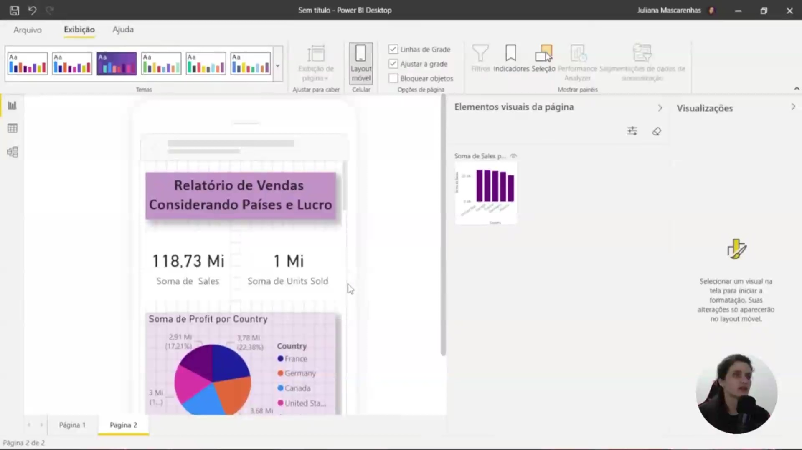
</p>

O recurso de **Layout móvel** permite a criação de uma versão otimizada do relatório especificamente para visualização em dispositivos celulares. O funcionamento é baseado no sistema de "arrastar e soltar", onde o usuário seleciona os elementos visuais da página original no painel lateral e os posiciona na tela que simula o visor de um smartphone.

Um ponto fundamental deste modo é que as modificações de tamanho e posicionamento feitas no layout móvel **não afetam a área de trabalho (desktop)**. Isso permite, por exemplo, reduzir o tamanho de cartões de dados (como a "Soma de Sales" e "Units Sold") para que se ajustem melhor à tela estreita, sem prejudicar a visualização principal no monitor do computador.

<p align="center">
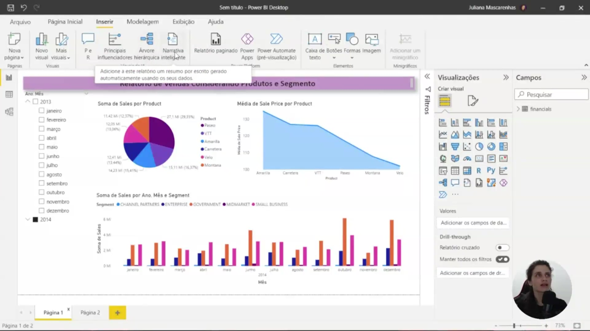
</p>

A guia **Inserir** expande as capacidades analíticas do Power BI, oferecendo recursos avançados para a construção de relatórios inteligentes. Entre as opções disponíveis, destacam-se:

* **Narrativa inteligente**: Gera automaticamente um resumo por escrito baseado nos dados presentes no relatório.
* **Árvore hierárquica e Principais influenciadores**: Ferramentas de análise que ajudam a entender os fatores que impulsionam determinadas métricas.
* **Integrações**: Possibilidade de inserir scripts de Python e R, além de integrar com Power Apps e Power Automate.

O exemplo prático mostra a diversidade de visuais que podem ser combinados, como o **gráfico de pizza** para a "Soma de Sales por Product" e gráficos de colunas para analisar o desempenho de vendas ao longo do tempo (Ano/Mês) segmentado por diferentes canais. A escolha do visual correto é determinante para a clareza da informação, especialmente quando se lida com variações temporais extensas ou múltiplas categorias de produtos.


# Certificado: Primeiros Passos com Power BI

- Link na plataforma: https://hermes.dio.me/certificates/YRS6OXNN.pdf
- Certificado em pdf: [[Certificado-Primeiros_Passos_com_Power_BI.pdf]](000-Midia_e_Anexos/Certificado-Primeiros_Passos_com_Power_BI.pdf)