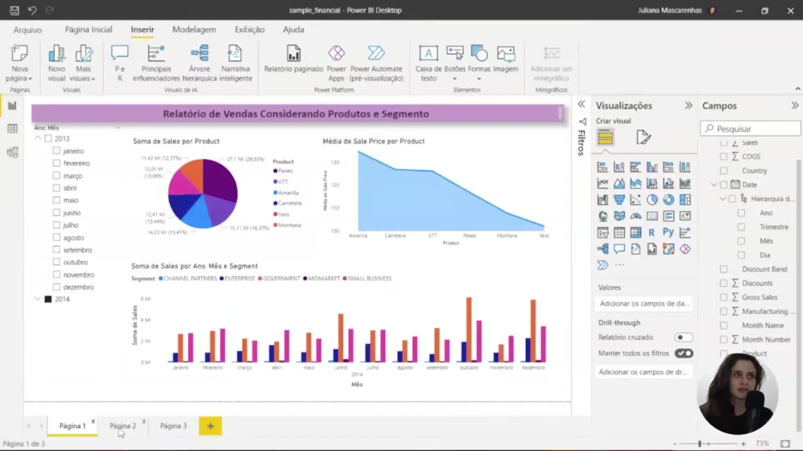
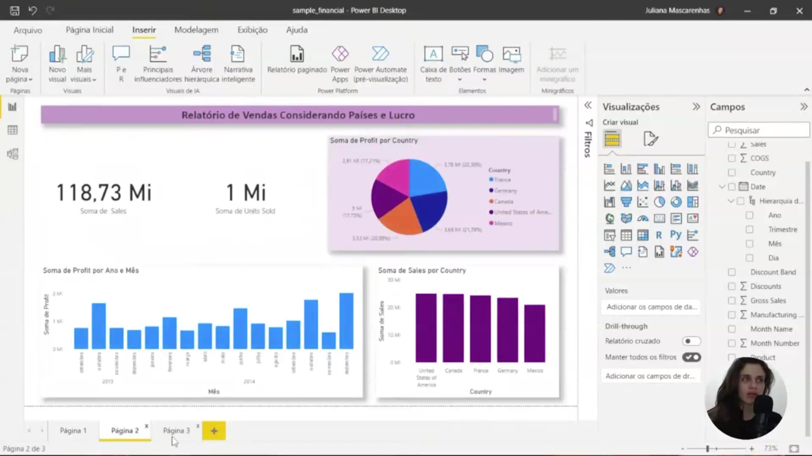
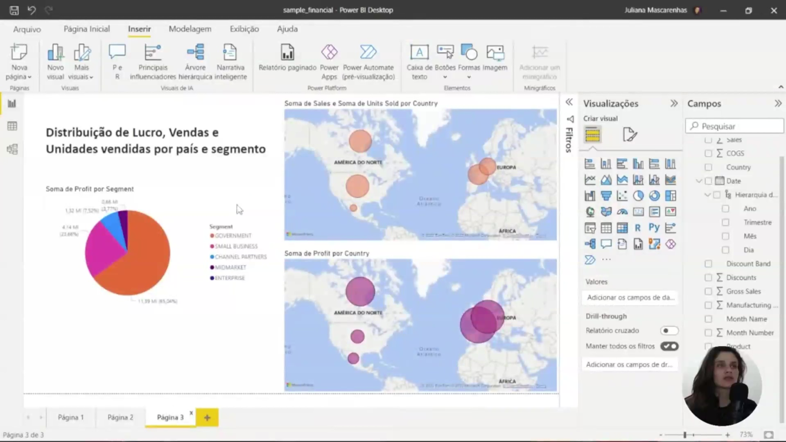

## Instrutor:

- Juliana Mascarenhas (Tech Education Specialist / Sócia (Content Creator) @SimplificandoRedes / Me Modelagem Computacional / Cientista de dados)
- Contato Linkedin: / [juliana-mascarenhas-ds](https://www.linkedin.com/in/juliana-mascarenhas-ds/)

### 🟩 Vídeo - Analisando Dados com SQL Analytics e Power BI

<video width="60%" controls>
  <source src="000-Midia_e_Anexos/bootcamp_ntt_data-modulo.05-curso.05-video_01.webm" type="video/webm">
    Seu navegador não suporta vídeo HTML5.
</video>

link do vídeo: https://web.dio.me/lab/analisando-dados-com-sql-analytics-e-power-bi/learning/75e3d085-0e55-48cc-928d-93c4a3fa9995?back=/track/engenharia-dados-python

O vídeo apresenta um desafio prático de Power BI, onde os alunos devem recriar e expandir um relatório de análise de vendas e lucros. O foco principal é a utilização de recursos visuais geográficos (mapas de bolhas) e de segmentação para identificar disparidades entre volume de vendas e lucratividade em diferentes países e setores, culminando na publicação e documentação do projeto.

Esta interface do Power BI Desktop apresenta o relatório inicial que serve como base para o desafio proposto. O dashboard exibe uma análise de vendas e preços médios distribuída por produtos específicos (Paseo, VTT, Amarilla, Carretera, Velo e Montana).

Na estrutura visual, observamos:

* Um gráfico de setores (pizza) detalhando a **Soma de Sales por Product**.
* Um gráfico de área que demonstra a **Média de Sale Price por Product**.
* Um gráfico de colunas agrupadas que detalha a **Soma de Sales** ao longo dos meses de 2013 e 2014, segmentado por categorias de mercado.

Este material compõe as duas páginas iniciais da amostra (sample) que devem ser recriadas como parte do exercício prático.

A imagem foca na segunda página do relatório, intitulada "Relatório de Vendas Considerando Países e Lucro". Esta visão prioriza a performance geográfica e financeira, utilizando os seguintes elementos:

* **Gráfico de Rosca:** Exibe a distribuição proporcional da **Soma de Sales** por país (França, Alemanha, Canadá, Estados Unidos e México).
* **Gráfico de Colunas:** Apresenta a evolução do lucro mensal (**Soma de Profit**) entre os anos de 2013 e 2014.
* **Gráfico de Barras:** Compara o volume total de vendas (**Soma de Sales**) entre as diferentes nações.

No painel lateral de **Campos**, nota-se a estrutura de dados com a hierarquia de datas (Ano, Trimestre, Mês, Dia) e os campos financeiros (COGS, Discounts, Gross Sales) que dão suporte às visualizações.

Esta tela apresenta a terceira página do relatório, que deve ser desenvolvida de forma autônoma. O foco principal é a análise geoespacial utilizando o **Mapa de Bolhas**, que permite identificar o impacto de vendas e lucros por região.

As diretrizes para configuração desta página incluem:

* **Distribuição de Vendas (Mapa Superior):** Utiliza a localização por *Country* e define o tamanho da bolha pela *Soma de Sales*. Foi configurada uma "Dica de Ferramenta" (Tooltip) para exibir a *Soma de Units Sold* ao passar o mouse.
* **Distribuição de Lucro (Mapa Inferior):** Focado na *Soma de Profit*. A comparação visual entre os dois mapas revela que áreas com alto volume de vendas não necessariamente representam o maior lucro.
* **Análise por Segmento (Gráfico de Pizza):** Localizado à esquerda, apresenta a **Soma de Profit por Segment** (Government, Small Business, etc.). Este visual atua como um filtro interativo: ao selecionar um segmento, os mapas são atualizados automaticamente para refletir os dados específicos daquela categoria.

## Entendendo o Desafio

Agora é a sua hora de brilhar e construir um perfil de destaque na DIO! Explore todos os conceitos explorados até aqui e replique (ou melhore, porque não?) este projeto prático. Para isso, crie seu próprio repositório e aumente ainda mais seu portfólio de projetos no GitHub, o qual pode fazer toda diferença em suas entrevistas técnicas 😎

Neste repositório, insira todos os links e arquivos necessários para seu projeto, seja um arquivo de banco de dados ou um link para o template no Figma.

**Dica:** Se o expert forneceu um repositório Github, você pode dar um "fork" no repositório dele para organizar suas alterações e evoluções mantendo uma referência direta ao código-fonte original.

---

### Instruções para entrega

**Descrição do desafio:** Vamos para o primeiro desafio com Power BI? Neste projeto você irá replicar duas páginas já criadas durante o curso com a sample disponibilizada. Acesse o link do Github para ter acesso aos dados:

[https://github.com/julianazanelatto/power_bi_analyst](https://github.com/julianazanelatto/power_bi_analyst)

A terceira página, a qual vocês irão criar sozinhos, deve conter alguns visuais. Esse desafio visa treinar a habilidade de criação de visuais. Assim, você poderá criar familiaridade com esses recursos. Em módulos mais avançados iremos tratar do layout mais elaborado dos nossos relatórios.

Muito bem, a terceira página é composta por:

- **Visual mapa 1:** Soma de sales e unidades vendidas por país  
- **Visual mapa 2:** Soma de lucro (profit) por país  
- **Visual de pizza:** Lucro por segmento

## Projeto entregue

Link : https://github.com/ahaerdy/DIO-projeto-powerbi-financials  
