## Instrutor:

- Juliana Mascarenhas (Tech Education Specialist / Sócia (Content Creator) @SimplificandoRedes / Me Modelagem Computacional / Cientista de dados)
- Contato Linkedin: / [juliana-mascarenhas-ds](https://www.linkedin.com/in/juliana-mascarenhas-ds/)

## Parte 1 - Trabalhando com Visuais no Power BI

### 🟩 Vídeo 01 - Apresentação do curso

<video width="60%" controls>
  <source src="000-Midia_e_Anexos/bootcamp_ntt_data-modulo.06-curso.01-video_01.webm" type="video/webm">
    Seu navegador não suporta vídeo HTML5.
</video>

link do vídeo: https://web.dio.me/track/engenharia-dados-python/course/trabalhando-com-visuais-no-power-bi/learning/ee757ff7-83d8-49c9-94b8-27471b713364?autoplay=1

Este módulo foca na transformação de dados brutos em narrativas visuais impactantes. O objetivo principal é capacitar o aluno a entender não apenas como criar gráficos, mas quando e por que utilizar cada tipo de visualização para gerar insights claros e acionáveis

### Anotações

Nesta introdução ao módulo **Explorando Dados e Relatórios com Power BI**, o foco é compreender a arquitetura da ferramenta e como ela se organiza para a criação de dashboards interativos. A abordagem central do curso visa definir claramente o que são os "blocos" dentro do ecossistema do Power BI e como as visualizações se integram aos dados.

Para proporcionar um aprendizado abrangente, a dinâmica de ensino é dividida em frentes específicas:

* **Diversidade de Visuais**: Desenvolvimento de três relatórios distintos em contextos variados para explorar quando e como utilizar componentes como gráficos de funil, pizza, donut, treemap e a árvore hierárquica.
* **Interatividade e Tooltips**: Criação de dicas de ferramenta personalizadas, permitindo que janelas flutuantes com informações contextuais sejam exibidas ao interagir com os gráficos.
* **Visuais Customizados**: Além dos recursos nativos do Power BI Desktop, o curso explora a integração de visuais externos e referências avançadas para expandir as possibilidades de análise de dados.

O objetivo final é garantir que a escolha de cada visual seja estratégica, evitando a monotonia e garantindo que o relatório atenda às necessidades específicas de cada cenário de negócio. 

### 🟩 Vídeo 02 - Formalizando conceitos do Power BI
<video width="60%" controls>
  <source src="000-Midia_e_Anexos/bootcamp_ntt_data-modulo.06-curso.01-video_02.webm" type="video/webm">
    Seu navegador não suporta vídeo HTML5.
</video>

link do vídeo: https://web.dio.me/track/engenharia-dados-python/course/trabalhando-com-visuais-no-power-bi/learning/a6c48aca-cdec-4b4b-b29c-e2d97b879bc5?autoplay=1

Este guia detalha as diferenças fundamentais entre as ferramentas do ecossistema Power BI, focando em quando e como utilizar o Power BI Desktop e o Power BI Service.

### Anotações

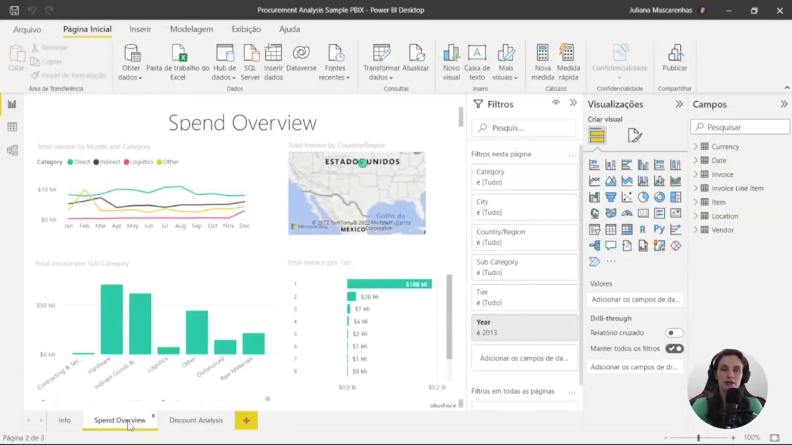

A interface inicial apresentada é a do **Power BI Desktop**, ferramenta voltada primordialmente para a criação local de relatórios e dashboards. Na imagem, observa-se a aba "Spend Overview", que exibe um gráfico de barras comparando gastos em categorias como Hardware, Logística e Matérias-primas. Neste estágio, o trabalho é estritamente individual e reside na máquina do desenvolvedor.

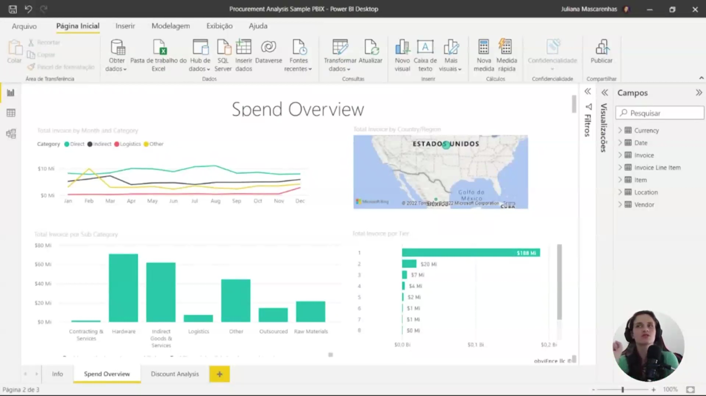

Nesta visão detalhada do Power BI Desktop, é possível visualizar o ambiente completo de manipulação de dados. À direita, encontram-se os painéis de **Visualizações** e **Campos** (Fields), que permitem ao usuário arrastar métricas e dimensões para o relatório. O dashboard em questão apresenta mapas e gráficos que auxiliam na análise de compras e fornecedores, evidenciando as capacidades de coleta e transformação de dados da versão Desktop.

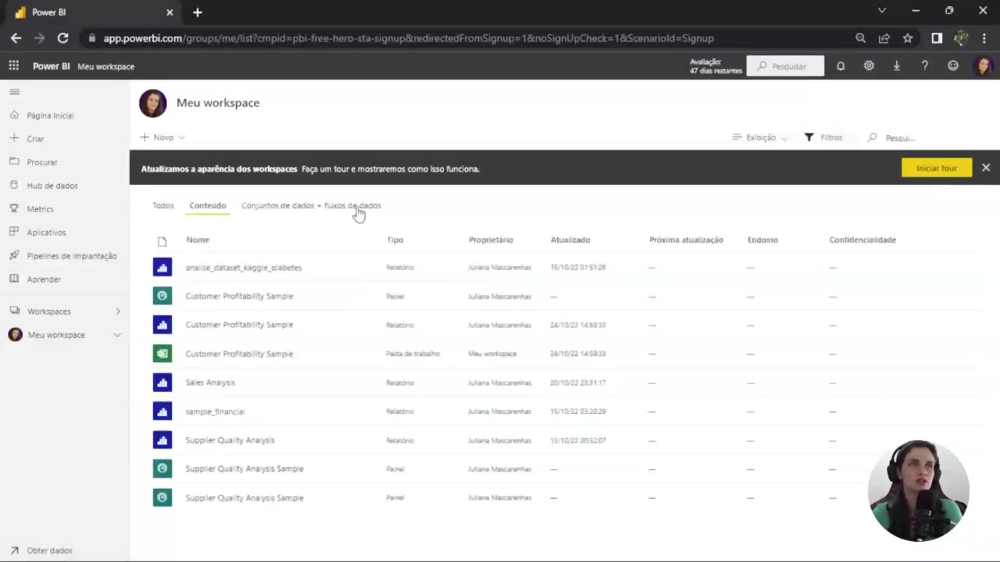

A interface apresentada é a do **Power BI Serviço**, acessada via navegador (app.powerbi.com). O foco desta plataforma é a visualização e o compartilhamento de dashboards com outros usuários. No menu "Meu workspace", observa-se uma lista de conteúdos publicados, incluindo relatórios como "Sales Analysis" e "Customer Profitability Sample", além de conjuntos e fluxos de dados prontos para consumo.

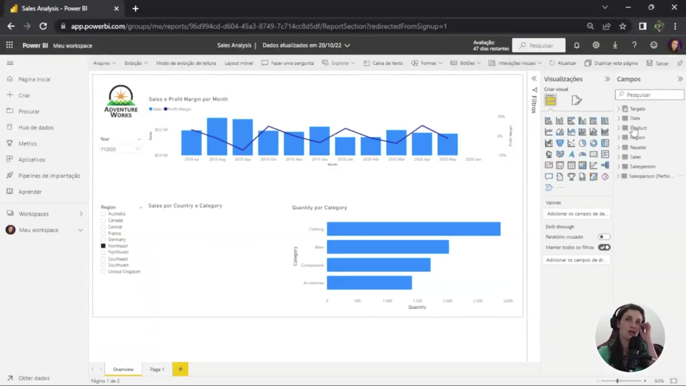

Embora o Power BI Serviço seja focado em visualização, a imagem demonstra a possibilidade de **edição direta no browser**. Ao abrir o relatório "Sales Analysis", o usuário tem acesso a menus de visualização e campos muito semelhantes aos do Desktop. Essa funcionalidade é útil para ajustes rápidos e interações pontuais quando o usuário não possui o software instalado localmente, embora a versão web apresente recursos mais limitados que a ferramenta Desktop original.      

### 🟩 Vídeo 03 - Criando Alguns gráficos publicando relatório no Power BI Service
<video width="60%" controls>
  <source src="000-Midia_e_Anexos/bootcamp_ntt_data-modulo.06-curso.01-video_03.webm" type="video/webm">
    Seu navegador não suporta vídeo HTML5.
</video>

link do vídeo: https://web.dio.me/track/engenharia-dados-python/course/trabalhando-com-visuais-no-power-bi/learning/0eabe78f-0a5e-443b-9b70-6a6b0e88a9a6?autoplay=1

Este tutorial foca na exploração prática de diferentes tipos de gráficos e funcionalidades de Inteligência Artificial no Power BI, utilizando um conjunto de dados sobre diabetes. O instrutor demonstra como transformar dados brutos em insights visuais, ajustando agregações e explorando a interface do Power BI Service.

### Anotações

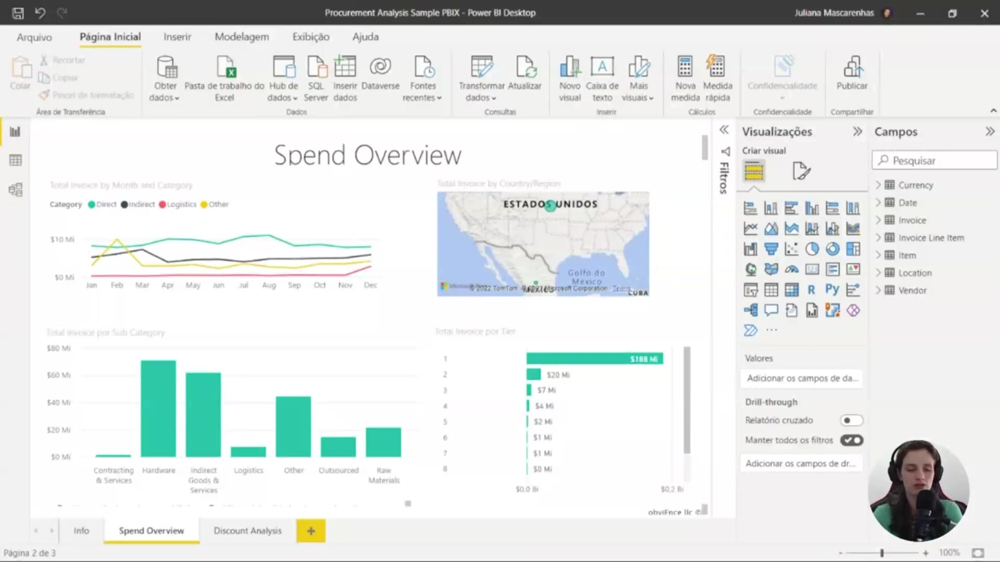

A interface inicial do Power BI Desktop apresenta um exemplo de relatório de análise de aquisições ("Procurement Analysis Sample"). O objetivo principal da ferramenta é permitir a visualização e a exploração de informações de um conjunto de dados, organizando campos como moeda, data, faturas, localização e fornecedores no painel lateral para a construção de gráficos e indicadores.

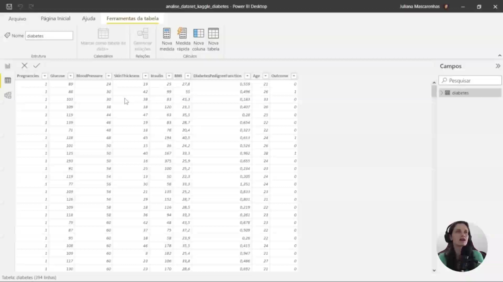

Visualização da exibição de dados do conjunto de dados sobre diabetes. Nesta tela, é possível inspecionar as informações estruturadas em colunas, que incluem variáveis como número de gestações (**Pregnancies**), níveis de glicose (**Glucose**), pressão arterial (**Blood Pressure**), espessura da pele (**Skin Thickness**), insulina (**Insulin**), IMC (**BMI**), função de pedigree de diabetes e idade (**Age**).

Início do processo de criação de um visual no Power BI. A imagem demonstra a configuração de um gráfico que relaciona a "Soma de Diabetes Pedigree Function" com a "Idade" (**Age**). Os campos da tabela `diabetes` são selecionados e arrastados para as áreas de eixos e valores no painel lateral, permitindo que a ferramenta processe as métricas para exibição gráfica.

Gráfico de barras horizontais finalizado, exibindo a "**Média de DiabetesPedigreeFunction por Age**". Este visual permite identificar quais faixas etárias possuem uma média superior na função de pedigree de diabetes, facilitando a análise comparativa direta entre os diferentes grupos de idade presentes no conjunto de dados.

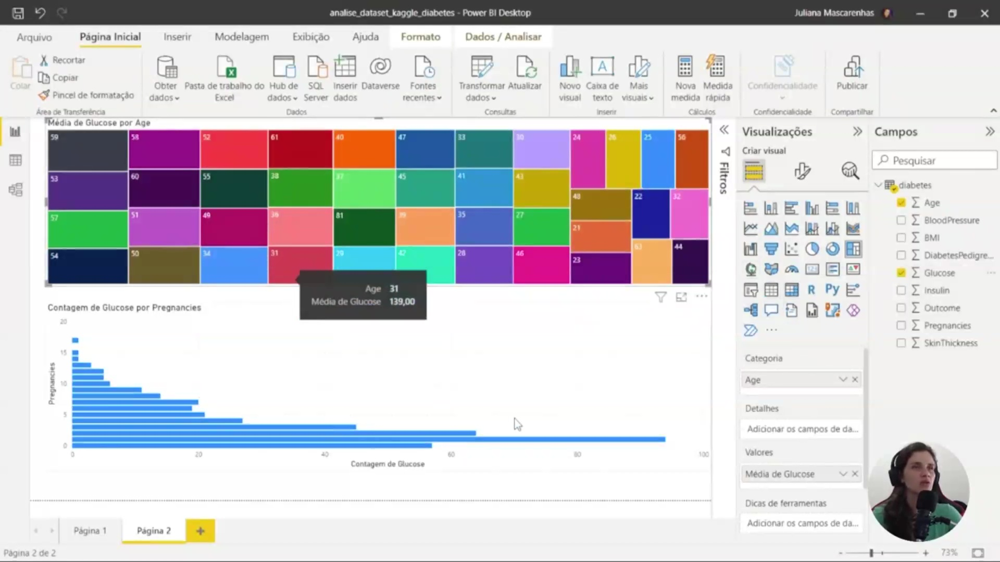

Construção de um painel de indicadores combinando diferentes tipos de visuais. Na parte superior, um gráfico de mapa de árvore (*Treemap*) mostra a "**Média de Glucose por Age**", enquanto na parte inferior, um gráfico de barras detalha a "**Contagem de Glucose por Pregnancies**". A imagem destaca a funcionalidade de dicas de ferramenta (*tooltip*), exibindo que, para a idade de 31 anos, a média de glicose é de 139,00.

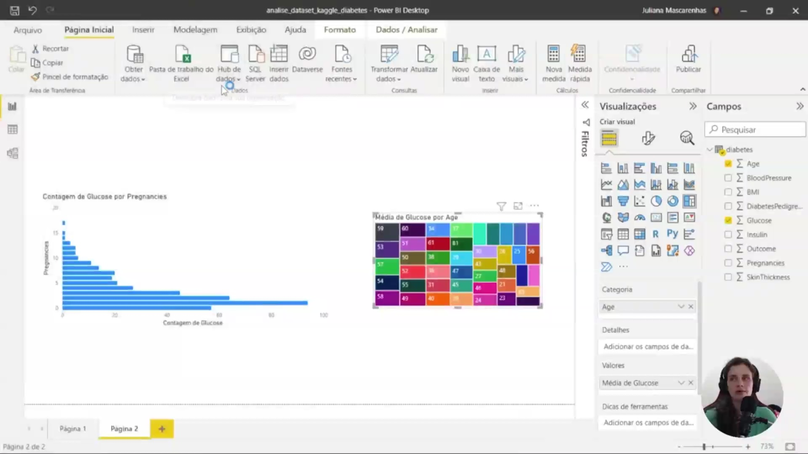

Foco no gráfico de barras horizontais que representa a "**Contagem de Glucose por Pregnancies**". Este visual correlaciona o volume de registros de glicose com o número de gestações das pacientes, auxiliando na compreensão da distribuição dos dados dentro do contexto do estudo sobre diabetes.

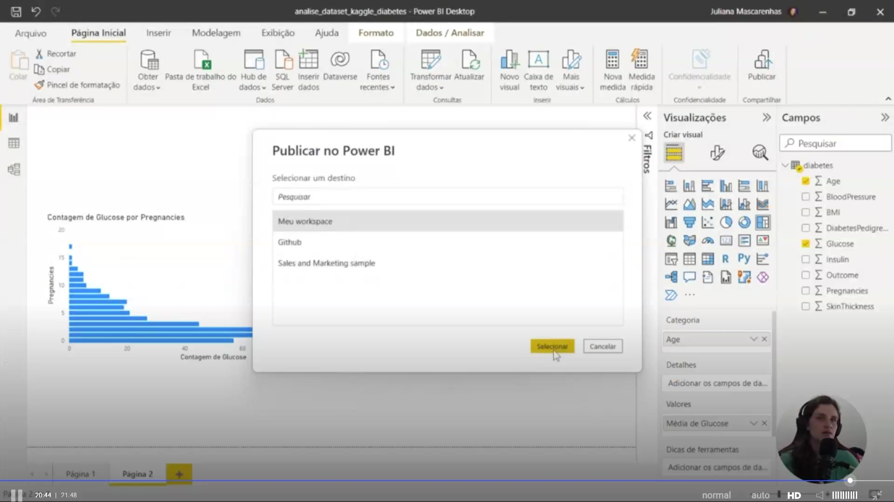

Interface de publicação do projeto para o Power BI Service. Após concluir o relatório no Desktop, inicia-se o processo de "**Publicar no Power BI**", onde o usuário deve selecionar um destino (como "Meu workspace") para que o relatório fique disponível na nuvem para compartilhamento e visualização online.

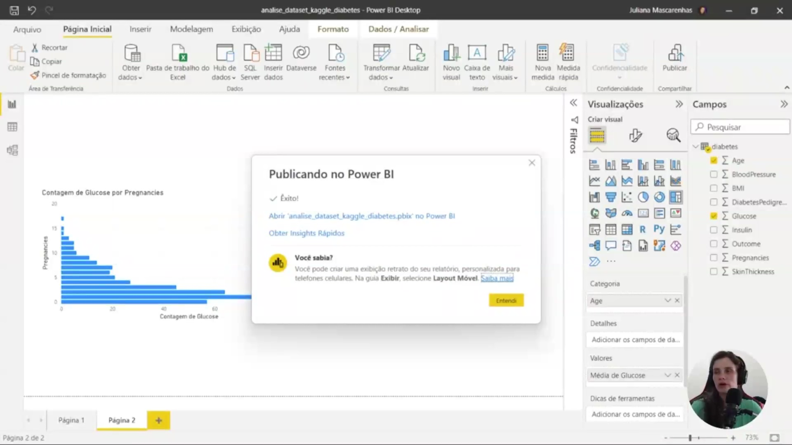

Tela de confirmação de êxito na publicação do relatório. O sistema informa que o processo foi concluído com sucesso e oferece opções imediatas para o usuário, como abrir o arquivo diretamente no serviço online do Power BI ou solicitar "**Insights Rápidos**" baseados nos dados publicados.

### 🟩 Vídeo 04 - Ajustando Relatório para criar um Layout Mobile
<video width="60%" controls>
  <source src="000-Midia_e_Anexos/bootcamp_ntt_data-modulo.06-curso.01-video_04.webm" type="video/webm">
    Seu navegador não suporta vídeo HTML5.
</video>

link do vídeo: https://web.dio.me/track/engenharia-dados-python/course/trabalhando-com-visuais-no-power-bi/learning/f5f52aa8-2230-4659-be9c-2680973c6ff6?autoplay=1

Este tutorial foca na adaptação de relatórios do Power BI para o formato mobile, garantindo que a visualização de dados seja eficiente e atraente em telas menores. O instrutor demonstra desde a ativação do layout móvel até a personalização detalhada de elementos visuais e interativos.

### Anotações

A interface inicial apresenta o **Power BI Desktop** configurado para a criação de um relatório analítico baseado em um conjunto de dados sobre diabetes. No painel lateral de **Campos**, é possível observar o *dataset* carregado com variáveis críticas como **Glucose** (glicose), **Age** (idade), **Blood Pressure** (pressão arterial) e **Pregnancies** (gravidezes). O objetivo central é explorar os fatores principais relacionados à condição, utilizando visualizações como o gráfico de barras que correlaciona a contagem de glicose com o número de gestações. Este ambiente serve como base para a transição entre as visualizações de desktop e as adaptações necessárias para dispositivos móveis.

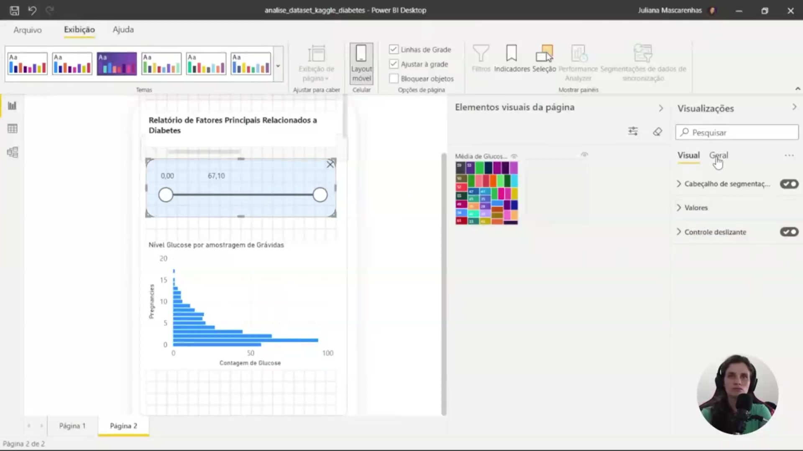

Ao acessar a aba **Exibição** e selecionar o **Layout móvel**, a interface disponibiliza uma tela que simula a proporção de um smartphone. Nesta etapa, é demonstrada a inclusão de um **segmentador de dados** (slicer) baseado no **BMI** (Índice de Massa Corpórea). A personalização deste elemento envolve o ajuste de efeitos visuais, como a definição de uma tela de fundo azul suave com transparência e a aplicação de uma **fronteira visual** com cantos arredondados. O processo enfatiza que os elementos devem ser criados previamente na visão de desktop para que fiquem disponíveis para organização na tela do dispositivo móvel.

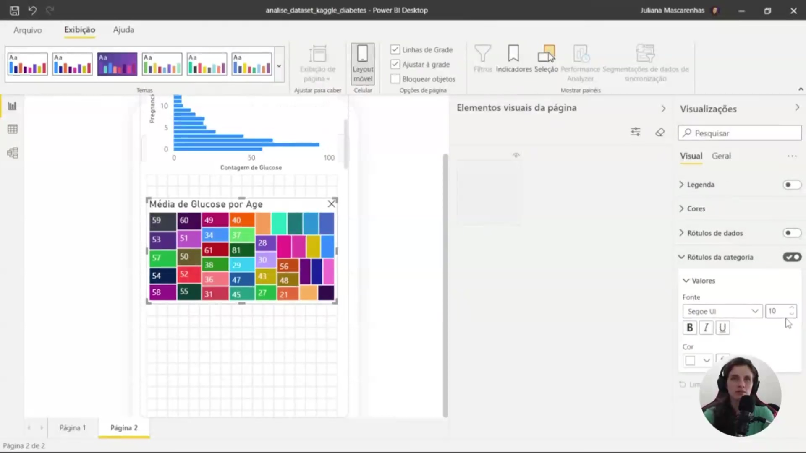

A finalização do ajuste para o layout móvel foca na legibilidade e na proporção dos gráficos. Para o visual de **Média de Glucose por Idade**, os **rótulos de categoria** e os títulos são redimensionados para tamanhos menores (como fonte 10), garantindo que a informação não fique poluída no espaço restrito da tela do celular. Esta adaptação é essencial para que os interessados possam acessar informações estratégicas de qualquer lugar, respeitando a hierarquia visual e a interatividade dos dados configurados, como a segmentação por amostragem de grávidas e níveis de glicose.      

### 🟩 Vídeo 05 - Conversando sobre Power BI e seus Blocos Construtores
<video width="60%" controls>
  <source src="000-Midia_e_Anexos/bootcamp_ntt_data-modulo.06-curso.01-video_05.webm" type="video/webm">
    Seu navegador não suporta vídeo HTML5.
</video>

link do vídeo: https://web.dio.me/track/engenharia-dados-python/course/trabalhando-com-visuais-no-power-bi/learning/9ba7efd5-cd9f-460b-9f64-733354d467e3?autoplay=1

### 🟩 Vídeo 06 - Conjunto de Dados, Report e Blocos do Power BI
<video width="60%" controls>
  <source src="000-Midia_e_Anexos/bootcamp_ntt_data-modulo.06-curso.01-video_06.webm" type="video/webm">
    Seu navegador não suporta vídeo HTML5.
</video>

link do vídeo:

### 🟩 Vídeo 07 - Utilizando o Modelo para Analisar o conjunto de dados da Sample do Power BI
<video width="60%" controls>
  <source src="000-Midia_e_Anexos/bootcamp_ntt_data-modulo.06-curso.01-video_07.webm" type="video/webm">
    Seu navegador não suporta vídeo HTML5.
</video>

link do vídeo:

### 🟩 Vídeo 08 - Entendendo os Tipos de gráficos Construindo um Relatório no Power BI
<video width="60%" controls>
  <source src="000-Midia_e_Anexos/bootcamp_ntt_data-modulo.06-curso.01-video_08.webm" type="video/webm">
    Seu navegador não suporta vídeo HTML5.
</video>

link do vídeo:

### 🟩 Vídeo 09 - Trabalhando com Árvore Hierárquica, Segmentadores e outros Visuais
<video width="60%" controls>
  <source src="000-Midia_e_Anexos/bootcamp_ntt_data-modulo.06-curso.01-video_09.webm" type="video/webm">
    Seu navegador não suporta vídeo HTML5.
</video>

link do vídeo:

### 🟩 Vídeo 10 - Onde estão as Samples do Power BI que iremos utilizar?
<video width="60%" controls>
  <source src="000-Midia_e_Anexos/bootcamp_ntt_data-modulo.06-curso.01-video_10.webm" type="video/webm">
    Seu navegador não suporta vídeo HTML5.
</video>

link do vídeo:

### 🟩 Vídeo 11 - Entendendo como os Dados da Sample estão Organizados no Power BI
<video width="60%" controls>
  <source src="000-Midia_e_Anexos/bootcamp_ntt_data-modulo.06-curso.01-video_11.webm" type="video/webm">
    Seu navegador não suporta vídeo HTML5.
</video>

link do vídeo:

### 🟩 Vídeo 12 - Gráficos de Mapas
<video width="60%" controls>
  <source src="000-Midia_e_Anexos/bootcamp_ntt_data-modulo.06-curso.01-video_12.webm" type="video/webm">
    Seu navegador não suporta vídeo HTML5.
</video>

link do vídeo:

### 🟩 Vídeo 13 - Utilizando Gráficos de Dispersão, Donut Chart e Cartões
<video width="60%" controls>
  <source src="000-Midia_e_Anexos/bootcamp_ntt_data-modulo.06-curso.01-video_13.webm" type="video/webm">
    Seu navegador não suporta vídeo HTML5.
</video>

link do vídeo:

### 🟩 Vídeo 14 - Criando um Gráfico de Funil e Realizando Interação com Relatório Criado
<video width="60%" controls>
  <source src="000-Midia_e_Anexos/bootcamp_ntt_data-modulo.06-curso.01-video_14.webm" type="video/webm">
    Seu navegador não suporta vídeo HTML5.
</video>

link do vídeo:

### 🟩 Vídeo 15 - Ajustando disposição dos gráficos no Relatório e Utilizando Medidores para Metas
<video width="60%" controls>
  <source src="000-Midia_e_Anexos/bootcamp_ntt_data-modulo.06-curso.01-video_15.webm" type="video/webm">
    Seu navegador não suporta vídeo HTML5.
</video>

link do vídeo:

### 🟩 Vídeo 16 - Criando um Dica de Ferramenta Paginada
<video width="60%" controls>
  <source src="000-Midia_e_Anexos/bootcamp_ntt_data-modulo.06-curso.01-video_16.webm" type="video/webm">
    Seu navegador não suporta vídeo HTML5.
</video>

link do vídeo:

### 🟩 Vídeo 17 - Quando Podemos utilizar Gráficos de Área?
<video width="60%" controls>
  <source src="000-Midia_e_Anexos/bootcamp_ntt_data-modulo.06-curso.01-video_17.webm" type="video/webm">
    Seu navegador não suporta vídeo HTML5.
</video>

link do vídeo:

### 🟩 Vídeo 18 - Analisando a Diferença entre Gráficos de Barras e Colunas
<video width="60%" controls>
  <source src="000-Midia_e_Anexos/bootcamp_ntt_data-modulo.06-curso.01-video_18.webm" type="video/webm">
    Seu navegador não suporta vídeo HTML5.
</video>

link do vídeo:

### 🟩 Vídeo 19 - Conclusão e Próximos Passos
<video width="60%" controls>
  <source src="000-Midia_e_Anexos/bootcamp_ntt_data-modulo.06-curso.01-video_19.webm" type="video/webm">
    Seu navegador não suporta vídeo HTML5.
</video>

link do vídeo:

##  Materiais de Apoio

# Certificado: 

- Link na plataforma: 
- Certificado em pdf: 
