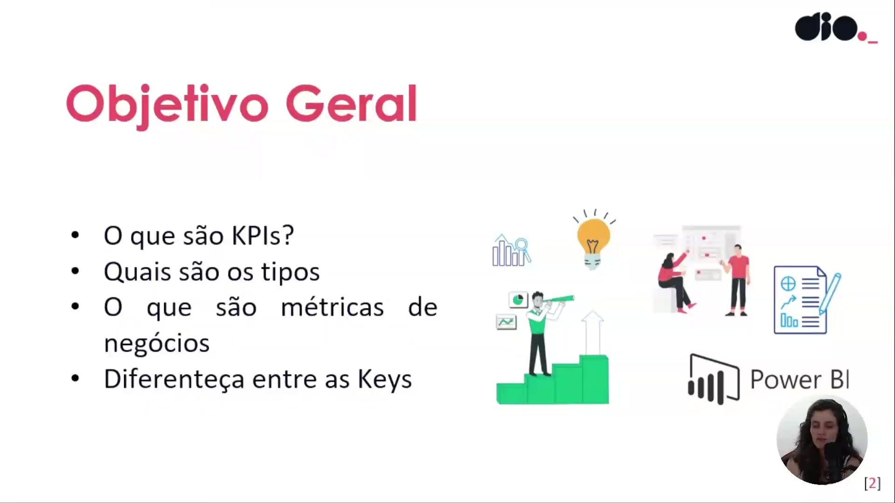
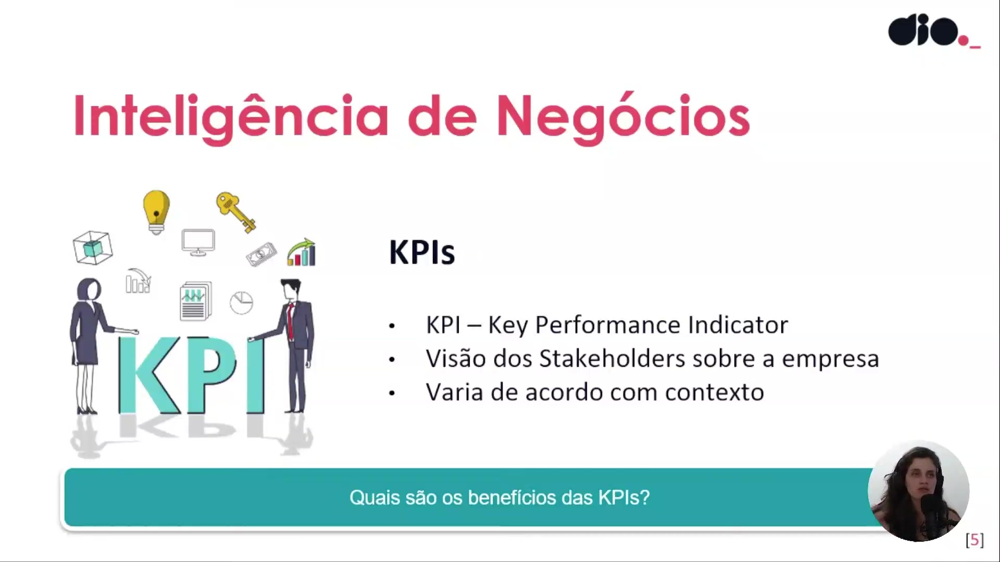
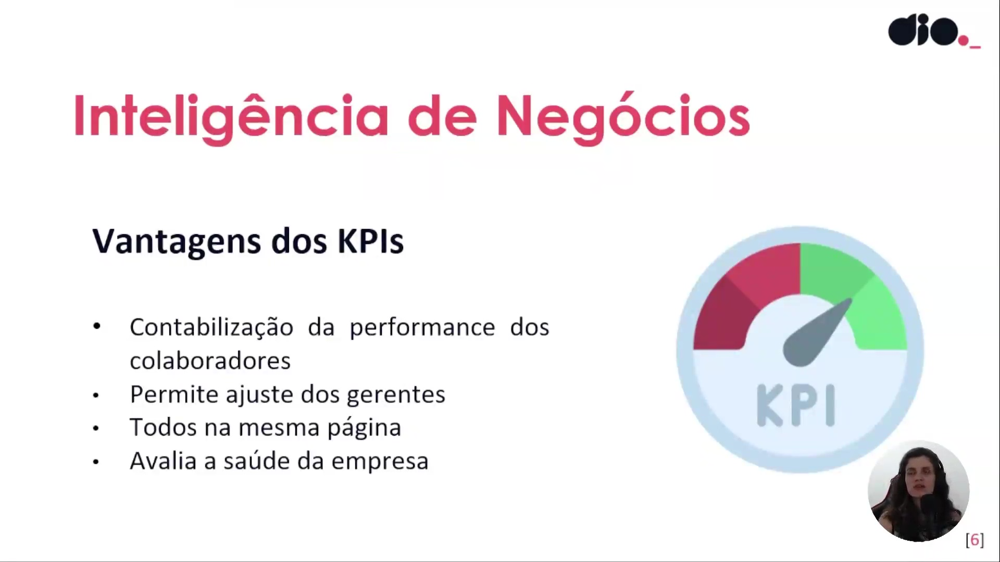
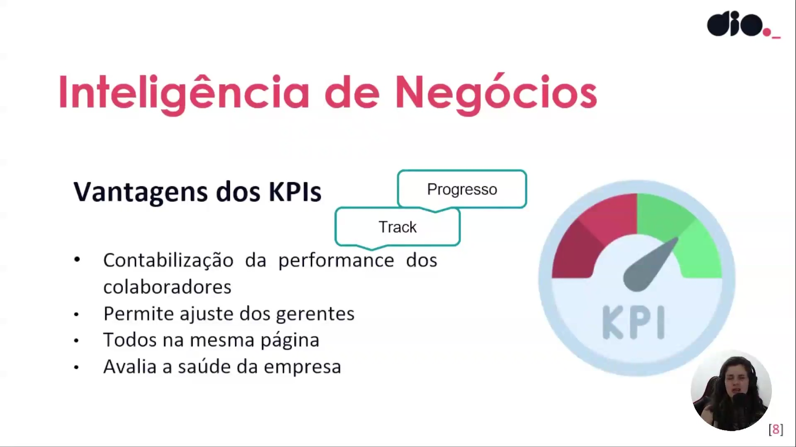
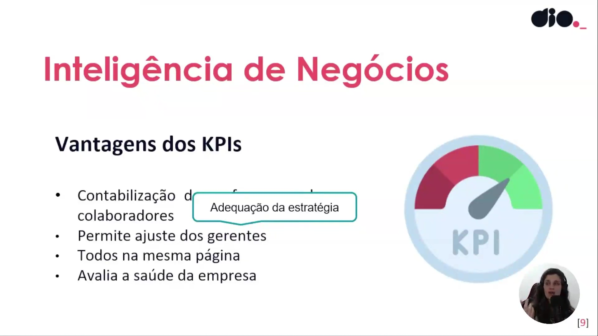
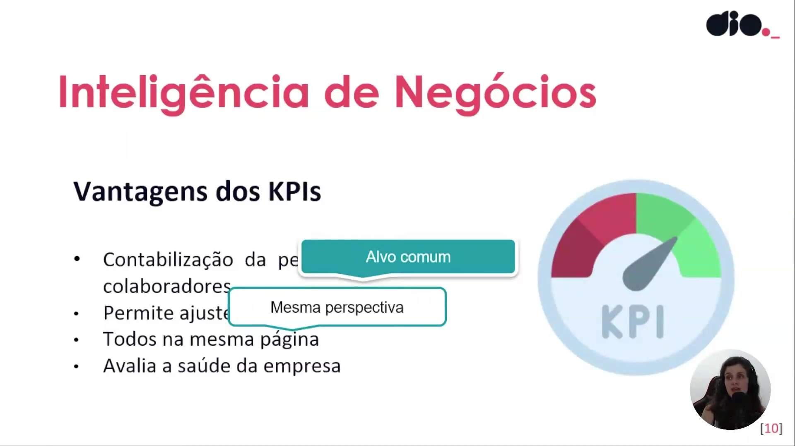
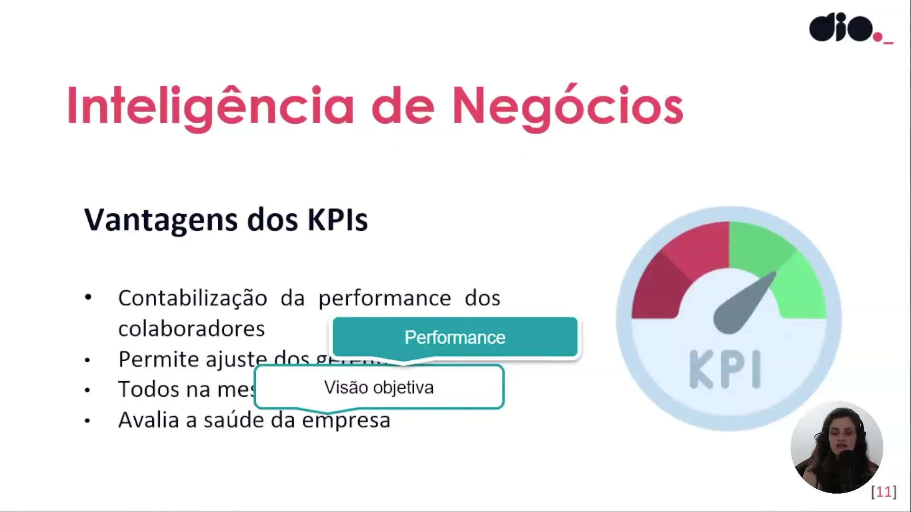
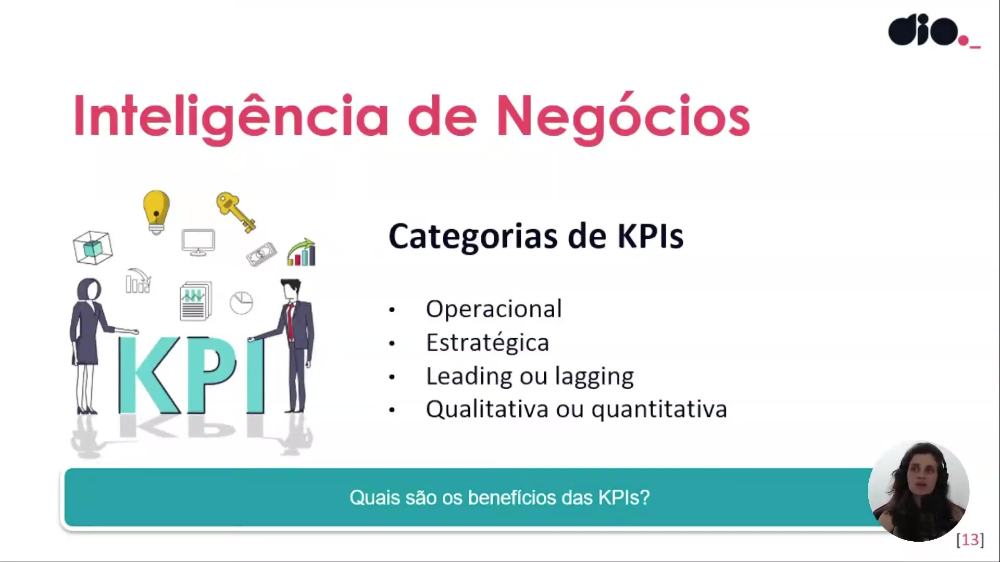
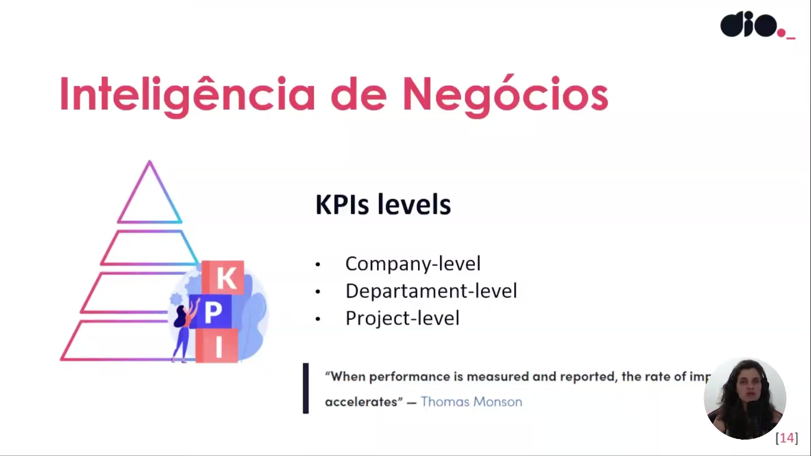
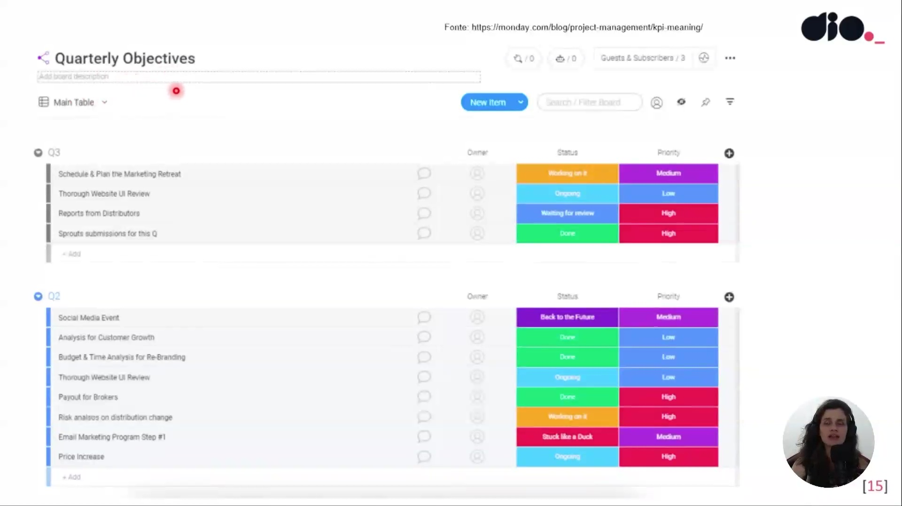

## Instrutor:

- Juliana Mascarenhas (Tech Education Specialist / Sócia (Content Creator) @SimplificandoRedes / Me Modelagem Computacional / Cientista de dados)
- Contato Linkedin: / [juliana-mascarenhas-ds](https://www.linkedin.com/in/juliana-mascarenhas-ds/)

## Parte 1 - Fundamentos de BI: KPIs e Métricas

### 🟩 Vídeo 01 - O que são KPIs?

<video width="60%" controls>
  <source src="000-Midia_e_Anexos/bootcamp_ntt_data-modulo.06-curso.02-video_01.webm" type="video/webm">
    Seu navegador não suporta vídeo HTML5.
</video>

link do vídeo: https://web.dio.me/track/engenharia-dados-python/course/fundamentos-de-bi-kpis-e-metricas/learning/da15b1e9-1c05-461a-892e-7c0a9b02caef?autoplay=1

Este conteúdo aborda a importância fundamental da medição de desempenho no contexto de *Business Intelligence* (BI). O foco principal é entender como transformar grandes volumes de dados em indicadores acionáveis (KPIs) que permitem medir a "saúde" de uma empresa e orientar a tomada de decisões baseada em dados (*data-driven*).

### Anotações

Nesta introdução à disciplina de **Fundamentos de BI**, o foco é estabelecido sobre a performance dos negócios e como os indicadores são cruciais para essa área. O conteúdo abordará especificamente os **KPIs (Key Performance Indicators)** e as **Métricas de Negócio**, elementos fundamentais para medir o sucesso e orientar a tomada de decisões dentro de uma estratégia de Business Intelligence utilizando ferramentas como o Power BI.

O **Objetivo Geral** desta unidade de ensino é capacitar o aluno a compreender e diferenciar os principais componentes de medição de desempenho. O cronograma de tópicos inclui:

* Definição de KPIs;
* Tipos e níveis de indicadores;
* Definição de métricas de negócio;
* Diferenciação entre os conceitos de "Keys" (chaves) e métricas comuns.

O uso desses elementos permite que a empresa avalie sua saúde financeira e operacional de maneira palpável e baseada em dados (**data-driven**).

Contextualizando a análise de dados, observa-se que as organizações lidam com uma imensidão de informações armazenadas em sistemas diversos. No fluxo de trabalho de um analista, após a preparação dos dados (seja via SQL ou dentro do próprio Power BI), surge a necessidade de definir **o que de fato será mensurado**. É neste estágio que as KPIs e métricas são selecionadas para transformar dados brutos em inteligência acionável.

O termo **KPI** é um acrônimo para **Key Performance Indicator** (Indicador-Chave de Performance). Diferente de uma métrica comum, o KPI funciona como um indicador mestre que:

* Verifica se a empresa está "nos trilhos" conforme o planejamento;
* Proporciona uma visão clara para os **stakeholders** (partes interessadas) sobre o progresso da organização;
* Apresenta variabilidade de acordo com o contexto, setor de atuação (ex: educação, indústria, auditoria) e área-fim da empresa.

A utilização de KPIs oferece vantagens estratégicas superiores às métricas tradicionais, destacando-se:

* **Contabilização da performance individual:** Permite descer na hierarquia para avaliar colaboradores (ex: volume de vendas ou qualidade de conteúdo);
* **Ajuste gerencial:** Facilita a tomada de ações corretivas baseadas na distância entre o estado atual e o alvo (meta) estabelecido;
* **Alinhamento da equipe:** Mantém todos os colaboradores na "mesma página" quanto à situação real da empresa;
* **Avaliação de saúde:** Funciona como um termômetro vital para a sustentabilidade do negócio.

### 🟩 Vídeo 02 - Vantagens da Utilização das KPIs

<video width="60%" controls>
  <source src="000-Midia_e_Anexos/bootcamp_ntt_data-modulo.06-curso.02-video_02.webm" type="video/webm">
    Seu navegador não suporta vídeo HTML5.
</video>

link do vídeo: https://web.dio.me/track/engenharia-dados-python/course/fundamentos-de-bi-kpis-e-metricas/learning/fce1fd79-772c-45ed-940c-274b17125230?autoplay=1

Este vídeo explora como os Indicadores-Chave de Desempenho (KPIs) funcionam como ferramentas essenciais para a gestão estratégica, permitindo desde o rastreamento individual de performance até a avaliação da saúde cultural de uma organização.

### Anotações

Os **KPIs (Key Performance Indicators)** oferecem a vantagem estratégica de **contabilizar a performance dos colaboradores**. Essa análise permite que a organização realize um rastreamento (*track*) do progresso individual , descendo o nível hierárquico da empresa desde a organização e setores até chegar a cada colaborador. Um exemplo prático dessa aplicação é a mensuração do número de vendas mensais por pessoa, o que ajuda a entender o desempenho específico de cada time e integrante.

A utilização de indicadores **permite o ajuste por parte dos gerentes** através da **adequação da estratégia**. Quando os resultados esperados não são alcançados, os KPIs ajudam a identificar "dores" ou impeditivos, como falhas em processos internos, sobrecarga de trabalho ou falta de comunicação. Com esses dados, a liderança pode tomar medidas assertivas para alavancar a performance, como a execução de treinamentos específicos ou reciclagens técnicas.

Outro benefício fundamental é manter **todos na mesma página** , estabelecendo um **alvo comum** e uma **mesma perspectiva**. Como a percepção de sucesso pode ser subjetiva entre diferentes áreas, o KPI serve como um objetivo único e objetivo. Isso facilita a determinação de prioridades e expectativas, garantindo que diferentes setores trabalhem de forma alinhada para alcançar o mesmo resultado organizacional.

Por fim, os KPIs são essenciais para **avaliar a saúde da empresa** através de uma **visão objetiva** da performance global. Eles permitem monitorar indicadores financeiros de lucratividade e taxas de retenção, tanto de clientes quanto de funcionários. Essa análise da retenção de colaboradores, por exemplo, reflete a força da cultura e o engajamento do time, permitindo que a gestão mude posturas ou aplique medidas corretivas sempre que identificar cenários desfavoráveis.      

### 🟩 Vídeo 03 - Categorias e Níveis dos KPIs

<video width="60%" controls>
  <source src="000-Midia_e_Anexos/bootcamp_ntt_data-modulo.06-curso.02-video_03.webm" type="video/webm">
    Seu navegador não suporta vídeo HTML5.
</video>

link do vídeo: https://web.dio.me/track/engenharia-dados-python/course/fundamentos-de-bi-kpis-e-metricas/learning/b1bca51f-2e8c-4e22-8533-552040d393c5?autoplay=1

Este guia explora a fundo os Indicadores Chave de Desempenho (KPIs), detalhando como eles são classificados, em quais níveis da organização operam e como a visualização de dados pode acelerar o crescimento de uma empresa.

### Anotações

Nesta etapa inicial, exploramos as **Categorias e Levels** (níveis) relacionados aos KPIs (**Key Performance Indicators**). A compreensão dessas divisões é fundamental para definir corretamente o que se pretende medir em uma organização. Os KPIs são classificados em diferentes grupos, como operacional, estratégico, leading/lagging e qualitativo/quantitativo, variando conforme a necessidade de análise e o prazo de execução.

As KPIs podem ser segmentadas em quatro grandes categorias principais que auxiliam na Inteligência de Negócios:

* **Operacional:** Focada no dia a dia e na rotina da empresa (curto prazo), medindo a eficiência de processos internos.
* **Estratégica:** Relacionada a objetivos amplos e de longo prazo, como crescimento de receita ou engajamento de usuários, sendo essencial para cargos de liderança (C-Level).
* **Leading ou Lagging:** Refere-se a indicadores antecipados (previsões de futuro, como satisfação do cliente) ou atrasados (conquistas passadas, como vendas do ano anterior).
* **Qualitativa ou Quantitativa:** Divide-se entre métricas mensuráveis numericamente (leads, metas) e métricas subjetivas (nível de satisfação de funcionários ou clientes).

Além das categorias, os KPIs são organizados em uma hierarquia de níveis (**KPIs levels**) dentro da estrutura organizacional:

1. **Company-level (Nível Organizacional):** Foca na saúde geral da empresa e desempenho macro.
2. **Department-level (Nível de Departamento):** Atende a requisitos específicos de equipes como Marketing, RH ou Produto, já que cada setor possui objetivos distintos.
3. **Project-level (Nível de Projeto):** O nível mais granular, voltado para o desempenho de execuções específicas, prazos e planejamentos.

Como destaca a citação de Thomas Monson: *"When performance is measured and reported, the rate of improvement accelerates"* (Quando o desempenho é medido e relatado, a taxa de aprimoramento acelera).

Para facilitar a gestão, utiliza-se o acompanhamento de **Objetivos Trimestrais (Quarterly Objectives)**. O uso de recursos visuais e ferramentas de gestão (como o exemplo da Monday.com) permite padronizar cores para **Status** e **Prioridade**, aumentando a legibilidade dos indicadores.

No exemplo apresentado, as tarefas são monitoradas através de:

* **Status:** Categorias como *Working on it*, *Ongoing*, *Waiting for review* ou *Done*.
* **Priority:** Classificações de criticidade como *High*, *Medium* ou *Low*.
* **Exemplos de Metas:** Planejamento de marketing, revisões de interface (UI) de websites e análises de crescimento de clientes (*Customer Growth*).

### 🟩 Vídeo 04 - O que Devemos Considerar com Uso das KPIs?

<video width="60%" controls>
  <source src="000-Midia_e_Anexos/bootcamp_ntt_data-modulo.06-curso.02-video_04.webm" type="video/webm">
    Seu navegador não suporta vídeo HTML5.
</video>

link do vídeo: https://web.dio.me/track/engenharia-dados-python/course/fundamentos-de-bi-kpis-e-metricas/learning/9d4c2fa1-83f9-4628-8ee1-78cff3d7908d?autoplay=1

### 🟩 Vídeo 05 - Considerações sobre KPIs

<video width="60%" controls>
  <source src="000-Midia_e_Anexos/bootcamp_ntt_data-modulo.06-curso.02-video_05.webm" type="video/webm">
    Seu navegador não suporta vídeo HTML5.
</video>

link do vídeo:

### 🟩 Vídeo 06 - Qual a diferença entre Métricas e KPIs?

<video width="60%" controls>
  <source src="000-Midia_e_Anexos/bootcamp_ntt_data-modulo.06-curso.02-video_06.webm" type="video/webm">
    Seu navegador não suporta vídeo HTML5.
</video>

link do vídeo:

##  Materiais de Apoio

# Certificado: 

- Link na plataforma: 
- Certificado em pdf: