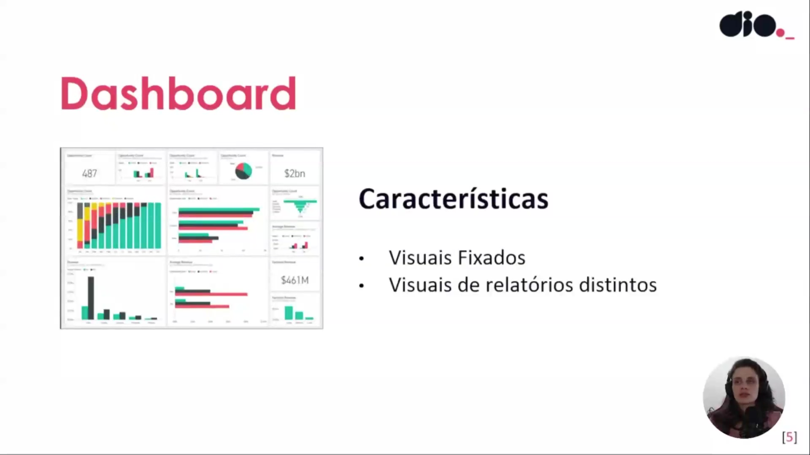
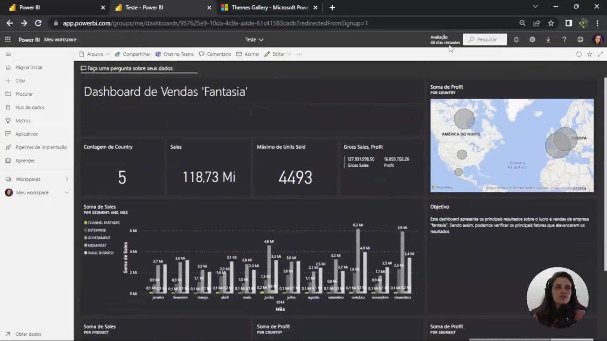
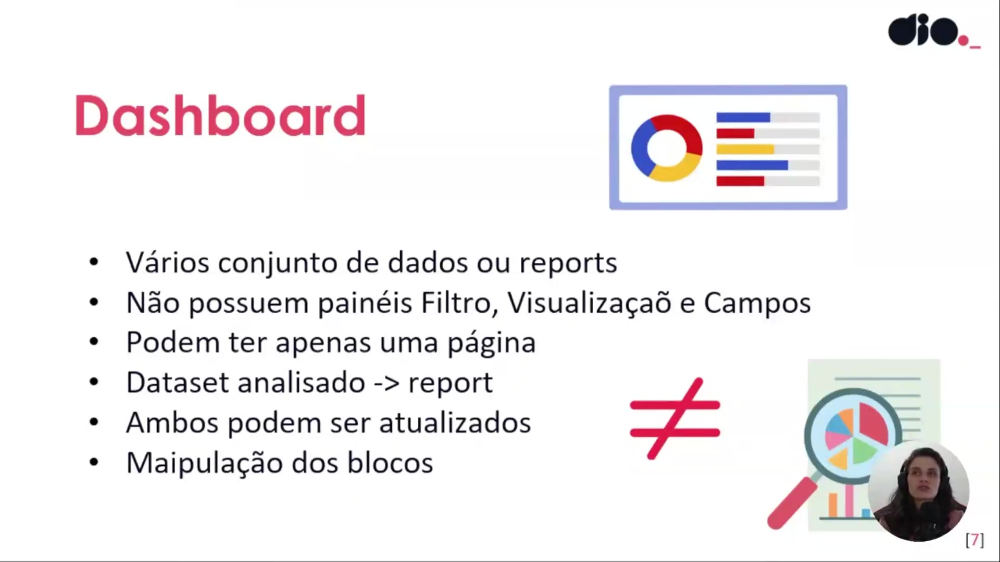
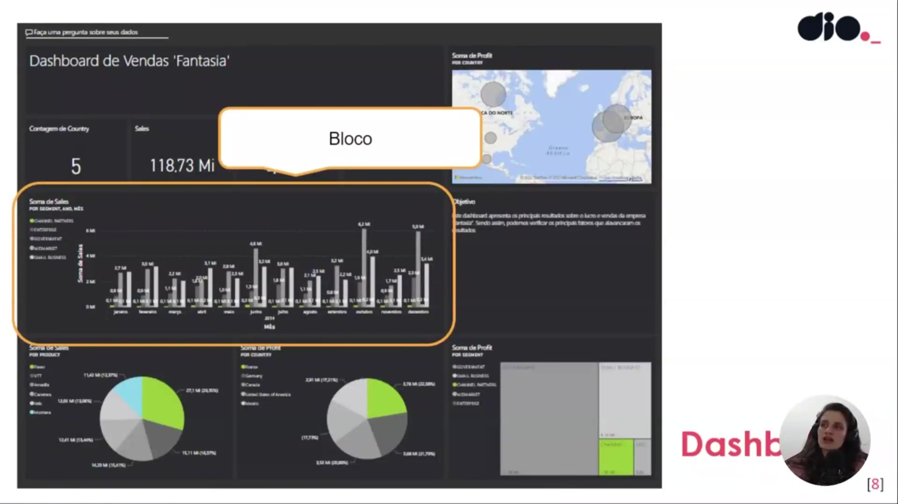

## Instrutor:

- Juliana Mascarenhas (Tech Education Specialist / Sócia (Content Creator) @SimplificandoRedes / Me Modelagem Computacional / Cientista de dados)
- Contato Linkedin: / [juliana-mascarenhas-ds](https://www.linkedin.com/in/juliana-mascarenhas-ds/)

## Parte 1 - Criando Dashboard Interativos com Power BI

### 🟩 Vídeo 01 - Apresentando o curso e definindo o que é um Dashboard?

<video width="60%" controls>
  <source src="000-Midia_e_Anexos/bootcamp_ntt_data-modulo.06-curso.03-video_01.webm" type="video/webm">
    Seu navegador não suporta vídeo HTML5.
</video>

link do vídeo: https://web.dio.me/track/engenharia-dados-python/course/criando-dashboard-interativos-com-power-bi/learning/0679b050-def6-46a1-8f15-9b5f050f32b3?autoplay=1

Este guia explora a criação e gestão de dashboards no Power BI Service. Diferente de um relatório denso e detalhado, o dashboard funciona como uma "vitrine" estratégica, consolidando informações cruciais de diversas fontes em uma única página. O conteúdo aborda desde a definição conceitual da Microsoft até aspectos técnicos de personalização, visualização mobile e governança de dados.

### Anotações

Este slide introduz o curso focado na criação de dashboards com Power BI, sob orientação da especialista Juliana Mascarenhas. O objetivo central é proporcionar uma experiência prática na construção de painéis que, diferentemente de relatórios comuns, priorizam a consolidação de métricas estratégicas para a tomada de decisão.

Os objetivos gerais do treinamento incluem o aprendizado de configurações fundamentais para a entrega de valor através de dashboards, tais como:

* Definição de modos de exibição mobile para acessibilidade em dispositivos móveis.
* Aplicação de temas personalizados aos elementos visuais do dashboard.
* Configuração da classificação de dados para melhor organização das informações.
* Adição de visuais de conjuntos de dados em tempo real, garantindo que o painel reflita o estado atual das operações.

Conceitualmente, um dashboard é definido como uma ferramenta que permite aos consumidores de relatórios criar artefatos de dados direcionados e personalizados. O foco está na personalização para o usuário final, permitindo que cada perfil visualize as métricas que são mais relevantes para suas necessidades específicas.

As principais características que distinguem um dashboard incluem o uso de visuais fixados e a capacidade de consolidar elementos provenientes de relatórios distintos. Isso significa que um único dashboard pode servir como uma camada de visualização unificada para diferentes conjuntos de dados e análises prévias.

A imagem apresenta um exemplo prático de um "Dashboard de Vendas Fantasia" no serviço do Power BI. Nele, observa-se a disposição de diversos indicadores, como a soma de vendas (118.73 Mi), lucro (16.89 M) e gráficos de desempenho por país e segmento. Este ambiente demonstra como os resultados são apresentados de forma direta para facilitar a verificação dos fatores que impulsionam o negócio.

Diferentemente dos relatórios (reports), os dashboards possuem características estruturais específicas:

* Podem conter vários conjuntos de dados ou diversos relatórios associados.
* Não possuem painéis de Filtro, Visualizações ou Campos (comuns no Power BI Desktop).
* São limitados a apenas uma única página de exibição.
* Permitem a manipulação e atualização de blocos individuais.

Nesta visualização, destaca-se a interface de interação com o dashboard, incluindo o recurso "Faça uma pergunta sobre seus dados", que utiliza linguagem natural para explorar os indicadores. A imagem reforça a ideia do dashboard como um conjunto de "blocos" fixados, onde cada visual pode ser movido ou redimensionado de forma independente para otimizar o layout de acordo com o objetivo de comunicação.      

### 🟩 Vídeo 02 - Criando nosso Primeiro Dashboard

<video width="60%" controls>
  <source src="000-Midia_e_Anexos/bootcamp_ntt_data-modulo.06-curso.03-video_02.webm" type="video/webm">
    Seu navegador não suporta vídeo HTML5.
</video>

link do vídeo: https://web.dio.me/track/engenharia-dados-python/course/criando-dashboard-interativos-com-power-bi/learning/86f55f0a-0d00-4185-b2b0-19f939e4369f?autoplay=1

### 🟩 Vídeo 03 - Modificando Tema do Dashboard no Power BI Service

<video width="60%" controls>
  <source src="000-Midia_e_Anexos/bootcamp_ntt_data-modulo.06-curso.03-video_03.webm" type="video/webm">
    Seu navegador não suporta vídeo HTML5.
</video>

link do vídeo:

### 🟩 Vídeo 04 - Criando Blocos com P e R no Power BI

<video width="60%" controls>
  <source src="000-Midia_e_Anexos/bootcamp_ntt_data-modulo.06-curso.03-video_04.webm" type="video/webm">
    Seu navegador não suporta vídeo HTML5.
</video>

link do vídeo:

### 🟩 Vídeo 05 - Criando Alertas em Dashboards do Power BI

<video width="60%" controls>
  <source src="000-Midia_e_Anexos/bootcamp_ntt_data-modulo.06-curso.03-video_05.webm" type="video/webm">
    Seu navegador não suporta vídeo HTML5.
</video>

link do vídeo:

### 🟩 Vídeo 06 - Explorando Submenus dos Blocos contidos no Dashboard

<video width="60%" controls>
  <source src="000-Midia_e_Anexos/bootcamp_ntt_data-modulo.06-curso.03-video_06.webm" type="video/webm">
    Seu navegador não suporta vídeo HTML5.
</video>

link do vídeo:

### 🟩 Vídeo 07 - Recursos Disponíveis no Free e no Power BI Pro e Configurações

<video width="60%" controls>
  <source src="000-Midia_e_Anexos/bootcamp_ntt_data-modulo.06-curso.03-video_07.webm" type="video/webm">
    Seu navegador não suporta vídeo HTML5.
</video>

link do vídeo:

### 🟩 Vídeo 08 - O que são Live Pages? Quando utilizar um Dashboard?

<video width="60%" controls>
  <source src="000-Midia_e_Anexos/bootcamp_ntt_data-modulo.06-curso.03-video_08.webm" type="video/webm">
    Seu navegador não suporta vídeo HTML5.
</video>

link do vídeo:

### 🟩 Vídeo 09 - Editando Layout Mobile para Acesso ao Dashboard via Celular

<video width="60%" controls>
  <source src="000-Midia_e_Anexos/bootcamp_ntt_data-modulo.06-curso.03-video_09.webm" type="video/webm">
    Seu navegador não suporta vídeo HTML5.
</video>

link do vídeo:

### 🟩 Vídeo 10 - Streaming no Power BI

<video width="60%" controls>
  <source src="000-Midia_e_Anexos/bootcamp_ntt_data-modulo.06-curso.03-video_10.webm" type="video/webm">
    Seu navegador não suporta vídeo HTML5.
</video>

link do vídeo:

##  Materiais de Apoio

# Certificado: 

- Link na plataforma: 
- Certificado em pdf: