## Instrutor:

- Juliana Mascarenhas (Tech Education Specialist / Sócia (Content Creator) @SimplificandoRedes / Me Modelagem Computacional / Cientista de dados)
- Contato Linkedin: / [juliana-mascarenhas-ds](https://www.linkedin.com/in/juliana-mascarenhas-ds/)

## Parte 1 - Criando Dashboard Interativos com Power BI

### 🟩 Vídeo 01 - Apresentando o curso e definindo o que é um Dashboard?

<video width="60%" controls>
  <source src="000-Midia_e_Anexos/bootcamp_ntt_data-modulo.06-curso.03-video_01.webm" type="video/webm">
    Seu navegador não suporta vídeo HTML5.
</video>

link do vídeo: https://web.dio.me/track/engenharia-dados-python/course/criando-dashboard-interativos-com-power-bi/learning/0679b050-def6-46a1-8f15-9b5f050f32b3?autoplay=1

Este guia explora a criação e gestão de dashboards no Power BI Service. Diferente de um relatório denso e detalhado, o dashboard funciona como uma "vitrine" estratégica, consolidando informações cruciais de diversas fontes em uma única página. O conteúdo aborda desde a definição conceitual da Microsoft até aspectos técnicos de personalização, visualização mobile e governança de dados.

### Anotações

<p align="center">

</p>

Este slide introduz o curso focado na criação de dashboards com Power BI, sob orientação da especialista Juliana Mascarenhas. O objetivo central é proporcionar uma experiência prática na construção de painéis que, diferentemente de relatórios comuns, priorizam a consolidação de métricas estratégicas para a tomada de decisão.

<p align="center">

</p>

Os objetivos gerais do treinamento incluem o aprendizado de configurações fundamentais para a entrega de valor através de dashboards, tais como:

* Definição de modos de exibição mobile para acessibilidade em dispositivos móveis.
* Aplicação de temas personalizados aos elementos visuais do dashboard.
* Configuração da classificação de dados para melhor organização das informações.
* Adição de visuais de conjuntos de dados em tempo real, garantindo que o painel reflita o estado atual das operações.

<p align="center">

</p>

Conceitualmente, um dashboard é definido como uma ferramenta que permite aos consumidores de relatórios criar artefatos de dados direcionados e personalizados. O foco está na personalização para o usuário final, permitindo que cada perfil visualize as métricas que são mais relevantes para suas necessidades específicas.

<p align="center">

</p>

As principais características que distinguem um dashboard incluem o uso de visuais fixados e a capacidade de consolidar elementos provenientes de relatórios distintos. Isso significa que um único dashboard pode servir como uma camada de visualização unificada para diferentes conjuntos de dados e análises prévias.

<p align="center">

</p>

A imagem apresenta um exemplo prático de um "Dashboard de Vendas Fantasia" no serviço do Power BI. Nele, observa-se a disposição de diversos indicadores, como a soma de vendas (118.73 Mi), lucro (16.89 M) e gráficos de desempenho por país e segmento. Este ambiente demonstra como os resultados são apresentados de forma direta para facilitar a verificação dos fatores que impulsionam o negócio.

<p align="center">

</p>

Diferentemente dos relatórios (reports), os dashboards possuem características estruturais específicas:

* Podem conter vários conjuntos de dados ou diversos relatórios associados.
* Não possuem painéis de Filtro, Visualizações ou Campos (comuns no Power BI Desktop).
* São limitados a apenas uma única página de exibição.
* Permitem a manipulação e atualização de blocos individuais.

<p align="center">

</p>

Nesta visualização, destaca-se a interface de interação com o dashboard, incluindo o recurso "Faça uma pergunta sobre seus dados", que utiliza linguagem natural para explorar os indicadores. A imagem reforça a ideia do dashboard como um conjunto de "blocos" fixados, onde cada visual pode ser movido ou redimensionado de forma independente para otimizar o layout de acordo com o objetivo de comunicação.      


### 🟩 Vídeo 02 - Criando nosso Primeiro Dashboard

<video width="60%" controls>
  <source src="000-Midia_e_Anexos/bootcamp_ntt_data-modulo.06-curso.03-video_02.webm" type="video/webm">
    Seu navegador não suporta vídeo HTML5.
</video>

link do vídeo: https://web.dio.me/track/engenharia-dados-python/course/criando-dashboard-interativos-com-power-bi/learning/86f55f0a-0d00-4185-b2b0-19f939e4369f?autoplay=1

Este tutorial foca na transição entre relatórios detalhados e a criação de um Painel (Dashboard) no ambiente online do Power BI. O objetivo é consolidar informações críticas de diferentes fontes em uma única página estratégica.

### Anotações

<p align="center">
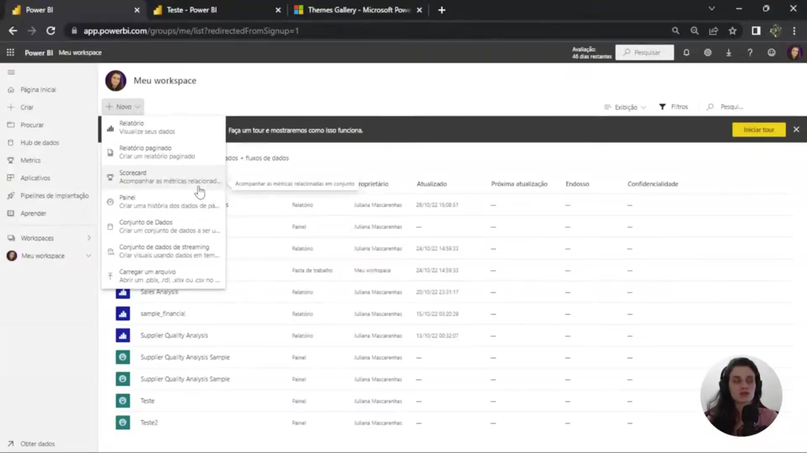
</p>

Nesta tela inicial do Power BI Service (ambiente online), visualizamos o "Meu Workspace", que funciona como a área de trabalho pessoal do usuário. Na parte central, há um menu de acesso rápido para a criação de novos conteúdos, permitindo iniciar um **Relatório**, um **Relatório paginado** ou um **Scorecard** para acompanhamento de métricas. Abaixo, é apresentada uma lista dos itens trabalhados recentemente, facilitando a navegação entre os diferentes painéis, relatórios e conjuntos de dados já existentes.

<p align="center">
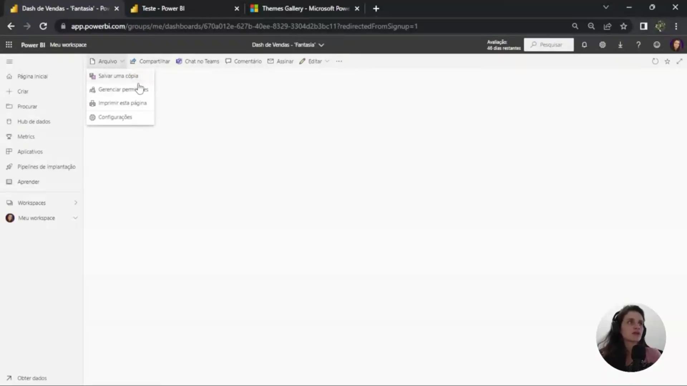
</p>

Ao acessar um painel (dashboard) existente, como o "Dash de Vendas - Fantasia", a barra de ferramentas superior oferece opções de gerenciamento. Ao clicar no menu **Arquivo**, o usuário tem acesso a funções administrativas e de organização, como **Salvar uma cópia** do painel, gerenciar permissões de acesso, imprimir a página ou acessar as configurações específicas desse dashboard.

<p align="center">
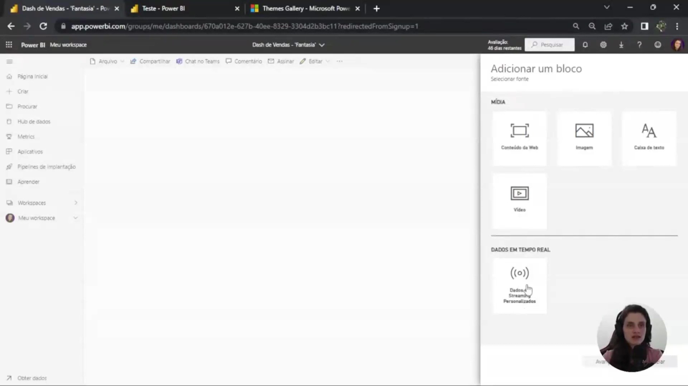
</p>

A imagem demonstra o processo de personalização de um dashboard através da opção **Editar** > **Adicionar um bloco**. Este menu lateral permite inserir elementos que não vêm diretamente de relatórios, divididos em:

* **Mídia**: Inserção de conteúdo externo (Web), Imagens, Caixas de texto ou Vídeos.
* **Dados em tempo real**: Adição de blocos de Streaming personalizados, permitindo que o painel exiba informações atualizadas instantaneamente.

<p align="center">
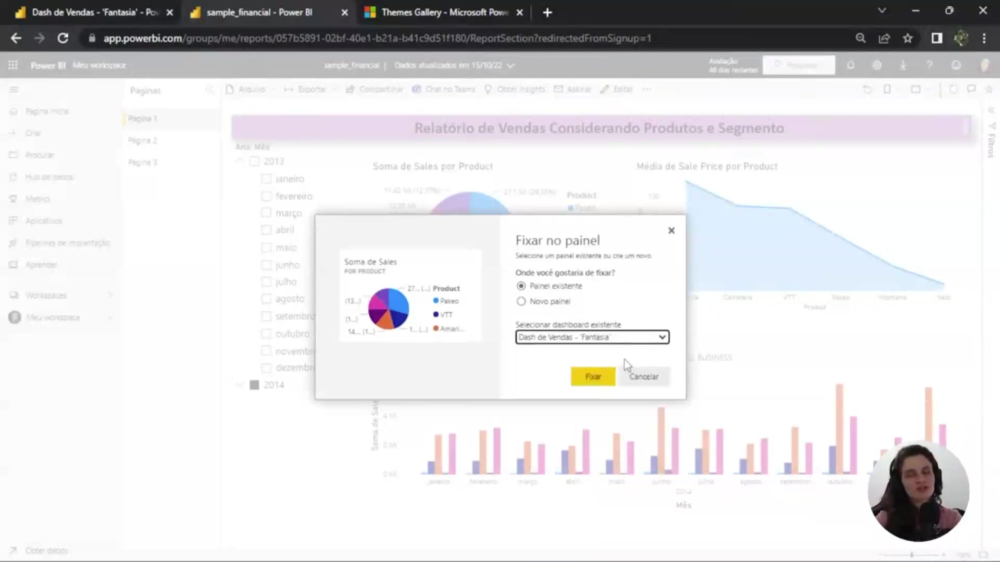
</p>

Nesta etapa, visualizamos um relatório aberto ("sample financial") onde o usuário utiliza o ícone de **fixar** (representado por um percevejo) em um visual específico. Ao acionar essa função, abre-se a janela "Fixar no painel", permitindo que o gráfico seja enviado para um **Dashboard existente** (neste caso, selecionando o "Dash de Vendas - Fantasia") ou para um novo painel. Essa é a forma padrão de construir dashboards, consolidando visuais importantes de diferentes relatórios em uma única tela.

<p align="center">
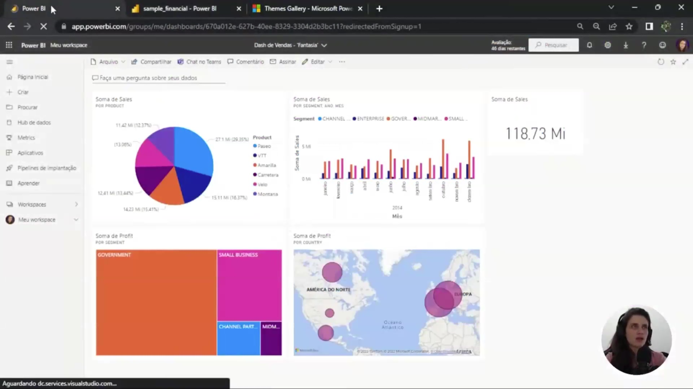
</p>

Após a fixação dos elementos, vemos o dashboard resultante com diversos blocos organizados. O painel agora consolida indicadores de diferentes naturezas, como o total de vendas (**Soma de Sales**), distribuição por produto, lucro por segmento (**Soma de Profit**) e uma análise geográfica por país. Esta visualização é otimizada para consumo rápido de informações estratégicas.

<p align="center">
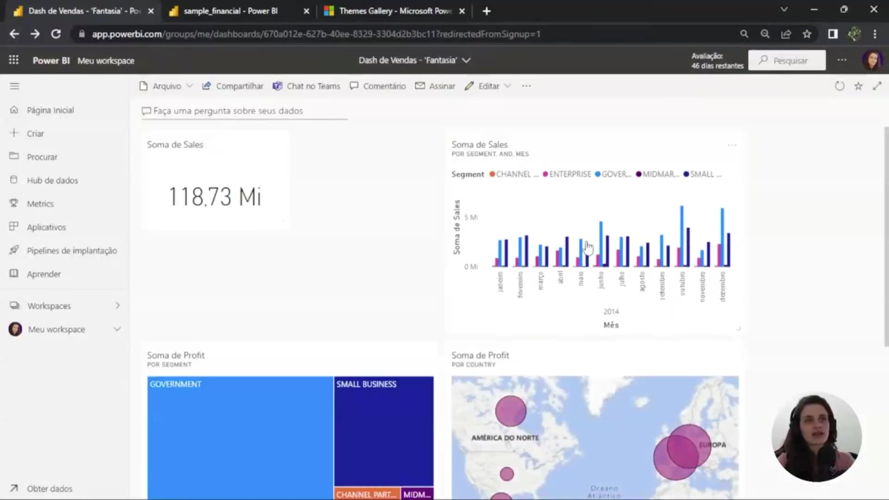
</p>

A imagem destaca a interatividade nativa dos blocos no dashboard. Ao passar o mouse sobre os pontos de dados no gráfico de área ("Soma de Sales por Segmento e Mês"), o sistema exibe um *tooltip* com informações detalhadas, como o valor exato da soma de vendas para um determinado segmento e mês específico (ex: Julho de 2014), demonstrando como o painel permite explorar os dados sem sair da visão consolidada.

<p align="center">
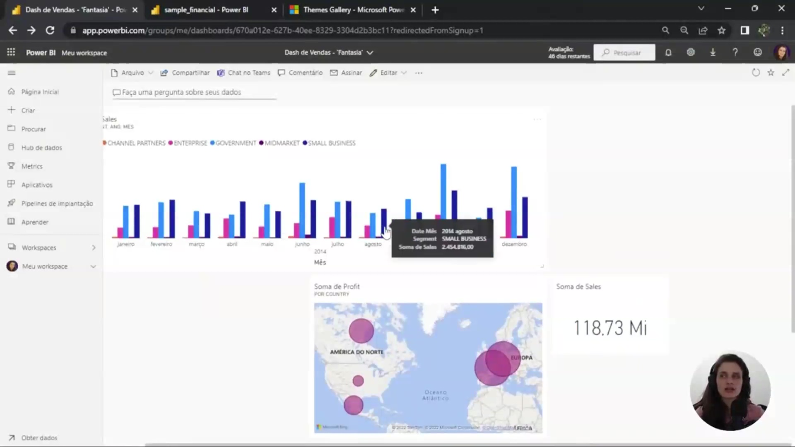
</p>

A interface mostra a capacidade de filtragem e detalhamento. Ao interagir com o gráfico de "Soma de Sales", é possível observar o destaque para o segmento **SMALL BUSINESS** no mês de agosto de 2014, onde o valor da soma de vendas atingiu **2.454.816,00**. Isso evidencia como o dashboard responde às seleções do usuário para isolar métricas de interesse.

<p align="center">
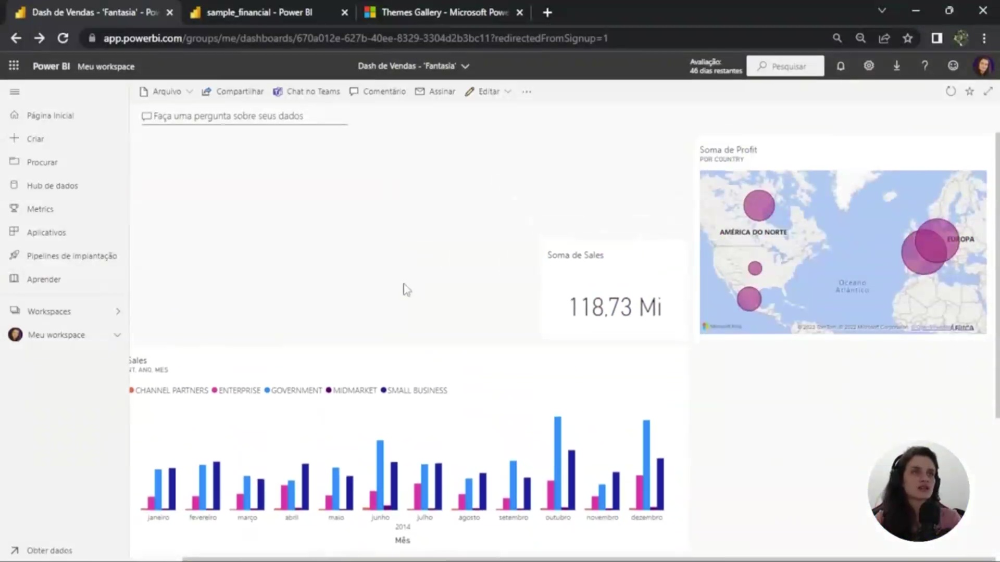
</p>

Finalmente, visualizamos o dashboard em seu estado atualizado após as edições. O layout exibe de forma clara o KPI principal de **Soma de Sales** no valor de **118,73 Mi**, juntamente com gráficos de barras e áreas que distribuem o lucro e as vendas ao longo do tempo (meses de janeiro a dezembro) e entre as regiões geográficas (América do Norte e Europa).      


### 🟩 Vídeo 03 - Modificando Tema do Dashboard no Power BI Service

<video width="60%" controls>
  <source src="000-Midia_e_Anexos/bootcamp_ntt_data-modulo.06-curso.03-video_03.webm" type="video/webm">
    Seu navegador não suporta vídeo HTML5.
</video>

link do vídeo: https://web.dio.me/track/engenharia-dados-python/course/criando-dashboard-interativos-com-power-bi/learning/577e5a3e-5bd7-4268-a6e0-59590840acac?autoplay=1

Este guia explora as diversas maneiras de modificar a estética e a funcionalidade visual de um dashboard no Power BI, desde ajustes simples de cores até a importação de temas complexos via arquivos JSON e o uso de recursos da comunidade.

### Anotações

<p align="center">
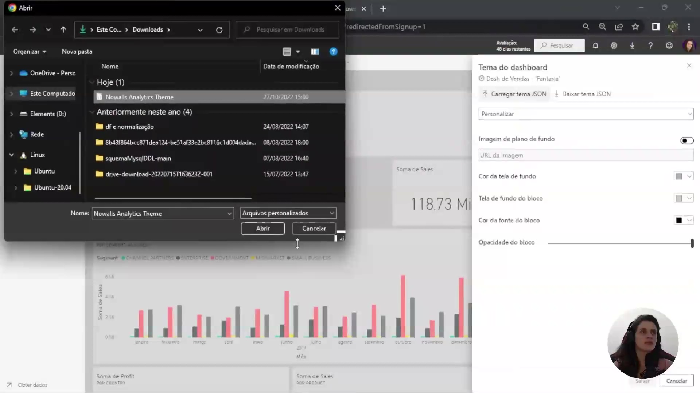
</p>

O processo de customização avançada do dashboard é iniciado através da opção de carregar um arquivo de tema em formato JSON. Ao selecionar "Carregar tema JSON", o sistema permite navegar pelos arquivos locais para aplicar configurações visuais pré-definidas, como o arquivo selecionado "Nowalls Analytics Theme". Esta funcionalidade possibilita a importação de paletas de cores e estilos complexos que não estão disponíveis nativamente na interface básica.

<p align="center">
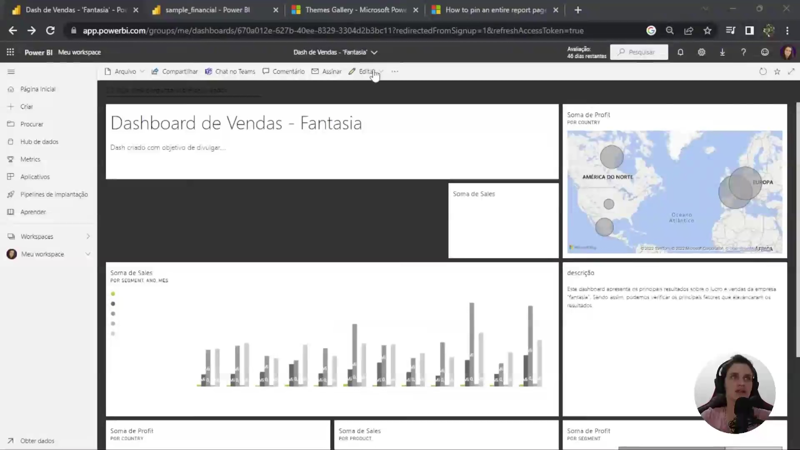
</p>

A interface de edição permite alternar rapidamente entre os modos de exibição "Claro" e "Escuro". A escolha pelo tema escuro é frequentemente preferida por profissionais devido ao menor esforço visual proporcionado pelo contraste suave. Ao aplicar e salvar esta configuração, o fundo do dashboard é alterado enquanto os elementos visuais mantêm as cores específicas definidas para os dados.

<p align="center">
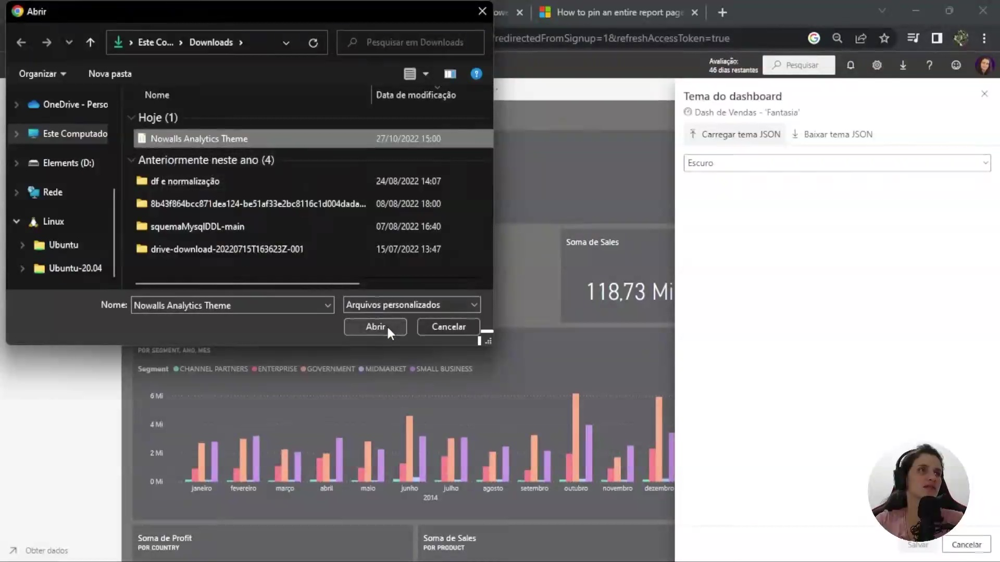
</p>

É possível encontrar resistência na aplicação do tema se houver personalizações manuais anteriores que influenciem o resultado final. Para que o arquivo JSON externo reflita exatamente o design planejado, recomenda-se limpar personalizações prévias ou garantir que o modo base (claro ou escuro) esteja alinhado com o esperado pelo arquivo de estilo.

<p align="center">
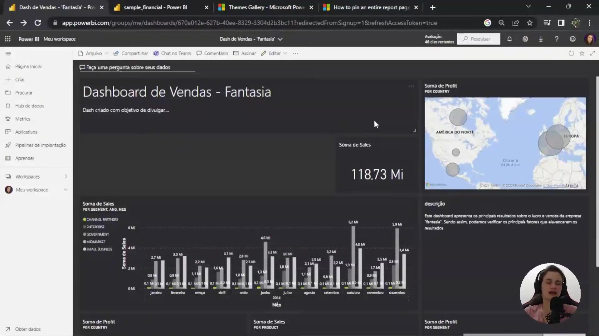
</p>

Após a importação bem-sucedida, o dashboard assume uma estética profissional com fundo totalmente preto e elementos em alto contraste. Os gráficos, como o treemap de vendas, passam a utilizar a paleta de cores importada, destacando automaticamente os dados conforme as regras contidas no arquivo JSON.

<p align="center">
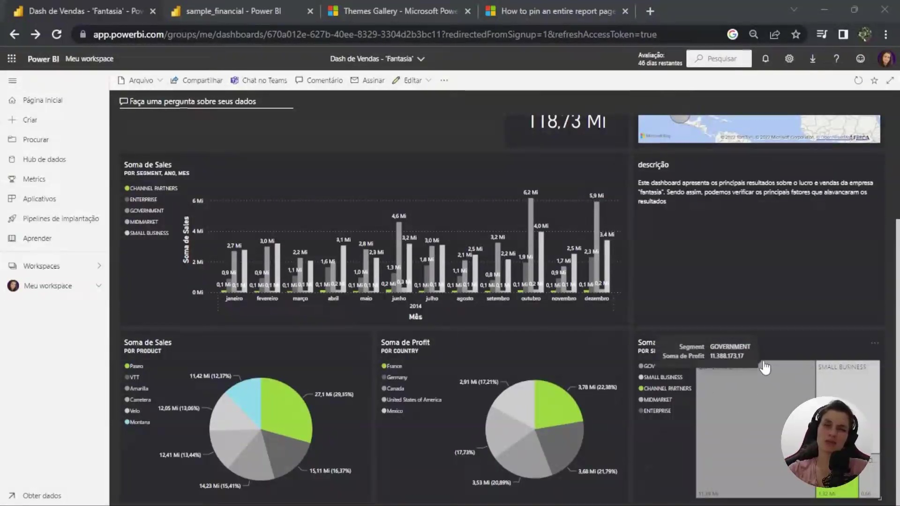
</p>

Embora temas personalizados tragam sofisticação visual, é necessário validar se a ênfase dada às cores faz sentido analítico. Por vezes, o tema pode destacar itens de menor valor, como o segmento "Channel Partners" no treemap, o que pode confundir a interpretação imediata dos resultados se o objetivo for priorizar os maiores volumes.

<p align="center">
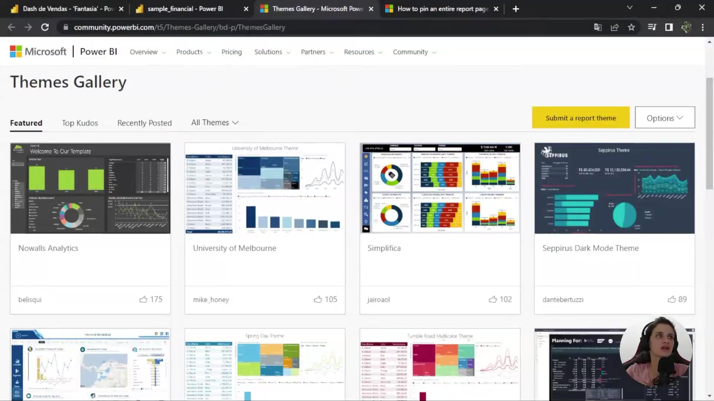
</p>

Para obter novos estilos, os usuários podem acessar a galeria de temas oficial da comunidade Power BI. Esse espaço funciona como um repositório onde criadores compartilham diversos temas, permitindo que outros usuários visualizem e baixem gratuitamente designs diferenciados para seus próprios dashboards.

<p align="center">
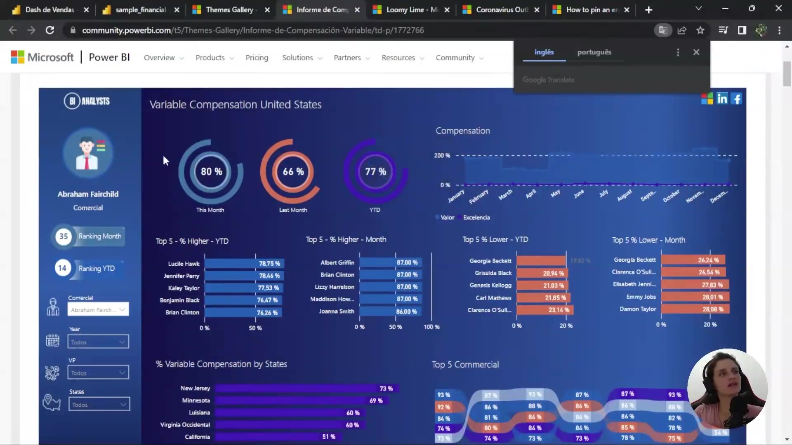
</p>

A galeria oferece visualizações interativas que mostram como o tema se aplica a diferentes tipos de gráficos, botões e menus. Alguns temas avançados incluem até texturas de fundo e estilizações de bordas arredondadas, o que ajuda a transformar um relatório técnico em uma ferramenta de visualização mais engajadora e intuitiva.

<p align="center">
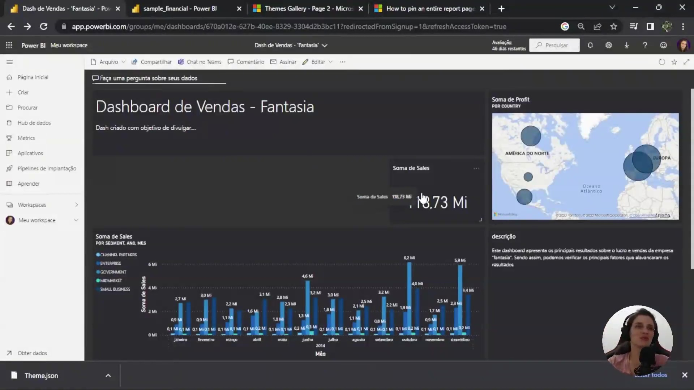
</p>

O download de um tema é realizado diretamente na página da galeria ao localizar o ícone ou link para o arquivo JSON. É recomendável manter uma padronização entre diferentes relatórios que tratam do mesmo contexto de negócio, garantindo que o usuário tenha uma experiência visual coerente ao navegar entre eles.

<p align="center">
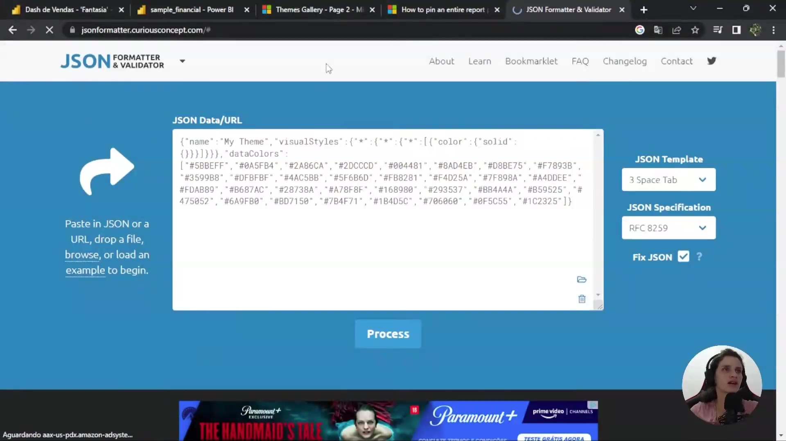
</p>

Ao abrir o arquivo JSON em um editor de texto convencional, observa-se que o conteúdo está em uma linha contínua, o que dificulta a leitura e edição manual dos parâmetros. Esse arquivo contém todas as definições técnicas de cores e estilos que o motor de renderização do Power BI interpreta para construir a interface visual.

<p align="center">
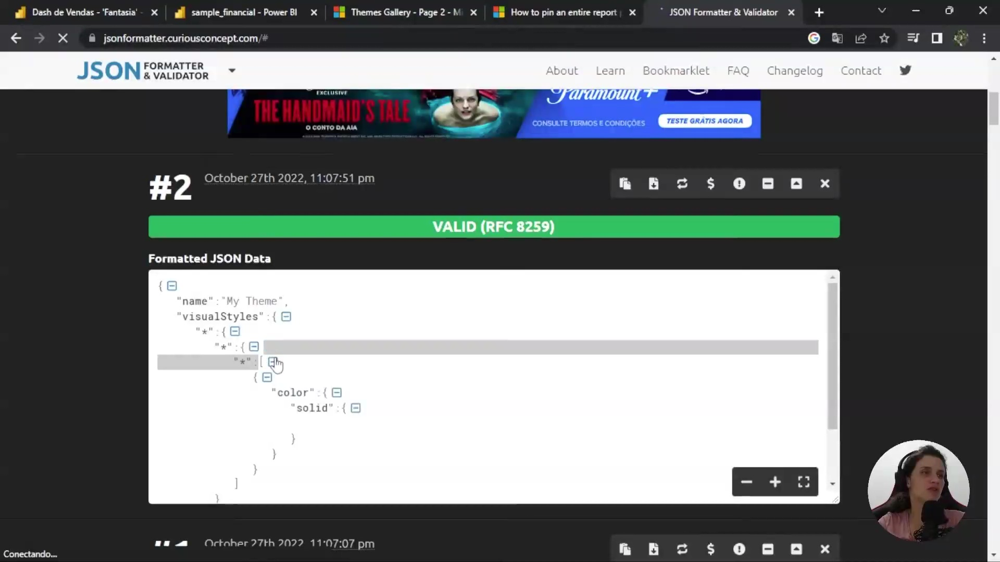
</p>

Para facilitar a compreensão do código, pode-se utilizar ferramentas online de formatação e validação de JSON. Ao processar o texto bruto nessas ferramentas, o código é organizado em uma estrutura hierárquica legível, permitindo identificar as seções responsáveis por cores de dados e estilos de visuais específicos.

<p align="center">
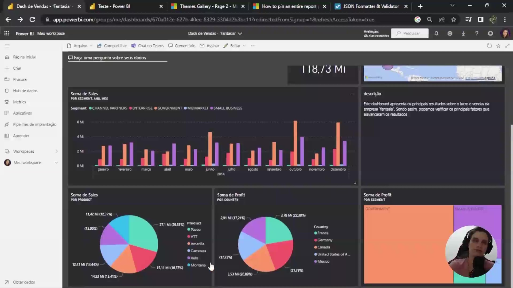
</p>

A estrutura formatada do arquivo revela as chaves principais utilizadas pelo Power BI, como `visualStyles` para comportamentos globais e `dataColors` para a sequência de cores aplicadas às séries de dados. A lista de códigos hexadecimais em `dataColors` define exatamente quais tons serão usados em cada gráfico do dashboard.

Arquivo JSON com a formatação de estilo do painel apresentado acima:

```json
{
  "name": "My Theme",
  "visualStyles": {
    "*": {
      "*": {
        "color": {
          "solid": {
          }
        }
      }
    }
  },
  "dataColors": [
    "#5BBEFF",
    "#0A5FB4",
    "#2AB6CA",
    "#2DCCCD",
    "#004481",
    "#8AD4EB",
    "#D8BE75",
    "#F7893B",
    "#359988",
    "#DFBFBF",
    "#4AC5BB",
    "#5F6B6D",
    "#FB8281",
    "#F4D25A",
    "#7F898A",
    "#A4DDEE",
    "#FDA889",
    "#8687AC",
    "#28738A",
    "#A78F8F",
    "#168980",
    "#293537",
    "#BB4A4A",
    "#859525",
    "#475052",
    "#6A9FB0",
    "#BD7150",
    "#7B4F71",
    "#184050",
    "#706060",
    "#0F5C55",
    "#1C2325"
  ]
}

```      


### 🟩 Vídeo 04 - Criando Blocos com P e R no Power BI

<video width="60%" controls>
  <source src="000-Midia_e_Anexos/bootcamp_ntt_data-modulo.06-curso.03-video_04.webm" type="video/webm">
    Seu navegador não suporta vídeo HTML5.
</video>

link do vídeo: https://web.dio.me/track/engenharia-dados-python/course/criando-dashboard-interativos-com-power-bi/learning/1be94240-82bb-401d-9c03-288aae9bfe7a?autoplay=1

Este vídeo tutorial foca na utilização da funcionalidade de P&R (Perguntas e Respostas) do Power BI para criar dashboards dinâmicos e personalizados. O objetivo central é mostrar como a Inteligência Artificial e o Processamento de Linguagem Natural podem facilitar a vida do analista de dados e do usuário final, permitindo consultas rápidas sem a necessidade de criar novos relatórios manualmente.

### Anotações

<p align="center">
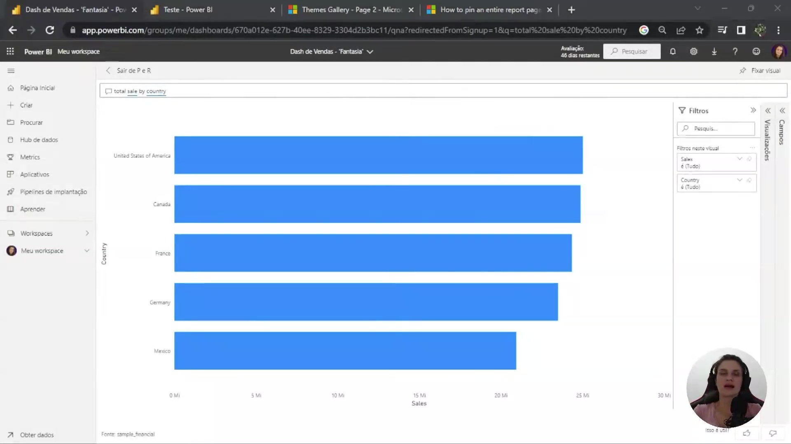
</p>

O Power BI oferece o recurso de **P&R (Perguntas e Respostas)**, que utiliza Inteligência Artificial para permitir que o usuário interaja com os dados através de linguagem natural. Ao digitar uma consulta como `total sale by country`, a ferramenta interpreta o processamento de linguagem natural e gera automaticamente um visual correspondente, como um gráfico de barras horizontais mostrando as vendas por nação (Estados Unidos, Canadá, França, Alemanha e México), facilitando a obtenção de insights rápidos sem a necessidade de configurar manualmente cada gráfico.

<p align="center">
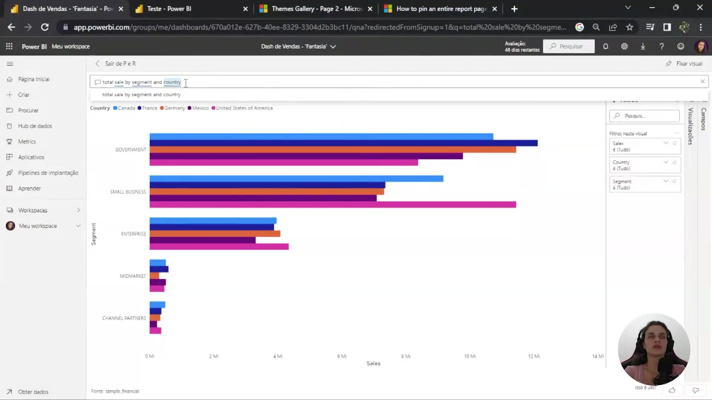
</p>

A flexibilidade do recurso de P&R permite refinar as perguntas para obter visões mais detalhadas. No exemplo, ao utilizar a sentença `total sale by segment and country`, a IA do Power BI renderiza um gráfico de barras agrupadas. Esse visual segmenta as vendas por categoria (Government, Small Business, Enterprise, Midmarket e Channel Partners) e as correlaciona com os países, permitindo que diferentes perfis de usuários, como equipes de marketing ou vendas, encontrem preferências e insights específicos de forma dinâmica.

<p align="center">
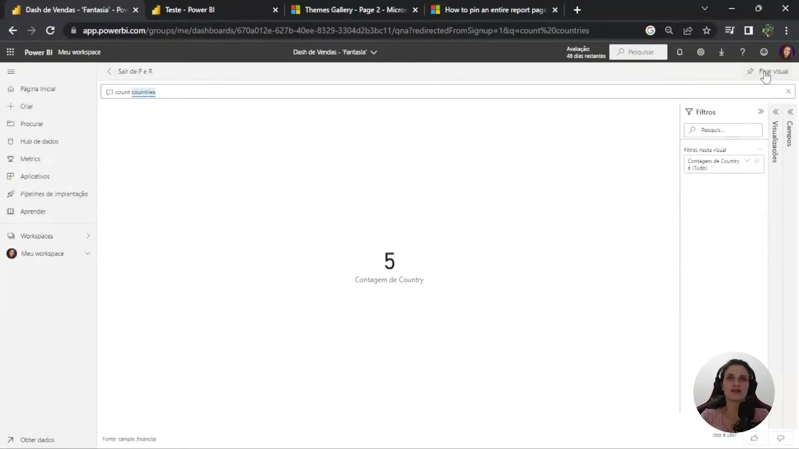
</p>

Além de gráficos complexos, a IA pode responder perguntas diretas de contagem e métricas simples. Ao pesquisar por `count countries`, o sistema identifica a necessidade de uma contagem distinta e exibe um cartão com o resultado (neste caso, o valor 5). Esses visuais gerados por pergunta podem ser fixados diretamente no dashboard principal através da opção **Fixar visual**, otimizando o tempo do analista e permitindo que o usuário final responda suas próprias dúvidas sem a necessidade de abertura de chamados ou e-mails.

<p align="center">
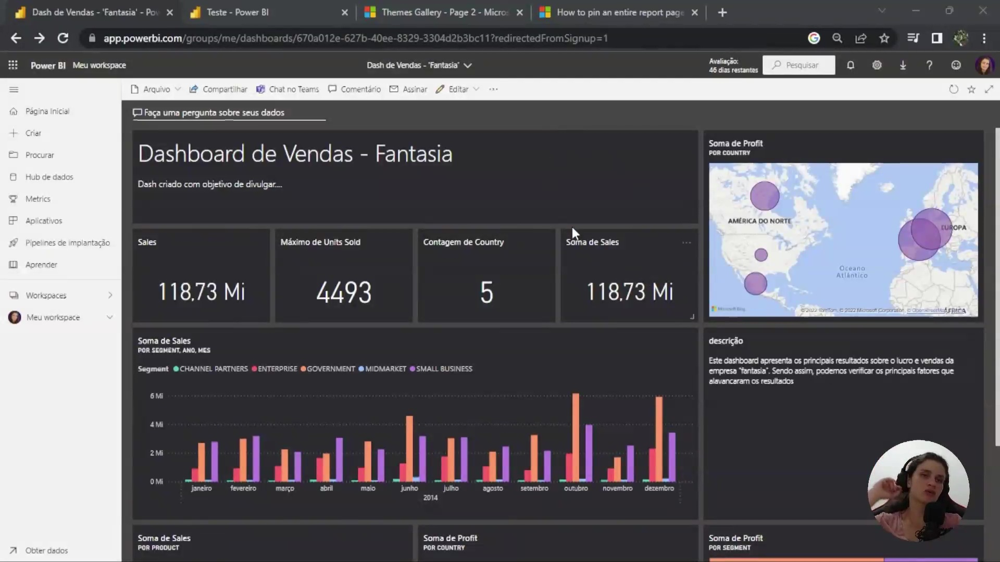
</p>

O dashboard finalizado consolida os visuais fixados a partir das perguntas e respostas, apresentando métricas críticas como a **Soma de Sales** (118.73 Mi), o lucro por país em um mapa mundi e o desempenho temporal das vendas. A interface exibe a distribuição por segmento e mês no ano de 2014, além de indicadores específicos como o **Máximo de Units Sold** (4493). Este modelo de entrega facilita a absorção de informações, pois foca na estética e na clareza visual, herdando as configurações definidas previamente no Power BI Desktop.      


### 🟩 Vídeo 05 - Criando Alertas em Dashboards do Power BI

<video width="60%" controls>
  <source src="000-Midia_e_Anexos/bootcamp_ntt_data-modulo.06-curso.03-video_05.webm" type="video/webm">
    Seu navegador não suporta vídeo HTML5.
</video>

link do vídeo: https://web.dio.me/track/engenharia-dados-python/course/criando-dashboard-interativos-com-power-bi/learning/0c108e21-9db6-4427-8fc2-3640873b2c55?autoplay=1

Este vídeo explora o recurso de Alertas no Power BI, uma funcionalidade essencial para transformar dashboards estáticos em ferramentas de monitoramento proativo. O instrutor detalha desde as permissões necessárias até a configuração prática de regras de notificação baseadas em metas e KPIs.

### Anotações

<p align="center">
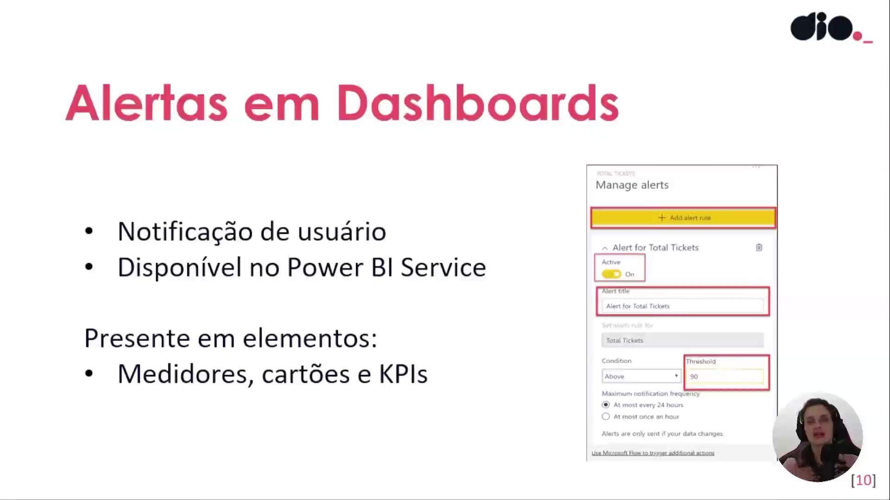
</p>

O recurso de alertas em dashboards do Power BI Service funciona como uma notificação de usuário configurável para monitorar mudanças nos dados. Essa funcionalidade é restrita a elementos visuais específicos, sendo aplicada em **medidores (gauges), cartões e KPIs**. Ao configurar uma regra de alerta, define-se um título, a condição (como "Acima" ou "Abaixo") e um valor de **limiar (Threshold)**. Além disso, é possível determinar a frequência máxima de notificação, permitindo que o usuário seja avisado a cada 24 horas ou uma vez por hora, dependendo da criticidade do indicador monitorado.

<p align="center">
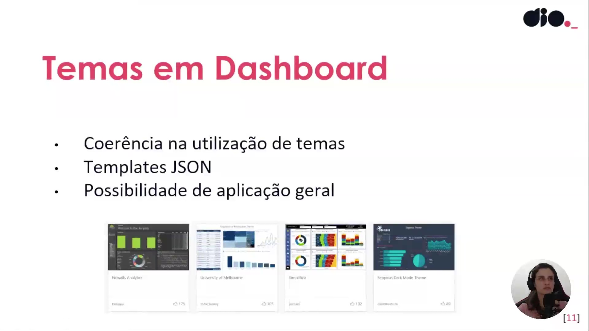
</p>

A utilização de temas em dashboards é fundamental para garantir a coerência visual e a padronização estética dos relatórios. O Power BI permite a aplicação geral de estilos, muitas vezes gerenciados através de **templates JSON**, que definem paletas de cores e formatos para todos os elementos visuais de uma só vez. Exemplos de galerias de temas mostram como a mesma base de dados pode ser apresentada com diferentes identidades visuais, como o "Dark Mode" ou temas institucionais específicos, facilitando a leitura e o alinhamento com a marca da organização.

<p align="center">
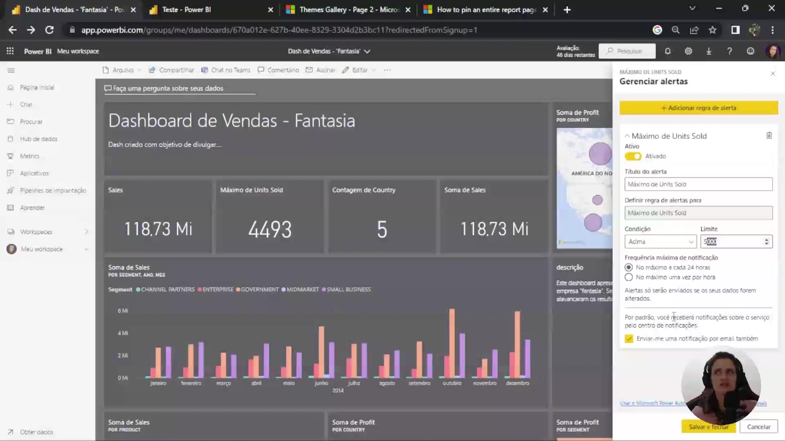
</p>

Na prática, a gestão de alertas pode ser feita diretamente no dashboard através do menu de reticências de um cartão ou KPI. No exemplo do dashboard "Vendas Fantasia", ao selecionar a opção **Gerenciar alertas** no cartão de "Máximo de Units Sold", o painel lateral permite ativar a regra e definir um limite específico — como, por exemplo, ser notificado quando as vendas ultrapassarem 5.000 unidades. Além das notificações nativas do serviço, o sistema oferece a opção de enviar um e-mail automático ao usuário sempre que a condição estabelecida for atingida e os dados forem alterados.


### 🟩 Vídeo 06 - Explorando Submenus dos Blocos contidos no Dashboard

<video width="60%" controls>
  <source src="000-Midia_e_Anexos/bootcamp_ntt_data-modulo.06-curso.03-video_06.webm" type="video/webm">
    Seu navegador não suporta vídeo HTML5.
</video>

link do vídeo: https://web.dio.me/track/engenharia-dados-python/course/criando-dashboard-interativos-com-power-bi/learning/206d6892-57cf-43ca-91da-99faf36d7853?autoplay=1

Este guia explora como as funcionalidades nativas do Power BI Service transformam dashboards estáticos em ferramentas de colaboração dinâmica, permitindo que equipes discutam dados em tempo real e tomem decisões baseadas em contextos específicos.

### Anotações

<p align="center">
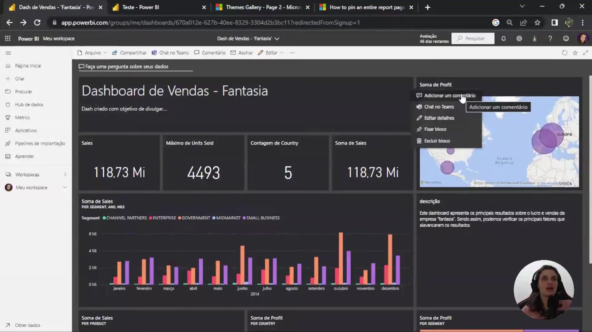
</p>

Nesta etapa, são exploradas as opções de interatividade disponíveis ao selecionar o menu de opções (os três pontinhos) em um visual do dashboard. A plataforma permite que o usuário realize diversas ações colaborativas, como adicionar comentários, iniciar chats no Teams ou editar detalhes do bloco. Essa interatividade é fundamental para que o dashboard funcione como uma ferramenta de comunicação entre os membros da empresa.

<p align="center">
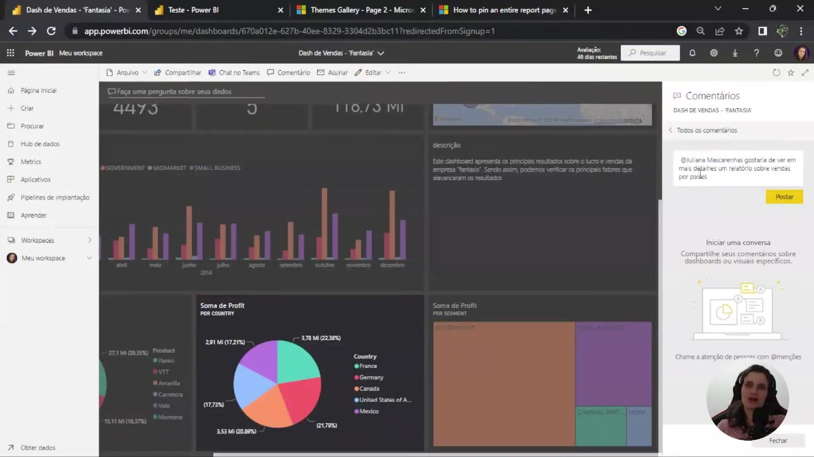
</p>

Ao utilizar a ferramenta de comentários, é possível fazer menções específicas para chamar a atenção de outros colaboradores. No exemplo visual, é solicitada uma análise mais detalhada sobre o relatório de vendas por países. Essa funcionalidade permite que a comunicação fique registrada lateralmente, mantendo o contexto dos dados analisados e permitindo o acompanhamento de pendências ou sugestões diretamente na interface do dashboard.

<p align="center">
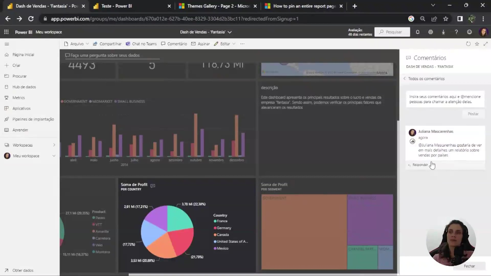
</p>

A conclusão do processo de comentário mostra a postagem finalizada no painel lateral. Um ponto importante da interatividade é que o Power BI consegue vincular o comentário a uma visão ou visual específico que estava selecionado no momento da criação. Assim, ao clicar na interação, o sistema identifica de onde veio a observação, facilitando a colaboração remota e garantindo que todos os envolvidos compreendam exatamente qual métrica está sendo discutida.


### 🟩 Vídeo 07 - Recursos Disponíveis no Free e no Power BI Pro e Configurações

<video width="60%" controls>
  <source src="000-Midia_e_Anexos/bootcamp_ntt_data-modulo.06-curso.03-video_07.webm" type="video/webm">
    Seu navegador não suporta vídeo HTML5.
</video>

link do vídeo: https://web.dio.me/track/engenharia-dados-python/course/criando-dashboard-interativos-com-power-bi/learning/017d19cf-4b7d-41aa-9b5f-8586d855085b?autoplay=1

Este resumo explora as funcionalidades avançadas do Power BI Service, desde a gestão de armazenamento e custos até a integração com serviços externos como o GitHub e configurações de governança de dados.

### Anotações

<p align="center">
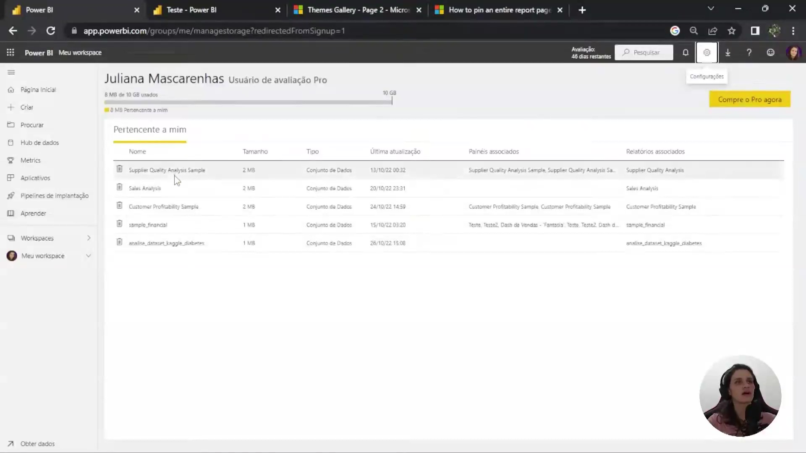
</p>

A interface inicial do **Meu workspace** no Power BI Service apresenta uma visão consolidada dos ativos de dados disponíveis. Na lista, é possível visualizar o nome, tamanho, tipo e a data da última atualização de diversos elementos, como os conjuntos de dados "Supplier Quality Analysis Sample", "SaleAnalyst" e "Customer Profitability Sample". Esta tela serve como o hub principal para a gestão de conteúdos pessoais antes da organização em áreas de trabalho compartilhadas.

<p align="center">

</p>

A imagem detalha as diferenças entre as versões do Power BI, destacando os benefícios da licença **Power BI Pro**. Diferente da versão gratuita, a licença Pro permite a criação de workspaces colaborativos, o compartilhamento de dashboards e relatórios com outros usuários Pro, além da integração total com o Microsoft Teams e funcionalidades avançadas de análise inteligente.

<p align="center">
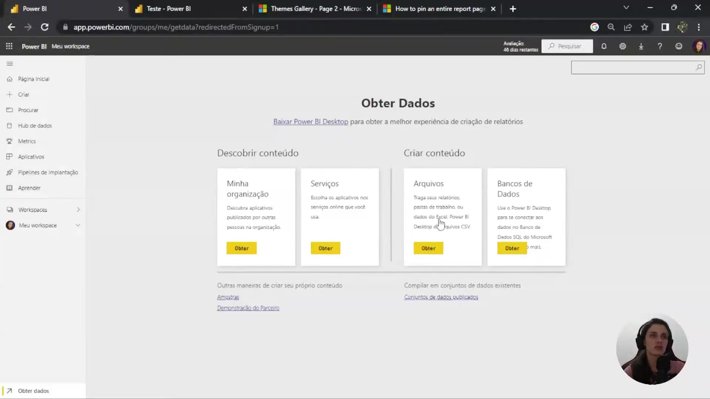
</p>

A seção **Obter Dados** no Power BI Service oferece diferentes caminhos para a ingestão de conteúdo. O usuário pode descobrir aplicativos publicados pela organização, conectar-se a serviços online (SaaS), importar arquivos locais (como Excel, CSV ou arquivos do Power BI Desktop) ou conectar-se diretamente a bancos de dados como o Azure SQL. Há também uma seção dedicada a "Amostras" (Samples) para exploração rápida das funcionalidades da plataforma.

<p align="center">
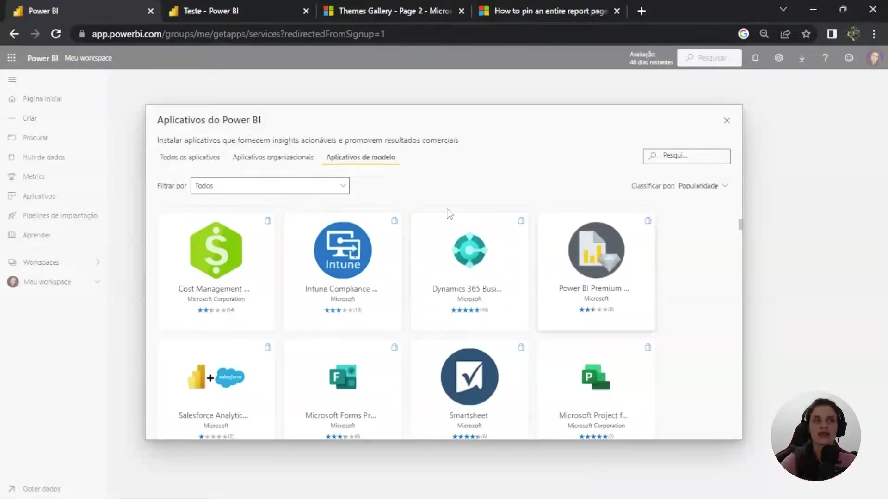
</p>

O marketplace de **Aplicativos do Power BI** permite a instalação de pacotes de conteúdo pré-configurados que fornecem insights imediatos. A imagem exibe diversas opções de modelos prontos desenvolvidos pela Microsoft e parceiros, como o "Cost Management", "Salesforce Analytics", "Intune Compliance" e conectores para "Google Analytics" e "GitHub", facilitando a criação de dashboards complexos sem a necessidade de começar do zero.

<p align="center">
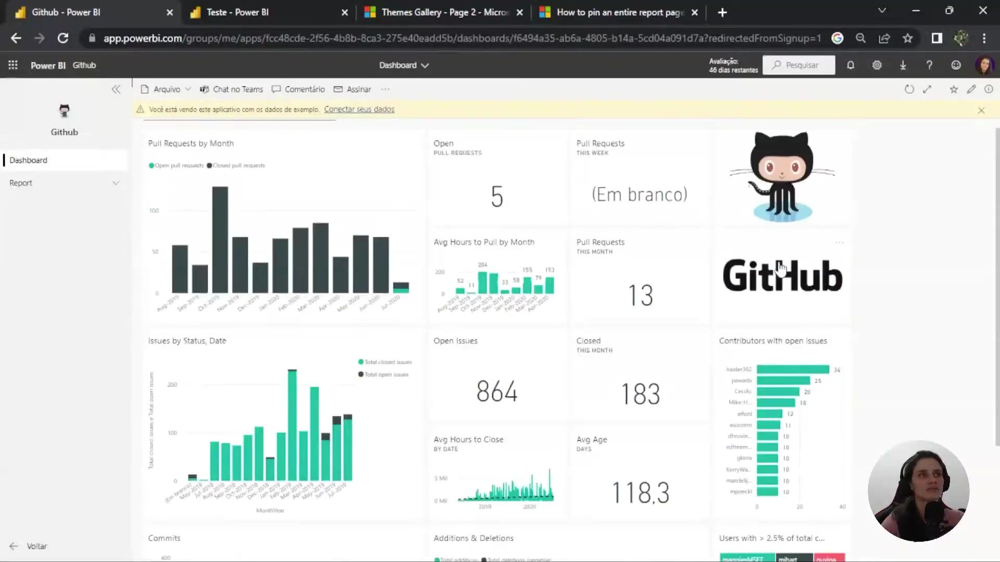
</p>

Exemplo de um **Dashboard** gerado a partir do aplicativo do GitHub. Esta visualização de alto nível consolida métricas críticas em "tiles" (blocos), como o número de Pull Requests da semana, o tempo médio para realizar um pull e a quantidade de problemas (Issues) abertos. Diferente de um relatório, o dashboard foca em indicadores-chave de performance (KPIs) de forma resumida para tomada de decisão rápida.

<p align="center">
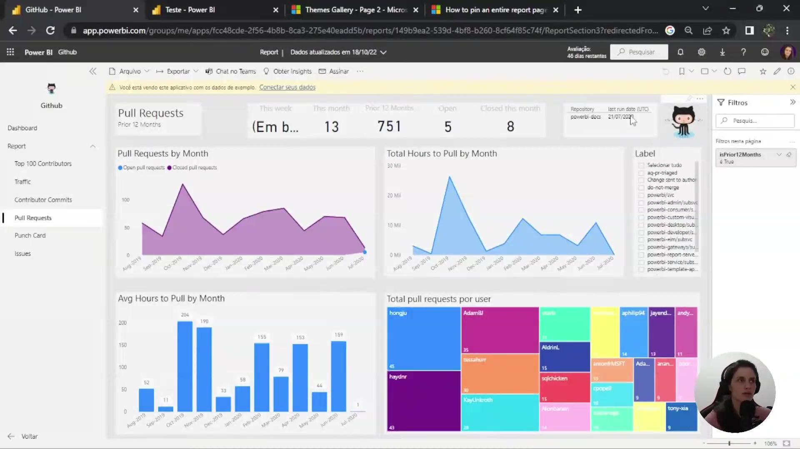
</p>

A imagem demonstra a interface de um **Relatório (Report)** detalhado do GitHub dentro do Power BI. Ao contrário do dashboard, o relatório possui múltiplas páginas (Pull Requests, Traffic, Issues, etc.) e permite interações profundas, como a aplicação de filtros laterais por repositório ou data, além de possibilitar a exportação de dados e a análise detalhada de tendências mensais através de gráficos de linhas e colunas.

<p align="center">
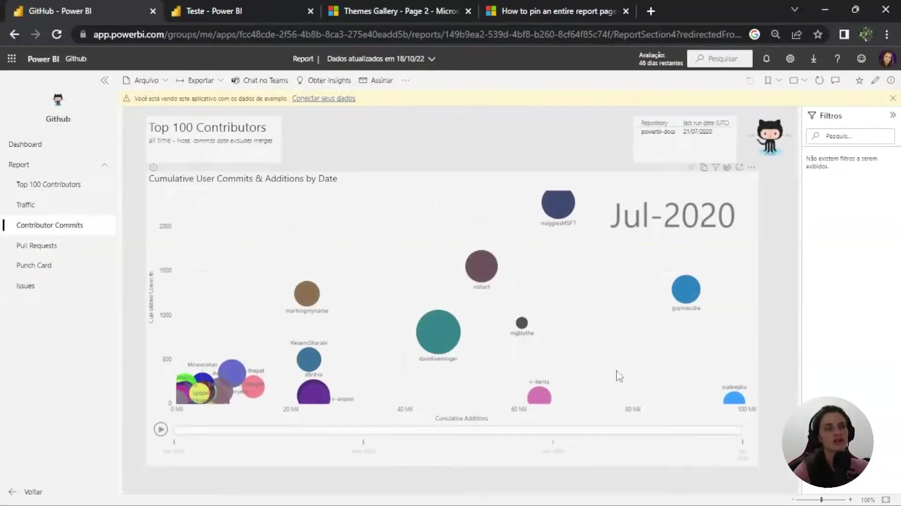
</p>

Nesta página do relatório, o foco é a análise de **Contribuidores (Top 100 Contributors)**. O visual apresenta um gráfico de dispersão ou bolhas que correlaciona o volume de commits ao longo do tempo por usuário, permitindo identificar quem são os membros mais ativos do projeto e como a colaboração evoluiu historicamente.

<p align="center">
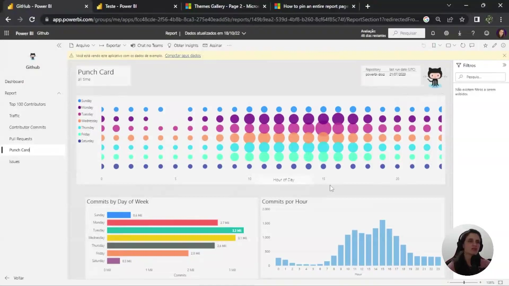
</p>

A visualização de **Punch Card** apresentada é utilizada para identificar padrões temporais de atividade. Ela cruza os dias da semana com as horas do dia, mostrando através do tamanho dos círculos os períodos de maior volume de commits. Complementarmente, um gráfico de barras exibe o total de commits por hora, revelando os horários de pico de produtividade da equipe de desenvolvimento.

<p align="center">

</p>

A **Página Inicial** do Power BI Service foi redesenhada para facilitar o acesso rápido. Ela exibe uma seção de itens recomendados e uma lista de "Recentes" e "Favoritos". No detalhe da lista inferior, vemos o histórico de acesso a diferentes tipos de artefatos: o aplicativo "Github", o painel "Dash de Vendas Fantasia" e o relatório "sample financial", organizados por tempo desde a última abertura e localização.

<p align="center">
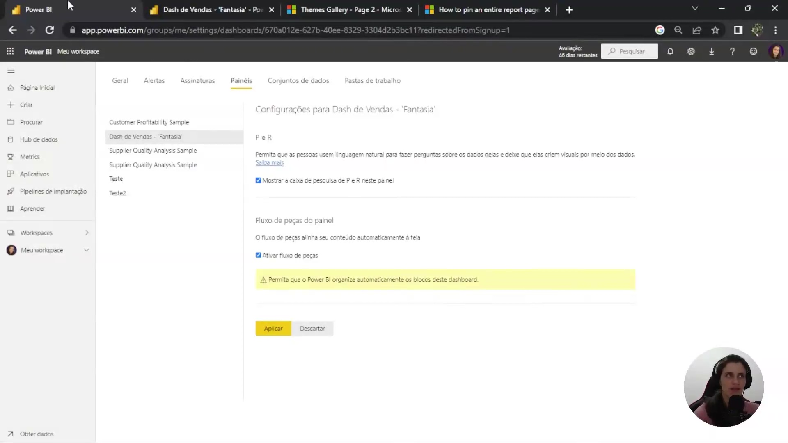
</p>

A tela de **Configurações do Painel** permite gerenciar funcionalidades interativas. O destaque aqui é o recurso de "P&R" (Perguntas e Respostas), que possibilita aos usuários finais utilizarem linguagem natural para interrogar os dados e gerar novos visuais instantaneamente. Além disso, é possível configurar alertas, assinaturas de e-mail e o fluxo de peças para organização automática dos blocos no dashboard.      


### 🟩 Vídeo 08 - O que são Live Pages? Quando utilizar um Dashboard?

<video width="60%" controls>
  <source src="000-Midia_e_Anexos/bootcamp_ntt_data-modulo.06-curso.03-video_08.webm" type="video/webm">
    Seu navegador não suporta vídeo HTML5.
</video>

link do vídeo: https://web.dio.me/track/engenharia-dados-python/course/criando-dashboard-interativos-com-power-bi/learning/f7a3a255-3779-4f3e-b461-b7674abca853?autoplay=1

Este guia resume as principais funcionalidades do Power BI Service discutidas no vídeo, focando na distinção estratégica entre dashboards e relatórios, além de recursos avançados de visualização e interatividade.

### Anotações

      


### 🟩 Vídeo 09 - Editando Layout Mobile para Acesso ao Dashboard via Celular

<video width="60%" controls>
  <source src="000-Midia_e_Anexos/bootcamp_ntt_data-modulo.06-curso.03-video_09.webm" type="video/webm">
    Seu navegador não suporta vídeo HTML5.
</video>

link do vídeo: https://web.dio.me/track/engenharia-dados-python/course/criando-dashboard-interativos-com-power-bi/learning/255c7785-1e5e-4b90-aacd-1d5da0f5632a?autoplay=1

### 🟩 Vídeo 10 - Streaming no Power BI

<video width="60%" controls>
  <source src="000-Midia_e_Anexos/bootcamp_ntt_data-modulo.06-curso.03-video_10.webm" type="video/webm">
    Seu navegador não suporta vídeo HTML5.
</video>

link do vídeo:


##  Materiais de Apoio

# Certificado: 

- Link na plataforma: 
- Certificado em pdf: