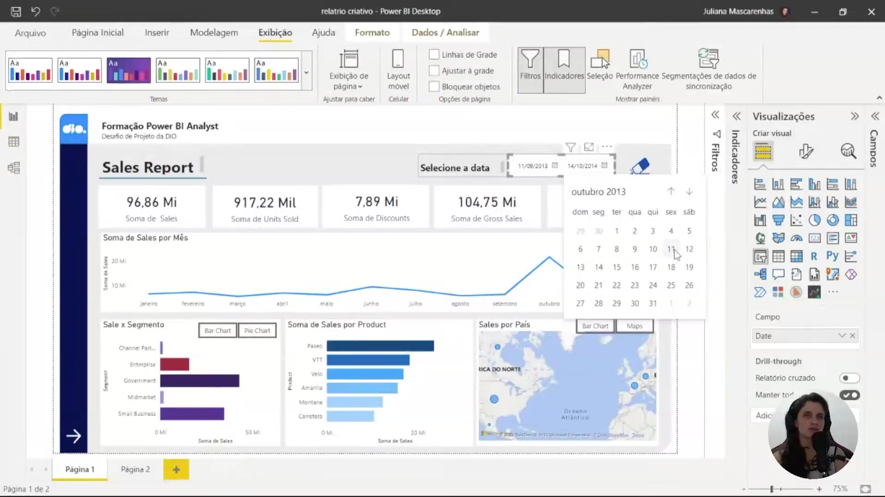
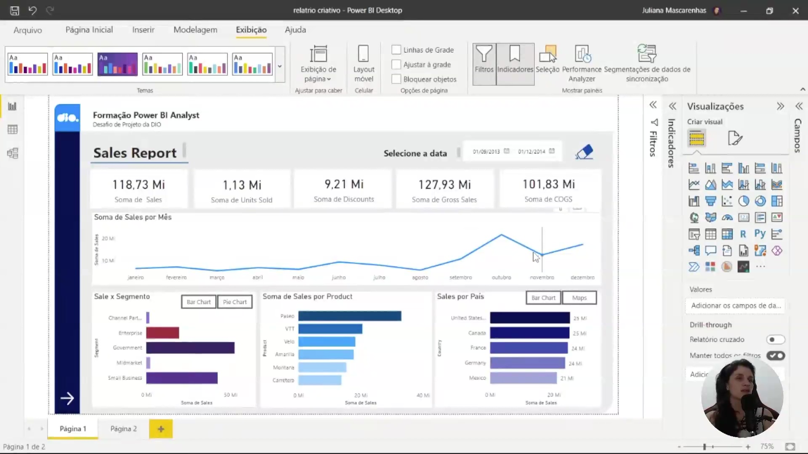
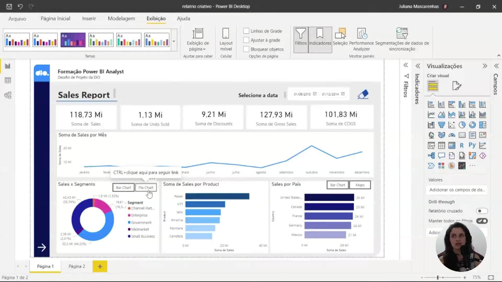
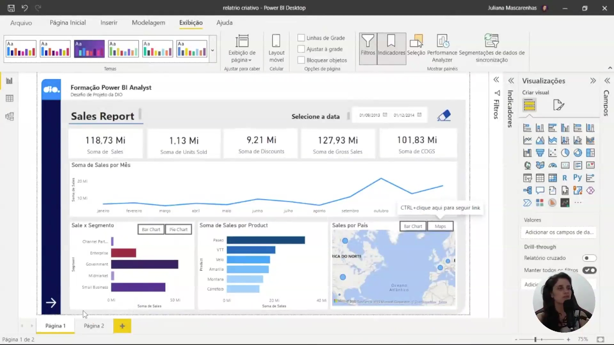
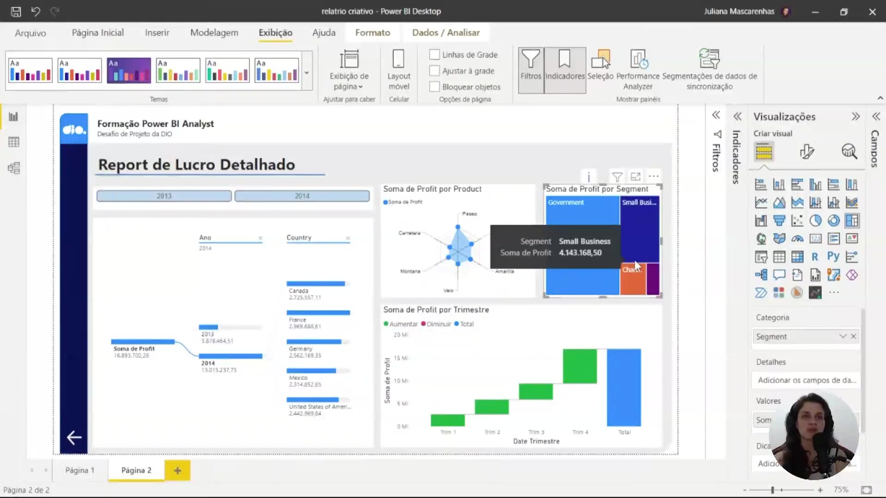

## Instrutor:

- Juliana Mascarenhas (Tech Education Specialist / Sócia (Content Creator) @SimplificandoRedes / Me Modelagem Computacional / Cientista de dados)
- Contato Linkedin: / [juliana-mascarenhas-ds](https://www.linkedin.com/in/juliana-mascarenhas-ds/)

### 🟩 Vídeo 01 - Entendendo o que deve ser Criado no Relatório do Desafio

<video width="60%" controls>
  <source src="000-Midia_e_Anexos/bootcamp_ntt_data-modulo.06-curso.04-video_01.webm" type="video/webm">
    Seu navegador não suporta vídeo HTML5.
</video>

link do vídeo: https://web.dio.me/lab/criando-um-relatorio-de-vendas-elegante-com-power-bi/learning/a9f091aa-5d5c-40c6-bb91-0aa2b30981c4?back=/track/engenharia-dados-python

Este guia resume as estratégias e técnicas apresentadas para transformar dados brutos em um relatório analítico de alto impacto. O foco vai além da simples exibição de números, priorizando a experiência do usuário (UX) e a profundidade da análise.

### Anotações

O objetivo deste projeto é a criação de um relatório analítico estruturado para fornecer uma visão clara e imediata da saúde financeira da empresa. A interface é composta por cartões na parte superior que exibem as métricas de alto nível (KPIs), como a soma de vendas, unidades vendidas, descontos e o valor bruto de vendas. Essa disposição permite que o usuário compreenda a situação geral rapidamente antes de decidir se aprofundar nos detalhes técnicos dos gráficos inferiores.

O relatório utiliza a base de dados *Financial Sample* do Power BI e inclui um segmentador de data no topo, permitindo filtrar todo o conjunto de dados para intervalos específicos. Abaixo dos KPIs, os dados são detalhados através de diferentes perspectivas:

* **Soma de Sales por Mês:** Gráfico de linhas para análise temporal.
* **Sale x Segmento:** Gráfico de rosca para distribuição por segmento.
* **Soma de Sales por Product:** Gráfico de barras horizontais.
* **Sales por País:** Mapa para visualização geográfica das vendas.

A interatividade é um ponto central deste relatório. Foram adicionados botões funcionais que permitem ao usuário alternar entre diferentes visões de um mesmo contexto. Por exemplo, no quadrante de vendas por segmento, é possível alternar entre a visualização de gráfico de rosca e gráfico de barras. Da mesma forma, no quadrante de vendas por país, o usuário pode escolher entre uma visualização em mapa ou em barras.

Além da alternância de visuais, o relatório conta com um botão de limpeza de filtros (ícone de borracha). No ambiente de desenvolvimento do Power BI Desktop, o acionamento dessas ações requer o uso da tecla `Ctrl` combinada ao clique, funcionalidade que se torna direta após a publicação no Power BI Service.

Para otimizar a experiência do usuário, os botões de seleção de gráfico (como "Bar Chart" e "Pie Chart") funcionam como gatilhos para alterar o que está sendo exibido na tela sem ocupar espaço adicional. Ao passar o mouse sobre esses botões, um aviso indica a necessidade de usar `Ctrl + clique` para seguir o link da ação configurada. Esse recurso de navegação interna torna o relatório dinâmico, permitindo que o consumidor escolha a forma de visualização que melhor atende à sua necessidade de análise no momento.

A estrutura da primeira página do relatório está completa, apresentando um layout equilibrado entre métricas agregadas e detalhamento visual. No canto inferior esquerdo, um botão de navegação (seta) é configurado para levar o usuário à segunda página do relatório. O design mantém uma paleta de cores consistente e utiliza recursos de segmentação para garantir que todos os visuais respondam simultaneamente aos filtros aplicados, mantendo a integridade da análise em diferentes períodos temporais.

A segunda página, intitulada "Report de Lucro Detalhado", foca na análise de rentabilidade e utiliza visuais personalizados para enriquecer a experiência analítica:

* **Chiclet Slicer:** Utilizado no topo para a seleção de anos (2013 e 2014), oferecendo uma interface de botões mais amigável que o segmentador padrão.
* **Gráfico de Radar (Radar Chart):** Exibe a soma de lucro por produto, permitindo identificar visualmente qual item possui a maior proporção de lucro.
* **Árvore Hierárquica (Decomposition Tree):** Localizada à esquerda, permite decompor a soma de lucro por ano e país de forma expansível.
* **Gráfico de Cascata (Waterfall Chart):** Demonstra a variação do lucro por trimestre, evidenciando aumentos e diminuições ao longo do tempo.
* **Treemap:** Categoriza o lucro por segmento, sendo ideal para visualizar proporções hierárquicas quando há múltiplos elementos.

Para avançar na customização do relatório, podem ser criados menus laterais retráteis. Utilizando formas, botões invisíveis e os painéis de **Seleção** e **Indicadores** (Bookmarks), é possível configurar ações para abrir e fechar painéis de filtros ou navegação. Essa técnica permite maximizar a área útil do relatório, escondendo controles de segmentação quando não estão em uso. A recomendação final é manter a coerência visual na paleta de cores e explorar as diversas ações de botões para tornar a navegação fluida e intuitiva para o usuário final.

### 🟩 Vídeo 02 - Criando elementos da Primeira Página do Relatório

<video width="60%" controls>
  <source src="000-Midia_e_Anexos/bootcamp_ntt_data-modulo.06-curso.04-video_02.webm" type="video/webm">
    Seu navegador não suporta vídeo HTML5.
</video>

link do vídeo: https://web.dio.me/lab/criando-um-relatorio-de-vendas-elegante-com-power-bi/learning/cc4d0da6-799a-466d-9589-d8f4732595c5

Este tutorial foca na construção da interface visual (UI) de um dashboard no Power BI, utilizando formas, cores e organização de elementos para criar um relatório profissional e intuitivo. O instrutor demonstra como preparar o "esqueleto" do dashboard antes de inserir os dados e gráficos reais.

### Anotações

      

### 🟩 Vídeo 03 - Criando Gráficos da Primeira Página do Relatório

<video width="60%" controls>
  <source src="000-Midia_e_Anexos/bootcamp_ntt_data-modulo.06-curso.04-video_03.webm" type="video/webm">
    Seu navegador não suporta vídeo HTML5.
</video>

link do vídeo:

### 🟩 Vídeo 04 - Criando o Segmentador e Visuais Alternativos

<video width="60%" controls>
  <source src="000-Midia_e_Anexos/bootcamp_ntt_data-modulo.06-curso.04-video_04.webm" type="video/webm">
    Seu navegador não suporta vídeo HTML5.
</video>

link do vídeo:

### 🟩 Vídeo 05 - Criando os Botões do Relatórios e utilizando Indicadores para Gravar Estado do Relatório

<video width="60%" controls>
  <source src="000-Midia_e_Anexos/bootcamp_ntt_data-modulo.06-curso.04-video_05.webm" type="video/webm">
    Seu navegador não suporta vídeo HTML5.
</video>

link do vídeo:

### 🟩 Vídeo 06 - Criando a Interação por Botões com a Segunda Página do Relatório

<video width="60%" controls>
  <source src="000-Midia_e_Anexos/bootcamp_ntt_data-modulo.06-curso.04-video_06.webm" type="video/webm">
    Seu navegador não suporta vídeo HTML5.
</video>

link do vídeo:

### 🟩 Vídeo 07 - Publicando Relatório no Power BI Service e Considerações Finais

<video width="60%" controls>
  <source src="000-Midia_e_Anexos/bootcamp_ntt_data-modulo.06-curso.04-video_07.webm" type="video/webm">
    Seu navegador não suporta vídeo HTML5.
</video>

link do vídeo:

### 🟩 Vídeo 08 - Entendendo o desafio

<video width="60%" controls>
  <source src="000-Midia_e_Anexos/bootcamp_ntt_data-modulo.06-curso.04-video_08.webm" type="video/webm">
    Seu navegador não suporta vídeo HTML5.
</video>

link do vídeo:

##  Materiais de Apoio

# Certificado: 

- Link na plataforma: 
- Certificado em pdf: